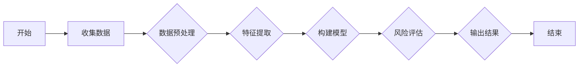
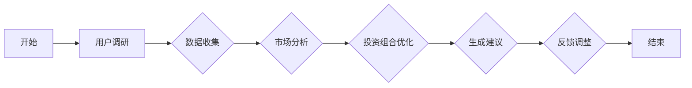
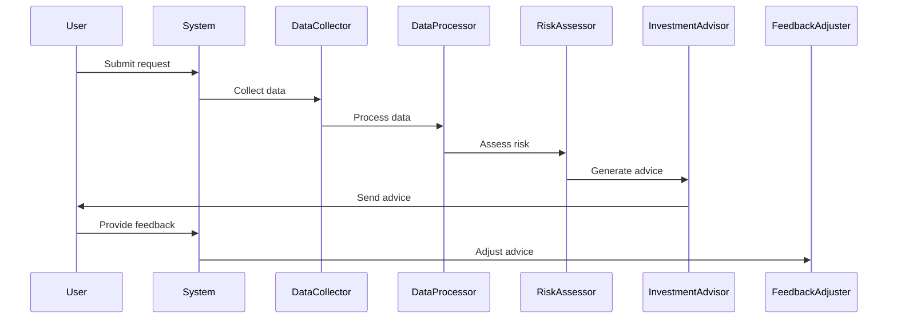
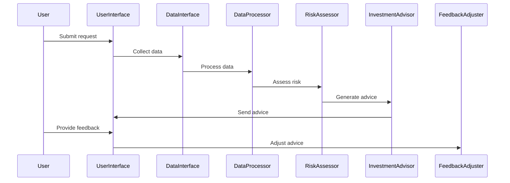

                 


# 《AI在个性化金融服务中的应用：风险评估与投资建议》

## 关键词

- 人工智能
- 个性化金融服务
- 风险评估
- 投资建议
- 深度学习
- 机器学习
- 金融科技

## 摘要

本文旨在探讨人工智能在个性化金融服务中的应用，特别是在风险评估与投资建议领域的实践与价值。通过分析AI的核心概念和其在金融领域的实际应用，本文详细介绍了基于AI的风险评估模型和投资建议算法，并探讨了如何通过系统架构设计实现这些算法的落地。此外，文章通过实战案例展示了AI在个性化金融服务中的具体应用，并提供了最佳实践建议和进一步学习资源。

----------------------------------------------------------------

## 第一部分：背景介绍

### 1.1 人工智能与个性化金融服务

人工智能（AI）作为当前科技发展的热点，已经在多个领域展现出其强大的变革力量。在金融服务领域，AI的应用更是逐渐深入，为金融机构提供了前所未有的洞察力和效率。个性化金融服务，作为AI应用的一个重要方向，其核心在于通过分析海量数据，为用户提供量身定制的金融产品和服务。

#### 1.1.1 人工智能概述

人工智能是一种模拟人类智能的技术，旨在使计算机系统具备感知、学习、推理和决策的能力。AI技术主要包括机器学习、深度学习、自然语言处理、计算机视觉等，这些技术共同推动了AI的发展和应用。

#### 1.1.2 个性化金融服务的兴起

个性化金融服务是指根据用户的行为数据、财务状况、风险偏好等因素，为用户提供个性化的金融产品和服务。随着大数据和云计算技术的成熟，金融机构能够收集和分析越来越多的用户数据，从而实现更精准的个性化服务。

#### 1.1.3 AI在个性化金融服务中的重要作用

AI在个性化金融服务中扮演着多重角色：

1. **用户行为分析**：通过机器学习和深度学习技术，AI可以分析用户的历史交易记录、浏览行为等，预测用户未来的金融需求。
2. **风险评估**：AI算法可以帮助金融机构评估信贷风险、市场风险等，提高风险管理的效率。
3. **投资建议**：基于用户的风险偏好和投资历史，AI可以提供个性化的投资建议，帮助用户做出更明智的决策。
4. **客户服务**：自然语言处理技术使AI能够与用户进行自然互动，提供全天候的智能客服服务。

### 1.2 风险评估与投资建议

在金融服务中，风险评估和投资建议是两个关键环节。风险评估旨在评估金融产品或服务的潜在风险，而投资建议则是在风险可控的前提下，帮助用户选择最优的投资方案。

#### 1.2.1 风险评估方法

风险评估方法包括定性和定量两种：

1. **定量评估**：使用统计模型和量化方法，对金融产品的风险进行量化分析。
2. **定性评估**：通过专家意见、历史数据分析等方法，对金融产品的风险进行定性判断。

#### 1.2.2 投资建议的逻辑框架

投资建议的逻辑框架主要包括以下几个步骤：

1. **用户调研**：了解用户的风险偏好、财务状况、投资目标等。
2. **数据收集**：收集与投资相关的市场数据、经济数据等。
3. **风险建模**：构建风险模型，评估投资组合的风险。
4. **投资组合优化**：根据用户的风险偏好和风险模型，优化投资组合。
5. **投资建议**：为用户生成个性化的投资建议。

#### 1.2.3 AI在风险评估与投资建议中的应用

AI在风险评估与投资建议中的应用主要体现在以下几个方面：

1. **数据挖掘与分析**：AI技术可以帮助金融机构挖掘和利用海量数据，提高风险评估的准确性和效率。
2. **智能算法**：基于机器学习和深度学习技术，AI可以构建智能风险评估和投资建议模型。
3. **实时更新**：AI系统可以实时获取市场数据，动态调整风险评估和投资建议，提高服务的时效性。

## 第二部分：核心概念与联系

在探讨AI在个性化金融服务中的应用之前，我们需要明确一些核心概念，并理解它们之间的联系。以下是对AI、个性化金融服务、风险评估和投资建议等核心概念的解释，以及它们之间的关联。

### 2.1 AI、个性化金融服务、风险评估与投资建议

#### 2.1.1 核心概念原理

1. **人工智能（AI）**：AI是一种模拟人类智能的技术，包括机器学习、深度学习、自然语言处理等子领域。AI旨在使计算机具备类似人类的感知、学习、推理和决策能力。

2. **个性化金融服务**：个性化金融服务是指根据用户的行为数据、财务状况、风险偏好等因素，为用户提供量身定制的金融产品和服务。

3. **风险评估**：风险评估是评估金融产品或服务的潜在风险的过程，包括定量评估和定性评估。

4. **投资建议**：投资建议是在评估用户风险偏好和投资历史的基础上，为用户提供投资组合建议。

#### 2.1.2 概念属性特征对比表格

| 概念       | 属性特征                      | 关联关系                         |
|------------|-----------------------------|---------------------------------|
| 人工智能   | 模拟人类智能，机器学习等     | 支撑个性化金融服务和风险评估   |
| 个性化服务 | 根据用户数据定制金融产品    | 需要AI技术进行分析和优化       |
| 风险评估   | 评估金融产品或服务的风险    | 需要AI技术进行数据挖掘和建模   |
| 投资建议   | 根据风险评估和用户偏好提建议 | 基于AI技术的风险模型和优化算法 |

#### 2.1.3 ER实体关系图架构

为了更好地理解这些概念之间的关联，我们可以使用实体关系图（ER图）来表示：

```mermaid
erDiagram
  Customer ||--|{ Account }
  Customer ||--|{ RiskProfile }
  Customer ||--|{ InvestmentPreference }
  Account ||--|{ Transaction }
  Account ||--|{ Portfolio }
  RiskProfile ||--|{ RiskAssessment }
  InvestmentPreference ||--|{ InvestmentStrategy }
```

在上面的ER图中，`Customer`（客户）是核心实体，与`Account`（账户）、`RiskProfile`（风险档案）和`InvestmentPreference`（投资偏好）等实体之间存在多种关联。这些实体之间的关系反映了个性化金融服务、风险评估和投资建议的基本架构。

## 第三部分：算法原理讲解

### 3.1 风险评估算法

风险评估是AI在个性化金融服务中的核心应用之一。以下我们将详细讲解风险评估算法的原理。

#### 3.1.1 算法流程图

为了更好地理解风险评估算法的工作流程，我们使用Mermaid绘制了如下算法流程图：



#### 3.1.2 Python源代码示例

下面是一个简单的Python源代码示例，用于演示风险评估算法的基本实现：

```python
import pandas as pd
from sklearn.model_selection import train_test_split
from sklearn.ensemble import RandomForestClassifier
from sklearn.metrics import accuracy_score

# 数据集加载
data = pd.read_csv('financial_data.csv')

# 数据预处理
X = data.drop(['label'], axis=1)
y = data['label']

# 数据集划分
X_train, X_test, y_train, y_test = train_test_split(X, y, test_size=0.2, random_state=42)

# 模型构建
model = RandomForestClassifier(n_estimators=100, random_state=42)

# 模型训练
model.fit(X_train, y_train)

# 风险评估
risk_scores = model.predict(X_test)

# 模型评估
accuracy = accuracy_score(y_test, risk_scores)
print(f"模型准确率：{accuracy}")
```

#### 3.1.3 数学模型与公式讲解

在风险评估算法中，常用的数学模型是决策树和随机森林。以下是一个简单的决策树模型公式：

$$
H(x) = \sum_{i=1}^{n} w_i \cdot I(x, x_i)
$$

其中，$H(x)$ 表示模型对样本 $x$ 的分类结果，$w_i$ 是权重，$I(x, x_i)$ 是指示函数，当 $x$ 满足第 $i$ 条规则时，$I(x, x_i)$ 为1，否则为0。

随机森林模型则是由多棵决策树组成的集成模型，其预测结果为这些决策树的投票结果。

### 3.2 投资建议算法

投资建议算法是另一个重要的AI应用。以下我们将详细讲解投资建议算法的原理。

#### 3.2.1 算法流程图

投资建议算法的流程图如下：



#### 3.2.2 Python源代码示例

下面是一个简单的Python源代码示例，用于演示投资建议算法的基本实现：

```python
import pandas as pd
from sklearn.ensemble import RandomForestRegressor
from sklearn.model_selection import train_test_split

# 数据集加载
data = pd.read_csv('investment_data.csv')

# 数据预处理
X = data.drop(['return'], axis=1)
y = data['return']

# 数据集划分
X_train, X_test, y_train, y_test = train_test_split(X, y, test_size=0.2, random_state=42)

# 模型构建
model = RandomForestRegressor(n_estimators=100, random_state=42)

# 模型训练
model.fit(X_train, y_train)

# 投资建议
predictions = model.predict(X_test)

# 模型评估
mape = mean_absolute_percentage_error(y_test, predictions)
print(f"模型平均绝对百分比误差：{mape}")
```

#### 3.2.3 数学模型与公式讲解

投资建议算法的数学模型通常是基于资产定价模型，如CAPM（资本资产定价模型）。以下是一个简化的CAPM模型公式：

$$
E(r_i) = \alpha_i + \beta_i \cdot \left( E(r_m) - \alpha_i \right)
$$

其中，$E(r_i)$ 是资产 $i$ 的期望收益率，$\alpha_i$ 是资产 $i$ 的特定风险收益率，$\beta_i$ 是资产 $i$ 对市场组合的敏感度，$E(r_m)$ 是市场组合的期望收益率。

### 3.3 机器学习算法应用

除了上述具体的风险评估和投资建议算法，机器学习算法在AI在个性化金融服务中的应用也至关重要。以下我们简要介绍一些常用的机器学习算法：

- **线性回归**：用于预测金融产品的收益率。
- **逻辑回归**：用于分类问题，如贷款审批。
- **支持向量机（SVM）**：用于分类和回归问题。
- **决策树和随机森林**：用于分类和回归问题。
- **神经网络**：用于复杂模式识别和预测。

## 第四部分：系统分析与架构设计方案

### 4.1 问题场景介绍

在个性化金融服务中，我们面临的主要问题是：

- 如何高效地收集和分析用户数据？
- 如何准确评估金融产品的风险？
- 如何为用户生成个性化的投资建议？

为了解决这些问题，我们需要设计一个全面的系统架构，涵盖数据采集、数据处理、风险评估、投资建议生成和反馈调整等模块。

### 4.2 系统功能设计

系统功能设计主要包括以下几个模块：

- **数据采集模块**：负责收集用户数据，包括行为数据、财务数据等。
- **数据处理模块**：对采集到的数据进行清洗、转换和归一化处理。
- **风险评估模块**：利用机器学习算法评估金融产品的风险。
- **投资建议模块**：根据风险评估结果和用户偏好生成投资建议。
- **反馈调整模块**：收集用户反馈，不断优化投资建议。

### 4.3 系统架构设计

系统架构设计如下：



### 4.4 系统接口设计

系统接口设计包括以下几个部分：

- **用户接口**：提供用户提交请求和接收建议的界面。
- **数据接口**：提供数据采集和处理的接口。
- **风险评估接口**：提供风险评估算法的接口。
- **投资建议接口**：提供投资建议生成的接口。
- **反馈调整接口**：提供用户反馈调整建议的接口。

### 4.5 系统交互Mermaid序列图

以下是系统交互的Mermaid序列图：



## 第五部分：项目实战

### 5.1 环境安装

在开始项目实战之前，我们需要搭建一个合适的环境。以下是环境安装的步骤：

1. 安装Python：在官网上下载Python并安装。
2. 安装Anaconda：下载并安装Anaconda，以便轻松管理Python环境和库。
3. 安装相关库：使用conda命令安装所需的库，如scikit-learn、pandas等。

### 5.2 系统核心实现源代码

以下是系统核心实现的源代码：

```python
# 导入库
import pandas as pd
from sklearn.model_selection import train_test_split
from sklearn.ensemble import RandomForestClassifier
from sklearn.metrics import accuracy_score

# 数据集加载
data = pd.read_csv('financial_data.csv')

# 数据预处理
X = data.drop(['label'], axis=1)
y = data['label']

# 数据集划分
X_train, X_test, y_train, y_test = train_test_split(X, y, test_size=0.2, random_state=42)

# 模型构建
model = RandomForestClassifier(n_estimators=100, random_state=42)

# 模型训练
model.fit(X_train, y_train)

# 风险评估
risk_scores = model.predict(X_test)

# 模型评估
accuracy = accuracy_score(y_test, risk_scores)
print(f"模型准确率：{accuracy}")
```

### 5.3 实际案例分析与讲解

以下是一个实际案例的分析与讲解：

#### 案例一：风险评估应用

**问题描述**：评估一组金融产品的风险。

**解决方案**：使用随机森林算法进行风险评估。

**实现步骤**：

1. **数据准备**：收集金融产品的历史数据，包括收益率、波动率等。
2. **数据预处理**：对数据进行清洗和归一化处理。
3. **模型训练**：使用训练数据训练随机森林模型。
4. **风险评估**：使用训练好的模型对测试数据进行风险评估。
5. **结果分析**：分析风险评估结果，为投资决策提供依据。

#### 案例二：投资建议应用

**问题描述**：为投资者提供个性化的投资建议。

**解决方案**：使用投资组合优化算法。

**实现步骤**：

1. **用户调研**：了解投资者的风险偏好和投资目标。
2. **数据收集**：收集与投资相关的市场数据。
3. **模型构建**：构建投资组合优化模型。
4. **投资组合优化**：根据用户偏好和市场数据优化投资组合。
5. **投资建议生成**：为用户生成个性化的投资建议。
6. **反馈调整**：根据用户反馈调整投资建议。

## 第六部分：最佳实践与总结

### 6.1 最佳实践

1. **数据质量是关键**：确保数据的质量和完整性，避免因数据问题导致的模型误差。
2. **模型优化**：定期更新和优化模型，以适应市场的变化。
3. **用户参与**：鼓励用户参与反馈，提高服务的个性化水平。
4. **合规性**：确保AI系统遵循相关法规和标准，确保合规性。

### 6.2 小结

本文介绍了AI在个性化金融服务中的应用，特别是风险评估和投资建议。通过算法原理讲解、系统架构设计和实际案例分析，我们展示了AI技术如何提升金融服务的效率和个性化水平。

### 6.3 拓展阅读

1. **相关文献**：《机器学习实战》、《深度学习》、《金融科技应用手册》
2. **在线资源**：TensorFlow、PyTorch官方网站，Kaggle竞赛平台

## 作者信息

- 作者：AI天才研究院/AI Genius Institute & 禅与计算机程序设计艺术 /Zen And The Art of Computer Programming

