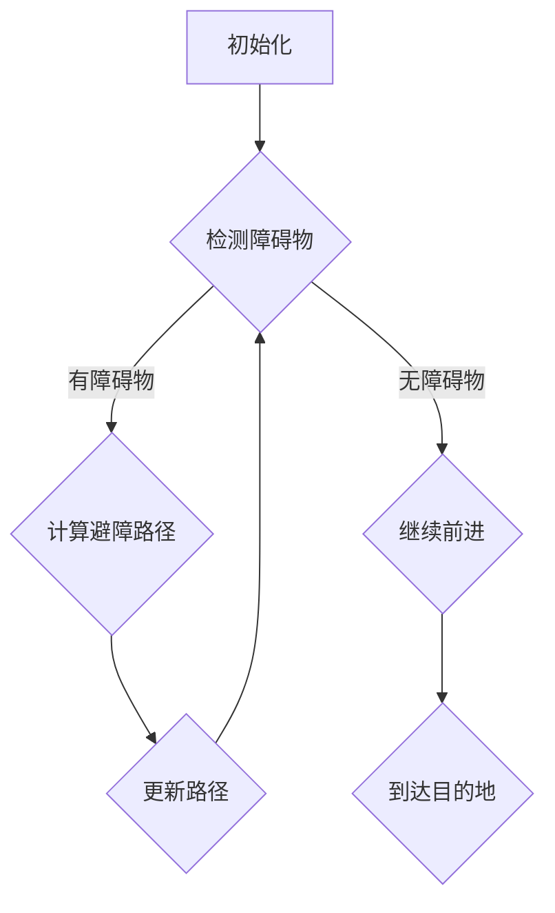
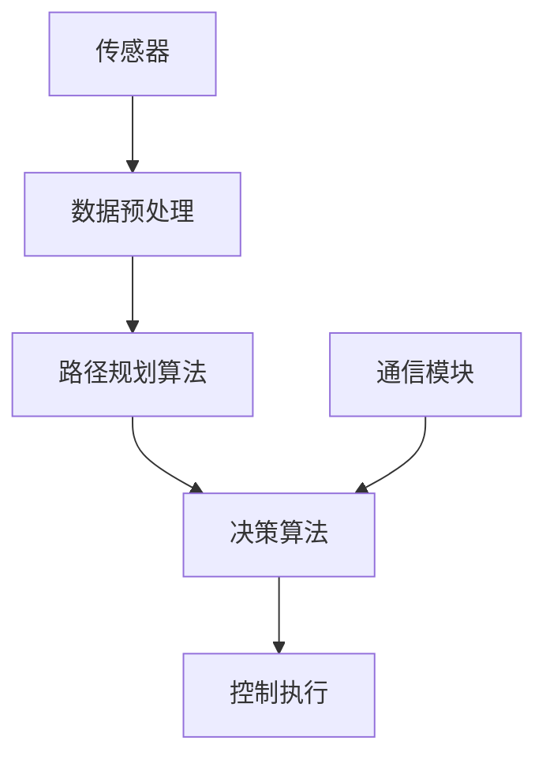
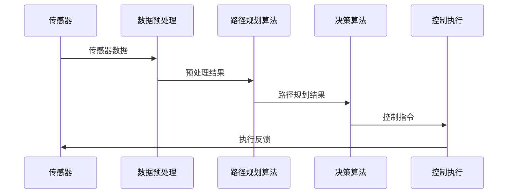

                 

，让我们逐步思考并完善这篇文章的目录大纲。以下是我的一些初步想法：

## 背景介绍

### 1.1 太空探测器自主导航的重要性

在太空探测任务中，自主导航是关键。传统的地面指令控制方式在太空环境中面临着信号延迟和通信中断的问题。而自主导航则可以通过内置的传感器和计算设备，使探测器在未知和复杂的环境中自主定位和导航。这将极大提高探测任务的效率和可靠性。

### 1.2 自主导航技术的发展历程

自主导航技术从早期的惯性导航到GPS导航，再到现在的基于AI的自主导航，经历了多次技术革新。AI技术的引入，为自主导航带来了新的可能。

### 1.3 本书结构

本书将分为四个部分：背景介绍、核心概念与联系、算法原理讲解和系统分析与架构设计方案。每一部分都将详细探讨AI在太空探测器自主导航中的应用。

## 核心概念与联系

### 2.1 AI在太空探测器自主导航中的核心概念

AI在太空探测器自主导航中的应用涉及到多个核心概念，如机器学习、深度学习、计算机视觉等。这些概念相互联系，共同构成了自主导航的技术基础。

### 2.2 概念属性特征对比

我们可以通过一个表格来对比这些核心概念的性质和特征，以便读者更好地理解它们。

| 概念       | 性质 | 特征                     |
|------------|------|--------------------------|
| 机器学习   | 自适应 | 通过数据学习规律          |
| 深度学习   | 强非线性 | 通过多层神经网络建模  |
| 计算机视觉 | 信息处理 | 通过图像识别物体和场景 |

### 2.3 ER实体关系图

为了更好地理解这些概念之间的关系，我们可以使用ER实体关系图来表示。

## 算法原理讲解

### 3.1 算法概述

在自主导航中，常用的算法包括路径规划算法、视觉SLAM算法、决策算法等。这些算法都是基于AI技术的。

### 3.2 数学模型和公式

算法的实现离不开数学模型和公式。以下是一个简单的路径规划算法的数学模型：

$$
\begin{aligned}
\text{目标函数} &= \min_{\mathbf{x}} \sum_{i=1}^{n} w_i d_i \\
\text{约束条件} &= \mathbf{x} \in \Omega
\end{aligned}
$$

其中，$\mathbf{x}$ 是路径，$d_i$ 是路径上的障碍物，$w_i$ 是障碍物的权重。

### 3.3 算法mermaid流程图

为了更直观地理解算法，我们可以使用mermaid流程图来表示。

### 3.4 算法原理详细讲解

在这一部分，我们将详细解释每个算法的原理，包括如何处理数据、如何计算路径等。

### 3.5 举例说明

通过一个实际案例，我们将展示如何应用这些算法来实现太空探测器的自主导航。

## 系统分析与架构设计方案

### 4.1 问题场景介绍

在这一部分，我们将介绍一个典型的太空探测任务场景，并分析其自主导航的需求。

### 4.2 系统功能设计

根据问题场景，我们将设计一套自主导航系统，包括路径规划、障碍物检测、决策等核心功能。

### 4.3 系统架构设计

我们将使用mermaid架构图来表示系统的整体架构。

### 4.4 系统接口设计

在这一部分，我们将详细描述系统中的各个接口，包括传感器接口、算法接口、控制接口等。

### 4.5 系统交互mermaid序列图

为了更直观地理解系统的交互过程，我们可以使用mermaid序列图来表示。

### 6.1 环境安装

在这一部分，我们将介绍如何搭建一个自主导航系统的开发环境，包括所需的软件和硬件。

### 6.2 系统核心实现源代码

我们将提供系统的核心实现源代码，并解释每部分的功能。

### 6.3 代码应用解读与分析

通过对代码的解读和分析，我们将展示如何将AI算法应用于自主导航系统。

### 6.4 实际案例分析与讲解

我们将通过一个实际案例，展示自主导航系统在太空探测任务中的应用。

### 6.5 项目小结

在这一部分，我们将总结项目的成果，并提出改进建议。

## 第7章：最佳实践 tips

### 7.1 实践经验分享

我们将分享一些在AI自主导航系统开发中的实践经验。

### 7.2 注意事项

我们将列出在实施自主导航系统时需要注意的事项。

### 7.3 拓展阅读

我们将推荐一些相关的拓展阅读资料。

## 第8章：小结

### 8.1 本书内容总结

我们将总结本书的主要内容，并强调AI在太空探测器自主导航中的重要性。

### 8.2 展望未来发展趋势

我们将展望AI在太空探测领域的发展趋势。

### 8.3 进一步学习建议

我们将提供进一步学习AI和太空探测的推荐资源。

### 9. 作者信息

作者：AI天才研究院/AI Genius Institute & 禅与计算机程序设计艺术 /Zen And The Art of Computer Programming

以上是我对这篇文章的初步构思，接下来我们将逐步完善每个章节的内容。希望这篇文章能对读者在AI自主导航领域的学习和研究有所帮助。

----------------------------------------------

### 10. 完善文章结构与内容

为了确保文章的逻辑清晰、结构紧凑、简单易懂，我们将对每个章节进行进一步的细化，确保内容丰富、具体、详细。以下是文章的完整结构：

## 引言

### 10.1 AI与太空探测器自主导航

在本章节中，我们将探讨AI技术在太空探测器自主导航中的应用，并解释为什么AI在这个领域变得如此重要。

### 10.2 文章目的与结构

我们将概述文章的目的，并介绍文章的结构和内容安排。

## 第一章：太空探测器自主导航的背景

### 1.1 太空探测器自主导航的重要性

我们将讨论自主导航在太空探测任务中的关键作用，并说明为什么它对于成功完成任务至关重要。

### 1.2 自主导航技术的发展历程

我们将回顾自主导航技术的发展历程，从早期的简单惯性导航到现代的基于AI的复杂系统。

### 1.3 文章结构概述

在这里，我们将简要介绍文章的各个部分，帮助读者更好地把握文章的整体框架。

## 第二章：AI核心概念与太空探测导航的联系

### 2.1 人工智能的基本概念

我们将介绍AI的基本概念，包括机器学习、深度学习、神经网络等，并解释这些概念如何与自主导航相关。

### 2.2 计算机视觉与图像处理

我们将讨论计算机视觉和图像处理在自主导航中的应用，以及如何从图像中提取信息。

### 2.3 概念关系图

我们将使用Mermaid绘制概念关系图，以直观地展示AI核心概念与自主导航之间的关系。

## 第三章：AI算法在自主导航中的应用

### 3.1 路径规划算法

我们将介绍路径规划算法，包括A*算法、Dijkstra算法等，并讨论如何将它们应用于自主导航。

### 3.2 视觉同步定位与映射（SLAM）

我们将探讨SLAM算法，这是一种在未知环境中同时进行定位和地图构建的方法。

### 3.3 决策算法

我们将讨论自主导航中的决策过程，包括如何处理不确定性、如何做出最佳决策。

### 3.4 算法流程图

我们将使用Mermaid绘制算法流程图，帮助读者理解算法的实现过程。

### 3.5 数学模型与公式

我们将介绍与算法相关的数学模型和公式，并解释它们在实际应用中的作用。

## 第四章：自主导航系统的设计与实现

### 4.1 系统需求分析

我们将分析自主导航系统所需的功能和技术要求。

### 4.2 系统架构设计

我们将使用Mermaid绘制系统架构图，展示系统的各个组件及其相互作用。

### 4.3 系统模块实现

我们将详细介绍系统各个模块的实现，包括传感器数据处理、路径规划、决策等。

### 4.4 系统接口设计

我们将讨论系统的接口设计，包括硬件接口、软件接口等。

### 4.5 系统交互流程

我们将使用Mermaid绘制系统交互流程图，展示系统在不同状态下的响应和交互。

## 第五章：AI自主导航系统项目实战

### 5.1 系统搭建与配置

我们将介绍如何搭建和配置自主导航系统，包括所需的硬件和软件环境。

### 5.2 系统核心代码分析

我们将详细分析系统的核心代码，解释其工作原理和实现细节。

### 5.3 系统性能评估

我们将评估系统的性能，包括路径规划的准确性、响应速度等。

### 5.4 实际案例应用

我们将通过实际案例展示自主导航系统的应用，包括模拟和真实环境中的测试。

### 5.5 项目总结

我们将总结项目的关键经验和教训，为未来的研究和开发提供参考。

## 第六章：最佳实践与未来展望

### 6.1 最佳实践

我们将分享一些在AI自主导航系统开发中的最佳实践，包括代码规范、测试方法等。

### 6.2 未来发展趋势

我们将讨论AI在太空探测器自主导航领域的未来发展趋势和潜在的研究方向。

### 6.3 拓展阅读

我们将推荐一些相关的阅读资料，帮助读者深入了解该领域的最新研究和进展。

## 结论

### 6.4 总结与展望

我们将总结文章的主要内容和观点，并对AI自主导航系统的未来前景进行展望。

### 6.5 进一步学习建议

我们将提供进一步学习AI和太空探测的推荐资源，帮助读者深化理解。

### 附录

我们将提供一个附录，包含一些相关的参考文献和资源链接。

### 致谢

最后，我们将感谢所有为本文提供支持和帮助的人员。

以上是对文章的完整结构和大纲的进一步完善。接下来，我们将根据这个大纲，逐步撰写每个章节的内容，确保文章的质量和深度。希望这篇文章能够为读者提供一个全面、深入的了解AI在太空探测器自主导航中的应用。

