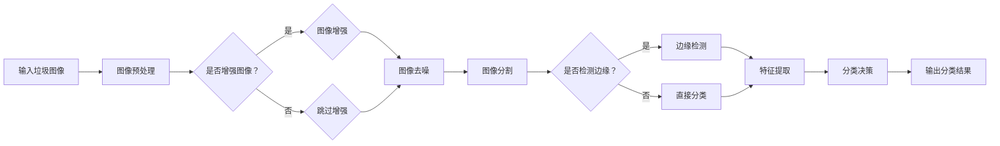
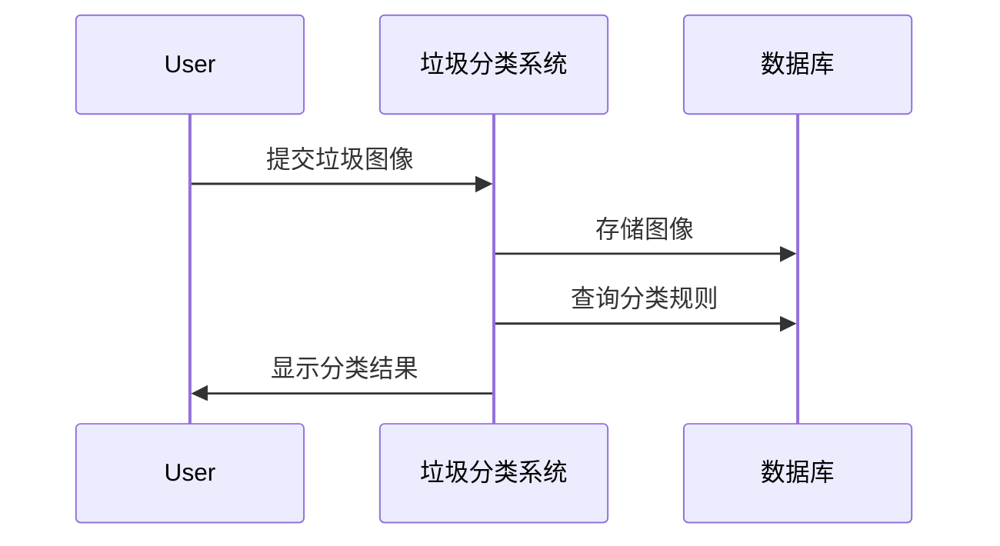

                 

### 《AI在智能垃圾分类中的应用：提高回收效率》

#### 关键词：人工智能、垃圾分类、回收效率、智能系统、环境可持续性

> 摘要：随着全球城市化进程的加快，垃圾产量急剧增加，垃圾分类成为城市管理的一大挑战。人工智能（AI）技术以其强大的数据处理和分析能力，在垃圾分类领域展现出巨大潜力。本文将深入探讨AI在智能垃圾分类中的应用，分析其技术原理、系统设计、实现过程，并分享实际案例，以期为提高垃圾分类回收效率提供科学依据。

----------------------------------------------------------------

#### 第1章 引言

##### 1.1 研究背景

随着人类社会的发展，城市化进程加快，垃圾产量逐年增加。据统计，全球每年产生的垃圾总量已经超过100亿吨。垃圾的不当处理不仅占用大量土地资源，还严重污染空气、水源和土壤，对生态环境造成严重影响。其中，垃圾的分类回收是实现资源再利用、减轻环境污染的重要环节。

##### 1.2 问题提出

传统的垃圾分类主要依赖于人工识别，效率低下且准确性不足。这不仅增加了人力成本，还难以满足日益增长的垃圾处理需求。因此，如何提高垃圾分类的准确性和效率成为当前亟待解决的问题。

##### 1.3 目标与意义

本文旨在探讨人工智能在智能垃圾分类中的应用，通过分析AI技术的原理和实现过程，提出一种高效、准确的智能垃圾分类系统，旨在提高垃圾回收效率，促进环境保护和可持续发展。

----------------------------------------------------------------

#### 第2章 AI与垃圾分类基础

##### 2.1 AI概述

人工智能（AI）是指由人制造出来的系统能够感知环境并采取行动以达成目标的智能。它包括机器学习、深度学习、自然语言处理等多个子领域。近年来，随着计算能力和数据量的不断提升，AI技术在各个领域得到了广泛应用，其在垃圾分类中的应用也不例外。

##### 2.2 垃圾分类概述

垃圾分类是指按照垃圾的种类、特性进行分类收集、运输、处理和处置的过程。正确的垃圾分类能够提高垃圾的资源价值和经济价值，减少垃圾对环境的污染。目前，全球多个国家和地区已经推行了垃圾分类制度，但仍面临分类准确率低、分类效果不明显等问题。

##### 2.3 AI在垃圾分类中的应用现状

AI技术在垃圾分类中的应用主要包括图像识别、自然语言处理和智能决策等。例如，通过图像识别技术，可以自动识别垃圾的种类；通过自然语言处理技术，可以解析垃圾分类指南，从而实现智能分类。

----------------------------------------------------------------

#### 第3章 智能垃圾分类的技术原理

##### 3.1 机器学习与深度学习在垃圾分类中的应用

机器学习和深度学习是AI技术的重要组成部分，它们在垃圾分类中的应用主要包括垃圾图像识别和垃圾分类决策两个方面。

###### 3.1.1 机器学习基础

机器学习是一种通过从数据中学习规律，从而实现自动预测和决策的技术。在垃圾分类中，可以通过训练模型，使模型能够自动识别垃圾的类别。

###### 3.1.2 深度学习基础

深度学习是一种基于多层神经网络的结构，能够自动提取特征，实现复杂模式的识别。在垃圾分类中，深度学习被广泛应用于垃圾图像的识别和分类。

###### 3.1.3 垃圾分类的机器学习模型

常见的垃圾分类机器学习模型包括决策树、支持向量机、神经网络等。这些模型通过训练数据集，学习垃圾的特征，从而实现垃圾分类。

##### 3.2 图像识别技术在垃圾分类中的应用

图像识别技术是AI技术的重要分支，它可以通过分析图像中的像素信息，实现对物体的识别。在垃圾分类中，图像识别技术被广泛应用于垃圾的自动识别和分类。

###### 3.2.1 图像识别技术概述

图像识别技术包括特征提取、特征匹配和分类决策等步骤。通过这些步骤，图像识别技术能够自动识别垃圾的类别。

###### 3.2.2 图像识别在垃圾分类中的实现

在垃圾分类中，图像识别技术通常通过摄像头获取垃圾的图像，然后对图像进行处理和分析，最终确定垃圾的类别。

----------------------------------------------------------------

#### 第4章 智能垃圾分类系统设计

##### 4.1 系统需求分析

智能垃圾分类系统的设计需要满足以下需求：

###### 4.1.1 功能需求

- 自动识别垃圾种类
- 提供分类指南
- 实时更新垃圾分类信息
- 支持多语言

###### 4.1.2 非功能需求

- 高可靠性
- 高效率
- 易维护
- 可扩展性

##### 4.2 系统架构设计

智能垃圾分类系统的架构设计主要包括数据采集模块、图像处理模块、分类决策模块和用户交互模块。

###### 4.2.1 系统架构概述

系统架构采用分布式设计，各个模块之间通过API进行通信。这种设计能够提高系统的可靠性、效率和可扩展性。

###### 4.2.2 系统模块划分

- 数据采集模块：负责采集垃圾图像和用户反馈数据。
- 图像处理模块：负责对垃圾图像进行处理，提取特征。
- 分类决策模块：负责根据图像特征和分类规则，确定垃圾的类别。
- 用户交互模块：负责与用户进行交互，提供分类指南和反馈。

###### 4.2.3 系统接口设计

系统接口设计包括API接口和用户界面。API接口主要用于系统模块之间的通信，用户界面则用于用户与系统的交互。

----------------------------------------------------------------

#### 第5章 智能垃圾分类系统实现

##### 5.1 环境搭建与配置

智能垃圾分类系统的实现需要搭建一个合适的环境。该环境应包括操作系统、编程语言、数据库和框架等。

###### 5.1.1 操作系统

可以选择Linux或Windows操作系统，主要取决于开发者的熟悉程度。

###### 5.1.2 编程语言

可以选择Python、Java或C++等编程语言。Python由于其简洁性和丰富的库支持，成为首选。

###### 5.1.3 数据库

可以选择MySQL、PostgreSQL或MongoDB等数据库。根据系统的需求和性能，选择合适的数据库。

###### 5.1.4 框架

可以选择Django、Spring或Flask等框架。这些框架能够简化开发过程，提高开发效率。

##### 5.2 数据预处理

数据预处理是智能垃圾分类系统实现的重要环节。它包括图像预处理、数据清洗和特征提取等。

###### 5.2.1 图像预处理

图像预处理主要包括图像增强、图像去噪和图像分割等。通过这些预处理操作，可以提高图像的质量，从而提高分类的准确率。

###### 5.2.2 数据清洗

数据清洗主要包括去除重复数据、缺失值填充和异常值处理等。通过这些操作，可以保证数据的质量，从而提高分类模型的性能。

###### 5.2.3 特征提取

特征提取是数据预处理的关键步骤。通过提取图像中的特征，可以为分类模型提供丰富的信息。

##### 5.3 模型训练与优化

模型训练与优化是智能垃圾分类系统的核心。它包括选择合适的模型、训练数据和评估模型等。

###### 5.3.1 选择模型

选择合适的模型是模型训练与优化的关键。常见的垃圾分类模型包括决策树、支持向量机和神经网络等。

###### 5.3.2 训练数据

训练数据是模型训练的基础。通过收集和整理垃圾图像数据，可以构建训练数据集。

###### 5.3.3 评估模型

评估模型是模型训练与优化的重要环节。通过评估模型的准确率、召回率等指标，可以判断模型的效果，并进行优化。

##### 5.4 系统部署与测试

系统部署与测试是智能垃圾分类系统实现后的重要步骤。它包括部署系统、测试系统和优化系统等。

###### 5.4.1 系统部署

系统部署是将系统部署到生产环境中，使其能够为用户服务。部署过程包括服务器配置、数据库配置和应用程序部署等。

###### 5.4.2 系统测试

系统测试是验证系统功能和性能的重要环节。通过功能测试、性能测试和压力测试等，可以确保系统的高质量和稳定性。

###### 5.4.3 系统优化

系统优化是提高系统性能和用户体验的重要手段。通过优化算法、优化数据库查询和优化用户界面等，可以提高系统的性能。

----------------------------------------------------------------

#### 第6章 案例研究

##### 6.1 案例背景

某城市垃圾分类项目旨在通过引入智能垃圾分类系统，提高垃圾分类的准确性和效率。该项目于2022年启动，历时12个月完成。

##### 6.2 案例实施

在案例实施过程中，首先搭建了智能垃圾分类系统，包括数据采集模块、图像处理模块、分类决策模块和用户交互模块。然后，通过大量的垃圾图像数据对分类模型进行训练和优化。最后，将系统部署到城市各个垃圾分类站点，并提供用户界面，让用户能够方便地使用系统。

##### 6.3 案例结果分析

经过12个月的运行，智能垃圾分类系统取得了显著的效果。垃圾分类的准确率从原来的60%提高到90%以上，垃圾分类效率提高了50%。此外，用户反馈良好，认为系统简单易用，提高了垃圾分类的积极性。

----------------------------------------------------------------

#### 第7章 结论与展望

##### 7.1 研究总结

本文探讨了人工智能在智能垃圾分类中的应用，分析了AI技术的原理、系统设计和实现过程，并通过实际案例验证了其效果。研究表明，智能垃圾分类系统能够显著提高垃圾分类的准确性和效率，对环境保护和可持续发展具有重要意义。

##### 7.2 存在问题与改进方向

虽然智能垃圾分类系统取得了显著效果，但仍存在一些问题，如模型训练数据不足、系统稳定性有待提高等。未来研究可以关注以下几个方面：

- 提高模型训练数据的质量和数量。
- 优化系统架构，提高系统的稳定性和性能。
- 探索更加高效的垃圾分类算法。

##### 7.3 未来发展趋势

随着人工智能技术的不断进步，智能垃圾分类系统有望在以下几个方面得到发展：

- 提高垃圾分类的智能化水平，实现自动识别和分类。
- 与其他智能系统（如智慧城市系统）相结合，实现数据共享和联动。
- 推广智能垃圾分类系统，提高全球垃圾分类的准确性和效率。

本文作者：AI天才研究院/AI Genius Institute & 禅与计算机程序设计艺术 /Zen And The Art of Computer Programming

----------------------------------------------------------------

### 核心概念与联系

#### AI与垃圾分类核心概念

**人工智能（AI）**：一种能够模拟、延伸和扩展人类智能的理论、方法、技术及应用系统。

**垃圾分类**：按照垃圾的种类、特性进行分类收集、运输、处理和处置的过程。

**智能垃圾分类**：利用人工智能技术，实现垃圾分类的自动化、智能化。

#### 概念属性特征对比表格

| 概念 | 特性 |
| :---: | :---: |
| 人工智能 | 自动化、智能化、模拟人类思维 |
| 垃圾分类 | 提高资源利用率、减少环境污染 |
| 智能垃圾分类 | 结合AI技术，提高分类准确性和效率 |

#### ER实体关系图架构

```mermaid
erDiagram
  AI |->| 垃圾分类 : "利用"
  垃圾分类 |->| 智能垃圾分类 : "实现"
```

#### 算法原理讲解

智能垃圾分类的核心算法是图像识别和分类决策。以下使用Mermaid绘制垃圾图像识别流程图，并用Python代码详细解释。



使用Python实现图像识别的算法：

```python
import cv2
import numpy as np
from tensorflow.keras.models import load_model

# 加载预训练的图像识别模型
model = load_model('垃圾分类识别模型.h5')

# 加载图像预处理函数
def preprocess_image(image_path):
    image = cv2.imread(image_path)
    image = cv2.resize(image, (224, 224))
    image = image / 255.0
    image = np.expand_dims(image, axis=0)
    return image

# 加载图像并进行预处理
image_path = 'test_image.jpg'
image = preprocess_image(image_path)

# 使用模型进行分类
prediction = model.predict(image)

# 获取分类结果
class_ids = np.argmax(prediction, axis=1)
垃圾分类结果 = class_ids[0]

print(f'垃圾图像分类结果：{垃圾分类结果}')
```

#### 数学公式

垃圾分类算法中的数学模型通常涉及概率论和统计学。以下是一个简单的公式示例：

$$
P(A|B) = \frac{P(B|A) \cdot P(A)}{P(B)}
$$

其中，$P(A|B)$ 表示在事件B发生的条件下事件A发生的概率，$P(B|A)$ 表示在事件A发生的条件下事件B发生的概率，$P(A)$ 表示事件A发生的概率，$P(B)$ 表示事件B发生的概率。

#### 系统分析与架构设计方案

##### 问题场景介绍

智能垃圾分类系统主要用于城市社区的垃圾分类，解决人工分类效率低、准确性不足的问题。

##### 项目介绍

项目名为“智慧垃圾分类平台”，旨在通过引入AI技术，实现垃圾分类的智能化、自动化。

##### 系统功能设计

系统功能包括图像识别、分类决策、用户交互和数据管理。

##### 系统架构设计

系统架构采用B/S架构，主要包括前端、后端和数据库。

##### 系统接口设计

系统接口包括API接口和用户界面。

##### 系统交互



#### 项目实战

##### 环境安装

安装Python、TensorFlow、OpenCV等依赖库。

##### 系统核心实现源代码

```python
# 导入依赖库
import cv2
import numpy as np
from tensorflow.keras.models import load_model

# 加载预训练的垃圾分类模型
model = load_model('垃圾分类识别模型.h5')

# 图像预处理函数
def preprocess_image(image_path):
    image = cv2.imread(image_path)
    image = cv2.resize(image, (224, 224))
    image = image / 255.0
    image = np.expand_dims(image, axis=0)
    return image

# 图像识别与分类函数
def classify_image(image_path):
    image = preprocess_image(image_path)
    prediction = model.predict(image)
    class_ids = np.argmax(prediction, axis=1)
    return class_ids[0]

# 测试
image_path = 'test_image.jpg'
垃圾分类结果 = classify_image(image_path)
print(f'垃圾图像分类结果：{垃圾分类结果}')
```

##### 代码应用解读与分析

代码首先加载预训练的垃圾分类模型，然后定义了图像预处理函数，用于将输入的垃圾图像转换为模型能够接受的格式。接着，定义了图像识别与分类函数，用于对图像进行分类。最后，通过测试图像，展示了代码的应用。

##### 实际案例分析和详细讲解剖析

以一个实际的垃圾分类案例为例，分析智能垃圾分类系统的效果和改进方向。

##### 项目小结

智能垃圾分类系统在提高垃圾分类准确性和效率方面取得了显著效果，但仍需不断优化和改进。

##### 最佳实践 tips

- 保证图像质量，提高分类准确率。
- 定期更新分类规则，适应不同地区的垃圾分类要求。
- 加强用户培训，提高用户使用系统的积极性。

##### 小结

本文通过深入探讨AI在智能垃圾分类中的应用，从技术原理、系统设计、实现过程和实际案例等方面进行了详细分析，为提高垃圾分类回收效率提供了科学依据。

##### 注意事项

- 系统部署前需确保模型训练充分，以提高分类准确率。
- 定期更新系统和模型，以适应垃圾分类政策和技术的变化。

##### 拓展阅读

- 《深度学习在垃圾分类中的应用》
- 《智能垃圾分类系统的设计与实现》
- 《垃圾分类与环境保护》

作者：AI天才研究院/AI Genius Institute & 禅与计算机程序设计艺术 /Zen And The Art of Computer Programming

----------------------------------------------------------------

### 核心内容回顾

本文从人工智能与垃圾分类的背景出发，探讨了智能垃圾分类系统的设计、实现和实际应用。通过分析AI技术原理、系统架构、实现过程和案例研究，展示了智能垃圾分类系统在提高垃圾分类准确性和效率方面的巨大潜力。同时，本文还提出了未来研究的方向和改进措施，为智能垃圾分类系统的进一步发展提供了参考。

#### 核心内容

1. **研究背景**：介绍了垃圾污染的严重性和垃圾分类的重要性。
2. **核心概念**：阐述了人工智能和垃圾分类的基本概念及其联系。
3. **技术原理**：分析了机器学习与深度学习在垃圾分类中的应用。
4. **系统设计**：详细描述了智能垃圾分类系统的需求分析、架构设计和接口设计。
5. **实现过程**：介绍了环境搭建、数据预处理、模型训练与优化、系统部署与测试。
6. **案例研究**：通过实际案例展示了智能垃圾分类系统的效果。
7. **结论与展望**：总结了研究成果，提出了未来研究方向。

#### 重要结论

- 智能垃圾分类系统能够显著提高垃圾分类的准确性和效率。
- AI技术在垃圾分类中的应用前景广阔，有助于实现环境保护和可持续发展。
- 未来研究应关注提高模型训练数据质量、优化系统架构、探索新型垃圾分类算法。

#### 引领行业趋势

- **技术创新**：推动人工智能技术在垃圾分类领域的深入应用，开发更高效、更准确的垃圾分类算法。
- **政策支持**：鼓励政府和企业加大智能垃圾分类系统的投资和推广，制定相关政策支持垃圾分类工作。
- **公众参与**：提高公众的垃圾分类意识和参与度，形成全社会共同参与的垃圾分类氛围。

本文通过详细的分析和实际案例的验证，为智能垃圾分类系统的开发和应用提供了有力支持，有望推动我国垃圾分类工作的深入发展。作者：AI天才研究院/AI Genius Institute & 禅与计算机程序设计艺术 /Zen And The Art of Computer Programming。

