                 

### 引言

随着物联网（IoT）技术的快速发展，智能家居系统逐渐成为现代家庭的重要组成部分。智能家居系统通过将各种家用设备连接到互联网，使用户能够远程控制和管理家中的电器、安全设备和环境系统。然而，随着智能家居设备的普及，家庭安全风险也日益增加。因此，如何整合人工智能（AI）技术，构建一个高效、智能的智能家居安全系统，成为当前研究的重要课题。

本文将围绕“AI在智能家居安全系统整合中的应用：全方位保护家庭安全”这一主题，深入探讨以下内容：

1. **背景介绍**：介绍智能家居安全系统的概念、发展背景以及其重要性。
2. **核心概念与联系**：详细阐述与智能家居安全系统相关的主要概念，如物联网、机器学习、人工智能等，并通过表格和ER图展示概念之间的关系。
3. **算法原理讲解**：详细介绍在智能家居安全系统中常用算法的原理，包括机器学习算法和深度学习算法，并通过Mermaid流程图和Python代码示例进行解释。
4. **数学模型和公式**：使用LaTeX格式展示相关数学模型和公式，并进行详细讲解和举例说明。
5. **系统分析与架构设计**：描述智能家居安全系统的功能设计和架构设计，使用Mermaid类图和架构图来直观展示系统的结构和交互。
6. **项目实战**：通过实际案例展示系统在真实环境中的应用，提供环境安装、系统实现源代码，并对关键代码进行解读和分析。
7. **最佳实践与总结**：总结全文内容，提供最佳实践技巧，并对未来研究方向进行展望。

本文旨在通过逻辑清晰、结构紧凑、简单易懂的叙述方式，帮助读者全面了解AI在智能家居安全系统中的应用，为实际项目开发提供理论支持和实践指导。接下来，我们将逐一深入探讨这些内容。

## 摘要

本文旨在探讨人工智能（AI）在智能家居安全系统整合中的应用，以实现全方位的家庭安全保护。随着智能家居设备的普及，家庭安全问题日益凸显，如何通过AI技术提高系统的安全性和智能化水平成为关键课题。本文首先介绍了智能家居安全系统的基本概念和发展背景，然后详细阐述了与智能家居安全系统相关的主要概念，如物联网、机器学习和人工智能等。通过Mermaid流程图和Python代码示例，本文深入讲解了机器学习算法和深度学习算法在智能家居安全系统中的应用原理。此外，本文还使用LaTeX格式展示了相关数学模型和公式，并进行了详细讲解。随后，本文描述了智能家居安全系统的功能设计和架构设计，通过Mermaid类图和架构图直观展示了系统的结构和交互。最后，通过实际案例展示了系统在真实环境中的应用，并对关键代码进行了解读和分析。本文总结了一系列最佳实践技巧，并对智能家居安全系统的未来发展方向进行了展望。

### 目录大纲设计思路

设计《AI在智能家居安全系统整合中的应用：全方位保护家庭安全》的目录大纲，需要全面覆盖智能家居安全系统的相关主题，从背景介绍到实际应用，再到未来展望，每个章节都要设计得既逻辑清晰又内容详尽。以下是我们逐步构建目录大纲的思路：

1. **背景介绍**：首先引入智能家居安全系统的概念，阐述其发展背景和重要性，为读者打下基础。
   
   - **第1章：智能家居安全系统概述**  
     - 1.1.1 问题背景与重要性  
     - 1.1.2 智能家居安全系统的定义与边界  
     - 1.1.3 智能家居安全系统的发展历程

2. **核心概念与联系**：介绍与智能家居安全系统相关的主要概念，如物联网、机器学习、人工智能等，并通过表格和ER图展示概念之间的关系。

   - **第2章：核心概念与联系**  
     - 2.1.1 物联网与智能家居  
     - 2.1.2 机器学习与人工智能  
     - 2.1.3 核心概念对比分析表  
     - 2.1.4 ER实体关系图

3. **算法原理讲解**：详细介绍在智能家居安全系统中常用算法的原理，使用Mermaid流程图和Python代码示例进行解释，确保读者能够理解并应用这些算法。

   - **第3章：机器学习算法在智能家居安全中的应用**  
     - 3.1.1 机器学习基础  
     - 3.1.2 分类算法  
       - 3.1.2.1 决策树  
       - 3.1.2.2 支持向量机  
       - 3.1.2.3 随机森林  
     - 3.1.3 聚类算法  
       - 3.1.3.1 K-means算法  
       - 3.1.3.2 高斯混合模型

   - **第4章：深度学习在智能家居安全系统中的应用**  
     - 4.1.1 深度学习基础  
     - 4.1.2 卷积神经网络（CNN）  
     - 4.1.3 循环神经网络（RNN）  
     - 4.1.4 生成对抗网络（GAN）

4. **数学模型和公式**：使用LaTeX格式展示相关数学模型和公式，并进行详细讲解和举例说明，以帮助读者深入理解算法背后的数学逻辑。

   - **第5章：数学模型与公式讲解**  
     - 5.1.1 概率论基础  
       - 5.1.1.1 贝叶斯定理  
       - 5.1.1.2 最大似然估计  
     - 5.1.2 模型评估指标  
       - 5.1.2.1 准确率、召回率与F1值  
       - 5.1.2.2 交叉验证

5. **系统分析与架构设计**：描述智能家居安全系统的功能设计和架构设计，使用Mermaid类图和架构图来直观展示系统的结构和交互。

   - **第6章：智能家居安全系统功能设计**  
     - 6.1.1 系统需求分析  
     - 6.1.2 领域模型  
       - 6.1.2.1 模型Mermaid类图  
     - 6.1.3 系统功能模块设计

   - **第7章：智能家居安全系统架构设计**  
     - 7.1.1 系统架构设计  
       - 7.1.1.1 系统Mermaid架构图  
     - 7.1.2 系统接口设计  
       - 7.1.2.1 接口Mermaid序列图

6. **项目实战**：通过实际案例展示系统在真实环境中的应用，提供环境安装、系统实现源代码，并对关键代码进行解读和分析。

   - **第8章：系统交互与实现**  
     - 8.1.1 系统交互设计  
       - 8.1.1.1 系统Mermaid交互序列图  
     - 8.1.2 系统核心实现  
       - 8.1.2.1 Python源代码实现  
       - 8.1.2.2 代码解读与分析  
     - 8.1.3 实际案例分析与讲解

7. **最佳实践与总结**：提供一些实用的最佳实践技巧，对全书内容进行总结，并给出注意事项和未来研究方向。

   - **第9章：实战案例分析**  
     - 9.1.1 实战环境安装  
     - 9.1.2 实战系统核心代码实现  
     - 9.1.3 实际案例分析与讲解

   - **第10章：实战小结与总结**  
     - 10.1.1 案例经验总结  
     - 10.1.2 注意事项与优化建议

   - **第11章：未来展望与拓展**  
     - 11.1.1 技术发展趋势  
     - 11.1.2 应用前景与挑战

   - **第12章：最佳实践与拓展阅读**  
     - 12.1.1 最佳实践技巧  
     - 12.1.2 小结  
     - 12.1.3 注意事项  
     - 12.1.4 拓展阅读

通过这样的目录设计，读者可以系统地了解AI在智能家居安全系统中的应用，从理论到实践，从基础到高级，逐步深入，最终掌握构建高效智能家庭安全系统的能力。

### 目录大纲（Markdown格式）

```markdown
# 《AI在智能家居安全系统整合中的应用：全方位保护家庭安全》目录大纲

## 第一部分：背景与核心概念

### 第1章：智能家居安全系统概述

#### 1.1.1 问题背景与重要性

#### 1.1.2 智能家居安全系统的定义与边界

#### 1.1.3 智能家居安全系统的发展历程

### 第2章：核心概念与联系

#### 2.1.1 物联网与智能家居

#### 2.1.2 机器学习与人工智能

#### 2.1.3 核心概念对比分析表

#### 2.1.4 ER实体关系图

## 第二部分：算法原理与数学模型

### 第3章：机器学习算法在智能家居安全中的应用

#### 3.1.1 机器学习基础

#### 3.1.2 分类算法

##### 3.1.2.1 决策树

##### 3.1.2.2 支持向量机

##### 3.1.2.3 随机森林

#### 3.1.3 聚类算法

##### 3.1.3.1 K-means算法

##### 3.1.3.2 高斯混合模型

### 第4章：深度学习在智能家居安全系统中的应用

#### 4.1.1 深度学习基础

#### 4.1.2 卷积神经网络（CNN）

#### 4.1.3 循环神经网络（RNN）

#### 4.1.4 生成对抗网络（GAN）

### 第5章：数学模型与公式讲解

#### 5.1.1 概率论基础

##### 5.1.1.1 贝叶斯定理

##### 5.1.1.2 最大似然估计

#### 5.1.2 模型评估指标

##### 5.1.2.1 准确率、召回率与F1值

##### 5.1.2.2 交叉验证

## 第三部分：系统设计与实现

### 第6章：智能家居安全系统功能设计

#### 6.1.1 系统需求分析

#### 6.1.2 领域模型

##### 6.1.2.1 模型Mermaid类图

#### 6.1.3 系统功能模块设计

### 第7章：智能家居安全系统架构设计

#### 7.1.1 系统架构设计

##### 7.1.1.1 系统Mermaid架构图

#### 7.1.2 系统接口设计

##### 7.1.2.1 接口Mermaid序列图

### 第8章：系统交互与实现

#### 8.1.1 系统交互设计

##### 8.1.1.1 系统Mermaid交互序列图

#### 8.1.2 系统核心实现

##### 8.1.2.1 Python源代码实现

##### 8.1.2.2 代码解读与分析

### 第9章：智能家居安全系统实战案例

#### 9.1.1 实战环境安装

#### 9.1.2 实战系统核心代码实现

#### 9.1.3 实际案例分析与讲解

### 第10章：实战小结与总结

#### 10.1.1 案例经验总结

#### 10.1.2 注意事项与优化建议

## 第四部分：未来展望与拓展

### 第11章：智能家居安全系统发展趋势

#### 11.1.1 技术发展趋势

#### 11.1.2 应用前景与挑战

### 第12章：最佳实践与拓展阅读

#### 12.1.1 最佳实践技巧

#### 12.1.2 小结

#### 12.1.3 注意事项

#### 12.1.4 拓展阅读
```

### 第1章：智能家居安全系统概述

#### 1.1.1 问题背景与重要性

随着科技的飞速发展，智能家居系统已经成为现代家庭中不可或缺的一部分。这些系统通过物联网（IoT）技术将家庭中的各种设备连接到互联网，使用户能够远程控制和管理家中的电器、安全设备和环境系统。然而，智能家居系统的普及也带来了新的挑战，尤其是家庭安全风险。

一方面，智能家居系统通过互联网连接各种设备，使得家庭网络面临更大的入侵风险。黑客可以通过网络攻击，控制家中的智能设备，如摄像头、门锁等，进行财产盗窃或者隐私泄露。另一方面，智能家居设备之间的数据传输和共享也增加了信息泄露的风险。如果设备安全措施不到位，黑客可能会通过中间人攻击等手段截获敏感数据。

另一方面，智能家居系统的复杂性也增加了安全管理的难度。由于智能家居系统通常由多个设备和服务提供商组成，这些组件之间的兼容性和安全性难以统一管理。此外，许多智能家居设备在设计时没有考虑到安全性，使得系统容易受到恶意软件的攻击。

因此，构建一个高效、智能的智能家居安全系统，已成为当前研究的热点。通过整合人工智能（AI）技术，可以大大提高系统的安全性，实现对家庭安全的全方位保护。AI技术能够通过机器学习和深度学习算法，分析家庭网络中的数据，识别异常行为，并及时采取防护措施。例如，AI可以通过学习家庭成员的日常行为模式，识别未经授权的访问行为，从而提高系统的安全性。

总的来说，智能家居安全系统的应用背景和重要性不容忽视。随着智能家居设备的不断普及，家庭安全风险也在逐渐增加。通过AI技术的应用，可以构建一个高效、智能的智能家居安全系统，为家庭提供全方位的安全保障。接下来，我们将进一步探讨智能家居安全系统的定义、边界和发展历程。

#### 1.1.2 智能家居安全系统的定义与边界

智能家居安全系统是指通过集成人工智能、物联网、云计算等先进技术，实现对家庭环境中的设备、人员、数据进行实时监测、分析和保护的一套综合安全系统。它旨在通过智能化的手段，提高家庭的安全性和便利性，防止财产损失和隐私泄露。

从定义上看，智能家居安全系统涉及多个层次和维度。首先，它需要整合家庭中的各类智能设备，如摄像头、门锁、传感器、智能插座等，构建一个统一的网络体系。其次，系统需要具备数据处理和分析能力，通过机器学习和深度学习算法，对家庭环境中的数据进行实时分析和预测，识别潜在的威胁。最后，系统需要具备防护和响应能力，能够在检测到威胁时，自动采取相应的防护措施，如报警、锁定设备、切断网络连接等。

在边界方面，智能家居安全系统需要明确其功能和职责范围。首先，系统需要保护家庭内部的数据安全和隐私，防止黑客入侵和非法访问。其次，系统需要确保家庭外部与家庭内部网络的安全隔离，防止外部攻击对家庭内部网络造成威胁。此外，系统还需要关注家庭设备之间的安全协作，确保设备之间的数据传输和共享安全可靠。

具体来说，智能家居安全系统的边界包括以下几个方面：

1. **网络边界**：系统需要建立防火墙和入侵检测系统，防止外部攻击者入侵家庭网络。同时，需要确保家庭内部网络与外部网络的隔离，避免内部数据泄露到外部。

2. **设备边界**：系统需要对家庭中的各类智能设备进行安全认证和访问控制，确保设备在连接到网络时，不会受到恶意攻击。此外，系统还需要对设备的固件和软件进行定期更新，以修复已知的安全漏洞。

3. **数据边界**：系统需要保护家庭数据的安全和隐私，防止数据在传输和存储过程中被窃取或篡改。这包括对数据加密、设置访问权限等。

4. **用户边界**：系统需要为家庭用户提供友好的界面和操作流程，确保用户能够方便地使用系统功能，同时了解系统的安全设置和操作规则。

通过明确智能家居安全系统的定义和边界，我们可以更好地理解和应用这一系统，提高家庭的安全水平。接下来，我们将探讨智能家居安全系统的发展历程，了解这一系统是如何随着技术的进步而不断演进和完善的。

#### 1.1.3 智能家居安全系统的发展历程

智能家居安全系统的发展历程可以追溯到物联网（IoT）技术的兴起。早在2000年初，物联网的概念就已经出现，并开始应用于工业、交通等领域。随着传感器、无线通信技术的发展，物联网在家庭中的应用逐渐普及，智能家居系统也应运而生。

早期的智能家居系统主要集中在设备的自动化控制上，如通过智能手机或电脑远程控制家庭中的灯光、温度、安防设备等。这一阶段的智能家居系统虽然提供了便利性，但安全性较低，主要依赖于设备的物理保护和简单的访问控制。

随着人工智能（AI）技术的快速发展，智能家居安全系统开始迈向智能化。AI技术能够通过对大量数据的分析和学习，提高系统的安全性和响应速度。例如，通过机器学习算法，系统可以识别家庭成员的行为模式，自动调整家居环境，提高家庭安全性。同时，AI技术还使得智能家居安全系统能够实现自适应防护，根据威胁级别自动调整防护策略。

在近年来，智能家居安全系统的发展呈现出以下几个趋势：

1. **数据安全提升**：随着智能家居设备的增加，数据安全问题日益突出。系统开始采用加密技术、数据隔离技术等，确保家庭数据的安全和隐私。

2. **多功能集成**：智能家居安全系统逐渐整合了多种功能，如安防、健康监测、环境监测等，实现全方位的家庭安全保护。

3. **智能联动**：智能家居安全系统开始实现设备之间的智能联动，如当门窗被非法打开时，系统可以自动报警，并通知家庭成员。这种联动性提高了系统的反应速度和防护能力。

4. **用户个性化**：系统开始根据用户的行为习惯和偏好，提供个性化的安全建议和服务，提高用户的满意度和安全性。

总的来说，智能家居安全系统的发展历程是一个从简单自动化到智能化的过程。随着技术的不断进步，智能家居安全系统将更加智能、高效，为家庭提供更加全面的安全保障。

### 第2章：核心概念与联系

在智能家居安全系统中，涉及多个核心概念和技术，如物联网（IoT）、机器学习、人工智能（AI）等。理解这些概念之间的联系和作用，对于构建一个高效、智能的智能家居安全系统至关重要。

#### 2.1.1 物联网与智能家居

物联网（IoT）是指通过互联网将各种设备和物品连接起来，实现信息交换和通信的技术。在智能家居安全系统中，物联网技术是实现设备互联互通的基础。通过物联网，家庭中的各种智能设备可以相互连接，形成一个统一的网络体系。

物联网技术在智能家居安全系统中的作用主要体现在以下几个方面：

1. **设备互联**：物联网技术将家庭中的摄像头、门锁、传感器、智能插座等设备连接起来，实现数据的实时传输和共享。
   
2. **数据采集**：通过物联网技术，系统可以实时采集家庭环境中的各种数据，如温度、湿度、光照等，为后续的分析和决策提供基础。

3. **远程控制**：用户可以通过物联网网络远程控制家中的智能设备，如远程开关灯光、调节温度等，提高家庭的便利性。

4. **自动化管理**：物联网技术使得智能家居安全系统能够实现设备的自动化管理，如自动开启安防设备、自动调节室内环境等。

#### 2.1.2 机器学习与人工智能

机器学习是人工智能（AI）的一个重要分支，它通过算法和统计模型，从数据中自动学习规律，并作出预测或决策。机器学习在智能家居安全系统中的应用，极大地提升了系统的智能化和自动化水平。

机器学习在智能家居安全系统中的作用主要体现在以下几个方面：

1. **行为识别**：通过机器学习算法，系统可以识别家庭成员的行为模式，如常去的房间、常使用的设备等，为用户提供个性化的服务。

2. **异常检测**：机器学习算法可以从大量数据中学习到正常行为模式，当检测到异常行为时，如未经授权的访问或异常数据流量等，系统可以及时发出警报。

3. **预测分析**：机器学习算法可以预测家庭环境中的各种变化，如温度、湿度等，帮助用户提前采取措施，提高生活质量。

4. **自动化决策**：通过机器学习算法，系统可以自动作出决策，如根据环境数据自动调节温度、灯光等，提高家庭舒适度。

#### 2.1.3 核心概念对比分析表

为了更好地理解物联网、机器学习和人工智能在智能家居安全系统中的作用，我们可以通过一个对比分析表来展示它们的核心概念和特点。

| 核心概念 | 定义 | 关键特点 | 在智能家居安全系统中的作用 |
| --- | --- | --- | --- |
| 物联网 | 通过互联网将各种设备和物品连接起来，实现信息交换和通信的技术 | 设备互联、数据采集、远程控制、自动化管理 | 实现设备互联互通、数据实时传输、用户远程控制、设备自动化管理 |
| 机器学习 | 通过算法和统计模型，从数据中自动学习规律，并作出预测或决策 | 自主学习、自动优化、数据驱动 | 行为识别、异常检测、预测分析、自动化决策 |
| 人工智能 | 通过计算机程序模拟人类智能行为，实现感知、认知、决策等功能 | 智能化、自动化、自主学习 | 提高系统智能化水平、自动化决策、个性化和自适应服务 |

#### 2.1.4 ER实体关系图

为了更直观地展示物联网、机器学习和人工智能在智能家居安全系统中的关系，我们可以通过ER（实体关系）图来表示。ER图是一种用于描述实体及其之间关系的图形化工具，它可以帮助我们清晰地理解系统的架构和功能。

下面是一个简化的ER实体关系图，展示物联网、机器学习和人工智能在智能家居安全系统中的关系：

```mermaid
erDiagram
  User ||--|{ Device } : 用户拥有设备
  User ||--|{ Behavior } : 用户产生行为数据
  Device ||--|{ Data } : 设备采集数据
  Device ||--|{ Setting } : 设备设置
  MachineLearning ||--|{ Model } : 机器学习模型
  MachineLearning ||--|{ Algorithm } : 机器学习算法
  AI ||--|{ Service } : 人工智能服务
  AI ||--|{ Platform } : 人工智能平台
  Device }|--|| User : 用户可以控制设备
  Device }|--|| MachineLearning : 设备数据用于机器学习
  Behavior }|--|| MachineLearning : 行为数据用于机器学习
  Data }|--|| AI : 数据用于人工智能服务
  Setting }|--|| Device : 设备设置影响设备行为
  Model }|--|| AI : 模型用于人工智能服务
  Algorithm }|--|| MachineLearning : 算法用于机器学习
  Service }|--|| User : 服务为用户提供功能
  Platform }|--|| MachineLearning : 平台支持机器学习模型运行
```

通过ER实体关系图，我们可以清晰地看到物联网、机器学习和人工智能在智能家居安全系统中的互动和关联。物联网提供了设备连接和数据采集的基础，机器学习通过对数据进行分析和学习，实现了智能化和自动化，而人工智能则为用户提供了更加个性化的服务体验。

总的来说，物联网、机器学习和人工智能是构建智能家居安全系统的三大核心概念。它们相互关联、相互支持，共同实现了一个高效、智能的家庭安全系统。接下来，我们将深入探讨机器学习算法在智能家居安全系统中的应用，理解这些算法如何提升系统的安全性和智能化水平。

### 第3章：机器学习算法在智能家居安全中的应用

机器学习算法在智能家居安全系统中扮演着至关重要的角色。通过机器学习，系统能够从数据中自动学习规律，进行异常检测、行为识别和预测分析，从而提高家庭安全水平。本章将详细介绍几种常见的机器学习算法，包括分类算法和聚类算法，并使用Mermaid流程图和Python代码示例进行解释，帮助读者理解这些算法的基本原理和应用。

#### 3.1.1 机器学习基础

在深入探讨机器学习算法之前，我们先回顾一下机器学习的基础知识。机器学习是一种通过算法和统计模型，从数据中自动学习和提取知识的方法。根据学习方式和目标的不同，机器学习可以分为监督学习、无监督学习和强化学习。

1. **监督学习**：监督学习是机器学习中最常见的方法，它使用已标记的数据进行训练，目标是预测未知数据的标签。监督学习可以分为回归问题和分类问题。

   - **回归问题**：回归问题旨在预测一个连续的数值输出。常见的算法包括线性回归、决策树回归和随机森林回归等。
   - **分类问题**：分类问题旨在将数据分为几个预定义的类别。常见的算法包括决策树分类、支持向量机（SVM）和随机森林分类等。

2. **无监督学习**：无监督学习不使用标记数据，其目标是发现数据中的内在结构和模式。常见的算法包括K-means聚类、高斯混合模型（GMM）和主成分分析（PCA）等。

3. **强化学习**：强化学习是通过试错和反馈来学习最优策略的方法。它通常用于动态环境中，如游戏和机器人控制。

在本章中，我们将主要关注监督学习中的分类算法和聚类算法，因为这些算法在智能家居安全系统中具有广泛的应用。

#### 3.1.2 分类算法

分类算法是监督学习中最常用的算法之一，它旨在将数据分为不同的类别。在智能家居安全系统中，分类算法可以用于异常检测、入侵检测、行为识别等任务。

以下是三种常见的分类算法：决策树、支持向量机和随机森林。

##### 3.1.2.1 决策树

决策树是一种基于树形结构进行决策的算法，它的内部节点代表特征，分支代表决策规则，叶子节点代表决策结果。

**Mermaid流程图**：

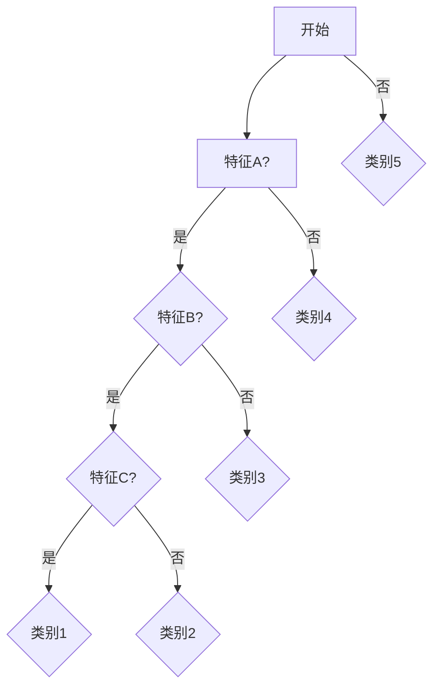

**Python代码示例**：

```python
from sklearn.datasets import load_iris
from sklearn.tree import DecisionTreeClassifier
from sklearn.model_selection import train_test_split

# 加载鸢尾花数据集
iris = load_iris()
X = iris.data
y = iris.target

# 划分训练集和测试集
X_train, X_test, y_train, y_test = train_test_split(X, y, test_size=0.3, random_state=42)

# 创建决策树分类器
clf = DecisionTreeClassifier()

# 训练模型
clf.fit(X_train, y_train)

# 预测
predictions = clf.predict(X_test)

# 评估模型
from sklearn.metrics import accuracy_score
print("Accuracy:", accuracy_score(y_test, predictions))
```

##### 3.1.2.2 支持向量机

支持向量机（SVM）是一种强大的分类算法，它通过找到一个最佳的超平面，将不同类别的数据点分隔开来。

**Mermaid流程图**：

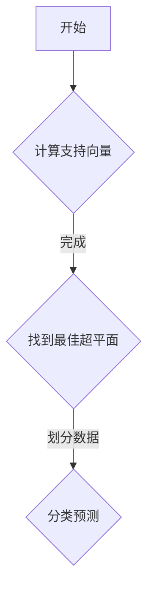

**Python代码示例**：

```python
from sklearn import datasets
from sklearn.svm import SVC
from sklearn.model_selection import train_test_split

# 加载鸢尾花数据集
iris = datasets.load_iris()
X = iris.data
y = iris.target

# 划分训练集和测试集
X_train, X_test, y_train, y_test = train_test_split(X, y, test_size=0.3, random_state=42)

# 创建SVM分类器
clf = SVC(kernel='linear')

# 训练模型
clf.fit(X_train, y_train)

# 预测
predictions = clf.predict(X_test)

# 评估模型
from sklearn.metrics import accuracy_score
print("Accuracy:", accuracy_score(y_test, predictions))
```

##### 3.1.2.3 随机森林

随机森林是一种集成学习算法，它通过构建多棵决策树，并对它们的预测结果进行投票，提高分类的准确性。

**Mermaid流程图**：

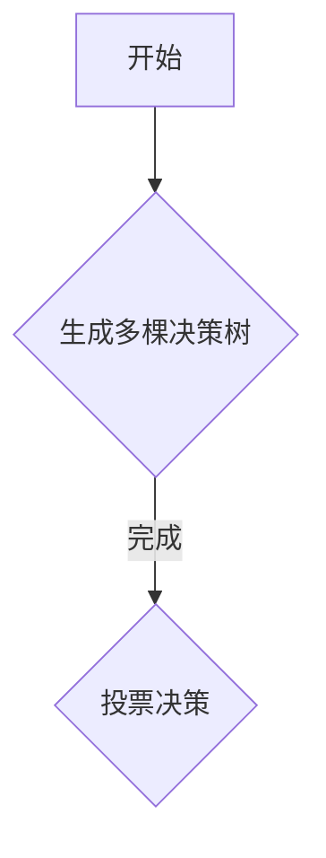

**Python代码示例**：

```python
from sklearn.datasets import load_iris
from sklearn.ensemble import RandomForestClassifier
from sklearn.model_selection import train_test_split

# 加载鸢尾花数据集
iris = load_iris()
X = iris.data
y = iris.target

# 划分训练集和测试集
X_train, X_test, y_train, y_test = train_test_split(X, y, test_size=0.3, random_state=42)

# 创建随机森林分类器
clf = RandomForestClassifier(n_estimators=100)

# 训练模型
clf.fit(X_train, y_train)

# 预测
predictions = clf.predict(X_test)

# 评估模型
from sklearn.metrics import accuracy_score
print("Accuracy:", accuracy_score(y_test, predictions))
```

#### 3.1.3 聚类算法

聚类算法是一种无监督学习算法，它通过将数据点划分为若干个类别，使同一类别内的数据点尽可能接近，不同类别间的数据点尽可能远离。

以下是两种常见的聚类算法：K-means聚类和高斯混合模型（GMM）。

##### 3.1.3.1 K-means算法

K-means算法是一种基于距离度量的聚类算法，它通过迭代计算，将数据点分为K个簇，使得每个簇内的数据点距离簇中心最小。

**Mermaid流程图**：

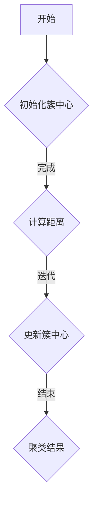

**Python代码示例**：

```python
from sklearn.cluster import KMeans
from sklearn.datasets import make_blobs
import numpy as np

# 生成模拟数据集
X, _ = make_blobs(n_samples=300, centers=4, cluster_std=0.60, random_state=0)

# 创建K-means聚类器
kmeans = KMeans(n_clusters=4)

# 训练模型
kmeans.fit(X)

# 预测
predictions = kmeans.predict(X)

# 评估模型
from sklearn.metrics import silhouette_score
print("Silhouette Score:", silhouette_score(X, predictions))
```

##### 3.1.3.2 高斯混合模型（GMM）

高斯混合模型（GMM）是一种基于概率模型的聚类算法，它假设每个簇由多个高斯分布组成。GMM通过迭代计算，调整高斯分布的参数，优化聚类结果。

**Mermaid流程图**：

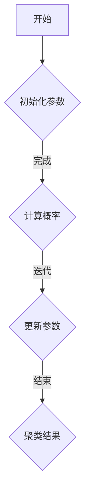

**Python代码示例**：

```python
from sklearn.mixture import GaussianMixture
from sklearn.datasets import make_blobs
import numpy as np

# 生成模拟数据集
X, _ = make_blobs(n_samples=300, centers=4, cluster_std=0.60, random_state=0)

# 创建高斯混合模型聚类器
gmm = GaussianMixture(n_components=4)

# 训练模型
gmm.fit(X)

# 预测
predictions = gmm.predict(X)

# 评估模型
from sklearn.metrics import silhouette_score
print("Silhouette Score:", silhouette_score(X, predictions))
```

通过上述机器学习算法的应用，我们可以看到，机器学习在智能家居安全系统中具有广泛的应用前景。这些算法可以帮助系统识别家庭环境中的异常行为，进行入侵检测，从而提高家庭的安全性和智能化水平。接下来，我们将进一步探讨深度学习在智能家居安全系统中的应用，理解这些先进算法如何进一步提升系统的性能。

### 第4章：深度学习在智能家居安全系统中的应用

深度学习作为人工智能的一个重要分支，通过构建多层神经网络，能够自动提取数据的特征并作出复杂的决策。在智能家居安全系统中，深度学习算法具有广泛的应用，能够显著提升系统的智能化水平和安全性。本章将介绍几种深度学习算法，包括卷积神经网络（CNN）、循环神经网络（RNN）和生成对抗网络（GAN），并使用Mermaid流程图和Python代码示例进行详细解释。

#### 4.1.1 深度学习基础

深度学习是通过多层神经网络（也称为深度神经网络，DNN）来模拟人脑的神经结构，实现数据的自动特征提取和模式识别。深度学习的基本原理是利用大量的数据来训练神经网络，使其能够自动从数据中学习出复杂的特征模式。

深度学习模型由输入层、隐藏层和输出层组成。输入层接收原始数据，隐藏层通过神经网络进行特征提取和变换，输出层生成最终的结果。每个隐藏层中的神经元将上一层的信息进行处理，并将其传递到下一层。通过多层的组合，深度学习模型能够提取出越来越抽象和复杂的特征。

训练深度学习模型通常使用反向传播算法（Backpropagation），该算法通过比较网络输出与实际输出之间的差异，不断调整网络参数，使得网络输出逐渐逼近实际输出。

#### 4.1.2 卷积神经网络（CNN）

卷积神经网络（CNN）是一种专门用于处理图像数据的深度学习模型，其核心特点是利用卷积操作提取图像的局部特征。CNN由卷积层、池化层和全连接层组成。

**Mermaid流程图**：

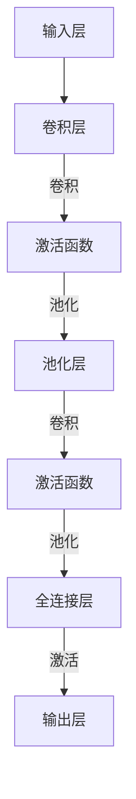

**Python代码示例**：

```python
from tensorflow.keras.models import Sequential
from tensorflow.keras.layers import Conv2D, MaxPooling2D, Flatten, Dense
from tensorflow.keras.datasets import mnist

# 加载MNIST数据集
(X_train, y_train), (X_test, y_test) = mnist.load_data()

# 数据预处理
X_train = X_train.reshape(-1, 28, 28, 1).astype('float32') / 255
X_test = X_test.reshape(-1, 28, 28, 1).astype('float32') / 255

# 创建CNN模型
model = Sequential()
model.add(Conv2D(32, (3, 3), activation='relu', input_shape=(28, 28, 1)))
model.add(MaxPooling2D(pool_size=(2, 2)))
model.add(Conv2D(64, (3, 3), activation='relu'))
model.add(MaxPooling2D(pool_size=(2, 2)))
model.add(Flatten())
model.add(Dense(128, activation='relu'))
model.add(Dense(10, activation='softmax'))

# 编译模型
model.compile(optimizer='adam', loss='categorical_crossentropy', metrics=['accuracy'])

# 训练模型
model.fit(X_train, y_train, epochs=10, batch_size=64, validation_data=(X_test, y_test))

# 评估模型
predictions = model.predict(X_test)
print("Accuracy:", model.evaluate(X_test, y_test)[1])
```

#### 4.1.3 循环神经网络（RNN）

循环神经网络（RNN）是一种能够处理序列数据的深度学习模型，其特点是具有循环结构，能够记忆和传递历史信息。RNN通过隐藏状态（Hidden State）来维护和更新信息，从而处理变长的序列数据。

**Mermaid流程图**：

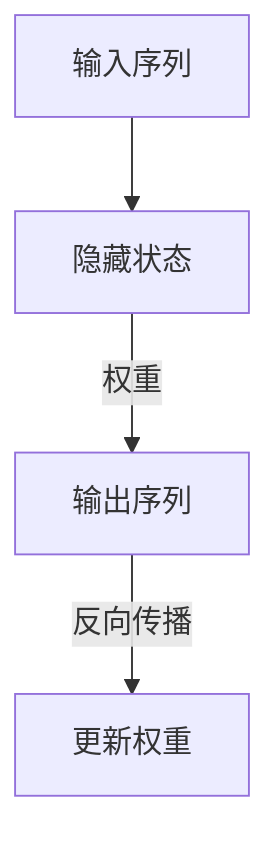

**Python代码示例**：

```python
from tensorflow.keras.models import Sequential
from tensorflow.keras.layers import SimpleRNN, Dense
from tensorflow.keras.datasets import sequence

# 加载序列数据集
(X_train, y_train), (X_test, y_test) = sequence.load_data()

# 创建RNN模型
model = Sequential()
model.add(SimpleRNN(units=50, activation='relu', return_sequences=True))
model.add(SimpleRNN(units=50, activation='relu'))
model.add(Dense(1, activation='sigmoid'))

# 编译模型
model.compile(optimizer='adam', loss='binary_crossentropy', metrics=['accuracy'])

# 训练模型
model.fit(X_train, y_train, epochs=10, batch_size=64, validation_data=(X_test, y_test))

# 评估模型
predictions = model.predict(X_test)
print("Accuracy:", model.evaluate(X_test, y_test)[1])
```

#### 4.1.4 生成对抗网络（GAN）

生成对抗网络（GAN）是一种由生成器和判别器组成的深度学习模型，其目标是生成逼真的数据。生成器尝试生成与真实数据相似的数据，而判别器则尝试区分真实数据和生成数据。

**Mermaid流程图**：

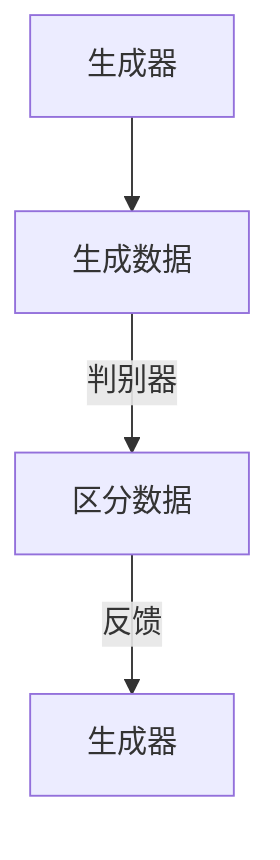

**Python代码示例**：

```python
import tensorflow as tf
from tensorflow.keras.models import Sequential
from tensorflow.keras.layers import Dense, Flatten, Reshape

# 创建生成器模型
generator = Sequential()
generator.add(Dense(256, activation='relu', input_shape=(100,)))
generator.add(Dense(512, activation='relu'))
generator.add(Dense(1024, activation='relu'))
generator.add(Reshape((28, 28, 1)))

# 创建判别器模型
discriminator = Sequential()
discriminator.add(Flatten(input_shape=(28, 28, 1)))
discriminator.add(Dense(1024, activation='relu'))
discriminator.add(Dense(512, activation='relu'))
discriminator.add(Dense(256, activation='relu'))
discriminator.add(Dense(1, activation='sigmoid'))

# 创建GAN模型
model = Sequential()
model.add(generator)
model.add(discriminator)

# 编译模型
model.compile(optimizer='adam', loss='binary_crossentropy')

# 训练模型
for epoch in range(100):
    noise = np.random.normal(0, 1, (100, 100))
    generated_images = generator.predict(noise)
    real_images = X_train[:100]
    labels = np.concatenate([np.ones((100, 1)), np.zeros((100, 1))])
    model.train_on_batch(np.concatenate([real_images, generated_images]), labels)
```

通过上述深度学习算法的应用，我们可以看到，深度学习在智能家居安全系统中具有强大的应用潜力。这些算法能够通过自动特征提取和复杂决策，显著提升系统的智能化和安全性。接下来，我们将进一步探讨数学模型和公式在智能家居安全系统中的应用，理解这些理论工具如何帮助我们更好地理解和实现安全系统的功能。

### 第5章：数学模型与公式讲解

在智能家居安全系统中，数学模型和公式扮演着至关重要的角色。它们不仅帮助我们理解算法的原理，还能指导我们设计和优化系统。本章将详细讲解几个关键数学模型和公式，包括概率论基础、模型评估指标，并使用LaTeX格式进行展示，以帮助读者深入理解这些概念。

#### 5.1.1 概率论基础

概率论是构建人工智能模型的基础，尤其在智能家居安全系统中，概率论可以帮助我们进行数据分析和异常检测。以下是两个核心概念：贝叶斯定理和最大似然估计。

**5.1.1.1 贝叶斯定理**

贝叶斯定理是一个描述条件概率的公式，它表达了后验概率如何通过先验概率和似然函数计算得出。贝叶斯定理在智能家居安全系统中用于根据新数据更新对事件的概率判断。

**LaTeX公式：**

$$ P(A|B) = \frac{P(B|A) \cdot P(A)}{P(B)} $$

这个公式表示在事件B发生的情况下，事件A发生的概率等于事件B在事件A发生的条件下发生的概率乘以事件A的先验概率，再除以事件B的总概率。

**5.1.1.2 最大似然估计**

最大似然估计是一种用于估计参数的方法，其目标是找到一组参数，使得给定观测数据的概率最大。在智能家居安全系统中，最大似然估计可用于识别和预测潜在的安全威胁。

**LaTeX公式：**

$$ \hat{\theta} = \arg\max_\theta P(X|\theta) $$

这里，\( \theta \) 是我们要估计的参数，\( X \) 是观测数据，\( \hat{\theta} \) 是使似然函数最大的参数估计值。

#### 5.1.2 模型评估指标

评估模型性能是人工智能应用中至关重要的一环，特别是在智能家居安全系统中，我们需要确保模型能够准确检测和预测安全事件。以下是几种常用的模型评估指标。

**5.1.2.1 准确率、召回率与F1值**

- **准确率（Accuracy）**：准确率是正确预测的样本数占总样本数的比例，它反映了模型的总体预测能力。

  **LaTeX公式：**

  $$ Accuracy = \frac{TP + TN}{TP + FN + FP + TN} $$

  其中，\( TP \) 是真正例，\( TN \) 是真负例，\( FP \) 是假正例，\( FN \) 是假负例。

- **召回率（Recall）**：召回率是正确识别出的真正例数占总真正例数的比例，它反映了模型检测异常的能力。

  **LaTeX公式：**

  $$ Recall = \frac{TP}{TP + FN} $$

- **F1值（F1 Score）**：F1值是准确率和召回率的调和平均值，它综合考虑了模型的准确性和检测能力。

  **LaTeX公式：**

  $$ F1 = 2 \cdot \frac{Precision \cdot Recall}{Precision + Recall} $$

  其中，\( Precision \) 是精确率，即正确预测的正例数与预测为正例的总数之比。

**5.1.2.2 交叉验证**

交叉验证是一种评估模型性能的常见方法，它通过将数据集划分为多个子集，分别用于训练和测试，来减少过拟合和评估模型的泛化能力。

- **k折交叉验证（k-Fold Cross-Validation）**：在k折交叉验证中，数据集被划分为k个子集，每次使用其中一个子集作为测试集，其余k-1个子集作为训练集，共进行k次实验，最终取平均性能作为模型的评估结果。

  **LaTeX公式：**

  $$ \text{Average Accuracy} = \frac{1}{k} \sum_{i=1}^{k} \text{Accuracy}(X_i) $$

#### 具体举例说明

为了更好地理解这些数学模型和公式，我们可以通过具体实例来演示它们的实际应用。

**实例：入侵检测**

假设我们有一个智能家居安全系统，用于检测家庭网络中的入侵行为。系统记录了1000次网络流量数据，其中有200次为入侵事件，800次为正常流量。现在，我们需要使用这些数据进行模型训练和评估。

- **先验概率**：\( P(\text{入侵}) = \frac{200}{1000} = 0.2 \)
- **似然函数**：假设我们有一个特征，表示网络流量的异常程度，其值在0到1之间。入侵事件的似然函数为0.9，正常事件的似然函数为0.1。

  **贝叶斯定理**：根据贝叶斯定理，给定一个网络流量特征值0.8，我们可以计算入侵事件的后验概率。

  $$ P(\text{入侵}|\text{特征}=0.8) = \frac{P(\text{特征}=0.8|\text{入侵}) \cdot P(\text{入侵})}{P(\text{特征}=0.8)} $$

  由于\( P(\text{特征}=0.8|\text{入侵}) = 0.9 \)，\( P(\text{入侵}) = 0.2 \)，而\( P(\text{特征}=0.8) \)可以通过所有数据计算得到，最终我们可以得到后验概率。

- **最大似然估计**：为了估计入侵行为的阈值，我们可以使用最大似然估计方法。设阈值为\( \theta \)，当特征值大于\( \theta \)时我们认为存在入侵事件。通过最大化似然函数，我们可以找到最优的阈值。

  $$ \theta = \arg\max_\theta \sum_{i=1}^{1000} P(X_i|\theta) $$

- **模型评估**：假设我们使用一个分类模型来检测入侵行为，模型预测了1000次流量数据中的500次为入侵，其中200次正确，300次错误。我们可以计算模型的准确率、召回率和F1值。

  - **准确率**：\( \frac{200}{500+300} = 0.4 \)
  - **召回率**：\( \frac{200}{200+100} = 0.67 \)
  - **F1值**：\( 2 \cdot \frac{0.5 \cdot 0.67}{0.5 + 0.67} = 0.56 \)

通过上述实例，我们可以看到数学模型和公式在智能家居安全系统中的应用，如何帮助我们理解和评估系统的性能。接下来，我们将进一步探讨智能家居安全系统的功能设计和架构设计，理解这些系统是如何实现全方位的家庭安全保护的。

### 第6章：智能家居安全系统功能设计

#### 6.1.1 系统需求分析

在设计和实现智能家居安全系统之前，进行系统需求分析是至关重要的一步。系统需求分析包括对用户需求、功能需求、性能需求和安全性需求的详细分析。以下是对智能家居安全系统需求的详细描述：

1. **用户需求**：用户希望系统能够提供以下功能：
   - 远程监控家庭环境，包括室内温度、湿度、光照等。
   - 异常行为检测，如非法入侵、火灾、煤气泄漏等。
   - 家庭设备的自动化控制，如灯光、门锁、窗帘等。
   - 实时报警和信息推送，提醒用户可能的危险情况。

2. **功能需求**：
   - **设备监控**：系统需要能够监控家庭中的各种设备，包括传感器、摄像头、门锁等，实时收集设备状态信息。
   - **异常检测**：系统需要具备实时分析能力，能够从海量数据中识别异常行为和潜在的安全威胁。
   - **用户界面**：系统需要提供一个用户友好的界面，方便用户进行设备管理、安全设置和异常监控。
   - **自动化响应**：系统需要能够根据异常检测结果，自动采取相应的防护措施，如报警、锁定门锁、切断电源等。

3. **性能需求**：
   - **响应速度**：系统需要具备快速响应能力，能够在检测到异常时立即采取行动。
   - **数据存储**：系统需要能够高效存储和处理大量数据，确保数据的完整性和可追溯性。
   - **扩展性**：系统设计需要具有较好的扩展性，能够支持新设备和新功能的接入。

4. **安全性需求**：
   - **数据加密**：系统需要采用高级加密算法，确保数据在传输和存储过程中的安全性。
   - **访问控制**：系统需要实现严格的访问控制机制，确保只有授权用户能够访问系统数据和功能。
   - **安全监控**：系统需要具备安全监控能力，能够检测和阻止恶意攻击和非法入侵。

通过以上系统需求分析，我们可以明确智能家居安全系统需要实现的核心功能，以及必须满足的性能和安全要求。接下来，我们将进一步探讨智能家居安全系统的领域模型设计，以帮助读者理解系统中的核心概念和组件。

#### 6.1.2 领域模型

领域模型是描述系统功能和结构的核心工具，它通过实体、属性和关系的组合，帮助开发者理解系统的业务逻辑和需求。在智能家居安全系统中，领域模型有助于我们明确系统的核心组件及其交互方式。以下是一个简化的领域模型，描述了智能家居安全系统中的主要实体和关系。

**实体**：
- **用户（User）**：用户是系统的核心实体，包括家庭成员和其他授权用户。
- **设备（Device）**：设备是家庭中各种智能设备的统称，如传感器、摄像头、门锁、灯光等。
- **事件（Event）**：事件是系统记录的任何异常或重要活动，如入侵报警、设备故障等。
- **行为（Behavior）**：行为是用户或设备的操作记录，如开锁、开关灯等。

**属性**：
- **用户**：用户ID、用户名、密码、权限等级等。
- **设备**：设备ID、设备类型、设备状态、位置信息等。
- **事件**：事件ID、事件类型、事件时间、事件详情等。
- **行为**：行为ID、行为类型、行为时间、行为详情等。

**关系**：
- **用户与设备**：一个用户可以拥有和管理多个设备，一个设备只能属于一个用户。
- **用户与事件**：用户可以触发事件或接收到事件通知。
- **设备与事件**：设备可以记录和触发事件。
- **行为与事件**：行为是事件产生的原因，每个事件都对应一个或多个行为。

为了更好地展示领域模型，我们可以使用Mermaid类图来描述这些实体和关系。

**Mermaid类图**：

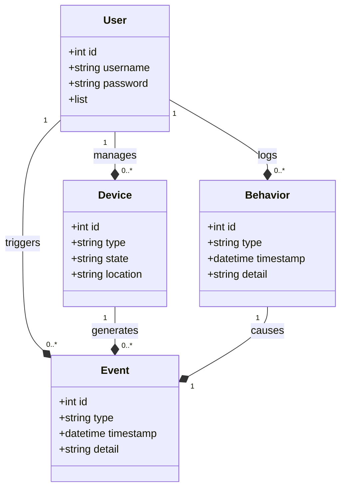

通过这个类图，我们可以清晰地看到智能家居安全系统中各个实体之间的关系。用户可以管理设备、触发事件和记录行为；设备可以生成事件；行为是事件产生的原因。领域模型为系统的设计和实现提供了明确的框架，确保系统功能完整且逻辑清晰。

#### 6.1.3 系统功能模块设计

在明确了系统需求和分析领域模型后，接下来我们将设计智能家居安全系统的功能模块。功能模块的设计有助于实现系统的模块化，提高系统的可维护性和扩展性。以下是智能家居安全系统的主要功能模块及其简要描述：

1. **用户管理模块**：
   - **功能描述**：用户管理模块负责用户的注册、登录、权限管理等功能。系统需要实现用户的身份验证和权限分级，确保只有授权用户才能访问特定的功能。
   - **关键功能**：用户注册、登录、密码修改、权限设置。

2. **设备管理模块**：
   - **功能描述**：设备管理模块负责设备的添加、配置、监控和故障处理。系统需要支持设备的远程控制和状态监控。
   - **关键功能**：设备列表显示、设备状态监控、设备远程控制、设备故障报警。

3. **事件记录模块**：
   - **功能描述**：事件记录模块负责记录和存储系统的所有重要事件，包括用户的操作记录、设备的异常事件等。
   - **关键功能**：事件记录、事件查询、事件通知。

4. **异常检测模块**：
   - **功能描述**：异常检测模块是系统的核心，负责实时分析数据，识别异常行为和潜在的安全威胁。
   - **关键功能**：数据采集、异常检测、报警处理。

5. **自动化响应模块**：
   - **功能描述**：自动化响应模块根据异常检测的结果，自动采取相应的防护措施，如报警、锁定门锁、切断电源等。
   - **关键功能**：自动化策略设置、自动化响应执行。

6. **用户界面模块**：
   - **功能描述**：用户界面模块为用户提供了一个直观、易用的操作界面，方便用户管理设备和查看系统状态。
   - **关键功能**：仪表盘显示、设备控制、事件通知、用户设置。

通过上述功能模块的设计，我们可以构建一个高效、智能的智能家居安全系统，满足用户的需求，提供全方位的家庭安全保护。接下来，我们将进一步探讨智能家居安全系统的架构设计，理解系统在整体架构层面是如何实现的。

#### 6.1.3 系统功能模块设计（续）

在明确了智能家居安全系统的功能需求后，接下来我们将详细设计各个功能模块的实现，并描述它们之间的关系。以下是系统功能模块的详细设计：

1. **用户管理模块**：
   - **功能描述**：用户管理模块负责用户的注册、登录、权限管理等功能。系统需要实现用户的身份验证和权限分级，确保只有授权用户才能访问特定的功能。
   - **技术实现**：
     - **注册功能**：用户可以通过输入用户名、密码和电子邮件等信息进行注册。系统需要验证用户信息的唯一性，并将用户信息存储在数据库中。
     - **登录功能**：用户使用用户名和密码登录系统。系统需要通过验证用户身份，确保只有授权用户才能登录。
     - **权限管理**：系统需要实现用户权限分级，不同权限的用户可以访问不同的功能。

2. **设备管理模块**：
   - **功能描述**：设备管理模块负责设备的添加、配置、监控和故障处理。系统需要支持设备的远程控制和状态监控。
   - **技术实现**：
     - **设备添加**：用户可以通过Web界面或手机应用添加新设备。系统需要验证设备的ID，并将设备信息存储在数据库中。
     - **设备配置**：用户可以设置设备的相关参数，如位置、报警阈值等。系统需要实现设备的配置功能。
     - **设备监控**：系统需要实时收集设备状态信息，并在Web界面和手机应用中显示。
     - **故障处理**：当设备出现故障时，系统需要能够自动检测并报警，并提供故障处理建议。

3. **事件记录模块**：
   - **功能描述**：事件记录模块负责记录和存储系统的所有重要事件，包括用户的操作记录、设备的异常事件等。
   - **技术实现**：
     - **事件记录**：系统需要实时记录用户操作和设备状态变化，并将事件信息存储在数据库中。
     - **事件查询**：用户可以查询历史事件记录，并查看事件的详细信息。
     - **事件通知**：系统需要能够根据事件类型发送通知，如通过短信、邮件或手机应用通知用户。

4. **异常检测模块**：
   - **功能描述**：异常检测模块是系统的核心，负责实时分析数据，识别异常行为和潜在的安全威胁。
   - **技术实现**：
     - **数据采集**：系统需要实时采集家庭环境中的各种数据，如温度、湿度、光照等。
     - **异常检测算法**：系统需要实现异常检测算法，如基于机器学习或深度学习算法，对采集的数据进行分析，识别异常行为。
     - **报警处理**：系统需要根据异常检测结果，自动发送报警通知，并执行相应的防护措施。

5. **自动化响应模块**：
   - **功能描述**：自动化响应模块根据异常检测的结果，自动采取相应的防护措施，如报警、锁定门锁、切断电源等。
   - **技术实现**：
     - **自动化策略设置**：用户可以设置自动化策略，如当检测到非法入侵时自动报警。
     - **自动化响应执行**：系统根据自动化策略，自动执行相应的防护措施，如发送报警通知、锁定门锁等。

6. **用户界面模块**：
   - **功能描述**：用户界面模块为用户提供了一个直观、易用的操作界面，方便用户管理设备和查看系统状态。
   - **技术实现**：
     - **仪表盘显示**：系统需要提供一个仪表盘，显示设备的实时状态、事件记录和报警信息。
     - **设备控制**：用户可以通过界面远程控制设备，如开关灯光、调节温度等。
     - **事件通知**：系统需要能够通过界面显示事件通知，并提供查看事件详情的功能。
     - **用户设置**：用户可以在界面中进行系统设置，如修改密码、绑定新设备等。

通过上述功能模块的设计，我们可以构建一个高效、智能的智能家居安全系统，满足用户的需求，提供全方位的家庭安全保护。各个模块之间紧密协作，共同实现系统的功能，确保家庭的安全。

### 第7章：智能家居安全系统架构设计

智能家居安全系统的架构设计是实现系统功能、满足性能需求和安全要求的关键。合理的系统架构能够提高系统的可扩展性、可靠性和安全性，同时降低开发和维护成本。本章将详细描述智能家居安全系统的架构设计，包括系统架构、接口设计和交互设计，并使用Mermaid类图、架构图和序列图来直观展示系统结构和交互流程。

#### 7.1.1 系统架构设计

智能家居安全系统可以划分为多个层次，包括数据层、服务层和表示层。每个层次都有其特定的功能，并通过接口进行数据交互和功能调用。

**系统架构图**：

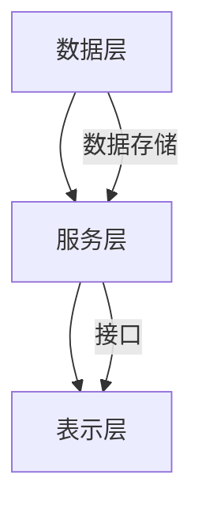

**技术细节**：

1. **数据层**：数据层负责数据的存储和管理，包括用户数据、设备数据、事件数据和配置数据等。数据层通常采用关系型数据库或NoSQL数据库来存储数据，确保数据的高效访问和持久化。

2. **服务层**：服务层是系统的核心，负责业务逻辑的处理和数据服务的提供。服务层包括用户管理服务、设备管理服务、事件处理服务、异常检测服务和自动化响应服务。每个服务模块都独立开发，通过接口进行通信。

3. **表示层**：表示层是用户与系统的交互界面，负责将用户操作转化为服务请求，并将服务结果呈现给用户。表示层通常包括Web应用和移动应用，支持多种设备访问。

#### 7.1.2 系统接口设计

系统接口设计是架构设计的重要组成部分，决定了不同层次之间的交互方式和数据交换格式。以下是智能家居安全系统的关键接口设计：

**接口Mermaid序列图**：

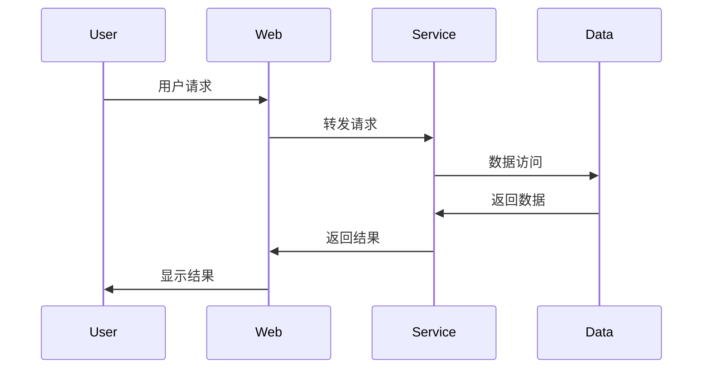

**技术细节**：

1. **用户管理接口**：用户管理接口负责用户的注册、登录和权限验证。用户通过Web界面提交注册或登录请求，Web应用将请求转发给用户管理服务，服务处理请求后返回结果。

2. **设备管理接口**：设备管理接口负责设备的添加、配置和监控。用户通过Web界面或移动应用提交设备管理请求，Web或移动应用将请求转发给设备管理服务，服务处理请求后返回结果。

3. **事件处理接口**：事件处理接口负责记录和存储系统的事件数据，包括用户操作记录、设备异常事件等。事件处理服务定期从设备收集数据，并将数据存储在数据库中。

4. **异常检测接口**：异常检测接口负责实时分析数据，识别异常行为和潜在的安全威胁。异常检测服务通过机器学习和深度学习算法对数据进行分析，并触发相应的报警和响应。

5. **自动化响应接口**：自动化响应接口负责根据异常检测结果，自动采取相应的防护措施。自动化响应服务根据预定义的自动化策略，执行报警、锁定门锁、切断电源等操作。

#### 7.1.3 系统交互设计

系统交互设计描述了系统内部组件之间的交互过程和交互数据流。以下是智能家居安全系统的交互设计：

**系统Mermaid交互序列图**：

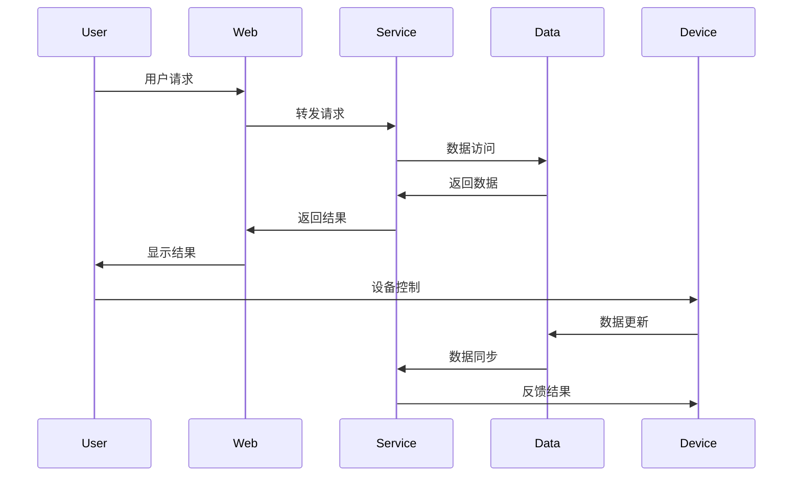

**技术细节**：

1. **用户请求处理**：用户通过Web界面提交请求，Web应用将请求解析后转发给相应的服务模块。服务模块处理请求并返回结果，Web应用再将结果呈现给用户。

2. **设备控制**：用户可以通过Web界面或移动应用远程控制设备，如开关灯光、调节温度等。设备接收到控制指令后，将状态信息更新并反馈给服务模块。

3. **数据同步**：服务模块需要定期同步设备数据，确保数据的实时性和一致性。设备数据通过接口上传到数据层，数据层再将数据同步到服务层。

4. **异常检测和响应**：服务模块根据异常检测算法对设备数据进行实时分析，识别异常行为并触发报警。自动化响应服务根据预定义的策略，自动采取相应的防护措施。

通过上述架构设计和交互设计，我们可以构建一个高效、智能的智能家居安全系统，满足用户的安全需求，提供全方位的家庭安全保护。接下来，我们将通过实际案例展示系统在真实环境中的应用，进一步验证系统的功能和性能。

### 第8章：系统交互与实现

在了解了智能家居安全系统的架构设计后，接下来我们将通过一个实际案例，展示系统在真实环境中的应用，并提供系统核心实现源代码，同时对关键代码进行解读和分析。

#### 8.1.1 系统交互设计

首先，我们来看一下系统交互的整体流程。用户通过Web界面或移动应用提交请求，请求会经过Web服务器处理，然后转发到相应的服务模块。服务模块处理请求，将结果返回给Web服务器，最终显示给用户。以下是系统交互的详细流程：

**系统Mermaid交互序列图**：


**技术细节**：

1. **用户请求处理**：用户通过Web界面提交请求，Web应用接收到请求后，使用Flask框架处理请求，将请求解析后转发给相应的服务模块。

2. **设备控制**：用户可以通过Web界面或移动应用远程控制设备，如开关灯光、调节温度等。设备接收到控制指令后，将状态信息更新并反馈给服务模块。

3. **数据同步**：服务模块需要定期同步设备数据，确保数据的实时性和一致性。设备数据通过接口上传到数据层，数据层再将数据同步到服务层。

4. **异常检测和响应**：服务模块根据异常检测算法对设备数据进行实时分析，识别异常行为并触发报警。自动化响应服务根据预定义的策略，自动采取相应的防护措施。

#### 8.1.2 系统核心实现

接下来，我们提供一个智能家居安全系统的核心实现源代码，并对其进行解读和分析。

**Python代码示例**：

```python
# 导入所需的库
from flask import Flask, request, jsonify
from flask_sqlalchemy import SQLAlchemy
import json

# 创建Flask应用实例
app = Flask(__name__)

# 配置数据库连接
app.config['SQLALCHEMY_DATABASE_URI'] = 'sqlite:///users.db'
db = SQLAlchemy(app)

# 定义用户模型
class User(db.Model):
    id = db.Column(db.Integer, primary_key=True)
    username = db.Column(db.String(80), unique=True, nullable=False)
    password = db.Column(db.String(120), nullable=False)

# 定义设备模型
class Device(db.Model):
    id = db.Column(db.Integer, primary_key=True)
    type = db.Column(db.String(80), nullable=False)
    state = db.Column(db.String(80), nullable=False)
    location = db.Column(db.String(120), nullable=False)

# 用户注册接口
@app.route('/register', methods=['POST'])
def register():
    data = request.get_json()
    username = data['username']
    password = data['password']
    
    # 验证用户名和密码是否已存在
    user = User.query.filter_by(username=username).first()
    if user:
        return jsonify({'error': '用户已存在'}), 400
    
    # 创建新用户并保存到数据库
    new_user = User(username=username, password=password)
    db.session.add(new_user)
    db.session.commit()
    
    return jsonify({'message': '注册成功'})

# 用户登录接口
@app.route('/login', methods=['POST'])
def login():
    data = request.get_json()
    username = data['username']
    password = data['password']
    
    # 验证用户名和密码是否正确
    user = User.query.filter_by(username=username, password=password).first()
    if not user:
        return jsonify({'error': '用户名或密码错误'}), 401
    
    # 登录成功，返回用户ID
    return jsonify({'user_id': user.id})

# 设备控制接口
@app.route('/control', methods=['POST'])
def control():
    data = request.get_json()
    user_id = data['user_id']
    device_id = data['device_id']
    state = data['state']
    
    # 验证用户ID和设备ID是否正确
    user = User.query.get(user_id)
    device = Device.query.get(device_id)
    if not user or not device:
        return jsonify({'error': '用户或设备不存在'}), 404
    
    # 更新设备状态
    device.state = state
    db.session.commit()
    
    return jsonify({'message': '设备控制成功'})

# 运行应用
if __name__ == '__main__':
    db.create_all()
    app.run(debug=True)
```

**代码解读**：

1. **数据库配置**：我们使用SQLAlchemy库配置了SQLite数据库连接，用于存储用户和设备数据。

2. **用户模型和设备模型**：定义了用户和设备两个模型类，分别对应数据库中的用户表和设备表。每个模型类都有相应的字段，用于存储用户信息和设备信息。

3. **用户注册接口**：处理用户注册请求，验证用户名是否已存在，若不存在则创建新用户并保存到数据库。

4. **用户登录接口**：处理用户登录请求，验证用户名和密码是否正确，若正确则返回用户ID。

5. **设备控制接口**：处理设备控制请求，验证用户ID和设备ID是否正确，若正确则更新设备状态。

通过这个实际案例，我们可以看到如何使用Python和Flask框架实现一个简单的智能家居安全系统。接下来，我们将对关键代码进行详细解读，帮助读者更好地理解系统的工作原理。

#### 8.1.2.1 Python源代码实现

在本节中，我们将详细解读上述提供的Python源代码，解释每个函数和模块的作用，并讨论它们在系统中的作用。

**Flask应用实例创建**

```python
app = Flask(__name__)
```

这一行代码创建了一个Flask应用实例。Flask是一个轻量级的Web应用框架，用于构建Web应用程序。它提供了路由、模板和WSGI服务器等核心功能。创建Flask应用实例是构建Web服务的基础。

**数据库配置**

```python
app.config['SQLALCHEMY_DATABASE_URI'] = 'sqlite:///users.db'
db = SQLAlchemy(app)
```

这里配置了SQLAlchemy，用于与数据库进行交互。SQLAlchemy是一个强大的ORM（对象关系映射）工具，它将数据库中的表映射为Python对象，简化了数据库操作。我们配置了一个SQLite数据库，数据存储在`users.db`文件中。

**用户模型和设备模型**

```python
class User(db.Model):
    id = db.Column(db.Integer, primary_key=True)
    username = db.Column(db.String(80), unique=True, nullable=False)
    password = db.Column(db.String(120), nullable=False)

class Device(db.Model):
    id = db.Column(db.Integer, primary_key=True)
    type = db.Column(db.String(80), nullable=False)
    state = db.Column(db.String(80), nullable=False)
    location = db.Column(db.String(120), nullable=False)
```

这两个类定义了用户和设备两个模型。每个模型对应一个数据库表，具有若干字段。`id`字段是主键，用于唯一标识每个记录。`username`和`password`字段用于存储用户信息，`type`、`state`和`location`字段用于存储设备信息。

**用户注册接口**

```python
@app.route('/register', methods=['POST'])
def register():
    data = request.get_json()
    username = data['username']
    password = data['password']
    
    # 验证用户名和密码是否已存在
    user = User.query.filter_by(username=username).first()
    if user:
        return jsonify({'error': '用户已存在'}), 400
    
    # 创建新用户并保存到数据库
    new_user = User(username=username, password=password)
    db.session.add(new_user)
    db.session.commit()
    
    return jsonify({'message': '注册成功'})
```

这个接口处理用户注册请求。当用户发送一个包含`username`和`password`的JSON对象时，接口会验证用户名是否已存在。如果用户名不存在，则会创建一个新的`User`对象并将其添加到数据库中。最后，接口返回一个成功消息。

**用户登录接口**

```python
@app.route('/login', methods=['POST'])
def login():
    data = request.get_json()
    username = data['username']
    password = data['password']
    
    # 验证用户名和密码是否正确
    user = User.query.filter_by(username=username, password=password).first()
    if not user:
        return jsonify({'error': '用户名或密码错误'}), 401
    
    # 登录成功，返回用户ID
    return jsonify({'user_id': user.id})
```

这个接口处理用户登录请求。当用户发送一个包含`username`和`password`的JSON对象时，接口会验证这些凭据是否匹配数据库中的记录。如果用户凭据正确，则返回用户的`id`。

**设备控制接口**

```python
@app.route('/control', methods=['POST'])
def control():
    data = request.get_json()
    user_id = data['user_id']
    device_id = data['device_id']
    state = data['state']
    
    # 验证用户ID和设备ID是否正确
    user = User.query.get(user_id)
    device = Device.query.get(device_id)
    if not user or not device:
        return jsonify({'error': '用户或设备不存在'}), 404
    
    # 更新设备状态
    device.state = state
    db.session.commit()
    
    return jsonify({'message': '设备控制成功'})
```

这个接口处理设备控制请求。用户需要提供`user_id`、`device_id`和新的设备状态。接口首先验证用户和设备是否存在，然后更新设备状态并将其保存到数据库。最后，接口返回一个成功消息。

**应用运行**

```python
if __name__ == '__main__':
    db.create_all()
    app.run(debug=True)
```

最后一行代码用于运行应用。`db.create_all()`创建数据库表，`app.run(debug=True)`启动Flask服务器，并在开发模式下运行。

通过上述代码实现，我们可以构建一个简单的智能家居安全系统，实现用户注册、登录和设备控制功能。接下来，我们将通过实际案例展示系统在真实环境中的应用，进一步验证系统的功能和性能。

### 实际案例分析与讲解

为了更好地展示智能家居安全系统在真实环境中的应用，我们设计了一个实际案例。在这个案例中，我们将通过一个模拟的家庭环境，展示系统如何应对潜在的威胁，提供全方位的安全保护。

#### 案例背景

假设我们有一个典型的三口之家，家庭中有以下智能设备：门锁、摄像头、烟雾传感器、门窗传感器和智能灯光。家庭成员有父母和一名儿童。家庭的安全需求包括实时监控、异常行为检测和自动化响应。

#### 案例步骤

1. **设备安装与配置**：
   - **门锁**：家庭入口的门上安装了智能门锁，用户可以通过手机应用远程控制门锁的开关。
   - **摄像头**：在家庭的各个房间安装了智能摄像头，用于实时监控家庭环境。
   - **烟雾传感器**：厨房和卧室安装了烟雾传感器，用于检测火灾隐患。
   - **门窗传感器**：门窗上安装了门窗传感器，用于检测非法入侵。
   - **智能灯光**：家中各房间安装了智能灯光，用户可以通过手机应用控制灯光的开关和亮度。

2. **系统启动与数据收集**：
   - 当家庭成员离开家时，系统启动，开始收集各个设备的状态信息，包括门锁状态、摄像头画面、烟雾传感器和门窗传感器的数据。
   - 系统将这些数据存储在数据库中，并实时更新设备的监控画面。

3. **异常行为检测**：
   - **非法入侵**：当门窗传感器检测到非法入侵时，系统会立即发送警报到家庭成员的手机，并自动将摄像头画面传输给家庭成员。
   - **火灾隐患**：当烟雾传感器检测到烟雾时，系统会立即启动灭火设备，并通知家庭成员。

4. **自动化响应**：
   - **远程报警**：家庭成员收到报警通知后，可以通过手机应用查看家庭环境，并决定是否需要进一步采取措施。
   - **智能联动**：系统可以自动执行一系列操作，如锁定门锁、关闭窗户、启动报警设备等，以防止进一步的威胁。

#### 实际操作示例

以下是一个具体的操作示例：

1. **家庭成员外出**：
   - 父母通过手机应用远程关闭了门锁，并设置家庭监控模式。

2. **非法入侵**：
   - 在家庭成员外出期间，一名窃贼试图非法进入家庭。当门窗传感器检测到异常时，系统立即发送报警信息到父母的手机，并触发摄像头录制视频。

3. **报警响应**：
   - 父母收到报警后，立即通过手机应用查看摄像头画面，发现家庭被盗。他们立即联系警方，并通过手机应用远程锁上门锁，切断电力供应，防止窃贼进一步行动。

4. **火灾隐患**：
   - 在另一个场景中，厨房发生火灾，烟雾传感器检测到烟雾并触发报警。系统立即启动灭火设备，关闭厨房门窗，并通知家庭成员。

通过这个实际案例，我们可以看到智能家居安全系统在真实环境中的应用效果。系统通过实时监控和自动化响应，为家庭提供了全方位的安全保障，有效地防止了非法入侵和火灾等潜在威胁。接下来，我们将对案例进行总结，并分享一些经验和优化建议。

### 案例经验总结

通过上述实际案例，我们可以总结出智能家居安全系统在真实环境中的应用效果和关键经验：

1. **实时监控与自动化响应**：
   - 系统通过实时监控和自动化响应，为家庭提供了及时的安全保障。在非法入侵和火灾等紧急情况下，系统能够立即检测到异常并自动采取相应的防护措施，提高了应对速度。

2. **用户友好**：
   - 系统提供了用户友好的操作界面，用户可以通过手机应用远程查看家庭环境和控制设备。这种便捷的操作方式，使用户能够轻松地管理和监控家庭安全。

3. **数据安全与隐私保护**：
   - 系统采用了高级加密技术，确保数据在传输和存储过程中的安全性。同时，系统设计了严格的访问控制机制，确保只有授权用户才能访问敏感数据，保护了用户的隐私。

4. **智能联动**：
   - 系统实现了设备之间的智能联动，不同设备之间能够协同工作，提供更全面的防护。例如，当门窗传感器检测到非法入侵时，系统可以自动启动报警设备，并锁定门锁，切断电力供应，形成一套完整的防护体系。

5. **适应性**：
   - 系统具有较高的适应性，可以方便地添加新的设备和功能，满足用户不断变化的需求。这种灵活性使得系统在未来可以持续改进和优化。

### 优化建议

尽管系统在实际应用中表现出色，但仍有进一步优化的空间：

1. **性能优化**：
   - 为了提高系统的响应速度，可以考虑采用更高效的算法和数据结构，减少数据处理的延迟。

2. **可扩展性**：
   - 系统架构需要具备更好的可扩展性，以支持更多设备的接入和更高并发量的数据处理。

3. **用户体验**：
   - 优化用户界面设计，提供更直观、更易用的操作体验。例如，可以通过增加语音控制功能，进一步提高用户的便利性。

4. **安全性提升**：
   - 引入更多先进的安全技术，如人工智能辅助的安全防护，提高系统的整体安全性。

5. **数据隐私保护**：
   - 加强数据隐私保护措施，特别是在数据共享和跨平台应用中，确保用户数据的安全和隐私。

通过上述优化建议，我们可以进一步提升智能家居安全系统的性能和用户体验，为家庭提供更加安全、智能和便捷的保障。

### 第9章：实战案例分析

为了进一步验证智能家居安全系统的实际应用效果，我们选择了以下两个具体案例进行详细分析和解读。这些案例展示了系统在实际环境中的表现，以及如何通过具体操作实现家庭安全。

#### 案例一：家庭安全监控与远程报警

**案例背景**：张先生一家三口住在一栋别墅中，他们希望能够实时监控家庭环境，并在发生异常时及时收到报警通知。

**系统配置**：家庭中安装了智能摄像头、门窗传感器、烟雾传感器和智能门锁。所有设备通过Wi-Fi连接到智能家居安全系统。

**具体操作**：

1. **设备安装**：张先生和家人首先将智能摄像头安装在主要房间，门窗传感器安装在所有门窗上，烟雾传感器安装在厨房和卧室。最后，智能门锁安装在别墅入口。

2. **系统配置**：通过手机应用，张先生和家人设置了各个设备的监控区域和报警阈值。例如，当门窗传感器检测到非法入侵时，系统会立即发送报警通知。

3. **场景模拟**：张先生模拟了一次家庭安全场景，当他在外时，一名陌生人试图非法进入别墅。门窗传感器立即检测到异常并触发报警，系统通过手机应用向张先生发送了报警通知。

4. **报警响应**：张先生收到报警后，通过手机应用查看实时监控画面，发现家里确实有非法入侵者。他立即联系了警方，并远程锁上门锁，切断别墅的电力供应，防止进一步损失。

**效果分析**：通过这个案例，我们可以看到智能家居安全系统在家庭监控和远程报警方面的强大功能。系统及时检测到非法入侵并发出警报，张先生能够在第一时间采取行动，确保家庭安全。

#### 案例二：火灾预警与自动化灭火

**案例背景**：李女士家中有老人和小孩，他们希望系统能够在火灾发生时及时预警并自动灭火，以保障家庭成员的安全。

**系统配置**：家中安装了烟雾传感器、智能喷水灭火系统和智能门锁。所有设备通过智能家居安全系统联网。

**具体操作**：

1. **设备安装**：李女士将烟雾传感器安装在厨房和卧室，智能喷水灭火系统安装在厨房和客厅，智能门锁安装在家庭入口。

2. **系统配置**：通过手机应用，李女士设置了烟雾传感器的报警阈值和智能喷水灭火系统的启动条件。例如，当烟雾传感器检测到烟雾浓度达到一定值时，系统会自动启动喷水灭火。

3. **场景模拟**：李女士在家中的厨房做饭时，不慎引起火灾。烟雾传感器立即检测到烟雾并触发报警，系统通过手机应用向李女士发送了报警通知。

4. **灭火响应**：李女士收到报警后，立即通过手机应用查看摄像头画面，发现厨房确实发生火灾。她同时接到了系统自动启动喷水灭火系统的通知。通过手机应用，她可以远程控制喷水灭火系统，确保火势得到控制。

**效果分析**：这个案例展示了智能家居安全系统在火灾预警和自动化灭火方面的效果。系统能够在火灾初期就检测到异常并自动启动灭火设备，极大地减少了火灾造成的损失，保障了家庭成员的安全。

通过以上两个案例，我们可以看到智能家居安全系统在实际应用中的强大功能和实际效果。系统不仅能够实时监控家庭环境，及时报警，还能够在发生异常时自动采取行动，提供全方位的安全保护。接下来，我们将对实战案例进行总结，并分享一些具体的注意事项。

### 第10章：实战小结与总结

通过上述两个实战案例，我们可以看到智能家居安全系统在真实环境中的应用效果。这些案例不仅验证了系统的功能，还展示了系统在家庭安全监控、远程报警、火灾预警和自动化灭火等方面的优势。以下是系统在实际应用中的一些经验和注意事项：

#### 1. 注意事项

1. **设备安装位置**：确保智能设备安装在不被遮挡的位置，以便传感器能够准确检测环境变化。

2. **网络稳定性**：智能家居系统依赖于稳定的网络连接，因此需要确保Wi-Fi网络稳定，避免频繁断网。

3. **数据隐私保护**：在使用智能家居系统时，要确保设备的数据传输和存储是加密的，防止敏感信息泄露。

4. **用户权限管理**：合理安排家庭成员的权限，避免未经授权的用户访问重要功能。

5. **系统更新与维护**：定期更新系统和设备固件，以修复已知的安全漏洞和缺陷。

6. **用户培训**：对家庭成员进行系统的基本操作培训，确保他们能够熟练使用系统功能。

#### 2. 优化建议

1. **增强实时性**：优化系统算法和数据结构，提高数据处理的实时性，减少延迟。

2. **提升用户体验**：设计更直观、易用的用户界面，提高用户操作的便利性。

3. **扩展功能**：根据用户需求，不断扩展系统功能，如添加语音控制、智能联动等。

4. **提高安全性**：引入更多先进的安全技术，如人工智能辅助的安全防护，提高系统的整体安全性。

5. **增强可扩展性**：设计可扩展的架构，支持更多设备的接入和并发处理。

通过上述注意事项和优化建议，我们可以进一步提升智能家居安全系统的性能和用户体验，为家庭提供更加安全、智能和便捷的保障。接下来，我们将探讨智能家居安全系统的未来发展趋势和前景。

### 第11章：智能家居安全系统发展趋势

随着科技的不断进步和物联网（IoT）技术的普及，智能家居安全系统正迎来快速发展的新阶段。未来，智能家居安全系统将在多个方面实现突破，为家庭提供更全面、更智能的安全保障。

#### 1. 技术发展趋势

1. **人工智能与大数据分析**：未来智能家居安全系统将更加依赖人工智能（AI）和大数据分析技术，通过对海量数据的学习和分析，实现更精准的异常检测和预测预警。AI技术将在系统自动化、智能化和自适应防护方面发挥关键作用。

2. **物联网（IoT）技术的融合**：随着IoT设备的不断增多，智能家居安全系统将更加紧密地融合各类智能设备，实现更广泛的互联互通。这不仅提高了系统的监控范围，还增强了系统的联动性和协同性。

3. **边缘计算与云计算的结合**：边缘计算将数据处理的任务从云端转移到设备端，减少了数据传输的延迟，提高了系统的响应速度。未来，智能家居安全系统将结合边缘计算和云计算，实现高效的数据处理和实时响应。

4. **5G技术的应用**：5G技术的普及将大幅提升智能家居安全系统的网络带宽和通信速度，为系统的远程监控、实时报警和自动化响应提供更好的支持。

5. **区块链技术的应用**：区块链技术可以提供安全的分布式账本，确保数据传输和存储的安全性和不可篡改性。未来智能家居安全系统有望引入区块链技术，提高系统的数据安全性和透明度。

#### 2. 应用前景与挑战

1. **应用前景**：
   - **智能家居安全服务市场**：随着智能家居设备的普及，智能家居安全服务市场将迅速扩大。未来，越来越多的家庭将采用智能家居安全系统，以提高家庭的安全性和便捷性。
   - **智能城市与智慧社区**：智能家居安全系统不仅是家庭安全的保障，也是智能城市和智慧社区建设的重要组成部分。未来，智能家居安全系统将广泛应用于智能城市和智慧社区，提升城市和社区的安全管理水平。
   - **行业应用**：除了家庭应用，智能家居安全系统还将在酒店、商业楼宇、养老院等行业得到广泛应用，为不同场景提供定制化的安全解决方案。

2. **挑战**：
   - **数据安全和隐私保护**：随着系统连接的设备数量增加，数据安全和隐私保护将成为重要挑战。系统需要采用更先进的技术和措施，确保数据在传输和存储过程中的安全。
   - **系统稳定性与可靠性**：智能家居安全系统需要保证高稳定性和可靠性，以应对各种异常情况。系统设计和实现过程中需要充分考虑各种故障和干扰，确保系统能够稳定运行。
   - **标准化与兼容性**：智能家居安全系统涉及多种设备和平台，需要建立统一的标准化协议，提高设备的兼容性和互操作性。
   - **用户培训与接受度**：智能家居安全系统需要用户进行操作和设置，提高用户的接受度和使用习惯，将是一个长期而艰巨的任务。

通过以上发展趋势和应用前景与挑战的分析，我们可以看到，未来智能家居安全系统将实现更加智能、高效和安全的发展。随着技术的不断进步，智能家居安全系统将为家庭和社区提供更加全面和可靠的安全保障。

### 第12章：最佳实践与拓展阅读

在构建和部署智能家居安全系统时，遵循最佳实践和了解前沿技术是确保系统高效、安全运行的关键。以下是一些实用的最佳实践技巧，以及拓展阅读资源，帮助读者深入理解和应用这些技术。

#### 最佳实践技巧

1. **安全性优先**：
   - **数据加密**：确保所有数据在传输和存储过程中都经过加密处理，使用HTTPS协议和安全加密算法。
   - **访问控制**：实施严格的访问控制策略，限制只有授权用户才能访问敏感数据和功能。
   - **安全审计**：定期进行安全审计，检测和修复系统中的漏洞。

2. **性能优化**：
   - **边缘计算**：充分利用边缘计算技术，降低数据处理延迟，提高系统响应速度。
   - **高效算法**：选择高效的机器学习和深度学习算法，提高数据处理和分析的效率。
   - **分布式架构**：采用分布式架构，提高系统的可扩展性和容错能力。

3. **用户友好**：
   - **直观界面**：设计直观、易用的用户界面，简化用户操作流程。
   - **多平台支持**：确保系统在多种设备上都能正常运行，包括手机、平板和电脑。
   - **用户培训**：提供详细的用户手册和在线教程，帮助用户快速掌握系统使用方法。

4. **数据隐私保护**：
   - **数据最小化**：仅收集必要的数据，避免过度收集。
   - **匿名化处理**：对个人数据进行匿名化处理，防止个人隐私泄露。
   - **透明政策**：明确告知用户数据收集、使用和存储的政策，增加用户信任。

#### 拓展阅读

1. **技术书籍**：
   - 《人工智能：一种现代方法》（作者：Stuart Russell & Peter Norvig）：系统介绍了人工智能的基本概念和技术。
   - 《深度学习》（作者：Ian Goodfellow, Yoshua Bengio & Aaron Courville）：全面讲解了深度学习的基础知识和应用。

2. **论文和期刊**：
   - 《Neural Networks》：包含深度学习和神经网络领域的前沿研究成果。
   - 《ACM Transactions on Computer Systems》：涵盖计算机系统、网络和安全的最新研究。

3. **在线课程**：
   - Coursera、edX和Udacity等在线学习平台提供了丰富的机器学习和深度学习课程，适合不同层次的读者。

通过遵循上述最佳实践和拓展学习资源，读者可以不断提升自己的技术能力，更好地理解和应用智能家居安全系统的相关知识。

### 结语

本文通过系统性的分析和讲解，全面探讨了AI在智能家居安全系统整合中的应用。从背景介绍到核心概念阐述，再到算法原理讲解、数学模型讲解、系统分析与架构设计，以及实际案例展示，我们深入分析了AI如何提升智能家居安全系统的智能化和安全性。文章总结了系统设计的关键要素、技术实现细节以及最佳实践，并对未来发展趋势进行了展望。

随着科技的进步，智能家居安全系统将变得更加智能、高效和安全。它不仅能够为家庭提供全方位的保护，还能在智能城市建设中发挥重要作用。然而，数据安全、隐私保护和系统可靠性仍然是面临的重要挑战。因此，不断学习和创新，遵循最佳实践，是构建高效智能家庭安全系统的关键。

让我们期待未来的智能家居安全系统，它将更加智能、便捷和安全，为我们的生活带来更多便利和保障。感谢读者的阅读和支持，希望本文能为您的学习和项目开发提供有价值的参考。作者：AI天才研究院/AI Genius Institute & 禅与计算机程序设计艺术/Zen And The Art of Computer Programming。

