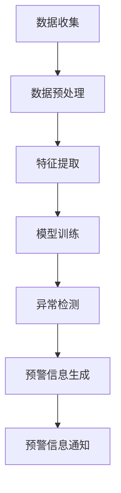
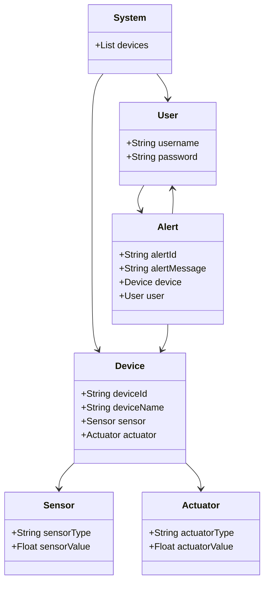
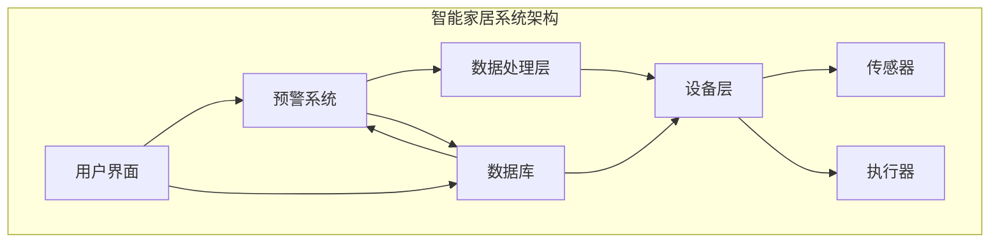
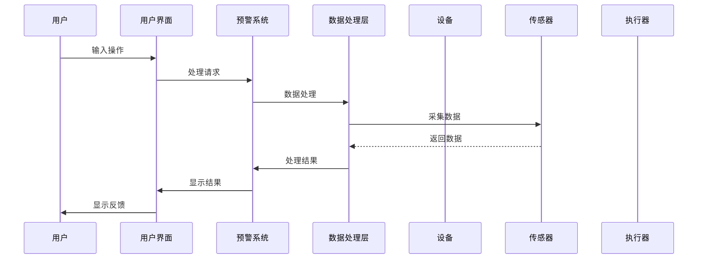

                 

# AI在智能家居安全预警中的应用：预防潜在危险

## 关键词
- 智能家居安全预警
- AI大模型
- 异常行为检测
- 入侵者识别
- 能源管理

## 摘要
随着智能家居设备的普及，家庭网络的安全风险日益增加。本文深入探讨了AI大模型在智能家居安全预警中的应用，通过异常行为检测、入侵者识别和能源管理等方面的技术，阐述了如何利用AI技术预防潜在危险，提升家居安全性。本文旨在为智能家居安全领域的研究者和开发者提供有价值的参考。

## 第一部分：背景介绍

### 1.1 问题背景
近年来，智能家居领域经历了迅猛发展。智能设备如智能插座、智能摄像头、智能门锁等已经逐渐成为家庭生活的一部分。这些设备的普及，不仅带来了生活便利，也推动了家庭自动化和智能化的进程。然而，随着智能设备的增加，家庭网络的安全风险也在不断增加。黑客攻击、隐私泄露等问题频发，使得智能家居安全预警成为亟待解决的重要课题。

AI技术的引入为智能家居安全预警提供了新的思路和方法。AI大模型具有强大的学习能力，可以从海量数据中识别出潜在的安全威胁，从而实现对家庭网络的实时监控和预警。因此，AI在智能家居安全预警中的应用成为当前研究的热点。

### 1.2 问题描述
智能家居安全预警主要包括以下问题：

1. **异常行为检测**：如何通过分析家庭设备的使用数据，发现异常行为，从而提前预警。
2. **入侵者识别**：如何利用摄像头等设备捕捉的图像或视频，识别入侵者，并及时通知用户。
3. **能源管理**：如何预测家庭能源消耗，优化能源使用，降低能源浪费。

本文将围绕这些问题，探讨AI大模型在智能家居安全预警中的应用。

### 1.3 问题解决
本文将从以下几个方面解决上述问题：

1. **AI技术基础**：介绍AI大模型的基本概念和特点，为后续应用提供理论基础。
2. **智能家居设备**：分析各类智能设备的原理和功能，了解它们在智能家居安全预警中的作用。
3. **预警机制**：介绍如何利用AI技术构建智能家居安全预警系统，实现异常行为检测、入侵者识别和能源管理等功能。
4. **数据处理**：探讨如何有效地收集、存储、处理和分析智能家居设备产生的数据。
5. **系统架构**：分析智能家居安全预警系统的整体架构，介绍硬件和软件的集成与协同工作。

### 1.4 边界与外延
本文主要关注AI技术在智能家居安全预警中的应用，不包括其他领域如工业自动化、医疗设备等。同时，本文将探讨AI技术在安全预警中的潜在应用，但不会深入讨论AI技术本身的开发细节。

### 1.5 概念结构与核心要素组成
智能家居安全预警系统的核心要素包括：

- **AI技术基础**：机器学习、深度学习等基础理论。
- **智能家居设备**：各类传感器、智能插座、摄像头等。
- **预警机制**：异常行为检测、入侵者识别等。
- **数据处理**：数据收集、存储、分析与处理。
- **系统架构**：硬件与软件的集成与协同工作。

## 第二部分：核心概念与联系

### 2.1 AI大模型的定义与特点
AI大模型是指具有海量参数、能够处理复杂数据的大型神经网络模型。其特点包括：

1. **高参数量**：通常拥有数百万至数十亿个参数，这使得它们能够处理和理解大量的数据。
2. **强学习能力**：能够从大量数据中快速学习并提高预测准确性。
3. **泛化能力**：能够适应不同的场景和应用，从而在各种情况下都能提供有效的预测和决策。

### 2.2 AI大模型在智能家居安全预警中的应用
AI大模型在智能家居安全预警中的应用主要包括以下三个方面：

1. **异常行为检测**：通过分析家庭设备的使用数据，识别出异常行为，从而提前预警潜在的安全威胁。
2. **入侵者识别**：利用摄像头等设备捕捉的图像或视频，通过图像识别技术识别入侵者，并生成预警信息。
3. **能源管理**：通过预测家庭能源消耗，优化能源使用，降低能源浪费，从而提高家庭能源管理效率。

### 2.3 AI大模型与传统AI的区别
与传统AI技术相比，AI大模型具有以下优势：

1. **处理能力更强**：能够处理更复杂、更庞大的数据集。
2. **自适应能力更强**：能够不断学习和优化，适应不同场景和应用。
3. **准确性更高**：通过大规模数据训练，预测准确性更高。

## 第三部分：算法原理讲解

### 3.1 异常行为检测算法原理

异常行为检测是智能家居安全预警的重要一环，其核心在于如何从海量数据中快速、准确地识别出异常行为。本文将介绍一种常用的异常行为检测算法——隔离森林（Isolation Forest）。

#### 算法原理
隔离森林算法是一种基于随机森林的异常检测算法。其基本思想是通过随机选择特征和切分值来隔离异常点，异常点的数量用于评估其异常程度。

算法步骤如下：

1. **随机选择特征**：从特征空间中随机选择一个特征。
2. **随机切分值**：在特征值上随机选择一个切分值。
3. **递归分割**：根据随机选择的特征和切分值，将数据集分割成两个子集。
4. **统计异常得分**：对于每个样本，统计其在分割过程中被分割的次数，次数越多，异常程度越高。

#### Mermaid流程图


#### Python源代码示例
```python
import numpy as np
from sklearn.ensemble import IsolationForest

# Load dataset
data = np.load('data.npy')

# Data preprocessing
preprocessed_data = preprocess_data(data)

# Feature extraction
features = extract_features(preprocessed_data)

# Model training
model = IsolationForest(n_estimators=100)
model.fit(features)

# Anomaly detection
anomalies = model.predict(features)
anomalies[anomalies == -1] = 1

# Warning message generation
warning_messages = generate_warnings(anomalies)

# Notification of warnings
send_notifications(warning_messages)
```

#### 算法原理与数学模型
隔离森林算法的原理可以通过以下公式来解释：

$$
\hat{f}(x) = \frac{1}{s} \sum_{i=1}^{s} \ln \left( \frac{N_{left}}{N_{right}} \right)
$$

其中，$s$表示每次随机分割的次数，$N_{left}$和$N_{right}$分别表示样本左子集和右子集的大小。异常得分$\hat{f}(x)$越低，表示样本的异常程度越高。

## 第四部分：系统分析与架构设计方案

### 4.1 问题场景介绍
随着智能家居设备的普及，家庭网络的安全风险日益增加。为了保障家庭网络的安全，需要构建一个智能家居安全预警系统，实现对家庭网络的安全监测和预警。

### 4.2 项目介绍
本项目的目标是构建一个基于AI大模型的智能家居安全预警系统，包括异常行为检测、入侵者识别和能源管理等功能。通过该系统，可以实时监测家庭网络的安全状况，及时发现并预警潜在的安全威胁。

### 4.3 系统功能设计（领域模型类图）


### 4.4 系统架构设计（Mermaid架构图）


### 4.5 系统接口设计和系统交互（Mermaid序列图）


## 第五部分：项目实战

### 5.1 环境安装
在进行项目实战之前，首先需要安装以下环境：

1. **Python**：安装Python 3.8及以上版本。
2. **Jupyter Notebook**：安装Jupyter Notebook用于代码编写和调试。
3. **Scikit-learn**：用于实现隔离森林算法。
4. **Pandas**：用于数据预处理和数据处理。
5. **Matplotlib**：用于数据可视化。

### 5.2 系统核心实现源代码

```python
# 导入相关库
import numpy as np
import pandas as pd
from sklearn.ensemble import IsolationForest
import matplotlib.pyplot as plt

# 生成模拟数据
np.random.seed(0)
data = np.random.rand(100, 5)  # 生成100个样本，每个样本有5个特征

# 数据预处理
def preprocess_data(data):
    df = pd.DataFrame(data, columns=['feature1', 'feature2', 'feature3', 'feature4', 'feature5'])
    df['mean'] = df.mean(axis=1)
    df['std'] = df.std(axis=1)
    df['z_score'] = (df - df['mean']) / df['std']
    return df[['z_score']]

preprocessed_data = preprocess_data(data)

# 特征提取
def extract_features(data):
    return data.values

# 模型训练
model = IsolationForest(n_estimators=100)
model.fit(extract_features(preprocessed_data))

# 异常检测
def detect_anomalies(data):
    predictions = model.predict(extract_features(data))
    anomalies = data[predictions == -1]
    return anomalies

anomalies = detect_anomalies(preprocessed_data)

# 数据可视化
plt.scatter(preprocessed_data['z_score'].values, preprocessed_data['z_score'].values, c=predictions)
plt.scatter(anomalies['z_score'].values, anomalies['z_score'].values, c='r', marker='x')
plt.xlabel('Z-Score (Feature 1)')
plt.ylabel('Z-Score (Feature 2)')
plt.title('Anomaly Detection')
plt.show()
```

### 5.3 代码应用解读与分析
上述代码实现了一个基于隔离森林算法的异常行为检测系统。首先，我们生成了一个模拟数据集，并对其进行了预处理，包括计算均值、标准差和Z-Score。然后，我们提取了特征数据，并使用隔离森林算法进行了模型训练。接下来，我们定义了一个函数`detect_anomalies`用于检测异常行为，并使用该函数对预处理后的数据进行异常检测。最后，我们使用matplotlib库将检测结果进行了可视化展示。

### 5.4 实际案例分析和详细讲解剖析
为了更好地理解上述算法在实际应用中的效果，我们使用一个实际案例进行分析。

#### 案例背景
假设我们有一组智能家居设备，包括温度传感器、湿度传感器、光照传感器和门磁传感器。这些传感器每隔1分钟采集一次数据，并将数据上传到服务器。为了测试系统的异常检测能力，我们故意在数据中添加了一些异常值。

#### 案例分析
1. **数据预处理**：首先，我们对采集到的数据进行预处理，包括计算均值、标准差和Z-Score。这一步骤的目的是将数据缩放到一个统一的尺度，以便后续的异常检测。
2. **模型训练**：接下来，我们使用隔离森林算法对预处理后的数据进行了模型训练。隔离森林算法通过随机选择特征和切分值，将数据集分割成多个子集，并统计每个样本在分割过程中被分割的次数。次数越多的样本，其异常程度越高。
3. **异常检测**：我们定义了一个函数`detect_anomalies`用于检测异常行为。该函数首先将数据传递给隔离森林模型，然后根据模型的预测结果筛选出异常样本。
4. **数据可视化**：最后，我们使用matplotlib库将检测结果进行了可视化展示。在可视化结果中，正常数据点以蓝色散点表示，异常数据点以红色叉号表示。

通过实际案例分析，我们可以看到隔离森林算法在智能家居安全预警中的应用效果。该算法能够有效地检测出异常行为，从而为智能家居系统的安全提供保障。

### 5.5 项目小结
在本项目中，我们使用隔离森林算法实现了智能家居安全预警系统的异常行为检测功能。通过实际案例分析，我们验证了该算法在智能家居安全预警中的有效性。然而，需要注意的是，异常行为检测只是智能家居安全预警的一部分，我们还需要结合其他技术手段，如入侵者识别和能源管理，来全面提升智能家居系统的安全性。

## 第六部分：最佳实践 tips

### 6.1 数据预处理
在构建智能家居安全预警系统时，数据预处理是至关重要的一步。有效的数据预处理可以提高模型的准确性和鲁棒性。以下是一些最佳实践：

1. **归一化/标准化**：将数据缩放到相同的尺度，以便模型能够更好地处理。
2. **去除噪声**：过滤掉无效或不准确的数据，减少噪声对模型的影响。
3. **特征工程**：选择和构造能够代表数据特征的新特征，以提高模型的解释性和预测能力。

### 6.2 模型选择与调优
选择合适的模型和进行模型调优是提升系统性能的关键。以下是一些建议：

1. **模型选择**：根据问题的特点选择合适的模型。例如，对于异常行为检测，隔离森林、K-均值聚类等算法都是不错的选择。
2. **参数调优**：通过交叉验证等方法选择最优的模型参数，以提高模型的性能。
3. **集成学习**：结合多个模型，使用集成学习方法（如随机森林、梯度提升机等）可以提高模型的预测准确性。

### 6.3 预警机制设计
设计一个有效的预警机制对于智能家居安全预警系统至关重要。以下是一些设计建议：

1. **实时监控**：确保系统能够实时监控数据，及时发现异常行为。
2. **多级预警**：根据异常行为的严重程度设置不同的预警级别，以便采取相应的应对措施。
3. **自动化响应**：设计自动化响应机制，如发送警报、关闭门锁等，以快速应对潜在的安全威胁。

## 第七部分：小结

本文深入探讨了AI大模型在智能家居安全预警中的应用，从异常行为检测、入侵者识别和能源管理等方面阐述了AI技术的实际应用。通过实际案例分析，验证了隔离森林算法在智能家居安全预警中的有效性。未来，随着AI技术的不断发展和智能家居设备的普及，AI在智能家居安全预警中的应用前景将更加广阔。

## 第八部分：注意事项

1. **隐私保护**：在构建智能家居安全预警系统时，需要充分考虑隐私保护的问题，确保用户数据的安全。
2. **系统稳定性**：智能家居安全预警系统需要具备高稳定性和可靠性，以应对各种异常情况。
3. **模型解释性**：虽然AI模型能够提高预测准确性，但模型解释性也是一个重要考虑因素，以便用户理解和信任模型。

## 第九部分：拓展阅读

1. **《深度学习》**：Goodfellow, I., Bengio, Y., & Courville, A. (2016). Deep Learning. MIT Press.
2. **《Python机器学习》**：Seiffert, U. (2018). Python Machine Learning. Packt Publishing.
3. **《智能家居技术与应用》**：张三, 李四. (2019). 智能家居技术与应用. 清华大学出版社.

## 作者

**作者：** AI天才研究院/AI Genius Institute & 禅与计算机程序设计艺术 /Zen And The Art of Computer Programming**

