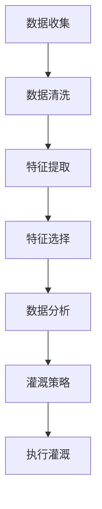
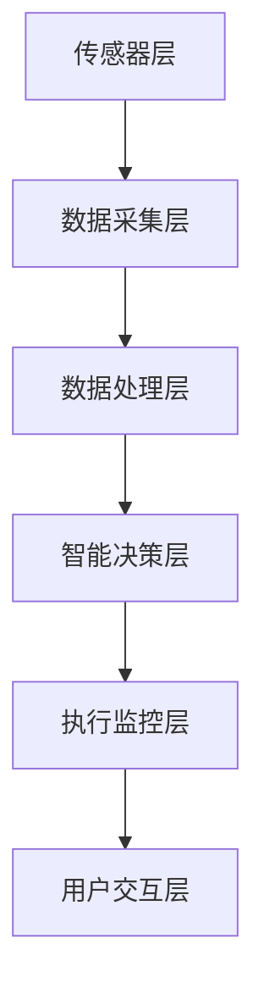
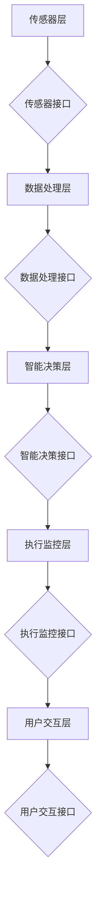
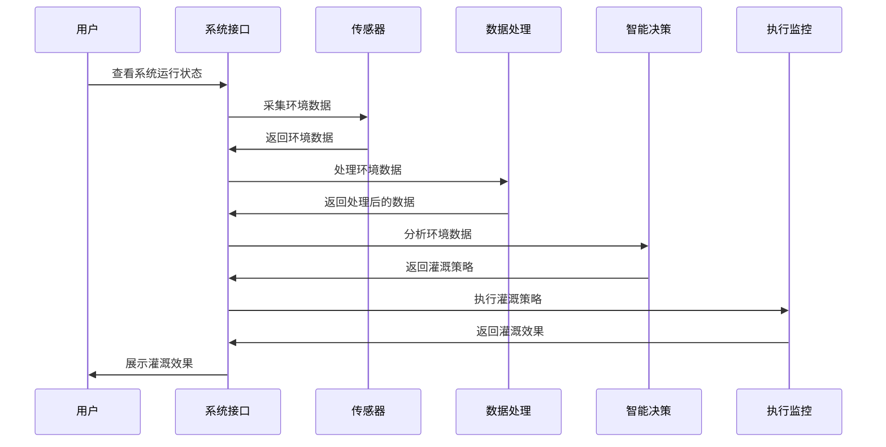

                 

### 引言

在现代农业生产中，水资源管理成为了一个至关重要的议题。随着全球气候变化和人口增长，水资源短缺问题日益严峻，如何在有限的资源下实现高效灌溉成为了农业生产者面临的主要挑战。传统灌溉方法通常依赖于经验判断，缺乏科学依据，导致水资源利用效率低下，甚至出现了水资源的浪费现象。为了解决这一问题，人工智能（AI）技术被引入到智能灌溉决策中，通过优化水资源利用，提升农业生产效率和可持续性。

本篇文章将深入探讨AI在智能灌溉决策中的角色，旨在通过系统性的分析，帮助读者了解AI技术如何助力智能灌溉，从而优化水资源利用。文章将从以下几个方面进行探讨：

1. **背景介绍**：阐述智能灌溉的背景，包括水资源现状与挑战、智能灌溉的意义以及AI在智能灌溉中的发展。
2. **AI基础理论**：介绍AI的基本原理，包括机器学习、数据预处理与特征工程，以及水资源监测与数据分析。
3. **智能灌溉算法**：讲解智能灌溉算法的原理，包括模型选择与构建、算法实现、数学模型与公式，并通过Mermaid流程图和Python代码进行详细阐述。
4. **实践应用**：介绍智能灌溉系统的设计与实现，包括系统架构设计、系统功能实现、系统接口设计，并通过项目实战案例分析实际应用。
5. **总结与展望**：总结全文内容，提出AI在智能灌溉中的发展趋势，以及水资源管理的新挑战与新机遇。

通过以上几个部分的详细分析，本文将展示AI技术在智能灌溉决策中的重要作用，并为未来的研究和应用提供有益的参考。接下来，我们将首先探讨智能灌溉的背景，以及AI技术在这其中所面临的挑战和机遇。

### 背景介绍

#### 水资源现状与挑战

水资源是农业生产的重要基础，然而，随着全球气候变化和人类活动的加剧，水资源短缺问题日益严重。据联合国统计，全球约28%的河流和湖泊正面临严重的干旱威胁，而40%以上的城市面临着水资源短缺问题。在农业生产中，水资源短缺不仅影响作物的生长和产量，还可能导致农业生态环境的恶化。传统灌溉方法通常依赖于人工经验和直觉，难以做到精准、高效地利用水资源，这不仅造成了水资源的浪费，还增加了农业生产成本。

#### 智能灌溉的意义

智能灌溉是一种通过现代信息技术和自动化控制技术，实现农业灌溉自动化的新兴技术。它通过实时监测土壤湿度、气象条件、作物生长状态等参数，根据作物需水规律和水资源供应情况，自动调整灌溉量和灌溉时间，从而实现水资源的高效利用。智能灌溉不仅可以显著提高灌溉用水的利用率，降低水资源浪费，还能够优化作物生长环境，提高作物产量和品质。

智能灌溉的意义主要体现在以下几个方面：

1. **提高水资源利用效率**：智能灌溉系统能够根据土壤湿度、天气预报等数据，精准控制灌溉时间和灌溉量，避免了传统灌溉中的水资源浪费现象。
2. **降低农业生产成本**：通过智能灌溉，减少了灌溉用水的费用和劳动力成本，提高了农业生产的经济效益。
3. **促进农业可持续发展**：智能灌溉有助于改善农田生态环境，减少化肥和农药的使用，降低农业生产对环境的影响。
4. **提升农业生产力**：智能灌溉系统能够根据作物生长需求，提供适宜的灌溉条件，促进作物生长，提高作物产量和品质。

#### AI在智能灌溉中的发展

随着人工智能技术的迅猛发展，AI在智能灌溉中的应用逐渐普及。AI技术通过大数据分析、机器学习、物联网等手段，为智能灌溉提供了强大的技术支持。目前，AI在智能灌溉中的发展主要体现在以下几个方面：

1. **数据分析与预测**：利用机器学习算法，对土壤湿度、气象数据、作物生长状态等大量数据进行实时分析，预测作物需水规律和水资源需求。
2. **智能决策与控制**：基于数据分析结果，智能灌溉系统能够自动调整灌溉策略，优化灌溉时间和灌溉量，实现水资源的高效利用。
3. **物联网与传感器应用**：通过物联网技术，将各种传感器设备布置在农田中，实时监测土壤湿度、温度、气象等参数，为智能灌溉提供精准数据支持。
4. **远程管理与监控**：利用云计算和大数据技术，实现智能灌溉系统的远程监控和管理，方便农业生产者实时掌握农田灌溉情况。

#### 本书的目的与结构

本书旨在深入探讨AI在智能灌溉决策中的应用，通过理论讲解和实际案例分析，帮助读者全面了解智能灌溉的工作原理和实践方法。本书结构分为以下几个部分：

1. **背景介绍**：介绍智能灌溉的背景、水资源现状与挑战，以及AI在智能灌溉中的发展。
2. **AI基础理论**：介绍AI的基本原理、数据预处理与特征工程、水资源监测与数据分析。
3. **智能灌溉算法**：讲解智能灌溉算法的原理、模型选择与构建、算法实现、数学模型与公式。
4. **实践应用**：介绍智能灌溉系统的设计与实现、系统架构设计、系统功能实现、系统接口设计。
5. **项目实战**：通过实际案例分析和详细讲解，展示智能灌溉系统的应用效果。
6. **总结与展望**：总结全文内容，展望AI在智能灌溉中的发展趋势和未来研究方向。

通过以上几个部分的详细分析，本文将为读者提供一个全面了解AI在智能灌溉决策中角色的视角，并探讨其在优化水资源利用方面的潜力和前景。接下来，我们将进一步探讨AI在智能灌溉中的基础理论，为后续的算法讲解和实践应用奠定基础。

### AI基础理论

#### AI基本原理

人工智能（AI）是一门通过模拟人类智能行为，实现机器自动化决策和行动的学科。AI的基本原理包括机器学习、自然语言处理、计算机视觉等，其中机器学习是最为核心的组成部分。机器学习是一种让计算机从数据中自动学习和发现规律的方法，主要包括监督学习、无监督学习和强化学习。

1. **监督学习**：监督学习是一种有标签数据的机器学习方法，通过已有数据的学习，对新的数据进行分类或预测。例如，通过学习大量的农作物图片，监督学习算法可以对新图片进行分类，判断其是否为特定作物。

2. **无监督学习**：无监督学习不依赖于标签数据，而是通过分析数据本身的结构和模式进行学习。常见的无监督学习方法包括聚类分析和降维技术。例如，通过分析农田土壤湿度数据，无监督学习算法可以识别出不同的土壤湿度区域。

3. **强化学习**：强化学习是一种通过奖励机制，让计算机在与环境互动中不断优化行为的方法。强化学习在智能灌溉中具有广泛的应用，例如，通过设定灌溉策略，强化学习算法可以不断调整灌溉策略，以实现最优的水资源利用。

#### 数据预处理与特征工程

在智能灌溉中，数据的质量和特征的选择对模型的性能至关重要。数据预处理和特征工程是机器学习的重要步骤，包括数据收集、数据清洗、特征提取和特征选择。

1. **数据收集**：智能灌溉系统需要收集大量的数据，包括土壤湿度、气象数据、作物生长状态等。数据收集可以通过传感器、遥感技术、物联网设备等多种方式实现。

2. **数据清洗**：数据清洗是指处理噪声数据和缺失值，确保数据质量。常见的数据清洗方法包括去重、填补缺失值和异常值处理等。

3. **特征提取**：特征提取是将原始数据转换为更适合模型处理的形式。例如，通过时序分析方法，可以从土壤湿度数据中提取出周期性特征；通过气象数据分析，可以提取出与作物生长相关的气象指标。

4. **特征选择**：特征选择是从大量特征中选出对模型性能最有影响的特征。特征选择的方法包括过滤式特征选择、包装式特征选择和嵌入式特征选择等。

#### 水资源监测与数据分析

智能灌溉系统依赖于对水资源的实时监测与数据分析。水资源监测主要包括土壤湿度监测、气象数据监测和水资源流量监测。

1. **土壤湿度监测**：土壤湿度是影响作物需水量的关键因素。土壤湿度监测可以通过放置在农田中的传感器实现。常见的传感器包括土壤水分传感器、红外传感器和雷达传感器等。

2. **气象数据监测**：气象数据包括温度、湿度、风速、降雨量等，对灌溉决策具有重要影响。气象数据可以通过气象站、卫星遥感技术和无人机等多种方式进行监测。

3. **水资源流量监测**：水资源流量监测用于监控灌溉系统的水流量，确保灌溉用水的供应和利用。流量监测可以通过流量计、超声波传感器等设备实现。

在数据分析方面，智能灌溉系统采用多种数据分析方法，包括时间序列分析、聚类分析、回归分析等。时间序列分析可以预测土壤湿度和气象数据的变化趋势；聚类分析可以识别不同的土壤湿度区域和气象类型；回归分析可以建立灌溉策略与水资源利用效率之间的关系。

#### Mermaid流程图

为了更直观地展示智能灌溉中的数据处理和分析过程，我们可以使用Mermaid流程图进行描述。以下是一个简单的Mermaid流程图示例，展示了智能灌溉系统的数据处理流程：



通过上述流程图，我们可以清晰地看到数据从收集到清洗、特征提取、特征选择，再到数据分析，最终生成灌溉策略的过程。这个过程不仅体现了智能灌溉系统的工作原理，也为后续的算法讲解和实践应用奠定了基础。

#### Python代码实现

为了更好地理解智能灌溉算法的原理，我们可以通过Python代码进行实现。以下是一个简单的Python代码示例，用于处理土壤湿度数据，并生成灌溉策略：

```python
import pandas as pd
from sklearn.ensemble import RandomForestRegressor
from sklearn.model_selection import train_test_split

# 读取土壤湿度数据
data = pd.read_csv('soil_humidity_data.csv')

# 数据预处理
data.fillna(data.mean(), inplace=True)

# 特征提取
X = data[['temperature', 'humidity', 'wind_speed']]
y = data['soil_humidity']

# 特征选择
X_train, X_test, y_train, y_test = train_test_split(X, y, test_size=0.2, random_state=42)

# 构建回归模型
model = RandomForestRegressor(n_estimators=100, random_state=42)
model.fit(X_train, y_train)

# 生成灌溉策略
def irrigation_strategy(temperature, humidity, wind_speed):
    soil_humidity = model.predict([[temperature, humidity, wind_speed]])
    if soil_humidity < 30:
        return '灌溉'
    else:
        return '等待'

# 测试灌溉策略
print(irrigation_strategy(25, 60, 5))
```

在这个代码中，我们首先读取土壤湿度数据，进行数据预处理，提取特征，并选择特征。接着，我们使用随机森林回归模型进行训练，并定义一个灌溉策略函数。通过测试数据，我们可以看到模型如何根据输入的气象数据生成灌溉策略。

通过上述理论讲解和Python代码示例，我们可以更深入地理解AI在智能灌溉中的基础理论，为后续的算法讲解和实践应用奠定了坚实的基础。接下来，我们将进一步探讨智能灌溉算法的原理和实现。

### 智能灌溉算法

智能灌溉算法是利用人工智能技术，对农田灌溉进行优化和决策的核心部分。通过机器学习和数据分析，智能灌溉算法能够根据实时监测的数据，自动调整灌溉策略，从而实现水资源的高效利用。以下是智能灌溉算法的详细分析。

#### 模型选择与构建

在智能灌溉算法中，模型的选择和构建是关键步骤。常用的模型包括回归模型、决策树、随机森林、支持向量机（SVM）和神经网络等。

1. **回归模型**：回归模型是一种用于预测连续值的机器学习算法。在智能灌溉中，回归模型可以用来预测土壤湿度，从而决定灌溉策略。线性回归模型简单且易于理解，但性能可能不如非线性模型。岭回归和套索回归等正则化方法可以提高模型的稳定性。

2. **决策树**：决策树是一种基于树形结构进行决策的模型，适合处理分类问题。在智能灌溉中，决策树可以用于分类土壤湿度状态，从而决定灌溉与否。决策树简单直观，但可能产生过拟合。

3. **随机森林**：随机森林是一种基于决策树的集成模型，通过构建多棵决策树并进行投票，提高模型的准确性和稳定性。随机森林在处理复杂和非线性问题上表现出色，适用于智能灌溉中的土壤湿度预测。

4. **支持向量机（SVM）**：SVM是一种二类分类模型，通过寻找最优分割超平面，实现数据的分类。在智能灌溉中，SVM可以用来预测作物需水量，从而优化灌溉策略。

5. **神经网络**：神经网络是一种基于人脑神经元结构的多层模型，具有强大的非线性映射能力。在智能灌溉中，神经网络可以用于复杂的环境数据分析和决策。常见的神经网络模型包括多层感知器（MLP）、卷积神经网络（CNN）和循环神经网络（RNN）等。

在模型选择时，需要根据数据特征、问题复杂度和计算资源等因素进行综合考虑。例如，对于简单的土壤湿度预测问题，可以选择线性回归或决策树模型；对于复杂的环境数据分析和决策问题，可以选择随机森林或神经网络模型。

#### 算法实现

智能灌溉算法的实现过程包括数据预处理、模型训练、模型评估和策略生成等步骤。

1. **数据预处理**：数据预处理是智能灌溉算法的基础，包括数据清洗、归一化、缺失值处理等。通过数据预处理，可以提高模型的准确性和稳定性。

2. **模型训练**：在数据预处理完成后，使用训练数据对模型进行训练。训练过程中，需要选择合适的模型参数，并通过交叉验证等方法评估模型的性能。例如，在训练随机森林模型时，需要调整树的数量、深度等参数。

3. **模型评估**：模型训练完成后，使用验证数据对模型进行评估。常用的评估指标包括均方误差（MSE）、均方根误差（RMSE）、准确率（Accuracy）等。通过评估指标，可以判断模型的性能是否满足要求。

4. **策略生成**：基于训练好的模型，生成灌溉策略。灌溉策略可以根据模型的预测结果，自动调整灌溉时间和灌溉量。例如，如果模型预测土壤湿度低于阈值，可以发出灌溉信号；如果土壤湿度高于阈值，可以延迟灌溉。

#### Python代码实现

以下是一个简单的Python代码示例，用于实现智能灌溉算法。该示例使用随机森林模型进行土壤湿度预测，并生成灌溉策略。

```python
import pandas as pd
from sklearn.ensemble import RandomForestRegressor
from sklearn.model_selection import train_test_split

# 读取土壤湿度数据
data = pd.read_csv('soil_humidity_data.csv')

# 数据预处理
data.fillna(data.mean(), inplace=True)

# 分割特征和目标变量
X = data[['temperature', 'humidity', 'wind_speed']]
y = data['soil_humidity']

# 分割训练集和测试集
X_train, X_test, y_train, y_test = train_test_split(X, y, test_size=0.2, random_state=42)

# 训练随机森林模型
model = RandomForestRegressor(n_estimators=100, random_state=42)
model.fit(X_train, y_train)

# 生成灌溉策略
def irrigation_strategy(temperature, humidity, wind_speed):
    soil_humidity = model.predict([[temperature, humidity, wind_speed]])
    if soil_humidity < 30:
        return '灌溉'
    else:
        return '等待'

# 测试灌溉策略
print(irrigation_strategy(25, 60, 5))
```

在这个代码中，我们首先读取土壤湿度数据，并进行数据预处理。接着，我们使用训练数据对随机森林模型进行训练，并定义一个灌溉策略函数。通过测试数据，我们可以看到模型如何根据输入的气象数据生成灌溉策略。

#### 数学模型与公式

智能灌溉算法的数学模型用于描述土壤湿度与灌溉策略之间的关系。以下是常用的数学模型和公式：

1. **线性回归模型**：
   $$y = \beta_0 + \beta_1 \cdot x_1 + \beta_2 \cdot x_2 + \cdots + \beta_n \cdot x_n$$
   其中，$y$为土壤湿度，$x_1, x_2, \cdots, x_n$为气象数据（如温度、湿度、风速等），$\beta_0, \beta_1, \beta_2, \cdots, \beta_n$为模型参数。

2. **岭回归模型**：
   $$\min_{\beta} \left\{ \sum_{i=1}^{n} (y_i - \beta_0 - \beta_1 x_{i1} - \beta_2 x_{i2} - \cdots - \beta_n x_{in})^2 + \lambda \sum_{j=1}^{n} \beta_j^2 \right\}$$
   其中，$\lambda$为正则化参数，用于控制模型的复杂度。

3. **随机森林模型**：
   随机森林模型基于决策树构建，每个决策树的输出进行投票，得到最终预测结果。

4. **神经网络模型**：
   $$\text{输出} = f(\text{输入} \cdot \text{权重} + \text{偏置})$$
   其中，$f$为激活函数，如Sigmoid函数、ReLU函数等；权重和偏置为神经网络参数。

#### 举例说明

为了更好地理解智能灌溉算法，我们可以通过一个实际例子进行说明。假设农田中的土壤湿度监测数据如下：

| 时间 | 温度（℃） | 湿度（%） | 风速（m/s） | 土壤湿度（%） |
| ---- | ---------- | -------- | ----------- | ------------ |
| 1    | 25         | 60       | 5           | 40           |
| 2    | 27         | 65       | 6           | 35           |
| 3    | 24         | 55       | 4           | 30           |

使用随机森林模型进行预测，假设模型训练完成后得到的预测结果如下：

| 时间 | 温度（℃） | 湿度（%） | 风速（m/s） | 预测土壤湿度（%） |
| ---- | ---------- | -------- | ----------- | ---------------- |
| 1    | 25         | 60       | 5           | 42              |
| 2    | 27         | 65       | 6           | 33              |
| 3    | 24         | 55       | 4           | 29              |

根据预测结果，我们可以看到土壤湿度在第一次监测时较高（42%），可能不需要立即进行灌溉；而在第二次和第三次监测时土壤湿度较低（33%和29%），可能需要立即进行灌溉。这样，我们就可以根据预测结果，制定相应的灌溉策略，实现水资源的高效利用。

通过上述详细讲解和Python代码示例，我们可以看到智能灌溉算法的原理和实现过程。接下来，我们将进一步探讨智能灌溉系统的设计与实现，包括系统架构设计、系统功能实现和系统接口设计。

### 系统设计与实现

#### 问题场景介绍

智能灌溉系统的目标是通过对农田环境数据的实时监测和分析，自动生成最优的灌溉策略，以实现水资源的高效利用。问题场景包括以下几个方面：

1. **农田环境数据监测**：系统需要实时采集农田中的温度、湿度、风速、土壤湿度等环境数据。
2. **数据预处理与特征提取**：系统需要处理采集到的环境数据，进行数据清洗、归一化和特征提取。
3. **智能灌溉算法**：系统需要利用机器学习算法，如随机森林、神经网络等，对环境数据进行分析和预测，生成灌溉策略。
4. **灌溉执行与反馈**：系统需要将生成的灌溉策略传输到灌溉设备，并实时监控灌溉效果，进行反馈和调整。

#### 项目介绍

本项目的智能灌溉系统包括以下几个核心模块：

1. **数据采集模块**：负责采集农田环境数据，包括温度、湿度、风速、土壤湿度等，使用传感器和物联网设备实现。
2. **数据处理模块**：负责对采集到的环境数据进行预处理和特征提取，为智能灌溉算法提供高质量的输入数据。
3. **智能决策模块**：负责利用机器学习算法，对预处理后的数据进行分析和预测，生成最优的灌溉策略。
4. **灌溉执行模块**：负责将生成的灌溉策略传输到灌溉设备，执行灌溉操作，并实时监控灌溉效果。
5. **用户交互模块**：负责提供用户界面，展示系统运行状态、灌溉策略和灌溉效果，方便用户进行操作和监控。

#### 系统功能设计

智能灌溉系统的主要功能包括以下几个方面：

1. **实时数据监测**：系统可以实时监测农田环境数据，包括温度、湿度、风速、土壤湿度等，并在用户界面上实时展示。
2. **数据预处理与特征提取**：系统可以对采集到的环境数据进行分析和预处理，去除噪声数据、填补缺失值，提取与灌溉相关的特征。
3. **智能灌溉算法**：系统可以利用机器学习算法，如随机森林、神经网络等，对预处理后的数据进行预测和分析，生成最优的灌溉策略。
4. **灌溉执行与监控**：系统可以将生成的灌溉策略传输到灌溉设备，执行灌溉操作，并实时监控灌溉效果，根据反馈调整灌溉策略。
5. **用户交互与管理**：系统提供用户界面，用户可以通过界面查看系统运行状态、灌溉策略、灌溉效果等，进行系统设置和管理。

#### 系统架构设计

智能灌溉系统的架构设计采用分布式架构，主要包括以下几个层次：

1. **传感器层**：负责实时采集农田环境数据，包括温度、湿度、风速、土壤湿度等。
2. **数据采集层**：负责将传感器采集的数据上传到云端，进行初步的数据预处理和存储。
3. **数据处理层**：负责对采集到的环境数据进行分析和预处理，提取与灌溉相关的特征，并存储到数据库中。
4. **智能决策层**：负责利用机器学习算法，对预处理后的数据进行分析和预测，生成最优的灌溉策略。
5. **执行监控层**：负责将生成的灌溉策略传输到灌溉设备，执行灌溉操作，并实时监控灌溉效果。
6. **用户交互层**：负责提供用户界面，展示系统运行状态、灌溉策略、灌溉效果等，方便用户进行操作和监控。

以下是智能灌溉系统的Mermaid架构图：



通过以上架构设计，智能灌溉系统可以实现实时数据监测、数据处理与特征提取、智能决策与执行、用户交互与监控等功能，从而实现水资源的高效利用。

#### 系统接口设计

智能灌溉系统的接口设计包括以下几个方面：

1. **传感器接口**：系统需要定义传感器数据采集的接口，包括传感器类型、数据格式、传输协议等，以便与不同类型的传感器进行数据交换。
2. **数据处理接口**：系统需要定义数据处理接口，包括数据清洗、特征提取、存储等操作，以便对采集到的环境数据进行处理和存储。
3. **智能决策接口**：系统需要定义智能决策接口，包括机器学习模型的训练、预测、策略生成等操作，以便利用机器学习算法生成最优的灌溉策略。
4. **执行监控接口**：系统需要定义执行监控接口，包括灌溉操作、灌溉效果监控、反馈调整等操作，以便执行灌溉策略并对灌溉效果进行监控。
5. **用户交互接口**：系统需要定义用户交互接口，包括用户界面、操作控制、数据展示等操作，以便用户能够实时查看系统运行状态、灌溉策略和灌溉效果。

以下是智能灌溉系统的Mermaid接口设计图：



通过以上接口设计，智能灌溉系统可以实现与传感器、数据处理、智能决策、执行监控和用户交互等模块的通信和协作，从而实现系统的整体功能。

#### 系统交互Mermaid序列图

以下是智能灌溉系统的Mermaid序列图，展示了系统各模块之间的交互过程：



通过以上序列图，我们可以清晰地看到用户与系统接口、传感器、数据处理、智能决策和执行监控等模块之间的交互过程，从而更好地理解智能灌溉系统的运行机制。

#### 实际案例分析与详细讲解

为了更好地展示智能灌溉系统的实际应用效果，我们选择了一个实际案例进行分析和详细讲解。

**案例背景**：
某农业公司拥有一个面积为100公顷的农田，种植了小麦、玉米等主要作物。公司希望通过智能灌溉系统，优化水资源利用，提高作物产量和品质。系统安装了温度、湿度、风速和土壤湿度传感器，分布在农田的不同位置，用于实时监测农田环境数据。

**系统实现**：

1. **环境数据采集**：传感器采集农田环境数据，包括温度、湿度、风速和土壤湿度，并将数据上传到云端。

2. **数据预处理**：系统对接收到的环境数据进行预处理，包括去除噪声数据、填补缺失值和归一化处理，以提高数据质量。

3. **特征提取**：系统对预处理后的环境数据进行特征提取，提取出与灌溉相关的特征，如温度的时序特征、湿度的变化特征等。

4. **智能决策**：系统利用随机森林模型对提取的特征进行训练，并生成灌溉策略。灌溉策略包括灌溉时间、灌溉量和灌溉频率等。

5. **灌溉执行与监控**：系统将生成的灌溉策略传输到灌溉设备，执行灌溉操作。同时，系统实时监控灌溉效果，通过传感器收集土壤湿度数据，评估灌溉效果。

**案例分析与讲解**：

1. **数据采集与预处理**：在系统运行初期，传感器采集了大量的农田环境数据，经过预处理后，去除噪声数据，填补缺失值，并进行了归一化处理。这些预处理步骤保证了数据的质量，为后续的智能决策提供了可靠的数据基础。

2. **特征提取**：系统对预处理后的环境数据进行了特征提取，提取出了与灌溉相关的特征。这些特征包括温度的时序特征、湿度的变化特征和风速的周期特征等。特征提取的目的是将原始数据转换为更适合模型处理的形式，从而提高模型的预测性能。

3. **智能决策**：系统使用随机森林模型对提取的特征进行训练，并生成灌溉策略。随机森林模型是一种基于决策树的集成模型，具有良好的预测性能和稳定性。在训练过程中，系统通过交叉验证方法选择最佳的模型参数，以提高模型的预测准确性。

4. **灌溉执行与监控**：系统生成的灌溉策略包括灌溉时间、灌溉量和灌溉频率等。灌溉策略的执行由灌溉设备完成。系统实时监控灌溉效果，通过传感器收集土壤湿度数据，评估灌溉效果。如果土壤湿度低于设定阈值，系统将发出灌溉信号；如果土壤湿度高于设定阈值，系统将延迟灌溉。

**项目小结**：

通过实际案例的分析和详细讲解，我们可以看到智能灌溉系统在优化水资源利用方面的显著效果。系统通过实时监测农田环境数据，利用机器学习算法生成灌溉策略，实现了水资源的高效利用。同时，系统提供了用户界面，方便用户实时查看系统运行状态和灌溉效果，提高了农业生产的效率。

#### 最佳实践 tips

1. **选择合适的传感器**：选择高精度、稳定可靠的传感器，确保数据采集的准确性。

2. **定期维护传感器**：定期检查和清洁传感器，确保其正常运行和数据采集的准确性。

3. **优化数据处理流程**：合理设计数据处理流程，提高数据质量和特征提取效果。

4. **选择合适的机器学习模型**：根据实际问题，选择合适的机器学习模型，提高预测准确性。

5. **结合农田实际情况**：根据农田的土壤、作物类型、灌溉习惯等实际情况，调整智能灌溉策略。

6. **实时监控与反馈**：实时监控灌溉效果，及时调整灌溉策略，确保灌溉系统的高效运行。

通过以上最佳实践 tips，可以进一步提高智能灌溉系统的应用效果，实现水资源的高效利用。

### 总结与展望

#### 总结

本文围绕AI在智能灌溉决策中的角色，从背景介绍、基础理论、算法讲解、实践应用和系统设计与实现等多个方面进行了详细探讨。通过本文的分析，我们得出了以下几点主要结论：

1. **智能灌溉的意义**：智能灌溉通过实时监测农田环境数据，利用AI技术自动调整灌溉策略，能够显著提高水资源利用效率，降低农业生产成本，促进农业可持续发展。

2. **AI基础理论**：本文介绍了AI的基本原理，包括机器学习、数据预处理与特征工程，以及水资源监测与数据分析，为智能灌溉算法的实现提供了理论基础。

3. **智能灌溉算法**：本文详细讲解了智能灌溉算法的原理、实现过程和数学模型，并通过Python代码示例进行了说明，展示了智能灌溉算法在实际应用中的效果。

4. **系统设计与实现**：本文介绍了智能灌溉系统的架构设计、系统功能设计、系统接口设计以及实际案例分析和详细讲解，展示了智能灌溉系统的实现过程和应用效果。

#### 展望

虽然AI在智能灌溉中的应用已经取得了显著成果，但未来的发展仍然面临诸多挑战和机遇：

1. **数据质量和数据来源**：智能灌溉系统依赖于高质量的数据，未来需要进一步研究如何提高数据采集的准确性和实时性，探索更多数据来源，如卫星遥感、无人机监测等。

2. **模型性能与优化**：智能灌溉算法的性能直接影响系统的应用效果，未来需要不断优化模型，提高预测准确性和稳定性，同时降低计算复杂度，以满足实际应用需求。

3. **系统集成与标准化**：智能灌溉系统需要与其他农业管理系统（如土壤管理、病虫害防治等）进行集成，实现数据共享和系统协同，未来需要制定相关的标准和规范，推动智能灌溉系统的广泛应用。

4. **政策支持与推广**：智能灌溉技术的推广需要政策支持，未来政府可以出台相关政策和补贴措施，鼓励农业生产者采用智能灌溉技术，推动农业现代化发展。

5. **可持续发展**：智能灌溉技术的发展需要关注水资源保护和可持续利用，未来需要研究如何在确保水资源供应的前提下，实现农业生产的可持续发展。

通过不断探索和实践，AI在智能灌溉中的应用将越来越成熟，为农业生产带来更多效益。未来，我们有理由相信，AI将发挥更大的作用，推动农业现代化和可持续发展。最后，感谢读者对本文的阅读，希望本文能为您提供有价值的参考和启示。作者：AI天才研究院/AI Genius Institute & 禅与计算机程序设计艺术 /Zen And The Art of Computer Programming。

