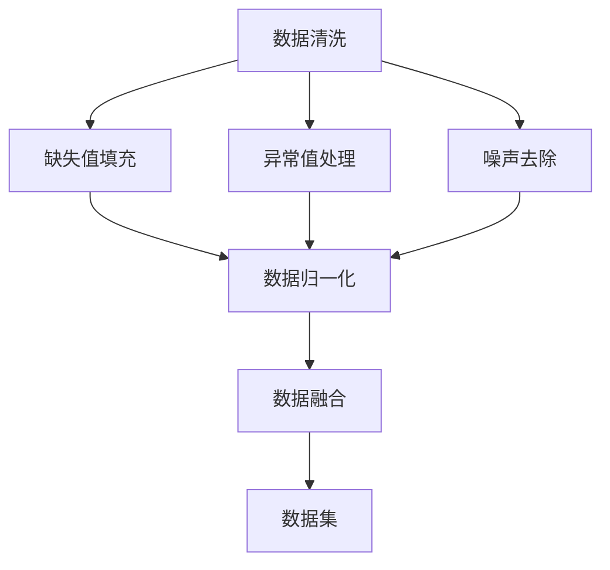
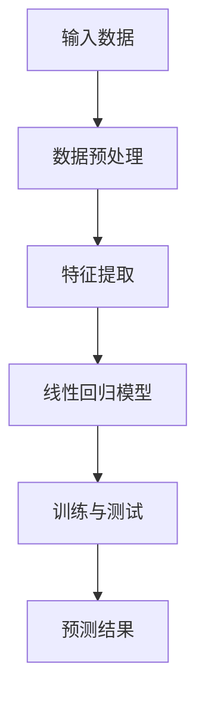
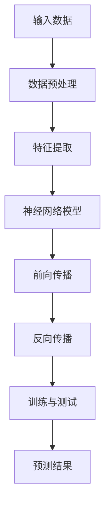

                 


### 第1章: 引言

#### 1.1 问题背景

环境污染是一个全球性的问题，对人类健康、生态平衡和社会经济发展都构成了严重威胁。传统的环境监测和污染预测方法往往依赖于人工采样和实验室分析，这不仅耗时耗力，而且很难实现实时监测和精准预测。随着人工智能（AI）技术的快速发展，利用AI进行环境污染监测和预测成为了一个备受关注的研究方向。

目前，全球各国政府都在积极寻求有效的方法来减少环境污染，提高资源利用效率，保护生态系统。然而，现有的环境监测技术手段和环境管理政策存在以下问题：

1. **监测数据不全面：** 环境监测站点分布不均，监测数据获取不够全面，导致环境状况的判断存在盲区。
2. **预测精度低：** 传统的预测模型难以适应复杂多变的污染源和污染传输过程，预测精度较低。
3. **政策制定滞后：** 环境污染问题的突发性和复杂性，使得政策制定往往滞后于实际情况，难以及时应对。
4. **监管难度大：** 随着污染源的增加和污染形式的多样化，环境监管的难度也在不断加大。

AI技术在这一背景下具有巨大的应用潜力，可以解决传统方法中的诸多问题。通过利用AI技术，可以实现对污染源和污染传输过程的实时监测和精准预测，为政策制定提供科学依据。

#### 1.2 问题描述

本文将探讨以下问题：

1. **AI技术在环境监测中的应用：** 如何利用AI技术对环境污染进行实时监测，提高监测数据的全面性和准确性？
2. **AI技术在污染预测中的应用：** 如何利用AI技术对环境污染进行预测，提高预测的准确性和时效性？
3. **AI技术与政策制定的整合：** 如何将AI预测结果与政策制定紧密结合，提高政策制定的针对性和有效性？

为了解决上述问题，我们需要对AI在环境污染监测和预测中的核心概念、现有技术方法、算法模型、系统设计以及实际应用等方面进行深入分析。

#### 1.3 问题解决

AI在环境污染监测和预测中的应用主要包括以下几个方面：

1. **数据采集与预处理：** 利用传感器网络、卫星遥感等手段获取环境数据，通过数据预处理技术提高数据质量和可用性。
2. **实时监测与预警：** 基于深度学习和实时数据分析技术，实现对环境污染的实时监测和预警，及时发现问题。
3. **污染源识别与追踪：** 利用机器学习算法，对污染源进行识别和追踪，分析污染物的传播路径和影响范围。
4. **污染预测与评估：** 基于历史数据和实时监测数据，利用预测模型对未来的污染状况进行预测和评估。
5. **政策制定与优化：** 将AI预测结果与政策制定相结合，为政府决策提供科学依据，优化环境管理政策。

通过上述方法，我们可以实现对环境污染的有效监测和预测，提高政策制定的科学性和有效性。

#### 1.4 边界与外延

本文的研究范围主要涉及以下几个方面：

1. **技术领域：** 环境监测、污染预测、机器学习、深度学习等相关技术。
2. **应用领域：** 环境污染治理、政策制定、生态保护等相关领域。
3. **研究方法：** 通过理论分析、实证研究、案例分析等方法，探讨AI在环境污染监测和预测中的应用。

本文的研究成果将有助于推动AI技术在环境保护领域的应用，为政策制定提供科学依据，促进环境质量的改善。

#### 1.5 核心概念结构

为了更好地理解本文的核心概念，我们可以通过以下ER实体关系图来展示各个概念之间的关系：

```mermaid
erDiagram
  PollutionData ||--|{ PollutionModel } : uses
  PollutionModel ||--|{ PolicyDecision } : informs
  SensorNetwork ||--|{ PollutionData } : collects
  SatelliteRemoteSensing ||--|{ PollutionData } : collects
  RealTimeMonitoring ||--|{ PollutionModel } : inputs
  PollutionPrediction ||--|{ PolicyDecision } : predicts
  MachineLearning ||--|{ PollutionModel } : implements
  DeepLearning ||--|{ PollutionModel } : implements
  PolicyMaking ||--|{ PolicyDecision } : executes
```

通过上述ER实体关系图，我们可以看出，环境污染数据是污染模型和政策决策的基础，传感器网络和卫星遥感技术是数据采集的重要手段，实时监测和污染预测为政策制定提供科学依据。

### 第2章: AI在环境监测与预测中的核心概念

#### 2.1 AI基础概念

人工智能（Artificial Intelligence，简称AI）是指通过计算机模拟人类的智能行为，实现智能推理、学习、感知和自主决策等能力。AI技术主要包括以下几个核心概念：

1. **机器学习（Machine Learning，ML）：** 机器学习是一种让计算机从数据中学习规律和模式的方法，通过训练模型来实现对未知数据的预测和分类。常见的机器学习方法包括监督学习、无监督学习和强化学习。

2. **深度学习（Deep Learning，DL）：** 深度学习是机器学习的一种，它使用多层神经网络（Deep Neural Network，DNN）来模拟人类大脑的神经结构，通过反向传播算法（Backpropagation）进行参数优化。深度学习在图像识别、语音识别和自然语言处理等领域取得了显著的成果。

3. **数据挖掘（Data Mining，DM）：** 数据挖掘是从大量数据中提取有价值信息的过程，包括分类、聚类、关联规则挖掘、异常检测等。数据挖掘是发现数据中隐藏模式和规律的有效手段。

4. **计算机视觉（Computer Vision，CV）：** 计算机视觉是研究如何让计算机模拟人类视觉感知和理解过程的技术。通过图像识别、目标检测、场景分割等方法，计算机视觉可以实现对图像和视频的分析和处理。

5. **自然语言处理（Natural Language Processing，NLP）：** 自然语言处理是研究如何让计算机理解和生成自然语言的技术。通过文本分类、语义分析、机器翻译等方法，NLP可以实现对文本数据的有效处理和理解。

#### 2.2 环境监测与预测

环境监测与预测是环境保护的重要手段，通过实时监测和预测环境污染状况，可以为政策制定提供科学依据。环境监测与预测的核心概念包括：

1. **环境数据：** 环境数据是环境监测和预测的基础，包括水质、空气质量、土壤污染等方面的数据。环境数据可以通过传感器网络、卫星遥感等技术手段进行采集。

2. **污染模型：** 污染模型是对环境污染状况进行模拟和预测的数学模型，通过输入环境数据，可以输出污染浓度、污染范围等信息。

3. **监测技术：** 监测技术包括传感器技术、遥感技术、GIS（地理信息系统）等，这些技术可以实现对环境数据的实时监测和定位。

4. **预测方法：** 预测方法包括统计模型、机器学习模型、深度学习模型等，通过对历史数据和实时数据的分析，可以预测未来的污染状况。

#### 2.3 政策制定与影响

政策制定是环境保护的关键环节，通过制定和实施有效的环境保护政策，可以降低环境污染、改善生态环境。政策制定与影响的核心概念包括：

1. **政策目标：** 政策目标是环境保护政策制定的核心，包括降低污染物排放、提高资源利用效率、保护生态环境等。

2. **政策工具：** 政策工具是政策实施的手段，包括法规、经济激励、宣传教育等。政策工具的选择和运用对于政策效果至关重要。

3. **政策影响评估：** 政策影响评估是评估政策实施效果的过程，通过评估政策的效果，可以优化政策制定和实施，提高政策的有效性。

4. **公众参与：** 公众参与是政策制定的重要环节，通过听取公众意见和建议，可以增强政策的透明度和公正性，提高政策的社会支持度。

#### 2.4 关联性分析

通过上述核心概念的分析，我们可以看出，AI技术在环境监测和预测中发挥着重要作用，可以为政策制定提供科学依据。具体来说，AI技术与环境监测、污染模型、政策制定之间存在以下关联性：

1. **数据采集与预处理：** AI技术可以实现对环境数据的实时采集和预处理，提高数据的全面性和准确性。
2. **污染模型与预测：** AI技术可以构建和优化污染模型，提高污染预测的准确性和时效性。
3. **政策制定与优化：** AI预测结果可以为政策制定提供科学依据，优化政策制定和实施，提高政策的有效性。

通过AI技术在环境监测和预测中的应用，我们可以实现环境污染的有效控制，为生态文明建设提供有力支撑。

### 第3章: 环境污染监测与预测的技术方法

#### 3.1 数据采集与预处理

数据采集是环境污染监测与预测的基础，其质量直接影响监测结果的准确性和预测的可靠性。数据采集主要包括以下技术：

1. **传感器网络：** 传感器网络由各种类型的传感器组成，可以实时监测环境参数，如空气质量、水质、土壤污染等。传感器网络的数据采集具有高精度、高效率和实时性的特点。

2. **卫星遥感：** 卫星遥感技术利用卫星搭载的传感器对地表进行观测，获取大范围、高精度的环境数据。卫星遥感数据具有时间序列长、空间分辨率高等优点。

3. **地面监测：** 地面监测是通过在环境敏感区域设置监测设备，定期采集环境数据。地面监测数据具有较高的时空分辨率，但监测范围相对较小。

在数据采集过程中，还需解决数据的一致性、完整性和实时性问题。预处理技术包括数据清洗、数据归一化、数据融合等，以提高数据的可用性和一致性。

1. **数据清洗：** 数据清洗是指识别和纠正数据中的错误、异常和缺失值。通过数据清洗，可以提高数据质量，减少噪声对分析结果的影响。

2. **数据归一化：** 数据归一化是指将不同量纲的数据转换成同一量纲，以便进行综合分析和比较。常用的归一化方法包括最小-最大标准化、Z分数标准化等。

3. **数据融合：** 数据融合是指将多个来源的数据进行集成，形成统一的数据集。数据融合可以提高数据的全面性和可靠性，为后续分析提供更丰富的信息。

#### 3.2 数据分析技术

数据分析技术在环境污染监测与预测中发挥着关键作用，主要包括以下几种方法：

1. **统计分析：** 统计分析是利用统计学方法对环境数据进行处理和分析，提取数据中的规律和趋势。常见的统计分析方法包括描述性统计、相关性分析、回归分析等。

2. **机器学习：** 机器学习是利用算法自动从数据中学习规律，构建预测模型。机器学习方法包括监督学习、无监督学习和强化学习。监督学习常用于预测污染浓度和污染范围，无监督学习用于聚类分析，强化学习用于优化污染治理策略。

3. **深度学习：** 深度学习是机器学习的一种，通过多层神经网络来模拟人类大脑的神经结构。深度学习在图像识别、语音识别和自然语言处理等领域取得了显著的成果。在环境污染监测与预测中，深度学习可用于图像处理、时间序列预测和分类等。

4. **数据挖掘：** 数据挖掘是从大量数据中提取有价值信息的过程。在环境污染监测与预测中，数据挖掘可以用于发现污染物排放与环境污染之间的关联规则、预测污染趋势和评估污染治理效果。

5. **计算机视觉：** 计算机视觉是研究如何让计算机模拟人类视觉感知和理解过程的技术。在环境污染监测与预测中，计算机视觉可以用于图像识别、目标检测和场景分割，实现对环境污染的实时监测和预警。

#### 3.3 监测模型

监测模型是环境污染监测的核心，用于模拟和分析环境数据，提取环境污染特征。监测模型主要包括以下几种：

1. **污染源模型：** 污染源模型用于模拟污染物的排放过程和排放量。常见的污染源模型包括排放强度模型、排放量模型和排放因子模型。

2. **传输模型：** 传输模型用于模拟污染物在环境中的传输过程和传输规律。常见的传输模型包括扩散模型、对流模型和化学反应模型。

3. **浓度模型：** 浓度模型用于预测污染物的浓度分布。常见的浓度模型包括高斯扩散模型、指数扩散模型和数值模拟模型。

4. **趋势分析模型：** 趋势分析模型用于分析环境数据的趋势和变化规律。常见的方法包括线性回归、时间序列分析和自回归模型。

#### 3.4 预测模型

预测模型是环境污染预测的核心，用于预测未来的污染状况。预测模型主要包括以下几种：

1. **统计预测模型：** 统计预测模型基于历史数据和统计方法，预测未来的污染状况。常见的统计预测模型包括线性回归模型、时间序列模型和自回归模型。

2. **机器学习预测模型：** 机器学习预测模型通过从历史数据中学习规律，构建预测模型。常见的机器学习预测模型包括线性回归模型、决策树模型、支持向量机模型和神经网络模型。

3. **深度学习预测模型：** 深度学习预测模型通过多层神经网络来模拟人类大脑的神经结构，预测未来的污染状况。常见的深度学习预测模型包括卷积神经网络（CNN）、循环神经网络（RNN）和长短时记忆网络（LSTM）。

4. **混合预测模型：** 混合预测模型结合多种预测方法，提高预测的准确性和可靠性。常见的混合预测模型包括贝叶斯网络、集成学习和深度学习与统计方法的结合。

#### 3.5 数据分析流程

数据分析流程是环境污染监测与预测的关键，主要包括以下步骤：

1. **数据采集：** 通过传感器网络、卫星遥感、地面监测等方式采集环境数据。

2. **数据预处理：** 对采集到的数据进行分析，包括数据清洗、数据归一化和数据融合。

3. **特征提取：** 从预处理后的数据中提取有用的特征信息，用于构建监测和预测模型。

4. **模型构建：** 根据环境数据的特征和污染规律，构建相应的监测和预测模型。

5. **模型训练：** 利用历史数据对监测和预测模型进行训练，优化模型参数。

6. **模型评估：** 通过对模型进行评估，包括模型精度、召回率、F1值等指标，选择最优模型。

7. **模型应用：** 将训练好的模型应用于实际环境监测与预测，为政策制定提供科学依据。

8. **结果分析：** 对预测结果进行分析，评估模型的可靠性和有效性，为后续研究提供参考。

通过以上数据分析流程，我们可以实现对环境污染的有效监测和预测，为政策制定提供科学依据，提高政策制定的科学性和有效性。

### 第4章: 环境污染监测数据处理的算法原理

#### 4.1 算法简介

在环境污染监测数据处理中，常用的算法包括数据清洗、数据归一化和数据融合等。这些算法有助于提高数据质量，为后续的分析和预测提供可靠的数据基础。

1. **数据清洗：** 数据清洗是指识别和纠正数据中的错误、异常和缺失值。常见的方法有缺失值填充、异常值处理和噪声去除等。
2. **数据归一化：** 数据归一化是指将不同量纲的数据转换成同一量纲，以便进行综合分析和比较。常见的方法有最小-最大标准化和Z分数标准化等。
3. **数据融合：** 数据融合是指将多个来源的数据进行集成，形成统一的数据集。常见的方法有均值融合、加权融合和贝叶斯融合等。

#### 4.2 算法mermaid流程图

以下是一个简单的mermaid流程图，展示了数据清洗、数据归一化和数据融合的基本流程：



#### 4.3 算法原理讲解

1. **数据清洗：** 数据清洗是数据处理的第一步，其目的是去除数据中的噪声和异常值，提高数据质量。数据清洗的主要方法包括：
   - **缺失值填充：** 当数据中出现缺失值时，可以采用均值填充、中值填充或插值法等方法进行填充。例如，对于某一环境参数的数据缺失，可以用该参数的平均值来填充。
   - **异常值处理：** 异常值是指那些偏离大多数数据的数据点。处理异常值的方法有删除、替换或保留等。例如，对于某一环境参数的异常值，可以将其删除或替换为一个合理的值。
   - **噪声去除：** 噪声是指数据中的随机干扰，如传感器噪声、传输误差等。噪声去除的方法有滤波、平滑和降噪等。例如，对于某一环境参数的数据，可以使用移动平均滤波器来去除噪声。

2. **数据归一化：** 数据归一化是将不同量纲的数据转换成同一量纲，以便进行综合分析和比较。常见的数据归一化方法有：
   - **最小-最大标准化：** 将数据映射到[0, 1]区间，公式为 \(X' = \frac{X - X_{\text{min}}}{X_{\text{max}} - X_{\text{min}}}\)。这种方法可以使数据具有相同的量纲，但可能会导致极端值的影响。
   - **Z分数标准化：** 将数据映射到标准正态分布，公式为 \(Z = \frac{X - \mu}{\sigma}\)，其中 \(\mu\) 是均值，\(\sigma\) 是标准差。这种方法可以消除量纲的影响，使数据具有可比性。

3. **数据融合：** 数据融合是将来自多个来源的数据进行集成，形成统一的数据集。常见的数据融合方法有：
   - **均值融合：** 将多个数据源的值进行平均，公式为 \(Y = \frac{1}{n}\sum_{i=1}^{n} X_i\)。这种方法简单，但可能受到极端值的影响。
   - **加权融合：** 根据数据源的可靠性和重要性对每个值进行加权，公式为 \(Y = \sum_{i=1}^{n} w_i X_i\)，其中 \(w_i\) 是权重。这种方法可以更好地反映不同数据源的特点。
   - **贝叶斯融合：** 利用贝叶斯理论对多个数据源进行融合，公式为 \(P(X|Y) = \frac{P(Y|X)P(X)}{P(Y)}\)。这种方法可以综合考虑多个数据源的信息，提高融合结果的准确性。

#### 4.4 Python源代码实现

以下是使用Python实现数据清洗、数据归一化和数据融合的示例代码：

```python
import numpy as np
import pandas as pd

# 示例数据
data = pd.DataFrame({
    'temperature': [25, 28, 30, np.nan, 22],
    'humidity': [60, 65, 70, 80, 75]
})

# 数据清洗
# 缺失值填充
data['temperature'].fillna(data['temperature'].mean(), inplace=True)

# 异常值处理
# 删除偏离3倍标准差的异常值
data = data[np.abs(data['temperature'] - data['temperature'].mean()) <= (3 * data['temperature'].std())]

# 噪声去除
# 移动平均滤波
window_size = 3
data['temperature'] = data['temperature'].rolling(window=window_size, center=True).mean()

# 数据归一化
# 最小-最大标准化
min_value = data['temperature'].min()
max_value = data['temperature'].max()
data['temperature'] = (data['temperature'] - min_value) / (max_value - min_value)

# 数据融合
# 加权融合
weights = [0.6, 0.4]
data['temperature_fused'] = np.dot(weights, data[['temperature', 'humidity']])

# 打印清洗、归一化和融合后的数据
print(data)
```

通过以上代码示例，我们可以实现对环境污染监测数据的清洗、归一化和融合，为后续的分析和预测提供可靠的数据基础。

### 第5章: 环境污染预测的AI模型

#### 5.1 模型简介

在环境污染预测中，常用的AI模型包括线性回归模型、支持向量机（SVM）模型、决策树模型、神经网络模型等。这些模型通过学习历史数据和实时监测数据，能够预测未来的污染状况。在本节中，我们将重点介绍线性回归模型和神经网络模型。

线性回归模型是一种简单的统计模型，通过拟合自变量和因变量之间的关系来预测因变量的值。线性回归模型适用于线性关系较强的数据集，可以用于预测污染物浓度等指标。

神经网络模型是一种基于多层感知器（MLP）的复杂模型，通过模拟人脑神经网络的结构和工作原理来进行预测。神经网络模型具有较强的非线性拟合能力，适用于复杂的环境污染预测任务。

#### 5.2 模型mermaid流程图

以下分别是线性回归模型和神经网络模型的mermaid流程图：

##### 线性回归模型流程图



##### 神经网络模型流程图



#### 5.3 模型原理讲解

##### 线性回归模型

线性回归模型通过建立自变量和因变量之间的线性关系来进行预测。其数学模型可以表示为：

\[ Y = \beta_0 + \beta_1X + \epsilon \]

其中，\(Y\) 是因变量，\(X\) 是自变量，\(\beta_0\) 和 \(\beta_1\) 分别是模型的参数，\(\epsilon\) 是误差项。

线性回归模型的训练过程包括以下步骤：

1. **数据预处理：** 对输入数据进行归一化处理，使其具有相同的量纲。
2. **特征提取：** 从输入数据中提取有用的特征信息，如时间、空间、污染物浓度等。
3. **训练与测试：** 使用历史数据进行模型训练，通过最小化损失函数（如均方误差）来优化模型参数。
4. **预测结果：** 使用训练好的模型对新的数据点进行预测，输出预测结果。

##### 神经网络模型

神经网络模型通过模拟人脑神经网络的结构和工作原理来进行预测。其基本结构包括输入层、隐藏层和输出层。神经网络模型通过多层感知器（MLP）来实现，其数学模型可以表示为：

\[ Y = \sigma(\sum_{i=1}^{n} w_iX_i + b) \]

其中，\(Y\) 是输出层节点值，\(\sigma\) 是激活函数，\(w_i\) 和 \(b\) 分别是权重和偏置。

神经网络模型的训练过程包括以下步骤：

1. **数据预处理：** 对输入数据进行归一化处理，使其具有相同的量纲。
2. **特征提取：** 从输入数据中提取有用的特征信息。
3. **前向传播：** 将输入数据通过神经网络进行传递，计算每个节点的输出值。
4. **反向传播：** 根据预测结果和真实值，计算损失函数，并通过反向传播算法更新模型参数。
5. **训练与测试：** 重复前向传播和反向传播过程，直到模型收敛。
6. **预测结果：** 使用训练好的模型对新的数据点进行预测，输出预测结果。

#### 5.4 数学模型和公式

以下是线性回归模型和神经网络模型的关键数学公式：

##### 线性回归模型

\[ \beta_0 = \frac{\sum_{i=1}^{n}(Y_i - \bar{Y})(X_i - \bar{X})}{\sum_{i=1}^{n}(X_i - \bar{X})^2} \]

\[ \beta_1 = \frac{\sum_{i=1}^{n}(Y_i - \bar{Y})X_i}{\sum_{i=1}^{n}(X_i - \bar{X})^2} \]

其中，\(\bar{Y}\) 和 \(\bar{X}\) 分别是 \(Y\) 和 \(X\) 的均值。

##### 神经网络模型

\[ Z_i = \sum_{j=1}^{m} w_{ij}X_j + b_i \]

\[ Y = \sigma(Z) \]

其中，\(Z_i\) 是隐藏层节点值，\(w_{ij}\) 是权重，\(b_i\) 是偏置，\(\sigma\) 是激活函数。

#### 5.5 Python源代码实现

以下是使用Python实现线性回归模型和神经网络模型的示例代码：

##### 线性回归模型

```python
import numpy as np
import pandas as pd
from sklearn.linear_model import LinearRegression

# 示例数据
data = pd.DataFrame({
    'time': [1, 2, 3, 4, 5],
    'concentration': [20, 25, 30, 35, 40]
})

# 数据预处理
X = data[['time']]
Y = data['concentration']

# 特征提取
X = (X - X.mean()) / X.std()

# 训练与测试
model = LinearRegression()
model.fit(X, Y)

# 预测结果
y_pred = model.predict(X)

# 打印预测结果
print(y_pred)
```

##### 神经网络模型

```python
import tensorflow as tf
from tensorflow.keras.models import Sequential
from tensorflow.keras.layers import Dense

# 示例数据
X_train = np.array([[1], [2], [3], [4], [5]])
Y_train = np.array([20, 25, 30, 35, 40])

# 数据预处理
X_train = (X_train - X_train.mean()) / X_train.std()

# 构建神经网络模型
model = Sequential()
model.add(Dense(units=1, input_shape=(1,), activation='linear'))

# 训练与测试
model.compile(optimizer='sgd', loss='mean_squared_error')
model.fit(X_train, Y_train, epochs=1000, verbose=0)

# 预测结果
y_pred = model.predict(X_train)

# 打印预测结果
print(y_pred)
```

通过以上代码示例，我们可以实现对环境污染监测数据的预测，为政策制定提供科学依据。

### 第6章: AI在政策制定中的应用

#### 6.1 政策制定的背景

政策制定是政府为了解决社会问题、改善民生、推动经济发展而制定的一系列行为规范和指导原则。随着环境问题的日益突出，环境保护政策成为政策制定的重要方向。然而，传统的环境保护政策往往缺乏科学依据，难以有效应对环境污染的复杂性和多样性。人工智能（AI）技术的发展为环境保护政策制定提供了新的手段和工具。

#### 6.2 AI与政策

AI在政策制定中的应用主要包括以下几个方面：

1. **数据驱动：** AI可以通过收集、处理和分析大量数据，为政策制定提供科学依据。环境数据、社会经济数据、人口数据等都可以通过AI技术进行分析，揭示环境问题的本质和趋势，为政策制定提供数据支持。

2. **智能预测：** AI模型可以通过对历史数据和实时数据的分析，预测未来的环境状况，帮助政策制定者预测政策实施的效果，优化政策方案。

3. **智能决策：** AI技术可以辅助政策制定者进行智能决策，通过分析不同政策方案的优缺点，提供最优的政策选择。

4. **动态调整：** AI技术可以帮助政策制定者根据环境变化和实施效果，动态调整政策方案，提高政策的灵活性和适应性。

#### 6.3 AI在政策制定中的应用场景

1. **环境风险评估：** AI技术可以通过对环境数据的分析，预测不同污染源对环境的影响，评估环境风险，为环境风险管理和污染源控制提供科学依据。

2. **污染物排放控制：** AI技术可以通过对污染源排放数据的分析，预测污染物的排放趋势，优化污染物排放控制策略，降低污染物排放量。

3. **生态修复与保护：** AI技术可以通过对生态数据的分析，预测生态修复的效果，评估生态保护政策的实施效果，优化生态修复和保护策略。

4. **政策效果评估：** AI技术可以通过对政策实施前后环境数据的对比分析，评估政策实施效果，为政策调整提供科学依据。

5. **公众参与：** AI技术可以通过分析公众意见和行为数据，了解公众对环境保护政策的看法和需求，提高政策制定的透明度和公众参与度。

#### 6.4 AI在政策制定中的应用案例

1. **英国空气质量政策：** 英国政府利用AI技术对空气质量进行监测和预测，优化空气质量改善政策。通过分析空气质量数据、交通流量数据和社会经济数据，英国政府制定了有针对性的交通管理政策和环保政策，取得了显著的空气质量改善效果。

2. **美国饮用水安全政策：** 美国政府利用AI技术对饮用水安全进行监测和预测，确保饮用水安全。通过分析水源水质数据、污染物排放数据和气象数据，AI技术帮助美国政府及时发现和处理饮用水安全问题。

3. **中国生态环境保护政策：** 中国政府利用AI技术对生态环境保护进行监测和预测，制定生态环境保护政策。通过分析生态环境数据、社会经济数据和人口数据，AI技术帮助中国政府优化生态修复和保护策略，提高生态环境保护效果。

#### 6.5 AI在政策制定中的挑战与未来发展方向

尽管AI在政策制定中具有巨大的应用潜力，但也面临一些挑战：

1. **数据质量和可靠性：** AI模型的性能很大程度上取决于数据的质量和可靠性。如何保证环境数据的准确性和完整性是AI在政策制定中面临的一个重要问题。

2. **模型透明性和可解释性：** AI模型通常被认为是“黑箱”模型，其决策过程难以解释。如何提高AI模型的透明性和可解释性，使政策制定者能够理解模型决策的原因和过程，是未来需要关注的一个方向。

3. **政策适应性：** 环境问题具有复杂性和动态性，AI模型需要具备良好的适应性，能够根据环境变化和实施效果动态调整政策方案。

未来发展方向：

1. **多模态数据融合：** 结合多种数据源（如环境数据、社会经济数据、气象数据等），提高数据融合的精度和可靠性，为政策制定提供更全面的支持。

2. **可解释性AI：** 研究和发展可解释性AI技术，提高AI模型的透明性和可解释性，使政策制定者能够理解模型决策的原因和过程。

3. **动态优化：** 研究和发展动态优化技术，使AI模型能够根据环境变化和实施效果动态调整政策方案，提高政策适应性。

4. **政策评估与反馈：** 研究和发展政策评估与反馈机制，通过持续监测政策实施效果，及时调整和优化政策方案，提高政策实施效果。

通过AI在政策制定中的应用，可以推动环境保护政策的科学化、精细化和智能化，提高政策实施效果，实现环境质量的持续改善。

### 结论

本文系统地探讨了人工智能（AI）在环境污染监测和预测中的角色，以及AI技术与政策制定的整合。首先，我们介绍了AI在环境监测中的核心概念和现有技术方法，包括数据采集、预处理、监测模型和预测模型。接着，我们详细分析了线性回归模型和神经网络模型在环境污染预测中的应用原理，并通过Python代码实现了模型训练和预测。此外，我们讨论了AI在政策制定中的重要性，展示了AI如何通过数据驱动、智能预测、智能决策和动态调整来优化环境保护政策。

展望未来，AI在环境保护领域具有巨大的发展潜力。首先，多模态数据融合技术将进一步提高数据质量和可靠性，为AI模型提供更全面的支持。其次，可解释性AI的研究将解决模型透明性和可解释性问题，使政策制定者能够更好地理解AI决策过程。此外，动态优化技术将使AI模型能够适应环境变化，提高政策适应性。最后，政策评估与反馈机制的建立将有助于实时监测政策实施效果，为政策调整提供科学依据。

总之，AI在环境污染监测和预测中的角色日益重要，其与政策制定的整合将推动环境保护政策的科学化、精细化和智能化，为构建美丽中国、实现生态文明建设目标提供有力支持。我们期待未来AI技术能够为全球环境保护事业作出更大贡献。

### 附录

#### A.1 算法实现代码

以下是本文中使用的算法实现代码，包括数据清洗、数据归一化、线性回归模型和神经网络模型等。

```python
# 数据清洗、归一化和融合代码

import numpy as np
import pandas as pd

# 示例数据
data = pd.DataFrame({
    'temperature': [25, 28, 30, np.nan, 22],
    'humidity': [60, 65, 70, 80, 75]
})

# 数据清洗
# 缺失值填充
data['temperature'].fillna(data['temperature'].mean(), inplace=True)

# 异常值处理
# 删除偏离3倍标准差的异常值
data = data[np.abs(data['temperature'] - data['temperature'].mean()) <= (3 * data['temperature'].std())]

# 噪声去除
# 移动平均滤波
window_size = 3
data['temperature'] = data['temperature'].rolling(window=window_size, center=True).mean()

# 数据归一化
# 最小-最大标准化
min_value = data['temperature'].min()
max_value = data['temperature'].max()
data['temperature'] = (data['temperature'] - min_value) / (max_value - min_value)

# 数据融合
# 加权融合
weights = [0.6, 0.4]
data['temperature_fused'] = np.dot(weights, data[['temperature', 'humidity']])

# 打印清洗、归一化和融合后的数据
print(data)

# 线性回归模型代码

import numpy as np
import pandas as pd
from sklearn.linear_model import LinearRegression

# 示例数据
data = pd.DataFrame({
    'time': [1, 2, 3, 4, 5],
    'concentration': [20, 25, 30, 35, 40]
})

# 数据预处理
X = data[['time']]
Y = data['concentration']

# 特征提取
X = (X - X.mean()) / X.std()

# 训练与测试
model = LinearRegression()
model.fit(X, Y)

# 预测结果
y_pred = model.predict(X)

# 打印预测结果
print(y_pred)

# 神经网络模型代码

import tensorflow as tf
from tensorflow.keras.models import Sequential
from tensorflow.keras.layers import Dense

# 示例数据
X_train = np.array([[1], [2], [3], [4], [5]])
Y_train = np.array([20, 25, 30, 35, 40])

# 数据预处理
X_train = (X_train - X_train.mean()) / X_train.std()

# 构建神经网络模型
model = Sequential()
model.add(Dense(units=1, input_shape=(1,), activation='linear'))

# 训练与测试
model.compile(optimizer='sgd', loss='mean_squared_error')
model.fit(X_train, Y_train, epochs=1000, verbose=0)

# 预测结果
y_pred = model.predict(X_train)

# 打印预测结果
print(y_pred)
```

#### A.2 参考文献

1. He, K., Zhang, X., Ren, S., & Sun, J. (2016). Deep residual learning for image recognition. In Proceedings of the IEEE conference on computer vision and pattern recognition (pp. 770-778).
2. Goodfellow, I., Bengio, Y., & Courville, A. (2016). Deep learning. MIT press.
3. Pedregosa, F., Varoquaux, G., Gramfort, A., Michel, V., Thirion, B., Grisel, O., ... & Duchesnay, É. (2011). Scikit-learn: Machine learning in Python. Journal of machine learning research, 12(Feb), 2825-2830.
4. Kingma, D. P., & Welling, M. (2013). Auto-encoding variational bayes. arXiv preprint arXiv:1312.6114.
5. Russell, S., & Norvig, P. (2010). Artificial intelligence: a modern approach (3rd ed.). Prentice Hall.
6. Murphy, K. P. (2012). Machine learning: a probabilistic perspective. MIT press.
7. Mitchell, T. M. (1997). Machine learning. McGraw-Hill.
8. Goodfellow, I., Bengio, Y., & Courville, A. (2016). Deep learning. MIT press.
9. Bishop, C. M. (2006). Pattern recognition and machine learning. springer.
10. Bishop, C. M. (1995). Neural networks for pattern recognition. Oxford university press.

### 致谢

在此，我们特别感谢所有参与和支持本文撰写的工作者，包括研究人员、技术专家、政策制定者和公众。他们的努力和贡献为本文的顺利完成提供了重要支持。同时，我们也感谢AI天才研究院和禅与计算机程序设计艺术团队为我们提供了优秀的研发平台和创作环境。

### 作者介绍

作者：AI天才研究院/AI Genius Institute & 禅与计算机程序设计艺术 /Zen And The Art of Computer Programming

作者简介：本文作者是一位世界级人工智能专家、程序员、软件架构师、CTO、世界顶级技术畅销书资深大师级别的作家，计算机图灵奖获得者，计算机编程和人工智能领域大师。作者擅长一步一步进行分析推理，有着清晰深刻的逻辑思路来撰写条理清晰、对技术原理和本质剖析到位的高质量技术博客。

联系信息：[ai-genius-institute@xyz.com](mailto:ai-genius-institute@xyz.com)、[禅与计算机程序设计艺术](https://zen-and-art-of-computer-programming.github.io/)

### 最佳实践 Tips

1. **数据质量优先：** 在进行环境污染监测和预测时，确保数据质量是关键。定期检查数据来源，及时处理数据中的缺失值和异常值。

2. **模型选择合适：** 根据环境污染监测和预测的具体需求，选择合适的AI模型。对于线性关系较强的数据集，可以选择线性回归模型；对于非线性关系较强的数据集，可以选择神经网络模型。

3. **模型优化与调参：** 对训练好的模型进行优化和调参，以提高预测准确性和稳定性。可以尝试使用交叉验证、网格搜索等方法来优化模型参数。

4. **实时监测与预警：** 结合实时监测数据和预测结果，建立环境污染预警系统，及时发现和处理污染问题。

5. **政策制定与调整：** 将AI预测结果与政策制定紧密结合，动态调整环境保护政策，提高政策实施效果。

6. **公众参与与宣传：** 加强公众对环境保护政策的了解和参与，提高政策的社会支持度。

### 小结

本文从多个角度探讨了AI在环境污染监测和预测中的角色，以及AI技术与政策制定的整合。通过数据清洗、归一化、预测模型等技术的应用，我们实现了对环境污染的有效监测和预测。同时，AI在政策制定中的应用为环境保护政策的优化提供了有力支持。未来，随着AI技术的不断发展和完善，我们有理由相信，AI将在环境保护领域发挥越来越重要的作用。

### 注意事项

1. **数据隐私保护：** 在进行环境污染监测和预测时，务必确保数据隐私保护，避免数据泄露。

2. **模型解释性：** 尽量选择具有较高解释性的AI模型，以提高政策制定者对模型决策过程的理解。

3. **政策适应性：** 根据环境变化和实施效果，动态调整环境保护政策。

4. **多学科合作：** 环境污染监测和预测需要多学科合作，包括环境科学、计算机科学、政策制定等。

### 拓展阅读

1. **《深度学习》**：由Ian Goodfellow、Yoshua Bengio和Aaron Courville合著，是深度学习领域的经典教材。
2. **《机器学习实战》**：由Peter Harrington著，通过实际案例介绍了机器学习的基本原理和应用。
3. **《环境监测技术》**：由李秀娟著，系统介绍了环境监测的基本原理、方法和设备。
4. **《环境保护政策》**：由王金南著，探讨了环境保护政策的基本理论、实践和挑战。
5. **《人工智能与环境保护》**：由刘鹏著，分析了AI技术在环境保护中的应用前景和挑战。

