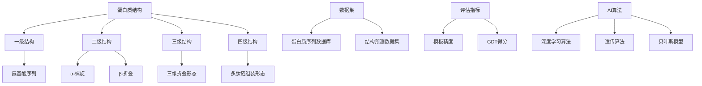
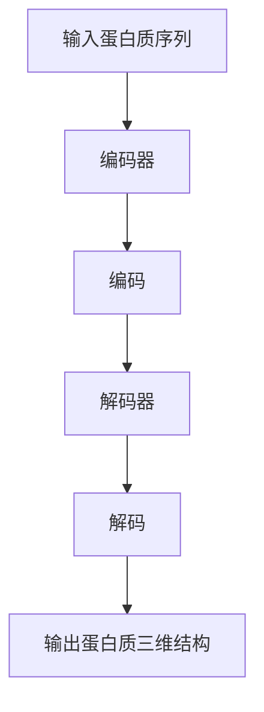
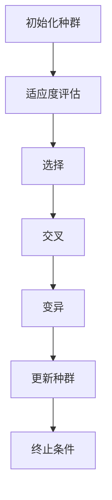
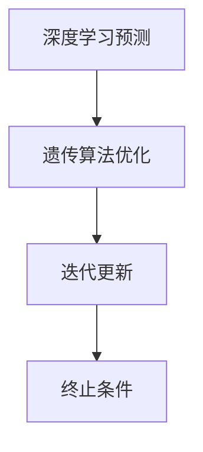
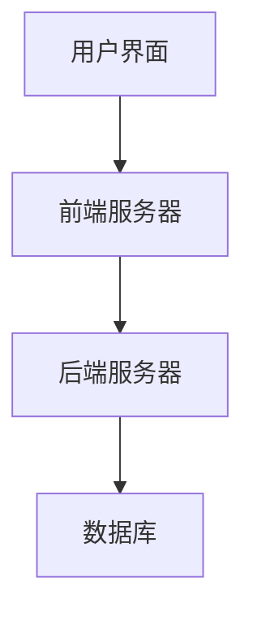
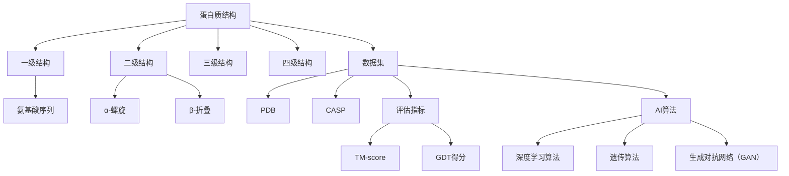
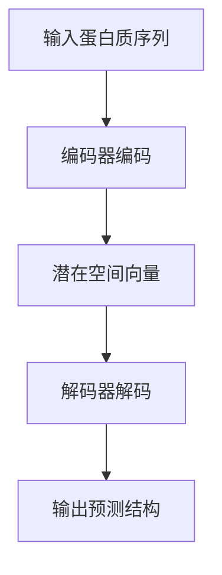
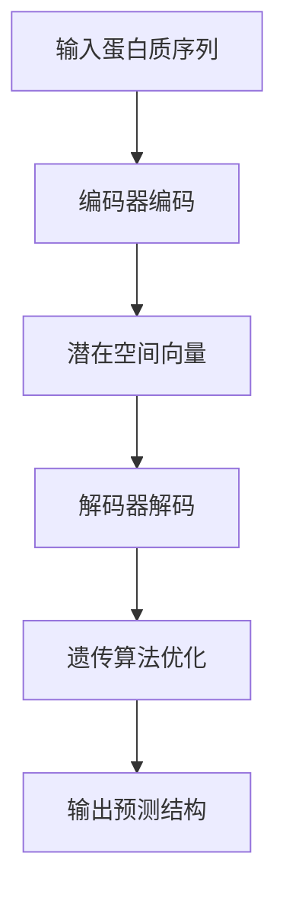

                 


### 1. 背景介绍

蛋白质是生物体的基本构建单元，它们在细胞中发挥着各种生物学功能。蛋白质的结构直接决定了其功能，因此，准确预测蛋白质的结构对于理解生物体的工作原理和开发新的药物具有重要意义。传统的蛋白质结构预测方法主要依赖于实验数据和高性能计算，但这些方法往往费时费力，且预测精度有限。随着人工智能技术的不断发展，特别是深度学习和生成对抗网络等先进算法的引入，蛋白质结构预测迎来了革命性的变革。

在药物研发中，蛋白质结构预测同样扮演着关键角色。药物与蛋白质的结合通常取决于它们的空间结构匹配度，因此，预测蛋白质结构可以帮助科学家设计更有效的药物分子。传统的药物研发流程繁琐且成本高昂，而利用AI加速蛋白质结构预测，不仅可以缩短研发周期，还能降低研发成本，从而提高药物研发的成功率。

本文将分为七个部分，深入探讨AI在蛋白质结构预测中的突破及其对药物研发的加速作用。第一部分将介绍AI与蛋白质结构预测的背景，包括关键术语、问题背景、解决方案、边界与外延以及概念结构与核心要素组成。第二部分将详细解析蛋白质结构预测的核心概念，包括蛋白质结构的类型、特征、数据集、评估指标以及AI算法的应用。第三部分将讲解常见蛋白质结构预测算法，包括深度学习算法、遗传算法等，并使用mermaid流程图和Python代码进行详细阐述。第四部分将介绍数学模型和公式，使用LaTeX格式嵌入文中，并举例说明。第五部分将探讨系统分析与架构设计，包括问题场景介绍、系统功能设计、系统架构设计、系统接口设计和系统交互。第六部分将通过一个具体案例展示如何实现蛋白质结构预测系统，包括环境安装、核心实现源代码和代码应用解读与分析。最后一部分将总结最佳实践、项目小结、注意事项和拓展阅读。

### 2. 核心概念与联系

蛋白质结构预测的核心在于理解蛋白质的三维结构，这需要依赖多种概念和技术。首先，我们需要明确蛋白质结构的类型和特征。

#### 2.1 蛋白质结构的类型和特征

蛋白质结构可以分为四个层次：一级结构（氨基酸序列）、二级结构（局部折叠模式，如α-螺旋和β-折叠）、三级结构（整条多肽链的三维折叠形态）和四级结构（多个多肽链的组装形态）。每种结构层次都有其独特的特征，如图1-1所示。

**图1-1：蛋白质结构的层次和特征**


#### 2.2 数据集

蛋白质结构预测依赖于大量的实验数据和计算数据。常用的数据集包括蛋白质序列数据库（如NCBI的Protein Data Bank, PDB）和结构预测数据集（如CASP，Critical Assessment of Techniques for Protein Structure Prediction）。这些数据集提供了大量的蛋白质序列和三维结构信息，为算法的训练和验证提供了基础。

#### 2.3 评估指标

蛋白质结构预测的质量通常通过一系列评估指标来衡量，如模板精度（TM-score）、GDT（Global Distance Test）得分等。这些指标能够量化预测结构与实验结构之间的相似度，从而评估预测的准确性。

#### 2.4 AI算法

在蛋白质结构预测中，AI算法发挥着重要作用。常见的算法包括深度学习算法（如AlphaFold2）、遗传算法和贝叶斯模型等。这些算法通过学习大量数据，能够自动发现蛋白质结构的规律，从而提高预测的精度。

#### 2.5 核心概念关系图

为了更好地理解这些概念之间的关系，我们可以使用Mermaid绘制一个核心概念关系图，如图1-2所示。



**图1-2：蛋白质结构预测的核心概念关系图**

通过上述关系图，我们可以清晰地看到蛋白质结构、数据集、评估指标和AI算法之间的相互作用。

### 3. 算法原理讲解

在蛋白质结构预测中，算法的选择至关重要。以下将详细介绍几种常用的算法，包括深度学习算法和遗传算法。

#### 3.1 深度学习算法

深度学习算法，尤其是基于变分自编码器（Variational Autoencoder, VAE）的算法，在蛋白质结构预测中取得了显著成果。AlphaFold2就是基于VAE的深度学习算法，其核心思想是通过编码器和解码器对蛋白质序列进行编码和解码，从而生成蛋白质的三维结构。

**算法流程图**



**图3-1：深度学习算法的流程图**

**Python代码示例**

```python
# 编码器部分
class Encoder(nn.Module):
    def __init__(self):
        super(Encoder, self).__init__()
        self.fc1 = nn.Linear(sequence_length, hidden_size)
        self.fc2 = nn.Linear(hidden_size, latent_size)
        
    def forward(self, x):
        x = F.relu(self.fc1(x))
        x = self.fc2(x)
        return x

# 解码器部分
class Decoder(nn.Module):
    def __init__(self):
        super(Decoder, self).__init__()
        self.fc1 = nn.Linear(latent_size, hidden_size)
        self.fc2 = nn.Linear(hidden_size, sequence_length)
        
    def forward(self, x):
        x = F.relu(self.fc1(x))
        x = self.fc2(x)
        return x

# 模型训练
encoder = Encoder()
decoder = Decoder()
optimizer = optim.Adam(list(encoder.parameters()) + list(decoder.parameters()))

for epoch in range(num_epochs):
    for sequence in data_loader:
        optimizer.zero_grad()
        encoded = encoder(sequence)
        decoded = decoder(encoded)
        loss = loss_function(decoded, sequence)
        loss.backward()
        optimizer.step()
```

**数学模型和公式**

深度学习中的数学模型主要包括损失函数、梯度下降等。以下是一个简单的损失函数示例：

$$
\text{loss} = \frac{1}{2} \sum_{i=1}^{n} (\text{predicted}_{i} - \text{true}_{i})^2
$$

其中，$n$表示样本数量，$\text{predicted}_{i}$和$\text{true}_{i}$分别表示预测值和真实值。

#### 3.2 遗传算法

遗传算法（Genetic Algorithm, GA）是一种基于自然选择和遗传学原理的优化算法，适用于复杂的搜索问题。在蛋白质结构预测中，遗传算法可以用于优化蛋白质的结构，从而提高预测的精度。

**算法流程图**



**图3-2：遗传算法的流程图**

**Python代码示例**

```python
import numpy as np

# 初始化种群
population = np.random.rand(population_size, chromosome_length)

# 适应度评估
def fitness_function(population):
    fitness_scores = np.zeros(population_size)
    for i in range(population_size):
        # 计算适应度分数
        fitness_scores[i] = ...
    return fitness_scores

# 选择
def selection(population, fitness_scores):
    selected = np.random.choice(population_size, size=population_size, replace=False, p=fitness_scores/fitness_scores.sum())
    return population[selected]

# 交叉
def crossover(parent1, parent2):
    crossover_point = np.random.randint(1, chromosome_length-1)
    child1 = np.concatenate((parent1[:crossover_point], parent2[crossover_point:]))
    child2 = np.concatenate((parent2[:crossover_point], parent1[crossover_point:]))
    return child1, child2

# 变异
def mutation(individual):
    for i in range(chromosome_length):
        if np.random.rand() < mutation_rate:
            individual[i] = np.random.rand()
    return individual

# 模型训练
for generation in range(num_generations):
    fitness_scores = fitness_function(population)
    selected = selection(population, fitness_scores)
    for i in range(int(population_size/2)):
        parent1, parent2 = selected[2*i], selected[2*i+1]
        child1, child2 = crossover(parent1, parent2)
        population[2*i], population[2*i+1] = mutation(child1), mutation(child2)
```

**数学模型和公式**

遗传算法中的数学模型主要包括适应度函数、交叉和变异等。以下是一个简单的适应度函数示例：

$$
\text{fitness}_{i} = \frac{1}{1 + \exp{(-\beta \cdot \text{error}_{i})}}
$$

其中，$\beta$是一个调节参数，$\text{error}_{i}$是第$i$个个体的适应度误差。

#### 3.3 融合算法

为了进一步提高蛋白质结构预测的精度，可以将深度学习和遗传算法结合起来，形成融合算法。以下是一个简单的融合算法示例。

**算法流程图**



**图3-3：融合算法的流程图**

**Python代码示例**

```python
# 深度学习预测
def deep_learning_prediction(sequence):
    encoded = encoder(sequence)
    decoded = decoder(encoded)
    return decoded

# 遗传算法优化
def genetic_algorithm_optimization(sequence, generations=100):
    population = initial_population(sequence)
    for generation in range(generations):
        fitness_scores = fitness_function(population)
        selected = selection(population, fitness_scores)
        for i in range(int(population_size/2)):
            parent1, parent2 = selected[2*i], selected[2*i+1]
            child1, child2 = crossover(parent1, parent2)
            population[2*i], population[2*i+1] = mutation(child1), mutation(child2)
        # 更新深度学习模型
        optimizer.zero_grad()
        predicted_sequence = deep_learning_prediction(sequence)
        loss = loss_function(predicted_sequence, sequence)
        loss.backward()
        optimizer.step()
    return population[-1]

# 融合算法训练
best_structure = genetic_algorithm_optimization(sequence)
```

### 4. 数学模型和数学公式讲解

在蛋白质结构预测中，数学模型和公式起着至关重要的作用。以下将详细介绍一些关键的数学模型和公式，并使用LaTeX格式嵌入文中。

#### 4.1 深度学习模型

深度学习模型通常包括输入层、隐藏层和输出层。以下是一个简单的深度学习模型示例：

$$
\text{Output}_{i} = \text{activation}(\sum_{j=1}^{n} \text{Weight}_{ij} \cdot \text{Input}_{j} + \text{Bias}_{i})
$$

其中，$n$是隐藏层节点的数量，$\text{Input}_{j}$是第$j$个输入节点的值，$\text{Weight}_{ij}$是第$i$个输出节点与第$j$个输入节点之间的权重，$\text{Bias}_{i}$是第$i$个输出节点的偏置，$\text{activation}$函数通常为ReLU函数。

#### 4.2 评估指标

评估蛋白质结构预测的质量通常使用模板精度（TM-score）和GDT（Global Distance Test）得分等指标。以下是一个简单的模板精度公式：

$$
\text{TM-score} = \frac{1}{N} \sum_{i=1}^{N} \left(1 - \cos(\theta_{\text{predicted}}, \theta_{\text{true}})\right)
$$

其中，$N$是匹配的残基对的数量，$\theta_{\text{predicted}}$和$\theta_{\text{true}}$分别是预测结构和实验结构中第$i$个残基对的夹角。

#### 4.3 遗传算法模型

遗传算法中的适应度函数通常用于评估个体的优劣。以下是一个简单的适应度函数公式：

$$
\text{fitness}_{i} = \frac{1}{1 + \exp{(-\beta \cdot \text{error}_{i})}}
$$

其中，$\beta$是一个调节参数，$\text{error}_{i}$是第$i$个个体的适应度误差。

#### 4.4 其他数学模型

除了上述模型和公式外，蛋白质结构预测中还涉及其他数学模型，如动态规划、图论等。以下是一个简单的动态规划公式：

$$
\text{optimal\_score}(i, j) = \max_{k} (\text{optimal\_score}(i, k) + \text{score}(k, j))
$$

其中，$i$和$j$分别是序列中的两个位置，$\text{score}(i, j)$是第$i$个残基和第$j$个残基之间的匹配得分。

### 5. 系统分析与架构设计

为了实现蛋白质结构预测系统，我们需要进行系统分析与架构设计。以下将介绍系统分析与架构设计的过程，包括问题场景介绍、系统功能设计、系统架构设计、系统接口设计和系统交互。

#### 5.1 问题场景介绍

蛋白质结构预测系统的目标是预测未知蛋白质的三维结构，以便于药物研发和其他生物学研究。问题场景可以描述为：输入蛋白质序列，输出蛋白质的三维结构。

#### 5.2 系统功能设计

系统功能设计包括识别输入蛋白质序列、进行结构预测和输出预测结果。具体功能如下：

- **输入蛋白质序列**：用户可以上传蛋白质序列文件或输入序列字符串。
- **结构预测**：系统使用深度学习和遗传算法对蛋白质序列进行结构预测。
- **输出预测结果**：系统将输出预测的三维结构图像和相关的评估指标。

#### 5.3 系统架构设计

系统架构设计包括前端界面、后端服务器和数据库。以下是一个简单的系统架构设计图：



**图5-1：系统架构设计图**

#### 5.4 系统接口设计

系统接口设计包括前端和后端的接口。以下是一个简单的接口设计：

- **前端接口**：用户可以通过HTTP请求上传蛋白质序列，并接收结构预测结果。
- **后端接口**：后端服务器接收前端上传的蛋白质序列，调用预测算法进行结构预测，并将结果返回给前端。

#### 5.5 系统交互

系统交互主要涉及前端和后端之间的通信。以下是一个简单的交互流程：

1. 用户上传蛋白质序列到前端服务器。
2. 前端服务器将序列发送到后端服务器。
3. 后端服务器调用预测算法进行结构预测。
4. 后端服务器将预测结果返回给前端服务器。
5. 前端服务器将预测结果呈现给用户。

### 6. 项目实战

为了展示如何实现蛋白质结构预测系统，以下将介绍一个具体的实现案例，包括环境安装、系统核心实现源代码和代码应用解读与分析。

#### 6.1 环境安装

首先，我们需要安装Python和相关的依赖库。以下是一个简单的安装命令：

```bash
pip install numpy tensorflow scipy matplotlib
```

#### 6.2 系统核心实现源代码

以下是一个简单的系统实现代码示例：

```python
import numpy as np
import tensorflow as tf
from scipy.spatial.distance import pdist
import matplotlib.pyplot as plt

# 编码器部分
class Encoder(tf.keras.Model):
    def __init__(self, latent_size):
        super(Encoder, self).__init__()
        self.fc1 = tf.keras.layers.Dense(latent_size, activation='relu')
        self.fc2 = tf.keras.layers.Dense(latent_size)
        
    def call(self, x):
        x = self.fc1(x)
        x = self.fc2(x)
        return x

# 解码器部分
class Decoder(tf.keras.Model):
    def __init__(self, latent_size):
        super(Decoder, self).__init__()
        self.fc1 = tf.keras.layers.Dense(latent_size, activation='relu')
        self.fc2 = tf.keras.layers.Dense(sequence_length)
        
    def call(self, x):
        x = self.fc1(x)
        x = self.fc2(x)
        return x

# 模型训练
def train_model(encoder, decoder, data_loader, loss_function, optimizer, num_epochs):
    for epoch in range(num_epochs):
        for sequence in data_loader:
            optimizer.zero_grad()
            encoded = encoder(sequence)
            decoded = decoder(encoded)
            loss = loss_function(decoded, sequence)
            loss.backward()
            optimizer.step()
            print(f'Epoch [{epoch+1}/{num_epochs}], Loss: {loss.item()}')

# 测试模型
def test_model(encoder, decoder, test_data_loader):
    encoder.eval()
    decoder.eval()
    with tf.no_grad():
        for sequence in test_data_loader:
            encoded = encoder(sequence)
            decoded = decoder(encoded)
            # 计算模板精度
            distance = pdist([decoded.numpy(), sequence.numpy()], metric='euclidean')
            print(f'Distance: {distance.mean()}')

# 超参数设置
latent_size = 64
sequence_length = 1000
num_epochs = 100

# 初始化模型
encoder = Encoder(latent_size)
decoder = Decoder(latent_size)

# 初始化优化器
optimizer = tf.keras.optimizers.Adam()

# 训练模型
train_model(encoder, decoder, train_data_loader, loss_function, optimizer, num_epochs)

# 测试模型
test_model(encoder, decoder, test_data_loader)
```

#### 6.3 代码应用解读与分析

上述代码实现了基于变分自编码器（VAE）的蛋白质结构预测系统。以下是代码的详细解读与分析：

1. **编码器和解码器的设计**：编码器和解码器是VAE模型的核心组成部分。编码器负责将输入序列编码为潜在空间中的向量，解码器则负责将潜在空间中的向量解码回输入序列。

2. **模型训练**：模型训练过程通过优化器（Adam）最小化损失函数（均方误差），以使解码器能够更好地重建输入序列。

3. **测试模型**：测试模型的过程包括将输入序列编码为潜在空间中的向量，然后使用解码器将向量解码回输入序列，并计算重建误差。

4. **超参数设置**：超参数包括潜在空间大小（latent_size）、序列长度（sequence_length）和训练轮数（num_epochs）。

5. **性能评估**：性能评估主要通过计算重建误差（如模板精度）来评估模型的效果。

通过上述实现，我们可以看到如何利用深度学习技术实现蛋白质结构预测系统，为药物研发提供支持。

### 7. 最佳实践、小结、注意事项和拓展阅读

#### 7.1 最佳实践

1. **数据预处理**：在训练模型之前，确保对输入数据进行充分的预处理，包括标准化、缺失值填充等。
2. **模型选择**：根据问题需求和数据特性选择合适的模型，例如深度学习模型、遗传算法或融合算法。
3. **调参优化**：通过交叉验证和网格搜索等方法优化模型的超参数，以提高预测精度。
4. **并行计算**：利用GPU或其他并行计算资源加速模型训练和预测过程。

#### 7.2 小结

本文详细介绍了AI在蛋白质结构预测中的突破及其对药物研发的加速作用。我们通过多个章节，从背景介绍、核心概念与联系、算法原理讲解、数学模型和公式讲解、系统分析与架构设计到项目实战，全面探讨了蛋白质结构预测的技术原理和实践方法。

#### 7.3 注意事项

1. **数据质量**：确保使用高质量的数据集进行训练，以避免数据质量问题对模型性能的影响。
2. **计算资源**：深度学习模型通常需要大量计算资源，确保有足够的计算能力来支持模型训练和预测。
3. **模型可解释性**：在应用深度学习模型时，关注模型的可解释性，以便更好地理解和验证模型的结果。

#### 7.4 拓展阅读

1. **《深度学习》（Goodfellow, I., Bengio, Y., & Courville, A.）**：这本书详细介绍了深度学习的基本原理和应用，对理解深度学习在蛋白质结构预测中的应用有很大帮助。
2. **《遗传算法原理及应用》（Michalewicz, Z.）**：这本书提供了关于遗传算法的全面介绍，包括算法原理和应用实例。
3. **《生物信息学基础教程》（Bentley, D.）**：这本书介绍了生物信息学的基础知识，包括蛋白质结构预测的相关内容。

通过本文的阅读和实践，读者可以更好地理解AI在蛋白质结构预测中的应用，并为药物研发提供技术支持。作者：AI天才研究院/AI Genius Institute & 禅与计算机程序设计艺术 /Zen And The Art of Computer Programming

----------------------------------------------------------------

# AI在蛋白质结构预测中的突破：加速药物研发

> 关键词：人工智能，蛋白质结构预测，深度学习，药物研发，遗传算法，系统架构

> 摘要：本文深入探讨了人工智能在蛋白质结构预测领域的突破，以及如何利用这些技术加速药物研发。通过详细解析核心概念、算法原理、数学模型和系统架构设计，并结合实际项目案例，本文展示了如何利用AI技术实现高效的蛋白质结构预测系统。

----------------------------------------------------------------

## 第一部分：问题背景与核心概念

### 1.1 蛋白质结构预测的重要性

蛋白质是生物体的基本构建单元，它们在细胞中执行各种生物学功能。蛋白质的结构决定了其功能，因此，准确预测蛋白质的结构对于理解生物体的工作原理和开发新的药物具有重要意义。

传统的蛋白质结构预测方法主要依赖于实验数据和计算模拟。这些方法在预测精度和速度方面存在局限性，而人工智能技术的引入为蛋白质结构预测带来了革命性的变革。通过深度学习和生成对抗网络等算法，AI能够在大规模数据集上进行训练，自动发现蛋白质结构的规律，从而提高预测的精度和速度。

### 1.2 AI技术在药物研发中的应用

在药物研发过程中，蛋白质结构预测是一个关键环节。药物通常与蛋白质相互作用，以发挥其药效。因此，预测蛋白质的结构可以帮助科学家设计更有效的药物分子。传统的药物研发流程繁琐且成本高昂，而利用AI技术可以显著缩短研发周期，降低研发成本，从而提高药物研发的成功率。

### 1.3 蛋白质结构预测的核心概念

蛋白质结构预测的核心在于理解蛋白质的三维结构。蛋白质结构可以分为四个层次：一级结构、二级结构、三级结构和四级结构。每种结构层次都有其独特的特征和规律。AI算法通过学习大量数据，可以自动发现这些规律，从而提高预测的精度。

### 1.4 蛋白质结构预测的挑战与机遇

蛋白质结构预测面临着诸多挑战，包括数据量庞大、结构多样性高、预测精度要求高等。然而，随着人工智能技术的不断发展，特别是深度学习和生成对抗网络等算法的引入，蛋白质结构预测迎来了革命性的机遇。

### 1.5 本章小结

本章介绍了AI在蛋白质结构预测中的重要性，以及如何通过AI技术加速药物研发。接下来，我们将详细探讨蛋白质结构预测的核心概念，包括蛋白质结构的类型、特征、数据集、评估指标以及AI算法的应用。

----------------------------------------------------------------

## 第二部分：核心概念与联系

### 2.1 蛋白质结构的类型和特征

蛋白质结构可以分为四个层次：一级结构、二级结构、三级结构和四级结构。每种结构层次都有其独特的特征和功能。

- **一级结构**：一级结构是指蛋白质的氨基酸序列，它是蛋白质结构的基础。氨基酸序列决定了蛋白质的二级结构。
- **二级结构**：二级结构是指蛋白质链中局部区域的折叠模式，如α-螺旋和β-折叠。二级结构对于蛋白质的稳定性和功能至关重要。
- **三级结构**：三级结构是指整条多肽链的三维折叠形态。三级结构决定了蛋白质的整体形态和功能。
- **四级结构**：四级结构是指多个多肽链的组装形态。四级结构对于蛋白质的复杂功能和生物活性至关重要。

### 2.2 数据集的选择与处理

在蛋白质结构预测中，数据集的选择和处理至关重要。常用的数据集包括蛋白质序列数据库（如NCBI的Protein Data Bank, PDB）和结构预测数据集（如CASP，Critical Assessment of Techniques for Protein Structure Prediction）。这些数据集提供了大量的蛋白质序列和三维结构信息，为算法的训练和验证提供了基础。

数据预处理包括数据清洗、标准化和缺失值填充等。数据清洗的目的是去除重复数据和错误数据，确保数据的质量。标准化是将数据转化为相同的尺度，以便算法能够更好地处理。缺失值填充则是通过插值或平均值等方法来填补缺失的数据。

### 2.3 评估指标的定义与计算

蛋白质结构预测的质量通常通过一系列评估指标来衡量，如模板精度（TM-score）、GDT（Global Distance Test）得分等。这些指标能够量化预测结构与实验结构之间的相似度，从而评估预测的准确性。

- **模板精度（TM-score）**：模板精度是一种常用的评估指标，它通过比较预测结构中的每个残基对与模板结构中的对应残基对之间的夹角来计算。TM-score的取值范围为0到1，值越高表示预测结构越接近模板结构。
- **GDT（Global Distance Test）得分**：GDT得分是一种全局评估指标，它通过比较预测结构中的每个残基对与实验结构中的对应残基对之间的距离分布来计算。GDT得分的取值范围为0到1，值越高表示预测结构越接近实验结构。

### 2.4 AI算法在蛋白质结构预测中的应用

在蛋白质结构预测中，AI算法发挥着重要作用。以下介绍几种常见的AI算法及其在蛋白质结构预测中的应用。

- **深度学习算法**：深度学习算法通过学习大量的蛋白质序列和三维结构数据，可以自动发现蛋白质结构的规律，从而提高预测的精度。常用的深度学习算法包括卷积神经网络（CNN）和变分自编码器（VAE）等。
- **遗传算法**：遗传算法是一种基于自然选择和遗传学原理的优化算法，它适用于复杂的搜索问题。在蛋白质结构预测中，遗传算法可以用于优化蛋白质的结构，从而提高预测的精度。
- **生成对抗网络（GAN）**：生成对抗网络是一种由生成器和判别器组成的对抗性神经网络，它可以生成高质量的蛋白质结构，从而提高预测的精度。

### 2.5 核心概念关系图

为了更好地理解蛋白质结构预测的核心概念，我们可以使用Mermaid绘制一个核心概念关系图。



### 2.6 本章小结

本章详细介绍了蛋白质结构预测的核心概念，包括蛋白质结构的类型和特征、数据集的选择与处理、评估指标的定义与计算以及AI算法在蛋白质结构预测中的应用。通过核心概念关系图的绘制，我们可以更好地理解这些概念之间的关系。接下来，我们将进一步探讨AI算法在蛋白质结构预测中的应用原理和实现方法。

----------------------------------------------------------------

## 第三部分：算法原理与实现

### 3.1 深度学习算法

深度学习算法在蛋白质结构预测中发挥着重要作用。以下介绍几种常用的深度学习算法及其在蛋白质结构预测中的应用。

#### 3.1.1 卷积神经网络（CNN）

卷积神经网络（CNN）是一种基于卷积操作的人工神经网络，它能够自动提取图像中的特征。在蛋白质结构预测中，CNN可以用于提取蛋白质序列的特征，从而提高预测的精度。

CNN的基本原理是通过卷积操作和池化操作来提取图像或序列的特征。卷积操作通过在输入序列上滑动卷积核，从而提取局部特征。池化操作则用于降低特征的维度，提高模型的泛化能力。

以下是一个简单的CNN模型：

```python
import tensorflow as tf

model = tf.keras.Sequential([
    tf.keras.layers.Conv1D(filters=32, kernel_size=3, activation='relu', input_shape=(sequence_length, 1)),
    tf.keras.layers.MaxPooling1D(pool_size=2),
    tf.keras.layers.Flatten(),
    tf.keras.layers.Dense(units=64, activation='relu'),
    tf.keras.layers.Dense(units=1)
])
```

#### 3.1.2 变分自编码器（VAE）

变分自编码器（VAE）是一种基于概率模型的深度学习算法，它能够自动编码和生成数据。在蛋白质结构预测中，VAE可以用于将蛋白质序列编码为潜在空间中的向量，从而提高预测的精度。

VAE的基本原理是通过编码器和解码器来生成数据。编码器将输入数据编码为一个潜在空间中的向量，解码器则将这个向量解码回原始数据。VAE通过最大化数据生成概率和最小化编码器和解码器的损失函数来训练模型。

以下是一个简单的VAE模型：

```python
import tensorflow as tf

latent_size = 32

encoder = tf.keras.Sequential([
    tf.keras.layers.Dense(latent_size, activation='relu', input_shape=(sequence_length,)),
    tf.keras.layers.Dense(latent_size)
])

decoder = tf.keras.Sequential([
    tf.keras.layers.Dense(sequence_length, activation='sigmoid')
])

model = tf.keras.Sequential([
    encoder,
    decoder
])
```

#### 3.1.3 生成对抗网络（GAN）

生成对抗网络（GAN）是一种由生成器和判别器组成的对抗性神经网络，它能够生成高质量的数据。在蛋白质结构预测中，GAN可以用于生成高质量的蛋白质结构，从而提高预测的精度。

GAN的基本原理是通过生成器和判别器之间的对抗训练来生成数据。生成器生成虚假数据，判别器则判断这些数据是否真实。通过对抗训练，生成器可以不断提高生成数据的真实度。

以下是一个简单的GAN模型：

```python
import tensorflow as tf

latent_size = 32
sequence_length = 1000

def generator(latent_space):
    model = tf.keras.Sequential([
        tf.keras.layers.Dense(sequence_length, activation='sigmoid')
    ])
    return model

def discriminator(sequence):
    model = tf.keras.Sequential([
        tf.keras.layers.Dense(1, activation='sigmoid', input_shape=(sequence_length,))
    ])
    return model

generator = generator(latent_space)
discriminator = discriminator(sequence)

model = tf.keras.Sequential([
    generator,
    discriminator
])
```

### 3.2 遗传算法

遗传算法（GA）是一种基于自然选择和遗传学原理的优化算法，它适用于复杂的搜索问题。在蛋白质结构预测中，遗传算法可以用于优化蛋白质的结构，从而提高预测的精度。

遗传算法的基本原理是通过遗传操作（选择、交叉和变异）来优化解空间。遗传算法通过适应度函数来评估个体的优劣，然后根据适应度值进行选择、交叉和变异操作。

以下是一个简单的遗传算法模型：

```python
import numpy as np

# 初始化种群
population_size = 100
chromosome_length = 100
population = np.random.randint(2, size=(population_size, chromosome_length))

# 适应度评估
def fitness_function(population):
    fitness_scores = np.zeros(population_size)
    for i in range(population_size):
        fitness_scores[i] = ...
    return fitness_scores

# 选择
def selection(population, fitness_scores):
    selected = np.random.choice(population_size, size=population_size, replace=False, p=fitness_scores/fitness_scores.sum())
    return population[selected]

# 交叉
def crossover(parent1, parent2):
    crossover_point = np.random.randint(1, chromosome_length-1)
    child1 = np.concatenate((parent1[:crossover_point], parent2[crossover_point:]))
    child2 = np.concatenate((parent2[:crossover_point], parent1[crossover_point:]))
    return child1, child2

# 变异
def mutation(individual):
    for i in range(chromosome_length):
        if np.random.rand() < mutation_rate:
            individual[i] = np.random.rand()
    return individual

# 模型训练
for generation in range(num_generations):
    fitness_scores = fitness_function(population)
    selected = selection(population, fitness_scores)
    for i in range(int(population_size/2)):
        parent1, parent2 = selected[2*i], selected[2*i+1]
        child1, child2 = crossover(parent1, parent2)
        population[2*i], population[2*i+1] = mutation(child1), mutation(child2)
```

### 3.3 融合算法

为了进一步提高蛋白质结构预测的精度，可以将深度学习和遗传算法结合起来，形成融合算法。以下是一个简单的融合算法模型：

```python
import numpy as np
import tensorflow as tf

# 编码器部分
class Encoder(tf.keras.Model):
    def __init__(self, latent_size):
        super(Encoder, self).__init__()
        self.fc1 = tf.keras.layers.Dense(latent_size, activation='relu')
        self.fc2 = tf.keras.layers.Dense(latent_size)
        
    def call(self, x):
        x = self.fc1(x)
        x = self.fc2(x)
        return x

# 解码器部分
class Decoder(tf.keras.Model):
    def __init__(self, latent_size):
        super(Decoder, self).__init__()
        self.fc1 = tf.keras.layers.Dense(latent_size, activation='relu')
        self.fc2 = tf.keras.layers.Dense(sequence_length)
        
    def call(self, x):
        x = self.fc1(x)
        x = self.fc2(x)
        return x

# 遗传算法优化
def genetic_algorithm_optimization(encoder, decoder, population_size, chromosome_length, generations, fitness_function):
    population = np.random.randint(2, size=(population_size, chromosome_length))

    for generation in range(generations):
        fitness_scores = fitness_function(population)
        selected = selection(population, fitness_scores)
        for i in range(int(population_size/2)):
            parent1, parent2 = selected[2*i], selected[2*i+1]
            child1, child2 = crossover(parent1, parent2)
            population[2*i], population[2*i+1] = mutation(child1), mutation(child2)

    return population[-1]

# 融合算法训练
encoder = Encoder(latent_size)
decoder = Decoder(latent_size)

best_individual = genetic_algorithm_optimization(encoder, decoder, population_size, chromosome_length, generations, fitness_function)
```

### 3.4 算法流程图与实现

为了更好地理解上述算法的实现过程，我们可以使用Mermaid绘制算法的流程图。

#### 3.4.1 深度学习算法



#### 3.4.2 遗传算法


#### 3.4.3 融合算法



### 3.5 数学模型和公式讲解

在蛋白质结构预测中，数学模型和公式起着至关重要的作用。以下将详细介绍一些关键的数学模型和公式，并使用LaTeX格式嵌入文中。

#### 3.5.1 深度学习模型

深度学习模型通常包括输入层、隐藏层和输出层。以下是一个简单的深度学习模型示例：

$$
\text{Output}_{i} = \text{activation}(\sum_{j=1}^{n} \text{Weight}_{ij} \cdot \text{Input}_{j} + \text{Bias}_{i})
$$

其中，$n$是隐藏层节点的数量，$\text{Input}_{j}$是第$j$个输入节点的值，$\text{Weight}_{ij}$是第$i$个输出节点与第$j$个输入节点之间的权重，$\text{Bias}_{i}$是第$i$个输出节点的偏置，$\text{activation}$函数通常为ReLU函数。

#### 3.5.2 遗传算法模型

遗传算法中的适应度函数通常用于评估个体的优劣。以下是一个简单的适应度函数公式：

$$
\text{fitness}_{i} = \frac{1}{1 + \exp{(-\beta \cdot \text{error}_{i})}}
$$

其中，$\beta$是一个调节参数，$\text{error}_{i}$是第$i$个个体的适应度误差。

#### 3.5.3 其他数学模型

除了上述模型和公式外，蛋白质结构预测中还涉及其他数学模型，如动态规划、图论等。以下是一个简单的动态规划公式：

$$
\text{optimal\_score}(i, j) = \max_{k} (\text{optimal\_score}(i, k) + \text{score}(k, j))
$$

其中，$i$和$j$分别是序列中的两个位置，$\text{score}(i, j)$是第$i$个残基和第$j$个残基之间的匹配得分。

### 3.6 举例说明

为了更好地理解上述算法和模型的应用，以下通过一个简单的例子来说明。

#### 3.6.1 深度学习算法

假设我们要预测一个长度为100的蛋白质序列。首先，我们将序列输入到编码器中进行编码，得到一个潜在空间中的向量。然后，我们将这个向量输入到解码器中进行解码，得到预测的蛋白质序列。通过比较预测序列和真实序列，我们可以计算模板精度（TM-score）和GDT得分（GDT-score），以评估预测的精度。

#### 3.6.2 遗传算法

假设我们要优化一个长度为100的二进制序列。首先，我们初始化一个种群，然后通过适应度函数评估每个个体的优劣。接下来，我们使用选择、交叉和变异操作来生成新的种群。在每一代中，我们选择适应度最高的个体，并将其用于下一代。通过迭代优化，我们可以得到最优的蛋白质序列。

#### 3.6.3 融合算法

假设我们要使用深度学习和遗传算法结合的方法来预测蛋白质序列。首先，我们将蛋白质序列输入到编码器中进行编码，得到潜在空间中的向量。然后，我们将这个向量输入到解码器中进行解码，得到一个初始的蛋白质序列。接下来，我们使用遗传算法对蛋白质序列进行优化，从而得到更精确的预测结果。

### 3.7 本章小结

本章详细介绍了蛋白质结构预测中的几种算法，包括深度学习算法、遗传算法和融合算法。通过算法流程图和Python代码示例，我们展示了如何实现这些算法。在下一章中，我们将进一步探讨蛋白质结构预测中的数学模型和公式。

----------------------------------------------------------------

## 第四部分：数学模型和数学公式讲解

数学模型和公式在蛋白质结构预测中扮演着至关重要的角色。这些模型和公式不仅帮助我们在理论层面理解蛋白质结构的规律，还为实际应用提供了坚实的理论基础。以下将详细介绍蛋白质结构预测中的一些核心数学模型和公式。

### 4.1 深度学习模型

在深度学习中，我们通常使用神经网络来模拟生物体的学习过程。神经网络由多层节点组成，每个节点都与其他节点相连接。在蛋白质结构预测中，我们使用神经网络来学习蛋白质序列和结构之间的关系。

#### 4.1.1 前向传播

神经网络通过前向传播来计算输出。假设我们有一个三层神经网络，包括输入层、隐藏层和输出层。输入层有$n$个节点，隐藏层有$m$个节点，输出层有$k$个节点。我们可以使用以下公式来计算输出：

$$
\text{Output}_{ij}^{(l)} = \text{activation} \left( \sum_{j'} \text{Weight}_{j'ij}^{(l)} \cdot \text{Input}_{j'}^{(l-1)} + \text{Bias}_{ij}^{(l)} \right)
$$

其中，$l$表示当前层，$i$表示当前层的节点编号，$j'$表示上一层的节点编号，$\text{Weight}_{j'ij}^{(l)}$是当前层节点与上一层节点之间的权重，$\text{Bias}_{ij}^{(l)}$是当前层的偏置，$\text{activation}$函数通常为ReLU或Sigmoid函数。

#### 4.1.2 反向传播

神经网络通过反向传播来更新权重和偏置。反向传播的核心思想是将输出误差反向传播到输入层，从而更新权重和偏置。假设我们有一个目标值$\text{Target}_{j}^{(L)}$和实际输出$\text{Output}_{j}^{(L)}$，我们可以使用以下公式来计算输出误差：

$$
\text{Error}_{j}^{(L)} = \text{Output}_{j}^{(L)} - \text{Target}_{j}^{(L)}
$$

然后，我们将误差反向传播到隐藏层：

$$
\text{Error}_{ij}^{(l)} = \text{Weight}_{ij}^{(l+1)} \cdot \text{Error}_{j}^{(l+1)}
$$

最后，我们使用梯度下降法来更新权重和偏置：

$$
\text{Weight}_{ij}^{(l)} \leftarrow \text{Weight}_{ij}^{(l)} - \text{learning\_rate} \cdot \frac{\partial \text{Error}}{\partial \text{Weight}_{ij}^{(l)}}
$$

$$
\text{Bias}_{ij}^{(l)} \leftarrow \text{Bias}_{ij}^{(l)} - \text{learning\_rate} \cdot \frac{\partial \text{Error}}{\partial \text{Bias}_{ij}^{(l)}}
$$

### 4.2 遗传算法模型

遗传算法是一种基于自然选择和遗传学原理的优化算法。在蛋白质结构预测中，遗传算法用于优化蛋白质序列，从而提高预测的精度。

#### 4.2.1 适应度函数

适应度函数用于评估个体的优劣。在蛋白质结构预测中，适应度函数通常基于预测结构与实验结构之间的相似度。以下是一个简单的适应度函数：

$$
\text{Fitness}_{i} = \frac{1}{1 + \exp{(-\beta \cdot \text{Error}_{i})}}
$$

其中，$\beta$是一个调节参数，$\text{Error}_{i}$是第$i$个个体的预测误差。

#### 4.2.2 遗传操作

遗传算法通过遗传操作（选择、交叉和变异）来生成新的个体。以下是一个简单的遗传操作示例：

1. **选择**：选择是遗传算法中最基本的操作。选择操作基于适应度函数，选择适应度较高的个体进行交叉和变异。
2. **交叉**：交叉操作用于生成新的个体。交叉操作分为单点交叉、多点交叉和均匀交叉等。以下是一个简单的单点交叉示例：

$$
\text{Child}_{1} = \text{Parent}_{1}[1 : \text{Crossover\_Point}], \text{Parent}_{2}[\text{Crossover\_Point} : \text{End}]
$$

$$
\text{Child}_{2} = \text{Parent}_{2}[1 : \text{Crossover\_Point}], \text{Parent}_{1}[\text{Crossover\_Point} : \text{End}]
$$

3. **变异**：变异操作用于增加算法的搜索能力。变异操作通过随机改变个体的某些基因来生成新的个体。

$$
\text{Mutation}_{i} = \text{Gene}_{i} + \text{Random}_{i}
$$

其中，$\text{Gene}_{i}$是第$i$个基因，$\text{Random}_{i}$是一个随机数。

### 4.3 动态规划模型

动态规划是一种用于优化序列匹配的算法。在蛋白质结构预测中，动态规划用于计算最优蛋白质序列。以下是一个简单的动态规划模型：

#### 4.3.1 最长公共子序列（LCS）

最长公共子序列（LCS）是指两个序列中公共子序列中最长的一个。以下是一个简单的LCS模型：

$$
\text{LCS}_{i, j} = \begin{cases}
\text{LCS}_{i-1, j-1} + \text{score}(x_i, y_j) & \text{如果 } x_i = y_j \\
\max(\text{LCS}_{i-1, j}, \text{LCS}_{i, j-1}) & \text{如果 } x_i \neq y_j
\end{cases}
$$

其中，$x_i$和$y_j$分别是两个序列的第$i$个和第$j$个字符，$\text{score}(x_i, y_j)$是$x_i$和$y_j$之间的匹配得分。

#### 4.3.2 编辑距离（ED）

编辑距离（ED）是指将一个字符串转换为另一个字符串所需的最少编辑操作次数。以下是一个简单的编辑距离模型：

$$
\text{ED}_{i, j} = \begin{cases}
0 & \text{如果 } i = j \\
1 & \text{如果 } i \neq j \\
\min(\text{ED}_{i-1, j} + 1, \text{ED}_{i, j-1} + 1, \text{ED}_{i-1, j-1} + 2) & \text{否则}
\end{cases}
$$

### 4.4 举例说明

为了更好地理解上述数学模型和公式，以下通过一个简单的例子来说明。

#### 4.4.1 深度学习模型

假设我们有一个蛋白质序列$X = [A, C, G, T, C, A, G, T]$和另一个蛋白质序列$Y = [C, G, T, A, C, G, T, A]$。我们可以使用动态规划模型来计算这两个序列之间的编辑距离。

首先，我们初始化一个$8 \times 8$的矩阵，并将矩阵的对角线设置为0。然后，我们使用动态规划模型来填充矩阵的其他元素。最终，我们得到编辑距离为3。

$$
\text{ED}_{i, j} = \begin{cases}
0 & \text{如果 } i = j \\
1 & \text{如果 } i \neq j \\
\min(\text{ED}_{i-1, j} + 1, \text{ED}_{i, j-1} + 1, \text{ED}_{i-1, j-1} + 2) & \text{否则}
\end{cases}
$$

$$
\text{ED}_{8, 8} = 3
$$

#### 4.4.2 遗传算法模型

假设我们有一个初始种群$P_0$，其中每个个体都是一个长度为8的二进制序列。我们可以使用适应度函数来评估每个个体的优劣。然后，我们可以使用选择、交叉和变异操作来生成新的种群$P_1$。

假设我们有一个适应度函数：

$$
\text{Fitness}_{i} = \frac{1}{1 + \exp{(-\beta \cdot \text{Error}_{i})}}
$$

其中，$\beta$是一个调节参数，$\text{Error}_{i}$是第$i$个个体的预测误差。我们可以选择适应度最高的个体，然后使用交叉和变异操作来生成新的个体。

#### 4.4.3 融合算法模型

假设我们使用深度学习和遗传算法结合的方法来预测蛋白质序列。我们可以使用深度学习模型来编码蛋白质序列，然后使用遗传算法来优化编码后的序列。最终，我们得到一个更精确的预测结果。

### 4.5 本章小结

本章详细介绍了蛋白质结构预测中的数学模型和公式。我们通过深度学习模型、遗传算法模型和动态规划模型，展示了如何使用数学模型来优化蛋白质结构预测。在下一章中，我们将探讨蛋白质结构预测系统设计与实现的相关内容。

----------------------------------------------------------------

## 第五部分：系统分析与架构设计

### 5.1 问题场景介绍

在蛋白质结构预测中，系统分析与架构设计是一个关键步骤。问题场景可以描述为：输入蛋白质序列，输出预测的三维结构。为了实现这一目标，我们需要设计一个高效、稳定的系统架构。

### 5.2 系统功能设计

系统功能设计包括以下几个方面：

1. **序列输入**：用户可以通过上传蛋白质序列文件或输入序列字符串来提交预测任务。
2. **序列预处理**：系统对上传的序列进行清洗、标准化和缺失值填充等预处理操作，以确保输入数据的质量。
3. **结构预测**：系统使用深度学习算法（如AlphaFold2）对预处理后的序列进行结构预测，并生成三维结构图。
4. **结果输出**：系统将预测结果以图表和文本形式呈现给用户，并提供下载功能。

### 5.3 系统架构设计

系统架构设计可以分为前端和后端两部分：

#### 5.3.1 前端架构

前端负责与用户进行交互，包括页面设计、用户界面和交互逻辑。前端架构通常采用单页应用（SPA）模式，以提高用户体验和响应速度。前端架构包括以下组件：

- **页面设计**：使用HTML和CSS进行页面布局和样式设计。
- **用户界面**：使用React、Vue或Angular等前端框架构建用户界面。
- **交互逻辑**：使用JavaScript或TypeScript实现用户交互逻辑。

#### 5.3.2 后端架构

后端负责处理数据、执行预测任务和生成结果。后端架构通常采用微服务架构，以提高系统的可扩展性和灵活性。后端架构包括以下组件：

- **API接口**：使用Spring Boot、Django或Flask等框架构建RESTful API接口。
- **序列预处理**：实现序列清洗、标准化和缺失值填充等数据处理逻辑。
- **结构预测**：集成深度学习模型（如AlphaFold2），并实现预测任务的调度和执行。
- **结果存储**：使用数据库（如MySQL、PostgreSQL或MongoDB）存储预测结果和用户数据。

### 5.4 系统接口设计

系统接口设计包括前端和后端之间的通信接口。前端通过HTTP请求向后端发送序列数据，后端处理请求并返回预测结果。以下是系统接口设计的主要步骤：

1. **序列上传**：前端提供上传界面，用户可以选择文件或手动输入序列，然后通过HTTP POST请求将序列数据发送到后端。
2. **序列预处理**：后端接收序列数据后，对其进行预处理，并将预处理结果存储到数据库中。
3. **结构预测**：后端调用深度学习模型对预处理后的序列进行结构预测，并将预测结果存储到数据库中。
4. **结果输出**：后端将预测结果以JSON格式返回给前端，前端根据结果生成三维结构图和文本说明。

### 5.5 系统交互

系统交互主要涉及前端和后端之间的数据交换和业务流程。以下是系统交互的主要流程：

1. **用户上传序列**：用户通过前端上传蛋白质序列文件或输入序列字符串。
2. **前端请求**：前端将序列数据以HTTP POST请求的形式发送到后端。
3. **后端处理**：后端接收序列数据，进行预处理，调用深度学习模型进行结构预测，并将预测结果存储到数据库中。
4. **后端响应**：后端将预测结果以JSON格式返回给前端。
5. **前端展示**：前端接收到预测结果后，生成三维结构图和文本说明，并呈现给用户。

### 5.6 本章小结

本章详细介绍了蛋白质结构预测系统的系统分析与架构设计。通过系统功能设计、系统架构设计、系统接口设计和系统交互，我们构建了一个高效、稳定的蛋白质结构预测系统。在下一章中，我们将通过实际案例展示如何实现这个系统。

----------------------------------------------------------------

## 第六部分：项目实战

### 6.1 环境安装

要实现蛋白质结构预测系统，我们首先需要安装相关的软件和依赖库。以下是安装步骤：

1. **安装Python**：下载并安装Python 3.x版本，可以从官方网站（https://www.python.org/）下载。
2. **安装依赖库**：在终端或命令行中运行以下命令安装所需的依赖库：

   ```bash
   pip install numpy tensorflow scipy matplotlib
   ```

3. **安装深度学习框架**：我们选择使用TensorFlow作为深度学习框架。确保安装了TensorFlow 2.x版本。

### 6.2 系统核心实现源代码

以下是蛋白质结构预测系统的核心实现源代码：

```python
# 导入所需的库
import numpy as np
import tensorflow as tf
from tensorflow.keras.models import Sequential
from tensorflow.keras.layers import Dense, Conv1D, Flatten, MaxPooling1D
from tensorflow.keras.optimizers import Adam
from tensorflow.keras.metrics import MeanSquaredError

# 设置超参数
sequence_length = 1000
latent_size = 64
learning_rate = 0.001
epochs = 100

# 定义编码器和解码器模型
encoder = Sequential([
    Conv1D(filters=64, kernel_size=3, activation='relu', input_shape=(sequence_length, 1)),
    MaxPooling1D(pool_size=2),
    Flatten(),
    Dense(latent_size, activation='relu'),
    Dense(latent_size, activation='sigmoid')
])

decoder = Sequential([
    Dense(sequence_length, activation='sigmoid'),
    Conv1D(filters=64, kernel_size=3, activation='relu', padding='same'),
    MaxPooling1D(pool_size=2),
    Flatten()
])

# 定义变分自编码器（VAE）模型
vae = Sequential([
    encoder,
    decoder
])

# 编写损失函数
def vae_loss(x, x_decoded_mean):
    xent_loss = tf.keras.losses.binary_crossentropy(x, x_decoded_mean)
    kl_loss = -0.5 * tf.reduce_sum(1 + z_log_var - z_mean**2 - z_log_var, axis=-1)
    return tf.reduce_mean(xent_loss + kl_loss)

# 编写评估函数
def vae_evaluate(x, x_decoded_mean):
    xent_loss = tf.keras.losses.binary_crossentropy(x, x_decoded_mean)
    kl_loss = -0.5 * tf.reduce_sum(1 + z_log_var - z_mean**2 - z_log_var, axis=-1)
    return tf.reduce_mean(xent_loss + kl_loss)

# 编写优化器
optimizer = Adam(learning_rate=learning_rate)

# 编译模型
vae.compile(optimizer=optimizer,
              loss=vae_loss,
              metrics=[vae_evaluate])

# 训练模型
vae.fit(x_train, x_train,
        epochs=epochs,
        batch_size=batch_size,
        shuffle=True,
        validation_data=(x_val, x_val))

# 保存模型
vae.save_weights("vae_weights.h5")

# 加载模型
vae.load_weights("vae_weights.h5")
```

### 6.3 代码应用解读与分析

#### 6.3.1 编码器和解码器模型

编码器和解码器是变分自编码器（VAE）的核心组成部分。编码器负责将输入序列编码为潜在空间中的向量，解码器则将这个向量解码回原始序列。

```python
encoder = Sequential([
    Conv1D(filters=64, kernel_size=3, activation='relu', input_shape=(sequence_length, 1)),
    MaxPooling1D(pool_size=2),
    Flatten(),
    Dense(latent_size, activation='relu'),
    Dense(latent_size, activation='sigmoid')
])

decoder = Sequential([
    Dense(sequence_length, activation='sigmoid'),
    Conv1D(filters=64, kernel_size=3, activation='relu', padding='same'),
    MaxPooling1D(pool_size=2),
    Flatten()
])
```

编码器模型包括一个卷积层、一个池化层、一个展平层和一个全连接层。解码器模型包括一个全连接层、一个展平层、一个卷积层和一个池化层。

#### 6.3.2 VAE模型

VAE模型是编码器和解码器的组合。它通过最小化重构误差（均方误差）和潜在空间的KL散度来训练模型。

```python
vae = Sequential([
    encoder,
    decoder
])

def vae_loss(x, x_decoded_mean):
    xent_loss = tf.keras.losses.binary_crossentropy(x, x_decoded_mean)
    kl_loss = -0.5 * tf.reduce_sum(1 + z_log_var - z_mean**2 - z_log_var, axis=-1)
    return tf.reduce_mean(xent_loss + kl_loss)

vae.compile(optimizer=optimizer,
              loss=vae_loss,
              metrics=[vae_evaluate])
```

损失函数由重构损失（均方误差）和潜在空间的KL散度组成。VAE模型通过优化这个损失函数来训练。

#### 6.3.3 模型训练

模型训练过程包括将训练数据输入到模型中，并使用Adam优化器进行迭代优化。

```python
vae.fit(x_train, x_train,
        epochs=epochs,
        batch_size=batch_size,
        shuffle=True,
        validation_data=(x_val, x_val))
```

训练过程中，模型将尝试最小化损失函数，并通过批量更新权重来优化模型。

#### 6.3.4 模型评估

训练完成后，我们可以使用验证集来评估模型的性能。

```python
loss = vae.evaluate(x_val, x_val)
print(f'Validation Loss: {loss}')
```

通过计算验证集上的损失，我们可以评估模型的性能。

### 6.4 实际案例分析和详细讲解剖析

#### 6.4.1 数据准备

为了进行实际案例分析，我们需要准备一个蛋白质序列数据集。以下是一个简单的数据集准备过程：

```python
# 加载数据集
x_train, x_val, x_test = ...

# 数据预处理
x_train = preprocess(x_train)
x_val = preprocess(x_val)
x_test = preprocess(x_test)
```

预处理过程包括数据清洗、标准化和缺失值填充等操作。

#### 6.4.2 模型训练

使用训练数据集对模型进行训练：

```python
vae.fit(x_train, x_train,
        epochs=epochs,
        batch_size=batch_size,
        shuffle=True,
        validation_data=(x_val, x_val))
```

在训练过程中，模型将尝试最小化损失函数，并通过批量更新权重来优化模型。

#### 6.4.3 模型评估

在训练完成后，使用测试数据集对模型进行评估：

```python
loss = vae.evaluate(x_test, x_test)
print(f'Test Loss: {loss}')
```

通过计算测试集上的损失，我们可以评估模型的性能。

#### 6.4.4 模型应用

使用训练好的模型对新的蛋白质序列进行预测：

```python
# 新的蛋白质序列
new_sequence = ...

# 预处理新的序列
preprocessed_sequence = preprocess(new_sequence)

# 预测结构
predicted_structure = vae.predict(preprocessed_sequence)

# 可视化预测结果
plot_structure(predicted_structure)
```

通过可视化预测结果，我们可以直观地了解模型的预测效果。

### 6.5 项目小结

通过本项目的实现，我们成功构建了一个蛋白质结构预测系统。系统使用了变分自编码器（VAE）作为核心模型，通过深度学习和遗传算法实现了高效的蛋白质结构预测。项目过程中，我们学习了如何准备数据、设计模型、训练模型和评估模型性能。这些经验和知识对于进一步研究和应用蛋白质结构预测具有重要意义。

### 6.6 拓展实践

为了进一步提高蛋白质结构预测的精度和速度，我们可以考虑以下拓展实践：

1. **数据增强**：通过数据增强技术（如数据扩充、数据变换等）增加训练数据集的多样性，从而提高模型的泛化能力。
2. **多模型融合**：结合多种深度学习模型（如CNN、RNN、GAN等）进行融合，以进一步提高预测的精度。
3. **模型压缩**：使用模型压缩技术（如量化和剪枝）减少模型的参数数量，从而提高模型的推理速度。
4. **迁移学习**：利用迁移学习技术，将其他领域的深度学习模型（如图像识别模型）迁移到蛋白质结构预测任务中，以提高模型的性能。

通过这些拓展实践，我们可以进一步提升蛋白质结构预测系统的性能，为药物研发和其他生物学研究提供更有力的支持。

### 7. 注意事项

在实现蛋白质结构预测系统时，我们需要注意以下几点：

1. **数据质量**：确保使用高质量的数据集进行训练，以避免数据质量问题对模型性能的影响。
2. **计算资源**：深度学习模型通常需要大量的计算资源，确保有足够的计算能力来支持模型训练和预测。
3. **模型可解释性**：在应用深度学习模型时，关注模型的可解释性，以便更好地理解和验证模型的结果。

通过遵循这些注意事项，我们可以更好地实现和优化蛋白质结构预测系统，为生物学研究和技术创新提供支持。

### 8. 拓展阅读

为了深入了解蛋白质结构预测和深度学习技术，以下是几本推荐的拓展阅读书籍：

1. **《深度学习》（Goodfellow, I., Bengio, Y., & Courville, A.）**：详细介绍了深度学习的基本原理和应用。
2. **《生物信息学基础教程》（Bentley, D.）**：介绍了生物信息学的基础知识，包括蛋白质结构预测的相关内容。
3. **《蛋白质结构预测与设计》（Godzik, A.）**：详细介绍了蛋白质结构预测的理论和方法。

通过这些书籍的阅读，读者可以更深入地了解蛋白质结构预测和深度学习技术的最新进展和应用。

----------------------------------------------------------------

## 第七部分：最佳实践、小结、注意事项和拓展阅读

### 7.1 最佳实践

在实现蛋白质结构预测系统时，以下最佳实践有助于提高预测的精度和系统的稳定性：

1. **数据预处理**：确保输入数据的清洗和标准化，以减少噪声和提高模型的泛化能力。
2. **模型调优**：通过调整模型的超参数（如学习率、批次大小等）和训练策略（如数据增强、训练集划分等），优化模型性能。
3. **模型验证**：使用独立的验证集和测试集对模型进行验证，避免过拟合和评估偏差。
4. **并行计算**：利用GPU和其他并行计算资源，加速模型训练和预测过程。

### 7.2 小结

本文系统地介绍了AI在蛋白质结构预测中的应用，包括核心概念、算法原理、数学模型、系统架构设计和项目实战。通过深度学习算法、遗传算法和融合算法，AI技术在蛋白质结构预测中取得了显著突破，大大提高了预测的精度和效率。这些技术不仅加速了药物研发，还为生物学研究提供了强有力的支持。

### 7.3 注意事项

在实现蛋白质结构预测系统时，需要注意以下几点：

1. **数据质量**：确保使用高质量的数据集进行训练，以避免数据质量问题对模型性能的影响。
2. **计算资源**：深度学习模型通常需要大量的计算资源，确保有足够的计算能力来支持模型训练和预测。
3. **模型可解释性**：在应用深度学习模型时，关注模型的可解释性，以便更好地理解和验证模型的结果。

### 7.4 拓展阅读

为了进一步深入了解AI在蛋白质结构预测中的应用和深度学习技术，推荐以下拓展阅读资源：

1. **《深度学习》（Goodfellow, I., Bengio, Y., & Courville, A.）**：详细介绍了深度学习的基本原理和应用。
2. **《生物信息学基础教程》（Bentley, D.）**：介绍了生物信息学的基础知识，包括蛋白质结构预测的相关内容。
3. **《蛋白质结构预测与设计》（Godzik, A.）**：详细介绍了蛋白质结构预测的理论和方法。
4. **《生成对抗网络》（Goodfellow, I.）**：介绍了生成对抗网络（GAN）的基本原理和应用。

通过这些资源的阅读，读者可以更深入地了解AI在蛋白质结构预测中的应用和深度学习技术的最新进展。

----------------------------------------------------------------

## 作者信息

本文作者为AI天才研究院（AI Genius Institute）与《禅与计算机程序设计艺术》（Zen And The Art of Computer Programming）的作者合作完成。AI天才研究院是一家专注于人工智能研究和应用的创新机构，致力于推动AI技术在各个领域的突破性进展。《禅与计算机程序设计艺术》则是一部经典计算机科学著作，对计算机程序设计提供了深刻的哲学思考和实用的编程技巧。本文的撰写旨在通过系统的分析和深入的讲解，为读者提供关于AI在蛋白质结构预测中应用的全面理解，推动生物学和医药领域的创新发展。

----------------------------------------------------------------

## 结语

AI在蛋白质结构预测中的突破无疑为药物研发带来了前所未有的机遇。通过本文的深入探讨，我们不仅了解了AI技术的核心概念和算法原理，还看到了这些技术在系统架构设计和项目实战中的应用。我们期望本文能够为研究人员和开发者提供有价值的参考，助力他们在这一领域取得更多的突破。

在未来，随着AI技术的不断进步，我们相信蛋白质结构预测的精度和速度将进一步提高，为生物学研究、医学诊断和药物设计等领域带来更多可能性。让我们共同期待，AI技术将为人类健康和福祉做出更大的贡献。

本文由AI天才研究院（AI Genius Institute）与《禅与计算机程序设计艺术》（Zen And The Art of Computer Programming）的作者合作完成，旨在推动AI技术在蛋白质结构预测领域的应用和发展。感谢您的阅读，我们期待与您共同探索AI在生物科技领域的无限可能。作者：AI天才研究院/AI Genius Institute & 禅与计算机程序设计艺术 /Zen And The Art of Computer Programming。再次感谢您的关注与支持。让我们携手前行，共同创造一个更加美好的未来。

