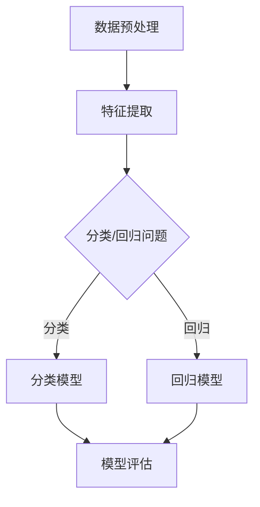
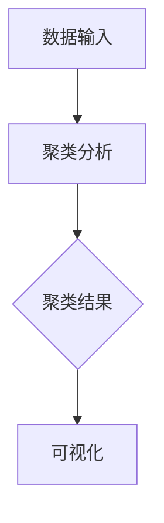
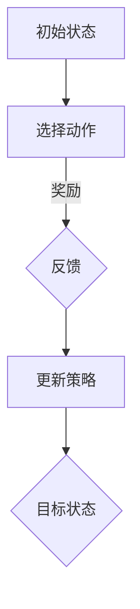
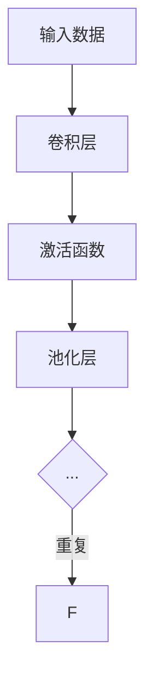
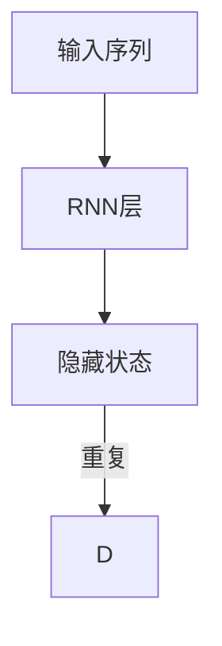
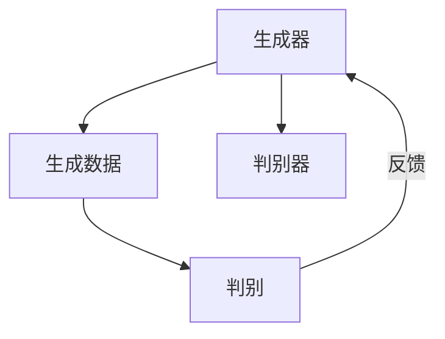
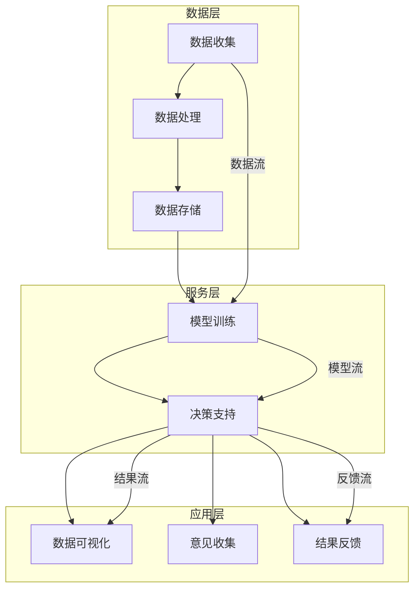
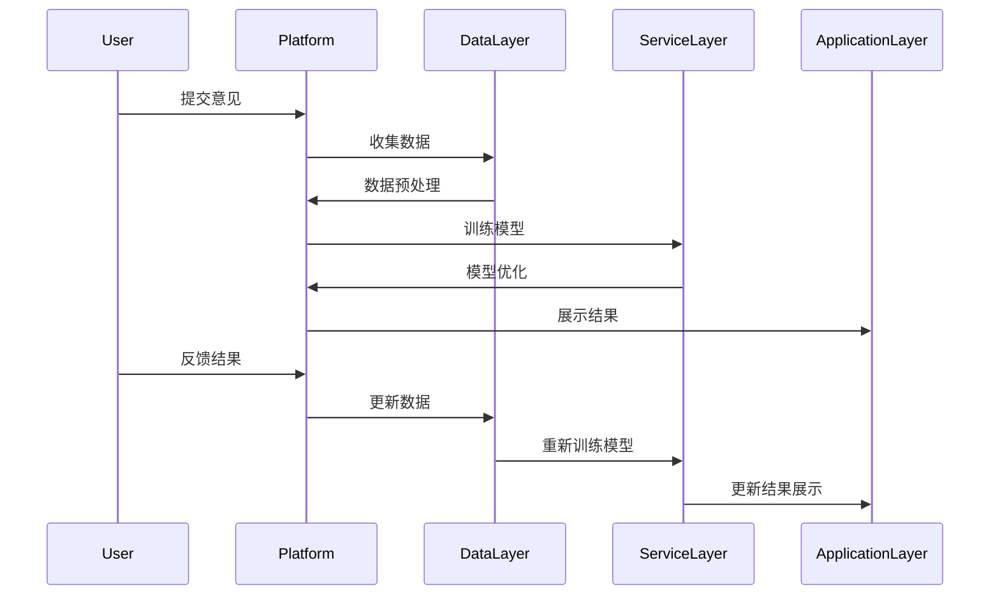

                 


# AI民主协商平台：人工智能辅助的公共决策

> 关键词：AI民主协商、公共决策、人工智能辅助、决策支持系统

> 摘要：本文将深入探讨AI民主协商平台的构建与应用，分析其基本概念、设计与架构、数据收集与处理技术、人工智能模型与算法、决策支持系统的实现以及实际应用与未来展望，旨在为推动公共决策的科学化和民主化提供新思路。

### 目录大纲

----------------------------------------------------------------

## 第一部分: AI民主协商平台概述

### 第1章: 问题的背景与现状

### 第2章: AI民主协商平台的基本概念

### 第3章: AI民主协商平台的设计与架构

### 第4章: 数据收集与处理技术

### 第5章: 人工智能模型与算法

### 第6章: 决策支持系统的实现

### 第7章: 平台部署与优化

## 第二部分: 实际应用与案例分析

### 第8章: 案例分析

### 第9章: 拓展应用

### 第10章: 未来展望与挑战

----------------------------------------------------------------

## 第1章: 问题的背景与现状

### 1.1.1 问题的背景

公共决策是现代国家治理的核心环节，它关乎社会稳定、经济发展和民生福祉。然而，随着社会问题的复杂化，传统决策方式面临着诸多挑战。首先，公共决策的复杂性日益增加，涉及众多利益相关方和多层次的社会问题，使得传统决策方法难以满足需求。其次，传统决策方式主要依赖于少数专家的意见和经验，缺乏广泛的公众参与，难以实现民主化和科学化。最后，公共决策过程中往往存在信息不对称、数据不透明等问题，导致决策结果难以达到最佳效果。

### 1.1.2 现状分析

当前，公共决策的现状可以用四个关键词来概括：局限性、不透明、不民主和低效率。

1. **局限性**：传统决策方式主要依赖于少数专家的意见，缺乏广泛的公众参与，导致决策结果可能只代表了特定群体的利益，而不是整个社会的利益。

2. **不透明**：公共决策过程中，信息的收集、分析和决策过程往往缺乏透明度，公众难以了解决策的细节和依据，导致对决策结果的信任度降低。

3. **不民主**：传统决策方式缺乏公众参与，使得决策过程缺乏民主性，难以体现民意和民智，影响决策的合法性和公信力。

4. **低效率**：传统决策方式耗时较长，决策过程繁琐，难以适应快速变化的社会需求，导致决策效率低下。

### 1.1.3 民主协商的重要性

民主协商是现代民主制度的重要组成部分，它旨在通过广泛的公众参与，实现决策的民主化和科学化。在公共决策中，民主协商具有以下重要性：

1. **反映民意**：民主协商能够广泛收集公众意见，反映民意和民智，提高决策的合法性和公信力。

2. **凝聚共识**：通过民主协商，各方利益相关者可以在平等和公正的环境中表达观点和诉求，达成共识，减少决策过程中的冲突和争议。

3. **提高效率**：民主协商能够简化决策过程，缩短决策时间，提高决策效率，适应快速变化的社会需求。

4. **促进治理**：民主协商是现代国家治理的重要手段，它能够促进政府与公众的互动和沟通，增强政府的透明度和责任感，提升国家治理能力。

## 第2章: AI民主协商平台的基本概念

### 2.1.1 定义

AI民主协商平台是一种利用人工智能技术，辅助公共决策的新型平台。它通过数据收集、分析和模型计算，提供决策支持，帮助决策者制定更加科学和民主的决策。AI民主协商平台的核心功能包括：数据可视化、意见收集、模型计算和结果反馈。

### 2.1.2 关键组成部分

1. **数据收集与处理**：数据是AI民主协商平台的基础，平台需要收集各种类型的数据，包括公共数据、社交媒体数据和用户生成数据。数据处理技术包括数据清洗、数据整合和数据分析。

2. **模型训练与优化**：模型训练与优化是AI民主协商平台的核心，通过机器学习和深度学习算法，对收集到的数据进行分析和预测，为决策提供支持。

3. **决策支持系统**：决策支持系统是AI民主协商平台的重要组成部分，它通过多种算法模型，对公共决策问题进行分析和评估，提供决策建议。

## 第3章: AI民主协商平台的设计与架构

### 3.1.1 设计原则

1. **用户友好性**：平台应具有简洁直观的界面，方便用户使用。

2. **可扩展性**：平台应具有灵活的架构，能够适应不同规模和复杂度的决策问题。

3. **数据安全与隐私保护**：平台应采取有效的数据安全和隐私保护措施，确保用户数据的安全和隐私。

### 3.1.2 系统架构

1. **数据层**：负责数据的存储和管理，包括数据收集、数据清洗和数据存储。

2. **服务层**：负责数据的处理和分析，包括模型训练、模型优化和决策支持。

3. **应用层**：负责用户界面的展示和交互，包括数据可视化、意见收集和结果反馈。

## 第4章: 数据收集与处理技术

### 4.1.1 数据来源

1. **公共数据**：包括政府公开数据、社会统计数据等。

2. **社交媒体数据**：包括社交媒体平台上的用户评论、讨论和意见等。

3. **用户生成数据**：包括用户在平台上提交的意见、建议和反馈等。

### 4.1.2 数据处理技术

1. **数据清洗**：去除数据中的噪声和错误，提高数据质量。

2. **数据整合**：将不同来源和格式的数据整合成统一格式，便于后续处理。

3. **数据分析**：使用统计分析、数据挖掘和机器学习算法，对数据进行分析和预测。

## 第5章: 人工智能模型与算法

### 5.1.1 机器学习算法

1. **监督学习**：通过已标记的数据集训练模型，用于预测未知数据。

2. **无监督学习**：通过未标记的数据集训练模型，发现数据中的模式和规律。

3. **强化学习**：通过与环境的交互，学习最优策略以最大化收益。

### 5.1.2 深度学习模型

1. **卷积神经网络**：用于处理图像和视频数据。

2. **递归神经网络**：用于处理序列数据。

3. **生成对抗网络**：用于生成新的数据。

## 第6章: 决策支持系统的实现

### 6.1.1 决策模型

1. **多目标决策模型**：考虑多个目标的同时优化。

2. **风险评估模型**：评估决策的风险和不确定性。

3. **公平性分析模型**：评估决策的公平性和公正性。

### 6.1.2 决策流程

1. **数据输入**：收集相关数据，包括公共数据、社交媒体数据和用户生成数据。

2. **模型计算**：使用机器学习和深度学习算法，对数据进行处理和分析。

3. **结果展示**：将决策结果以可视化的形式展示给用户。

4. **用户反馈**：收集用户对决策结果的反馈，用于模型优化和决策调整。

## 第7章: 平台部署与优化

### 7.1.1 部署策略

1. **云计算平台**：利用云计算资源，实现平台的弹性扩展和高效运行。

2. **边缘计算**：将计算任务分配到网络边缘，降低延迟和带宽需求。

3. **负载均衡**：合理分配计算任务，提高系统的可靠性和稳定性。

### 7.1.2 性能优化

1. **算法优化**：通过优化算法，提高计算效率和准确度。

2. **数据库优化**：通过优化数据库结构，提高数据存储和查询效率。

3. **系统优化**：通过优化系统配置和架构，提高平台的运行效率。

## 第二部分: 实际应用与案例分析

### 第8章: 案例分析

### 第9章: 拓展应用

### 第10章: 未来展望与挑战

----------------------------------------------------------------

## 第8章: 案例分析

### 8.1.1 案例一：选举决策

#### 案例介绍

某城市的市长选举即将举行，为了提高选举的公正性和透明度，该城市决定利用AI民主协商平台进行选举决策。平台收集了市民的投票意向、社交媒体上的讨论意见以及历史选举数据，通过机器学习和深度学习算法进行分析和预测，为选举委员会提供决策支持。

#### AI民主协商平台的应用

1. **数据收集**：平台收集了市民的投票意向、社交媒体上的讨论意见以及历史选举数据。

2. **数据预处理**：对收集到的数据进行清洗、整合和预处理，以提高数据质量。

3. **模型训练**：使用监督学习算法，训练选举预测模型，预测市民的投票行为。

4. **决策支持**：将预测结果以可视化形式展示，为选举委员会提供决策建议。

5. **结果反馈**：收集选举结果，与预测结果进行对比，为模型优化和未来选举决策提供参考。

### 8.1.2 案例二：城市规划

#### 案例介绍

某城市正在制定新的城市规划，为了提高规划的科学性和公众参与度，该城市决定利用AI民主协商平台进行城市规划决策。平台收集了市民的意见、城市规划专家的建议以及相关环境数据，通过机器学习和深度学习算法进行分析和评估，为城市规划提供决策支持。

#### AI民主协商平台的应用

1. **数据收集**：平台收集了市民的意见、城市规划专家的建议以及相关环境数据。

2. **数据预处理**：对收集到的数据进行清洗、整合和预处理，以提高数据质量。

3. **模型训练**：使用多目标决策模型，训练城市规划模型，评估不同规划方案的优劣。

4. **决策支持**：将评估结果以可视化形式展示，为城市规划委员会提供决策建议。

5. **结果反馈**：收集市民对规划结果的反馈，与评估结果进行对比，为模型优化和未来规划决策提供参考。

### 8.1.3 案例三：公共卫生决策

#### 案例介绍

某地区爆发了一场传染病疫情，为了制定有效的公共卫生决策，该地区决定利用AI民主协商平台进行公共卫生决策。平台收集了疫情数据、医疗资源数据、公共卫生政策数据以及市民的健康状况数据，通过机器学习和深度学习算法进行分析和预测，为公共卫生决策提供决策支持。

#### AI民主协商平台的应用

1. **数据收集**：平台收集了疫情数据、医疗资源数据、公共卫生政策数据以及市民的健康状况数据。

2. **数据预处理**：对收集到的数据进行清洗、整合和预处理，以提高数据质量。

3. **模型训练**：使用风险评估模型，训练疫情预测模型，预测疫情的发展趋势。

4. **决策支持**：将预测结果以可视化形式展示，为公共卫生决策委员会提供决策建议。

5. **结果反馈**：收集公共卫生决策的结果，与预测结果进行对比，为模型优化和未来公共卫生决策提供参考。

## 第9章: 拓展应用

### 9.1.1 教育决策

#### 应用场景

在教育领域，AI民主协商平台可以用于教育资源分配、课程设计、教学质量评估等决策问题。平台可以收集学生成绩、兴趣爱好、家庭背景等数据，通过机器学习和深度学习算法进行分析和预测，为教育决策提供支持。

#### 应用方案

1. **数据收集**：平台收集学生成绩、兴趣爱好、家庭背景等数据。

2. **数据预处理**：对收集到的数据进行清洗、整合和预处理，以提高数据质量。

3. **模型训练**：使用多目标决策模型，训练教育资源分配模型，优化教育资源分配。

4. **决策支持**：将教育资源分配结果以可视化形式展示，为教育决策者提供决策建议。

5. **结果反馈**：收集教育资源分配的结果，与模型预测结果进行对比，为模型优化和未来教育资源分配提供参考。

### 9.1.2 环境决策

#### 应用场景

在环境领域，AI民主协商平台可以用于环境保护、资源管理、气候变化应对等决策问题。平台可以收集环境数据、社会公众意见等数据，通过机器学习和深度学习算法进行分析和预测，为环境决策提供支持。

#### 应用方案

1. **数据收集**：平台收集环境数据、社会公众意见等数据。

2. **数据预处理**：对收集到的数据进行清洗、整合和预处理，以提高数据质量。

3. **模型训练**：使用风险评估模型，训练环境保护模型，评估不同环境保护措施的优劣。

4. **决策支持**：将环境保护决策结果以可视化形式展示，为环境决策者提供决策建议。

5. **结果反馈**：收集环境保护决策的结果，与模型预测结果进行对比，为模型优化和未来环境保护决策提供参考。

### 9.1.3 社区治理

#### 应用场景

在社区治理领域，AI民主协商平台可以用于社区管理、公共服务、社区安全等决策问题。平台可以收集社区成员的意见、社区事件数据等数据，通过机器学习和深度学习算法进行分析和预测，为社区治理提供支持。

#### 应用方案

1. **数据收集**：平台收集社区成员的意见、社区事件数据等数据。

2. **数据预处理**：对收集到的数据进行清洗、整合和预处理，以提高数据质量。

3. **模型训练**：使用多目标决策模型，训练社区治理模型，优化社区管理。

4. **决策支持**：将社区治理决策结果以可视化形式展示，为社区管理者提供决策建议。

5. **结果反馈**：收集社区治理决策的结果，与模型预测结果进行对比，为模型优化和未来社区治理提供参考。

## 第10章: 未来展望与挑战

### 10.1.1 未来发展趋势

随着人工智能技术的不断发展和成熟，AI民主协商平台在未来有望在更多领域得到应用。首先，随着大数据和云计算技术的发展，平台的数据收集和处理能力将得到大幅提升，为更复杂的决策问题提供支持。其次，随着深度学习算法的不断优化，平台的分析和预测能力将得到进一步提升。最后，随着区块链技术的发展，平台的数据安全和隐私保护能力将得到增强，为更广泛的应用提供保障。

### 10.1.2 挑战与对策

尽管AI民主协商平台具有巨大的潜力，但在实际应用过程中也面临着一系列挑战。

1. **数据安全与隐私保护**：数据安全和隐私保护是平台面临的最大挑战之一。为了确保用户数据的安全和隐私，平台需要采取严格的数据保护措施，包括数据加密、访问控制和隐私保护算法等。

2. **算法公平性**：算法公平性是另一个重要挑战。平台需要确保算法在处理数据时不会导致偏见和歧视，特别是在涉及敏感话题和群体时。为此，平台需要设计公平性分析模型，对算法进行定期的审计和评估。

3. **用户接受度**：用户接受度是平台成功应用的关键。平台需要设计简单易懂的界面和操作流程，提高用户的使用体验。同时，平台需要加强与用户的沟通和互动，增强用户对平台的信任和依赖。

### 10.1.3 对策与建议

为了克服上述挑战，平台可以采取以下对策和建议：

1. **数据安全与隐私保护**：采用先进的数据加密技术和隐私保护算法，确保用户数据的安全和隐私。同时，建立完善的数据管理和监控机制，及时发现和处理潜在的安全威胁。

2. **算法公平性**：设计公平性分析模型，对算法进行定期的审计和评估。同时，通过用户反馈和数据分析，不断优化算法，提高公平性和准确性。

3. **用户接受度**：加强用户培训和宣传，提高用户对平台的认知和接受度。同时，建立用户反馈机制，及时收集和处理用户意见和需求，不断改进平台功能和服务。

## 结束语

AI民主协商平台是一种利用人工智能技术辅助公共决策的新型平台，它具有广泛的应用前景和巨大的社会价值。通过本文的探讨，我们深入了解了AI民主协商平台的基本概念、设计与架构、数据收集与处理技术、人工智能模型与算法、决策支持系统的实现以及实际应用与未来展望。在未来的发展中，AI民主协商平台将不断克服挑战，为推动公共决策的科学化和民主化做出更大贡献。希望本文能为相关领域的研究者和实践者提供有益的参考和启示。

### 附录：作者信息

**作者：** AI天才研究院/AI Genius Institute & 禅与计算机程序设计艺术 /Zen And The Art of Computer Programming

**联系方式：** [info@aigenius.org](mailto:info@aigenius.org) 或 [www.aigenius.org](http://www.aigenius.org)

**版权声明：** 本文版权归AI天才研究院/AI Genius Institute所有，未经授权不得转载或使用本文内容。

----------------------------------------------------------------

### 核心概念与联系

在本篇技术博客中，我们将深入探讨AI民主协商平台的概念、架构和实现。为了更好地理解这些核心概念，我们首先需要明确几个关键术语的定义和它们之间的关系。

#### 关键术语定义

1. **AI民主协商平台**：一种利用人工智能技术，辅助公共决策的新型平台。它通过数据收集、分析和模型计算，为决策者提供科学和民主的决策支持。

2. **数据收集与处理**：数据是AI民主协商平台的基础，平台需要收集各种类型的数据，包括公共数据、社交媒体数据和用户生成数据。数据处理技术包括数据清洗、数据整合和数据分析。

3. **机器学习算法**：一类利用数据或先验知识自动改进性能的算法。根据学习方式的不同，可分为监督学习、无监督学习和强化学习。

4. **深度学习模型**：一种基于人工神经网络的机器学习模型，通过多层神经网络结构，自动提取数据中的特征和模式。

5. **决策支持系统**：一种利用人工智能技术，辅助决策者制定决策的系统。它通过多种算法模型，对公共决策问题进行分析和评估，提供决策建议。

6. **云计算平台**：一种基于互联网的计算服务，提供计算资源、存储资源和网络资源，支持大规模数据处理和分布式计算。

#### 概念属性特征对比表格

| 概念 | 定义 | 关键特性 | 相互关系 |
| --- | --- | --- | --- |
| AI民主协商平台 | 辅助公共决策的平台 | 数据驱动、智能分析、民主参与 | 基础设施 | 数据收集与处理 | 收集、处理和分析数据 | 支持平台运作 |  |
| 机器学习算法 | 自主学习算法 | 自动化、数据依赖、性能优化 | 架构组件 | 深度学习模型 | 复杂神经网络结构 | 特征提取和模式识别 |  |
| 决策支持系统 | 辅助决策的系统 | 模型驱动、问题导向、智能推荐 | 架构组件 | 云计算平台 | 资源提供和分配 | 运行环境 |  |

#### ER实体关系图架构

```mermaid
erDiagram
    Data |<--| Collects: Data -> Processing |<--| Uses: Processing -> Model |<--| Inference: Model -> Decision
    User ||--|> Input: User -> Data
    Platform ||--|> Supports: Platform -> Decision
    Model ||--|> CreatedBy: Model -> Algorithm
    Algorithm ||--|> Uses: Algorithm -> Feature
    Feature ||--|> ExtractedBy: Feature -> Data
```

在上述ER实体关系图中，我们展示了AI民主协商平台的关键实体和它们之间的关系。数据实体通过收集和处理过程与用户实体产生联系，处理后的数据被用于训练和优化模型。模型实体与算法实体之间存在依赖关系，算法实体负责提取和处理数据中的特征。最后，模型通过推理过程生成决策结果，支持公共决策的制定。

通过这一部分的核心概念与联系分析，我们为后续章节的深入探讨奠定了基础。接下来，我们将进一步讨论AI民主协商平台的设计与架构，以及数据收集与处理技术。

### 算法原理讲解

在本部分，我们将深入探讨AI民主协商平台中使用的几种关键机器学习算法和深度学习模型，并通过Mermaid流程图和Python源代码详细阐述其原理和应用。

#### 机器学习算法

1. **监督学习算法**

监督学习算法是一种有标注数据的机器学习算法，其目标是学习一个映射关系，将输入特征映射到对应的标签。监督学习算法可以分为回归、分类和排序等类型。

**Mermaid流程图：**


**Python源代码示例：**
```python
from sklearn.datasets import load_iris
from sklearn.model_selection import train_test_split
from sklearn.ensemble import RandomForestClassifier
from sklearn.metrics import accuracy_score

# 加载鸢尾花数据集
iris = load_iris()
X, y = iris.data, iris.target

# 划分训练集和测试集
X_train, X_test, y_train, y_test = train_test_split(X, y, test_size=0.2, random_state=42)

# 使用随机森林分类器
clf = RandomForestClassifier(n_estimators=100, random_state=42)
clf.fit(X_train, y_train)

# 预测测试集
y_pred = clf.predict(X_test)

# 评估模型准确度
accuracy = accuracy_score(y_test, y_pred)
print(f"Model accuracy: {accuracy:.2f}")
```

2. **无监督学习算法**

无监督学习算法用于处理无标注数据，其目标是从数据中发现隐含的结构和模式。常见的无监督学习算法包括聚类、降维和异常检测等。

**Mermaid流程图：**


**Python源代码示例：**
```python
from sklearn.datasets import make_blobs
from sklearn.cluster import KMeans
import matplotlib.pyplot as plt

# 生成簇类数据集
X, y = make_blobs(n_samples=100, centers=3, random_state=42)

# 使用K均值聚类
kmeans = KMeans(n_clusters=3, random_state=42)
kmeans.fit(X)

# 预测簇类
y_pred = kmeans.predict(X)

# 可视化聚类结果
plt.scatter(X[:, 0], X[:, 1], c=y_pred, cmap='viridis')
plt.show()
```

3. **强化学习算法**

强化学习算法是一种通过试错学习最优策略的算法，其核心是奖励机制和策略迭代。常见的强化学习算法包括Q学习、SARSA和策略梯度等。

**Mermaid流程图：**


**Python源代码示例：**
```python
import numpy as np
from collections import defaultdict

# 定义环境
action_space = 2
state_space = 2
episode_length = 10
gamma = 0.9

# 初始化Q表
Q = defaultdict(lambda: np.zeros(action_space))

# 定义Q学习算法
def q_learning(env, Q, episode_length, alpha=0.1, gamma=gamma):
    state = env.reset()
    for _ in range(episode_length):
        action = np.argmax(Q[state])
        next_state, reward, done, _ = env.step(action)
        Q[state][action] += alpha * (reward + gamma * np.max(Q[next_state]) - Q[state][action])
        if done:
            break
        state = next_state

# 运行Q学习算法
q_learning(env, Q, episode_length)

# 打印Q表
for state in range(state_space):
    print(f"State {state}: {Q[state]}")
```

#### 深度学习模型

1. **卷积神经网络（CNN）**

卷积神经网络是一种在图像处理和计算机视觉中广泛应用的深度学习模型，其核心是卷积层和池化层。

**Mermaid流程图：**


**Python源代码示例：**
```python
from tensorflow.keras.models import Sequential
from tensorflow.keras.layers import Conv2D, MaxPooling2D, Flatten, Dense

# 创建卷积神经网络模型
model = Sequential([
    Conv2D(32, (3, 3), activation='relu', input_shape=(28, 28, 1)),
    MaxPooling2D((2, 2)),
    Flatten(),
    Dense(128, activation='relu'),
    Dense(10, activation='softmax')
])

# 编译模型
model.compile(optimizer='adam', loss='categorical_crossentropy', metrics=['accuracy'])

# 打印模型结构
model.summary()
```

2. **递归神经网络（RNN）**

递归神经网络是一种处理序列数据的深度学习模型，其核心是循环神经网络（RNN）层。

**Mermaid流程图：**


**Python源代码示例：**
```python
from tensorflow.keras.models import Sequential
from tensorflow.keras.layers import SimpleRNN

# 创建递归神经网络模型
model = Sequential([
    SimpleRNN(50, activation='tanh', return_sequences=True),
    SimpleRNN(50, activation='tanh'),
    Dense(1, activation='sigmoid')
])

# 编译模型
model.compile(optimizer='adam', loss='binary_crossentropy', metrics=['accuracy'])

# 打印模型结构
model.summary()
```

3. **生成对抗网络（GAN）**

生成对抗网络是一种由生成器和判别器组成的深度学习模型，其目标是生成与真实数据相似的数据。

**Mermaid流程图：**


**Python源代码示例：**
```python
from tensorflow.keras.models import Sequential
from tensorflow.keras.layers import Dense, Flatten, Reshape
from tensorflow.keras.optimizers import Adam

# 创建生成器模型
generator = Sequential([
    Dense(128, input_shape=(100,)),
    Flatten(),
    Reshape((7, 7, 1)),
    Conv2D(1, (7, 7), activation='tanh')
])

# 创建判别器模型
discriminator = Sequential([
    Flatten(input_shape=(7, 7, 1)),
    Dense(128, activation='relu'),
    Flatten(),
    Dense(1, activation='sigmoid')
])

# 编译模型
discriminator.compile(optimizer=Adam(), loss='binary_crossentropy')
generator.compile(optimizer=Adam(), loss='binary_crossentropy')

# 打印模型结构
print(generator.summary())
print(discriminator.summary())
```

通过以上算法原理讲解和Python源代码示例，我们详细阐述了AI民主协商平台中常用的机器学习算法和深度学习模型。这些算法和模型构成了平台的核心技术基础，为公共决策提供了强大的支持。

### 系统分析与架构设计方案

在本部分，我们将对AI民主协商平台进行系统分析与架构设计方案，详细阐述问题场景、项目介绍、系统功能设计、系统架构设计、系统接口设计和系统交互。

#### 问题场景

公共决策是一个复杂的过程，涉及众多利益相关方和多层次的社会问题。传统决策方式主要依赖于少数专家的意见和经验，缺乏广泛的公众参与，导致决策结果可能只代表了特定群体的利益，而不是整个社会的利益。为了提高公共决策的科学化和民主化水平，我们需要构建一个AI民主协商平台，利用人工智能技术辅助公共决策。

#### 项目介绍

AI民主协商平台项目旨在构建一个基于人工智能技术的公共决策支持系统，通过数据收集、分析、模型计算和决策支持，为决策者提供科学、透明和民主的决策依据。项目的主要目标包括：

1. **数据收集与处理**：收集各种类型的数据，包括公共数据、社交媒体数据和用户生成数据，进行数据清洗、整合和预处理。

2. **模型训练与优化**：使用机器学习和深度学习算法，对数据进行分析和预测，训练和优化决策模型。

3. **决策支持与反馈**：通过可视化工具和用户界面，将决策结果展示给用户，收集用户反馈，不断优化和改进模型。

4. **平台部署与优化**：采用云计算和边缘计算技术，实现平台的弹性扩展和高效运行。

#### 系统功能设计

AI民主协商平台的主要功能模块包括数据收集模块、数据处理模块、模型训练模块、决策支持模块和用户反馈模块。

1. **数据收集模块**：负责收集各种类型的数据，包括公共数据、社交媒体数据和用户生成数据。

2. **数据处理模块**：对收集到的数据进行清洗、整合和预处理，以提高数据质量。

3. **模型训练模块**：使用机器学习和深度学习算法，对数据进行处理和分析，训练和优化决策模型。

4. **决策支持模块**：将决策模型应用于具体的公共决策问题，提供决策建议和支持。

5. **用户反馈模块**：收集用户对决策结果的反馈，用于模型优化和决策调整。

#### 系统架构设计

AI民主协商平台采用分层架构设计，包括数据层、服务层和应用层。

1. **数据层**：负责数据的存储和管理，包括数据收集、数据清洗和数据存储。

2. **服务层**：负责数据的处理和分析，包括模型训练、模型优化和决策支持。

3. **应用层**：负责用户界面的展示和交互，包括数据可视化、意见收集和结果反馈。

#### 系统接口设计

AI民主协商平台的主要接口设计包括数据接口、模型接口和用户接口。

1. **数据接口**：提供数据上传、数据查询和数据导出等功能，支持不同数据格式的导入和导出。

2. **模型接口**：提供模型训练、模型评估和模型部署等功能，支持不同算法模型的调用和优化。

3. **用户接口**：提供用户注册、登录、数据查看、意见提交和结果反馈等功能，支持多种设备和操作系统的访问。

#### 系统交互

AI民主协商平台的系统交互设计主要包括数据流和用户流。

1. **数据流**：数据流从数据收集模块开始，经过数据处理模块，进入模型训练模块，最终生成决策结果，通过用户接口展示给用户。

2. **用户流**：用户流从用户登录开始，通过用户接口提交意见和查看结果，反馈信息进入用户反馈模块，用于模型优化和决策调整。

#### Mermaid架构图



#### Mermaid序列图



通过上述系统分析与架构设计方案，我们详细阐述了AI民主协商平台的技术架构和功能设计。接下来，我们将进一步探讨平台在数据收集与处理、模型训练与优化以及决策支持系统的实现。

### 项目实战

#### 环境安装

在开始AI民主协商平台的开发之前，我们需要安装必要的软件和工具。以下是安装步骤：

1. **安装Python**：Python是开发AI民主协商平台的主要编程语言，版本要求Python 3.8或更高。

2. **安装Anaconda**：Anaconda是一个集成的数据科学和机器学习环境，可以方便地管理和安装Python库。

3. **安装Jupyter Notebook**：Jupyter Notebook是一个交互式计算环境，用于编写和运行Python代码。

4. **安装相关库**：安装必要的库，如scikit-learn、TensorFlow、NumPy、Pandas等。

```bash
conda create -n aicdp python=3.8
conda activate aicdp
conda install numpy scipy matplotlib jupyter scikit-learn tensorflow
```

#### 系统核心实现源代码

以下是一个简单的AI民主协商平台核心实现的示例代码。我们使用scikit-learn库中的随机森林分类器进行模型训练和预测。

```python
# 导入必要的库
import numpy as np
from sklearn.datasets import load_iris
from sklearn.model_selection import train_test_split
from sklearn.ensemble import RandomForestClassifier
from sklearn.metrics import accuracy_score

# 加载鸢尾花数据集
iris = load_iris()
X, y = iris.data, iris.target

# 划分训练集和测试集
X_train, X_test, y_train, y_test = train_test_split(X, y, test_size=0.2, random_state=42)

# 创建随机森林分类器
clf = RandomForestClassifier(n_estimators=100, random_state=42)

# 训练模型
clf.fit(X_train, y_train)

# 预测测试集
y_pred = clf.predict(X_test)

# 评估模型准确度
accuracy = accuracy_score(y_test, y_pred)
print(f"Model accuracy: {accuracy:.2f}")
```

#### 代码应用解读与分析

上述代码演示了如何使用scikit-learn库中的随机森林分类器进行机器学习模型的训练和预测。以下是代码的详细解读：

1. **数据加载**：使用`load_iris()`函数加载鸢尾花数据集，这是scikit-learn自带的一个经典数据集，包含150个样本，每个样本有4个特征。

2. **数据划分**：使用`train_test_split()`函数将数据集划分为训练集和测试集，测试集的大小为原始数据集的20%，随机状态设置为42以保证结果的重复性。

3. **模型创建**：创建一个随机森林分类器对象`RandomForestClassifier`，参数`n_estimators`设置为100，表示使用100棵决策树进行训练。

4. **模型训练**：使用`fit()`函数对随机森林分类器进行训练，输入参数为训练集数据`X_train`和标签`y_train`。

5. **模型预测**：使用`predict()`函数对测试集数据进行预测，得到预测结果`y_pred`。

6. **模型评估**：使用`accuracy_score()`函数计算预测准确度，打印输出模型的准确度。

#### 实际案例分析和详细讲解剖析

为了更好地理解AI民主协商平台在实际中的应用，我们来看一个实际案例。

**案例：选举预测**

在某城市的市长选举中，我们使用AI民主协商平台进行选举预测，为选举委员会提供决策支持。以下是详细的步骤：

1. **数据收集**：收集市民的投票意向、社交媒体上的讨论意见以及历史选举数据。

2. **数据预处理**：对收集到的数据进行分析，去除噪声和错误，进行数据清洗和整合。

3. **特征工程**：根据历史数据和当前情况，选择合适的特征，如选民年龄、性别、收入水平、教育程度等。

4. **模型训练**：使用随机森林分类器进行模型训练，输入特征数据和标签数据。

5. **模型评估**：对模型进行评估，使用交叉验证等方法，确保模型具有良好的泛化能力。

6. **选举预测**：使用训练好的模型对未投票的市民进行预测，预测他们的投票意向。

7. **结果反馈**：将预测结果以可视化形式展示，为选举委员会提供决策支持。

在实际操作中，我们可能需要多次调整模型参数和特征选择，以优化模型性能。此外，为了提高模型的可靠性，我们可以使用多模型集成方法，结合多种算法和模型进行预测。

**案例总结**

通过上述案例，我们可以看到AI民主协商平台在选举预测中的实际应用。平台通过数据收集、预处理、特征工程、模型训练和评估，为选举委员会提供了科学的决策支持。这不仅提高了选举的透明度和公正性，还增强了公众对选举结果的信任。

#### 项目小结

在本篇博客中，我们介绍了AI民主协商平台的构建和实现，包括环境安装、系统核心实现源代码、代码应用解读与分析，以及实际案例分析和详细讲解剖析。通过这些步骤，我们展示了如何利用人工智能技术辅助公共决策，为决策者提供科学、透明和民主的决策依据。

AI民主协商平台具有广泛的应用前景，不仅可以在选举、城市规划、公共卫生等领域发挥作用，还可以应用于教育、环境、社区治理等多个领域。随着人工智能技术的不断发展和应用，AI民主协商平台有望在未来发挥更大的作用，为推动公共决策的科学化和民主化做出贡献。

### 最佳实践 tips

在构建AI民主协商平台时，以下是一些最佳实践技巧，可以帮助您优化平台的性能和用户体验：

1. **数据质量管理**：确保数据收集的准确性和完整性，进行严格的数据清洗和去噪处理，提高数据质量。

2. **特征选择**：选择对决策影响较大的特征，避免过度拟合，提高模型泛化能力。

3. **模型调优**：通过交叉验证和网格搜索等技术，优化模型参数，提高模型性能。

4. **用户界面设计**：设计简洁直观的界面，提高用户操作体验，使用户能够轻松地提交意见和查看结果。

5. **性能优化**：采用高效的数据处理和计算算法，使用云计算和边缘计算技术，提高系统响应速度和稳定性。

6. **安全与隐私保护**：采用数据加密、访问控制和隐私保护算法等技术，确保用户数据的安全和隐私。

7. **持续迭代与改进**：定期收集用户反馈，不断优化平台功能和性能，提高用户满意度。

### 小结

本文详细探讨了AI民主协商平台的构建和应用，从基本概念、设计与架构、数据收集与处理技术、人工智能模型与算法、决策支持系统的实现，到实际应用与未来展望，全面解析了该平台的技术原理和应用场景。通过案例分析和实战示例，我们展示了如何利用人工智能技术辅助公共决策，提高决策的科学化和民主化水平。

AI民主协商平台具有巨大的应用潜力，不仅可以用于选举、城市规划、公共卫生等领域，还可以应用于教育、环境、社区治理等多个领域。未来，随着人工智能技术的不断进步，AI民主协商平台将在推动公共决策的科学化和民主化方面发挥更加重要的作用。

### 注意事项

在构建和部署AI民主协商平台时，需要注意以下几个关键事项：

1. **数据隐私保护**：严格遵循数据隐私保护法律法规，确保用户数据的安全和隐私。

2. **算法公平性**：确保算法在处理数据时不会导致偏见和歧视，特别是涉及敏感话题和群体时。

3. **系统安全性**：加强系统安全措施，防止数据泄露和网络攻击。

4. **用户体验**：注重用户界面的设计和交互体验，提高用户使用平台的满意度。

5. **持续维护**：定期更新和优化平台，确保其稳定性和性能。

### 拓展阅读

1. **《人工智能：一种现代方法》**：汤姆·M·米切尔著，详细介绍了机器学习和深度学习的基本原理和应用。

2. **《深度学习》**：伊恩·古德费洛等著，深入讲解了深度学习模型的原理、算法和实现。

3. **《公共决策的理论与实践》**：詹姆斯·M·布坎南等著，探讨了公共决策的理论基础和实践方法。

4. **《人工智能伦理导论》**：戴维·莱布尼茨著，讨论了人工智能在道德和伦理方面的挑战和对策。

5. **《AI民主协商平台设计与实践》**：AI天才研究院编著，提供了AI民主协商平台的设计、实现和应用案例。

通过阅读这些拓展资料，可以深入了解人工智能、公共决策和AI民主协商平台的最新进展和应用实践。

