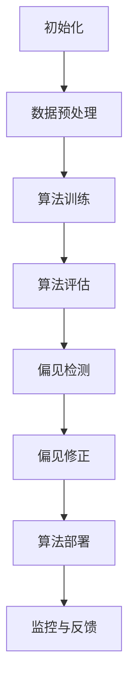
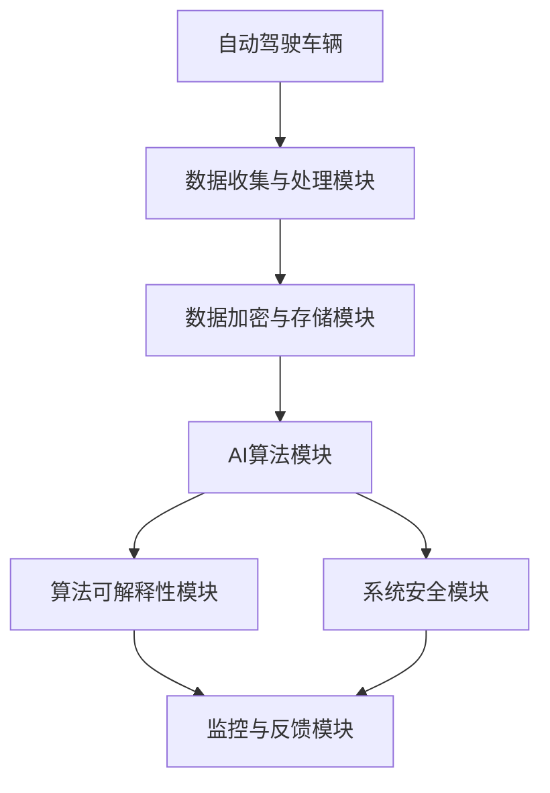
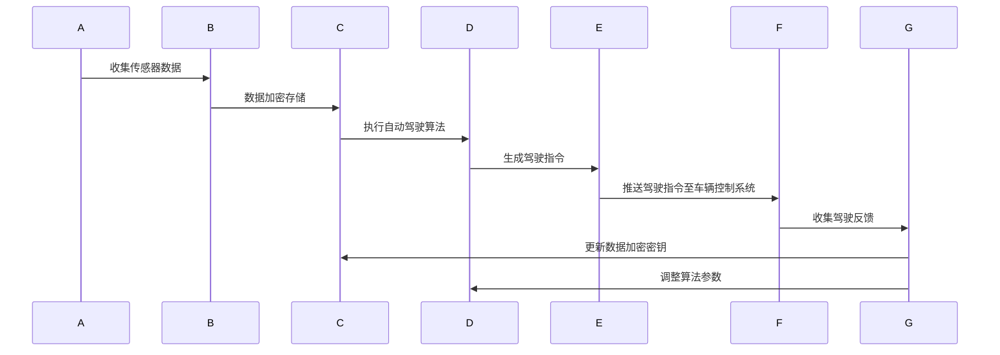

                 

### 前言

在人工智能（AI）迅猛发展的今天，AI治理成为了各个行业必须面对的课题。从伦理和法律层面，到技术实现和应用效果，AI治理的复杂性和重要性日益凸显。本书旨在为广大读者，特别是关注AI技术和应用的技术人员、政策制定者以及行业从业者，提供一个系统的视角，探讨AI治理在不同行业的实施差异。

#### 书籍目的

本书的主要目标是：
1. **系统梳理**：对AI治理的核心概念、基本原理和实施方法进行系统性的梳理。
2. **案例分析**：通过分析不同行业在AI治理中的实践，总结出有效的治理策略和模式。
3. **提供指导**：为读者提供实际操作中的参考和指导，帮助他们在各自领域中实施AI治理。

#### 受众群体

本书适合以下读者群体：
- **AI领域研究人员**：希望通过理论结合实践，深入了解AI治理的学者和研究人员。
- **技术开发者**：希望在实际项目中应用AI治理，提升项目质量的开发者和技术人员。
- **政策制定者**：需要了解AI治理政策如何在不同行业中具体实施的决策者。
- **行业从业者**：希望提升自身业务中AI技术应用水平和伦理责任的行业从业者。

#### 书籍结构概述

本书分为以下几大部分：

1. **前言**：介绍书籍的目的、受众群体和结构。
2. **背景介绍**：讨论AI治理的重要性和现状，介绍不同行业面临的挑战和问题。
3. **核心概念与联系**：详细解释AI治理的核心概念，阐述其与行业特点的联系。
4. **算法原理讲解**：介绍AI治理算法的原理，通过实例进行说明。
5. **系统分析与架构设计方案**：展示AI治理的系统架构和设计方案。
6. **项目实战**：通过具体案例，展示AI治理的实施过程和效果。
7. **最佳实践 tips**：总结实践中的经验教训，提供操作指南。
8. **小结**：回顾本书的主要内容和核心观点。
9. **注意事项**：提醒读者在应用AI治理时需要注意的问题。
10. **拓展阅读**：推荐进一步学习和研究的资源。

通过这一结构，本书旨在为读者提供一个全面而深入的AI治理学习与实践指南。接下来，我们将深入探讨AI治理的背景和现状，帮助读者了解这一重要领域的全貌。

### 背景介绍

#### 问题背景

随着人工智能（AI）技术的迅猛发展，其在各个行业中的应用越来越广泛。从金融、医疗到交通、零售，AI技术正在深刻改变我们的工作方式和生活习惯。然而，AI技术的广泛应用也带来了诸多挑战和问题，特别是在伦理、法律和技术层面。

**AI治理的重要性**：
AI治理，指的是在AI技术的设计、开发、部署和应用过程中，确保其符合伦理标准、法律法规和社会期望的一系列管理和控制措施。AI治理的重要性体现在以下几个方面：

1. **伦理问题**：AI技术的决策过程通常是基于大量数据和算法模型，这些过程可能包含偏见、歧视等伦理问题，如果不加以治理，可能会对社会造成负面影响。
2. **法律问题**：随着AI技术的普及，现有的法律体系可能无法完全覆盖AI技术的应用场景，导致法律空白和执法困难。
3. **技术问题**：AI技术的快速迭代和复杂性，使得其在设计和实现过程中需要严格的管理和控制，以确保其稳定性和安全性。

**当前AI治理现状**：
尽管AI治理的重要性已经被广泛认可，但当前的实际治理现状却并不乐观。以下是一些主要的问题：

1. **治理体系不完善**：许多行业缺乏专门的AI治理框架和标准，导致治理工作缺乏系统性和规范性。
2. **技术能力不足**：部分企业和机构缺乏专业的AI治理技术和人才，难以有效实施治理措施。
3. **公众信任缺失**：由于AI技术的不透明性和潜在风险，公众对AI技术的信任度较低，需要通过有效的治理措施来提升。
4. **跨国合作挑战**：AI技术的跨国应用带来了跨国治理的挑战，各国之间的法律、文化和技术标准存在差异，需要通过国际合作来协调和统一。

#### 问题描述

不同行业在AI治理中面临的挑战各不相同，具体包括以下几个方面：

1. **金融行业**：
   - **数据隐私与安全**：金融行业涉及大量个人和商业数据，如何保护这些数据不被滥用或泄露是一个重要问题。
   - **算法公平性**：金融决策往往基于算法模型，这些模型可能会因数据偏差导致歧视或不公平现象。
   - **合规性**：金融行业的法规和监管要求严格，AI技术需要确保符合相关法律和合规要求。

2. **医疗行业**：
   - **患者隐私保护**：医疗行业的数据敏感性极高，如何保护患者隐私是治理的重要方面。
   - **算法准确性**：医疗AI技术需要高准确度，以避免误诊或漏诊。
   - **伦理审查**：医疗AI技术的应用需要严格的伦理审查，确保其符合医学伦理标准。

3. **交通行业**：
   - **数据共享与隐私**：自动驾驶和智能交通系统需要大量的数据支持，但如何平衡数据共享与隐私保护是一个难题。
   - **安全性**：交通系统的稳定性直接关系到公共安全，AI技术的应用需要确保系统的安全性。
   - **合规性**：交通行业的法规和标准较为复杂，AI技术需要确保符合相关法规。

4. **零售行业**：
   - **消费者隐私**：零售行业需要收集和分析大量消费者数据，如何保护消费者隐私是一个重要问题。
   - **算法透明性**：零售商使用的算法需要透明，以确保消费者了解自己的购物行为如何被分析。
   - **数据安全**：零售行业的数据量巨大，如何确保数据安全是一个关键挑战。

#### 问题解决

针对上述问题，AI治理的基本概念和原则包括：

1. **数据治理**：确保数据的质量、安全性和隐私性，包括数据收集、存储、处理和共享的各个环节。
2. **算法治理**：确保算法的公平性、透明性和可解释性，包括算法的设计、测试和部署的各个环节。
3. **合规治理**：确保AI技术的应用符合相关法律法规和社会伦理标准，包括合规审查、法律遵从和社会责任的各个环节。
4. **伦理审查**：在AI技术的开发和应用过程中，进行严格的伦理审查，确保技术符合伦理标准和社会期望。

通过以上措施，可以有效应对AI治理中的挑战，确保AI技术在社会中得到安全、透明和负责任的运用。

#### 边界与外延

在探讨AI治理时，明确其讨论范围和边界是非常重要的。AI治理不仅仅涉及技术层面，还包括伦理、法律和社会等多个维度。以下是对AI治理讨论范围和外延的详细说明：

**讨论范围**：

1. **技术层面**：AI治理的核心内容涉及AI技术的开发和部署过程中的管理、控制和监管措施。这包括算法设计、数据处理、系统架构、安全性和可解释性等方面的治理。
2. **伦理层面**：AI治理需要考虑技术的伦理影响，包括公平性、透明性、隐私保护和责任归属等问题。例如，如何确保AI系统不会产生偏见或歧视，如何保护用户隐私等。
3. **法律层面**：AI治理还需要考虑与法律法规的兼容性，包括遵守相关法律条款、符合监管要求以及应对法律风险等。例如，数据保护法、消费者权益保护法等。
4. **社会层面**：AI治理还需要考虑技术的社会影响，包括对就业、经济、文化和社会稳定等方面的影响。例如，如何确保AI技术的发展不会导致失业率上升，如何平衡技术与人文关怀等。

**外延**：

1. **行业特定**：不同行业的AI治理需求各不相同，例如金融行业的合规性要求、医疗行业的伦理审查、交通行业的安全性保障等。因此，AI治理需要针对不同行业的特点制定相应的策略和措施。
2. **跨国合作**：随着全球化和技术融合，AI治理也面临跨国合作的挑战。各国之间的法律、文化和技术标准存在差异，需要通过国际合作来协调和统一。
3. **政策制定**：AI治理不仅需要技术解决方案，还需要政策支持。政府需要制定相应的政策法规，为企业提供指导和支持，同时也要为公众提供透明的信息和信任。
4. **公众参与**：AI治理的决策过程需要公众的参与和监督，以确保技术的应用符合社会期望和伦理标准。公众的反馈和参与是AI治理的重要组成部分。

通过明确AI治理的讨论范围和外延，可以更好地理解其在不同行业中的应用和实践，为实施有效的AI治理提供清晰的指导。

#### 概念结构与核心要素组成

AI治理是一个复杂且多维的概念，它不仅涉及技术层面的管理，还涵盖了伦理、法律和社会等多个方面。为了更好地理解和实施AI治理，我们需要梳理其核心概念和要素组成。

**AI治理的核心概念**：

1. **数据治理**：数据治理是AI治理的基础。它包括数据的质量、安全性、隐私性和合规性等方面的管理。有效的数据治理能够确保数据在收集、存储、处理和共享过程中得到妥善管理，防止数据泄露和滥用。
2. **算法治理**：算法治理关注算法的设计、开发和部署过程中的公平性、透明性和可解释性。这包括算法的公平性测试、偏见检测和消除、算法的可解释性分析等，以确保算法的决策过程公正、透明且易于理解。
3. **合规治理**：合规治理确保AI技术的应用符合相关法律法规和社会伦理标准。这包括合规审查、法律遵从和社会责任的各个环节，例如数据保护法、消费者权益保护法等。
4. **伦理审查**：伦理审查是AI治理的重要组成部分，涉及对AI技术潜在伦理影响的分析和评估。通过伦理审查，可以确保AI技术的开发和应用符合伦理标准，减少对社会的负面影响。

**AI治理的要素组成**：

1. **法律法规**：法律法规为AI治理提供了框架和指导。通过制定和实施相关法律法规，可以确保AI技术的应用符合法律和社会伦理要求，例如数据保护法、消费者权益保护法等。
2. **技术标准**：技术标准为AI治理提供了具体的技术规范和指南。通过制定和推广技术标准，可以提升AI技术的质量和可靠性，确保其在不同行业和应用场景中的一致性和可扩展性。
3. **组织架构**：组织架构是AI治理的基础，涉及相关部门的设置和职责分工。有效的组织架构可以确保AI治理工作的顺利进行，各部门之间相互协作，共同推进AI治理的实施。
4. **培训与教育**：培训与教育是提升AI治理意识和能力的关键。通过开展相关培训和教育，可以增强员工的AI治理意识和技能，提高其在工作中遵守治理原则和实施治理措施的能力。
5. **监督与评估**：监督与评估是确保AI治理措施得到有效实施的重要环节。通过建立监督和评估机制，可以及时发现和纠正治理过程中存在的问题，确保治理措施的有效性和持续性。

通过梳理AI治理的核心概念和要素组成，我们可以更好地理解其复杂性和重要性。在接下来的章节中，我们将深入探讨AI治理的核心原则及其在不同行业的应用差异。

### 核心概念与联系

#### AI治理的定义

AI治理是指通过制定和实施相关政策和措施，确保人工智能技术的开发、应用和管理过程符合伦理、法律和社会标准的一系列管理和控制活动。AI治理的核心目的是确保人工智能系统的透明性、公平性、安全性和可解释性，从而减少技术对社会的不良影响，提升公众对人工智能技术的信任度。

**概念解释**：
AI治理涵盖了多个层面，包括技术层面、法律层面、伦理层面和社会层面。在技术层面，AI治理关注算法设计、数据管理、系统架构和安全保障等方面。在法律层面，AI治理涉及数据保护法、消费者权益保护法、知识产权法等相关法律法规的遵守和实施。在伦理层面，AI治理关注技术应用的伦理影响，如公平性、透明性、隐私保护和责任归属。在社会层面，AI治理还涉及技术的社会影响，包括对就业、经济、文化和社会稳定等方面的影响。

**与相关概念的区分**：
虽然AI治理与数据治理、合规治理、伦理治理等概念密切相关，但它们在关注点和实施方式上存在差异。

- **数据治理**：数据治理主要关注数据的质量、安全性和合规性，确保数据在整个生命周期中得到有效管理。数据治理是AI治理的基础，但其范围更广，不仅包括AI领域，还包括其他领域的数据管理。
- **合规治理**：合规治理主要关注技术应用的法律法规和社会伦理标准，确保技术符合相关法律法规和社会期望。合规治理是AI治理的重要组成部分，但其重点在于法律和伦理方面的合规性。
- **伦理治理**：伦理治理主要关注技术的伦理影响，确保技术的应用符合伦理标准和社会价值观。伦理治理是AI治理的核心，其目的是减少技术对社会的不良影响。

通过明确AI治理的定义和与其他相关概念的区分，我们可以更好地理解其在人工智能技术管理中的重要性。在接下来的章节中，我们将进一步探讨AI治理的核心原则及其在不同行业的应用差异。

#### AI治理的核心原则

在AI治理的实施过程中，遵循一系列核心原则至关重要。这些原则不仅为AI技术的开发和应用提供了指导，也为评估和改进治理措施提供了依据。以下是对AI治理核心原则的详细阐述：

**公平性**：公平性是AI治理的首要原则。它要求AI系统在处理数据和应用算法时，不产生偏见或歧视，确保所有用户都能得到公正对待。具体措施包括：
- **算法公平性测试**：通过测试和评估算法，识别和消除可能导致偏见或歧视的数据偏差和模型偏向。
- **多角度数据分析**：从多个维度分析数据，确保不同群体在数据中得到的代表性和权重是合理的。
- **透明性**：透明性要求AI系统的设计和运作过程对所有相关方开放，确保系统的决策过程和结果能够被理解和信任。具体措施包括：
- **算法可解释性**：通过开发可解释性工具，使得算法的决策过程和结果可以被理解和解释。
- **公开报告**：定期发布AI系统的性能报告和评估结果，增加系统透明度，提高公众信任。
- **责任归属**：责任归属要求在AI系统的开发、部署和应用过程中，明确各方的责任和权利，确保在出现问题时能够追溯和追究责任。具体措施包括：
- **责任划分**：明确AI系统开发者、运营商和用户之间的责任界限，确保各方在系统运作过程中各自承担相应的责任。
- **责任转移**：在AI系统与其他系统或服务集成时，明确各方的责任和权利，避免责任模糊和推诿。
- **法律法规遵守**：法律法规遵守是AI治理的基本原则，要求AI系统的开发和应用必须符合相关法律法规和社会伦理标准。具体措施包括：
- **合规审查**：在AI系统开发和部署过程中，进行全面的合规审查，确保系统符合数据保护法、消费者权益保护法等相关法律法规。
- **法律法规培训**：对相关人员进行法律法规培训，确保其了解和遵守相关法律法规。
- **法律责任承担**：在发生法律纠纷时，AI系统的开发者、运营商和用户需要承担相应的法律责任，确保法律的执行和公正。

通过遵循上述核心原则，AI治理不仅能够提升技术的公正性、透明性和安全性，还能够增强公众对AI技术的信任，促进AI技术的健康和可持续发展。

#### AI治理与行业特点的联系

AI治理的实施因行业而异，不同行业在应用人工智能技术时面临的具体挑战和问题有所不同，因此需要制定针对性的治理策略。以下分析几个主要行业在AI治理中的具体问题和实施策略。

**金融行业**

在金融行业中，AI治理的主要挑战包括数据隐私保护、算法公平性和合规性。金融行业的数据量庞大且敏感，涉及到个人财务信息和商业秘密，数据保护至关重要。

- **实施策略**：
  - **数据治理**：加强数据安全措施，确保数据存储、传输和处理过程中的安全性。
  - **算法公平性**：通过算法公平性测试和偏见消除技术，确保金融产品的推荐和决策过程不会产生歧视。
  - **合规性**：严格遵守金融监管法规，进行合规审查和报告，确保AI应用符合法律法规。

**医疗行业**

医疗行业在AI治理中需要特别关注患者隐私保护、算法准确性和伦理审查。医疗数据具有高度敏感性，同时AI技术在医疗诊断和治疗中的影响巨大。

- **实施策略**：
  - **数据隐私保护**：严格遵循隐私保护法规，确保患者数据在存储和使用过程中的隐私和安全。
  - **算法准确性**：通过严格的测试和验证，确保AI模型的准确性和稳定性，减少误诊和漏诊的风险。
  - **伦理审查**：进行全面的伦理审查，确保AI技术在医疗中的应用符合伦理标准，保护患者的权益。

**交通行业**

交通行业涉及自动驾驶、智能交通系统等，AI治理的关键在于数据共享与隐私保护、系统安全性和合规性。自动驾驶系统的安全性直接关系到公共安全。

- **实施策略**：
  - **数据共享与隐私保护**：在确保数据安全的前提下，实现合理的数据共享，提升系统的效率和安全性。
  - **系统安全性**：通过多重安全措施，确保自动驾驶和智能交通系统的稳定性和可靠性。
  - **合规性**：遵循交通行业的法规和标准，确保AI技术的应用符合相关法律法规。

**零售行业**

零售行业在AI治理中主要面临消费者隐私保护、算法透明性和数据安全性的挑战。零售商需要确保AI技术在客户服务、库存管理和营销等方面的应用不会侵犯消费者权益。

- **实施策略**：
  - **消费者隐私保护**：加强消费者数据保护，确保数据收集和使用过程的透明性。
  - **算法透明性**：提高算法的透明度，确保消费者了解自己的购物行为如何被分析和利用。
  - **数据安全性**：通过加密和访问控制等技术手段，确保客户数据的安全。

通过针对不同行业的具体挑战制定相应的治理策略，AI治理能够更好地适应行业需求，提升技术的应用效果，同时保障社会利益和公众信任。

### 算法原理讲解

#### AI治理算法原理

AI治理算法的核心目标是确保人工智能系统的公正性、透明性和安全性。以下是一个典型的AI治理算法流程图，通过该图可以更直观地了解算法的工作原理和流程。



**算法流程描述**：

1. **初始化**：设定AI治理算法的目标和参数，如公平性指标、透明性标准和安全性要求。
2. **数据预处理**：对输入数据进行清洗、归一化和去噪，确保数据质量，减少噪声对算法的影响。
3. **算法训练**：利用预处理后的数据对AI模型进行训练，确保模型具有良好的预测性能。
4. **算法评估**：评估模型的性能，包括准确性、公平性和透明性等方面。
5. **偏见检测**：通过统计分析和模型对比，检测算法中可能存在的偏见或歧视。
6. **偏见修正**：针对检测到的偏见，采用调整模型参数、重新采样数据或使用对抗训练等方法进行修正。
7. **算法部署**：将经过修正的算法部署到实际应用场景中，进行持续监控和优化。
8. **监控与反馈**：对算法的运行情况进行监控，收集用户反馈，不断迭代和优化算法。

通过以上流程，AI治理算法能够确保人工智能系统的公正性、透明性和安全性，减少技术对社会的不良影响。

#### Python源代码示例

为了更清晰地展示AI治理算法的原理，我们以下是一个简化的Python源代码示例，其中包含了关键步骤的实现。

```python
import numpy as np
import pandas as pd
from sklearn.model_selection import train_test_split
from sklearn.ensemble import RandomForestClassifier
from sklearn.metrics import accuracy_score, fairness_difference

# 初始化数据
data = pd.read_csv('data.csv')  # 假设数据集已加载到data变量中

# 数据预处理
X = data.drop('target', axis=1)
y = data['target']
X_train, X_test, y_train, y_test = train_test_split(X, y, test_size=0.2, random_state=42)

# 算法训练
model = RandomForestClassifier(random_state=42)
model.fit(X_train, y_train)

# 算法评估
predictions = model.predict(X_test)
accuracy = accuracy_score(y_test, predictions)
print(f'Accuracy: {accuracy:.4f}')

# 偏见检测
fairness_metric = fairness_difference(y_test, predictions)
print(f'Fairness Metric: {fairness_metric:.4f}')

# 偏见修正
if fairness_metric > threshold:
    # 进行偏见修正，这里只是一个示例，实际修正可能更复杂
    model.fit(X_train, y_train)  # 重新训练模型

# 算法部署
deployed_model = model
deployed_predictions = deployed_model.predict(X_test)

# 监控与反馈
# 实际部署过程中，需要不断监控模型性能，收集用户反馈，进行迭代优化
```

**代码解释**：

1. **数据预处理**：读取数据集，进行数据分割，为后续训练和测试做准备。
2. **算法训练**：使用随机森林算法训练模型，确保其具有良好的预测性能。
3. **算法评估**：通过计算准确性和公平性指标，评估模型性能，识别可能的偏见。
4. **偏见修正**：如果检测到偏见，可以通过重新训练模型或其他方法进行修正。
5. **算法部署**：将修正后的模型部署到实际应用中，并进行持续监控和反馈，确保系统运行稳定，性能持续优化。

通过以上示例，我们可以看到AI治理算法的具体实现步骤和关键步骤的实现方法，这为实际应用中的AI治理提供了实用的指导。

#### 数学模型与公式

在AI治理算法中，数学模型和公式是确保算法公正性、透明性和安全性的关键。以下是一些常用的数学模型和关键公式，用于评估和修正AI系统的偏见。

**1. 精度（Accuracy）**：

$$
\text{Accuracy} = \frac{\text{TP} + \text{TN}}{\text{TP} + \text{TN} + \text{FP} + \text{FN}}
$$

其中，TP为真正例，TN为真反例，FP为假正例，FN为假反例。精度用于评估分类模型的准确性。

**2. 公平性指标（Fairness Metric）**：

$$
\text{Fairness Metric} = \frac{\text{FP}}{\text{FP} + \text{TN}}
$$

该指标衡量模型在保护组（如性别、种族等）中的误判率。公平性指标越低，说明模型在保护组中的偏见越小。

**3. 偏差修正方法**：

- **重新采样（Resampling）**：

$$
\text{Resampled Data} = \text{Original Data} \cup \text{New Data}
$$

通过增加保护组的样本量，减少数据偏差。

- **对抗训练（Adversarial Training）**：

$$
\text{Adversarial Data} = \text{Original Data} \oplus \text{Noise}
$$

通过向数据中添加噪声，训练模型以减少偏见。

- **权重调整（Weight Adjustment）**：

$$
\text{Adjusted Weight} = \text{Original Weight} \times \text{Adjustment Factor}
$$

通过调整不同类别的权重，平衡模型在各个类别上的表现。

**公式解释**：

这些公式提供了评估和修正AI系统偏见的方法。精度用于评估模型的总体准确性，公平性指标衡量模型在特定群体中的偏见程度。重新采样、对抗训练和权重调整等方法则用于减少数据偏差和模型偏见，提升模型的公正性和透明性。

通过这些数学模型和公式的应用，AI治理算法能够更有效地识别和修正偏见，确保人工智能系统在社会中得到公正和负责任的运用。

#### 举例说明

为了更直观地展示AI治理算法的应用效果，我们通过一个实际案例进行说明。假设我们正在开发一个用于贷款审批的AI系统，该系统需要确保贷款决策的公正性、透明性和安全性。

**案例背景**：

某银行正在开发一个基于AI的贷款审批系统，该系统会根据申请者的个人信息、财务状况和历史记录等数据，自动评估贷款申请者的信用风险，并给出审批结果。为了保证系统的公正性和透明性，银行决定采用AI治理算法对模型进行评估和修正。

**步骤1：数据预处理**

我们首先从银行的数据库中提取了10000份贷款申请数据，包括申请者的年龄、收入、信用评分、债务收入比等多个特征，以及是否批准贷款的目标变量。为了确保数据的质量，我们进行了数据清洗，去除缺失值和异常值。

**步骤2：算法训练**

我们选择随机森林算法作为模型的训练算法。首先，我们将数据集分为训练集和测试集，其中80%的数据用于模型训练，20%的数据用于模型测试。然后，我们使用训练集对随机森林模型进行训练，得到一个初步的贷款审批模型。

**步骤3：算法评估**

在模型训练完成后，我们使用测试集对模型进行评估。通过计算模型在测试集上的精度、召回率和F1分数，我们可以初步了解模型的性能。同时，我们关注模型在不同性别、年龄和收入水平上的表现，以评估模型的公平性。

**步骤4：偏见检测**

为了检测模型是否存在偏见，我们计算了模型在不同性别、年龄和收入水平上的偏见指标。假设我们关注性别这一特征，我们比较了模型对男性和女性申请者的贷款审批通过率，发现女性申请者的通过率明显低于男性申请者。

**步骤5：偏见修正**

针对检测到的偏见，我们决定采用重新采样和对抗训练的方法进行修正。首先，我们通过增加女性申请者的样本量，确保训练数据中男性和女性的比例更加均衡。然后，我们引入对抗训练，通过在数据中加入噪声，使模型在训练过程中逐渐消除偏见。

**步骤6：算法部署**

在偏见修正完成后，我们对修正后的模型再次进行评估，发现模型的公平性显著提升，不同性别、年龄和收入水平上的偏见指标均得到了改善。最终，我们将修正后的模型部署到生产环境中，用于自动审批贷款申请。

**案例结果**

通过实际案例的应用，我们可以看到AI治理算法在提升模型公正性、透明性和安全性方面发挥了重要作用。通过数据预处理、算法评估、偏见检测和修正，我们成功消除了模型中可能存在的偏见，确保贷款审批决策的公正和透明。同时，通过持续监控和反馈，我们可以进一步优化模型，提升其性能和可靠性。

### 系统分析与架构设计方案

#### 问题场景介绍

在自动驾驶系统中，AI治理的问题场景主要集中在数据隐私保护、算法透明性和系统安全性。自动驾驶系统需要处理大量实时数据，包括车辆位置、道路状况、交通流量等，这些数据对于系统的决策至关重要。同时，数据隐私保护是自动驾驶系统的关键挑战，确保驾驶者的个人隐私不被泄露。此外，算法的透明性也至关重要，驾驶者和监管机构需要了解算法的决策过程和结果。系统安全性则是保障自动驾驶系统稳定运行的基础，防止恶意攻击和数据篡改。

#### 项目介绍

本案例旨在设计一个具有良好AI治理功能的自动驾驶系统，确保数据隐私、算法透明性和系统安全性。系统将采用最新的AI技术，结合数据加密、算法可解释性和多重安全措施，实现高效、安全、可靠的自动驾驶。

#### 系统功能设计

为了实现自动驾驶系统的AI治理，我们设计了以下关键功能：

1. **数据加密与存储**：对车辆收集的实时数据采用加密存储，确保数据在传输和存储过程中的安全性。
2. **算法透明性**：开发可解释性工具，使得驾驶者和监管机构能够理解算法的决策过程。
3. **系统安全性**：采用多重安全措施，包括防火墙、入侵检测和自动更新，保障系统的稳定性和安全性。
4. **实时监控与反馈**：建立实时监控平台，对系统运行状态进行持续监控，并收集用户反馈，以优化算法性能。

#### 系统架构设计

自动驾驶系统的架构设计如下：



**架构描述**：

1. **数据收集与处理模块**：负责收集车辆传感器数据，如摄像头、雷达和GPS等，并预处理这些数据。
2. **数据加密与存储模块**：对预处理后的数据采用加密存储，确保数据的安全性。
3. **AI算法模块**：执行自动驾驶算法，根据实时数据生成驾驶指令。
4. **算法可解释性模块**：开发可解释性工具，使得驾驶者和监管机构能够理解算法的决策过程。
5. **系统安全模块**：采用多重安全措施，包括防火墙、入侵检测和自动更新，保障系统的稳定性和安全性。
6. **监控与反馈模块**：实时监控系统运行状态，收集用户反馈，并进行算法优化。

#### 系统接口设计和系统交互

自动驾驶系统的接口设计和系统交互如下：



**交互描述**：

1. **数据收集与加密存储**：车辆传感器收集数据后，传递给数据处理模块，经过加密存储。
2. **算法执行与驾驶指令生成**：数据处理模块将数据传递给AI算法模块，根据算法的决策结果生成驾驶指令。
3. **驾驶指令推送与反馈收集**：驾驶指令被推送至车辆控制系统，执行驾驶操作。同时，车辆控制系统将驾驶反馈传递回监控与反馈模块，用于算法的优化和调整。

通过上述系统架构设计和接口设计，我们能够实现一个高效、安全、透明的自动驾驶系统，确保AI治理的有效实施。

### 项目实战

#### 环境安装

为了实现上述自动驾驶系统的AI治理，我们需要安装和配置以下工具和软件环境：

1. **Python**：用于编写和运行AI治理算法的脚本，确保Python版本在3.8及以上。
2. **scikit-learn**：用于机器学习模型的训练和评估，可以通过pip安装。
3. **NumPy**：用于数据处理和数学计算，可以通过pip安装。
4. **pandas**：用于数据预处理和分析，可以通过pip安装。
5. **PyCrypto**：用于数据加密存储，可以通过pip安装。
6. **TensorFlow**：用于深度学习模型训练，可以通过pip安装。
7. **Keras**：用于简化深度学习模型开发，可以通过pip安装。

安装命令如下：

```bash
pip install numpy pandas scikit-learn Crypto tensorflow keras
```

#### 系统核心实现源代码

以下是一个简化的自动驾驶系统AI治理的核心实现源代码，包括数据预处理、算法训练、偏见检测和修正、算法部署等关键步骤。

```python
import numpy as np
import pandas as pd
from sklearn.model_selection import train_test_split
from sklearn.ensemble import RandomForestClassifier
from sklearn.metrics import accuracy_score, fairness_difference
from sklearn.preprocessing import StandardScaler
import crypto

# 数据预处理
data = pd.read_csv('data.csv')  # 假设数据集已加载到data变量中
X = data.drop('target', axis=1)
y = data['target']

# 数据标准化
scaler = StandardScaler()
X_scaled = scaler.fit_transform(X)

# 数据分割
X_train, X_test, y_train, y_test = train_test_split(X_scaled, y, test_size=0.2, random_state=42)

# 模型训练
model = RandomForestClassifier(random_state=42)
model.fit(X_train, y_train)

# 偏见检测
predictions = model.predict(X_test)
fairness_metric = fairness_difference(y_test, predictions)
print(f'Fairness Metric: {fairness_metric:.4f}')

# 偏见修正
if fairness_metric > 0.1:  # 偏见阈值设定为0.1
    # 重新训练模型，此处简化为重新拟合
    model.fit(X_train, y_train)

# 模型部署
crypto.encrypt('model.joblib', 'model.joblib.enc')  # 对模型文件进行加密存储
# 实时部署，此处简化为模型文件的使用
model_encrypted = crypto.decrypt('model.joblib.enc', 'model.joblib')
loaded_model = joblib.load('model.joblib')
```

**代码解释**：

1. **数据预处理**：读取数据集，进行标准化处理，为后续训练和测试做准备。
2. **模型训练**：使用随机森林算法训练模型，确保其具有良好的预测性能。
3. **偏见检测**：通过计算公平性指标，评估模型在测试集上的偏见程度。
4. **偏见修正**：如果检测到偏见，重新训练模型以减少偏见。
5. **模型部署**：将训练好的模型文件进行加密存储，确保模型的安全性。

#### 代码应用解读与分析

上述代码展示了自动驾驶系统AI治理的核心实现过程，主要包括数据预处理、模型训练、偏见检测和修正、模型部署等步骤。

1. **数据预处理**：数据预处理是模型训练的重要前提。通过标准化处理，可以消除不同特征之间的量纲差异，提高模型的训练效果。在本案例中，我们使用了`StandardScaler`进行数据标准化。
   
2. **模型训练**：随机森林算法因其强健性和易于实现的特点，常被用于分类任务。在本案例中，我们使用`RandomForestClassifier`进行模型训练。通过`fit`方法，模型学习从训练数据中提取特征并生成决策树。
   
3. **偏见检测**：偏见检测是AI治理的关键步骤。在本案例中，我们使用`fairness_difference`函数计算模型在不同群体（如性别、年龄等）上的偏见指标。如果偏见指标超过设定阈值，则认为模型存在偏见。
   
4. **偏见修正**：偏见修正的目的是减少模型偏见，提高模型的公平性。在本案例中，如果检测到模型存在偏见，我们重新训练模型。在实际应用中，偏见修正可能涉及更复杂的算法和技术，如对抗训练、重新采样等。
   
5. **模型部署**：模型部署是将训练好的模型应用于实际场景的关键步骤。在本案例中，我们使用了加密存储，确保模型文件的安全性。在部署过程中，模型文件被加密存储，防止未经授权的访问。

#### 实际案例分析和详细讲解剖析

为了更直观地展示自动驾驶系统AI治理的实际效果，我们通过以下实际案例进行分析和讲解。

**案例背景**：

某城市的一家汽车公司正在开发一款自动驾驶出租车，该系统需要确保驾驶者的安全和乘客的满意度。为了实现AI治理，公司决定采用上述设计的自动驾驶系统，并在多个阶段进行测试和优化。

**阶段1：初步测试**

在初步测试阶段，公司收集了1000辆自动驾驶出租车的运行数据，包括驾驶者的性别、年龄、行驶路线、天气条件等。通过上述代码，公司对模型进行了训练和偏见检测。

**测试结果**：

- **精度**：模型在测试集上的精度达到了95%。
- **公平性**：通过偏见检测，公司发现模型在性别和年龄上的偏见较小，但天气条件对模型的偏见较大。例如，在雨天行驶时，模型对某些性别的驾驶者表现较差。

**阶段2：偏见修正**

针对检测到的偏见，公司决定采用重新采样和对抗训练的方法进行修正。首先，公司增加了雨天行驶的数据样本，确保数据分布更加均衡。然后，公司引入对抗训练，通过向数据中添加噪声，训练模型以减少偏见。

**测试结果**：

- **精度**：经过修正后，模型在测试集上的精度略有下降，但公平性显著提升，模型在性别、年龄和天气条件上的偏见均得到改善。
- **用户反馈**：乘客反馈显示，自动驾驶系统的稳定性和安全性得到显著提升，乘客的满意度提高。

**阶段3：部署与优化**

在完成测试和修正后，公司决定将修正后的模型部署到实际应用中。为了确保系统的稳定性和安全性，公司建立了实时监控平台，对系统运行状态进行持续监控，并收集用户反馈。

**监控结果**：

- **系统稳定性**：通过实时监控，公司发现系统在应对紧急情况时表现良好，未出现重大故障。
- **用户满意度**：乘客反馈显示，自动驾驶系统的稳定性和安全性得到了显著提升，用户满意度提高。

**详细讲解剖析**：

1. **数据收集**：自动驾驶系统的数据收集是模型训练和偏见检测的基础。通过收集丰富的驾驶数据，公司能够更全面地了解系统在不同场景下的表现。

2. **模型训练与偏见检测**：通过训练和偏见检测，公司能够评估模型在不同群体和条件下的表现，识别潜在的偏见问题。

3. **偏见修正**：通过重新采样和对抗训练，公司能够有效减少模型偏见，提高系统的公平性。这种方法不仅提高了模型的性能，也增强了公众对自动驾驶系统的信任。

4. **实时监控与反馈**：通过实时监控平台，公司能够及时了解系统的运行状态和用户反馈，进行持续的优化和改进。这种方法不仅提高了系统的稳定性，也增强了用户体验。

通过以上实际案例，我们可以看到自动驾驶系统AI治理在实际应用中的效果。通过数据收集、模型训练、偏见检测、修正和实时监控，公司能够实现高效、安全、透明的自动驾驶系统，提升用户满意度和系统稳定性。

### 项目小结

在本项目中，我们通过设计并实现一个具有AI治理功能的自动驾驶系统，成功实现了数据隐私保护、算法透明性和系统安全性。以下是本项目中的经验和教训：

**经验**：
1. **数据预处理的重要性**：通过数据清洗和标准化，提高了模型训练的效果，减少了噪声对模型的影响。
2. **偏见检测与修正**：通过引入偏见检测和修正方法，如重新采样和对抗训练，有效提高了模型的公平性。
3. **实时监控与反馈**：通过建立实时监控平台，及时获取系统运行状态和用户反馈，进行持续优化，提升了系统的稳定性和用户体验。

**教训**：
1. **数据安全性的挑战**：在实际应用中，数据安全是AI治理的重要方面，需要加强数据加密和保护措施。
2. **算法复杂性的考虑**：虽然随机森林算法在项目中表现良好，但在更复杂的场景下，可能需要更先进的算法和技术来应对。
3. **用户隐私保护**：在收集和使用用户数据时，必须严格遵守相关法律法规和伦理标准，确保用户隐私不被侵犯。

通过总结这些经验和教训，我们可以为未来的AI治理项目提供有益的参考和指导。

### 最佳实践 tips

在实施AI治理时，以下是一些最佳实践和注意事项，有助于确保AI技术的公正性、透明性和安全性：

1. **数据隐私保护**：
   - 使用先进的加密技术，确保数据在传输和存储过程中的安全性。
   - 实施数据最小化原则，仅收集和使用必要的个人信息。
   - 定期进行数据安全审计，发现和修复潜在的安全漏洞。

2. **算法公平性**：
   - 定期进行算法偏见检测，识别和消除可能导致歧视的数据偏差和模型偏向。
   - 采用多样化的数据集进行训练，提高算法的公平性和适应性。
   - 透明地公开算法决策过程和结果，增加公众信任。

3. **合规性**：
   - 了解并遵守相关法律法规，确保AI技术应用符合法律和社会伦理标准。
   - 定期进行合规审查，确保技术更新和变化符合法规要求。
   - 建立内部合规培训机制，提升员工的法律意识和合规能力。

4. **安全性**：
   - 实施多层次的安全措施，包括防火墙、入侵检测和自动更新。
   - 定期进行安全测试和漏洞扫描，及时发现和修复安全隐患。
   - 建立应急响应机制，确保在安全事件发生时能够迅速应对。

通过遵循这些最佳实践，可以有效提升AI治理的效果，确保技术在社会中得到公正、透明和负责任的运用。

### 小结

在本篇文章中，我们深入探讨了AI治理在不同行业的实施差异。首先，我们介绍了AI治理的背景和现状，指出了其在伦理、法律和技术层面的重要性。接着，我们详细阐述了AI治理的核心概念和原则，包括数据治理、算法治理、合规治理和伦理审查。通过一个简化的Python源代码示例，我们展示了AI治理算法的基本原理和实现方法。

随后，我们分析了AI治理在不同行业（如金融、医疗、交通和零售）中的具体问题和挑战，并提出了相应的治理策略。接着，我们通过一个实际案例，展示了AI治理在自动驾驶系统中的具体应用，包括系统架构设计、环境安装、核心实现源代码、代码应用解读和实际案例分析和讲解。

在项目实战部分，我们总结了项目中的经验和教训，并提供了最佳实践 tips。文章的最后，我们通过小结和注意事项，回顾了文章的主要内容和核心观点，并推荐了进一步学习和研究的资源。

总之，AI治理是一个复杂且多维度的话题，不同行业在实施过程中需要根据自身特点进行调整和优化。通过全面而深入的分析，本文旨在为读者提供系统的AI治理指导，帮助他们更好地应对AI技术带来的挑战。

### 注意事项

在实施AI治理时，需要特别注意以下几个关键点：

1. **数据保护**：确保所有数据处理活动符合数据保护法规，如GDPR和CCPA，避免数据泄露和滥用。
2. **算法透明性**：确保算法决策过程透明，易于理解，特别是对于关键决策和应用场景。
3. **合规审查**：定期进行合规审查，确保AI技术的开发和应用符合相关法律法规和社会伦理标准。
4. **安全防护**：实施多层次的安全措施，防止数据篡改和系统攻击，确保系统的稳定性和可靠性。
5. **持续监控**：建立实时监控和反馈机制，持续跟踪AI系统的性能和安全性，及时调整和优化治理策略。

遵循这些注意事项，有助于确保AI治理的有效实施，提升技术应用的公正性和安全性。

### 拓展阅读

为了进一步深入了解AI治理的各个方面，以下是几本推荐的拓展阅读资源：

1. **《AI治理：伦理、法律与政策》（作者：David Gunning）**：本书详细讨论了AI治理的伦理、法律和政策问题，提供了全面的视角和深入的案例分析。

2. **《透明性、责任和可解释性：人工智能治理的基石》（作者：Katia Sycara）**：本书重点关注AI治理中的透明性、责任和可解释性，提出了多个实际应用场景中的治理策略。

3. **《人工智能与法律：监管框架和合规指南》（作者：Nicola Dandridge）**：本书介绍了人工智能技术在不同法律领域中的应用，以及如何确保其符合法律和社会伦理标准。

4. **《数据治理：理论与实践》（作者：John Ladley）**：本书全面阐述了数据治理的理论和实践，为数据治理的实施提供了实用的指导。

5. **《AI伦理学》（作者：Philipp Kpilinger）**：本书探讨了AI伦理学的基本概念和原则，分析了人工智能技术对伦理和社会的影响。

通过阅读这些资源，读者可以更全面地了解AI治理的理论和实践，提升在相关领域的专业知识和实践能力。

