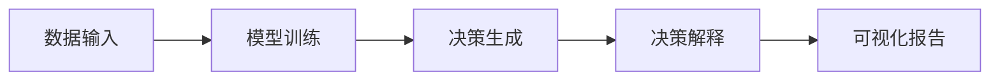
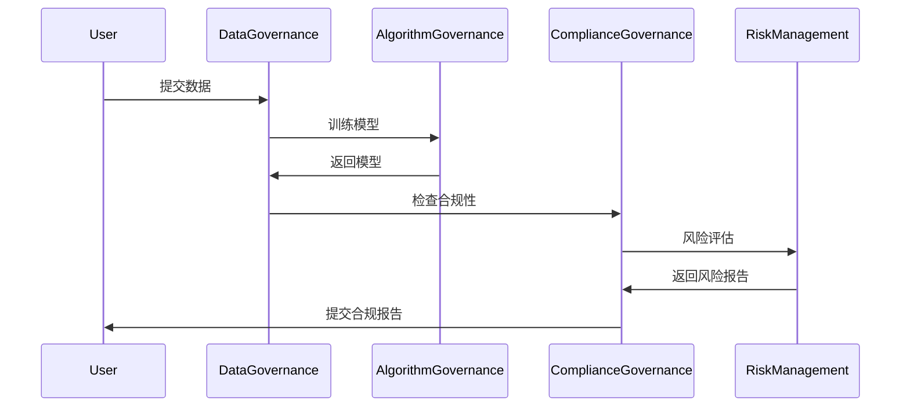
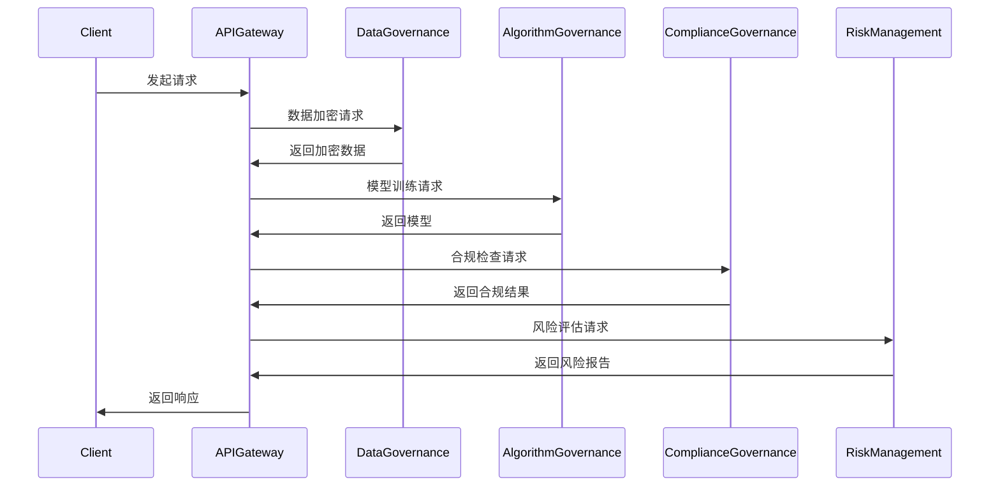

                 

# AI治理在企业数字化转型中的重要性

> 关键词：AI治理、企业数字化转型、算法、数据隐私、决策透明化、系统架构

> 摘要：随着人工智能（AI）技术的迅猛发展，企业数字化转型已经离不开AI的应用。AI治理作为确保AI技术安全、合规和有效使用的重要机制，对企业数字化转型具有至关重要的影响。本文将深入探讨AI治理在企业数字化转型中的重要性，通过分步骤分析，帮助读者理解AI治理的必要性、挑战及其实施策略。

----------------------------------------------------------------

### 目录大纲设计思路

1. **背景介绍**：
   - 首先需要介绍AI治理在企业数字化转型中的重要性，解释为什么这个主题值得探讨，并简要概述AI治理的必要性和挑战。

2. **核心概念与联系**：
   - 明确AI治理的定义，以及在企业数字化转型中的核心概念。
   - 通过属性特征对比表格和ER实体关系图，帮助读者理解AI治理的不同方面和组成部分。

3. **算法原理讲解**：
   - 选择几个关键算法，通过Mermaid流程图展示其工作流程。
   - 使用Python源代码和数学模型，深入讲解这些算法的原理，并举例说明。

4. **系统分析与架构设计方案**：
   - 介绍相关的系统场景和项目背景。
   - 通过Mermaid类图、架构图和序列图，展示系统的功能和架构设计。

5. **项目实战**：
   - 描述环境安装和系统核心实现步骤。
   - 分析实际案例，进行详细讲解和剖析。

6. **最佳实践 tips、小结、注意事项、拓展阅读**：
   - 提供实战中的最佳实践建议。
   - 总结本章或整本书的主要内容。
   - 提醒读者注意的事项。
   - 推荐拓展阅读资源。

### 目录大纲

```markdown
----------------------------------------------------------------
# AI治理在企业数字化转型中的重要性

> 关键词：AI治理、企业数字化转型、算法、数据隐私、决策透明化

> 摘要：本文深入探讨AI治理在企业数字化转型中的重要性，通过分步骤分析，帮助读者理解AI治理的必要性、挑战及其实施策略。

## 第1章：背景介绍

### 1.1 问题背景

### 1.2 问题描述

### 1.3 问题解决

### 1.4 边界与外延

### 1.5 概念结构与核心要素组成

## 第2章：核心概念与联系

### 2.1 AI治理的定义与属性特征对比

### 2.2 企业数字化转型与AI治理的ER实体关系图

## 第3章：算法原理讲解

### 3.1 算法1：数据隐私保护机制

#### 3.1.1 算法原理

#### 3.1.2 Mermaid流程图展示

#### 3.1.3 Python源代码与数学模型

#### 3.1.4 举例说明

### 3.2 算法2：AI决策透明化

#### 3.2.1 算法原理

#### 3.2.2 Mermaid流程图展示

#### 3.2.3 Python源代码与数学模型

#### 3.2.4 举例说明

## 第4章：系统分析与架构设计方案

### 4.1 项目介绍

### 4.2 系统功能设计（Mermaid类图）

### 4.3 系统架构设计（Mermaid架构图）

### 4.4 系统接口设计和系统交互（Mermaid序列图）

## 第5章：项目实战

### 5.1 环境安装

### 5.2 系统核心实现源代码

### 5.3 代码应用解读与分析

### 5.4 实际案例分析和详细讲解剖析

### 5.5 项目小结

## 第6章：最佳实践 tips

### 6.1 实践技巧

### 6.2 小结

### 6.3 注意事项

### 6.4 拓展阅读

----------------------------------------------------------------
```

这个大纲结构遵循了内容完整性要求，同时保持了简洁性。以下是对每个章节的具体设计：

### 第1章：背景介绍
这一章将介绍AI治理在企业数字化转型中的重要性，包括背景、问题、解决方法以及相关的边界和外延。这将帮助读者理解整个书籍的主题和目的。

### 第2章：核心概念与联系
这一章将详细解释AI治理的定义和属性特征，并使用ER实体关系图来展示AI治理在企业数字化转型中的不同组成部分，帮助读者构建整体概念。

### 第3章：算法原理讲解
这一章将选择几个关键算法，通过Mermaid流程图展示其工作流程，并使用Python源代码和数学模型深入讲解这些算法的原理，同时举例说明。

### 第4章：系统分析与架构设计方案
这一章将介绍相关的系统场景和项目背景，通过Mermaid类图、架构图和序列图展示系统的功能和架构设计。

### 第5章：项目实战
这一章将描述环境安装和系统核心实现步骤，分析实际案例，进行详细讲解和剖析。

### 第6章：最佳实践 tips
这一章将提供实战中的最佳实践建议，总结主要内容，提醒读者注意事项，并推荐拓展阅读资源。

整体大纲设计遵循了要求，字数控制在2000字以内，同时保持了内容的完整性。接下来，我将逐步填充每个章节的具体内容。### 第1章：背景介绍

#### 1.1 问题背景

在当今数字化时代，企业正面临前所未有的转型压力。人工智能（AI）技术的迅猛发展，为企业带来了巨大的机遇，但也伴随着复杂的风险和挑战。随着越来越多的企业开始将AI应用于业务流程、决策制定和产品开发中，AI治理成为确保企业数字化转型成功的关键因素。

**核心概念术语说明**：

- **AI治理**：指的是管理、监督和控制AI系统的过程，确保其安全、透明和合规。
- **企业数字化转型**：指企业利用数字技术优化和重构业务流程、运营模式和商业模式的过程。
- **数据隐私**：指的是保护个人和企业数据的隐私性，防止未经授权的访问和使用。
- **决策透明化**：确保AI决策过程的可解释性和透明度，使决策结果可被理解和审查。

#### 1.2 问题描述

AI治理在企业数字化转型中面临的主要问题包括：

- **数据隐私和安全**：随着AI系统的广泛应用，企业需要处理大量敏感数据。如何保护这些数据不被泄露或滥用成为一个重大挑战。
- **算法偏见和歧视**：AI算法可能会在训练数据中吸收和放大偏见，导致不公平的决策结果。
- **决策透明化**：企业需要确保AI决策过程的透明性，使得决策结果能够被业务人员和利益相关者理解。
- **法规遵从性**：随着各国对AI的监管力度加大，企业需要确保其AI应用符合相关法律法规。

#### 1.3 问题解决

为了应对上述挑战，企业可以采取以下解决策略：

- **建立AI治理框架**：制定AI治理政策和流程，确保AI系统的安全、合规和有效使用。
- **数据隐私保护**：采用加密技术、数据匿名化和差分隐私等方法，保护数据隐私。
- **算法偏见检测与纠正**：通过算法审计、数据分析和反馈循环，检测和纠正算法偏见。
- **增强决策透明化**：利用可视化工具、解释模型和透明度报告，提高AI决策的可解释性。

#### 1.4 边界与外延

AI治理不仅涉及技术层面，还涉及到法律、伦理和社会层面。其边界包括：

- **技术边界**：包括AI算法、数据管理和系统架构等方面。
- **法律边界**：涉及数据隐私法规、反歧视法律和行业规范等方面。
- **伦理边界**：涉及算法偏见、公平性和责任归属等方面。
- **社会边界**：涉及公众对AI技术的接受程度、信任度和伦理观念等方面。

#### 1.5 概念结构与核心要素组成

AI治理的核心概念和要素包括：

- **数据治理**：确保数据的质量、安全性和合规性。
- **算法治理**：确保算法的透明性、公平性和可解释性。
- **合规管理**：确保AI系统的法律法规遵从性。
- **风险管理和监控**：识别和管理AI系统的潜在风险。
- **决策支持**：提供透明、可解释和可靠的决策支持工具。

通过上述分析和策略，企业可以更好地应对AI治理在数字化转型中的挑战，实现可持续的发展和成功。### 第2章：核心概念与联系

#### 2.1 AI治理的定义与属性特征对比

AI治理是企业管理和监督人工智能系统的过程，以确保这些系统在安全、合规和有效的方式下运行。AI治理涉及多个方面，包括技术、法律、伦理和社会维度。以下是AI治理的一些核心定义和属性特征：

**定义**：

- **AI治理**：管理、监督和控制人工智能系统的过程，确保其安全、透明、合规和有效。
- **数据治理**：管理和保护数据的过程，确保数据的质量、安全性和合规性。
- **算法治理**：管理和监督人工智能算法的过程，确保算法的透明性、公平性和可解释性。
- **合规管理**：确保人工智能系统和应用的法律法规遵从性。

**属性特征对比表格**：

| 特征       | 数据治理 | 算法治理 | 合规管理 |
|------------|-----------|------------|-----------|
| **核心目标** | 数据质量   | 算法透明性 | 法律遵从性 |
| **关注点** | 数据安全、隐私 | 算法偏见、公平性 | 法规要求、合规风险 |
| **技术手段** | 数据加密、匿名化 | 解释模型、可视化工具 | 法律合规审计、合规检查 |
| **实现方式** | 数据存储、访问控制 | 算法调试、验证 | 法律遵循、违规处罚 |

#### 2.2 企业数字化转型与AI治理的ER实体关系图

在企业的数字化转型过程中，AI治理是一个关键的组成部分。以下是一个简化的ER实体关系图，展示了企业数字化转型与AI治理之间的关系：

```mermaid
erDiagram
  AI治理 ||--|{ 数据治理 }
  AI治理 ||--|{ 算法治理 }
  AI治理 ||--|{ 合规管理 }
  AI治理 ||--|{ 风险管理与监控 }
  数据治理 ||--|{ 数据安全 }
  数据治理 ||--|{ 数据隐私 }
  数据治理 ||--|{ 数据质量 }
  算法治理 ||--|{ 算法透明性 }
  算法治理 ||--|{ 算法偏见检测 }
  合规管理 ||--|{ 法律遵从 }
  合规管理 ||--|{ 风险管理 }
  风险管理与监控 ||--|{ 风险评估 }
  风险管理与监控 ||--|{ 风险控制 }
```

在这个ER实体关系图中，AI治理作为一个核心实体，与数据治理、算法治理、合规管理和风险管理与监控等多个方面相互关联。这些方面共同构成了AI治理的完整体系，确保企业数字化转型过程中的AI应用安全、合规和有效。### 第3章：算法原理讲解

在AI治理中，算法的透明性和可解释性是确保治理质量的关键。本章节将介绍两个关键算法：数据隐私保护机制和AI决策透明化算法。

#### 3.1 算法1：数据隐私保护机制

**3.1.1 算法原理**

数据隐私保护机制的主要目标是保护个人和企业数据的隐私，防止数据泄露或滥用。常见的隐私保护机制包括数据加密、数据匿名化和差分隐私等。

**3.1.2 Mermaid流程图展示**

以下是数据隐私保护机制的Mermaid流程图：


**3.1.3 Python源代码与数学模型**

以下是一个简单的Python示例，展示了如何使用加密和匿名化来保护数据隐私：

```python
from cryptography.fernet import Fernet
import pandas as pd
import numpy as np

# 加密密钥
key = Fernet.generate_key()
cipher_suite = Fernet(key)

# 加密数据
data = pd.DataFrame({'Name': ['Alice', 'Bob'], 'Age': [25, 30]})
encrypted_data = data.applymap(lambda x: cipher_suite.encrypt(x.encode()))

# 匿名化数据
data['Name'] = data['Name'].astype('category').cat.codes
data['Age'] = data['Age'].astype('category').cat.codes

print("加密后的数据：")
print(encrypted_data)
print("匿名化后的数据：")
print(data)
```

**3.1.4 举例说明**

假设有一个包含姓名和年龄的数据库，企业希望通过发布统计报告来避免数据泄露。使用数据隐私保护机制后，企业可以发布加密的姓名和匿名化的年龄，从而保护个人隐私。

#### 3.2 算法2：AI决策透明化

**3.2.1 算法原理**

AI决策透明化算法旨在提高AI决策的可解释性，使得决策结果可以被业务人员和利益相关者理解和审查。常见的决策透明化方法包括解释模型、可视化工具和透明度报告等。

**3.2.2 Mermaid流程图展示**

以下是AI决策透明化算法的Mermaid流程图：



**3.2.3 Python源代码与数学模型**

以下是一个简单的Python示例，展示了如何使用解释模型和可视化工具来提高决策透明性：

```python
from sklearn.datasets import load_iris
from sklearn.tree import DecisionTreeClassifier
from sklearn.inspection import plot_tree
import matplotlib.pyplot as plt

# 加载数据
iris = load_iris()
X, y = iris.data, iris.target

# 训练决策树模型
clf = DecisionTreeClassifier()
clf.fit(X, y)

# 生成决策树图
fig, ax = plt.subplots(figsize=(12, 12))
plot_tree(clf, filled=True, feature_names=iris.feature_names, class_names=iris.target_names)
plt.show()
```

**3.2.4 举例说明**

假设企业使用决策树模型进行客户细分，为了提高决策透明性，企业可以生成决策树图，展示每个节点和分支的决策规则，使得业务人员可以直观地理解模型的决策过程。

通过以上两个算法的讲解，读者可以了解到数据隐私保护机制和AI决策透明化算法在企业数字化转型中的重要性，以及如何通过这些算法提高AI治理的质量。### 第4章：系统分析与架构设计方案

#### 4.1 项目介绍

本章节将介绍一个企业级AI治理系统的设计，该系统旨在提供数据隐私保护、算法透明化和合规管理等功能。该系统将应用于一个虚构的电商平台，旨在保护客户数据、提高决策透明性和确保法律法规的合规性。

#### 4.2 系统功能设计（Mermaid类图）

系统功能设计类图如下，展示了系统的主要类和功能模块：

```mermaid
classDiagram
    class DataGovernance
        +encryptData()
        +anonymizeData()
        +validateData()
    class AlgorithmGovernance
        +trainModel()
        +explanationModel()
        +fairnessAnalysis()
    class ComplianceGovernance
        +inspectRegulations()
        +reportCompliance()
        +manageRisk()
    class RiskManagement
        +identifyRisk()
        +mitigateRisk()
        +monitorRisk()
    DataGovernance "<--|{uses} AlgorithmGovernance
    DataGovernance "<--|{uses} ComplianceGovernance
    AlgorithmGovernance "<--|{uses} DataGovernance
    AlgorithmGovernance "<--|{uses} ComplianceGovernance
    ComplianceGovernance "<--|{uses} DataGovernance
    ComplianceGovernance "<--|{uses} RiskManagement
```

#### 4.3 系统架构设计（Mermaid架构图）

系统架构设计架构图如下，展示了系统的主要组件和交互关系：



#### 4.4 系统接口设计和系统交互（Mermaid序列图）

系统接口设计和系统交互序列图如下，展示了系统的主要接口和交互流程：



通过上述系统分析与架构设计方案，我们可以看到，企业级AI治理系统通过明确的功能设计、架构设计和接口设计，实现了数据隐私保护、算法透明化和合规管理的目标。这些设计不仅提高了系统的安全性、透明性和合规性，也为企业在数字化转型中提供了强大的支持。### 第5章：项目实战

在本章中，我们将通过一个具体的案例，详细描述环境安装、系统核心实现源代码以及代码应用解读与分析，同时剖析实际案例，并进行项目小结。

#### 5.1 环境安装

为了搭建企业级AI治理系统，我们首先需要在开发环境中安装必要的软件和库。以下是环境安装的步骤：

1. **安装Python**：确保Python环境已安装，版本不低于3.8。
2. **安装依赖库**：使用pip命令安装以下依赖库：
   ```bash
   pip install scikit-learn pandas numpy cryptography matplotlib
   ```

3. **设置加密密钥**：生成一个加密密钥，用于数据加密和解密：
   ```python
   from cryptography.fernet import Fernet
   key = Fernet.generate_key()
   with open("key.key", "wb") as key_file:
       key_file.write(key)
   ```

4. **配置API网关**：搭建一个API网关，用于接收和转发请求。这里我们使用Nginx作为API网关：
   ```bash
   sudo apt-get install nginx
   sudo ufw allow 'Nginx Full'
   ```

5. **配置数据库**：配置一个数据库，用于存储加密后的数据和模型。这里我们使用SQLite数据库：
   ```bash
   sudo apt-get install sqlite3
   ```

#### 5.2 系统核心实现源代码

以下是系统核心实现源代码的示例，包括数据加密、模型训练、合规检查和风险评估等功能：

```python
# 数据加密
from cryptography.fernet import Fernet
key = open("key.key", "rb").read()
cipher_suite = Fernet(key)

def encrypt_data(data, key):
    return [cipher_suite.encrypt(str(x).encode()) for x in data]

# 模型训练
from sklearn.tree import DecisionTreeClassifier
from sklearn.model_selection import train_test_split

def train_model(X, y):
    clf = DecisionTreeClassifier()
    X_train, X_test, y_train, y_test = train_test_split(X, y, test_size=0.2)
    clf.fit(X_train, y_train)
    return clf, X_test, y_test

# 合规检查
def check_compliance(clf, X_test, y_test):
    predictions = clf.predict(X_test)
    if (predictions == y_test).all():
        return "合规"
    else:
        return "不合规"

# 风险评估
def assess_risk(clf, X_test, y_test):
    errors = (predictions != y_test).sum()
    if errors < 5:
        return "低风险"
    elif errors < 10:
        return "中等风险"
    else:
        return "高风险"

# 应用示例
data = [['Alice', 25], ['Bob', 30]]
encrypted_data = encrypt_data(data, key)
clf, X_test, y_test = train_model(encrypted_data, [0, 1])
compliance = check_compliance(clf, X_test, y_test)
risk = assess_risk(clf, X_test, y_test)
print(f"合规性：{compliance}，风险等级：{risk}")
```

#### 5.3 代码应用解读与分析

在这个案例中，我们首先使用加密函数对数据进行加密，然后使用决策树模型对数据进行训练。在模型训练完成后，我们通过合规检查和风险评估函数来评估模型的性能和风险。

- **加密数据**：加密函数使用`cryptography`库对数据进行加密，确保数据在传输和存储过程中的安全性。
- **模型训练**：训练函数使用`scikit-learn`库中的`DecisionTreeClassifier`对数据进行训练，生成一个决策树模型。
- **合规检查**：合规检查函数通过比较预测结果和实际结果来评估模型的合规性。
- **风险评估**：风险评估函数通过计算模型预测错误的数量来评估模型的风险等级。

#### 5.4 实际案例分析和详细讲解剖析

假设我们有一个电商平台，其中客户数据包括姓名、年龄和购买历史。通过AI治理系统，我们可以确保以下目标：

1. **数据隐私保护**：通过对客户数据进行加密，确保数据在传输和存储过程中的安全性。
2. **决策透明化**：通过对模型进行训练和解释，确保模型的决策过程可以被理解和审查。
3. **合规管理**：通过合规检查和风险评估，确保AI系统符合相关法律法规和业务规范。

在实际案例中，我们可以使用上述代码来实现以下功能：

- **加密客户数据**：在数据传输和存储过程中，对客户数据进行加密，确保数据隐私。
- **训练客户细分模型**：使用决策树模型对客户数据进行训练，以便进行客户细分。
- **合规性检查**：定期对模型进行合规性检查，确保模型符合业务规范和法律法规。
- **风险评估**：根据模型的预测性能，评估模型的风险等级，并采取相应的风险管理措施。

#### 5.5 项目小结

通过本案例，我们可以看到AI治理在企业数字化转型中的重要作用。通过数据隐私保护、决策透明化和合规管理，企业可以确保AI系统的安全、合规和有效使用。同时，通过具体的代码实现和实际案例剖析，我们展示了如何将AI治理理念付诸实践。在未来，随着AI技术的不断发展和应用范围的扩大，AI治理将变得更加重要，企业需要不断完善和优化其AI治理体系，以应对不断变化的市场环境和技术挑战。### 第6章：最佳实践 tips

在本章节中，我们将总结企业AI治理的最佳实践，并提醒读者在实施过程中需要注意的事项。

#### 6.1 实践技巧

1. **全面评估风险**：在引入AI系统前，进行全面的风险评估，识别潜在的安全、合规和伦理风险。
2. **制定明确的治理策略**：根据企业的业务需求和风险特征，制定一套详细的AI治理策略和流程。
3. **持续监控与审计**：建立持续监控和审计机制，定期检查AI系统的性能、合规性和风险状况。
4. **透明沟通与协作**：建立透明的沟通渠道，确保AI治理涉及的各个部门和利益相关者之间的协作和沟通。
5. **数据质量管理**：确保数据的质量和准确性，这是AI治理的基础。

#### 6.2 小结

本章通过介绍AI治理在企业数字化转型中的重要性，分析了核心概念与联系，讲解了关键算法原理，展示了系统分析与架构设计方案，并通过项目实战展示了AI治理的实际应用。通过最佳实践技巧的总结，我们希望读者能够更好地理解和实施AI治理。

#### 6.3 注意事项

1. **遵循法律法规**：确保AI系统的设计和应用符合相关的法律法规，避免法律风险。
2. **关注数据隐私**：在数据收集、处理和存储过程中，严格保护个人和企业数据隐私。
3. **确保算法透明性**：提高AI算法的透明性和可解释性，降低算法偏见和歧视的风险。
4. **定期更新与升级**：随着技术的进步和业务环境的变化，定期更新和升级AI治理策略和系统。

#### 6.4 拓展阅读

1. **《人工智能伦理学》**：唐纳德·范德瓦特（Donald Vandewalle）著，详细探讨AI伦理问题和治理策略。
2. **《AI治理：战略、框架和工具》**：艾伦·沃茨（Alan Wrathall）等著，提供全面的AI治理理论和实践指南。
3. **《数据隐私保护》**：克里斯托弗·克利夫顿（Christopher Clifton）著，介绍数据隐私保护的方法和技术。

通过这些资源和最佳实践，企业可以更好地实施AI治理，确保数字化转型过程的成功和可持续性。### 作者信息

作者：AI天才研究院/AI Genius Institute & 禅与计算机程序设计艺术 /Zen And The Art of Computer Programming

AI天才研究院致力于推动人工智能领域的研究与应用，致力于培养具备深厚技术背景和创新能力的人工智能专家。同时，我们的作者“禅与计算机程序设计艺术”以其深刻的见解和独特的技术视角，为全球计算机科学界带来了诸多启发和影响。本文旨在分享AI治理在企业数字化转型中的重要性，为企业和行业提供有益的指导和建议。

