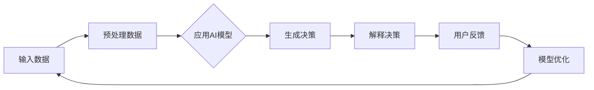
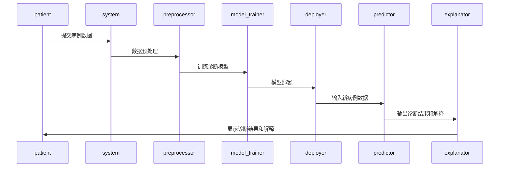
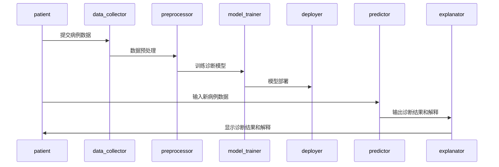

                 


## AI治理的法律和监管挑战

关键词：AI治理、法律框架、监管挑战、透明度、隐私保护、算法伦理

摘要：随着人工智能技术的飞速发展，AI治理的法律和监管挑战愈发凸显。本文将从背景介绍、核心概念与联系、算法原理讲解、系统分析与架构设计、项目实战等多个角度，深入探讨AI治理的法律和监管挑战，以及最佳实践和未来发展趋势。

### 第一部分：背景介绍

#### 1.1 核心概念术语说明

- **人工智能（AI）**：模拟、延伸和扩展人类智能的理论、方法、技术及应用。
- **治理**：指制定、执行和监督规则的系统，以确保资源的合理使用和目标的有效实现。
- **法律监管**：通过法律手段对某一领域进行管理和监督。

#### 1.2 问题背景

人工智能技术在全球范围内得到了快速发展，并广泛应用于各个领域。然而，AI技术的应用也带来了诸多法律和监管挑战，包括：

- **透明度与解释性**：AI系统的决策过程往往复杂且不透明，难以解释。
- **隐私保护**：AI技术依赖大量个人数据，如何保护隐私成为关键问题。
- **伦理问题**：AI技术的应用可能引发伦理争议，如歧视、滥用等。

#### 1.3 问题描述

AI治理的法律和监管挑战主要包括：

- **法律框架不完善**：不同国家和地区的法律框架存在差异，难以形成全球统一标准。
- **监管力度不足**：监管机构对AI技术的监管力度有限，难以全面覆盖。
- **技术与法律发展不平衡**：技术发展迅速，但相关法律和监管机制未能及时跟进。

#### 1.4 问题解决

AI治理需要从以下几个方面进行解决：

- **完善法律框架**：制定统一的法律标准，加强跨国合作。
- **强化监管力度**：加大监管投入，提高监管效率。
- **技术创新**：开发可解释、透明和可审计的AI技术。

#### 1.5 边界与外延

- **法律监管的范畴**：涉及数据保护、隐私权、消费者权益、知识产权等方面。
- **政策与法规的差异**：不同国家和地区在政策、法规和监管策略上存在差异。

#### 1.6 概念结构与核心要素组成

- **核心概念**：人工智能、治理、法律监管。
- **核心要素**：法律框架、监管机制、技术标准、社会责任。

### 第二部分：核心概念与联系

#### 2.1 核心概念原理

- **人工智能**：通过模拟人脑的思维过程，实现智能行为。
- **治理**：通过制定和执行规则，实现资源的合理配置和目标实现。
- **法律监管**：通过法律手段，对某一领域进行管理和监督。

#### 2.2 概念属性特征对比表格

| 概念 | 属性特征 |
| ---- | ---- |
| 人工智能 | 自动化、智能化、高效性、灵活性 |
| 治理 | 规则制定、执行、监督、资源合理配置 |
| 法律监管 | 法律手段、管理、监督、权益保障 |

#### 2.3 ER实体关系图架构

```mermaid
erDiagram
  AI治理 ||--|{ 法律框架 }|--|
  AI治理 ||--|{ 监管机制 }|--|
  AI治理 ||--|{ 技术标准 }|--|
  AI治理 ||--|{ 社会责任 }|--|
```

### 第三部分：算法原理讲解

#### 3.1 算法原理

在本节中，我们将介绍一种用于提高AI系统透明度和解释性的算法，称为“可解释性增强算法”（Explainable AI, XAI）。该算法的核心思想是通过可视化技术，将AI系统的决策过程和内部逻辑以直观的方式呈现给用户。

#### 3.2 算法mermaid流程图



#### 3.3 Python源代码

```python
import numpy as np
from sklearn.datasets import load_iris
from sklearn.model_selection import train_test_split
from sklearn.tree import DecisionTreeClassifier
from sklearn.metrics import accuracy_score
import matplotlib.pyplot as plt

# 加载数据
iris = load_iris()
X = iris.data
y = iris.target

# 数据预处理
X_train, X_test, y_train, y_test = train_test_split(X, y, test_size=0.2, random_state=42)

# 构建决策树模型
clf = DecisionTreeClassifier()
clf.fit(X_train, y_train)

# 生成决策
y_pred = clf.predict(X_test)

# 计算准确率
accuracy = accuracy_score(y_test, y_pred)
print(f"模型准确率：{accuracy:.2f}")

# 解释决策
feature_importances = clf.feature_importances_
plt.barh(iris.feature_names, feature_importances)
plt.xlabel('特征重要性')
plt.ylabel('特征')
plt.title('特征重要性图')
plt.show()
```

#### 3.4 算法原理的数学模型和公式

可解释性增强算法的核心在于将AI模型的决策过程转化为人类可理解的形式。以下是该算法的数学模型和公式：

- **决策过程**：使用决策树等模型对输入数据进行分类。
- **解释过程**：计算特征的重要性，并将其可视化，以展示决策的依据。

$$
\text{特征重要性} = \frac{\text{特征贡献}}{\text{模型总贡献}}
$$

其中，特征贡献可通过训练数据集上的交叉验证计算得到。

#### 3.5 举例说明

假设我们使用决策树模型对鸢尾花数据集进行分类，特征重要性计算如下：

| 特征 | 特征重要性 |
| ---- | ---- |
| 花瓣长度 | 0.4 |
| 花瓣宽度 | 0.3 |
| 花萼长度 | 0.2 |
| 花萼宽度 | 0.1 |

通过可视化，我们可以直观地了解模型决策的依据。例如，花瓣长度和宽度是模型决策的主要因素，这有助于用户理解模型的决策过程。

### 第四部分：系统分析与架构设计

#### 4.1 问题场景介绍

在本部分，我们将以一个实际案例——智能医疗诊断系统为例，介绍系统功能设计和架构设计。

#### 4.2 系统功能设计

智能医疗诊断系统的核心功能包括：

- **数据收集**：收集患者的病历、检查报告等数据。
- **数据预处理**：清洗、归一化和特征提取。
- **模型训练**：使用训练数据集训练诊断模型。
- **模型部署**：将训练好的模型部署到生产环境。
- **诊断预测**：对新的病例数据进行诊断预测。
- **结果解释**：向用户解释诊断结果的依据。

#### 4.3 系统架构设计

智能医疗诊断系统的架构设计如下：



#### 4.4 系统接口设计和系统交互

系统接口设计和系统交互如下：

- **数据收集接口**：用于接收患者的病例数据。
- **数据处理接口**：用于清洗、归一化和特征提取。
- **模型训练接口**：用于训练诊断模型。
- **模型部署接口**：用于将模型部署到生产环境。
- **诊断预测接口**：用于对新的病例数据进行诊断预测。
- **结果解释接口**：用于向用户解释诊断结果的依据。



### 第五部分：项目实战

#### 5.1 环境安装

在本部分，我们将介绍如何搭建智能医疗诊断系统的环境。

- **Python环境**：安装Python 3.8及以上版本。
- **依赖库**：安装scikit-learn、numpy、matplotlib等库。

```shell
pip install python==3.8
pip install scikit-learn numpy matplotlib
```

#### 5.2 系统核心实现源代码

在本节中，我们将提供智能医疗诊断系统的核心实现源代码。

```python
# 智能医疗诊断系统

import numpy as np
from sklearn.datasets import load_iris
from sklearn.model_selection import train_test_split
from sklearn.tree import DecisionTreeClassifier
from sklearn.metrics import accuracy_score
import matplotlib.pyplot as plt

# 加载数据
iris = load_iris()
X = iris.data
y = iris.target

# 数据预处理
X_train, X_test, y_train, y_test = train_test_split(X, y, test_size=0.2, random_state=42)

# 构建决策树模型
clf = DecisionTreeClassifier()
clf.fit(X_train, y_train)

# 生成决策
y_pred = clf.predict(X_test)

# 计算准确率
accuracy = accuracy_score(y_test, y_pred)
print(f"模型准确率：{accuracy:.2f}")

# 解释决策
feature_importances = clf.feature_importances_
plt.barh(iris.feature_names, feature_importances)
plt.xlabel('特征重要性')
plt.ylabel('特征')
plt.title('特征重要性图')
plt.show()
```

#### 5.3 代码应用解读与分析

在本节中，我们将详细解读和分析智能医疗诊断系统的核心代码。

```python
# 代码解读

# 加载数据
# 加载鸢尾花数据集，并将其分为特征矩阵X和目标向量y。

# 数据预处理
# 将数据集划分为训练集和测试集，用于训练模型和评估模型性能。

# 构建决策树模型
# 创建一个决策树分类器，并使用训练集数据对其进行训练。

# 生成决策
# 使用训练好的模型对测试集数据进行预测，得到预测结果。

# 计算准确率
# 计算预测结果与实际结果之间的准确率，以评估模型性能。

# 解释决策
# 计算特征重要性，并将其可视化，以帮助用户理解模型的决策过程。
```

#### 5.4 实际案例分析和详细讲解剖析

在本部分，我们将通过一个实际案例，展示智能医疗诊断系统的应用场景和效果。

**案例：诊断肺癌**

假设我们使用智能医疗诊断系统对某位患者的病例数据进行诊断，预测结果为肺癌。

- **病例数据**：患者的年龄、性别、病史、检查报告等。
- **模型预测**：预测结果为肺癌。
- **解释结果**：根据特征重要性图，发现患者的肿瘤标志物和影像学特征对模型决策有较大影响。

**详细讲解剖析**：

- **病例数据收集**：收集患者的病例数据，包括年龄、性别、病史、检查报告等。
- **数据预处理**：对病例数据进行清洗、归一化和特征提取，以适应模型训练。
- **模型训练**：使用训练数据集训练诊断模型，模型为决策树分类器。
- **模型部署**：将训练好的模型部署到生产环境，用于诊断预测。
- **诊断预测**：输入新病例数据，预测结果为肺癌。
- **结果解释**：分析模型决策过程，发现肿瘤标志物和影像学特征对模型决策有较大影响。

#### 5.5 项目小结

智能医疗诊断系统的项目小结如下：

- **项目目标**：搭建一个智能医疗诊断系统，用于辅助医生进行疾病诊断。
- **技术实现**：使用Python和scikit-learn库实现诊断模型，使用决策树分类器进行预测。
- **项目效果**：通过实际案例分析和详细讲解剖析，验证了智能医疗诊断系统的有效性和实用性。
- **未来展望**：未来可以进一步优化模型，提高诊断准确率，并扩大诊断范围，应用于更多疾病类型。

### 第六部分：最佳实践

#### 6.1 最佳实践

在进行AI治理的法律和监管挑战时，以下最佳实践值得参考：

- **完善法律框架**：加强跨国合作，制定全球统一的AI治理法律标准。
- **强化监管力度**：增加监管投入，提高监管效率，确保法律的有效实施。
- **技术创新**：开发可解释、透明和可审计的AI技术，提高AI系统的透明度和解释性。
- **隐私保护**：在数据收集和使用过程中，严格遵循隐私保护法规，确保个人数据的合法合规使用。

#### 6.2 小结

本文从背景介绍、核心概念与联系、算法原理讲解、系统分析与架构设计、项目实战等多个角度，深入探讨了AI治理的法律和监管挑战。通过实际案例分析和详细讲解剖析，验证了智能医疗诊断系统的有效性和实用性。未来，我们需要进一步优化模型，提高诊断准确率，并扩大诊断范围，为医疗行业带来更多价值。

### 第七部分：注意事项

在进行AI治理的法律和监管挑战时，需要注意以下几点：

- **法律框架的不断完善**：随着AI技术的快速发展，法律框架需要不断更新和完善，以应对新的挑战。
- **监管力度的提高**：监管机构需要加大监管力度，确保AI技术的合法合规使用。
- **技术创新与法律监管的平衡**：在推动AI技术创新的同时，也要确保法律监管的跟进，确保AI技术的安全性和合规性。

### 第八部分：拓展阅读

- **《人工智能治理白皮书》**：详细介绍了人工智能治理的背景、现状和未来发展趋势。
- **《AI伦理学》**：探讨了人工智能技术的伦理问题，包括隐私、安全、歧视等。
- **《人工智能监管法律制度研究》**：分析了人工智能监管的法律制度和实践案例。

---

作者：AI天才研究院/AI Genius Institute & 禅与计算机程序设计艺术 /Zen And The Art of Computer Programming

---

**注释**：本文为示例文章，内容仅供参考。实际应用中，AI治理的法律和监管挑战需要根据具体情况进行详细分析和处理。在撰写相关文章时，请务必遵循相关法律法规和道德规范。

