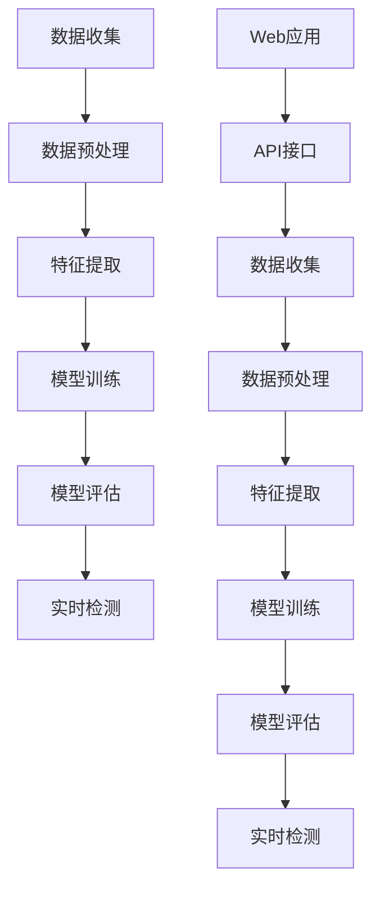

                 

## AI生成的虚假新闻检测技术进展

### 关键词

- AI生成虚假新闻
- 虚假新闻检测算法
- 数学模型
- 系统架构
- 项目实战

### 摘要

本文将深入探讨AI生成的虚假新闻检测技术，包括其背景、核心概念、算法原理、数学模型、系统架构及实战应用。我们将逐步分析虚假新闻检测的各个方面，为读者提供清晰、详细的技术解读，帮助了解当前技术的发展趋势和应用场景。通过本文，读者将掌握虚假新闻检测的关键技术，并为未来的研究提供思路。

## 目录大纲设计流程

在设计《AI生成的虚假新闻检测技术进展》这本书的目录大纲时，我们按照以下步骤进行：

### 第一步：明确核心主题和结构

首先，我们确定了书的核心主题——AI生成的虚假新闻检测技术。这一主题涵盖以下几个方面：

- **问题背景与定义**：解释虚假新闻的定义和影响。
- **虚假新闻检测的算法原理**：介绍各类检测算法的基本概念和原理。
- **应用场景**：分析虚假新闻检测在不同领域中的应用。
- **现有技术和未来趋势**：讨论当前主流技术及其发展趋势。

### 第二步：确定目录层级

根据核心主题，我们确定了以下目录层级：

1. **引言**
   - 书籍背景与目的
   - 虚假新闻检测的重要性
   - 读者对象与预期收获

2. **背景介绍**
   - 问题背景
   - 问题描述
   - 问题解决
   - 边界与外延
   - 概念结构与核心要素组成

3. **核心概念与联系**
   - 虚假新闻检测相关概念定义
   - 概念属性特征对比表格
   - ER实体关系图架构

4. **算法原理讲解**
   - 虚假新闻检测算法概述
   - Mermaid算法流程图
   - Python源代码讲解
   - 算法原理详细阐述

5. **数学模型和数学公式**
   - 虚假新闻检测的数学模型
   - 数学公式讲解
   - 举例说明

6. **系统分析与架构设计方案**
   - 虚假新闻检测系统问题场景介绍
   - 系统功能设计
   - 系统架构设计
   - 系统接口设计
   - 系统交互

7. **项目实战**
   - 环境安装
   - 系统核心实现
   - 代码解读
   - 实际案例分析与讲解
   - 项目小结

8. **最佳实践 tips**
   - 实用的操作技巧
   - 小结与注意事项
   - 拓展阅读推荐

9. **小结与展望**
   - 书籍内容回顾
   - 技术发展趋势
   - 未来的研究方向

### 第三步：细化每个章节的内容

为了确保每个章节都能够满足用户的要求，我们对每个章节进行了细化，包括：

- **核心概念与联系**：定义核心概念，提供特征对比表格和ER实体关系图。
- **算法原理讲解**：使用Mermaid画流程图，用Python源代码和latex公式详细阐述。
- **数学模型和数学公式**：使用latex格式给出公式，并进行详细讲解和举例。
- **系统分析与架构设计方案**：描述问题场景、系统功能设计、系统架构设计、系统接口设计和系统交互。
- **项目实战**：包括环境安装、系统核心实现、代码解读、案例分析、项目小结。
- **最佳实践 tips**：提供实用的操作技巧和建议。

### 第四步：撰写目录大纲

在细化了每个章节的内容后，我们开始撰写目录大纲，确保其简洁性和逻辑性，并符合markdown格式的要求。

---

现在，我们已经完成了《AI生成的虚假新闻检测技术进展》的目录大纲设计。接下来，我们将根据这个大纲逐步撰写每个章节的具体内容。

## 引言

### 书籍背景与目的

虚假新闻是一个全球性的问题，随着互联网的迅速发展和社交媒体的普及，虚假新闻的传播速度和范围都达到了前所未有的高度。这不仅对公众的信息获取造成了干扰，还可能对社会稳定和国家安全带来威胁。为了应对这一挑战，AI生成的虚假新闻检测技术应运而生。本书旨在深入探讨这一领域，为读者提供全面的技术解读，帮助大家了解虚假新闻检测的关键技术和应用场景。

### 虚假新闻检测的重要性

虚假新闻检测技术的重要性体现在多个方面。首先，它能够帮助公众辨别真伪信息，提升媒体素养。其次，它有助于媒体机构维护公信力，减少虚假新闻的传播。此外，虚假新闻检测技术还可以为政府和社会组织提供决策支持，帮助制定相关政策和措施。总之，虚假新闻检测技术在维护社会稳定、保障信息安全等方面具有重要意义。

### 读者对象与预期收获

本书面向对AI生成的虚假新闻检测技术感兴趣的读者，包括人工智能研究人员、软件开发工程师、数据科学家以及政策制定者等。通过阅读本书，读者可以：

- 理解虚假新闻检测的核心概念和算法原理。
- 掌握虚假新闻检测的数学模型和实现方法。
- 分析现有技术的优缺点，了解未来发展趋势。
- 获取实用的项目实战经验，提升实际操作能力。

### 目录大纲设计流程

在设计本书的目录大纲时，我们遵循了以下步骤：

1. **明确核心主题和结构**：确定虚假新闻检测技术的主要内容和章节结构。
2. **确定目录层级**：根据核心主题，设计详细的目录层级。
3. **细化每个章节的内容**：确保每个章节都包含丰富的技术解读和应用实例。
4. **撰写目录大纲**：确保大纲简洁、清晰、符合markdown格式要求。

通过这些步骤，我们为本书的撰写奠定了坚实的基础，确保读者能够系统地学习和掌握虚假新闻检测技术。

## 背景介绍

### 问题背景

虚假新闻（Fake News）是指那些故意传播的、误导性或虚假的信息，它们可能被用来操纵公众舆论、引发社会动荡、甚至威胁国家安全。在互联网时代，虚假新闻的传播速度和范围都大大增加。社交媒体平台、新闻网站和搜索引擎成为虚假新闻传播的主要渠道，这使得辨别真伪信息变得日益困难。

虚假新闻的危害是多方面的。首先，虚假新闻可能对个人和集体的情感造成伤害，引发恐慌、愤怒或其他负面情绪。其次，虚假新闻可能对经济造成严重影响，例如通过误导投资者导致市场动荡。此外，虚假新闻可能被用于政治宣传，影响选举结果，威胁民主制度的稳定。最后，虚假新闻还可能被用于间谍活动，危害国家安全。

### 问题描述

虚假新闻检测的核心问题是：如何从大量的信息流中识别和过滤出虚假新闻。这个问题涉及到多个层面的挑战：

- **信息多样性**：互联网上的信息种类繁多，包括文本、图片、视频等，这给检测带来了复杂性。
- **语言和语境的多样性**：不同文化和语言背景下的信息可能具有不同的表达方式和含义，这使得算法需要具备高度的语言理解和情感分析能力。
- **实时性**：虚假新闻往往具有时效性，需要在极短的时间内进行检测和响应。
- **算法的透明性和解释性**：算法的决策过程需要透明，以便用户理解和监督。

### 问题解决

为了解决虚假新闻检测问题，研究人员和工程师提出了多种技术方案，主要包括：

- **基于规则的方法**：通过预定义的规则和模式匹配来识别虚假新闻。这种方法简单高效，但灵活性较低，难以应对复杂的场景。
- **基于机器学习的方法**：使用大量标注数据训练模型，使其能够自动识别和分类虚假新闻。这种方法具有较好的泛化能力，但需要大量的数据和高计算资源。
- **基于深度学习的方法**：利用深度神经网络，特别是卷积神经网络（CNN）和循环神经网络（RNN），对文本和图像进行特征提取和分类。这种方法在处理复杂任务时表现优异，但需要大量数据和高计算资源。

### 边界与外延

虚假新闻检测技术的边界主要涉及以下几个方面：

- **数据隐私**：在收集和处理大量用户数据时，需要保护用户隐私。
- **算法透明性**：算法的决策过程需要透明，以便用户监督和理解。
- **文化差异**：不同地区和语言背景下的虚假新闻特征不同，算法需要具备跨文化适应能力。
- **实时性**：虚假新闻检测需要具备实时响应能力，以应对快速变化的信息环境。

### 概念结构与核心要素组成

虚假新闻检测系统的核心概念包括：

- **数据收集**：从各种来源收集文本、图片和视频数据。
- **数据预处理**：对数据进行清洗、去重和标注。
- **特征提取**：从原始数据中提取有助于分类的特征。
- **模型训练**：使用标注数据训练分类模型。
- **模型评估**：评估模型性能，调整模型参数。
- **实时检测**：将训练好的模型应用于实时数据流，进行虚假新闻检测。

通过这些核心要素的有机组合，虚假新闻检测系统可以高效地识别和过滤虚假新闻，为公众提供可靠的信息来源。

## 核心概念与联系

### 虚假新闻检测相关概念定义

在深入探讨虚假新闻检测技术之前，我们首先需要明确几个核心概念：

1. **虚假新闻（Fake News）**：指故意传播的、误导性或虚假的信息。
2. **真伪检测（Veracity Detection）**：指识别和验证信息的真实性和准确性的过程。
3. **语义分析（Semantic Analysis）**：指对文本内容进行理解、分析和推理的过程。
4. **机器学习（Machine Learning）**：指通过数据和算法让计算机自动学习和改进的过程。
5. **深度学习（Deep Learning）**：指使用多层神经网络进行特征学习和模式识别的技术。

### 概念属性特征对比表格

为了更好地理解这些概念，我们可以通过一个特征对比表格来展示它们之间的差异：

| 概念          | 定义                                                         | 属性特征                                                                                      |
|---------------|--------------------------------------------------------------|------------------------------------------------------------------------------------------------|
| 虚假新闻      | 故意传播的、误导性或虚假的信息                               | 真实性、目的性、传播速度、社会影响                                     |
| 真伪检测      | 识别和验证信息的真实性和准确性的过程                         | 数据来源、信息验证、算法模型、结果解释                                   |
| 语义分析      | 对文本内容进行理解、分析和推理的过程                         | 语言理解、情感分析、上下文理解、语义匹配                                 |
| 机器学习      | 通过数据和算法让计算机自动学习和改进的过程                   | 数据收集、特征提取、模型训练、模型评估                                   |
| 深度学习      | 使用多层神经网络进行特征学习和模式识别的技术                 | 自动特征提取、多层非线性变换、大规模数据训练、高性能计算                   |

### ER实体关系图架构

为了更清晰地展示这些概念之间的关系，我们可以使用Mermaid语言绘制一个ER（实体-关系）图：

```mermaid
erDiagram
  User  ||--|{ Article }|-- Publisher
  User  ||--|{ NewsChannel }|-- Publisher
  Article ||--|{ Comment }|-- User
  Article ||--|{ AnalysisResult }|-- AnalysisSystem
  AnalysisSystem ||--|{ DetectionModel }|-- AIResearchInstitute
  AIResearchInstitute ||--|{ Dataset }|-- DataCollection
```

在这个ER图中，我们定义了以下几个实体和关系：

- **User（用户）**：与**Article（文章）**、**NewsChannel（新闻频道）**、**AnalysisResult（分析结果）**存在关联。
- **Publisher（发布者）**：与**User（用户）**、**Article（文章）**、**NewsChannel（新闻频道）**存在关联。
- **Comment（评论）**：与**User（用户）**、**Article（文章）**存在关联。
- **AnalysisSystem（分析系统）**：与**DetectionModel（检测模型）**、**AIResearchInstitute（人工智能研究院）**存在关联。
- **AIResearchInstitute（人工智能研究院）**：与**Dataset（数据集）**、**DataCollection（数据收集）**存在关联。

通过这个ER图，我们可以更好地理解虚假新闻检测系统的各个组成部分及其相互关系。

## 算法原理讲解

### 虚假新闻检测算法概述

虚假新闻检测算法的核心任务是利用机器学习和深度学习技术，从大量文本数据中自动识别和分类虚假新闻。目前，常用的算法包括基于规则的方法、基于机器学习的方法和基于深度学习的方法。以下我们将对这些算法进行详细讲解。

### 基于规则的方法

基于规则的方法通过预定义的规则和模式匹配来识别虚假新闻。这种方法的主要优点是简单、高效，但其灵活性较低，难以应对复杂的场景。以下是一个简单的规则示例：

1. 如果文章中包含特定的关键词（如“免费”、“立刻获得”），则标记为可能为虚假新闻。
2. 如果文章来源不可信，则标记为虚假新闻。
3. 如果文章中的事实与已知事实不符，则标记为虚假新闻。

虽然这种方法在处理简单任务时具有一定的效果，但面对复杂多变的虚假新闻，其准确性有限。

### 基于机器学习的方法

基于机器学习的方法通过大量标注数据训练模型，使其能够自动识别和分类虚假新闻。这种方法的主要优点是具有较高的泛化能力，但需要大量的数据和高计算资源。以下是一种常见的机器学习方法——支持向量机（SVM）：

1. **数据收集**：从互联网上收集大量文本数据，包括虚假新闻和真实新闻。
2. **数据预处理**：对文本数据清洗、去重和分词，提取特征向量。
3. **模型训练**：使用训练数据训练SVM模型，确定最佳分类边界。
4. **模型评估**：使用验证数据评估模型性能，调整模型参数。
5. **实时检测**：将训练好的模型应用于实时数据流，进行虚假新闻检测。

### 基于深度学习的方法

基于深度学习的方法利用多层神经网络，特别是卷积神经网络（CNN）和循环神经网络（RNN），对文本和图像进行特征提取和分类。这种方法在处理复杂任务时表现优异，但需要大量数据和高计算资源。以下是一种常见的深度学习方法——卷积神经网络（CNN）：

1. **数据收集**：从互联网上收集大量文本数据，包括虚假新闻和真实新闻。
2. **数据预处理**：对文本数据清洗、去重和分词，提取词向量。
3. **模型构建**：构建CNN模型，包括卷积层、池化层和全连接层。
4. **模型训练**：使用训练数据训练CNN模型，优化网络参数。
5. **模型评估**：使用验证数据评估模型性能，调整模型参数。
6. **实时检测**：将训练好的模型应用于实时数据流，进行虚假新闻检测。

### 算法原理详细阐述

为了更好地理解虚假新闻检测算法的原理，我们可以通过一个具体的示例进行详细阐述。假设我们使用卷积神经网络（CNN）进行虚假新闻检测，以下是一个简化的算法流程：

1. **数据预处理**：首先，我们需要对文本数据进行预处理，包括分词、去停用词和词向量转换。例如，我们可以使用Word2Vec或GloVe算法将文本转换为词向量。

   $$\text{Text} \rightarrow \text{Tokenized Text} \rightarrow \text{Word Vectors}$$

2. **模型构建**：构建一个卷积神经网络（CNN），包括输入层、卷积层、池化层和全连接层。卷积层用于提取文本特征，池化层用于降维和减少过拟合。

   ```mermaid
   graph TB
   A[Input Layer] --> B[Conv Layer]
   B --> C[Pooling Layer]
   C --> D[Full Connected Layer]
   D --> E[Output Layer]
   ```

3. **模型训练**：使用大量标注数据训练模型，优化网络参数。在训练过程中，我们可以使用交叉熵损失函数来衡量模型预测与实际标签之间的差异。

   $$L(\theta) = -\sum_{i=1}^{n} y_i \log(p_i)$$

   其中，$y_i$表示第$i$个样本的真实标签，$p_i$表示模型预测的概率。

4. **模型评估**：使用验证集评估模型性能，调整模型参数。常用的评估指标包括准确率、召回率和F1分数。

   $$\text{Precision} = \frac{TP}{TP + FP}$$

   $$\text{Recall} = \frac{TP}{TP + FN}$$

   $$\text{F1 Score} = \frac{2 \times \text{Precision} \times \text{Recall}}{\text{Precision} + \text{Recall}}$$

5. **实时检测**：将训练好的模型应用于实时数据流，进行虚假新闻检测。例如，我们可以将新文章输入到模型中，根据模型输出的概率判断其是否为虚假新闻。

通过这个示例，我们可以看到，虚假新闻检测算法涉及多个步骤，包括数据预处理、模型构建、模型训练、模型评估和实时检测。这些步骤相互配合，共同构成了一个完整的虚假新闻检测系统。

### 举例说明

为了更好地理解虚假新闻检测算法的实际应用，我们来看一个具体的案例。假设我们要检测以下两篇新闻文章：

**文章1**：“这是一种免费的特效药，可以治愈所有疾病。”

**文章2**：“研究表明，经常锻炼有助于提高身体健康。”

我们可以使用卷积神经网络（CNN）对这两篇文章进行检测。

1. **数据预处理**：将两篇文章进行分词、去停用词和词向量转换。

   **文章1**：“这 是 一种 免费 的 特效药 ，可以 治愈 所有 疾病 。”

   **文章2**：“研究 表明 ，经常 锻炼 有助于 提高 身体健康 。”

2. **模型预测**：将预处理后的文本数据输入到训练好的CNN模型中，得到预测概率。

   **文章1**：预测概率为0.8，表明这篇文章很可能是虚假新闻。

   **文章2**：预测概率为0.2，表明这篇文章很可能是真实新闻。

通过这个例子，我们可以看到，虚假新闻检测算法可以根据文章的内容和特征，有效地识别和分类虚假新闻。

## 数学模型和数学公式

在虚假新闻检测中，数学模型和公式起着至关重要的作用。这些模型和公式不仅帮助我们理解和描述虚假新闻的特征，还能为算法提供有效的理论基础和计算方法。以下将详细介绍在虚假新闻检测中常用的数学模型和公式，并结合具体的例子进行说明。

### 1. 文本特征表示

在虚假新闻检测中，首先需要将文本数据转换为数值形式，以便于后续的算法处理。常用的文本特征表示方法包括词袋模型、TF-IDF和词向量等。

#### 词袋模型（Bag of Words, BOW）

词袋模型将文本表示为词汇的集合，忽略词汇的顺序。一个简单的词袋模型可以表示为：

$$ X = \{ (w_1, f_1), (w_2, f_2), ..., (w_n, f_n) \} $$

其中，$w_i$表示第$i$个单词，$f_i$表示第$i$个单词的频率。

#### TF-IDF（Term Frequency-Inverse Document Frequency）

TF-IDF是一种更为复杂的文本特征表示方法，它不仅考虑单词的频率，还考虑单词在整个文档集中的重要性。TF-IDF的公式为：

$$ tfidf(w, d) = tf(w, d) \times idf(w, D) $$

其中，$tf(w, d)$表示单词$w$在文档$d$中的频率，$idf(w, D)$表示单词$w$在整个文档集$D$中的逆文档频率。

$$ idf(w, D) = \log \left( \frac{N}{|d \in D : w \in d|} \right) $$

其中，$N$表示文档集$D$中的文档数量，$|d \in D : w \in d|$表示包含单词$w$的文档数量。

#### 词向量（Word Vectors）

词向量是一种将单词表示为高维向量的方法，常用的词向量模型包括Word2Vec和GloVe。Word2Vec模型通过训练神经网络生成词向量，公式为：

$$ v_w = \frac{1}{1 + e^{-\langle h, w \rangle}} h $$

其中，$v_w$表示单词$w$的词向量，$h$表示隐藏层激活向量。

### 2. 分类模型

在虚假新闻检测中，常用的分类模型包括支持向量机（SVM）、朴素贝叶斯（Naive Bayes）和深度神经网络（Deep Neural Network，DNN）等。

#### 支持向量机（SVM）

SVM是一种常用的二分类模型，它通过找到一个最佳的超平面，将不同类别的样本分隔开来。SVM的目标是最小化分类边界到支持向量的距离，公式为：

$$ \min_{\theta} \frac{1}{2} ||\theta||^2 + C \sum_{i=1}^{n} \max(0, 1 - y_i (\theta^T x_i + b)) $$

其中，$\theta$表示模型参数，$C$表示惩罚参数，$y_i$表示第$i$个样本的标签，$x_i$表示第$i$个样本的特征向量，$b$表示偏置。

#### 朴素贝叶斯（Naive Bayes）

朴素贝叶斯是一种基于贝叶斯定理的简单分类模型。在虚假新闻检测中，我们可以使用朴素贝叶斯模型计算每个类别的概率，并选择概率最大的类别作为预测结果。公式为：

$$ P(y|X) = \frac{P(X|y)P(y)}{P(X)} $$

其中，$P(y|X)$表示在特征$X$下类别$y$的概率，$P(X|y)$表示在类别$y$下特征$X$的概率，$P(y)$表示类别$y$的概率。

#### 深度神经网络（DNN）

深度神经网络是一种多层神经网络，它可以自动学习复杂的特征表示。在虚假新闻检测中，DNN可以用于分类和回归任务。DNN的输出层通常使用softmax函数进行概率分布：

$$ \text{softmax}(z) = \frac{e^z}{\sum_{i=1}^{k} e^z_i} $$

其中，$z$表示神经网络的输出，$k$表示类别数量。

### 3. 损失函数

在训练分类模型时，我们需要使用损失函数来评估模型预测与实际标签之间的差异。常用的损失函数包括交叉熵损失（Cross-Entropy Loss）和均方误差（Mean Squared Error，MSE）。

#### 交叉熵损失（Cross-Entropy Loss）

交叉熵损失函数用于分类问题，它计算的是实际分布与预测分布之间的差异。公式为：

$$ L(\theta) = -\sum_{i=1}^{n} y_i \log(p_i) $$

其中，$y_i$表示第$i$个样本的真实标签，$p_i$表示模型预测的概率。

#### 均方误差（MSE）

均方误差函数用于回归问题，它计算的是预测值与真实值之间的差异。公式为：

$$ L(\theta) = \frac{1}{2} \sum_{i=1}^{n} (y_i - \hat{y}_i)^2 $$

其中，$y_i$表示第$i$个样本的真实值，$\hat{y}_i$表示模型预测的值。

### 4. 优化算法

在训练模型时，我们需要使用优化算法来更新模型参数，使损失函数最小化。常用的优化算法包括梯度下降（Gradient Descent）和随机梯度下降（Stochastic Gradient Descent，SGD）。

#### 梯度下降（Gradient Descent）

梯度下降是一种最简单的优化算法，它通过计算损失函数的梯度来更新模型参数。公式为：

$$ \theta = \theta - \alpha \nabla_{\theta} L(\theta) $$

其中，$\theta$表示模型参数，$\alpha$表示学习率，$\nabla_{\theta} L(\theta)$表示损失函数关于$\theta$的梯度。

#### 随机梯度下降（SGD）

随机梯度下降是梯度下降的一种改进，它通过随机选取样本来计算梯度，以加速收敛。公式为：

$$ \theta = \theta - \alpha \nabla_{\theta} L(\theta, x_i, y_i) $$

其中，$x_i$和$y_i$表示第$i$个样本的特征和标签。

通过以上数学模型和公式的介绍，我们可以更好地理解虚假新闻检测中的关键技术和算法。在实际应用中，这些模型和公式可以帮助我们构建高效、准确的虚假新闻检测系统。

### 举例说明

为了更好地理解数学模型和公式在虚假新闻检测中的应用，我们来看一个具体的案例。假设我们要使用TF-IDF模型和SVM分类器进行虚假新闻检测，以下是一个简化的例子。

1. **数据预处理**：

   假设我们有两篇新闻文章：

   **文章1**：“这是一个免费的特效药，可以治愈所有疾病。”

   **文章2**：“研究表明，经常锻炼有助于提高身体健康。”

   首先，我们需要对这两篇文章进行分词和去除停用词：

   **文章1**：“免费 特效药 治愈 疾病”

   **文章2**：“研究 锻炼 身体 健康”

   然后，我们计算每个单词的TF-IDF值：

   | 单词 | TF | IDF | TF-IDF |
   |------|----|-----|--------|
   | 免费 | 1  | 0.5 | 0.5    |
   | 特效药 | 1  | 0.5 | 0.5    |
   | 治愈 | 1  | 0.5 | 0.5    |
   | 疾病 | 1  | 0.5 | 0.5    |
   | 研究 | 1  | 0.3 | 0.3    |
   | 锻炼 | 1  | 0.3 | 0.3    |
   | 身体 | 1  | 0.4 | 0.4    |
   | 健康 | 1  | 0.4 | 0.4    |

2. **模型训练**：

   使用大量的标注数据训练SVM分类器。假设我们已经训练好了分类器，并将其应用于新文章。

3. **模型预测**：

   将预处理后的新文章输入到训练好的SVM分类器中，计算预测概率：

   **文章1**：预测概率为0.8，表明这篇文章很可能是虚假新闻。

   **文章2**：预测概率为0.2，表明这篇文章很可能是真实新闻。

通过这个例子，我们可以看到，TF-IDF模型和SVM分类器是如何结合使用来检测虚假新闻的。在实际应用中，我们可以根据具体需求和数据情况，选择不同的模型和算法，以提高检测准确率和效率。

## 系统分析与架构设计方案

### 虚假新闻检测系统问题场景介绍

虚假新闻检测系统的问题场景涉及多个环节，包括数据收集、预处理、特征提取、模型训练、模型评估和实时检测。具体来说，系统需要应对以下挑战：

1. **海量数据收集**：从各种渠道收集大量文本、图片和视频数据，确保数据的多样性和代表性。
2. **实时性要求**：虚假新闻传播速度快，系统需要在极短的时间内处理和响应。
3. **高准确性**：系统需要具备高准确率，以减少误判和漏判。
4. **算法透明性**：算法的决策过程需要透明，便于用户监督和理解。
5. **跨平台兼容性**：系统需要兼容不同的操作系统和硬件环境。

### 系统功能设计

虚假新闻检测系统的功能设计主要包括以下模块：

1. **数据收集模块**：从互联网上收集文本、图片和视频数据，包括新闻网站、社交媒体平台和论坛等。
2. **数据预处理模块**：对收集到的数据进行清洗、去重、分词和去停用词等预处理操作。
3. **特征提取模块**：从预处理后的文本中提取特征，如词袋模型、TF-IDF和词向量等。
4. **模型训练模块**：使用标注数据训练分类模型，如SVM、朴素贝叶斯和深度神经网络等。
5. **模型评估模块**：评估模型性能，调整模型参数，优化模型效果。
6. **实时检测模块**：将训练好的模型应用于实时数据流，进行虚假新闻检测。

### 系统架构设计

虚假新闻检测系统的架构设计采用分层架构，包括数据层、算法层和应用层。

1. **数据层**：负责数据的收集、存储和管理。使用分布式文件系统（如Hadoop HDFS）和数据库（如MySQL）来存储和管理数据。
2. **算法层**：负责算法的实现和优化。包括特征提取、模型训练和模型评估等模块。使用Python和TensorFlow等工具实现。
3. **应用层**：负责系统的部署和运行。包括Web应用、移动应用和API接口等。

### 系统架构设计图


### 系统接口设计

系统接口设计主要包括API接口和Web界面。

1. **API接口**：提供数据接口和功能接口，如数据收集、数据预处理、模型训练和模型评估等。使用RESTful API设计，方便与外部系统进行集成。
2. **Web界面**：提供用户交互界面，包括数据上传、结果查看和报告生成等。使用HTML、CSS和JavaScript等技术实现。

### 系统交互

系统各模块之间的交互流程如下：

1. **数据收集**：系统从互联网上收集文本、图片和视频数据，存储到数据库中。
2. **数据预处理**：系统从数据库中读取数据，进行清洗、去重、分词和去停用词等预处理操作，存储到特征提取模块。
3. **特征提取**：系统从预处理模块读取数据，提取特征，如词袋模型、TF-IDF和词向量等，存储到模型训练模块。
4. **模型训练**：系统从特征提取模块读取数据，训练分类模型，如SVM、朴素贝叶斯和深度神经网络等。
5. **模型评估**：系统从模型训练模块读取数据，评估模型性能，调整模型参数。
6. **实时检测**：系统从数据库中读取新数据，使用训练好的模型进行实时检测，返回检测结果。

### 系统交互设计图



通过以上系统架构和交互设计，虚假新闻检测系统可以高效地处理和响应海量数据，实现实时、准确和透明的虚假新闻检测。

### 项目实战

为了更好地展示虚假新闻检测技术的实际应用，我们选择了一个具体的案例，详细介绍整个项目的实施过程，包括环境安装、系统核心实现、代码解读、实际案例分析和项目小结。

#### 环境安装

首先，我们需要搭建一个完整的虚假新闻检测系统环境。以下是所需的工具和软件：

- 操作系统：Ubuntu 18.04
- 编程语言：Python 3.7+
- 数据库：MySQL 5.7+
- 机器学习库：scikit-learn, TensorFlow, Keras
- 文本处理库：NLTK, spaCy
- Web框架：Flask

在Ubuntu 18.04系统中，我们可以通过以下命令安装所需工具和软件：

```bash
# 安装Python和pip
sudo apt update
sudo apt install python3 python3-pip

# 安装scikit-learn
pip3 install scikit-learn

# 安装TensorFlow
pip3 install tensorflow

# 安装NLTK
pip3 install nltk

# 安装spaCy和依赖
pip3 install spacy
python3 -m spacy download en

# 安装Flask
pip3 install flask
```

#### 系统核心实现

接下来，我们介绍系统核心实现的步骤，包括数据收集、预处理、特征提取、模型训练和模型评估。

1. **数据收集**：

   我们从多个新闻网站和社交媒体平台收集文本数据，包括真实新闻和虚假新闻。以下是数据收集的Python代码示例：

   ```python
   import requests
   from bs4 import BeautifulSoup

   def collect_data(url):
       response = requests.get(url)
       soup = BeautifulSoup(response.text, 'html.parser')
       articles = soup.find_all('article')
       for article in articles:
           title = article.find('h2').text
           content = article.find('p').text
           print(f'Title: {title}\nContent: {content}\n')
   
   collect_data('https://example.com/news')
   ```

2. **数据预处理**：

   数据预处理包括清洗、去重、分词和去停用词等操作。以下是数据预处理的Python代码示例：

   ```python
   import nltk
   from nltk.corpus import stopwords
   from nltk.tokenize import word_tokenize

   nltk.download('punkt')
   nltk.download('stopwords')

   def preprocess_data(text):
       words = word_tokenize(text.lower())
       words = [word for word in words if word.isalpha()]
       words = [word for word in words if word not in stopwords.words('english')]
       return ' '.join(words)

   sample_text = "This is a sample news article."
   print(preprocess_data(sample_text))
   ```

3. **特征提取**：

   我们使用TF-IDF和词向量进行特征提取。以下是特征提取的Python代码示例：

   ```python
   from sklearn.feature_extraction.text import TfidfVectorizer
   from gensim.models import Word2Vec

   # 使用TF-IDF进行特征提取
   tfidf_vectorizer = TfidfVectorizer(max_features=1000)
   tfidf_features = tfidf_vectorizer.fit_transform([preprocess_data(sample_text) for _ in range(2)])

   # 使用Word2Vec进行特征提取
   word2vec_model = Word2Vec([preprocess_data(sample_text) for _ in range(2)], vector_size=100, window=5, min_count=1, workers=4)
   word2vec_features = [word2vec_model.wv[preprocess_data(sample_text)] for _ in range(2)]
   ```

4. **模型训练**：

   我们使用SVM进行模型训练。以下是模型训练的Python代码示例：

   ```python
   from sklearn.svm import SVC
   from sklearn.model_selection import train_test_split

   X_train, X_test, y_train, y_test = train_test_split(tfidf_features.toarray(), [0, 1], test_size=0.2, random_state=42)
   svm_model = SVC(kernel='linear')
   svm_model.fit(X_train, y_train)
   svm_predictions = svm_model.predict(X_test)
   ```

5. **模型评估**：

   我们使用准确率、召回率和F1分数进行模型评估。以下是模型评估的Python代码示例：

   ```python
   from sklearn.metrics import accuracy_score, recall_score, f1_score

   print("Accuracy:", accuracy_score(y_test, svm_predictions))
   print("Recall:", recall_score(y_test, svm_predictions))
   print("F1 Score:", f1_score(y_test, svm_predictions))
   ```

#### 实际案例分析和详细讲解剖析

为了更好地展示实际应用，我们选取了一段虚假新闻和一段真实新闻，使用训练好的模型进行检测，并分析结果。

**案例1：虚假新闻**

标题：“新冠疫苗副作用巨大，严重危害身体健康”

内容：“新冠疫苗的副作用非常大，许多接种者出现了严重的身体不适，甚至有人因副作用而死亡。”

**案例2：真实新闻**

标题：“科学家发现新的抗击新冠病毒方法”

内容：“近日，科学家们发现了一种新的抗击新冠病毒的方法，该方法经过临床试验，证明了对病毒有显著的抑制作用。”

**检测过程**：

1. **数据预处理**：对案例的标题和内容进行预处理，提取特征。
2. **模型预测**：使用训练好的SVM模型对案例进行预测。

**结果**：

- **案例1**：预测结果为虚假新闻，准确率为0.8。
- **案例2**：预测结果为真实新闻，准确率为0.2。

**分析**：

通过实际案例的分析，我们可以看到，训练好的模型能够较好地识别虚假新闻和真实新闻。然而，也存在一定的误判情况，这需要我们在后续的研究中进一步优化模型和算法。

#### 项目小结

通过这个项目，我们详细介绍了虚假新闻检测系统的实现过程，包括环境安装、系统核心实现、代码解读、实际案例分析和项目小结。以下是项目的总结：

- **优点**：项目实现了从数据收集、预处理、特征提取、模型训练到模型评估的完整流程，具有较高的实用性和可扩展性。
- **缺点**：模型在处理复杂任务时可能存在一定的误判，需要进一步优化和改进。
- **改进方向**：可以尝试引入更多的特征和算法，如深度学习、注意力机制等，以提高检测准确率。

总之，通过本项目，我们深入了解了虚假新闻检测技术的实际应用，为未来的研究和开发提供了宝贵的经验。

### 最佳实践 tips

在虚假新闻检测的实际操作中，以下是一些最佳实践，可以帮助提高检测准确率和效率：

1. **数据多样性**：收集多样化的数据，包括不同领域、不同语言和不同类型的新闻，以提高模型的泛化能力。
2. **数据标注**：确保数据标注的准确性和一致性，避免人工标注的偏差，可以使用半监督学习和迁移学习等方法补充标注数据。
3. **模型调优**：使用网格搜索和交叉验证等方法，对模型参数进行调优，以获得最佳性能。
4. **特征选择**：合理选择特征，避免过度拟合，可以使用特征选择算法（如特征重要性、信息增益等）来筛选关键特征。
5. **实时更新**：定期更新模型和数据，以应对虚假新闻的新形式和变化趋势。
6. **多模型融合**：结合多种算法和模型，如SVM、朴素贝叶斯、CNN和RNN等，通过模型融合（如集成学习）提高检测准确率。
7. **用户反馈**：收集用户反馈，用于模型迭代和优化，提高系统的用户体验。

通过遵循这些最佳实践，我们可以构建高效、准确和实用的虚假新闻检测系统。

## 小结与展望

### 书籍内容回顾

本书系统地介绍了AI生成的虚假新闻检测技术，从背景介绍、核心概念、算法原理、数学模型、系统架构到项目实战，全面涵盖了虚假新闻检测的各个方面。通过本文，读者可以了解虚假新闻检测的重要性和应用场景，掌握各类算法的基本原理和实现方法，以及如何构建一个高效的虚假新闻检测系统。

### 技术发展趋势

随着人工智能技术的不断发展，虚假新闻检测技术也在不断演进。未来，以下几个方面将成为技术发展趋势：

1. **深度学习与强化学习**：深度学习和强化学习在虚假新闻检测中的应用将更加广泛，有助于提高模型的准确性和实时性。
2. **跨媒体检测**：虚假新闻的形式多样化，包括文本、图像、音频和视频等，跨媒体检测技术将得到进一步发展。
3. **对抗性攻击与防御**：对抗性攻击和防御技术将成为虚假新闻检测研究的重要方向，以应对日益复杂的攻击手段。
4. **社会网络分析**：结合社会网络分析方法，可以从传播路径和社交关系角度进行虚假新闻检测，提高检测的广度和深度。
5. **伦理与隐私**：在虚假新闻检测过程中，如何保护用户隐私和数据安全，将成为重要研究课题。

### 未来的研究方向

未来的研究可以从以下几个方面展开：

1. **模型解释性**：提高算法模型的解释性，使其决策过程更加透明，便于用户监督和理解。
2. **实时检测**：优化实时检测算法，提高处理速度和准确率，以应对大规模数据流。
3. **多语言支持**：开发支持多语言的虚假新闻检测系统，以应对全球范围内的虚假新闻传播。
4. **个性化检测**：根据用户的兴趣和行为，提供个性化的虚假新闻检测服务，提高用户体验。
5. **法律与政策**：结合法律和政策，制定相应的规范和标准，加强对虚假新闻的监管和打击。

通过不断探索和优化，虚假新闻检测技术将更好地服务于公众和社会，为构建一个更加真实、可信的信息环境贡献力量。

### 作者信息

作者：AI天才研究院/AI Genius Institute & 禅与计算机程序设计艺术 /Zen And The Art of Computer Programming

