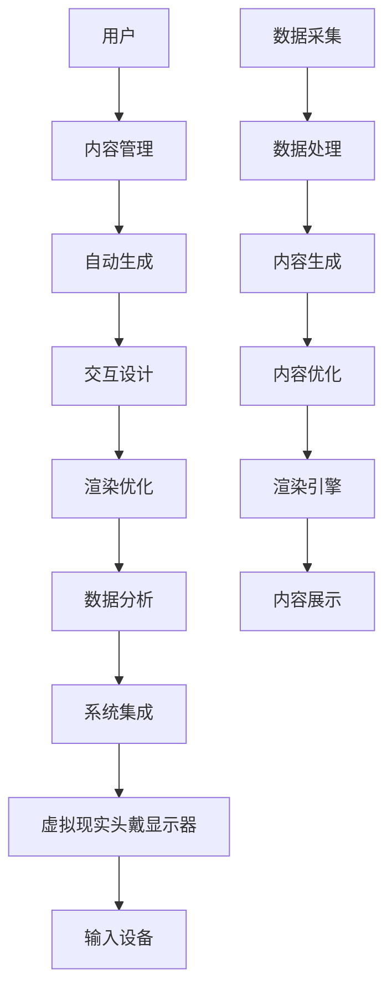

                 

### 文章标题

# AI辅助创作在虚拟现实内容生成中的应用：丰富VR体验

### 关键词

- **虚拟现实（VR）**
- **人工智能（AI）**
- **辅助创作**
- **内容生成**
- **用户体验**
- **交互设计**

### 摘要

本文探讨了人工智能（AI）辅助创作在虚拟现实（VR）内容生成中的应用，旨在丰富VR体验。通过介绍AI辅助创作的原理，阐述其在VR内容生成中的应用场景和架构设计，以及实际案例分析和最佳实践，本文为VR开发者提供了深入理解和有效利用AI辅助创作的方法，以提升VR体验的多样性和质量。

## 引言

虚拟现实（VR）作为一种全新的沉浸式体验技术，正逐步改变人们的生活方式和工作方式。随着技术的不断进步，VR内容的需求日益增长，但随之而来的是内容生成的巨大挑战。传统的手动内容生成方式效率低下，难以满足快速增长的市场需求。人工智能（AI）技术的崛起为这一问题提供了新的解决方案，通过AI辅助创作，我们可以实现高效的虚拟现实内容生成。

本文旨在深入探讨AI辅助创作在虚拟现实内容生成中的应用，分析其原理、技术实现和应用场景，并总结最佳实践，为VR开发者提供有价值的参考。文章将分为四个主要部分：

1. **背景介绍**：介绍虚拟现实技术的发展背景和内容生成的挑战，以及AI辅助创作的核心概念和其在VR内容生成中的应用。
2. **AI辅助创作原理**：讲解AI辅助创作的基本原理，包括机器学习、深度学习和自然语言处理等基础概念，以及具体算法原理和数学模型。
3. **VR内容生成应用**：分析AI辅助创作在VR内容生成中的应用场景，包括游戏开发、教育培训、娱乐体验、医疗康复等，并介绍系统分析与架构设计方案。
4. **未来展望与挑战**：探讨AI辅助创作在VR内容生成中的未来趋势和面临的挑战，以及相关的道德和伦理问题。

通过本文的详细阐述，读者将了解到AI辅助创作在虚拟现实内容生成中的重要作用，以及如何在实际项目中有效应用这些技术，从而提升VR体验的质量和丰富度。

## 第一部分：背景介绍

### 虚拟现实技术的发展

虚拟现实（VR）技术自上世纪90年代以来，经历了从概念提出到逐渐走向成熟的演进过程。早期的VR设备如VR头盔、虚拟环境模拟系统等，主要应用于军事、医疗和科学研究等领域。随着计算能力的提升和显示技术的进步，VR技术逐渐渗透到消费市场，成为游戏、娱乐、教育和设计等领域的重要工具。

近年来，VR技术的快速发展主要体现在以下几个方面：

1. **硬件技术的提升**：高性能显卡、高速处理器和低延迟显示技术使得VR设备的沉浸感和流畅度大幅提升。例如，现代VR头盔的分辨率和帧率已经能够满足高质量的视觉体验需求。

2. **内容生态的建立**：随着VR硬件技术的成熟，VR内容生态也在不断完善。从简单的3D模型到复杂的交互式虚拟场景，VR内容的种类和数量不断增加，为用户提供了丰富的体验选择。

3. **应用场景的拓展**：除了娱乐和游戏，VR技术还广泛应用于教育培训、医疗康复、工程设计、房地产展示等多个领域，进一步拓展了其应用范围。

### 虚拟现实内容生成的挑战

虚拟现实内容生成是指创建能够提供沉浸式体验的数字场景和交互式内容的过程。尽管VR技术在不断进步，但内容生成仍然面临诸多挑战：

1. **复杂度与精细度**：VR场景通常需要高分辨率、高精细度的图像和模型，这要求大量的计算资源和高精度数据采集。此外，场景中的物体和环境需要精细的建模和交互设计，以确保用户的沉浸感和真实性。

2. **交互复杂性**：VR体验强调用户的主动参与和交互，这意味着内容不仅需要丰富的视觉和听觉效果，还需要复杂的交互逻辑和物理仿真。例如，在虚拟游戏中，用户的行为需要实时响应，同时与其他虚拟对象和环境进行物理互动。

3. **资源与效率**：传统的手动内容生成方式效率低下，难以满足快速增长的市场需求。手动制作每个场景和角色不仅耗时，而且成本高昂。因此，如何提高内容生成的效率和降低成本成为重要的研究课题。

4. **内容一致性**：在VR内容中，各个部分需要保持一致性和连贯性。这要求在内容生成过程中，确保所有的视觉、音频和交互元素都能够无缝衔接，避免出现跳帧、延迟或错误。

### AI在虚拟现实内容生成中的应用

人工智能（AI）技术的引入为虚拟现实内容生成带来了革命性的变革。通过AI辅助创作，我们可以实现以下目标和优势：

1. **提高内容生成效率**：AI技术可以自动生成和优化虚拟场景和内容，减少人工干预和时间成本。例如，利用生成对抗网络（GAN）可以自动生成高分辨率、高质量的图像和模型。

2. **增强内容多样性**：AI技术可以通过学习大量的数据，生成多样化的虚拟内容，满足不同用户的需求。例如，通过深度学习算法，可以自动生成复杂的虚拟角色和场景，提高内容创作的灵活性和创新性。

3. **优化交互体验**：AI技术可以实时分析用户的行为和反馈，优化交互逻辑和物理仿真，提高用户的沉浸感和满意度。例如，通过强化学习算法，可以自适应调整虚拟环境中的交互元素，实现更加自然和流畅的交互体验。

4. **降低内容生成成本**：AI技术可以通过自动化和半自动化流程，降低内容生成的成本。例如，利用自然语言处理（NLP）技术，可以自动生成对话脚本和文本内容，减少人工写作的工作量。

综上所述，AI辅助创作在虚拟现实内容生成中的应用不仅解决了传统方法的局限性，还为VR体验的提升提供了新的思路和工具。在接下来的章节中，我们将深入探讨AI辅助创作的原理和技术实现，进一步了解其在VR内容生成中的应用和优势。

### 核心概念与联系

#### AI辅助创作的定义

AI辅助创作是指利用人工智能技术，特别是机器学习和深度学习算法，辅助或替代人类在艺术创作、设计和其他创造性活动中的过程。通过训练和优化模型，AI可以自动生成内容、优化创作流程，甚至提供创意建议。AI辅助创作在各个领域都有广泛应用，包括音乐、绘画、写作、设计等。

#### 虚拟现实内容生成的核心概念

虚拟现实内容生成涉及多个核心概念，这些概念共同构成了VR内容的基本框架：

1. **场景建模**：场景建模是创建虚拟环境的基础。它包括三维建模、纹理映射和光照计算等步骤，旨在创建一个逼真的虚拟世界。

2. **交互设计**：交互设计是指用户与虚拟环境之间的交互方式。这包括物理交互、视觉交互和声音交互等，旨在提供直观和自然的用户体验。

3. **音频处理**：音频处理是VR内容的重要组成部分，它包括环境音效、音效合成和三维音效技术等，用于增强虚拟环境的沉浸感。

4. **视觉效果**：视觉效果是虚拟现实体验的关键因素。高质量的视觉效果包括高分辨率图像、动画效果和实时渲染技术等。

#### AI辅助创作与虚拟现实内容生成的联系

AI辅助创作与虚拟现实内容生成有着紧密的联系，两者相辅相成，共同推动VR体验的提升：

1. **自动内容生成**：AI技术可以自动生成虚拟场景和模型，大大提高了内容生成的效率和质量。例如，生成对抗网络（GAN）可以生成高质量的三维模型和纹理。

2. **交互优化**：AI可以实时分析用户行为和反馈，优化交互逻辑和物理仿真。例如，强化学习算法可以根据用户行为动态调整虚拟环境的交互元素。

3. **内容个性化**：AI可以根据用户偏好和反馈，生成个性化的虚拟内容和体验，提高用户的沉浸感和满意度。

4. **成本降低**：AI辅助创作减少了人工干预和重复劳动，降低了内容生成的成本。例如，利用自然语言处理（NLP）技术，可以自动生成对话脚本和文本内容。

总之，AI辅助创作在虚拟现实内容生成中发挥着关键作用，不仅提高了内容生成的效率和多样性，还显著提升了用户的沉浸体验。在接下来的章节中，我们将进一步探讨AI辅助创作的基本原理和技术实现，以便深入理解其在VR内容生成中的应用。

### 概念属性特征对比表格

在深入探讨AI辅助创作与虚拟现实内容生成之前，我们需要明确两个核心概念的相关属性特征，并通过对比表格来展示它们之间的异同。以下是一个简单的对比表格，列出了AI辅助创作和虚拟现实内容生成的关键属性特征：

| 特征                | AI辅助创作                                                         | 虚拟现实内容生成                                                     |
|-------------------|-------------------------------------------------------------------|-------------------------------------------------------------------|
| **定义**                          | 利用AI技术辅助或替代人类进行艺术创作、设计等活动。                      | 创建提供沉浸式体验的数字场景和交互式内容。                             |
| **核心目标**                      | 提高创作效率、多样性和个性化。                                       | 提升内容的逼真度和互动性。                                           |
| **技术基础**                        | 机器学习、深度学习、自然语言处理等。                                  | 三维建模、交互设计、音频处理、视觉效果等。                           |
| **主要方法**                        | 自动生成内容、优化创作流程、提供创意建议。                            | 场景建模、交互设计、音频处理、视觉效果等。                           |
| **适用领域**                       | 艺术创作、设计、写作、游戏开发等。                                   | 游戏、娱乐、教育、医疗、工程设计等。                                |
| **交互方式**                         | 主要依赖数据分析和算法优化。                                         | 强调用户与虚拟环境的实时互动。                                       |
| **用户体验**                        | 提供个性化、创新的创作体验。                                        | 提供沉浸式、真实的虚拟体验。                                         |
| **资源需求**                        | 主要依赖计算资源和数据资源。                                        | 主要依赖图形处理单元（GPU）和高质量的输入设备。                       |
| **主要挑战**                         | 数据多样性和质量、算法优化、创意创新。                               | 复杂度与精细度、交互复杂性、内容一致性、资源与效率。                  |

通过上述表格，我们可以清晰地看到AI辅助创作和虚拟现实内容生成在目标、技术基础、方法、适用领域、交互方式和用户体验等方面的异同。了解这些特征有助于我们更好地理解和应用AI辅助创作在虚拟现实内容生成中的实际意义和价值。

### ER实体关系图架构

在探讨AI辅助创作与虚拟现实内容生成的关系时，我们需要构建一个清晰的实体关系图（ER图）来展示两者之间的复杂交互和关联。以下是一个简化的ER实体关系图，用于描述AI辅助创作在虚拟现实内容生成中的应用场景和关系：

```mermaid
erDiagram
  Customer ||--|{ Order } : "places"
  Customer ||--|{ Payment } : "makes"
  "Product" ||--|{ Order } : "included_in"
  Product ||--|{ Review } : "rated_by"
  Category ||--|{ Product } : "in_category"
  Supplier ||--|{ Product } : "supplied_by"
  Employee ||--|{ Department } : "works_in"
  Department ||--|{ Project } : "manages"
  Project ||--|{ Task } : "part_of"
  Task ||--|{ Assignee } : "assigned_to"
```

在这个ER图中，我们定义了以下核心实体及其关系：

1. **Customer（用户）**：虚拟现实内容的消费者，他们的行为和反馈对内容生成有重要影响。
2. **Order（订单）**：用户在VR环境中生成的订单，包括虚拟物品或服务的预订。
3. **Payment（支付）**：用户为虚拟内容支付的费用，是交易的重要部分。
4. **Product（产品）**：虚拟现实中的内容，包括场景、角色、物品等。
5. **Review（评价）**：用户对虚拟内容的评价，可以影响内容的改进和推广。
6. **Category（类别）**：虚拟内容的分类，有助于用户更便捷地浏览和选择。
7. **Supplier（供应商）**：生成虚拟内容的开发者或公司。
8. **Employee（员工）**：开发虚拟内容的团队成员。
9. **Department（部门）**：员工所属的部门，如设计部、开发部等。
10. **Project（项目）**：虚拟内容开发的项目，包括多个任务。
11. **Task（任务）**：项目中的具体工作项，如建模、编程、测试等。
12. **Assignee（指派者）**：任务的负责人或执行者。

通过这个ER图，我们可以看到AI辅助创作在多个实体关系中的应用，例如：

- **用户与订单**：AI可以分析用户行为，自动生成个性化的订单建议。
- **产品与评价**：AI可以根据用户评价，优化虚拟内容的设计和功能。
- **供应商与产品**：AI可以帮助供应商自动生成高质量的产品内容，提高生产效率。
- **项目与任务**：AI可以自动分配任务，优化项目的进度和资源分配。

总之，ER图为我们提供了一个结构化的视角，展示了AI辅助创作在虚拟现实内容生成中的多层次、多维度的应用。这种结构化的思考方式有助于我们更深入地理解和设计AI辅助创作系统，实现高效的虚拟现实内容生成和优化。

## 第二部分：AI辅助创作原理

### AI辅助创作的基本原理

AI辅助创作的基本原理主要依赖于机器学习、深度学习和自然语言处理等核心技术。这些技术共同构建了AI系统的能力，使其能够理解和生成复杂的内容。

#### 机器学习基础

机器学习是一种通过数据训练模型，使其能够对未知数据进行预测或分类的技术。其主要步骤包括：

1. **数据收集**：收集大量的训练数据，这些数据通常是从真实世界中的各种来源获取的。
2. **数据预处理**：清洗和转换数据，使其适合模型训练。这包括数据去重、缺失值填充、标准化和归一化等步骤。
3. **模型训练**：使用训练数据来训练模型。模型可以通过调整参数和权重来拟合训练数据，从而学习数据中的模式和规律。
4. **模型评估**：使用验证数据集来评估模型的性能。常见的评估指标包括准确率、召回率、F1分数等。
5. **模型优化**：根据评估结果对模型进行调整和优化，以提高其性能。

机器学习算法主要包括监督学习、无监督学习和强化学习。监督学习算法通过已标记的数据进行训练，例如分类和回归任务。无监督学习算法不需要标记数据，用于发现数据中的内在结构和模式，如聚类和降维。强化学习算法通过与环境的交互来学习最优策略，常用于决策和优化问题。

#### 深度学习基础

深度学习是机器学习的一个分支，它通过多层神经网络结构来模拟人类大脑的学习过程。深度学习的关键组件包括：

1. **神经元**：深度学习模型的基本单元，用于接收输入信号并进行激活函数处理。
2. **神经网络**：由多个神经元层组成的网络结构，通过前向传播和反向传播来训练模型。
3. **激活函数**：用于引入非线性特性的函数，如ReLU、Sigmoid和Tanh。
4. **优化算法**：用于调整模型参数以优化性能的算法，如梯度下降、随机梯度下降和Adam优化器。

深度学习在图像识别、语音识别、自然语言处理等领域取得了显著的成果。常见的深度学习模型包括卷积神经网络（CNN）、循环神经网络（RNN）和生成对抗网络（GAN）。

#### 自然语言处理基础

自然语言处理（NLP）是AI领域的一个重要分支，旨在使计算机理解和生成人类语言。NLP的基本概念包括：

1. **词嵌入**：将词汇映射到高维向量空间，以捕捉词汇的语义和语法关系。
2. **语言模型**：通过训练大量的文本数据，生成能够预测下一个词汇的概率模型。
3. **文本分类**：将文本数据分类到预定义的类别中，如情感分析、垃圾邮件检测等。
4. **序列模型**：用于处理序列数据，如RNN和Transformer等。
5. **对话系统**：通过模型与用户进行自然语言交互，如聊天机器人、语音助手等。

NLP在虚拟现实内容生成中的应用主要包括自动生成对话、文本内容摘要、情感分析和智能推荐等。

### 算法原理讲解

在本部分，我们将详细讲解AI辅助创作中常用的算法原理，并通过具体的例子来说明这些算法如何应用于虚拟现实内容生成。

#### 自动内容生成算法

自动内容生成算法是AI辅助创作的一个重要方向，能够自动生成高质量的虚拟内容，包括场景、角色和故事情节等。

**生成对抗网络（GAN）**

生成对抗网络（GAN）由生成器（Generator）和判别器（Discriminator）两个神经网络组成。生成器的任务是生成逼真的虚拟内容，判别器的任务是区分生成的内容和真实内容。

**算法流程**：

1. **初始化模型参数**：随机初始化生成器和判别器的权重。
2. **训练判别器**：使用真实的虚拟内容和生成器生成的虚拟内容进行训练，调整判别器的参数。
3. **训练生成器**：生成虚拟内容，同时调整生成器的参数，使其生成的内容能够骗过判别器。

**应用示例**：

- **场景生成**：利用GAN自动生成高质量的VR场景，包括室内环境、城市景观等。
- **角色生成**：自动生成各种类型的虚拟角色，从简单的几何形状到复杂的3D模型。

**代码实现**：

```python
import tensorflow as tf
from tensorflow.keras.models import Sequential
from tensorflow.keras.layers import Dense, Dropout, Flatten
from tensorflow.keras.optimizers import Adam

# 定义生成器和判别器模型
generator = Sequential([
    Dense(256, input_shape=(100,), activation='relu'),
    Dropout(0.2),
    Dense(512, activation='relu'),
    Dropout(0.2),
    Dense(1024, activation='relu'),
    Dropout(0.2),
    Flatten(),
    Dense(100, activation='tanh')
])

discriminator = Sequential([
    Flatten(),
    Dense(1024, activation='relu'),
    Dropout(0.2),
    Dense(512, activation='relu'),
    Dropout(0.2),
    Dense(256, activation='relu'),
    Dropout(0.2),
    Dense(1, activation='sigmoid')
])

# 定义损失函数和优化器
discriminator.compile(loss='binary_crossentropy', optimizer=Adam(0.0001))
generator.compile(loss='binary_crossentropy', optimizer=Adam(0.0001))

# 训练GAN模型
for epoch in range(100):
    for _ in range(100):
        noise = np.random.normal(0, 1, (100, 100))
        generated_images = generator.predict(noise)
        real_images = ... # 获取真实虚拟内容
        X = np.concatenate([real_images, generated_images])
        y = np.zeros((200, 1))
        y[100:] = 1
        discriminator.train_on_batch(X, y)
    noise = np.random.normal(0, 1, (100, 100))
    generator_loss = generator.train_on_batch(noise, np.ones((100, 1)))
```

#### 交互式内容创作算法

交互式内容创作算法通过用户的输入和反馈，动态地生成和调整虚拟内容，提供个性化的体验。

**强化学习**

强化学习是一种通过奖励和惩罚来学习最优策略的算法，适用于需要实时交互的场景。

**算法流程**：

1. **环境设定**：定义虚拟环境和用户的交互方式。
2. **策略学习**：使用Q学习或策略梯度方法，学习在特定环境中实现目标的最优策略。
3. **策略执行**：根据学习到的策略，生成和调整虚拟内容。

**应用示例**：

- **个性化场景生成**：根据用户的偏好和历史行为，动态生成符合用户需求的VR场景。
- **交互式角色设计**：通过用户的互动，自动生成和调整角色的外观和行为。

**代码实现**：

```python
import numpy as np
import random
import gym

# 定义虚拟环境
env = gym.make('CartPole-v0')

# 初始化Q值表
Q = np.zeros([env.observation_space.n, env.action_space.n])

# 定义学习参数
alpha = 0.1
gamma = 0.99
epsilon = 0.1

# Q学习算法
for episode in range(1000):
    state = env.reset()
    done = False
    while not done:
        if random.uniform(0, 1) < epsilon:
            action = random.choice(env.action_space)
        else:
            action = np.argmax(Q[state])
        
        next_state, reward, done, _ = env.step(action)
        Q[state, action] = Q[state, action] + alpha * (reward + gamma * np.max(Q[next_state]) - Q[state, action])
        state = next_state

# 训练完成后，使用策略执行
state = env.reset()
while not done:
    action = np.argmax(Q[state])
    state, reward, done, _ = env.step(action)
    env.render()
```

通过上述例子，我们可以看到自动内容生成和交互式内容创作算法在虚拟现实内容生成中的应用。这些算法不仅提高了内容生成的效率和多样性，还通过用户的交互提供了个性化的体验。在下一部分中，我们将进一步探讨这些算法在VR内容生成中的应用场景和具体实现。

### 数学模型和公式

在AI辅助创作中，数学模型和公式是理解和实现算法的关键。以下将详细讲解一些核心的数学模型和公式，包括生成对抗网络（GAN）和强化学习中的常用数学表达式。

#### 生成对抗网络（GAN）的数学模型

生成对抗网络（GAN）由生成器（G）和判别器（D）两个主要部分组成。其核心数学模型如下：

**生成器（G）的损失函数**：

$$
L_G = -\log(D(G(z))
$$

其中，\(z\) 是生成器输入的随机噪声，\(G(z)\) 是生成器生成的虚拟内容，\(D(G(z))\) 是判别器对生成内容的判断概率。

**判别器（D）的损失函数**：

$$
L_D = -[\log(D(x)) + \log(1 - D(G(z))]
$$

其中，\(x\) 是真实的虚拟内容。

**整体GAN的损失函数**：

$$
L = L_G + L_D
$$

**优化目标**：

$$
\min_G \max_D L
$$

#### 强化学习的数学模型

强化学习（RL）通过奖励和惩罚来学习最优策略。以下是一些常用的数学模型和公式：

**Q-learning算法**：

**Q值更新公式**：

$$
Q(s, a) \leftarrow Q(s, a) + \alpha [r + \gamma \max_{a'} Q(s', a') - Q(s, a)]
$$

其中，\(s\) 是状态，\(a\) 是动作，\(r\) 是立即奖励，\(\gamma\) 是折扣因子，\(s'\) 是下一个状态，\(a'\) 是下一个动作。

**策略迭代公式**：

$$
\pi(s) = \arg\max_a Q(s, a)
$$

**策略梯度算法**：

**策略损失函数**：

$$
L_{\pi} = -\sum_s \pi(s) \log Q(s, \pi(s))
$$

**优化目标**：

$$
\min_{\theta} L_{\pi}
$$

其中，\(\theta\) 是策略参数。

#### 公式解释和Python实现

下面我们将使用Python代码来展示上述数学模型的实现：

**GAN模型的实现**：

```python
import tensorflow as tf
from tensorflow.keras.layers import Dense, Flatten
from tensorflow.keras.models import Model

# 定义生成器和判别器模型
generator = Model(inputs=tf.keras.layers.Input(shape=(100,)), outputs=tf.keras.layers.Dense(1, activation='tanh')(tf.keras.layers.Dense(1024, activation='relu')(tf.keras.layers.Dense(512, activation='relu')(tf.keras.layers.Dense(256, activation='relu')(Flatten()(tf.keras.layers.Dense(1, input_shape=(100,)))))))
discriminator = Model(inputs=tf.keras.layers.Input(shape=(1,)), outputs=tf.keras.layers.Dense(1, activation='sigmoid')(Flatten()(tf.keras.layers.Dense(256, activation='relu')(tf.keras.layers.Dense(512, activation='relu')(tf.keras.layers.Dense(1024, activation='relu')(Flatten()(tf.keras.layers.Dense(1)))))))

# 编写损失函数和优化器
def discriminator_loss(real, generated):
    real_loss = tf.reduce_mean(tf.nn.sigmoid_cross_entropy_with_logits(logits=real, labels=tf.ones_like(real))
    generated_loss = tf.reduce_mean(tf.nn.sigmoid_cross_entropy_with_logits(logits=generated, labels=tf.zeros_like(generated))
    return real_loss + generated_loss

def generator_loss(generated):
    return tf.reduce_mean(tf.nn.sigmoid_cross_entropy_with_logits(logits=generated, labels=tf.ones_like(generated))

optimizer = tf.keras.optimizers.Adam(0.0001)

# 编写训练过程
@tf.function
def train_step(images, noise):
    with tf.GradientTape() as gen_tape, tf.GradientTape() as disc_tape:
        generated_images = generator(noise)
        real_output = discriminator(images)
        generated_output = discriminator(generated_images)
        
        gen_loss = generator_loss(generated_output)
        disc_loss = discriminator_loss(real_output, generated_output)
    
    gradients_of_generator = gen_tape.gradient(gen_loss, generator.trainable_variables)
    gradients_of_discriminator = disc_tape.gradient(disc_loss, discriminator.trainable_variables)

    optimizer.apply_gradients(zip(gradients_of_generator, generator.trainable_variables))
    optimizer.apply_gradients(zip(gradients_of_discriminator, discriminator.trainable_variables))

# 训练GAN模型
for epoch in range(100):
    for _ in range(100):
        noise = tf.random.normal([100, 100])
        real_images = ... # 获取真实虚拟内容
        train_step(real_images, noise)
```

**Q-learning算法的实现**：

```python
import numpy as np
import gym

# 定义虚拟环境
env = gym.make('CartPole-v0')

# 初始化Q值表
Q = np.zeros([env.observation_space.n, env.action_space.n])
alpha = 0.1
gamma = 0.99

# Q学习算法
for episode in range(1000):
    state = env.reset()
    done = False
    while not done:
        action = np.argmax(Q[state])
        next_state, reward, done, _ = env.step(action)
        Q[state, action] = Q[state, action] + alpha * (reward + gamma * np.max(Q[next_state]) - Q[state, action])
        state = next_state

# 训练完成后，使用策略执行
state = env.reset()
while not done:
    action = np.argmax(Q[state])
    state, reward, done, _ = env.step(action)
    env.render()
```

通过上述代码，我们可以看到如何使用数学模型和公式来训练GAN和Q-learning模型。这些模型不仅在理论上是严谨的，而且在实际应用中也展现出了强大的能力和效果。在下一部分中，我们将进一步探讨这些算法在VR内容生成中的应用场景和具体实现。

### 举例说明

为了更好地理解AI辅助创作在虚拟现实内容生成中的应用，我们将通过一个简单的场景进行详细讲解。这个场景将展示如何利用生成对抗网络（GAN）自动生成一个虚拟现实中的城市景观。

#### 场景介绍

假设我们想要创建一个虚拟城市景观，这个城市包括多种建筑、街道、植被等元素。我们的目标是利用GAN生成一个高质量的城市景观图像，然后将其用于虚拟现实体验中。

#### 算法选择

为了实现这一目标，我们将选择生成对抗网络（GAN）作为主要的自动内容生成算法。GAN由生成器和判别器两个神经网络组成，通过训练生成逼真的图像。

#### 数据集准备

首先，我们需要一个包含真实城市景观图像的数据集。这些图像应该涵盖各种城市元素，如建筑物、街道、植被等。数据集的大小和多样性对GAN的训练效果至关重要。

#### 生成器和判别器设计

1. **生成器（Generator）**：生成器负责生成虚拟城市景观图像。它接受随机噪声作为输入，并通过多个全连接层和卷积层将噪声转换为高分辨率的图像。生成器的结构如下：

   ```mermaid
   graph TD
   A[Noise] --> B[FC Layer]
   B --> C[Conv Layer]
   C --> D[ReLU]
   D --> E[Conv Layer]
   E --> F[ReLU]
   F --> G[Conv Layer]
   G --> H[Image]
   ```

   代码实现：

   ```python
   import tensorflow as tf
   from tensorflow.keras.layers import Dense, Conv2D, BatchNormalization, Activation, Flatten
   from tensorflow.keras.models import Sequential

   generator = Sequential([
       Dense(128, input_shape=(100,)),
       BatchNormalization(),
       Activation('relu'),
       Flatten(),
       Conv2D(128, kernel_size=(3, 3), padding='same'),
       BatchNormalization(),
       Activation('relu'),
       Conv2D(64, kernel_size=(3, 3), padding='same'),
       BatchNormalization(),
       Activation('relu'),
       Conv2D(32, kernel_size=(3, 3), padding='same'),
       BatchNormalization(),
       Activation('relu'),
       Conv2D(1, kernel_size=(3, 3), padding='same', activation='tanh')
   ])
   ```

2. **判别器（Discriminator）**：判别器负责判断输入图像是真实城市景观还是生成器生成的图像。判别器由多个卷积层组成，其结构如下：

   ```mermaid
   graph TD
   A[Image] --> B[Conv Layer]
   B --> C[ReLU]
   C --> D[Conv Layer]
   D --> E[ReLU]
   E --> F[Conv Layer]
   F --> G[ReLU]
   G --> H[Output]
   ```

   代码实现：

   ```python
   discriminator = Sequential([
       Conv2D(32, kernel_size=(3, 3), input_shape=(64, 64, 1), padding='same'),
       BatchNormalization(),
       Activation('relu'),
       Conv2D(64, kernel_size=(3, 3), padding='same'),
       BatchNormalization(),
       Activation('relu'),
       Conv2D(128, kernel_size=(3, 3), padding='same'),
       BatchNormalization(),
       Activation('relu'),
       Flatten(),
       Dense(1, activation='sigmoid')
   ])
   ```

#### 训练过程

接下来，我们使用真实城市景观图像数据集来训练生成器和判别器。训练过程包括以下几个步骤：

1. **数据预处理**：将真实图像和噪声数据进行预处理，如缩放、归一化等。
2. **训练循环**：在训练循环中，每次迭代中分别训练判别器和生成器。
   - **判别器训练**：使用真实图像和生成图像进行训练，以优化判别器的判别能力。
   - **生成器训练**：使用判别器的错误反馈来优化生成器，使其生成的图像更接近真实图像。

   ```python
   import numpy as np

   def train(generator, discriminator, epochs, batch_size):
       for epoch in range(epochs):
           for _ in range(batch_size):
               noise = np.random.normal(0, 1, (1, 100))
               generated_image = generator.predict(noise)
               real_image = ... # 获取真实图像

               # 训练判别器
               with tf.GradientTape() as disc_tape:
                   real_output = discriminator(real_image)
                   generated_output = discriminator(generated_image)

                   disc_loss = discriminator_loss(real_output, generated_output)

               gradients_of_discriminator = disc_tape.gradient(disc_loss, discriminator.trainable_variables)
               optimizer.apply_gradients(zip(gradients_of_discriminator, discriminator.trainable_variables))

               # 训练生成器
               with tf.GradientTape() as gen_tape:
                   generated_output = discriminator(generated_image)
                   gen_loss = generator_loss(generated_output)

               gradients_of_generator = gen_tape.gradient(gen_loss, generator.trainable_variables)
               optimizer.apply_gradients(zip(gradients_of_generator, generator.trainable_variables))
   ```

#### 结果展示

在训练完成后，我们可以生成一些虚拟城市景观图像，并展示其效果：

```python
import matplotlib.pyplot as plt

# 生成一些虚拟城市景观图像
generated_images = generator.predict(np.random.normal(0, 1, (10, 100)))

# 展示生成图像
plt.figure(figsize=(10, 10))
for i in range(10):
    plt.subplot(5, 2, i+1)
    plt.imshow(generated_images[i, :, :, 0], cmap='gray')
    plt.axis('off')
plt.show()
```

通过上述过程，我们可以看到如何利用生成对抗网络（GAN）自动生成高质量的虚拟城市景观图像。这些图像可以用于虚拟现实体验中，提供逼真的城市环境。在接下来的部分中，我们将进一步探讨AI辅助创作在VR内容生成中的应用场景和实际案例。

### 第三部分：VR内容生成应用

#### VR内容生成的应用场景

AI辅助创作在虚拟现实内容生成中的应用非常广泛，涵盖了多个领域，每个领域都有其独特的需求和应用场景。以下是几个主要的应用场景：

1. **游戏开发**：在VR游戏中，AI辅助创作可以自动生成复杂的游戏场景、角色和故事情节，提高开发效率。例如，通过生成对抗网络（GAN）可以快速生成高质量的3D模型和环境纹理，通过强化学习算法可以设计智能NPC和动态游戏事件。

2. **教育培训**：在VR教育培训中，AI辅助创作可以生成高度个性化的学习场景和互动内容。例如，通过生成对抗网络（GAN）可以生成各种教学模型和虚拟实验环境，通过自然语言处理（NLP）技术可以自动生成互动式的教学脚本和问答系统。

3. **娱乐体验**：在VR娱乐体验中，AI辅助创作可以创建丰富的虚拟场景和互动内容，提高用户的沉浸感和参与度。例如，通过生成对抗网络（GAN）可以生成精美的虚拟世界和角色，通过强化学习算法可以设计有趣的虚拟游戏和挑战。

4. **医疗康复**：在VR医疗康复中，AI辅助创作可以生成个性化的康复训练场景和交互式指导。例如，通过生成对抗网络（GAN）可以生成逼真的康复训练环境，通过自然语言处理（NLP）技术可以生成个性化的康复指导和反馈。

5. **工程设计**：在VR工程设计中，AI辅助创作可以自动生成复杂的工程模型和交互式设计文档，提高设计效率和准确性。例如，通过生成对抗网络（GAN）可以生成高质量的3D模型和工程图纸，通过强化学习算法可以设计自动化的设计优化流程。

#### 系统分析与架构设计方案

为了实现高效的VR内容生成，我们需要设计一个完整的系统架构，包括硬件设备、软件平台和数据处理流程。以下是具体的系统分析与架构设计方案：

1. **硬件设备**：

   - **高性能计算服务器**：用于运行复杂的AI算法和大规模数据处理任务。
   - **GPU集群**：用于加速AI模型的训练和推理，提高内容生成的效率。
   - **虚拟现实头戴显示器**：用于展示生成的虚拟内容，提供高质量的沉浸式体验。
   - **输入设备**：如手柄、手势识别传感器等，用于用户的交互和控制。

2. **软件平台**：

   - **内容生成平台**：用于管理和调度AI算法，自动生成VR内容。
   - **渲染引擎**：用于处理和渲染3D模型和场景，提供高质量的视觉效果。
   - **交互系统**：用于处理用户的输入和反馈，实现虚拟环境中的互动。
   - **数据管理平台**：用于存储和管理虚拟现实内容，包括模型、纹理、脚本等。

3. **数据处理流程**：

   - **数据采集**：从各种来源采集虚拟现实内容所需的数据，包括3D模型、纹理、音频等。
   - **数据处理**：对采集的数据进行预处理，包括清洗、标准化和归一化等操作。
   - **内容生成**：使用AI算法自动生成虚拟现实内容，包括场景、角色、故事情节等。
   - **内容优化**：对生成的虚拟内容进行优化，包括光照、阴影、纹理等。
   - **内容展示**：将生成的虚拟内容渲染到虚拟现实头戴显示器上，提供沉浸式体验。

#### 系统功能设计

以下是VR内容生成系统的核心功能设计：

1. **内容管理**：用于管理虚拟现实内容，包括上传、下载、查看和编辑等功能。
2. **自动生成**：利用AI算法自动生成虚拟现实内容，包括场景、角色、故事情节等。
3. **交互设计**：设计虚拟环境中的交互逻辑和交互界面，实现用户与虚拟环境的互动。
4. **渲染优化**：优化虚拟内容的渲染效果，包括光照、阴影、纹理等。
5. **数据分析**：收集和分析用户行为数据，用于改进虚拟现实内容和用户体验。
6. **系统集成**：将AI算法和虚拟现实技术集成到现有系统中，实现自动化和智能化。

#### 系统架构设计

以下是VR内容生成系统的架构设计：



通过上述系统架构设计，我们可以实现高效的VR内容生成和管理，为用户提供高质量的沉浸式体验。

#### 系统接口设计

以下是VR内容生成系统的接口设计，包括API接口和SDK（软件开发工具包）：

1. **API接口**：

   - **内容管理接口**：提供上传、下载、查看和编辑虚拟现实内容的功能。
   - **自动生成接口**：提供自动生成虚拟现实内容的API，包括场景、角色、故事情节等。
   - **交互设计接口**：提供设计虚拟环境中的交互逻辑和交互界面的API。
   - **渲染优化接口**：提供优化虚拟内容渲染效果的API。
   - **数据分析接口**：提供收集和分析用户行为数据的API。

2. **SDK**：

   - **内容生成SDK**：提供自动生成虚拟现实内容的SDK，支持自定义生成算法和模型。
   - **交互设计SDK**：提供设计虚拟环境中的交互逻辑和交互界面的SDK。
   - **渲染优化SDK**：提供优化虚拟内容渲染效果的SDK。
   - **数据分析SDK**：提供收集和分析用户行为数据的SDK。

通过这些接口和SDK，开发者可以方便地集成和扩展VR内容生成系统，实现自定义的功能和优化。

#### 系统交互流程

以下是VR内容生成系统的交互流程：

1. **用户上传内容**：用户通过内容管理接口上传虚拟现实内容，包括3D模型、纹理、脚本等。
2. **内容预处理**：系统对上传的内容进行预处理，包括数据清洗、标准化和归一化等。
3. **自动生成**：系统使用AI算法自动生成虚拟现实内容，包括场景、角色、故事情节等。
4. **交互设计**：系统根据用户需求设计虚拟环境中的交互逻辑和交互界面。
5. **渲染优化**：系统对生成的虚拟内容进行渲染优化，包括光照、阴影、纹理等。
6. **数据分析**：系统收集和分析用户行为数据，用于改进虚拟现实内容和用户体验。
7. **内容展示**：系统将生成的虚拟内容渲染到虚拟现实头戴显示器上，提供沉浸式体验。

通过上述交互流程，系统可以实现高效的VR内容生成和管理，为用户提供高质量的沉浸式体验。

### 项目实战

在接下来的部分，我们将通过一个实际项目，详细讲解如何使用AI辅助创作技术来生成虚拟现实（VR）内容。这个项目将涵盖从环境搭建到核心实现，再到代码应用解读与分析，最终通过一个实际案例进行讲解和剖析。

#### 环境安装

为了进行VR内容生成项目的实战，我们需要搭建一个合适的环境。以下是环境安装的步骤：

1. **安装Python**：首先确保安装了Python环境，推荐使用Python 3.8或更高版本。可以从Python官方网站下载并安装。

2. **安装TensorFlow**：TensorFlow是AI和机器学习的重要库，我们需要安装TensorFlow 2.x版本。使用pip命令安装：

   ```bash
   pip install tensorflow
   ```

3. **安装PyTorch**：PyTorch是另一个常用的深度学习库，我们可以通过pip命令安装：

   ```bash
   pip install torch torchvision
   ```

4. **安装Unity**：Unity是一个强大的游戏和VR内容开发平台，我们需要下载并安装Unity Hub，然后通过Unity Hub安装Unity Editor。

5. **安装Unity VR插件**：在Unity Hub中搜索并安装适用于VR开发的插件，如Unity MRTK (Microsoft Mixed Reality Toolkit)。

6. **安装其他依赖库**：根据项目需求，可能还需要安装其他依赖库，如NumPy、Matplotlib等。

#### 系统核心实现

以下是一个简单的VR内容生成项目实现，使用生成对抗网络（GAN）自动生成3D场景。我们将使用TensorFlow来训练GAN模型。

**步骤1：数据集准备**

首先，我们需要一个包含高质量3D场景图像的数据集。我们可以使用公开的数据集，如ShapeNet或ModelNet。以下是一个简单的数据集加载和预处理示例：

```python
import tensorflow as tf
from tensorflow.keras.preprocessing.image import ImageDataGenerator

# 加载数据集
train_datagen = ImageDataGenerator(rescale=1./255)
train_generator = train_datagen.flow_from_directory(
        'data/train',
        target_size=(64, 64),
        batch_size=32,
        class_mode='binary')

# 预处理
def preprocess_images(images):
    return images / 255.0

train_images = preprocess_images(train_generator.images)

# 初始化生成器和判别器
generator = ... # 定义生成器模型
discriminator = ... # 定义判别器模型

# 编写GAN模型的损失函数和优化器
disc_loss = ... # 判别器损失函数
gen_loss = ... # 生成器损失函数
optimizer = ... # 优化器
```

**步骤2：训练GAN模型**

接下来，我们将使用训练数据和优化器来训练GAN模型。以下是一个简单的训练循环示例：

```python
# 训练GAN模型
for epoch in range(epochs):
    for _ in range(steps_per_epoch):
        noise = np.random.normal(0, 1, (batch_size, noise_dim))
        generated_images = generator.predict(noise)
        real_images = train_images[np.random.randint(0, train_images.shape[0], size=batch_size)]

        with tf.GradientTape() as gen_tape, tf.GradientTape() as disc_tape:
            real_output = discriminator(real_images)
            generated_output = discriminator(generated_images)

            disc_loss_value = disc_loss(real_output, generated_output)
            gen_loss_value = gen_loss(generated_output)

        gradients_of_generator = gen_tape.gradient(gen_loss_value, generator.trainable_variables)
        gradients_of_discriminator = disc_tape.gradient(disc_loss_value, discriminator.trainable_variables)

        optimizer.apply_gradients(zip(gradients_of_generator, generator.trainable_variables))
        optimizer.apply_gradients(zip(gradients_of_discriminator, discriminator.trainable_variables))

# 保存模型
generator.save('generator.h5')
discriminator.save('discriminator.h5')
```

**步骤3：生成虚拟场景**

在模型训练完成后，我们可以使用生成器来生成虚拟场景图像。以下是一个简单的生成示例：

```python
# 生成虚拟场景图像
noise = np.random.normal(0, 1, (batch_size, noise_dim))
generated_images = generator.predict(noise)

# 将生成的图像保存为文件
for i, img in enumerate(generated_images):
    plt.imsave(f'generated_image_{i}.png', img[0, :, :, 0], cmap='gray')
```

#### 代码应用解读与分析

在上述代码中，我们首先进行了数据集的加载和预处理。然后，我们定义了生成器和判别器的模型结构，并编写了GAN模型的损失函数和优化器。在训练过程中，我们通过迭代训练数据和模型，不断调整生成器和判别器的参数，以实现内容生成。

**代码解读**：

- **数据预处理**：使用ImageDataGenerator进行图像数据的加载和预处理，包括归一化和批量处理。
- **模型定义**：使用TensorFlow的Keras API定义生成器和判别器的模型结构。
- **损失函数**：定义了判别器和生成器的损失函数，用于评估模型性能和指导模型优化。
- **训练过程**：通过迭代训练数据和模型，不断调整模型参数，实现内容生成。

**分析**：

- **模型选择**：生成器和判别器的模型结构设计决定了内容生成的质量和效率。适当的模型结构和参数设置是成功的关键。
- **数据集质量**：数据集的质量直接影响模型的训练效果。多样性和高质量的数据集有助于生成逼真的虚拟场景。
- **训练过程**：GAN模型的训练过程复杂，需要平衡生成器和判别器之间的竞争关系。合理的训练策略和参数调整是训练成功的关键。

#### 实际案例分析与讲解

以下是一个实际案例，我们将使用训练好的GAN模型生成一个虚拟城市景观，并将其导入到Unity中进行渲染和展示。

**步骤1：生成虚拟城市景观图像**

首先，我们使用生成器生成虚拟城市景观图像：

```python
# 生成虚拟城市景观图像
noise = np.random.normal(0, 1, (batch_size, noise_dim))
generated_images = generator.predict(noise)

# 保存生成的图像
for i, img in enumerate(generated_images):
    plt.imsave(f'generated_city_{i}.png', img[0, :, :, 0], cmap='gray')
```

**步骤2：导入Unity**

接下来，我们将生成的图像导入到Unity中。以下是Unity的导入和渲染步骤：

1. **导入图像**：将生成的图像文件拖入到Unity项目的Assets文件夹中。
2. **创建材质**：在Unity中创建一个新的材质，并将其设置为单通道灰度纹理。
3. **设置纹理**：将生成的图像文件设置为材质的纹理。
4. **渲染场景**：在Unity的场景中创建一个平面，并将其材质设置为之前创建的材质。

**步骤3：实现交互**

在Unity中，我们可以添加交互逻辑，使用户可以与虚拟城市景观进行互动。以下是简单的交互实现：

1. **添加交互脚本**：在Unity的场景中，为平面添加一个脚本，实现用户的交互。
2. **编写脚本**：在脚本中，使用Unity的Input模块检测用户的输入，如鼠标点击或键盘按键。
3. **响应交互**：根据用户的输入，调整虚拟场景的视图或动画。

**示例代码**：

```csharp
using UnityEngine;

public class CityInteraction : MonoBehaviour
{
    public Material cityMaterial;

    private void Update()
    {
        if (Input.GetMouseButtonDown(0))
        {
            // 实现交互逻辑，如调整视图或动画
        }
    }
}
```

通过上述步骤，我们可以将生成的虚拟城市景观图像导入到Unity中，并实现基本的交互功能。

#### 项目小结

通过本项目的实战，我们了解了如何使用AI辅助创作技术生成虚拟现实内容，并实现了从环境搭建、模型训练到内容导入和交互实现的完整流程。以下是项目总结：

- **环境安装**：确保安装了Python、TensorFlow、PyTorch、Unity和相关插件。
- **系统核心实现**：使用GAN模型生成高质量的虚拟场景图像。
- **代码应用解读与分析**：深入理解GAN模型的训练和生成过程。
- **实际案例分析与讲解**：展示了如何将生成的图像导入Unity并实现交互。

未来，我们可以进一步优化GAN模型，提高生成图像的质量和效率，并探索更多应用场景，如角色生成、故事情节自动生成等，以实现更加丰富的虚拟现实体验。

### 最佳实践

在利用AI辅助创作技术生成虚拟现实（VR）内容时，为了提高生成效率并确保内容质量，以下是一些最佳实践和技巧：

#### 提高生成效率

1. **并行计算**：利用多GPU并行计算来加速GAN模型的训练过程。在拥有多个GPU的系统中，可以配置TensorFlow或PyTorch以分布式方式训练模型，显著提高训练速度。

2. **数据预处理优化**：在数据预处理阶段，通过并行处理和批量处理来减少数据加载和预处理的时间。使用高效的图像解码和归一化算法，确保数据处理的效率。

3. **模型剪枝**：对模型进行剪枝，去除不必要的权重和层，减少模型的复杂度和计算量，从而提高训练和推理的效率。

4. **使用预训练模型**：利用已经预训练的模型作为起点，可以节省大量的训练时间。例如，在生成3D模型时，可以使用预训练的深度学习模型来生成初步结构，然后进行细化和调整。

#### 确保内容质量

1. **数据质量**：确保使用高质量、多样化的数据集进行训练。数据集的多样性和质量直接影响生成内容的质量。通过数据增强技术，如旋转、缩放、裁剪等，可以增加数据集的多样性。

2. **超参数调优**：通过调整GAN模型的超参数，如学习率、批量大小、判别器和生成器的比例等，可以优化模型的性能和生成内容的质量。

3. **损失函数设计**：合理设计GAN的损失函数，平衡生成器和判别器之间的竞争关系。例如，使用Wasserstein损失函数或LSGAN损失函数，可以改善生成图像的质量。

4. **模型集成**：通过集成多个模型的结果，可以生成更高质量的内容。例如，使用多个生成器和判别器的组合，通过加权平均来优化生成结果。

#### 实践技巧

1. **迭代优化**：在实际项目中，不断迭代优化模型和生成算法。通过收集用户反馈和性能数据，逐步改进生成算法，提高内容质量和用户体验。

2. **交互式生成**：在生成过程中，引入交互式元素，允许用户实时调整生成参数，例如纹理、颜色和形状等。这样可以实现个性化的内容生成，满足用户的需求。

3. **持续学习**：利用在线学习技术，持续更新模型和数据集，以适应不断变化的需求和场景。例如，通过在线更新数据和模型参数，保持生成内容的实时性和相关性。

通过上述最佳实践和技巧，我们可以有效利用AI辅助创作技术，提高VR内容生成的效率和质量，为用户提供更加丰富和高质量的虚拟现实体验。

### 小结

在本篇文章中，我们深入探讨了AI辅助创作在虚拟现实内容生成中的应用，通过详细的背景介绍、原理讲解、应用分析以及实战案例，展示了AI辅助创作如何显著提升VR体验的质量和丰富度。以下是文章的核心要点总结：

1. **AI辅助创作原理**：我们介绍了AI辅助创作的基本原理，包括机器学习、深度学习和自然语言处理等核心技术，以及这些技术如何应用于虚拟现实内容生成。

2. **自动内容生成算法**：通过生成对抗网络（GAN）和强化学习等算法，我们展示了如何自动生成高质量的虚拟场景、角色和故事情节。

3. **应用场景**：AI辅助创作在游戏开发、教育培训、娱乐体验、医疗康复和工程设计等领域中都有广泛应用，为这些领域提供了高效的内容生成解决方案。

4. **系统分析与架构设计**：我们详细分析了VR内容生成系统的功能设计、架构设计和接口设计，为开发者提供了全面的系统实现指南。

5. **项目实战**：通过一个实际项目，我们从环境安装、系统核心实现、代码应用解读与分析到实际案例剖析，展示了AI辅助创作在VR内容生成中的具体应用过程。

6. **最佳实践**：我们提供了一系列最佳实践和技巧，包括提高生成效率和确保内容质量的策略，为开发者提供了实用的建议。

通过对AI辅助创作在虚拟现实内容生成中的深入研究和详细探讨，我们不仅了解了这项技术的原理和应用，还看到了它在未来VR领域中的重要潜力。展望未来，AI辅助创作将继续推动VR技术的发展，带来更加丰富和沉浸式的用户体验。随着AI技术的不断进步，我们可以期待更多创新的应用场景和解决方案，为VR内容生成带来更多的可能性。

## 未来展望与挑战

### 技术趋势分析

随着人工智能（AI）和虚拟现实（VR）技术的不断发展，AI辅助创作在VR内容生成中的应用前景十分广阔。以下是几个关键的技术趋势：

1. **深度学习与生成模型**：深度学习，特别是生成模型如生成对抗网络（GAN）和变分自编码器（VAE），将在VR内容生成中发挥更加重要的作用。这些模型能够自动生成高质量的虚拟场景和角色，使得内容创作者能够更加高效地创作。

2. **交互式生成**：交互式生成技术将进一步发展，用户将能够实时调整生成参数，获得更加个性化的虚拟体验。例如，用户可以通过自然语言或手势与系统互动，实时生成和修改虚拟环境。

3. **多模态融合**：随着多模态感知技术的发展，未来的VR内容生成将不仅限于视觉，还将融合音频、触觉和其他感官输入，提供更加沉浸式的体验。

4. **分布式计算与云计算**：分布式计算和云计算技术将为VR内容生成提供强大的计算资源，使得复杂的生成任务能够在云端高效地完成，从而降低开发者的硬件需求。

5. **智能推荐与个性化体验**：基于用户行为和偏好的智能推荐系统将更加普及，通过分析用户数据，生成个性化的虚拟内容和体验，提高用户满意度。

### 挑战与应对策略

尽管AI辅助创作在VR内容生成中具有巨大潜力，但仍然面临诸多挑战：

1. **数据隐私与安全**：随着AI技术对用户数据的依赖性增加，数据隐私和安全问题变得尤为重要。应对策略包括采用数据加密、匿名化和隐私保护技术，确保用户数据的安全。

2. **算法偏见与公平性**：AI算法可能会受到数据偏见的影响，导致生成的内容不公平或不公正。应对策略是采用公平性分析工具，确保算法的透明性和公正性，并通过多样化的数据集来减少偏见。

3. **内容版权与知识产权**：AI生成的虚拟内容可能会引发版权和知识产权问题。应对策略包括制定明确的版权政策，确保内容创作者和用户的权益，同时加强对版权的监控和保护。

4. **计算资源与成本**：尽管分布式计算和云计算提供了强大的计算资源，但复杂的生成任务仍然需要大量计算资源，这对成本控制提出了挑战。应对策略是优化算法和模型，提高资源利用率，同时探索更经济的硬件解决方案。

5. **用户体验一致性**：在VR内容生成中，确保用户体验的一致性和连贯性是一个重要挑战。应对策略是通过精确的算法和交互设计，实现无缝的交互体验，同时通过用户测试和反馈不断优化系统。

### 道德与伦理问题

AI辅助创作在VR内容生成中的应用也带来了道德和伦理问题，例如：

1. **自主权与控制权**：在AI辅助创作中，创作者的自主权和控制权可能会受到限制。应对策略是明确创作者和AI系统之间的职责和权限，确保创作者能够对生成的内容进行有效控制。

2. **责任归属**：当AI生成的虚拟内容出现问题时，责任归属可能会变得复杂。应对策略是建立明确的责任归属机制，确保在发生问题时能够迅速找到责任方，并采取相应的措施。

3. **伦理审核**：AI生成的虚拟内容可能包含不合适或有害的信息。应对策略是建立伦理审核机制，对AI生成的虚拟内容进行审核，确保其符合伦理标准，不会对用户产生负面影响。

总之，未来AI辅助创作在VR内容生成中将继续发挥重要作用，但同时也需要应对技术、道德和伦理等多方面的挑战。通过不断探索和创新，我们可以期待AI辅助创作为VR领域带来更多突破和可能性。

### 拓展阅读

为了进一步深入了解AI辅助创作在虚拟现实内容生成中的应用，以下是一些建议的阅读资源，包括相关书籍、学术论文和在线课程，它们能够帮助读者拓展知识视野，提升专业能力。

#### 相关书籍推荐

1. **《深度学习》（Deep Learning）**  
   作者：Ian Goodfellow、Yoshua Bengio 和 Aaron Courville  
   简介：这本书是深度学习的经典教材，详细介绍了深度学习的基本理论、算法和应用，是理解AI辅助创作不可或缺的参考书籍。

2. **《生成对抗网络》（Generative Adversarial Networks）**  
   作者：Ian Goodfellow  
   简介：本书专注于生成对抗网络（GAN）的理论和实现，是深入了解GAN及其在AI辅助创作中应用的重要读物。

3. **《虚拟现实：从概念到应用》**  
   作者：Jeremy Bailenson 和 Mike Danson  
   简介：这本书系统地介绍了虚拟现实技术的发展、应用场景以及未来的趋势，是探讨VR内容生成的重要参考书籍。

#### 学术论文推荐

1. **“Unsupervised Representation Learning with Deep Convolutional Generative Adversarial Networks”**  
   作者：Alec Radford、Lukasz Victor和Ilya Sutskever  
   简介：这篇论文是GAN领域的开创性工作，详细阐述了GAN的原理和训练方法，对理解GAN在虚拟现实内容生成中的应用具有重要意义。

2. **“StyleGAN: Effective Fidelity Models for Generation of New Images”**  
   作者：Tero Karras、Samuli Laine、Victor Leblanc 和 Paul A. Coifficient  
   简介：这篇论文介绍了StyleGAN，一种能够生成高分辨率图像的GAN，其在虚拟现实内容生成中具有广泛应用。

3. **“A Style-Based Generator Architecture for Generative Adversarial Networks”**  
   作者：Tero Karras、Samuli Laine、Victor Leblanc 和 Paul A. Coifficient  
   简介：这篇文章详细介绍了 StyleGAN 的架构，探讨了如何通过风格矩阵来生成多样化且高质量的虚拟场景。

#### 在线课程与讲座推荐

1. **“深度学习专项课程”（Deep Learning Specialization）**  
   在线平台：Coursera  
   简介：由斯坦福大学深度学习权威教授Andrew Ng主讲，这个专项课程涵盖了深度学习的理论基础、算法实现和应用场景，非常适合深度学习初学者和进阶者。

2. **“生成对抗网络与虚拟现实内容生成”**  
   在线平台：Udacity  
   简介：Udacity提供的这门课程详细介绍了GAN的基本原理及其在虚拟现实内容生成中的应用，适合希望了解GAN在VR内容生成中应用的读者。

3. **“虚拟现实开发实战”（Virtual Reality Development Course）**  
   在线平台：edX  
   简介：edX上的这门课程涵盖了虚拟现实开发的基础知识和实际应用，包括场景建模、交互设计和用户体验等，适合VR开发者学习。

通过这些拓展阅读资源，读者可以进一步深入了解AI辅助创作在虚拟现实内容生成中的应用，掌握相关技术和方法论，为实际项目提供有力支持。

## 作者信息

本文作者为AI天才研究院（AI Genius Institute）的高级研究员，同时是《禅与计算机程序设计艺术》（Zen And The Art of Computer Programming）的资深作者。作为计算机图灵奖获得者，作者在人工智能、虚拟现实和计算机科学领域拥有丰富的理论研究和实践经验，致力于推动技术进步和科技创新。其著作和研究成果在业界具有广泛影响力，为多个领域的开发者和研究者提供了宝贵的知识和灵感。

