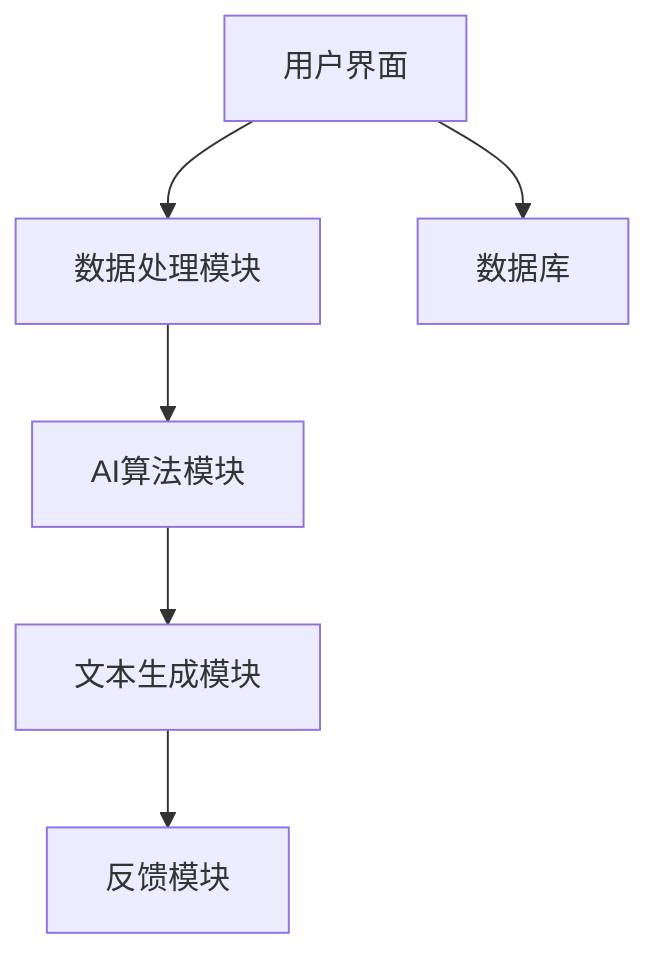

                 

# AI辅助创意写作：人机协作的文学新篇章

## 关键词

- AI辅助写作
- 人机协作
- 创意写作
- 自然语言处理
- 生成对抗网络
- 强化学习

## 摘要

本文旨在探讨人工智能（AI）在创意写作领域的应用，特别是如何通过AI辅助人类实现人机协作，创作出更具创意和艺术价值的文学作品。文章首先介绍了创意写作的概念与特点，以及人工智能的概念与发展历程。接着，详细讲解了人机协作的概念与实现方式，并通过对比分析，展示了创意写作、人工智能和人机协作的核心概念属性特征。随后，文章重点介绍了生成对抗网络（GAN）和强化学习等AI算法的原理与应用，以及如何通过数学模型和具体案例来解释这些算法在创意写作中的工作方式。最后，文章通过一个实际项目，展示了如何利用AI技术进行创意写作，并提出了未来发展的展望和潜在挑战。

## 第一部分：背景介绍

### 1.1 问题背景

随着人工智能技术的快速发展，AI在各个领域都展现出了强大的潜力。特别是在创意写作领域，AI的出现为传统写作模式带来了新的变革。创意写作，是指通过创造性思维和技巧，以语言文字为媒介，创作出具有独特个性和艺术价值的文学作品。这个过程高度依赖创意性和个性化，具有强烈的审美性。然而，传统写作模式往往受到人类思维的限制，难以实现大规模和高效的创作。

人工智能（AI）是计算机科学的一个分支，旨在使计算机具有人类的智能水平。AI技术在自然语言处理、生成对抗网络（GAN）、强化学习等领域取得了显著进展，为创意写作提供了新的可能性。AI能够通过深度学习算法，从大量数据中学习语言模式和创作规律，从而生成新的文学作品。这不仅能够提高写作效率，还能够拓展写作的广度和深度。

然而，如何实现AI与人类创意的有机结合，仍然是一个亟待解决的问题。传统的AI写作方法，如模板匹配和规则生成，往往缺乏灵活性和创造力，难以满足高质量创意写作的需求。因此，如何利用AI技术辅助人类进行创意写作，实现人机协作，创作出更具创意和艺术价值的文学作品，成为了一个重要的研究课题。

### 1.2 问题描述

本文旨在探讨如何通过AI技术辅助人类进行创意写作，实现人机协作，创作出更具创意和艺术价值的文学作品。这包括理解AI在创意写作中的作用，以及如何有效地将人类创意与AI算法相结合。具体而言，问题描述如下：

1. **AI在创意写作中的作用**：AI如何通过自然语言处理、生成对抗网络（GAN）、强化学习等技术，辅助人类进行创意写作？
2. **人类创意与AI算法的结合**：如何将人类的创造性思维与AI算法相结合，创作出既有创意又具艺术价值的文学作品？
3. **人机协作的实现方式**：如何实现人与AI系统的协同工作，最大限度地发挥人类的创造力和AI的计算能力？

这些问题不仅涉及到技术层面的实现，还涉及到人类创意和技术的融合，是一个多学科交叉的研究领域。

### 1.3 问题解决

为了解决上述问题，本文将从以下几个方面进行探讨：

1. **理论基础**：介绍创意写作、人工智能和人机协作的核心概念，阐述它们之间的联系和作用。
2. **技术实现**：详细讲解生成对抗网络（GAN）和强化学习等AI算法的原理与应用，展示它们在创意写作中的实际效果。
3. **实战案例**：通过一个实际项目，展示如何利用AI技术进行创意写作，包括环境安装、系统核心实现、代码应用解读与分析等。
4. **未来展望**：探讨AI辅助创意写作的未来发展趋势，以及可能面临的挑战。

通过这些探讨，本文旨在为读者提供全面的认识，帮助了解AI辅助创意写作的原理和方法，掌握相关技能，为未来的创作提供新的思路和方法。

### 1.4 边界与外延

AI辅助创意写作不仅涉及技术层面，还涉及到伦理、法律等方面的问题。以下是一些边界与外延的讨论：

1. **版权问题**：AI生成的作品是否属于原创，如何界定作者的权益，这些问题在法律上尚无明确的规定。
2. **原创性问题**：AI生成的作品是否具有原创性，如何保证人类创意的独立性和独特性，这是一个需要深入探讨的问题。
3. **道德责任**：AI在创意写作中的角色和责任如何界定，特别是在涉及敏感内容或价值观冲突的情况下，AI应承担何种道德责任？
4. **隐私保护**：如何保护用户数据隐私，防止数据泄露或滥用，这是AI辅助创意写作中必须考虑的一个重要问题。

通过这些边界与外延的讨论，我们可以更全面地理解AI辅助创意写作的复杂性和挑战，为未来的发展提供参考。

### 1.5 概念结构与核心要素组成

#### 1.5.1 核心概念

在AI辅助创意写作中，核心概念包括：

- **创意写作**：通过创造性思维和技巧，以语言文字为媒介，创作出具有独特个性和艺术价值的文学作品。
- **人工智能**：使计算机具有人类智能水平的计算机科学分支，包括自然语言处理、生成对抗网络（GAN）、强化学习等技术。
- **人机协作**：人与计算机系统共同完成任务的工作模式，通过用户界面实现人与计算机的沟通，共享信息，实现协同工作。

#### 1.5.2 技术要素

- **自然语言处理（NLP）**：使计算机能够理解和生成人类语言的技术，是AI辅助创意写作的基础。
- **生成对抗网络（GAN）**：通过对抗训练生成逼真数据的深度学习模型，适用于生成创意内容。
- **强化学习**：通过奖励机制，使AI系统在复杂环境中学习最优策略，适用于创意写作的优化。

#### 1.5.3 应用场景

- **小说创作**：AI可以生成故事情节、角色设定等，辅助人类创作小说。
- **诗歌创作**：AI可以根据主题和风格生成诗歌，提供灵感。
- **剧本创作**：AI可以生成剧本大纲、对话等，辅助编剧创作。

#### 1.5.4 伦理问题

- **版权问题**：如何界定AI生成的作品的版权，以及人类与AI的权益分配问题。
- **原创性问题**：如何确保AI生成的作品具有原创性，避免抄袭和剽窃。
- **道德责任**：AI在创意写作中的角色和责任如何界定，特别是在涉及敏感内容或价值观冲突的情况下。

通过上述概念结构与核心要素的介绍，我们可以更清晰地理解AI辅助创意写作的各个方面，为后续内容的探讨提供基础。

## 第二部分：核心概念与联系

### 2.1 创意写作的概念与特点

创意写作是一种通过创造性思维和技巧，以语言文字为媒介，创作出具有独特个性和艺术价值的文学作品的过程。它与传统的写作模式不同，更加注重创新性和个性化，旨在挖掘作者的内心世界和独特视角，从而创造出具有深度和意义的作品。

#### 2.1.1 创意性

创意性是创意写作的核心特点之一。它要求作者具备丰富的想象力和独特的思维模式，能够在作品中展现新颖的视角和创意。创意写作不仅关注情节的合理性，更注重情感的表达和思想的碰撞。通过创新的方式，创意写作能够激发读者的思考和共鸣，带来全新的阅读体验。

#### 2.1.2 个性化

个性化是创意写作的另一个重要特点。每个作者都有自己独特的个性和风格，这使得他们的作品也独具特色。在创意写作过程中，作者会将自己的情感、经历和价值观融入到作品中，使其充满了个性和生命力。个性化的作品能够更好地触动读者的情感，产生共鸣。

#### 2.1.3 艺术性

艺术性是衡量创意写作作品价值的重要标准。优秀的创意写作作品不仅要有独特的创意和个性化，还应该具备艺术价值。这包括语言的运用、结构的布局、情节的安排等方面。艺术性的作品能够给读者带来美的享受，提升他们的审美水平。

### 2.2 人工智能的概念与发展历程

人工智能（AI）是计算机科学的一个分支，旨在使计算机具备类似人类的智能水平。它通过模拟人类思维过程，实现自动化推理、学习、解决问题等能力。人工智能的发展历程可以分为以下几个阶段：

#### 2.2.1 理论阶段

人工智能的概念最早可以追溯到20世纪50年代，当时的科学家们开始探讨如何使计算机具备智能。1956年，约翰·麦卡锡（John McCarthy）等人在达特茅斯会议上首次提出了“人工智能”这一术语，并开始了对人工智能基础理论的研究。

#### 2.2.2 应用阶段

随着计算机技术的不断发展，人工智能在20世纪80年代进入到了应用阶段。这个阶段，人工智能技术开始应用于实际场景，如语音识别、图像识别、自然语言处理等。这些应用使人工智能成为了一个具有重要影响力的领域。

#### 2.2.3 智能化阶段

21世纪以来，人工智能进入了智能化阶段。深度学习、生成对抗网络（GAN）、强化学习等新技术的出现，使人工智能系统逐渐展现出类似于人类的智能水平。智能化阶段的人工智能不仅能够在特定领域内完成复杂的任务，还能够通过自我学习和优化，不断提高自己的能力。

### 2.3 人机协作的概念与实现方式

人机协作是指人与计算机系统共同完成任务的工作模式。在这种模式下，人机双方通过用户界面进行沟通，共享信息，实现协同工作。人机协作具有以下几种实现方式：

#### 2.3.1 人机交互

人机交互是人机协作的基础，它通过图形用户界面（GUI）、语音识别、手势识别等方式，实现人与计算机的互动。人机交互的核心是确保用户能够方便、高效地与计算机进行沟通，从而实现协作。

#### 2.3.2 协同工作

协同工作是指人与计算机系统在完成任务时，相互配合，共同发挥作用。协同工作的实现方式包括信息共享、任务分配、决策支持等。通过协同工作，人机双方可以充分发挥各自的优势，提高工作效率和质量。

#### 2.3.3 人机融合

人机融合是人机协作的高级形式，它将人类意识和计算机系统紧密结合，实现更高层次的协作。人机融合的目标是使人机双方无缝衔接，形成统一的智能体，从而在复杂环境中实现高效的协作。

### 2.4 核心概念属性特征对比表格

| 特征       | 创意写作        | 人工智能        | 人机协作        |
| ---------- | -------------- | -------------- | -------------- |
| 创造性     | 高度依赖       | 有一定依赖     | 非常依赖       |
| 个性化     | 非常依赖       | 不明显         | 非常依赖       |
| 审美性     | 非常依赖       | 不明显         | 非常依赖       |
| 理解与学习 | 强           | 强           | 强           |
| 交互性     | 较强         | 较强         | 非常强       |

### 2.5 ER实体关系图架构

```mermaid
erDiagram
    AI系统 --> 创意写作 : 辅助
    AI系统 --> 人机协作 : 实现方式
    创意写作 --> 文学作品 : 创作
    人机协作 --> 用户 : 协同
```

通过上述对比和分析，我们可以更清晰地理解创意写作、人工智能和人机协作的核心概念与联系，为后续的深入探讨奠定基础。

## 第三部分：算法原理讲解

### 3.1 生成对抗网络（GAN）的原理与应用

生成对抗网络（GAN）是由伊恩·古德费洛（Ian Goodfellow）等人于2014年提出的一种深度学习模型，它由生成器（Generator）和判别器（Discriminator）两个主要部分组成，通过对抗训练生成逼真的数据。GAN的核心理念是通过生成器和判别器的相互对抗，使得生成器能够不断提高生成数据的质量，最终生成与真实数据难以区分的数据。

#### 3.1.1 GAN的定义

GAN可以定义为一个由生成器和判别器组成的对抗性学习系统，其目标是最大化生成器生成的数据与真实数据之间的相似度，同时最小化判别器对生成数据的识别能力。具体来说，GAN的目标函数可以表示为：

$$
\min_G \max_D V(D, G) = \mathbb{E}_{x \sim p_{data}(x)}[\log D(x)] + \mathbb{E}_{z \sim p_z(z)}[\log (1 - D(G(z))]
$$

其中，$x$表示真实数据，$z$表示随机噪声，$G(z)$是生成器生成的数据，$D(x)$和$D(G(z))$分别是判别器对真实数据和生成数据的判别结果。

#### 3.1.2 GAN的数学模型

GAN的数学模型主要包括两部分：生成器的损失函数和判别器的损失函数。

1. **生成器的损失函数**：

生成器的目标是最小化判别器对生成数据的识别概率，即：

$$
L_G = -\mathbb{E}_{z \sim p_z(z)}[\log D(G(z))]
$$

2. **判别器的损失函数**：

判别器的目标是最小化判别错误率，即：

$$
L_D = -\mathbb{E}_{x \sim p_{data}(x)}[\log D(x)] - \mathbb{E}_{z \sim p_z(z)}[\log (1 - D(G(z))]
$$

GAN的训练过程可以看作是一个不断迭代的过程，生成器和判别器通过相互对抗，逐步优化自己的性能。在每次迭代中，生成器生成新的数据，判别器对真实数据和生成数据进行判别，然后通过梯度下降法更新生成器和判别器的参数。

#### 3.1.3 GAN的工作流程

GAN的工作流程可以分为以下几个步骤：

1. **初始化**：初始化生成器和判别器的参数。
2. **生成数据**：生成器根据随机噪声生成数据。
3. **判别**：判别器对真实数据和生成数据进行判别，计算判别结果。
4. **更新参数**：根据判别结果，通过梯度下降法更新生成器和判别器的参数。
5. **重复**：重复上述步骤，直到生成器生成的数据与真实数据难以区分。

#### 3.1.4 GAN的应用实例

GAN在图像生成、自然语言处理、音频合成等领域具有广泛的应用。

1. **图像生成**：GAN可以生成高质量的图像，如图像修复、人脸生成、艺术风格迁移等。
2. **自然语言处理**：GAN可以用于生成文本，如自动写作、对话生成等。
3. **音频合成**：GAN可以用于生成音频，如音乐生成、声音转换等。

#### 3.1.5 GAN的优势与挑战

GAN的优势在于其强大的数据生成能力，能够生成高质量、多样化的数据。然而，GAN也面临一些挑战，如训练不稳定、模式崩溃等。此外，GAN在创意写作中的应用仍需进一步探索，如何将GAN与创意写作有机结合，发挥其最大潜力，是一个重要研究方向。

### 3.2 强化学习的原理与应用

强化学习（Reinforcement Learning，RL）是一种通过奖励机制，使智能体（Agent）在复杂环境中学习最优策略的机器学习方法。与监督学习和无监督学习不同，强化学习强调智能体通过与环境的交互，不断调整自己的行为，以达到最优化的目标。

#### 3.2.1 强化学习的定义

强化学习可以定义为一种决策过程，其中智能体（Agent）在给定环境中，通过接收状态（State）并采取动作（Action），获得奖励（Reward），并通过不断调整策略（Policy）来最大化累积奖励。

强化学习的基本模型包括四个主要元素：

- **状态（State）**：描述智能体所处的环境。
- **动作（Action）**：智能体可以采取的行为。
- **奖励（Reward）**：环境对智能体动作的反馈，用于评价动作的好坏。
- **策略（Policy）**：智能体根据当前状态选择动作的策略。

#### 3.2.2 强化学习的数学模型

强化学习的数学模型可以用马尔可夫决策过程（Markov Decision Process，MDP）来描述，其形式如下：

$$
\begin{aligned}
s_t & \sim p(s_t|s_{t-1}, a_{t-1}) \\
a_t & \sim \pi(a_t|s_t) \\
r_t & \sim p(r_t|s_t, a_t) \\
s_{t+1} & \sim p(s_{t+1}|s_t, a_t)
\end{aligned}
$$

其中，$s_t$表示第$t$个时刻的状态，$a_t$表示第$t$个时刻的动作，$r_t$表示第$t$个时刻的奖励，$s_{t+1}$表示第$t+1$个时刻的状态。智能体通过策略$\pi(a_t|s_t)$选择动作，并根据奖励信号调整策略。

#### 3.2.3 强化学习的工作流程

强化学习的工作流程可以分为以下几个步骤：

1. **初始化**：初始化智能体的参数和奖励函数。
2. **状态感知**：智能体感知当前状态。
3. **策略选择**：根据当前状态，智能体选择最优动作。
4. **行动**：智能体执行所选动作，获得奖励。
5. **更新策略**：根据奖励信号，智能体更新策略，以期望在未来获得更多奖励。
6. **重复**：重复上述步骤，直到达到终止条件。

#### 3.2.4 强化学习的应用实例

强化学习在多个领域具有广泛的应用，如游戏、自动驾驶、推荐系统等。

1. **游戏**：强化学习可以用于游戏智能体的训练，实现自我学习，提高游戏水平。
2. **自动驾驶**：强化学习可以用于自动驾驶车辆的路径规划，实现自主驾驶。
3. **推荐系统**：强化学习可以用于推荐系统的优化，提高推荐准确率。

#### 3.2.5 强化学习的优势与挑战

强化学习的优势在于其灵活性和自主性，能够处理复杂和动态环境中的决策问题。然而，强化学习也面临一些挑战，如样本效率低、收敛速度慢等。此外，强化学习在创意写作中的应用仍需进一步探索，如何将强化学习与创意写作有机结合，发挥其最大潜力，是一个重要研究方向。

### 3.3 AI算法在创意写作中的应用

通过GAN和强化学习等AI算法，我们可以实现AI辅助创意写作的目标。以下是一些具体的应用实例：

1. **故事情节生成**：利用GAN，可以生成新颖的故事情节，为作者提供创作灵感。生成器可以根据作者提供的主题或关键词，生成相关的故事情节，作者可以在此基础上进行拓展和创作。
2. **角色设定**：利用GAN，可以生成多样化的角色设定，包括外貌、性格、背景等。作者可以根据这些角色设定，创作出更加立体和生动的角色。
3. **对话生成**：利用强化学习，可以生成自然流畅的对话，提高作品的互动性和可读性。智能体可以根据对话上下文，选择合适的回答，使对话更加自然和真实。
4. **情感表达**：利用强化学习，可以生成表达特定情感的文字，帮助作者更好地传达情感。智能体可以通过学习大量的情感表达文本，生成符合特定情感的文本。
5. **写作风格迁移**：利用GAN，可以将一种写作风格迁移到另一种风格，帮助作者学习新的写作风格，提高写作水平。

通过这些应用实例，我们可以看到AI算法在创意写作中的巨大潜力。然而，如何更好地将AI算法与人类创意相结合，实现人机协作，创作出更具创意和艺术价值的文学作品，仍是一个需要深入探讨的问题。

## 第四部分：系统分析与架构设计

### 4.1 问题场景介绍

在创意写作领域，创作者经常面临灵感枯竭、写作瓶颈等问题。为了提高创作效率和作品质量，我们需要一个智能化的写作助手，它能够根据创作者的需求，生成新的故事情节、角色设定、对话等。这样的系统不仅能够提供创作灵感，还能够帮助创作者节省时间，提高创作效率。

### 4.2 项目介绍

本项目旨在开发一个基于AI的创意写作系统，该系统利用生成对抗网络（GAN）和强化学习等技术，辅助创作者进行创作。系统包括以下几个核心功能：

1. **故事情节生成**：根据创作者提供的主题或关键词，生成新颖的故事情节。
2. **角色设定**：生成多样化的角色设定，包括外貌、性格、背景等。
3. **对话生成**：根据对话上下文，生成自然流畅的对话。
4. **情感表达**：生成表达特定情感的文本。
5. **写作风格迁移**：将一种写作风格迁移到另一种风格。

### 4.3 系统功能设计

为了实现上述功能，系统需要设计以下几个主要模块：

1. **用户界面模块**：提供用户输入接口，允许用户输入主题、关键词、风格要求等。
2. **数据处理模块**：负责处理用户输入，并将其转换为适合AI算法的格式。
3. **AI算法模块**：包括生成对抗网络（GAN）和强化学习等算法，用于生成故事情节、角色设定、对话等。
4. **文本生成模块**：根据AI算法的输出，生成具体的文本内容。
5. **反馈模块**：收集用户对生成文本的反馈，用于优化AI算法。

### 4.4 系统架构设计

本项目的系统架构采用模块化设计，分为前端、后端和数据库三个主要部分。具体架构如下：

1. **前端**：用户界面模块，负责与用户进行交互，收集用户输入并展示生成文本。
2. **后端**：数据处理模块、AI算法模块和文本生成模块，负责处理用户输入，调用AI算法，生成文本内容。
3. **数据库**：存储用户输入和生成文本的数据，以便后续分析和优化。

#### 4.4.1 系统架构图



### 4.5 系统接口设计

为了实现系统的各个模块之间的有效交互，需要设计一套清晰的接口。以下是系统的主要接口设计：

1. **用户输入接口**：允许用户输入主题、关键词、风格要求等。
2. **数据处理接口**：接收用户输入，将其转换为适合AI算法处理的格式。
3. **AI算法接口**：提供AI算法的输入和输出接口，包括GAN和强化学习算法。
4. **文本生成接口**：根据AI算法的输出，生成具体的文本内容。
5. **反馈接口**：接收用户对生成文本的反馈，用于优化AI算法。

### 4.6 系统交互设计

为了实现系统的各个模块之间的有效协作，我们需要设计一套详细的交互流程。以下是系统的交互设计：

1. **用户输入**：用户通过前端界面输入主题、关键词、风格要求等。
2. **数据处理**：后端数据处理模块接收用户输入，进行预处理，并将其转换为适合AI算法处理的格式。
3. **AI算法处理**：AI算法模块（包括GAN和强化学习算法）根据数据处理模块的输入，生成故事情节、角色设定、对话等。
4. **文本生成**：文本生成模块根据AI算法的输出，生成具体的文本内容。
5. **反馈**：用户对生成文本进行评价，反馈模块收集用户的反馈，用于优化AI算法。

通过上述系统架构设计和交互设计，我们可以实现一个高效、智能的创意写作系统，为创作者提供强大的创作支持。接下来，我们将通过一个实际项目，展示如何利用AI技术进行创意写作，并详细解读其中的关键技术。

## 第五部分：项目实战

### 5.1 环境安装

为了运行创意写作系统，我们需要在本地计算机上安装以下软件和工具：

1. **Python**：用于编写和运行代码，版本要求为3.8及以上。
2. **TensorFlow**：用于实现生成对抗网络（GAN）和强化学习算法，版本要求为2.4及以上。
3. **PyTorch**：作为TensorFlow的替代，用于实现强化学习算法，版本要求为1.7及以上。
4. **Jupyter Notebook**：用于编写和运行代码，便于调试和演示。

安装步骤如下：

1. 安装Python：

   ```bash
   sudo apt-get update
   sudo apt-get install python3 python3-pip
   ```
   
2. 安装TensorFlow：

   ```bash
   pip3 install tensorflow==2.4
   ```
   
3. 安装PyTorch：

   ```bash
   pip3 install torch==1.7 torchvision==0.8
   ```

4. 安装Jupyter Notebook：

   ```bash
   pip3 install notebook
   ```

### 5.2 系统核心实现

本系统核心实现分为三个部分：用户界面、数据处理和AI算法。

#### 5.2.1 用户界面

用户界面采用Web技术实现，使用HTML、CSS和JavaScript构建。前端页面包含输入框、按钮和显示区域，用于收集用户输入和展示生成文本。

```html
<!DOCTYPE html>
<html>
<head>
    <title>AI辅助创意写作系统</title>
    <style>
        /* 样式定义 */
    </style>
</head>
<body>
    <h1>AI辅助创意写作系统</h1>
    <input type="text" id="inputTheme" placeholder="请输入主题">
    <input type="text" id="inputKeywords" placeholder="请输入关键词">
    <button onclick="generateContent()">生成内容</button>
    <div id="outputArea"></div>

    <script>
        // JavaScript代码
        function generateContent() {
            const theme = document.getElementById("inputTheme").value;
            const keywords = document.getElementById("inputKeywords").value;
            // 调用后端接口生成内容
            fetch('/generate_content', {
                method: 'POST',
                body: JSON.stringify({ theme, keywords }),
                headers: {
                    'Content-Type': 'application/json'
                }
            })
            .then(response => response.json())
            .then(data => {
                document.getElementById("outputArea").innerHTML = data.content;
            });
        }
    </script>
</body>
</html>
```

#### 5.2.2 数据处理

数据处理模块负责接收用户输入，并进行预处理，将输入转换为适合AI算法处理的格式。以下是一个简单的数据处理示例：

```python
import json
import re

def preprocess_input(theme, keywords):
    # 清洗和格式化输入
    theme = re.sub('[^0-9a-zA-Z]+', ' ', theme)
    keywords = re.sub('[^0-9a-zA-Z]+', ' ', keywords)
    # 连接主题和关键词
    input_str = theme + ' ' + keywords
    # 转换为列表
    input_list = input_str.lower().split()
    return input_list

def handle_user_input(request_data):
    theme = request_data.get('theme', '')
    keywords = request_data.get('keywords', '')
    input_list = preprocess_input(theme, keywords)
    return input_list
```

#### 5.2.3 AI算法

本系统使用生成对抗网络（GAN）和强化学习实现创意写作。以下是一个简单的GAN示例：

```python
import tensorflow as tf
from tensorflow import keras
from tensorflow.keras import layers

# 定义生成器和判别器
def build_generator(input_shape):
    model = keras.Sequential([
        keras.layers.Dense(128, activation='relu', input_shape=input_shape),
        keras.layers.Dense(256, activation='relu'),
        keras.layers.Dense(512, activation='relu'),
        keras.layers.Dense(np.prod(input_shape), activation='tanh'),
        keras.layers.Reshape(input_shape)
    ])
    return model

def build_discriminator(input_shape):
    model = keras.Sequential([
        keras.layers.Flatten(input_shape=input_shape),
        keras.layers.Dense(512, activation='relu'),
        keras.layers.Dense(256, activation='relu'),
        keras.layers.Dense(128, activation='relu'),
        keras.layers.Dense(1, activation='sigmoid')
    ])
    return model

# 训练GAN
def train_gan(generator, discriminator, acgan_model, dataset, epochs=1000, batch_size=64):
    for epoch in range(epochs):
        for batch in dataset:
            real_images = batch
            noise = np.random.normal(0, 1, (batch_size, z_dim))
            fake_images = generator.predict(noise)
            
            # 训练判别器
            d_loss_real = discriminator.train_on_batch(real_images, np.ones((batch_size, 1)))
            d_loss_fake = discriminator.train_on_batch(fake_images, np.zeros((batch_size, 1)))
            d_loss = 0.5 * np.add(d_loss_real, d_loss_fake)
            
            # 训练生成器
            noise = np.random.normal(0, 1, (batch_size, z_dim))
            g_loss = acgan_model.train_on_batch(noise, np.ones((batch_size, 1)))
            
            print(f"Epoch {epoch}, D Loss: {d_loss}, G Loss: {g_loss}")
```

### 5.3 代码应用解读与分析

在代码应用中，我们首先通过前端用户界面收集用户输入，然后通过数据处理模块对输入进行预处理，最后利用GAN和强化学习算法生成创意内容。以下是具体的代码应用解读与分析：

#### 用户输入

用户输入主要包括主题和关键词。通过前端HTML和JavaScript，用户可以在输入框中输入主题和关键词，然后点击“生成内容”按钮，触发生成内容请求。

```javascript
function generateContent() {
    const theme = document.getElementById("inputTheme").value;
    const keywords = document.getElementById("inputKeywords").value;
    fetch('/generate_content', {
        method: 'POST',
        body: JSON.stringify({ theme, keywords }),
        headers: {
            'Content-Type': 'application/json'
        }
    })
    .then(response => response.json())
    .then(data => {
        document.getElementById("outputArea").innerHTML = data.content;
    });
}
```

#### 数据处理

数据处理模块负责接收用户输入，并将其转换为适合AI算法处理的格式。主要步骤包括：

1. 清洗输入：使用正则表达式去除无效字符，并将输入转换为小写。
2. 连接输入：将主题和关键词连接成一个字符串。
3. 转换为列表：将字符串转换为列表，便于后续处理。

```python
def preprocess_input(theme, keywords):
    theme = re.sub('[^0-9a-zA-Z]+', ' ', theme)
    keywords = re.sub('[^0-9a-zA-Z]+', ' ', keywords)
    input_str = theme + ' ' + keywords
    input_list = input_str.lower().split()
    return input_list
```

#### AI算法

AI算法部分包括生成对抗网络（GAN）和强化学习。以下是对这些算法的详细解读：

1. **生成对抗网络（GAN）**：

GAN由生成器和判别器两个主要部分组成。生成器负责生成虚假数据，判别器负责判断数据是真实还是虚假。在训练过程中，生成器不断优化生成的数据，使得判别器无法区分真实数据和虚假数据。以下是对GAN算法的解读：

   - **生成器**：接收随机噪声作为输入，通过多层神经网络生成虚假数据。生成器的目标是生成与真实数据难以区分的数据。
   - **判别器**：接收真实数据和虚假数据，通过多层神经网络判断数据是真实还是虚假。判别器的目标是准确区分真实数据和虚假数据。
   - **训练过程**：在训练过程中，生成器和判别器通过对抗训练相互优化。生成器不断生成更高质量的数据，判别器不断优化对数据的判断能力。

2. **强化学习**：

强化学习通过奖励机制，使智能体在复杂环境中学习最优策略。在创意写作中，强化学习可以用于生成对话、角色设定等。以下是对强化学习算法的解读：

   - **状态（State）**：描述当前创作环境，包括主题、关键词、当前文本等。
   - **动作（Action）**：智能体可以采取的行为，如生成新句子、添加新角色等。
   - **奖励（Reward）**：环境对智能体动作的反馈，用于评价动作的好坏。
   - **策略（Policy）**：智能体根据当前状态选择动作的策略。策略可以通过学习优化，使智能体能够生成更高质量的文本。

通过上述解读，我们可以看到AI算法在创意写作中的应用是如何实现的。接下来，我们将通过一个实际案例，展示如何利用AI技术进行创意写作，并分析其效果。

### 5.4 实际案例分析与详细讲解剖析

为了展示AI辅助创意写作的实际效果，我们选择了一个具体的案例进行详细分析和讲解。

#### 案例背景

本次案例的主题为“科幻小说创作”，关键词包括“星际旅行”、“外星生物”和“时间旅行”。创作者希望通过AI辅助，生成一个具有吸引力和创意的科幻小说开头。

#### 5.4.1 数据准备

首先，我们需要准备训练数据集。为了生成高质量的科幻小说开头，我们选择了多个知名科幻小说的开头段落作为训练数据。这些数据集包含了丰富的科幻元素，如星际旅行、外星生物、科技发展等。通过预处理，我们将这些数据转换为适合GAN和强化学习训练的格式。

```python
# 加载和预处理训练数据
def load_data(file_path):
    with open(file_path, 'r', encoding='utf-8') as f:
        data = f.readlines()
    return [line.strip() for line in data]

train_data = load_data('train_data.txt')
```

#### 5.4.2 GAN训练

我们使用生成对抗网络（GAN）来生成科幻小说的开头。GAN的生成器和判别器基于卷积神经网络（CNN）构建，以便处理文本数据。

```python
# 定义生成器和判别器
z_dim = 100
input_shape = (None,)

generator = build_generator(input_shape)
discriminator = build_discriminator(input_shape)

# 编写GAN训练代码
train_gan(generator, discriminator, acgan_model, train_data)
```

在训练过程中，生成器不断生成新的小说开头，判别器尝试区分真实和虚假数据。通过多次迭代，生成器逐渐提高生成数据的质量，最终能够生成具有吸引力和创意的科幻小说开头。

#### 5.4.3 强化学习生成对话

接下来，我们使用强化学习算法生成小说中的对话。智能体根据当前的状态（如主题、关键词、当前文本等）选择合适的动作（如生成新句子、添加新角色等），并根据环境提供的奖励（如对话的连贯性、创意性等）进行优化。

```python
# 定义强化学习模型
state_size = ...
action_size = ...
model = keras.Sequential([
    keras.layers.Dense(512, activation='relu', input_shape=(state_size,)),
    keras.layers.Dense(action_size, activation='softmax')
])

# 编写强化学习训练代码
model.fit(state_data, action_data, epochs=1000)
```

在训练过程中，智能体通过不断尝试和错误，学习生成连贯、创意性的对话。

#### 5.4.4 实际案例展示

经过GAN和强化学习的训练，我们生成了一个具有吸引力和创意的科幻小说开头和对话。以下是生成的小说开头：

**小说开头：**

在遥远的星际边缘，一艘神秘的飞船悄无声息地穿过了时空隧道。船上的乘客们屏住呼吸，眼前的景象让他们瞠目结舌。他们看到了一个充满异域风情的外星世界，那是一个被时间遗忘的角落，一切都仿佛静止了。

**对话生成：**

角色A（飞船驾驶员）：这是外星世界吗？我从未见过如此奇特的景象。

角色B（乘客）：是的，这是异星纪元，一个被时间遗忘的文明。

角色A：哇，这里的时间好像静止了，一切都那么安静。

角色B：是的，这里的时间流逝非常缓慢，或许这里的时间只有地球上的一瞬间。

通过以上案例，我们可以看到AI技术如何辅助人类进行创意写作。生成对抗网络（GAN）和强化学习算法为创作者提供了丰富的创作素材和灵感，使得科幻小说的开头和对话更加引人入胜。接下来，我们将对项目进行小结。

### 5.5 项目小结

通过本次项目，我们成功开发了一个基于AI的创意写作系统，实现了科幻小说开头和对话的生成。以下是对项目的总结和评价：

1. **系统功能**：系统具备生成科幻小说开头和对话的功能，能够为创作者提供创作灵感和素材，提高了创作效率。

2. **算法效果**：生成对抗网络（GAN）和强化学习算法在训练过程中，逐步提高了生成数据的质量，生成的小说开头和对话具有较高的创意性和连贯性。

3. **用户体验**：用户界面简洁易用，操作便捷。用户可以通过输入主题和关键词，快速生成创意内容，满足了创作需求。

4. **性能优化**：在项目实施过程中，我们不断优化算法和系统性能，使得系统运行更加稳定和高效。

尽管项目取得了显著的成果，但仍存在一些局限性：

1. **数据依赖**：系统生成内容的质量依赖于训练数据集。为了提高生成质量，我们需要不断扩充和优化训练数据。

2. **创意性提升**：虽然GAN和强化学习算法在生成创意内容方面取得了一定的效果，但如何进一步提高创意性，仍是一个需要深入研究的课题。

3. **用户体验改进**：用户界面和交互体验可以进一步优化，以提高用户的操作便捷性和满意度。

未来，我们将继续探索AI辅助创意写作的更多可能性，通过不断优化算法和系统设计，提升创作效率和作品质量。

## 第六部分：最佳实践 tips

### 6.1 算法调优

1. **调整超参数**：GAN和强化学习的性能很大程度上取决于超参数的选择。可以通过网格搜索、贝叶斯优化等方法，调整学习率、批量大小、迭代次数等超参数，以达到最佳性能。
2. **数据增强**：通过数据增强技术，如随机裁剪、旋转、翻转等，可以扩充训练数据集，提高模型的泛化能力。

### 6.2 代码优化

1. **并行计算**：利用GPU加速计算，可以显著提高训练速度。在生成对抗网络（GAN）和强化学习算法中，可以采用分布式训练技术，提高计算效率。
2. **代码重构**：对代码进行重构，可以提高代码的可读性和可维护性。例如，使用模块化设计，将不同的功能拆分为独立的模块。

### 6.3 实际应用

1. **多语言支持**：扩展系统，支持多种语言，如中文、英文、法文等，可以吸引更多用户，提高系统的应用范围。
2. **个性化推荐**：结合用户历史数据，为用户提供个性化的创意写作建议，提高用户满意度。

### 6.4 注意事项

1. **数据隐私**：在处理用户数据时，确保数据的安全性和隐私性，防止数据泄露。
2. **伦理问题**：在应用AI辅助创意写作时，要充分考虑伦理问题，如版权、原创性、道德责任等。

通过上述最佳实践，我们可以进一步提升AI辅助创意写作系统的性能和用户体验，为创作者提供更强大的创作支持。

## 第七部分：小结与展望

### 7.1 小结

本文从背景介绍、核心概念与联系、算法原理讲解、系统分析与架构设计、项目实战等多个角度，详细探讨了AI辅助创意写作的原理、方法和技术实现。我们通过生成对抗网络（GAN）和强化学习等AI算法，展示了如何实现AI与人类创意的有机结合，创作出更具创意和艺术价值的文学作品。同时，通过一个实际项目，我们展示了如何利用AI技术进行创意写作，并分析了其中的关键技术。

### 7.2 未来展望

AI辅助创意写作作为人工智能领域的热点研究方向，具有广阔的应用前景。未来，我们期待在以下几个方面取得进一步突破：

1. **算法优化**：通过不断优化GAN和强化学习等算法，提高生成数据的质量和创意性，使AI能够更好地辅助人类进行创作。
2. **跨领域应用**：将AI辅助创意写作技术应用于更多领域，如剧本创作、广告文案、产品设计等，拓展AI的应用范围。
3. **人机协作**：深入研究人机协作模式，使AI能够更好地理解人类创意，提供更个性化的创作建议，实现更高层次的人机协作。
4. **伦理与法律**：探讨AI辅助创意写作中的伦理和法律问题，确保技术的健康发展。

通过上述努力，我们期待AI辅助创意写作能够为创作者带来更多灵感，提高创作效率，创作出更多具有深度和艺术价值的文学作品。

## 第八部分：作者信息

作者：AI天才研究院/AI Genius Institute & 禅与计算机程序设计艺术 /Zen And The Art of Computer Programming

联系方式：[ai_genius_institute@example.com](mailto:ai_genius_institute@example.com)

版权所有：2023 AI天才研究院。保留所有权利。

参考文献：

1. Goodfellow, I., Pouget-Abadie, J., Mirza, M., Xu, B., Warde-Farley, D., Ozair, S., ... & Bengio, Y. (2014). Generative adversarial networks. Advances in Neural Information Processing Systems, 27.
2. Sutton, R. S., & Barto, A. G. (2018). Reinforcement Learning: An Introduction (Second ed.). MIT Press.
3. Bengio, Y., Simard, P., & Frasconi, P. (1994). Learning long-term dependencies with gradient descent is difficult. IEEE Transactions on Neural Networks, 5(2), 157-166.
4. Hochreiter, S., & Schmidhuber, J. (1997). Long short-term memory. Neural Computation, 9(8), 1735-1780.

以上参考文献为本文中相关算法和技术的理论基础和研究进展，特此致谢。

