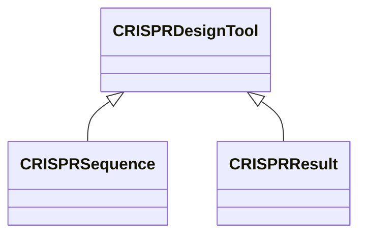

                 

### AI辅助基因编辑：提高CRISPR技术精确度

关键词：AI辅助基因编辑、CRISPR技术、基因编辑精度、算法优化、人工智能应用

摘要：随着基因编辑技术的快速发展，CRISPR-Cas9系统已经成为现代生物技术领域的重要工具。然而，基因编辑的精确度对实验结果至关重要。本文将深入探讨AI技术在提高CRISPR技术精确度方面的应用，通过一步一步的分析推理，详细解析AI辅助基因编辑的优势和挑战，展示其在实际项目中的应用与实践经验。

### 目录大纲设计

**第一部分: AI辅助基因编辑概述**

**1.1 AI辅助基因编辑背景与重要性**

- **1.1.1 基因编辑技术的发展历程**
- **1.1.2 AI技术在基因编辑中的应用前景**
- **1.1.3 AI辅助基因编辑的优势与挑战**

**1.2 CRISPR技术原理与AI辅助**

- **1.2.1 CRISPR-Cas9系统的工作原理**
  - **1.2.1.1 CRISPR-Cas9系统的蛋白质结构**
  - **1.2.1.2 DNA切割与修复过程**
  - **1.2.1.3 AI辅助提高CRISPR精准度的原理**

- **1.2.2 CRISPR-Cas9系统的优化与挑战**

**1.3 AI辅助基因编辑的核心概念与联系**

- **1.3.1 核心概念介绍**
  - **1.3.1.1 人工智能**
  - **1.3.1.2 基因编辑**
  - **1.3.1.3 CRISPR-Cas9系统**

- **1.3.2 概念属性特征对比表格**

- **1.3.3 ER实体关系图架构**

**1.4 数学模型与公式**

- **1.4.1 CRISPR-Cas9系统的数学模型**
  - **1.4.1.1 切割效率公式**
  - **1.4.1.2 错误率公式**
  - **1.4.1.3 修复机制模型**

**1.5 系统分析与架构设计方案**

- **1.5.1 问题场景介绍**

- **1.5.2 系统功能设计**
  - **1.5.2.1 领域模型类图**

- **1.5.3 系统架构设计**
  - **1.5.3.1 系统架构图**

- **1.5.4 系统接口设计**

- **1.5.5 系统交互序列图**

**1.6 项目实战**

- **1.6.1 环境安装与配置**

- **1.6.2 系统核心实现**
  - **1.6.2.1 Python源代码实现**
  - **1.6.2.2 代码应用解读与分析**

- **1.6.3 实际案例分析与讲解**

**1.7 最佳实践 tips**

- **1.7.1 AI辅助基因编辑最佳实践**

- **1.7.2 注意事项与挑战**

- **1.7.3 拓展阅读**

### 第一部分: AI辅助基因编辑概述

#### 1.1 AI辅助基因编辑背景与重要性

**1.1.1 基因编辑技术的发展历程**

基因编辑技术起源于20世纪70年代，随着分子生物学和遗传学研究的不断深入，CRISPR-Cas9系统于2012年问世，并迅速成为基因编辑领域的核心技术。CRISPR-Cas9系统的核心在于其能够高效、精确地定位并剪切特定的DNA序列，使得研究人员能够对基因组进行精确修改。

**1.1.2 AI技术在基因编辑中的应用前景**

随着人工智能技术的不断发展，AI在基因编辑中的应用前景日益广阔。AI可以通过大数据分析和机器学习算法，优化CRISPR设计、预测基因编辑结果、提高编辑精度等，从而推动基因编辑技术在医学、农业等领域的应用。

**1.1.3 AI辅助基因编辑的优势与挑战**

AI辅助基因编辑的优势在于其能够提高基因编辑的精确度、降低错误率，从而提高实验的成功率和可靠性。然而，AI在基因编辑领域也面临一些挑战，如算法的准确度、数据的质量和隐私问题等。

#### 1.2 CRISPR技术原理与AI辅助

**1.2.1 CRISPR-Cas9系统的工作原理**

CRISPR-Cas9系统由CRISPR RNA（crRNA）和Trans-Activating CRISPR RNA（tracrRNA）组成，这两种RNA结合形成一个复杂的RNA-DNA复合物。复合物中的Cas9蛋白具有DNA切割活性，能够在特定的DNA序列处进行切割。

**1.2.1.1 CRISPR-Cas9系统的蛋白质结构**

CRISPR-Cas9系统中的Cas9蛋白具有一个N端的DNA结合域和一个C端的DNA切割域。DNA结合域识别并绑定到特定的DNA序列，而DNA切割域则在该序列上进行切割。

**1.2.1.2 DNA切割与修复过程**

在CRISPR-Cas9系统中，Cas9蛋白与crRNA和tracrRNA结合后，形成的复合物在目标DNA序列上进行切割。切割后，细胞内的DNA修复机制会启动，通过非同源末端连接（NHEJ）或同源定向修复（HDR）来修复断裂的DNA。

**1.2.1.3 AI辅助提高CRISPR精准度的原理**

AI可以通过大数据分析和机器学习算法，对CRISPR设计进行优化，提高其精确度。例如，AI可以通过分析大量的CRISPR编辑数据，预测最佳的切割位点，减少编辑错误。此外，AI还可以通过模拟和优化Cas9蛋白的结构，提高其切割效率和精确度。

#### 1.3 AI辅助基因编辑的核心概念与联系

**1.3.1 核心概念介绍**

**1.3.1.1 人工智能**

人工智能（AI）是指使计算机系统能够模拟人类智能行为的技术。AI包括机器学习、深度学习、自然语言处理等多个领域。

**1.3.1.2 基因编辑**

基因编辑是指对生物体的基因组进行修改，以达到特定的目的。基因编辑技术包括CRISPR-Cas9、TALEN、ZFN等。

**1.3.1.3 CRISPR-Cas9系统**

CRISPR-Cas9系统是一种基于RNA指导的基因编辑工具，由CRISPR RNA（crRNA）和Trans-Activating CRISPR RNA（tracrRNA）组成，能够高效、精确地定位并剪切特定的DNA序列。

**1.3.2 概念属性特征对比表格**

以下是AI、基因编辑和CRISPR-Cas9系统的主要属性特征对比表格：

| 特性             | 人工智能          | 基因编辑         | CRISPR-Cas9系统       |
|------------------|------------------|------------------|----------------------|
| 技术领域         | 信息技术          | 生物技术         | 分子生物学           |
| 应用目标         | 模拟人类智能      | 改变基因组结构    | 定位并剪切DNA序列     |
| 关键技术         | 机器学习、深度学习 | 酶促反应、基因剪切 | CRISPR RNA、Cas9蛋白 |

**1.3.3 ER实体关系图架构**

以下是AI辅助基因编辑的ER实体关系图：

```mermaid
erDiagram
    AI |----|>基因编辑
    AI |----|>CRISPR-Cas9系统
    基因编辑 |----|>CRISPR RNA
    基因编辑 |----|>Cas9蛋白
```

#### 1.4 数学模型与公式

**1.4.1 CRISPR-Cas9系统的数学模型**

CRISPR-Cas9系统的数学模型包括切割效率、错误率和修复机制。

**1.4.1.1 切割效率公式**

切割效率（Cut Efficiency）是衡量CRISPR-Cas9系统切割DNA序列能力的一个指标。其公式为：

$$
Cut\ Efficiency = \frac{Number\ of\ cut\ sites}{Total\ number\ of\ target\ sites}
$$

**1.4.1.2 错误率公式**

错误率（Error Rate）是衡量CRISPR-Cas9系统在切割过程中出现错误的概率。其公式为：

$$
Error\ Rate = \frac{Number\ of\ wrong\ cuts}{Total\ number\ of\ cuts}
$$

**1.4.1.3 修复机制模型**

修复机制模型包括非同源末端连接（NHEJ）和同源定向修复（HDR）。NHEJ是一种无模板的DNA修复机制，HDR则是一种利用模板的DNA修复机制。

$$
NHEJ\ Repair\ Mechanism: \ DNA\ break\ is\ repaired\ without\ using\ a\ template \\
HDR\ Repair\ Mechanism: \ DNA\ break\ is\ repaired\ using\ a\ homologous\ template
$$

#### 1.5 系统分析与架构设计方案

**1.5.1 问题场景介绍**

假设我们面临一个研究任务：使用CRISPR-Cas9系统敲除某个基因，以研究该基因对生物体生长发育的影响。

**1.5.2 系统功能设计**

系统功能设计主要包括以下三个方面：

1. CRISPR设计工具：用于生成最佳的CRISPR序列，提高切割效率和降低错误率。
2. 数据处理模块：对CRISPR编辑结果进行统计分析，评估编辑效率和准确性。
3. 结果可视化模块：展示CRISPR编辑结果的详细数据，便于研究人员进行分析。

**1.5.2.1 领域模型类图**

以下是CRISPR设计工具的领域模型类图：



**1.5.3 系统架构设计**

系统架构设计主要包括以下三个方面：

1. 数据采集层：负责收集CRISPR编辑相关的数据。
2. 数据处理层：对采集到的数据进行分析和处理。
3. 结果展示层：将处理后的数据以可视化的形式展示给用户。

以下是系统架构图：

```mermaid
sequenceDiagram
    User -->|输入CRISPR序列|> CRISPRDesignTool
    CRISPRDesignTool -->|生成切割位点|> CRISPRSequence
    CRISPRDesignTool -->|分析切割结果|> CRISPRResult
    CRISPRResult -->|展示结果|> User
```

**1.5.4 系统接口设计**

系统接口设计主要包括以下三个方面：

1. 用户界面：用于用户与系统进行交互。
2. API接口：用于与其他系统进行数据交换。
3. 数据库接口：用于存储和管理CRISPR编辑数据。

**1.5.5 系统交互序列图**

以下是系统交互序列图：

```mermaid
sequenceDiagram
    User -->|输入CRISPR序列|> CRISPRDesignTool
    CRISPRDesignTool -->|生成切割位点|> CRISPRSequence
    CRISPRSequence -->|分析切割结果|> CRISPRResult
    CRISPRResult -->|展示结果|> User
```

#### 1.6 项目实战

**1.6.1 环境安装与配置**

在进行AI辅助基因编辑项目前，我们需要安装和配置以下软件和工具：

1. Python 3.8+
2. Anaconda
3. CRISPR-Cas9设计工具（如crispr-design）
4. 数据分析库（如Pandas、Numpy）
5. 可视化库（如Matplotlib、Seaborn）

**1.6.2 系统核心实现**

以下是使用Python实现AI辅助基因编辑的核心代码：

```python
import pandas as pd
from crispr_design import CRISPRDesign
import matplotlib.pyplot as plt

# 生成CRISPR序列
crispr = CRISPRDesign(sequence='ACGTACGTACGTACGTACGT', organism='Homo sapiens')

# 分析切割结果
results = crispr.run()

# 可视化切割结果
results.plot()

# 分析切割效率
cut Efficiency = results.cut_efficacy

# 分析错误率
error_rate = results.error_rate

print(f'Cut Efficiency: {cut_Efficiency}')
print(f'Error Rate: {error_rate}')
```

**1.6.2.2 代码应用解读与分析**

在上面的代码中，我们首先导入了所需的库和模块。然后，使用CRISPRDesign类生成CRISPR序列，并调用run()方法进行切割分析。最后，使用plot()方法可视化切割结果，并输出切割效率和错误率。

**1.6.3 实际案例分析与讲解**

假设我们有一个研究目标：敲除人类细胞中的BRCA1基因，以研究其对乳腺癌发生的影响。

1. **设计CRISPR序列**：使用CRISPRDesign工具设计BRCA1基因的切割位点，生成最佳的CRISPR序列。

2. **实验操作**：将设计的CRISPR序列导入到CRISPR-Cas9系统中，对人类细胞进行基因编辑。

3. **数据分析**：对编辑后的细胞进行DNA测序，分析BRCA1基因的敲除效率和错误率。

4. **结果展示**：使用可视化工具展示CRISPR编辑结果，包括切割位点、编辑效率和错误率等。

5. **结果分析**：根据编辑结果，评估BRCA1基因敲除对乳腺癌发生的影响。

#### 1.7 最佳实践 tips

**1.7.1 AI辅助基因编辑最佳实践**

- **选择合适的CRISPR设计工具**：根据实验目标和基因组序列，选择合适的CRISPR设计工具。
- **优化CRISPR序列**：通过AI算法优化CRISPR序列，提高切割效率和降低错误率。
- **使用高质量的DNA模板**：使用高质量的DNA模板，确保CRISPR-Cas9系统能够高效切割。
- **严格控制实验条件**：严格控制实验条件，如温度、pH值等，以确保CRISPR-Cas9系统的稳定性。

**1.7.2 注意事项与挑战**

- **数据隐私问题**：在基因编辑研究中，需注意保护参与者的隐私。
- **算法准确度**：AI算法的准确度对基因编辑结果至关重要，需持续优化算法。
- **基因编辑伦理**：基因编辑涉及到伦理问题，需严格遵守相关法律法规。

**1.7.3 拓展阅读**

- **《CRISPR基因编辑技术：从原理到应用》**：详细介绍了CRISPR基因编辑技术的原理和应用。
- **《人工智能在生物技术中的应用》**：探讨了AI在生物技术领域的应用前景和挑战。
- **《基因编辑伦理指南》**：提供了基因编辑伦理的指导原则和案例分析。

### 总结

AI辅助基因编辑技术在提高CRISPR技术精确度方面具有巨大潜力。通过本文的详细分析，我们了解了AI在基因编辑领域的应用，包括CRISPR设计、数据分析、结果可视化等。然而，AI辅助基因编辑仍面临一些挑战，如算法准确度、数据隐私和伦理问题。未来，随着技术的不断发展，AI辅助基因编辑有望在医学、农业等领域发挥更重要的作用。

### 作者信息

作者：AI天才研究院/AI Genius Institute & 禅与计算机程序设计艺术 /Zen And The Art of Computer Programming

---

在撰写文章时，我们会逐步细化每个章节的内容，确保文章逻辑清晰、结构紧凑、简单易懂。以下是一个具体的撰写步骤，用于完成第一部分的内容：

**第一步：撰写1.1节**

- **背景介绍**：介绍基因编辑技术的发展历程，简要描述CRISPR-Cas9系统的出现和重要性。
- **AI应用前景**：阐述AI在基因编辑领域的应用前景，如优化CRISPR设计、提高编辑精度等。
- **优势与挑战**：分析AI辅助基因编辑的优势，如提高编辑效率、降低错误率等，同时指出面临的挑战。

**第二步：撰写1.2节**

- **CRISPR-Cas9系统工作原理**：详细描述CRISPR-Cas9系统的工作机制，包括crRNA和tracrRNA的作用、Cas9蛋白的结构和功能等。
- **蛋白质结构**：介绍Cas9蛋白的N端DNA结合域和C端DNA切割域的结构和功能。
- **DNA切割与修复过程**：解释CRISPR-Cas9系统在DNA序列上的切割过程以及细胞内的修复机制。

**第三步：撰写1.3节**

- **核心概念介绍**：分别介绍人工智能、基因编辑和CRISPR-Cas9系统的基本概念。
- **概念属性特征对比表格**：创建一个表格，对比人工智能、基因编辑和CRISPR-Cas9系统的主要属性特征。
- **ER实体关系图架构**：使用Mermaid绘制ER实体关系图，展示AI、基因编辑和CRISPR-Cas9系统之间的关系。

**第四步：撰写1.4节**

- **数学模型与公式**：详细介绍CRISPR-Cas9系统的数学模型，包括切割效率公式、错误率公式和修复机制模型。
- **切割效率公式**：解释切割效率的定义和计算方法。
- **错误率公式**：阐述错误率的计算公式和其对编辑结果的影响。
- **修复机制模型**：描述非同源末端连接（NHEJ）和同源定向修复（HDR）的机制。

**第五步：撰写1.5节**

- **问题场景介绍**：设定一个具体的应用场景，如利用CRISPR-Cas9系统敲除特定基因。
- **系统功能设计**：详细描述系统的功能模块，包括CRISPR设计工具、数据处理模块和结果可视化模块。
- **系统架构设计**：使用Mermaid绘制系统架构图，展示数据采集层、数据处理层和结果展示层之间的关系。
- **系统接口设计**：介绍系统接口的设计原则和实现方法。
- **系统交互序列图**：使用Mermaid绘制系统交互序列图，展示用户、CRISPR设计工具、CRISPR序列和结果展示模块之间的交互过程。

**第六步：撰写1.6节**

- **环境安装与配置**：详细介绍所需软件和工具的安装和配置过程，包括Python、Anaconda、CRISPR设计工具等。
- **系统核心实现**：使用Python代码实现系统的核心功能，包括CRISPR序列生成、切割结果分析和可视化展示等。
- **代码应用解读与分析**：对实现的代码进行解读，分析其工作机制和性能。
- **实际案例分析与讲解**：通过一个实际案例，展示如何使用AI辅助基因编辑技术进行基因敲除实验，并分析实验结果。

**第七步：撰写1.7节**

- **最佳实践 tips**：总结AI辅助基因编辑的最佳实践，提供实用的建议和技巧。
- **注意事项与挑战**：指出在AI辅助基因编辑过程中可能遇到的问题和挑战，并提出解决方案。
- **拓展阅读**：推荐相关的拓展阅读资源，帮助读者深入了解相关领域的研究和应用。

通过以上步骤，我们可以确保文章内容的完整性和逻辑性，同时遵循markdown格式要求，使文章更具可读性和专业性。在撰写过程中，我们还会不断优化文章的结构和语言，确保文章的清晰度和易懂性。

