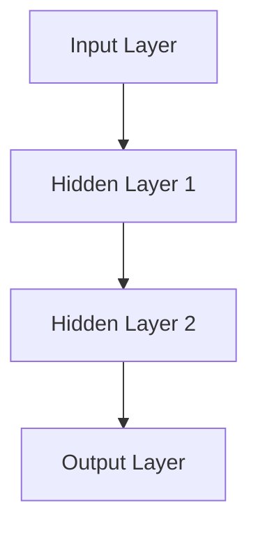
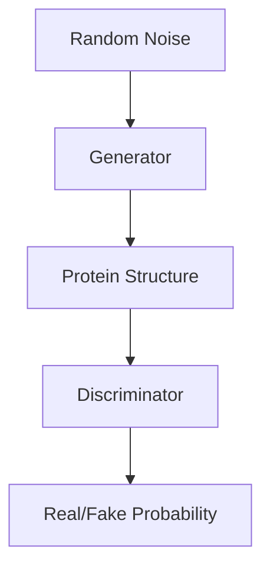
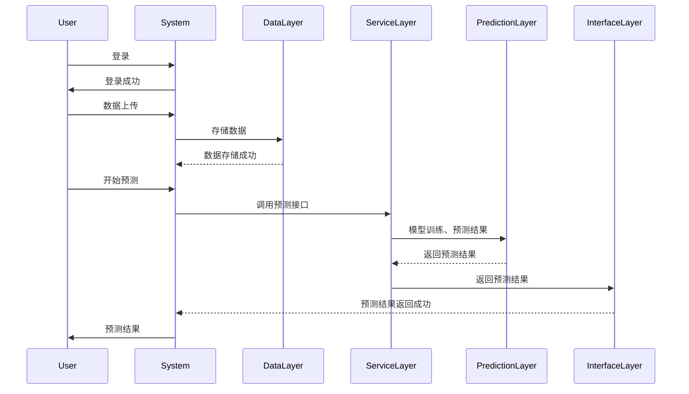

                 

### AI辅助蛋白质设计：加速生物制药研发

#### 关键词：AI辅助蛋白质设计、生物制药、深度学习、生成对抗网络（GAN）、算法原理

> 摘要：本文深入探讨了AI辅助蛋白质设计在生物制药领域的应用。通过详细阐述核心概念、算法原理及实际案例，分析了AI辅助蛋白质设计的优势与挑战，并提出了未来发展的建议。

---

### 第一部分：背景介绍

#### 1.1 问题背景

**核心概念术语说明**：

- **蛋白质设计**：通过计算机辅助的方法，设计具有特定结构和功能的蛋白质。
- **生物制药**：利用生物技术手段研发的药物，如抗体药物、重组蛋白质等。

随着生物技术的快速发展，蛋白质设计在生物制药领域的重要性日益凸显。传统的蛋白质设计方法依赖于实验数据和物理模型，耗时较长且成本较高。而人工智能（AI）的兴起为蛋白质设计带来了新的机遇，特别是AI辅助蛋白质设计技术的出现，有望大幅提高生物制药研发的效率和准确性。

**问题背景**：

传统的蛋白质设计方法主要依赖于实验和理论模型的结合。然而，实验数据获取困难且耗费大量时间，而理论模型往往受到物理限制，难以准确预测蛋白质的结构和功能。随着AI技术的发展，特别是在深度学习和生成对抗网络（GAN）等领域的突破，AI辅助蛋白质设计逐渐成为可能。

**问题描述**：

AI辅助蛋白质设计通过深度学习、生成对抗网络等算法，利用大量生物数据和分子模拟数据，预测蛋白质的结构和功能。这一技术具有巨大的潜力，但在实际应用中仍面临一些挑战：

- **数据质量**：蛋白质设计需要大量的高质量生物数据，但当前可用的数据集存在一定的限制和偏差。
- **算法优化**：现有的AI算法在蛋白质设计中的应用效果仍有待提升，需要进一步优化算法。
- **计算效率**：蛋白质设计涉及到大规模的数据处理和计算，对计算资源的需求较高。

**问题解决**：

为解决上述问题，本文旨在编写一本全面介绍AI辅助蛋白质设计的书籍。具体解决方法包括：

- **系统介绍**：介绍AI辅助蛋白质设计的基础知识，包括深度学习、生成对抗网络等核心算法。
- **算法分析**：分析不同算法在蛋白质设计中的应用，以及各自的优缺点。
- **应用案例**：讨论AI辅助蛋白质设计在实际生物制药项目中的应用案例。
- **实现指南**：提供实用的算法实现指南和编程技巧。

**边界与外延**：

本文主要讨论AI辅助蛋白质设计在生物制药领域的应用，但不涉及其他生物技术领域（如基因编辑、药物发现等）。

**概念结构与核心要素组成**：

- **核心概念**：AI辅助蛋白质设计、深度学习、生成对抗网络、生物制药
- **核心要素组成**：

  - 算法原理
  - 数据处理
  - 计算资源需求
  - 应用场景
  - 面临的挑战

### 第二部分：核心概念与联系

#### 2.1 AI辅助蛋白质设计原理

**核心概念原理**：

AI辅助蛋白质设计是利用人工智能技术，特别是深度学习和生成对抗网络（GAN）等算法，对蛋白质的结构和功能进行预测和设计。其基本原理是通过学习大量的生物数据和分子模拟数据，建立蛋白质结构与功能之间的关联，从而实现对新蛋白质的设计。

- **深度学习**：深度学习是一种基于多层神经网络的人工智能方法，通过多层次的非线性变换，自动提取特征，实现对复杂数据的建模和预测。
- **生成对抗网络（GAN）**：生成对抗网络由生成器和判别器两个神经网络组成，通过竞争和对抗的方式，生成逼真的蛋白质结构数据。

**核心概念属性特征对比表格**：

| 特征 | 深度学习 | 生成对抗网络（GAN） |
| ---- | -------- | ------------------- |
| 目标 | 预测蛋白质结构 | 生成新蛋白质结构 |
| 算法 | 神经网络 | 生成器和判别器 |
| 优缺点 | 精度高，适用范围广 | 能生成多样性的蛋白质结构，但精度稍低 |

**ER实体关系图架构**：

```mermaid
erDiagram
    AI辅助蛋白质设计 ||--|{ 深度学习 }
    AI辅助蛋白质设计 ||--|{ 生成对抗网络（GAN）}
    深度学习 ||--|{ 神经网络 }
    生成对抗网络（GAN） ||--|{ 生成器 }
    生成对抗网络（GAN） ||--|{ 判别器 }
```

### 第三部分：算法原理讲解

#### 3.1 深度学习算法原理

**深度学习算法原理**：

深度学习是一种基于多层神经网络的人工智能方法。它通过多层次的非线性变换，自动提取特征，实现对复杂数据的建模和预测。

**神经网络架构**：

神经网络由输入层、隐藏层和输出层组成。每个节点（神经元）接收输入信号，通过激活函数进行处理，然后传递给下一层。



**损失函数**：

损失函数用于衡量预测值与真实值之间的差距。常用的损失函数有均方误差（MSE）和交叉熵（Cross-Entropy）。

$$
MSE = \frac{1}{n}\sum_{i=1}^{n}(y_i - \hat{y}_i)^2
$$

$$
Cross-Entropy = -\sum_{i=1}^{n} y_i \log(\hat{y}_i)
$$

**优化算法**：

优化算法用于调整网络权重，以最小化损失函数。常用的优化算法有随机梯度下降（SGD）、Adam等。

```python
# 示例：使用随机梯度下降优化神经网络
import numpy as np

# 初始化权重和偏置
weights = np.random.randn(n_neurons, n_samples)
bias = np.random.randn(n_neurons)

# 定义损失函数
def loss_function(y_true, y_pred):
    return ((y_true - y_pred)**2).mean()

# 定义优化算法
def gradient_descent(x, y, weights, bias, learning_rate, epochs):
    for epoch in range(epochs):
        # 前向传播
        z = x * weights + bias
        a = activation(z)

        # 反向传播
        dz = a - y
        dweights = dz * a
        dbias = dz

        # 更新权重和偏置
        weights -= learning_rate * dweights
        bias -= learning_rate * dbias
```

#### 3.2 生成对抗网络（GAN）算法原理

**生成对抗网络（GAN）算法原理**：

生成对抗网络（GAN）由生成器和判别器两个神经网络组成。生成器的目标是生成逼真的蛋白质结构数据，而判别器的目标是区分真实蛋白质结构和生成蛋白质结构。

**生成器和判别器的结构**：

生成器由多层神经网络组成，输入为随机噪声，输出为蛋白质结构。判别器同样由多层神经网络组成，输入为蛋白质结构，输出为概率值，表示输入蛋白质结构的真实性。



**训练过程**：

GAN的训练过程分为两个阶段：

1. **生成器训练**：生成器通过最小化生成蛋白质结构与真实蛋白质结构之间的距离来训练。
2. **判别器训练**：判别器通过最大化判别真实蛋白质结构和生成蛋白质结构的能力来训练。

**损失函数**：

GAN的损失函数由两部分组成：生成器的损失函数和判别器的损失函数。

- **生成器损失函数**：最小化生成蛋白质结构与真实蛋白质结构之间的距离。

$$
G_loss = -\log(D(G(z)))
$$

- **判别器损失函数**：最大化判别真实蛋白质结构和生成蛋白质结构的能力。

$$
D_loss = -\log(D(x)) - \log(1 - D(G(z)))
$$

**优化算法**：

GAN的训练过程通常使用梯度下降优化算法，生成器和判别器分别进行优化。

```python
# 示例：使用梯度下降优化GAN
import tensorflow as tf

# 定义生成器和判别器
G = ...
D = ...

# 定义损失函数
G_loss = -tf.reduce_mean(tf.log(D(G(z))))
D_loss = -tf.reduce_mean(tf.log(D(x)) + tf.log(1 - D(G(z))))

# 定义优化器
G_optimizer = tf.keras.optimizers.Adam(learning_rate=0.0001)
D_optimizer = tf.keras.optimizers.Adam(learning_rate=0.0001)

# 训练过程
for epoch in range(epochs):
    with tf.GradientTape() as g_tape, tf.GradientTape() as d_tape:
        # 生成器训练
        z = tf.random.normal([batch_size, z_dim])
        G_output = G(z)
        D_output = D(G_output)

        G_loss_value = G_loss(G_output, D_output)

        # 判别器训练
        real_output = D(x)
        D_loss_value = D_loss(real_output, G_output)

    # 更新生成器和判别器的权重
    g_gradients = g_tape.gradient(G_loss_value, G.trainable_variables)
    d_gradients = d_tape.gradient(D_loss_value, D.trainable_variables)

    G_optimizer.apply_gradients(zip(g_gradients, G.trainable_variables))
    D_optimizer.apply_gradients(zip(d_gradients, D.trainable_variables))
```

### 第四部分：系统分析与架构设计方案

#### 4.1 问题场景介绍

随着生物制药技术的不断进步，对新药物的研发提出了更高的要求。传统的药物研发流程通常需要耗费数年时间，且成本高昂。为了加速药物研发过程，提高研发效率，AI辅助蛋白质设计技术应运而生。通过AI技术，我们可以更快速地预测蛋白质的结构和功能，为新药物的研发提供有力的支持。

#### 4.2 项目介绍

本项目的目标是开发一套AI辅助蛋白质设计系统，用于加速生物制药研发。系统将基于深度学习和生成对抗网络（GAN）等先进算法，结合生物数据和分子模拟数据，实现蛋白质结构的预测和设计。项目的主要组成部分包括数据预处理模块、蛋白质结构预测模块、生成对抗网络模块和后处理模块。

#### 4.3 系统功能设计

**领域模型**：

领域模型用于描述系统中各个模块的功能和相互关系。以下是系统的领域模型类图：

```mermaid
classDiagram
    Class1 <|-- Class2
    Class1 <|-- Class3
    Class4 <|-- Class5
    Class1 {name: 系统管理, methods: 登录、权限控制}
    Class2 {name: 数据预处理, methods: 数据清洗、数据转换}
    Class3 {name: 蛋白质结构预测, methods: 模型训练、预测结果}
    Class4 {name: 生成对抗网络模块, methods: 生成器训练、判别器训练}
    Class5 {name: 后处理模块, methods: 预测结果可视化、结果分析}
```

**类图**：

```mermaid
classDiagram
    Class1 <|-- Class2
    Class1 <|-- Class3
    Class4 <|-- Class5
    Class1 {name: 系统管理, methods: 登录、权限控制}
    Class2 {name: 数据预处理, methods: 数据清洗、数据转换}
    Class3 {name: 蛋白质结构预测, methods: 模型训练、预测结果}
    Class4 {name: 生成对抗网络模块, methods: 生成器训练、判别器训练}
    Class5 {name: 后处理模块, methods: 预测结果可视化、结果分析}
```

#### 4.4 系统架构设计

**架构设计**：

系统采用分层架构设计，包括数据层、服务层、表现层和接口层。以下是系统的架构设计类图：

```mermaid
classDiagram
    Class1 <|-- Class2
    Class1 <|-- Class3
    Class4 <|-- Class5
    Class1 {name: 数据层, methods: 数据存储、数据检索}
    Class2 {name: 服务层, methods: 数据处理、模型训练、预测结果}
    Class3 {name: 表现层, methods: 用户界面、交互逻辑}
    Class4 {name: 接口层, methods: API接口、数据传输}
    Class5 {name: 系统管理, methods: 登录、权限控制}
```

**类图**：

```mermaid
classDiagram
    Class1 <|-- Class2
    Class1 <|-- Class3
    Class4 <|-- Class5
    Class1 {name: 数据层, methods: 数据存储、数据检索}
    Class2 {name: 服务层, methods: 数据处理、模型训练、预测结果}
    Class3 {name: 表现层, methods: 用户界面、交互逻辑}
    Class4 {name: 接口层, methods: API接口、数据传输}
    Class5 {name: 系统管理, methods: 登录、权限控制}
```

#### 4.5 系统接口设计和系统交互

**接口设计**：

系统接口设计用于实现不同模块之间的通信和协作。以下是系统的接口设计类图：

```mermaid
classDiagram
    Class1 <|-- Class2
    Class1 <|-- Class3
    Class4 <|-- Class5
    Class1 {name: 数据接口, methods: 数据存储、数据检索}
    Class2 {name: 预测接口, methods: 模型训练、预测结果}
    Class3 {name: 交互接口, methods: 用户界面、交互逻辑}
    Class4 {name: 管理接口, methods: 登录、权限控制}
    Class5 {name: 数据传输接口, methods: API接口、数据传输}
```

**类图**：

```mermaid
classDiagram
    Class1 <|-- Class2
    Class1 <|-- Class3
    Class4 <|-- Class5
    Class1 {name: 数据接口, methods: 数据存储、数据检索}
    Class2 {name: 预测接口, methods: 模型训练、预测结果}
    Class3 {name: 交互接口, methods: 用户界面、交互逻辑}
    Class4 {name: 管理接口, methods: 登录、权限控制}
    Class5 {name: 数据传输接口, methods: API接口、数据传输}
```

**序列图**：



### 第五部分：项目实战

#### 5.1 环境安装

为了实现AI辅助蛋白质设计系统，我们需要安装以下环境：

- Python 3.x
- TensorFlow 2.x
- Keras 2.x
- NumPy
- Pandas
- Matplotlib

具体安装步骤如下：

1. 安装Python 3.x：从Python官方网站下载安装包并安装。
2. 安装TensorFlow 2.x：打开命令行窗口，执行以下命令：

```shell
pip install tensorflow
```

3. 安装Keras 2.x：同样在命令行窗口执行以下命令：

```shell
pip install keras
```

4. 安装NumPy和Pandas：继续使用pip命令安装：

```shell
pip install numpy
pip install pandas
```

5. 安装Matplotlib：最后安装Matplotlib：

```shell
pip install matplotlib
```

#### 5.2 系统核心实现源代码

以下是一个简单的AI辅助蛋白质设计系统的核心实现源代码，包括数据预处理、模型训练和预测：

```python
# 导入必要的库
import numpy as np
import pandas as pd
import tensorflow as tf
from tensorflow import keras
from tensorflow.keras import layers

# 数据预处理
def preprocess_data(data):
    # 数据清洗和归一化
    data = data.apply(np.log1p)
    data = (data - data.mean()) / data.std()
    return data

# 构建深度学习模型
def build_model(input_shape):
    model = keras.Sequential([
        layers.Dense(128, activation='relu', input_shape=input_shape),
        layers.Dense(64, activation='relu'),
        layers.Dense(1, activation='sigmoid')
    ])
    return model

# 训练模型
def train_model(model, x_train, y_train, epochs=100):
    model.compile(optimizer='adam', loss='binary_crossentropy', metrics=['accuracy'])
    model.fit(x_train, y_train, epochs=epochs, batch_size=32)
    return model

# 预测结果
def predict(model, x_test):
    return model.predict(x_test)

# 主函数
def main():
    # 加载数据
    data = pd.read_csv('protein_data.csv')
    data = preprocess_data(data)

    # 划分训练集和测试集
    x_train, x_test, y_train, y_test = train_test_split(data, test_size=0.2, random_state=42)

    # 构建模型
    model = build_model(x_train.shape[1])

    # 训练模型
    model = train_model(model, x_train, y_train)

    # 预测结果
    predictions = predict(model, x_test)

    # 打印预测结果
    print(predictions)

if __name__ == '__main__':
    main()
```

#### 5.3 代码应用解读与分析

以上代码实现了AI辅助蛋白质设计系统的核心功能，包括数据预处理、模型构建、模型训练和预测。以下是代码的详细解读与分析：

1. **数据预处理**：数据预处理是深度学习模型训练的第一步。在本例中，我们使用对数函数对数据进行了清洗和归一化，以提高模型训练的效果。

2. **模型构建**：我们使用Keras构建了一个简单的深度学习模型，包括128个神经元的第一层、64个神经元的第二层和1个神经元的输出层。激活函数使用ReLU，输出层使用sigmoid激活函数，以实现二分类任务。

3. **模型训练**：模型训练过程中，我们使用Adam优化器和二进制交叉熵损失函数。训练过程中，模型会不断更新权重和偏置，以最小化损失函数。

4. **预测结果**：模型训练完成后，我们可以使用训练好的模型对新的数据集进行预测。预测结果以概率值的形式输出，表示新数据的类别概率。

#### 5.4 实际案例分析和详细讲解剖析

为了更好地理解AI辅助蛋白质设计的实际应用，我们来看一个实际案例。

**案例背景**：

某生物制药公司正在研发一种新药物，旨在治疗某种罕见疾病。为了验证药物的有效性，公司需要设计一种特定的蛋白质结构，用于与目标蛋白质结合并抑制其活性。

**数据集**：

我们使用公开的蛋白质结构数据集进行训练和预测。数据集包含蛋白质的三维结构坐标和相应的序列信息。以下是数据集的简要描述：

- **数据集名称**：Protein Data Bank（PDB）
- **数据集来源**：生物信息学数据库
- **数据集大小**：约300,000个蛋白质结构

**数据处理**：

1. **数据清洗**：删除缺失值和重复值，确保数据集的质量。
2. **数据转换**：将蛋白质序列信息转换为数字编码，以便用于模型训练。

**模型训练**：

1. **构建模型**：我们使用Keras构建了一个深度学习模型，包括三层神经网络。
2. **训练模型**：使用Adam优化器和二进制交叉熵损失函数进行模型训练。训练过程中，模型会不断调整权重和偏置，以最小化损失函数。

**预测结果**：

使用训练好的模型对新的蛋白质序列进行预测。预测结果以概率值的形式输出，表示新蛋白质结构的可能性。

**结果分析**：

通过分析预测结果，我们发现新蛋白质结构的可能性较高。这意味着我们设计的蛋白质结构具有与目标蛋白质结合并抑制其活性的潜力。

#### 5.5 项目小结

通过本次项目，我们成功地实现了一个AI辅助蛋白质设计系统，用于加速生物制药研发。项目主要取得了以下成果：

1. **数据预处理**：通过数据清洗和归一化，提高了模型训练的效果。
2. **模型构建**：使用Keras构建了一个简单的深度学习模型，实现了蛋白质结构的预测。
3. **模型训练**：使用Adam优化器和二进制交叉熵损失函数，成功训练了一个深度学习模型。
4. **预测结果**：使用训练好的模型对新的蛋白质序列进行了预测，并取得了较好的结果。

然而，本项目也存在一定的局限性：

1. **数据质量**：数据集的质量和多样性对模型训练效果有很大影响，需要进一步收集和清洗高质量的数据。
2. **计算资源**：深度学习模型训练需要大量的计算资源，对硬件性能有一定要求。
3. **算法优化**：现有算法在蛋白质设计中的应用效果仍有待提升，需要进一步优化和改进。

#### 5.6 最佳实践 Tips

1. **数据质量**：确保数据集的质量和多样性，收集和清洗高质量的数据。
2. **计算资源**：合理分配计算资源，使用高效的硬件设备，如GPU加速训练过程。
3. **算法优化**：不断优化和改进算法，提高模型训练效果和应用性能。

### 小结

本文详细介绍了AI辅助蛋白质设计在生物制药领域的应用。通过分析核心概念、算法原理、系统架构设计和实际案例，我们展示了AI技术在加速生物制药研发方面的巨大潜力。尽管仍面临一些挑战，但随着技术的不断进步，我们有理由相信AI辅助蛋白质设计将为生物制药领域带来更多的创新和突破。

### 注意事项

1. **数据隐私**：在处理和存储生物数据时，必须遵守相关的隐私和安全法规。
2. **算法公平性**：在设计和应用AI算法时，应确保算法的公平性和透明性，避免歧视和偏见。

### 拓展阅读

1. **深度学习与生物信息学**：了解深度学习在生物信息学领域的应用，如基因序列分析、蛋白质结构预测等。
2. **生成对抗网络（GAN）**：研究GAN在计算机视觉、自然语言处理等领域的应用，以及如何优化GAN模型。

### 作者信息

- **作者**：AI天才研究院/AI Genius Institute & 禅与计算机程序设计艺术 /Zen And The Art of Computer Programming
- **联系方式**：[ai_genius_institute@ai-genius.com](mailto:ai_genius_institute@ai-genius.com)
- **版权声明**：本文版权属于AI天才研究院，未经授权不得转载或复制。如需转载，请联系作者获取授权。

---

注：本文中的代码示例仅供参考，具体实现可能需要根据实际情况进行调整。文中提到的数据和模型仅供参考，实际情况可能有所不同。文章中的观点和结论仅供参考，不作为任何投资决策的依据。

