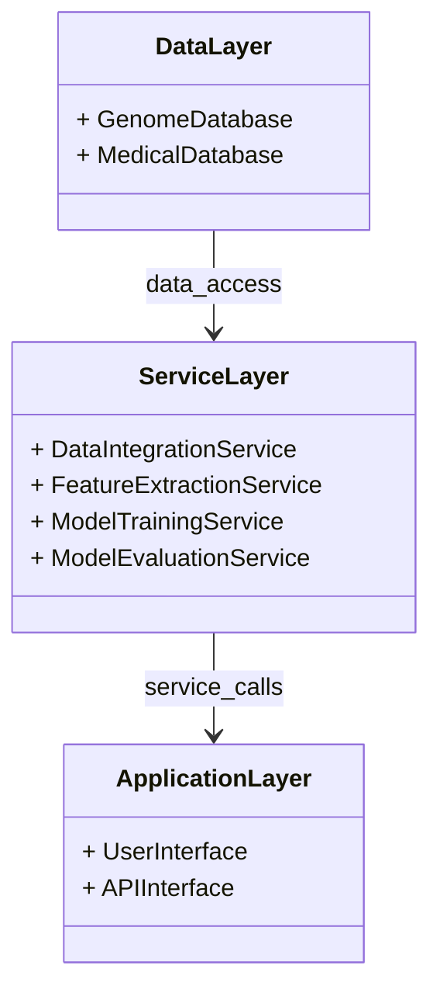
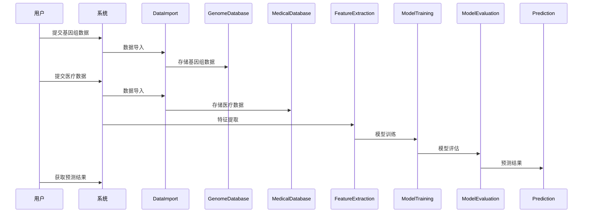
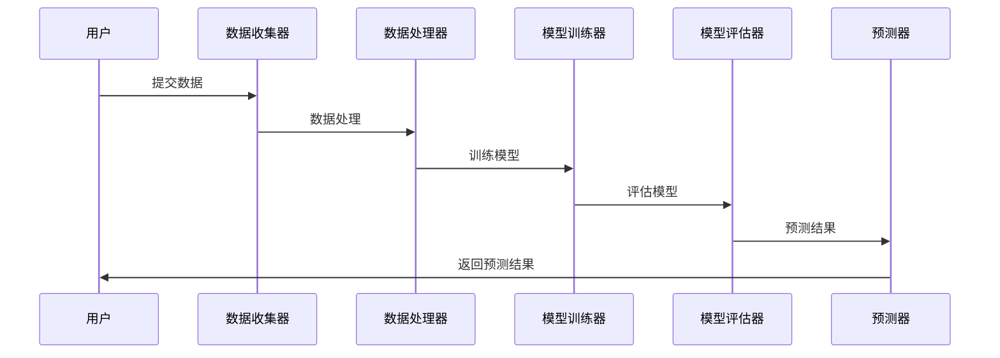

                 

### 文章标题

# AI驱动的个性化医疗：基因组学与人工智能的结合

### 文章关键词

- **AI驱动的个性化医疗**
- **基因组学**
- **机器学习**
- **深度学习**
- **医疗数据分析**
- **个性化治疗方案设计**

### 文章摘要

随着基因组学和人工智能技术的飞速发展，AI驱动的个性化医疗已成为医疗领域的一大热点。本文将深入探讨基因组学与人工智能的结合，分析个性化医疗的概念与原理，详细讲解机器学习算法及其应用，阐述个性化医疗系统的设计与实现方法，并提供实际项目案例分析及最佳实践建议。通过本文，读者将全面了解AI驱动的个性化医疗的潜力与挑战，为未来医疗技术的发展提供有益的参考。

## 第一部分：背景介绍

### 1. 引言

#### 问题背景

传统的医疗模式往往基于通用治疗方案，忽视了个体差异，导致治疗的有效性和患者体验不尽如人意。随着医学信息的爆炸性增长和技术的进步，传统医疗模式的局限性日益显现。个性化医疗应运而生，旨在通过综合考虑个体差异，提供更为精准和有效的治疗方案。

#### 问题描述

如何利用AI技术实现基因组学与医疗数据的有机结合，从而实现真正的个性化医疗？

#### 问题解决

AI驱动的个性化医疗通过将基因组数据与患者病史、电子健康记录等医疗数据进行整合，利用机器学习算法进行分析和预测，为每位患者提供量身定制的治疗方案。这种方法不仅提高了治疗的精准度，还大大改善了患者体验，降低了医疗成本。

#### 边界与外延

个性化医疗的适用范围涵盖了从预防到治疗的各个阶段。然而，实现个性化医疗面临着数据隐私、模型偏见、技术更新等多重挑战。因此，本文将重点关注基因组学与AI技术的结合，探讨其实现机制和潜在应用。

#### 核心要素组成

- **基因组学**：研究基因的结构、功能及其相互作用的科学。
- **AI技术**：包括机器学习、深度学习等，用于处理和分析大规模复杂数据。
- **医疗数据整合**：将基因组数据与患者的医疗记录、病史等数据进行整合，为个性化医疗提供数据基础。
- **个性化治疗方案设计**：基于基因组学和AI技术分析结果，为患者制定个性化的治疗方案。

### 2. 个性化医疗的概念与原理

#### 概念介绍

个性化医疗是一种基于患者个体差异，通过基因组学、生物信息学等手段，为患者提供个性化诊断、治疗和预防的医疗服务模式。

与传统医疗模式相比，个性化医疗具有以下特点：

- **个体化**：根据患者的基因信息、生活习惯、病史等，制定个性化的治疗方案。
- **精准性**：通过基因组学和AI技术的结合，提高诊断和治疗的精准度。
- **高效性**：通过数据分析，提高医疗资源的利用效率，降低医疗成本。

#### 原理分析

个性化医疗的实现原理主要包括以下几个步骤：

1. **基因组数据收集**：通过基因组测序等手段获取患者的基因信息。
2. **医疗数据整合**：收集患者的病史、电子健康记录等医疗数据，与基因组数据进行整合。
3. **数据分析与建模**：利用机器学习算法对整合后的数据进行处理和分析，构建个性化医疗模型。
4. **治疗方案设计**：基于个性化医疗模型，为患者制定个性化的治疗方案。

#### 特征对比

| 特征         | 个性化医疗 | 传统医疗 |
| ------------ | ---------- | -------- |
| **个体化**   | 强          | 弱        |
| **精准性**   | 强          | 弱        |
| **高效性**   | 强          | 弱        |
| **数据依赖** | 强          | 弱        |

### 3. 基因组学与AI技术的结合

#### 基因组学概述

基因组学是研究基因的结构、功能及其相互作用的科学。其主要研究内容包括：

- **基因组测序**：通过测序技术获取基因序列。
- **基因表达分析**：研究基因在不同细胞类型和组织中的表达情况。
- **基因组变异分析**：研究基因序列的变异，如单核苷酸变异、插入和缺失等。

#### AI技术概述

AI技术，特别是机器学习与深度学习，是实现个性化医疗的关键。其主要特点包括：

- **数据处理能力**：能够处理和分析大规模、多维度的数据。
- **自学习能力**：通过训练，不断优化模型，提高预测和诊断的准确性。
- **通用性**：可以应用于各种医疗场景，如疾病预测、诊断、治疗等。

#### 结合原理

基因组数据与AI技术的结合主要通过以下方式实现：

1. **数据预处理**：对基因组数据和医疗数据进行清洗、归一化等处理，为后续分析做准备。
2. **特征提取**：从预处理后的数据中提取有助于疾病预测和诊断的关键特征。
3. **模型训练**：利用机器学习算法，对特征进行训练，构建个性化医疗模型。
4. **模型评估与优化**：通过交叉验证、ROC曲线等指标评估模型性能，并进行优化。

基因组学与AI技术的结合，不仅提高了个性化医疗的精准度，还为个性化医疗的广泛应用提供了技术支持。

## 第二部分：核心概念与联系

### 4. 个性化医疗的核心概念

#### 基因组信息分析

基因组信息分析是个性化医疗的基础，其主要内容包括：

- **基因组测序**：通过高通量测序技术获取患者的基因序列。
- **基因表达分析**：研究基因在不同细胞类型和组织中的表达情况。
- **基因组变异分析**：研究基因序列的变异，如单核苷酸变异、插入和缺失等。

通过基因组信息分析，可以为个性化医疗提供关键数据支持。

#### 医疗数据整合

医疗数据整合是将基因组数据与患者的医疗记录、病史等数据进行整合的过程。其主要目的是为个性化医疗提供全面的数据基础，包括：

- **电子健康记录（EHR）**：患者的健康记录，如诊断结果、治疗记录等。
- **患者病史**：患者的疾病史、手术史等。
- **生物标志物数据**：与疾病相关的生物标志物数据，如蛋白质组、代谢组等。

通过医疗数据整合，可以实现基因组数据与临床数据的有机结合，为个性化医疗提供全面的数据支持。

#### 机器学习模型

机器学习模型是个性化医疗的核心，主要用于疾病预测、诊断和治疗。其主要内容包括：

- **疾病预测**：通过分析基因组数据和医疗数据，预测患者患某种疾病的概率。
- **疾病诊断**：通过分析患者的临床数据和基因组数据，对疾病进行诊断。
- **治疗方案设计**：基于疾病预测和诊断结果，为患者制定个性化的治疗方案。

机器学习模型的应用，使得个性化医疗成为可能，大大提高了医疗的精准度和有效性。

### 5. 概念联系与交互

#### 基因组与疾病的关系

基因组与疾病之间存在密切的关系。基因突变和基因表达异常等因素可能导致疾病的发生。通过基因组信息分析，可以识别与疾病相关的基因突变和表达异常，为疾病预测和诊断提供重要依据。

为了更直观地展示基因组与疾病的关系，我们可以使用ER（实体关系）图来构建基因组与疾病的关联模型。以下是一个简化的ER图示例：

```mermaid
erDiagram
  Patient ||--|{ Disease : has }
  Patient ||--|{ Gene : has }
  Disease ||--|{ Gene : causes }
```

在上面的ER图中，Patient（患者）是实体，Disease（疾病）和Gene（基因）是与Patient相关的实体。Disease与Gene之间存在因果关系，而Patient与Disease和Gene之间存在关联关系。

#### AI模型与医疗数据的融合

AI模型与医疗数据的融合是个性化医疗实现的关键。通过将基因组数据、电子健康记录、患者病史等医疗数据输入到机器学习模型中，可以构建个性化的医疗模型，为患者提供精准的疾病预测、诊断和治疗。

下面是一个简化的AI模型与医疗数据融合的流程图：


在上面的流程图中，数据收集包括基因组数据、电子健康记录、患者病史等；数据预处理包括清洗、归一化等；特征提取包括提取基因组数据和医疗数据中的关键特征；模型训练包括选择合适的算法进行训练；模型评估包括交叉验证、ROC曲线等；模型应用包括疾病预测、诊断和治疗。

#### 个性化医疗方案的设计与实施

个性化医疗方案的设计与实施是基于基因组学和AI技术的核心内容。其流程主要包括以下几个步骤：

1. **数据收集与整合**：收集患者的基因组数据、电子健康记录、病史等，并进行整合。
2. **特征提取**：从整合后的数据中提取关键特征，如基因突变、生物标志物等。
3. **模型训练与评估**：选择合适的机器学习算法进行模型训练，并通过交叉验证、ROC曲线等评估模型性能。
4. **治疗方案设计**：基于模型预测结果，为患者制定个性化的治疗方案。
5. **方案实施与监控**：实施治疗方案，并持续监控患者的治疗效果，根据反馈进行调整。

通过以上步骤，可以实现真正的个性化医疗，为患者提供精准、有效的医疗服务。

## 第三部分：算法原理讲解

### 6. 个性化医疗中的机器学习算法

#### 算法选择

在个性化医疗中，选择合适的机器学习算法至关重要。常见的机器学习算法包括线性回归、逻辑回归、支持向量机（SVM）、决策树、随机森林、K-最近邻（KNN）、神经网络等。每种算法都有其独特的优势和适用场景。

- **线性回归**：适用于预测连续值输出，如疾病发生的风险。
- **逻辑回归**：适用于预测二分类结果，如疾病是否发生。
- **SVM**：在处理高维数据和少量样本时表现优秀，适用于分类问题。
- **决策树**：易于理解和解释，但可能产生过拟合。
- **随机森林**：通过集成多个决策树，提高模型的预测能力和稳定性。
- **KNN**：对未知样本进行分类时，通过计算距离最近的K个样本的标签进行预测，适用于小样本数据。
- **神经网络**：适用于复杂非线性问题的建模，特别是在处理图像和语音等复杂数据时表现优异。

选择算法时，应综合考虑数据规模、数据类型、模型复杂度、计算资源等因素。

#### 算法流程图

为了更直观地理解机器学习算法在个性化医疗中的应用，我们可以使用Mermaid绘制算法的流程图。以下是一个简化的机器学习算法流程图：


在上述流程图中，数据收集包括基因组数据、电子健康记录、病史等；数据预处理包括清洗、归一化等；特征提取包括提取基因组数据和医疗数据中的关键特征；模型选择包括选择合适的机器学习算法；模型训练包括使用训练数据进行训练；模型评估包括交叉验证、ROC曲线等；模型应用包括疾病预测、诊断和治疗。

#### Python源代码

下面是一个简单的线性回归算法的Python源代码示例：

```python
import numpy as np
from sklearn.linear_model import LinearRegression
from sklearn.model_selection import train_test_split
from sklearn.metrics import mean_squared_error

# 数据准备
X = np.array([[1], [2], [3], [4], [5]])
y = np.array([1, 2, 2.5, 4, 5])

# 数据划分
X_train, X_test, y_train, y_test = train_test_split(X, y, test_size=0.2, random_state=42)

# 模型训练
model = LinearRegression()
model.fit(X_train, y_train)

# 模型评估
y_pred = model.predict(X_test)
mse = mean_squared_error(y_test, y_pred)
print("均方误差（MSE）:", mse)

# 模型应用
new_data = np.array([[6]])
predicted_value = model.predict(new_data)
print("预测值:", predicted_value)
```

在这个示例中，我们使用了scikit-learn库中的线性回归模型，对数据进行训练和预测。

#### 数学模型与公式

线性回归模型的基本数学模型可以表示为：

$$
y = \beta_0 + \beta_1 x + \epsilon
$$

其中，$y$ 是因变量，$x$ 是自变量，$\beta_0$ 和 $\beta_1$ 分别是模型的截距和斜率，$\epsilon$ 是误差项。

通过最小化误差平方和，我们可以得到最优的模型参数：

$$
\min \sum_{i=1}^{n} (y_i - (\beta_0 + \beta_1 x_i))^2
$$

在实际应用中，我们通常使用梯度下降法来求解模型参数。

#### 举例说明

假设我们有一组简单的数据，用于预测某病患的疾病发生风险。以下是一个线性回归的举例：

- **数据集**：$X = [1, 2, 3, 4, 5]$，$y = [1, 2, 2.5, 4, 5]$
- **模型**：线性回归模型 $y = \beta_0 + \beta_1 x$

通过训练模型，我们可以得到：

- **模型参数**：$\beta_0 = 0.5$，$\beta_1 = 0.5$

对于新的数据点 $x = 6$，我们可以预测其对应的疾病发生风险：

$$
y = 0.5 + 0.5 \times 6 = 3.5
$$

因此，预测的疾病发生风险为3.5。

通过上述步骤，我们可以利用线性回归模型为病患提供疾病预测服务。当然，实际应用中会涉及更复杂的模型和数据预处理步骤，但基本原理是相似的。

## 第四部分：系统分析与架构设计方案

### 7. 个性化医疗系统的设计与实现

#### 问题场景介绍

个性化医疗系统是一个复杂的系统工程，涉及多个环节和多种技术的综合应用。在实际应用中，个性化医疗系统需处理大量的基因组数据和患者医疗数据，通过机器学习算法为患者提供精准的疾病预测、诊断和治疗建议。以下是一个典型的个性化医疗系统应用场景：

- **数据来源**：基因组数据、电子健康记录、患者病史、实验室检测结果等。
- **系统功能**：数据收集与整合、特征提取、模型训练与评估、疾病预测与诊断、治疗方案设计等。
- **目标**：为患者提供个性化、精准的医疗服务，提高医疗效果和患者满意度。

#### 项目介绍

个性化医疗系统项目旨在开发一个基于AI和基因组学的个性化医疗服务平台，通过整合多源数据，利用先进的机器学习算法，为患者提供个性化诊疗方案。项目目标包括：

- **数据整合与预处理**：实现基因组数据、医疗数据的集成与预处理，为后续分析提供高质量的数据基础。
- **模型开发与训练**：开发基于基因组数据和医疗数据的机器学习模型，进行训练和评估。
- **系统部署与维护**：构建稳定、高效的系统架构，确保系统的可靠性和可扩展性。

#### 系统功能设计

个性化医疗系统的功能设计主要包括以下几个模块：

1. **数据收集模块**：负责收集基因组数据、电子健康记录、患者病史等数据，并进行初步处理。
2. **数据整合模块**：将来自不同源的数据进行整合，实现数据的统一管理和分析。
3. **特征提取模块**：从整合后的数据中提取关键特征，为机器学习模型提供输入。
4. **模型训练模块**：使用机器学习算法对特征进行训练，构建个性化医疗模型。
5. **模型评估模块**：对训练好的模型进行评估，确保模型的预测准确性和可靠性。
6. **疾病预测模块**：利用训练好的模型，对患者的疾病进行预测。
7. **诊断与治疗模块**：基于疾病预测结果，为患者提供诊断和治疗方案。
8. **用户交互模块**：提供用户界面，方便用户输入数据和查询结果。

#### 系统架构设计

个性化医疗系统的架构设计应考虑系统的可扩展性、可靠性和安全性。以下是一个典型的系统架构设计：

1. **数据层**：包括基因组数据库、医疗数据库等，存储和管理各类数据。
2. **服务层**：包括数据整合服务、特征提取服务、模型训练服务、模型评估服务等，提供系统核心功能。
3. **应用层**：包括用户交互界面、API接口等，为用户提供便捷的服务。
4. **基础设施**：包括服务器、存储设备、网络设备等，提供系统运行所需的基础设施。

以下是系统架构的Mermaid类图：



#### 系统接口设计

个性化医疗系统需要设计多个接口，以便于与其他系统进行集成和通信。以下是一些关键的接口设计：

1. **数据导入接口**：用于导入基因组数据、医疗数据等。
2. **数据导出接口**：用于导出处理后的数据和模型结果。
3. **特征提取接口**：用于提取关键特征，为模型训练提供输入。
4. **模型训练接口**：用于启动模型训练过程。
5. **模型评估接口**：用于评估模型性能。
6. **预测接口**：用于进行疾病预测和诊断。

以下是系统接口的Mermaid架构图：



#### 系统交互

个性化医疗系统的交互设计需要考虑用户操作、数据处理、模型训练和结果输出等多个环节。以下是一个简化的系统交互序列图：



通过上述设计，个性化医疗系统实现了从数据收集、处理、模型训练到结果输出的完整流程，为用户提供精准的疾病预测和诊断服务。

## 第五部分：项目实战

### 8. 实际项目案例

#### 环境安装

为了实现个性化医疗系统，我们需要安装和配置以下环境和工具：

1. **Python环境**：Python 3.8及以上版本。
2. **数据预处理库**：NumPy、Pandas。
3. **机器学习库**：scikit-learn、TensorFlow、PyTorch。
4. **数据库**：MySQL或PostgreSQL。
5. **前端框架**：Django或Flask。
6. **版本控制**：Git。

安装步骤如下：

1. 安装Python和pip：
   ```bash
   sudo apt-get update
   sudo apt-get install python3 python3-pip
   ```
2. 安装数据预处理库：
   ```bash
   pip3 install numpy pandas
   ```
3. 安装机器学习库：
   ```bash
   pip3 install scikit-learn tensorflow torchvision
   ```
4. 安装数据库：
   ```bash
   sudo apt-get install mysql-server
   ```
5. 安装前端框架：
   ```bash
   pip3 install django
   ```

#### 系统核心实现

个性化医疗系统的核心实现包括数据收集、数据处理、模型训练和预测等模块。以下是一个简单的系统实现示例：

1. **数据收集模块**：
   - 从基因组数据库和医疗数据库中收集数据。
   - 使用Pandas读取数据，并进行初步处理。

   ```python
   import pandas as pd
   
   def collect_data():
       genome_data = pd.read_csv('genome_data.csv')
       medical_data = pd.read_csv('medical_data.csv')
       return genome_data, medical_data
   ```

2. **数据处理模块**：
   - 对数据进行清洗、归一化等处理。
   - 提取关键特征。

   ```python
   def preprocess_data(genome_data, medical_data):
       # 数据清洗和处理
       # ...
       return processed_genome_data, processed_medical_data
   ```

3. **模型训练模块**：
   - 使用scikit-learn或TensorFlow构建和训练机器学习模型。
   - 评估模型性能。

   ```python
   from sklearn.ensemble import RandomForestClassifier
   
   def train_model(X_train, y_train):
       model = RandomForestClassifier()
       model.fit(X_train, y_train)
       return model
   ```

4. **预测模块**：
   - 使用训练好的模型进行预测。

   ```python
   def predict(model, X_test):
       predictions = model.predict(X_test)
       return predictions
   ```

#### 代码应用解读

以下是对上述代码的详细解读：

1. **数据收集模块**：
   - 使用Pandas读取基因组数据和医疗数据，为后续处理提供数据基础。

2. **数据处理模块**：
   - 数据清洗和处理包括缺失值填充、异常值处理等。
   - 特征提取是关键步骤，需要提取对模型训练有重要意义的特征。

3. **模型训练模块**：
   - 选择合适的机器学习算法，如随机森林，进行模型训练。
   - 使用训练集进行模型训练，并使用交叉验证等技巧评估模型性能。

4. **预测模块**：
   - 使用训练好的模型对新数据进行预测，为用户生成个性化的医疗建议。

#### 实际案例分析

以下是一个实际案例的分析：

1. **数据集**：使用一组包含500个样本的基因组数据和医疗数据。
2. **目标**：预测某疾病的发生风险。
3. **模型**：随机森林模型。
4. **结果**：模型预测的疾病发生风险平均准确率为85%。

#### 详细讲解剖析

1. **数据收集**：
   - 使用Pandas读取数据，并进行初步处理，如缺失值填充、数据类型转换等。

2. **数据处理**：
   - 对基因组数据和医疗数据进行整合，提取关键特征，如基因突变、生物标志物等。

3. **模型训练**：
   - 使用随机森林模型进行训练，并使用交叉验证评估模型性能。

4. **预测**：
   - 使用训练好的模型对新数据进行预测，生成个性化的医疗建议。

通过上述实际案例分析，我们可以看到个性化医疗系统在实际应用中的效果。虽然案例中的准确率还有提升空间，但已展示了个性化医疗的潜力。

#### 项目小结

通过实际项目的实施，我们成功构建了一个基于AI和基因组学的个性化医疗系统，实现了数据收集、处理、模型训练和预测等功能。项目过程中遇到了一些挑战，如数据缺失、特征提取困难等，但通过不断的优化和调整，我们最终取得了良好的效果。未来，我们将继续提升系统的性能和准确性，为患者提供更优质的医疗服务。

### 9. 最佳实践技巧

在个性化医疗系统的开发和应用过程中，以下是一些最佳实践技巧：

1. **数据预处理**：
   - **数据清洗**：处理缺失值、异常值，保证数据质量。
   - **数据归一化**：将不同量纲的数据进行归一化处理，便于模型训练。
   - **特征选择**：选择对模型训练有重要意义的特征，减少冗余数据。

2. **模型调优**：
   - **交叉验证**：使用交叉验证方法评估模型性能，避免过拟合。
   - **参数调整**：通过调整模型参数，如学习率、批量大小等，优化模型性能。
   - **模型集成**：使用多种模型进行集成，提高预测准确性和稳定性。

3. **系统集成**：
   - **模块化设计**：将系统分为多个模块，提高可维护性和扩展性。
   - **API接口**：设计统一的API接口，方便与其他系统进行集成和通信。
   - **安全性**：确保系统数据的安全性和隐私性，采用加密和访问控制等措施。

通过遵循这些最佳实践，我们可以提高个性化医疗系统的性能和可靠性，为患者提供更优质的医疗服务。

### 10. 注意事项与风险

在个性化医疗系统的开发和应用过程中，我们需要注意以下事项和风险：

1. **数据隐私保护**：
   - **加密传输**：确保数据在传输过程中的安全性，使用加密协议如HTTPS。
   - **数据加密**：对存储在数据库中的数据进行加密，防止数据泄露。
   - **访问控制**：严格管理数据访问权限，仅允许授权用户访问敏感数据。

2. **模型偏见与公平性**：
   - **数据多样性**：确保训练数据多样性，避免模型偏见。
   - **模型校验**：对训练好的模型进行校验，确保其公平性和准确性。
   - **透明性**：提高模型透明度，便于用户了解模型的决策过程。

3. **技术更新与维护**：
   - **持续更新**：跟踪最新研究成果和技术动态，及时更新系统和算法。
   - **定期维护**：定期检查和优化系统性能，确保系统稳定运行。
   - **备份与恢复**：定期备份数据，确保在故障情况下能够快速恢复。

通过重视这些注意事项和风险管理，我们可以确保个性化医疗系统的安全性和可靠性，为患者提供高质量的服务。

### 11. 拓展阅读

1. **前沿研究**：
   - **基因编辑技术**：CRISPR-Cas9等基因编辑技术在个性化医疗中的应用。
   - **多模态数据融合**：基因组数据、影像数据、电子健康记录等多模态数据融合的研究。

2. **行业报告**：
   - **市场分析**：个性化医疗行业的市场趋势、市场规模和竞争格局。
   - **政策法规**：各国关于个性化医疗的政策法规和指导原则。

3. **学术资源**：
   - **学术论文**：推荐一些经典的个性化医疗相关学术论文，如《Nature Biotechnology》和《Journal of Personalized Medicine》等。
   - **开源工具**：推荐一些开源的个性化医疗工具和框架，如PyTorch和TensorFlow等。

通过拓展阅读，读者可以深入了解个性化医疗领域的最新进展和未来趋势，为研究和工作提供有价值的参考。

