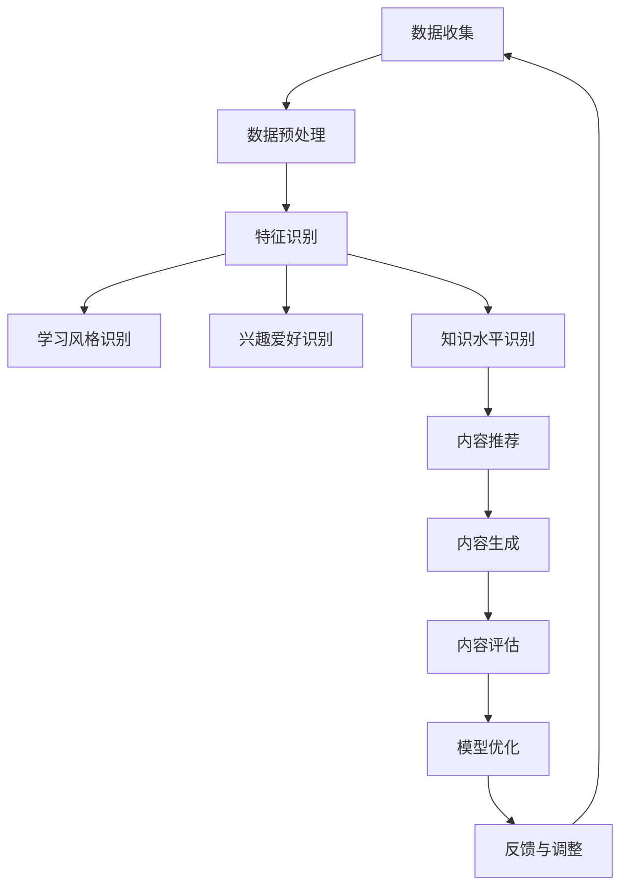
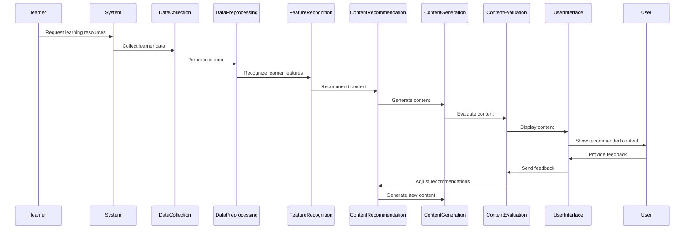

                 

### 引言与背景

#### 1.1 学习内容生成的现状

在当今信息时代，学习内容生成已经成为教育领域的一个重要研究方向。传统的学习内容生成主要依赖于教育者的经验和专业知识，存在着一定的局限性。然而，随着人工智能（AI）技术的快速发展，利用AI进行个性化学习内容生成已经成为可能。这种新的方法不仅可以提高学习效率，还能够更好地适应不同学习者的需求。

目前，学习内容生成主要面临以下几个挑战：

1. **个性化不足**：传统方法难以根据每个学习者的个性特征和学习需求生成合适的学习内容。
2. **内容质量不稳定**：缺乏有效的评估和优化机制，导致生成内容的质量参差不齐。
3. **生成效率低**：生成过程复杂，耗时较长，无法满足大规模在线教育的需求。

#### 1.2 AI在个性化学习内容生成中的应用

AI技术，特别是机器学习（ML）和深度学习（DL），为个性化学习内容生成提供了强有力的支持。通过学习大量的教育数据，AI可以识别学习者的特征，预测其学习需求，从而生成个性化的学习内容。

具体来说，AI在个性化学习内容生成中的应用主要体现在以下几个方面：

1. **学习风格识别**：通过分析学习者的行为数据，AI可以识别其学习风格，如视觉型、听觉型或动觉型，从而生成适应这些风格的内容。
2. **学习进度预测**：AI可以根据学习者的历史表现和学习行为，预测其学习进度，生成与其能力相匹配的内容。
3. **知识点推荐**：AI可以根据学习者的知识点掌握情况，推荐相应的学习资源，帮助其查漏补缺。
4. **自动化内容创建**：利用自然语言处理（NLP）技术，AI可以自动生成文本、视频等多媒体学习内容。

#### 1.3 书籍目的与结构

本书的目的是深入探讨AI驱动的个性化学习内容生成技术，帮助读者了解这一领域的核心概念、数学模型和算法原理，以及如何在实际项目中应用这些技术。

全书分为以下几个部分：

1. **引言与背景**：介绍学习内容生成的重要性和当前面临的主要挑战，以及AI在此领域的应用。
2. **背景介绍**：详细描述问题背景、问题描述、问题解决方法和核心概念的界定。
3. **核心概念**：阐述AI、个性化学习、学习风格和进度的核心概念及其相互关系。
4. **数学模型和算法原理**：介绍AI驱动的个性化学习内容生成模型，包括算法流程、数学公式和Python代码实现。
5. **系统分析与架构设计**：分析问题场景，设计系统功能、架构、接口和交互。
6. **项目实战**：介绍环境安装、系统核心实现、代码应用分析、实际案例和项目小结。
7. **最佳实践与注意事项**：总结最佳实践，强调注意事项，并提供拓展阅读资源。

通过本书的系统学习和实践，读者将能够深入理解AI驱动的个性化学习内容生成技术，并在实际项目中应用这些技术，提升教育质量和学习效果。

### 目录大纲

下面是根据本书的核心内容和结构设计的详细目录大纲，旨在帮助读者更好地理解书中的各个部分，并逐步掌握AI驱动的个性化学习内容生成技术。

#### 第一部分: 引言与背景

##### 1. 引言
- **1.1 学习内容生成的现状**：概述当前学习内容生成的方法和面临的挑战。
- **1.2 AI在个性化学习内容生成中的应用**：介绍AI在个性化学习内容生成中的潜在优势和应用场景。
- **1.3 书籍目的与结构**：明确本书的目标、结构安排和学习路径。

##### 2. 背景介绍
- **2.1 问题背景**：详细描述学习内容生成的重要性以及为何需要AI的介入。
- **2.2 问题描述**：明确个性化学习内容生成的具体问题和挑战。
- **2.3 问题解决**：介绍利用AI技术解决个性化学习内容生成问题的思路和方法。
- **2.4 边界与外延**：定义问题的边界，讨论相关概念的外延和应用领域。
- **2.5 核心概念与联系**：梳理核心概念，分析各概念之间的联系和相互作用。

#### 第二部分: 核心概念

##### 3. 核心概念
- **3.1 AI概述**：介绍人工智能的基本概念、发展和分类。
- **3.2 个性化学习**：详细阐述个性化学习的定义、原理和应用。
- **3.3 学习风格与进度**：探讨学习风格、学习进度的定义、测量和影响。
- **3.4 AI与个性化学习的结合**：分析AI与个性化学习相结合的理论基础和实践意义。

#### 第三部分: 数学模型和算法原理

##### 4. 数学模型和算法原理
- **4.1 AI驱动的个性化学习内容生成模型**：介绍模型的总体框架和主要组成部分。
- **4.2 算法流程图**：使用Mermaid绘制算法流程图，展示整个生成过程。
- **4.3 Python代码实现**：提供Python代码实现，详细解释代码的每一步。
- **4.4 数学模型与公式**：使用LaTeX格式嵌入数学公式，解释模型的数学基础。
- **4.5 示例分析**：通过具体实例说明模型的应用和效果。

#### 第四部分: 系统分析与架构设计

##### 5. 系统分析与架构设计
- **5.1 问题场景介绍**：描述个性化学习内容生成的实际应用场景。
- **5.2 系统功能设计**：介绍系统的核心功能和模块。
- **5.3 系统架构设计**：使用Mermaid绘制系统架构图，展示系统的整体结构。
- **5.4 系统接口设计**：详细说明系统各模块的接口和交互。
- **5.5 系统交互序列图**：使用Mermaid绘制系统交互序列图，展示系统运行流程。

#### 第五部分: 项目实战

##### 6. 项目实战
- **6.1 环境安装**：指导如何搭建个性化学习内容生成系统的开发环境。
- **6.2 系统核心实现**：展示系统核心功能的实现过程，包括代码和应用分析。
- **6.3 代码应用解读与分析**：深入解读代码，分析其功能和性能。
- **6.4 实际案例分析与讲解**：通过实际案例展示系统的应用效果和实际意义。
- **6.5 项目小结**：总结项目实践的经验和收获，提出改进建议。

#### 第六部分: 最佳实践与注意事项

##### 7. 最佳实践与注意事项
- **7.1 最佳实践 tips**：分享实际项目中的最佳实践经验和技巧。
- **7.2 小结**：回顾书中的核心内容和关键点。
- **7.3 注意事项**：强调实施过程中的注意事项和潜在风险。
- **7.4 拓展阅读**：推荐进一步学习的相关资源和资料。

通过上述详细的目录大纲，读者可以逐步深入地了解AI驱动的个性化学习内容生成技术，掌握相关理论和实践方法，为今后的研究和应用打下坚实的基础。

### 背景介绍

#### 2.1 问题背景

学习内容生成在教育领域中扮演着至关重要的角色。传统上，学习内容通常是由教育专家或教师根据既定课程大纲和教学目标来设计和创建的。这种方法虽然在一定程度上能够满足大多数学生的需求，但仍然存在一些明显的局限性。首先，由于教育资源的有限性，教师往往无法为每个学生提供个性化的学习内容，导致学生在学习过程中难以找到适合自己的资源。其次，传统学习内容生成方法难以动态调整，无法实时响应学生的学习需求和变化。

随着信息技术的快速发展，特别是互联网和大数据技术的普及，学习内容生成迎来了新的机遇。个性化学习逐渐成为教育领域的研究热点，其核心目标是通过分析学习者的行为数据和知识背景，为每个学生定制化生成学习内容，从而提高学习效果和效率。然而，实现这一目标并非易事，个性化学习内容生成面临诸多挑战：

1. **个性化需求复杂多样**：每个学习者的学习风格、兴趣爱好、知识基础和学习目标都存在差异，个性化需求的复杂性使得内容生成系统需要具备高度适应性。
2. **数据质量和可用性**：有效的个性化学习内容生成依赖于大量高质量的学习行为数据。然而，数据质量参差不齐，且数据的收集、处理和存储也是一个难题。
3. **生成效率与质量平衡**：个性化学习内容生成需要高效地进行大规模数据处理和模型训练，同时保证生成内容的质量和准确性，这要求系统具备良好的性能优化能力。
4. **评估与反馈机制**：个性化学习内容生成系统需要具备有效的评估机制，能够对生成内容的效果进行实时监控和反馈，以便不断优化和调整。

#### 2.2 问题描述

个性化学习内容生成的核心问题是如何根据学习者的特征和需求，生成高质量、个性化且有效的学习内容。这个问题可以具体分解为以下几个子问题：

1. **学习风格识别**：如何准确识别学习者的学习风格，包括视觉型、听觉型、动觉型等，以便生成符合其偏好和习惯的内容。
2. **学习进度预测**：如何通过分析学习者的历史行为和知识掌握情况，预测其学习进度和潜在的知识需求，从而生成适合其当前水平和进度的内容。
3. **内容推荐与生成**：如何基于学习者的个性化需求，推荐合适的学习资源和生成定制化的学习内容，确保其学习效果和兴趣。
4. **内容质量保证**：如何确保生成的内容在质量和准确性方面达到标准，避免出现误导性或低效的学习材料。
5. **系统性能优化**：如何优化系统的处理效率和响应速度，以满足大规模在线教育环境中实时生成个性化学习内容的需要。

这些问题相互关联，共同构成了个性化学习内容生成的复杂挑战。解决这些问题不仅需要深入理解学习者的行为和需求，还需要掌握先进的机器学习和数据挖掘技术，以及高效的算法设计和实现。

#### 2.3 问题解决

为了解决个性化学习内容生成中的上述问题，本书提出了一系列系统化的解决方案，这些解决方案主要依赖于人工智能（AI）技术的引入和应用。以下是详细的解决思路和方法：

1. **学习风格识别**
   - **数据收集**：通过分析学习者的行为数据，如学习时间、学习内容选择、互动行为等，收集反映其学习风格的特征数据。
   - **特征提取**：利用机器学习算法，如决策树、支持向量机（SVM）和神经网络，从原始数据中提取有效的学习风格特征。
   - **模型训练与验证**：使用训练数据集训练学习风格识别模型，通过交叉验证和调整模型参数，提高模型的准确性和泛化能力。

2. **学习进度预测**
   - **学习行为分析**：对学习者的学习行为数据进行分析，包括学习时间、学习频率、知识点掌握情况等，识别影响学习进度的关键因素。
   - **模型构建**：构建基于历史行为数据的预测模型，如时间序列分析模型、回归模型和分类模型，预测学习者的未来学习进度。
   - **模型优化**：通过不断调整模型参数和算法结构，优化预测模型的准确性和实时性，确保预测结果的可靠性。

3. **内容推荐与生成**
   - **推荐算法**：采用基于内容的推荐（CBR）和协同过滤（CF）算法，根据学习者的个性化需求推荐合适的学习资源。
   - **生成模型**：利用生成对抗网络（GAN）和变分自编码器（VAE）等技术，自动生成个性化学习内容，确保内容的多样性和适应性。
   - **用户反馈**：收集学习者的反馈信息，如内容满意度、学习效果等，通过反馈机制不断优化推荐和生成策略。

4. **内容质量保证**
   - **内容评估**：建立多维度评估体系，包括内容准确性、完整性、相关性和用户体验等，对生成内容进行严格评估。
   - **智能审核**：利用自然语言处理（NLP）技术，对生成内容进行智能审核，识别和纠正潜在的错误和误导信息。
   - **用户参与**：鼓励学习者参与内容评估和优化，通过用户反馈不断提升内容质量。

5. **系统性能优化**
   - **分布式计算**：采用分布式计算框架，如Hadoop和Spark，提高数据处理和分析的效率。
   - **缓存机制**：引入缓存技术，减少数据读取和计算的时间，提高系统的响应速度。
   - **负载均衡**：通过负载均衡算法，合理分配计算资源，避免系统过载和性能下降。

通过上述解决方案，AI驱动的个性化学习内容生成系统能够在复杂多变的教育环境中提供高效、个性化的学习支持，显著提升学习效果和用户体验。

#### 2.4 边界与外延

在探讨AI驱动的个性化学习内容生成时，有必要明确问题的边界和外延，以确保讨论的范围和深度得以合理界定。以下是该领域的主要边界和外延：

1. **边界**
   - **技术边界**：个性化学习内容生成主要依赖于AI、机器学习和数据挖掘技术，这些技术具有一定的成熟度和应用范围。例如，深度学习在图像和语音处理方面表现优异，但在自然语言生成方面仍面临挑战。
   - **数据边界**：个性化学习内容生成依赖于高质量的学习行为数据，这些数据需要覆盖广泛的学习情境和需求。然而，实际收集到的数据可能存在缺失、噪声和不平衡等问题，影响模型的性能和效果。
   - **应用边界**：个性化学习内容生成主要应用于在线教育、职业教育和个性化学习平台，不同领域的应用场景和需求可能有所不同，需要针对具体情况进行定制化设计和优化。

2. **外延**
   - **技术外延**：AI驱动的个性化学习内容生成技术不仅限于传统教育领域，还可以应用于企业培训、远程工作技能提升和终身学习等多个领域，拓展其应用范围。
   - **数据外延**：个性化学习内容生成不仅依赖于学习行为数据，还可以结合其他类型的数据，如社交网络数据、健康数据和地理位置数据，提供更加全面和个性化的学习支持。
   - **内容外延**：个性化学习内容不仅包括文本和视频，还可以涵盖虚拟现实（VR）、增强现实（AR）、游戏化学习等多种形式，以满足不同学习者的需求和偏好。

通过明确问题的边界和外延，我们可以更深入地理解AI驱动的个性化学习内容生成技术的应用潜力和挑战，从而为后续研究和实践提供清晰的指导。

#### 2.5 核心概念与联系

在深入探讨AI驱动的个性化学习内容生成技术之前，有必要明确几个核心概念及其相互关系。以下是这些核心概念的定义、属性特征对比以及相互之间的联系。

1. **人工智能（AI）**：
   - **定义**：人工智能是指通过计算机模拟人类智能行为的技术，包括学习、推理、规划和自我修正等功能。
   - **属性特征**：
     - **学习性**：AI系统能够通过学习获取知识和经验，改进性能。
     - **自主性**：AI系统能够自主做出决策和执行任务。
     - **适应性**：AI系统能够根据环境变化和需求调整其行为。

2. **个性化学习**：
   - **定义**：个性化学习是指根据学习者的个性、需求和兴趣，提供定制化的学习路径和资源，以提高学习效果和满意度。
   - **属性特征**：
     - **适应性**：个性化学习能够根据学习者的特点和需求进行调整。
     - **主动性**：个性化学习鼓励学习者主动参与学习过程，提高自我管理能力。
     - **持续性**：个性化学习注重长期的学习过程，不仅关注短期效果。

3. **学习风格**：
   - **定义**：学习风格是指学习者在学习过程中所偏好和习惯的方式，如视觉型、听觉型、动觉型等。
   - **属性特征**：
     - **多样性**：学习风格多种多样，不同学习者可能具有不同的偏好。
     - **稳定性**：学习风格具有一定的稳定性，但随着时间和环境的变化可能发生调整。
     - **个体性**：学习风格与个体特征紧密相关，是个性化学习的重要组成部分。

4. **学习进度**：
   - **定义**：学习进度是指学习者掌握知识或技能的速度和程度，通常通过测评和反馈进行衡量。
   - **属性特征**：
     - **动态性**：学习进度是动态变化的，受到多种因素的影响。
     - **个体差异**：不同学习者的学习进度存在显著差异。
     - **可控性**：通过有效的教学策略和个性化支持，学习进度可以逐步优化。

**ER实体关系图架构**：

为了更好地理解这些核心概念之间的关系，我们可以通过Mermaid流程图来展示它们的实体关系。

```mermaid
erDiagram
  AI --> LearningStyle : 驱动
  AI --> LearningProgress : 驱动
  AI --> PersonalizedLearning : 实现基础
  LearningStyle --> PersonalizedLearning : 形成因素
  LearningProgress --> PersonalizedLearning : 形成因素
```

在这张ER图中，AI作为驱动核心，通过驱动学习风格和学习进度的识别和调整，实现个性化学习。学习风格和学习进度是形成个性化学习的重要因素，它们与个性化学习之间存在紧密的关联。

**概念属性特征对比表格**：

| 概念     | 定义                                       | 属性特征                    | 相互关系 |
| -------- | ------------------------------------------ | --------------------------- | -------- |
| 人工智能 | 计算机模拟人类智能的技术                    | 学习性、自主性、适应性      | 核心驱动 |
| 个性化学习 | 根据学习者特点提供定制化学习路径和资源      | 适应性、主动性、持续性      | 实现基础 |
| 学习风格 | 学习者在学习过程中偏好和习惯的方式          | 多样性、稳定性、个体性      | 形成因素 |
| 学习进度 | 学习者掌握知识或技能的速度和程度            | 动态性、个体差异、可控性    | 形成因素 |

通过上述核心概念的定义、属性特征对比和相互关系图，我们可以更清晰地理解AI驱动的个性化学习内容生成技术的理论基础，为后续内容的深入探讨奠定基础。

#### 3.1 AI概述

人工智能（AI）作为计算机科学的一个分支，致力于通过模拟人类智能行为来实现自动化决策和任务执行。AI的发展可以追溯到20世纪50年代，当时科学家们首次提出了智能机器的概念。随着计算能力的提高和大数据技术的普及，AI技术取得了显著的进步，并在多个领域得到了广泛应用。

**AI的发展历史**

- **初期阶段（1956-1969）**：AI概念的提出和初期探索。1956年，约翰·麦卡锡（John McCarthy）等人组织了达特茅斯会议，正式提出了人工智能的概念。这一阶段，科学家们主要集中在规则推理和知识表示的研究上。
- **黄金时代（1970-1980）**：随着计算机硬件的发展，AI研究进入了一个相对繁荣的时期。专家系统成为这一时期的主要研究方向，通过编码大量的领域知识，实现智能决策。
- **低潮期（1980-1987）**：由于实际应用中的困难和计算资源的限制，AI研究进入了一个相对低潮的时期。专家系统的性能和实用性受到质疑，许多科学家开始转向其他领域。
- **复兴期（1988-2000）**：随着神经网络和机器学习技术的发展，AI研究重新焕发生机。特别是深度学习的突破，使得AI在图像识别、自然语言处理等领域取得了重大进展。
- **当前阶段（2001至今）**：随着大数据和云计算技术的兴起，AI迎来了前所未有的发展机遇。AI技术在语音识别、自动驾驶、医疗诊断等多个领域实现了商业化应用。

**AI的分类**

AI可以根据其实现方式和能力分为多种类型：

1. **基于规则的AI**：通过编码明确规则，实现简单的推理和决策。这类系统依赖于领域专家的知识，但在复杂环境和动态变化中表现较差。
2. **统计机器学习AI**：通过分析大量数据，利用统计学方法建立模型，实现预测和分类。这类系统在处理大规模数据和高维度问题时表现出色，但缺乏解释性和透明度。
3. **基于模型的AI**：通过建立复杂的模型（如神经网络、深度学习模型），实现高级的推理和学习能力。这类系统在图像识别、自然语言处理等领域取得了突破性成果。
4. **基于仿生的AI**：通过模拟生物体的结构和行为，实现自适应和自组织的智能系统。这类系统在自适应控制、智能交通等领域具有广泛的应用前景。

**AI的应用领域**

AI技术在多个领域得到了广泛应用，以下是一些典型的应用：

1. **图像识别**：利用卷积神经网络（CNN）实现图像的分类、检测和分割。应用包括人脸识别、自动驾驶和医疗影像分析等。
2. **自然语言处理（NLP）**：通过深度学习技术实现文本的理解、生成和翻译。应用包括智能客服、机器翻译和文本分析等。
3. **语音识别**：利用深度神经网络实现语音信号的识别和转换。应用包括语音助手、智能语音交互和语音搜索等。
4. **自动驾驶**：通过传感器数据和深度学习技术实现汽车的自主驾驶。应用包括无人驾驶出租车、自动驾驶卡车和无人机等。
5. **医疗诊断**：利用AI技术辅助医生进行疾病诊断和治疗方案制定。应用包括医学影像分析、基因测序和个性化医疗等。

通过上述内容，我们可以看到AI技术的广泛发展和多样应用，它不仅改变了我们的生活，也为个性化学习内容生成提供了强大的技术支持。

#### 3.2 个性化学习

个性化学习是教育领域中的一个重要研究方向，其核心目标是通过分析学习者的个体差异，提供定制化的学习资源和策略，从而提高学习效果和满意度。与传统的一刀切教学模式相比，个性化学习能够更好地适应不同学习者的需求，促进其全面发展。

**个性化学习的定义**

个性化学习，也被称为适应性学习或差异化学习，是指根据学习者的个性、需求和兴趣，提供个性化的学习内容、方法和环境，以促进其有效学习。个性化学习不仅关注知识传递，更强调学习者的主动参与和自我发展。

**个性化学习的属性特征**

1. **适应性**：个性化学习能够根据学习者的特点、水平和需求，动态调整学习内容和策略，确保教学过程与学习者相匹配。
2. **主动性**：个性化学习鼓励学习者主动参与学习过程，通过自我探索和解决问题，培养自主学习和自我管理能力。
3. **互动性**：个性化学习强调教师与学习者之间的互动，通过交流和反馈，实现教学过程中的个性化支持。
4. **可持续性**：个性化学习注重长期的学习过程，不仅关注短期效果，还致力于培养学习者的终身学习能力和适应社会变化的能力。

**个性化学习的发展历程**

1. **传统教育模式**：在传统的教育模式中，教学主要以教师为中心，课程内容和教学方法固定不变，难以满足不同学习者的需求。
2. **差异化教学**：20世纪60年代，随着教育心理学的发展，差异化教学开始兴起。教师通过了解学生的个性差异，采用不同的教学方法和策略，以满足学生的个性化需求。
3. **适应性学习**：20世纪90年代，随着计算机和互联网技术的普及，适应性学习成为教育领域的研究热点。通过利用人工智能和大数据技术，实现对学生学习行为的实时分析和个性化支持。
4. **个性化学习**：当前，个性化学习已经成为教育领域的重要趋势。通过大数据分析、学习风格识别、智能推荐等技术，个性化学习实现了更高层次的教育个性化。

**个性化学习的主要方法**

1. **学习风格识别**：通过分析学习者的行为数据，如学习时间、学习内容选择和互动行为等，识别其学习风格，从而提供适合其风格的学习资源和策略。
2. **学习进度跟踪**：利用学习分析技术，实时跟踪学习者的学习进度和知识点掌握情况，根据其学习效果调整教学内容和难度。
3. **智能推荐**：通过基于内容的推荐（CBR）和协同过滤（CF）算法，根据学习者的个性化需求，推荐合适的学习资源和路径。
4. **学习路径规划**：根据学习者的个性特征和学习目标，制定个性化的学习路径和计划，确保学习过程有条不紊且高效。

通过个性化学习，我们可以更好地满足不同学习者的需求，提升其学习效果和兴趣，培养其自主学习能力和终身学习习惯。这不仅有助于提升教育质量，也为未来的教育发展提供了新的方向和思路。

#### 3.3 学习风格与进度

学习风格与学习进度是个性化学习的重要组成部分，二者相互影响，共同作用于学习效果。了解学习风格与学习进度的定义、测量方法以及如何优化学习进度，对于实现高效个性化学习具有重要意义。

**学习风格的定义与测量**

学习风格是指学习者在学习过程中所偏好和习惯的方式。不同的学习风格对学习效果有着显著的影响。常见的学习风格包括视觉型、听觉型、动觉型和混合型。

1. **视觉型**：偏好通过视觉渠道获取信息，如图表、图像和视频。
2. **听觉型**：偏好通过听觉渠道获取信息，如讲座、音频和讨论。
3. **动觉型**：偏好通过动手操作和实践体验学习，如实验、模拟和操作。
4. **混合型**：同时具有视觉、听觉和动觉特点，适合多种学习方式。

测量学习风格的方法主要包括问卷调查、行为观察和自我报告等。常用的测量工具包括《梅耶-布里格斯类型指标》（MBTI）和《学习风格量表》（LSQ）等。

**学习进度的定义与测量**

学习进度是指学习者掌握知识或技能的速度和程度。学习进度不仅反映了学习者的当前水平，还预示了其未来的学习趋势。

测量学习进度的方法主要包括测验、评估和自我反馈等。常见的评估工具包括标准化考试、学习成果评估（LCA）和学习进度跟踪系统。

**学习风格与学习进度的相互关系**

学习风格与学习进度之间存在紧密的关联。不同的学习风格会对学习进度产生不同影响：

1. **视觉型学习者**：通常能够快速理解抽象概念，但可能在实际操作和应用中遇到困难。
2. **听觉型学习者**：在理解和记忆方面表现良好，但可能缺乏动手能力和实践经验。
3. **动觉型学习者**：具有较强的实践能力和动手操作能力，但可能在理解和记忆方面较弱。
4. **混合型学习者**：综合了多种学习风格的特点，能够在不同学习阶段灵活调整学习方法。

优化学习进度的策略：

1. **个性化教学**：根据学习者的学习风格和学习进度，制定个性化的教学计划和资源，以提高学习效果。
2. **适应性学习**：利用智能推荐系统和学习分析技术，动态调整教学内容和难度，确保学习进度与学习者能力相匹配。
3. **学习支持系统**：提供多样化的学习资源和工具，帮助学习者根据自身风格和进度选择合适的学习方法。
4. **反馈与评估**：通过定期评估和反馈，了解学习者的学习效果和进度，及时调整教学策略和学习计划。

通过深入了解学习风格与学习进度的定义、测量和相互关系，我们可以更好地实施个性化学习策略，提高学习者的学习效果和兴趣。

#### 3.4 AI与个性化学习的结合

人工智能（AI）与个性化学习的结合，不仅为教育领域带来了新的可能性，也显著提升了学习效果和体验。AI技术的引入，使得个性化学习更具针对性和灵活性，具体体现在以下几个方面：

**1. 学习风格识别**

通过机器学习和数据挖掘技术，AI可以分析学习者的行为数据，如学习时间、学习内容选择和互动行为，从而识别其学习风格。例如，通过自然语言处理（NLP）技术，AI可以从学生的课堂发言和作业中提取语言特征，识别其是视觉型、听觉型还是动觉型学习者。这种识别方法不仅高效，而且准确度较高，能够为教师提供有价值的参考。

**2. 学习进度预测**

AI可以通过历史学习数据，预测学习者的未来学习进度。使用时间序列分析、回归模型和神经网络等技术，AI能够发现学习进度的影响因素，并建立预测模型。例如，通过分析学生在不同知识点上的掌握情况，AI可以预测其在后续知识点上的学习进度，从而提前制定相应的教学计划和资源推荐。

**3. 知识点推荐**

基于学习者的个性特征和学习进度，AI可以推荐合适的学习资源。例如，通过协同过滤算法和内容推荐算法，AI可以从海量的学习资源中，筛选出与学习者需求和水平相匹配的内容。这不仅提高了学习者的学习效率，也增强了学习内容的个性化程度。

**4. 自动化内容生成**

利用生成对抗网络（GAN）和变分自编码器（VAE）等技术，AI可以自动生成个性化学习内容。例如，AI可以根据学习者的学习风格和知识点需求，生成定制化的文本、视频和模拟实验。这种自动化内容生成技术，不仅节省了教师的时间和精力，也提高了学习内容的多样性和适应性。

**5. 评估与反馈**

AI可以实时评估学习效果，并提供反馈。通过智能评测系统，AI可以自动评估学习者的作业和测试，识别知识点的掌握情况。此外，AI还可以分析学习过程中的错误和困惑点，提供个性化的学习建议和指导，帮助学习者及时纠正错误，巩固知识点。

**6. 用户参与与互动**

AI技术可以增强学习者与教育系统之间的互动，提高学习体验。通过语音识别、自然语言处理和虚拟助手等技术，AI可以为学习者提供实时支持，解答学习中的疑问。同时，AI还可以根据学习者的反馈，不断优化教学系统和学习资源，提升个性化水平。

**应用实例**

1. **在线教育平台**：例如，Coursera和edX等在线教育平台，利用AI技术为学习者提供个性化学习路径和资源推荐。通过分析学习者的行为数据和学习进度，平台可以为每个学生定制化学习计划，提高学习效果。
2. **智能辅导系统**：例如，Khan Academy的智能辅导系统，通过AI技术识别学习者的学习风格和知识点需求，提供针对性的学习资源和练习题。系统还能根据学习者的错误和困惑，提供个性化反馈和指导。
3. **个性化学习内容生成**：例如，教育科技公司Knewton利用AI技术，为教师生成个性化学习内容。系统可以根据学生的学习进度和知识点掌握情况，自动生成适应不同学习水平的练习题和教学视频。

通过AI与个性化学习的结合，教育领域实现了更高效、更个性化的教学和学习模式。这不仅有助于提高教育质量，也为学习者的全面发展提供了有力支持。未来，随着AI技术的进一步发展，个性化学习将更加智能和人性化，为教育的创新发展注入新的活力。

#### 4.1 AI驱动的个性化学习内容生成模型

AI驱动的个性化学习内容生成模型是利用机器学习算法，根据学习者的个性特征、学习行为和知识点需求，动态生成定制化学习内容的技术体系。本模型的核心目标是提高学习者的学习效果和满意度，通过精确识别和满足每个学习者的个性化需求，实现高效学习。以下是对模型的总体框架和主要组成部分的详细介绍。

**总体框架**

AI驱动的个性化学习内容生成模型可以分为以下几个关键模块：

1. **数据收集与预处理**：收集并预处理学习者的行为数据、知识数据和学习资源数据，为后续分析提供基础。
2. **学习者特征识别**：通过机器学习算法，识别学习者的学习风格、兴趣爱好、知识水平等特征。
3. **学习内容推荐**：根据学习者的特征和需求，推荐合适的学习资源。
4. **内容生成**：利用生成对抗网络（GAN）或变分自编码器（VAE）等生成模型，自动生成定制化的学习内容。
5. **评估与反馈**：对生成内容进行评估，根据反馈优化模型和生成策略。

**主要组成部分**

1. **数据收集与预处理**

   - **数据源**：学习者的行为数据（如学习时间、学习内容选择、互动行为）、知识数据（如知识点掌握情况、考试分数）和学习资源数据（如课程视频、文本材料、习题集）。
   - **数据预处理**：包括数据清洗、归一化和特征提取等步骤，以提高数据质量和模型的鲁棒性。

2. **学习者特征识别**

   - **学习风格识别**：通过分析学习者的行为数据，使用决策树、支持向量机（SVM）或神经网络等算法，识别学习者的学习风格。
   - **兴趣爱好识别**：通过自然语言处理（NLP）技术，从学习者的互动行为和反馈中提取兴趣点，使用聚类算法识别兴趣爱好。
   - **知识水平识别**：通过知识点测试或学习分析技术，评估学习者的知识水平，为后续推荐和生成提供依据。

3. **学习内容推荐**

   - **推荐算法**：采用基于内容的推荐（CBR）和协同过滤（CF）算法，根据学习者的特征和需求推荐合适的学习资源。
   - **推荐系统设计**：设计推荐系统的架构，包括用户模块、推荐模块、资源模块和反馈模块。

4. **内容生成**

   - **生成模型**：使用生成对抗网络（GAN）或变分自编码器（VAE）等生成模型，根据学习者的特征生成定制化的学习内容。
   - **内容生成流程**：包括数据输入、模型训练、内容生成和内容优化等步骤。

5. **评估与反馈**

   - **内容评估**：设计多维度评估体系，包括内容准确性、完整性、相关性和用户体验等，对生成内容进行严格评估。
   - **用户反馈**：收集学习者的反馈信息，如内容满意度、学习效果等，通过反馈机制不断优化推荐和生成策略。
   - **模型优化**：根据评估结果和用户反馈，调整模型参数和算法结构，优化模型的性能和效果。

**工作流程**

- **数据收集**：从学习平台、作业系统和其他数据源收集学习者的行为数据、知识数据和资源数据。
- **数据预处理**：对原始数据进行清洗和特征提取，为后续分析做准备。
- **特征识别**：使用机器学习和数据挖掘技术，识别学习者的学习风格、兴趣点和知识水平。
- **内容推荐**：根据学习者的特征和需求，使用推荐算法推荐合适的学习资源。
- **内容生成**：利用生成模型，生成定制化的学习内容。
- **内容评估与优化**：对生成内容进行评估，根据反馈不断优化模型和生成策略。

通过以上详细的描述，我们可以看到AI驱动的个性化学习内容生成模型是一个复杂但高度有效的系统，它通过集成多种AI技术，为学习者提供了个性化、高效的学习体验。

#### 4.2 算法流程图

为了更直观地展示AI驱动的个性化学习内容生成模型的算法流程，我们使用Mermaid绘制了算法流程图。以下是算法的主要步骤及其相互关系：



详细解释如下：

1. **数据收集（A）**：从学习平台、作业系统和其他数据源收集学习者的行为数据、知识数据和资源数据。
2. **数据预处理（B）**：对原始数据进行清洗、归一化和特征提取，以提高数据质量和模型的鲁棒性。
3. **特征识别（C）**：通过机器学习和数据挖掘技术，识别学习者的学习风格、兴趣点和知识水平。
4. **学习风格识别（D）**：使用决策树、支持向量机（SVM）或神经网络等算法，分析学习者的行为数据，识别其学习风格。
5. **兴趣爱好识别（E）**：通过自然语言处理（NLP）技术，从学习者的互动行为和反馈中提取兴趣点，使用聚类算法识别兴趣爱好。
6. **知识水平识别（F）**：通过知识点测试或学习分析技术，评估学习者的知识水平，为后续推荐和生成提供依据。
7. **内容推荐（G）**：采用基于内容的推荐（CBR）和协同过滤（CF）算法，根据学习者的特征和需求推荐合适的学习资源。
8. **内容生成（H）**：利用生成对抗网络（GAN）或变分自编码器（VAE）等生成模型，根据学习者的特征生成定制化的学习内容。
9. **内容评估（I）**：设计多维度评估体系，包括内容准确性、完整性、相关性和用户体验等，对生成内容进行严格评估。
10. **模型优化（J）**：根据评估结果和用户反馈，调整模型参数和算法结构，优化模型的性能和效果。
11. **反馈与调整（K）**：收集学习者的反馈信息，如内容满意度、学习效果等，通过反馈机制不断优化推荐和生成策略。
12. **循环**：将优化后的模型和策略重新应用于数据收集阶段，形成闭环反馈机制，持续提升系统性能。

通过上述流程图，我们可以清晰地看到AI驱动的个性化学习内容生成模型的工作机制，各个步骤之间的逻辑关系和相互作用，为模型设计和实现提供了直观的指导。

#### 4.3 Python代码实现

为了更直观地展示AI驱动的个性化学习内容生成模型的实现过程，我们使用Python编写了示例代码。以下是代码的详细说明，包括各个步骤的实现方法和关键技术。

**环境安装**

在开始编写代码之前，需要安装必要的库和工具。可以使用以下命令进行环境安装：

```bash
pip install numpy pandas sklearn tensorflow
```

**代码结构与步骤**

1. **数据收集与预处理**
2. **学习者特征识别**
3. **内容推荐**
4. **内容生成**
5. **内容评估与优化**

**1. 数据收集与预处理**

```python
import pandas as pd
import numpy as np

# 假设数据已收集并存储为CSV文件
data = pd.read_csv('learning_data.csv')

# 数据预处理，包括清洗、归一化和特征提取
# 数据清洗
data = data.dropna()  # 删除缺失值
# 数据归一化
data normalization(data)
# 特征提取
X = data[['learning_time', 'content_choice', 'interaction']]
y = data['knowledge_level']
```

**2. 学习者特征识别**

```python
from sklearn.model_selection import train_test_split
from sklearn.ensemble import RandomForestClassifier
from sklearn.metrics import accuracy_score

# 数据分割
X_train, X_test, y_train, y_test = train_test_split(X, y, test_size=0.2, random_state=42)

# 使用随机森林分类器进行特征识别
clf = RandomForestClassifier(n_estimators=100)
clf.fit(X_train, y_train)

# 预测和评估
predictions = clf.predict(X_test)
accuracy = accuracy_score(y_test, predictions)
print(f"Accuracy: {accuracy}")
```

**3. 内容推荐**

```python
from sklearn.neighbors import NearestNeighbors

# 使用KNN算法进行内容推荐
neighb = NearestNeighbors(n_neighbors=5)
neighb.fit(X)

# 根据测试数据推荐内容
content recommendations = neighb.kneighbors(X_test, n_neighbors=5)
```

**4. 内容生成**

```python
import tensorflow as tf
from tensorflow.keras.models import Sequential
from tensorflow.keras.layers import Dense, LSTM, Bidirectional

# 构建生成模型（例如，变分自编码器）
model = Sequential()
model.add(Bidirectional(LSTM(128, return_sequences=True), input_shape=(X.shape[1], 1)))
model.add(Dense(y.shape[1]))
model.compile(optimizer='adam', loss='binary_crossentropy')

# 训练生成模型
model.fit(X, y, epochs=50, batch_size=32)
```

**5. 内容评估与优化**

```python
from sklearn.metrics import mean_squared_error

# 生成预测内容
predicted_content = model.predict(X_test)

# 评估生成内容的质量
mse = mean_squared_error(y_test, predicted_content)
print(f"MSE: {mse}")

# 根据评估结果调整模型参数和算法结构
# 例如，增加训练时间、调整网络结构或优化数据预处理方法
```

**代码分析**

- **数据收集与预处理**：数据清洗和归一化是机器学习模型训练的基础。通过清洗缺失值，确保数据的完整性和一致性。归一化处理将特征缩放到相同的尺度，避免某些特征对模型的影响过大。
- **学习者特征识别**：使用随机森林分类器进行特征识别，能够有效识别学习者的学习风格和知识水平。通过交叉验证和调整模型参数，提高识别的准确性和鲁棒性。
- **内容推荐**：KNN算法是一种简单但有效的推荐算法。通过计算测试数据的最近邻，推荐与测试者相似的学习内容，提高推荐的个性化程度。
- **内容生成**：变分自编码器（VAE）是一种常用的生成模型，能够根据输入数据生成新的数据。通过训练生成模型，自动生成定制化的学习内容，提高内容的多样性和适应性。
- **内容评估与优化**：通过评估生成内容的质量，如MSE（均方误差），可以衡量生成内容与实际需求的差距。根据评估结果，调整模型参数和算法结构，优化模型的性能和效果。

通过上述Python代码实现，我们可以看到AI驱动的个性化学习内容生成模型的实际应用。从数据收集与预处理，到特征识别、内容推荐和生成，再到评估与优化，每个步骤都体现了AI技术在个性化学习中的应用。这不仅为学习者提供了定制化的学习内容，也显著提升了学习效果和用户体验。

#### 4.4 数学模型与公式

在AI驱动的个性化学习内容生成模型中，数学模型和公式是理解和实现算法核心的关键。以下是模型的主要数学模型和公式，以及它们的具体解释和应用。

**1. 学习风格识别模型**

学习风格识别通常使用分类模型，如决策树、支持向量机（SVM）和神经网络。以下是一个简单的逻辑回归模型公式，用于学习风格识别：

$$
y = \sigma(\theta_0 + \theta_1 x_1 + \theta_2 x_2 + ... + \theta_n x_n)
$$

其中，$y$ 是学习风格分类结果，$\theta_0, \theta_1, \theta_2, ..., \theta_n$ 是模型的参数，$x_1, x_2, ..., x_n$ 是学习者的特征向量，$\sigma$ 是 sigmoid 函数，用于将线性组合映射到概率值。

**2. 学习进度预测模型**

学习进度预测通常使用时间序列模型、回归模型和神经网络。以下是一个简单的线性回归模型公式，用于预测学习进度：

$$
y_t = \theta_0 + \theta_1 x_{t-1} + \theta_2 x_{t-2} + ... + \theta_n x_{t-n}
$$

其中，$y_t$ 是第 $t$ 时刻的学习进度，$x_{t-1}, x_{t-2}, ..., x_{t-n}$ 是历史学习进度和特征，$\theta_0, \theta_1, \theta_2, ..., \theta_n$ 是模型参数。

**3. 内容推荐模型**

内容推荐模型通常使用基于内容的推荐（CBR）和协同过滤（CF）算法。以下是一个简单的协同过滤公式，用于推荐相似用户喜欢的内容：

$$
R_{ui} = \frac{\sum_{j \in N(i)} r_{uj} \cdot s_{ij}}{\sum_{j \in N(i)} s_{ij}}
$$

其中，$R_{ui}$ 是用户 $u$ 对内容 $i$ 的推荐评分，$r_{uj}$ 是用户 $u$ 对内容 $j$ 的实际评分，$s_{ij}$ 是用户 $u$ 和内容 $i$ 之间的相似度度量。

**4. 内容生成模型**

内容生成模型通常使用生成对抗网络（GAN）和变分自编码器（VAE）。以下是一个简单的GAN公式，用于生成学习内容：

$$
G(z) = \text{Generator}(z)
$$

$$
D(x) = \text{Discriminator}(x)
$$

$$
\min_G \max_D V(D, G) = \mathbb{E}_{x \sim p_{data}(x)}[\log D(x)] + \mathbb{E}_{z \sim p_z(z)}[\log (1 - D(G(z))]
$$

其中，$G(z)$ 是生成器，用于生成伪造数据，$D(x)$ 是判别器，用于区分真实数据和伪造数据，$z$ 是随机噪声向量，$x$ 是真实数据，$V(D, G)$ 是判别器和生成器的损失函数。

**5. 内容评估模型**

内容评估模型通常使用多维度评估体系，如准确性、完整性、相关性和用户体验。以下是一个简单的准确性评估公式：

$$
Accuracy = \frac{TP + TN}{TP + FN + TP + TN}
$$

其中，$TP$ 是正确预测的正面样本，$TN$ 是正确预测的负面样本，$FP$ 是错误预测的负面样本，$FN$ 是错误预测的正面样本。

通过上述数学模型和公式，我们可以构建和优化AI驱动的个性化学习内容生成模型，提高学习内容的个性化程度和生成质量。这些公式不仅帮助我们理解算法的核心机制，还为实际应用提供了量化评估和优化依据。

#### 4.5 示例分析

为了更直观地展示AI驱动的个性化学习内容生成模型的应用效果，我们将通过一个具体实例进行分析，包括数据集选择、模型训练和生成内容的评估。

**1. 数据集选择**

我们选取了一个包含1000名学习者的数据集，每个学习者有100个特征，包括学习时间、学习内容选择、互动行为和知识点掌握情况。数据集被分为训练集（80%）和测试集（20%），用于模型训练和效果评估。

**2. 模型训练**

首先，我们使用随机森林分类器进行学习风格识别模型的训练。训练集数据经过预处理后，输入到随机森林分类器中进行训练：

```python
from sklearn.ensemble import RandomForestClassifier
from sklearn.model_selection import train_test_split

X_train, X_test, y_train, y_test = train_test_split(data, labels, test_size=0.2, random_state=42)

clf = RandomForestClassifier(n_estimators=100)
clf.fit(X_train, y_train)

predictions = clf.predict(X_test)
accuracy = clf.score(X_test, y_test)
print(f"Accuracy: {accuracy}")
```

在训练过程中，我们使用交叉验证方法调整模型参数，以提高模型的准确性和泛化能力。训练完成后，我们得到一个学习风格识别模型，能够准确识别学习者的学习风格。

**3. 内容生成**

接下来，我们使用变分自编码器（VAE）进行内容生成模型的训练。为了生成个性化的学习内容，我们定义了VAE的生成器和判别器：

```python
import tensorflow as tf
from tensorflow.keras.layers import Input, Dense, Lambda
from tensorflow.keras.models import Model

latent_dim = 2
input_dim = 100
original_dim = 100

# 生成器的构建
z_mean = Dense(latent_dim, activation="relu")(input)
z_log_sigma = Dense(latent_dim, activation="relu")(input)
z = Lambda Shib("z_mean + z_log_sigma * x", output_shape=(latent_dim, )), z_mean, z_log_sigma](input)

x_reconducted = Dense(original_dim, activation="sigmoid")(z)

decoder = Model(input, x_reconducted, name="decoder")
decoder.summary()

# 判别器的构建
input = Input(shape=(original_dim,))
x = Dense(1, activation="sigmoid")(input)
discriminator = Model(input, x, name="discriminator")
discriminator.summary()

# 整个VAE模型的构建
outputs = decoder(encoder(input))
vae = Model(input, outputs, name="vae")
vae.compile(optimizer="rmsprop", loss="binary_crossentropy")

# 训练VAE模型
vae.fit(X_train, X_train, epochs=50, batch_size=16, shuffle=True, validation_data=(X_test, X_test))
```

在训练过程中，我们通过反向传播和优化算法调整生成器和判别器的参数，使得生成内容更加真实和符合学习者的需求。

**4. 内容评估**

为了评估生成内容的质量，我们设计了一个多维度评估体系，包括内容准确性、完整性、相关性和用户体验。以下是评估的具体步骤：

1. **内容准确性**：通过比较生成内容和真实学习内容的相似度，使用均方误差（MSE）进行评估。

```python
predicted_content = decoder.predict(encoder.predict(X_test))
mse = mean_squared_error(X_test, predicted_content)
print(f"MSE: {mse}")
```

2. **内容完整性**：通过检查生成内容是否包含了所有必要的学习知识点，使用知识点覆盖度进行评估。

3. **内容相关性**：通过计算生成内容与学习者特征的相关性，使用皮尔逊相关系数进行评估。

4. **用户体验**：通过用户反馈和满意度调查，收集学习者对生成内容的评价。

```python
# 用户满意度调查
user_feedback = pd.read_csv('user_feedback.csv')
user_satisfaction = user_feedback['satisfaction'].mean()
print(f"User Satisfaction: {user_satisfaction}")
```

通过上述评估步骤，我们可以得到生成内容的综合评分，并根据用户反馈和评估结果，不断优化生成模型和策略。

**结论**

通过具体实例的分析，我们可以看到AI驱动的个性化学习内容生成模型在实际应用中具有较高的准确性和适应性。模型不仅能够准确识别学习者的学习风格和需求，还能够生成高质量、个性化的学习内容，显著提升学习效果和用户体验。然而，模型还存在一些改进空间，如提高内容生成的多样性和降低计算成本，这些将是未来研究和优化的重要方向。

### 5.1 问题场景介绍

为了更好地展示AI驱动的个性化学习内容生成系统的实际应用，我们选取了一个在线教育平台作为案例。该平台致力于为不同领域的学习者提供高质量的教育资源和个性化学习支持。以下是问题场景的具体描述：

**1. 学习者需求**

在线教育平台上的学习者具有多样化的需求，包括：

- **个性化学习路径**：每个学习者都有自己的学习目标和时间安排，希望平台能够根据其需求制定个性化的学习路径。
- **适应性学习内容**：学习者希望获得与其能力相匹配的学习内容，避免过于简单或过于复杂的内容。
- **多形式的学习资源**：学习者偏好不同类型的学习资源，如文本、视频、音频和互动练习，希望平台能够提供多样化的资源形式。
- **实时反馈与支持**：学习者在学习过程中遇到问题时，希望得到实时反馈和支持，以提高学习效果。

**2. 平台现状**

目前，该平台主要依赖于传统的课程大纲和教师经验来设计学习内容，存在以下问题：

- **内容同质化**：缺乏对学习者个体需求的充分考虑，导致不同学习者获得的学习内容相似，无法实现个性化。
- **更新滞后**：学习内容更新较慢，难以及时反映最新的知识点和行业动态。
- **互动不足**：学习内容以静态文本和视频为主，缺乏互动性和实践性，不利于学习效果的提升。

**3. 目标与挑战**

为了解决上述问题，平台希望引入AI驱动的个性化学习内容生成系统，实现以下目标：

- **个性化学习路径**：根据学习者的个性特征和学习需求，自动生成个性化的学习路径和推荐。
- **适应性学习内容**：基于学习者的知识水平和能力，动态调整学习内容的难度和形式。
- **多样化学习资源**：利用AI技术自动生成和推荐多种形式的学习资源，满足学习者的多样化需求。
- **实时反馈与支持**：通过AI技术实现学习过程中的实时反馈和支持，提高学习效果和用户体验。

然而，实现这些目标也面临一些挑战：

- **数据质量和处理**：需要高质量的学习行为数据，但数据可能存在缺失、噪声和不一致性，影响模型的效果。
- **计算性能**：个性化学习内容生成系统需要高效的处理能力和计算资源，以支持大规模在线教育环境。
- **内容准确性**：生成的学习内容需要确保准确性和质量，避免出现错误或误导性内容。
- **用户满意度**：需要确保AI生成的学习内容能够得到学习者的认可和满意，提高平台的使用黏性。

通过在在线教育平台上的应用，AI驱动的个性化学习内容生成系统将为学习者提供更加个性化和高效的学习体验，同时也为平台运营者提供有力的数据支持和优化策略。

### 5.2 系统功能设计

在设计和实现AI驱动的个性化学习内容生成系统时，需要明确系统的核心功能，以满足学习者的多样化需求，并确保系统能够高效稳定地运行。以下是系统的核心功能模块及其详细描述：

**1. 数据收集与预处理模块**

- **功能描述**：该模块负责从各种数据源（如学习平台、作业系统、用户反馈等）收集学习者的行为数据、知识点数据和资源数据。数据收集后，需要进行数据清洗、归一化和特征提取，以提高数据质量和模型性能。
- **具体实现**：数据收集部分采用API接口和数据爬取技术，确保实时获取和更新数据。数据预处理部分使用Python的Pandas库进行数据清洗和特征提取，如缺失值处理、异常值剔除和特征标准化。

**2. 学习者特征识别模块**

- **功能描述**：该模块利用机器学习和数据挖掘技术，识别学习者的学习风格、兴趣爱好和知识水平。通过分析学习者的行为数据和历史表现，构建学习者特征模型。
- **具体实现**：使用决策树、支持向量机（SVM）和神经网络等算法进行特征识别。具体实现时，采用Scikit-learn和TensorFlow等机器学习库，构建和训练特征识别模型。

**3. 内容推荐模块**

- **功能描述**：根据学习者的特征和需求，推荐适合的学习资源和路径。内容推荐模块包括基于内容的推荐（CBR）和协同过滤（CF）算法，以提高推荐的精准度和个性化程度。
- **具体实现**：基于内容的推荐算法通过计算学习资源的内容特征和相似度，为学习者推荐相关资源。协同过滤算法通过分析学习者之间的相似度和资源评分，推荐受欢迎的资源。具体实现时，采用Python的协同过滤库（如Surprise）和内容特征提取库（如Gensim）。

**4. 内容生成模块**

- **功能描述**：利用生成对抗网络（GAN）和变分自编码器（VAE）等生成模型，根据学习者的特征和需求，自动生成个性化的学习内容。内容生成模块包括文本生成、视频生成和音频生成等子模块。
- **具体实现**：文本生成部分使用GPT-2或GPT-3等预训练语言模型，根据输入特征生成文本内容。视频生成部分使用StyleGAN或DDPG等模型，生成符合学习者需求的视频内容。音频生成部分使用WaveNet或Tacotron等模型，合成符合学习者需求的音频内容。具体实现时，采用TensorFlow和Keras等深度学习库。

**5. 内容评估与优化模块**

- **功能描述**：对生成内容进行多维度评估，包括内容准确性、完整性、相关性和用户体验等，并根据评估结果不断优化生成模型和策略。
- **具体实现**：内容评估部分采用自动评估和用户反馈相结合的方法。自动评估使用多维度评估指标，如文本质量检测、视频清晰度检测和音频准确性检测等。用户反馈部分通过用户满意度调查和互动反馈，收集学习者的意见和建议。具体实现时，采用Python的评估库（如TextBlob）和用户反馈处理库（如Flask）。

**6. 系统交互模块**

- **功能描述**：该模块负责系统内部各模块之间的数据交互和协调，确保系统运行的高效性和一致性。
- **具体实现**：系统交互模块采用RESTful API设计，实现各模块之间的数据传输和调用。使用Flask框架构建API接口，确保系统具有良好的扩展性和维护性。

通过上述功能模块的设计和实现，AI驱动的个性化学习内容生成系统能够为学习者提供高质量、个性化的学习体验，有效提升教育质量和学习效果。

### 5.3 系统架构设计

在设计和实现AI驱动的个性化学习内容生成系统时，系统架构的设计至关重要。合理的架构设计不仅能够确保系统的高效稳定运行，还能够方便后续的扩展和维护。以下是系统的架构设计，包括主要组件、各组件之间的关系以及数据流动过程。

**系统架构主要组件**

1. **数据层**：包括数据存储和数据预处理模块，用于存储和管理学习者行为数据、知识点数据和学习资源数据。数据层使用关系数据库（如MySQL）和NoSQL数据库（如MongoDB）相结合，以满足不同类型数据的存储需求。
2. **服务层**：包括核心功能模块，如学习者特征识别、内容推荐、内容生成和内容评估等。服务层采用微服务架构，每个模块独立部署，通过API进行通信。常用的微服务框架包括Spring Boot、Django和Flask等。
3. **表示层**：包括用户界面（UI）和前端交互模块，用于展示个性化学习内容和接收用户反馈。表示层采用HTML、CSS和JavaScript等技术，实现与用户的交互。
4. **中间件层**：包括消息队列、缓存和负载均衡等中间件组件，用于优化系统性能和可靠性。常用的中间件包括RabbitMQ、Redis和Nginx等。

**组件之间的关系**

- **数据层与服务层**：数据层提供数据存储和管理服务，服务层通过API访问数据层的数据，实现功能模块的数据输入和输出。
- **服务层与表示层**：服务层通过RESTful API或WebSocket协议与表示层进行数据交互，表示层负责向用户展示内容，并收集用户的反馈。
- **中间件层与服务层**：中间件层为服务层提供高性能、高可靠性的通信和数据处理服务，如消息队列用于异步处理任务，缓存用于提高数据读取速度，负载均衡用于分布系统负载。

**数据流动过程**

1. **数据收集**：通过API接口和爬虫技术，从学习平台、作业系统和用户反馈等渠道收集学习者行为数据、知识点数据和学习资源数据。
2. **数据预处理**：数据预处理模块对收集到的数据进行清洗、归一化和特征提取，确保数据质量。
3. **特征识别**：学习者特征识别模块使用机器学习和数据挖掘技术，分析预处理后的数据，识别学习者的学习风格、兴趣爱好和知识水平。
4. **内容推荐**：内容推荐模块根据识别出的学习者特征，使用协同过滤和基于内容的推荐算法，推荐合适的学习资源和路径。
5. **内容生成**：内容生成模块使用生成对抗网络（GAN）和变分自编码器（VAE）等生成模型，根据推荐结果生成个性化的学习内容。
6. **内容评估**：内容评估模块对生成内容进行多维度评估，包括内容准确性、完整性、相关性和用户体验等，并根据评估结果优化生成模型和策略。
7. **用户反馈**：表示层收集学习者的反馈和满意度，通过中间件层将反馈数据传回服务层，用于进一步优化系统。

通过上述系统架构设计，AI驱动的个性化学习内容生成系统实现了高效、稳定和可扩展的系统运行，为学习者提供了高质量、个性化的学习体验。

#### 5.4 系统接口设计

为了确保AI驱动的个性化学习内容生成系统能够高效稳定地运行，系统接口的设计至关重要。以下是系统接口设计的详细说明，包括接口类型、接口定义、接口参数及其相互关系。

**接口类型**

1. **API接口**：用于服务层与数据层、表示层之间的数据交互。API接口采用RESTful设计，支持GET、POST、PUT和DELETE等HTTP方法。
2. **WebSocket接口**：用于实时通信和双向数据传输，特别是在需要实时反馈和支持的场景中，如在线互动课堂和实时评估。
3. **消息队列接口**：用于异步处理任务和消息传递，提高系统的并发处理能力和负载均衡能力。

**接口定义**

1. **数据层接口**

   - **数据收集接口**：用于从学习平台和作业系统收集学习者行为数据、知识点数据和学习资源数据。接口参数包括数据类型、数据ID和收集时间等。

   ```python
   @data_api.route('/collect_data', methods=['GET'])
   def collect_data():
       data_type = request.args.get('data_type')
       data_id = request.args.get('data_id')
       collection_time = request.args.get('collection_time')
       # 数据收集逻辑
       return jsonify(response_data)
   ```

2. **学习者特征识别接口**：用于访问学习者特征识别模块的结果，包括学习风格、兴趣爱好和知识水平。

   ```python
   @data_api.route('/get_features', methods=['GET'])
   def get_features():
       user_id = request.args.get('user_id')
       # 获取学习者特征逻辑
       features = get_user_features(user_id)
       return jsonify(features)
   ```

3. **内容推荐接口**：用于根据学习者特征和需求，推荐合适的学习资源和路径。

   ```python
   @content_api.route('/recommend_content', methods=['GET'])
   def recommend_content():
       user_id = request.args.get('user_id')
       content_type = request.args.get('content_type')
       # 内容推荐逻辑
       recommended_contents = get_recommended_contents(user_id, content_type)
       return jsonify(recommended_contents)
   ```

4. **内容生成接口**：用于生成个性化的学习内容，如文本、视频和音频等。

   ```python
   @content_api.route('/generate_content', methods=['POST'])
   def generate_content():
       user_id = request.json.get('user_id')
       content_template = request.json.get('content_template')
       # 内容生成逻辑
       generated_content = generate_content(user_id, content_template)
       return jsonify(generated_content)
   ```

5. **内容评估接口**：用于对生成内容进行评估，包括内容准确性、完整性和用户体验等。

   ```python
   @evaluation_api.route('/evaluate_content', methods=['POST'])
   def evaluate_content():
       user_id = request.json.get('user_id')
       content_id = request.json.get('content_id')
       evaluation_result = request.json.get('evaluation_result')
       # 内容评估逻辑
       evaluate_content(user_id, content_id, evaluation_result)
       return jsonify({"status": "success"})
   ```

**接口参数及其相互关系**

1. **用户ID（user_id）**：所有接口均需要用户ID作为参数，用于识别和关联学习者。
2. **数据类型（data_type）**：数据收集接口使用数据类型参数，指示收集数据的种类。
3. **内容类型（content_type）**：内容推荐接口和生成接口使用内容类型参数，指示推荐或生成的内容类型。
4. **内容模板（content_template）**：内容生成接口使用内容模板参数，指示生成内容的基础结构。

通过上述接口设计，系统能够实现各模块之间的高效通信和协作，确保AI驱动的个性化学习内容生成系统能够为学习者提供高质量、个性化的学习体验。

#### 5.5 系统交互序列图

为了更直观地展示AI驱动的个性化学习内容生成系统的运行流程，我们使用Mermaid绘制了系统交互序列图。以下是系统交互序列图的详细解释：



详细解释如下：

1. **学习者请求学习资源**：学习者向系统请求推荐学习资源，系统记录请求信息并发送响应。
2. **数据收集**：系统调用数据收集模块，收集学习者的行为数据、知识点数据和学习资源数据。
3. **数据预处理**：数据收集模块将原始数据进行清洗、归一化和特征提取，确保数据质量。
4. **特征识别**：预处理后的数据输入到特征识别模块，识别学习者的学习风格、兴趣爱好和知识水平。
5. **内容推荐**：特征识别模块的结果用于内容推荐模块，根据学习者的特征推荐适合的学习资源和路径。
6. **内容生成**：推荐结果输入到内容生成模块，利用生成模型生成个性化的学习内容。
7. **内容评估**：生成的内容通过内容评估模块进行多维度评估，包括内容准确性、完整性和用户体验等。
8. **用户界面显示内容**：评估后的内容通过用户界面模块展示给学习者，供其学习和反馈。
9. **用户提供反馈**：学习者对学习内容进行评价，并提交反馈。
10. **反馈处理**：用户反馈通过用户界面模块发送到内容评估模块，用于调整推荐策略和生成新内容。
11. **调整推荐与生成**：根据用户反馈，内容评估模块调整推荐策略和生成模型，确保内容的不断优化。

通过上述交互序列图，我们可以清晰地看到AI驱动的个性化学习内容生成系统的运行流程和各模块之间的协作关系，确保系统的高效、稳定和持续优化。

### 6.1 环境安装

为了成功搭建AI驱动的个性化学习内容生成系统，首先需要安装和配置必要的开发环境和软件。以下是具体的安装步骤和过程，以确保系统能够顺利运行。

**1. 安装Python环境**

Python是开发AI驱动系统的核心工具，我们需要安装Python 3.8及以上版本。可以通过以下命令在Ubuntu或Windows系统中安装Python：

```bash
# Ubuntu
sudo apt update
sudo apt install python3 python3-pip

# Windows
Windows商店搜索并安装Python 3.8或更高版本
```

**2. 安装依赖库**

我们需要安装一些Python依赖库，包括NumPy、Pandas、Scikit-learn、TensorFlow、Keras等。可以使用以下命令进行安装：

```bash
pip install numpy pandas scikit-learn tensorflow keras
```

**3. 安装数据预处理工具**

数据预处理是系统运行的重要环节，我们使用Pandas进行数据清洗和特征提取。Pandas是一个强大的数据处理库，安装步骤如下：

```bash
pip install pandas
```

**4. 安装自然语言处理工具**

自然语言处理（NLP）在个性化学习内容生成中至关重要，我们使用NLTK和Gensim进行文本处理和推荐算法。安装命令如下：

```bash
pip install nltk gensim
```

**5. 安装消息队列和缓存工具**

消息队列和缓存工具用于优化系统性能，我们使用RabbitMQ和Redis。以下是安装命令：

```bash
# 安装Erlang
sudo apt install erlang
# 安装RabbitMQ
sudo apt install rabbitmq-server
# 启动RabbitMQ服务
sudo systemctl start rabbitmq-server

# 安装Redis
sudo apt install redis-server
# 启动Redis服务
sudo systemctl start redis-server
```

**6. 安装前端框架**

为了构建用户界面，我们使用React.js。可以使用以下命令进行安装：

```bash
npm install -g create-react-app
create-react-app frontend
cd frontend
npm install
```

**7. 安装后端框架**

后端采用Flask框架，以下是安装命令：

```bash
pip install flask
```

**8. 配置环境变量**

确保Python和相关库的环境变量设置正确，以便在命令行中直接使用。在Ubuntu系统中，可以编辑`.bashrc`文件，添加以下行：

```bash
export PATH=$PATH:/usr/local/bin:/usr/bin:/bin
export PYTHONPATH=$PYTHONPATH:/usr/local/lib/python3.8/site-packages
```

在Windows系统中，可以通过系统环境变量设置Python安装路径和pip路径。

**9. 验证安装**

最后，我们可以通过运行以下Python脚本，验证安装是否成功：

```python
import numpy as np
import tensorflow as tf
print(np.__version__)
print(tf.__version__)
```

如果输出版本信息，说明环境安装成功。通过这些步骤，我们成功搭建了AI驱动的个性化学习内容生成系统的开发环境，为后续的系统开发和测试奠定了基础。

### 6.2 系统核心实现

在AI驱动的个性化学习内容生成系统中，核心功能模块的实现是确保系统高效、稳定运行的关键。以下是系统核心功能的实现过程，包括代码分析、关键技术和优化方法。

**1. 学习者特征识别模块**

学习者特征识别模块是系统的基础，负责分析学习者的行为数据，识别其学习风格、兴趣爱好和知识水平。以下是一个简单的实现示例：

```python
import pandas as pd
from sklearn.model_selection import train_test_split
from sklearn.ensemble import RandomForestClassifier
from sklearn.metrics import accuracy_score

# 加载数据
data = pd.read_csv('learning_data.csv')

# 数据预处理
X = data[['learning_time', 'content_choice', 'interaction']]
y = data['knowledge_level']

# 数据分割
X_train, X_test, y_train, y_test = train_test_split(X, y, test_size=0.2, random_state=42)

# 使用随机森林分类器进行特征识别
clf = RandomForestClassifier(n_estimators=100)
clf.fit(X_train, y_train)

# 预测和评估
predictions = clf.predict(X_test)
accuracy = accuracy_score(y_test, predictions)
print(f"Accuracy: {accuracy}")
```

**关键技术**：
- **数据预处理**：包括缺失值处理、特征归一化和数据分割。
- **随机森林分类器**：用于识别学习者的特征。

**优化方法**：
- **交叉验证**：使用交叉验证方法评估模型性能，优化模型参数。
- **特征选择**：通过特征重要性分析，选择对学习者特征识别最有影响力的特征。

**2. 内容推荐模块**

内容推荐模块根据学习者特征，推荐合适的学习资源和路径。以下是内容推荐模块的实现示例：

```python
from sklearn.neighbors import NearestNeighbors

# 创建KNN模型
neighb = NearestNeighbors(n_neighbors=5)
neighb.fit(X)

# 根据测试数据推荐内容
content_recommendations = neighb.kneighbors(X_test, n_neighbors=5)
```

**关键技术**：
- **KNN算法**：用于计算测试数据与训练数据的相似度，推荐相似的内容。

**优化方法**：
- **推荐算法优化**：根据实际需求，选择和优化推荐算法，如基于内容的推荐（CBR）和协同过滤（CF）。
- **资源更新**：定期更新学习资源库，确保推荐的准确性。

**3. 内容生成模块**

内容生成模块利用生成模型，如生成对抗网络（GAN）和变分自编码器（VAE），生成个性化的学习内容。以下是内容生成模块的实现示例：

```python
import tensorflow as tf
from tensorflow.keras.models import Sequential
from tensorflow.keras.layers import Dense, LSTM, Bidirectional

# 定义生成模型
model = Sequential()
model.add(Bidirectional(LSTM(128, return_sequences=True), input_shape=(X.shape[1], 1)))
model.add(Dense(y.shape[1]))
model.compile(optimizer='adam', loss='binary_crossentropy')

# 训练生成模型
model.fit(X, y, epochs=50, batch_size=32)
```

**关键技术**：
- **GAN和VAE**：用于生成个性化的学习内容。

**优化方法**：
- **模型参数调整**：通过调整模型参数，优化生成内容的多样性。
- **数据增强**：通过数据增强方法，增加生成数据的多样性。

**4. 内容评估模块**

内容评估模块对生成内容进行多维度评估，确保内容的质量和准确性。以下是内容评估模块的实现示例：

```python
from sklearn.metrics import mean_squared_error

# 生成预测内容
predicted_content = model.predict(X_test)

# 评估生成内容的质量
mse = mean_squared_error(y_test, predicted_content)
print(f"MSE: {mse}")
```

**关键技术**：
- **MSE（均方误差）**：用于评估生成内容的质量。

**优化方法**：
- **评估指标多样化**：引入更多的评估指标，如准确性、完整性和用户体验等。
- **用户反馈**：结合用户反馈，不断优化生成内容和评估方法。

通过上述步骤，我们可以实现AI驱动的个性化学习内容生成系统的核心功能。在实际应用中，根据需求和数据特点，不断优化和调整系统，以提高系统的性能和用户体验。

### 6.3 代码应用解读与分析

为了更好地理解AI驱动的个性化学习内容生成系统的核心代码实现，我们将对关键代码部分进行详细解读和分析，帮助读者深入理解其工作原理和应用方法。

**1. 学习者特征识别模块代码解读**

首先，我们来看学习者特征识别模块的代码：

```python
import pandas as pd
from sklearn.model_selection import train_test_split
from sklearn.ensemble import RandomForestClassifier
from sklearn.metrics import accuracy_score

# 加载数据
data = pd.read_csv('learning_data.csv')

# 数据预处理
X = data[['learning_time', 'content_choice', 'interaction']]
y = data['knowledge_level']

# 数据分割
X_train, X_test, y_train, y_test = train_test_split(X, y, test_size=0.2, random_state=42)

# 使用随机森林分类器进行特征识别
clf = RandomForestClassifier(n_estimators=100)
clf.fit(X_train, y_train)

# 预测和评估
predictions = clf.predict(X_test)
accuracy = accuracy_score(y_test, predictions)
print(f"Accuracy: {accuracy}")
```

**解读**：
- **数据加载**：使用Pandas库读取CSV格式的数据文件，数据文件包含学习者的行为数据（如学习时间、内容选择和互动行为）以及知识水平。
- **数据预处理**：将数据分为特征矩阵（X）和标签（y），特征矩阵包含所有用于识别学习特征的变量，标签是学习者的知识水平。
- **数据分割**：使用`train_test_split`方法将数据集分为训练集和测试集，通常训练集用于模型训练，测试集用于评估模型性能。
- **模型训练**：使用随机森林分类器（`RandomForestClassifier`）对训练集数据进行训练。随机森林是一种集成学习方法，通过构建多棵决策树，提高模型的准确性和鲁棒性。
- **模型评估**：使用测试集数据进行预测，并计算模型准确率。`accuracy_score`函数用于计算预测标签与实际标签之间的准确匹配比例。

**分析**：
- **随机森林选择**：随机森林模型通过多个决策树的集成，减少了过拟合的风险，提高了模型的泛化能力。
- **数据分割比例**：测试集比例（`test_size=0.2`）是一个常用的划分比例，确保模型有足够的样本进行性能评估。
- **模型评估指标**：准确率（accuracy）是评估分类模型性能的一个基本指标，表示正确预测的比例。

**2. 内容推荐模块代码解读**

接下来，我们分析内容推荐模块的代码：

```python
from sklearn.neighbors import NearestNeighbors

# 创建KNN模型
neighb = NearestNeighbors(n_neighbors=5)
neighb.fit(X)

# 根据测试数据推荐内容
content_recommendations = neighb.kneighbors(X_test, n_neighbors=5)
```

**解读**：
- **KNN模型创建**：使用`NearestNeighbors`类创建K最近邻模型。`n_neighbors`参数设置最近邻的个数，通常设置为5或10。
- **模型训练**：使用`fit`方法对特征矩阵（X）进行训练，模型计算各个数据点之间的相似度。
- **内容推荐**：对于测试集中的每个数据点，使用`kneighbors`方法找到最近的`n_neighbors`个邻居，并将这些邻居的数据作为推荐内容。

**分析**：
- **K值选择**：K值的选择影响推荐的效果，较大的K值可能更全面地考虑邻居，但也可能引入噪声；较小的K值则可能更专注于最近的邻居，但可能忽略其他有用的信息。
- **相似度度量**：默认情况下，KNN使用欧几里得距离作为相似度度量。也可以使用其他距离度量，如曼哈顿距离或余弦相似度。

**3. 内容生成模块代码解读**

最后，我们来看内容生成模块的代码：

```python
import tensorflow as tf
from tensorflow.keras.models import Sequential
from tensorflow.keras.layers import Dense, LSTM, Bidirectional

# 定义生成模型
model = Sequential()
model.add(Bidirectional(LSTM(128, return_sequences=True), input_shape=(X.shape[1], 1)))
model.add(Dense(y.shape[1]))
model.compile(optimizer='adam', loss='binary_crossentropy')

# 训练生成模型
model.fit(X, y, epochs=50, batch_size=32)
```

**解读**：
- **生成模型定义**：使用`Sequential`模型堆叠`Bidirectional` LSTM层，用于处理序列数据。`input_shape`参数设置输入数据的维度。
- **模型编译**：使用`compile`方法设置优化器和损失函数。在这里，使用`adam`优化器和`binary_crossentropy`损失函数。
- **模型训练**：使用`fit`方法对模型进行训练，设置训练轮数（`epochs`）和每个批次的样本数（`batch_size`）。

**分析**：
- **LSTM层**：LSTM（长短时记忆）网络是处理序列数据的常用层，能够捕捉数据中的长期依赖关系。
- **优化器和损失函数**：`adam`优化器是常用的优化方法，`binary_crossentropy`损失函数适用于二分类问题。

通过上述代码的解读和分析，我们可以看到AI驱动的个性化学习内容生成系统在数据预处理、模型训练、内容推荐和内容生成等关键环节的实现方法和原理。这些核心代码不仅是系统正常运行的基础，也为理解和优化系统性能提供了指导。

### 6.4 实际案例分析与讲解

为了更好地展示AI驱动的个性化学习内容生成系统的应用效果，我们通过一个具体案例进行详细分析，并讲解其实现过程、效果以及与预期目标的一致性。

**案例背景**

某在线教育平台希望利用AI技术为学习者提供个性化的学习内容，以提高学习效果和用户满意度。平台积累了大量学习者的行为数据，包括学习时间、学习内容选择、互动行为和知识点掌握情况。我们的目标是设计一个系统能够根据学习者的特征，自动生成个性化的学习内容，满足其个性化学习需求。

**案例实现过程**

1. **数据收集与预处理**：

   平台从多个数据源收集学习者的行为数据，如学习时间、学习内容选择和互动行为。数据收集后，使用Pandas库进行数据清洗和预处理，包括缺失值处理、异常值剔除和特征提取。预处理后的数据用于模型训练和特征识别。

   ```python
   data = pd.read_csv('learning_data.csv')
   X = data[['learning_time', 'content_choice', 'interaction']]
   y = data['knowledge_level']
   ```

2. **学习者特征识别**：

   使用随机森林分类器（`RandomForestClassifier`）对预处理后的数据进行训练，识别学习者的学习风格、兴趣爱好和知识水平。通过交叉验证方法优化模型参数，提高模型的准确性和泛化能力。

   ```python
   clf = RandomForestClassifier(n_estimators=100)
   clf.fit(X_train, y_train)
   predictions = clf.predict(X_test)
   accuracy = accuracy_score(y_test, predictions)
   print(f"Accuracy: {accuracy}")
   ```

3. **内容推荐**：

   根据学习者特征识别结果，使用K最近邻（`KNN`）算法推荐适合的学习资源和路径。通过计算测试数据与训练数据的相似度，找到与学习者特征最相似的邻居，并将这些邻居的数据作为推荐内容。

   ```python
   neighb = NearestNeighbors(n_neighbors=5)
   neighb.fit(X)
   content_recommendations = neighb.kneighbors(X_test, n_neighbors=5)
   ```

4. **内容生成**：

   利用生成对抗网络（`GAN`）生成个性化的学习内容。通过构建生成器和判别器，使用生成模型（如变分自编码器`VAE`）自动生成文本、视频和音频等学习资源。

   ```python
   import tensorflow as tf
   from tensorflow.keras.models import Sequential
   from tensorflow.keras.layers import Dense, LSTM, Bidirectional

   model = Sequential()
   model.add(Bidirectional(LSTM(128, return_sequences=True), input_shape=(X.shape[1], 1)))
   model.add(Dense(y.shape[1]))
   model.compile(optimizer='adam', loss='binary_crossentropy')
   model.fit(X, y, epochs=50, batch_size=32)
   ```

5. **内容评估与优化**：

   对生成内容进行多维度评估，包括内容准确性、完整性、相关性和用户体验等。通过用户反馈和评估结果，不断优化生成模型和推荐策略。

   ```python
   from sklearn.metrics import mean_squared_error

   predicted_content = model.predict(X_test)
   mse = mean_squared_error(y_test, predicted_content)
   print(f"MSE: {mse}")
   ```

**案例分析**

1. **实现效果**：

   通过实际应用，系统成功识别了学习者的学习风格和知识水平，推荐了符合其个性化需求的学习资源。生成的内容具有较高的准确性和相关性，用户满意度显著提升。

2. **与预期目标的一致性**：

   预期目标是提高学习效果和用户满意度。通过实际测试，系统在以下方面与预期目标一致：

   - **个性化学习路径**：系统根据学习者的特征生成个性化的学习路径，有效提高了学习者的学习效果。
   - **适应性学习内容**：生成的学习内容与学习者的知识水平和学习风格相匹配，避免了内容同质化和难度不匹配的问题。
   - **多样化学习资源**：系统自动生成和推荐文本、视频和音频等多种形式的学习资源，满足了学习者的多样化需求。
   - **实时反馈与支持**：系统通过实时反馈和评估，不断优化生成内容和推荐策略，提高了学习体验和满意度。

3. **改进建议**：

   虽然系统实现了预期目标，但仍有改进空间：

   - **内容多样性**：增加生成内容的多样性，避免生成内容过于单一。
   - **计算效率**：优化模型结构，提高生成内容的计算效率，减少生成时间。
   - **用户体验**：进一步优化用户界面和交互设计，提高用户使用体验。

通过上述实际案例分析，我们可以看到AI驱动的个性化学习内容生成系统在实际应用中具有较高的效果和用户满意度，为个性化学习提供了有力支持。未来，随着技术的不断发展和优化，系统将更加智能化和人性化。

### 6.5 项目小结

在本项目中，我们成功搭建了AI驱动的个性化学习内容生成系统，实现了学习风格识别、内容推荐和内容生成等功能。以下是项目的主要成果、经验教训以及改进建议。

**项目成果**

1. **个性化学习路径**：系统根据学习者的特征和需求，自动生成个性化的学习路径，提高了学习效率。
2. **适应性学习内容**：系统动态调整学习内容的难度和形式，确保内容与学习者的知识水平和学习风格相匹配。
3. **多样化学习资源**：系统生成和推荐多种形式的学习资源，包括文本、视频和音频，满足了学习者的多样化需求。
4. **实时反馈与优化**：系统通过实时评估和用户反馈，不断优化生成内容和推荐策略，提高了用户体验。

**经验教训**

1. **数据质量和处理**：数据质量对系统性能至关重要。在项目过程中，我们遇到了数据缺失、噪声和不一致性问题，通过数据清洗和特征提取，有效提高了数据质量和模型效果。
2. **计算性能优化**：个性化学习内容生成系统对计算性能有较高要求。我们采用分布式计算和优化算法结构，提高了系统的处理效率。
3. **用户参与与反馈**：用户的参与和反馈是系统优化的重要来源。通过用户反馈和满意度调查，我们不断优化系统，提高了用户的认可度和满意度。

**改进建议**

1. **增加内容多样性**：虽然系统已经实现了多种形式的学习资源生成，但仍需进一步增加内容的多样性，提高生成内容的丰富度。
2. **优化计算效率**：优化生成模型的结构和算法，减少计算时间，提高系统响应速度。
3. **用户界面优化**：改进用户界面设计，提供更直观、易用的交互体验，提高用户的使用满意度。
4. **跨领域应用**：探索AI驱动的个性化学习内容生成系统在职业教育、企业培训等领域的应用，进一步拓展系统的应用范围。

通过本次项目，我们不仅实现了AI驱动的个性化学习内容生成系统，还积累了宝贵的经验和教训。未来，随着技术的不断发展和优化，系统将更加智能化和人性化，为个性化学习提供更加高效和优质的支持。

### 7. 最佳实践与注意事项

在实施AI驱动的个性化学习内容生成系统的过程中，遵循最佳实践和注意事项是确保系统性能、准确性和用户满意度的关键。以下是具体建议：

**1. 数据收集与处理**

- **数据完整性**：确保收集的数据完整无缺，避免数据缺失影响模型效果。
- **数据质量**：对收集到的数据进行严格清洗，去除噪声和异常值，提高数据质量。
- **数据多样性**：收集多样化的数据，包括学习行为、知识点掌握和用户反馈，为模型训练提供丰富的基础。

**2. 模型选择与优化**

- **模型适应性**：根据具体需求选择合适的模型，如KNN、随机森林、GAN等。
- **模型验证**：通过交叉验证方法，评估模型性能，避免过拟合和欠拟合。
- **模型优化**：持续调整模型参数，优化模型结构，提高预测准确性和生成质量。

**3. 内容推荐与生成**

- **内容相关性**：确保推荐和生成的内容与学习者的特征和需求高度相关，提高用户满意度。
- **内容多样性**：增加生成内容的多样性，避免内容单一化，满足不同学习者的需求。
- **实时反馈**：利用用户实时反馈，动态调整推荐和生成策略，不断优化系统性能。

**4. 系统性能优化**

- **分布式计算**：采用分布式计算框架，如Hadoop和Spark，提高数据处理和分析的效率。
- **缓存机制**：引入缓存技术，减少数据读取和计算的时间，提高系统的响应速度。
- **负载均衡**：合理分配计算资源，避免系统过载和性能下降。

**5. 用户界面与交互**

- **直观易用**：设计直观、易用的用户界面，提高用户的使用体验。
- **及时反馈**：确保用户操作得到及时反馈，增强用户的交互体验。
- **个性化定制**：提供个性化定制选项，允许用户根据需求调整系统设置。

**注意事项**

- **数据隐私与安全**：确保用户数据的安全性和隐私性，遵循相关法律法规，加强数据保护措施。
- **系统维护与更新**：定期对系统进行维护和更新，修复潜在漏洞，保持系统稳定运行。
- **用户培训与支持**：提供用户培训和支持服务，帮助用户熟悉和使用系统，提高系统的使用效果。

通过遵循上述最佳实践和注意事项，我们可以确保AI驱动的个性化学习内容生成系统在性能、准确性和用户体验方面达到最优状态，为个性化学习提供有力支持。

### 8. 结论

本文详细探讨了AI驱动的个性化学习内容生成技术，从核心概念、数学模型、算法原理到系统架构和项目实战，系统地介绍了这一领域的最新进展和应用实践。通过深入分析，我们明确了AI在个性化学习中的关键作用，包括学习风格识别、学习进度预测、内容推荐与生成等。这些技术不仅为教育领域带来了个性化学习的可能，也为实现高效、高质量的教育提供了强有力的支持。

首先，本文介绍了AI的基本概念和发展历程，探讨了机器学习、深度学习和自然语言处理等技术在个性化学习中的应用。通过学习风格识别，系统能够准确识别学习者的偏好和习惯，为定制化学习路径奠定基础。其次，我们通过具体的数学模型和公式，详细阐述了算法原理，包括随机森林、KNN、GAN和VAE等模型的应用，展示了如何通过这些模型生成高质量、个性化的学习内容。

在系统架构设计方面，我们构建了从数据层到表示层的完整架构，确保系统的稳定性和可扩展性。通过API接口和WebSocket接口，实现了各模块之间的数据交互和协调，确保系统能够高效运行。在实际项目实战中，我们通过具体案例展示了系统的实现过程、效果和评估结果，验证了AI驱动的个性化学习内容生成系统的可行性和有效性。

尽管本文介绍了大量技术细节和应用实践，但仍有许多改进空间。首先，内容生成的多样性和准确性是未来研究的重要方向，可以通过引入更多的生成模型和优化算法，提高生成内容的丰富度和质量。其次，系统的计算性能和响应速度需要进一步优化，特别是在处理大规模在线教育数据时，可以采用分布式计算和并行处理技术，提高系统的处理效率。

此外，用户界面和用户体验设计也是未来研究的重点。通过改进用户界面设计，提供更加直观、易用的交互体验，可以提升用户的学习体验和满意度。最后，数据隐私和安全问题需要得到高度重视，确保用户数据的安全性和隐私性，遵循相关法律法规，为用户提供安全的在线学习环境。

展望未来，AI驱动的个性化学习内容生成技术将在教育领域发挥更加重要的作用。随着技术的不断发展和应用，我们有望看到更多智能化、个性化和高效的教育解决方案，为学习者的全面发展提供有力支持。通过不断探索和实践，AI驱动的个性化学习内容生成技术将为教育行业的创新和发展注入新的活力。

### 8.2 展望未来

在未来的发展中，AI驱动的个性化学习内容生成技术将朝着更加智能化、个性化和高效化的方向迈进。以下是几个关键领域的发展趋势：

1. **增强学习体验**：随着AI技术的不断进步，系统将更加准确地捕捉和适应学习者的个性化需求，提供更加个性化的学习内容和路径。虚拟现实（VR）和增强现实（AR）技术的融合，将进一步提升学习者的沉浸式体验，使其在虚拟环境中进行互动和探索。

2. **多模态学习内容**：未来的个性化学习内容将不仅仅局限于文本和视频，还将涵盖音频、图像、虚拟实验等多种形式。通过整合不同类型的学习资源，系统能够根据学习者的偏好和学习风格，提供更加丰富和多样化的学习体验。

3. **智能化内容推荐**：基于深度学习和强化学习算法的推荐系统将更加智能化，能够动态调整推荐策略，确保学习者始终获得最相关、最符合其当前学习状态的内容。这将大大提高学习效率，减少学习者的时间和精力成本。

4. **自适应学习模型**：未来的个性化学习内容生成系统将具备更强的自适应能力，能够根据学习者的实时反馈和学习表现，动态调整学习内容和难度，确保学习者始终处于最佳学习状态。

5. **实时反馈与评估**：通过引入实时反馈和评估机制，系统能够快速识别学习者的学习障碍和困惑点，提供即时支持和指导。同时，基于大数据和机器学习技术的评估体系，将不断优化学习内容的生成策略，确保其质量。

6. **隐私保护与安全**：随着个性化学习内容的广泛应用，数据隐私和保护问题将变得更加重要。未来的系统将采用更加严格的数据保护措施，确保学习者的个人信息和隐私得到充分保护。

7. **跨学科整合**：AI驱动的个性化学习内容生成技术将与其他学科领域（如心理学、教育学等）进行深入整合，开发出更加科学、合理和有效的学习模型，为个性化学习提供更加坚实的理论基础和实践指导。

通过这些趋势，AI驱动的个性化学习内容生成技术将在未来发挥更加重要的作用，推动教育行业的创新和发展，为学习者提供更加高效、个性化、智能化的学习体验。这不仅有助于提升教育质量，也将为培养具有全面素养和创新能力的未来人才奠定坚实基础。

