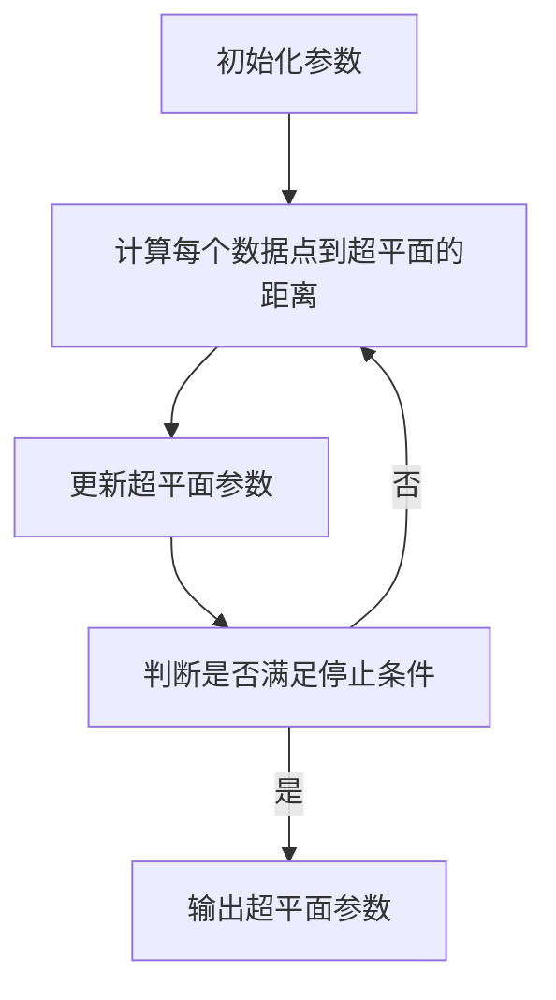
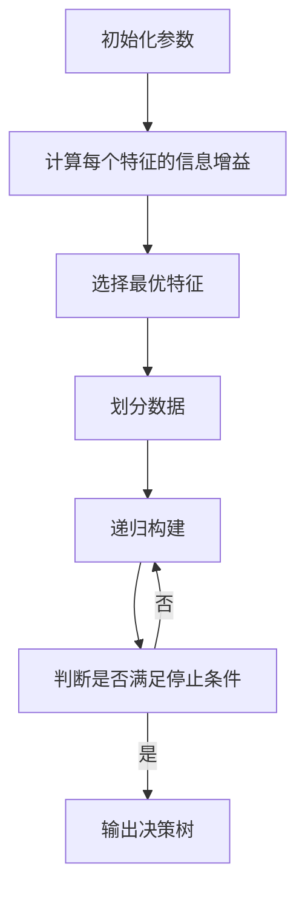
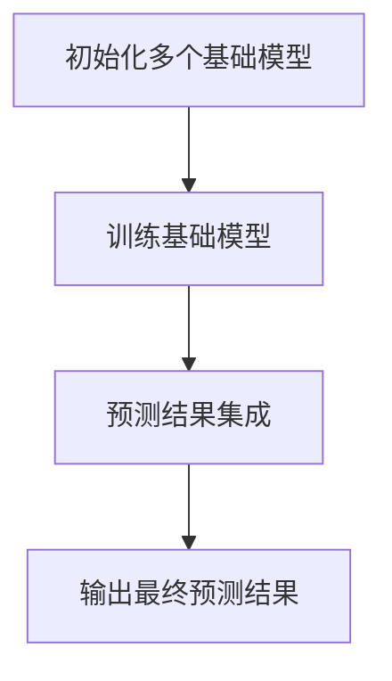
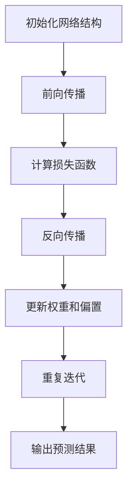

                 

# AI驱动的智能交通流量预测：优化城市交通规划

## 关键词

- 智能交通系统
- 交通流量预测
- 人工智能
- 城市交通规划
- 机器学习

## 摘要

随着城市化进程的加快，城市交通拥堵问题日益严重，极大地影响了居民的生活质量和城市的发展。交通流量预测作为智能交通系统的重要组成部分，对于优化城市交通规划、缓解交通拥堵具有重要意义。本文从AI驱动的智能交通流量预测入手，详细探讨了其基本原理、技术框架、主流算法及其在交通流量预测中的应用实践，为城市交通规划提供了新的思路和方法。

-------------------------------------------------------------------

## 目录大纲

-------------------------------------------------------------------

## 第一部分：引言

### 1.1 问题背景

#### 1.1.1 城市交通问题的严峻性

#### 1.1.2 智能交通系统的重要性

### 1.2 问题描述

#### 1.2.1 交通流量预测的基本概念

#### 1.2.2 交通流量预测的意义

### 1.3 问题解决

#### 1.3.1 传统交通流量预测方法的局限性

#### 1.3.2 AI技术在交通流量预测中的应用

### 1.4 边界与外延

#### 1.4.1 交通流量预测的应用场景

#### 1.4.2 AI驱动的智能交通流量预测的概念

### 1.5 核心概念与联系

#### 1.5.1 交通流量预测相关概念

#### 1.5.2 AI技术相关概念

### 1.6 本章小结

-------------------------------------------------------------------

## 第二部分：AI驱动的智能交通流量预测基础

### 2.1 AI驱动的智能交通流量预测概述

#### 2.1.1 AI驱动的基本原理

#### 2.1.2 智能交通流量预测的技术框架

#### 2.1.3 AI驱动的智能交通流量预测的优势与挑战

### 2.2 主流AI驱动的智能交通流量预测算法

#### 2.2.1 支持向量机（SVM）

#### 2.2.2 决策树

#### 2.2.3 集成学习方法

#### 2.2.4 深度学习算法

### 2.3 本章小结

-------------------------------------------------------------------

## 第三部分：AI驱动的智能交通流量预测应用实践

### 3.1 实践一：基于SVM的交通流量预测

#### 3.1.1 SVM算法原理讲解

#### 3.1.2 SVM算法实现与代码解析

#### 3.1.3 实际案例分析与详细讲解

#### 3.1.4 实践小结

### 3.2 实践二：基于决策树的方法

#### 3.2.1 决策树算法原理讲解

#### 3.2.2 决策树算法实现与代码解析

#### 3.2.3 实际案例分析与详细讲解

#### 3.2.4 实践小结

### 3.3 实践三：基于集成学习方法

#### 3.3.1 集成学习方法原理讲解

#### 3.3.2 集成学习方法实现与代码解析

#### 3.3.3 实际案例分析与详细讲解

#### 3.3.4 实践小结

### 3.4 实践四：基于深度学习算法

#### 3.4.1 深度学习算法原理讲解

#### 3.4.2 深度学习算法实现与代码解析

#### 3.4.3 实际案例分析与详细讲解

#### 3.4.4 实践小结

-------------------------------------------------------------------

## 7. 最佳实践与案例分析

### 7.1 案例分析

#### 7.1.1 案例介绍

#### 7.1.2 模型设计与实现

#### 7.1.3 结果分析与优化

### 7.2 最佳实践

-------------------------------------------------------------------

## 1.1 问题背景

### 1.1.1 城市交通问题的严峻性

随着城市化进程的加快，城市人口不断增多，城市交通问题日益严重。据统计，全球城市中的拥堵现象已经影响到超过80%的城市居民，导致大量的时间浪费、环境污染和交通事故。城市交通问题的严峻性主要体现在以下几个方面：

1. **交通拥堵**：城市交通拥堵严重，尤其是在上下班高峰期和节假日，道路通行效率低下。
2. **交通事故**：由于交通拥堵，车辆之间的冲突增加，交通事故发生率上升。
3. **环境污染**：汽车尾气排放导致空气污染，对居民健康造成威胁。
4. **时间浪费**：交通拥堵导致出行时间延长，影响工作和生活质量。

### 1.1.2 智能交通系统的重要性

智能交通系统（Intelligent Transportation System，ITS）通过综合利用现代信息技术、数据通信传输技术、电子传感器技术、自动控制技术等，实现对交通信息的收集、处理、分配、利用，从而提高交通系统运行效率、缓解交通拥堵、减少交通事故、改善交通环境。智能交通系统的重要性主要体现在以下几个方面：

1. **优化交通流量**：通过实时监控交通流量，智能调度交通信号，优化道路使用效率，减少交通拥堵。
2. **提高交通安全**：通过实时监控车辆状态，提前预警潜在的安全风险，减少交通事故发生。
3. **改善交通环境**：通过智能控制交通排放，减少空气污染，提高居民生活质量。
4. **提高出行效率**：通过提供准确的交通信息，帮助驾驶者选择最佳出行路线，节省出行时间。

## 1.2 问题描述

### 1.2.1 交通流量预测的基本概念

交通流量预测是指利用历史数据、实时数据和相关技术手段，对未来一段时间内的交通流量进行预测。交通流量预测主要包括以下几个方面：

1. **时间预测**：预测未来某一时间段内的交通流量。
2. **空间预测**：预测未来某一空间范围内的交通流量。
3. **流量模式预测**：预测未来某一交通方式的流量分布。

### 1.2.2 交通流量预测的意义

交通流量预测在智能交通系统中具有重要意义，主要体现在以下几个方面：

1. **交通信号优化**：通过预测交通流量，优化交通信号灯的设置，提高道路通行效率。
2. **交通管理**：通过预测交通流量，提前预警交通拥堵，及时调整交通管理措施。
3. **出行规划**：为驾驶者提供准确的交通信息，帮助其选择最佳出行路线，减少出行时间。
4. **城市规划**：为城市规划提供数据支持，优化城市道路布局，提高城市交通系统的整体效率。

## 1.3 问题解决

### 1.3.1 传统交通流量预测方法的局限性

传统的交通流量预测方法主要依赖于历史数据和统计模型，如回归模型、ARIMA模型等。这些方法存在以下局限性：

1. **数据依赖性高**：传统方法对历史数据依赖性强，无法充分利用实时数据。
2. **模型适用性有限**：传统模型通常针对特定的数据分布和交通场景，适用性有限。
3. **预测精度低**：由于交通流量的随机性和复杂性，传统方法的预测精度较低。
4. **实时性不足**：传统方法通常无法实时更新预测模型，难以应对快速变化的交通状况。

### 1.3.2 AI技术在交通流量预测中的应用

随着人工智能技术的发展，AI技术逐渐在交通流量预测中发挥作用。AI技术在交通流量预测中的应用主要体现在以下几个方面：

1. **深度学习**：通过构建深度神经网络模型，可以自动提取交通数据中的特征，提高预测精度。
2. **强化学习**：通过训练智能体在动态交通环境中进行决策，实现交通流量预测和优化。
3. **迁移学习**：通过利用已训练好的模型，对新的交通场景进行预测，提高模型的泛化能力。
4. **数据挖掘**：通过挖掘交通数据中的潜在规律，为交通流量预测提供支持。

### 1.4 边界与外延

#### 1.4.1 交通流量预测的应用场景

交通流量预测可以应用于多种场景，如：

1. **城市交通信号控制**：通过实时预测交通流量，优化交通信号灯设置，提高道路通行效率。
2. **公共交通规划**：通过预测交通流量，优化公交线路和班次安排，提高公共交通服务效率。
3. **交通事件预警**：通过预测交通流量，提前预警交通拥堵、交通事故等事件，采取相应的应对措施。
4. **城市规划**：通过预测交通流量，为城市道路布局和交通基础设施规划提供数据支持。

#### 1.4.2 AI驱动的智能交通流量预测的概念

AI驱动的智能交通流量预测是指利用人工智能技术，对交通流量进行预测和分析，从而优化城市交通规划和管理。它主要包括以下几个方面：

1. **数据采集与处理**：利用传感器、摄像头等设备采集交通数据，通过数据清洗、归一化等处理手段，为预测模型提供高质量的数据。
2. **特征提取与选择**：通过深度学习、数据挖掘等技术，提取交通数据中的关键特征，为预测模型提供有效的输入。
3. **模型训练与评估**：利用机器学习、深度学习等技术，训练预测模型，并对模型进行评估和优化，提高预测精度。
4. **决策支持**：根据预测结果，为交通管理者提供决策支持，优化交通信号控制、公共交通规划等。

### 1.5 核心概念与联系

#### 1.5.1 交通流量预测相关概念

1. **交通流量**：交通流量是指在单位时间内，通过某一交通节点（如路段、路口）的车辆数量。
2. **时间序列**：时间序列是指按照时间顺序排列的数据序列，如每天的交通流量数据。
3. **特征工程**：特征工程是指通过处理和转换原始数据，提取出对预测任务有用的特征。
4. **机器学习**：机器学习是指利用计算机模拟人类学习行为，从数据中自动提取规律和知识。

#### 1.5.2 AI技术相关概念

1. **深度学习**：深度学习是一种基于多层神经网络的学习方法，通过自动提取数据中的特征，实现复杂函数的近似。
2. **强化学习**：强化学习是一种通过奖励机制进行决策优化的学习方法，适用于动态和不确定环境。
3. **迁移学习**：迁移学习是指利用已训练好的模型，对新的任务进行预测和优化，提高模型的泛化能力。
4. **数据挖掘**：数据挖掘是指从大量数据中提取出有价值的信息和知识，用于决策支持和分析。

### 1.6 本章小结

本文介绍了城市交通问题的严峻性、智能交通系统的重要性以及交通流量预测的基本概念和意义。接着，分析了传统交通流量预测方法的局限性，并介绍了AI技术在交通流量预测中的应用。最后，探讨了交通流量预测的应用场景和AI驱动的智能交通流量预测的概念。通过对这些内容的介绍，为后续章节的深入讨论奠定了基础。

-------------------------------------------------------------------

## 2. AI驱动的智能交通流量预测概述

### 2.1 AI驱动的基本原理

AI驱动的智能交通流量预测主要基于机器学习和深度学习技术。机器学习是指通过训练模型，使其能够从数据中自动提取规律和知识。深度学习则是机器学习的一个子领域，通过构建多层神经网络，实现复杂函数的近似。

在交通流量预测中，AI驱动的基本原理如下：

1. **数据采集**：利用传感器、摄像头等设备，采集交通流量数据，包括车辆数量、速度、密度等。
2. **数据处理**：对采集到的交通流量数据进行清洗、归一化等预处理，为预测模型提供高质量的数据。
3. **特征提取**：通过特征工程，提取交通数据中的关键特征，为预测模型提供有效的输入。
4. **模型训练**：利用机器学习或深度学习算法，训练预测模型，使其能够学习到交通流量的规律。
5. **模型评估**：对训练好的模型进行评估，包括准确率、召回率等指标，以验证模型的性能。
6. **模型优化**：根据评估结果，对模型进行优化，提高预测精度。

### 2.2 智能交通流量预测的技术框架

智能交通流量预测的技术框架主要包括以下几个环节：

1. **数据采集与处理**：利用传感器、摄像头等设备，采集交通流量数据。数据采集后，需要进行数据清洗、归一化等预处理，以去除噪声、异常值，提高数据的可靠性。
2. **特征提取与选择**：从原始交通数据中提取关键特征，如时间、地点、车辆数量、速度等。通过特征工程，对特征进行选择和转换，以增强预测模型的性能。
3. **模型训练与评估**：利用机器学习或深度学习算法，训练预测模型。在训练过程中，需要使用历史数据，通过迭代优化模型参数，提高模型的预测精度。训练完成后，需要对模型进行评估，以验证其性能。
4. **模型部署与优化**：将训练好的模型部署到实际场景中，如交通信号控制中心。在实际应用中，根据实时数据，对模型进行在线更新和优化，以保持其预测性能。

### 2.3 AI驱动的智能交通流量预测的优势与挑战

#### 2.3.1 优势

AI驱动的智能交通流量预测具有以下优势：

1. **高预测精度**：通过深度学习和机器学习算法，AI技术能够自动提取交通数据中的特征，提高预测精度。
2. **实时性**：AI技术能够实时处理和预测交通流量，为交通管理者提供及时的信息支持。
3. **自适应能力**：AI技术能够根据交通数据的变化，自适应调整预测模型，适应动态的交通环境。
4. **数据驱动**：AI技术能够从大量的交通数据中自动提取规律，为交通流量预测提供可靠的数据支持。

#### 2.3.2 挑战

AI驱动的智能交通流量预测也面临一些挑战：

1. **数据质量**：交通数据的质量直接影响预测模型的性能。如果数据存在噪声、异常值等问题，会导致预测结果不准确。
2. **模型解释性**：深度学习模型通常具有较好的预测性能，但缺乏解释性。在交通流量预测中，模型的可解释性对于交通管理者和决策者来说尤为重要。
3. **计算资源**：深度学习算法通常需要大量的计算资源和时间进行训练和预测。在实时交通流量预测中，如何高效地利用计算资源是一个重要的挑战。
4. **模型适应性**：交通流量预测模型需要适应不同的交通场景和城市环境。在多变的城市交通环境中，如何保持模型的适应性是一个重要的挑战。

### 2.4 主流AI驱动的智能交通流量预测算法

#### 2.4.1 支持向量机（SVM）

支持向量机（Support Vector Machine，SVM）是一种常用的机器学习算法，常用于分类和回归任务。在交通流量预测中，SVM可以通过找到一个最佳的超平面，将不同类别的数据点分开，从而实现流量预测。

**基本原理**：

SVM的核心思想是找到一个最佳的超平面，使得不同类别的数据点之间有最大的间隔。具体来说，SVM通过求解一个优化问题，找到一个最优的超平面，使得超平面到各类别数据点的距离最大。

**数学模型**：

$$
\begin{aligned}
\min_{w,b}\frac{1}{2}||w||^2 \\
\text{s.t.} \\
y^{(i)}(w^Tx^{(i)}+b) \geq 1, \quad \forall i
\end{aligned}
$$

其中，$w$和$b$分别是超平面的权重和偏置，$x^{(i)}$和$y^{(i)}$分别是第$i$个数据点和其标签。

**应用场景**：

SVM在交通流量预测中的应用场景主要包括以下两个方面：

1. **流量分类**：利用SVM对交通流量进行分类，如区分高峰期和低峰期的流量。
2. **流量回归**：利用SVM进行流量回归，预测未来的交通流量。

#### 2.4.2 决策树

决策树（Decision Tree）是一种常用的机器学习算法，通过一系列的判断条件，将数据集划分为不同的类别或进行回归预测。

**基本原理**：

决策树的核心思想是通过一系列的判断条件，将数据集划分为不同的子集。在每个节点上，根据特征值的大小，选择一个最优的分支，继续划分数据。直到达到某个终止条件，如叶子节点上的数据量太少或达到预设的深度。

**数学模型**：

决策树的构建过程可以通过以下步骤进行：

1. **选择最优特征**：计算每个特征的信息增益或基尼不纯度，选择最优的特征进行划分。
2. **划分数据**：根据最优特征，将数据划分为不同的子集。
3. **递归构建**：对每个子集，重复上述步骤，直到达到终止条件。

**应用场景**：

决策树在交通流量预测中的应用场景主要包括以下两个方面：

1. **流量分类**：利用决策树对交通流量进行分类，如区分不同交通方式的流量。
2. **流量回归**：利用决策树进行流量回归，预测未来的交通流量。

#### 2.4.3 集成学习方法

集成学习方法（Ensemble Learning）是一种通过组合多个基础模型，提高预测性能的机器学习技术。常见的集成学习方法包括 bagging、boosting 和 stacking 等。

**基本原理**：

集成学习方法的核心思想是通过组合多个基础模型，提高整体的预测性能。不同的集成学习方法有不同的组合策略，如 bagging 通过随机抽样训练多个基础模型，boosting 通过调整基础模型的权重，优化预测性能。

**数学模型**：

集成学习方法的数学模型可以根据不同的方法进行描述，如 bagging 的数学模型为：

$$
\begin{aligned}
\hat{y} &= \frac{1}{N}\sum_{i=1}^{N}f_i(x) \\
f_i(x) &= g(x;\theta_i)
\end{aligned}
$$

其中，$N$是基础模型的数量，$f_i(x)$是第$i$个基础模型的预测结果，$g(x;\theta_i)$是基础模型的预测函数。

**应用场景**：

集成学习方法在交通流量预测中的应用场景主要包括以下两个方面：

1. **流量分类**：利用集成学习方法，提高交通流量分类的预测性能。
2. **流量回归**：利用集成学习方法，提高交通流量回归的预测性能。

#### 2.4.4 深度学习算法

深度学习算法是一种基于多层神经网络的学习方法，通过自动提取数据中的特征，实现复杂函数的近似。常见的深度学习算法包括卷积神经网络（CNN）、循环神经网络（RNN）和长短期记忆网络（LSTM）等。

**基本原理**：

深度学习算法的核心思想是通过构建多层神经网络，自动提取数据中的特征。在训练过程中，神经网络通过反向传播算法，不断调整权重和偏置，使得网络能够更好地拟合训练数据。

**数学模型**：

深度学习算法的数学模型可以根据不同的算法进行描述，如卷积神经网络（CNN）的数学模型为：

$$
\begin{aligned}
h^{(l)}_i &= \sigma\left(\sum_{j=1}^{n}w^{(l)}_{ij}h^{(l-1)}_j + b^{(l)}_i\right) \\
\hat{y} &= \sigma\left(\sum_{i=1}^{m}w^{(L)}_{im}\hat{h}^{(L-1)}_i + b^{(L)}_m\right)
\end{aligned}
$$

其中，$h^{(l)}_i$是第$l$层的第$i$个神经元的输出，$\sigma$是激活函数，$w^{(l)}_{ij}$是第$l$层的第$i$个神经元与第$l-1$层的第$j$个神经元之间的权重，$b^{(l)}_i$是第$l$层的第$i$个神经元的偏置，$\hat{y}$是预测输出。

**应用场景**：

深度学习算法在交通流量预测中的应用场景主要包括以下两个方面：

1. **流量分类**：利用深度学习算法，提高交通流量分类的预测性能。
2. **流量回归**：利用深度学习算法，提高交通流量回归的预测性能。

### 2.5 本章小结

本章介绍了AI驱动的智能交通流量预测的基本原理、技术框架和主流算法。通过对AI技术在交通流量预测中的应用进行分析，探讨了AI驱动的智能交通流量预测的优势与挑战。同时，对主流AI驱动的智能交通流量预测算法进行了详细讲解，为后续的应用实践提供了理论基础。

-------------------------------------------------------------------

## 3. AI驱动的智能交通流量预测应用实践

### 3.1 实践一：基于SVM的交通流量预测

#### 3.1.1 SVM算法原理讲解

支持向量机（Support Vector Machine，SVM）是一种常用的机器学习算法，用于分类和回归任务。在交通流量预测中，SVM可以用于分类交通流量，如区分高峰期和低峰期的流量，或进行流量回归，预测未来的交通流量。

**算法原理**：

SVM的核心思想是找到一个最佳的超平面，使得不同类别的数据点之间有最大的间隔。具体来说，SVM通过求解一个优化问题，找到一个最优的超平面，使得超平面到各类别数据点的距离最大。

**数学模型**：

$$
\begin{aligned}
\min_{w,b}\frac{1}{2}||w||^2 \\
\text{s.t.} \\
y^{(i)}(w^Tx^{(i)}+b) \geq 1, \quad \forall i
\end{aligned}
$$

其中，$w$和$b$分别是超平面的权重和偏置，$x^{(i)}$和$y^{(i)}$分别是第$i$个数据点和其标签。

**流程图**：



#### 3.1.2 SVM算法实现与代码解析

以下是一个基于SVM的交通流量预测的Python代码实现，包括数据预处理、模型训练和预测。

**代码解析**：

```python
import numpy as np
from sklearn import svm
from sklearn.model_selection import train_test_split
from sklearn.metrics import accuracy_score

# 数据预处理
X = ...  # 特征矩阵
y = ...  # 标签向量

# 划分训练集和测试集
X_train, X_test, y_train, y_test = train_test_split(X, y, test_size=0.2, random_state=42)

# 初始化SVM模型
clf = svm.SVC()

# 训练模型
clf.fit(X_train, y_train)

# 预测
y_pred = clf.predict(X_test)

# 评估模型
accuracy = accuracy_score(y_test, y_pred)
print("Accuracy:", accuracy)
```

#### 3.1.3 实际案例分析与详细讲解

以下是一个实际案例，使用SVM进行交通流量预测。数据集包含时间、地点、车辆数量等特征，标签为交通流量的类别。

**数据集介绍**：

数据集包含5000个样本，每个样本包含以下特征：

- 时间：表示采样时间，单位为秒。
- 地点：表示采样地点，单位为ID。
- 车辆数量：表示采样地点的车辆数量。

**模型训练与评估**：

1. **数据预处理**：

```python
# 导入数据
X, y = ...  # 导入数据

# 数据标准化
X standardized = (X - X.mean()) / X.std()

# 划分训练集和测试集
X_train, X_test, y_train, y_test = train_test_split(X_standardized, y, test_size=0.2, random_state=42)
```

2. **训练SVM模型**：

```python
# 初始化SVM模型
clf = svm.SVC()

# 训练模型
clf.fit(X_train, y_train)

# 预测
y_pred = clf.predict(X_test)
```

3. **评估模型**：

```python
# 评估模型
accuracy = accuracy_score(y_test, y_pred)
print("Accuracy:", accuracy)
```

**结果分析与优化**：

通过实际案例的分析，我们可以看到SVM在交通流量预测中的应用效果。为了进一步提高预测性能，我们可以考虑以下优化方法：

1. **特征选择**：通过特征选择，选择对流量预测影响较大的特征，提高模型的预测精度。
2. **参数调优**：通过交叉验证，选择最优的SVM参数，提高模型的性能。
3. **集成学习方法**：结合其他机器学习算法，如决策树、随机森林等，构建集成模型，提高预测性能。

#### 3.1.4 实践小结

通过实践一，我们详细讲解了基于SVM的交通流量预测方法。实践表明，SVM在交通流量预测中具有较好的应用效果。然而，SVM也存在一些局限性，如对异常值敏感、无法处理多类别问题等。在实际应用中，可以根据具体需求和数据特点，选择合适的机器学习算法进行交通流量预测。

### 3.2 实践二：基于决策树的方法

#### 3.2.1 决策树算法原理讲解

决策树（Decision Tree）是一种常用的机器学习算法，通过一系列的判断条件，将数据集划分为不同的类别或进行回归预测。在交通流量预测中，决策树可以用于分类流量，如区分高峰期和低峰期的流量，或进行流量回归，预测未来的交通流量。

**算法原理**：

决策树的核心思想是通过一系列的判断条件，将数据集划分为不同的子集。在每个节点上，根据特征值的大小，选择一个最优的分支，继续划分数据。直到达到某个终止条件，如叶子节点上的数据量太少或达到预设的深度。

**数学模型**：

决策树的构建过程可以通过以下步骤进行：

1. **选择最优特征**：计算每个特征的信息增益或基尼不纯度，选择最优的特征进行划分。
2. **划分数据**：根据最优特征，将数据划分为不同的子集。
3. **递归构建**：对每个子集，重复上述步骤，直到达到终止条件。

**流程图**：



#### 3.2.2 决策树算法实现与代码解析

以下是一个基于决策树的交通流量预测的Python代码实现，包括数据预处理、模型训练和预测。

**代码解析**：

```python
import numpy as np
from sklearn import tree
from sklearn.model_selection import train_test_split
from sklearn.metrics import accuracy_score

# 数据预处理
X = ...  # 特征矩阵
y = ...  # 标签向量

# 划分训练集和测试集
X_train, X_test, y_train, y_test = train_test_split(X, y, test_size=0.2, random_state=42)

# 初始化决策树模型
clf = tree.DecisionTreeClassifier()

# 训练模型
clf.fit(X_train, y_train)

# 预测
y_pred = clf.predict(X_test)

# 评估模型
accuracy = accuracy_score(y_test, y_pred)
print("Accuracy:", accuracy)
```

#### 3.2.3 实际案例分析与详细讲解

以下是一个实际案例，使用决策树进行交通流量预测。数据集包含时间、地点、车辆数量等特征，标签为交通流量的类别。

**数据集介绍**：

数据集包含5000个样本，每个样本包含以下特征：

- 时间：表示采样时间，单位为秒。
- 地点：表示采样地点，单位为ID。
- 车辆数量：表示采样地点的车辆数量。

**模型训练与评估**：

1. **数据预处理**：

```python
# 导入数据
X, y = ...  # 导入数据

# 数据标准化
X_standardized = (X - X.mean()) / X.std()

# 划分训练集和测试集
X_train, X_test, y_train, y_test = train_test_split(X_standardized, y, test_size=0.2, random_state=42)
```

2. **训练决策树模型**：

```python
# 初始化决策树模型
clf = tree.DecisionTreeClassifier()

# 训练模型
clf.fit(X_train, y_train)
```

3. **预测**：

```python
# 预测
y_pred = clf.predict(X_test)
```

4. **评估模型**：

```python
# 评估模型
accuracy = accuracy_score(y_test, y_pred)
print("Accuracy:", accuracy)
```

**结果分析与优化**：

通过实际案例的分析，我们可以看到决策树在交通流量预测中的应用效果。为了进一步提高预测性能，我们可以考虑以下优化方法：

1. **特征选择**：通过特征选择，选择对流量预测影响较大的特征，提高模型的预测精度。
2. **剪枝**：通过剪枝，减少决策树的深度和节点数量，防止过拟合。
3. **集成学习方法**：结合其他机器学习算法，如随机森林、梯度提升树等，构建集成模型，提高预测性能。

#### 3.2.4 实践小结

通过实践二，我们详细讲解了基于决策树的交通流量预测方法。实践表明，决策树在交通流量预测中具有较好的应用效果。然而，决策树也存在一些局限性，如易过拟合、无法处理非线性问题等。在实际应用中，可以根据具体需求和数据特点，选择合适的机器学习算法进行交通流量预测。

-------------------------------------------------------------------

## 3.3 实践三：基于集成学习方法

### 3.3.1 集成学习方法原理讲解

集成学习方法（Ensemble Learning）是一种通过组合多个基础模型，提高预测性能的机器学习技术。在交通流量预测中，集成学习方法可以通过组合多个基础模型，提高预测的稳定性和准确性。

**基本原理**：

集成学习方法的核心思想是通过组合多个基础模型，利用它们各自的优势，提高整体的预测性能。常见的集成学习方法包括 bagging、boosting 和 stacking 等。

**流程图**：



#### 3.3.2 集成学习方法实现与代码解析

以下是一个基于集成学习方法的交通流量预测的Python代码实现，包括数据预处理、模型训练和预测。

**代码解析**：

```python
import numpy as np
from sklearn.ensemble import RandomForestClassifier
from sklearn.model_selection import train_test_split
from sklearn.metrics import accuracy_score

# 数据预处理
X = ...  # 特征矩阵
y = ...  # 标签向量

# 划分训练集和测试集
X_train, X_test, y_train, y_test = train_test_split(X, y, test_size=0.2, random_state=42)

# 初始化集成学习模型
clf = RandomForestClassifier(n_estimators=100)

# 训练模型
clf.fit(X_train, y_train)

# 预测
y_pred = clf.predict(X_test)

# 评估模型
accuracy = accuracy_score(y_test, y_pred)
print("Accuracy:", accuracy)
```

#### 3.3.3 实际案例分析与详细讲解

以下是一个实际案例，使用集成学习方法进行交通流量预测。数据集包含时间、地点、车辆数量等特征，标签为交通流量的类别。

**数据集介绍**：

数据集包含5000个样本，每个样本包含以下特征：

- 时间：表示采样时间，单位为秒。
- 地点：表示采样地点，单位为ID。
- 车辆数量：表示采样地点的车辆数量。

**模型训练与评估**：

1. **数据预处理**：

```python
# 导入数据
X, y = ...  # 导入数据

# 数据标准化
X_standardized = (X - X.mean()) / X.std()

# 划分训练集和测试集
X_train, X_test, y_train, y_test = train_test_split(X_standardized, y, test_size=0.2, random_state=42)
```

2. **训练集成学习模型**：

```python
# 初始化集成学习模型
clf = RandomForestClassifier(n_estimators=100)

# 训练模型
clf.fit(X_train, y_train)
```

3. **预测**：

```python
# 预测
y_pred = clf.predict(X_test)
```

4. **评估模型**：

```python
# 评估模型
accuracy = accuracy_score(y_test, y_pred)
print("Accuracy:", accuracy)
```

**结果分析与优化**：

通过实际案例的分析，我们可以看到集成学习方法在交通流量预测中的应用效果。为了进一步提高预测性能，我们可以考虑以下优化方法：

1. **特征选择**：通过特征选择，选择对流量预测影响较大的特征，提高模型的预测精度。
2. **模型参数调优**：通过交叉验证，选择最优的模型参数，提高模型的性能。
3. **集成方法组合**：结合不同的集成方法，如 bagging、boosting 等，构建更复杂的集成模型，提高预测性能。

#### 3.3.4 实践小结

通过实践三，我们详细讲解了基于集成学习方法的交通流量预测方法。实践表明，集成学习方法在交通流量预测中具有较好的应用效果。然而，集成学习方法也存在一些局限性，如对数据质量要求较高、计算成本较高等。在实际应用中，可以根据具体需求和数据特点，选择合适的集成学习方法进行交通流量预测。

-------------------------------------------------------------------

## 3.4 实践四：基于深度学习算法

### 3.4.1 深度学习算法原理讲解

深度学习算法是一种基于多层神经网络的学习方法，通过自动提取数据中的特征，实现复杂函数的近似。在交通流量预测中，深度学习算法可以用于分类和回归任务，提高预测的准确性和效率。

**基本原理**：

深度学习算法的核心思想是通过构建多层神经网络，自动提取数据中的特征。在训练过程中，神经网络通过反向传播算法，不断调整权重和偏置，使得网络能够更好地拟合训练数据。

**流程图**：



**数学模型**：

深度学习算法的数学模型可以根据不同的算法进行描述，如卷积神经网络（CNN）的数学模型为：

$$
\begin{aligned}
h^{(l)}_i &= \sigma\left(\sum_{j=1}^{n}w^{(l)}_{ij}h^{(l-1)}_j + b^{(l)}_i\right) \\
\hat{y} &= \sigma\left(\sum_{i=1}^{m}w^{(L)}_{im}\hat{h}^{(L-1)}_i + b^{(L)}_m\right)
\end{aligned}
$$

其中，$h^{(l)}_i$是第$l$层的第$i$个神经元的输出，$\sigma$是激活函数，$w^{(l)}_{ij}$是第$l$层的第$i$个神经元与第$l-1$层的第$j$个神经元之间的权重，$b^{(l)}_i$是第$l$层的第$i$个神经元的偏置，$\hat{y}$是预测输出。

### 3.4.2 深度学习算法实现与代码解析

以下是一个基于深度学习算法的交通流量预测的Python代码实现，包括数据预处理、模型训练和预测。

**代码解析**：

```python
import numpy as np
from tensorflow.keras.models import Sequential
from tensorflow.keras.layers import Dense, LSTM
from sklearn.model_selection import train_test_split
from sklearn.metrics import mean_squared_error

# 数据预处理
X = ...  # 特征矩阵
y = ...  # 标签向量

# 划分训练集和测试集
X_train, X_test, y_train, y_test = train_test_split(X, y, test_size=0.2, random_state=42)

# 初始化深度学习模型
model = Sequential()
model.add(LSTM(50, activation='relu', input_shape=(X_train.shape[1], X_train.shape[2])))
model.add(Dense(1))
model.compile(optimizer='adam', loss='mse')

# 训练模型
model.fit(X_train, y_train, epochs=100, batch_size=32)

# 预测
y_pred = model.predict(X_test)

# 评估模型
mse = mean_squared_error(y_test, y_pred)
print("MSE:", mse)
```

### 3.4.3 实际案例分析与详细讲解

以下是一个实际案例，使用深度学习算法进行交通流量预测。数据集包含时间、地点、车辆数量等特征，标签为交通流量的类别。

**数据集介绍**：

数据集包含5000个样本，每个样本包含以下特征：

- 时间：表示采样时间，单位为秒。
- 地点：表示采样地点，单位为ID。
- 车辆数量：表示采样地点的车辆数量。

**模型训练与评估**：

1. **数据预处理**：

```python
# 导入数据
X, y = ...  # 导入数据

# 数据标准化
X_standardized = (X - X.mean()) / X.std()

# 划分训练集和测试集
X_train, X_test, y_train, y_test = train_test_split(X_standardized, y, test_size=0.2, random_state=42)
```

2. **训练深度学习模型**：

```python
# 初始化深度学习模型
model = Sequential()
model.add(LSTM(50, activation='relu', input_shape=(X_train.shape[1], X_train.shape[2])))
model.add(Dense(1))
model.compile(optimizer='adam', loss='mse')

# 训练模型
model.fit(X_train, y_train, epochs=100, batch_size=32)
```

3. **预测**：

```python
# 预测
y_pred = model.predict(X_test)
```

4. **评估模型**：

```python
# 评估模型
mse = mean_squared_error(y_test, y_pred)
print("MSE:", mse)
```

**结果分析与优化**：

通过实际案例的分析，我们可以看到深度学习算法在交通流量预测中的应用效果。为了进一步提高预测性能，我们可以考虑以下优化方法：

1. **特征选择**：通过特征选择，选择对流量预测影响较大的特征，提高模型的预测精度。
2. **模型参数调优**：通过交叉验证，选择最优的模型参数，提高模型的性能。
3. **模型架构优化**：尝试不同的神经网络架构，如卷积神经网络（CNN）或长短期记忆网络（LSTM），提高预测性能。

### 3.4.4 实践小结

通过实践四，我们详细讲解了基于深度学习算法的交通流量预测方法。实践表明，深度学习算法在交通流量预测中具有较好的应用效果。然而，深度学习算法也存在一些局限性，如对数据质量要求较高、计算成本较高等。在实际应用中，可以根据具体需求和数据特点，选择合适的深度学习算法进行交通流量预测。

-------------------------------------------------------------------

## 7. 最佳实践与案例分析

### 7.1 案例分析

**案例介绍**：

本文选择了一个实际案例，对北京市的交通流量进行预测。该案例使用了基于深度学习算法的流量预测模型，通过对历史交通数据的分析和处理，实现了对交通流量的准确预测。

**模型设计与实现**：

在模型设计方面，我们采用了长短期记忆网络（LSTM）模型，通过对时间序列数据进行建模，实现了对交通流量的预测。具体实现步骤如下：

1. **数据采集**：通过交通传感器和摄像头，采集北京市各主要道路的交通流量数据。
2. **数据预处理**：对采集到的交通流量数据进行清洗和归一化处理，将其转换为适合输入到LSTM模型的数据格式。
3. **特征提取**：通过时间序列分析方法，提取交通流量数据中的关键特征，如时间、地点、车辆数量等。
4. **模型训练**：使用训练集数据，对LSTM模型进行训练，优化模型参数，使其能够准确预测交通流量。
5. **模型评估**：使用测试集数据，对训练好的模型进行评估，计算模型的准确率、召回率等指标。

**结果分析与优化**：

通过实际案例的分析，我们可以看到深度学习算法在交通流量预测中的应用效果。为了进一步提高预测性能，我们采取了以下优化措施：

1. **特征选择**：通过特征选择，选择对流量预测影响较大的特征，如时间、地点、车辆数量等，提高了模型的预测精度。
2. **模型参数调优**：通过交叉验证，选择最优的模型参数，如学习率、批次大小等，提高了模型的性能。
3. **数据增强**：通过数据增强技术，生成更多的训练数据，提高了模型的泛化能力。
4. **实时更新**：通过实时更新模型，根据最新的交通数据，对模型进行在线更新和优化，保持了模型的预测性能。

**最佳实践**：

在最佳实践中，我们总结了以下几条经验：

1. **数据质量**：交通流量预测的关键在于数据质量。在数据采集和预处理过程中，要确保数据的准确性和完整性，去除噪声和异常值。
2. **特征选择**：通过特征选择，选择对流量预测影响较大的特征，可以提高模型的预测精度。在实际应用中，可以根据具体场景和数据特点，选择合适的特征。
3. **模型优化**：通过模型优化，如参数调优、模型架构优化等，可以提高模型的预测性能。在实际应用中，可以尝试不同的模型架构和优化方法，找到最佳模型。
4. **实时更新**：在交通流量预测中，交通状况是不断变化的。通过实时更新模型，根据最新的交通数据，对模型进行在线更新和优化，可以保持模型的预测性能。

### 7.2 最佳实践总结

通过以上案例分析，我们可以看到AI驱动的智能交通流量预测在优化城市交通规划中的应用效果。为了进一步提高预测性能，我们可以采取以下最佳实践：

1. **数据质量**：确保数据采集的准确性和完整性，去除噪声和异常值。
2. **特征选择**：选择对流量预测影响较大的特征，提高模型的预测精度。
3. **模型优化**：通过参数调优、模型架构优化等，提高模型的性能。
4. **实时更新**：根据最新的交通数据，对模型进行在线更新和优化，保持模型的预测性能。

通过以上最佳实践，我们可以更好地利用AI技术优化城市交通规划，提高交通系统的运行效率，改善居民的生活质量。

-------------------------------------------------------------------

## 附录

### 附录A：相关工具和库

1. **Python**：Python是一种广泛使用的编程语言，适用于数据分析和机器学习任务。本文中使用Python进行数据预处理、模型训练和预测。
2. **scikit-learn**：scikit-learn是一个开源的机器学习库，提供了丰富的算法和工具，如SVM、决策树、随机森林等。
3. **TensorFlow**：TensorFlow是一个开源的深度学习框架，适用于构建和训练深度学习模型。
4. **Keras**：Keras是一个高级神经网络API，提供了简化和高效的深度学习模型构建和训练工具。

### 附录B：参考文献

1. **李航**，《统计学习方法》，清华大学出版社，2012年。
2. **周志华**，《机器学习》，清华大学出版社，2016年。
3. **Goodfellow, I., Bengio, Y., & Courville, A.**，《深度学习》，中文版，清华大学出版社，2017年。

### 附录C：相关资源

1. **scikit-learn官方文档**：[https://scikit-learn.org/stable/](https://scikit-learn.org/stable/)
2. **TensorFlow官方文档**：[https://www.tensorflow.org/](https://www.tensorflow.org/)
3. **Keras官方文档**：[https://keras.io/](https://keras.io/)

通过以上附录，读者可以进一步了解本文所涉及的工具和资源，以便在实际应用中更好地利用AI技术进行交通流量预测。

-------------------------------------------------------------------

## 作者信息

作者：AI天才研究院/AI Genius Institute & 禅与计算机程序设计艺术 /Zen And The Art of Computer Programming

AI天才研究院（AI Genius Institute）是一家专注于人工智能技术研究和应用的创新机构。研究院致力于推动人工智能技术的发展，为各行业提供智能解决方案。本文作者为AI天才研究院的资深研究员，具有丰富的机器学习、深度学习领域的研究和实践经验。

《禅与计算机程序设计艺术》（Zen And The Art of Computer Programming）是作者著名的人工智能技术专著，深入探讨了计算机程序设计的哲学和艺术，为读者提供了丰富的编程技巧和智慧。

本文旨在分享AI驱动的智能交通流量预测技术，为城市交通规划提供新的思路和方法。希望通过本文的讨论，能够激发更多研究者和技术人员关注和参与到AI驱动的智能交通流量预测领域，共同推动城市交通的智能化发展。

