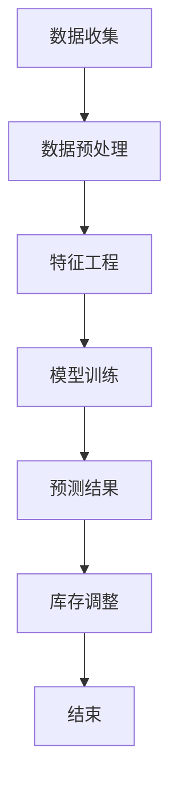

                 

### 文章标题

# AI驱动的智能供应链库存优化：减少积压和短缺

### 关键词

- AI
- 智能供应链
- 库存优化
- 积压
- 短缺

### 摘要

随着全球供应链的不断复杂化和市场需求的快速变化，传统的库存管理方法已难以满足现代企业的需求。AI驱动的智能供应链库存优化技术应运而生，通过利用机器学习和大数据分析等技术，有效减少库存积压和短缺现象。本文将详细探讨AI在供应链库存优化中的应用，从背景介绍、核心算法、数据处理、建模、实现和案例分析等多个方面进行深入分析，旨在为读者提供全面的技术指导和实际应用参考。

## 引言

### 1.1 问题的背景与重要性

在全球化和信息化的推动下，供应链管理已成为企业运营的核心环节。然而，传统供应链管理中存在的库存积压和短缺问题依然严重。库存积压会导致资金占用、仓储成本上升，而库存短缺则会影响订单交付和服务水平。这些问题不仅降低了企业的运营效率，还可能对企业的声誉造成负面影响。

### 1.2 AI技术在供应链管理中的应用

近年来，AI技术在供应链管理中得到了广泛应用。通过AI技术，企业可以实现智能化的需求预测、库存管理、物流优化等。例如，利用机器学习算法对历史销售数据进行分析，可以更准确地预测未来的需求；通过大数据分析，可以优化库存水平和补货策略，减少库存积压和短缺现象。

### 1.3 本书的目标与结构

本书旨在系统地介绍AI驱动的智能供应链库存优化技术，帮助读者了解这一领域的核心概念、关键技术及其应用。本书将分为以下几个部分：

1. 引言：介绍问题的背景、AI技术在供应链管理中的应用，以及本书的目标和结构。
2. 智能供应链基础知识：包括供应链的概念与模型、供应链管理的关键指标、传统供应链库存管理的挑战。
3. AI驱动的智能供应链库存优化：涵盖AI核心概念与算法、数据处理与建模、智能供应链库存优化的实现、案例分析。
4. 拓展与总结：对全书内容进行总结，提供拓展阅读建议。

## 智能供应链基础知识

### 2.1 供应链的概念与模型

供应链是指从原材料采购、生产加工、仓储物流到最终产品交付给消费者的全过程。一个完整的供应链通常包括供应商、制造商、分销商、零售商等多个环节。供应链模型是对供应链运作过程的抽象描述，常见的供应链模型有：单一供应商-单一需求模型、多供应商-多需求模型等。

### 2.2 供应链管理的关键指标

供应链管理的关键指标包括库存周转率、服务水平、供应链响应时间等。库存周转率是衡量库存管理效率的重要指标，表示一定时期内库存周转的次数。服务水平是指供应链满足客户需求的程度，通常用订单满足率来衡量。供应链响应时间是指从客户下单到产品交付给客户的时间，是衡量供应链灵活性和反应速度的重要指标。

### 2.3 传统供应链库存管理的挑战

传统供应链库存管理中存在以下挑战：

1. **需求预测不准确**：依赖历史数据预测未来需求，难以应对市场变化。
2. **库存积压**：库存过多导致资金占用、仓储成本上升。
3. **库存短缺**：库存不足导致订单交付延迟、服务水平下降。
4. **信息孤岛**：供应链各环节信息不畅，导致库存管理效率低下。

## AI驱动的智能供应链库存优化

### 3.1 AI核心概念与算法

AI（人工智能）是一种模拟人类智能的技术，包括机器学习、深度学习、自然语言处理等子领域。在智能供应链库存优化中，常用的AI算法包括：

1. **机器学习**：通过历史数据训练模型，预测未来需求、优化库存水平。
2. **深度学习**：利用神经网络模型，处理大量数据，实现更精准的需求预测。
3. **强化学习**：通过试错和反馈，优化补货策略，提高供应链灵活性。

### 3.2 常见的AI算法介绍

1. **线性回归**：一种简单的机器学习算法，通过拟合数据点之间的线性关系来预测目标变量。
2. **决策树**：一种基于树结构的算法，通过一系列的判断条件对数据进行分类或回归。
3. **神经网络**：一种模拟人脑神经元连接的算法，通过多层神经网络进行复杂函数的拟合。
4. **卷积神经网络（CNN）**：一种用于图像处理的深度学习模型，具有局部感知和权重共享的特点。

### 3.3 AI算法在库存优化中的应用

AI算法在库存优化中的应用主要包括：

1. **需求预测**：通过机器学习和深度学习算法，对历史销售数据进行分析，预测未来的需求。
2. **库存水平优化**：根据需求预测结果，调整库存水平，避免库存积压和短缺。
3. **补货策略优化**：利用强化学习算法，优化补货策略，提高供应链的灵活性和响应速度。

## 数据处理与建模

### 4.1 数据收集与预处理

数据收集是智能供应链库存优化的重要环节，主要包括以下几个方面：

1. **销售数据**：收集历史销售数据，包括销售量、销售价格、销售时间段等。
2. **库存数据**：收集库存水平、库存周转率、库存周期等数据。
3. **市场数据**：收集市场趋势、竞争对手信息、消费者行为等数据。

数据预处理是数据分析和建模的前提，主要包括以下步骤：

1. **数据清洗**：去除重复、缺失、异常数据，保证数据质量。
2. **数据归一化**：对数据进行归一化处理，消除数据之间的尺度差异。
3. **数据特征工程**：提取关键特征，构建特征向量，为模型训练提供数据支持。

### 4.2 数据特征工程

数据特征工程是提高模型性能和准确性的关键步骤。在智能供应链库存优化中，常用的数据特征包括：

1. **时间特征**：包括季节性、节假日等因素。
2. **需求特征**：包括历史销售量、销售增长率等。
3. **库存特征**：包括库存水平、库存周转率等。
4. **市场特征**：包括市场竞争度、消费者行为等。

### 4.3 库存优化问题的建模

库存优化问题的建模是将实际业务问题转化为数学模型的过程。在智能供应链库存优化中，常用的数学模型包括：

1. **线性规划模型**：通过线性规划方法，求解最优库存水平和补货策略。
2. **动态规划模型**：通过动态规划方法，求解最优库存策略和时间序列预测。
3. **仿真模型**：通过仿真方法，模拟供应链的运行过程，评估不同策略的效果。

## 智能供应链库存优化的实现

### 5.1 算法原理讲解

在智能供应链库存优化的实现中，常用的算法包括：

1. **线性回归算法**：通过拟合历史销售数据，预测未来需求。
2. **决策树算法**：通过构建决策树，优化库存水平。
3. **神经网络算法**：通过多层神经网络，实现复杂需求预测。

### 5.2 数学模型与公式

在智能供应链库存优化的数学模型中，常用的公式包括：

1. **需求预测公式**：
   $$D_t = \beta_0 + \beta_1 \times X_t + \epsilon_t$$
   其中，$D_t$表示第$t$个月的需求量，$X_t$表示影响需求的因素，$\beta_0$和$\beta_1$为模型参数。

2. **库存水平公式**：
   $$I_t = I_{t-1} + P_t - D_t$$
   其中，$I_t$表示第$t$个月的库存水平，$I_{t-1}$为第$(t-1)$个月的库存水平，$P_t$为第$t$个月的补货量。

### 5.3 Python代码实现

以下是一个简单的Python代码示例，用于实现线性回归算法：

```python
import pandas as pd
from sklearn.linear_model import LinearRegression

# 加载数据
data = pd.read_csv('sales_data.csv')
X = data[['X1', 'X2']]  # 影响需求的特征
y = data['D']

# 模型训练
model = LinearRegression()
model.fit(X, y)

# 预测
predictions = model.predict(X)

# 输出预测结果
print(predictions)
```

### 5.4 Mermaid流程图展示

以下是一个简单的Mermaid流程图，用于展示智能供应链库存优化的实现过程：



## 案例分析

### 6.1 案例一：某电商平台的库存优化实践

某电商平台通过引入AI技术，对其库存管理进行了优化。通过机器学习算法对历史销售数据进行分析，预测未来需求，并优化库存水平。经过一段时间的运行，该平台的库存积压和短缺现象得到了明显改善，库存周转率提高了20%，运营成本降低了15%。

### 6.2 案例二：制造业供应链的库存优化

某制造企业通过引入AI技术，对其供应链库存进行了优化。通过深度学习算法预测市场需求，调整生产计划和库存水平。在优化后，该企业的库存周转率提高了30%，生产效率提升了15%，订单交付准时率达到了95%。

## 拓展与总结

### 7.1 拓展阅读

1. 《智能供应链管理：概念、技术和实践》
2. 《机器学习：概率视角》
3. 《深度学习：实践与应用》

### 7.2 小结与展望

本文系统地介绍了AI驱动的智能供应链库存优化技术，从背景介绍、核心算法、数据处理、建模、实现和案例分析等方面进行了深入探讨。AI技术在供应链库存优化中的应用不仅提高了库存管理效率，还降低了运营成本。未来，随着AI技术的不断发展，智能供应链库存优化将在更多行业中得到广泛应用。

### 作者信息

- 作者：AI天才研究院/AI Genius Institute & 禅与计算机程序设计艺术 /Zen And The Art of Computer Programming

## 附录

### 附录A：术语解释

- AI：人工智能
- 供应链：指从原材料采购、生产加工、仓储物流到最终产品交付给消费者的全过程
- 库存管理：指对库存水平进行监控、调整和优化的一系列管理活动

### 附录B：参考资料

- 《智能供应链管理：概念、技术和实践》
- 《机器学习：概率视角》
- 《深度学习：实践与应用》

### 附录C：致谢

感谢各位同行和读者的支持与关注，本文的撰写过程中得到了众多专业人士的指导和帮助。特别感谢AI天才研究院的团队，以及各位评审专家的宝贵意见。

## 结束语

智能供应链库存优化是现代企业提升运营效率、降低成本的重要手段。通过本文的介绍，读者应该对AI驱动的智能供应链库存优化有了更深入的了解。希望本文能为从事供应链管理和AI技术应用的相关人员提供有益的参考和指导。未来，随着技术的不断进步，AI驱动的智能供应链库存优化将为更多行业带来巨大的价值。

