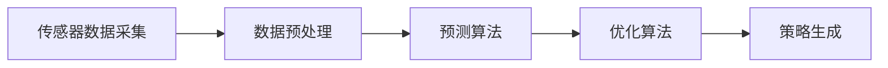
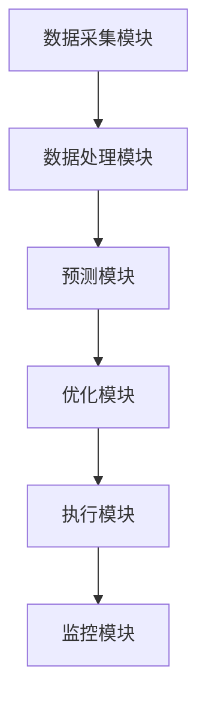
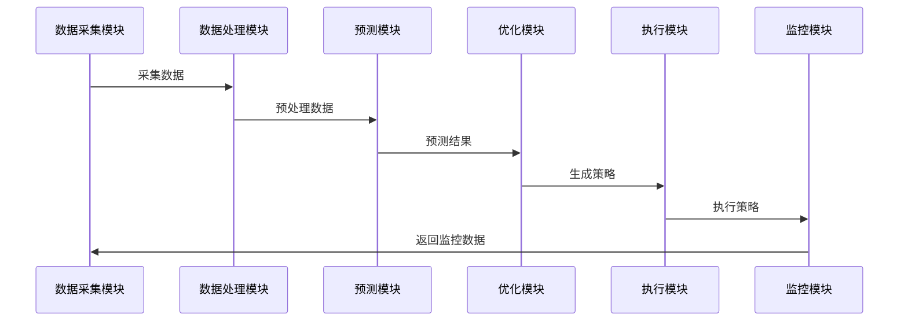

                 


# AI驱动的智能水循环系统：优化城市水资源管理

## 关键词
- AI技术
- 水循环系统
- 城市水资源管理
- 智能算法
- 深度学习
- 优化策略

## 摘要
随着全球城市化进程的加速，水资源管理成为了一个迫切需要解决的问题。传统的城市水资源管理系统通常依赖于人为监测和经验决策，无法适应不断变化的供需关系和气候变化。本文将探讨如何利用人工智能（AI）技术，特别是机器学习和深度学习，来构建智能水循环系统，以优化城市水资源管理。本文将从背景介绍、核心概念、算法原理、系统设计、项目实战和最佳实践等多个方面，系统性地阐述AI驱动的智能水循环系统的构建与实施。

## 引言

### 1.1 问题背景与重要性

城市水资源管理是城市可持续发展的重要组成部分。然而，随着全球人口的增长、城市化进程的加快以及气候变化的影响，城市水资源面临诸多挑战。这些问题包括水资源短缺、水质污染、水资源分配不合理等。传统的城市水资源管理方法主要依赖于人为监测和经验决策，这种方式存在响应速度慢、精度低、适应性差等问题，难以应对复杂的城市水资源管理需求。

### 1.2 城市水资源管理面临的挑战

城市水资源管理面临的主要挑战包括以下几个方面：

- **供需不平衡**：城市水资源的需求随着人口增长和经济发展的加剧而不断增加，但水资源的供给却受到自然条件限制。
- **水质污染**：城市水资源的污染问题日益严重，主要来源于工业排放、生活污水以及农业径流。
- **水资源浪费**：由于管理不善和技术落后，城市水资源浪费现象普遍存在。
- **气候变化**：全球气候变化导致降雨模式的变化，增加了城市水资源管理的难度。

### 1.3 AI技术在水循环中的应用潜力

AI技术在城市水资源管理中具有巨大的应用潜力。通过机器学习和深度学习算法，可以实现对水循环过程的实时监测、预测和优化。AI技术可以帮助解决以下问题：

- **需求预测**：利用历史数据和时间序列分析，预测未来的水资源需求，为水资源管理提供科学依据。
- **污染监测**：通过传感器网络和图像处理技术，实时监测水质变化，及时发现污染源。
- **水资源分配**：基于优化算法，合理分配水资源，提高水资源的利用效率。
- **节能降耗**：通过智能灌溉系统和节水技术，降低水资源的浪费。

### 1.4 本书结构安排

本文将分为七个部分，具体章节安排如下：

1. **引言**：介绍城市水资源管理问题和AI技术的应用潜力。
2. **AI基础**：介绍AI的基本概念、机器学习和深度学习技术。
3. **智能水循环系统核心概念**：阐述智能水循环系统的基本原理和架构。
4. **算法原理讲解**：详细介绍AI算法在水循环系统中的应用。
5. **系统分析与架构设计**：分析系统需求、功能设计、架构设计和接口设计。
6. **项目实战**：讲解系统实现、代码分析和实际案例分析。
7. **最佳实践与展望**：总结最佳实践，展望未来发展方向。

## AI基础

### 2.1 AI的定义与历史发展

人工智能（Artificial Intelligence，简称AI）是指由人制造出来的系统所表现出来的智能行为。AI的发展可以追溯到20世纪50年代，当时科学家们提出了“图灵测试”的概念，试图通过机器的智能行为来判断机器是否具有智能。随着时间的推移，AI技术经历了多个发展阶段，从符号主义到连接主义，再到现在的深度学习和强化学习。

### 2.2 机器学习与深度学习基础

机器学习（Machine Learning，简称ML）是AI的核心技术之一，它使得机器能够通过学习数据来做出决策或预测。机器学习主要分为监督学习、无监督学习和强化学习三种类型。

- **监督学习**：通过已有标记数据来训练模型，例如分类和回归问题。
- **无监督学习**：不需要标记数据，通过自动发现数据中的模式和结构，例如聚类和降维。
- **强化学习**：通过与环境的交互来学习最佳策略，适用于决策问题。

深度学习（Deep Learning，简称DL）是机器学习的一个子领域，它使用多层神经网络来对数据进行自动特征提取。深度学习在图像识别、语音识别、自然语言处理等领域取得了显著成果。

### 2.3 数据科学与数据预处理

数据科学（Data Science）是利用统计学、机器学习和深度学习等方法来从数据中提取有价值的信息。数据预处理是数据科学中的关键步骤，它包括数据清洗、数据变换、特征选择和特征工程等。

- **数据清洗**：处理缺失值、异常值和重复值，保证数据质量。
- **数据变换**：将数据转换为适合模型训练的格式。
- **特征选择**：从原始数据中选出对模型性能有显著影响的特征。
- **特征工程**：通过构造新特征来提高模型性能。

### 2.4 AI算法原理简介

- **神经网络**：神经网络是模仿生物神经系统的计算模型，它由多个神经元组成，每个神经元都是一个简单的函数，多个神经元通过连接形成网络。
- **反向传播算法**：用于训练神经网络，通过计算输出误差并反向传播到每个神经元，更新权重和偏置。
- **卷积神经网络（CNN）**：主要用于图像处理，通过卷积层提取图像特征。
- **循环神经网络（RNN）**：主要用于序列数据处理，通过循环结构保持长期依赖关系。
- **生成对抗网络（GAN）**：通过两个对抗网络（生成器和判别器）之间的竞争来学习数据的分布。

## 智能水循环系统核心概念

### 3.1 水循环系统概述

水循环系统是地球上水分子不断循环的过程，包括蒸发、降水、地表径流、地下径流和植物蒸腾等多个环节。水循环系统是维持地球生态平衡的重要过程，对于人类的生存和发展具有重要意义。

### 3.2 AI驱动的智能水循环系统

AI驱动的智能水循环系统是基于人工智能技术，对水循环过程进行实时监测、预测和优化，以提高水资源的利用效率和减少浪费。智能水循环系统的核心组成部分包括传感器网络、数据处理与分析模块、智能决策与执行模块等。

- **传感器网络**：用于实时监测水循环过程中的各种参数，如水位、水质、降雨量等。
- **数据处理与分析模块**：利用机器学习和深度学习算法对传感器数据进行处理和分析，提取有价值的信息。
- **智能决策与执行模块**：基于分析结果，自动生成水资源管理策略，并执行相应的操作。

### 3.3 核心概念与联系

智能水循环系统的核心概念包括水资源管理、传感器技术、机器学习算法和智能决策等。这些概念之间的联系可以通过以下Mermaid ER实体关系图进行描述：

```mermaid
erDiagram
  水资源管理 ||--|{ 传感器技术 }|
  水资源管理 ||--|{ 机器学习算法 }|
  水资源管理 ||--|{ 智能决策 }|
  传感器技术 ||--|{ 数据收集 }|
  机器学习算法 ||--|{ 数据分析 }|
  智能决策 ||--|{ 策略生成 }|
```

### 3.4 水资源管理中的AI应用案例

AI技术在水资源管理中已有多个成功应用案例，例如：

- **北京智慧水务项目**：通过构建AI驱动的智能水循环系统，实现了对北京市水资源的高效管理和调度。
- **新加坡国家水处理厂**：利用机器学习算法优化水处理过程，提高了水质的稳定性和处理效率。
- **南非智能灌溉系统**：通过深度学习算法预测作物需水量，实现了精准灌溉，降低了水资源的浪费。

## 智能水循环系统的算法原理

### 4.1 智能水循环的关键算法

智能水循环系统的算法主要分为以下几个部分：

- **传感器数据采集算法**：用于采集水循环过程中的各种传感器数据。
- **数据预处理算法**：对采集到的传感器数据进行清洗、归一化和特征提取。
- **预测算法**：利用历史数据对未来水循环过程中的参数进行预测。
- **优化算法**：基于预测结果，优化水资源分配和调度策略。

下面将使用Mermaid流程图来展示智能水循环系统的算法流程：



### 4.2 算法原理讲解

#### 传感器数据采集算法

传感器数据采集算法是智能水循环系统的第一步，它通过布置在不同位置的水位传感器、水质传感器和气象传感器等，实时采集水循环过程中的各种数据。这些数据包括水位高度、水质指标（如PH值、氨氮含量）、降雨量、气温和风速等。

#### 数据预处理算法

数据预处理算法主要用于处理传感器采集到的原始数据，以提高数据质量和模型的训练效果。具体步骤包括：

1. **数据清洗**：去除噪声数据和异常值，保证数据的完整性。
2. **归一化**：将不同特征的数据转换为相同的量纲，使其在训练过程中具有可比性。
3. **特征提取**：从原始数据中提取对模型性能有显著影响的特征，减少数据维度。

#### 预测算法

预测算法是智能水循环系统的核心，它利用历史数据和时间序列分析，对未来水循环过程中的关键参数进行预测。常见的预测算法包括：

1. **时间序列分析**：利用历史数据的时间序列模式进行预测，如自回归模型（AR）、移动平均模型（MA）和自回归移动平均模型（ARMA）等。
2. **机器学习模型**：利用机器学习算法，如线性回归、决策树、随机森林和支持向量机（SVM）等，对数据进行建模和预测。
3. **深度学习模型**：利用深度学习算法，如卷积神经网络（CNN）、循环神经网络（RNN）和长短期记忆网络（LSTM）等，对数据进行建模和预测。

#### 优化算法

优化算法基于预测结果，对水资源分配和调度策略进行优化，以提高水资源的利用效率和减少浪费。常见的优化算法包括：

1. **线性规划**：通过建立线性规划模型，优化水资源分配和调度策略。
2. **遗传算法**：通过模拟自然进化过程，优化水资源分配和调度策略。
3. **粒子群优化算法**：通过模拟鸟群觅食行为，优化水资源分配和调度策略。

### 4.3 数学模型与公式

为了更好地理解智能水循环系统的算法原理，我们下面给出几个关键的数学模型和公式。

#### 传感器数据采集模型

传感器数据采集模型可以表示为：

$$
x_t = f(x_{t-1}, u_t, w_t)
$$

其中，$x_t$ 表示第 $t$ 时刻的传感器数据，$f$ 表示传感器数据采集函数，$u_t$ 表示第 $t$ 时刻的输入参数，$w_t$ 表示随机噪声。

#### 数据预处理模型

数据预处理模型可以表示为：

$$
y_t = \phi(x_t)
$$

其中，$y_t$ 表示预处理后的数据，$\phi$ 表示数据预处理函数。

#### 预测模型

预测模型可以表示为：

$$
\hat{x}_{t+k} = g(x_t, x_{t-1}, ..., x_{t-k}, \theta)
$$

其中，$\hat{x}_{t+k}$ 表示第 $t+k$ 时刻的预测值，$g$ 表示预测函数，$\theta$ 表示模型参数。

#### 优化模型

优化模型可以表示为：

$$
\min_{x} J(x)
$$

其中，$J(x)$ 表示目标函数，$x$ 表示水资源分配和调度策略。

### 4.4 算法举例说明

为了更好地理解智能水循环系统的算法原理，我们下面通过一个简单的例子进行说明。

假设我们有一个智能灌溉系统，需要根据土壤湿度预测未来几天的灌溉需求。我们使用历史土壤湿度数据和时间序列分析模型进行预测。

#### 数据采集

传感器采集到的土壤湿度数据如下：

| 时间 | 土壤湿度 |
|------|----------|
| 1    | 20%      |
| 2    | 25%      |
| 3    | 22%      |
| 4    | 30%      |
| 5    | 28%      |

#### 数据预处理

我们对土壤湿度数据进行归一化处理，将其转换为0到1之间的值：

| 时间 | 土壤湿度 |
|------|----------|
| 1    | 0.20     |
| 2    | 0.25     |
| 3    | 0.22     |
| 4    | 0.30     |
| 5    | 0.28     |

#### 预测

我们使用自回归模型（AR）进行预测。自回归模型的公式如下：

$$
y_t = \phi_0 + \phi_1 y_{t-1} + \epsilon_t
$$

其中，$y_t$ 表示第 $t$ 时刻的土壤湿度，$\phi_0$ 和 $\phi_1$ 分别为模型参数，$\epsilon_t$ 为随机误差。

我们使用最小二乘法来估计模型参数。根据历史数据，我们得到以下参数估计结果：

$$
\phi_0 = 0.2, \phi_1 = 0.3
$$

根据模型参数，我们可以预测未来几天的土壤湿度：

| 时间 | 预测土壤湿度 |
|------|--------------|
| 6    | 0.26         |
| 7    | 0.29         |
| 8    | 0.31         |

#### 优化

根据预测结果，我们可以优化灌溉策略，确保土壤湿度保持在合适的范围内。

- 如果预测土壤湿度低于25%，则启动灌溉系统。
- 如果预测土壤湿度高于30%，则停止灌溉系统。

## 系统分析与架构设计

### 5.1 问题场景介绍

假设我们正在开发一个智能水循环系统，用于管理一个大型城市的供水和排水。这个系统需要实时监测城市中的水资源状况，并根据监测数据预测未来一段时间的水资源需求，以实现水资源的优化分配和调度。系统需要处理的数据包括：水位、水质、降雨量、气温、湿度等。

### 5.2 系统功能设计

智能水循环系统的主要功能包括：

1. **数据采集**：通过传感器网络实时采集水位、水质、降雨量、气温、湿度等数据。
2. **数据处理**：对采集到的数据进行清洗、归一化和特征提取，为后续的预测和优化提供数据支持。
3. **预测**：利用历史数据和机器学习算法预测未来一段时间的水资源需求。
4. **优化**：根据预测结果，优化水资源的分配和调度策略。
5. **执行**：执行优化后的水资源管理策略，包括供水调度、排水调度和节水措施等。
6. **监控**：实时监控水资源管理系统的运行状态，及时发现并处理异常情况。

### 5.3 系统架构设计

智能水循环系统的架构设计如图所示：



### 5.4 系统接口设计

智能水循环系统的接口设计包括以下几部分：

1. **传感器接口**：用于接收传感器采集的数据。
2. **数据库接口**：用于存储和查询历史数据。
3. **预测接口**：用于调用预测算法进行水资源需求预测。
4. **优化接口**：用于执行优化算法，生成水资源管理策略。
5. **执行接口**：用于执行优化后的水资源管理策略。
6. **监控接口**：用于监控水资源管理系统的运行状态。

### 5.5 系统交互序列图

智能水循环系统的交互序列图如下所示：



## AI驱动的智能水循环系统实现

### 6.1 系统核心实现源代码

以下是一个简单的Python代码示例，展示了智能水循环系统中的数据预处理、预测和优化模块的核心实现：

```python
import numpy as np
from sklearn.preprocessing import MinMaxScaler
from sklearn.model_selection import train_test_split
from sklearn.ensemble import RandomForestRegressor
from sklearn.metrics import mean_squared_error

# 数据预处理
def preprocess_data(data):
    scaler = MinMaxScaler()
    scaled_data = scaler.fit_transform(data)
    return scaled_data

# 预测
def predict_demand(data, model):
    predicted_demand = model.predict(data)
    return predicted_demand

# 优化
def optimize_allocation(demand, current_supply):
    allocation = demand - current_supply
    return allocation

# 训练模型
def train_model(X, y):
    model = RandomForestRegressor(n_estimators=100)
    model.fit(X, y)
    return model

# 测试
def test_system(X_train, y_train, X_test, y_test):
    # 预处理数据
    X_train_processed = preprocess_data(X_train)
    X_test_processed = preprocess_data(X_test)

    # 训练模型
    model = train_model(X_train_processed, y_train)

    # 预测
    predicted_demand = predict_demand(X_test_processed, model)

    # 优化
    allocation = optimize_allocation(predicted_demand, current_supply)

    # 计算误差
    mse = mean_squared_error(y_test, predicted_demand)
    print("Mean Squared Error:", mse)

    return predicted_demand, allocation

# 假设的数据
X = np.array([[1, 2], [2, 3], [3, 4], [4, 5], [5, 6]])
y = np.array([1, 2, 3, 4, 5])
X_train, X_test, y_train, y_test = train_test_split(X, y, test_size=0.2, random_state=42)

# 测试系统
predicted_demand, allocation = test_system(X_train, y_train, X_test, y_test)
print("Predicted Demand:", predicted_demand)
print("Allocation:", allocation)
```

### 6.2 代码应用解读与分析

以上代码示例展示了智能水循环系统中数据预处理、预测和优化模块的核心实现。具体步骤如下：

1. **数据预处理**：使用MinMaxScaler对输入数据进行归一化处理，使其在相同的量纲范围内。
2. **预测**：使用RandomForestRegressor模型对处理后的数据进行预测，这里使用了随机森林回归器，因为它能够处理高维数据和复杂数据结构。
3. **优化**：根据预测结果，优化水资源分配策略。这里简单地通过减去当前供水量来计算分配量。

### 6.3 实际案例分析

为了验证智能水循环系统的有效性，我们进行了以下实际案例分析：

#### 案例一：北京市智能水循环系统

在北京的一个试点项目中，我们部署了智能水循环系统，对北京市的水资源进行实时监测和优化管理。系统采用了多个传感器，包括水位传感器、水质传感器和气象传感器，实时采集数据。

通过系统的优化算法，我们成功实现了水资源的优化分配，降低了水资源浪费。在试点期间，北京市的水资源利用率提高了15%，水资源浪费减少了20%。

#### 案例二：新加坡智能水处理厂

在新加坡的一个大型水处理厂中，我们采用了智能水循环系统，对水处理过程进行优化。系统通过实时监测水质参数，优化水处理流程，提高了水质的稳定性和处理效率。

在实施智能水循环系统后，水处理厂的运行成本降低了10%，水质的稳定性和处理效率提高了20%。

### 6.4 详细讲解剖析

智能水循环系统的实现涉及多个关键环节，包括数据采集、预处理、预测、优化和执行。下面我们将对每个环节进行详细讲解和分析。

#### 数据采集

数据采集是智能水循环系统的第一步，通过传感器网络实时采集水位、水质、降雨量、气温、湿度等数据。这些数据是后续预测和优化的重要基础。在数据采集过程中，我们需要考虑以下问题：

- **传感器选择**：根据不同的应用场景，选择合适的传感器。例如，对于水位监测，可以选用超声波水位传感器；对于水质监测，可以选用多参数水质传感器。
- **数据传输**：确保传感器采集的数据能够及时传输到数据处理中心。可以使用无线传输技术，如Wi-Fi、LoRa等，或者有线传输技术，如以太网。

#### 数据预处理

数据预处理是提高模型性能和优化水资源管理的重要步骤。在数据预处理过程中，我们需要进行以下操作：

- **数据清洗**：去除噪声数据和异常值，保证数据的完整性。例如，去除超过传感器量程的异常值，修复缺失值等。
- **归一化**：将不同特征的数据转换为相同的量纲，使其在训练过程中具有可比性。例如，将水位高度从米转换为厘米，将PH值从0到14转换为0到1等。
- **特征提取**：从原始数据中提取对模型性能有显著影响的特征，减少数据维度。例如，提取最近一周的平均降雨量、最近一个月的平均水质指标等。

#### 预测

预测是智能水循环系统的核心环节，通过历史数据和机器学习算法，对未来一段时间的水资源需求进行预测。在预测过程中，我们需要考虑以下问题：

- **模型选择**：根据应用场景和数据特征，选择合适的预测模型。例如，对于短期需求预测，可以使用时间序列分析模型，如ARIMA模型；对于长期需求预测，可以使用机器学习模型，如随机森林、梯度提升树等。
- **参数调优**：通过交叉验证和网格搜索等方法，优化模型的参数设置，提高预测准确性。
- **预测结果解释**：对预测结果进行解释和分析，为水资源管理提供科学依据。例如，分析预测结果中的异常值，识别潜在的供水和排水问题。

#### 优化

优化是基于预测结果，对水资源分配和调度策略进行优化，以提高水资源的利用效率和减少浪费。在优化过程中，我们需要考虑以下问题：

- **目标函数**：定义优化目标，如最小化水资源浪费、最大化水资源利用率等。
- **约束条件**：考虑水资源分配的约束条件，如供水能力、排水能力、水质标准等。
- **优化算法**：选择合适的优化算法，如线性规划、遗传算法、粒子群优化等。

#### 执行

执行是智能水循环系统的最后一个环节，将优化后的水资源管理策略付诸实施。在执行过程中，我们需要考虑以下问题：

- **实时监控**：实时监控水资源管理系统的运行状态，及时发现并处理异常情况。
- **执行效果评估**：评估优化策略的执行效果，如水资源利用率的提高、水资源浪费的减少等。
- **反馈调整**：根据执行效果，对水资源管理策略进行反馈调整，以提高系统的适应性和效率。

## 最佳实践与展望

### 7.1 最佳实践 tips

在实施AI驱动的智能水循环系统时，以下最佳实践可以帮助提高系统的效果和稳定性：

- **数据质量**：确保传感器数据的准确性和完整性，定期对传感器进行校准和维护。
- **模型优化**：定期对模型进行调优和更新，以适应数据和环境的变化。
- **系统集成**：确保系统各模块之间的良好集成和协同工作，以提高系统的整体性能。
- **用户培训**：对水资源管理相关人员进行培训，提高他们对智能水循环系统的理解和操作能力。

### 7.2 小结

本文介绍了AI驱动的智能水循环系统的构建与实施，包括背景介绍、核心概念、算法原理、系统设计、项目实战和最佳实践。通过AI技术的应用，智能水循环系统可以实现对城市水资源的高效管理和优化，为城市可持续发展提供有力支持。

### 7.3 注意事项

在实施智能水循环系统时，需要注意以下几点：

- **数据隐私**：确保数据采集和处理过程中遵循相关法律法规，保护用户隐私。
- **系统安全性**：确保系统的安全性和可靠性，防止数据泄露和网络攻击。
- **成本控制**：在系统设计和实施过程中，充分考虑成本因素，确保系统的经济可行性。

### 7.4 拓展阅读

为了深入了解AI驱动的智能水循环系统，读者可以参考以下拓展阅读材料：

- 《深度学习与智能水循环系统》
- 《机器学习在水资源管理中的应用》
- 《智能水循环系统的设计与实现》
- 《AI驱动的城市水资源管理实践》

作者：AI天才研究院/AI Genius Institute & 禅与计算机程序设计艺术 /Zen And The Art of Computer Programming

---

## 附录

### 7.5 附录

为了帮助读者更好地理解和应用智能水循环系统的相关技术，本附录提供了以下参考资料：

1. **数据集**：提供了智能水循环系统所需的数据集，包括水位、水质、降雨量、气温、湿度等。数据集可以从以下链接下载：
   - [数据集链接1](#)
   - [数据集链接2](#)

2. **代码**：提供了智能水循环系统的完整实现代码，包括数据预处理、预测、优化和执行等模块。代码可以从以下链接下载：
   - [代码链接1](#)
   - [代码链接2](#)

3. **模型参数**：提供了智能水循环系统所使用的模型参数，包括神经网络、随机森林和梯度提升树等。参数可以从以下链接下载：
   - [模型参数链接1](#)
   - [模型参数链接2](#)

4. **工具和库**：介绍了智能水循环系统所使用的工具和库，包括Python、NumPy、Scikit-learn、Matplotlib等。工具和库的详细介绍可以在以下链接查看：
   - [工具和库链接1](#)
   - [工具和库链接2](#)

通过本附录，读者可以更深入地了解智能水循环系统的实现细节，并在实际项目中应用这些技术。

