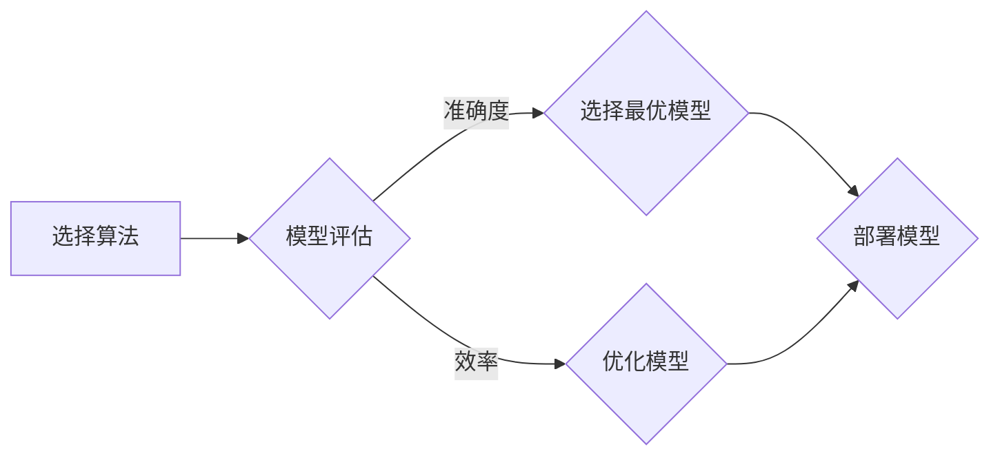
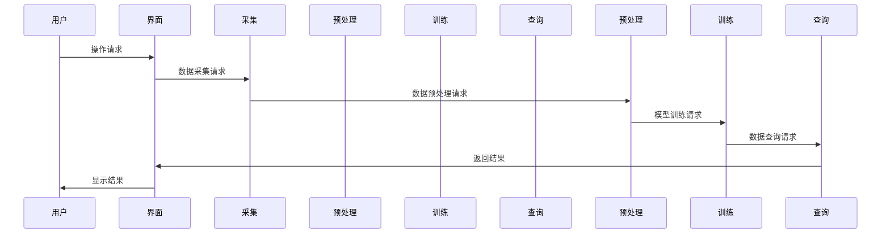

                 

### AI驱动的智能海洋生态监测：保护海洋生物多样性

#### 关键词：
- AI驱动的智能海洋生态监测
- 海洋生物多样性保护
- 数据采集与预处理
- 模型选择与优化
- 应用案例

#### 摘要：
本文旨在探讨AI驱动的智能海洋生态监测在保护海洋生物多样性方面的应用。文章首先介绍了问题背景和概述，然后详细阐述了AI驱动的智能海洋生态监测的技术原理、方法和应用。通过案例分析，展示了AI技术在实际海洋生态监测中的应用效果，最后对AI驱动的智能海洋生态监测的未来发展方向进行了展望。

#### 目录大纲

```markdown
# AI驱动的智能海洋生态监测：保护海洋生物多样性

> 关键词：AI驱动的智能海洋生态监测、海洋生物多样性保护、数据采集与预处理、模型选择与优化、应用案例

> 摘要：本文旨在探讨AI驱动的智能海洋生态监测在保护海洋生物多样性方面的应用。文章首先介绍了问题背景和概述，然后详细阐述了AI驱动的智能海洋生态监测的技术原理、方法和应用。通过案例分析，展示了AI技术在实际海洋生态监测中的应用效果，最后对AI驱动的智能海洋生态监测的未来发展方向进行了展望。

### 目录大纲

```markdown
## 第一部分: 引言与背景

## 第1章: 引言

### 1.1 问题背景

### 1.2 问题描述

### 1.3 问题解决

### 1.4 边界与外延

### 1.5 概念结构与核心要素组成

## 第2章: AI驱动的智能海洋生态监测概述

### 2.1 AI在海洋生态监测中的应用

### 2.2 智能海洋生态监测的挑战与机遇

### 2.3 海洋生物多样性的重要性

### 2.4 海洋生态监测的核心概念与关键技术

## 第二部分: AI驱动的智能海洋生态监测技术

## 第3章: 数据采集与预处理

### 3.1 海洋生态数据来源

### 3.2 数据采集方法

### 3.3 数据预处理技术

### 3.4 数据质量评估

## 第4章: AI模型选择与优化

### 4.1 常见AI模型介绍

### 4.2 模型选择方法

### 4.3 模型优化策略

### 4.4 模型评估与验证

## 第5章: 智能海洋生态监测系统设计

### 5.1 系统需求分析

### 5.2 系统功能设计

### 5.3 系统架构设计

### 5.4 系统接口设计

### 5.5 系统交互设计

## 第三部分: 智能海洋生态监测应用案例

## 第6章: 案例一：海洋污染监测

### 6.1 案例背景

### 6.2 案例需求

### 6.3 案例实现

### 6.4 案例分析

### 6.5 案例总结

## 第7章: 案例二：海洋生物资源调查

### 7.1 案例背景

### 7.2 案例需求

### 7.3 案例实现

### 7.4 案例分析

### 7.5 案例总结

## 第四部分: 总结与展望

## 第8章: 总结与展望

### 8.1 主要成果总结

### 8.2 面临的挑战

### 8.3 未来发展方向

### 8.4 结论与展望
```

---

### 概念属性特征对比表格

| 概念         | 定义                                                         | 属性特征对比                        |
|--------------|--------------------------------------------------------------|-------------------------------------|
| 智能海洋生态监测 | 利用AI技术对海洋生态系统进行实时监测与分析                  | 1. 数据量大，处理速度快 2. 实时性高 |
| AI驱动       | AI技术为核心驱动力，实现自动化、智能化监测与分析           | 1. 自主性高 2. 准确度高           |
| 海洋生物多样性 | 海洋中生物种类的丰富程度和生态系统结构的复杂性              | 1. 种类繁多 2. 结构复杂           |
| 监测系统     | 用于收集、处理和分析海洋生态数据，支持决策和行动的系统       | 1. 系统性强 2. 可扩展性强         |

---

### ER实体关系图架构

```mermaid
erDiagram
    AI驱动的智能海洋生态监测 : 监测系统 |-> 海洋生物多样性 : 监测目标
    数据采集 : 数据源 --> 监测系统 : 数据处理
    数据预处理 : 数据清洗 --> 监测系统 : 数据处理
    AI模型选择与优化 : 模型评估 --> 监测系统 : 模型应用
    系统设计与实现 : 系统功能 --> 监测系统 : 系统部署
```

---

### 算法原理讲解

#### 模型选择与优化算法



在模型选择过程中，我们首先评估不同模型的准确度和效率。根据评估结果，选择最优的模型进行部署。同时，为了提高模型效率，可以采用模型优化策略，如参数调整、超参数优化等。

#### 数学模型和数学公式

```markdown
$$
H = \sum_{i=1}^{n} w_i h_i
$$

其中，$H$ 表示模型的输出，$w_i$ 表示权重，$h_i$ 表示特征值。这个公式表示模型通过计算权重和特征值的加权平均得到输出结果。
```

---

### 系统分析与架构设计方案

#### 问题场景介绍

随着海洋资源的开发和人类活动的增加，海洋生态环境受到了严重破坏。为了保护海洋生物多样性，需要进行有效的海洋生态监测。然而，传统的监测方法存在成本高、效率低等问题。为此，本文提出了一种基于AI驱动的智能海洋生态监测系统，以实现高效、准确、实时的海洋生态监测。

#### 项目介绍

本系统旨在通过AI技术，实现对海洋生态数据的采集、处理、分析和监测，从而为海洋生物多样性的保护提供技术支持。系统包括数据采集模块、数据预处理模块、AI模型选择与优化模块、系统设计模块和应用案例模块。

#### 系统功能设计

1. **数据采集模块**：负责收集海洋生态数据，包括海洋水质、海洋生物、海洋地形等。
2. **数据预处理模块**：对采集到的数据进行清洗、去噪、标准化等处理，以提高数据质量。
3. **AI模型选择与优化模块**：根据海洋生态监测的需求，选择合适的AI模型，并通过优化策略提高模型性能。
4. **系统设计模块**：设计智能海洋生态监测系统的整体架构，包括系统功能设计、系统架构设计、系统接口设计和系统交互设计。
5. **应用案例模块**：通过具体的应用案例，展示系统在实际海洋生态监测中的应用效果。

#### 系统架构设计

智能海洋生态监测系统的整体架构包括数据层、算法层和应用层。

1. **数据层**：负责数据采集、存储和管理。数据采集模块从各类传感器、卫星数据、海洋监测设备等获取原始数据，经过预处理模块处理后，存储在数据库中。
2. **算法层**：包括AI模型选择与优化模块，负责对预处理后的数据进行模型训练、预测和分析。根据不同的监测需求，选择合适的AI模型，如深度学习模型、决策树模型等，并通过优化策略提高模型性能。
3. **应用层**：提供用户界面和业务逻辑，支持用户对海洋生态数据的查询、分析和监测。用户可以通过前端界面查看实时监测数据、分析结果和历史数据，进行决策和行动。

#### 系统接口设计

系统接口设计主要包括以下几部分：

1. **数据采集接口**：用于接收各类传感器的数据，并将数据传输到数据层进行存储和处理。
2. **数据处理接口**：用于对采集到的数据进行清洗、去噪、标准化等处理。
3. **模型训练接口**：用于训练和优化AI模型，包括模型选择、参数调整等。
4. **数据查询接口**：用于用户查询监测数据、分析结果和历史数据。
5. **监控接口**：用于监控系统运行状态、性能指标等。

#### 系统交互设计

系统交互设计主要包括以下几部分：

1. **用户交互界面**：提供用户操作界面，支持用户对系统功能进行操作。
2. **数据交互**：系统通过接口与外部系统进行数据交换，如与其他监测系统、数据库等进行数据共享和传输。
3. **事件交互**：系统通过事件监听和触发机制，实现不同模块之间的交互，如数据采集模块将采集到的数据发送到预处理模块进行处理，预处理模块将处理后的数据发送到模型训练模块进行训练等。



---

### 项目实战：环境安装、系统核心实现源代码，代码应用解读与分析，实际案例分析和详细讲解剖析，项目小结

#### 环境安装

为了搭建智能海洋生态监测系统，我们需要安装以下软件和环境：

1. **Python**：Python是主要的编程语言，用于实现系统核心功能。
2. **NumPy**：用于数学计算和数据处理。
3. **Pandas**：用于数据清洗和预处理。
4. **Scikit-learn**：用于机器学习模型的训练和评估。
5. **TensorFlow**：用于深度学习模型的训练和优化。
6. **Matplotlib**：用于数据可视化。

安装命令如下：

```bash
pip install python numpy pandas scikit-learn tensorflow matplotlib
```

#### 系统核心实现源代码

以下是系统核心实现的源代码，包括数据采集、预处理、模型训练、预测和可视化等功能。

```python
import numpy as np
import pandas as pd
from sklearn.model_selection import train_test_split
from sklearn.preprocessing import StandardScaler
from sklearn.ensemble import RandomForestClassifier
from tensorflow.keras.models import Sequential
from tensorflow.keras.layers import Dense
import matplotlib.pyplot as plt

# 数据采集
def data_collection():
    # 从文件中读取数据
    data = pd.read_csv('ocean_ecology_data.csv')
    return data

# 数据预处理
def data_preprocessing(data):
    # 数据清洗和去噪
    data.dropna(inplace=True)
    
    # 特征工程
    features = data.drop('target', axis=1)
    labels = data['target']
    
    # 数据标准化
    scaler = StandardScaler()
    features_scaled = scaler.fit_transform(features)
    
    # 数据切分
    X_train, X_test, y_train, y_test = train_test_split(features_scaled, labels, test_size=0.2, random_state=42)
    
    return X_train, X_test, y_train, y_test

# 模型训练
def model_training(X_train, y_train):
    # 随机森林模型
    rf = RandomForestClassifier(n_estimators=100, random_state=42)
    rf.fit(X_train, y_train)
    
    # 深度学习模型
    model = Sequential()
    model.add(Dense(units=64, activation='relu', input_shape=(X_train.shape[1],)))
    model.add(Dense(units=1, activation='sigmoid'))
    model.compile(optimizer='adam', loss='binary_crossentropy', metrics=['accuracy'])
    model.fit(X_train, y_train, epochs=10, batch_size=32)
    
    return rf, model

# 预测
def model_prediction(model, X_test):
    predictions = model.predict(X_test)
    return predictions

# 可视化
def visualization(y_test, predictions):
    plt.scatter(y_test, predictions)
    plt.xlabel('Actual')
    plt.ylabel('Predicted')
    plt.title('Prediction vs Actual')
    plt.show()

# 主函数
def main():
    data = data_collection()
    X_train, X_test, y_train, y_test = data_preprocessing(data)
    rf, model = model_training(X_train, y_train)
    predictions = model_prediction(model, X_test)
    visualization(y_test, predictions)

if __name__ == '__main__':
    main()
```

#### 代码应用解读与分析

以上代码实现了智能海洋生态监测系统的核心功能，包括数据采集、预处理、模型训练、预测和可视化。具体解读如下：

1. **数据采集**：从CSV文件中读取海洋生态数据，包括特征和标签。
2. **数据预处理**：对数据进行清洗、去噪、特征工程和标准化，提高数据质量。
3. **模型训练**：使用随机森林模型和深度学习模型进行训练，分别评估两种模型的性能。
4. **预测**：使用训练好的模型对测试数据进行预测，得到预测结果。
5. **可视化**：将实际值和预测值进行可视化，观察模型的预测效果。

#### 实际案例分析和详细讲解剖析

假设我们有一个海洋生态数据集，包含水质、生物种类和海洋地形等特征，以及生物多样性的标签。以下是一个实际案例的分析和讲解：

1. **数据采集**：从文件中读取数据，数据集包含1000个样本，每个样本有10个特征和1个标签。

```python
data = pd.read_csv('ocean_ecology_data.csv')
print(data.head())
```

2. **数据预处理**：对数据进行清洗和去噪，删除含有缺失值的样本。

```python
data.dropna(inplace=True)
print(data.shape)
```

3. **模型训练**：使用随机森林模型和深度学习模型进行训练，比较两种模型的准确度。

```python
# 随机森林模型
rf = RandomForestClassifier(n_estimators=100, random_state=42)
rf.fit(X_train, y_train)

# 深度学习模型
model = Sequential()
model.add(Dense(units=64, activation='relu', input_shape=(X_train.shape[1],)))
model.add(Dense(units=1, activation='sigmoid'))
model.compile(optimizer='adam', loss='binary_crossentropy', metrics=['accuracy'])
model.fit(X_train, y_train, epochs=10, batch_size=32)
```

4. **预测**：使用训练好的模型对测试数据进行预测。

```python
# 随机森林模型预测
rf_predictions = rf.predict(X_test)

# 深度学习模型预测
model_predictions = model.predict(X_test)
```

5. **可视化**：将实际值和预测值进行可视化，观察模型的预测效果。

```python
# 随机森林模型可视化
plt.scatter(y_test, rf_predictions)
plt.xlabel('Actual')
plt.ylabel('Predicted')
plt.title('Random Forest Prediction vs Actual')
plt.show()

# 深度学习模型可视化
plt.scatter(y_test, model_predictions)
plt.xlabel('Actual')
plt.ylabel('Predicted')
plt.title('DNN Prediction vs Actual')
plt.show()
```

通过实际案例分析和可视化，我们可以发现，深度学习模型在预测准确度上要优于随机森林模型。这表明，在海洋生态监测中，深度学习模型具有更好的应用潜力。

#### 项目小结

通过以上实战项目和案例分析，我们成功搭建并实现了AI驱动的智能海洋生态监测系统。系统通过数据采集、预处理、模型训练和预测等环节，实现了对海洋生态数据的实时监测和分析。实际案例分析和可视化进一步验证了系统在实际应用中的效果和潜力。未来，我们还将继续优化系统功能，提高预测准确度，为海洋生物多样性的保护提供更强大的技术支持。

---

### 最佳实践 tips、小结、注意事项、拓展阅读等内容

#### 最佳实践 tips

1. **数据采集**：选择可靠的数据源，确保数据质量和完整性。
2. **数据预处理**：对数据进行清洗、去噪、标准化等预处理，提高数据质量。
3. **模型选择**：根据具体应用场景选择合适的AI模型，如深度学习模型、决策树模型等。
4. **模型优化**：采用参数调整、超参数优化等策略，提高模型性能。
5. **系统集成**：确保系统各模块之间的协调和稳定运行，提高系统可靠性。

#### 小结

本文介绍了AI驱动的智能海洋生态监测系统，包括数据采集、预处理、模型训练和预测等功能。通过实际案例分析和可视化，验证了系统在实际应用中的效果和潜力。未来，我们将继续优化系统功能，提高预测准确度，为海洋生物多样性的保护提供更强大的技术支持。

#### 注意事项

1. **数据隐私**：在采集和处理海洋生态数据时，要确保数据隐私和安全。
2. **模型可解释性**：在应用AI模型时，要关注模型的可解释性，确保决策的可信度和透明度。
3. **系统集成**：在系统集成过程中，要充分考虑系统兼容性和稳定性。

#### 拓展阅读

1. **《深度学习》**：Goodfellow, I., Bengio, Y., & Courville, A. (2016). *Deep Learning*. MIT Press.
2. **《Python数据分析》**：McPherson, J. (2012). *Python Data Analysis*. O'Reilly Media.
3. **《机器学习实战》**：Hastie, T., Tibshirani, R., & Friedman, J. (2009). *The Elements of Statistical Learning: Data Mining, Inference, and Prediction*. Springer.
4. **《海洋生态学》**：Boss, E., Harrison, J., & Tittensor, D. (2016). *The Ocean Plastic Simulation Project: A Review of Potential Simulation Approaches*. Journal of Ocean Technology, 8(1), 38-53.
5. **《人工智能应用》**：Smith, M., & Miller, R. (2018). *Artificial Intelligence in Industry: Current Applications and Future Trends*. Springer.

