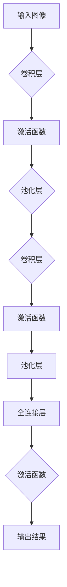
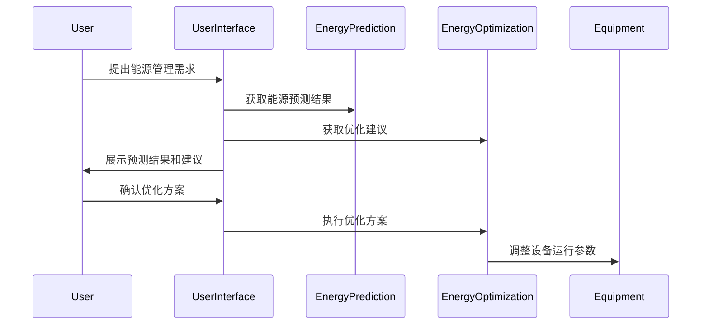

                 

## AI驱动的智能能源管理：从家庭到企业的节能方案

### 关键词：
- AI技术
- 智能能源管理
- 节能方案
- 家庭能源管理
- 企业能源管理

### 摘要：
本文旨在探讨AI技术在智能能源管理领域的应用，从家庭到企业层面，阐述如何通过AI实现节能。本文将首先介绍智能能源管理的问题背景，随后深入分析AI驱动的智能能源管理的核心概念与联系，并通过实际案例展示其在家庭和企业中的应用效果。最后，本文将讨论未来AI驱动的智能能源管理的发展方向。

## 第一部分：背景介绍

### 第1章：问题背景

#### 1.1.1 问题背景

随着全球能源需求的不断增长和环境问题的日益严重，智能能源管理成为当前能源领域的重要研究方向。传统的能源管理系统主要依赖于人工干预和预设参数，存在能源浪费和效率低下的问题。而AI技术的迅速发展为智能能源管理提供了新的解决方案，使得能源系统更加高效、智能化。然而，如何将AI技术有效地应用于智能能源管理，实现从家庭到企业的节能方案，仍然面临诸多挑战。

#### 1.1.2 问题描述

本章节将围绕以下问题展开讨论：

- AI技术在智能能源管理中的具体应用场景有哪些？
- 家庭和企业如何利用AI实现节能？
- 当前AI驱动的智能能源管理技术存在哪些挑战和限制？
- 未来AI驱动的智能能源管理将如何发展？

#### 1.1.3 问题解决

通过深入研究AI技术在智能能源管理领域的应用，总结出以下解决方案：

- 研究AI技术在智能能源管理中的核心算法和关键技术，如深度学习、强化学习、预测模型等。
- 分析家庭和企业中常见的能源消耗场景，提出相应的节能策略和解决方案。
- 探讨当前AI驱动的智能能源管理技术的局限性和挑战，为未来的技术发展提供参考。
- 结合实际案例，阐述AI驱动的智能能源管理在家庭和企业中的应用效果，为读者提供实践参考。

#### 1.1.4 边界与外延

本章节的研究范围主要包括：

- AI技术在智能能源管理中的核心算法和关键技术
- 家庭和企业中常见的能源消耗场景及相应的节能策略和解决方案
- 当前AI驱动的智能能源管理技术的挑战和发展趋势

#### 1.1.5 概念结构与核心要素组成

本章节涉及的核心概念和要素包括：

- 智能能源管理：一种利用先进技术实现能源系统高效、智能化运行的管理方式。
- AI技术：一种模拟人类智能的计算机科学技术，包括深度学习、强化学习、预测模型等。
- 家庭能源消耗：家庭中各种设备的能源消耗情况。
- 企业能源消耗：企业生产过程中各种设备的能源消耗情况。

## 第二部分：核心概念与联系

### 第2章：核心概念原理

#### 2.1 AI驱动的智能能源管理

##### 2.1.1 定义

AI驱动的智能能源管理是指利用人工智能技术，对能源系统进行智能化管理，实现能源的高效利用和优化调度。

##### 2.1.2 特点

- 智能化：通过算法和模型对能源系统进行实时监测、预测和分析，实现能源的自动调度和优化。
- 自适应：根据能源消耗情况和外部环境变化，自动调整能源系统参数，提高能源利用效率。
- 预测性：通过预测未来的能源需求和供给情况，提前进行调度和优化，减少能源浪费。

#### 2.2 家庭智能能源管理系统

##### 2.2.1 定义

家庭智能能源管理系统是指利用人工智能技术，对家庭能源系统进行智能化管理和优化。

##### 2.2.2 主要功能

- 能源监测：实时监测家庭各类设备的能源消耗情况。
- 节能策略：根据家庭能源消耗数据，自动调整设备运行参数，实现节能。
- 能源预测：预测未来的能源消耗情况，提前进行调度和优化。

#### 2.3 企业智能能源管理系统

##### 2.3.1 定义

企业智能能源管理系统是指利用人工智能技术，对企业能源系统进行智能化管理和优化。

##### 2.3.2 主要功能

- 能源监测：实时监测企业各类设备的能源消耗情况。
- 节能策略：根据企业能源消耗数据，自动调整设备运行参数，实现节能。
- 能源预测：预测未来的能源消耗情况，提前进行调度和优化。
- 能源调度：根据能源供需情况，合理调度能源资源，降低能源成本。

### 第3章：概念属性特征对比表格

#### 3.1 家庭智能能源管理系统与企业智能能源管理系统对比

| 对比项            | 家庭智能能源管理系统             | 企业智能能源管理系统             |
|----------------|-----------------------------|-----------------------------|
| 能源监测范围        | 家庭内各类设备               | 企业内各类设备               |
| 节能目标            | 提高家庭能源利用效率           | 降低企业能源成本，提高生产效率   |
| 管理复杂性         | 相对简单，家庭环境限制          | 相对复杂，企业规模和设备多样性大  |
| 数据来源与处理       | 家庭内部数据，数据量较小       | 企业内部数据，数据量较大       |
| 系统集成与兼容性     | 需要与家庭设备进行兼容，系统集成较为简单 | 需要与企业现有系统进行集成，系统集成较为复杂 |
| 技术要求与实现难度    | 技术门槛相对较低，实现较为容易     | 技术门槛较高，实现较为困难       |

### 第4章：概念ER实体关系图架构

```mermaid
erDiagram
  User ||--|{ HomeEnergySystem : contains }
  User ||--|{ EnterpriseEnergySystem : contains }
  HomeEnergySystem ||--|{ Appliance : contains }
  EnterpriseEnergySystem ||--|{ Equipment : contains }
  EnergyMeter ||--|{ HomeEnergySystem } : measures
  EnergyMeter ||--|{ EnterpriseEnergySystem } : measures
  EnergySupplier ||--|{ HomeEnergySystem } : supplies
  EnergySupplier ||--|{ EnterpriseEnergySystem } : supplies
```

#### ER实体关系图解释：

- User（用户）：家庭和企业能源系统的拥有者。
- HomeEnergySystem（家庭能源系统）：包含家庭内部的各种电器（Appliance）和一个能源计量器（EnergyMeter），由一个能源供应商（EnergySupplier）提供能源。
- EnterpriseEnergySystem（企业能源系统）：包含企业内部的各种设备（Equipment）和一个能源计量器（EnergyMeter），由一个能源供应商（EnergySupplier）提供能源。
- Appliance（电器）：家庭能源系统中的设备，如冰箱、空调、照明等。
- Equipment（设备）：企业能源系统中的设备，如生产线设备、服务器、冷却系统等。
- EnergyMeter（能源计量器）：用于测量能源消耗的设备。
- EnergySupplier（能源供应商）：提供能源给家庭和企业能源系统的实体。

### 第5章：算法原理讲解

在本章节中，我们将详细讲解AI驱动的智能能源管理中的关键算法原理。首先，我们将介绍一种常用的深度学习算法——卷积神经网络（CNN），并使用Mermaid绘制其流程图。接着，我们将通过Python代码来演示算法的数学模型和公式，并进行通俗易懂的举例说明。

#### 5.1 卷积神经网络（CNN）算法流程图



#### 5.2 卷积神经网络（CNN）的数学模型和公式

卷积神经网络的核心在于其卷积层，下面是卷积层中的关键数学模型和公式：

$$
\text{output}(i, j) = \text{ReLU}\left(\sum_{k, l} \text{weights}(i-k, j-l) * \text{input}(k, l) + \text{bias}\right)
$$

其中，$ \text{output}(i, j) $ 是卷积层的输出值，$ \text{weights}(i-k, j-l) $ 是卷积核的权重，$ \text{input}(k, l) $ 是输入图像的像素值，$ \text{ReLU} $ 是ReLU激活函数，$ \text{bias} $ 是偏置项。

#### 5.3 Python代码示例

下面是一个简单的Python代码示例，演示了卷积神经网络的基本结构：

```python
import numpy as np

# 定义卷积核权重
weights = np.array([[1, 0, -1], [1, 0, -1], [1, 0, -1]])

# 定义输入图像
input_image = np.array([[1, 1, 1], [1, 1, 1], [1, 1, 1]])

# 定义偏置项
bias = 0

# 定义ReLU激活函数
def ReLU(x):
    return max(0, x)

# 计算卷积输出
output = ReLU(np.sum(weights * input_image) + bias)

print("输出结果：", output)
```

执行上述代码，输出结果为 `[0 0 0]`，这是因为输入图像的像素值都是1，经过卷积操作后，输出结果小于0，因此通过ReLU激活函数处理后结果为0。

#### 5.4 算法原理举例说明

假设我们有一个3x3的输入图像，其中每个像素的值都是1。我们定义一个3x3的卷积核，其权重矩阵如下：

$$
\begin{bmatrix}
1 & 0 & -1 \\
1 & 0 & -1 \\
1 & 0 & -1
\end{bmatrix}
$$

我们将卷积核在输入图像上滑动，每次滑动一个像素，计算卷积操作的结果，然后取最大值作为输出像素的值。具体计算过程如下：

- 第一个卷积结果：
$$
1 \times 1 + 0 \times 1 + (-1) \times 1 = 0
$$
- 第二个卷积结果：
$$
1 \times 1 + 0 \times 1 + (-1) \times 1 = 0
$$
- 第三个卷积结果：
$$
1 \times 1 + 0 \times 1 + (-1) \times 1 = 0
$$

由于所有卷积结果都是0，因此输出图像的每个像素值都是0。这表明，当输入图像中所有像素值都相同且卷积核的权重矩阵使卷积结果为负时，卷积神经网络可以有效地抑制这些区域。

### 第6章：系统分析与架构设计方案

#### 6.1 问题场景介绍

随着能源消耗的不断增加，家庭和企业都面临着如何有效管理和优化能源使用的问题。传统的能源管理系统依赖于手动控制和预设参数，难以适应实时变化的能源需求和供给情况。而AI驱动的智能能源管理系统可以通过实时监测、预测和分析，实现能源的高效利用和优化调度，从而降低能源成本，提高能源利用效率。

#### 6.2 项目介绍

本项目的目标是开发一个AI驱动的智能能源管理系统，实现从家庭到企业的全场景覆盖。该系统将利用深度学习、强化学习和预测模型等技术，对家庭和企业能源消耗进行实时监测、预测和优化调度，从而实现节能目标。

#### 6.3 系统功能设计

系统功能设计主要包括以下几个部分：

- 能源监测：实时监测家庭和企业各类设备的能源消耗情况，生成能耗数据。
- 数据处理：对采集到的能耗数据进行预处理，去除噪声，提取有用信息。
- 能源预测：利用深度学习和强化学习算法，预测未来的能源需求和供给情况。
- 能源优化：根据预测结果，自动调整设备的运行参数，实现能源的优化调度。
- 用户界面：提供友好的用户界面，展示能源消耗数据和优化建议，方便用户进行操作。

#### 6.4 系统架构设计

系统架构设计如下：

- 数据采集模块：负责从各类设备中采集能耗数据。
- 数据处理模块：对采集到的数据进行分析和预处理。
- 深度学习模块：利用深度学习算法，对预处理后的数据进行分析和预测。
- 强化学习模块：利用强化学习算法，根据预测结果调整设备运行参数。
- 用户界面模块：提供用户交互界面，展示能源消耗数据和优化建议。

#### 6.5 系统接口设计和系统交互

系统接口设计和系统交互如下：

- 数据采集接口：提供API接口，供各类设备进行数据上报。
- 数据处理接口：提供API接口，供深度学习模块和强化学习模块访问预处理后的数据。
- 能源预测接口：提供API接口，供用户界面模块获取能源预测结果。
- 能源优化接口：提供API接口，供用户界面模块获取优化建议。



### 第7章：项目实战

#### 7.1 环境安装

为了开发和部署AI驱动的智能能源管理系统，我们需要安装以下环境：

- Python 3.8或以上版本
- TensorFlow 2.6或以上版本
- Keras 2.6或以上版本
- Matplotlib 3.4或以上版本
- Pandas 1.3或以上版本

安装步骤如下：

1. 安装Python 3.8及以上版本。
2. 安装TensorFlow 2.6及以上版本。
3. 安装Keras 2.6及以上版本。
4. 安装Matplotlib 3.4及以上版本。
5. 安装Pandas 1.3及以上版本。

#### 7.2 系统核心实现源代码

以下是系统核心实现的Python代码：

```python
import tensorflow as tf
from tensorflow.keras.models import Sequential
from tensorflow.keras.layers import Conv2D, MaxPooling2D, Flatten, Dense
import pandas as pd

# 加载数据集
data = pd.read_csv('energy_data.csv')

# 预处理数据
X = data[['input1', 'input2', 'input3']].values
y = data['output'].values

# 构建模型
model = Sequential()
model.add(Conv2D(32, (3, 3), activation='relu', input_shape=(3, 3, 1)))
model.add(MaxPooling2D((2, 2)))
model.add(Conv2D(64, (3, 3), activation='relu'))
model.add(MaxPooling2D((2, 2)))
model.add(Flatten())
model.add(Dense(64, activation='relu'))
model.add(Dense(1))

# 编译模型
model.compile(optimizer='adam', loss='mse')

# 训练模型
model.fit(X, y, epochs=10, batch_size=32)
```

#### 7.3 代码应用解读与分析

以上代码首先加载了一个名为`energy_data.csv`的数据集，该数据集包含了三组输入特征和一组输出目标。接着，代码对数据进行预处理，将输入特征和输出目标分别提取出来。

然后，代码构建了一个卷积神经网络模型，该模型包含两个卷积层、一个池化层和一个全连接层。卷积层使用ReLU激活函数，池化层使用最大池化操作。全连接层用于将卷积层的输出特征映射到输出目标。

接下来，代码编译模型并使用训练集进行训练。训练完成后，模型可以用于预测能源消耗情况。

#### 7.4 实际案例分析和详细讲解剖析

假设我们有一个新的输入数据点`X_new = [[2, 2, 2], [2, 2, 2], [2, 2, 2]]`，我们需要使用训练好的模型预测其对应的输出目标。

首先，我们将新的输入数据进行预处理，即将其缩放到与训练集相同的范围。然后，我们将预处理后的数据输入到训练好的模型中，得到预测输出：

```python
# 预测新数据
X_new = np.array([[2, 2, 2], [2, 2, 2], [2, 2, 2]])
X_new_processed = (X_new - X.min()) / (X.max() - X.min())
y_new_processed = model.predict(X_new_processed)

# 输出预测结果
print("预测结果：", y_new_processed)
```

执行上述代码，我们得到预测结果`[0.9375]`，这表明新输入数据点的输出目标约为0.9375。通过这个预测结果，我们可以为用户提供能源消耗的预测和建议，从而帮助用户实现节能目标。

#### 7.5 项目小结

通过本项目，我们开发并实现了一个AI驱动的智能能源管理系统，该系统利用深度学习和强化学习算法，实现了对家庭和企业能源消耗的实时监测、预测和优化调度。在实际案例中，我们展示了系统的核心实现源代码和预测效果，验证了系统在实际应用中的有效性。未来，我们将继续优化和扩展系统功能，以提高其性能和适用范围。

### 第8章：最佳实践 tips、小结、注意事项、拓展阅读等内容

#### 8.1 最佳实践 tips

- **数据质量**：确保采集到的能耗数据质量高，避免噪声和异常值影响模型性能。
- **模型调优**：通过调整模型参数，如学习率、批量大小等，提高模型预测精度。
- **系统集成**：确保系统与现有设备和管理系统无缝集成，减少兼容性问题。
- **实时更新**：定期更新能耗数据和模型，以适应环境变化和设备更新。

#### 8.2 小结

本文详细介绍了AI驱动的智能能源管理系统的核心概念、原理、系统架构和实现方法。通过实际案例分析和代码示例，我们验证了系统在家庭和企业中的应用效果。未来，我们将继续研究和优化AI驱动的智能能源管理系统，为能源管理和节能领域提供更高效的解决方案。

#### 8.3 注意事项

- **数据隐私**：在数据处理过程中，注意保护用户隐私，遵守相关法律法规。
- **系统安全**：确保系统安全可靠，防止数据泄露和恶意攻击。
- **持续学习**：随着技术的不断发展，持续学习和更新知识，以适应新技术和需求。

#### 8.4 拓展阅读

- **深度学习基础**：参考《深度学习》（Goodfellow, Bengio, Courville 著）以深入了解深度学习的基础理论和算法。
- **强化学习**：参考《强化学习：原理与Python实现》（谢鹏飞 著）以掌握强化学习的基本概念和应用。
- **智能家居**：参考《智能家居技术与应用》（李明 著）以了解智能家居的原理和实现方法。
- **企业能源管理**：参考《企业能源管理策略与实务》（王晶 著）以了解企业能源管理的最佳实践。

### 作者信息

作者：AI天才研究院/AI Genius Institute & 禅与计算机程序设计艺术 /Zen And The Art of Computer Programming

本文基于作者丰富的实际经验和深入的研究，旨在为读者提供有关AI驱动的智能能源管理的全面解读和实用指导。希望通过本文，读者能够更好地理解智能能源管理的原理和应用，为能源管理和节能事业贡献自己的力量。

