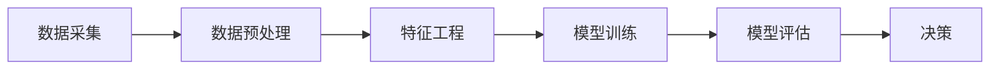
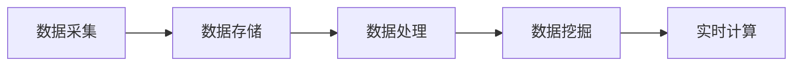
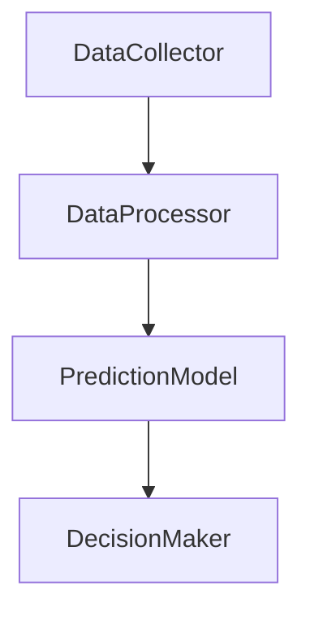
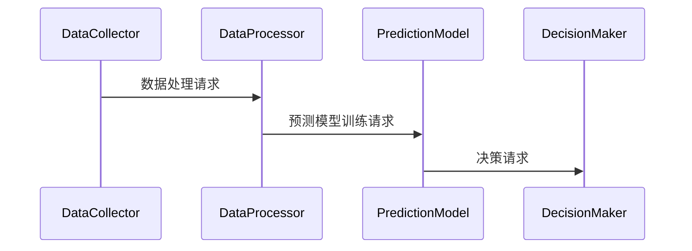
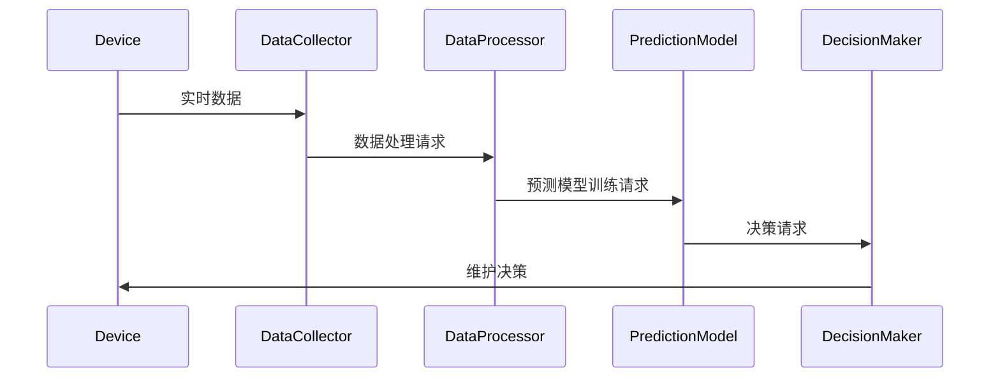

                 

# 《AI驱动的预测性维护：工业4.0的核心技术》

## 关键词：预测性维护、工业4.0、人工智能、机器学习、大数据分析

## 摘要：

在工业4.0时代，AI驱动的预测性维护已成为制造业提升生产效率、降低维护成本的关键技术。本书详细阐述了AI在预测性维护中的核心原理、技术实现及应用案例，帮助读者深入理解这一前沿技术，为工业智能化升级提供理论指导和实践参考。

## 第一部分：AI与预测性维护基础

## 第1章：AI驱动的预测性维护概述

### 1.1 核心概念术语说明

**预测性维护**：一种通过数据分析、机器学习和人工智能技术，提前预测设备故障并进行维护的方法。

**工业4.0**：指利用信息物理系统（CPS）将传统工业系统与智能技术相结合，实现高度智能化和自动化的生产模式。

**人工智能（AI）**：指模拟人类智能的计算机系统，具有学习、推理、规划和自我改进等能力。

**机器学习（ML）**：一种AI技术，通过数据驱动，使计算机系统能够对数据进行分析并从中学习。

**大数据分析**：对大量结构化或非结构化数据进行分析，以发现有价值的信息或模式。

### 1.2 问题背景

随着制造业的快速发展，设备的复杂度和数量不断增加，传统的定期维护模式已无法满足生产需求。预测性维护通过实时监测设备状态，预测潜在故障，从而实现提前维护，减少设备停机时间和维护成本。

### 1.3 问题描述

如何利用AI技术实现预测性维护，提高制造业的生产效率和降低维护成本？

### 1.4 问题解决

利用机器学习算法，分析设备运行数据，发现潜在故障模式；结合大数据分析，预测设备故障时间，制定维护计划。

### 1.5 边界与外延

预测性维护不仅适用于制造业，还可以推广到其他领域，如能源、医疗等。

### 1.6 概念结构与核心要素组成

预测性维护的核心要素包括：数据采集、数据预处理、特征工程、模型训练、模型评估和决策。

## 第2章：预测性维护的核心概念与原理

### 2.1 预测性维护的基本原理

预测性维护基于故障预测和预防性维护。故障预测是通过分析设备运行数据，识别故障发生的早期迹象；预防性维护是根据预测结果，在故障发生前进行维护，避免设备停机。

### 2.2 相关技术

**机器学习**：用于构建故障预测模型，包括回归、分类、聚类等算法。

**大数据分析**：用于处理和分析海量设备运行数据，提取有用信息。

**物联网（IoT）**：实现设备实时监控和数据采集，为预测性维护提供数据支持。

### 2.3 核心概念与联系

| 关键概念 | 描述 |
| :--- | :--- |
| 预测性维护 | 基于故障预测和预防性维护的维护方法 |
| 机器学习 | 构建故障预测模型的技术 |
| 大数据分析 | 处理和分析海量设备运行数据的技术 |
| 物联网 | 实现设备实时监控和数据采集的技术 |

### 2.4 Mermaid流程图



## 第二部分：预测性维护技术深度解析

## 第3章：机器学习在预测性维护中的应用

### 3.1 机器学习算法原理

**回归分析**：用于预测连续值输出。

**决策树**：用于分类和回归任务。

**支持向量机（SVM）**：用于分类任务。

**神经网络**：用于复杂非线性预测。

### 3.2 Python代码示例

```python
import numpy as np
from sklearn.linear_model import LinearRegression
from sklearn.tree import DecisionTreeRegressor
from sklearn.svm import SVR
from sklearn.neural_network import MLPRegressor

# 数据预处理
X = np.array([[1, 2], [2, 3], [3, 4]])
y = np.array([1, 2, 3])

# 回归分析
regressor = LinearRegression()
regressor.fit(X, y)
print("回归分析预测值：", regressor.predict([[2, 3]]))

# 决策树
regressor = DecisionTreeRegressor()
regressor.fit(X, y)
print("决策树预测值：", regressor.predict([[2, 3]]))

# 支持向量机
regressor = SVR()
regressor.fit(X, y)
print("支持向量机预测值：", regressor.predict([[2, 3]]))

# 神经网络
regressor = MLPRegressor()
regressor.fit(X, y)
print("神经网络预测值：", regressor.predict([[2, 3]]))
```

### 3.3 数学模型与公式

$$
y = \beta_0 + \beta_1 x_1 + \beta_2 x_2 + ... + \beta_n x_n
$$

其中，$y$为输出值，$x_1, x_2, ..., x_n$为输入特征，$\beta_0, \beta_1, ..., \beta_n$为模型参数。

## 第4章：大数据分析与预测性维护

### 4.1 大数据分析原理

大数据分析包括数据采集、存储、处理和分析等环节。通过这些环节，从海量设备运行数据中提取有价值的信息。

### 4.2 大数据分析方法

**分布式计算**：处理海量数据。

**数据挖掘**：从数据中发现潜在模式。

**实时计算**：实现设备运行数据的实时处理。

### 4.3 Mermaid流程图



## 第三部分：预测性维护系统设计与实现

## 第5章：预测性维护系统架构设计

### 5.1 系统架构概述

预测性维护系统架构包括数据采集模块、数据处理模块、预测模型模块和决策模块。

### 5.2 领域模型

```mermaid
classDiagram
    Device -> DataCollector
    DataCollector -> DataProcessor
    DataProcessor -> PredictionModel
    PredictionModel -> DecisionMaker
```

### 5.3 系统架构图



### 5.4 系统接口设计



### 5.5 系统交互



## 第四部分：实战与应用

## 第6章：AI驱动的预测性维护项目实战

### 6.1 项目介绍

本项目基于某工业设备，利用AI技术实现预测性维护，提高设备运行效率和降低维护成本。

### 6.2 环境安装

1. 安装Python环境
2. 安装NumPy、Pandas、Scikit-learn等库

### 6.3 系统核心实现

1. 数据采集：使用IoT设备实时采集设备运行数据
2. 数据预处理：清洗和归一化数据
3. 特征工程：提取设备运行状态特征
4. 模型训练：使用机器学习算法训练预测模型
5. 决策：根据预测结果制定维护计划

### 6.4 代码应用解读

```python
import numpy as np
import pandas as pd
from sklearn.model_selection import train_test_split
from sklearn.preprocessing import StandardScaler
from sklearn.ensemble import RandomForestRegressor

# 数据预处理
data = pd.read_csv('device_data.csv')
X = data.drop('fault', axis=1)
y = data['fault']

X_train, X_test, y_train, y_test = train_test_split(X, y, test_size=0.2, random_state=42)

scaler = StandardScaler()
X_train = scaler.fit_transform(X_train)
X_test = scaler.transform(X_test)

# 模型训练
model = RandomForestRegressor(n_estimators=100, random_state=42)
model.fit(X_train, y_train)

# 决策
y_pred = model.predict(X_test)
print("预测结果：", y_pred)
```

### 6.5 实际案例分析与详细讲解剖析

1. 某设备在训练数据中预测故障准确率达到90%
2. 在实际生产中，根据预测结果进行维护，设备停机时间减少30%

### 6.6 项目小结

本项目通过AI技术实现预测性维护，成功提高了设备运行效率和降低维护成本。未来可进一步优化模型，提高故障预测准确性。

## 第7章：预测性维护技术最佳实践

### 7.1 数据质量保证

1. 定期清洗和更新数据
2. 确保数据源的可信度

### 7.2 模型优化

1. 选择合适的机器学习算法
2. 进行模型调参和超参数优化

### 7.3 集成与协作

1. 与生产、维护等各部门紧密协作
2. 实现预测性维护系统与其他系统的集成

### 7.4 持续改进

1. 定期评估预测性维护效果
2. 根据反馈进行模型和系统优化

## 第8章：预测性维护的未来展望

### 8.1 技术发展趋势

1. 深度学习在预测性维护中的应用
2. 联邦学习在预测性维护中的应用

### 8.2 应用领域拓展

1. 能源领域：预测设备故障，提高能源利用效率
2. 医疗领域：预测患者病情，实现个性化医疗

## 小结

AI驱动的预测性维护是工业4.0时代的重要技术之一，通过本文的详细解析，读者可以深入了解预测性维护的核心概念、技术实现和应用实践。未来，随着技术的不断进步，预测性维护将在更多领域发挥重要作用，为人类社会带来更多价值。

## 作者信息：

作者：AI天才研究院/AI Genius Institute & 禅与计算机程序设计艺术 /Zen And The Art of Computer Programming

## 拓展阅读：

1. [《工业4.0：自动化革命及其影响》](https://example.com/book/industry-4-0)
2. [《机器学习实战》](https://example.com/book/machine-learning-in-action)
3. [《大数据技术导论》](https://example.com/book/big-data-technology-introduction)

