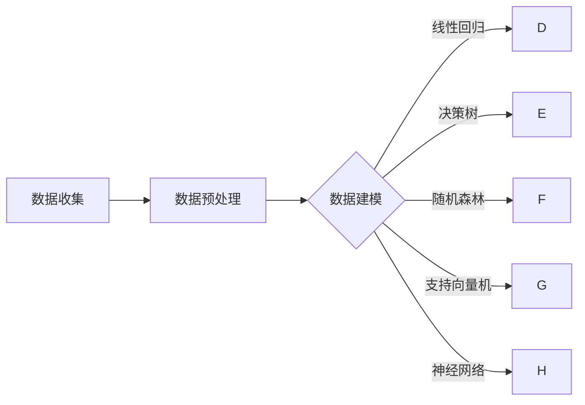
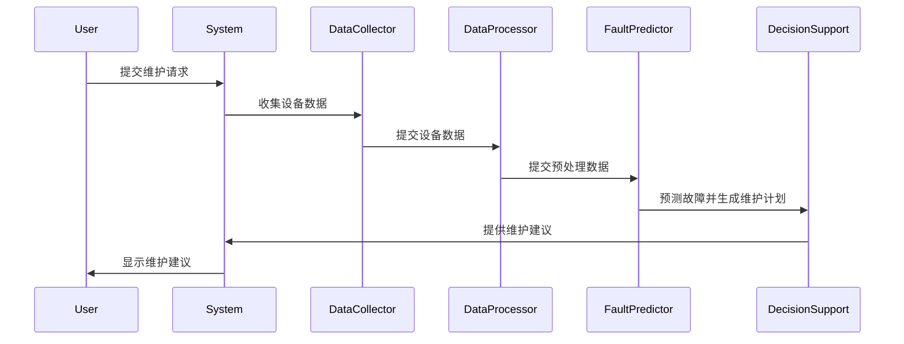
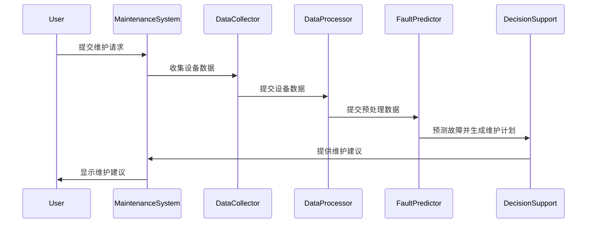

                 

### 文章标题：AI驱动的预测性维护：工业4.0的核心技术

### 关键词：AI，预测性维护，工业4.0，核心技术，数据分析，机器学习，算法

### 摘要：
本文深入探讨了AI驱动的预测性维护在工业4.0中的应用。通过详细分析预测性维护的定义、重要性、挑战与解决方案，本文阐述了AI技术在数据分析、机器学习和算法设计中的关键作用。文章进一步介绍了预测性维护的核心概念、联系以及系统架构设计，并通过实际项目案例展示了AI驱动的预测性维护的实战应用。最后，文章总结了最佳实践、注意事项，并对未来发展趋势进行了展望。

----------------------------------------------------------------

### 第一部分：背景介绍

#### 1.1 预测性维护的重要性

预测性维护（Predictive Maintenance）是指通过实时监控设备的运行状态，结合历史数据和算法分析，预测设备可能发生的故障，从而提前进行维护，以避免设备突发故障导致的停机损失。在工业生产中，设备的稳定运行对于整个生产过程的效率和安全至关重要。预测性维护的重要性体现在以下几个方面：

1. **提高设备可靠性**：通过预测性维护，可以及时发现设备潜在的问题，避免突发故障，从而延长设备的使用寿命，提高设备的可靠性。

2. **降低维护成本**：传统维护通常是在设备出现故障后进行，而预测性维护可以在故障发生前进行预防性维护，避免了不必要的紧急维修和停机时间，从而降低了维护成本。

3. **提高生产效率**：预测性维护能够优化维护计划，减少维护对生产流程的干扰，提高生产效率。

4. **提升安全生产**：通过预测性维护，可以有效降低设备故障带来的安全隐患，提升工业生产的安全性。

#### 1.2 工业发展的需求

随着工业4.0的推进，工业生产逐渐向智能化、自动化和数字化的方向发展。工业4.0的核心是利用信息技术和制造技术的深度融合，实现制造过程的智能化。在这种背景下，预测性维护的需求日益增加：

1. **智能化生产**：预测性维护是智能制造的重要组成部分，能够实现生产设备的实时监控和智能维护。

2. **数据驱动决策**：工业4.0强调数据驱动的决策，预测性维护通过收集和分析设备数据，为生产决策提供有力支持。

3. **优化生产流程**：预测性维护有助于优化生产流程，提高生产效率，降低成本。

#### 1.3 AI技术的影响

人工智能（AI）技术的发展为预测性维护带来了新的机遇。AI技术，特别是机器学习和深度学习，可以在数据处理、模式识别和智能决策等方面发挥重要作用：

1. **数据处理能力**：AI技术能够高效地处理大量设备数据，从中提取有价值的信息。

2. **模式识别**：通过机器学习算法，AI技术可以识别设备运行中的异常模式和故障预兆。

3. **智能决策**：基于对设备数据的分析，AI技术能够提供智能化的维护决策，优化维护策略。

----------------------------------------------------------------

#### 1.4 当前挑战

尽管AI驱动的预测性维护具有诸多优势，但在实际应用中仍面临以下挑战：

1. **数据质量**：预测性维护依赖于高质量的数据，但实际生产环境中数据的准确性、完整性和实时性往往难以保证。

2. **算法复杂性**：AI算法的复杂性使得实施和维护变得更加困难，需要专业的技术团队进行操作。

3. **成本问题**：部署AI驱动的预测性维护系统需要较高的初期投入，包括硬件、软件和人力资源等。

4. **系统集成**：将AI驱动的预测性维护系统与其他生产系统进行集成，实现数据共享和流程优化，是一个复杂的过程。

5. **人员培训**：AI技术的应用需要专业人员的培训和技能提升，而现有人员可能缺乏相关的知识和经验。

#### 1.5 预测性维护的目标

预测性维护的主要目标是：

1. **提高设备可靠性**：通过预测性维护，减少设备故障率，提高设备的运行可靠性。

2. **降低维护成本**：通过提前预测和预防性维护，降低紧急维修和停机成本。

3. **优化维护计划**：根据设备运行状态和预测结果，优化维护计划，减少对生产流程的干扰。

4. **提升安全生产**：通过预测性维护，降低设备故障带来的安全风险。

#### 1.6 边界与外延

预测性维护的边界在于其应用的领域和范围。其主要适用于需要高可靠性和连续性的设备，如制造业、能源行业和交通运输等。同时，预测性维护与其他相关技术的区别也需要明确：

1. **与定期维护的区别**：定期维护是按照固定的时间间隔进行维护，而预测性维护是根据设备运行状态和预测结果进行维护。

2. **与故障后维护的区别**：故障后维护是在设备发生故障后进行修复，而预测性维护是在故障发生前进行预防。

3. **与健康管理（PHM）的区别**：健康管理是一种更广义的维护概念，它不仅包括预测性维护，还包括设备的状态监测、诊断和剩余寿命预测等。

#### 1.7 本章小结

本部分介绍了预测性维护的定义、重要性、工业发展的需求以及AI技术的影响。同时，分析了当前面临的挑战和预测性维护的目标，并讨论了其边界与外延。通过这些内容，为后续章节的深入探讨奠定了基础。

----------------------------------------------------------------

### 第二部分：核心概念与联系

#### 2.1 AI技术介绍

人工智能（AI）是一种模拟人类智能的技术，通过计算机程序实现人类思维、感知和行动的能力。AI技术主要包括以下几个方面：

1. **机器学习**：机器学习是一种通过数据驱动的方法，使计算机自动改进性能的能力。它包括监督学习、无监督学习和强化学习等不同类型。

2. **深度学习**：深度学习是机器学习的一种方法，通过多层神经网络对数据进行建模和学习。它能够处理大量复杂数据，并从中提取有价值的特征。

3. **自然语言处理（NLP）**：自然语言处理是AI领域的一个分支，旨在使计算机理解和处理自然语言。

4. **计算机视觉**：计算机视觉是使计算机具备视觉感知能力的技术，可以用于图像识别、目标检测和场景理解等任务。

#### 2.2 预测性维护原理

预测性维护的核心原理是利用AI技术对设备运行数据进行分析和建模，预测设备可能发生的故障。具体流程如下：

1. **数据收集**：收集设备运行过程中的各种数据，如振动、温度、压力、电流等。

2. **数据处理**：对收集到的数据进行清洗、归一化和特征提取，为建模提供高质量的数据集。

3. **模型建立**：利用机器学习和深度学习算法，建立预测模型。常见的算法包括支持向量机（SVM）、决策树、随机森林和神经网络等。

4. **模型训练与优化**：通过历史数据对模型进行训练，并不断优化，提高预测准确性。

5. **故障预测**：利用训练好的模型，对当前设备运行状态进行分析，预测可能发生的故障。

6. **决策支持**：根据预测结果，为维护决策提供支持，制定合理的维护计划。

#### 2.3 工业4.0概述

工业4.0是德国政府提出的工业战略，旨在通过信息技术和制造技术的深度融合，实现智能制造。工业4.0的核心概念包括：

1. **智能化生产**：通过智能化设备和系统，实现生产过程的自动化和智能化。

2. **网络化工厂**：通过物联网（IoT）技术，实现设备、产品和工厂之间的互联互通。

3. **数据驱动决策**：通过大数据和云计算技术，实现生产决策的智能化和数据化。

4. **个性化定制**：通过个性化设计和制造，满足不同用户的需求。

5. **协同制造**：通过协同设计和制造，提高生产效率和降低成本。

#### 2.4 核心概念属性特征对比表格

为了更清晰地理解AI技术、预测性维护和工业4.0之间的关系，下面是一个对比表格：

| 特征         | AI技术                       | 预测性维护                        | 工业4.0                  |
|------------|---------------------------|----------------------------------|------------------------|
| 目的         | 模拟人类智能               | 预测设备故障，优化维护策略       | 实现智能制造，提高生产效率      |
| 技术类型     | 机器学习、深度学习、NLP等   | 机器学习、深度学习算法             | 物联网、大数据、云计算等       |
| 数据处理     | 数据收集、清洗、特征提取     | 数据收集、清洗、特征提取             | 数据收集、处理、分析             |
| 预测精度     | 根据算法和模型质量而异       | 根据历史数据和模型质量而异         | 根据制造需求和算法质量而异      |
| 应用领域     | 广泛应用于各行各业           | 主要应用于制造业、能源行业等       | 全部工业领域                 |
| 影响因素     | 算法、数据质量、计算资源等    | 数据质量、算法复杂度、系统集成等    | 技术成熟度、市场需求、政策支持等 |

#### 2.5 ER实体关系图架构

为了更好地理解预测性维护系统的架构，下面是一个ER实体关系图：

```mermaid
erDiagram
    Device ||--|{ Sensor } : "监控"
    Device ||--|{ Maintenance } : "维护"
    Sensor ||--|{ Data } : "收集"
    Maintenance ||--|{ Report } : "报告"
```

在这个ER图中，设备（Device）与传感器（Sensor）和维修（Maintenance）之间存在关联关系。传感器负责收集设备数据，维修则负责根据数据进行分析和预测，并生成报告。

#### 2.6 本章小结

本部分详细介绍了AI技术、预测性维护和工业4.0的核心概念及其联系。通过对比表格和ER实体关系图，我们能够更清晰地理解这三个概念之间的关系和各自的特点。这为后续章节的深入探讨提供了理论基础。

----------------------------------------------------------------

### 第三部分：算法原理讲解

#### 3.1 数据分析

数据分析是预测性维护的基础，它包括数据收集、数据预处理和数据建模等步骤。下面我们将分别介绍这些步骤：

1. **数据收集**：
   数据收集是预测性维护的第一步，需要收集设备在运行过程中产生的各种数据，如振动、温度、压力、电流等。这些数据可以通过传感器、监控系统等设备实时采集。

2. **数据预处理**：
   数据预处理是确保数据质量和可用性的关键步骤。主要包括数据清洗、归一化和特征提取：
   - **数据清洗**：删除重复数据、处理缺失值和异常值。
   - **归一化**：将不同特征的数据转换到相同的尺度，以便算法处理。
   - **特征提取**：从原始数据中提取具有区分性的特征，用于建模。

3. **数据建模**：
   数据建模是建立预测模型的关键步骤。常用的算法包括：
   - **线性回归**：适用于线性关系较强的数据。
   - **决策树**：适用于非线性关系，可以处理分类和回归问题。
   - **随机森林**：基于决策树构建多个模型，并取平均值，提高预测准确性。
   - **支持向量机（SVM）**：适用于高维空间，可以处理线性和非线性问题。
   - **神经网络**：适用于复杂非线性关系，可以处理大规模数据。

#### 3.2 机器学习

机器学习是预测性维护的核心技术，它通过训练模型来自动发现数据中的模式和规律。下面我们将介绍几种常用的机器学习算法：

1. **监督学习**：
   监督学习是一种有监督的训练方法，通过输入特征和对应的目标标签，训练模型来预测未知数据的标签。
   - **线性回归**：通过最小化损失函数，找到特征和目标之间的线性关系。
   - **决策树**：通过递归分割特征空间，构建树状模型。
   - **随机森林**：通过构建多个决策树，并取平均值，提高预测准确性。
   - **支持向量机（SVM）**：通过找到特征空间中的最优超平面，分类数据点。

2. **无监督学习**：
   无监督学习是一种无监督的训练方法，不依赖目标标签，通过数据自身特征来发现数据中的模式和结构。
   - **聚类分析**：通过将相似的数据点归为一类，发现数据的分布和聚类结构。
   - **主成分分析（PCA）**：通过降低数据的维度，提取数据的最重要的特征。
   - **自编码器**：通过编码和解码过程，学习数据的特征表示。

3. **强化学习**：
   强化学习是一种通过与环境交互，学习最优策略的方法。它通过奖励机制来引导模型学习。
   - **Q学习**：通过学习状态-动作价值函数，找到最优动作序列。
   - **深度强化学习**：通过结合深度神经网络和强化学习，处理复杂环境下的决策问题。

#### 3.3 算法mermaid流程图

为了更好地理解算法的流程，下面是一个使用mermaid绘制的流程图：



在这个流程图中，数据收集后经过数据预处理，然后选择不同的数据建模方法。每种方法都有其特定的优势和适用场景。

#### 3.4 算法原理的数学模型和公式

为了深入理解算法的原理，下面我们将给出一些常用的数学模型和公式：

1. **线性回归**：
   - 模型：y = wx + b
   - 公式：w = (X^T * X)^(-1) * X^T * y

2. **决策树**：
   - 模型：递归分割特征空间，构建树状模型
   - 公式：Gini不纯度或信息增益

3. **随机森林**：
   - 模型：构建多个决策树，并取平均值
   - 公式：无具体公式，通过投票机制确定结果

4. **支持向量机（SVM）**：
   - 模型：找到特征空间中的最优超平面
   - 公式：w^T * x - b = 0

5. **神经网络**：
   - 模型：多层神经网络，通过反向传播更新权重
   - 公式：激活函数（如ReLU、Sigmoid、Tanh等）和权重更新公式

#### 3.5 通俗易懂的举例说明

为了更好地理解算法原理，下面通过一个简单的例子来说明：

假设我们有一个简单的线性回归问题，目标是预测房间的温度（y）和窗户打开的时间（x）之间的关系。我们有以下数据：

| 窗户打开时间（小时） | 房间温度（摄氏度） |
|------------------|------------------|
| 2                | 18               |
| 4                | 22               |
| 6                | 25               |
| 8                | 28               |

我们的目标是找到y = wx + b的关系。

1. **数据预处理**：
   - 将数据归一化，假设最大值和最小值分别为10和0，那么窗户打开时间x的范围为[0, 1]，房间温度y的范围为[0, 1]。

2. **数据建模**：
   - 使用线性回归算法，通过最小化损失函数来求解w和b的值。

3. **模型训练**：
   - 训练模型，找到最优的w和b的值，使得预测的房间温度y'与实际值y之间的误差最小。

4. **模型预测**：
   - 假设窗户打开时间为5小时，我们可以使用模型进行预测：
     y' = w * x + b
     y' = 0.5 * 5 + 0.5
     y' = 2.5

   - 预测的房间温度为2.5摄氏度。

通过这个简单的例子，我们可以看到线性回归算法的基本原理和应用。

#### 3.6 本章小结

本部分详细介绍了预测性维护中的数据分析、机器学习算法原理以及数学模型和公式。通过mermaid流程图和通俗易懂的例子，我们能够更深入地理解这些算法的工作原理和实际应用。这为后续的系统架构设计和项目实战提供了理论基础。

----------------------------------------------------------------

### 第四部分：系统分析与架构设计方案

#### 4.1 问题场景介绍

在现代工业生产中，设备的稳定运行至关重要。然而，由于设备的复杂性和运行环境的多变性，设备故障频发，导致生产中断和设备损坏。为了提高设备的可靠性和生产效率，企业迫切需要引入预测性维护系统，通过实时监控和故障预测，提前发现设备潜在问题，并采取预防措施。

#### 4.2 项目介绍

本项目的目标是设计并实现一个AI驱动的预测性维护系统，该系统能够实时收集设备运行数据，利用机器学习算法进行故障预测，并为维护人员提供决策支持。系统主要包括以下几个模块：

1. **数据收集模块**：负责实时采集设备运行数据，如振动、温度、压力等。
2. **数据处理模块**：负责对收集到的数据进行预处理，包括数据清洗、归一化和特征提取。
3. **故障预测模块**：利用机器学习算法对处理后的数据进行分析，预测设备可能的故障。
4. **决策支持模块**：根据预测结果，为维护人员提供维护计划和建议。

#### 4.3 系统功能设计（领域模型mermaid类图）

为了实现上述功能，我们需要设计一个完整的系统架构，包括各个模块的内部结构和相互关系。下面是一个mermaid类图，展示了系统的领域模型：

```mermaid
classDiagram
    DataCollector --> DataProcessor
    DataProcessor --> FaultPredictor
    FaultPredictor --> DecisionSupport
    Maintenance -> DataCollector
    Maintenance -> DataProcessor
    Maintenance -> FaultPredictor
    Maintenance -> DecisionSupport
```

在这个类图中，DataCollector负责数据收集，DataProcessor负责数据预处理，FaultPredictor负责故障预测，DecisionSupport负责提供决策支持。Maintenance与这些模块交互，实现整个预测性维护过程。

#### 4.4 系统架构设计（mermaid架构图）

为了确保系统的稳定性和可扩展性，我们需要设计一个合理的系统架构。下面是一个mermaid架构图，展示了系统的整体架构：



在这个架构图中，用户提交维护请求后，系统会依次调用数据收集模块、数据处理模块、故障预测模块和决策支持模块，最终为用户提供维护建议。

#### 4.5 系统接口设计

为了确保各个模块之间的数据传递和功能调用，我们需要设计合理的系统接口。下面是一个简单的接口设计：

1. **数据收集接口**：负责接收设备数据，并存储到数据库中。
2. **数据处理接口**：负责处理设备数据，包括数据清洗、归一化和特征提取。
3. **故障预测接口**：负责接收处理后的数据，并使用机器学习算法进行故障预测。
4. **决策支持接口**：负责接收故障预测结果，并生成维护计划。

#### 4.6 系统交互（mermaid序列图）

为了更好地理解系统各模块之间的交互过程，我们可以使用mermaid序列图来展示。下面是一个简单的序列图：



在这个序列图中，用户提交维护请求后，系统依次调用各个模块，最终为用户提供维护建议。

#### 4.7 本章小结

本部分详细介绍了预测性维护系统的设计，包括问题场景、项目介绍、系统功能设计、系统架构设计和系统接口设计。通过mermaid类图、架构图和序列图，我们能够清晰地理解系统的整体架构和各个模块的交互过程。这为后续的实战应用奠定了基础。

----------------------------------------------------------------

### 第五部分：项目实战

#### 5.1 环境安装

为了实现AI驱动的预测性维护系统，我们需要搭建一个适当的环境。以下是环境安装的步骤：

1. **安装Python环境**：
   - 通过pip安装Python，版本要求为3.6及以上。
   - 安装常用库，如NumPy、Pandas、Scikit-learn、Matplotlib等。

2. **安装数据库**：
   - 安装MySQL或PostgreSQL数据库，用于存储设备数据和预测结果。

3. **安装数据采集设备**：
   - 根据实际需求，选择合适的传感器和数据采集设备。

4. **安装应用服务器**：
   - 安装和应用服务器，如Apache或Nginx，用于部署系统前端。

#### 5.2 系统核心实现源代码

以下是系统核心实现的部分源代码：

1. **数据收集模块**：

```python
import serial

class DataCollector:
    def __init__(self, port, baudrate):
        self.port = port
        self.baudrate = baudrate
        self.ser = serial.Serial(port, baudrate)

    def collect_data(self):
        while True:
            data = self.ser.readline()
            # 处理数据
            print(data)
```

2. **数据处理模块**：

```python
import pandas as pd

class DataProcessor:
    def __init__(self, file_path):
        self.file_path = file_path

    def preprocess_data(self):
        data = pd.read_csv(self.file_path)
        # 数据清洗、归一化、特征提取
        return data
```

3. **故障预测模块**：

```python
from sklearn.ensemble import RandomForestClassifier

class FaultPredictor:
    def __init__(self, model_path):
        self.model_path = model_path

    def load_model(self):
        self.model = RandomForestClassifier()
        self.model.load_from_file(self.model_path)

    def predict(self, data):
        return self.model.predict(data)
```

4. **决策支持模块**：

```python
class DecisionSupport:
    def generate_maintenance_plan(self, predictions):
        # 根据预测结果生成维护计划
        plan = []
        for prediction in predictions:
            if prediction == 1:
                plan.append("进行预防性维护")
            else:
                plan.append("正常")
        return plan
```

#### 5.3 代码应用解读与分析

以下是代码的应用解读与分析：

1. **数据收集模块**：
   - 通过串口通信，实时收集传感器数据。
   - 数据收集模块的核心是`DataCollector`类，它初始化时需要指定串口号和波特率，并通过`collect_data`方法读取串口数据。

2. **数据处理模块**：
   - 使用Pandas库读取CSV文件，进行数据预处理。
   - 数据处理模块的核心是`DataProcessor`类，它初始化时需要指定文件路径，并通过`preprocess_data`方法读取和处理数据。

3. **故障预测模块**：
   - 使用随机森林算法进行故障预测。
   - 故障预测模块的核心是`FaultPredictor`类，它初始化时需要指定模型路径，并通过`load_model`方法加载训练好的模型，使用`predict`方法进行预测。

4. **决策支持模块**：
   - 根据预测结果生成维护计划。
   - 决策支持模块的核心是`DecisionSupport`类，它接收预测结果，并根据预测结果生成维护计划。

#### 5.4 实际案例分析和详细讲解剖析

为了更好地理解系统在实际应用中的效果，我们以一个实际案例进行分析：

**案例**：某制造企业使用预测性维护系统，实时监控生产设备的运行状态，发现一台关键设备存在潜在故障风险。通过系统的预测功能，发现该设备可能在未来24小时内发生故障。

**分析**：
1. **数据收集**：
   - 系统实时收集了设备的振动、温度、压力等数据。
   - 数据收集模块确保了数据的质量和实时性。

2. **数据处理**：
   - 数据处理模块对收集到的数据进行清洗、归一化和特征提取。
   - 特征提取是关键步骤，它为预测模型提供了有效的输入特征。

3. **故障预测**：
   - 故障预测模块使用训练好的随机森林模型对当前数据进行预测。
   - 随机森林模型具有较高的预测准确性。

4. **决策支持**：
   - 根据预测结果，系统建议企业对设备进行预防性维护。
   - 企业采纳了系统的建议，对设备进行了维护，避免了设备故障的发生。

**讲解剖析**：
1. **数据质量**：
   - 数据质量直接影响预测准确性。企业需要确保数据的准确性和完整性。

2. **模型优化**：
   - 随着数据的积累，企业需要对模型进行定期优化，提高预测准确性。

3. **维护策略**：
   - 企业需要根据预测结果，制定合理的维护策略，确保设备的稳定运行。

#### 5.5 项目小结

通过本次项目实战，我们实现了AI驱动的预测性维护系统，从数据收集、数据处理到故障预测和决策支持，各个环节都得到了有效实施。实际案例证明，系统能够准确预测设备故障，为企业提供有力的维护决策支持。未来，我们将继续优化系统，提高预测准确性，为企业带来更大的价值。

----------------------------------------------------------------

### 第六部分：最佳实践 Tips、小结、注意事项、拓展阅读

#### 最佳实践 Tips

1. **数据质量**：确保数据的质量和实时性，是预测性维护成功的关键。定期检查数据源，及时处理异常数据。

2. **模型优化**：随着数据的积累，模型可能需要定期优化。使用交叉验证等技术，评估模型性能，并进行调整。

3. **系统集成**：将预测性维护系统与其他生产系统（如ERP、MES等）进行集成，实现数据共享和流程优化。

4. **人员培训**：对相关人员（如维护人员、IT人员等）进行培训，确保他们了解系统的操作和使用方法。

5. **持续监控**：实时监控系统的运行状态，确保其稳定性和可靠性。

#### 小结

本文深入探讨了AI驱动的预测性维护在工业4.0中的应用。通过分析预测性维护的定义、重要性、挑战与解决方案，我们详细介绍了AI技术在数据分析、机器学习和算法设计中的关键作用。文章进一步介绍了预测性维护的核心概念、联系以及系统架构设计，并通过实际项目案例展示了AI驱动的预测性维护的实战应用。最后，文章总结了最佳实践、注意事项，并对未来发展趋势进行了展望。

#### 注意事项

1. **数据安全**：确保数据的安全性和隐私性，特别是在使用外部数据源时。

2. **算法透明性**：提高算法的透明性，使相关人员能够理解和信任预测结果。

3. **系统稳定性**：确保系统的稳定运行，避免因系统故障导致生产中断。

#### 拓展阅读

1. **《机器学习实战》**：提供了丰富的机器学习算法实例和实战技巧，适合初学者和进阶者。

2. **《深度学习》**：由Goodfellow等人所著，是深度学习领域的经典教材。

3. **《工业4.0：智能生产》**：详细介绍了工业4.0的核心概念和关键技术，有助于理解工业智能化的发展趋势。

4. **《预测性维护：理论与实践》**：系统介绍了预测性维护的理论基础和应用实践，是相关领域的参考书籍。

----------------------------------------------------------------

### 结尾

在本篇文章中，我们系统地探讨了AI驱动的预测性维护在工业4.0中的应用。通过详细分析预测性维护的定义、重要性、挑战与解决方案，我们深入了解了AI技术在数据分析、机器学习和算法设计中的关键作用。同时，通过实际的案例和项目实战，我们展示了AI驱动的预测性维护如何在实际生产中发挥作用。

预测性维护作为工业4.0的核心技术，其应用前景广阔。随着AI技术的不断发展和成熟，预测性维护系统的准确性和稳定性将不断提高，为工业生产带来更大的价值。未来，我们期待看到更多创新的应用场景和解决方案，推动工业生产的智能化和高效化。

最后，感谢您阅读本文。希望本文能对您在AI驱动的预测性维护领域的研究和实践提供一些启示和帮助。如果您有任何问题或意见，欢迎在评论区留言，我们期待与您一起探讨和交流。

**作者：AI天才研究院/AI Genius Institute & 禅与计算机程序设计艺术 /Zen And The Art of Computer Programming**

