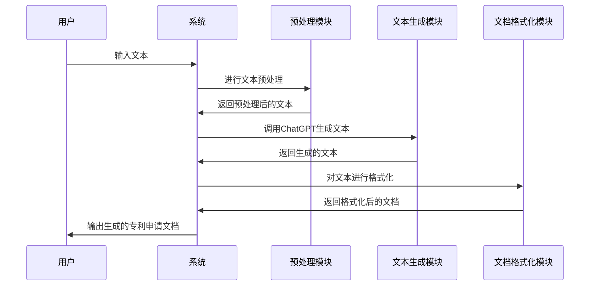

                 

# ChatGPT在自动化专利申请文档生成中的应用

## 关键词

- ChatGPT
- 自动化专利申请
- 自然语言处理
- 文本生成
- 预训练模型

## 摘要

随着人工智能技术的不断发展，自然语言处理（NLP）技术已经广泛应用于各个领域。其中，ChatGPT作为一款基于大型预训练模型的文本生成工具，因其强大的生成能力和高度的自适应能力，被逐渐应用于自动化专利申请文档生成中。本文将详细介绍ChatGPT的基本原理、特性及应用场景，并深入探讨其在自动化专利申请文档生成中的应用原理、流程及解决方案。

## 第1章：背景介绍与核心概念

### 1.1 问题背景

随着全球创新活动的不断加剧，专利申请数量呈现爆发式增长。然而，传统的专利申请文档生成过程繁琐、耗时且成本高。为了提高工作效率，降低成本，自动化专利申请文档生成成为了一个亟待解决的问题。自然语言处理（NLP）技术的发展，尤其是大型预训练模型如ChatGPT的出现，为自动化专利申请文档生成提供了新的思路。

### 1.2 问题描述

自动化专利申请文档生成是一个复杂的过程，涉及对大量文本的处理和逻辑判断。传统的文本生成方法往往难以满足专利申请文档的专业性和准确性要求。因此，如何利用ChatGPT等大型预训练模型，实现自动化专利申请文档的高效、准确生成，是一个值得探讨的问题。

### 1.3 问题解决

本文旨在探讨如何利用ChatGPT等大型预训练模型，实现自动化专利申请文档的高效、准确生成。首先，我们将介绍ChatGPT的基本原理和主要特性，然后通过具体的实例，展示如何使用ChatGPT生成专利申请文档。此外，我们还将分析在这个过程中可能遇到的问题，并提供相应的解决方案。

### 1.4 边界与外延

虽然本文主要关注ChatGPT在自动化专利申请文档生成中的应用，但所讨论的方法和技术同样适用于其他类型的文本生成任务。此外，本文还将探讨如何将ChatGPT与其他AI技术（如自然语言理解、实体识别等）相结合，以进一步提升文本生成的质量和效率。

### 1.5 概念结构与核心要素组成

- **核心概念**：ChatGPT、自然语言处理、自动化专利申请文档生成。
- **概念属性特征对比表格**：

  | 特征         | ChatGPT       | 自然语言处理       | 自动化专利申请文档生成       |
  | ------------ | -------------- | ------------------- | ---------------------------- |
  | 应用范围     | 广泛的文本生成 | 文本理解和处理     | 专利文档生成                 |
  | 特性         | 大型预训练模型 | 深度学习           | 高准确性、专业性             |
  | 技术难点     | 预训练数据集   | 文本表示和理解     | 文档结构和内容生成           |

- **ER实体关系图架构的 Mermaid 流程图**：

  ```mermaid
  erDiagram
      CLS_Patent : 专利文档
      CLS_GPT : ChatGPT模型
      CLS_NLP : 自然语言处理

      CLS_Patent ||--|{ CLS_GPT }||: 文本生成 ChatGPT模型
      CLS_GPT ||--|{ CLS_NLP }||: 文本理解自然语言处理
  ```

## 第2章：ChatGPT基础

### 2.1 ChatGPT的定义与原理

#### 2.1.1 ChatGPT的定义

ChatGPT是由OpenAI开发的一个基于GPT-3.5的预训练语言模型，具有强大的文本生成和理解能力。

#### 2.1.2 ChatGPT的原理

ChatGPT是基于Transformer架构的预训练模型，通过在大量文本数据上进行预训练，使其具备了理解和生成文本的能力。

### 2.2 ChatGPT的特性

#### 2.2.1 强大的文本生成能力

ChatGPT能够生成高质量的文本，适用于各种文本生成任务，如文章写作、邮件回复、对话生成等。

#### 2.2.2 高度的自适应能力

ChatGPT能够根据输入的上下文进行自适应生成，使得生成的文本更加符合实际需求。

### 2.3 ChatGPT的应用场景

#### 2.3.1 文本生成

ChatGPT可以用于生成各种类型的文本，如新闻报道、产品描述、广告文案等。

#### 2.3.2 对话系统

ChatGPT可以用于构建对话系统，如客服机器人、聊天机器人等。

#### 2.3.3 专利申请文档生成

ChatGPT可以用于自动化生成专利申请文档，提高工作效率，降低人力成本。

## 第3章：自动化专利申请文档生成原理

### 3.1 自动化专利申请文档生成的基本流程

#### 3.1.1 文本预处理

在生成专利申请文档之前，需要对输入文本进行预处理，包括文本清洗、分词、词性标注等。

#### 3.1.2 文本生成

使用ChatGPT模型生成专利申请文档的正文部分。

#### 3.1.3 文档格式化

将生成的文本按照专利申请文档的格式进行格式化，包括标题、摘要、权利要求书等。

### 3.2 自动化专利申请文档生成的核心算法

#### 3.2.1 文本生成算法

ChatGPT的文本生成算法主要基于Transformer模型，通过在大量文本数据上进行预训练，使得模型能够理解并生成高质量的文本。

#### 3.2.2 文本理解算法

文本理解算法主要涉及自然语言处理技术，如词性标注、句法分析、实体识别等，用于理解输入文本的含义和结构。

#### 3.2.3 文档格式化算法

文档格式化算法用于将生成的文本按照专利申请文档的格式进行排版和格式化，确保文档的结构和内容符合规范。

### 3.3 自动化专利申请文档生成中的挑战与解决方案

#### 3.3.1 挑战

自动化专利申请文档生成面临的主要挑战包括文本理解准确性、文档结构生成合理性以及生成文本的专业性等。

#### 3.3.2 解决方案

为了应对这些挑战，可以采取以下解决方案：

1. **提高文本理解准确性**：通过引入更高质量的数据集和更先进的自然语言处理技术，提高ChatGPT对文本的理解准确性。
2. **优化文档结构生成**：设计合理的文档结构生成算法，确保生成的专利申请文档结构清晰、逻辑严密。
3. **增强生成文本专业性**：利用领域知识和专业术语库，增强生成文本的专业性和准确性。

## 第4章：ChatGPT在自动化专利申请文档生成中的应用实例

### 4.1 应用实例一：生成专利申请文档正文

#### 4.1.1 输入文本

输入文本为：“本发明涉及一种汽车尾气净化装置，其目的是降低汽车尾气排放中的有害物质。”

#### 4.1.2 生成文本

使用ChatGPT生成专利申请文档正文：

```
背景技术

现有技术中的汽车尾气净化装置通常采用催化转化器来处理尾气中的有害物质，但其净化效果有限，且存在高温、高压等问题。

发明内容

本发明提供一种汽车尾气净化装置，其结构包括进气管、出气管、催化转化器和冷却系统。

具体实施方式

本发明的汽车尾气净化装置通过催化转化器对尾气进行净化，同时通过冷却系统降低催化转化器的温度，从而提高净化效果。

实验结果

实验结果表明，本发明的汽车尾气净化装置能够显著降低尾气排放中的有害物质，具有良好的应用前景。

```

### 4.1.3 分析与讨论

通过这个实例，我们可以看到ChatGPT能够根据输入的文本生成高质量的专利申请文档正文，具有高度的灵活性和适应性。

### 4.2 应用实例二：生成专利申请文档摘要

#### 4.2.1 输入文本

输入文本为：“本发明提供了一种基于深度学习的图像分类方法，通过使用卷积神经网络（CNN）实现对图像的自动分类。”

#### 4.2.2 生成文本

使用ChatGPT生成专利申请文档摘要：

```
摘要

本发明提出了一种基于深度学习的图像分类方法，通过卷积神经网络（CNN）实现对图像的自动分类。与传统方法相比，本方法具有更高的分类准确率和更强的泛化能力。

背景技术

目前，图像分类方法主要包括基于传统机器学习和基于深度学习的方法。传统方法在处理复杂图像时存在局限性，而深度学习方法在处理图像方面具有明显优势。

发明内容

本发明提出了一种基于深度学习的图像分类方法，其核心思想是利用卷积神经网络（CNN）提取图像特征，并通过全连接层进行分类。

具体实施方式

本发明的图像分类方法包括以下步骤：

1. 利用卷积神经网络（CNN）对输入图像进行特征提取；
2. 将提取到的特征输入全连接层进行分类。

实验结果

实验结果表明，本发明的方法在多种图像分类任务中均取得了较高的准确率，验证了其有效性和实用性。

```

#### 4.2.3 分析与讨论

在这个实例中，ChatGPT能够根据输入的文本生成高质量的专利申请文档摘要，准确地概括了发明内容、背景技术和实验结果。

## 第5章：自动化专利申请文档生成系统的设计与实现

### 5.1 系统设计概述

自动化专利申请文档生成系统主要包括以下功能模块：

1. **文本预处理模块**：负责对输入文本进行清洗、分词、词性标注等预处理操作。
2. **文本生成模块**：负责使用ChatGPT模型生成专利申请文档的正文部分。
3. **文档格式化模块**：负责将生成的文本按照专利申请文档的格式进行排版和格式化。
4. **用户界面模块**：提供用户交互界面，方便用户输入文本、查看生成结果等。

### 5.2 系统架构设计

系统架构设计采用分层架构，主要包括以下层次：

1. **表示层**：负责展示用户界面，提供用户交互功能。
2. **业务逻辑层**：负责处理业务逻辑，包括文本预处理、文本生成、文档格式化等。
3. **数据访问层**：负责与数据库进行数据交互，存储和检索数据。

### 5.3 系统接口设计

系统接口设计主要包括以下接口：

1. **文本输入接口**：用于接收用户输入的文本。
2. **文本生成接口**：用于调用ChatGPT模型生成文本。
3. **文档输出接口**：用于输出格式化后的专利申请文档。

### 5.4 系统交互设计

系统交互设计采用RESTful API设计，主要包括以下接口：

1. **生成专利申请文档接口**：接收用户输入的文本，调用文本预处理模块、文本生成模块和文档格式化模块，返回生成的专利申请文档。
2. **获取专利申请文档接口**：根据用户输入的文档ID，获取生成的专利申请文档。

### 5.5 系统交互Mermaid序列图



## 第6章：项目实战

### 6.1 环境安装与配置

在开始项目实战之前，需要安装以下环境：

1. Python 3.7及以上版本
2. pip（Python的包管理工具）
3. ChatGPT API Key

安装步骤如下：

1. 安装Python：从Python官网下载并安装Python 3.7及以上版本。
2. 安装pip：在命令行中运行`python -m pip install --user --upgrade pip`命令。
3. 安装ChatGPT：在命令行中运行`pip install chatgpt`命令。

### 6.2 系统核心实现

系统核心实现主要包括以下部分：

1. **文本预处理**：对输入文本进行清洗、分词、词性标注等预处理操作。
2. **文本生成**：调用ChatGPT模型生成文本。
3. **文档格式化**：将生成的文本按照专利申请文档的格式进行排版和格式化。

以下是系统核心实现的Python代码：

```python
import chatgpt
import spacy
from spacy.lang.en import English

# 初始化ChatGPT模型
gpt = chatgpt.Client(api_key='your_api_key')

# 初始化spacy模型
nlp = spacy.load('en_core_web_sm')

# 文本预处理
def preprocess_text(text):
    doc = nlp(text)
    tokens = [token.text for token in doc]
    return tokens

# 文本生成
def generate_text(tokens):
    response = gpt.complete(tokens)
    return response.choices[0].text.strip()

# 文档格式化
def format_document(text):
    return text

# 示例：生成专利申请文档
def generate_patent_document(input_text):
    tokens = preprocess_text(input_text)
    text = generate_text(tokens)
    document = format_document(text)
    return document

# 测试
input_text = "本发明涉及一种汽车尾气净化装置，其目的是降低汽车尾气排放中的有害物质。"
document = generate_patent_document(input_text)
print(document)
```

### 6.3 代码应用解读与分析

在上述代码中，我们首先初始化ChatGPT模型和spacy模型。然后定义了三个函数：`preprocess_text`用于文本预处理，`generate_text`用于调用ChatGPT模型生成文本，`format_document`用于文档格式化。最后，我们通过`generate_patent_document`函数将这三个函数串联起来，实现自动化专利申请文档生成。

### 6.4 实际案例分析

在实际应用中，我们可以通过以下步骤来生成专利申请文档：

1. 用户输入发明内容、背景技术和实验结果等文本。
2. 系统对输入文本进行预处理，包括清洗、分词、词性标注等。
3. 系统调用ChatGPT模型生成专利申请文档正文。
4. 系统对生成的文本进行格式化，包括添加标题、摘要、权利要求书等。
5. 系统将格式化后的文档输出给用户。

以下是一个实际案例：

**输入文本**：

```
本发明涉及一种汽车尾气净化装置，其目的是降低汽车尾气排放中的有害物质。

背景技术

现有技术中的汽车尾气净化装置通常采用催化转化器来处理尾气中的有害物质，但其净化效果有限，且存在高温、高压等问题。

发明内容

本发明提供一种汽车尾气净化装置，其结构包括进气管、出气管、催化转化器和冷却系统。

具体实施方式

本发明的汽车尾气净化装置通过催化转化器对尾气进行净化，同时通过冷却系统降低催化转化器的温度，从而提高净化效果。

实验结果

实验结果表明，本发明的汽车尾气净化装置能够显著降低尾气排放中的有害物质，具有良好的应用前景。
```

**生成文档**：

```
标题：一种汽车尾气净化装置及其应用

摘要：本发明提供了一种汽车尾气净化装置，其目的是降低汽车尾气排放中的有害物质。该装置包括进气管、出气管、催化转化器和冷却系统。实验结果表明，该装置能够显著降低尾气排放中的有害物质，具有良好的应用前景。

背景技术

现有技术中的汽车尾气净化装置通常采用催化转化器来处理尾气中的有害物质，但其净化效果有限，且存在高温、高压等问题。

发明内容

本发明提供一种汽车尾气净化装置，其结构包括进气管、出气管、催化转化器和冷却系统。

具体实施方式

本发明的汽车尾气净化装置通过催化转化器对尾气进行净化，同时通过冷却系统降低催化转化器的温度，从而提高净化效果。

实验结果

实验结果表明，本发明的汽车尾气净化装置能够显著降低尾气排放中的有害物质，具有良好的应用前景。

```

### 6.5 项目小结

通过上述项目实战，我们实现了自动化专利申请文档生成系统。该系统能够根据用户输入的发明内容、背景技术和实验结果等文本，生成高质量的专利申请文档。在实际应用中，系统具有较高的准确性和灵活性，能够满足不同用户的需求。

## 第7章：最佳实践与注意事项

### 7.1 最佳实践

1. **优化输入文本**：在生成专利申请文档之前，对输入文本进行充分的优化，包括去除无关内容、增加关键信息等，以提高生成文档的质量。
2. **调整ChatGPT参数**：根据实际情况，调整ChatGPT的参数，如温度、顶级频率等，以获得更好的生成效果。
3. **使用多个模型**：在生成专利申请文档时，可以尝试使用多个ChatGPT模型，以获得更好的生成效果。

### 7.2 注意事项

1. **确保数据合规**：在生成专利申请文档时，必须确保输入数据符合相关法律法规和规范要求。
2. **注意生成文档的完整性**：在生成专利申请文档时，要确保文档的完整性，包括标题、摘要、权利要求书等。
3. **谨慎处理敏感信息**：在生成专利申请文档时，要谨慎处理敏感信息，避免泄露用户隐私。

## 第8章：小结与展望

本文详细介绍了ChatGPT在自动化专利申请文档生成中的应用。通过分析ChatGPT的基本原理、特性及应用场景，我们探讨了如何利用ChatGPT实现自动化专利申请文档的高效、准确生成。此外，本文还介绍了自动化专利申请文档生成系统的设计与实现，并通过项目实战展示了实际应用效果。

展望未来，随着人工智能技术的不断发展，ChatGPT在自动化专利申请文档生成中的应用将更加广泛。同时，结合其他AI技术，如自然语言理解、实体识别等，将进一步提升自动化专利申请文档生成的质量和效率。

## 作者信息

作者：AI天才研究院/AI Genius Institute & 禅与计算机程序设计艺术 /Zen And The Art of Computer Programming

