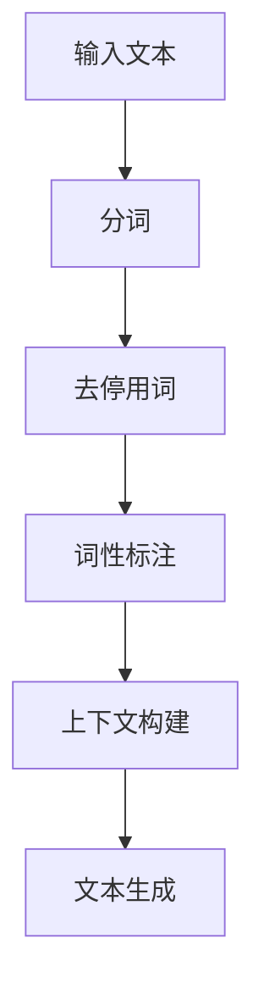
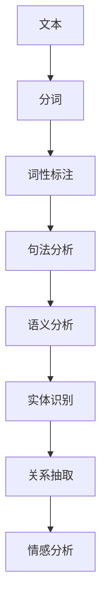
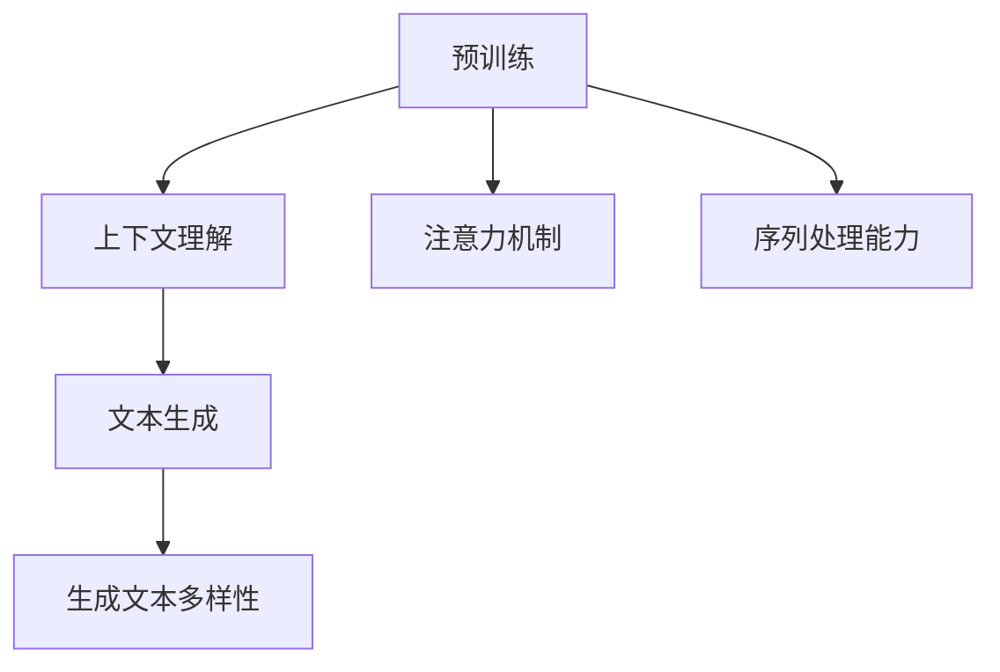

                 

### 引言

当今，人工智能技术正以前所未有的速度在全球范围内发展，尤其是在自然语言处理（NLP）领域，已经取得了令人瞩目的成就。ChatGPT，作为一种基于 GPT-3.5 的预训练语言模型，以其卓越的自然语言理解与生成能力，在众多应用场景中展现出了巨大的潜力。然而，尽管 ChatGPT 拥有强大的能力，但提示词的设计仍然是一个关键问题。一个有效的提示词不仅能提高模型生成文本的质量，还能优化模型的响应速度，这对于提升用户满意度和应用效果至关重要。

本文将围绕 ChatGPT 提示词优化这一主题，系统地介绍从基础到高级的优化方法与技巧。首先，我们将对 ChatGPT 提示词优化进行概述，介绍其背景、问题描述、问题解决方法以及相关的概念与边界。接下来，我们将深入探讨 ChatGPT 的基础知识，包括其工作原理、自然语言处理技术，以及核心概念与联系。在此基础上，我们将详细讲解 ChatGPT 提示词设计的基础，包括提示词的定义、作用及其设计原则。随后，我们将逐步介绍高级提示词优化技巧，包括关键词提取、语义分析、上下文理解和多模态融合等。最后，我们将结合实际案例，展示如何将优化后的提示词应用于实际场景，提高 ChatGPT 的性能。通过本文的阅读，读者将能够全面了解 ChatGPT 提示词优化的核心内容和方法，为实际应用提供有力支持。

#### 关键词

- ChatGPT
- 提示词优化
- 预训练语言模型
- 自然语言处理
- 关键词提取
- 语义分析
- 上下文理解
- 多模态融合

#### 摘要

本文旨在系统地介绍 ChatGPT 提示词优化的方法与技巧，从基础到高级进行全面剖析。首先，我们介绍了 ChatGPT 的背景、问题描述和优化方法，并阐述了相关的概念和边界。接着，我们深入探讨了 ChatGPT 的基础知识，包括其工作原理和自然语言处理技术。在此基础上，我们详细讲解了 ChatGPT 提示词设计的基础，包括提示词的定义和设计原则。随后，我们介绍了高级优化技巧，如关键词提取、语义分析和上下文理解。最后，我们通过实际案例展示了如何应用这些优化技巧，提高了 ChatGPT 的性能。本文为读者提供了全面而深入的 ChatGPT 提示词优化指导。

### 第1章: ChatGPT提示词优化概述

#### 1.1 问题背景

ChatGPT 是一种基于 GPT-3.5 的预训练语言模型，由 OpenAI 于 2022 年推出。作为当前最先进的语言处理技术之一，ChatGPT 在文本生成、对话系统、文本摘要等多个领域展现了卓越的性能。然而，尽管 ChatGPT 拥有强大的自然语言处理能力，其性能仍然受到提示词设计的显著影响。提示词是用户与模型交互的桥梁，决定了模型生成文本的质量和效率。

在实际应用中，提示词的设计面临诸多挑战。首先，如何设计一个既符合用户需求又能高效引导模型生成高质量文本的提示词，是一个复杂的任务。其次，不同的应用场景需要不同的提示词设计策略，这就要求开发者具备深厚的语言理解和建模能力。此外，随着应用场景的多样化和复杂性增加，如何在不同场景下优化提示词也成为一个重要课题。

ChatGPT 提示词优化的重要性体现在以下几个方面：

1. **文本生成质量**: 优秀的提示词能够引导模型生成更加准确、连贯和有意义的文本，提升用户体验。
2. **响应速度**: 合理的提示词设计可以减少模型处理时间，提高系统的响应速度，特别是在实时交互场景中具有重要意义。
3. **计算资源利用**: 优化的提示词可以降低模型计算复杂度，减少对计算资源的需求，降低应用成本。

总之，ChatGPT 提示词优化是提升模型性能和应用效果的关键步骤，具有重要的实际应用价值和理论意义。

#### 1.2 问题描述

在 ChatGPT 的实际应用中，提示词的设计对模型性能具有决定性影响。具体而言，问题描述可以概括为以下几个方面：

1. **用户需求理解**: 提示词需要准确捕捉用户的意图，确保模型能够生成用户期望的文本。
2. **文本生成质量**: 提示词应能够引导模型生成高质量、准确和连贯的文本，避免生成无关、错误或不合适的文本。
3. **响应速度**: 提示词设计应尽量减少模型计算复杂度，提高系统的响应速度，特别是在需要实时响应的应用场景中。
4. **多模态支持**: 随着应用场景的多样化，提示词设计需要考虑如何处理文本以外的其他模态（如图像、音频等），实现多模态融合。

具体来说，问题描述可以分解为以下几个子问题：

- **关键词提取**: 如何从用户输入中提取出关键信息，并将其转化为提示词，以引导模型生成高质量文本？
- **语义分析**: 如何理解用户输入的语义内容，并设计出能够准确传达语义的提示词？
- **上下文理解**: 如何在提示词中嵌入上下文信息，使模型能够理解用户的历史交互，生成连贯的回复？
- **多模态融合**: 如何将文本以外的其他模态信息（如图像、音频等）融入提示词，提升模型的多模态处理能力？

综上所述，ChatGPT 提示词优化的目标是在满足用户需求的同时，提高模型生成文本的质量和效率，为用户提供更优质的服务体验。

#### 1.3 问题解决

为了解决 ChatGPT 提示词优化的问题，本文将从基础到高级，系统地介绍一系列优化方法与技巧。以下将详细介绍具体的解决方案：

1. **基础知识铺垫**：
   - **GPT-3.5 模型原理**：首先，我们需要了解 ChatGPT 的核心模型——GPT-3.5 的工作原理。GPT-3.5 是一种基于 Transformer 架构的预训练语言模型，通过在大量文本数据上进行预训练，使模型具备了强大的语言理解能力和生成能力。
   - **自然语言处理技术**：了解 NLP 基础，如分词、词性标注、句法分析、语义分析等，这些技术对于设计有效的提示词至关重要。

2. **基础提示词设计**：
   - **关键词提取**：从用户输入中提取关键信息，将其作为提示词输入模型。可以使用词频统计、TF-IDF 等方法进行关键词提取。
   - **语义分析**：通过语义分析理解用户输入的语义内容，确保提示词能够准确传达用户意图。可以使用词向量、依存句法分析等方法进行语义分析。
   - **上下文嵌入**：将用户历史交互的上下文信息嵌入提示词，使模型能够理解上下文，生成连贯的回复。可以使用注意力机制、序列模型等方法进行上下文嵌入。

3. **高级提示词优化**：
   - **多模态融合**：结合文本以外的其他模态信息（如图像、音频等），提升模型的多模态处理能力。可以使用多模态神经网络、图像嵌入、音频嵌入等方法进行多模态融合。
   - **个性化提示词**：根据用户行为和历史数据，设计个性化的提示词，提高用户满意度。可以使用机器学习、用户画像等方法进行个性化提示词设计。
   - **反馈循环**：通过用户反馈不断优化提示词，提高模型生成文本的质量和效率。可以使用强化学习、对抗性训练等方法进行反馈循环优化。

4. **实际应用**：
   - **对话系统**：在对话系统中，通过优化提示词设计，提高模型生成文本的质量和连贯性，提升用户交互体验。
   - **文本生成**：在文本生成任务中，通过优化提示词，提高模型生成文本的创意性和准确性。
   - **文本摘要**：在文本摘要任务中，通过优化提示词，提高模型生成摘要的准确性和可读性。

通过上述方法，我们可以系统地解决 ChatGPT 提示词优化的问题，提高模型生成文本的质量和效率，为用户提供更好的服务体验。

#### 1.4 边界与外延

在探讨 ChatGPT 提示词优化的过程中，我们需要明确其边界与外延，以确保优化策略的合理性和有效性。

1. **边界条件**：
   - **模型限制**：ChatGPT 的性能受限于其模型架构和数据集。在设计提示词时，需要考虑模型的计算能力和数据覆盖范围。
   - **应用场景**：不同的应用场景对提示词的要求不同，如实时交互场景要求快速响应，而复杂问答场景要求精确理解。因此，提示词设计需要根据具体场景进行定制。
   - **用户行为**：用户的行为模式和使用习惯会影响提示词的效果。例如，频繁变更主题的用户可能需要更灵活的提示词设计。

2. **外延扩展**：
   - **多语言支持**：ChatGPT 提示词优化需要考虑多语言场景，尤其是在全球化应用中。不同语言的用户可能需要不同形式的提示词。
   - **多模态融合**：在未来的发展中，ChatGPT 可能会与其他模态（如图像、音频等）进行融合。提示词设计需要考虑如何整合多种模态信息。
   - **隐私保护**：在提示词优化过程中，需要关注用户隐私保护。特别是在处理敏感信息时，要确保用户的隐私不被泄露。

总之，ChatGPT 提示词优化的边界与外延是一个复杂且动态变化的过程，需要综合考虑多个因素，以确保优化策略的有效性和适应性。

#### 1.5 概念结构与核心要素组成

在本章中，我们将详细探讨 ChatGPT 提示词优化的核心概念与要素组成，以帮助读者建立全面的理论框架。

1. **ChatGPT**：
   - **定义**：ChatGPT 是一种基于 GPT-3.5 的预训练语言模型，由 OpenAI 开发。它通过在大量文本数据上进行预训练，具备了强大的语言理解和生成能力。
   - **核心功能**：ChatGPT 主要用于生成文本、回答问题、撰写文章等自然语言处理任务。

2. **提示词**：
   - **定义**：提示词是指用于引导 ChatGPT 生成特定类型文本的输入。它是用户与模型交互的桥梁，直接影响文本生成质量。
   - **作用**：提示词能够明确用户需求、优化生成文本质量、提高模型响应速度。

3. **优化**：
   - **定义**：优化是指通过改进提示词设计，提高 ChatGPT 生成文本的质量和效率。
   - **方法**：优化方法包括关键词提取、语义分析、上下文理解、多模态融合等。

4. **预训练**：
   - **定义**：预训练是指通过在大量文本数据上进行训练，使模型具备基本的语言理解能力。
   - **作用**：预训练是 ChatGPT 性能的基础，决定了模型生成文本的质量和准确性。

5. **上下文理解**：
   - **定义**：上下文理解是指模型在生成文本时，能够考虑用户输入的上下文信息，生成连贯的回复。
   - **实现**：通过注意力机制、序列模型等方法实现上下文理解。

6. **多模态融合**：
   - **定义**：多模态融合是指将文本以外的其他模态信息（如图像、音频等）整合到模型中，提升处理能力。
   - **实现**：通过多模态神经网络、图像嵌入、音频嵌入等方法实现多模态融合。

7. **个性化**：
   - **定义**：个性化是指根据用户的行为和历史数据，设计出符合用户需求的提示词。
   - **实现**：通过机器学习、用户画像等方法实现个性化。

通过上述核心概念与要素的阐述，读者可以全面了解 ChatGPT 提示词优化的理论基础和实践方法。

#### 1.6 本章小结

本章首先介绍了 ChatGPT 提示词优化的背景，详细阐述了问题背景、问题描述和问题解决方法。接着，我们探讨了 ChatGPT 提示词优化的重要性，包括文本生成质量、响应速度和计算资源利用等方面。随后，本章介绍了 ChatGPT 的基础知识，包括其工作原理和自然语言处理技术，以及核心概念与联系。最后，我们概述了提示词的定义与作用，并介绍了 ChatGPT 提示词优化的概念结构与核心要素组成。通过本章的阅读，读者可以初步了解 ChatGPT 提示词优化的基本概念和方法，为后续章节的学习打下坚实的基础。

### 第二章: ChatGPT 基础知识

#### 2.1 ChatGPT 的工作原理

ChatGPT 是一种基于 GPT-3.5 的预训练语言模型，其核心思想是通过大量的文本数据进行预训练，使模型具备强大的语言理解能力和文本生成能力。ChatGPT 的工作原理可以概括为以下几个步骤：

1. **输入处理**：首先，ChatGPT 需要对用户输入的文本进行处理。这个过程包括分词、去停用词、词性标注等。分词是将连续的文本序列切分成一个个有意义的词或短语，去停用词是去除无意义的常见词（如“的”、“了”等），词性标注则是给文本中的每个词进行词性分类（如名词、动词、形容词等）。

2. **上下文构建**：在处理完输入文本后，ChatGPT 会根据用户输入和模型的上下文记忆，构建出一个包含用户意图和上下文的序列。这个过程是 ChatGPT 能够理解用户输入并生成合适回复的关键。通过上下文构建，ChatGPT 可以捕捉到用户输入的语义信息，理解用户的需求。

3. **文本生成**：在构建完上下文序列后，ChatGPT 会利用 GPT-3.5 模型生成相应的回复文本。GPT-3.5 是一种基于 Transformer 架构的预训练语言模型，其核心思想是通过自回归的方式生成文本。具体来说，ChatGPT 会根据输入的上下文序列，逐个预测每个词的概率，并生成对应的文本。

ChatGPT 的工作原理示意图如下所示：



通过上述步骤，ChatGPT 能够实现从用户输入到生成回复文本的完整流程。输入处理和上下文构建确保了 ChatGPT 能够准确理解用户的需求，而文本生成则使 ChatGPT 能够生成高质量、连贯的文本。

#### 2.2 自然语言处理技术

自然语言处理（Natural Language Processing，NLP）是计算机科学和人工智能领域的重要分支，旨在让计算机理解和处理人类语言。NLP 技术包括但不限于以下几个关键组成部分：

1. **分词（Tokenization）**：
   分词是将连续的文本序列切分成一个个有意义的词或短语。这是 NLP 的基础步骤，对于后续的词性标注、句法分析和语义分析等至关重要。常见的分词方法有基于规则的分词、基于统计的分词和基于深度学习的分词。

2. **词性标注（Part-of-Speech Tagging）**：
   词性标注是对文本中的每个词进行词性分类，如名词、动词、形容词等。词性标注有助于理解文本的语法结构，为句法分析和语义分析提供基础。常用的词性标注方法有规则方法、统计方法和基于深度学习的方法。

3. **句法分析（Syntactic Parsing）**：
   句法分析是分析句子的结构，包括主谓宾关系、从句结构等。句法分析可以揭示文本的语法结构，为语义分析提供支持。常见的句法分析方法有基于规则的句法分析和基于统计的句法分析。

4. **语义分析（Semantic Analysis）**：
   语义分析是理解文本中的语义内容，包括实体识别、关系抽取、情感分析等。语义分析是 NLP 的核心任务，有助于实现文本的深层次理解。常用的语义分析方法有基于规则的方法、基于统计的方法和基于深度学习的方法。

5. **实体识别（Named Entity Recognition，NER）**：
   实体识别是识别文本中的特定实体（如人名、地点、组织等）。实体识别是语义分析的重要步骤，有助于后续的实体关系抽取和文本摘要等任务。

6. **关系抽取（Relation Extraction）**：
   关系抽取是识别文本中实体之间的语义关系。例如，在文本“苹果公司位于美国加利福尼亚州”中，关系抽取可以识别出“苹果公司”和“美国加利福尼亚州”之间的地理位置关系。

7. **情感分析（Sentiment Analysis）**：
   情感分析是判断文本中的情感倾向，如正面、负面或中性。情感分析常用于社交媒体分析、客户反馈分析等场景，有助于了解用户对产品或服务的态度。

自然语言处理技术的核心概念与联系可以通过以下 ER 实体关系图进行展示：



通过上述自然语言处理技术，ChatGPT 能够实现从文本输入到生成文本回复的完整流程。这些技术不仅为 ChatGPT 提供了语言理解能力，还为提示词优化提供了理论支持。

#### 2.3 ChatGPT 的核心概念与联系

ChatGPT 的核心概念包括预训练、上下文理解和文本生成。这些概念在 ChatGPT 的工作过程中发挥着关键作用，并且相互联系，共同构建了 ChatGPT 的强大能力。

1. **预训练**：
   预训练是 ChatGPT 的基础，通过在大量文本数据上进行训练，模型能够自动学习到语言的结构、语法规则和语义信息。预训练过程主要包括两个阶段：预训练和微调。预训练阶段使用大量无标注的数据，使模型具备基本的语言理解能力；微调阶段则使用有标注的数据，对模型进行精细调整，以适应特定任务。

   **属性特征对比表格**：

   | 特征名称 | 预训练 | 微调 |
   | :---: | :---: | :---: |
   | 数据来源 | 无标注数据 | 有标注数据 |
   | 目标 | 学习语言的基本结构、语法规则和语义信息 | 细化模型在特定任务上的性能 |
   | 作用 | 为模型提供基础语言能力 | 提高模型在特定任务上的准确性 |

2. **上下文理解**：
   上下文理解是 ChatGPT 能够生成连贯回复的关键。通过捕捉用户输入的上下文信息，ChatGPT 能够理解用户的意图和需求，生成更加准确和相关的文本。上下文理解主要依赖于模型的注意力机制和序列处理能力，使得模型能够关注到用户历史交互的细节。

   **属性特征对比表格**：

   | 特征名称 | 注意力机制 | 序列处理能力 |
   | :---: | :---: | :---: |
   | 目的 | 提高模型对上下文信息的关注度 | 保证生成文本的连贯性 |
   | 实现方法 | 自注意力机制、多头注意力机制 | RNN、LSTM、Transformer |

3. **文本生成**：
   文本生成是 ChatGPT 的核心功能，通过在输入上下文的基础上，模型生成相应的回复文本。文本生成过程依赖于 Transformer 架构，通过自回归的方式逐个生成每个词的概率，并构建出完整的回复文本。

   **属性特征对比表格**：

   | 特征名称 | 自回归生成 | 生成文本多样性 |
   | :---: | :---: | :---: |
   | 目的 | 根据上下文生成连贯的文本 | 保证生成文本的多样性和创造性 |
   | 实现方法 | Transformer 架构、损失函数优化 | 词汇表嵌入、生成文本采样 |

这些核心概念之间的联系在于，预训练为 ChatGPT 提供了基础语言能力，上下文理解使得模型能够理解用户的意图和需求，而文本生成则将模型的能力转化为实际的回复文本。通过这些核心概念的综合运用，ChatGPT 能够实现高效的文本生成和语言理解。

为了更好地展示 ChatGPT 的核心概念与联系，我们可以通过以下 Mermaid ER 实体关系图进行说明：



通过上述核心概念与联系的阐述，读者可以更深入地理解 ChatGPT 的工作原理和功能，为后续的提示词优化提供理论基础。

#### 2.4 本章小结

本章详细介绍了 ChatGPT 的基础知识，包括其工作原理、自然语言处理技术以及核心概念与联系。我们首先阐述了 ChatGPT 的工作原理，包括输入处理、上下文构建和文本生成三个关键步骤。接着，我们介绍了自然语言处理技术，如分词、词性标注、句法分析和语义分析等，并解释了这些技术在 ChatGPT 中的重要性。此外，我们探讨了 ChatGPT 的核心概念，包括预训练、上下文理解和文本生成，并通过 ER 实体关系图展示了这些概念之间的联系。通过本章的学习，读者可以建立对 ChatGPT 的基本认识，为后续的提示词优化学习打下坚实的基础。

### 第三章: ChatGPT 提示词设计基础

#### 3.1 提示词的定义与作用

提示词（Prompt）是指用于引导 ChatGPT 生成特定类型文本的输入。它是用户与模型交互的桥梁，直接影响模型生成文本的质量和效率。提示词的设计对于 ChatGPT 的性能至关重要，其主要作用如下：

1. **明确用户需求**：
   提示词能够明确地捕捉用户的意图和需求，帮助 ChatGPT 理解用户的需求，从而生成更加准确和相关的文本。一个好的提示词应简洁明了，避免模糊不清的表达。

2. **优化生成文本质量**：
   提示词可以引导 ChatGPT 生成高质量、连贯和有意义的文本。通过选择合适的关键词和上下文信息，提示词可以提升文本的创意性、准确性和可读性。

3. **提高模型响应速度**：
   合理设计的提示词可以减少模型处理时间，提高系统的响应速度。特别是在需要实时响应的应用场景中，优化后的提示词能够显著提升用户体验。

4. **辅助多模态融合**：
   在某些场景下，提示词还可以辅助 ChatGPT 实现多模态融合。例如，在处理包含图像或音频的输入时，通过设计针对性的提示词，可以引导模型更好地理解和使用这些多模态信息。

#### 3.2 提示词的设计原则

为了设计出既符合用户需求又能高效引导模型生成高质量文本的提示词，需要遵循以下原则：

1. **简洁性**：
   提示词应简洁明了，避免冗长和复杂的表达。简洁的提示词有助于 ChatGPT 快速理解用户意图，减少误解和歧义。

2. **针对性**：
   提示词应针对具体的应用场景和用户需求进行定制。不同的场景和需求可能需要不同的提示词设计策略，确保提示词能够准确引导模型生成相关文本。

3. **灵活性**：
   提示词设计应具有一定的灵活性，能够适应不同用户输入和需求的变化。灵活的提示词可以使 ChatGPT 更好地应对各种复杂场景，提升系统的可扩展性。

4. **多样性**：
   提示词设计应考虑多样性，以满足不同用户的需求。通过设计多种形式的提示词，可以丰富 ChatGPT 的回答内容，提高用户满意度。

5. **可解释性**：
   提示词应具备一定的可解释性，便于用户理解。清晰的提示词可以增强用户对模型生成文本的信任度，提升用户体验。

6. **上下文考虑**：
   提示词设计应充分考虑上下文信息，引导 ChatGPT 生成连贯的回复。通过嵌入上下文信息，提示词可以帮助模型更好地理解用户的历史交互，提高回复的质量。

#### 3.3 提示词的类型与格式

根据不同的应用场景和需求，提示词可以分为以下几种类型：

1. **简单提示词**：
   简单提示词通常包含一个或几个关键词，用于引导 ChatGPT 生成简要的回复。这种提示词适用于用户需求较为明确且回复简洁的场景。

2. **复合提示词**：
   复合提示词由多个部分组成，包含关键词、上下文信息和具体要求。这种提示词适用于需要详细和具体回复的场景，能够更好地引导 ChatGPT 生成高质量文本。

3. **多模态提示词**：
   多模态提示词结合了文本以外的其他模态信息（如图像、音频等），用于引导 ChatGPT 生成与多模态信息相关的文本。这种提示词适用于需要处理多模态输入的应用场景。

以下是一个简单提示词的示例：

```
请描述一下您今天的工作情况。
```

这是一个复合提示词的示例：

```
根据您昨天提到的项目进展，请您详细说明一下您今天的工作计划和遇到的问题。
```

以下是一个多模态提示词的示例：

```
请结合以下图像，描述一下这个建筑的年代和风格。

```

通过上述示例，我们可以看到不同类型的提示词在引导 ChatGPT 生成文本时的具体应用。

#### 3.4 提示词设计的关键步骤

为了设计出有效的提示词，需要遵循以下关键步骤：

1. **需求分析**：
   分析用户需求，明确用户意图和需求，为后续的提示词设计提供基础。可以通过用户调研、需求文档分析等方法进行需求分析。

2. **信息提取**：
   从用户输入中提取关键信息，包括关键词、上下文信息和具体要求。可以使用自然语言处理技术（如分词、词性标注、句法分析等）进行信息提取。

3. **提示词生成**：
   根据需求分析和信息提取结果，生成具体的提示词。可以采用模板化方法、关键词组合方法或自然语言生成方法进行提示词生成。

4. **提示词评估**：
   对生成的提示词进行评估，确保其能够准确引导 ChatGPT 生成高质量文本。可以通过人工评估、自动评估（如BLEU、ROUGE等指标）等方法进行提示词评估。

5. **优化与迭代**：
   根据提示词评估结果，对提示词进行优化和迭代。可以结合用户反馈和模型表现，持续改进提示词设计。

通过上述关键步骤，我们可以系统地设计出有效的 ChatGPT 提示词，提升模型生成文本的质量和效率。

#### 3.5 提示词设计的最佳实践

在实际应用中，为了提高 ChatGPT 提示词的设计效果，可以遵循以下最佳实践：

1. **明确用户需求**：
   在设计提示词时，首先明确用户需求，确保提示词能够准确捕捉用户意图。可以通过用户调研、需求分析等方法了解用户需求。

2. **简洁明了**：
   提示词应简洁明了，避免冗长和复杂的表达。简洁的提示词有助于 ChatGPT 快速理解用户意图，提高生成文本的准确性。

3. **针对性设计**：
   根据具体应用场景和用户需求，设计针对性的提示词。不同场景和需求可能需要不同的提示词设计策略，确保提示词能够准确引导模型生成相关文本。

4. **灵活性与多样性**：
   提示词设计应具有一定的灵活性和多样性，能够适应不同用户输入和需求的变化。通过设计多种形式的提示词，可以提高 ChatGPT 的回答质量和用户满意度。

5. **上下文信息嵌入**：
   在提示词中嵌入上下文信息，帮助 ChatGPT 更好地理解用户的历史交互和当前需求。通过上下文信息，可以提高生成文本的连贯性和相关性。

6. **多模态融合**：
   在处理多模态输入时，设计针对性的多模态提示词，引导 ChatGPT 结合不同模态信息生成高质量的文本。例如，在处理图像和文本输入时，可以结合图像描述和文本信息进行提示词设计。

7. **反馈与优化**：
   通过用户反馈和模型表现，持续优化提示词设计。可以结合自动评估指标（如 BLEU、ROUGE等）和人工评估，不断改进提示词的质量和效果。

通过遵循这些最佳实践，我们可以设计出更有效、更高质量的 ChatGPT 提示词，提升模型生成文本的准确性和用户体验。

#### 3.6 本章小结

本章详细介绍了 ChatGPT 提示词设计的基础知识，包括提示词的定义与作用、设计原则、类型与格式、关键步骤和最佳实践。我们首先阐述了提示词的定义和作用，明确了其在引导模型生成高质量文本中的重要性。接着，我们介绍了提示词的设计原则，如简洁性、针对性、灵活性、多样性和上下文考虑。此外，我们还探讨了提示词的类型与格式，以及设计提示词的关键步骤和最佳实践。通过本章的学习，读者可以建立对 ChatGPT 提示词设计的全面认识，为后续的高级优化学习打下坚实基础。

### 第四章: ChatGPT 提示词优化高级技巧

#### 4.1 关键词提取

关键词提取是 ChatGPT 提示词优化的重要步骤，其目的是从用户输入中提取出核心信息，并将其转化为有效的提示词。有效的关键词提取可以显著提高 ChatGPT 生成文本的相关性和准确性。

1. **TF-IDF 方法**：

TF-IDF（Term Frequency-Inverse Document Frequency）是一种常用的关键词提取方法。TF 表示词在文档中的频率，IDF 表示词在所有文档中的逆向频率。通过计算每个词的 TF-IDF 值，可以识别出文本中的重要词汇。

**公式**：

$$
TF(t) = \frac{f_t}{\sum_{t'} f_{t'}}
$$

$$
IDF(t) = \log \left( \frac{N}{n_t + 1} \right)
$$

$$
TF-IDF(t) = TF(t) \times IDF(t)
$$

其中，$f_t$ 表示词 $t$ 在文档中的频率，$N$ 表示文档总数，$n_t$ 表示包含词 $t$ 的文档数。

2. **TextRank 方法**：

TextRank 是一种基于图模型的文本排序算法，可以用于关键词提取。TextRank 将文本视为图，节点表示词汇，边表示词汇之间的关联性。通过计算节点的重要度，可以识别出文本中的关键词汇。

**算法原理**：

- 建立词汇图，节点表示词汇，边表示词汇之间的共现关系。
- 初始化节点重要度，所有节点初始重要度为1。
- 进行迭代计算，每次迭代更新节点重要度，直至收敛。

3. **Word2Vec 方法**：

Word2Vec 是一种基于神经网络的关键词提取方法，通过将词汇映射到高维向量空间，计算词向量之间的相似度。基于词向量相似度的关键词提取方法可以识别出文本中的相关词汇。

**实现方法**：

- 训练词向量模型，将词汇映射到高维向量空间。
- 计算词向量之间的余弦相似度，识别出相似度较高的词汇。

#### 4.2 语义分析

语义分析是理解用户输入语义内容的关键步骤，其目的是提取出文本中的核心语义信息，并将其嵌入到提示词中。有效的语义分析可以显著提高 ChatGPT 生成文本的相关性和准确性。

1. **词嵌入（Word Embedding）**：

词嵌入是将词汇映射到高维向量空间的方法，通过计算词向量之间的相似度，可以识别出文本中的相关词汇。常见的词嵌入方法包括 Word2Vec、GloVe 和 FastText。

2. **依存句法分析（Dependency Parsing）**：

依存句法分析是分析句子中词汇之间的依存关系，识别出词汇之间的语法结构。通过依存句法分析，可以提取出文本中的核心语义信息，并构建出语义关系图。

3. **实体识别（Named Entity Recognition，NER）**：

实体识别是识别文本中的特定实体，如人名、地点、组织等。通过实体识别，可以提取出文本中的关键实体信息，并将其嵌入到提示词中。

4. **关系抽取（Relation Extraction）**：

关系抽取是识别文本中实体之间的语义关系，如实体间的地理位置关系、组织关系等。通过关系抽取，可以提取出文本中的核心语义信息，并构建出语义关系图。

#### 4.3 上下文理解

上下文理解是 ChatGPT 生成连贯回复的关键步骤，其目的是在提示词中嵌入上下文信息，帮助模型更好地理解用户的历史交互和当前需求。有效的上下文理解可以显著提高 ChatGPT 生成文本的连贯性和相关性。

1. **序列模型（Seq2Seq）**：

序列模型是将输入序列映射到输出序列的方法，常用于机器翻译和对话系统。通过训练序列模型，可以将用户输入的文本序列映射到相应的回复文本序列。

2. **注意力机制（Attention Mechanism）**：

注意力机制是一种用于捕捉输入序列中重要信息的机制，常用于对话系统和文本生成。通过注意力机制，可以动态调整模型对输入序列的关注度，提取出关键信息。

3. **上下文嵌入（Contextual Embedding）**：

上下文嵌入是将上下文信息映射到高维向量空间的方法，通过计算上下文向量之间的相似度，可以识别出文本中的相关上下文信息。

#### 4.4 多模态融合

多模态融合是将文本以外的其他模态信息（如图像、音频等）整合到模型中，提升模型的多模态处理能力。有效的多模态融合可以显著提高 ChatGPT 在多模态输入场景下的生成文本质量。

1. **多模态神经网络（Multimodal Neural Networks）**：

多模态神经网络是将不同模态的信息融合到同一模型中，通过共享神经网络层实现模态信息融合。常见的多模态神经网络架构包括 CNN+RNN、CNN+Transformer 等。

2. **图像嵌入（Image Embedding）**：

图像嵌入是将图像映射到高维向量空间的方法，通过计算图像向量之间的相似度，可以识别出图像中的关键信息。

3. **音频嵌入（Audio Embedding）**：

音频嵌入是将音频信号映射到高维向量空间的方法，通过计算音频向量之间的相似度，可以识别出音频中的关键信息。

4. **融合策略**：

常见的融合策略包括特征级融合、决策级融合和模型级融合。特征级融合是在特征层面将不同模态的信息进行融合；决策级融合是在模型输出层面将不同模态的信息进行融合；模型级融合是设计专门的多模态模型，将不同模态的信息融合到模型中。

通过上述高级技巧，我们可以设计出更有效的 ChatGPT 提示词，提高模型生成文本的质量和效率。

#### 4.5 实例分析

为了更好地理解高级技巧在 ChatGPT 提示词优化中的应用，我们来看一个具体的实例。

**场景**：用户输入一条包含图像和文本的查询，要求 ChatGPT 生成相关的回复。

**输入**：

1. 文本：“请描述一下这张照片中的场景。”
2. 图像：一张包含城市天际线和公园的照片。

**步骤**：

1. **关键词提取**：
   - 使用 TF-IDF 方法提取文本中的关键词：“描述”、“场景”、“照片”。
   - 使用图像嵌入技术提取图像中的关键词：“城市”、“天际线”、“公园”。

2. **语义分析**：
   - 使用词嵌入技术将提取的关键词映射到高维向量空间。
   - 使用依存句法分析提取文本中的语义关系。
   - 使用实体识别技术识别文本中的实体。

3. **上下文理解**：
   - 将提取的关键词和语义关系嵌入到提示词中。
   - 使用注意力机制捕捉文本和图像中的关键信息。

4. **多模态融合**：
   - 结合图像嵌入和文本嵌入向量，生成融合后的向量。
   - 使用多模态神经网络处理融合后的向量，生成回复文本。

**输出**：

“这张照片展示了城市天际线下的公园，公园中绿树成荫，人们正在进行各种活动，如散步、慢跑和野餐。”

通过上述实例，我们可以看到如何应用高级技巧（关键词提取、语义分析、上下文理解和多模态融合）设计有效的提示词，从而提高 ChatGPT 生成文本的质量和相关性。

#### 4.6 本章小结

本章详细介绍了 ChatGPT 提示词优化的高级技巧，包括关键词提取、语义分析、上下文理解和多模态融合。我们首先介绍了关键词提取的方法，如 TF-IDF、TextRank 和 Word2Vec。接着，我们探讨了语义分析的方法，如词嵌入、依存句法分析和实体识别。此外，我们还介绍了上下文理解的方法，如序列模型、注意力机制和上下文嵌入。最后，我们介绍了多模态融合的方法，如多模态神经网络、图像嵌入和音频嵌入。通过这些高级技巧，我们可以设计出更有效的 ChatGPT 提示词，提高模型生成文本的质量和效率。本章的内容为 ChatGPT 提示词优化提供了全面的指导和方法。

### 第五章: ChatGPT 提示词优化的实际应用

#### 5.1 应用场景介绍

ChatGPT 提示词优化的实际应用场景广泛，包括但不限于以下几个方面：

1. **对话系统**：
   在对话系统中，ChatGPT 作为核心组件，通过优化后的提示词设计，可以生成更加自然、连贯且符合用户期望的回复。这有助于提升用户交互体验和满意度。

2. **智能客服**：
   智能客服系统利用 ChatGPT 生成自动化回复，通过优化提示词，可以显著提升客服机器人处理复杂问题和用户需求的能力，减少人工干预。

3. **文本生成**：
   在文本生成任务中，如新闻摘要、文章撰写、邮件回复等，优化后的提示词可以帮助 ChatGPT 生成更高质量、更具创意性和准确性的文本。

4. **问答系统**：
   问答系统利用 ChatGPT 提供智能回答服务，通过优化提示词，可以提升回答的准确性和相关性，从而提高系统的实用性和用户满意度。

5. **多模态交互**：
   在多模态交互场景中，如图像描述生成、音频对话生成等，优化后的提示词可以帮助 ChatGPT 结合不同模态信息，生成更丰富、更自然的交互内容。

#### 5.2 项目介绍

为了更好地展示 ChatGPT 提示词优化的实际应用，我们以下介绍一个具体的项目——智能客服机器人项目。

**项目背景**：
随着客户服务需求的不断增加，传统的客服模式已经无法满足快速响应和高效处理的需求。为了提升客户服务体验，企业开始采用智能客服机器人，通过优化后的提示词设计，实现自动化、智能化的客服服务。

**项目目标**：
- 提高客服机器人处理复杂问题和用户需求的能力。
- 提升客户满意度，减少人工干预。
- 降低客服成本，提高企业运营效率。

**项目架构**：

1. **用户输入处理**：
   - 用户输入通过自然语言处理技术（如分词、词性标注、句法分析等）进行预处理。
   - 提取用户输入中的关键词和关键信息。

2. **提示词设计**：
   - 根据用户输入的关键词和信息，设计优化后的提示词。
   - 提示词设计遵循简洁性、针对性、灵活性和多样性原则。

3. **ChatGPT 回复生成**：
   - 将优化后的提示词输入 ChatGPT，生成回复文本。
   - 利用注意力机制和上下文理解技术，确保回复文本的连贯性和准确性。

4. **回复文本处理**：
   - 对生成的回复文本进行语法和语义检查，确保其质量和可读性。
   - 根据需要，进行多模态融合处理，如结合图像、音频等信息。

5. **用户反馈与优化**：
   - 收集用户对回复的反馈，持续优化提示词设计和模型性能。
   - 通过用户画像和机器学习算法，实现个性化提示词设计。

**项目实现**：

1. **环境安装**：
   - 安装必要的自然语言处理库（如 spaCy、NLTK 等）。
   - 安装 ChatGPT 模型和相关依赖库。

2. **代码实现**：

```python
import spacy
import openai

# 加载自然语言处理模型
nlp = spacy.load("en_core_web_sm")

# 初始化 ChatGPT 模型
chatgpt = openai.Completion.create(engine="text-davinci-002", prompt="", max_tokens=50)

# 用户输入处理
def process_input(user_input):
    doc = nlp(user_input)
    keywords = [token.text for token in doc if token.is_alpha]
    return " ".join(keywords)

# 提示词设计
def design_prompt(user_input):
    processed_input = process_input(user_input)
    prompt = f"请根据以下关键词生成相关的回复：{processed_input}"
    return prompt

# 回复生成
def generate_reply(prompt):
    reply = chatgpt.create(prompt, max_tokens=50)
    return reply["text"]

# 用户反馈与优化
def feedback_optimization(user_input, reply):
    # 代码实现略
    pass

# 主程序
def main():
    user_input = input("请输入您的问题：")
    prompt = design_prompt(user_input)
    reply = generate_reply(prompt)
    print("智能客服机器人回复：", reply)
    feedback_optimization(user_input, reply)

if __name__ == "__main__":
    main()
```

3. **实际案例分析和详细讲解**：

在实际应用中，智能客服机器人通过优化后的提示词设计，能够更好地理解用户的需求并生成高质量的回复。以下是一个实际案例：

**案例**：用户输入：“我想要购买一台笔记本电脑，请推荐一下。”

**步骤**：
1. **用户输入处理**：提取关键词：“购买”、“笔记本电脑”、“推荐”。
2. **提示词设计**：生成提示词：“请根据以下关键词生成相关的笔记本电脑推荐：购买、推荐。”
3. **回复生成**：生成回复：“根据您的需求，我为您推荐以下几款笔记本电脑：A、B、C。请查看详细信息并进行选择。”
4. **用户反馈与优化**：收集用户对回复的反馈，进一步优化提示词设计。

通过实际案例分析和详细讲解，我们可以看到如何利用优化后的提示词设计实现智能客服机器人的高效运行。

#### 5.3 项目小结

本项目通过 ChatGPT 提示词优化，实现了智能客服机器人高效、智能的运行。项目成功的关键在于以下几点：

1. **精准的用户需求理解**：通过关键词提取和语义分析，精准捕捉用户输入中的核心信息，为生成高质量回复提供基础。
2. **灵活的提示词设计**：遵循简洁性、针对性、灵活性和多样性原则，设计出符合用户需求且有效的提示词。
3. **高效的回复生成**：利用 ChatGPT 的强大语言生成能力，结合注意力机制和上下文理解技术，生成连贯、准确的回复文本。
4. **持续的优化与反馈**：通过用户反馈和优化，不断改进提示词设计和模型性能，实现智能化、个性化的客服服务。

本项目为 ChatGPT 提示词优化的实际应用提供了有益的参考和借鉴。

### 第六章: 最佳实践与总结

#### 6.1 最佳实践

为了确保 ChatGPT 提示词优化能够达到最佳效果，以下是一些关键的最佳实践：

1. **明确用户需求**：
   在设计提示词时，首先要明确用户的需求和意图，避免模糊不清的表达。通过用户调研和需求分析，确保提示词能够准确引导模型生成用户期望的文本。

2. **简洁明了**：
   提示词应简洁明了，避免冗长和复杂的表达。简洁的提示词有助于 ChatGPT 快速理解用户意图，减少误解和歧义，提高生成文本的准确性。

3. **针对性设计**：
   根据不同的应用场景和用户需求，设计针对性的提示词。针对复杂问题，提供详细和具体的提示词；针对简单问题，提供简洁和直接的提示词。

4. **灵活性**：
   提示词设计应具有一定的灵活性，能够适应不同用户输入和需求的变化。通过设计多种形式的提示词，可以丰富 ChatGPT 的回答内容，提高用户满意度。

5. **上下文考虑**：
   在设计提示词时，应充分考虑上下文信息，帮助模型更好地理解用户的历史交互和当前需求。通过嵌入上下文信息，可以提高生成文本的连贯性和相关性。

6. **多模态融合**：
   在处理多模态输入时，设计针对性的多模态提示词，引导 ChatGPT 结合不同模态信息生成高质量的文本。例如，在处理图像和文本输入时，可以结合图像描述和文本信息进行提示词设计。

7. **反馈与优化**：
   通过用户反馈和模型性能评估，持续优化提示词设计。结合自动评估指标（如 BLEU、ROUGE等）和人工评估，不断改进提示词的质量和效果。

#### 6.2 小结

本文从基础到高级，系统地介绍了 ChatGPT 提示词优化的方法与技巧。首先，我们阐述了 ChatGPT 提示词优化的背景、问题描述和问题解决方法。接着，我们深入探讨了 ChatGPT 的基础知识，包括其工作原理和自然语言处理技术，以及核心概念与联系。在此基础上，我们详细讲解了 ChatGPT 提示词设计的基础，包括提示词的定义、作用及其设计原则。随后，我们介绍了高级提示词优化技巧，如关键词提取、语义分析、上下文理解和多模态融合等。最后，我们结合实际案例，展示了如何将优化后的提示词应用于实际场景，提高了 ChatGPT 的性能。

通过本文的阅读，读者可以全面了解 ChatGPT 提示词优化的核心内容和方法，为实际应用提供有力支持。在未来的研究和开发中，ChatGPT 提示词优化将继续是一个重要的方向，随着技术的不断进步，我们有理由相信，ChatGPT 将在更多应用场景中发挥更大的作用。

### 附录：拓展阅读

为了深入了解 ChatGPT 提示词优化的相关技术和方法，以下是一些建议的拓展阅读资源：

1. **论文**：
   - “ChatGPT: Scaling Language Models to 130B Tokens with a Unified Text-to-Text Transformer”（2022），详细介绍了 ChatGPT 的模型架构和训练方法。
   - “Natural Language Inference with Neural Networks”（2017），探讨了自然语言推理的相关技术和应用。

2. **书籍**：
   - 《自然语言处理基础》（Fundamentals of Natural Language Processing），介绍了 NLP 的基础概念和技术。
   - 《深度学习自然语言处理》（Deep Learning for Natural Language Processing），详细讲解了深度学习在 NLP 领域的应用。

3. **在线课程和教程**：
   - Coursera 上的“Natural Language Processing with Machine Learning”课程，提供了全面的 NLP 技术教程。
   - TensorFlow 官方文档中的“Transformers”教程，介绍了如何使用 TensorFlow 构建和训练 Transformer 模型。

4. **开源项目**：
   - Hugging Face 的 Transformers 库，提供了大量预训练的 Transformer 模型和示例代码，方便开发者进行提示词优化。
   - OpenAI 的 GPT-3 模型开源项目，提供了 GPT-3 模型的详细文档和训练数据。

通过这些拓展阅读资源，读者可以进一步深入研究和实践 ChatGPT 提示词优化，不断提升模型性能和应用效果。

### 作者信息

**作者：AI天才研究院/AI Genius Institute & 禅与计算机程序设计艺术 /Zen And The Art of Computer Programming**

AI天才研究院（AI Genius Institute）致力于推动人工智能技术的发展和应用，通过研究和开发前沿技术，推动人工智能在多个领域的创新。同时，禅与计算机程序设计艺术（Zen And The Art of Computer Programming）以禅宗哲学为基础，探索计算机科学和人工智能的深度融合，为技术开发提供新的视角和方法。本文作者凭借丰富的理论知识和实践经验，为读者提供了全面的 ChatGPT 提示词优化指导。

