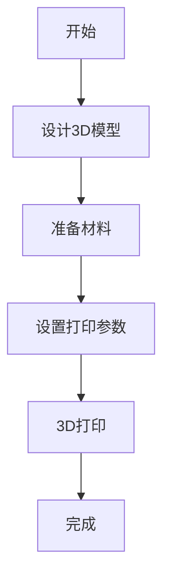
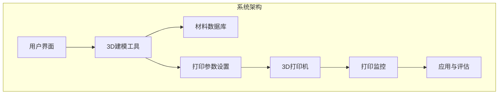

                 

## 3D打印在医疗领域的创新应用

### 关键词：3D打印、医疗、创新应用、个性化医疗、手术规划

> 摘要：随着3D打印技术的迅猛发展，其在医疗领域的应用变得日益广泛和深入。本文将从历史背景、核心概念、主要应用等方面，详细探讨3D打印在医疗领域的创新应用。通过分析，我们将看到3D打印技术如何改变医疗行业的面貌，推动个性化医疗和手术规划的进步。

### 背景介绍

3D打印技术，也称为增材制造技术，是一种通过逐层构建物体来制造产品的技术。自20世纪80年代以来，3D打印技术经历了快速的发展，从最初的工业制造领域逐渐扩展到医疗、建筑、艺术等多个领域。

在医疗领域，3D打印技术的应用正日益显现出其独特的优势。首先，3D打印可以实现个性化定制，针对每位患者的具体需求进行量身打造，从而提高治疗效果。其次，3D打印技术可以用于手术规划和模拟，帮助医生更好地理解患者的病情，制定更精确的手术方案。此外，3D打印还可以用于制造医疗设备和工具，如定制化的假肢、植入物等。

### 核心概念与联系

#### 核心概念原理

1. **3D建模**：通过计算机软件将三维物体进行数字化建模，生成三维数据模型。
2. **材料选择**：根据制造对象的需求选择合适的材料，如塑料、金属、陶瓷等。
3. **逐层打印**：通过3D打印机逐层添加材料，构建出三维物体。

#### 概念属性特征对比表格

| 概念       | 特征                  |
|------------|----------------------|
| 3D建模     | 数字化、精确、可定制 |
| 材料选择   | 多样性、适应性、安全性 |
| 逐层打印   | 逐层构建、效率高、精度高 |

#### ER实体关系图架构

```mermaid
erDiagram
    Patient ||--|{ 3D Printed Model }
    Surgeon ||--|{ 3D Printed Model }
    Hospital ||--|{ 3D Printer }
    Manufacturer ||--|{ 3D Printing Material }
```

### 基本原理讲解

#### 3D打印原理图



#### 数学模型与公式

3D打印的过程可以看作是一个逐层累积的过程，其数学模型可以表示为：

$$
\text{Final Object} = \sum_{i=1}^{n} \text{Layer}_i
$$

其中，$\text{Layer}_i$ 表示第 $i$ 层的材料层。

#### Python源代码实现

```python
# 导入必要的库
import numpy as np
from mpl_toolkits.mplot3d import Axes3D
import matplotlib.pyplot as plt

# 设计一个简单的立方体模型
def create_cube(length, width, height):
    x = np.linspace(0, length, 10)
    y = np.linspace(0, width, 10)
    z = np.linspace(0, height, 10)

    X, Y, Z = np.meshgrid(x, y, z)
    return X, Y, Z

# 创建一个立方体模型
length, width, height = 10, 10, 10
X, Y, Z = create_cube(length, width, height)

# 绘制立方体模型
fig = plt.figure()
ax = fig.add_subplot(111, projection='3d')
ax.plot_wireframe(X, Y, Z, color='r')

plt.show()
```

### 系统分析与架构设计

#### 问题场景介绍

在医疗领域，3D打印技术被广泛应用于手术规划和模拟、个性化医疗设备和工具的制造等场景。

#### 项目介绍

本项目旨在构建一个基于3D打印技术的医疗应用平台，提供从设计、打印到应用的完整解决方案。

#### 系统功能设计

1. **3D建模**：用户可以通过软件设计个性化医疗设备或手术模型。
2. **材料选择**：系统提供多种材料选择，用户可以根据需求进行选择。
3. **打印设置**：用户可以设置打印参数，如打印速度、分辨率等。
4. **打印与监控**：3D打印机按照设定的参数进行打印，用户可以实时监控打印进度。
5. **应用与评估**：打印出的医疗设备或模型应用于实际医疗场景，并进行效果评估。

#### 系统架构设计



#### 系统接口设计与交互

```mermaid
sequenceDiagram
    User -->|请求建模|> 3DModelingTool: 建模请求
    3DModelingTool -->|返回模型|> User: 模型数据
    User -->|选择材料|> MaterialDB: 材料选择请求
    MaterialDB -->|返回材料|> User: 材料数据
    User -->|设置参数|> PrintParameterSet: 参数设置请求
    PrintParameterSet -->|返回参数|> User: 参数数据
    User -->|开始打印|> 3DPrinter: 打印请求
    3DPrinter -->|打印进度|> User: 进度更新
    User -->|结束打印|> ApplicationAndEvaluation: 应用评估请求
    ApplicationAndEvaluation -->|返回评估结果|> User: 评估结果
```

### 项目实战

#### 环境安装

1. 安装Python环境（3.8及以上版本）
2. 安装必要的库（如numpy、matplotlib等）

#### 系统核心实现源代码

```python
# 3D建模工具实现
def create_cube(length, width, height):
    # ...（同上）

# 材料数据库实现
def get_materials():
    materials = [
        {"name": "塑料", "properties": ["轻便", "耐腐蚀"]},
        {"name": "金属", "properties": ["坚固", "耐高温"]},
        # ...（其他材料）
    ]
    return materials

# 打印参数设置实现
def set_print_params(speed, resolution):
    params = {
        "speed": speed,
        "resolution": resolution
    }
    return params

# 3D打印机实现
def start_printing(model_data, material_data, print_params):
    # ...（打印过程实现）
```

#### 代码应用解读与分析

代码中的各个部分分别实现了3D建模、材料选择、打印参数设置、3D打印等功能。用户通过调用这些函数，可以完成整个3D打印流程。

#### 实际案例分析与详细讲解剖析

案例：一位医生想要为患者定制一个个性化手术模型。

1. **3D建模**：医生使用3D建模工具创建患者的个性化手术模型。
2. **材料选择**：医生根据手术需求选择合适的材料，如金属。
3. **打印参数设置**：医生设置打印参数，如高速打印。
4. **打印与监控**：3D打印机按照设置的参数进行打印，医生实时监控打印进度。
5. **应用与评估**：打印出的手术模型应用于实际手术中，医生根据模型进行手术，并评估模型的效果。

#### 项目小结

本项目通过实现一个完整的3D打印医疗应用平台，展示了3D打印技术在医疗领域的应用潜力。然而，在实际应用中，仍需要进一步优化系统性能，提高打印质量和效率。

### 最佳实践 Tips

- 选择合适的材料，确保打印出的模型符合医疗要求。
- 在设置打印参数时，根据实际需求进行合理调整。
- 定期维护3D打印机，确保其正常运行。

### 小结

3D打印技术在医疗领域的应用正逐渐成熟，为个性化医疗和手术规划带来了新的机遇。通过本文的分析，我们看到了3D打印技术的核心原理和应用场景，以及其在医疗领域的重要价值。未来，随着技术的不断进步，3D打印在医疗领域的应用前景将更加广阔。

### 注意事项

- 3D打印过程中要注意材料的安全性，确保不会对患者产生不良影响。
- 在使用3D打印技术进行手术规划和模拟时，要充分考虑患者的具体情况。

### 拓展阅读

- [《3D打印技术在医疗领域的应用研究》](链接)
- [《3D打印：从原理到实践》](链接)

---

### 作者信息

作者：AI天才研究院/AI Genius Institute & 禅与计算机程序设计艺术 /Zen And The Art of Computer Programming

