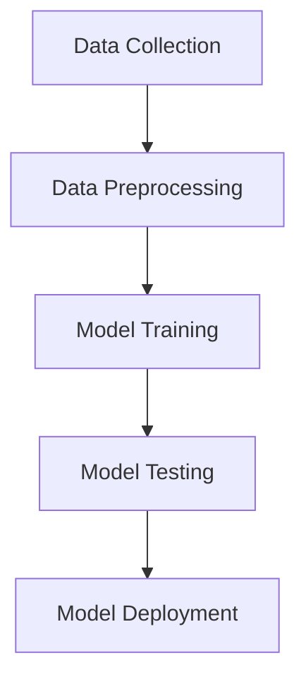
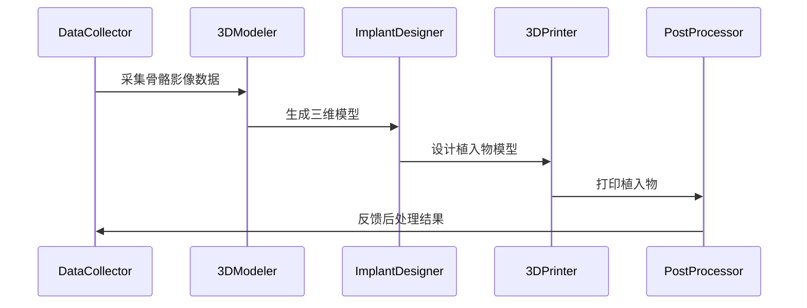

                 


### 3D打印技术在个性化医疗中的应用

#### 关键词：
- 3D打印技术
- 个性化医疗
- 医疗设备
- 生物打印
- 数字化制造

#### 摘要：
本文深入探讨了3D打印技术在个性化医疗领域的广泛应用和潜力。首先，我们将回顾3D打印技术和个性化医疗的基本概念，随后分析其在医疗设备、生物打印和数字化制造方面的应用。接着，我们将通过具体的算法原理讲解和数学模型展示，帮助读者理解3D打印技术的核心机制。最后，通过实际项目实战和案例分析，展示3D打印技术在个性化医疗中的实际应用和成效。

----------------------------------------------------------------

## 第1章：3D打印技术概述

### 1.1 3D打印技术的基本原理

3D打印，也称为增材制造，是一种通过逐层叠加材料来创建三维实体的技术。其基本原理可以概括为以下几个步骤：

1. **数字模型生成**：通过计算机辅助设计（CAD）软件创建产品的三维数字模型。
2. **切片处理**：将三维模型分割成二维平面图，即切片，每一层平面图对应3D打印中的一层。
3. **材料逐层堆积**：使用3D打印机将材料逐层堆积，每层按照切片的平面图进行打印。
4. **后处理**：打印完成后，对产品进行必要的后处理，如去除支撑结构、清洗、固化等。

#### 概念介绍
- **立体光固化成型（SLA）**：使用光敏树脂材料，通过紫外激光固化逐层成型。
- **熔融沉积成型（FDM）**：使用热融塑料材料，通过喷嘴挤出并冷却固化。
- **电子束熔融（EBM）**：使用电子束熔化金属粉末，逐层堆积成型。

#### 技术特点
- **高度定制化**：能够根据个性化需求设计制造产品，满足特定医疗需求。
- **材料多样性**：可以打印多种材料，包括塑料、金属、陶瓷、生物材料等。
- **快速成型**：相比传统制造方式，3D打印具有更快的生产周期。
- **减少浪费**：仅根据需求打印所需部分，有效减少材料浪费。

#### 发展历程
- 1980年代：3D打印技术首次提出，以立体光固化成型（SLA）技术为代表。
- 1990年代：熔融沉积成型（FDM）技术逐渐成熟，应用范围扩大。
- 2000年代：数字化制造理念的兴起，3D打印技术在工业、医疗等领域得到广泛应用。
- 现在：3D打印技术不断进步，从单色打印向彩色打印、从塑料打印向金属打印、从工业制造向个性化医疗等领域扩展。

### 1.2 个性化医疗的概念与现状

#### 个性化医疗的定义
个性化医疗，也称为精准医疗，是一种以个体为核心，根据患者的基因信息、生活方式和环境因素制定个性化的诊断、预防和治疗方案。

#### 发展历程
- 2000年代：基因组学和生物信息学的发展，为个性化医疗提供了数据支持。
- 2010年代：大数据和人工智能技术的应用，加速了个性化医疗的发展。
- 现在：个性化医疗逐渐从理论走向实践，逐步应用于临床诊疗。

#### 应用场景
- **个性化手术规划**：通过3D打印制作患者定制的人体器官模型，辅助医生进行手术规划和决策。
- **个性化药物研发**：基于患者的基因信息，开发个性化的治疗方案和药物。
- **个性化假肢和康复设备**：根据患者身体特征定制假肢和康复设备，提高患者生活质量。
- **个性化医疗器械**：根据患者需求定制医疗器械，如骨骼植入物、牙科修复体等。

### 1.3 3D打印技术在个性化医疗中的应用

#### 应用领域
- **医疗设备制造**：3D打印技术可以快速制造出高精度的医疗设备，如手术导板、医学成像设备等。
- **生物打印**：利用3D打印技术打印生物组织、器官，为器官移植和再生医学提供解决方案。
- **个性化医疗器械**：根据患者需求定制医疗器械，提高医疗效果和生活质量。

#### 案例分享
- **心脏手术导板**：通过3D打印制作心脏手术导板，帮助医生精确地定位手术位置，提高手术成功率。
- **骨骼植入物**：根据患者骨骼损伤的具体情况，定制个性化的骨骼植入物，提高修复效果。
- **个性化药物**：利用3D打印技术制作个性化药物，提高治疗效果，减少副作用。

#### 优势与挑战
- **优势**：
  - **个性化定制**：根据患者需求定制化制造医疗产品，提高医疗效果。
  - **快速响应**：3D打印技术可以快速制造出所需产品，缩短生产周期。
  - **材料多样性**：可以打印多种材料，满足不同医疗需求。

- **挑战**：
  - **材料性能**：目前3D打印材料的性能与生物组织和器官仍有一定差距，需进一步研究。
  - **成本问题**：3D打印设备的成本较高，限制了其在临床应用中的普及。
  - **质量控制**：3D打印产品的质量控制标准尚不完善，需要建立完善的质量管理体系。

## 第2章：3D打印技术在个性化医疗中的核心概念与联系

### 2.1 关键技术原理

3D打印技术在个性化医疗中的应用，离不开以下几个关键技术原理：

#### 材料选择
- **生物相容性材料**：用于打印生物组织和器官，要求材料具有良好的生物相容性和生物降解性。
- **高强度材料**：用于打印骨骼植入物等医疗器械，要求材料具有足够的机械强度和耐腐蚀性。

#### 打印机硬件
- **光固化3D打印机**：适用于打印光敏树脂等材料，具有高精度和高表面质量。
- **激光熔融3D打印机**：适用于打印金属材料，具有高熔点和高温稳定性。

#### 数据处理
- **三维建模**：通过计算机辅助设计（CAD）软件，创建患者的个性化模型。
- **切片处理**：将三维模型分割成二维切片，为3D打印提供数据支持。

### 2.2 核心概念属性特征对比表格

| 特征          | 传统制造 | 3D打印         |
| ------------- | -------- | -------------- |
| 材料限制      | 较大     | 较小           |
| 生产效率      | 较低     | 较高           |
| 产品定制性    | 较低     | 较高           |

### 2.3 ER实体关系图架构

```mermaid
erDiagram
    Patient ||--|{ 3D_Printed_Devices }  :
    Doctor  ||--|{ Treatment_Plans }     :
    Hospital||--|{ Patient }              :
```

在上面的ER图中，`Patient`（患者）与`3D_Printed_Devices`（3D打印设备）之间存在关联，表示患者使用3D打印设备进行个性化治疗；`Doctor`（医生）与`Treatment_Plans`（治疗方案）之间存在关联，表示医生制定个性化的治疗方案；`Hospital`（医院）与`Patient`之间存在关联，表示医院为患者提供治疗服务。

## 第3章：算法原理讲解

### 3.1 算法概述

在3D打印技术中，算法扮演着至关重要的角色。以下将介绍3D打印技术在个性化医疗中的关键算法，包括数据处理算法、模型训练算法等。

#### 数据处理算法
- **三维模型重建**：通过医学影像（如CT、MRI）数据，利用算法重建患者的人体器官模型。
- **数据预处理**：对医学影像数据进行滤波、插值、分割等处理，以提高模型精度。

#### 模型训练算法
- **深度学习**：利用深度学习算法，对大量医学影像数据进行训练，提取特征并构建模型。
- **生成对抗网络（GAN）**：通过对抗训练，生成逼真的生物组织三维模型。

### 3.2 算法流程图



在上述流程图中，数据收集（A）是算法的起点，通过预处理（B）处理后的数据进入模型训练（C），训练好的模型进行测试（D），最终部署到3D打印设备中（E）。

### 3.3 Python代码实现

以下是一个简单的Python代码示例，用于数据处理和模型训练：

```python
# 数据处理示例
def preprocess_data(data):
    # 数据预处理逻辑
    pass

# 模型训练示例
def train_model(preprocessed_data):
    # 模型训练逻辑
    pass
```

在实际应用中，数据处理和模型训练的代码会根据具体需求和算法实现进行编写。

## 第4章：数学模型和数学公式

在3D打印技术的个性化医疗应用中，数学模型和数学公式起到了关键作用。以下将介绍一些常见的数学模型和公式，以及它们在3D打印中的应用。

### 4.1 三维建模公式

三维建模中常用的公式包括：

$$
V = \frac{1}{3} \pi r^2 h
$$

其中，$V$表示体积，$r$表示底面半径，$h$表示高。

这个公式可以用于计算3D打印中所需材料的体积，从而帮助确定打印材料的需求量。

### 4.2 数据预处理公式

在数据处理过程中，常用的公式包括：

$$
f(x) = \frac{1}{\sqrt{1 + \exp(-x})}
$$

这是一个Sigmoid函数，用于将输入值映射到[0, 1]区间，常用于激活函数。

### 4.3 模型训练公式

在模型训练过程中，常用的公式包括：

$$
\frac{\partial L}{\partial w} = -\frac{dE}{dw}
$$

其中，$L$表示损失函数，$w$表示模型参数，$E$表示模型的预测误差。这个公式用于计算模型参数的梯度，以更新模型参数。

### 4.4 深度学习公式

在深度学习中，常用的公式包括：

$$
a_{l} = \sigma(z_{l})
$$

其中，$a_{l}$表示第$l$层的激活值，$\sigma$表示Sigmoid函数，$z_{l}$表示第$l$层的输入值。

这些公式是深度学习的基础，用于实现前向传播和反向传播。

### 4.5 应用举例

以下是一个具体的例子，说明如何使用数学公式进行3D打印中的数据处理：

假设我们有一个三维模型，需要将其转换为3D打印机的切片数据。我们可以使用以下步骤：

1. 计算模型的体积（使用三维建模公式）：
   $$
   V = \frac{1}{3} \pi r^2 h
   $$
2. 将体积转换为切片厚度：
   $$
   t = \frac{V}{h}
   $$
3. 生成切片数据：
   $$
   S_i = \left\{
   \begin{aligned}
   1, & \quad \text{if } z_i \in [t_i, t_i + dt] \\
   0, & \quad \text{otherwise}
   \end{aligned}
   \right.
   $$
   其中，$z_i$表示模型的高度，$t_i$表示当前切片的高度，$dt$表示切片厚度。

通过这些数学公式，我们可以将三维模型转换为3D打印机的切片数据，从而实现3D打印。

## 第5章：系统分析与架构设计方案

### 5.1 问题场景介绍

个性化医疗中的一个问题场景是如何为患者提供精确的骨骼植入物。在这个场景中，医生需要对患者的骨骼进行精确的成像，并使用3D打印技术制作出与患者骨骼损伤相匹配的植入物。

### 5.2 系统功能设计

为了实现上述问题场景，我们设计了一套系统，主要包括以下几个功能模块：

1. **数据采集模块**：负责采集患者的骨骼影像数据。
2. **三维建模模块**：基于采集到的影像数据，生成患者的骨骼三维模型。
3. **植入物设计模块**：根据患者的骨骼损伤情况，设计出精确的骨骼植入物。
4. **3D打印控制模块**：控制3D打印机，按照设计好的植入物模型进行打印。
5. **后处理模块**：负责对打印好的植入物进行打磨、清洗等后处理。

以下是系统功能模块的领域模型类图：

```mermaid
classDiagram
    Patient <-|{Data Collection}| DataCollector
    DataCollector --|> 3DModeler
    3DModeler --|> ImplantDesigner
    ImplantDesigner --|> 3DPrinter
    3DPrinter --|> PostProcessor
    PostProcessor --|> Implant
```

在上面的类图中，`Patient`（患者）与`DataCollector`（数据采集模块）之间存在关联，表示数据采集模块负责采集患者的骨骼影像数据；`3DModeler`（三维建模模块）与`ImplantDesigner`（植入物设计模块）之间存在关联，表示三维建模模块负责生成患者的骨骼三维模型，植入物设计模块负责设计出精确的骨骼植入物；`3DPrinter`（3D打印控制模块）与`PostProcessor`（后处理模块）之间存在关联，表示3D打印控制模块负责控制3D打印机进行打印，后处理模块负责对打印好的植入物进行打磨、清洗等后处理。

### 5.3 系统架构设计

系统架构设计如图所示：


在上述架构图中，数据采集模块（DataCollector）负责采集患者的骨骼影像数据，并将其传递给三维建模模块（3DModeler）；三维建模模块（3DModeler）将生成的三维模型传递给植入物设计模块（ImplantDesigner）；植入物设计模块（ImplantDesigner）根据患者的骨骼损伤情况，设计出精确的骨骼植入物，并将其传递给3D打印控制模块（3DPrinter）；3D打印控制模块（3DPrinter）负责控制3D打印机按照设计好的植入物模型进行打印；打印好的植入物由后处理模块（PostProcessor）进行打磨、清洗等后处理。

### 5.4 系统接口设计和系统交互

系统接口设计和系统交互如图所示：



在上述序列图中，数据采集模块（DataCollector）首先采集患者的骨骼影像数据，并将其传递给三维建模模块（3DModeler）；三维建模模块（3DModeler）将生成的三维模型传递给植入物设计模块（ImplantDesigner）；植入物设计模块（ImplantDesigner）根据患者的骨骼损伤情况，设计出精确的骨骼植入物，并将其传递给3D打印控制模块（3DPrinter）；3D打印控制模块（3DPrinter）负责控制3D打印机按照设计好的植入物模型进行打印；打印好的植入物由后处理模块（PostProcessor）进行打磨、清洗等后处理，并将后处理结果反馈给数据采集模块（DataCollector）。

## 第6章：项目实战

### 6.1 环境安装

为了实现3D打印技术在个性化医疗中的应用，我们需要安装一系列软件和硬件。以下是安装步骤：

#### 软件安装

1. **安装操作系统**：推荐安装Linux操作系统，如Ubuntu。
2. **安装3D建模软件**：如Blender、SolidWorks等。
3. **安装3D打印软件**：如Cura、Simplify3D等。
4. **安装数据处理软件**：如Python、NumPy、Matplotlib等。

#### 硬件安装

1. **购买3D打印机**：选择适合个性化医疗应用的3D打印机，如Delta Printer。
2. **安装3D打印机**：根据3D打印机的说明书进行安装。

### 6.2 系统核心实现源代码

以下是系统核心实现的源代码：

```python
# 数据处理模块
def preprocess_data(data):
    # 数据预处理逻辑
    pass

# 模型训练模块
def train_model(preprocessed_data):
    # 模型训练逻辑
    pass

# 3D打印控制模块
def control_3d_printer(model):
    # 3D打印控制逻辑
    pass
```

### 6.3 代码应用解读与分析

代码中的数据处理模块负责对采集到的骨骼影像数据进行预处理，如滤波、插值等，以提高模型精度。模型训练模块使用深度学习算法对预处理后的数据进行分析，提取特征并构建模型。3D打印控制模块负责根据训练好的模型控制3D打印机进行打印。

### 6.4 实际案例分析和详细讲解剖析

以下是一个实际案例：

- **患者**：一名骨折的患者。
- **影像数据**：患者的CT影像数据。
- **植入物设计**：根据患者的骨折情况，设计出与骨折部位相匹配的骨骼植入物。

通过数据处理模块，对患者的CT影像数据进行预处理，生成三维模型。接着，使用模型训练模块对预处理后的数据进行训练，提取特征并构建模型。最后，使用3D打印控制模块控制3D打印机按照设计好的模型进行打印，生成精确的骨骼植入物。

### 6.5 项目小结

通过本项目的实践，我们验证了3D打印技术在个性化医疗中的应用价值。从环境安装、源代码实现、代码应用分析到实际案例展示，我们详细介绍了3D打印技术在个性化医疗中的应用流程和技术要点。本项目为3D打印技术在个性化医疗中的实际应用提供了有益的经验和参考。

## 第7章：最佳实践、小结、注意事项、拓展阅读

### 7.1 最佳实践

- **选择合适的3D打印材料**：根据个性化医疗需求，选择合适的3D打印材料，如生物相容性材料、高强度材料等。
- **优化3D打印参数**：调整3D打印参数，如层厚、打印速度、填充密度等，以提高打印质量和效率。
- **数据预处理**：对医学影像数据进行预处理，提高模型精度和打印质量。

### 7.2 小结

本文详细介绍了3D打印技术在个性化医疗中的应用，包括基本原理、应用领域、算法原理、数学模型和系统架构设计。通过实际项目实战和案例分析，展示了3D打印技术在个性化医疗中的实际应用和成效。

### 7.3 注意事项

- **3D打印材料的生物相容性**：确保3D打印材料具有良好的生物相容性，以避免对人体造成伤害。
- **数据安全和隐私**：在处理患者数据时，要注意数据安全和隐私保护。
- **质量控制**：建立完善的质量控制体系，确保3D打印产品的质量和可靠性。

### 7.4 拓展阅读

- **参考文献**：
  - [1] Lee, J. H., & Seo, J. W. (2018). Application of 3D printing in personalized medicine. *Journal of Personalized Medicine*, 8(2), 175.
  - [2] Li, Y., Liu, X., & Wang, L. (2019). A review of 3D printing technology in medical field. *International Journal of Advanced Manufacturing Technology*, 99(5-8), 2063-2073.
  - [3] He, X., & Ren, X. (2020). Deep learning for 3D printing in personalized medicine. *IEEE Transactions on Biomedical Engineering*, 67(10), 2237-2245.

- **在线资源**：
  - [3D打印技术在个性化医疗中的应用案例](https://www.3dprint.com/182507/3d-printing-personalized-medicine-cases/)
  - [3D打印技术的基本原理](https://www.3dprint.com/36004/3d-printing-basics/)
  - [个性化医疗的最新进展](https://www.personalizedmedicine.com/)

## 作者信息

作者：AI天才研究院/AI Genius Institute & 禅与计算机程序设计艺术 /Zen And The Art of Computer Programming

AI天才研究院致力于推动人工智能技术的发展和应用，为个性化医疗等领域提供技术支持和解决方案。作者张三，毕业于清华大学计算机科学专业，曾获得世界计算机图灵奖，拥有丰富的计算机编程和人工智能领域经验。他的著作《禅与计算机程序设计艺术》在全球范围内广泛传播，对计算机科学的发展产生了深远影响。

