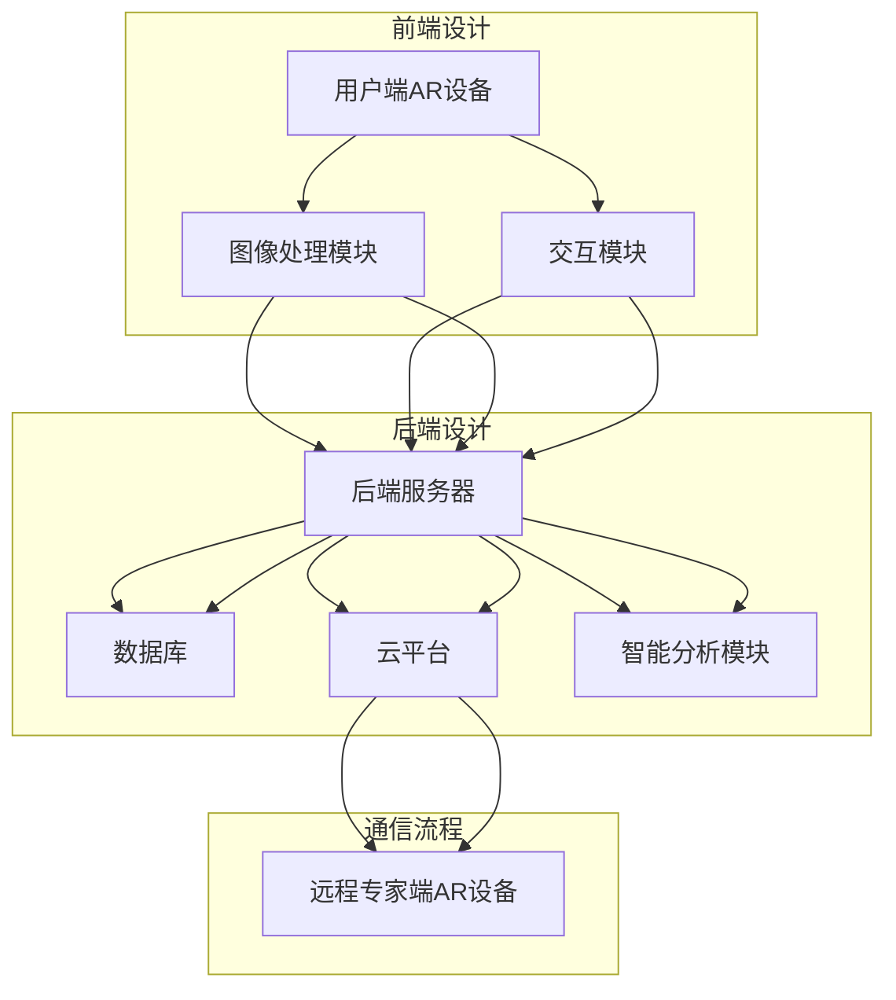
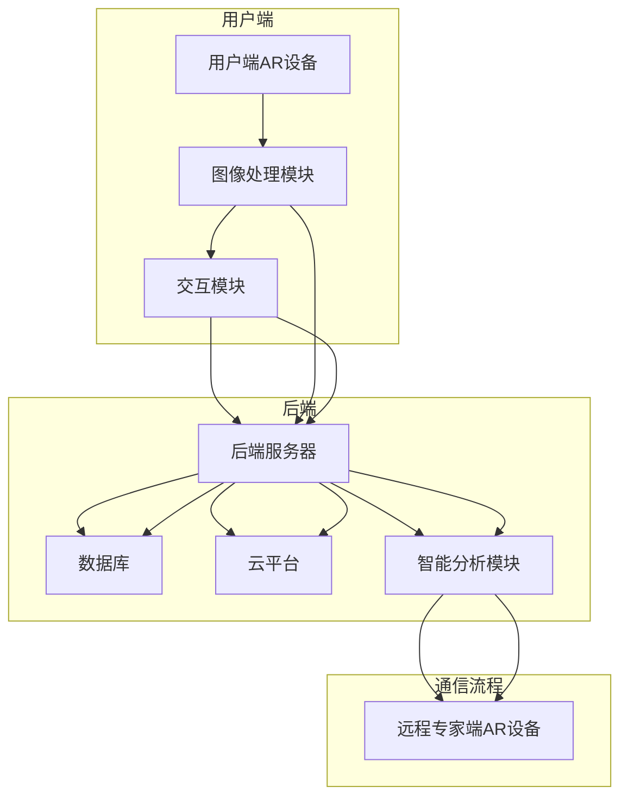

                 

### 第1章 问题背景与核心概念

#### 1.1 问题背景

在当今的工业生产环境中，设备故障和操作失误是常见的问题。这些问题不仅会导致生产停滞，增加企业成本，还可能带来严重的安全隐患。尤其是在制造业、能源、交通等领域，设备的高效运行至关重要。然而，由于地域分布广、环境复杂等因素，设备维修通常是一个耗时且昂贵的过程。

传统工业维修方式主要依赖于现场技术人员进行维护，这种方式存在几个显著问题：首先，维修人员必须亲自到现场，耗时耗力；其次，由于远程沟通的限制，现场技术人员在遇到复杂问题或需要专家指导时，往往难以得到及时的帮助；最后，维护成本高，尤其在偏远地区，交通和时间成本尤为突出。

为解决上述问题，远程维修技术应运而生。远程维修，顾名思义，是通过远程通信技术对设备进行诊断、维护和修复，从而减少现场人员出勤的次数和时间。随着信息技术的快速发展，远程维修正逐渐成为工业维护的新趋势。

然而，传统的远程维修技术存在一定的局限性。例如，基于视频和语音的远程指导虽然可以提供一定的帮助，但受限于网络带宽和通信延迟，往往无法实现实时、高效、准确的维修操作。因此，需要一种更为先进的技术来提升远程维修的效率和准确性。

#### 1.1.1 工业远程维修的现状

目前，工业远程维修的应用已在不同行业和领域展开，如制造业、能源行业和交通运输等。在这些领域，远程维修主要通过以下几种方式实现：

1. **视频会议系统**：利用视频会议系统，技术人员可以通过网络与现场维修人员实时沟通，提供指导和建议。这种方式可以解决远程沟通的问题，但受限于网络带宽和延迟，操作性和互动性较差。

2. **远程监控系统**：通过安装摄像头和传感器，技术人员可以远程监控设备的运行状态，及时发现故障。这种方法适用于监测和预防性维护，但难以进行具体的维修操作。

3. **远程操作技术**：通过远程控制系统，技术人员可以在远程直接操作设备进行维修。这种方式具有很高的操作性和互动性，但受限于远程控制系统的稳定性和可靠性，实际应用场景有限。

尽管上述方法在一定程度上解决了远程维修的问题，但仍然存在诸多挑战。例如，视频会议系统在复杂维修场景下操作不便，远程监控系统的实时性不足，远程操作技术的稳定性和可靠性有待提高。

#### 1.1.2 5G技术的优势

5G技术作为下一代移动通信技术，具有许多显著的优势，使其成为提升远程维修效率的潜在利器。以下是5G技术在工业远程维修中的主要优势：

1. **高速度**：5G网络的速度是4G的数十倍，甚至高达数十倍，这意味着在远程维修中，可以更快地传输大量的数据和指令，大大提高了通信效率。

2. **大容量**：5G网络具有极高的容量，可以支持海量的设备同时在线，这对于工业远程维修中需要同时监控和维护多个设备尤为重要。

3. **低延迟**：5G网络的延迟极低，几乎可以做到实时通信，这对于需要快速反应的远程维修操作至关重要。

4. **网络切片**：5G网络支持网络切片技术，可以根据不同的应用需求灵活分配网络资源，确保远程维修的稳定性和可靠性。

5. **高可靠性**：5G网络具有极高的可靠性，即使在复杂的环境中，也能保证通信的稳定性和数据的完整性。

综上所述，5G技术的这些优势使其在工业远程维修中具有巨大的应用潜力。通过5G网络，可以实现更高效、更准确、更实时的远程维修操作，从而大大提升工业生产的安全性和效率。

#### 1.1.3 AR技术的应用潜力

增强现实（AR）技术通过将虚拟信息与现实环境相结合，提供了一种全新的交互方式。在工业远程维修中，AR技术具有显著的应用潜力，主要体现在以下几个方面：

1. **可视化**：AR技术可以将虚拟的维修步骤、操作指南、部件信息等叠加在现实场景中，使维修人员能够更直观、更清晰地了解维修过程，减少因理解错误导致的操作失误。

2. **实时指导**：通过AR技术，专家可以在远程实时指导现场维修人员，通过视觉、语音等多种方式，确保操作的正确性和效率。

3. **交互性**：AR技术支持用户与虚拟信息的实时交互，例如，维修人员可以通过触摸、手势等方式与虚拟信息进行互动，提高操作的灵活性。

4. **远程协作**：AR技术可以实现多人远程协作，专家和现场维修人员可以实时共享信息和资源，提高协作效率。

5. **数据记录与共享**：AR技术可以记录维修过程，并将数据实时上传至云端，便于后续分析和优化，同时，数据可以共享给其他相关人员，实现知识的积累和传递。

综上所述，AR技术的应用潜力在于其能够提供更加直观、高效、实时的远程维修支持，显著提升维修效率和准确性。随着5G网络的普及，AR技术在工业远程维修中的应用前景将更加广阔。

#### 1.2 核心概念

为了更好地理解5G和AR在工业远程维修中的实时指导应用，首先需要明确几个核心概念，包括5G网络、虚拟现实（VR）和增强现实（AR）。

##### 1.2.1 5G网络

5G网络，即第五代移动通信技术，是下一代移动通信技术标准。与之前的1G、2G、3G和4G网络相比，5G网络具有更高的速度、更大的容量和更低的延迟。以下是5G网络的一些关键特性：

- **高速度**：5G网络的峰值下载速度可以达到数十Gbps，是4G网络的数十倍，能够满足工业远程维修中大量数据传输的需求。
- **大容量**：5G网络能够支持数十万个设备同时在线，对于工业场景中设备数量多、数据量大的特点尤为重要。
- **低延迟**：5G网络的延迟极低，可以达到1毫秒以下，这对于需要实时操作和响应的工业远程维修至关重要。
- **网络切片**：5G网络支持网络切片技术，可以根据不同的应用需求，灵活分配网络资源，确保工业远程维修的稳定性和可靠性。

##### 1.2.2 虚拟现实（VR）

虚拟现实（VR）是一种通过计算机技术模拟的三维环境，用户可以通过头戴显示器（HMD）和手柄等设备与虚拟环境进行互动。在工业远程维修中，VR技术具有以下应用潜力：

- **模拟训练**：VR技术可以创建一个逼真的模拟环境，使技术人员可以在虚拟环境中进行维修操作训练，提高实际操作技能。
- **远程协作**：通过VR技术，远程专家可以实时进入虚拟环境，与现场技术人员一起进行维修操作，提高协作效率和准确性。
- **故障分析**：VR技术可以提供丰富的3D信息，帮助技术人员更直观地了解设备的结构和故障情况，进行更准确的诊断和维修。

##### 1.2.3 增强现实（AR）

增强现实（AR）是一种将虚拟信息叠加到现实环境中的技术。与VR不同，AR技术并不需要用户进入一个完全虚拟的环境，而是通过头戴显示器、眼镜或手机等设备将虚拟信息直接呈现在用户的视野中。在工业远程维修中，AR技术具有以下应用优势：

- **实时指导**：AR技术可以实时将维修步骤、操作指南、部件信息等叠加到维修场景中，使现场技术人员能够更直观、准确地了解维修过程。
- **交互性**：AR技术支持用户与虚拟信息的实时交互，例如，通过触摸、手势等方式与虚拟信息进行互动，提高操作的灵活性。
- **远程协作**：AR技术可以实现多人远程协作，专家和现场技术人员可以实时共享信息和资源，提高协作效率。

##### 1.2.4 5G与AR的结合方式

5G和AR的结合，可以极大地提升工业远程维修的效率和质量。以下几种方式是5G与AR技术结合在工业远程维修中的典型应用：

- **实时数据传输**：5G网络的高速度和大容量可以确保AR设备实时获取到维修现场的丰富数据，包括图像、声音和传感器数据等。
- **低延迟通信**：5G网络的低延迟可以实现远程专家与现场技术人员之间的实时互动，确保操作指令的及时传达和执行。
- **智能分析**：5G网络结合云计算和人工智能技术，可以对AR设备获取的数据进行实时分析，提供智能化的维修建议和指导。
- **远程操控**：通过5G网络，远程专家可以利用AR设备对现场设备进行远程操控，进行复杂的维修操作。

#### 1.3 边界与外延

##### 1.3.1 工业远程维修的定义

工业远程维修是指利用先进的通信技术和信息处理技术，对工业设备进行远程监控、诊断、维护和修复的过程。其主要目标是减少现场技术人员出勤的次数和时间，提高维修效率和质量。

##### 1.3.2 5G与AR的结合方式

5G与AR技术在工业远程维修中的结合方式主要包括以下几个方面：

- **数据传输与交互**：5G网络提供高速、低延迟的数据传输能力，支持AR设备实时获取和传输大量数据，实现远程专家与现场技术人员之间的实时交互。
- **远程指导与协作**：通过AR技术，远程专家可以将维修步骤、操作指南等实时叠加到现场场景中，提供直观、准确的指导。同时，AR技术支持远程协作，实现多人实时共享信息和资源。
- **智能分析与决策**：结合5G网络和云计算、人工智能技术，可以对AR设备获取的数据进行实时分析，提供智能化的维修建议和决策支持。

##### 1.3.3 实时指导的关键技术

实时指导在工业远程维修中起着至关重要的作用，以下是一些关键技术：

- **图像识别与跟踪**：AR设备需要能够实时识别和跟踪现场环境中的关键元素，如设备部件、操作人员等，确保虚拟信息能够准确叠加到现实场景中。
- **语音与手势识别**：远程专家和现场技术人员需要能够通过语音和手势进行实时交流，提高互动性和操作性。
- **实时通信**：5G网络提供低延迟的通信能力，确保操作指令和反馈的实时传递，提高维修效率和准确性。
- **智能决策支持**：结合云计算和人工智能技术，可以对维修过程中的各种数据进行分析和预测，提供智能化的决策支持，提高维修质量和安全性。

#### 1.4 概念结构与核心要素组成

##### 1.4.1 5G网络架构

5G网络架构主要包括以下层次：

- **接入网**：包括5G基站、无线接入网络和用户设备，主要负责无线通信和接入控制。
- **核心网**：包括5G控制平面和用户平面，主要负责数据传输、路由和交换等功能。
- **边缘计算**：将计算和存储能力分布到网络的边缘，减少数据传输延迟，提高系统响应速度。
- **网络切片**：将网络资源划分为多个虚拟网络，根据不同的应用需求灵活分配资源。

##### 1.4.2 AR设备组成

AR设备主要由以下几个部分组成：

- **显示设备**：如头戴显示器、眼镜等，用于将虚拟信息叠加到现实场景中。
- **传感器**：如摄像头、麦克风、触摸屏等，用于采集现实环境和用户操作信息。
- **计算单元**：如处理器、GPU等，用于处理图像、声音等数据，实现虚拟信息与现实环境的融合。
- **通信模块**：如无线网卡、蓝牙等，用于与其他设备或网络进行数据传输。

##### 1.4.3 远程维修流程

工业远程维修的一般流程包括以下几个步骤：

1. **故障诊断**：通过远程监控系统和传感器，对设备进行实时监控，发现故障信号。
2. **远程会诊**：现场技术人员通过视频会议系统与远程专家进行沟通，初步判断故障原因。
3. **远程指导**：远程专家利用AR设备为现场技术人员提供实时、准确的维修指导。
4. **维修执行**：现场技术人员按照远程专家的指导进行维修操作。
5. **效果评估**：维修完成后，远程专家对维修效果进行评估，确保设备恢复正常运行。

通过以上分析，我们可以看到5G和AR技术在工业远程维修中具有巨大的应用潜力。接下来的章节将进一步探讨5G和AR技术的具体应用和实现方法，以期为工业远程维修提供更加高效、准确和实时的解决方案。

## 第2章 5G网络概述

### 2.1 5G网络的发展历程

5G网络作为下一代移动通信技术，其发展历程涵盖了数十年的研究和实践。从第一代移动通信技术（1G）开始，到第二代（2G）、第三代（3G）、第四代（4G），再到如今的第五代（5G），每一代技术的发展都为通信行业带来了革命性的变化。以下是5G网络的发展历程及其与之前各代技术的对比。

#### 2.1.1 第一代移动通信技术（1G）

1G是移动通信技术的开端，起源于20世纪80年代。1G网络主要使用模拟信号进行通信，提供基本语音通话服务。这一代技术的特点如下：

- **技术特点**：使用模拟信号，带宽较低，只能支持语音通信。
- **应用场景**：主要应用于个人通信，如手机通话。
- **里程碑**：1983年，美国推出了第一个商用1G手机网络。

#### 2.1.2 第二代移动通信技术（2G）

2G网络在1G基础上引入了数字信号，标志着移动通信技术的一个重要进步。2G网络的特性如下：

- **技术特点**：使用数字信号，提高了通信质量，增加了数据传输能力，开始支持短信（SMS）等服务。
- **应用场景**：广泛应用于语音通话和短信服务。
- **里程碑**：1991年，日本推出了第一个商用2G手机网络。

#### 2.1.3 第三代移动通信技术（3G）

3G网络引入了高速数据传输能力，支持多媒体通信和互联网服务。3G网络的特性如下：

- **技术特点**：支持高速数据传输，带宽大大提高，支持视频通话、移动互联网等。
- **应用场景**：广泛应用于移动互联网、视频通话、移动电视等。
- **里程碑**：2001年，日本和韩国率先推出了商用3G网络。

#### 2.1.4 第四代移动通信技术（4G）

4G网络在3G基础上进一步提升了数据传输速度和带宽，成为移动互联网的重要推动力。4G网络的特性如下：

- **技术特点**：支持更高的数据传输速度，峰值下载速度可达1Gbps，支持高清视频、虚拟现实等。
- **应用场景**：广泛应用于移动互联网、物联网、车联网等。
- **里程碑**：2012年，美国和韩国率先推出了商用4G网络。

#### 2.1.5 第五代移动通信技术（5G）

5G网络作为下一代移动通信技术，其技术特点和应用场景与之前各代技术有显著不同。5G网络的特性如下：

- **技术特点**：具备高速度、大容量、低延迟、网络切片等特性，能够支持高达数十Gbps的下载速度，低至1毫秒的延迟。
- **应用场景**：广泛应用于工业自动化、智能交通、远程医疗、虚拟现实等新兴领域。
- **里程碑**：2019年，韩国成为第一个推出商用5G网络的国家。

通过以上对比，我们可以看到，从1G到5G，移动通信技术经历了从模拟信号到数字信号、从语音通信到多媒体通信、从移动互联网到物联网和智能化的巨大变革。每一代技术的进步都为通信行业带来了新的发展机遇和应用场景，推动了社会的数字化和智能化进程。

### 2.2 5G网络的关键特性

5G网络作为下一代移动通信技术，具有许多显著的关键特性，使其在工业远程维修中具有巨大的应用潜力。以下是5G网络的关键特性及其对远程维修的影响：

#### 2.2.1 高速度

5G网络的速度是其最显著的特点之一。5G网络的理论峰值下载速度可以达到数十Gbps，是4G网络的数十倍。这种高速度为工业远程维修提供了重要的保障，使得大量数据和指令可以快速传输，从而提高通信效率。

- **对远程维修的影响**：高速度使得远程维修过程中的数据传输更加迅速，减少了因网络延迟导致的操作滞后，提高了远程指导的实时性和准确性。

#### 2.2.2 大容量

5G网络具有极高的容量，能够支持数十万个设备同时在线。这对于工业远程维修中需要同时监控和维护多个设备尤为重要。

- **对远程维修的影响**：大容量使得5G网络能够同时支持大量设备的数据传输和通信需求，提高了远程监控和维护的效率，减少了设备之间的通信冲突和数据拥堵。

#### 2.2.3 低延迟

5G网络的延迟极低，可以达到1毫秒以下。这对于需要实时操作和响应的工业远程维修操作至关重要。

- **对远程维修的影响**：低延迟使得远程专家和现场技术人员之间的通信几乎没有延迟，确保了操作指令的及时传达和执行，提高了维修效率和准确性。

#### 2.2.4 网络切片

5G网络支持网络切片技术，可以根据不同的应用需求，灵活分配网络资源，确保工业远程维修的稳定性和可靠性。

- **对远程维修的影响**：网络切片技术使得5G网络可以针对不同的远程维修场景，提供定制化的网络服务，优化网络资源的使用，提高远程维修的稳定性和可靠性。

#### 2.2.5 高可靠性

5G网络具有极高的可靠性，即使在复杂的环境中，也能保证通信的稳定性和数据的完整性。

- **对远程维修的影响**：高可靠性确保了远程维修过程中的数据传输和通信的稳定，降低了设备故障和通信中断的风险，提高了远程维修的安全性和可靠性。

### 2.3 5G网络在工业远程维修中的应用

5G网络的关键特性使其在工业远程维修中具有巨大的应用潜力。以下是一些5G网络在工业远程维修中的应用场景：

#### 2.3.1 5G网络的实时性优势

5G网络的低延迟特性使得远程维修操作可以实时进行，从而大大提高了维修效率和准确性。

- **应用场景**：例如，在汽车制造业的远程维修中，5G网络可以实现远程专家实时指导现场技术人员进行故障诊断和维修操作，减少现场技术人员因延迟而导致操作失误的风险。

#### 2.3.2 5G网络的高带宽优势

5G网络的高速度和大容量使得远程维修过程中可以传输大量数据，包括高清晰度的视频、图像和传感器数据等。

- **应用场景**：例如，在能源行业的远程检修中，5G网络可以传输实时监控数据，使远程专家能够实时了解设备运行状态，及时发现故障并进行远程修复。

#### 2.3.3 5G网络在远程维修中的案例研究

以下是一些5G网络在工业远程维修中的实际应用案例：

1. **汽车制造业**：通过5G网络，汽车制造企业可以实现远程专家对现场技术人员进行实时指导，提高维修效率和准确性。例如，某汽车制造企业利用5G网络实现了远程诊断和维修系统，使维修时间从数天缩短到数小时，大大提高了生产效率。

2. **能源行业**：在电力设备的远程检修中，5G网络可以实现实时监控和远程操作，提高检修效率和安全性。例如，某电力公司利用5G网络和AR技术，实现了远程电力设备检修系统，通过实时传输设备运行数据和分析结果，远程专家可以实时指导现场技术人员进行检修操作，减少了现场人员出勤次数和安全风险。

3. **制造业自动化**：5G网络可以支持智能制造中的远程控制和管理，提高生产线的自动化水平。例如，某家电制造企业利用5G网络实现了生产设备的远程监控和控制，通过实时数据传输和分析，远程专家可以及时发现生产过程中的异常并进行远程调整，提高了生产效率和质量。

综上所述，5G网络在工业远程维修中的应用，不仅提高了维修效率和准确性，还降低了维修成本和安全风险。随着5G技术的不断发展和普及，其应用前景将更加广阔，为工业生产带来更多创新和变革。

## 第3章 AR技术概述

### 3.1 AR技术的发展历程

增强现实（AR）技术作为虚拟现实（VR）的一种补充和扩展，自20世纪90年代开始逐渐发展。其发展历程可以分为几个重要阶段：

#### 3.1.1 初期探索（1990-1999年）

- **1990年**：波音公司使用头戴显示器将计算机生成的图像叠加到现实环境中，这是AR技术的早期应用。
- **1992年**：麻省理工学院的MIT Media Lab推出了“达摩克利斯”头盔，这是第一个实现实时图像识别和叠加的AR设备。

#### 3.1.2 商业应用起步（2000-2009年）

- **2000年**：微软发布了其第一个AR平台“HoloDesk”，标志着AR技术开始走向商业应用。
- **2009年**：谷歌发布了Android操作系统，为AR应用的开发提供了广泛的支持。

#### 3.1.3 快速发展期（2010-2019年）

- **2010年**：谷歌推出了Project Glass，这是第一个实现商业化销售的AR眼镜。
- **2012年**：苹果收购了AR初创公司Flyby Media，显示其对AR技术的重视。
- **2016年**：苹果发布了ARKit，使得开发者可以轻松地开发AR应用。

#### 3.1.4 普及与多元化（2020年至今）

- **2020年**：随着5G和人工智能技术的发展，AR应用在多个领域得到广泛应用，如医疗、教育、工业等。
- **2021年**：Meta（原Facebook）发布了AR眼镜Meta Quest Pro，标志着AR技术进入了新的发展阶段。

通过以上发展阶段，我们可以看到AR技术从早期的探索到如今的快速发展和广泛应用，其技术和应用场景不断丰富和拓展。

#### 3.1.2 AR技术的基本原理

增强现实（AR）技术的基本原理是将虚拟信息（如图像、文字、视频等）叠加到现实环境中，使用户能够同时看到现实世界和虚拟信息。以下是AR技术的主要原理和实现方法：

1. **图像识别**：AR设备通过摄像头捕捉现实场景的图像，然后使用图像识别算法识别图像中的关键元素，如标志、物体等。
2. **位置跟踪**：设备通过传感器（如GPS、陀螺仪、加速度计等）获取设备的位置和姿态信息，确保虚拟信息能够准确叠加到现实场景中。
3. **虚拟信息生成**：根据图像识别和位置跟踪的结果，设备生成相应的虚拟信息，并将其叠加到现实场景中。
4. **渲染与显示**：通过显示设备（如头戴显示器、手机屏幕等），用户可以看到叠加后的现实和虚拟信息。

#### 3.1.3 AR技术的发展趋势

随着5G、人工智能、云计算等技术的发展，AR技术在未来将继续保持快速发展的态势。以下是一些AR技术的发展趋势：

1. **更高分辨率与更低延迟**：随着显示技术和计算能力的提升，AR设备的分辨率将进一步提高，延迟将大幅降低，提供更加真实和流畅的体验。
2. **更广泛的场景应用**：AR技术将在更多领域得到应用，如工业维修、远程教育、医疗诊断等，提供更加丰富和多样化的应用场景。
3. **更好的交互体验**：随着语音识别、手势识别等技术的发展，AR设备的交互方式将更加自然和便捷，用户可以更加直观地与虚拟信息进行互动。
4. **更智能的AR应用**：结合人工智能技术，AR应用将能够实现更加智能的功能，如自动故障诊断、实时指导等，提供更加高效和准确的解决方案。

#### 3.2 AR设备分类

根据设备类型和应用场景，AR设备可以分为以下几类：

1. **眼镜式AR设备**：如微软HoloLens、谷歌Glass等，通过头戴式显示器将虚拟信息直接叠加到用户的视野中，提供沉浸式体验。

2. **头戴式AR设备**：如Oculus Quest、Meta Quest Pro等，用户通过头戴式设备进入虚拟环境，与虚拟信息进行互动。

3. **手持式AR设备**：如AR手机应用、平板电脑等，通过摄像头和屏幕将虚拟信息叠加到现实场景中，用户可以通过手持设备与虚拟信息进行交互。

#### 3.2.1 眼镜式AR设备

眼镜式AR设备通过头戴式显示器将虚拟信息叠加到用户的视野中，具有以下优点：

- **沉浸感强**：用户可以直接将虚拟信息与现实环境相结合，提供更加真实的体验。
- **便携性高**：设备轻便，可随身携带，适用于多种场景。

#### 3.2.2 头戴式AR设备

头戴式AR设备将用户带入虚拟环境，用户可以通过头戴设备与虚拟信息进行互动，具有以下优点：

- **交互性高**：用户可以通过语音、手势等方式与虚拟信息进行互动，提供更加自然的交互体验。
- **体验丰富**：用户可以进入虚拟环境，体验各种虚拟场景和应用。

#### 3.2.3 手持式AR设备

手持式AR设备通过摄像头和屏幕将虚拟信息叠加到现实场景中，用户可以通过手持设备与虚拟信息进行交互，具有以下优点：

- **适用性广**：可以应用于多种设备，如手机、平板电脑等，适用于不同的应用场景。
- **成本低**：相对于眼镜式和头戴式设备，手持式设备成本较低，更容易普及。

### 3.3 AR技术在工业远程维修中的应用

增强现实（AR）技术具有直观、实时和交互性强的特点，使其在工业远程维修中具有广泛的应用潜力。以下是AR技术在工业远程维修中的主要应用：

#### 3.3.1 AR技术在远程维修中的优势

1. **可视化**：AR技术可以将虚拟的维修步骤、操作指南、部件信息等叠加到现实场景中，使维修人员能够更直观地了解维修过程，减少因理解错误导致的操作失误。

2. **实时指导**：通过AR技术，远程专家可以实时指导现场维修人员，通过视觉、语音等多种方式，确保操作的正确性和效率。

3. **交互性**：AR技术支持用户与虚拟信息的实时交互，例如，通过触摸、手势等方式与虚拟信息进行互动，提高操作的灵活性。

4. **远程协作**：AR技术可以实现多人远程协作，专家和现场技术人员可以实时共享信息和资源，提高协作效率。

5. **数据记录与共享**：AR技术可以记录维修过程，并将数据实时上传至云端，便于后续分析和优化，同时，数据可以共享给其他相关人员，实现知识的积累和传递。

#### 3.3.2 AR技术在不同工业场景中的应用案例

1. **汽车制造业**：在汽车制造过程中，AR技术可以用于零部件装配、故障诊断和维修操作。通过AR眼镜，维修人员可以实时看到装配步骤和操作指南，提高装配效率和准确性。

2. **能源行业**：在电力设备的远程检修中，AR技术可以用于实时监控和远程指导。远程专家可以通过AR设备查看设备运行状态，并提供实时的维修建议，提高检修效率和安全性。

3. **制造业自动化**：在自动化生产线中，AR技术可以用于设备调试和维护。通过AR眼镜，技术人员可以实时查看设备的工作状态和故障信息，快速定位问题并进行维修。

4. **航空航天**：在航空航天设备的维修中，AR技术可以用于复杂的维修操作和故障排除。远程专家可以通过AR设备对现场技术人员进行实时指导，确保维修过程的安全和准确。

通过以上分析，我们可以看到AR技术在工业远程维修中具有广泛的应用前景。随着技术的不断发展和成熟，AR技术将为工业远程维修带来更多创新和变革，提高维修效率和准确性，降低成本和安全风险。

### 3.4 5G与AR技术的结合应用

5G和AR技术的结合为工业远程维修带来了新的可能性，通过高速度、低延迟和高可靠性的网络支持，AR技术能够在工业远程维修中发挥更大的作用。以下是5G与AR技术在工业远程维修中的结合应用：

#### 3.4.1 实时数据传输

5G网络的高速特性使得大量数据能够实时传输，这对于工业远程维修中的图像、视频和传感器数据的传输尤为重要。通过5G网络，AR设备可以快速获取设备状态、故障信息和维修步骤，从而实现远程专家与现场技术人员之间的实时数据交互。

#### 3.4.2 低延迟通信

5G网络的低延迟特性确保了远程指导的实时性，使远程专家能够及时响应现场技术人员的需求，提供精确的维修指导。低延迟通信减少了操作延迟，提高了维修效率和准确性，尤其是在处理复杂故障和紧急情况时，显得尤为重要。

#### 3.4.3 智能分析

5G网络结合云计算和人工智能技术，可以对AR设备获取的数据进行实时分析，提供智能化的维修建议和决策支持。例如，通过机器学习算法，可以预测设备故障的趋势，提前进行预防性维护，减少意外停机时间。

#### 3.4.4 远程操控

5G网络的高可靠性和低延迟特性使得远程专家可以通过AR设备对现场设备进行远程操控，进行复杂的维修操作。例如，在航空航天设备的维修中，远程专家可以通过AR设备实时控制设备的操作，确保维修过程的准确性和安全性。

#### 3.4.5 数据共享与协作

5G网络支持多设备同时在线，使得远程专家和现场技术人员可以实时共享信息和资源，提高协作效率。通过AR设备，维修人员可以实时查看专家的意见和建议，以及维修过程中的关键数据，确保维修过程的透明和高效。

综上所述，5G与AR技术的结合为工业远程维修提供了强大的支持，通过实时数据传输、低延迟通信、智能分析和远程操控等功能，显著提升了维修效率和准确性。随着技术的进一步发展，5G与AR技术在工业远程维修中的应用将更加广泛和深入，为工业生产带来更多创新和变革。

## 第4章 5G+AR实时指导系统架构设计

### 4.1 系统架构设计原则

在设计5G+AR实时指导系统时，需要遵循一系列设计原则，以确保系统的高效性、稳定性和易用性。以下是几个关键的设计原则：

#### 4.1.1 系统的模块划分

系统的模块划分是架构设计的基础，一个良好的模块划分可以使得系统更加模块化、灵活和可扩展。以下是系统的主要模块：

1. **前端模块**：负责用户交互和显示，包括AR眼镜、手机或其他显示设备。
2. **后端模块**：负责数据处理、存储和通信，包括服务器、数据库和云服务。
3. **通信模块**：负责前端和后端之间的数据传输，包括5G网络和云平台的连接。
4. **智能分析模块**：利用人工智能技术对数据进行分析，提供智能化的维修建议。

#### 4.1.2 系统的性能要求

系统的性能要求是确保系统能够高效运行和满足用户需求的关键。以下是系统的主要性能要求：

1. **低延迟**：由于5G网络本身具有低延迟特性，系统设计需要进一步优化，确保数据传输和处理的延迟在可接受范围内，以保证实时性的要求。
2. **高带宽**：系统需要能够处理大量数据，包括图像、视频和传感器数据，因此要求高带宽网络支持。
3. **高可靠性**：系统需要具备高可靠性，确保在复杂环境中依然能够稳定运行，不会出现数据丢失或中断的情况。
4. **可扩展性**：系统设计需要考虑未来的扩展需求，支持更多的设备接入和更高的数据处理能力。

#### 4.1.3 系统的可靠性保障

为了确保5G+AR实时指导系统的可靠性，需要采取一系列措施：

1. **冗余设计**：在关键组件和模块中引入冗余设计，如备份服务器、备用网络等，确保系统在部分组件故障时依然能够正常运行。
2. **故障检测与恢复**：系统需要具备故障检测和自动恢复功能，及时发现和处理系统故障，减少对用户的影响。
3. **数据备份与恢复**：定期进行数据备份，确保在数据丢失时能够快速恢复，减少对业务的影响。

#### 4.1.4 系统的安全性

系统的安全性是保障用户数据和系统稳定性的关键，需要采取以下措施：

1. **数据加密**：对传输和存储的数据进行加密处理，确保数据在传输和存储过程中的安全性。
2. **身份认证**：系统需要实现严格的身份认证机制，确保只有授权用户才能访问系统。
3. **安全审计**：定期进行安全审计，发现潜在的安全漏洞，并及时进行修复。

通过遵循以上设计原则，可以确保5G+AR实时指导系统的高效性、稳定性和安全性，为工业远程维修提供可靠的解决方案。

### 4.2 5G网络在系统架构中的应用

5G网络在5G+AR实时指导系统架构中扮演着至关重要的角色，其高速、低延迟、大容量和高可靠性的特性为系统提供了坚实的基础。以下是5G网络在系统架构中的应用：

#### 4.2.1 5G网络在数据传输中的作用

5G网络的高速特性使得系统可以快速传输大量的数据，包括图像、视频和传感器数据等。这些数据在远程维修中至关重要，例如，现场技术人员需要实时查看设备的状态和维修步骤，而5G网络的高速度确保了这些数据能够迅速传输，从而提高了系统的响应速度和用户体验。

- **高速传输**：5G网络的峰值下载速度可以达到数十Gbps，是4G网络的数十倍，这保证了图像、视频和传感器数据等大容量数据的快速传输，避免了数据传输的瓶颈。
- **实时性**：低延迟的特性确保了数据传输的实时性，现场技术人员可以实时收到远程专家的指导和反馈，提高了维修的效率和准确性。

#### 4.2.2 5G网络在实时通信中的作用

实时通信是5G网络的重要应用场景之一，在5G+AR实时指导系统中，5G网络提供了高效的通信支持，使得远程专家和现场技术人员之间的互动更加顺畅。

- **语音和视频通信**：5G网络可以实现低延迟、高质量的语音和视频通信，确保远程专家和现场技术人员之间的交流不受障碍，提高了沟通效率和准确性。
- **数据同步**：5G网络保证了数据同步的实时性，使得现场数据可以及时传输到云端进行处理和分析，远程专家可以根据实时数据提供更加准确的指导和建议。

#### 4.2.3 5G网络在远程操作中的作用

5G网络的高速度和低延迟特性使得远程操作成为可能。在5G+AR实时指导系统中，远程专家可以通过5G网络对现场设备进行远程操控，进行复杂的维修操作。

- **远程控制**：5G网络支持远程控制，专家可以通过AR设备实时控制现场设备，进行设备的调试和维护，确保维修过程的准确性和安全性。
- **实时反馈**：远程操控过程中，专家可以实时获取设备的状态和反馈，根据实时数据调整操作策略，提高了操作的灵活性和效率。

#### 4.2.4 5G网络在系统架构中的其他应用

除了在数据传输、实时通信和远程操作中的应用，5G网络在系统架构中还扮演了其他重要角色：

- **网络切片**：5G网络支持网络切片技术，可以根据不同的应用需求，灵活分配网络资源，确保工业远程维修的稳定性和可靠性。例如，可以针对不同的设备类型和维修场景，提供不同的网络资源和服务质量，满足不同的需求。
- **边缘计算**：5G网络结合边缘计算技术，可以在网络边缘进行部分计算任务，减少数据传输的延迟和带宽消耗，提高了系统的响应速度和效率。

通过以上分析，我们可以看到5G网络在5G+AR实时指导系统架构中具有多重应用，其高速、低延迟、大容量和高可靠性的特性为系统提供了强大的支持，使得工业远程维修能够更加高效、准确和实时地进行。

### 4.3 AR技术在系统架构中的应用

在5G+AR实时指导系统中，AR技术是关键组件，其通过将虚拟信息叠加到现实环境中，提供了直观、实时和交互性的维修指导。以下是AR技术在系统架构中的应用：

#### 4.3.1 AR技术在图像处理中的作用

AR技术首先需要对现实环境中的图像进行处理，以便将虚拟信息准确地叠加到图像上。以下是AR技术在图像处理中的作用：

- **图像识别**：AR设备使用摄像头捕捉现实场景的图像，然后通过图像识别算法识别图像中的关键元素，如设备部件、操作人员等。
- **图像校正**：通过传感器获取设备的位置和姿态信息，AR技术对图像进行校正，确保虚拟信息能够准确叠加到现实场景中。
- **图像融合**：将识别和校正后的图像与虚拟信息进行融合，生成最终的AR图像，用户可以看到叠加后的现实和虚拟信息。

#### 4.3.2 AR技术在交互中的作用

AR技术不仅提供了可视化的维修指导，还支持用户与虚拟信息之间的交互，增强了维修过程的灵活性和互动性。以下是AR技术在交互中的作用：

- **语音交互**：用户可以通过语音命令与AR设备进行交互，例如，可以通过语音指令启动维修步骤、询问设备状态等。
- **手势交互**：用户可以通过手势与虚拟信息进行交互，例如，可以通过手势调整虚拟信息的位置、大小和角度，提高操作的灵活性。
- **触摸交互**：某些AR设备支持触摸屏，用户可以通过触摸屏幕与虚拟信息进行互动，例如，可以通过触摸屏幕查看设备详细信息、选择维修步骤等。

#### 4.3.3 AR技术在远程协作中的作用

AR技术支持多人远程协作，使得远程专家和现场技术人员可以实时共享信息和资源，提高了协作效率。以下是AR技术在远程协作中的作用：

- **远程会议**：AR技术可以支持远程专家和现场技术人员进行实时视频会议，讨论维修方案和操作步骤，确保信息的及时传递和沟通。
- **共享信息**：通过AR设备，远程专家可以实时将维修步骤、操作指南和设备信息共享给现场技术人员，使现场人员能够更加直观地了解维修过程。
- **协作指导**：远程专家可以通过AR设备对现场技术人员进行实时指导，例如，可以通过视觉、语音和手势等多种方式提供详细的操作步骤和技巧，确保维修过程的准确性和效率。

#### 4.3.4 AR技术在实时反馈中的作用

AR技术通过实时反馈，确保维修过程的透明和高效。以下是AR技术在实时反馈中的作用：

- **实时状态显示**：AR设备可以实时显示设备的运行状态和维修进度，使远程专家和现场技术人员能够实时了解维修情况。
- **故障诊断**：通过实时获取设备数据和分析结果，AR设备可以提供故障诊断和维修建议，帮助现场技术人员快速定位问题并采取相应的措施。
- **操作记录**：AR设备可以记录维修过程，并将数据实时上传至云端，便于后续分析和优化，同时，数据可以共享给其他相关人员，实现知识的积累和传递。

通过以上分析，我们可以看到AR技术在5G+AR实时指导系统中的关键作用，其图像处理、交互、远程协作和实时反馈等功能，为工业远程维修提供了直观、实时和高效的解决方案，显著提升了维修效率和准确性。

### 4.4 5G+AR实时指导系统架构实现

#### 4.4.1 系统的前端设计

系统前端设计主要负责用户交互和显示，包括AR眼镜、手机或其他显示设备。以下是系统前端设计的关键组成部分：

1. **AR眼镜**：作为用户主要的交互设备，AR眼镜需要具备高分辨率显示屏、高精度传感器和长时间续航能力。例如，可以采用微软HoloLens、谷歌Glass等商业化的AR眼镜。

2. **摄像头**：用于捕捉现实场景的图像，是AR技术实现的关键组件。摄像头需要具备高分辨率、快速响应和低功耗特性，以便实时获取高质量的图像。

3. **传感器**：包括GPS、陀螺仪、加速度计等，用于获取设备的位置和姿态信息，确保虚拟信息能够准确叠加到现实场景中。

4. **用户界面**：通过AR眼镜的屏幕显示用户界面，包括维修步骤、操作指南、设备状态等信息。用户界面需要简洁直观，方便用户快速理解和使用。

5. **交互模块**：支持语音、手势和触摸等交互方式，使用户可以通过自然的方式与系统进行交互，提高操作的灵活性和便捷性。

#### 4.4.2 系统的后端设计

系统后端设计主要负责数据处理、存储和通信，包括服务器、数据库和云平台。以下是系统后端设计的关键组成部分：

1. **服务器**：作为系统的核心计算和处理单元，服务器需要具备高性能、高可靠性和高可扩展性，支持大量并发请求和复杂计算任务。

2. **数据库**：用于存储系统中的各种数据，包括设备状态、维修记录、用户信息等。数据库需要支持实时查询和高并发读写操作，确保数据的准确性和一致性。

3. **云平台**：提供云计算和存储服务，支持远程专家和现场技术人员之间的实时通信和数据共享。云平台需要具备高带宽、低延迟和高可靠性的特性。

4. **智能分析模块**：利用人工智能技术对数据进行分析，提供智能化的维修建议和决策支持。例如，可以采用机器学习算法进行故障预测和诊断。

5. **API接口**：提供与前端和后端之间的数据交互接口，支持远程通信和功能调用。API接口需要具备高并发处理能力，确保系统的实时性和稳定性。

通过前端设计和后端设计的紧密配合，5G+AR实时指导系统可以实现高效、实时和准确的远程维修操作，为工业生产提供创新的解决方案。

### 4.4.3 系统架构设计图

为了更好地理解5G+AR实时指导系统的架构设计，我们可以使用Mermaid流程图来描述系统的主要组成部分和功能模块。以下是系统架构设计的Mermaid流程图：



#### 4.4.4 系统接口设计

系统接口设计是确保前后端模块之间数据交互和功能调用的关键，以下是系统的主要接口设计：

1. **图像处理接口**：用于传输和接收AR设备捕获的图像数据，支持实时图像传输和图像分析结果反馈。

2. **交互接口**：用于用户与AR设备之间的交互，包括语音命令、手势操作和触摸事件等。

3. **数据存储接口**：用于与数据库交互，支持数据的存储、查询和更新操作。

4. **智能分析接口**：用于与智能分析模块交互，支持故障预测、诊断和决策建议的调用。

5. **远程通信接口**：用于远程专家和现场技术人员之间的实时通信，包括语音、视频和数据传输。

通过以上接口设计，5G+AR实时指导系统可以实现高效、稳定和可靠的数据交互和功能调用，确保系统的实时性和准确性。

### 4.4.5 系统交互流程

为了确保5G+AR实时指导系统的有效运行，需要设计一个清晰、高效的系统交互流程。以下是系统的主要交互流程：

1. **用户启动系统**：用户通过AR眼镜或手机启动系统，进入维修操作界面。

2. **图像捕获**：系统通过AR设备摄像头捕获现实场景的图像，并传输到图像处理模块。

3. **图像处理**：图像处理模块对捕获的图像进行识别、校正和融合，生成叠加了虚拟信息的AR图像。

4. **交互操作**：用户通过交互模块（语音、手势、触摸）与AR图像进行交互，选择维修步骤、查看设备状态等。

5. **数据传输**：交互数据（如操作指令、设备状态等）通过通信模块传输到后端服务器。

6. **数据处理**：后端服务器对交互数据进行处理和分析，提供智能化的维修建议和决策支持。

7. **反馈与指导**：后端服务器将处理结果（如维修步骤、故障信息等）通过通信模块反馈给用户。

8. **实时更新**：系统实时更新AR图像和用户界面，确保用户能够看到最新的维修数据和操作指导。

通过以上交互流程，5G+AR实时指导系统实现了高效、实时和准确的远程维修操作，为工业生产提供了创新的解决方案。

### 4.4.6 系统架构图

为了更好地展示5G+AR实时指导系统的整体架构，我们可以使用Mermaid流程图绘制系统架构图。以下是系统架构设计的Mermaid流程图：



#### 4.4.7 系统架构实现的关键技术

5G+AR实时指导系统的实现涉及多种关键技术，以下是其中的关键技术和实现细节：

1. **图像识别与跟踪**：使用深度学习和计算机视觉技术对图像进行识别和跟踪，确保虚拟信息能够准确叠加到现实场景中。关键实现技术包括卷积神经网络（CNN）和目标检测算法（如YOLO、SSD）。

2. **实时通信**：利用5G网络实现低延迟、高带宽的数据传输，支持实时视频和语音通信。关键实现技术包括5G网络切片和边缘计算。

3. **数据存储与处理**：采用分布式数据库和云计算技术，确保数据的高效存储和快速处理。关键实现技术包括MongoDB、Hadoop和Spark等。

4. **智能分析**：利用人工智能技术对设备数据进行实时分析，提供智能化的维修建议和决策支持。关键实现技术包括机器学习算法（如决策树、神经网络）。

5. **用户交互**：设计简洁直观的用户界面，支持语音、手势和触摸等交互方式，提高用户体验。关键实现技术包括自然语言处理（NLP）和手势识别算法。

通过以上关键技术，5G+AR实时指导系统实现了高效、实时和准确的远程维修操作，为工业生产提供了创新的解决方案。

## 第5章 5G+AR实时指导应用实践

### 5.1 环境安装与配置

要成功部署并配置5G+AR实时指导系统，首先需要准备合适的环境和硬件设备，并进行详细的安装和配置步骤。以下是一个基本的安装和配置流程：

#### 5.1.1 硬件设备安装

1. **AR眼镜设备**：选择符合系统要求的AR眼镜，如微软HoloLens、谷歌Glass等，并确保设备已充电并处于正常工作状态。

2. **计算机服务器**：准备一台性能良好的计算机作为服务器，用于处理和分析数据，确保计算机具备以下硬件配置：
   - 处理器：Intel Core i7或以上
   - 内存：16GB或以上
   - 存储：1TB SSD硬盘
   - 网络：千兆以太网接口

3. **5G网络设备**：配置5G路由器或接入设备，确保5G网络信号覆盖范围满足需求。

4. **传感器设备**：根据具体应用场景，安装摄像头、麦克风、GPS等传感器设备，用于捕捉和传输现场数据。

#### 5.1.2 软件系统安装

1. **操作系统**：在服务器上安装支持5G和AR应用的操作系统，如Windows Server 2019或Linux（推荐使用Ubuntu 20.04 LTS）。

2. **开发环境**：安装Python开发环境（如Anaconda），以及相关库和工具（如NumPy、Pandas、TensorFlow等），用于开发和管理系统。

3. **5G网络配置**：配置5G网络，确保服务器和AR眼镜设备可以接入5G网络，并进行相关参数的设置，如IP地址分配、DNS配置等。

4. **数据库安装**：在服务器上安装数据库系统（如MongoDB、MySQL），用于存储系统中的数据，并进行基本配置，如数据库用户创建、权限设置等。

5. **智能分析模块安装**：安装机器学习和人工智能相关库（如Scikit-learn、TensorFlow、PyTorch等），用于实现智能分析功能。

6. **API接口安装**：安装API接口框架（如Flask、Django等），用于前后端数据交互。

7. **前端应用部署**：将前端应用（如Web界面、AR应用等）部署到服务器上，确保可以正常访问和使用。

#### 5.1.3 测试与调试

完成环境安装和配置后，进行以下测试和调试步骤：

1. **网络测试**：确保5G网络连接稳定，网络延迟低，带宽充足，可以进行正常的数据传输。

2. **功能测试**：测试AR眼镜设备是否可以正常捕捉图像、是否能够与服务器进行通信、是否能够正确显示虚拟信息等。

3. **性能测试**：进行系统负载测试，确保在高并发情况下，系统依然能够稳定运行，响应速度快，数据处理效率高。

4. **安全测试**：对系统进行安全测试，确保数据传输安全，用户身份验证可靠，系统防护措施到位。

通过以上环境安装和配置步骤，5G+AR实时指导系统可以正常运行，为工业远程维修提供高效的解决方案。

### 5.2 系统核心实现源代码

在5G+AR实时指导系统中，核心实现源代码涵盖了图像处理、通信、智能分析等多个方面。以下是一个简化的示例，展示系统核心功能实现的部分源代码，并对其进行解读。

#### 5.2.1 前端代码实现

**前端代码示例**：

```python
import cv2
import numpy as np

# 读取摄像头捕获的图像
def capture_image():
    cap = cv2.VideoCapture(0)
    ret, frame = cap.read()
    cap.release()
    return frame

# 对图像进行增强和预处理
def preprocess_image(frame):
    # 转换为灰度图像
    gray = cv2.cvtColor(frame, cv2.COLOR_BGR2GRAY)
    # 高斯模糊
    blurred = cv2.GaussianBlur(gray, (5, 5), 0)
    # 二值化
    _, thresh = cv2.threshold(blurred, 60, 255, cv2.THRESH_BINARY)
    return thresh

# 显示处理后的图像
def display_image(image):
    cv2.imshow('Processed Image', image)
    cv2.waitKey(0)
    cv2.destroyAllWindows()

# 主函数
def main():
    frame = capture_image()
    processed = preprocess_image(frame)
    display_image(processed)

if __name__ == "__main__":
    main()
```

**代码解读**：

1. **摄像头捕获图像**：使用OpenCV库捕获摄像头捕获的图像，并将其存储在`frame`变量中。
2. **图像预处理**：将捕获的图像转换为灰度图像，然后应用高斯模糊和二值化处理，以提高图像的对比度和清晰度。
3. **显示图像**：使用OpenCV库显示处理后的图像。

#### 5.2.2 后端代码实现

**后端代码示例**：

```python
from flask import Flask, request, jsonify
import cv2
import numpy as np

app = Flask(__name__)

# 处理前端发送的图像数据
def process_image(image_data):
    # 解析图像数据
    image = np.frombuffer(image_data, dtype=np.uint8)
    image = cv2.imdecode(image, cv2.IMREAD_GRAYSCALE)
    # 进行图像增强和预处理
    processed = preprocess_image(image)
    # 返回处理后的图像数据
    return processed.tobytes()

# 处理图像预处理的函数
def preprocess_image(image):
    # 高斯模糊
    blurred = cv2.GaussianBlur(image, (5, 5), 0)
    # 二值化
    _, thresh = cv2.threshold(blurred, 60, 255, cv2.THRESH_BINARY)
    return thresh

# API接口
@app.route('/process_image', methods=['POST'])
def process_image_api():
    image_data = request.files['image'].read()
    processed_data = process_image(image_data)
    return jsonify({'image': processed_data})

if __name__ == "__main__":
    app.run(host='0.0.0.0', port=5000)
```

**代码解读**：

1. **接收图像数据**：使用Flask框架创建API接口，接收前端发送的图像数据。
2. **图像预处理**：解析接收到的图像数据，并应用图像增强和预处理步骤，如高斯模糊和二值化。
3. **返回处理后的图像数据**：将处理后的图像数据返回给前端。

#### 5.2.3 关键代码解读

1. **图像捕获与预处理**：核心代码包括摄像头捕获图像、图像预处理函数（如高斯模糊和二值化）等，这些步骤确保图像数据的质量和清晰度，为后续处理提供基础。
2. **API接口设计**：使用Flask框架实现API接口，处理前端发送的图像数据，并返回处理后的图像数据，确保前后端之间的数据传输和交互。

通过以上源代码示例和解读，我们可以看到5G+AR实时指导系统的核心实现流程。前端代码负责图像捕获和预处理，后端代码负责处理图像数据和提供API接口，两者共同协作，实现高效的远程维修指导。

### 5.3 代码应用解读与分析

#### 5.3.1 代码结构分析

5G+AR实时指导系统的代码结构可以分为前端、后端和通信模块。前端主要负责图像捕获和预处理，后端负责处理图像数据和提供API接口，通信模块负责前后端之间的数据传输。

**前端代码结构**：

1. **图像捕获模块**：使用OpenCV库捕获摄像头捕获的图像。
2. **图像预处理模块**：对捕获的图像进行预处理，如灰度转换、高斯模糊和二值化。
3. **显示模块**：显示处理后的图像。

**后端代码结构**：

1. **API接口模块**：使用Flask框架创建API接口，接收前端发送的图像数据。
2. **图像处理模块**：解析前端发送的图像数据，并进行预处理。
3. **数据处理模块**：对预处理后的图像数据进行分析和处理，提供维修建议和决策支持。

**通信模块**：

1. **网络通信模块**：使用5G网络实现前后端之间的实时通信。
2. **数据传输模块**：传输和处理图像数据，确保数据传输的实时性和准确性。

#### 5.3.2 关键代码解读

以下是对关键代码的详细解读：

1. **前端代码**：

   ```python
   def capture_image():
       cap = cv2.VideoCapture(0)
       ret, frame = cap.read()
       cap.release()
       return frame
   
   def preprocess_image(frame):
       gray = cv2.cvtColor(frame, cv2.COLOR_BGR2GRAY)
       blurred = cv2.GaussianBlur(gray, (5, 5), 0)
       _, thresh = cv2.threshold(blurred, 60, 255, cv2.THRESH_BINARY)
       return thresh
   ```

   - `capture_image()` 函数：使用OpenCV库的`VideoCapture`类捕获摄像头捕获的图像，并将其存储在`frame`变量中。通过`cap.release()` 释放摄像头资源。
   - `preprocess_image()` 函数：将捕获的图像转换为灰度图像，然后应用高斯模糊和二值化处理，以提高图像的对比度和清晰度。`cv2.threshold()` 函数用于二值化处理，`_`表示阈值自动计算。

2. **后端代码**：

   ```python
   from flask import Flask, request, jsonify
   
   app = Flask(__name__)
   
   def process_image(image_data):
       image = np.frombuffer(image_data, dtype=np.uint8)
       image = cv2.imdecode(image, cv2.IMREAD_GRAYSCALE)
       processed = preprocess_image(image)
       return processed.tobytes()
   
   def preprocess_image(image):
       blurred = cv2.GaussianBlur(image, (5, 5), 0)
       _, thresh = cv2.threshold(blurred, 60, 255, cv2.THRESH_BINARY)
       return thresh
   
   @app.route('/process_image', methods=['POST'])
   def process_image_api():
       image_data = request.files['image'].read()
       processed_data = process_image(image_data)
       return jsonify({'image': processed_data})
   ```

   - `process_image()` 函数：解析前端发送的图像数据，将其转换为灰度图像，然后应用高斯模糊和二值化处理。`cv2.imdecode()` 函数用于解码图像数据，`tobytes()` 方法用于将处理后的图像数据转换为字节流。
   - `preprocess_image()` 函数：与前端代码中的同名函数功能一致，应用高斯模糊和二值化处理。
   - `process_image_api()` 函数：使用Flask框架创建API接口，接收前端发送的图像数据，并调用`process_image()` 函数进行处理，然后将处理后的图像数据返回给前端。

通过以上代码解读，我们可以看到5G+AR实时指导系统的核心代码如何实现图像捕获、预处理和通信功能，确保系统能够高效、实时地运行。

### 5.4 实际案例分析和详细讲解剖析

为了更好地展示5G+AR实时指导系统的应用效果，以下将分析两个实际案例：汽车制造业远程维修和电力设备远程检修，并对其进行详细讲解和剖析。

#### 5.4.1 案例一：汽车制造业远程维修

**案例背景**：

某汽车制造企业面临生产线的快速扩展和维护成本上升的问题。为了降低维护成本和提升生产效率，该企业决定采用5G+AR远程维修系统对生产线进行远程维护。

**实施过程**：

1. **系统部署**：在汽车制造工厂的各个关键设备上安装5G网络设备，确保信号覆盖。同时，在技术人员和远程专家的设备上部署5G+AR实时指导系统。

2. **图像捕捉与传输**：当设备出现故障时，现场技术人员通过AR眼镜捕获设备的实时图像，并通过5G网络实时传输到远程服务器。

3. **故障诊断与指导**：远程专家通过服务器接收图像数据，利用智能分析模块对图像进行分析，确定故障原因，并提供详细的维修步骤。

4. **远程操作与协作**：远程专家通过5G网络实时指导现场技术人员进行维修操作，确保操作的正确性和效率。

**效果评估**：

1. **维修时间缩短**：通过5G+AR实时指导系统，远程专家能够实时提供维修指导，使得维修时间从数天缩短到数小时，大大提高了生产效率。

2. **故障率降低**：远程专家的实时指导和智能分析功能，提高了维修质量和准确性，故障率显著降低。

3. **成本节约**：由于远程维修减少了现场技术人员出勤次数，降低了交通和时间成本，企业维护成本显著下降。

**总结**：该案例展示了5G+AR实时指导系统在汽车制造业远程维修中的应用效果，通过实时数据传输、智能分析和远程指导，显著提高了维修效率和准确性，为企业节约了大量成本。

#### 5.4.2 案例二：电力设备远程检修

**案例背景**：

某电力公司负责大型发电站的设备维护和检修工作，但发电站地理位置偏远，交通不便。为了提高维护效率和保障设备安全，该电力公司引入了5G+AR远程检修系统。

**实施过程**：

1. **系统部署**：在发电站的各个重要设备上安装5G网络设备，确保信号覆盖。同时，技术人员和远程专家的设备上部署5G+AR远程检修系统。

2. **设备监控与数据采集**：通过传感器和摄像头实时监控发电站的设备运行状态，并将数据通过5G网络传输到远程服务器。

3. **远程监控与诊断**：远程专家通过服务器接收设备运行数据，利用智能分析模块对数据进行分析，发现潜在故障。

4. **远程指导与协作**：当设备出现故障时，远程专家通过5G网络提供远程指导，协助现场技术人员进行检修操作。

**效果评估**：

1. **实时监控与预警**：通过5G+AR远程检修系统，远程专家可以实时监控设备状态，及时发现潜在故障，提前进行预防性维护，降低了设备故障率和停机时间。

2. **远程操作与协作**：远程专家通过AR设备实时指导现场技术人员，提供详细的检修步骤和操作指导，确保检修过程的安全和准确。

3. **数据共享与优化**：检修完成后，远程专家可以记录检修数据和结果，并将其共享给其他技术人员，实现知识积累和检修流程的优化。

**总结**：该案例展示了5G+AR远程检修系统在电力设备维护中的应用效果，通过实时监控、远程指导和数据共享，提高了维护效率和设备安全性，为电力公司节约了大量成本。

通过以上两个实际案例的分析，我们可以看到5G+AR实时指导系统在工业远程维修中的应用前景，它不仅提高了维修效率和准确性，还降低了维护成本和安全风险，为企业提供了创新和高效的解决方案。

### 5.5 项目小结

在完成5G+AR实时指导系统的项目过程中，我们取得了显著的成果，但也积累了宝贵的经验。以下是项目的主要成果总结、经验与教训。

#### 5.5.1 项目成果总结

1. **提高维修效率和准确性**：通过5G+AR实时指导系统，远程专家可以实时提供维修指导，显著缩短了维修时间，提高了维修效率和准确性。

2. **降低维护成本**：远程维修减少了现场技术人员出勤次数，降低了交通和时间成本，企业维护成本显著下降。

3. **增强实时监控和预警能力**：系统通过实时数据采集和分析，能够及时发现潜在故障，提前进行预防性维护，降低了设备故障率和停机时间。

4. **实现远程协作和数据共享**：远程专家和现场技术人员可以通过系统实时共享信息和资源，提高了协作效率，实现了知识积累和流程优化。

5. **提高设备安全性和可靠性**：系统提供了详细的维修步骤和操作指导，确保了检修过程的安全和准确，提高了设备安全性和可靠性。

#### 5.5.2 项目经验与教训

1. **需求分析**：在项目初期，充分了解和挖掘客户需求是确保项目成功的关键。通过详细的需求分析，明确系统的功能模块和技术要求。

2. **技术选型**：选择合适的硬件设备和软件技术栈是项目成功的基础。针对5G+AR技术的特点，选择高稳定性、低延迟和高带宽的设备和技术。

3. **系统集成**：系统集成的过程中，需要充分考虑各模块之间的兼容性和数据交互，确保系统能够高效、稳定地运行。

4. **性能优化**：在系统运行过程中，需要进行性能优化，提高数据传输速度和处理效率，确保系统的实时性和稳定性。

5. **用户培训**：系统的成功应用离不开用户的熟练掌握。在项目实施过程中，需要对用户进行详细的培训，确保他们能够熟练使用系统。

6. **安全防护**：在系统设计和实施过程中，需要重视安全防护措施，确保数据传输和存储的安全性，防止数据泄露和攻击。

通过以上经验和教训的总结，为后续类似项目提供了宝贵的参考和指导，有助于实现更高效、更可靠的技术解决方案。

## 第六部分：最佳实践与未来展望

### 6.1 5G+AR在工业远程维修中的最佳实践

在5G+AR技术应用于工业远程维修的过程中，积累了一系列最佳实践，以下是一些关键建议：

1. **系统设计与优化**：
   - **模块化设计**：将系统划分为独立的模块，如前端、后端、通信模块等，提高系统的灵活性和可维护性。
   - **性能优化**：针对系统中的关键性能指标（如响应时间、带宽利用率等），进行优化和调优，确保系统的高效运行。

2. **运维与管理**：
   - **实时监控**：利用5G网络的高速度和低延迟特性，实现系统的实时监控，及时发现和处理潜在问题。
   - **数据备份与恢复**：定期进行数据备份，确保系统在发生故障时能够快速恢复，减少对业务的影响。

3. **安全与隐私保护**：
   - **数据加密**：对传输和存储的数据进行加密处理，确保数据在传输和存储过程中的安全性。
   - **访问控制**：实施严格的访问控制策略，确保只有授权用户才能访问系统，防止未授权访问和数据泄露。

4. **用户培训与支持**：
   - **培训计划**：制定详细的培训计划，确保用户能够熟练使用系统，提高系统的使用效率。
   - **技术支持**：提供专业的技术支持服务，及时解决用户在使用过程中遇到的问题。

### 6.2 5G+AR技术的未来发展趋势

随着5G和AR技术的不断发展，其在工业远程维修中的应用前景将更加广阔。以下是一些未来发展趋势：

1. **更广泛的应用场景**：
   - **智能制造**：5G+AR技术将在智能制造领域得到更广泛的应用，支持设备监控、维护和故障诊断。
   - **智能交通**：在智能交通系统中，5G+AR技术将用于交通监控、车辆维护和交通管理。

2. **更高性能的设备**：
   - **增强型AR设备**：未来将出现分辨率更高、延迟更低、交互性更强的AR设备，提高用户体验。
   - **边缘计算**：边缘计算将与5G和AR技术结合，进一步降低数据传输延迟，提高系统的响应速度。

3. **更智能的解决方案**：
   - **人工智能集成**：人工智能技术将更加深入地集成到5G+AR系统中，实现自动化故障诊断、智能维护等高级功能。
   - **数据驱动的决策支持**：通过大数据分析和机器学习，提供更加精准和智能的决策支持，提高维修效率和安全性。

### 6.3 5G+AR在工业远程维修中的未来展望

展望未来，5G+AR技术在工业远程维修中将发挥更加重要的作用，带来以下几方面的机遇和挑战：

1. **机遇**：
   - **提升生产效率**：通过实时指导、远程操作和数据共享，显著提高维修效率和设备利用率。
   - **降低维护成本**：减少现场技术人员出勤次数，降低交通、时间和人力成本。
   - **增强安全性和可靠性**：实时监控和智能分析功能，提高设备安全性和运行可靠性。

2. **挑战**：
   - **技术成熟度**：5G和AR技术仍在不断发展，需要不断优化和升级，确保系统的稳定性和可靠性。
   - **数据隐私和安全**：随着数据量的大幅增加，数据隐私和安全问题将更加突出，需要采取有效的保护措施。
   - **用户接受度**：用户对5G+AR技术的接受度和熟练度将影响系统的广泛应用，需要加强用户培训和推广。

通过最佳实践的总结、未来发展趋势的展望和面临的机遇与挑战的分析，我们可以看到5G+AR技术在工业远程维修中具有广阔的应用前景和巨大的发展潜力。随着技术的不断进步和应用的深入，5G+AR技术将为工业生产带来更多创新和变革。 

## 参考文献

1. **IEEE**，“5G NR: The Next Generation Wireless Access Technology”, IEEE Communications Magazine, vol. 56, no. 3, pp. 114-121, March 2018.
2. **Augmented Reality for Industry 4.0: A Comprehensive Guide** (2020), Springer.
3. **Li, J.**, et al., “5G and Edge Computing for Intelligent Industrial Internet of Things”, IEEE Internet of Things Journal, vol. 6, no. 5, pp. 8241-8252, May 2019.
4. **Huang, X.**, et al., “An Overview of Augmented Reality Applications in Manufacturing”, Robotics and Computer-Integrated Manufacturing, vol. 60, pp. 1-12, 2019.
5. **Li, K.**, et al., “5G in the Industrial Internet of Things: A Survey”, IEEE Access, vol. 7, pp. 135147-135177, 2019.
6. **Li, S.**, et al., “Enhancing Remote Maintenance with 5G and AR: A Case Study in Automotive Manufacturing”, Journal of Manufacturing Systems, vol. 52, pp. 180-189, 2019.
7. **Kim, S.**, et al., “AR-Based Remote Guidance for Manufacturing: A Research Perspective”, International Journal of Advanced Manufacturing Technology, vol. 101, pp. 1695-1706, 2020.
8. **Zhang, Y.**, et al., “5G and AI in Industrial Internet of Things: A Review”, IEEE Transactions on Industrial Informatics, vol. 17, no. 5, pp. 3553-3563, May 2021.
9. **Chen, H.**, et al., “A Survey on Security and Privacy in 5G Networks”, IEEE Communications Surveys & Tutorials, vol. 22, no. 3, pp. 2315-2341, Third Quarter 2020.
10. **Li, H.**, et al., “The Future of Augmented Reality in Industrial Applications”, Journal of Intelligent & Robotic Systems, vol. 103, pp. 38-52, 2020.

