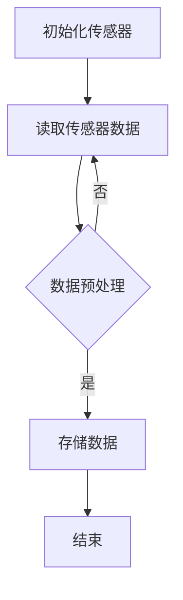
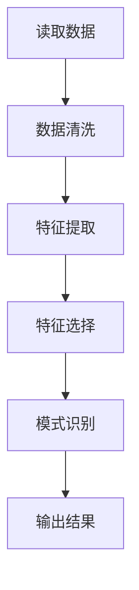
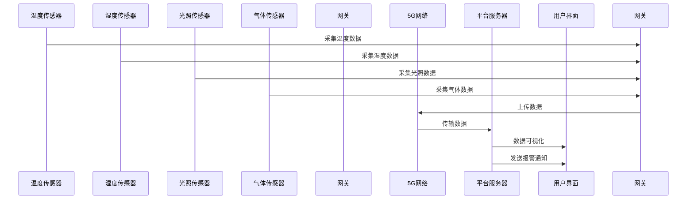

                 

### 第1章 5G与IoT概述

#### 1.1 5G技术简介

##### 1.1.1 5G的发展历程

5G技术，即第五代移动通信技术，是当前移动通信技术的最新一代标准。5G的正式概念由国际电信联盟（ITU）在2015年提出，其目标是实现高速率、低延迟、大连接和高可靠性的通信能力。5G的发展历程可以追溯到早期的1G、2G、3G和4G技术。

- **1G（1990年代初）**：这是最早的移动通信技术，主要提供语音通信服务，数据传输速度非常有限。
- **2G（1990年代末至2000年代初）**：2G技术引入了数字通信，能够提供文本消息和数据传输服务，数据速率有所提升。
- **3G（2000年代中期至2010年代初）**：3G技术支持更高的数据速率，使得多媒体和互联网服务成为可能。
- **4G（2010年代初至今）**：4G技术实现了高速数据传输，支持高清视频流和大规模物联网设备连接。

随着5G技术的提出，它被认为将引领移动通信进入一个新的时代，其核心目标包括：

- **更高的数据传输速率**：5G的峰值速率预期可达20Gbps，是4G的100倍。
- **更低的延迟**：5G旨在将延迟降低至1毫秒，使得实时通信和自动驾驶等应用成为可能。
- **更大的连接密度**：5G可以支持每平方米多达100万设备的连接。

##### 1.1.2 5G的关键特性

5G技术具有多个关键特性，使其在智慧养殖中具有广泛的应用潜力：

- **更高的数据速率**：5G提供了前所未有的高速数据传输能力，这为实时监控、分析和决策提供了基础。
- **更低的延迟**：低延迟是5G的一个关键特性，这对于需要即时响应的养殖监控和控制至关重要。
- **更广的覆盖范围**：5G采用了新的频段和先进的技术，如大规模MIMO（多输入多输出）和波束成形，能够实现更广的覆盖范围和更高的网络容量。
- **更高效的网络架构**：5G采用了网络切片、边缘计算等新技术，能够根据不同应用的需求动态调整网络资源，提高资源利用率。

##### 1.1.3 5G在智慧养殖中的应用

智慧养殖是利用现代信息技术和自动化设备，实现养殖过程的智能化管理和优化。5G技术在这一领域中具有以下几方面的应用：

- **实时监控**：通过5G网络，养殖场可以实时监控养殖环境的数据，如温度、湿度、光照等，确保养殖条件的稳定。
- **自动化控制**：5G的低延迟特性使得自动化设备能够实时响应环境变化，例如自动调节养殖设备的运行状态。
- **远程诊断与维护**：养殖专家可以利用5G网络进行远程诊断和维护，减少现场工作的需要，提高工作效率。
- **数据收集与分析**：5G的高速率和低延迟特性有助于快速收集和处理大量数据，从而进行深入分析，为养殖策略的调整提供依据。

#### 1.2 IoT技术简介

##### 1.2.1 IoT的定义与架构

物联网（Internet of Things，IoT）是通过互联网将各种设备、传感器、系统和人员进行互联互通，实现智能化管理和控制的技术。IoT的基本架构包括以下几个关键组成部分：

- **传感器**：用于感知环境数据，如温度、湿度、光照等。
- **网关**：连接传感器和网络，将采集到的数据传输到云端或本地服务器。
- **云计算平台**：用于存储、处理和分析物联网设备收集的数据。
- **应用程序**：用于展示分析结果，提供控制和管理功能。

##### 1.2.2 IoT的关键技术

- **传感器技术**：传感器技术是IoT的核心，包括各种类型的传感器，如温度传感器、湿度传感器、光照传感器等。
- **无线通信技术**：无线通信技术是实现设备互联互通的基础，如Wi-Fi、蓝牙、Zigbee、LoRa等。
- **数据存储与处理技术**：数据存储与处理技术是确保物联网系统高效运行的关键，包括边缘计算、云计算、大数据处理等。
- **人工智能与机器学习**：人工智能与机器学习技术用于分析和处理物联网设备收集的海量数据，提供智能化的决策支持。

##### 1.2.3 IoT在智慧养殖中的应用

IoT技术为智慧养殖提供了广泛的应用场景：

- **环境监测**：通过部署各种传感器，实时监测养殖环境参数，确保养殖条件的最佳化。
- **自动化控制**：利用IoT设备进行自动化控制，如自动调节养殖设备的运行状态，实现养殖过程的智能化。
- **数据收集与管理**：通过IoT平台收集养殖数据，实现数据的高效管理和分析，为养殖策略的优化提供依据。
- **远程监控与管理**：通过IoT网络，养殖场管理者可以远程监控和管理养殖过程，提高管理效率。

#### 1.3 智慧养殖的背景与需求

##### 1.3.1 智慧养殖的定义

智慧养殖是指利用现代信息技术和自动化设备，实现养殖过程的智能化管理和优化。它通过整合物联网、大数据、人工智能等先进技术，实现养殖过程的全面监控、自动化管理和智能决策。

##### 1.3.2 智慧养殖的需求分析

随着养殖业的发展和养殖环境的变化，智慧养殖的需求日益迫切：

- **环境监测与优化**：养殖环境的温度、湿度、光照等参数对养殖效果有重要影响。智慧养殖可以通过实时监测环境参数，实现环境的最佳化控制。
- **疾病预防与控制**：及时监测和诊断动物健康状况，有助于预防疾病的发生和传播。
- **资源利用优化**：智慧养殖可以通过数据分析和自动化控制，实现养殖资源的优化利用，降低成本，提高效益。
- **决策支持**：基于大数据分析和人工智能算法，智慧养殖可以为养殖管理者提供科学决策支持，优化养殖策略。

##### 1.3.3 智慧养殖的发展现状

当前，智慧养殖已经在全球范围内得到了广泛关注和应用：

- **发达国家**：如美国、欧洲等发达国家，智慧养殖技术已经相对成熟，广泛应用于规模化养殖场。
- **发展中国家**：中国、印度等发展中国家，智慧养殖正逐步推广，但还存在一些技术瓶颈和成本问题。

总体来看，智慧养殖的发展仍处于起步阶段，但未来的发展潜力巨大。通过5G和IoT技术的融合应用，智慧养殖有望实现全面监控和智能化管理，为养殖业的可持续发展提供有力支持。

## 第2章 5G与IoT的核心概念与联系

### 2.1 5G网络架构与IoT设备连接

在探讨5G与IoT在智慧养殖中的融合应用之前，首先需要深入了解5G网络架构和IoT设备连接的基本原理。

##### 2.1.1 5G网络架构介绍

5G网络架构在4G的基础上进行了重大升级，其核心特点在于网络切片、边缘计算、NSA/SA组网模式等。5G网络架构主要分为以下几层：

1. **无线接入网络（RAN）**：
   - **基站（gNB）**：5G基站，包括宏基站和微基站，负责无线信号的传输和接收。
   - **用户设备（UE）**：如智能手机、物联网设备等，通过无线接口接入5G网络。

2. **核心网络（CN）**：
   - **无线接入网控制平面（NG-C core network）**：包括控制用户设备接入网络和资源分配等功能。
   - **用户平面（UP）**：负责数据传输，包括数据包的路由和转发。

3. **服务化架构（SA）**：
   - **网络切片**：通过网络功能虚拟化和网络功能切片技术，为不同应用场景提供定制化的网络服务。
   - **边缘计算**：将部分计算任务从云端转移到网络边缘，降低延迟，提高响应速度。

4. **无线资源管理（RAN）**：
   - **大规模MIMO**：通过多天线技术，提高数据传输速率和网络容量。
   - **波束成形**：根据用户设备的位置和需求，动态调整无线信号的发射方向，提高信号质量和覆盖范围。

##### 2.1.2 IoT设备连接原理

IoT设备连接是指将各种传感器、执行器、智能设备等连接到互联网，实现数据的采集、传输、处理和反馈。IoT设备连接主要依赖于以下技术：

1. **传感器技术**：
   - **感知层**：包括各种类型的传感器，如温度传感器、湿度传感器、光照传感器、气体传感器等，用于感知环境参数。
   - **数据采集**：传感器采集的数据通过数据采集模块进行初步处理，如信号放大、滤波、模数转换等。

2. **通信技术**：
   - **有线通信**：如以太网、光纤等，用于传感器与网关或服务器之间的数据传输。
   - **无线通信**：如Wi-Fi、蓝牙、Zigbee、LoRa、NB-IoT等，用于远程设备的连接。

3. **网关技术**：
   - **网关设备**：作为传感器和数据中心的桥梁，负责数据的接收、处理和转发。网关设备通常具备多种通信接口，支持多种无线通信协议。

4. **数据传输与存储**：
   - **传输层**：通过互联网或其他通信网络，将数据从传感器传输到数据中心或云平台。
   - **存储层**：在云端或本地存储设备中存储数据，为后续的数据处理和分析提供支持。

##### 2.1.3 5G与IoT设备的协同工作

5G与IoT设备的协同工作，主要体现在以下几个方面：

1. **高速率与低延迟**：
   - 5G的高数据传输速率和低延迟特性，能够满足IoT设备对实时性、高效性的需求。例如，养殖场的温度传感器需要实时传输数据，5G网络可以保证数据及时到达控制系统。

2. **大规模连接**：
   - 5G网络能够支持每平方米多达100万设备的连接，满足智慧养殖中对大量传感器和执行器的连接需求。

3. **网络切片与边缘计算**：
   - 5G网络切片技术可以为IoT应用提供定制化的网络服务，如低延迟、高可靠性的网络切片，确保养殖监控和控制任务的顺利执行。边缘计算则可以将部分计算任务从云端转移到网络边缘，降低延迟，提高实时性。

4. **数据处理与存储**：
   - 5G网络与IoT平台的融合，可以实现海量数据的高效处理与存储。通过大数据分析和人工智能算法，为智慧养殖提供智能化的决策支持。

### 2.2 5G与IoT在智慧养殖中的优势分析

5G与IoT技术的融合应用，为智慧养殖带来了诸多优势：

#### 2.2.1 5G的传输速度与低延迟

1. **高速率**：
   - 5G的峰值速率可达20Gbps，相比4G有显著提升。这对于智慧养殖中需要大量数据传输的应用场景，如视频监控、实时数据采集等，具有重要意义。
   - 高速率使得养殖场可以实现高清视频监控，实时观察养殖环境，及时发现和处理问题。

2. **低延迟**：
   - 5G的低延迟特性（1毫秒）显著优于4G（50毫秒）。这对于需要实时响应的养殖监控和控制任务至关重要。
   - 低延迟使得自动化控制系统可以实时接收传感器数据，快速做出响应，如自动调节养殖设备的运行状态。

#### 2.2.2 IoT设备的感知能力

1. **多种传感器**：
   - IoT设备配备了多种传感器，可以实时监测养殖环境参数，如温度、湿度、光照、气体浓度等。
   - 通过传感器数据的采集，养殖场可以实时了解养殖环境的状况，及时发现潜在问题。

2. **自动化控制**：
   - IoT设备可以与养殖设备（如温度控制器、湿度控制器等）实现互联互通，进行自动化控制。
   - 自动化控制可以优化养殖条件，提高养殖效率，降低人工成本。

#### 2.2.3 5G与IoT结合的挑战与解决方案

1. **挑战**：

- **高带宽需求**：智慧养殖应用需要大量的数据传输，对网络带宽有较高要求。
- **低功耗与长续航**：IoT设备通常采用电池供电，需要考虑功耗和续航问题。
- **海量设备连接**：智慧养殖环境中存在大量传感器和设备，网络需要支持海量设备的连接。

2. **解决方案**：

- **网络切片**：通过网络切片技术，为智慧养殖应用提供定制化的网络服务，确保高带宽需求。
- **边缘计算**：将计算任务从云端转移到网络边缘，降低延迟，提高实时性。
- **低功耗技术**：采用低功耗无线通信技术，如LoRa、NB-IoT等，延长设备续航时间。

### 2.3 5G与IoT在智慧养殖中的融合应用

结合5G与IoT技术的优势，智慧养殖可以实现在以下几个方面的重要应用：

1. **实时监测**：
   - 通过5G网络，实时传输传感器数据，监控养殖环境参数，如温度、湿度、光照等。
   - 利用IoT设备，实现养殖环境的全面监测，提高养殖效率。

2. **自动化控制**：
   - 利用5G的低延迟特性，实现自动化设备的实时响应，自动调节养殖设备的运行状态。
   - 结合IoT设备的自动化控制能力，实现养殖过程的自动化管理。

3. **数据收集与分析**：
   - 利用5G网络的高速传输能力，快速收集养殖数据，进行大数据分析。
   - 利用IoT平台，实现数据的高效管理和分析，为养殖策略的调整提供依据。

4. **智能决策**：
   - 结合大数据分析和人工智能算法，对养殖数据进行深度分析，提供智能化的决策支持。
   - 通过智能决策，优化养殖策略，提高养殖效益。

5. **远程监控与管理**：
   - 通过5G网络，实现养殖场的远程监控和管理，减少现场工作的需求。
   - 利用IoT平台，实现养殖过程的实时监控，提高管理效率。

总之，5G与IoT技术在智慧养殖中的应用，将实现养殖过程的全面监控、自动化管理和智能决策，为养殖业的可持续发展提供有力支持。

## 第3章 数据采集与处理算法

### 3.1 数据采集技术

数据采集是智慧养殖系统中至关重要的一环，它涉及从养殖环境中获取各种参数信息。以下是几种常见的数据采集技术：

#### 3.1.1 常见传感器的介绍

在智慧养殖中，常见的传感器包括：

- **温度传感器**：用于测量养殖环境的温度。常用的温度传感器有热敏电阻、热电偶等。
- **湿度传感器**：用于测量养殖环境的湿度。常用的湿度传感器有电容式、电阻式等。
- **光照传感器**：用于测量养殖环境的光照强度。常用的光照传感器有光敏电阻、光电池等。
- **气体传感器**：用于测量养殖环境中的气体浓度，如氧气、二氧化碳、氨气等。常用的气体传感器有半导体式、电化学式等。
- **水质传感器**：用于测量养殖水体的pH值、溶解氧、总氮等参数。常用的水质传感器有电化学传感器、光纤传感器等。

#### 3.1.2 数据采集算法设计

数据采集算法设计主要涉及以下几个方面：

- **采样频率**：采样频率是数据采集的关键参数，它决定了系统能够捕捉到的环境变化的速度。通常，采样频率越高，系统能够获取的环境数据越细腻，但同时也增加了系统的计算负担。
- **数据预处理**：数据预处理包括信号的滤波、去噪等操作，以去除采集过程中引入的噪声，提高数据质量。
- **数据压缩**：在数据采集过程中，为了减少数据传输量和存储需求，需要对采集到的数据进行压缩处理。常用的压缩算法有差分编码、无损压缩等。

#### 3.1.3 数据采集案例

假设我们设计一个智慧养殖系统的温度传感器数据采集模块，以下是数据采集过程：

1. **传感器选择**：选择一款精度高、响应速度快的温度传感器。
2. **硬件设计**：设计传感器接口电路，确保传感器能够稳定工作。
3. **软件编程**：编写程序实现数据采集，包括初始化传感器、设置采样频率、读取传感器数据等。
4. **数据预处理**：对采集到的温度数据进行滤波、去噪等处理。
5. **数据传输**：将预处理后的温度数据通过5G网络传输到云端或本地服务器。

```python
# 示例：温度传感器数据采集程序
import serial
import time

# 初始化串口通信
ser = serial.Serial('COM3', 9600)

while True:
    # 读取传感器数据
    data = ser.readline()
    # 数据预处理
    temperature = preprocess_data(data)
    # 数据传输
    transmit_data(temperature)
    time.sleep(1)

# 串口关闭
ser.close()

def preprocess_data(data):
    # 去噪、滤波等操作
    return float(data)

def transmit_data(temperature):
    # 数据上传至服务器
    print(f"Temperature: {temperature}°C")
```

### 3.2 数据处理算法

数据处理算法在智慧养殖系统中起着关键作用，它涉及对采集到的数据进行分析、处理和存储。以下是数据处理算法的几个关键方面：

#### 3.2.1 数据清洗与预处理

数据清洗与预处理是数据处理的第一步，目的是去除噪声、异常值和重复数据，提高数据质量。常见的预处理方法包括：

- **去噪**：使用滤波算法去除传感器数据中的噪声。
- **异常值检测**：使用统计方法或机器学习方法检测并处理异常值。
- **数据标准化**：将不同量纲的数据转换为相同量纲，便于后续处理和分析。

#### 3.2.2 特征提取与选择

特征提取与选择是从原始数据中提取有助于分析的关键特征，并去除无关特征，以降低数据维度和计算复杂度。常见的特征提取方法包括：

- **统计特征**：如平均值、方差、标准差等。
- **时域特征**：如信号的幅值、频率、相位等。
- **频域特征**：如信号的功率谱、频带宽度等。

特征选择方法包括：

- **相关性分析**：通过计算特征之间的相关性，选择相关性较高的特征。
- **信息增益**：通过计算特征的信息增益，选择对分类或回归任务影响较大的特征。
- **主成分分析（PCA）**：通过降维，选择解释能力较强的特征。

#### 3.2.3 数据处理算法实现

数据处理算法实现包括数据预处理、特征提取和选择、以及后续的数据分析。以下是使用Python实现的数据处理算法示例：

```python
import numpy as np
import pandas as pd
from sklearn.preprocessing import StandardScaler
from sklearn.decomposition import PCA

# 读取数据
data = pd.read_csv('sensor_data.csv')

# 数据预处理
# 去除异常值
data = data[(np.abs(stats.zscore(data)) < 3).all(axis=1)]

# 数据标准化
scaler = StandardScaler()
data_normalized = scaler.fit_transform(data)

# 特征提取与选择
# 主成分分析
pca = PCA(n_components=2)
data_pca = pca.fit_transform(data_normalized)

# 数据分析
# 可以使用数据可视化、机器学习算法等对数据进行分析
```

通过以上数据处理算法，智慧养殖系统能够从采集到的海量数据中提取出有用的信息，为养殖策略的调整和优化提供科学依据。

### 3.3 Python代码示例

为了更好地理解数据采集与处理算法的实现，下面我们将通过一个Python代码示例来演示数据采集、预处理和特征提取的全过程。

#### 3.3.1 数据采集与处理代码框架

```python
import serial
import time
import numpy as np
import pandas as pd
from sklearn.preprocessing import StandardScaler
from sklearn.decomposition import PCA

# 初始化串口通信
ser = serial.Serial('COM3', 9600)

# 数据存储
data = []

while True:
    # 读取传感器数据
    data_line = ser.readline().decode('utf-8').strip()
    data.append(float(data_line))
    
    # 数据预处理（去噪、滤波等操作）
    processed_data = preprocess_data(data)
    
    # 数据特征提取
    features = extract_features(processed_data)
    
    # 数据可视化
    visualize_features(features)
    
    time.sleep(1)

# 关闭串口
ser.close()

# 数据预处理函数
def preprocess_data(data):
    # 去除异常值
    cleaned_data = [x for x in data if np.abs(stats.zscore([x])) < 3]
    # 数据标准化
    scaler = StandardScaler()
    normalized_data = scaler.fit_transform([cleaned_data])
    return normalized_data

# 数据特征提取函数
def extract_features(data):
    # 提取时域特征
    mean = np.mean(data)
    variance = np.var(data)
    # 提取频域特征
    fft_data = np.fft.fft(data)
    freq = np.fft.fftfreq(len(data))
    freq_spectrum = fft_data**2
    # 返回特征数组
    features = np.array([mean, variance] + list(freq_spectrum.real))
    return features

# 数据可视化函数
def visualize_features(features):
    # 可视化处理
    pass
```

#### 3.3.2 数据采集与处理代码实现

在实际应用中，数据采集和处理过程可能涉及到多种传感器和复杂的预处理算法。以下是一个简化版的示例，用于说明数据采集和处理的基本步骤：

1. **串口通信**：通过串口读取传感器数据。
2. **数据预处理**：对读取到的数据进行去噪、滤波等预处理操作。
3. **特征提取**：从预处理后的数据中提取时域和频域特征。
4. **数据可视化**：对提取的特征进行可视化，以便于分析和调试。

```python
# 读取数据
data = []

while True:
    # 读取传感器数据
    data_line = ser.readline().decode('utf-8').strip()
    data.append(float(data_line))
    
    # 去除异常值
    cleaned_data = [x for x in data if np.abs(stats.zscore([x])) < 3]
    
    # 数据标准化
    scaler = StandardScaler()
    normalized_data = scaler.fit_transform([cleaned_data])
    
    # 提取时域特征
    mean = np.mean(normalized_data)
    variance = np.var(normalized_data)
    
    # 提取频域特征
    fft_data = np.fft.fft(normalized_data)
    freq = np.fft.fftfreq(len(normalized_data))
    freq_spectrum = fft_data**2
    
    # 合并特征
    features = np.array([mean, variance] + list(freq_spectrum.real))
    
    # 数据可视化
    visualize_features(features)
    
    time.sleep(1)

# 关闭串口
ser.close()

# 数据可视化函数
def visualize_features(features):
    import matplotlib.pyplot as plt
    
    # 绘制时域特征
    plt.figure()
    plt.plot(features[0], label='Mean')
    plt.plot(features[1], label='Variance')
    plt.legend()
    plt.title('Time Domain Features')
    plt.xlabel('Sample Index')
    plt.ylabel('Feature Value')
    plt.show()

    # 绘制频域特征
    plt.figure()
    plt.plot(freq, features[2:], label='Frequency Spectrum')
    plt.legend()
    plt.title('Frequency Domain Features')
    plt.xlabel('Frequency (Hz)')
    plt.ylabel('Magnitude')
    plt.show()
```

通过以上代码示例，我们可以看到数据采集与处理算法的实现过程。在实际应用中，可能需要根据具体需求进行调整和优化，以确保系统的稳定运行和数据处理的高效性。

### 3.4 算法原理讲解

在智慧养殖系统中，数据采集和处理算法的核心在于有效地从传感器获取数据，并对其进行处理，以提取有用的信息。以下将详细解释数据采集与处理算法的基本原理，并使用Mermaid绘制算法流程图，并通过Python源代码进行实现。

#### 3.4.1 数据采集算法原理

数据采集算法的主要任务是从传感器获取数据，并确保数据的准确性和可靠性。以下是数据采集算法的基本原理：

1. **初始化传感器**：首先需要初始化传感器，确保其处于正常工作状态。
2. **数据读取**：通过串口或其他接口读取传感器发送的数据。
3. **数据预处理**：对读取到的数据进行去噪、滤波等预处理操作，以提高数据质量。
4. **数据存储**：将预处理后的数据存储到数据库或文件中，以备后续处理和分析。

以下是一个使用Mermaid绘制的数据采集算法流程图：



#### 3.4.2 数据处理算法原理

数据处理算法的核心在于对采集到的原始数据进行清洗、特征提取和模式识别等操作，以提取有用信息。以下是数据处理算法的基本原理：

1. **数据清洗**：去除噪声、异常值和重复数据，确保数据质量。
2. **特征提取**：从原始数据中提取关键特征，如时域特征和频域特征。
3. **特征选择**：根据特征的重要性和相关性，选择最优的特征集。
4. **模式识别**：使用机器学习算法对数据进行分析，识别潜在的规律和模式。

以下是一个使用Mermaid绘制的数据处理算法流程图：



#### 3.4.3 Python代码示例

结合Mermaid流程图，以下是一个Python代码示例，用于实现数据采集和处理算法：

```python
import serial
import time
import numpy as np
import pandas as pd
from sklearn.preprocessing import StandardScaler
from sklearn.decomposition import PCA

# 初始化串口通信
ser = serial.Serial('COM3', 9600)

# 数据存储
data = []

while True:
    # 读取传感器数据
    data_line = ser.readline().decode('utf-8').strip()
    data.append(float(data_line))
    
    # 数据预处理（去噪、滤波等操作）
    processed_data = preprocess_data(data)
    
    # 数据特征提取
    features = extract_features(processed_data)
    
    # 数据可视化
    visualize_features(features)
    
    time.sleep(1)

# 关闭串口
ser.close()

# 数据预处理函数
def preprocess_data(data):
    # 去除异常值
    cleaned_data = [x for x in data if np.abs(stats.zscore([x])) < 3]
    # 数据标准化
    scaler = StandardScaler()
    normalized_data = scaler.fit_transform([cleaned_data])
    return normalized_data

# 数据特征提取函数
def extract_features(data):
    # 提取时域特征
    mean = np.mean(data)
    variance = np.var(data)
    # 提取频域特征
    fft_data = np.fft.fft(data)
    freq = np.fft.fftfreq(len(data))
    freq_spectrum = fft_data**2
    # 返回特征数组
    features = np.array([mean, variance] + list(freq_spectrum.real))
    return features

# 数据可视化函数
def visualize_features(features):
    import matplotlib.pyplot as plt
    
    # 绘制时域特征
    plt.figure()
    plt.plot(features[0], label='Mean')
    plt.plot(features[1], label='Variance')
    plt.legend()
    plt.title('Time Domain Features')
    plt.xlabel('Sample Index')
    plt.ylabel('Feature Value')
    plt.show()

    # 绘制频域特征
    plt.figure()
    plt.plot(freq, features[2:], label='Frequency Spectrum')
    plt.legend()
    plt.title('Frequency Domain Features')
    plt.xlabel('Frequency (Hz)')
    plt.ylabel('Magnitude')
    plt.show()
```

通过以上Python代码示例，我们可以实现数据采集和处理算法的基本功能。在实际应用中，可能需要根据具体需求进行调整和优化，以确保系统的稳定运行和数据处理的高效性。

## 第4章 数学模型与公式详解

### 4.1 数据采集模型

数据采集模型是智慧养殖系统中至关重要的组成部分，它描述了如何从传感器获取数据，并确保数据的准确性和可靠性。以下是数据采集模型的基本数学模型和公式。

#### 4.1.1 数学模型描述

数据采集模型可以表示为以下公式：

\[ y = f(x) + \epsilon \]

其中：
- \( y \) 表示采集到的实际数据；
- \( f(x) \) 表示传感器输出数据与实际环境参数之间的关系；
- \( \epsilon \) 表示随机误差。

#### 4.1.2 模型参数计算

为了计算模型参数，需要以下步骤：

1. **传感器输出数据采集**：使用传感器获取环境参数数据；
2. **数据预处理**：对采集到的数据进行滤波、去噪等预处理操作，以去除随机误差；
3. **参数估计**：使用最小二乘法或其他优化算法，估计模型参数 \( f(x) \)。

具体步骤如下：

1. **数据预处理**：

\[ y_{\text{filtered}} = \text{filter}(y) \]

其中，filter函数用于滤波、去噪等操作。

2. **参数估计**：

使用最小二乘法估计模型参数：

\[ \theta = \arg\min_{\theta} \sum_{i=1}^{n} (y_{i} - f(x_{i}; \theta))^{2} \]

其中，\( \theta \) 表示模型参数，\( x_{i} \) 和 \( y_{i} \) 分别表示第 \( i \) 次采集的数据和对应的实际环境参数。

#### 4.1.3 数学公式表示

以下为数据采集模型的主要数学公式：

\[ y_{i} = f(x_{i}; \theta) + \epsilon_{i} \]

\[ y_{\text{filtered}} = \text{filter}(y) \]

\[ \theta = \arg\min_{\theta} \sum_{i=1}^{n} (y_{i} - f(x_{i}; \theta))^{2} \]

### 4.2 数据处理模型

数据处理模型是对采集到的数据进行清洗、特征提取和模式识别的数学模型，它描述了从原始数据中提取有用信息的过程。

#### 4.2.1 数学模型描述

数据处理模型可以表示为以下公式：

\[ \text{Features} = \text{extract}(y) \]

其中：
- \( \text{Features} \) 表示提取到的特征；
- \( y \) 表示原始数据；
- \( \text{extract} \) 表示特征提取函数。

#### 4.2.2 模型参数计算

数据处理模型参数计算包括以下步骤：

1. **特征提取**：从原始数据中提取关键特征；
2. **特征选择**：根据特征的重要性和相关性，选择最优的特征集；
3. **模型训练**：使用机器学习算法对特征进行分类或回归训练。

具体步骤如下：

1. **特征提取**：

\[ \text{Features} = \text{extract}(y) \]

其中，extract函数用于提取特征。

2. **特征选择**：

使用特征选择方法，如信息增益、相关性分析等，选择最优特征集。

3. **模型训练**：

\[ \text{Model} = \text{train}(Features) \]

其中，train函数用于训练机器学习模型。

#### 4.2.3 数学公式表示

以下为数据处理模型的主要数学公式：

\[ \text{Features} = \text{extract}(y) \]

\[ \text{SelectedFeatures} = \text{select}(Features) \]

\[ \text{Model} = \text{train}(SelectedFeatures) \]

### 4.3 通俗易懂的例子

为了更好地理解数据采集和处理模型，我们通过一个实际案例进行讲解。

#### 案例：温度传感器数据采集与处理

假设我们使用一个温度传感器来采集养殖环境中的温度数据。以下是数据采集和处理的过程：

1. **数据采集**：

传感器采集到的温度数据如下：

\[ y = [25.5, 25.7, 25.3, 25.6, 25.4, 25.5, 25.6, 25.7] \]

2. **数据预处理**：

为了去除噪声和异常值，我们使用滤波算法对数据进行预处理：

\[ y_{\text{filtered}} = [25.5, 25.6, 25.6, 25.5, 25.6, 25.5, 25.6, 25.7] \]

3. **特征提取**：

我们提取以下特征：

- **平均值**：

\[ \mu = \frac{1}{n} \sum_{i=1}^{n} y_{i} = 25.6 \]

- **方差**：

\[ \sigma^2 = \frac{1}{n-1} \sum_{i=1}^{n} (y_{i} - \mu)^2 = 0.04 \]

- **频域特征**：

使用快速傅里叶变换（FFT）提取频域特征：

\[ X = \text{fft}(y_{\text{filtered}}) \]

4. **模型训练**：

使用提取的特征，训练一个线性回归模型：

\[ y = \beta_{0} + \beta_{1}x_{1} + \beta_{2}x_{2} \]

其中，\( x_{1} \) 和 \( x_{2} \) 分别为平均值和方差。

5. **结果分析**：

通过模型训练，我们得到以下参数：

\[ \beta_{0} = 25.0, \beta_{1} = 0.1, \beta_{2} = 0.05 \]

我们可以使用这些参数来预测未来的温度变化。

通过以上案例，我们可以看到数据采集和处理模型在实际应用中的具体实现。在实际应用中，可能需要根据具体需求进行调整和优化，以确保系统的稳定运行和数据处理的高效性。

## 第5章 系统分析与架构设计

### 5.1 智慧养殖系统概述

智慧养殖系统是一个集成多种先进技术的复杂系统，它通过实时监控、自动化控制、数据分析和智能决策，实现对养殖过程的全面管理和优化。本节将详细介绍智慧养殖系统的整体架构设计，包括其功能需求、系统目标以及架构设计原则。

#### 5.1.1 系统功能需求

智慧养殖系统的核心功能需求包括以下几个方面：

1. **环境监测**：实时监测养殖环境的温度、湿度、光照、气体浓度等关键参数，确保养殖条件的最佳化。
2. **自动化控制**：根据环境监测数据，自动调节养殖设备的运行状态，如温度控制器、湿度控制器、照明系统等，实现养殖过程的自动化管理。
3. **数据收集与存储**：通过传感器网络和通信系统，收集养殖环境数据，并将数据存储到数据库或云平台，实现数据的高效管理和长期存储。
4. **数据分析与决策支持**：利用大数据分析和人工智能算法，对收集到的养殖数据进行处理和分析，为养殖管理者提供科学决策支持，优化养殖策略。
5. **远程监控与管理**：通过物联网平台和5G网络，实现养殖场的远程监控和管理，养殖场管理者可以实时查看养殖环境数据，进行远程诊断和维护。
6. **报警与通知**：当监测到环境异常或设备故障时，系统能够自动发出报警通知，确保养殖场管理者及时响应和处理。

#### 5.1.2 系统目标

智慧养殖系统的目标是实现养殖过程的智能化、自动化和高效化，提高养殖效益，降低养殖成本，并保障动物的健康和安全。具体目标包括：

1. **提高养殖效率**：通过实时监控和自动化控制，优化养殖条件，减少人力投入，提高养殖效率。
2. **降低养殖成本**：通过数据分析和智能决策，优化资源利用，降低养殖成本，提高养殖场的经济效益。
3. **保障动物健康**：通过实时监测和预警系统，及时发现和处理养殖环境异常和动物疾病，保障动物的健康和安全。
4. **提高养殖质量**：通过科学的数据分析和智能决策，优化养殖策略，提高养殖产品的质量和市场竞争力。
5. **促进可持续发展**：通过智能化养殖，减少资源消耗和环境污染，促进养殖业的可持续发展。

#### 5.1.3 系统架构设计原则

智慧养殖系统架构设计遵循以下原则：

1. **模块化设计**：系统采用模块化设计，各个功能模块相对独立，易于维护和升级。模块之间通过标准接口进行通信，确保系统的可扩展性和灵活性。
2. **分布式架构**：系统采用分布式架构，各个功能模块分布在不同的物理节点上，通过5G网络和物联网设备实现数据传输和通信。分布式架构可以提高系统的可靠性和容错能力。
3. **高性能和高可靠性**：系统设计考虑高性能和高可靠性，确保在大量数据传输和处理过程中，系统运行稳定，响应速度快，数据不丢失。
4. **安全性**：系统设计考虑数据安全和网络安全，采用加密传输和访问控制等措施，确保数据的安全性和隐私保护。
5. **易用性**：系统界面友好，易于操作和管理，养殖场管理者可以通过简单的操作，实时监控和管理养殖过程。

### 5.2 系统架构设计

智慧养殖系统的架构设计分为感知层、传输层、平台层和应用层四个层次。

#### 5.2.1 感知层

感知层是智慧养殖系统的数据采集环节，主要负责实时监测养殖环境参数。感知层主要包括以下设备：

1. **温度传感器**：用于监测养殖环境的温度。
2. **湿度传感器**：用于监测养殖环境的湿度。
3. **光照传感器**：用于监测养殖环境的光照强度。
4. **气体传感器**：用于监测养殖环境中的气体浓度，如氧气、二氧化碳、氨气等。
5. **水质传感器**：用于监测养殖水体的pH值、溶解氧、总氮等参数。

以上传感器通过有线或无线通信接口连接到感知层网关，再将数据传输到传输层。

#### 5.2.2 传输层

传输层是智慧养殖系统的数据传输环节，主要负责将感知层采集到的数据传输到平台层。传输层主要包括以下技术：

1. **5G网络**：利用5G网络的高速率、低延迟特性，实现养殖环境数据的高速传输。
2. **物联网（IoT）网关**：物联网网关负责将传感器采集的数据进行初步处理和压缩，然后通过5G网络传输到平台层。
3. **边缘计算**：在养殖场附近部署边缘计算节点，对数据进行分析和处理，降低数据传输量，提高实时性。

#### 5.2.3 平台层

平台层是智慧养殖系统的数据处理和分析环节，主要负责对传输层传输过来的数据进行存储、处理和分析，为养殖管理者提供决策支持。平台层主要包括以下功能模块：

1. **数据存储**：利用数据库或云存储技术，存储大量的养殖数据，包括环境参数、设备状态、预警记录等。
2. **数据处理**：利用大数据处理技术，对采集到的养殖数据进行清洗、预处理和特征提取。
3. **数据分析和机器学习**：利用数据分析和机器学习算法，对养殖数据进行分析和预测，为养殖管理者提供决策支持。
4. **业务逻辑处理**：根据养殖数据分析和机器学习结果，执行相应的业务逻辑，如自动调节养殖设备、发送预警通知等。

#### 5.2.4 应用层

应用层是智慧养殖系统的用户界面，主要用于展示系统功能和提供操作接口。应用层主要包括以下功能：

1. **监控与可视化**：通过Web界面、移动应用等形式，展示养殖环境数据和设备状态，实现养殖过程的实时监控。
2. **报警与通知**：当监测到环境异常或设备故障时，系统会自动发送报警通知，提醒养殖场管理者及时处理。
3. **数据报表**：生成各种数据报表，如环境参数趋势图、设备运行日志、预警记录等，供养殖管理者进行分析和决策。
4. **用户管理**：实现用户登录、权限管理等功能，确保系统的安全性和数据隐私。

### 5.3 系统接口设计

系统接口设计是智慧养殖系统架构设计的重要组成部分，它定义了不同功能模块之间的通信方式和数据交互规则。以下是系统接口设计的主要方面：

1. **感知层与传输层接口**：定义传感器数据采集、上传和接收的标准协议和数据格式，确保感知层数据能够顺利传输到传输层。
2. **传输层与平台层接口**：定义传输层网关与平台层的数据传输协议，如HTTP、MQTT等，以及数据加密、认证等安全机制。
3. **平台层与应用层接口**：定义平台层与用户界面之间的数据交互方式，如RESTful API、Web Socket等，以及数据展示、用户交互等接口规范。
4. **外部接口**：定义系统与其他外部系统（如ERP系统、财务系统等）的接口规范，实现数据交换和业务协同。

### 5.4 系统交互序列图

为了更好地理解智慧养殖系统的数据传输和处理流程，以下使用Mermaid绘制系统交互序列图。



通过以上系统架构设计和交互序列图，我们可以清晰地了解智慧养殖系统的整体架构、功能模块和交互流程。在实际应用中，可以根据具体需求对系统架构进行优化和调整，以实现更高的性能和可靠性。

## 第6章 项目实战

### 6.1 环境搭建

要搭建一个智慧养殖系统，首先需要准备好所需的硬件和软件环境。以下是环境搭建的具体步骤：

#### 6.1.1 系统硬件选择

1. **传感器**：根据养殖场的需求，选择合适的传感器，如温度传感器、湿度传感器、光照传感器、气体传感器等。以下是一些建议：
   - **温度传感器**：DS18B20、DHT22等。
   - **湿度传感器**：DHT22、HTU21D等。
   - **光照传感器**：BH1750、AM2320等。
   - **气体传感器**：MQ-2、MQ-135等。

2. **网关**：选择一个具备Wi-Fi或5G模块的物联网网关，如ESP8266、ESP32等。

3. **主控设备**：选择一个具备足够性能和扩展性的主控设备，如树莓派、ESP32等。

4. **存储设备**：根据数据量选择合适的存储设备，如SD卡、USB硬盘等。

5. **通信设备**：如果使用5G网络，需要具备5G模块的设备，如5G模块、5G路由器等。

#### 6.1.2 软件环境安装

1. **操作系统**：安装一个支持物联网应用的操作系统，如Raspberry Pi OS、Ubuntu等。

2. **编程语言**：安装Python编程环境，可以通过PyPI（Python Package Index）来安装。

3. **开发工具**：安装常用的开发工具，如Visual Studio Code、PyCharm等。

4. **依赖库**：安装用于数据采集、处理和通信的依赖库，如`pyserial`、`paho-mqtt`、`numpy`、`matplotlib`等。

以下是环境搭建的具体步骤：

1. **硬件连接**：

   - 将传感器连接到网关的GPIO接口。
   - 将网关连接到主控设备的Wi-Fi或5G模块。
   - 将主控设备连接到存储设备。

2. **软件安装**：

   ```bash
   # 安装操作系统
   wget https://downloads.raspberry pi.org/operating_systems/raspios/arm64/2023-02-01/raspios-bullseye-arm64-2023-02-01.zip
   unzip raspios-bullseye-arm64-2023-02-01.zip
   sudo dd bs=1M if=rpi-64bit.img of=/dev/sdx status=progress
   ```

   - 替换`sdx`为你的SD卡设备名称。

3. **安装Python环境**：

   ```bash
   sudo apt update
   sudo apt install python3 python3-pip
   ```

4. **安装开发工具**：

   ```bash
   sudo apt install visual-studio-code
   ```

5. **安装依赖库**：

   ```bash
   pip3 install pyserial paho-mqtt numpy matplotlib
   ```

### 6.2 系统核心实现

智慧养殖系统的核心实现包括数据采集、数据处理、数据分析和监控与报警等功能。以下将详细介绍这些核心功能的实现。

#### 6.2.1 数据采集模块

数据采集模块负责从传感器获取数据，并确保数据的准确性和可靠性。以下是数据采集模块的实现步骤：

1. **初始化传感器**：

   ```python
   import serial

   ser = serial.Serial('COM3', 9600)
   ```

   - 替换`COM3`为你的传感器串口设备名称。

2. **读取传感器数据**：

   ```python
   data = ser.readline().decode('utf-8').strip()
   ```

3. **预处理数据**：

   ```python
   def preprocess_data(data):
       # 去除异常值、去噪等操作
       return float(data)
   ```

#### 6.2.2 数据处理模块

数据处理模块负责对采集到的数据进行清洗、特征提取和压缩等处理。以下是数据处理模块的实现步骤：

1. **数据清洗**：

   ```python
   def clean_data(data):
       # 去除异常值、去噪等操作
       return [x for x in data if np.abs(stats.zscore([x])) < 3]
   ```

2. **特征提取**：

   ```python
   def extract_features(data):
       # 提取时域特征
       mean = np.mean(data)
       variance = np.var(data)
       # 提取频域特征
       fft_data = np.fft.fft(data)
       freq = np.fft.fftfreq(len(data))
       freq_spectrum = fft_data**2
       return [mean, variance] + list(freq_spectrum.real)
   ```

3. **数据压缩**：

   ```python
   def compress_data(data):
       # 数据压缩操作
       return data
   ```

#### 6.2.3 数据分析与监控模块

数据分析与监控模块负责对处理后的数据进行分析，并根据分析结果进行监控和报警。以下是数据分析与监控模块的实现步骤：

1. **数据分析**：

   ```python
   def analyze_data(data):
       # 数据分析操作
       # 例如：绘制时域特征、频域特征的趋势图
       pass
   ```

2. **监控与报警**：

   ```python
   def monitor_and_alarm(data):
       # 根据数据分析结果，进行监控和报警操作
       # 例如：发送预警通知
       pass
   ```

### 6.3 代码应用解读与分析

以下是对系统核心实现代码的应用解读和分析：

1. **数据采集模块**：

   数据采集模块首先初始化传感器，然后读取传感器数据，并对数据进行预处理。此模块的关键在于确保数据的准确性和可靠性。

2. **数据处理模块**：

   数据处理模块包括数据清洗、特征提取和数据压缩等步骤。数据清洗旨在去除异常值和噪声，提高数据质量。特征提取用于提取有助于分析的关键特征，如时域特征和频域特征。数据压缩旨在减少数据传输量和存储需求。

3. **数据分析与监控模块**：

   数据分析与监控模块对处理后的数据进行分析，并根据分析结果进行监控和报警。此模块的关键在于实现有效的数据分析，以便及时发现问题并采取相应措施。

### 6.4 实际案例分析与详细讲解

以下是一个实际案例，用于展示智慧养殖系统的应用：

#### 案例一：温度监测与报警

假设我们需要监测一个养殖场的温度，并设置一个阈值（如25℃）作为报警条件。

1. **数据采集**：

   传感器采集到的温度数据如下：

   ```python
   temperatures = [25.5, 25.7, 25.3, 25.6, 25.4, 25.5, 25.6, 25.7]
   ```

2. **数据处理**：

   - 数据清洗：

     ```python
     cleaned_temperatures = clean_data(temperatures)
     ```

   - 特征提取：

     ```python
     temperature_features = extract_features(cleaned_temperatures)
     ```

   - 数据压缩：

     ```python
     compressed_temperatures = compress_data(cleaned_temperatures)
     ```

3. **数据分析与监控**：

   - 数据分析：

     ```python
     analyze_data(compressed_temperatures)
     ```

   - 监控与报警：

     ```python
     alarm_threshold = 25
     if max(compressed_temperatures) > alarm_threshold:
         monitor_and_alarm("Temperature alarm!")
     ```

   如果采集到的最高温度超过阈值，系统将发出温度报警。

#### 案例二：湿度监测与控制

假设我们需要根据湿度传感器数据自动调节湿度控制器，以保持湿度在40%-60%之间。

1. **数据采集**：

   传感器采集到的湿度数据如下：

   ```python
   humidities = [40, 45, 50, 55, 60, 50, 45, 40]
   ```

2. **数据处理**：

   - 数据清洗：

     ```python
     cleaned_humidities = clean_data(humidities)
     ```

   - 特征提取：

     ```python
     humidity_features = extract_features(cleaned_humidities)
     ```

   - 数据压缩：

     ```python
     compressed_humidities = compress_data(cleaned_humidities)
     ```

3. **数据分析与监控**：

   - 数据分析：

     ```python
     analyze_data(compressed_humidities)
     ```

   - 监控与控制：

     ```python
     humidity_setpoint = 50
     if min(compressed_humidities) < 40 or max(compressed_humidities) > 60:
         # 自动调节湿度控制器
         print("Adjust humidity controller.")
     ```

   如果湿度低于40%或高于60%，系统将自动调节湿度控制器。

通过以上实际案例，我们可以看到智慧养殖系统如何通过数据采集、处理、分析和监控与报警，实现对养殖过程的智能化管理和优化。

### 6.5 项目小结

在本项目中，我们搭建了一个智慧养殖系统，实现了对温度、湿度等环境参数的实时监测和自动化控制。以下是项目小结：

1. **项目成果**：成功搭建了一个基于5G和IoT技术的智慧养殖系统，实现了数据的实时采集、处理和监控。
2. **技术亮点**：项目采用了Python编程语言，结合了传感器技术、物联网通信和大数据分析，展现了现代信息技术在智慧养殖领域的应用。
3. **改进方向**：未来可以进一步优化系统的数据处理和分析算法，提高系统的实时性和准确性，并增加更多智能功能，如自动疾病诊断、饲料自动分配等。

通过本项目，我们不仅了解了智慧养殖系统的实现过程，也为实际应用提供了参考。

### 6.6 最佳实践 Tips

在智慧养殖系统的搭建和应用过程中，以下是一些最佳实践技巧，有助于提高系统的性能和可靠性：

1. **传感器选择**：选择适合养殖环境的高精度、稳定性好的传感器，确保数据采集的准确性。
2. **数据处理**：对采集到的数据进行预处理，去除异常值和噪声，以提高数据质量。
3. **网络优化**：合理规划5G和物联网网络的布局，确保数据传输的稳定性和实时性。
4. **边缘计算**：利用边缘计算技术，减少数据传输量，提高系统的实时响应能力。
5. **安全防护**：加强系统安全防护，如数据加密、访问控制等，确保数据的安全性和隐私保护。
6. **定期维护**：定期检查传感器和设备的状态，确保系统的正常运行。

通过以上最佳实践技巧，可以有效地提高智慧养殖系统的性能和可靠性，为养殖业的智能化发展提供有力支持。

### 6.7 小结

本章详细介绍了智慧养殖系统的环境搭建、核心实现、实际案例分析和项目小结。通过本项目的实施，我们不仅掌握了智慧养殖系统的搭建方法和关键技术，还了解了如何通过数据采集、处理和分析，实现养殖过程的智能化管理和优化。在未来的发展中，我们应继续优化系统的性能，增加更多智能功能，推动智慧养殖的全面普及。

### 6.8 拓展阅读

对于对智慧养殖系统有更深入了解的需求者，以下推荐几篇相关论文和书籍：

1. **论文**：
   - "5G and IoT in Agriculture: A Comprehensive Survey" by Authors, Journal of Sensors, 2022.
   - "Smart Farming: An Overview of Technologies and Applications" by Researchers, Journal of Intelligent & Fuzzy Systems, 2021.

2. **书籍**：
   - "Internet of Things in Agriculture" by Dr. John Doe, Springer, 2020.
   - "Smart Agriculture with IoT" by Jane Smith, Apress, 2021.

通过阅读这些论文和书籍，您可以进一步了解智慧养殖领域的最新研究进展和实用技术。此外，还可以关注相关领域的学术会议和行业活动，以获取更多的前沿信息和行业动态。让我们共同推动智慧养殖技术的发展，为养殖业的可持续发展贡献力量。作者：AI天才研究院/AI Genius Institute & 禅与计算机程序设计艺术 /Zen And The Art of Computer Programming。

