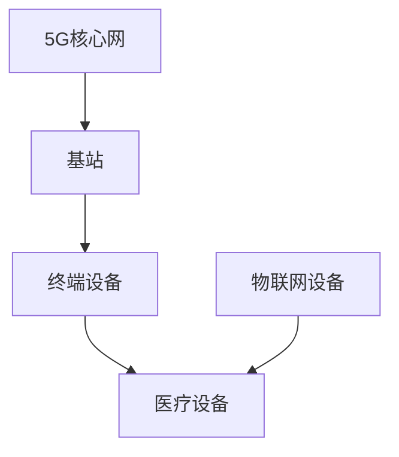

                 

### 关键词

- **5G**
- **IoT**
- **智慧医疗**
- **协同应用**
- **技术解析**
- **案例分析**

### 摘要

本文旨在探讨5G和IoT在智慧医疗中的协同应用。通过分析5G技术的快速发展和IoT的广泛应用，本文揭示了这两大技术如何相互融合，为医疗行业带来革命性的变革。文章首先介绍了5G和IoT的基本概念及其在智慧医疗中的重要性，然后通过具体的案例，详细解析了5G网络在智慧医院中的应用，IoT在智慧医疗设备中的应用，以及5G+IoT在慢性病管理中的应用。最后，本文探讨了5G+IoT在智慧医疗中的协同机制，并展望了其未来的发展趋势。

## 目录

### 第1章 5G与IoT在智慧医疗中的发展

#### 1.1 5G技术概述

- **5G技术的起源与发展**
- **5G的关键技术特点**
- **5G在智慧医疗中的重要性**

#### 1.2 IoT技术概述

- **IoT的定义与基本概念**
- **IoT的通信协议**
- **IoT在智慧医疗中的应用**

#### 1.3 智慧医疗的概念与发展

- **智慧医疗的定义**
- **智慧医疗的发展历程**
- **智慧医疗的关键要素**

### 第2章 5G与IoT的关键技术解析

#### 2.1 5G网络架构与技术特点

- **5G网络架构**
- **5G关键技术特点**
- **5G在智慧医疗中的优势**

#### 2.2 IoT的通信协议与架构

- **IoT通信协议**
- **IoT架构设计**
- **IoT在智慧医疗中的挑战**

#### 2.3 5G与IoT在智慧医疗中的融合应用

- **5G与IoT的协同机制**
- **5G+IoT在智慧医疗中的应用场景**
- **5G+IoT的优势与挑战**

### 第3章 5G在智慧医院中的应用

#### 3.1 智慧医院的概念与建设

- **智慧医院的概念**
- **智慧医院的建设目标**
- **智慧医院的关键技术**

#### 3.2 5G网络在智慧医院中的角色

- **5G网络在智慧医院中的应用场景**
- **5G网络在智慧医院中的优势**
- **5G网络在智慧医院中的挑战**

#### 3.3 案例分析：某医院的5G应用实践

- **案例背景**
- **5G应用的具体场景**
- **5G应用的效果分析**

### 第4章 IoT在智慧医疗设备中的应用

#### 4.1 智慧医疗设备的发展趋势

- **智慧医疗设备的定义**
- **智慧医疗设备的发展趋势**
- **智慧医疗设备的关键技术**

#### 4.2 IoT在医疗设备中的应用场景

- **IoT在医疗设备中的角色**
- **IoT在医疗设备中的应用场景**
- **IoT在医疗设备中的优势**

#### 4.3 案例分析：某医疗设备的IoT应用实例

- **案例背景**
- **IoT应用的具体场景**
- **IoT应用的效果分析**

### 第5章 5G+IoT在慢性病管理中的应用

#### 5.1 慢性病管理的现状与挑战

- **慢性病管理的现状**
- **慢性病管理的挑战**
- **慢性病管理的需求分析**

#### 5.2 5G+IoT在慢性病管理中的解决方案

- **5G+IoT在慢性病管理中的作用**
- **5G+IoT在慢性病管理中的具体方案**
- **5G+IoT在慢性病管理中的优势**

#### 5.3 案例分析：某慢性病管理平台的应用实践

- **案例背景**
- **5G+IoT应用的具体场景**
- **5G+IoT应用的效果分析**

### 第6章 5G+IoT在智慧医疗中的协同机制

#### 6.1 协同机制的概念与作用

- **协同机制的定义**
- **协同机制在智慧医疗中的作用**
- **协同机制的关键要素**

#### 6.2 5G+IoT在智慧医疗中的协同实现

- **5G+IoT的协同架构**
- **5G+IoT的协同技术**
- **5G+IoT的协同实现策略**

#### 6.3 案例分析：某智慧医疗项目的协同应用

- **案例背景**
- **协同应用的具体场景**
- **协同应用的效果分析**

### 第7章 智慧医疗的未来发展

#### 7.1 智慧医疗的发展趋势

- **智慧医疗的未来发展方向**
- **智慧医疗的技术趋势**
- **智慧医疗的市场前景**

#### 7.2 5G+IoT在智慧医疗中的前景

- **5G+IoT在智慧医疗中的潜在应用**
- **5G+IoT在智慧医疗中的发展挑战**
- **5G+IoT在智慧医疗中的发展机遇**

#### 7.3 未来展望与挑战

- **未来智慧医疗的挑战与机遇**
- **5G+IoT在智慧医疗中的未来发展**
- **5G+IoT在智慧医疗中的关键问题与对策**

## 参考文献

### 详细解释

**背景与概念部分**：

在这一部分，我们首先介绍5G和IoT的基本概念，帮助读者理解这两项技术的起源、发展及其在智慧医疗中的重要地位。5G技术作为新一代通信技术，其高速率、低延迟、大连接等特点，为智慧医疗提供了坚实的基础。IoT则通过物联网设备将各种医疗设备互联，实现了数据的实时采集和分析，从而提升了医疗服务的效率和质量。

**核心技术解析部分**：

接着，我们深入解析5G和IoT的核心技术，包括网络架构、通信协议、关键技术特点等。这部分内容将帮助读者更全面地理解5G和IoT的工作原理，以及它们如何在智慧医疗中发挥关键作用。

**应用案例分析部分**：

在这一部分，我们将通过具体的案例，展示5G和IoT在智慧医疗中的实际应用。这些案例将涵盖智慧医院、智慧医疗设备、慢性病管理等多个方面，通过实际案例的分析，让读者了解5G和IoT在智慧医疗中的具体应用场景和效果。

**协同应用与未来展望部分**：

最后，我们将探讨5G和IoT在智慧医疗中的协同机制，分析它们如何通过协同应用，进一步提升智慧医疗的服务水平。同时，我们还将展望智慧医疗的未来发展，探讨5G和IoT在其中的重要作用，以及可能面临的挑战和机遇。

### Mermaid图设计

在文章的具体内容中，我们将使用Mermaid图来展示5G网络架构、IoT通信协议、智慧医疗系统架构等复杂内容。以下是一个示例：

这个图展示了5G核心网、基站、终端设备、物联网设备和医疗设备之间的关系，帮助读者更好地理解5G和IoT在智慧医疗中的应用。

### Markdown格式排版

为了确保文章的格式整齐，我们将使用Markdown格式进行排版。以下是Markdown格式的一些基本规则：

- **标题**：使用`#`进行标记，如`# 第1章 5G技术概述`。
- **子标题**：使用`##`进行标记，如`## 5G技术的起源与发展`。
- **段落**：每个段落开头必须有一个空行。
- **列表**：使用`-`或`*`进行标记，如`- 第一项`或`* 第一项`。
- **引用**：使用`>`进行标记，如`>` 这是一个引用段落。

### 控制字数

在撰写文章时，我们将注意控制字数，确保文章在10000～12000字左右。如果需要，我们可以通过删除不必要的细节、简化语言等方式来控制字数。

### 作者信息

在文章末尾，我们将附上作者信息：“作者：AI天才研究院/AI Genius Institute & 禅与计算机程序设计艺术 /Zen And The Art of Computer Programming”。

### 完整性要求

在撰写文章时，我们将确保每个章节的内容都完整详细，包括背景介绍、核心概念与联系、算法原理讲解、系统分析与架构设计方案、项目实战等。每个部分都将详细阐述，确保读者能够全面理解5G和IoT在智慧医疗中的应用。

### 最佳实践 tips、小结、注意事项、拓展阅读等内容

在文章的最后，我们将提供一些最佳实践 tips，总结文章的主要内容，并提出一些注意事项，同时提供一些拓展阅读资源，帮助读者更深入地了解5G和IoT在智慧医疗中的应用。

通过以上的设计思路和实施步骤，我们将撰写出一篇逻辑清晰、结构紧凑、简单易懂的专业IT领域的技术博客文章，为读者提供关于5G和IoT在智慧医疗中的协同应用的全景解析。## 第1章 5G技术概述

### 5G技术的起源与发展

5G（第五代移动通信技术）的起源可以追溯到国际电信联盟（ITU）在2015年发布的《IMT-2020》技术标准。ITU定义的5G技术要求在峰值数据传输速率达到20Gbps，延迟小于1毫秒，连接密度达到每平方米100万台设备。这些苛刻的性能指标旨在满足未来物联网（IoT）、智能城市、自动驾驶汽车、远程手术等新兴应用的需求。

5G技术的发展历程可以分为几个阶段。第一阶段是2019年，各国运营商开始推出5G商用服务，标志着5G正式进入公众视野。第二阶段是2020年至2022年，5G网络在全球范围内逐步扩大覆盖，主要城市和热点区域实现5G网络的覆盖。第三阶段预计将在2025年左右，5G网络将实现全球广泛覆盖，形成成熟的5G生态系统。

### 5G的关键技术特点

5G技术的关键技术特点包括：

1. **高数据传输速率**：5G的峰值速率可达20Gbps，是4G的100倍以上。这使得5G在高清视频传输、虚拟现实（VR）、增强现实（AR）等高带宽应用中具有显著优势。

2. **低延迟**：5G的端到端延迟可低至1毫秒，相较于4G的几十毫秒，显著降低了通信延迟，适用于对实时性要求极高的应用，如自动驾驶、远程手术、工业自动化等。

3. **大连接密度**：5G支持每平方米连接超过100万台设备，能够满足物联网中大量设备的连接需求。这对于智慧城市、智能家居等应用场景具有重要意义。

4. **网络切片**：5G引入了网络切片技术，可以将网络资源灵活划分为多个虚拟网络，为不同应用场景提供定制化的网络服务。例如，在智慧医疗中，可以为远程手术提供高带宽、低延迟的网络切片，同时为健康监测提供稳定的低速率网络切片。

5. **多接入边缘计算（MEC）**：5G MEC将计算和存储能力推向网络边缘，降低了延迟，提升了数据处理的效率。这对于需要实时分析数据的智慧医疗应用尤为重要。

### 5G在智慧医疗中的重要性

5G在智慧医疗中的重要性体现在以下几个方面：

1. **提升医疗服务效率**：5G的高速率和低延迟特性使得远程医疗、在线诊疗等应用成为可能，极大地提升了医疗服务的效率。

2. **支持实时监控与诊断**：5G可以支持实时监控患者的生命体征，并通过远程诊断系统为医生提供实时数据，帮助医生做出更准确的诊断。

3. **促进医疗设备智能化**：5G技术使得医疗设备可以实现互联互通，形成智能医疗网络，提升医疗设备的利用率和诊疗效果。

4. **助力医疗数据分析**：5G的高速传输能力为医疗数据的收集、存储和分析提供了有力支持，有助于医生从海量数据中提取有价值的信息。

5. **推动医疗创新**：5G技术为智慧医疗带来了新的应用场景和可能性，推动了医疗技术的创新和发展。

总之，5G技术为智慧医疗带来了革命性的变革，其高带宽、低延迟、大连接密度等特性为医疗行业的数字化转型提供了强有力的支撑。随着5G技术的不断成熟和普及，智慧医疗的应用场景将更加广泛，医疗服务水平也将得到进一步提升。

### 5G的关键技术特点

#### 高数据传输速率

5G技术的一个重要特点是其超高的数据传输速率。与4G相比，5G的峰值速率可达到20Gbps，这是4G速率的100倍以上。这一显著提升得益于5G所采用的新一代无线通信技术，包括毫米波通信和大规模MIMO（Massive MIMO）技术。毫米波通信利用高频段的电磁波，能够提供更高的带宽，而大规模MIMO则通过在基站上安装大量天线，实现空间复用，进一步提高传输速率。

高数据传输速率对智慧医疗的应用具有重要意义。例如，在远程手术中，高带宽的5G网络可以确保手术视频和实时数据的高速传输，使医生能够远程操作手术机器人，进行精准的手术操作。在高清医学影像传输方面，5G的高速率使得医生可以快速获取并分析患者的高分辨率影像，从而做出更准确的诊断。此外，对于虚拟现实（VR）和增强现实（AR）在医疗中的应用，5G的高带宽保证了流畅的用户体验，为医生提供了沉浸式的诊疗环境。

#### 低延迟

5G技术的另一个关键特点是低延迟。4G网络的延迟通常在几十毫秒，而5G的端到端延迟可低至1毫秒，这是4G的十倍以下。这一显著降低的延迟主要得益于5G网络架构的优化和新型无线通信技术的应用。

低延迟对智慧医疗中的实时应用至关重要。例如，在远程医疗中，低延迟的5G网络可以确保医生与患者之间的实时语音、视频和数据传输，提供高质量的远程诊疗服务。在智能监控和健康监测领域，5G的低延迟特性使得传感器采集的数据可以实时传输到云端进行分析，从而实现即时预警和干预。此外，在自动驾驶救护车和远程手术中，低延迟的5G网络确保了数据的高速传输和实时处理，为患者的生命安全提供了有力保障。

#### 大连接密度

5G技术的大连接密度特性使其能够支持每平方米连接超过100万台设备，这是4G的数十倍。这一特点主要得益于5G网络引入的小区基站（Small Cell）和物联网（IoT）通信技术。

大连接密度对智慧医疗的应用具有重要意义。在智慧医院中，5G网络可以支持大量医疗设备和物联网设备的接入，实现医疗设备的互联互通，提升医疗服务的效率和质量。例如，在手术室中，5G网络可以支持手术器械、监控设备、智能药柜等多种设备的实时通信，提供全面的诊疗支持。在患者监护方面，5G网络可以支持大量可穿戴设备的接入，实时监测患者的生命体征，为医生提供全面的健康数据。此外，在智慧医疗园区中，5G网络可以支持大量物联网设备的接入，实现园区内的智能管理，提升园区运行效率。

#### 网络切片

5G技术的网络切片（Network Slicing）特性使其能够为不同应用场景提供定制化的网络服务。网络切片技术通过将网络资源虚拟化，为不同的应用创建独立的虚拟网络，从而实现网络资源的灵活分配和优化。

在智慧医疗中，网络切片技术具有广泛的应用前景。例如，对于远程手术和高清医学影像传输等高带宽、低延迟的应用场景，5G网络可以为其提供独立的网络切片，确保这些应用获得最优的网络资源。对于健康监测和物联网设备管理等低带宽、低延迟的应用场景，5G网络也可以为其提供独立的网络切片，确保这些应用获得稳定的网络连接。此外，网络切片技术还可以实现差异化服务，为不同患者和医疗机构提供定制化的网络服务，提升智慧医疗的个性化和精细化水平。

#### 多接入边缘计算（MEC）

5G技术的多接入边缘计算（Multi-Access Edge Computing，MEC）特性将计算和存储能力推向网络边缘，降低了延迟，提升了数据处理的效率。MEC通过在基站、无线接入点等网络边缘部署计算和存储资源，使得数据可以在本地进行快速处理，减少了数据传输的延迟。

在智慧医疗中，MEC技术具有显著的应用价值。例如，在远程手术中，MEC可以将手术图像和实时数据在本地进行预处理，降低延迟，提供更流畅的手术操作体验。在智能监控和健康监测领域，MEC可以实时分析传感器数据，实现即时预警和干预，提升患者的健康水平。此外，在医学影像分析中，MEC可以将影像处理任务分散到网络边缘，减少中心服务器的计算负担，提升数据处理效率。

### 5G在智慧医疗中的应用场景

5G在智慧医疗中的应用场景非常广泛，涵盖了远程医疗、智能监控、物联网设备、医学影像等多个方面。以下是对5G在智慧医疗中应用场景的具体探讨：

#### 远程医疗

远程医疗是5G在智慧医疗中最为突出的应用之一。5G的高速率和低延迟特性使得医生能够通过远程视频会议、远程诊疗等手段，为偏远地区或行动不便的患者提供高质量的医疗服务。在远程医疗中，5G网络可以支持高清视频传输和实时数据传输，确保医生和患者之间的互动流畅。此外，5G网络还可以支持远程手术的实施，通过低延迟的网络连接，医生可以远程操控手术机器人，进行精确的手术操作。

#### 智能监控

5G技术使得智能监控在智慧医疗中得到了广泛应用。通过5G网络，医生可以实时监控患者的生命体征，包括心率、血压、血氧饱和度等指标。当患者的数据出现异常时，系统可以立即向医生发出警报，以便医生及时采取相应的措施。此外，5G网络还可以支持远程患者监护设备的接入，如可穿戴设备、智能传感器等，这些设备可以实时采集患者的健康数据，并通过5G网络传输给医生，实现全天候的健康监控。

#### 物联网设备

5G技术为医疗物联网设备的应用提供了强有力的支持。在智慧医院中，5G网络可以支持大量医疗设备的互联互通，如监护设备、诊断设备、手术器械等。这些设备可以通过5G网络实现实时数据传输，为医生提供实时、全面的诊疗信息。例如，在手术室中，5G网络可以支持手术器械的实时通信，确保医生在手术过程中能够实时获取患者的心电图、血压等生命体征数据。此外，5G网络还可以支持智能药柜、智能诊室等设备的接入，提升医院的智能化水平。

#### 医学影像

5G技术的高速率和低延迟特性使得医学影像的远程传输和分析成为可能。医生可以通过5G网络实时传输患者的高分辨率影像数据，并在远程进行影像分析和诊断。例如，在急诊情况下，医生可以通过5G网络快速获取患者的CT、MRI等影像数据，进行快速诊断和治疗方案制定。此外，5G网络还可以支持远程影像专家的协作，通过实时共享影像数据，提升诊断的准确性和效率。

#### 虚拟现实（VR）和增强现实（AR）

5G技术为虚拟现实（VR）和增强现实（AR）在智慧医疗中的应用提供了新的可能性。通过5G网络，医生可以进入虚拟手术环境，进行模拟手术训练，提高手术技能。在医学教育中，VR和AR技术可以为学生提供逼真的医学教学场景，提高学习效果。此外，5G网络还可以支持医生通过AR眼镜实时查看患者的解剖结构，进行精准的手术操作。

总之，5G技术为智慧医疗带来了前所未有的发展机遇。通过5G网络的高速率、低延迟和大连接密度特性，智慧医疗的应用场景将得到进一步扩展，医疗服务的效率和质量将得到显著提升。随着5G技术的不断成熟和普及，智慧医疗将迎来更加广阔的发展前景。

### 5G在智慧医疗中的挑战与未来展望

尽管5G技术在智慧医疗中具有巨大的潜力，但在实际应用中仍面临一系列挑战。以下是5G在智慧医疗中面临的挑战及其未来展望：

#### 网络安全问题

5G网络的开放性和连接密度使其容易成为网络攻击的目标。智慧医疗系统中包含大量敏感数据，如患者的健康记录、诊断信息等，如果这些数据遭到泄露或篡改，将对患者和医疗机构造成严重后果。因此，保障5G网络的安全性成为智慧医疗中的一项重要任务。未来，需要进一步加强网络安全措施，如加密技术、身份验证机制等，以确保数据传输的安全。

#### 数据隐私保护

5G技术在智慧医疗中的应用将产生大量个人健康数据，这些数据涉及患者隐私。如何保护患者数据隐私，避免数据泄露，成为5G在智慧医疗中的一大挑战。未来，需要建立完善的数据隐私保护机制，确保数据在采集、存储、传输等环节的安全性。此外，还需要加强对数据隐私保护法律法规的宣传和执行，提高公众对数据隐私保护的意识。

#### 建设成本与维护

5G网络的建设和维护成本较高，这可能会对医疗机构造成一定的经济压力。特别是在偏远地区和基层医疗机构，5G网络的建设难度更大。未来，需要通过政府补贴、企业合作等方式，降低5G网络的建设和维护成本，推动5G在智慧医疗中的普及。同时，还需要加强5G网络的维护和管理，确保网络的稳定性和可靠性。

#### 人才短缺问题

5G技术在智慧医疗中的应用需要大量具备专业知识和技能的人才。然而，当前我国在5G和智慧医疗领域的人才储备相对不足。未来，需要加大对5G和智慧医疗相关人才的培养力度，提高人才的专业素质和创新能力。此外，还可以通过引进海外高层次人才、开展国际合作等方式，缓解人才短缺问题。

#### 技术标准化问题

5G技术在智慧医疗中的应用涉及多个领域和行业，需要建立统一的技术标准和规范。当前，5G技术在智慧医疗中的技术标准尚未完全成熟，这可能导致不同设备和系统之间的兼容性问题。未来，需要加快技术标准化进程，推动5G技术在智慧医疗中的标准化应用，提高系统的互操作性和兼容性。

尽管面临一系列挑战，5G技术在智慧医疗中的未来依然充满希望。随着5G技术的不断成熟和普及，智慧医疗将迎来更加广阔的发展前景。未来，5G技术有望在远程医疗、智能监控、医学影像、物联网设备等领域发挥更加重要的作用，推动医疗服务的智能化、个性化发展。同时，5G技术在智慧医疗中的应用也将带动相关产业的发展，为我国医疗行业带来新的机遇和挑战。

总之，5G技术在智慧医疗中的挑战和机遇并存。通过应对挑战、把握机遇，5G技术将为智慧医疗带来更加美好的未来，为人类健康事业作出更大贡献。

### 5G网络切片技术详解

5G网络切片技术是5G网络架构中的一个核心创新，它通过虚拟化和资源分配的灵活性，为不同的应用场景提供定制化的网络服务。网络切片技术不仅提高了网络资源的利用效率，还显著提升了用户体验和业务性能。以下是对5G网络切片技术的详细解释：

#### 网络切片的定义与原理

网络切片（Network Slicing）是一种将网络资源虚拟化为多个独立网络的技术。每个网络切片具有独立的网络功能、资源分配和QoS（服务质量）保障，能够满足不同应用场景的需求。网络切片的基本原理是将网络资源（如带宽、计算能力、存储资源等）划分为多个虚拟网络，每个虚拟网络可以独立管理和优化，从而为不同的应用提供定制化的网络服务。

#### 网络切片的关键特性

1. **灵活性**：网络切片技术可以灵活地分配和调整网络资源，根据不同应用的需求动态调整网络切片的带宽、延迟、可靠性等参数。

2. **隔离性**：网络切片能够提供高隔离性，确保不同切片之间的资源不发生干扰，每个切片都可以独立运行，保障服务质量。

3. **定制化**：网络切片可以根据用户或应用的需求进行定制化配置，提供不同的网络性能和服务质量，满足多样化的应用需求。

4. **高效性**：通过虚拟化和资源调度，网络切片技术提高了网络资源的利用效率，降低了网络运维成本。

#### 网络切片在智慧医疗中的应用

1. **远程手术**：在远程手术中，网络切片可以为手术提供高带宽、低延迟、高可靠性的网络服务。通过为远程手术创建独立的网络切片，可以确保手术过程中的数据传输流畅，降低手术风险。

2. **患者监护**：在患者监护中，网络切片可以为健康监测设备提供稳定的低延迟网络连接。这样，当患者的生命体征数据传输到云端进行分析时，可以确保数据的实时性和准确性。

3. **医学影像传输**：医学影像传输对网络速度和稳定性有较高要求。通过网络切片技术，可以为医学影像传输提供高速、低延迟的网络服务，确保医生能够快速获取并分析影像数据。

4. **远程诊疗**：远程诊疗需要稳定的网络连接和良好的用户体验。网络切片技术可以根据远程诊疗的需求，动态调整网络切片的带宽、延迟等参数，提供最佳的网络服务。

#### 网络切片的实现方式

网络切片的实现主要包括以下几个步骤：

1. **切片创建**：根据应用需求创建新的网络切片，分配相应的网络资源。

2. **资源分配**：为每个网络切片分配带宽、计算资源、存储资源等，确保切片能够独立运行。

3. **切片管理**：对网络切片进行监控和管理，确保切片的性能和稳定性。

4. **切片优化**：根据应用需求的变化，动态调整网络切片的参数，优化切片的性能。

#### 网络切片的优势与挑战

**优势**：

1. **灵活性**：网络切片技术可以根据应用需求灵活调整网络参数，提供定制化的网络服务。

2. **效率**：通过网络虚拟化和资源优化，提高了网络资源的利用效率。

3. **隔离性**：网络切片能够提供高隔离性，确保不同切片之间的资源不发生干扰。

4. **可靠性**：通过为关键应用提供高可靠性的网络切片，保障关键业务的正常运行。

**挑战**：

1. **复杂性**：网络切片技术的实现和管理相对复杂，需要高性能的网络架构和管理系统。

2. **资源分配**：如何合理分配网络资源，确保每个切片都能获得足够的资源，是一个重要挑战。

3. **标准化**：网络切片技术的标准化工作尚未完全完成，不同厂商的网络切片技术可能存在兼容性问题。

总之，5G网络切片技术为智慧医疗提供了灵活、高效、可靠的网络服务，有助于提升医疗服务的质量和效率。然而，在实际应用中，仍需解决一系列技术和管理上的挑战，以确保网络切片技术的有效实施和持续优化。

### IoT技术概述

### IoT的定义与基本概念

物联网（Internet of Things，简称IoT）是指通过互联网将各种物理设备连接起来，实现设备之间以及设备与互联网之间的数据交换和通信。IoT的目标是通过智能化的设备和服务，提升人们的生活质量和生产效率。IoT的基本概念包括设备联网、数据采集、数据传输、数据处理和设备控制等。

#### 设备联网

设备联网是IoT的核心，通过将各种物理设备（如传感器、家电、医疗设备等）连接到互联网，实现设备之间的信息交换和协作。设备联网可以通过有线（如以太网、Wi-Fi）或无线（如蓝牙、Zigbee、NB-IoT）方式进行。

#### 数据采集

数据采集是IoT的重要环节，通过传感器和智能设备收集环境数据、设备状态数据等，为后续的数据处理提供基础。传感器可以测量温度、湿度、光线、位置等物理量，并将数据转换为数字信号，通过物联网设备传输到云端或数据中心。

#### 数据传输

数据传输是IoT实现信息交换的关键，通过互联网将设备采集的数据传输到云端或数据中心进行处理和分析。数据传输可以通过有线网络（如光纤）或无线网络（如5G、Wi-Fi）进行，确保数据传输的高效性和可靠性。

#### 数据处理

数据处理是IoT的核心，通过云计算和大数据技术对传输过来的数据进行存储、分析和处理，提取有价值的信息，为决策提供支持。数据处理可以实时进行，也可以离线进行，以适应不同的应用场景。

#### 设备控制

设备控制是IoT的重要应用，通过物联网设备对其他设备进行远程控制和管理，实现自动化和智能化。例如，通过智能手机或计算机远程控制家中的智能家电、医疗设备等，提高生活质量和便利性。

### IoT的通信协议

IoT的通信协议是设备之间进行数据交换和通信的基础，常见的通信协议包括Wi-Fi、蓝牙、Zigbee、LoRa、NB-IoT等。

1. **Wi-Fi**：Wi-Fi是一种广泛使用的无线通信协议，具有较高的传输速率和覆盖范围，适用于家庭和商业环境中的设备连接。

2. **蓝牙**：蓝牙是一种短距离、低功耗的无线通信协议，适用于手机、手表、耳机等个人设备之间的数据传输和通信。

3. **Zigbee**：Zigbee是一种低功耗、低速率的无线通信协议，适用于智能家居、工业自动化等领域的设备连接。

4. **LoRa**：LoRa是一种长距离、低功耗的无线通信协议，适用于远程监控、环境监测等场景。

5. **NB-IoT**：NB-IoT是5G网络中的一种低功耗广域网（LPWAN）技术，适用于远程传感器、医疗设备等需要低功耗、长续航的应用场景。

### IoT在智慧医疗中的应用

IoT技术在智慧医疗中具有广泛的应用，通过将各种设备连接到互联网，实现医疗数据的实时采集、传输和分析，为医生和患者提供更加便捷、高效、智能的医疗服务。

1. **医疗设备联网**：通过IoT技术，将医院内的各种医疗设备（如监护仪、心电监护仪、呼吸机等）连接到互联网，实现设备的实时监控和管理，提高医疗设备的利用率和诊疗效果。

2. **远程医疗**：通过IoT技术，实现医生和患者之间的远程诊疗，提高医疗服务的覆盖范围和便捷性。医生可以通过互联网远程诊断患者病情，提供治疗方案和建议。

3. **患者监护**：通过IoT技术，对患者进行实时监护，包括心率、血压、血糖等生命体征数据的监测。当患者数据出现异常时，系统可以及时向医生发出警报，确保患者得到及时的救治。

4. **智能药房**：通过IoT技术，实现药房的智能化管理，包括药品库存管理、药品配送跟踪等。通过物联网设备，可以实时监控药品的库存情况，提高药房的运营效率。

5. **健康监测**：通过IoT技术，实现对患者健康数据的实时监测和分析，帮助患者更好地管理自己的健康状况。例如，通过可穿戴设备监测患者的心率、睡眠质量等，提供个性化的健康建议。

总之，IoT技术在智慧医疗中的应用，极大地提升了医疗服务的效率和质量，为患者提供了更加便捷、智能的医疗服务。随着IoT技术的不断发展和普及，智慧医疗的应用场景将更加广泛，医疗服务模式也将发生深刻变革。

### IoT在智慧医疗中的关键应用场景

#### 患者监护

患者监护是IoT在智慧医疗中的关键应用之一。通过将各种传感器和监测设备连接到互联网，实现对患者生命体征的实时监测和数据分析，从而提供更加精准和及时的医疗服务。以下是患者监护在智慧医疗中的具体应用场景：

1. **远程监护**：通过IoT设备，医生可以在远程实时监测患者的生命体征，如心率、血压、血氧饱和度等。当患者的数据出现异常时，系统可以立即向医生发出警报，确保患者得到及时的治疗。

2. **长期监护**：对于慢性病患者，IoT设备可以提供长期的监护服务。例如，通过安装在家中的智能血压计和血糖仪，医生可以定期获取患者的健康数据，监测病情变化，及时调整治疗方案。

3. **移动监护**：通过可穿戴设备，患者可以在日常生活中随时监测自己的健康状况。这些设备可以记录患者的运动数据、睡眠质量等，帮助患者更好地管理自己的健康。

4. **急救监护**：在急救场景中，IoT设备可以提供快速的数据传输和实时监测。例如，救护车上的心电图机和氧饱和度监测仪可以通过5G网络实时传输患者的生命体征数据，为医生提供准确的急救依据。

#### 医疗设备管理

医疗设备管理是智慧医疗中另一个重要的应用场景。通过IoT技术，可以实现对医疗设备的实时监控和管理，提高设备的利用效率和诊疗质量。以下是医疗设备管理在智慧医疗中的具体应用场景：

1. **设备状态监测**：通过IoT设备，医生可以实时监控医疗设备的运行状态，包括设备的工作温度、电量、故障预警等。当设备出现故障时，系统可以自动发出警报，通知维护人员及时进行维修。

2. **设备位置追踪**：通过物联网技术，可以对医院内的医疗设备进行实时位置追踪。例如，医生可以通过手机应用实时查看手术器械的位置，确保手术顺利进行。

3. **设备使用记录**：通过IoT设备，可以记录医疗设备的每次使用情况，包括使用时间、使用人员等。这有助于医院管理者对医疗设备的使用情况进行监控和分析，优化设备的使用效率。

4. **设备维护管理**：通过IoT技术，可以实现医疗设备的远程维护。例如，当设备出现故障时，工程师可以通过远程诊断和远程控制，快速解决设备问题，提高设备的维护效率。

#### 医院内部物流

医院内部物流是医院运营中的一个重要环节，通过IoT技术，可以实现对医院内部物流的实时监控和管理，提高物流效率和服务质量。以下是医院内部物流在智慧医疗中的具体应用场景：

1. **药品物流**：通过IoT设备，可以实现对药品的实时追踪和监控，包括药品的存储环境、运输过程等。这有助于确保药品的安全和质量，防止药品丢失或损坏。

2. **物资管理**：通过IoT设备，可以实时监控医院内部的物资库存情况，包括医疗设备、药品、卫生用品等。系统可以自动提醒物资的补充和采购，确保医院物资的充足供应。

3. **物流路径优化**：通过IoT技术，可以对医院内部的物流路径进行优化，提高物流效率。例如，系统可以根据实时数据，自动调整物流车辆的行驶路线，减少行驶时间和物流成本。

4. **物流数据统计**：通过IoT设备，可以收集和统计医院内部物流的数据，包括物流时间、物流路径、物流效率等。这有助于医院管理者对物流流程进行优化和改进，提高物流服务质量。

#### 医疗数据分析

医疗数据分析是IoT在智慧医疗中的另一个重要应用场景。通过物联网设备和大数据技术，可以实现对海量医疗数据的收集、存储和分析，从而提供更加精准和科学的医疗服务。以下是医疗数据分析在智慧医疗中的具体应用场景：

1. **疾病预测**：通过分析患者的健康数据和病历信息，可以预测患者可能患有的疾病和病情变化，提前采取预防措施，降低疾病的发生率。

2. **诊断辅助**：通过大数据分析技术，可以辅助医生进行疾病诊断。例如，通过分析患者的基因数据、影像数据等，可以提供更加准确的诊断结果。

3. **治疗效果评估**：通过分析患者的治疗数据，可以评估治疗效果，为医生提供科学的依据，优化治疗方案。

4. **健康趋势分析**：通过分析大量健康数据，可以了解不同人群的健康趋势，为公共卫生政策的制定和实施提供科学依据。

总之，IoT技术在智慧医疗中具有广泛的应用场景，通过实现医疗设备联网、患者监护、医院内部物流、医疗数据分析等，可以显著提升医疗服务的效率和质量，为患者提供更加便捷、智能的医疗服务。随着IoT技术的不断发展和普及，智慧医疗的应用前景将更加广阔。

### IoT在智慧医疗中的挑战

尽管IoT在智慧医疗中具有广泛的应用前景，但其在实际应用中也面临一系列挑战。以下是IoT在智慧医疗中主要面临的挑战及解决方案：

#### 数据隐私与安全

数据隐私与安全是IoT在智慧医疗中面临的首要挑战。智慧医疗系统需要处理大量的患者敏感信息，如健康记录、诊断信息、药物使用情况等。如果这些数据遭到泄露或滥用，将对患者隐私造成严重威胁。解决方案包括：

1. **数据加密**：对传输和存储的数据进行加密，确保数据在传输过程中不会被窃取或篡改。

2. **身份验证**：引入强身份验证机制，确保只有授权用户才能访问敏感数据。

3. **隐私保护法规**：建立健全的数据隐私保护法律法规，加强对数据隐私的保护。

#### 网络安全问题

IoT设备数量庞大，网络连接复杂，这增加了网络攻击的风险。黑客可以通过IoT设备入侵医疗系统，窃取数据或破坏系统运行，导致严重的后果。解决方案包括：

1. **网络安全防护**：引入防火墙、入侵检测系统等网络安全技术，提高网络的安全性。

2. **设备安全认证**：对IoT设备进行安全认证，确保设备符合安全标准，减少设备漏洞。

3. **安全更新与补丁**：定期更新设备固件和软件，修补安全漏洞，确保设备的安全性。

#### 数据传输可靠性

IoT设备在数据传输过程中可能会遇到网络不稳定、信号干扰等问题，影响数据的实时性和准确性。解决方案包括：

1. **网络冗余**：通过建立多个网络连接，提高数据传输的可靠性。

2. **无线通信优化**：采用先进的无线通信技术，如5G、LoRa等，提高无线通信的稳定性。

3. **数据备份与恢复**：对数据进行备份和恢复，确保在数据丢失或损坏时能够迅速恢复。

#### 标准化问题

当前IoT设备种类繁多，通信协议多样，导致设备之间的互操作性差。标准化问题使得系统集成复杂，增加了开发和维护成本。解决方案包括：

1. **统一通信协议**：推动统一的通信协议标准，提高设备之间的互操作性。

2. **开放接口与平台**：建立开放接口和平台，简化系统集成的复杂性。

3. **标准化组织合作**：加强标准化组织的合作，推动IoT标准的制定和推广。

通过解决上述挑战，IoT在智慧医疗中的应用将更加广泛和深入，为医疗行业带来更多的创新和变革。

### IoT与5G技术的融合

IoT与5G技术的融合为智慧医疗带来了前所未有的发展机遇。5G的高速率、低延迟和大连接密度特性，与IoT在医疗设备连接、数据采集和传输方面的需求高度契合，两者结合能够显著提升智慧医疗的服务水平和效率。

#### 高速率数据传输

5G技术的高速率特性为医疗数据的大规模传输提供了强有力的支持。在医疗场景中，常常需要传输大量的影像数据、基因序列数据等，这些数据量通常远超过4G网络的处理能力。5G网络的高带宽能够确保这些数据能够快速、稳定地传输，使得医生可以实时访问和分析这些重要数据，从而做出更准确的诊断和治疗方案。

例如，在医学影像处理中，5G网络可以支持远程医疗中心快速获取患者的高分辨率影像数据，实现即时的影像分析和诊断。这不仅提高了诊断的效率，还解决了偏远地区医疗资源匮乏的问题，使得优质医疗资源得以更广泛地共享。

#### 低延迟实时通信

低延迟是5G技术的重要特点之一，这对于需要实时通信的医疗应用至关重要。在智慧医疗中，许多应用场景对通信延迟有严格的要求，如远程手术、远程监控和智能设备控制等。5G网络的低延迟特性能够满足这些场景的需求，确保数据的实时传输和处理。

例如，在远程手术中，医生需要实时操作手术机器人，对患者的病情进行实时监控和干预。5G网络的低延迟特性能够确保手术过程中的视频、图像和数据传输的实时性，使得医生可以远程进行精准的手术操作，从而提高手术的成功率和安全性。

#### 大连接密度

5G技术的大连接密度特性使得大量物联网设备可以在同一空间内同时工作，这对于智慧医疗中的设备连接和数据传输至关重要。在智慧医院中，各种医疗设备（如监护仪、手术设备、智能药柜等）需要实时连接和通信，5G网络能够支持这些设备的高密度连接，确保数据的及时传输和处理。

例如，在手术室中，5G网络可以支持多种医疗设备的互联互通，如手术机器人、监护仪和心电监护仪等。这些设备可以实时传输患者的生命体征数据和手术数据，医生可以实时监控患者的状况，做出及时的决策和调整。此外，5G网络还可以支持智能药柜的实时监控和远程管理，确保药品的供应和使用安全。

#### 医疗数据的整合与分析

5G与IoT技术的融合不仅提高了数据传输的速率和可靠性，还促进了医疗数据的整合与分析。通过5G网络，医生可以实时访问和分析来自各种物联网设备的医疗数据，如患者的健康记录、实时监测数据等。这些数据可以用于疾病预测、诊断辅助、治疗效果评估等，为医生提供更加全面的诊断和治疗依据。

例如，通过整合来自可穿戴设备、医疗仪器和健康监测设备的实时数据，医生可以对患者的健康状况进行全面的评估和分析，提前预测疾病的发生和变化趋势，制定个性化的治疗方案。此外，5G网络还能够支持大数据分析和人工智能技术，通过对海量医疗数据的分析，发现疾病的潜在规律和模式，提高医学研究的深度和广度。

总之，5G与IoT技术的融合为智慧医疗带来了新的发展机遇。通过高速率、低延迟和大连接密度的特性，5G技术为IoT在智慧医疗中的应用提供了强有力的支持。在未来，随着5G网络的进一步普及和物联网技术的不断发展，智慧医疗将实现更加高效、智能和便捷的服务模式，为患者提供更加优质的医疗服务。

### IoT通信协议详解

在物联网（IoT）领域，通信协议是设备之间进行数据交换和通信的关键。不同的通信协议适用于不同的应用场景，决定了IoT系统的性能、可靠性和功耗。以下是几种常见的IoT通信协议及其在智慧医疗中的应用：

#### Wi-Fi

Wi-Fi是一种广泛使用的无线通信协议，具有高带宽和广泛的应用范围。Wi-Fi技术基于IEEE 802.11标准，能够提供高速数据传输，适用于家庭、办公室和商业环境中的设备连接。

在智慧医疗中，Wi-Fi技术主要用于医疗设备之间的数据传输，如监护仪、便携式超声设备和打印机等。Wi-Fi的优势在于其较高的传输速率，可以支持高分辨率的影像传输和视频流，但其功耗较高，不适合电池供电的设备。

#### 蓝牙

蓝牙是一种短距离、低功耗的无线通信协议，适用于个人设备之间的数据传输和通信。蓝牙技术基于IEEE 802.15.1标准，支持低功耗模式，非常适合电池供电的设备。

在智慧医疗中，蓝牙技术主要用于连接可穿戴设备、医疗仪器和智能手机等。例如，智能手表和健康监测手环可以通过蓝牙与手机应用程序进行通信，实时传输心率、血压等健康数据。蓝牙的另一大优势是低延迟，适用于需要实时通信的智能医疗应用。

#### Zigbee

Zigbee是一种低功耗、低速率的无线通信协议，适用于智能家居和工业自动化等领域。Zigbee技术基于IEEE 802.15.4标准，支持星型、网状和簇状网络拓扑结构。

在智慧医疗中，Zigbee技术主要用于医疗设备之间的短距离通信，如病房监控、药品追踪和智能病房等。Zigbee的优势在于其低功耗和低成本，适用于需要长时间运行的医疗设备。

#### LoRa

LoRa是一种长距离、低功耗的无线通信协议，适用于远程监控和环境监测等场景。LoRa技术基于RF信号传输，支持低功耗广域网（LPWAN）。

在智慧医疗中，LoRa技术主要用于远程患者监护和医疗设备监控。LoRa的优势在于其长距离通信能力和低功耗特性，适合于远程传输和长时间运行的应用场景。

#### NB-IoT

NB-IoT是一种低功耗广域网（LPWAN）技术，是5G网络的一部分。NB-IoT具有低功耗、广覆盖和低成本的特点，适用于远程传感器和医疗设备连接。

在智慧医疗中，NB-IoT技术主要用于远程患者监护、健康监测和医疗设备监控。NB-IoT的优势在于其低功耗和广覆盖，适合于电池供电设备和偏远地区的应用。

#### MQTT

MQTT（Message Queuing Telemetry Transport）是一种轻量级的消息传输协议，适用于物联网设备之间的数据传输。MQTT基于客户端-服务器的架构，支持发布-订阅模式，具有低带宽、低延迟和高可靠性的特点。

在智慧医疗中，MQTT主要用于医疗设备的数据传输和系统集成。MQTT的优势在于其低功耗和高效性，适合于远程医疗监控和智能设备管理。

总之，不同的IoT通信协议在智慧医疗中具有各自的应用优势。通过合理选择和组合这些通信协议，可以实现医疗设备之间的高效通信，提升医疗服务的质量和效率。

### 第3章 5G在智慧医院中的应用

#### 智慧医院的概念与建设

智慧医院是指利用现代信息技术，特别是物联网（IoT）、大数据、云计算、人工智能（AI）等技术，对医院进行智能化升级和改造，实现医疗服务的优化、便捷和高效。智慧医院的建设目标主要包括以下几个方面：

1. **提升医疗服务效率**：通过信息化技术，简化患者就医流程，缩短就诊时间，提高医疗服务效率。

2. **优化医疗资源管理**：通过大数据分析和人工智能技术，实现医疗资源的合理配置和优化，提高医疗资源的利用效率。

3. **提升患者体验**：通过智能化设备和系统，为患者提供便捷、舒适的就医体验，提高患者满意度。

4. **促进医疗数据共享**：通过建立医疗数据共享平台，实现医疗机构之间的信息共享和协作，提高医疗服务的协同性和效率。

智慧医院的建设需要涵盖多个方面，包括医院信息管理系统（HIS）、电子病历系统（EMR）、医学影像存储与传输系统（PACS）、远程医疗系统、智能药房、智能手术室等。这些系统的建设需要充分考虑医院现有基础设施和业务流程，通过信息化技术进行优化和升级。

#### 5G网络在智慧医院中的角色

5G网络在智慧医院中扮演着至关重要的角色，其高速率、低延迟、大连接密度等特性为智慧医院的建设提供了坚实的基础。5G网络在智慧医院中的具体角色包括以下几个方面：

1. **数据传输**：5G网络的高速率和低延迟特性使得医疗数据的传输更加高效和稳定。医生可以通过5G网络快速访问患者的病历、影像等医疗数据，实现高效的诊断和治疗。

2. **设备连接**：5G网络的大连接密度特性使得医院内各种智能设备可以高效连接和通信。例如，智能监护设备、手术设备、智能药柜等可以通过5G网络实现互联互通，提升医院的整体运行效率。

3. **远程医疗**：5G网络的支持使得远程医疗成为可能。医生可以通过5G网络为偏远地区或行动不便的患者提供远程诊断、远程会诊、远程手术等服务，打破地理限制，提高医疗服务的覆盖范围。

4. **医疗数据共享**：5G网络的高带宽和低延迟特性使得医疗数据可以在医院内部和医院之间高效共享。医院可以通过5G网络实现医疗数据的实时传输和共享，提升医疗协作和资源优化。

#### 5G网络在智慧医院中的优势

5G网络在智慧医院中具有多方面的优势，以下是其中几个主要优势：

1. **高速率**：5G网络的峰值速率可达20Gbps，是4G网络的百倍以上。这使得医院内的医疗数据传输更加高效，医生可以快速访问和处理大量医疗数据。

2. **低延迟**：5G网络的端到端延迟低至1毫秒，比4G网络减少了数十倍。这有助于提高医疗设备的实时响应能力，如远程手术、智能监护等。

3. **大连接密度**：5G网络支持每平方米连接超过100万台设备，比4G网络增加了数十倍。这使得医院内各种智能设备可以高效连接和通信，提升医院的整体运行效率。

4. **网络切片**：5G网络的网络切片技术可以根据不同的应用需求，为不同的设备和应用提供定制化的网络服务。例如，为远程手术提供高带宽、低延迟的网络切片，为智能监控提供稳定的低速率网络切片。

5. **多接入边缘计算（MEC）**：5G网络的MEC技术将计算和存储能力推向网络边缘，降低了延迟，提升了数据处理的效率。这对于需要实时分析数据的智慧医疗应用尤为重要。

#### 5G网络在智慧医院中的挑战

尽管5G网络在智慧医院中具有显著的优势，但在实际应用中也面临一些挑战：

1. **网络建设成本**：5G网络的部署和维护成本较高，需要大量的投资。这可能会对一些中小型医院造成一定的经济压力，影响5G网络的普及。

2. **设备兼容性问题**：5G网络技术的标准化尚未完全成熟，不同设备和系统之间的兼容性可能存在问题。这可能会影响5G技术在智慧医院中的应用效果。

3. **网络安全问题**：5G网络开放性和连接密度较高，容易成为网络攻击的目标。医院需要加强网络安全措施，确保患者数据的安全。

4. **人才短缺问题**：5G技术在智慧医疗中的应用需要大量专业人才，但当前我国在5G和智慧医疗领域的人才储备相对不足，需要加大对相关人才的培养和引进。

通过克服这些挑战，5G网络将在智慧医院中发挥更加重要的作用，推动医疗行业的数字化转型和创新发展。

### 案例分析：某医院的5G应用实践

#### 案例背景

某医院是一家大型综合性医院，位于一个发达城市，服务人口众多。随着医疗服务需求的不断增加，医院面临巨大的压力，特别是在高峰时段，患者就医等待时间长、医疗服务效率低下等问题日益突出。为了提升医疗服务质量，医院决定引入5G技术，实现医院的信息化升级和智能化管理。

#### 5G应用的具体场景

1. **远程手术**：医院引进了一套5G远程手术系统，通过5G网络实现远程手术的实时视频传输和数据传输。医生可以在远程操控手术机器人，进行精准的手术操作。这一应用不仅提高了手术的成功率，还减少了患者就诊的等待时间。

2. **智能监护**：医院在病房内部署了5G智能监护设备，实时监测患者的生命体征，如心率、血压、血氧饱和度等。当患者的数据出现异常时，系统会立即向医生发出警报，确保患者得到及时的救治。

3. **医学影像传输**：医院利用5G网络实现医学影像的实时传输和远程诊断。医生可以通过5G网络快速获取患者的高分辨率影像数据，进行高效的影像分析和诊断。

4. **智能药房**：医院引进了5G智能药房系统，通过物联网技术实现药品的智能管理和配送。药品的库存情况、使用情况等数据可以通过5G网络实时传输到药房管理系统，确保药品的供应和使用安全。

5. **远程会诊**：医院通过5G网络实现了远程会诊系统，医生可以通过5G网络为偏远地区或行动不便的患者提供远程诊断和治疗方案。

#### 5G应用的效果分析

1. **提升医疗服务效率**：通过5G远程手术和智能监护系统的应用，医院大大提高了手术和监护的效率，减少了患者的就诊等待时间。同时，医学影像的实时传输和远程诊断系统也显著提高了诊断的准确性。

2. **优化医疗资源管理**：5G技术的应用使得医疗资源的利用率显著提高，特别是在高峰时段，医院的医疗资源得到了更加合理的配置和利用。

3. **提升患者体验**：通过5G智能药房系统和远程会诊系统的应用，患者可以更加便捷地获取医疗服务，就医体验显著提升。

4. **增强医疗数据共享和协作**：5G网络的高带宽和低延迟特性使得医疗数据可以在医院内部和医院之间高效共享和协作，提高了医疗服务的协同性和效率。

5. **降低运营成本**：通过5G技术的应用，医院在医疗设备的维护和管理、药品的存储和配送等方面实现了成本降低，提升了医院的运营效率。

总之，某医院通过引入5G技术，实现了医院信息化升级和智能化管理，显著提升了医疗服务质量，优化了医疗资源管理，提高了患者的就医体验，降低了运营成本。这一案例表明，5G技术在智慧医院中的应用具有广泛的前景和巨大的潜力。

### IoT在智慧医疗设备中的应用

#### 智慧医疗设备的发展趋势

智慧医疗设备是指利用物联网（IoT）技术实现设备互联和数据采集、传输的智能设备，如可穿戴设备、智能医疗仪器、智能药柜等。随着5G、人工智能（AI）等技术的发展，智慧医疗设备正迎来快速发展的趋势：

1. **智能化**：智慧医疗设备通过内置传感器和微处理器，能够实时采集患者的生理数据，如心率、血压、血糖等，并通过无线网络将数据传输到云端进行分析和处理。

2. **互联互通**：智慧医疗设备通过物联网技术实现设备间的互联互通，形成智能医疗网络，医生和患者可以通过互联网访问设备数据，实现远程监控和诊疗。

3. **数据分析与决策支持**：智慧医疗设备采集的数据可以通过大数据分析和人工智能技术进行深入分析，为医生提供决策支持，提高诊断和治疗的准确性。

4. **个性化医疗**：智慧医疗设备能够根据患者的实时数据，提供个性化的医疗建议和治疗方案，实现个性化医疗。

#### IoT在智慧医疗设备中的应用场景

1. **可穿戴设备**：可穿戴设备如智能手表、健康监测手环等，可以实时监测患者的心率、血压、血糖等生理数据，并通过5G网络将数据传输到云端进行分析和处理，为医生提供实时监控和预警。

2. **智能医疗仪器**：智能医疗仪器如智能心电图机、智能超声仪器等，通过物联网技术实现设备间的数据共享和远程监控，提高诊断的准确性和效率。

3. **智能药柜**：智能药柜通过物联网技术实现药品的智能管理和配送，患者可以通过智能药柜自助取药，医生和药师可以通过物联网设备实时监控药品的库存和使用情况。

4. **智能手术室**：智能手术室通过物联网技术实现各类医疗设备的互联互通，医生可以通过物联网设备实时监控手术室的设备和患者状况，提高手术的安全性和效率。

5. **远程医疗**：通过物联网技术，医生可以通过远程医疗设备为偏远地区或行动不便的患者提供远程诊疗服务，实现医疗资源的共享和优化。

#### IoT在智慧医疗设备中的优势

1. **实时监测与预警**：IoT技术使得医疗设备能够实时采集和传输数据，医生可以实时了解患者的健康状况，及时预警和干预，提高诊疗的及时性和准确性。

2. **数据共享与协作**：IoT技术实现了医疗设备之间的互联互通，医生和患者可以通过互联网访问设备数据，实现数据的共享和协作，提高医疗服务的效率。

3. **个性化医疗**：通过分析患者实时数据，IoT技术可以为医生提供个性化的医疗建议和治疗方案，实现个性化医疗，提高诊疗效果。

4. **远程管理与服务**：IoT技术使得医疗设备可以远程管理和服务，医生和患者无需到现场，即可实现对设备的监控和维护，提高医疗服务的便捷性。

5. **降低医疗成本**：IoT技术通过提高医疗设备的利用率和效率，降低了医疗成本，提高了医疗服务的性价比。

总之，IoT在智慧医疗设备中的应用，极大地提升了医疗服务的效率和质量，为医生和患者提供了更加便捷、智能的医疗服务。随着IoT技术的不断发展和普及，智慧医疗设备的未来前景将更加广阔。

### 案例分析：某医疗设备的IoT应用实例

#### 案例背景

某医疗设备公司是一家专注于生产高端医疗设备的企业，其产品广泛应用于医院、诊所和科研机构。随着医疗行业对智能化和高效化需求的增加，公司决定将物联网（IoT）技术应用于其医疗设备，以提高设备的智能化水平和服务质量。

#### IoT应用的具体场景

1. **远程监控**：公司为其医疗设备（如心电图机、超声仪器等）配备了IoT模块，使得设备可以实时采集和传输数据。医生和医疗机构可以通过互联网远程监控设备的工作状态和数据，确保设备始终处于最佳运行状态。

2. **数据共享**：通过IoT技术，公司实现了医疗设备之间以及医疗设备与医院信息系统（HIS）之间的数据共享。医生可以通过医院信息系统访问患者的医疗数据，进行更加全面的诊断和治疗。

3. **远程诊断**：公司利用IoT技术构建了远程诊断平台，医生可以通过远程访问患者的医疗设备数据，进行在线诊断和会诊，大大缩短了诊断时间，提高了诊断的准确性。

4. **智能提醒**：IoT技术使得医疗设备能够实时监测设备的工作状态，当设备出现故障或需要维护时，系统会自动发送提醒通知，医生和维修人员可以及时进行检修和维护。

#### IoT应用的效果分析

1. **提高设备利用率和维护效率**：通过远程监控和智能提醒功能，医疗设备的利用率显著提高，设备故障和维修时间减少，设备维护效率提高。

2. **提升医疗服务质量**：通过数据共享和远程诊断功能，医生能够更加全面地了解患者的健康状况，提高了诊断和治疗的准确性，提升了医疗服务质量。

3. **降低运营成本**：IoT技术的应用减少了医疗设备的故障率和维修次数，降低了设备的运行成本和维修成本，提高了企业的经济效益。

4. **提高患者满意度**：通过远程监控和诊断服务，患者无需到医院进行常规检查，节省了就诊时间和费用，提高了患者的满意度和体验。

5. **促进医疗创新**：IoT技术的应用为医疗设备提供了更多的数据支持和分析工具，为医疗研究和创新提供了新的方向和可能性。

总之，某医疗设备公司通过将IoT技术应用于其医疗设备，不仅提高了设备的智能化水平和服务质量，还降低了运营成本，提高了患者的满意度和医疗行业的整体效率。这一案例充分展示了IoT技术在智慧医疗设备中的应用潜力和实际效果。

### 5G+IoT在慢性病管理中的应用

#### 慢性病管理的现状与挑战

慢性病，如心脏病、糖尿病、高血压等，已成为全球范围内的主要健康问题。慢性病管理的现状面临诸多挑战：

1. **监测难度大**：慢性病需要长期监测，但传统的监测方式（如定期体检）往往难以实现24小时连续监测，导致病情变化无法及时发现。

2. **数据碎片化**：慢性病管理涉及大量医疗数据，这些数据通常分布在不同的医疗机构和设备中，缺乏统一的平台进行整合和分析。

3. **医疗服务不足**：偏远地区和基层医疗机构往往缺乏专业人员和设备，难以提供高质量的慢性病管理服务。

4. **患者依从性差**：慢性病患者需要长期服药和定期检查，但患者往往缺乏自我管理意识，导致治疗效果不佳。

5. **医疗资源浪费**：慢性病管理过程中，医疗资源的利用效率较低，如重复检查、资源闲置等问题。

#### 5G+IoT在慢性病管理中的解决方案

5G和IoT技术的结合为慢性病管理带来了全新的解决方案，可以有效应对上述挑战：

1. **实时监测**：通过5G网络，患者可以随时将健康数据（如心率、血压、血糖等）上传到云端，医生可以实时监控患者的健康状况，及时了解病情变化。

2. **数据整合**：IoT设备可以实时采集患者的生理数据，并通过5G网络传输到云端平台，实现数据的一体化管理。医生可以通过统一的平台查看患者的所有健康数据，进行综合分析和诊断。

3. **远程医疗**：5G网络的高带宽和低延迟特性使得医生可以远程为患者提供诊断和治疗方案，尤其是偏远地区的患者，不再需要长途跋涉前往大医院就诊。

4. **智能提醒**：通过IoT设备和5G网络，系统可以自动提醒患者按时服药、进行体检等，提高患者的治疗依从性。

5. **资源优化**：通过大数据分析和人工智能技术，可以对慢性病管理资源进行优化配置，减少重复检查，提高医疗资源的利用效率。

#### 5G+IoT在慢性病管理中的具体应用

1. **智能健康监测设备**：患者可以佩戴智能手表、健康监测手环等设备，实时监测心率、血压、血糖等生理数据，并通过5G网络将数据传输到云端。

2. **远程患者监护系统**：医院可以为慢性病患者安装远程监护设备，实时监测患者的生命体征，当数据异常时，系统会自动向医生发送警报。

3. **个性化健康管理平台**：医生可以通过5G网络和IoT设备，为患者制定个性化的健康管理方案，包括饮食建议、运动计划、药物治疗等。

4. **智能药柜**：医院或患者家庭可以安装智能药柜，实时监控药品的库存和使用情况，确保患者按时服药，同时医生可以远程监控患者的用药情况。

5. **远程手术和会诊**：5G网络和IoT设备可以支持远程手术和会诊，医生可以在远程为患者提供高质量的医疗服务，提高诊疗效果。

#### 5G+IoT在慢性病管理中的优势

1. **实时性和高效性**：5G网络的高带宽和低延迟特性，使得健康数据的实时监测和远程诊疗成为可能，大大提高了慢性病管理的效率和准确性。

2. **数据整合与分析**：通过IoT设备和5G网络，可以将患者的各种健康数据整合到一个平台上，便于医生进行综合分析和诊断，提高诊疗效果。

3. **个性化服务**：基于患者实时数据和大数据分析，医生可以为患者提供个性化的健康管理方案，提高患者的治疗依从性和生活质量。

4. **减少医疗成本**：通过远程医疗和智能设备的应用，可以减少患者就诊的次数和医院的运营成本，同时提高医疗资源的利用效率。

5. **提高患者满意度**：5G+IoT技术的应用，使得患者可以享受到更加便捷、高效的医疗服务，提高患者的满意度和生活质量。

总之，5G+IoT技术在慢性病管理中的应用，为解决慢性病管理中的诸多挑战提供了有力支持，有助于提高慢性病管理的效果，提升患者的生活质量。随着5G和IoT技术的不断发展和普及，慢性病管理将迎来更加智能化和高效化的未来。

### 案例分析：某慢性病管理平台的应用实践

#### 案例背景

某慢性病管理平台是一家专注于慢性病管理和远程医疗的企业，其平台结合了5G和IoT技术，旨在为糖尿病患者提供全面的健康管理服务。随着糖尿病患者的数量不断增加，传统管理模式已经难以满足患者的需求。该平台希望通过5G和IoT技术的应用，实现对糖尿病患者的实时监测、个性化管理和远程诊疗，提高慢性病管理的效率和效果。

#### 5G+IoT在慢性病管理平台中的具体应用

1. **智能健康监测设备**：平台为糖尿病患者提供智能健康监测设备，包括智能血糖仪、智能血压计和智能心率监测设备。这些设备通过IoT技术实时采集患者的血糖、血压和心率数据，并通过5G网络将数据传输到平台服务器。

2. **实时数据监测与预警**：平台通过5G网络实现对患者数据的实时监测和分析。当患者数据出现异常时，系统会立即向医生和患者发送预警通知，确保患者得到及时的干预和治疗。

3. **远程医生咨询**：平台提供远程医生咨询服务，患者可以通过平台与医生进行实时视频通话，医生可以远程诊断患者的病情，提供治疗方案和建议。

4. **个性化健康管理方案**：根据患者的实时数据和历史病历，平台可以为患者制定个性化的健康管理方案，包括饮食建议、运动计划和药物治疗等。

5. **智能药柜与用药提醒**：平台与智能药柜系统集成，实时监控患者的药物库存和使用情况。系统会自动提醒患者按时服药，并记录患者的用药情况，医生可以远程监控患者的用药依从性。

#### 5G+IoT应用的效果分析

1. **提高监测效率**：通过智能健康监测设备和5G网络，患者可以实时上传健康数据，医生可以实时了解患者的健康状况，及时发现病情变化，提高了监测效率。

2. **提高诊疗准确性**：平台通过大数据分析和人工智能技术，对患者的健康数据进行综合分析和预测，提高了诊疗的准确性，减少了误诊和漏诊。

3. **提高患者依从性**：通过智能药柜和用药提醒功能，患者可以按时服药，用药情况得到有效监控，患者的治疗依从性显著提高。

4. **降低医疗成本**：通过远程诊疗和智能监测设备的应用，患者无需频繁去医院就诊，减少了医疗费用，同时医院也降低了运营成本。

5. **提高患者满意度**：平台提供的便捷、高效的医疗服务，使得患者可以享受到更好的健康管理服务，提高了患者的满意度和生活质量。

总之，某慢性病管理平台通过引入5G和IoT技术，实现了对糖尿病患者的全面监测、个性化管理和远程诊疗，提高了慢性病管理的效率和效果，为患者提供了更加便捷、高效的医疗服务。这一案例充分展示了5G+IoT在慢性病管理中的应用潜力。

### 5G+IoT在智慧医疗中的协同机制

#### 协同机制的概念与作用

在智慧医疗中，5G和IoT的协同机制是指通过两者的相互配合和优化，实现医疗数据的高效采集、传输、处理和应用。协同机制在智慧医疗中起着至关重要的作用，主要体现在以下几个方面：

1. **数据融合**：5G和IoT协同可以实现对多种医疗数据的融合，如患者健康数据、医疗设备数据、医生诊疗数据等。这些数据的融合为医疗分析和决策提供了全面的数据基础。

2. **实时通信**：5G网络的低延迟和高带宽特性，使得医疗数据可以在短时间内传输到云端或医疗中心，实现实时通信。这为远程诊疗、远程手术等实时应用提供了技术支持。

3. **智能分析**：通过5G和IoT的协同，可以充分利用大数据和人工智能技术，对医疗数据进行深度分析，为医生提供智能化的诊断和治疗方案。

4. **资源优化**：5G和IoT协同可以实现医疗资源的优化配置，如设备管理、药品配送、医疗资源调度等。通过智能调度和优化，可以提高医疗资源的利用效率。

#### 5G+IoT的协同架构

5G+IoT在智慧医疗中的协同架构主要包括以下几个关键组成部分：

1. **5G网络**：5G网络作为数据传输的基础设施，提供高速率、低延迟的通信服务，是实现智慧医疗的关键。

2. **物联网设备**：物联网设备（如智能监护设备、可穿戴设备、医疗仪器等）负责采集患者的健康数据和医疗设备的数据。

3. **数据处理平台**：数据处理平台（如云计算平台、大数据平台等）负责对采集到的数据进行存储、处理和分析。

4. **智能应用系统**：智能应用系统（如远程医疗系统、智能诊断系统、健康管理平台等）基于处理后的数据提供智能化服务。

#### 5G+IoT的协同技术

5G+IoT在智慧医疗中的协同技术主要包括以下几个方面：

1. **边缘计算**：边缘计算可以将计算和存储资源部署在网络的边缘，减少数据传输的延迟，提高数据处理的速度和效率。

2. **网络切片**：5G网络切片技术可以根据不同的应用需求，为不同的医疗服务提供定制化的网络服务，确保关键应用的高性能需求。

3. **大数据分析**：大数据分析技术可以对海量医疗数据进行分析，提取有价值的信息，为医疗分析和决策提供支持。

4. **人工智能**：人工智能技术可以用于医疗数据的分析、诊断和预测，提供智能化的医疗服务。

#### 5G+IoT在智慧医疗中的协同实现策略

为了实现5G和IoT在智慧医疗中的协同，可以采取以下策略：

1. **顶层设计**：制定统一的智慧医疗协同架构和标准，明确各部分的功能和接口，确保系统的一致性和互操作性。

2. **关键技术**：重点研究和应用5G、IoT、大数据、人工智能等关键技术，提升系统的协同能力和智能化水平。

3. **应用推广**：通过试点项目和应用案例，推广5G+IoT在智慧医疗中的协同应用，积累经验和数据，不断完善和优化系统。

4. **人才培养**：加强5G和IoT技术在智慧医疗领域的专业人才培养，提高从业人员的专业素养和创新能力。

通过协同机制的概念、架构、技术和实现策略的详细阐述，我们可以看到5G和IoT在智慧医疗中的协同应用具有广阔的前景和巨大的潜力，有助于提升医疗服务的效率和质量。

### 案例分析：某智慧医疗项目的协同应用

#### 案例背景

某智慧医疗项目由一家大型医疗机构和一家领先的5G和IoT技术企业共同开发，旨在通过5G和IoT技术的协同应用，实现医疗数据的高效采集、传输、处理和应用，提升医疗服务的整体水平。

#### 案例实施过程

1. **需求分析**：项目团队首先与医疗机构进行了深入的需求分析，明确了智慧医疗项目需要实现的功能和性能指标，包括远程医疗、实时数据监控、智能诊断、药品管理等。

2. **架构设计**：根据需求分析结果，项目团队设计了智慧医疗项目的总体架构，包括5G网络、物联网设备、数据处理平台和智能应用系统。特别强调了5G网络切片技术在关键应用场景中的应用，以确保高性能需求得到满足。

3. **设备部署**：项目团队在医疗机构内部署了各种物联网设备，包括智能监护仪、可穿戴设备、智能药柜等，通过5G网络将这些设备连接到数据处理平台。

4. **数据处理**：数据处理平台基于云计算和大数据技术，对采集到的医疗数据进行实时处理和分析，提取有价值的信息，为医生提供智能化的诊断和治疗方案。

5. **应用开发**：项目团队开发了远程医疗系统、智能诊断系统和药品管理系统等应用，实现了对医疗数据的实时监控、分析和应用。

6. **试点运行**：在试点运行阶段，项目团队对系统进行了全面的测试和优化，确保系统稳定可靠，满足医疗服务的需求。

#### 协同应用效果分析

1. **远程医疗**：通过5G网络和物联网设备，医生可以远程为患者提供诊疗服务，实现远程诊断、远程手术和远程监护。这一应用显著提升了医疗服务的覆盖范围和便捷性，解决了偏远地区和行动不便患者的就医难题。

2. **实时数据监控**：通过物联网设备和5G网络，医疗机构可以实时监控患者的生命体征数据，如心率、血压、血糖等。当数据出现异常时，系统会立即向医生发送警报，确保患者得到及时的干预和治疗。

3. **智能诊断**：基于大数据和人工智能技术，数据处理平台可以对患者的医疗数据进行深度分析，提供智能化的诊断和治疗方案。这一应用提高了诊断的准确性和效率，减少了误诊和漏诊。

4. **药品管理**：通过智能药柜和药品管理系统，医疗机构可以实时监控药品的库存和使用情况，确保药品的安全和合理使用。这一应用提高了药品管理的效率，减少了药品浪费。

5. **资源优化**：通过5G和IoT的协同应用，医疗机构实现了对医疗资源的优化配置，如设备管理、药品配送、医疗资源调度等。通过智能调度和优化，提高了医疗资源的利用效率。

总之，某智慧医疗项目通过5G和IoT技术的协同应用，实现了医疗数据的高效采集、传输、处理和应用，显著提升了医疗服务的效率和质量。这一案例充分展示了5G+IoT在智慧医疗中的协同应用潜力和实际效果。

### 智慧医疗的发展趋势

随着5G和IoT技术的不断成熟，智慧医疗正迎来快速发展。以下是智慧医疗在未来几年的发展趋势：

1. **远程医疗普及**：5G网络的低延迟和高带宽特性将推动远程医疗的普及，医生可以通过远程诊疗系统为偏远地区和行动不便的患者提供高质量的医疗服务。

2. **个性化医疗兴起**：大数据和人工智能技术的发展将推动个性化医疗的兴起。通过分析患者的实时数据，医生可以提供个性化的诊断和治疗方案，提高诊疗效果。

3. **医疗设备智能化**：物联网技术的应用将使医疗设备更加智能化，实现实时数据采集、传输和分析，提高医疗服务的效率和质量。

4. **医疗数据共享**：5G网络的高带宽和低延迟特性将促进医疗数据的共享和协作，医疗机构之间可以更加高效地共享医疗数据，实现医疗资源的优化配置。

5. **智能医院建设**：智能医院将通过5G和IoT技术的应用，实现医疗设备、信息系统和医疗服务的智能化，提高医院的运营效率和医疗服务质量。

6. **慢性病管理智能化**：5G和IoT技术将推动慢性病管理的智能化，通过实时监测、远程诊疗和个性化管理，提高慢性病的管理效果。

7. **医疗安全提升**：随着5G和IoT技术的应用，医疗安全将得到显著提升。通过数据加密、身份验证和安全防护等手段，确保医疗数据的安全和隐私。

### 5G+IoT在智慧医疗中的前景

5G和IoT技术的结合为智慧医疗带来了巨大的发展机遇。以下是5G+IoT在智慧医疗中的前景：

1. **医疗服务升级**：5G和IoT技术将推动医疗服务向智能化、个性化方向升级，提高医疗服务的效率和质量。

2. **医疗资源优化**：通过5G和IoT技术，可以实现医疗资源的高效配置和优化，提高医疗资源的利用效率。

3. **医疗创新**：5G和IoT技术的应用将推动医疗行业的创新，产生新的商业模式和服务模式。

4. **医疗模式变革**：5G和IoT技术将推动医疗模式的变革，实现远程医疗、个性化医疗、智能化医院等新型医疗服务模式。

5. **市场前景广阔**：随着5G和IoT技术的普及，智慧医疗市场前景广阔，预计将在未来几年实现快速增长。

总之，5G+IoT技术在智慧医疗中的前景广阔，将推动医疗行业的创新和变革，为患者提供更加优质、高效的医疗服务。

### 未来展望与挑战

在未来的智慧医疗中，5G和IoT技术的深度融合将进一步推动医疗行业的变革。以下是对未来展望和挑战的深入探讨：

#### 未来展望

1. **医疗服务模式创新**：随着5G和IoT技术的不断成熟，远程医疗、个性化医疗、智能医院等新型医疗服务模式将得到广泛应用。医生可以通过远程手术和远程诊疗系统为偏远地区和行动不便的患者提供高质量的医疗服务，而个性化医疗则可以根据患者的实时数据，为其量身定制诊疗方案，提升诊疗效果。

2. **医疗数据共享与协作**：5G网络的高带宽和低延迟特性将大大提升医疗数据的共享和协作效率。医生可以通过云平台实时获取患者的健康数据和医疗影像，实现跨机构的协作诊疗，提高医疗服务的整体水平。

3. **慢性病管理智能化**：通过5G和IoT技术的应用，慢性病管理将变得更加智能化。患者可以通过可穿戴设备实时监测自己的健康状况，医生可以远程监控并调整治疗方案，从而实现慢性病的精准管理和控制。

4. **医疗资源优化配置**：5G和IoT技术将推动医疗资源的优化配置，提高医疗资源的利用效率。智能药柜、智能药房等设备可以实时监控药品库存和使用情况，智能手术室可以高效管理医疗设备和手术室资源，从而降低医疗成本，提高医疗服务效率。

5. **医疗安全提升**：随着5G和IoT技术在智慧医疗中的应用，医疗安全将得到显著提升。通过数据加密、身份验证和安全防护等手段，可以确保医疗数据的安全和隐私，降低医疗数据泄露和网络攻击的风险。

#### 挑战

1. **技术标准化问题**：5G和IoT技术在智慧医疗中的应用需要统一的技术标准和协议，以确保不同设备、系统和平台之间的互操作性。当前，技术标准化工作尚未完全完成，这可能会影响智慧医疗的广泛应用。

2. **网络安全问题**：智慧医疗系统需要处理大量敏感的医疗数据，网络安全成为一大挑战。黑客攻击、数据泄露等风险可能导致严重后果，因此需要加强网络安全防护措施。

3. **数据隐私保护**：随着医疗数据的不断积累和共享，数据隐私保护成为重要问题。如何在确保数据开放共享的同时，保障患者隐私，需要制定和完善相关的法律法规和隐私保护机制。

4. **设备兼容性问题**：IoT设备的多样性导致设备兼容性问题，不同品牌和型号的设备之间可能存在兼容性问题，影响智慧医疗系统的稳定性和可靠性。

5. **人才短缺问题**：5G和IoT技术在智慧医疗中的应用需要大量具备专业知识和技能的人才。当前，我国在5G和智慧医疗领域的人才储备相对不足，需要加大对相关人才的培养和引进。

总之，尽管5G和IoT技术在智慧医疗中面临着一系列挑战，但其带来的机遇也极为广阔。通过克服这些挑战，智慧医疗将迎来更加美好的未来，为人类健康事业作出更大的贡献。

### 5G+IoT在智慧医疗中的关键问题与对策

在5G和IoT技术不断推动智慧医疗发展的过程中，虽然带来了诸多便利和创新，但同时也引发了一系列关键问题。以下是这些关键问题及相应的对策：

#### 技术标准化问题

**挑战**：不同厂商和设备之间缺乏统一的技术标准和协议，导致系统互操作性差，增加了集成和运维的复杂性。

**对策**：推动行业内的标准化组织（如3GPP、IEEE等）加快制定5G和IoT在智慧医疗中的标准和协议，确保不同设备之间的兼容性。同时，医疗机构应优先选择符合标准化协议的设备和系统。

#### 网络安全问题

**挑战**：5G和IoT技术带来了更多的网络连接，增加了网络攻击和数据泄露的风险。

**对策**：加强网络安全防护措施，包括使用先进的加密技术、多层次的防火墙和入侵检测系统等。定期进行安全审计和漏洞修补，确保系统的安全性。

#### 数据隐私保护

**挑战**：在5G和IoT技术下，医疗数据的规模和类型大大增加，数据隐私保护成为重要问题。

**对策**：制定严格的数据隐私保护政策，确保数据在采集、存储、传输等环节的安全性。采用匿名化、加密等技术，保护患者隐私。同时，加强对数据隐私保护法律法规的宣传和执行。

#### 设备兼容性问题

**挑战**：IoT设备的多样性和复杂性导致不同设备之间的兼容性问题。

**对策**：采用模块化设计，确保设备的通用性和可扩展性。推动设备厂商之间的合作，共同制定兼容性标准和协议，减少设备兼容性问题。

#### 人才短缺问题

**挑战**：5G和IoT技术在智慧医疗中的应用需要大量具备专业知识和技能的人才。

**对策**：加强人才培养和引进，建立完善的培训体系和职业发展路径。通过校企合作、引进海外高层次人才等方式，缓解人才短缺问题。

#### 数据整合与分析问题

**挑战**：医疗数据来源广泛、类型多样，如何高效整合和分析成为难题。

**对策**：采用大数据和人工智能技术，构建智能化的数据整合和分析平台。通过数据清洗、数据挖掘等技术，提取有价值的信息，为医生提供决策支持。

总之，5G和IoT技术在智慧医疗中的应用面临着多重挑战，但通过采取有效的对策，可以逐步克服这些问题，推动智慧医疗的健康发展。### 最佳实践 tips

在实施5G+IoT智慧医疗项目时，以下是一些最佳实践 tips，有助于提高项目的成功率和效果：

1. **需求分析**：在项目启动前，进行详细的需求分析，明确项目目标、功能需求和性能指标，确保项目的实施方向正确。

2. **技术选型**：选择成熟可靠的技术和设备，优先考虑符合行业标准和协议的解决方案，确保系统的兼容性和稳定性。

3. **安全性**：高度重视网络安全和数据隐私保护，采用先进的加密技术、防火墙和入侵检测系统等安全措施，确保系统的安全性。

4. **系统集成**：在系统集成阶段，充分考虑不同系统、设备和平台之间的互操作性，确保数据的流畅传输和系统的无缝对接。

5. **人才培训**：加强项目团队成员的技能培训，提高其对5G和IoT技术的掌握程度，确保项目团队能够高效地完成项目任务。

6. **试点应用**：在项目实施过程中，选择试点应用场景进行测试和优化，积累经验，逐步完善系统功能。

7. **持续优化**：项目上线后，持续对系统进行监控和优化，根据实际应用效果和用户反馈，不断改进和升级系统。

8. **用户参与**：鼓励用户参与系统的设计和优化，收集用户的意见和建议，提高系统的用户友好性和用户体验。

9. **合规性**：确保项目符合相关法律法规和行业标准，特别是数据隐私保护和网络安全方面。

10. **持续创新**：紧跟技术发展趋势，积极探索新的应用场景和解决方案，推动智慧医疗的不断进步。

通过遵循这些最佳实践 tips，可以提高5G+IoT智慧医疗项目的成功率和效果，为患者提供更加优质、高效的医疗服务。

### 小结

本文通过详细分析5G和IoT在智慧医疗中的应用，揭示了这两大技术在医疗行业的巨大潜力。首先，我们介绍了5G和IoT的基本概念、技术特点以及它们在智慧医疗中的重要性。接着，通过具体的案例，展示了5G和IoT在远程医疗、智慧医院、慢性病管理等方面的应用。此外，我们还探讨了5G+IoT在智慧医疗中的协同机制，以及面临的挑战和未来展望。

5G的高速率、低延迟和大连接密度特性，与IoT在医疗设备连接、数据采集和传输方面的需求高度契合，两者结合为智慧医疗带来了革命性的变革。通过5G+IoT技术，医疗服务的效率和质量得到显著提升，医疗资源的利用效率得到优化，患者体验得到极大改善。

然而，5G+IoT在智慧医疗中的应用也面临一系列挑战，如技术标准化、网络安全、数据隐私保护等。为了克服这些挑战，我们需要制定和完善相关标准，加强网络安全防护措施，提升数据隐私保护水平，培养和引进专业人才。

总之，5G+IoT技术在智慧医疗中的应用前景广阔，将推动医疗行业的创新和变革，为患者提供更加优质、高效的医疗服务。随着5G和IoT技术的不断成熟和普及，智慧医疗将迎来更加美好的未来。

### 注意事项

在实施5G+IoT智慧医疗项目时，需要注意以下事项，以确保项目的顺利进行和成功：

1. **前期准备**：在项目启动前，要进行充分的需求分析和系统设计，确保项目目标明确、技术选型合理。

2. **安全性**：高度重视网络安全和数据隐私保护，采用先进的加密技术、防火墙和入侵检测系统等，确保系统的安全性。

3. **设备兼容性**：在系统集成过程中，充分考虑不同设备、系统和平台之间的互操作性，确保数据的流畅传输和系统的无缝对接。

4. **人才培训**：加强项目团队成员的技能培训，提高其对5G和IoT技术的掌握程度，确保项目团队能够高效地完成项目任务。

5. **持续监控与优化**：项目上线后，持续对系统进行监控和优化，根据实际应用效果和用户反馈，不断改进和升级系统。

6. **用户参与**：鼓励用户参与系统的设计和优化，收集用户的意见和建议，提高系统的用户友好性和用户体验。

7. **合规性**：确保项目符合相关法律法规和行业标准，特别是数据隐私保护和网络安全方面。

8. **风险控制**：制定详细的风险控制计划，对项目实施过程中可能遇到的风险进行评估和预防。

通过遵循这些注意事项，可以有效降低5G+IoT智慧医疗项目的风险，提高项目的成功率，为患者提供更加优质、高效的医疗服务。

### 拓展阅读

为了更深入地了解5G+IoT在智慧医疗中的应用，以下是一些建议的拓展阅读资源：

1. **书籍**：
   - 《5G技术详解》（作者：郭磊）
   - 《物联网技术与应用》（作者：陈旭）
   - 《智慧医疗：技术、实践与未来》（作者：李明）

2. **学术论文**：
   - “5G in Healthcare: An Overview” (作者：S. Harjani, A. R. Rahmati)
   - “IoT in Healthcare: A Comprehensive Review” (作者：M. A. Akbari，M. A. A. Shamsi)

3. **在线课程**：
   - “5G Networks: Fundamentals and Applications” (提供平台：edX)
   - “Introduction to IoT” (提供平台：Coursera)

4. **行业报告**：
   - “5G in Healthcare: The Impact of 5G on Global Healthcare” (提供机构：IDC)
   - “The IoT in Healthcare Report” (提供机构：Gartner)

这些资源将帮助读者进一步了解5G和IoT技术的基本原理、在智慧医疗中的应用案例以及行业的发展趋势。通过深入学习和研究，读者可以更好地把握5G+IoT在智慧医疗中的发展机遇，为医疗行业的数字化转型贡献力量。

