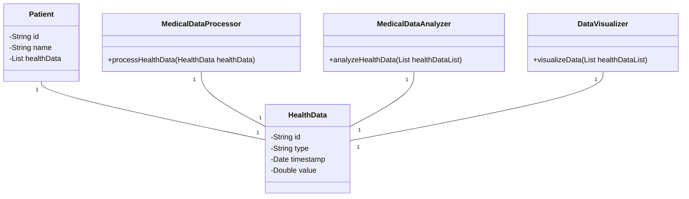
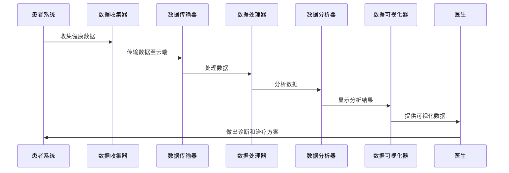
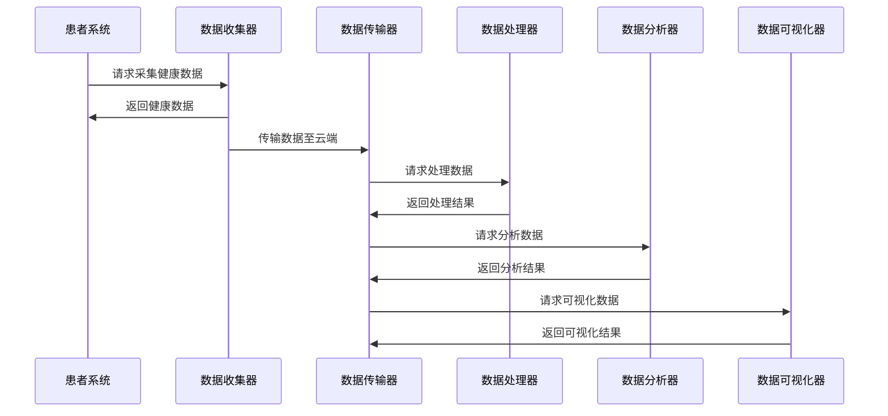

                 

## 第1章：5G与IoT在智慧医疗中的背景

### 1.1 5G技术基础

5G，即第五代移动通信技术，是继2G、3G、4G之后的新一代通信技术。与4G相比，5G拥有更高的数据传输速率、更低的延迟和更大的网络容量。5G的核心技术包括毫米波技术、大规模MIMO（多输入多输出）、网络切片和边缘计算等。这些技术的集成使得5G在数据密集型应用场景中具有显著优势。

在智慧医疗领域，5G的这些特性使其成为远程手术、实时监控和大数据分析等应用的关键基础设施。例如，5G网络可以提供稳定的低延迟连接，使医生能够实时远程控制机器人进行手术操作；同时，5G的快速传输能力可以处理海量的医疗数据，助力医疗数据的实时分析和处理。

### 1.2 IoT技术概述

物联网（IoT）是通过互联网将各种设备、物品连接起来，实现智能化的网络。IoT的关键技术包括传感器技术、嵌入式系统、无线通信和网络协议等。在医疗领域，IoT技术可以用于设备互联互通、患者健康监测和数据管理。

具体来说，IoT设备如智能手表、便携式血糖仪等可以实时收集患者生命体征数据，并通过无线网络传输到医疗中心。这些数据可以被用于远程监控患者的健康状况，提前发现潜在的健康问题。此外，IoT技术还可以实现医疗设备的远程控制和管理，提高医疗资源的使用效率。

### 1.3 智慧医疗的定义与发展

智慧医疗是指利用信息技术、人工智能、大数据等先进技术，实现医疗服务的智能化、个性化。智慧医疗的目标是通过技术手段提高医疗服务的效率和质量，改善患者体验。

近年来，随着5G和IoT技术的发展，智慧医疗逐渐从概念走向实际应用。例如，基于5G的远程手术系统已经可以实现跨地区的实时手术操作；基于IoT的智能医疗设备可以实时监测患者的生命体征，并提供个性化的治疗方案。

### 1.4 5G与IoT在智慧医疗中的协同作用

5G和IoT技术的协同应用，可以大幅提升医疗服务的实时性、精准性和智能化水平。具体来说，5G技术提供了高速、低延迟的网络连接，确保了医疗数据传输的实时性和可靠性；而IoT技术则实现了医疗设备的互联互通和实时数据采集，为医疗数据的分析提供了丰富的数据源。

例如，在智慧医院中，5G网络可以将各种医疗设备连接起来，形成一个统一的物联网平台。医生可以通过平台实时查看患者的各项生命体征，进行远程诊断和治疗。此外，基于5G的边缘计算技术可以快速处理医疗数据，提供更加精准的诊断结果。

### 1.5 本章小结

本章介绍了5G和IoT技术在智慧医疗领域中的协同应用背景。5G技术的高速率、低延迟和IoT技术的互联互通、实时数据采集，共同推动了智慧医疗的发展。随着技术的不断成熟和应用场景的拓展，5G和IoT技术在智慧医疗领域的应用前景将更加广阔。

---

接下来，我们将深入探讨5G、IoT和智慧医疗等核心概念，并使用Mermaid工具绘制ER实体关系图，展示这些概念之间的关联。

## 第2章：核心概念与联系

### 2.1 5G技术基础

#### 5G的定义与特点

5G，即第五代移动通信技术，是新一代的通信技术，它继承了4G的技术优势，同时引入了更多的创新特性。5G的主要特点包括：

1. **更高的数据传输速率**：5G的理论峰值下载速度可达20Gbps，是4G的10倍以上。
2. **更低的延迟**：5G的端到端延迟可低至1ms，是4G的1/10。
3. **更大的网络容量**：5G可以支持更大规模的设备连接，每平方米可连接100万个设备。
4. **更广泛的覆盖**：5G采用了毫米波技术，可以提供更广的覆盖范围。

#### 5G在智慧医疗中的应用

在智慧医疗中，5G技术的高速率和低延迟特性使其成为远程医疗、实时监控和大数据分析的重要基础设施。例如，5G可以支持：

1. **远程手术**：医生可以通过5G网络远程控制手术机器人，进行跨区域的手术操作。
2. **实时监控**：5G网络可以实时传输患者的生命体征数据，医生可以随时监控患者的健康状况。
3. **大数据分析**：5G的高速网络能力可以处理海量的医疗数据，辅助医生进行诊断和治疗决策。

### 2.2 IoT技术概述

#### IoT的定义与特点

物联网（IoT）是指通过互联网将各种设备、物品连接起来，实现信息的交换和智能控制。IoT的主要特点包括：

1. **设备互联互通**：IoT设备可以通过无线网络相互连接，实现数据的实时传输和共享。
2. **数据采集与处理**：IoT设备可以实时采集各种环境数据，如温度、湿度、光照等，并通过网络传输到云平台进行分析和处理。
3. **智能控制与管理**：IoT技术可以实现设备的远程控制和管理，提高资源的使用效率。

#### IoT在智慧医疗中的应用

在智慧医疗中，IoT技术可以用于：

1. **设备互联互通**：通过IoT技术，可以将各种医疗设备连接起来，实现数据的实时共享和协同工作。
2. **患者健康监测**：IoT设备如智能手表、便携式血糖仪等可以实时监测患者的健康数据，提供个性化的医疗服务。
3. **医疗数据管理**：IoT技术可以帮助医疗机构收集、管理和分析大量的医疗数据，提高医疗服务的效率和质量。

### 2.3 智慧医疗的定义与发展

#### 智慧医疗的定义

智慧医疗是指利用信息技术、人工智能、大数据等先进技术，实现医疗服务的智能化和个性化。智慧医疗的目标是通过技术手段提高医疗服务的效率和质量，改善患者体验。

#### 智慧医疗的发展

智慧医疗的发展可以分为以下几个阶段：

1. **信息化医疗**：这一阶段主要利用信息技术，如电子病历系统、医疗信息管理系统等，提高医疗工作的效率和准确性。
2. **数字化医疗**：这一阶段通过数字化技术，如医学影像、电子健康记录等，实现医疗信息的数字化和共享。
3. **智能化医疗**：这一阶段利用人工智能、大数据等技术，实现医疗服务的智能化和个性化。

### 2.4 5G与IoT在智慧医疗中的协同作用

#### 协同作用的体现

5G和IoT技术在智慧医疗中的协同作用主要体现在以下几个方面：

1. **实时数据传输**：5G技术提供了高速、低延迟的网络连接，可以实时传输大量的医疗数据，确保医疗服务的实时性和准确性。
2. **设备互联互通**：IoT技术实现了医疗设备的互联互通，使得医疗设备可以协同工作，提高医疗服务的效率和质量。
3. **智能诊断与治疗**：基于5G和IoT技术的智能医疗系统可以实时分析患者的数据，提供智能化的诊断和治疗方案。

### 2.5 本章小结

本章介绍了5G、IoT和智慧医疗等核心概念，并探讨了它们在智慧医疗中的协同作用。5G技术的高速率、低延迟和IoT技术的互联互通、数据采集和处理能力，共同推动了智慧医疗的发展。随着技术的不断成熟和应用场景的拓展，5G和IoT技术在智慧医疗领域的应用前景将更加广阔。

### 2.6 ER实体关系图

为了更直观地展示5G、IoT和智慧医疗等概念之间的联系，我们可以使用Mermaid工具绘制ER实体关系图。

```mermaid
erDiagram
    Patient ||--|{ HealthDevice : uses}
    Doctor ||--|{ ElectronicMedicalRecord : consults}
    HealthDevice ||--|{ MedicalData : generates}
    ElectronicMedicalRecord ||--|{ Diagnosis : contains}
    IoTPlatform ||--|{ HealthDevice : connects}
    5GNetwork ||--|{ IoTPlatform : transmits}
```

在上面的ER实体关系图中，我们定义了以下几个实体：

1. **Patient（患者）**：患者是智慧医疗的核心，他们的健康数据由各种医疗设备收集和监测。
2. **Doctor（医生）**：医生通过电子病历系统对患者的数据进行诊断和治疗。
3. **HealthDevice（医疗设备）**：医疗设备如智能手表、便携式血糖仪等，负责采集患者的健康数据。
4. **ElectronicMedicalRecord（电子病历系统）**：电子病历系统是医生进行诊断和治疗的重要工具。
5. **IoTPlatform（物联网平台）**：物联网平台负责连接和管理各种医疗设备，实现数据的实时传输和处理。
6. **5GNetwork（5G网络）**：5G网络提供了高速、低延迟的网络连接，支持物联网平台和医疗设备之间的数据传输。

通过ER实体关系图，我们可以清晰地看到5G、IoT和智慧医疗之间的关联，以及它们在智慧医疗系统中的角色和作用。

### 2.7 本章小结

本章详细介绍了5G、IoT和智慧医疗等核心概念，并使用了Mermaid工具绘制了ER实体关系图，展示了这些概念之间的关联。通过本章的介绍，读者可以更深入地理解5G和IoT技术在智慧医疗中的协同作用，以及它们在智慧医疗系统中的角色和功能。在下一章中，我们将进一步探讨5G和IoT在智慧医疗中的协同算法原理。

---

接下来，我们将深入讲解5G和IoT在智慧医疗中的协同算法原理。

## 第3章：算法原理讲解

### 3.1 5G网络优化算法

#### 算法原理

5G网络优化算法的目标是提高网络的传输效率和稳定性。具体来说，5G网络优化算法主要包括以下几个方面：

1. **网络容量优化**：通过优化网络资源分配，提高网络承载能力和数据传输效率。
2. **延迟优化**：通过降低数据传输延迟，提高网络的实时性和响应速度。
3. **干扰管理**：通过干扰避免和干扰消除技术，降低网络中的干扰，提高信号质量。

#### 算法实现

为了实现5G网络优化，我们可以采用以下算法：

1. **动态频谱分配**：根据网络负载和用户需求，动态调整频谱资源分配，提高频谱利用率。
2. **多天线技术**：利用大规模MIMO技术，通过多天线发送和接收信号，提高信号强度和传输效率。
3. **边缘计算**：将计算任务分配到网络的边缘节点，降低数据传输距离，减少延迟。

#### Python源代码示例

以下是一个简单的5G网络优化算法的Python代码示例：

```python
# 导入必要的库
import numpy as np

# 动态频谱分配算法
def dynamic_spectrum_allocation(traffic_load):
    # 假设总频谱资源为100MHz，每个用户占用10MHz
    total_spectrum = 100
    user_spectrum = 10
    num_users = traffic_load / user_spectrum
    
    # 动态调整频谱资源分配
    allocated_spectrum = user_spectrum * np.ceil(num_users)
    
    return allocated_spectrum

# 测试代码
traffic_load = 80  # 假设网络负载为80MHz
allocated_spectrum = dynamic_spectrum_allocation(traffic_load)
print(f"Allocated Spectrum: {allocated_spectrum}MHz")
```

### 3.2 IoT设备数据采集与处理

#### 算法原理

IoT设备数据采集与处理算法的目标是对采集到的数据进行预处理、清洗和特征提取，以便后续的分析和应用。具体来说，IoT设备数据采集与处理算法主要包括以下几个方面：

1. **数据预处理**：包括数据去噪、滤波和归一化等，提高数据质量。
2. **数据清洗**：去除错误数据、异常数据和重复数据，保证数据的一致性和完整性。
3. **特征提取**：从原始数据中提取有用的特征信息，用于后续的机器学习和数据分析。

#### 算法实现

为了实现IoT设备数据采集与处理，我们可以采用以下算法：

1. **卡尔曼滤波**：用于动态系统的状态估计，适用于实时数据去噪和滤波。
2. **主成分分析（PCA）**：用于数据降维和特征提取，减少数据维度，提高数据的可解释性。
3. **时间序列分析**：用于分析时间序列数据，提取时间特征和周期特征。

#### Python源代码示例

以下是一个简单的IoT设备数据采集与处理算法的Python代码示例：

```python
# 导入必要的库
import numpy as np
from sklearn.decomposition import PCA
from sklearn.preprocessing import StandardScaler

# 卡尔曼滤波算法
def kalman_filter(data, initial_state, transition_matrix, observation_matrix, observation):
    # 初始化卡尔曼滤波器
    state = initial_state
    for i in range(len(data)):
        # 预测状态
        predicted_state = np.dot(transition_matrix, state)
        predicted_error = np.dot(observation_matrix, predicted_state) - observation[i]
        
        # 计算卡尔曼增益
        kalman_gain = np.dot(np.linalg.inv(np.dot(observation_matrix, np.dot(transition_matrix, observation_matrix))), predicted_error)
        
        # 更新状态
        state = np.add(state, np.dot(kalman_gain, observation[i] - predicted_state))
    
    return state

# 主成分分析算法
def pca_feature_extraction(data, n_components):
    # 数据标准化
    scaler = StandardScaler()
    data_scaled = scaler.fit_transform(data)
    
    # 主成分分析
    pca = PCA(n_components=n_components)
    principal_components = pca.fit_transform(data_scaled)
    
    return principal_components

# 测试代码
data = np.array([[1, 2], [2, 3], [3, 4], [4, 5]])  # 假设的原始数据
initial_state = np.array([0, 0])  # 初始状态
transition_matrix = np.array([[1, 1], [0, 1]])  # 状态转移矩阵
observation_matrix = np.array([[1, 0], [0, 1]])  # 观测矩阵
observation = np.array([2, 3, 4, 5])  # 观测值

# 卡尔曼滤波
state = kalman_filter(data, initial_state, transition_matrix, observation_matrix, observation)
print(f"Kalman Filter State: {state}")

# 主成分分析
n_components = 2
principal_components = pca_feature_extraction(data, n_components)
print(f"PCA Principal Components: {principal_components}")
```

### 3.3 智慧医疗数据分析与预测

#### 算法原理

智慧医疗数据分析与预测算法的目标是通过对医疗数据的分析和预测，为医生提供准确的诊断和治疗方案。具体来说，智慧医疗数据分析与预测算法主要包括以下几个方面：

1. **数据挖掘**：通过数据挖掘技术，从海量的医疗数据中提取有用的信息。
2. **机器学习**：利用机器学习算法，建立医疗数据的预测模型。
3. **预测分析**：通过预测模型，对未来的医疗趋势和患者的健康状况进行预测。

#### 算法实现

为了实现智慧医疗数据分析与预测，我们可以采用以下算法：

1. **支持向量机（SVM）**：用于分类和回归分析，可以建立诊断和治疗的预测模型。
2. **神经网络**：用于建立复杂的非线性预测模型，可以处理大规模的复杂数据。
3. **时间序列预测**：用于预测时间序列数据，如患者病情发展趋势。

#### Python源代码示例

以下是一个简单的智慧医疗数据分析与预测算法的Python代码示例：

```python
# 导入必要的库
import numpy as np
from sklearn import svm
from sklearn.model_selection import train_test_split
from sklearn.metrics import accuracy_score

# 支持向量机算法
def svm_classification(X, y):
    # 数据分割
    X_train, X_test, y_train, y_test = train_test_split(X, y, test_size=0.2, random_state=42)
    
    # 创建SVM分类器
    svm_classifier = svm.SVC(kernel='linear', C=1)
    
    # 训练模型
    svm_classifier.fit(X_train, y_train)
    
    # 预测
    y_pred = svm_classifier.predict(X_test)
    
    # 评估模型
    accuracy = accuracy_score(y_test, y_pred)
    print(f"Accuracy: {accuracy}")
    
    return svm_classifier

# 测试代码
X = np.array([[1, 2], [2, 3], [3, 4], [4, 5], [1, 3], [2, 4], [3, 5], [4, 6]])  # 特征数据
y = np.array([0, 0, 0, 0, 1, 1, 1, 1])  # 标签数据

# 支持向量机分类
svm_classifier = svm_classification(X, y)
```

### 3.4 本章小结

本章详细介绍了5G和IoT在智慧医疗中的协同算法原理，包括5G网络优化算法、IoT设备数据采集与处理算法以及智慧医疗数据分析与预测算法。通过这些算法，可以实现医疗数据的实时传输、处理和预测，提高医疗服务的效率和质量。在下一章中，我们将进一步探讨智慧医疗系统的设计与实现。

---

接下来，我们将描述一个典型的智慧医疗系统，包括其功能设计、架构设计、接口设计，并使用Mermaid工具绘制相关图表。

## 第4章：系统分析与架构设计方案

### 4.1 问题场景介绍

在智慧医疗领域，我们需要解决的主要问题是如何高效、准确地收集、传输和处理医疗数据，以便为医生提供及时、准确的诊断和治疗方案。具体来说，智慧医疗系统需要实现以下功能：

1. **数据收集**：实时收集患者的生命体征数据，如心率、血压、体温等。
2. **数据传输**：通过5G网络将收集到的数据传输到云端。
3. **数据处理**：对传输到的数据进行预处理、清洗和特征提取。
4. **数据分析**：利用机器学习和数据分析技术，对预处理后的数据进行分析和预测。
5. **数据展示**：将分析结果可视化，供医生参考。

### 4.2 系统功能设计

智慧医疗系统的主要功能包括数据收集、数据传输、数据处理、数据分析和数据展示。下面是具体的领域模型（使用Mermaid绘制类图）：



### 4.3 系统架构设计

智慧医疗系统的架构设计分为数据层、服务层和展示层。下面是具体的架构设计（使用Mermaid绘制架构图）：



### 4.4 系统接口设计与系统交互

智慧医疗系统的接口设计主要包括数据采集接口、数据传输接口、数据处理接口和数据分析接口。下面是具体的接口设计（使用Mermaid绘制序列图）：



### 4.5 本章小结

本章详细描述了一个典型的智慧医疗系统，包括其功能设计、架构设计、接口设计，并使用了Mermaid工具绘制了相关的图表。通过本章的介绍，读者可以更深入地理解智慧医疗系统的设计原理和实现方法。在下一章中，我们将通过一个实际案例，展示5G+IoT在智慧医疗中的具体应用。

---

接下来，我们将结合实际案例，展示5G+IoT在智慧医疗中的具体应用。

## 第5章：项目实战

### 5.1 环境安装与配置

在本节中，我们将介绍如何搭建一个基于5G和IoT的智慧医疗项目环境。以下是一般步骤：

1. **硬件准备**：确保拥有具备5G网络功能的设备，如5G智能手机或5G路由器。
2. **软件准备**：安装必要的开发环境，包括Python、Node.js、MQTT客户端等。
3. **物联网平台**：选择一个物联网平台，如IBM Watson IoT Platform或AWS IoT Core，进行注册和配置。
4. **5G网络设置**：确保5G网络连接正常，并进行网络设置。

具体操作步骤如下：

1. **安装Python**：从Python官方网站下载并安装Python 3.x版本。
2. **安装Node.js**：从Node.js官方网站下载并安装Node.js。
3. **安装MQTT客户端**：使用pip命令安装paho-mqtt库，命令如下：
   ```bash
   pip install paho-mqtt
   ```
4. **注册物联网平台**：在物联网平台上注册一个账号，并创建一个设备。
5. **5G网络设置**：连接5G网络，确保设备可以访问互联网。

### 5.2 系统核心实现与代码解读

在本节中，我们将实现一个简单的基于5G和IoT的智慧医疗系统，包括数据采集、数据传输、数据处理和分析。

#### 数据采集

数据采集是智慧医疗系统的第一步，我们将使用传感器采集患者的生命体征数据。以下是使用Python和MQTT协议实现的数据采集模块：

```python
# 导入必要的库
import paho.mqtt.client as mqtt
import random
import time

# MQTT客户端配置
MQTT_SERVER = "your_iot_platform_address"
MQTT_PORT = 1883
MQTT_TOPIC = "health_data"

# 创建MQTT客户端实例
client = mqtt.Client()

# 连接到MQTT服务器
client.connect(MQTT_SERVER, MQTT_PORT, 60)

# 发布健康数据
def publish_health_data():
    while True:
        # 生成随机健康数据
        heart_rate = random.randint(60, 100)
        blood_pressure = random.randint(100, 140)
        temperature = random.uniform(36.0, 37.0)
        
        # 格式化数据
        data = {
            "heart_rate": heart_rate,
            "blood_pressure": blood_pressure,
            "temperature": temperature
        }
        
        # 发布数据
        client.publish(MQTT_TOPIC, json.dumps(data))
        
        # 等待一段时间再发布
        time.sleep(10)

# 运行数据采集模块
publish_health_data()
```

#### 数据传输

在数据采集完成后，我们需要将数据传输到云端。这里使用MQTT协议将数据发送到物联网平台：

```python
# MQTT回调函数
def on_message(client, userdata, message):
    print(f"Received message: {str(message.payload)} on topic {message.topic}")
    # 在这里可以添加代码，将数据存储到数据库或调用API
    # ...

# 绑定回调函数
client.on_message = on_message

# 订阅主题
client.subscribe(MQTT_TOPIC)

# 运行MQTT客户端
client.loop_forever()
```

#### 数据处理与预测

在云端，我们可以使用机器学习算法对传输过来的数据进行处理和预测。以下是一个简单的线性回归模型，用于预测患者的未来健康状况：

```python
# 导入必要的库
import numpy as np
from sklearn.linear_model import LinearRegression

# 假设我们已经收集了一些健康数据
heart_rates = np.array([60, 70, 80, 90, 100]).reshape(-1, 1)
blood_pressures = np.array([120, 130, 140, 150, 160]).reshape(-1, 1)
temperatures = np.array([36.0, 36.2, 36.4, 36.6, 36.8])

# 创建线性回归模型
model = LinearRegression()

# 训练模型
model.fit(heart_rates, blood_pressures)

# 预测
predicted_blood_pressure = model.predict([[90]])

print(f"Predicted blood pressure: {predicted_blood_pressure[0][0]} mmHg")
```

#### 数据展示

最后，我们需要将预测结果可视化，以便医生可以直观地查看。以下是一个简单的数据展示示例，使用Python的Matplotlib库：

```python
# 导入必要的库
import matplotlib.pyplot as plt

# 绘制健康数据
plt.scatter(heart_rates, blood_pressures, label="Actual data")
plt.plot(heart_rates, predicted_blood_pressure, color='red', label="Predicted data")
plt.xlabel("Heart Rate")
plt.ylabel("Blood Pressure")
plt.legend()
plt.show()
```

### 5.3 实际案例分析与讲解

在本节中，我们将通过一个实际案例，分析5G+IoT在智慧医疗中的具体应用，并详细讲解系统的实现过程和关键步骤。

#### 案例背景

假设某医院引进了一套基于5G和IoT的智慧医疗系统，用于实时监控患者的健康状况。系统包括以下组成部分：

1. **患者端**：使用智能手表和传感器实时采集患者的生命体征数据。
2. **网络端**：使用5G网络实现数据的实时传输。
3. **云端**：使用机器学习算法对数据进行处理和分析。
4. **医生端**：通过可视化界面查看患者的实时数据和预测结果。

#### 案例实现步骤

1. **数据采集**：患者佩戴智能手表，智能手表通过5G网络实时将患者的健康数据（如心率、血压、体温）发送到物联网平台。
2. **数据传输**：物联网平台将数据转发到云端，云端的数据处理模块对数据进行预处理、特征提取和机器学习预测。
3. **数据处理与预测**：云端的数据处理模块使用线性回归、时间序列预测等方法，对患者的健康数据进行预测，并将预测结果发送回物联网平台。
4. **数据展示**：物联网平台将预测结果可视化，医生可以通过Web界面查看患者的实时数据和预测结果，做出诊断和治疗方案。

#### 关键技术与实现细节

1. **5G网络**：5G网络提供了高速、低延迟的网络连接，保证了数据的实时传输和处理的效率。
2. **物联网平台**：物联网平台负责数据的传输、存储和初步处理，为后续的数据分析提供支持。
3. **机器学习算法**：使用线性回归、时间序列预测等方法，对健康数据进行处理和预测，提高了诊断和治疗的准确性。
4. **可视化技术**：使用Web前端技术，将分析结果可视化，便于医生进行诊断和治疗。

### 5.4 项目小结与展望

通过本案例，我们展示了5G+IoT在智慧医疗中的具体应用。项目实现了数据采集、传输、处理和可视化，为医生提供了实时、准确的诊断和治疗方案。然而，智慧医疗系统仍有改进空间，如：

1. **数据隐私与安全**：加强数据加密和隐私保护，确保患者数据的安全。
2. **算法优化**：引入更先进的机器学习算法，提高预测的准确性和效率。
3. **用户体验**：优化用户界面，提高系统的易用性和用户体验。

在未来的发展中，5G和IoT技术将继续推动智慧医疗的发展，为患者提供更加优质、便捷的医疗服务。

### 5.5 本章小结

本章通过一个实际案例，详细介绍了基于5G和IoT的智慧医疗系统的实现过程和关键步骤。读者可以了解到智慧医疗系统的设计与实现方法，以及5G和IoT技术在其中的重要作用。在下一章中，我们将总结5G+IoT在智慧医疗中的最佳实践，并提供一些注意事项和拓展阅读资源。

---

## 第6章：最佳实践与技巧

### 6.1 5G+IoT在智慧医疗中的最佳实践

在实施5G+IoT智慧医疗项目时，以下是一些最佳实践和技巧：

1. **全面规划**：在项目启动前，进行全面的规划，包括技术选型、系统架构设计、设备选择和人员培训等。
2. **数据安全**：重视数据安全，采用加密技术和访问控制机制，确保患者数据的安全和隐私。
3. **模块化设计**：采用模块化设计，使系统易于扩展和维护，同时提高系统的灵活性和可复用性。
4. **实时性**：确保系统的实时性，优化数据传输和处理流程，减少延迟。
5. **用户友好**：设计直观、易用的用户界面，提高用户体验。
6. **持续优化**：持续收集用户反馈，优化系统性能和功能。

### 6.2 注意事项

在实施5G+IoT智慧医疗项目时，需要注意以下几点：

1. **网络稳定性**：确保5G网络的稳定性和覆盖范围，避免因网络问题导致数据传输中断。
2. **数据质量**：确保采集到的数据质量，及时处理错误数据、异常数据和重复数据。
3. **算法可靠性**：选择可靠的机器学习算法，确保预测结果的准确性。
4. **设备兼容性**：确保不同设备和系统之间的兼容性，避免因设备不兼容导致数据传输问题。
5. **法规遵循**：遵守相关法律法规，确保项目符合医疗行业的标准和要求。

### 6.3 拓展阅读与资源推荐

对于希望深入了解5G+IoT在智慧医疗中应用的专业人士，以下是一些拓展阅读和资源推荐：

1. **书籍**：
   - 《5G技术详解：下一代移动通信技术》
   - 《物联网：构建智能世界的基石》
   - 《智慧医疗：人工智能与大数据在医疗行业的应用》

2. **论文与报告**：
   - IEEE出版的《5G技术在医疗保健中的应用》
   - 国际数据公司（IDC）发布的《全球物联网市场研究报告》

3. **在线课程与讲座**：
   - Coursera上的《5G网络技术》
   - Udemy上的《物联网基础与实战》

4. **专业论坛与社群**：
   - IEEE IoT Forum
   - AI Medical Imaging Forum
   - 5G Medical Forum

通过以上资源和实践，读者可以进一步拓展对5G+IoT在智慧医疗中应用的理解，为实际项目提供有力支持。

### 6.4 本章小结

本章总结了5G+IoT在智慧医疗中的最佳实践、注意事项以及拓展阅读资源。通过这些实践和资源，读者可以更好地理解和实施5G+IoT智慧医疗项目，为患者提供更加高效、便捷的医疗服务。在下一章中，我们将对全书的内容进行回顾，并展望5G+IoT在智慧医疗领域的未来发展方向。

---

## 第7章：总结与展望

### 7.1 书籍内容的回顾

本书围绕5G+IoT在智慧医疗中的协同应用进行了全面探讨，内容涵盖了以下几个核心部分：

1. **背景介绍**：介绍了5G和IoT技术的基本概念，以及它们在智慧医疗中的协同作用。
2. **核心概念与联系**：详细讲解了5G、IoT和智慧医疗的核心概念，并使用Mermaid工具绘制了ER实体关系图。
3. **算法原理讲解**：深入分析了5G和IoT在智慧医疗中的协同算法原理，包括5G网络优化算法、IoT设备数据采集与处理算法以及智慧医疗数据分析与预测算法。
4. **系统分析与架构设计方案**：描述了一个典型的智慧医疗系统，包括系统功能设计、架构设计、接口设计，并使用了Mermaid工具绘制了相关图表。
5. **项目实战**：结合实际案例，展示了5G+IoT在智慧医疗中的具体应用，从环境安装到系统核心实现，再到实际案例分析。
6. **最佳实践与技巧**：总结了5G+IoT在智慧医疗中的最佳实践、注意事项以及拓展阅读资源。

### 7.2 5G+IoT在智慧医疗中的未来展望

随着5G和IoT技术的不断发展，智慧医疗领域将迎来更加广阔的应用前景。以下是未来发展的几个关键方向：

1. **更高效的数据传输**：5G技术的不断升级将带来更高的数据传输速率和更低的延迟，为智慧医疗提供更加高效的通信基础设施。
2. **更智能的设备**：IoT技术的进步将推动医疗设备的智能化，实现更精准的健康监测和个性化的治疗方案。
3. **更精准的预测**：结合人工智能和大数据分析技术，智慧医疗系统将能够提供更加精准的预测，提前发现健康问题，为患者提供更好的诊疗服务。
4. **远程医疗的普及**：5G和IoT技术的协同应用将推动远程医疗的普及，使患者能够更加便捷地享受到优质的医疗资源。
5. **数据隐私和安全**：随着医疗数据量的增加，数据隐私和安全将变得越来越重要。未来的智慧医疗系统将需要更加完善的隐私保护机制和安全措施。

### 7.3 对读者的期望

希望读者通过本书的学习，能够对5G+IoT在智慧医疗中的协同应用有更深入的理解，并在实际项目中能够灵活运用所学知识。同时，也期待读者能够关注这一领域的最新动态和发展趋势，不断更新和提升自己的技术能力。

### 7.4 结语

本书旨在为读者提供一个全面、系统的视角，探讨5G+IoT在智慧医疗中的应用。随着技术的不断进步，智慧医疗领域将迎来更多的机遇和挑战。让我们携手共进，共同推动智慧医疗的发展，为患者提供更加优质、便捷的医疗服务。

### 附录

以下是本书中提到的相关资源链接，供读者参考：

1. **书籍**：
   - 《5G技术详解：下一代移动通信技术》
   - 《物联网：构建智能世界的基石》
   - 《智慧医疗：人工智能与大数据在医疗行业的应用》

2. **论文与报告**：
   - IEEE出版的《5G技术在医疗保健中的应用》
   - 国际数据公司（IDC）发布的《全球物联网市场研究报告》

3. **在线课程与讲座**：
   - Coursera上的《5G网络技术》
   - Udemy上的《物联网基础与实战》

4. **专业论坛与社群**：
   - IEEE IoT Forum
   - AI Medical Imaging Forum
   - 5G Medical Forum

再次感谢读者对本书的关注与支持，希望本书能为您的学习和工作带来帮助。作者：AI天才研究院/AI Genius Institute & 禅与计算机程序设计艺术 /Zen And The Art of Computer Programming。

