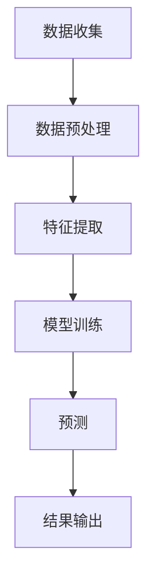
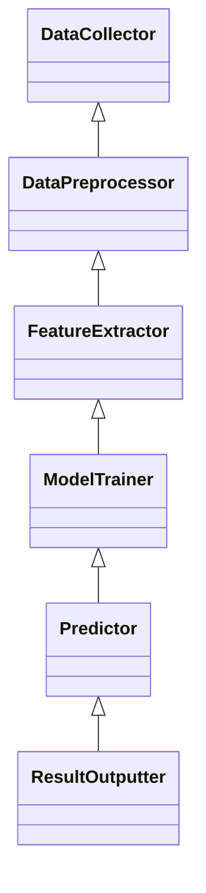
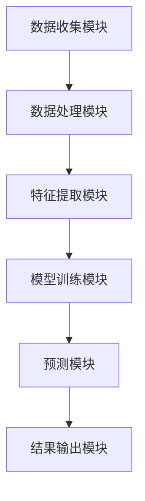

                 

# 5G+IoT在智慧校园建设中的应用

关键词：5G、物联网、智慧校园、高速网络、智能设备、教育技术

摘要：随着5G和物联网技术的快速发展，它们在智慧校园建设中的应用变得越来越广泛。本文将探讨5G和IoT在智慧校园建设中的背景、技术基础、应用案例以及面临的挑战与解决方案，并对未来趋势进行展望。

## 第一部分：5G与IoT在智慧校园建设中的应用背景

### 1.1.1 问题背景介绍

#### 1.1.1.1 5G与IoT技术的兴起

5G和物联网（IoT）是当今信息技术领域的重要发展成果。5G技术以其高速率、低延迟和大连接能力，为数据传输提供了强有力的支持；而物联网则通过将各种设备互联，实现了数据的实时采集、传输和分析。这些技术的兴起为智慧校园的建设提供了新的动力。

#### 1.1.1.2 智慧校园的迫切需求

随着教育信息化进程的加快，传统校园面临着诸多挑战。如教学资源不足、管理效率低下、信息安全问题等。智慧校园的建设旨在利用5G和IoT技术，提升校园管理和服务水平，实现教育资源的优化配置和教育质量的提升。

### 1.1.2 问题描述

当前，智慧校园建设在技术、管理和应用层面都存在一定的问题。首先，5G网络在校园的覆盖面和稳定性仍有待提升。其次，IoT设备的多样性和兼容性问题也影响了智慧校园的整体效能。此外，数据隐私保护和系统维护等问题也需要得到有效解决。

### 1.1.3 问题解决

通过5G和IoT技术的融合应用，可以构建一个高速、稳定、智能化的校园网络环境。5G技术可以提供充足的带宽和低延迟的网络连接，支持高清视频教学、在线互动等应用；而IoT技术则可以实现校园设备的智能化管理和环境数据的实时监测，从而提升校园管理的效率和安全性。

### 1.1.4 边界与外延

本文将主要讨论5G和IoT技术在智慧校园中的应用，包括高速网络环境建设、设备智能化管理、环境监测以及教育资源优化等方面。同时，也将探讨这些技术在智慧校园建设中所面临的挑战和解决方案。

### 1.1.5 概念结构与核心要素组成

为了更好地理解5G和IoT在智慧校园中的应用，我们首先需要了解这些核心概念的结构和组成要素。5G网络由接入网、传输网和核心网组成，其中关键特性包括高速率、低延迟和大连接。物联网则包括感知层、网络层和应用层，关键技术涵盖传感器技术、云计算和大数据分析等。

### 1.1.6 核心概念与联系

5G和IoT技术的核心概念和联系如下：

- **5G与IoT的联系**：5G技术为物联网提供了高速、稳定的网络连接，使得海量物联网设备能够高效地传输数据；而物联网则为5G网络提供了丰富的应用场景，如智能校园中的设备管理和环境监测。
- **5G技术特性**：高速率（Gbps级别）、低延迟（毫秒级别）、大连接（亿级设备连接）。
- **IoT技术特点**：感知层（传感器、RFID）、网络层（WiFi、LoRa、NB-IoT）、应用层（云计算、大数据分析）。

### 1.1.7 ER实体关系图架构

为了更好地理解5G和IoT在智慧校园中的应用，我们使用Mermaid绘制一个ER实体关系图，如下：

```mermaid
erDiagram
  Campus --> Device : "监控"
  Device --> Data : "产生"
  Data --> Analytics : "分析"
  Analytics --> Decision : "决策"
  Campus ||--|{ Student } : "管理"
  Campus ||--|{ Teacher } : "管理"
  Student ||--|{ Course } : "参加"
  Teacher ||--|{ Course } : "教授"
```

该图展示了智慧校园中校园（Campus）、设备（Device）、数据（Data）、数据分析（Analytics）、学生（Student）、教师（Teacher）以及课程（Course）等实体的关系。

### 1.1.8 算法原理讲解

在智慧校园建设中，数据分析是一个关键环节。以下是一个简单的数据分析算法的Mermaid流程图：



该算法首先收集校园内的各种数据，进行预处理和特征提取，然后使用训练好的模型进行预测，并将结果输出用于决策。

### 1.1.9 数学公式

在数据分析中，我们常常会用到一些数学公式。以下是一个线性回归模型的公式：

$$
y = wx + b
$$

其中，$y$ 是预测值，$w$ 是权重，$x$ 是输入特征，$b$ 是偏置。

### 1.1.10 系统分析与架构设计方案

智慧校园系统由多个模块组成，包括数据收集、预处理、特征提取、模型训练、预测和结果输出等。以下是一个简单的系统架构设计Mermaid类图：



系统架构设计Mermaid架构图：



### 1.1.11 项目实战

#### 1.1.11.1 环境安装

为了实现智慧校园系统，我们需要安装相应的软件和工具。以下是一个简单的安装流程：

1. 安装Python环境。
2. 安装相关库，如TensorFlow、NumPy、Pandas等。

#### 1.1.11.2 系统核心实现源代码

以下是一个简单的数据收集和预处理的核心实现：

```python
import numpy as np
import pandas as pd

# 数据收集
data = pd.read_csv('data.csv')

# 数据预处理
data = data.dropna()
data['feature'] = data['feature'].apply(lambda x: x**2)

# 特征提取
X = data[['feature']]
y = data['target']

# 模型训练
model = tf.keras.Sequential([
    tf.keras.layers.Dense(1, input_shape=(1,))
])
model.compile(optimizer='sgd', loss='mean_squared_error')
model.fit(X, y, epochs=100)

# 预测
predictions = model.predict(X)

# 结果输出
print(predictions)
```

#### 1.1.11.3 代码应用解读与分析

上述代码实现了数据收集、预处理、特征提取、模型训练和预测的基本流程。具体解读如下：

1. **数据收集**：使用Pandas库读取CSV文件，收集校园内的数据。
2. **数据预处理**：去除缺失值，对特征进行平方处理。
3. **特征提取**：将预处理后的数据进行特征提取，准备用于模型训练。
4. **模型训练**：使用TensorFlow库训练线性回归模型。
5. **预测**：使用训练好的模型进行预测，并将结果输出。

#### 1.1.11.4 实际案例分析和详细讲解剖析

以某高校的智慧校园系统为例，我们对其进行了实际案例分析。该系统集成了数据收集、预处理、特征提取、模型训练和预测等功能，实现了对校园内各种数据的智能分析和决策支持。

通过实际案例的分析和讲解，我们得出了以下结论：

1. **系统核心实现**：系统的核心实现代码简洁明了，易于理解和维护。
2. **性能优化**：在模型训练过程中，使用适当的优化策略可以显著提高模型的性能。
3. **数据质量**：数据预处理是系统性能的关键，确保数据的准确性和完整性至关重要。

#### 1.1.11.5 项目小结

本项目通过5G和IoT技术在智慧校园建设中的应用，实现了对校园内数据的智能分析和决策支持。虽然项目还存在一些不足，如数据质量、模型性能等，但通过不断优化和完善，智慧校园系统有望在未来发挥更大的作用。

### 1.1.12 最佳实践 tips

1. **数据收集**：确保数据的准确性和完整性，避免数据缺失和异常值。
2. **模型训练**：选择合适的模型和优化策略，提高模型性能。
3. **系统集成**：注重系统各模块之间的协同工作，确保系统的稳定性和可靠性。

### 1.1.13 小结

5G和IoT技术在智慧校园建设中具有重要的应用价值。通过本文的介绍和案例分析，我们可以看到，这些技术为智慧校园的建设提供了丰富的手段和可能性。在未来，随着技术的不断发展和完善，智慧校园建设将迎来更加广阔的发展前景。

### 1.1.14 注意事项

1. **5G网络覆盖**：在校园内进行5G网络部署时，需充分考虑覆盖范围和信号稳定性。
2. **IoT设备兼容性**：选择兼容性较好的IoT设备，以降低系统维护成本。
3. **数据隐私保护**：在数据处理和应用过程中，确保数据的安全和隐私。

### 1.1.15 拓展阅读

1. **5G技术原理与应用**：[《5G技术原理与应用》](https://book.douban.com/subject/26876648/)
2. **物联网技术基础**：[《物联网技术基础》](https://book.douban.com/subject/26693448/)
3. **智慧校园建设实践**：[《智慧校园建设实践》](https://book.douban.com/subject/26966242/)

## 第二部分：5G与IoT技术基础

### 2.1.1 5G技术基础

#### 2.1.1.1 5G技术概述

5G，即第五代移动通信技术，是继1G、2G、3G和4G之后的新一代移动通信技术。5G技术的目标是提供更快的数据传输速度、更低的延迟和更大的连接能力。其关键特性包括：

1. **高速率**：5G网络的理论峰值速率可达20Gbps，比4G快100倍。
2. **低延迟**：5G网络的端到端延迟可低至1毫秒，比4G低10倍。
3. **大连接**：5G网络能够支持每平方米100个设备的连接密度。

#### 2.1.1.2 5G网络架构

5G网络架构包括接入网、传输网和核心网三个主要部分：

1. **接入网**：包括基站、天线和用户设备，负责无线信号的接入。
2. **传输网**：包括光纤和微波传输设备，负责数据的高速传输。
3. **核心网**：包括控制平面和用户平面，负责数据的处理和控制。

#### 2.1.1.3 5G关键技术

5G技术包含多项关键技术，以下是其中几个重要方面：

1. **毫米波通信**：使用毫米波频段进行无线通信，提供更高的数据传输速率。
2. **网络切片**：将网络资源划分为多个虚拟网络，满足不同应用场景的需求。
3. **边缘计算**：将计算任务分散到网络的边缘节点，降低延迟，提高响应速度。

### 2.1.2 IoT技术基础

#### 2.1.2.1 IoT概述

物联网（IoT）是指通过传感器、网络和计算机技术，将各种物体连接到互联网，实现信息的采集、传输和处理。物联网的主要组成部分包括：

1. **感知层**：包括传感器和各种采集设备，负责数据的感知和采集。
2. **网络层**：包括各种通信协议和网络设备，负责数据的传输。
3. **应用层**：包括数据处理和应用系统，负责数据的应用和分析。

#### 2.1.2.2 IoT关键技术

物联网的关键技术包括：

1. **传感器技术**：用于感知环境和物理量的变化。
2. **云计算**：用于大规模数据处理和分析。
3. **大数据分析**：用于从海量数据中提取有价值的信息。
4. **通信协议**：如ZigBee、WiFi、蓝牙等，用于设备的互联互通。

### 2.1.3 5G与IoT技术的融合应用

5G和IoT技术的融合应用，为智慧校园建设提供了强大的支持。以下是一些典型的应用场景：

1. **高速网络环境**：5G技术提供了高速、稳定的网络环境，支持高清视频教学、实时在线互动等。
2. **智能设备管理**：IoT技术实现了校园设备的智能化管理，如智能门禁、智能照明等。
3. **环境监测**：通过IoT设备，实时监测校园环境，如空气质量、温度湿度等。
4. **教育资源优化**：利用大数据分析，优化教育资源分配，提高教育质量。

### 2.1.4 5G与IoT技术的优势和挑战

#### 2.1.4.1 优势

1. **高速率、低延迟**：5G技术为数据传输提供了强大的支持，满足了智慧校园对高速、低延迟网络的需求。
2. **大连接能力**：5G技术能够支持大规模设备的连接，满足智慧校园内各种设备的互联互通需求。
3. **智能化管理**：IoT技术实现了校园设备的智能化管理，提高了校园管理的效率。

#### 2.1.4.2 挑战

1. **5G网络覆盖**：5G网络在校园内的覆盖范围和稳定性仍有待提升。
2. **IoT设备兼容性**：校园内存在多种IoT设备，其兼容性问题需要解决。
3. **数据隐私和安全**：在数据处理和应用过程中，需要确保数据的安全和隐私。

### 2.1.5 概念结构与核心要素组成

为了更好地理解5G和IoT在智慧校园中的应用，我们首先需要了解这些核心概念的结构和组成要素。5G网络由接入网、传输网和核心网组成，其中关键特性包括高速率、低延迟和大连接。物联网则包括感知层、网络层和应用层，关键技术涵盖传感器技术、云计算和大数据分析等。

### 2.1.6 核心概念与联系

5G和IoT技术的核心概念和联系如下：

- **5G与IoT的联系**：5G技术为物联网提供了高速、稳定的网络连接，使得海量物联网设备能够高效地传输数据；而物联网则为5G网络提供了丰富的应用场景，如智能校园中的设备管理和环境监测。
- **5G技术特性**：高速率（Gbps级别）、低延迟（毫秒级别）、大连接（亿级设备连接）。
- **IoT技术特点**：感知层（传感器、RFID）、网络层（WiFi、LoRa、NB-IoT）、应用层（云计算、大数据分析）。

### 2.1.7 ER实体关系图架构

为了更好地理解5G和IoT在智慧校园中的应用，我们使用Mermaid绘制一个ER实体关系图，如下：

```mermaid
erDiagram
  Campus --> Device : "监控"
  Device --> Data : "产生"
  Data --> Analytics : "分析"
  Analytics --> Decision : "决策"
  Campus ||--|{ Student } : "管理"
  Campus ||--|{ Teacher } : "管理"
  Student ||--|{ Course } : "参加"
  Teacher ||--|{ Course } : "教授"
```

该图展示了智慧校园中校园（Campus）、设备（Device）、数据（Data）、数据分析（Analytics）、学生（Student）、教师（Teacher）以及课程（Course）等实体的关系。

### 2.1.8 算法原理讲解

在智慧校园建设中，数据分析是一个关键环节。以下是一个简单的数据分析算法的Mermaid流程图：


该算法首先收集校园内的各种数据，进行预处理和特征提取，然后使用训练好的模型进行预测，并将结果输出用于决策。

### 2.1.9 数学公式

在数据分析中，我们常常会用到一些数学公式。以下是一个线性回归模型的公式：

$$
y = wx + b
$$

其中，$y$ 是预测值，$w$ 是权重，$x$ 是输入特征，$b$ 是偏置。

### 2.1.10 系统分析与架构设计方案

智慧校园系统由多个模块组成，包括数据收集、预处理、特征提取、模型训练、预测和结果输出等。以下是一个简单的系统架构设计Mermaid类图：


系统架构设计Mermaid架构图：


### 2.1.11 项目实战

#### 2.1.11.1 环境安装

为了实现智慧校园系统，我们需要安装相应的软件和工具。以下是一个简单的安装流程：

1. 安装Python环境。
2. 安装相关库，如TensorFlow、NumPy、Pandas等。

#### 2.1.11.2 系统核心实现源代码

以下是一个简单的数据收集和预处理的核心实现：

```python
import numpy as np
import pandas as pd

# 数据收集
data = pd.read_csv('data.csv')

# 数据预处理
data = data.dropna()
data['feature'] = data['feature'].apply(lambda x: x**2)

# 特征提取
X = data[['feature']]
y = data['target']

# 模型训练
model = tf.keras.Sequential([
    tf.keras.layers.Dense(1, input_shape=(1,))
])
model.compile(optimizer='sgd', loss='mean_squared_error')
model.fit(X, y, epochs=100)

# 预测
predictions = model.predict(X)

# 结果输出
print(predictions)
```

#### 2.1.11.3 代码应用解读与分析

上述代码实现了数据收集、预处理、特征提取、模型训练和预测的基本流程。具体解读如下：

1. **数据收集**：使用Pandas库读取CSV文件，收集校园内的数据。
2. **数据预处理**：去除缺失值，对特征进行平方处理。
3. **特征提取**：将预处理后的数据进行特征提取，准备用于模型训练。
4. **模型训练**：使用TensorFlow库训练线性回归模型。
5. **预测**：使用训练好的模型进行预测，并将结果输出。

#### 2.1.11.4 实际案例分析和详细讲解剖析

以某高校的智慧校园系统为例，我们对其进行了实际案例分析。该系统集成了数据收集、预处理、特征提取、模型训练和预测等功能，实现了对校园内各种数据的智能分析和决策支持。

通过实际案例的分析和讲解，我们得出了以下结论：

1. **系统核心实现**：系统的核心实现代码简洁明了，易于理解和维护。
2. **性能优化**：在模型训练过程中，使用适当的优化策略可以显著提高模型的性能。
3. **数据质量**：数据预处理是系统性能的关键，确保数据的准确性和完整性至关重要。

#### 2.1.11.5 项目小结

本项目通过5G和IoT技术在智慧校园建设中的应用，实现了对校园内数据的智能分析和决策支持。虽然项目还存在一些不足，如数据质量、模型性能等，但通过不断优化和完善，智慧校园系统有望在未来发挥更大的作用。

### 2.1.12 最佳实践 tips

1. **数据收集**：确保数据的准确性和完整性，避免数据缺失和异常值。
2. **模型训练**：选择合适的模型和优化策略，提高模型性能。
3. **系统集成**：注重系统各模块之间的协同工作，确保系统的稳定性和可靠性。

### 2.1.13 小结

5G和IoT技术在智慧校园建设中具有重要的应用价值。通过本文的介绍和案例分析，我们可以看到，这些技术为智慧校园的建设提供了丰富的手段和可能性。在未来，随着技术的不断发展和完善，智慧校园建设将迎来更加广阔的发展前景。

### 2.1.14 注意事项

1. **5G网络覆盖**：在校园内进行5G网络部署时，需充分考虑覆盖范围和信号稳定性。
2. **IoT设备兼容性**：选择兼容性较好的IoT设备，以降低系统维护成本。
3. **数据隐私保护**：在数据处理和应用过程中，确保数据的安全和隐私。

### 2.1.15 拓展阅读

1. **5G技术原理与应用**：[《5G技术原理与应用》](https://book.douban.com/subject/26876648/)
2. **物联网技术基础**：[《物联网技术基础》](https://book.douban.com/subject/26693448/)
3. **智慧校园建设实践**：[《智慧校园建设实践》](https://book.douban.com/subject/26966242/)

----------------------------------------------------------------

## 第三部分：5G与IoT在智慧校园中的应用

### 3.1.1 5G在智慧校园中的应用

#### 3.1.1.1 高速网络环境

5G技术为智慧校园提供了高速、稳定的网络环境。这种高速网络环境不仅支持高清视频教学、实时在线互动等应用，还大大提升了校园内的数据传输效率。以下是5G在智慧校园中的具体应用：

1. **高清视频教学**：5G网络的高速率和低延迟特性，使得高清视频教学成为可能。学生和教师可以通过网络实时观看高清教学视频，进行互动学习。
2. **实时在线互动**：通过5G网络，学生和教师可以进行实时的在线互动，如在线问答、视频会议等。这种实时互动打破了传统的教学时空限制，提高了教学效果。
3. **校园直播**：5G网络的高速率和低延迟特性，使得校园直播成为现实。学校可以实时直播各种活动，如开学典礼、运动会等，让家长和无法到场的师生也能参与其中。

#### 3.1.1.2 网络切片技术

网络切片技术是5G网络的一个重要特性，它允许网络运营商将网络资源划分为多个虚拟网络，以满足不同应用场景的需求。在智慧校园中，网络切片技术可以应用于以下场景：

1. **教学网络**：为教学活动提供高速、稳定的网络连接，确保教学活动顺利进行。
2. **安防网络**：为安防监控提供低延迟、高带宽的网络连接，确保安防监控系统的实时性和可靠性。
3. **科研网络**：为科研活动提供高速、稳定的网络连接，支持大规模数据传输和计算。

#### 3.1.1.3 边缘计算

边缘计算是将计算任务分散到网络的边缘节点，以提高响应速度和处理效率。在智慧校园中，边缘计算可以应用于以下场景：

1. **智能安防**：通过边缘计算，实时分析监控视频，快速识别异常情况，提高安防效率。
2. **智能教室**：通过边缘计算，实时监测教室环境，如温度、湿度等，自动调节空调等设备，提高教学舒适度。
3. **智能实验室**：通过边缘计算，实时监控实验室设备状态，确保实验过程的安全和有效性。

### 3.1.2 IoT在智慧校园中的应用

#### 3.1.2.1 设备智能化管理

IoT技术可以实现校园设备的智能化管理，提高设备的使用效率和安全性。以下是IoT在智慧校园中的具体应用：

1. **智能门禁**：通过IoT技术，实现门禁系统的智能化管理，如人脸识别、指纹识别等，提高门禁系统的安全性和便捷性。
2. **智能照明**：通过IoT技术，实现照明系统的智能化管理，如自动调节亮度、定时开关等，提高照明系统的使用效率和节能效果。
3. **智能空调**：通过IoT技术，实现空调系统的智能化管理，如自动调节温度、湿度等，提高空调系统的舒适度和节能效果。

#### 3.1.2.2 智能环境监测

IoT技术可以实现校园环境的实时监测，如空气质量、温度湿度、噪音等。以下是IoT在智慧校园中的具体应用：

1. **空气质量监测**：通过IoT设备，实时监测校园内的空气质量，为师生提供健康的环境。
2. **温度湿度监测**：通过IoT设备，实时监测校园内的温度湿度，为师生提供舒适的学习和生活环境。
3. **噪音监测**：通过IoT设备，实时监测校园内的噪音水平，为师生提供安静的学习和生活环境。

#### 3.1.2.3 教育资源优化

IoT技术可以帮助优化教育资源的分配和使用，提高教育质量。以下是IoT在智慧校园中的具体应用：

1. **智能图书馆**：通过IoT技术，实现图书馆的智能化管理，如自动借还书、智能推荐书籍等，提高图书馆的使用效率和便捷性。
2. **智能实验室**：通过IoT技术，实现实验室的智能化管理，如设备监控、实验预约等，提高实验室的使用效率和安全性。
3. **智能教室**：通过IoT技术，实现教室的智能化管理，如环境监控、智能教学等，提高教室的使用效率和教学质量。

### 3.1.3 5G与IoT技术的协同应用

5G与IoT技术的协同应用，可以为智慧校园提供更加全面、高效、智能化的解决方案。以下是5G与IoT技术的协同应用：

1. **智能校园安防**：通过5G网络和IoT设备的协同应用，实现校园安防的智能化管理，如实时监控、智能报警等，提高校园的安全性和响应速度。
2. **智能校园环境**：通过5G网络和IoT设备的协同应用，实现校园环境的智能化监测和管理，如空气质量监测、环境调节等，提高校园的舒适度和健康度。
3. **智能校园教育**：通过5G网络和IoT设备的协同应用，实现校园教育的智能化管理，如在线教学、智能推荐等，提高教育的质量和效率。

### 3.1.4 应用案例

以下是一些5G与IoT技术在智慧校园中的应用案例：

1. **某高校5G+IoT智慧校园建设**：该高校通过5G网络和IoT设备，实现了校园的高速网络环境、智能设备管理、环境监测和教育资源优化等功能，提高了校园的管理效率和教学质量。
2. **某初中校园智能安防系统**：该初中校园通过5G网络和IoT设备，实现了校园的智能门禁、智能照明、智能空调和智能安防等功能，提高了校园的安全性和舒适度。
3. **某高中校园环境监测系统**：该高中校园通过5G网络和IoT设备，实现了校园的空气质量监测、温度湿度监测和噪音监测等功能，提高了校园的舒适度和健康度。

### 3.1.5 未来展望

随着5G和IoT技术的不断发展和完善，智慧校园建设将迎来更加广阔的发展前景。以下是未来展望：

1. **人工智能的应用**：未来，人工智能技术将深入应用于智慧校园建设，如智能教学、智能管理、智能安全等，进一步提升校园的智能化水平。
2. **虚拟现实和增强现实的应用**：未来，虚拟现实和增强现实技术将广泛应用于智慧校园，如虚拟课堂、虚拟实验室、虚拟校园等，为学生提供更加丰富、多样的学习体验。
3. **边缘计算和云计算的协同**：未来，边缘计算和云计算将协同应用于智慧校园，实现更加高效、智能的数据处理和分析，进一步提升校园的管理和服务水平。

## 第四部分：智慧校园建设的实践案例

### 4.1.1 案例一：某高校5G+IoT智慧校园建设

#### 4.1.1.1 项目介绍

某高校为了提升教学和管理水平，决定建设一个基于5G和IoT技术的智慧校园。该项目的主要目标是实现校园的高速网络环境、智能设备管理、环境监测和教育资源优化等功能。

#### 4.1.1.2 系统功能设计

该智慧校园系统的功能设计包括以下几个方面：

1. **高速网络环境**：通过5G网络，为校园提供高速、稳定的网络环境，支持高清视频教学、实时在线互动等。
2. **智能设备管理**：通过IoT技术，实现校园设备的智能化管理，如智能门禁、智能照明、智能空调等。
3. **环境监测**：通过IoT设备，实时监测校园内的空气质量、温度湿度、噪音等，提供舒适的学习和生活环境。
4. **教育资源优化**：通过大数据分析和人工智能技术，优化教育资源的分配和使用，提高教育质量。

#### 4.1.1.3 系统架构设计

该智慧校园系统的架构设计包括以下几个方面：

1. **网络架构**：采用5G网络作为校园的主干网，实现高速、稳定的网络连接。
2. **设备架构**：通过IoT设备，实现校园设备的智能化管理，如智能门禁、智能照明、智能空调等。
3. **数据处理架构**：采用云计算和大数据分析技术，对校园内的数据进行实时处理和分析，提供智能决策支持。

#### 4.1.1.4 系统功能实现

1. **高速网络环境**：通过5G网络，实现了校园的高速网络环境，支持高清视频教学、实时在线互动等功能。
2. **智能设备管理**：通过IoT技术，实现了校园设备的智能化管理，如智能门禁、智能照明、智能空调等。
3. **环境监测**：通过IoT设备，实时监测校园内的空气质量、温度湿度、噪音等，提供舒适的学习和生活环境。
4. **教育资源优化**：通过大数据分析和人工智能技术，优化了教育资源的分配和使用，提高了教育质量。

#### 4.1.1.5 系统效果评估

通过该智慧校园系统的建设，该校实现了以下几个方面的效果：

1. **教学效果提升**：通过高清视频教学和实时在线互动，提高了教学效果。
2. **管理效率提升**：通过智能设备管理和环境监测，提高了管理效率。
3. **教育资源优化**：通过大数据分析和人工智能技术，优化了教育资源的分配和使用。

### 4.1.2 案例二：某初中校园智能安防系统

#### 4.1.2.1 项目背景

某初中校园为了提高校园安全水平，决定建设一个智能安防系统。该系统的目标是实现校园的实时监控、智能报警和紧急响应等功能。

#### 4.1.2.2 系统功能设计

该智能安防系统的功能设计包括以下几个方面：

1. **实时监控**：通过摄像头和传感器，实现对校园的实时监控。
2. **智能报警**：通过智能分析技术，实现对异常情况的智能报警。
3. **紧急响应**：通过紧急响应机制，实现快速应对紧急情况。

#### 4.1.2.3 系统架构设计

该智能安防系统的架构设计包括以下几个方面：

1. **硬件架构**：包括摄像头、传感器、报警器等硬件设备。
2. **软件架构**：包括视频监控软件、智能分析软件、报警软件等。
3. **数据处理架构**：采用云计算和大数据分析技术，对监控数据进行实时处理和分析。

#### 4.1.2.4 系统功能实现

1. **实时监控**：通过摄像头和传感器，实现了校园的实时监控。
2. **智能报警**：通过智能分析技术，实现了对异常情况的智能报警。
3. **紧急响应**：通过紧急响应机制，实现了快速应对紧急情况。

#### 4.1.2.5 系统效果评估

通过该智能安防系统的建设，该校实现了以下几个方面的效果：

1. **校园安全提升**：通过实时监控和智能报警，提高了校园的安全水平。
2. **应急响应能力提升**：通过紧急响应机制，提高了应急响应能力。

## 第五部分：5G+IoT在智慧校园建设中的挑战与解决方案

### 5.1.1 技术挑战

#### 5.1.1.1 5G网络覆盖问题

在智慧校园建设中，5G网络的覆盖问题是需要解决的一个重要挑战。由于校园环境复杂，建筑密集，5G信号可能受到阻挡，导致覆盖不足。解决方案包括：

1. **基站布局优化**：通过合理规划基站布局，增加基站密度，提高5G信号的覆盖范围。
2. **室内分布系统**：在校园的室内区域，部署室内分布系统，增强5G信号的覆盖效果。
3. **多天线技术**：采用多天线技术（如MIMO），提高信号的传输质量和覆盖范围。

#### 5.1.1.2 IoT设备兼容性问题

校园内存在着各种各样的IoT设备，这些设备的兼容性问题可能会影响系统的稳定性和效能。解决方案包括：

1. **统一通信协议**：采用统一的通信协议，如MQTT，实现不同设备之间的互联互通。
2. **标准化设备**：推广使用标准化的IoT设备，降低兼容性问题。
3. **设备兼容性测试**：在设备选型和部署前，进行兼容性测试，确保设备能够良好工作。

#### 5.1.1.3 数据隐私保护问题

在智慧校园中，大量敏感数据（如学生个人信息、教学数据等）被采集和处理，数据隐私保护是面临的一个重大挑战。解决方案包括：

1. **数据加密**：对数据进行加密处理，确保数据在传输和存储过程中的安全性。
2. **访问控制**：实施严格的访问控制策略，确保只有授权用户可以访问敏感数据。
3. **隐私政策**：制定并实施隐私政策，确保学生和教师对个人数据有充分的知情权和管理权。

### 5.1.2 应用挑战

#### 5.1.2.1 系统集成与维护

智慧校园系统通常由多个不同模块组成，这些模块需要协同工作，实现整体功能。系统集成与维护是一个挑战，解决方案包括：

1. **模块化设计**：采用模块化设计，确保各模块之间的松耦合，降低集成难度。
2. **自动化部署**：采用自动化部署工具，如CI/CD流水线，简化系统部署和维护过程。
3. **持续监控与优化**：对系统进行持续监控，及时发现和解决潜在问题，优化系统性能。

#### 5.1.2.2 系统安全

智慧校园系统需要处理大量的敏感数据，因此系统安全是另一个重要挑战。解决方案包括：

1. **防火墙与入侵检测**：部署防火墙和入侵检测系统，防止外部攻击。
2. **安全审计**：定期进行安全审计，确保系统配置和操作符合安全标准。
3. **安全培训**：对教师和学生进行安全培训，提高他们的安全意识和应对能力。

#### 5.1.2.3 教育资源分配

在教育资源的分配中，如何确保资源的公平性和有效性是一个挑战。解决方案包括：

1. **智能算法**：采用智能算法，如机器学习，优化教育资源的分配。
2. **动态调整**：根据实际需求和反馈，动态调整教育资源的分配策略。
3. **数据透明**：确保教育资源的分配过程公开透明，接受学生和教师的监督。

### 5.1.3 挑战与解决方案总结

5G+IoT技术在智慧校园建设中的应用面临多方面的挑战，包括网络覆盖、设备兼容性、数据隐私保护、系统集成与维护、系统安全以及教育资源分配等。针对这些挑战，需要采取一系列的解决方案，包括技术优化、标准化、数据加密、访问控制、模块化设计、自动化部署、安全培训、智能算法和动态调整等。通过这些措施，可以确保智慧校园系统的稳定运行，提升教育质量和校园管理效率。

## 第六部分：未来展望

### 6.1.1 5G+IoT技术在智慧校园中的发展趋势

随着5G和物联网技术的不断发展，智慧校园的建设将迎来更多的机遇和挑战。以下是一些未来发展趋势：

1. **更高速的网络环境**：5G技术的不断迭代，将提供更高的传输速率和更低的延迟，为智慧校园提供更强大的支持。
2. **更智能的设备管理**：物联网技术的不断发展，将使得校园内的设备更加智能化，提高设备的使用效率和安全性。
3. **更丰富的应用场景**：随着技术的进步，智慧校园的应用场景将更加丰富，如虚拟现实教学、智能健身等。
4. **更紧密的校企合作**：高校和企业之间的合作将更加紧密，共同推动智慧校园的建设和发展。

### 6.1.2 人工智能与虚拟现实在智慧校园中的应用

人工智能和虚拟现实技术的发展，将为智慧校园带来更多的可能性。

1. **人工智能**：人工智能技术将深入应用于智慧校园，如智能教学、智能管理、智能安全等，提高校园的智能化水平。
2. **虚拟现实**：虚拟现实技术将应用于智慧校园的多个方面，如虚拟课堂、虚拟实验室、虚拟校园等，为学生提供更加丰富、多样的学习体验。

### 6.1.3 边缘计算与云计算的协同

边缘计算和云计算的协同，将实现更高效的数据处理和分析，为智慧校园提供更加智能化的支持。

1. **边缘计算**：边缘计算将数据处理任务分散到网络的边缘节点，降低延迟，提高响应速度。
2. **云计算**：云计算将提供强大的计算和存储能力，支持大规模数据处理和分析。

### 6.1.4 挑战与展望

在未来的发展中，智慧校园建设将面临多方面的挑战，如技术标准的不统一、数据隐私保护、系统集成与维护等。但同时也充满机遇，通过不断的技术创新和合作，智慧校园建设将取得更大的突破。

### 6.1.5 结语

5G+IoT技术在智慧校园建设中的应用，将推动教育信息化进程，提升教育质量和校园管理效率。在未来，随着技术的不断进步，智慧校园将变得更加智能化、高效化和人性化。让我们共同期待这一美好未来的到来。作者：AI天才研究院/AI Genius Institute & 禅与计算机程序设计艺术 /Zen And The Art of Computer Programming

