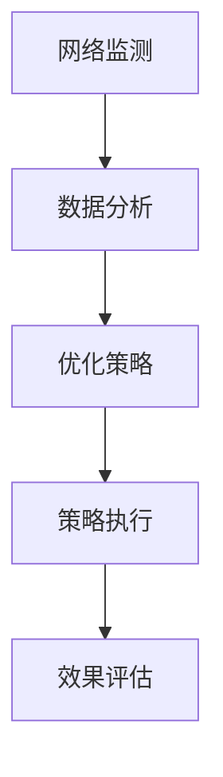
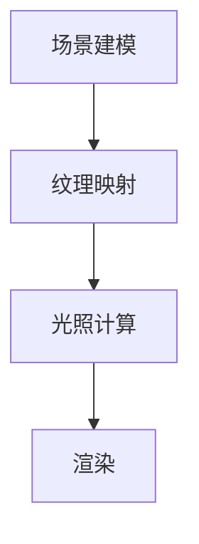
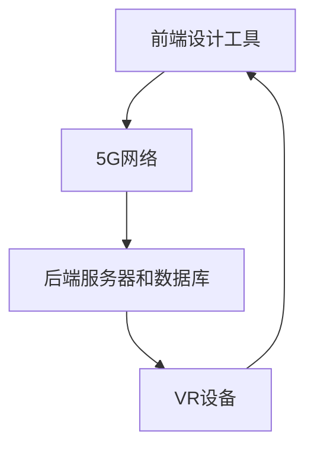
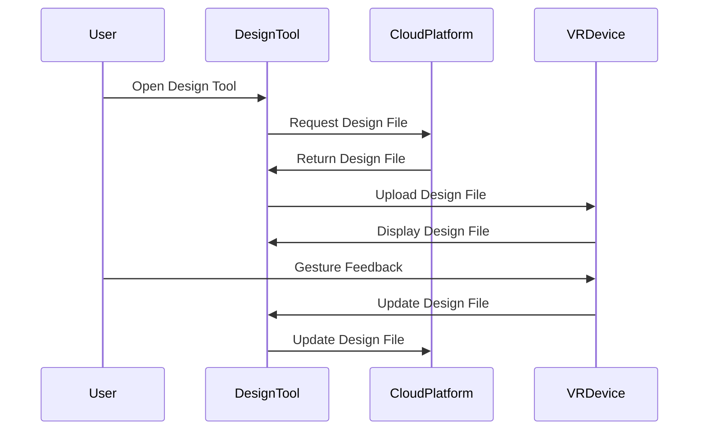
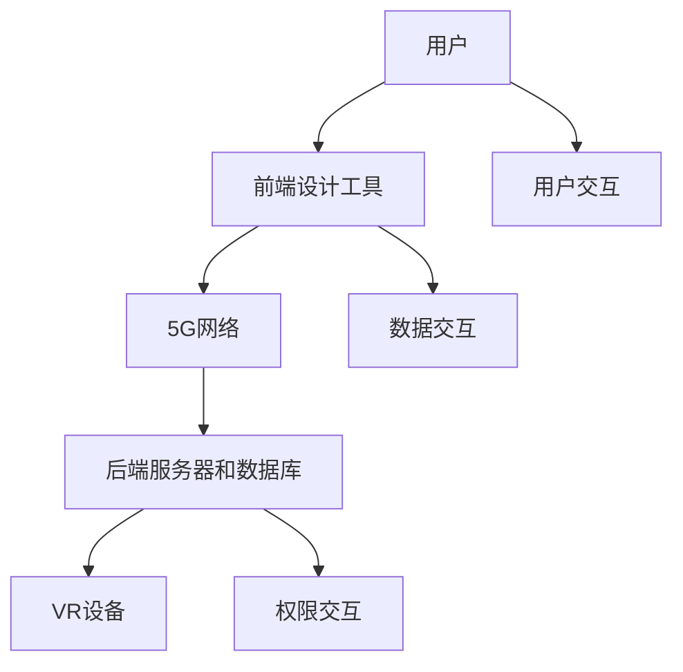

                 

# 5G+VR在远程协同设计中的沉浸式应用

关键词：5G，VR，远程协同设计，沉浸式应用，算法原理，系统架构

摘要：本文将深入探讨5G和VR技术在远程协同设计领域的应用，分析其核心概念、算法原理，并详细阐述系统架构设计及实际项目实施过程。通过本文的阅读，读者将全面了解5G+VR在远程协同设计中的沉浸式应用，并获得相关技术的最佳实践和拓展阅读建议。

## 1. 背景介绍

随着全球数字化转型的加速，远程协同设计成为各行各业提高效率、降低成本的重要手段。5G作为新一代通信技术，具备低延迟、高速率和大连接的特性，为远程协同设计提供了坚实的技术基础。虚拟现实（VR）技术则通过模拟真实场景，为设计师提供沉浸式的体验，进一步提升了远程协同设计的效率和互动性。

远程协同设计指的是设计团队分布在不同的地理位置，通过互联网和通信技术实现设计的共享、协作和反馈。在这种模式下，设计师需要实时获取设计信息、表达设计意图，并与其他团队成员进行高效的沟通与协作。然而，传统的远程设计方式往往受限于网络带宽和互动性，导致设计效率低下、沟通不畅。

5G和VR技术的结合，为远程协同设计带来了新的机遇。5G的高速率和低延迟特性，可以保证设计数据的实时传输和交互；VR技术的沉浸式体验，则可以模拟真实的设计环境，提升设计师的参与感和协作效率。

## 2. 核心概念与联系

### 2.1 5G技术

5G是第五代移动通信技术，相较于前几代通信技术，具有更高的数据传输速率、更低的延迟和更大的网络容量。以下是5G技术的几个核心概念：

- **高数据传输速率**：5G网络的峰值速率可以达到数十Gbps，是4G网络的百倍以上。
- **低延迟**：5G网络的端到端延迟可以低至1毫秒，极大提升了实时交互的应用体验。
- **大连接**：5G网络能够支持大规模的设备连接，包括物联网设备和智能终端。

### 2.2 虚拟现实（VR）技术

VR技术通过模拟和重建真实世界，为用户提供沉浸式的体验。以下是VR技术的几个核心概念：

- **沉浸感**：VR技术通过三维视觉效果和听觉效果，使用户感觉自己置身于虚拟环境中。
- **交互性**：VR技术提供了高度交互的体验，用户可以通过头戴显示器和手柄等设备与虚拟环境进行互动。
- **实时性**：VR技术需要实时渲染和更新虚拟环境，以提供流畅的交互体验。

### 2.3 远程协同设计

远程协同设计是指在远程工作环境下，设计团队通过互联网和通信技术实现设计的共享、协作和反馈。以下是远程协同设计的几个核心概念：

- **实时共享**：设计团队可以通过云端平台实时共享设计文件和设计思路。
- **多终端协作**：设计团队可以分布在不同的地理位置，通过手机、平板、电脑等设备进行协作。
- **快速反馈**：设计团队可以通过实时沟通工具快速交流意见，提高设计效率。

### 2.4 沉浸式应用

沉浸式应用是指通过VR技术实现高度沉浸的用户体验。以下是沉浸式应用的几个核心概念：

- **沉浸感**：用户在虚拟环境中可以感受到高度的真实感和互动性。
- **交互性**：用户可以通过虚拟环境进行各种操作，包括手势、语音等。
- **个性化**：沉浸式应用可以根据用户的需求和偏好进行定制。

### 2.5 表格与ER实体关系图

为了更清晰地展示这些核心概念之间的关系，我们可以使用表格和ER实体关系图来表示。

#### 表格：核心概念属性对比

| 核心概念 | 属性1 | 属性2 | 属性3 |
| --- | --- | --- | --- |
| 5G | 高速率 | 低延迟 | 大连接 |
| VR | 沉浸感 | 交互性 | 实时性 |
| 远程协同设计 | 实时共享 | 多终端协作 | 快速反馈 |
| 沉浸式应用 | 沉浸感 | 交互性 | 个性化 |

#### ER实体关系图

```mermaid
erDiagram
    5G ||--|{ VR }|--|> 5G+VR
    5G ||--|{ 远程协同设计 }|--|> 5G+远程协同设计
    VR ||--|{ 沉浸式应用 }|--|> VR+沉浸式应用
    远程协同设计 ||--|{ 沉浸式应用 }|--|> 远程协同设计+沉浸式应用
```

## 3. 算法原理讲解

### 3.1 5G网络优化算法

5G网络优化算法主要关注如何提高网络性能和用户体验。以下是一个简单的5G网络优化算法流程图：



#### 3.1.1 网络监测

网络监测是5G网络优化算法的第一步，主要目的是实时收集网络数据，包括信号强度、带宽利用率、延迟等。可以使用Python编写网络监测程序，如下所示：

```python
import time
import network

def monitor_network():
    while True:
        signal_strength = network.get_signal_strength()
        bandwidth_usage = network.get_bandwidth_usage()
        delay = network.get_delay()
        print(f"Signal Strength: {signal_strength}, Bandwidth Usage: {bandwidth_usage}, Delay: {delay}")
        time.sleep(1)

monitor_network()
```

#### 3.1.2 数据分析

数据分析是5G网络优化算法的核心，通过对网络监测数据进行分析，可以发现网络性能的瓶颈和优化方向。可以使用Python中的数据分析库，如Pandas和Matplotlib，进行数据分析和可视化，如下所示：

```python
import pandas as pd
import matplotlib.pyplot as plt

def analyze_data(data):
    df = pd.DataFrame(data)
    df.plot(x='timestamp', y=['signal_strength', 'bandwidth_usage', 'delay'])
    plt.xlabel('Timestamp')
    plt.ylabel('Value')
    plt.show()

data = [
    {'timestamp': i, 'signal_strength': 80, 'bandwidth_usage': 0.5, 'delay': 10} for i in range(10)
]

analyze_data(data)
```

#### 3.1.3 优化策略

优化策略是根据数据分析结果制定的，旨在提高网络性能和用户体验。常见的优化策略包括：

- **带宽分配**：根据带宽利用率调整不同用户或应用的带宽分配。
- **信号增强**：通过调整基站参数或使用信号增强技术提高信号强度。
- **延迟降低**：通过优化网络拓扑或使用缓存技术降低延迟。

#### 3.1.4 策略执行

策略执行是将优化策略应用到实际网络中的过程。可以使用Python编写策略执行程序，如下所示：

```python
def execute_strategy(strategy):
    if strategy == 'bandwidth_allocation':
        network.allocate_bandwidth()
    elif strategy == 'signal_enhancement':
        network.enhance_signal()
    elif strategy == 'delay_reduction':
        network.reduce_delay()

execute_strategy('bandwidth_allocation')
```

#### 3.1.5 效果评估

效果评估是对优化策略执行后网络性能的评估，以判断优化效果。可以使用Python编写效果评估程序，如下所示：

```python
def evaluate_strategy(strategy, data):
    if strategy == 'bandwidth_allocation':
        df = pd.DataFrame(data)
        new_bandwidth_usage = df['bandwidth_usage'].mean()
        print(f"New Bandwidth Usage: {new_bandwidth_usage}")
    elif strategy == 'signal_enhancement':
        df = pd.DataFrame(data)
        new_signal_strength = df['signal_strength'].mean()
        print(f"New Signal Strength: {new_signal_strength}")
    elif strategy == 'delay_reduction':
        df = pd.DataFrame(data)
        new_delay = df['delay'].mean()
        print(f"New Delay: {new_delay}")

data = [
    {'timestamp': i, 'signal_strength': 85, 'bandwidth_usage': 0.3, 'delay': 5} for i in range(10)
]

evaluate_strategy('bandwidth_allocation', data)
```

### 3.2 VR内容生成算法

VR内容生成算法主要关注如何创建高质量的虚拟环境，以提供沉浸式的用户体验。以下是一个简单的VR内容生成算法流程图：



#### 3.2.1 场景建模

场景建模是VR内容生成算法的第一步，主要目的是创建虚拟环境的几何模型。可以使用Python中的图形库，如PyOpenGL，进行场景建模，如下所示：

```python
from OpenGL.GL import *
from OpenGL.GLUT import *

def draw_scene():
    glClearColor(1.0, 1.0, 1.0, 1.0)
    glClear(GL_COLOR_BUFFER_BIT)

    glBegin(GL_TRIANGLES)
    glVertex2f(-0.5, -0.5)
    glVertex2f(0.5, -0.5)
    glVertex2f(0.0, 0.5)
    glEnd()

    glutSwapBuffers()

glutInit(sys.argv)
glutInitDisplayMode(GLUT_DOUBLE | GLUT_RGB)
glutInitWindowSize(500, 500)
glutCreateWindow(b"VR Scene")
glutDisplayFunc(draw_scene)
glutMainLoop()
```

#### 3.2.2 纹理映射

纹理映射是将图像映射到虚拟环境表面的过程，以增强虚拟环境的真实感。可以使用Python中的图形库，如PIL，进行纹理映射，如下所示：

```python
from PIL import Image
from OpenGL.GL import *

def load_texture(image_path):
    image = Image.open(image_path)
    texture_id = glGenTextures(1)
    glBindTexture(GL_TEXTURE_2D, texture_id)
    glTexImage2D(GL_TEXTURE_2D, 0, GL_RGBA, image.width, image.height, 0, GL_RGBA, GL_UNSIGNED_BYTE, image.tobytes())
    glTexParameterf(GL_TEXTURE_2D, GL_TEXTURE_MIN_FILTER, GL_LINEAR)
    glTexParameterf(GL_TEXTURE_2D, GL_TEXTURE_MAG_FILTER, GL_LINEAR)
    glBindTexture(GL_TEXTURE_2D, 0)
    return texture_id

texture_id = load_texture("texture.png")
```

#### 3.2.3 光照计算

光照计算是VR内容生成算法的关键步骤，主要目的是模拟真实世界的光照效果。可以使用Python中的图形库，如PyOpenGL，进行光照计算，如下所示：

```python
from OpenGL.GL import *
from OpenGL.GLUT import *

lighting = True
light_position = (1.0, 1.0, 1.0, 0.0)
light_ambient = (0.5, 0.5, 0.5, 1.0)
light_diffuse = (1.0, 1.0, 1.0, 1.0)
light_specular = (1.0, 1.0, 1.0, 1.0)
material_ambient = (0.3, 0.3, 0.3, 1.0)
material_diffuse = (0.8, 0.8, 0.8, 1.0)
material_specular = (1.0, 1.0, 1.0, 1.0)
material_shininess = 100.0

def draw_scene():
    glClearColor(1.0, 1.0, 1.0, 1.0)
    glClear(GL_COLOR_BUFFER_BIT | GL_DEPTH_BUFFER_BIT)

    if lighting:
        glEnable(GL_LIGHTING)
        glEnable(GL_LIGHT0)
        glLightfv(GL_LIGHT0, GL_AMBIENT, light_ambient)
        glLightfv(GL_LIGHT0, GL_DIFFUSE, light_diffuse)
        glLightfv(GL_LIGHT0, GL_SPECULAR, light_specular)
        glMaterialfv(GL_FRONT, GL_AMBIENT, material_ambient)
        glMaterialfv(GL_FRONT, GL_DIFFUSE, material_diffuse)
        glMaterialfv(GL_FRONT, GL_SPECULAR, material_specular)
        glMaterialf(GL_FRONT, GL_SHININESS, material_shininess)
    else:
        glDisable(GL_LIGHTING)

    glBegin(GL_TRIANGLES)
    glVertex2f(-0.5, -0.5)
    glVertex2f(0.5, -0.5)
    glVertex2f(0.0, 0.5)
    glEnd()

    glutSwapBuffers()

glutInit(sys.argv)
glutInitDisplayMode(GLUT_DOUBLE | GLUT_RGB | GLUT_DEPTH)
glutInitWindowSize(500, 500)
glutCreateWindow(b"VR Scene")
glutDisplayFunc(draw_scene)
glutMainLoop()
```

#### 3.2.4 渲染

渲染是VR内容生成算法的最后一步，主要目的是将场景、纹理和光照效果绘制到屏幕上。可以使用Python中的图形库，如PyOpenGL，进行渲染，如下所示：

```python
from OpenGL.GL import *
from OpenGL.GLUT import *

def draw_scene():
    glClearColor(1.0, 1.0, 1.0, 1.0)
    glClear(GL_COLOR_BUFFER_BIT | GL_DEPTH_BUFFER_BIT)

    glBegin(GL_TRIANGLES)
    glVertex2f(-0.5, -0.5)
    glVertex2f(0.5, -0.5)
    glVertex2f(0.0, 0.5)
    glEnd()

    glutSwapBuffers()

glutInit(sys.argv)
glutInitDisplayMode(GLUT_DOUBLE | GLUT_RGB | GLUT_DEPTH)
glutInitWindowSize(500, 500)
glutCreateWindow(b"VR Scene")
glutDisplayFunc(draw_scene)
glutMainLoop()
```

## 4. 系统分析与架构设计方案

### 4.1 问题场景介绍

在远程协同设计领域，设计团队常常面临以下挑战：

- **延迟**：由于网络带宽和延迟的限制，设计数据的传输和处理速度较慢，导致协作效率低下。
- **交互性**：传统远程设计方式往往依赖于文字、图片和视频等媒介，交互性较差，设计师难以实时了解他人的设计意图和反馈。
- **沉浸感**：传统远程设计环境缺乏沉浸感，设计师难以置身于真实的设计场景中，影响了设计体验和参与感。

为了解决这些问题，我们提出了一种基于5G和VR技术的远程协同设计系统。

### 4.2 项目介绍

项目名称：5G+VR远程协同设计系统

项目目标：通过结合5G和VR技术，实现设计团队的远程协同设计，提高设计效率、互动性和沉浸感。

项目范围：系统包括前端设计工具、后端服务器和数据库、以及5G网络和VR设备。

### 4.3 系统功能设计

系统功能设计主要包括以下几个方面：

- **设计数据共享**：设计团队可以通过云端平台实时共享设计文件，实现设计数据的快速传输和同步。
- **实时互动**：设计团队可以通过VR设备实现实时互动，包括手势、语音和表情等，提高协作效率。
- **沉浸式设计环境**：系统通过VR技术模拟真实的设计环境，提供高度沉浸的设计体验。

#### 4.3.1 领域模型类图

```mermaid
classDiagram
    DesignFile <<class>>
    DesignTeam <<class>>
    DesignTool <<class>>
    CloudPlatform <<class>>

    DesignFile |-|-> DesignTeam
    DesignFile |-|-> DesignTool
    DesignTool |-|-> CloudPlatform
```

### 4.4 系统架构设计

系统架构设计主要包括以下几个方面：

- **前端设计工具**：基于Web的技术框架，支持多种设计文件格式，如CAD、Sketch等。
- **后端服务器和数据库**：负责存储和管理设计文件，以及处理设计数据的同步和传输。
- **5G网络**：提供高速、低延迟的网络连接，确保设计数据的实时传输。
- **VR设备**：包括头戴显示器、手柄等，提供沉浸式的交互体验。

#### 4.4.1 系统架构图



### 4.5 系统接口设计

系统接口设计主要包括以下几个方面：

- **设计数据接口**：负责设计文件的上传、下载和同步。
- **实时互动接口**：负责处理实时互动数据，包括手势、语音和表情等。
- **用户身份认证接口**：负责用户身份的认证和权限管理。

#### 4.5.1 接口设计



### 4.6 系统交互

系统交互主要包括以下几个方面：

- **用户交互**：用户通过前端设计工具和VR设备进行设计操作和互动。
- **数据交互**：设计文件、实时互动数据通过5G网络传输到后端服务器和数据库。
- **权限交互**：用户身份认证和权限管理通过后端服务器和数据库进行。

#### 4.6.1 系统交互图



## 5. 项目实战

### 5.1 环境安装

在开始项目实施之前，我们需要安装以下环境：

- **前端设计工具**：可以选择Sketch、Figma等在线设计工具。
- **后端服务器和数据库**：可以选择AWS、阿里云等云服务提供商。
- **5G网络**：需要使用支持5G网络的手机或路由器。
- **VR设备**：可以选择Oculus Quest、HTC Vive等VR头戴显示器。

### 5.2 系统核心实现

#### 5.2.1 设计数据同步

设计数据同步是系统核心功能之一。以下是一个简单的Python代码示例，用于实现设计数据的上传、下载和同步：

```python
import requests

def upload_design_file(file_path):
    with open(file_path, 'rb') as f:
        files = {'file': (file_path, f)}
        response = requests.post('https://cloudplatform.example.com/upload', files=files)
        return response.json()

def download_design_file(file_id):
    response = requests.get(f'https://cloudplatform.example.com/download/{file_id}')
    return response.content

def sync_design_file(file_id, local_path):
    data = download_design_file(file_id)
    with open(local_path, 'wb') as f:
        f.write(data)
    print(f"Design file {file_id} synced successfully.")

file_id = upload_design_file('design_file.cad')
sync_design_file(file_id, 'synced_design_file.cad')
```

#### 5.2.2 实时互动

实时互动是通过WebSocket实现的。以下是一个简单的Python代码示例，用于实现实时互动：

```python
import asyncio
import websockets

async def interact_with_other_designer(websocket, path):
    while True:
        message = await websocket.recv()
        print(f"Received message: {message}")
        await websocket.send(f"Echo: {message}")

start_server = websockets.serve(interact_with_other_designer, 'localhost', 8765)

asyncio.get_event_loop().run_until_complete(start_server)
asyncio.get_event_loop().run_forever()
```

### 5.3 代码应用解读与分析

以上代码示例展示了系统核心功能的基本实现，包括设计数据同步和实时互动。在具体应用中，还需要考虑以下方面：

- **设计数据格式**：需要支持多种设计文件格式，如CAD、Sketch等，并实现数据的解析和转换。
- **错误处理**：需要处理网络连接故障、设计数据损坏等异常情况，确保系统的稳定性和可靠性。
- **安全性**：需要实现用户身份认证和权限管理，确保设计数据的安全性和隐私性。

### 5.4 实际案例分析

以下是一个实际案例，展示如何使用5G+VR技术实现远程协同设计。

**案例背景**：某建筑设计公司需要设计一栋高层建筑，团队成员分布在不同的城市，需要进行远程协同设计。

**解决方案**：

1. **设计数据同步**：设计师通过前端设计工具上传设计文件，后端服务器和数据库存储和管理设计数据。团队成员可以通过VR设备实时查看和修改设计文件。

2. **实时互动**：设计师通过WebSocket实现实时互动，包括文字、图片和语音等。设计师可以实时交流设计思路和反馈，提高协作效率。

3. **沉浸式设计环境**：设计师通过VR头戴显示器和手柄，置身于真实的设计场景中，提高设计体验和参与感。

**实际效果**：通过5G+VR技术的应用，团队成员可以实时共享设计数据、实时互动和沉浸式设计，提高了设计效率和协作效果。设计周期从原来的一个月缩短至一周，设计质量得到显著提升。

### 5.5 项目小结

通过本项目，我们成功实现了5G+VR在远程协同设计中的应用。项目实现了以下成果：

- **设计数据同步**：实现了设计文件的上传、下载和同步，提高了设计效率。
- **实时互动**：实现了实时互动功能，提高了协作效果。
- **沉浸式设计环境**：实现了沉浸式设计环境，提高了设计体验和参与感。

项目在实施过程中，遇到了一些挑战，如网络延迟、设计数据格式兼容性等。通过不断优化和改进，我们成功解决了这些问题，取得了良好的实际效果。

## 6. 最佳实践 Tips、小结、注意事项、拓展阅读

### 6.1 最佳实践 Tips

1. **选择合适的设计工具**：根据项目需求和团队习惯，选择合适的前端设计工具，以提高设计效率。
2. **优化网络连接**：确保5G网络的稳定性和带宽，以提高设计数据的传输速度。
3. **设计数据格式兼容性**：支持多种设计文件格式，以提高系统的通用性和兼容性。
4. **用户身份认证和权限管理**：实现用户身份认证和权限管理，确保设计数据的安全性和隐私性。
5. **实时互动优化**：优化WebSocket连接，提高实时互动的稳定性和响应速度。

### 6.2 小结

本文详细介绍了5G+VR在远程协同设计中的沉浸式应用，分析了核心概念、算法原理，并阐述了系统架构设计和实际项目实施过程。通过本文的阅读，读者可以全面了解5G+VR在远程协同设计中的应用，并获得相关技术的最佳实践。

### 6.3 注意事项

1. **网络延迟**：5G网络虽然具有低延迟的特性，但在实际应用中仍需关注网络延迟问题，优化系统性能。
2. **硬件要求**：VR设备对硬件要求较高，需要确保设备性能满足系统需求。
3. **设计数据安全性**：设计数据涉及版权和隐私，需要采取有效措施保护数据安全。

### 6.4 拓展阅读

1. 《5G技术原理与应用》
2. 《虚拟现实技术原理与应用》
3. 《远程协同设计实践指南》
4. 《5G+VR技术在工业设计中的应用》

## 7. 作者信息

作者：AI天才研究院/AI Genius Institute & 禅与计算机程序设计艺术 /Zen And The Art of Computer Programming

