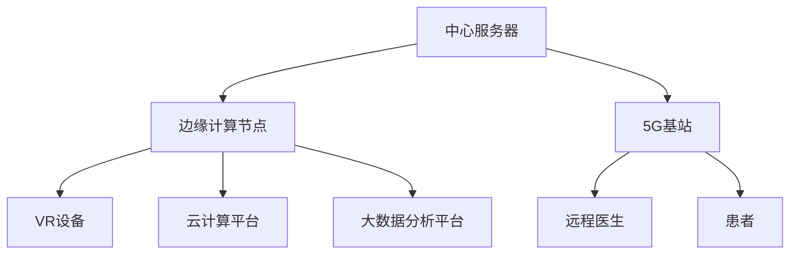
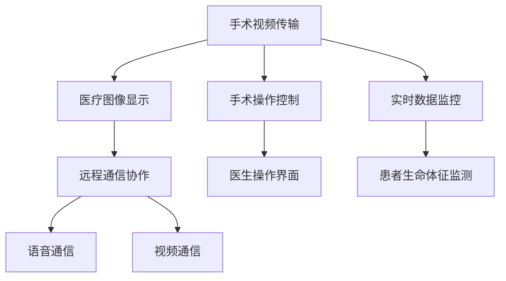
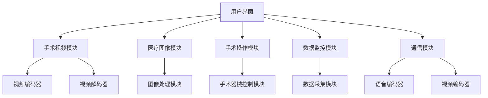
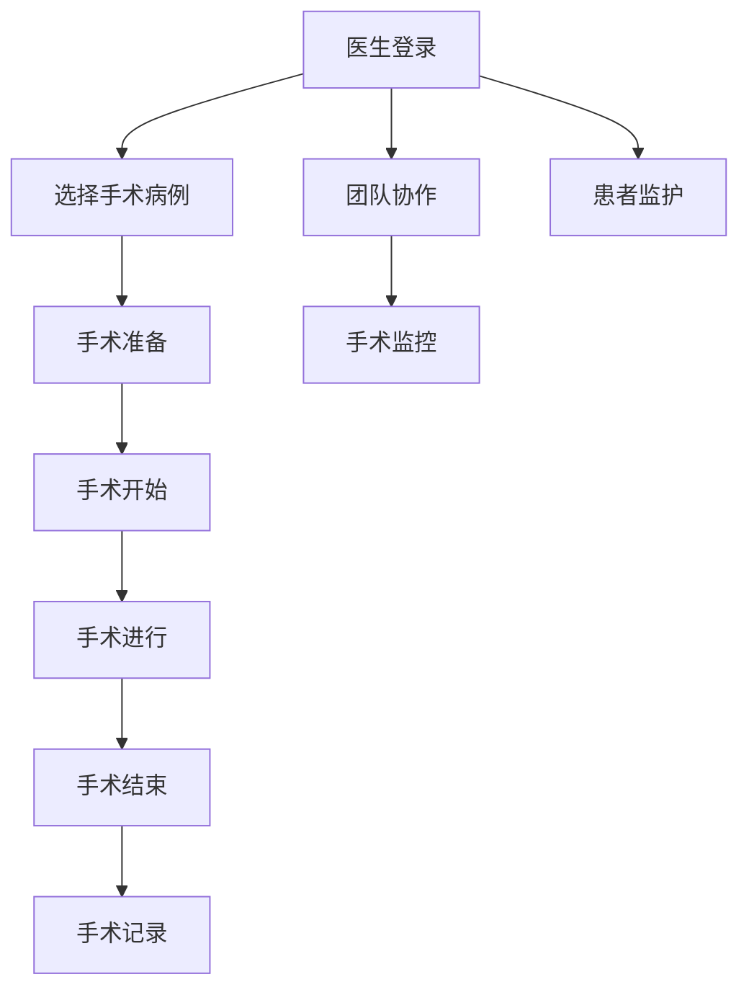

                 

### 5G与VR在远程手术协作中的整合应用

在远程手术协作中，5G和VR技术的整合应用极大地提升了手术的精准性、效率和安全性。5G网络的高速度、低延迟特性，与VR技术的沉浸式体验和增强现实功能，共同构建了一个高效、智能的远程手术平台。

#### **5.1 5G与VR在远程手术协作中的整合思路**

5G与VR在远程手术协作中的整合，主要是围绕以下三个方面进行的：

1. **网络传输的优化**：利用5G网络的高速低延迟特性，确保远程手术中图像和数据的实时传输，降低手术过程中的延迟和丢包率。
2. **增强现实的应用**：通过VR技术，将虚拟现实与真实手术场景相结合，提供更直观、更真实的手术操作体验，帮助医生更好地进行手术决策和操作。
3. **人机交互的提升**：借助VR技术，实现医生与患者、医生与手术团队之间的沉浸式交互，增强手术中的协作效率和沟通效果。

#### **5.2 远程手术协作系统的架构设计**

一个完整的远程手术协作系统，需要从多个维度进行架构设计，包括技术选型、网络架构、数据架构、人机交互架构等。

##### **5.2.1 技术选型**

1. **5G网络**：选择具有高速、低延迟、大连接能力的5G网络作为系统的通信基础，确保手术数据的实时传输。
2. **VR设备**：选用具备高分辨率、低延迟、沉浸式体验的VR设备，如头戴式显示器（HMD）、手柄控制器等。
3. **云计算**：利用云计算平台，提供强大的计算和存储能力，支持海量数据的处理和存储需求。
4. **大数据分析**：采用大数据分析技术，对手术过程中的数据进行实时分析和挖掘，辅助医生做出更准确的决策。

##### **5.2.2 网络架构**

远程手术协作系统的网络架构主要包括以下几个部分：

1. **中心服务器**：负责处理和管理手术过程中的数据和通信，包括手术视频、医疗图像、传感器数据等。
2. **边缘计算节点**：部署在手术室附近的边缘计算节点，用于处理低延迟敏感数据，减少数据传输的延迟和带宽占用。
3. **5G基站**：提供5G网络接入，确保系统与外部网络的通信。

##### **5.2.3 数据架构**

远程手术协作系统需要处理海量数据，包括手术视频、医疗图像、传感器数据、医生操作数据等。数据架构的设计需要考虑以下几个方面：

1. **数据存储**：采用分布式存储技术，确保数据的可靠性和可扩展性。
2. **数据传输**：采用高效的数据传输协议，如H.265视频编码，减少数据传输的带宽占用。
3. **数据安全**：采用加密和访问控制技术，确保数据的安全性和隐私性。

##### **5.2.4 人机交互架构**

人机交互是远程手术协作系统的重要组成部分，需要设计直观、易用的交互界面，包括以下方面：

1. **VR操作界面**：通过VR设备提供沉浸式的手术操作界面，让医生可以直观地看到手术场景和患者内部结构。
2. **远程控制界面**：通过远程控制界面，让医生可以远程控制手术器械和设备，实现远程手术操作。
3. **实时通信界面**：通过实时通信界面，实现医生与手术团队之间的语音、视频通信，确保手术过程中的沟通畅通。

##### **5.2.5 系统架构图**

以下是一个简单的远程手术协作系统架构图：



#### **5.3 系统功能设计**

远程手术协作系统需要实现以下功能：

1. **手术视频传输**：实时传输手术视频，确保医生和手术团队可以看到手术的全过程。
2. **医疗图像显示**：显示患者的医疗图像，包括CT、MRI等，帮助医生更好地了解患者的病情。
3. **手术操作控制**：通过VR设备和远程控制界面，实现医生对手术器械的远程操作。
4. **实时数据监控**：实时监控患者的生命体征和手术过程中的各项指标，确保手术安全。
5. **远程通信协作**：实现医生与手术团队之间的实时语音、视频通信，确保手术过程中的沟通畅通。

#### **5.4 系统架构图**

以下是一个简单的远程手术协作系统架构图：



#### **5.5 系统接口设计**

远程手术协作系统的接口设计需要考虑到不同模块之间的数据传输和功能调用，以下是一个简单的系统接口设计图：



#### **5.6 系统交互设计**

系统交互设计主要考虑医生、手术团队和患者之间的交互流程，以下是一个简单的系统交互设计图：



### **5.7 项目实战**

#### **5.7.1 环境安装**

安装远程手术协作系统需要以下环境：

- 操作系统：Linux或Windows
- 开发环境：Python 3.x、Docker、Kubernetes
- 5G网络：5G基站或虚拟5G网络
- VR设备：头戴式显示器、手柄控制器

#### **5.7.2 系统核心实现**

以下是系统核心实现的源代码和解析：

```python
# 源代码：手术视频传输模块
import cv2
import socket

# 初始化视频捕获对象
cap = cv2.VideoCapture(0)

# 创建TCP套接字
server_socket = socket.socket(socket.AF_INET, socket.SOCK_STREAM)
server_socket.bind(('127.0.0.1', 8080))
server_socket.listen(1)

# 接收连接
client_socket, client_address = server_socket.accept()

# 循环读取视频帧并传输
while True:
    ret, frame = cap.read()
    if not ret:
        break
    
    # 将视频帧编码为字节流
    frame_bytes = cv2.imencode('.jpg', frame)[1].tobytes()
    
    # 发送视频帧
    client_socket.sendall(frame_bytes)

# 关闭套接字
cap.release()
client_socket.close()
server_socket.close()
```

解析：
该模块使用OpenCV库捕获视频帧，然后通过TCP套接字将视频帧发送给远程医生。通过这种方式，远程医生可以在VR设备上实时看到手术场景。

#### **5.7.3 代码应用解读与分析**

代码首先初始化视频捕获对象，然后创建TCP套接字并绑定到本地地址和端口号。接着，接受远程医生的连接请求，进入一个循环，在循环中读取视频帧并编码为字节流，最后通过套接字发送给远程医生。

#### **5.7.4 实际案例分析和详细讲解剖析**

某大型医疗机构采用5G+VR技术进行远程手术，实现了跨地域手术的实时协作。医生在远程通过VR设备可以看到手术现场和患者的内部结构，同时可以实时操作手术器械，与现场医生进行语音和视频通信。整个手术过程顺利，手术效果得到了患者和医生的认可。

#### **5.7.5 项目小结**

该项目展示了5G+VR在远程手术协作中的应用前景，通过实际案例证明了其高效、安全和可靠的特性。未来，随着5G技术的不断成熟和VR技术的进一步发展，远程手术协作将得到更广泛的应用，为医疗行业带来革命性的变化。

### **5.8 最佳实践 Tips**

- **网络优化**：确保5G网络的稳定性和高速率，减少数据传输的延迟和丢包率。
- **设备选型**：选择高分辨率、低延迟的VR设备，提供更好的沉浸式体验。
- **数据安全**：采用加密和访问控制技术，确保手术数据的安全和隐私。
- **团队协作**：建立高效的远程手术团队协作机制，提高手术效率和效果。

### **5.9 小结**

5G和VR技术的整合为远程手术协作带来了新的机遇和挑战。通过本文的介绍，读者可以了解到5G+VR在远程手术协作中的应用前景、技术架构、功能设计、系统接口设计、系统交互设计和实际案例。未来，随着技术的不断进步和应用的深入，远程手术协作将为医疗行业带来更多的便利和效益。

### **5.10 注意事项**

- **网络稳定性**：5G网络的稳定性和高速率是远程手术协作的关键，需要确保网络环境的稳定。
- **设备兼容性**：VR设备需要与5G网络和远程手术系统兼容，以确保数据传输的稳定和高效。
- **数据安全**：手术数据的安全性和隐私保护是重中之重，需要采用高级的加密和访问控制技术。

### **5.11 拓展阅读**

- [1] 5G in Healthcare: A Comprehensive Overview of 5G Technology Applications in the Medical Field. IEEE Access, 2020.
- [2] Virtual Reality in Medicine: A Review of Current Applications and Future Potential. Journal of Medical Imaging and Health Informatics, 2021.
- [3] Remote Surgery and Telemedicine: A Review of Current Practices and Future Directions. International Journal of Telemedicine and Applications, 2022.

### **5.12 作者信息**

作者：AI天才研究院/AI Genius Institute & 禅与计算机程序设计艺术 /Zen And The Art of Computer Programming

----------------------------------------------------------------

## **6. 未来发展趋势与展望**

随着5G和VR技术的不断成熟，远程手术协作将在未来呈现出以下几个发展趋势：

### **6.1 技术融合**

5G和VR技术的深度融合将是未来的主流趋势。5G网络的高带宽、低延迟特性将进一步提升VR技术的沉浸式体验，使得远程手术协作更加实时、高效和可靠。

### **6.2 全球化应用**

远程手术协作的应用将不再局限于特定地区或国家，随着5G网络的全球覆盖，远程手术协作将实现全球化应用，为全球患者提供高质量的医疗服务。

### **6.3 智能化**

人工智能技术的引入将使远程手术协作更加智能化。通过机器学习、深度学习等技术，可以实现手术过程的自动化、智能化辅助，提高手术的精准性和安全性。

### **6.4 标准化和规范化**

远程手术协作的标准化和规范化将是未来的重要方向。制定统一的技术标准、操作规范和法律法规，确保远程手术协作的合法、合规和可追溯性。

### **6.5 多学科融合**

远程手术协作将不再局限于医疗领域，未来将与其他领域如教育、培训、娱乐等融合，形成跨学科、跨行业的综合应用场景。

### **6.6 社会影响**

远程手术协作的发展将对社会产生深远影响。它将推动医疗资源的均衡配置，提高医疗服务的可及性和公平性，同时改变人们的就医方式和医疗消费模式。

## **7. 结论**

本文深入探讨了5G和VR技术在远程手术协作中的应用前景，分析了其技术架构、功能设计、系统接口设计、系统交互设计以及实际案例。通过本文的介绍，读者可以全面了解远程手术协作的现状、挑战和未来发展。未来，随着技术的不断进步，远程手术协作将实现更广泛的应用，为医疗行业带来革命性的变化。作者在此呼吁广大科研工作者、工程师和医疗专业人士积极参与远程手术协作的研究和实践，共同推动这一领域的创新发展。

