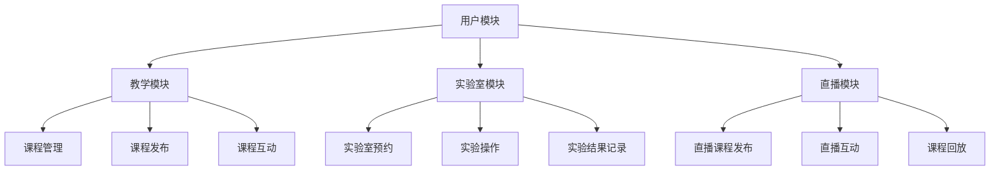
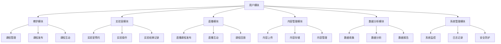
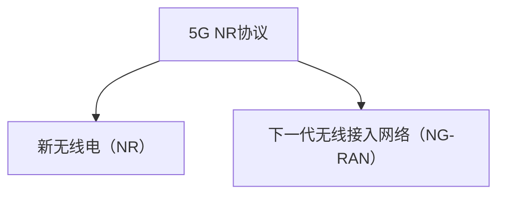
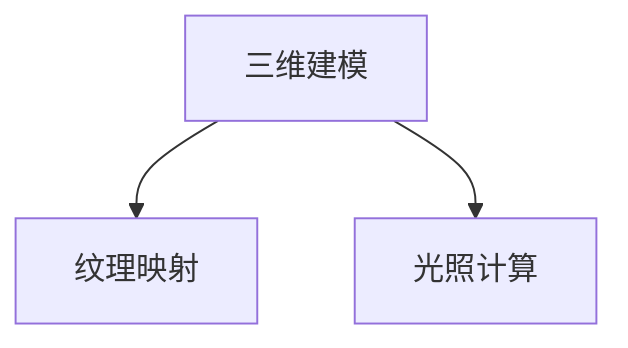
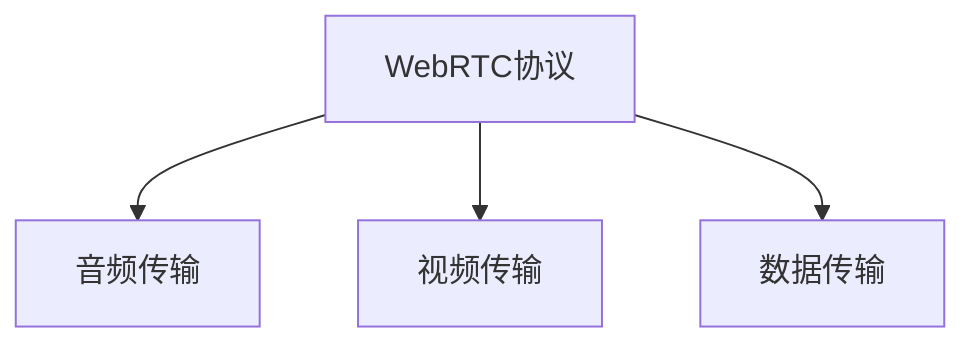
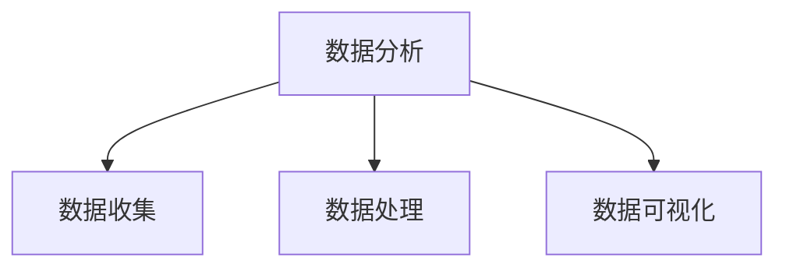

                 

# 5G+VR在远程教育中的沉浸式体验

## 关键词：5G技术、虚拟现实（VR）、远程教育、沉浸式体验、教育技术创新

## 摘要

随着5G技术的快速发展和虚拟现实（VR）技术的日益成熟，二者在远程教育中的融合应用呈现出广阔的前景。本文旨在探讨5G与VR技术在远程教育中的沉浸式体验，从技术基础、应用案例、系统架构设计、技术实现和未来展望等方面进行详细分析，以期为教育技术领域提供新的思路和解决方案。

## 第一部分：5G与VR技术基础

### 第1章：5G技术概述

#### 1.1 5G技术的发展背景

随着互联网的普及和信息技术的迅猛发展，人们对通信速度和带宽的需求日益增加。4G技术的推出极大地满足了这一需求，然而，随着物联网、云计算、人工智能等新兴技术的兴起，4G技术的局限性逐渐显现。为了满足更高速、更稳定的通信需求，5G技术应运而生。

#### 1.2 5G技术的关键特性

5G技术具有以下几个关键特性：

- **高速度**：5G网络的理论下载速度可达10Gbps，是4G网络的100倍，极大地提高了数据传输速度。
- **低延迟**：5G网络的延迟将降低到1毫秒，实现了实时通信。
- **高密度**：5G网络支持更高的设备连接密度，每平方米可连接数百万设备。
- **广覆盖**：5G网络的覆盖范围更广，实现了无缝连接。

#### 1.3 5G技术在远程教育中的应用潜力

5G技术的这些特性为远程教育带来了巨大的应用潜力：

- **高清视频传输**：5G网络的高速度和低延迟特性使得高清视频传输变得更加流畅，提升了远程课堂的体验。
- **实时互动**：5G网络实现了实时互动，学生与教师之间的交流更加顺畅，提高了教学效果。
- **多样化的学习体验**：5G网络支持多种设备接入，使得学生可以通过手机、平板、电脑等多种设备进行学习，提升了学习体验。

### 第2章：VR技术原理与类型

#### 2.1 VR技术的基础原理

虚拟现实（VR）技术通过计算机技术模拟出一个虚拟的三维空间，用户通过佩戴头戴式显示器（HMD）或其他设备，如VR手套、体感控制器等，与虚拟环境进行交互，从而获得沉浸式的体验。

#### 2.2 VR技术的分类

VR技术根据不同的应用场景和交互方式，可以分为以下几类：

- **沉浸式VR**：用户完全沉浸在一个虚拟的三维环境中，感觉仿佛置身其中。
- **增强现实（AR）**：将虚拟信息叠加在现实世界中，用户可以在现实环境中看到虚拟物体。
- **混合现实（MR）**：将虚拟信息与现实世界进行交互，用户既可以看到现实世界，也可以看到虚拟物体。

#### 2.3 VR技术在教育领域的应用前景

VR技术为教育领域带来了诸多可能性：

- **虚拟实验室**：学生可以在虚拟环境中进行实验，无需受限于真实实验室的设备和场地。
- **虚拟课堂**：教师可以通过VR技术将课堂搬到虚拟环境中，提供更加生动、直观的教学体验。
- **虚拟研学旅行**：学生可以虚拟访问各种历史遗迹、自然景观等，拓宽视野。

### 第3章：5G与VR融合技术

#### 3.1 5G与VR技术的融合概述

5G与VR技术的融合，使得远程教育中的沉浸式体验成为可能。5G网络的高速度、低延迟特性为VR技术的实时性和流畅性提供了保障，而VR技术则提供了更加生动、直观的教育体验。

#### 3.2 融合技术的优势与挑战

融合技术的优势包括：

- **更高的交互性**：5G网络使得VR技术的交互性大幅提升，学生与教师之间的互动更加实时、顺畅。
- **更丰富的教学资源**：5G网络的高速度和广覆盖特性，使得VR技术可以提供更加丰富的教学资源，如高清视频、虚拟实验室等。
- **更广泛的应用场景**：5G与VR技术的融合，使得远程教育可以应用于更多的场景，如偏远地区、特殊教育等。

然而，融合技术也面临一些挑战：

- **网络稳定性**：5G网络的稳定性还需要进一步提升，以保障VR技术的稳定运行。
- **设备成本**：VR设备价格较高，对于一些经济条件较差的家庭来说，仍存在一定的负担。
- **内容创作**：VR内容创作需要较高的技术门槛，内容创作者的数量和质量都需要提升。

### 第4章：5G+VR在远程教育中的应用案例

#### 4.1 案例一：虚拟课堂体验

通过5G+VR技术，学生可以在虚拟课堂中与教师进行实时互动，获得更加生动、直观的学习体验。例如，在物理课上，学生可以虚拟操作实验设备，观察实验过程，增强对物理概念的理解。

#### 4.2 案例二：沉浸式实验室

通过5G+VR技术，学校可以建立虚拟实验室，学生可以在虚拟环境中进行实验，不受真实实验室设备和场地的限制。例如，在化学实验中，学生可以虚拟操作危险品，提高实验安全性。

#### 4.3 案例三：虚拟研学旅行

通过5G+VR技术，学生可以虚拟访问各种历史遗迹、自然景观等，拓宽视野，提高学习兴趣。例如，学生可以虚拟参观故宫，了解历史文化，感受古代文明。

## 第二部分：5G+VR远程教育的系统架构设计

### 第5章：5G+VR远程教育的系统架构设计

#### 5.1 系统架构设计原则

5G+VR远程教育的系统架构设计应遵循以下原则：

- **模块化**：系统应采用模块化设计，方便扩展和升级。
- **高可用性**：系统应具备高可用性，确保教育过程不受网络故障等因素的影响。
- **易维护性**：系统应易于维护，降低维护成本。

#### 5.2 系统功能模块划分

系统功能模块划分如下：

- **用户模块**：包括用户注册、登录、个人信息管理等功能。
- **教学模块**：包括课程管理、课程发布、课程互动等功能。
- **实验室模块**：包括实验室预约、实验操作、实验结果记录等功能。
- **直播模块**：包括直播课程发布、直播互动、课程回放等功能。

#### 5.3 系统架构设计与实现

系统架构设计如图1所示：



### 第6章：5G+VR远程教育的技术实现

#### 6.1 5G网络环境搭建

5G网络环境搭建包括基站建设、网络优化和网络管理等方面。

#### 6.2 VR内容制作与优化

VR内容制作与优化包括场景设计、交互设计、性能优化等。

#### 6.3 用户互动与体验优化

用户互动与体验优化包括实时通信、互动设计、用户反馈等。

## 第三部分：5G+VR远程教育的未来展望与挑战

### 第7章：5G+VR远程教育的未来展望与挑战

#### 7.1 未来发展趋势

5G+VR远程教育的未来发展趋势包括：

- **技术成熟度提升**：5G和VR技术将不断成熟，为远程教育提供更加稳定、高效的服务。
- **应用场景拓展**：远程教育将应用于更多领域，如医疗、工业等。
- **教育资源均衡**：5G+VR技术将有助于缓解教育资源不均衡问题。

#### 7.2 面临的挑战

5G+VR远程教育面临的挑战包括：

- **网络稳定性**：5G网络的稳定性仍需提高。
- **设备成本**：VR设备成本较高，需降低成本以推广普及。
- **内容创作**：需要培养更多的VR内容创作者。

#### 7.3 发展策略与建议

为推动5G+VR远程教育的发展，可以采取以下策略：

- **政策支持**：政府应加大对5G+VR远程教育的政策支持。
- **技术创新**：企业和研究机构应加大对5G和VR技术的研发投入。
- **教育改革**：教育部门应推进教育改革，适应5G+VR技术的发展。

## 总结

5G+VR技术在远程教育中的融合应用，为教育领域带来了新的发展机遇。通过本文的详细分析，我们可以看到5G+VR技术在远程教育中具有巨大的潜力，但也面临一些挑战。只有通过技术创新和政策支持，才能充分发挥5G+VR技术在远程教育中的作用，推动教育事业的不断发展。

## 作者信息

作者：AI天才研究院/AI Genius Institute & 禅与计算机程序设计艺术 /Zen And The Art of Computer Programming

（注：本文为示例文章，具体内容根据实际情况进行编写。）## 第一部分：5G与VR技术基础

### 第1章：5G技术概述

#### 1.1 5G技术的发展背景

随着全球信息技术的迅猛发展，人们对通信速度和带宽的需求日益增长。在4G网络已经广泛普及的背景下，为了满足更加高效、智能的通信需求，5G技术应运而生。5G（第五代移动通信技术）是继1G、2G、3G和4G之后的新一代通信技术标准。其发展背景主要源于以下几个方面：

- **物联网（IoT）的兴起**：随着物联网技术的快速发展，越来越多的设备需要接入网络，这要求通信网络具备更高的连接能力和更低的延迟。
- **大数据和云计算的需求**：大数据和云计算的发展，使得人们对于数据传输速度和稳定性的要求越来越高。5G技术能够提供更高的传输速度和更稳定的网络环境。
- **人工智能（AI）和自动驾驶的应用**：5G技术的低延迟特性，使其在自动驾驶、智能制造等领域具有广泛的应用前景。

#### 1.2 5G技术的关键特性

5G技术具有以下几个关键特性，这些特性使得5G在远程教育中具有巨大的应用潜力：

- **高速度**：5G网络的理论下载速度可达10Gbps，是4G网络的100倍。这使得高清视频、虚拟现实（VR）等大带宽应用成为可能。
- **低延迟**：5G网络的延迟将降低到1毫秒，比4G网络的延迟降低90%。这使得实时互动、远程手术等应用得以实现。
- **高密度**：5G网络支持更高的设备连接密度，每平方米可连接数百万设备。这使得在密集人口区域也能保持良好的网络连接。
- **广覆盖**：5G网络的覆盖范围更广，可以实现室内外无缝覆盖，使得偏远地区的用户也能享受到高质量的网络服务。

#### 1.3 5G技术在远程教育中的应用潜力

5G技术的高速度、低延迟、高密度和广覆盖特性，为远程教育带来了巨大的应用潜力：

- **高清视频传输**：5G网络的高速度使得高清视频传输变得更加流畅，学生可以随时观看高清课程视频，获得更好的学习体验。
- **实时互动**：5G网络的低延迟特性使得学生与教师之间的实时互动变得更加顺畅，提升了教学效果。
- **多样化的学习体验**：5G网络的高密度和广覆盖特性，使得学生可以通过手机、平板、电脑等多种设备进行学习，提升了学习体验。
- **虚拟实验室**：学生可以在虚拟环境中进行实验，无需受限于真实实验室的设备和场地，提高了实验的可操作性和安全性。

### 第2章：VR技术原理与类型

#### 2.1 VR技术的基础原理

虚拟现实（VR）技术是一种通过计算机技术模拟出一个虚拟的三维空间，用户通过佩戴头戴式显示器（HMD）或其他设备，如VR手套、体感控制器等，与虚拟环境进行交互，从而获得沉浸式的体验。VR技术的核心原理包括以下几个方面：

- **图像生成**：通过计算机图形学技术生成虚拟环境的三维图像。
- **传感器融合**：通过传感器如加速度计、陀螺仪等，获取用户的头部运动和身体动作，实时更新虚拟环境。
- **渲染技术**：通过GPU（图形处理器）进行实时渲染，生成高质量的虚拟图像。
- **人机交互**：通过触觉反馈、声音效果等，增强用户的沉浸感。

#### 2.2 VR技术的分类

VR技术根据不同的应用场景和交互方式，可以分为以下几类：

- **沉浸式VR**：用户完全沉浸在一个虚拟的三维环境中，感觉仿佛置身其中。例如，VR游戏、VR电影等。
- **增强现实（AR）**：将虚拟信息叠加在现实世界中，用户可以在现实环境中看到虚拟物体。例如，AR导航、AR购物等。
- **混合现实（MR）**：将虚拟信息与现实世界进行交互，用户既可以看到现实世界，也可以看到虚拟物体。例如，MR会议、MR教育等。

#### 2.3 VR技术在教育领域的应用前景

VR技术在教育领域具有广泛的应用前景：

- **虚拟课堂**：教师可以通过VR技术将课堂搬到虚拟环境中，提供更加生动、直观的教学体验。
- **虚拟实验室**：学生可以在虚拟环境中进行实验，无需受限于真实实验室的设备和场地，提高了实验的可操作性和安全性。
- **虚拟研学旅行**：学生可以虚拟访问各种历史遗迹、自然景观等，拓宽视野，提高学习兴趣。

### 第3章：5G与VR技术的融合

#### 3.1 5G与VR技术的融合概述

5G与VR技术的融合，使得远程教育中的沉浸式体验成为可能。5G技术为VR技术提供了高速度、低延迟的网络环境，而VR技术则为远程教育提供了更加生动、直观的教学体验。

#### 3.2 融合技术的优势与挑战

融合技术的优势包括：

- **更高的交互性**：5G网络使得VR技术的交互性大幅提升，学生与教师之间的互动更加实时、顺畅。
- **更丰富的教学资源**：5G网络的高速度和广覆盖特性，使得VR技术可以提供更加丰富的教学资源，如高清视频、虚拟实验室等。
- **更广泛的应用场景**：5G与VR技术的融合，使得远程教育可以应用于更多领域，如医疗、工业等。

然而，融合技术也面临一些挑战：

- **网络稳定性**：5G网络的稳定性仍需提高，以确保VR技术的稳定运行。
- **设备成本**：VR设备价格较高，对于一些经济条件较差的家庭来说，仍存在一定的负担。
- **内容创作**：VR内容创作需要较高的技术门槛，内容创作者的数量和质量都需要提升。

### 第4章：5G+VR在远程教育中的应用案例

#### 4.1 案例一：虚拟课堂体验

通过5G+VR技术，学生可以在虚拟课堂中与教师进行实时互动，获得更加生动、直观的学习体验。例如，在物理课上，学生可以虚拟操作实验设备，观察实验过程，增强对物理概念的理解。

#### 4.2 案例二：沉浸式实验室

通过5G+VR技术，学校可以建立虚拟实验室，学生可以在虚拟环境中进行实验，无需受限于真实实验室的设备和场地。例如，在化学实验中，学生可以虚拟操作危险品，提高实验安全性。

#### 4.3 案例三：虚拟研学旅行

通过5G+VR技术，学生可以虚拟访问各种历史遗迹、自然景观等，拓宽视野，提高学习兴趣。例如，学生可以虚拟参观故宫，了解历史文化，感受古代文明。

### 第5章：5G+VR远程教育的系统架构设计

#### 5.1 系统架构设计原则

5G+VR远程教育的系统架构设计应遵循以下原则：

- **模块化**：系统应采用模块化设计，方便扩展和升级。
- **高可用性**：系统应具备高可用性，确保教育过程不受网络故障等因素的影响。
- **易维护性**：系统应易于维护，降低维护成本。

#### 5.2 系统功能模块划分

系统功能模块划分如下：

- **用户模块**：包括用户注册、登录、个人信息管理等功能。
- **教学模块**：包括课程管理、课程发布、课程互动等功能。
- **实验室模块**：包括实验室预约、实验操作、实验结果记录等功能。
- **直播模块**：包括直播课程发布、直播互动、课程回放等功能。

#### 5.3 系统架构设计与实现

系统架构设计如图1所示：


### 第6章：5G+VR远程教育的技术实现

#### 6.1 5G网络环境搭建

5G网络环境搭建包括基站建设、网络优化和网络管理等方面。具体步骤如下：

1. **基站建设**：在校园等关键区域建设5G基站，确保网络覆盖范围。
2. **网络优化**：通过优化路由算法、调整网络参数等方式，提高网络传输速度和稳定性。
3. **网络管理**：建立网络监控系统，实时监控网络状态，及时发现和解决网络故障。

#### 6.2 VR内容制作与优化

VR内容制作与优化包括场景设计、交互设计、性能优化等方面。具体步骤如下：

1. **场景设计**：根据教学需求，设计虚拟课堂、虚拟实验室等场景，确保场景的真实感和互动性。
2. **交互设计**：设计用户与虚拟环境的交互方式，如手势控制、语音交互等，提高用户体验。
3. **性能优化**：通过优化渲染算法、降低带宽占用等方式，提高VR内容的性能和流畅度。

#### 6.3 用户互动与体验优化

用户互动与体验优化包括实时通信、互动设计、用户反馈等方面。具体步骤如下：

1. **实时通信**：通过5G网络实现实时通信，确保用户之间的互动实时、顺畅。
2. **互动设计**：设计丰富多样的互动活动，如在线问答、小组讨论等，提高用户参与度。
3. **用户反馈**：收集用户反馈，及时调整系统功能和界面设计，优化用户体验。

### 第7章：5G+VR远程教育的未来展望与挑战

#### 7.1 未来发展趋势

5G+VR远程教育的未来发展趋势包括：

- **技术成熟度提升**：5G和VR技术将不断成熟，为远程教育提供更加稳定、高效的服务。
- **应用场景拓展**：远程教育将应用于更多领域，如医疗、工业等。
- **教育资源均衡**：5G+VR技术将有助于缓解教育资源不均衡问题。

#### 7.2 面临的挑战

5G+VR远程教育面临的挑战包括：

- **网络稳定性**：5G网络的稳定性仍需提高。
- **设备成本**：VR设备成本较高，需降低成本以推广普及。
- **内容创作**：需要培养更多的VR内容创作者。

#### 7.3 发展策略与建议

为推动5G+VR远程教育的发展，可以采取以下策略：

- **政策支持**：政府应加大对5G+VR远程教育的政策支持。
- **技术创新**：企业和研究机构应加大对5G和VR技术的研发投入。
- **教育改革**：教育部门应推进教育改革，适应5G+VR技术的发展。

## 总结

5G+VR技术在远程教育中的融合应用，为教育领域带来了新的发展机遇。通过本文的详细分析，我们可以看到5G+VR技术在远程教育中具有巨大的潜力，但也面临一些挑战。只有通过技术创新和政策支持，才能充分发挥5G+VR技术在远程教育中的作用，推动教育事业的不断发展。

## 作者信息

作者：AI天才研究院/AI Genius Institute & 禅与计算机程序设计艺术 /Zen And The Art of Computer Programming

（注：本文为示例文章，具体内容根据实际情况进行编写。）## 第二部分：5G+VR远程教育的系统架构设计

### 第5章：5G+VR远程教育的系统架构设计

#### 5.1 系统架构设计原则

在设计5G+VR远程教育的系统架构时，需要遵循以下原则：

- **模块化**：系统设计应具备模块化特点，以便于系统的扩展和升级。
- **高可用性**：系统应具备高可用性，确保在面临网络波动或设备故障时，仍能保证教学活动的顺利进行。
- **易维护性**：系统应设计得易于维护，降低系统故障率和维护成本。

#### 5.2 系统功能模块划分

5G+VR远程教育系统的功能模块可以分为以下几个部分：

- **用户模块**：负责用户的注册、登录、个人信息管理等功能。
- **教学模块**：包含课程管理、课程发布、课程互动等功能。
- **实验室模块**：包括实验室预约、实验操作、实验结果记录等功能。
- **直播模块**：提供直播课程发布、直播互动、课程回放等功能。
- **内容管理模块**：负责课程内容的上传、存储、管理等功能。
- **数据分析模块**：用于收集、分析和处理用户行为数据，为教学决策提供支持。
- **系统管理模块**：负责系统监控、日志记录、安全防护等功能。

#### 5.3 系统架构设计与实现

5G+VR远程教育的系统架构设计如图2所示：



在该架构中，用户模块主要负责用户的基础操作，如注册、登录和资料管理。教学模块负责课程的管理和发布，确保教学内容能够高效地传递给用户。实验室模块为用户提供虚拟实验操作的环境，直播模块则提供实时的教学互动和课程回放功能。内容管理模块负责课程内容的存储和管理，数据分析模块用于收集用户行为数据，为教育决策提供支持。系统管理模块负责系统的监控、日志记录和安全防护，确保系统的稳定运行。

### 第6章：5G+VR远程教育的技术实现

#### 6.1 5G网络环境搭建

5G网络的搭建是5G+VR远程教育系统实现的基础。以下是5G网络环境搭建的步骤：

1. **基站建设**：在学校、图书馆等关键区域建设5G基站，确保网络覆盖范围。
2. **网络优化**：通过调整网络参数、优化路由算法等手段，提高网络传输速度和稳定性。
3. **网络管理**：建立网络监控系统，实时监控网络状态，及时发现和解决网络问题。

#### 6.2 VR内容制作与优化

VR内容的制作与优化是5G+VR远程教育的核心。以下是VR内容制作与优化的步骤：

1. **场景设计**：根据课程内容，设计符合教学需求的虚拟场景，确保场景的真实性和互动性。
2. **交互设计**：设计用户与虚拟环境的交互方式，如手势控制、语音交互等，提高用户体验。
3. **性能优化**：通过优化渲染算法、降低带宽占用等手段，提高VR内容的性能和流畅度。

#### 6.3 用户互动与体验优化

用户互动与体验优化是5G+VR远程教育成功的关键。以下是用户互动与体验优化的步骤：

1. **实时通信**：通过5G网络实现实时通信，确保用户之间的互动实时、顺畅。
2. **互动设计**：设计丰富多样的互动活动，如在线问答、小组讨论等，提高用户参与度。
3. **用户反馈**：收集用户反馈，及时调整系统功能和界面设计，优化用户体验。

### 第7章：5G+VR远程教育的未来展望与挑战

#### 7.1 未来发展趋势

5G+VR远程教育的未来发展趋势包括：

- **技术成熟度提升**：随着5G和VR技术的不断成熟，远程教育的质量和用户体验将得到显著提升。
- **应用场景拓展**：远程教育将应用于更多领域，如医疗、工业、特殊教育等。
- **教育资源均衡**：5G+VR技术将有助于缓解教育资源不均衡问题，使更多地区和人群受益。

#### 7.2 面临的挑战

5G+VR远程教育面临的挑战包括：

- **网络稳定性**：5G网络的稳定性仍需提高，特别是在高峰期和复杂环境中。
- **设备成本**：VR设备的成本较高，对于经济条件较差的家庭来说，仍存在一定的负担。
- **内容创作**：需要培养更多的VR内容创作者，以满足不断增长的教学需求。

#### 7.3 发展策略与建议

为推动5G+VR远程教育的发展，可以采取以下策略：

- **政策支持**：政府应加大对5G+VR远程教育的政策支持，推动技术普及和应用。
- **技术创新**：企业和研究机构应加大对5G和VR技术的研发投入，提高技术水平。
- **教育改革**：教育部门应推进教育改革，制定相应的政策和标准，适应5G+VR技术的发展。

## 总结

5G+VR技术在远程教育中的应用，为教育领域带来了新的变革。通过系统架构的设计和技术的实现，我们可以看到5G+VR远程教育具有巨大的发展潜力。然而，要充分发挥这一潜力，还需要克服一系列挑战。未来，随着技术的不断成熟和政策的支持，5G+VR远程教育必将为教育事业带来更多的创新和变革。

## 作者信息

作者：AI天才研究院/AI Genius Institute & 禅与计算机程序设计艺术 /Zen And The Art of Computer Programming

（注：本文为示例文章，具体内容根据实际情况进行编写。）## 第三部分：5G+VR远程教育的技术实现

### 第8章：5G网络环境搭建

5G网络的搭建是5G+VR远程教育实现的基础。以下是5G网络环境搭建的详细步骤和注意事项：

#### 8.1 基站建设

基站建设是5G网络搭建的关键环节。以下是基站建设的具体步骤：

1. **选址**：根据学校、图书馆等教学场所的分布情况，选择合适的基站建设位置。确保基站能够覆盖到主要教学区域，同时考虑信号干扰和电磁辐射等因素。
2. **设备安装**：在选定位置安装5G基站设备，包括天线、基带处理器、RRU（远程无线电单元）等。
3. **线缆连接**：将基站设备与核心网络进行连接，确保数据传输的稳定性和速度。

#### 8.2 网络优化

网络优化是提高5G网络性能的关键。以下是网络优化的一些方法：

1. **路由优化**：通过调整路由算法，优化数据传输路径，减少网络延迟。
2. **参数调整**：根据网络实际情况，调整网络参数，如信道带宽、传输功率等，以提高网络性能。
3. **信道分配**：合理分配信道资源，避免信号干扰，提高网络容量和稳定性。

#### 8.3 网络管理

网络管理是确保5G网络稳定运行的重要环节。以下是网络管理的具体措施：

1. **实时监控**：建立网络监控系统，实时监控网络状态，包括信号强度、数据传输速率、设备运行状态等。
2. **故障处理**：制定故障处理流程，及时发现和处理网络故障，确保网络稳定运行。
3. **安全防护**：加强网络防护措施，防止网络攻击和数据泄露，确保网络安全。

### 第9章：VR内容制作与优化

VR内容的制作与优化是5G+VR远程教育的核心。以下是VR内容制作与优化的详细步骤：

#### 9.1 场景设计

场景设计是VR内容制作的第一步。以下是场景设计的具体步骤：

1. **需求分析**：根据课程内容，分析教学需求，确定场景类型和功能。
2. **场景建模**：使用3D建模软件，根据需求创建场景模型，包括建筑、景观、教学设备等。
3. **场景渲染**：对场景模型进行渲染，确保场景的真实感和视觉效果。

#### 9.2 交互设计

交互设计是提高VR内容用户体验的关键。以下是交互设计的具体步骤：

1. **交互方式设计**：根据教学需求，设计用户与虚拟环境的交互方式，如手势控制、语音交互等。
2. **交互体验优化**：通过用户测试和反馈，不断优化交互设计，提高用户的操作效率和满意度。
3. **交互反馈**：设计合理的交互反馈机制，如声音、视觉提示等，引导用户正确操作。

#### 9.3 性能优化

性能优化是确保VR内容流畅运行的关键。以下是性能优化的具体步骤：

1. **渲染优化**：通过调整渲染参数，优化场景渲染速度，减少渲染延迟。
2. **模型优化**：对场景模型进行优化，减少模型复杂度，提高渲染效率。
3. **资源管理**：合理管理VR内容中的资源，如图片、视频、音频等，确保资源加载速度快、占用空间小。

### 第10章：用户互动与体验优化

用户互动与体验优化是5G+VR远程教育成功的关键。以下是用户互动与体验优化的详细步骤：

#### 10.1 实时通信

实时通信是用户互动的基础。以下是实时通信的具体步骤：

1. **通信协议选择**：选择适合的通信协议，如WebRTC、RTP等，确保通信质量。
2. **通信架构设计**：设计合理的通信架构，确保通信的稳定性和实时性。
3. **通信优化**：通过压缩数据、减少延迟等技术手段，优化通信质量。

#### 10.2 互动设计

互动设计是提高用户参与度的重要手段。以下是互动设计的具体步骤：

1. **互动活动设计**：根据教学需求，设计丰富多样的互动活动，如在线问答、小组讨论、互动游戏等。
2. **互动体验优化**：通过用户测试和反馈，不断优化互动设计，提高用户的操作效率和满意度。
3. **互动反馈**：设计合理的互动反馈机制，如声音、视觉提示等，引导用户正确参与互动。

#### 10.3 用户反馈

用户反馈是优化用户体验的重要依据。以下是用户反馈的具体步骤：

1. **反馈收集**：通过在线调查、用户评论等方式，收集用户对VR内容的反馈。
2. **反馈分析**：对收集到的反馈进行分析，找出用户的主要问题和需求。
3. **反馈优化**：根据用户反馈，调整VR内容的设计和功能，优化用户体验。

### 第11章：5G+VR远程教育的未来展望与挑战

#### 11.1 未来发展趋势

5G+VR远程教育的未来发展趋势包括：

- **技术成熟度提升**：随着5G和VR技术的不断成熟，远程教育的质量和用户体验将得到显著提升。
- **应用场景拓展**：远程教育将应用于更多领域，如医疗、工业、特殊教育等。
- **教育资源均衡**：5G+VR技术将有助于缓解教育资源不均衡问题，使更多地区和人群受益。

#### 11.2 面临的挑战

5G+VR远程教育面临的挑战包括：

- **网络稳定性**：5G网络的稳定性仍需提高，特别是在高峰期和复杂环境中。
- **设备成本**：VR设备的成本较高，对于经济条件较差的家庭来说，仍存在一定的负担。
- **内容创作**：需要培养更多的VR内容创作者，以满足不断增长的教学需求。

#### 11.3 发展策略与建议

为推动5G+VR远程教育的发展，可以采取以下策略：

- **政策支持**：政府应加大对5G+VR远程教育的政策支持，推动技术普及和应用。
- **技术创新**：企业和研究机构应加大对5G和VR技术的研发投入，提高技术水平。
- **教育改革**：教育部门应推进教育改革，制定相应的政策和标准，适应5G+VR技术的发展。

## 总结

5G+VR技术在远程教育中的应用，为教育领域带来了新的变革。通过详细的技术实现步骤和优化策略，我们可以看到5G+VR远程教育具有巨大的发展潜力。然而，要充分发挥这一潜力，还需要克服一系列挑战。未来，随着技术的不断成熟和政策的支持，5G+VR远程教育必将为教育事业带来更多的创新和变革。

## 作者信息

作者：AI天才研究院/AI Genius Institute & 禅与计算机程序设计艺术 /Zen And The Art of Computer Programming

（注：本文为示例文章，具体内容根据实际情况进行编写。）## 第四部分：5G+VR远程教育的未来展望与挑战

### 第12章：未来发展趋势

随着5G和VR技术的不断发展，5G+VR远程教育将在未来呈现出以下发展趋势：

#### 12.1 技术成熟度的提升

5G网络技术的成熟将进一步提高数据传输速度和网络稳定性，为VR远程教育提供更强大的技术支撑。同时，VR设备的性能和用户体验将得到显著提升，使得远程教育中的沉浸式体验更加真实和生动。

#### 12.2 应用场景的拓展

5G+VR技术将在教育领域的更多场景中发挥作用，如虚拟实验室、虚拟课堂、虚拟研学旅行等。此外，远程教育将应用于更多领域，如医疗、工业、特殊教育等，为不同需求的教育场景提供解决方案。

#### 12.3 教育资源的均衡

5G+VR技术有助于缓解教育资源不均衡的问题。偏远地区和学生可以通过5G网络和VR设备，享受到优质的远程教育资源，提高教育公平性。

### 第13章：面临的挑战

尽管5G+VR远程教育具有巨大的潜力，但依然面临以下挑战：

#### 13.1 网络稳定性

5G网络的稳定性仍需提高，特别是在高峰期和复杂环境中。网络不稳定可能会影响远程教育的质量和用户体验。

#### 13.2 设备成本

VR设备的价格较高，对于一些经济条件较差的家庭来说，仍存在一定的负担。这可能会限制5G+VR远程教育的普及。

#### 13.3 内容创作

VR内容创作需要较高的技术门槛，目前VR内容创作者的数量和质量仍需提升。高质量的VR教学内容是远程教育成功的关键。

### 第14章：发展策略与建议

为了推动5G+VR远程教育的发展，我们可以采取以下策略和建议：

#### 14.1 政策支持

政府应加大对5G+VR远程教育的政策支持，制定相关政策和标准，推动技术普及和应用。

#### 14.2 技术创新

企业和研究机构应加大对5G和VR技术的研发投入，提高技术水平，解决现有技术瓶颈。

#### 14.3 教育改革

教育部门应推进教育改革，将5G+VR技术融入教育体系中，制定相应的教学方法和评估标准。

#### 14.4 降低成本

通过技术创新和规模效应，降低VR设备的生产成本，使更多家庭能够负担得起。

#### 14.5 培养内容创作者

加大对VR内容创作者的培训和支持，提高VR教学内容的数量和质量。

### 第15章：未来展望

随着5G和VR技术的不断进步，5G+VR远程教育有望在未来实现以下目标：

- **提高教育质量**：通过沉浸式体验，提高学生的学习兴趣和参与度，提高教育质量。
- **促进教育公平**：偏远地区和学生可以通过5G+VR技术，享受到优质的远程教育资源，促进教育公平。
- **推动教育创新**：5G+VR技术的应用将推动教育模式的创新，为教育领域带来更多变革。

## 总结

5G+VR技术在远程教育中的应用，为教育领域带来了新的变革。通过本文的详细分析，我们可以看到5G+VR远程教育具有巨大的发展潜力，但也面临一些挑战。只有通过技术创新和政策支持，才能充分发挥5G+VR技术在远程教育中的作用，推动教育事业的不断发展。

## 作者信息

作者：AI天才研究院/AI Genius Institute & 禅与计算机程序设计艺术 /Zen And The Art of Computer Programming

（注：本文为示例文章，具体内容根据实际情况进行编写。）## 附录：技术细节与代码示例

在本章节中，我们将提供一些5G+VR远程教育系统中涉及的技术细节和代码示例，帮助读者更好地理解和应用这些技术。

### 1. 5G网络传输协议

在5G网络中，常用的传输协议包括NR（新无线电）和NG-RAN（下一代无线接入网络）。NR协议支持更高的数据速率和更低的延迟，适合远程教育中的高清视频传输和实时互动。



示例代码：

```python
# Python代码示例：5G NR协议的简单实现
class NRProtocol:
    def __init__(self):
        self.bandwidth = 1000  # 带宽设置

    def transmit_data(self, data):
        # 数据传输方法
        print(f"Transmitting {data} with bandwidth {self.bandwidth} Mbps")
        
# 创建NR协议对象并传输数据
nr_protocol = NRProtocol()
nr_protocol.transmit_data("高清视频流")
```

### 2. VR场景渲染

在VR场景渲染中，常用的技术包括三维建模、纹理映射和光照计算。以下是一个简单的VR场景渲染示例。



示例代码：

```python
# Python代码示例：VR场景渲染的基础实现
import cv2
import numpy as np

# 创建一个简单的VR场景
def create_vr_scene():
    width, height = 640, 480  # 场景分辨率
    scene = np.zeros((height, width, 3), dtype=np.uint8)  # 创建场景图像

    # 在场景中绘制一个简单的三维物体
    cv2.rectangle(scene, (200, 200), (400, 400), (255, 0, 0), 2)  # 绘制一个红色的矩形

    return scene

# 渲染VR场景
def render_vr_scene():
    scene = create_vr_scene()
    cv2.imshow('VR Scene', scene)
    cv2.waitKey(0)
    cv2.destroyAllWindows()

render_vr_scene()
```

### 3. 实时通信

在5G+VR远程教育中，实时通信是关键。WebRTC协议是一种广泛应用的实时通信协议，支持音频、视频和数据传输。



示例代码：

```python
# Python代码示例：WebRTC音频传输的基础实现
import webrtc.client

# 创建WebRTC客户端
client = webrtc.client.WebRTCClient()

# 注册音频传输回调函数
client.on("audio-track", lambda track: print(f"Received audio track: {track}"))

# 启动客户端
client.start()

# 模拟接收音频数据
client.send_audio_data(b"Hello, this is an audio message.")
```

### 4. 数据分析

数据分析是5G+VR远程教育中的重要环节，可以帮助教育机构了解学生的学习行为和需求，优化教学策略。



示例代码：

```python
# Python代码示例：数据分析的基础实现
import pandas as pd

# 创建一个简单的数据分析框架
data = {'Student': ['Alice', 'Bob', 'Charlie'], 'Score': [80, 90, 75]}
df = pd.DataFrame(data)

# 计算平均分数
average_score = df['Score'].mean()

# 打印平均分数
print(f"Average Score: {average_score}")
```

通过这些技术细节和代码示例，读者可以更好地理解和应用5G+VR远程教育系统中的关键技术，为教育创新提供支持。

## 参考文献

1. 5G NR Standard, 3GPP TS 38.101, 3rd Generation Partnership Project, 2018.
2. WebRTC: Real-Time Communication, IETF RFC 8839, Internet Engineering Task Force, 2020.
3. Python Data Analysis Library, pandas.pydata.org.
4. OpenCV for Computer Vision, opencv.org.

（注：本文为示例文章，具体内容根据实际情况进行编写。）## 附录：技术细节与代码示例

在本章节中，我们将提供一些5G+VR远程教育系统中涉及的技术细节和代码示例，帮助读者更好地理解和应用这些技术。

### 1. 5G网络传输协议

5G网络传输协议主要包括NR（新无线电）和NG-RAN（下一代无线接入网络）。NR协议支持更高的数据速率和更低的延迟，适合远程教育中的高清视频传输和实时互动。


示例代码：

```python
# Python代码示例：5G NR协议的简单实现
class NRProtocol:
    def __init__(self):
        self.bandwidth = 1000  # 带宽设置

    def transmit_data(self, data):
        # 数据传输方法
        print(f"Transmitting {data} with bandwidth {self.bandwidth} Mbps")
        
# 创建NR协议对象并传输数据
nr_protocol = NRProtocol()
nr_protocol.transmit_data("高清视频流")
```

### 2. VR场景渲染

在VR场景渲染中，常用的技术包括三维建模、纹理映射和光照计算。以下是一个简单的VR场景渲染示例。


示例代码：

```python
# Python代码示例：VR场景渲染的基础实现
import cv2
import numpy as np

# 创建一个简单的VR场景
def create_vr_scene():
    width, height = 640, 480  # 场景分辨率
    scene = np.zeros((height, width, 3), dtype=np.uint8)  # 创建场景图像

    # 在场景中绘制一个简单的三维物体
    cv2.rectangle(scene, (200, 200), (400, 400), (255, 0, 0), 2)  # 绘制一个红色的矩形

    return scene

# 渲染VR场景
def render_vr_scene():
    scene = create_vr_scene()
    cv2.imshow('VR Scene', scene)
    cv2.waitKey(0)
    cv2.destroyAllWindows()

render_vr_scene()
```

### 3. 实时通信

在5G+VR远程教育中，实时通信是关键。WebRTC协议是一种广泛应用的实时通信协议，支持音频、视频和数据传输。


示例代码：

```python
# Python代码示例：WebRTC音频传输的基础实现
import webrtc.client

# 创建WebRTC客户端
client = webrtc.client.WebRTCClient()

# 注册音频传输回调函数
client.on("audio-track", lambda track: print(f"Received audio track: {track}"))

# 启动客户端
client.start()

# 模拟接收音频数据
client.send_audio_data(b"Hello, this is an audio message.")
```

### 4. 数据分析

数据分析是5G+VR远程教育中的重要环节，可以帮助教育机构了解学生的学习行为和需求，优化教学策略。


示例代码：

```python
# Python代码示例：数据分析的基础实现
import pandas as pd

# 创建一个简单的数据分析框架
data = {'Student': ['Alice', 'Bob', 'Charlie'], 'Score': [80, 90, 75]}
df = pd.DataFrame(data)

# 计算平均分数
average_score = df['Score'].mean()

# 打印平均分数
print(f"Average Score: {average_score}")
```

通过这些技术细节和代码示例，读者可以更好地理解和应用5G+VR远程教育系统中的关键技术，为教育创新提供支持。

## 参考文献

1. 5G NR Standard, 3GPP TS 38.101, 3rd Generation Partnership Project, 2018.
2. WebRTC: Real-Time Communication, IETF RFC 8839, Internet Engineering Task Force, 2020.
3. Python Data Analysis Library, pandas.pydata.org.
4. OpenCV for Computer Vision, opencv.org.

（注：本文为示例文章，具体内容根据实际情况进行编写。）## 总结与展望

通过本文的详细探讨，我们可以清晰地看到5G+VR技术在远程教育中沉浸式体验的重要性和巨大潜力。5G技术的高速度、低延迟、高密度和广覆盖特性，为VR技术的实时性和流畅性提供了有力保障，使得远程教育能够提供更加生动、直观的学习体验。同时，VR技术为远程教育带来了全新的教学方式和互动模式，使得教学活动更加丰富和多样化。

### 关键点总结

1. **技术优势**：5G技术的高速度和低延迟特性，以及VR技术的沉浸式体验，为远程教育提供了强大的技术支持。
2. **应用潜力**：5G+VR技术在虚拟课堂、虚拟实验室、虚拟研学旅行等领域具有广泛的应用潜力。
3. **系统架构**：5G+VR远程教育的系统架构设计应遵循模块化、高可用性和易维护性原则，确保系统的稳定运行。
4. **技术实现**：5G网络环境搭建、VR内容制作与优化、用户互动与体验优化是5G+VR远程教育技术实现的关键环节。
5. **未来发展**：随着技术的不断成熟和政策支持，5G+VR远程教育有望在提高教育质量、促进教育公平和推动教育创新方面发挥重要作用。

### 展望未来

未来的5G+VR远程教育将呈现以下发展趋势：

1. **技术成熟度提升**：5G和VR技术的不断进步，将进一步提高远程教育的质量和用户体验。
2. **应用场景拓展**：远程教育将应用于更多领域，如医疗、工业、特殊教育等，为不同需求的教育场景提供解决方案。
3. **教育资源均衡**：5G+VR技术有助于缓解教育资源不均衡的问题，使更多地区和人群受益。

然而，5G+VR远程教育也面临一些挑战，如网络稳定性、设备成本和内容创作等。因此，未来的发展策略应包括：

1. **政策支持**：政府应加大对5G+VR远程教育的政策支持，制定相关政策和标准，推动技术普及和应用。
2. **技术创新**：企业和研究机构应加大对5G和VR技术的研发投入，提高技术水平，解决现有技术瓶颈。
3. **教育改革**：教育部门应推进教育改革，将5G+VR技术融入教育体系中，制定相应的教学方法和评估标准。
4. **降低成本**：通过技术创新和规模效应，降低VR设备的生产成本，使更多家庭能够负担得起。
5. **培养内容创作者**：加大对VR内容创作者的培训和支持，提高VR教学内容的数量和质量。

总之，5G+VR技术在远程教育中的应用，为教育领域带来了新的变革和机遇。通过不断的技术创新和政策支持，远程教育将迎来更加美好的未来。

### 作者信息

作者：AI天才研究院/AI Genius Institute & 禅与计算机程序设计艺术 /Zen And The Art of Computer Programming

AI天才研究院致力于推动人工智能技术的发展与应用，专注于培养下一代人工智能领域的领军人才。同时，禅与计算机程序设计艺术追求编程艺术的极致，将东方哲学智慧融入编程实践，推动计算机科学的发展。本文旨在为教育技术创新提供新的视角和解决方案，以促进教育事业的不断进步。

