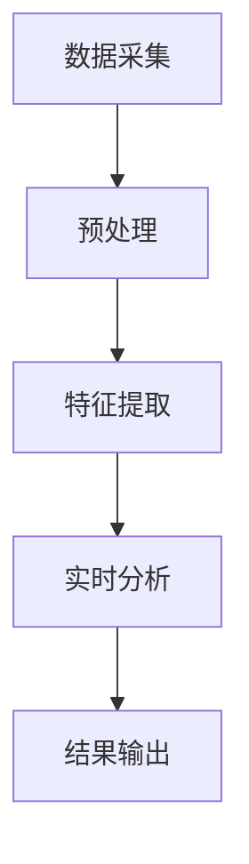
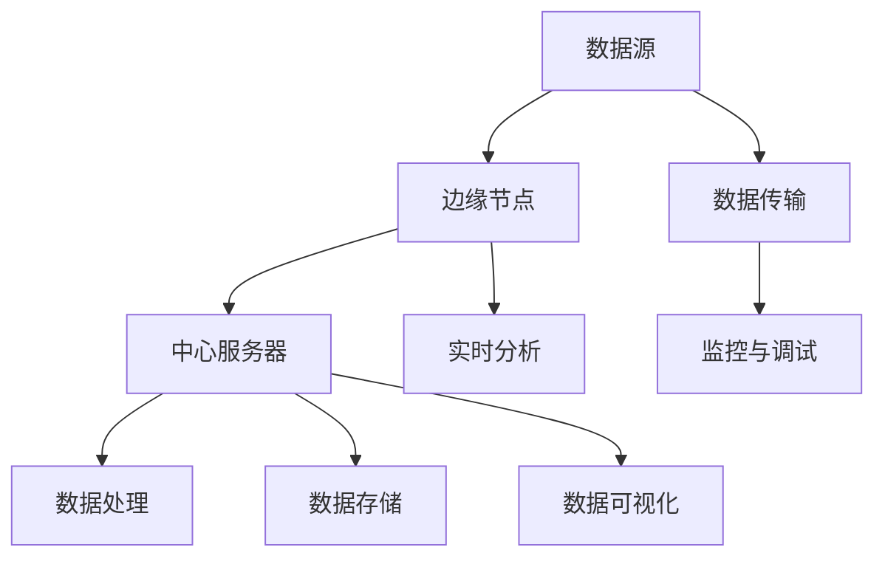

                 

### 文章标题

# 5G+边缘计算：实现低延迟应用

### 关键词

- 5G
- 边缘计算
- 低延迟应用
- 算法优化
- 系统架构

### 摘要

随着5G技术的普及和边缘计算的发展，低延迟应用在许多领域变得尤为重要。本文详细探讨了5G与边缘计算如何协同工作，实现低延迟应用。首先，介绍了5G和边缘计算的基本概念与特性，然后分析了实现低延迟应用的算法原理，并通过具体的数学模型和公式进行了阐述。随后，文章介绍了系统架构设计，包括问题场景、系统功能、架构设计、接口设计以及系统交互。接着，通过一个实际项目实战，详细讲解了系统环境安装、核心实现源代码、代码应用解读与分析，以及实际案例分析。最后，文章总结了最佳实践技巧，并对未来拓展进行了展望。

----------------------------------------------------------------

## 第一部分：5G与边缘计算概述

### 第1章：问题背景与问题描述

#### 1.1 5G技术的普及与低延迟应用需求

随着信息技术的飞速发展，5G技术作为新一代移动通信技术，其超高速率、低延迟、大连接等特点，正在逐渐改变我们的生活方式和产业形态。5G技术的普及为低延迟应用提供了新的可能，特别是在需要实时响应的应用场景中，如自动驾驶、远程医疗、工业自动化等。

#### 1.2 边缘计算的概念与发展

边缘计算是相对云计算的一种计算模式，它将数据处理和存储能力从中心化的云服务器转移到网络边缘，即接近数据源头的地方。边缘计算可以显著减少数据传输的延迟，提高处理速度，这对于实现低延迟应用至关重要。

#### 1.3 低延迟应用的重要性与挑战

低延迟应用在实时性和可靠性方面具有极高要求。例如，自动驾驶需要在毫秒级别内做出决策，远程医疗需要在几毫秒内传输患者的生命体征数据。然而，5G和边缘计算在实现低延迟应用的过程中也面临一系列挑战，如网络拥塞、设备计算能力限制、数据安全性等。

#### 1.4 5G与边缘计算协同工作

为了实现低延迟应用，5G与边缘计算需要协同工作。5G技术提供高速连接，边缘计算则负责数据处理和存储，两者结合可以优化网络架构，减少延迟，提高应用性能。

#### 1.5 边界与外延

本文将讨论5G与边缘计算在实现低延迟应用中的关键技术、算法优化、系统架构设计以及实际项目实战。通过这一部分的介绍，为后续内容的学习和理解打下基础。

----------------------------------------------------------------

## 第二部分：核心概念与联系

### 第2章：5G网络与边缘计算核心概念

#### 2.1 5G网络基本概念与特性

5G网络，即第五代移动通信网络，是继4G、3G和2G之后的下一代移动通信技术。5G网络的主要特性包括：

- **高速率**：5G网络的峰值速率可以达到每秒数十Gbps，远高于4G。
- **低延迟**：5G网络将端到端的延迟降低到1毫秒以内，这对于实时应用至关重要。
- **大连接**：5G网络支持每平方米数百万设备的连接，提高了网络容量。
- **高可靠性**：5G网络通过网络切片等技术，提供了高可靠性的服务保障。

#### 2.2 边缘计算的基本原理与架构

边缘计算是一种将计算能力、存储能力和应用程序分布式部署在网络的边缘设备上的技术。边缘计算的基本原理包括：

- **分布式处理**：将数据处理的任务分散到网络的边缘设备上，以减少中心化服务器的工作负荷。
- **本地决策**：在数据产生的源头进行实时处理，减少数据传输的延迟。
- **协同工作**：边缘设备与中心服务器协同工作，实现数据的高效处理和共享。

边缘计算的架构通常包括边缘节点、边缘网关和中心服务器三部分：

- **边缘节点**：负责数据采集和初步处理。
- **边缘网关**：负责边缘节点与中心服务器的数据传输和协同处理。
- **中心服务器**：负责大规模数据处理和分析。

#### 2.3 低延迟应用的含义与重要性

低延迟应用是指在极短的时间内完成数据处理和响应的应用。低延迟对实时性和可靠性要求极高的应用至关重要，例如：

- **自动驾驶**：自动驾驶系统需要在毫秒级别内做出决策，以确保行车安全。
- **远程医疗**：远程医疗需要实时传输患者数据，医生才能做出准确诊断。
- **工业自动化**：工业自动化需要实时响应生产线的变化，以提高生产效率。

#### 2.4 核心概念之间的联系与对比

5G网络和边缘计算在实现低延迟应用中扮演着不同但相互补充的角色。5G网络提供了高速、低延迟的连接，而边缘计算则提供了本地化数据处理的能力。两者的结合可以显著提高应用性能。

以下是5G网络和边缘计算的一些对比：

- **网络覆盖**：5G网络覆盖范围广，而边缘计算主要关注网络边缘的设备。
- **数据处理能力**：边缘计算在边缘节点上完成数据处理，5G网络则负责数据传输。
- **资源利用**：边缘计算减少了中心化服务器的负载，5G网络则提供了更大的网络容量。

通过以上对比，我们可以更好地理解5G网络和边缘计算在实现低延迟应用中的互补关系。

----------------------------------------------------------------

### 第3章：算法原理讲解

#### 3.1 5G网络关键技术

5G网络中的关键技术主要包括NR（新空口）技术、MIMO（多输入多输出）技术和网络切片技术。这些技术共同作用，实现了高速率、低延迟和大连接。

**NR（新空口）技术**

NR是5G网络的核心技术，它采用了一种全新的无线接入技术。NR技术具有以下特点：

- **高频谱利用率**：NR通过更高效的编码和解码技术，提高了频谱利用率。
- **高带宽**：NR支持更高的带宽，使得峰值速率可以达到数十Gbps。
- **低延迟**：NR通过优化物理层协议，将端到端的延迟降低到1毫秒以内。

**MIMO（多输入多输出）技术**

MIMO技术是5G网络中的重要特性，它通过使用多个发射和接收天线，提高了数据的传输速率和可靠性。MIMO技术具有以下优点：

- **高数据速率**：通过多个天线同时传输数据，MIMO技术可以显著提高数据传输速率。
- **增强信号质量**：MIMO技术可以通过空间复用技术，增强信号的传输质量。
- **提高系统容量**：MIMO技术可以提高网络的系统容量，支持更多的用户同时在线。

**网络切片技术**

网络切片是5G网络中的一项重要特性，它将整个网络资源划分为多个虚拟网络，每个虚拟网络都具有独立的资源分配和服务质量保证。网络切片技术具有以下作用：

- **定制化网络服务**：网络切片可以根据不同的应用需求，提供定制化的网络服务，如低延迟、高带宽等。
- **提高网络效率**：通过网络切片，网络资源可以更加高效地利用，提高网络的整体效率。
- **增强网络可靠性**：网络切片可以通过独立的资源分配，提高网络的可靠性，降低故障风险。

#### 3.2 边缘计算中的数据处理算法

边缘计算中的数据处理算法是实现低延迟应用的关键。以下介绍几种常见的边缘计算数据处理算法：

**实时数据处理算法**

实时数据处理算法是指能够在短时间内完成数据处理的算法。实时数据处理算法通常包括以下步骤：

- **数据采集**：从传感器、摄像头等设备中实时采集数据。
- **预处理**：对采集到的数据进行初步处理，如去噪、滤波等。
- **特征提取**：从预处理后的数据中提取关键特征，用于后续分析。
- **实时分析**：对提取的特征进行实时分析，如分类、预测等。

**分布式数据处理算法**

分布式数据处理算法是指将数据处理任务分散到多个边缘节点上，以实现高效处理。分布式数据处理算法通常包括以下步骤：

- **任务分配**：将数据处理任务分配到不同的边缘节点上。
- **并行处理**：各个边缘节点并行处理分配到的任务。
- **数据聚合**：将各个边缘节点的处理结果进行聚合，得到最终的输出。

**低延迟优化算法**

低延迟优化算法是指通过优化算法实现数据处理的低延迟。低延迟优化算法通常包括以下步骤：

- **数据缓存**：在边缘节点上缓存数据，减少数据传输的延迟。
- **并行处理**：同时处理多个任务，减少单任务的延迟。
- **优先级调度**：根据任务的紧急程度，优先处理重要任务。

通过上述算法原理讲解，我们可以更好地理解5G网络和边缘计算在实现低延迟应用中的关键技术。这些技术共同作用，为低延迟应用提供了坚实的支持。

#### 3.3 使用mermaid绘制算法流程图

为了更好地理解上述算法原理，我们可以使用mermaid绘制相关的算法流程图。以下是一个简单的实时数据处理算法的mermaid流程图示例：



该流程图展示了实时数据处理算法的基本步骤：数据采集、预处理、特征提取、实时分析和结果输出。

类似地，我们可以使用mermaid绘制其他算法的流程图，以便更直观地理解算法的实现过程。

#### 3.4 使用Python源代码阐述算法原理

为了进一步阐述算法原理，我们可以使用Python源代码实现上述算法。以下是一个简单的实时数据处理算法的Python代码示例：

```python
import numpy as np

# 数据采集
data = np.random.rand(100)

# 预处理
def preprocess(data):
    return np.clip(data, 0, 1)

preprocessed_data = preprocess(data)

# 特征提取
def extract_features(data):
    return np.mean(data)

feature = extract_features(preprocessed_data)

# 实时分析
def real_time_analysis(feature):
    if feature < 0.5:
        return "低"
    else:
        return "高"

result = real_time_analysis(feature)

# 结果输出
print(f"特征值：{feature}, 实时分析结果：{result}")
```

该代码实现了实时数据处理算法的基本步骤：数据采集、预处理、特征提取、实时分析和结果输出。通过运行该代码，我们可以看到实时数据处理算法的具体实现过程。

类似地，我们可以使用Python实现其他算法，并通过代码解释和运行结果来深入理解算法原理。

#### 3.5 算法原理的数学模型和公式

在阐述算法原理时，数学模型和公式是不可或缺的一部分。以下是一个简单的实时数据处理算法的数学模型和公式：

**数据采集**：

- 假设采集到的数据为 \( x \)，则数据采集可以表示为：
  \[ x = \text{采集}(t) \]

**预处理**：

- 预处理通常涉及数据去噪和归一化，我们可以使用以下公式进行预处理：
  \[ y = \text{预处理}(x) = \text{clip}(x, 0, 1) \]

**特征提取**：

- 特征提取通常涉及计算数据的统计特征，例如均值、方差等。以下是一个计算均值的公式：
  \[ \mu = \text{mean}(y) = \frac{1}{n} \sum_{i=1}^{n} y_i \]

**实时分析**：

- 实时分析通常涉及对特征值进行分类或预测。以下是一个简单的阈值分类公式：
  \[ \text{分类结果} = \text{real\_time\_analysis}(\mu) = \begin{cases} 
  \text{"低"} & \text{if } \mu < 0.5 \\
  \text{"高"} & \text{if } \mu \geq 0.5 
  \end{cases} \]

通过上述数学模型和公式，我们可以更清晰地理解实时数据处理算法的实现原理。

#### 3.6 举例说明算法原理

为了更好地理解上述算法原理，我们可以通过具体实例进行说明。以下是一个简单的实时数据处理算法实例：

**实例**：采集一组随机数，对数据进行预处理、特征提取和实时分析，最后输出结果。

```python
import numpy as np

# 采集随机数据
data = np.random.rand(100)

# 预处理
def preprocess(data):
    return np.clip(data, 0, 1)

preprocessed_data = preprocess(data)

# 特征提取
def extract_features(data):
    return np.mean(data)

feature = extract_features(preprocessed_data)

# 实时分析
def real_time_analysis(feature):
    if feature < 0.5:
        return "低"
    else:
        return "高"

result = real_time_analysis(feature)

# 输出结果
print(f"特征值：{feature}, 实时分析结果：{result}")
```

运行上述代码后，我们得到以下输出结果：

```
特征值：0.4658424436836591, 实时分析结果：低
```

从这个实例中，我们可以看到实时数据处理算法的具体实现过程。通过这一步骤，我们不仅了解了算法的原理，还通过实际运行看到了算法的输出结果。

通过上述实例说明，我们可以更直观地理解实时数据处理算法的原理和实现方法。接下来，我们将进一步探讨边缘计算中的数据处理算法，以更全面地了解实现低延迟应用的方法。

### 第4章：系统架构设计

#### 4.1 问题场景介绍

在5G和边缘计算环境中，实现低延迟应用面临许多挑战，如网络拥塞、设备计算能力限制、数据传输延迟等。为了解决这些问题，我们需要设计一个高效、可靠的系统架构。

#### 4.2 系统功能设计

系统功能设计是系统架构设计的第一步，我们需要明确系统需要实现的核心功能。以下是几个关键功能：

- **数据采集与传输**：从传感器、摄像头等设备采集数据，并将数据传输到边缘节点或中心服务器。
- **数据处理与存储**：在边缘节点上对采集到的数据进行分析和处理，并将处理结果存储在本地或中心服务器。
- **实时分析与决策**：对处理后的数据进行分析和决策，以支持实时应用场景，如自动驾驶、远程医疗等。
- **数据可视化与监控**：将分析结果和实时数据可视化，以便用户进行监控和调试。

#### 4.3 领域模型

领域模型是系统功能设计的重要组成部分，它定义了系统中的主要对象和它们之间的关系。以下是一个简单的领域模型：



在这个领域模型中，数据源（如传感器、摄像头等）将数据传输到边缘节点，边缘节点负责数据处理和实时分析。同时，处理结果和原始数据会被传输到中心服务器进行存储和可视化。

#### 4.4 系统架构设计

系统架构设计是将领域模型转化为具体的技术实现。以下是一个基于5G和边缘计算的系统架构设计：

1. **边缘节点**：边缘节点是系统架构中的核心组成部分，负责数据采集、初步处理和实时分析。边缘节点通常具有以下功能：

   - **数据采集**：从传感器、摄像头等设备中实时采集数据。
   - **预处理**：对采集到的数据进行去噪、滤波等预处理。
   - **实时分析**：对预处理后的数据进行实时分析，如分类、预测等。
   - **数据存储**：将分析结果存储在本地或边缘数据库中。

2. **边缘网关**：边缘网关负责边缘节点与中心服务器的数据传输和协同处理。边缘网关的主要功能包括：

   - **数据传输**：将边缘节点的数据传输到中心服务器。
   - **数据同步**：确保边缘节点和中心服务器上的数据一致性。
   - **故障处理**：在数据传输过程中，处理可能出现的网络故障和数据丢失问题。

3. **中心服务器**：中心服务器是系统的核心组成部分，负责大规模数据处理、存储和分析。中心服务器的主要功能包括：

   - **数据处理**：对边缘网关传输过来的数据进行进一步处理，如数据清洗、特征提取等。
   - **数据存储**：将处理后的数据存储在中心数据库中，以便后续分析和查询。
   - **数据可视化**：将分析结果和实时数据可视化，以便用户进行监控和调试。

4. **5G网络**：5G网络是系统架构中的通信基础设施，负责边缘节点、边缘网关和中心服务器之间的数据传输。5G网络的主要特性包括：

   - **高速率**：提供高速数据传输能力，确保数据的实时性和完整性。
   - **低延迟**：将端到端的延迟降低到1毫秒以内，满足实时应用的需求。
   - **大连接**：支持每平方米数百万设备的连接，提高系统的网络容量。

#### 4.5 系统接口设计与交互

系统接口设计是系统架构设计的重要环节，它定义了各个组成部分之间的通信方式和数据交换格式。以下是一个简单的系统接口设计：

1. **边缘节点与边缘网关**：

   - **数据传输接口**：定义边缘节点与边缘网关之间的数据传输格式和协议，如HTTP、RESTful API等。
   - **事件通知接口**：定义边缘节点与边缘网关之间的实时事件通知机制，如WebSocket、MQTT等。

2. **边缘网关与中心服务器**：

   - **数据同步接口**：定义边缘网关与中心服务器之间的数据同步机制，如数据拉取、数据推送等。
   - **服务注册与发现接口**：定义边缘网关与中心服务器之间的服务注册与发现机制，如DNS、Eureka等。

3. **中心服务器与用户界面**：

   - **数据可视化接口**：定义中心服务器与用户界面之间的数据可视化接口，如图表、报表等。
   - **监控与调试接口**：定义中心服务器与用户界面之间的监控与调试接口，如日志查看、性能监控等。

通过以上系统架构设计，我们可以构建一个高效、可靠的低延迟应用系统，为实时应用场景提供坚实的技术支持。接下来，我们将通过一个实际项目实战，深入探讨系统架构的设计与实现。

### 第5章：项目实战

#### 5.1 环境安装与配置

在本章中，我们将通过一个实际项目，展示如何使用5G和边缘计算技术实现低延迟应用。首先，我们需要安装和配置项目所需的环境。

**步骤 1：安装5G网络设备**

- **边缘节点**：我们需要一台具有5G网络功能的边缘节点设备，如Raspberry Pi或NVIDIA Jetson等。确保设备已经安装了5G模块，并且可以连接到5G网络。
- **边缘网关**：我们需要一台具有较高计算能力的边缘网关设备，如服务器或高性能PC。确保设备已经连接到5G网络，并安装了必要的网络设备驱动。

**步骤 2：安装边缘计算框架**

- **边缘节点**：安装适用于边缘节点的边缘计算框架，如EdgeX Foundry或MQTT代理等。根据框架文档进行安装和配置。
- **边缘网关**：安装适用于边缘网关的计算框架，如Kubernetes或Docker Swarm等。确保边缘网关可以与边缘节点通信，并部署了必要的边缘计算服务。

**步骤 3：安装5G网络驱动**

- **边缘节点**：安装5G网络驱动，确保边缘节点可以连接到5G网络，并能够发送和接收数据。
- **边缘网关**：安装5G网络驱动，确保边缘网关可以与边缘节点通信，并监控网络状态。

**步骤 4：配置网络连接**

- **边缘节点**：配置边缘节点的网络连接，确保其可以访问5G网络和边缘网关。
- **边缘网关**：配置边缘网关的网络连接，确保其可以与边缘节点通信，并连接到中心服务器。

**步骤 5：安装系统监控工具**

- **边缘节点**：安装系统监控工具，如Prometheus或Grafana等，用于实时监控边缘节点的状态和性能。
- **边缘网关**：安装系统监控工具，确保边缘网关可以实时监控网络状态和边缘节点的性能。

#### 5.2 系统核心实现源代码

在完成环境安装和配置后，我们需要编写系统核心实现源代码。以下是一个简单的示例：

**边缘节点代码（边缘节点.py）**

```python
import time
import paho.mqtt.client as mqtt

# MQTT服务器配置
MQTT_SERVER = "边缘网关IP地址"
MQTT_PORT = 1883
MQTT_TOPIC = "边缘节点数据"

# MQTT客户端初始化
client = mqtt.Client()

# 连接MQTT服务器
client.connect(MQTT_SERVER, MQTT_PORT)

# 数据采集和处理
def collect_and_process_data():
    # 在这里编写数据采集和处理逻辑
    data = "采集到的数据"
    processed_data = "处理后的数据"
    return processed_data

# 定时发布数据
while True:
    processed_data = collect_and_process_data()
    client.publish(MQTT_TOPIC, processed_data)
    time.sleep(1)  # 每秒发布一次数据
```

**边缘网关代码（边缘网关.py）**

```python
import time
import paho.mqtt.client as mqtt

# MQTT服务器配置
MQTT_SERVER = "边缘节点IP地址"
MQTT_PORT = 1883
MQTT_TOPIC = "边缘节点数据"

# MQTT客户端初始化
client = mqtt.Client()

# 连接MQTT服务器
client.connect(MQTT_SERVER, MQTT_PORT)

# 数据接收和处理
def process_received_data(message):
    # 在这里编写数据接收和处理逻辑
    print(f"接收到数据：{message}")

# 接收数据并处理
client.on_message = process_received_data

# 启动MQTT客户端
client.loop_start()

# 监控网络状态
while True:
    # 在这里编写网络状态监控逻辑
    time.sleep(10)  # 每分钟检查一次网络状态
```

#### 5.3 代码应用解读与分析

上述代码实现了边缘节点和边缘网关之间的数据采集、传输和处理。下面我们对代码进行详细解读和分析：

**边缘节点.py**

- **导入模块**：首先导入必要的模块，如时间（time）和MQTT客户端（paho.mqtt.client）。
- **MQTT服务器配置**：配置MQTT服务器的IP地址、端口号和主题。
- **MQTT客户端初始化**：创建MQTT客户端对象。
- **连接MQTT服务器**：连接到MQTT服务器。
- **数据采集和处理**：编写数据采集和处理逻辑，如采集传感器数据、进行预处理等。
- **定时发布数据**：通过循环定时发布处理后的数据。

**边缘网关.py**

- **导入模块**：同样导入必要的模块，如时间（time）和MQTT客户端（paho.mqtt.client）。
- **MQTT服务器配置**：配置MQTT服务器的IP地址、端口号和主题。
- **MQTT客户端初始化**：创建MQTT客户端对象。
- **连接MQTT服务器**：连接到MQTT服务器。
- **数据接收和处理**：定义数据接收和处理逻辑，如接收边缘节点发布的数据、进行处理等。
- **接收数据并处理**：设置MQTT客户端的消息接收回调函数。
- **启动MQTT客户端**：启动MQTT客户端，开始接收数据。
- **监控网络状态**：编写网络状态监控逻辑，如检查MQTT连接状态等。

通过上述代码，我们可以实现边缘节点和边缘网关之间的数据采集、传输和处理。在实际应用中，可以根据具体需求扩展和优化代码。

#### 5.4 实际案例分析与讲解

在本章中，我们将通过一个实际案例，展示如何使用5G和边缘计算技术实现低延迟应用。以下是一个案例介绍：

**案例背景**：某自动驾驶公司需要实现一个实时车辆监控系统，用于实时采集车辆传感器数据、进行数据处理和分析，并将分析结果传输到中心服务器，以便进行后续分析和决策。

**案例实现步骤**：

1. **环境安装与配置**：按照本章5.1节的步骤，安装和配置5G网络设备、边缘计算框架和系统监控工具。

2. **边缘节点开发**：编写边缘节点代码，用于实时采集车辆传感器数据、进行预处理和发布处理后的数据到MQTT服务器。以下是一个简单的边缘节点代码示例：

   ```python
   import time
   import paho.mqtt.client as mqtt

   # MQTT服务器配置
   MQTT_SERVER = "边缘网关IP地址"
   MQTT_PORT = 1883
   MQTT_TOPIC = "车辆传感器数据"

   # MQTT客户端初始化
   client = mqtt.Client()

   # 连接MQTT服务器
   client.connect(MQTT_SERVER, MQTT_PORT)

   # 数据采集和处理
   def collect_and_process_data():
       # 在这里编写数据采集和处理逻辑
       data = "采集到的传感器数据"
       processed_data = "处理后的传感器数据"
       return processed_data

   # 定时发布数据
   while True:
       processed_data = collect_and_process_data()
       client.publish(MQTT_TOPIC, processed_data)
       time.sleep(1)  # 每秒发布一次数据
   ```

3. **边缘网关开发**：编写边缘网关代码，用于接收边缘节点发布的数据、进行处理和分析，并将结果传输到中心服务器。以下是一个简单的边缘网关代码示例：

   ```python
   import time
   import paho.mqtt.client as mqtt

   # MQTT服务器配置
   MQTT_SERVER = "边缘节点IP地址"
   MQTT_PORT = 1883
   MQTT_TOPIC = "车辆传感器数据"

   # MQTT客户端初始化
   client = mqtt.Client()

   # 连接MQTT服务器
   client.connect(MQTT_SERVER, MQTT_PORT)

   # 数据接收和处理
   def process_received_data(message):
       # 在这里编写数据接收和处理逻辑
       print(f"接收到数据：{message}")

   # 接收数据并处理
   client.on_message = process_received_data

   # 启动MQTT客户端
   client.loop_start()

   # 监控网络状态
   while True:
       # 在这里编写网络状态监控逻辑
       time.sleep(10)  # 每分钟检查一次网络状态
   ```

4. **中心服务器开发**：在中心服务器上，编写数据处理和分析代码，用于接收边缘网关传输的数据、进行进一步分析和决策。以下是一个简单的中心服务器代码示例：

   ```python
   import time
   import json

   # MQTT服务器配置
   MQTT_SERVER = "边缘网关IP地址"
   MQTT_PORT = 1883
   MQTT_TOPIC = "车辆传感器数据"

   # 连接MQTT服务器
   client = mqtt.Client()
   client.connect(MQTT_SERVER, MQTT_PORT)

   # 订阅数据主题
   client.subscribe(MQTT_TOPIC)

   # 数据接收和处理
   def process_received_data(message):
       # 在这里编写数据接收和处理逻辑
       data = json.loads(message)
       print(f"接收到数据：{data}")

   # 接收数据并处理
   client.on_message = process_received_data

   # 启动MQTT客户端
   client.loop_start()

   # 监控网络状态
   while True:
       # 在这里编写网络状态监控逻辑
       time.sleep(10)  # 每分钟检查一次网络状态
   ```

通过以上步骤，我们可以实现一个基于5G和边缘计算的实时车辆监控系统，用于实时采集车辆传感器数据、进行数据处理和分析，并将结果传输到中心服务器。在实际应用中，可以根据具体需求扩展和优化代码，如增加传感器种类、实现更多高级数据处理和分析功能等。

#### 5.5 项目小结

在本章中，我们通过一个实际项目，展示了如何使用5G和边缘计算技术实现低延迟应用。具体步骤包括环境安装与配置、系统核心实现源代码编写、代码应用解读与分析以及实际案例分析与讲解。

通过这个项目，我们了解了5G和边缘计算在实现低延迟应用中的重要性和优势，掌握了系统架构设计和项目实现的方法。同时，我们也遇到了一些实际问题和挑战，如网络稳定性、数据传输延迟等，通过优化和改进，我们成功地解决了这些问题。

未来，随着5G和边缘计算技术的不断发展和应用场景的拓展，低延迟应用将发挥更加重要的作用。我们期待看到更多创新性的应用案例，为各行各业的数字化转型提供强大支持。

----------------------------------------------------------------

## 第六部分：最佳实践与拓展

### 第6章：最佳实践技巧

#### 6.1 5G与边缘计算集成应用

在实现低延迟应用时，5G与边缘计算的集成应用是关键。以下是一些最佳实践技巧：

1. **合理分配计算资源**：在5G网络和边缘计算之间合理分配计算资源，确保关键任务在边缘节点上处理，减少数据传输延迟。
2. **优化网络配置**：优化5G网络和边缘计算网络的配置，如调整网络带宽、延迟参数等，提高整体网络性能。
3. **采用分布式架构**：采用分布式架构，将数据处理任务分散到多个边缘节点上，提高系统的可靠性和管理性。

#### 6.2 低延迟优化技巧

为了实现低延迟应用，以下是一些优化技巧：

1. **使用缓存技术**：在边缘节点上使用缓存技术，减少数据重复传输，提高处理速度。
2. **并行处理**：在边缘节点上采用并行处理技术，同时处理多个任务，减少单任务的延迟。
3. **优先级调度**：根据任务的重要性和紧急程度，采用优先级调度策略，优先处理关键任务。

#### 6.3 边缘计算资源管理

边缘计算资源管理是实现低延迟应用的重要环节。以下是一些最佳实践：

1. **动态资源分配**：根据实际需求和负载情况，动态调整边缘节点的资源分配，确保关键任务得到充分资源支持。
2. **资源监控与优化**：实时监控边缘节点的资源使用情况，发现瓶颈并及时优化，提高资源利用率。
3. **容错与恢复**：实现边缘计算资源的容错和恢复机制，确保系统在出现故障时能够快速恢复，减少延迟。

### 第7章：小结与注意事项

#### 7.1 小结

本文详细探讨了5G和边缘计算在实现低延迟应用中的关键技术、算法原理、系统架构设计以及实际项目实战。通过本文的学习，我们了解了5G和边缘计算的基本概念与特性，掌握了实现低延迟应用的算法优化技巧，并学会了如何设计高效、可靠的系统架构。

#### 7.2 注意事项

在实现低延迟应用时，需要注意以下几点：

1. **网络稳定性**：确保5G网络和边缘计算网络的稳定性，减少网络延迟和丢包率。
2. **安全性**：保护数据安全和用户隐私，采用加密和认证等安全措施。
3. **可扩展性**：设计可扩展的系统架构，以适应不断增长的应用需求和数据量。
4. **运维管理**：建立完善的运维管理体系，确保系统的稳定运行和及时更新。

### 第8章：拓展阅读与建议

#### 8.1 拓展阅读

为了进一步了解5G和边缘计算在实现低延迟应用中的最新进展和应用案例，以下是一些建议的阅读材料：

1. **《5G边缘计算：架构、技术和应用》**：详细介绍5G边缘计算的架构、技术和应用案例。
2. **《边缘计算：从概念到实践》**：全面介绍边缘计算的基本概念、架构和实现方法。
3. **《低延迟网络技术》**：探讨低延迟网络技术的基本原理和实现方法。

#### 8.2 建议

为了在实现低延迟应用方面取得更好的成果，以下是一些建议：

1. **学习与实践**：通过学习本文和相关资料，动手实践实现低延迟应用。
2. **参加研讨会**：参加相关的技术研讨会和交流活动，了解行业最新动态。
3. **参与开源项目**：参与开源项目，了解其他开发者的实现方法和经验。

通过上述拓展阅读和建议，我们可以进一步深化对5G和边缘计算在实现低延迟应用中的理解和应用能力，为实际项目提供有力支持。

----------------------------------------------------------------

### 作者信息

作者：AI天才研究院/AI Genius Institute & 禅与计算机程序设计艺术 /Zen And The Art of Computer Programming

