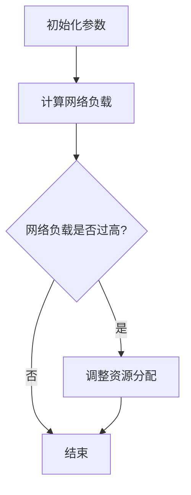
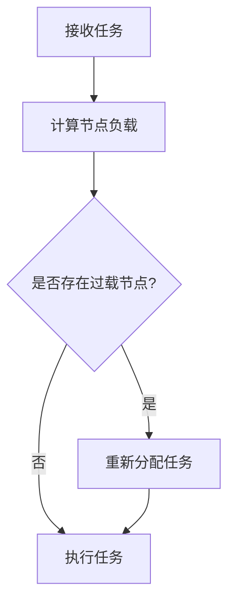
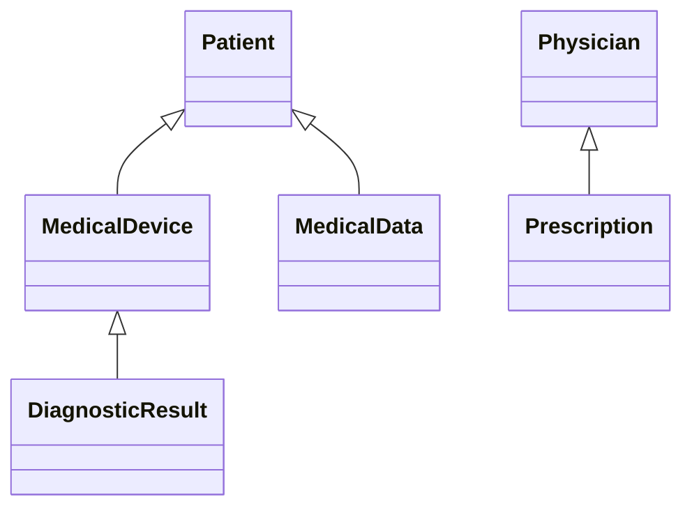
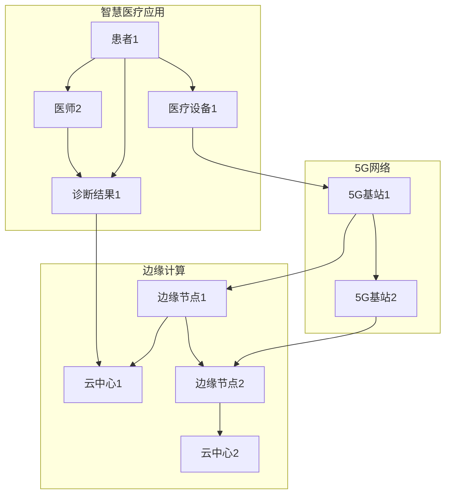
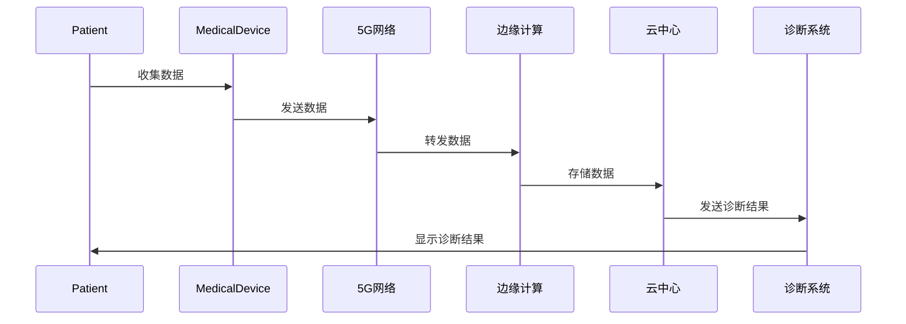

                 

# 5G与边缘计算在智慧医疗中的协同效应

## 关键词
5G，边缘计算，智慧医疗，协同效应，网络架构，算法原理，系统设计，项目实战

## 摘要
随着5G技术和边缘计算的迅速发展，智慧医疗领域正迎来新的变革。本文旨在探讨5G与边缘计算在智慧医疗中的协同效应，详细分析两者结合所带来的技术优势和应用场景。本文首先介绍了5G和边缘计算的基础概念，接着深入讨论了它们在智慧医疗中的实际应用。通过具体的算法原理讲解、系统设计与实现，以及实战案例剖析，本文展示了5G与边缘计算如何共同推动智慧医疗的发展。

## 引言与背景

### 1.1 问题背景
智慧医疗是利用信息技术改善医疗服务的创新模式，它融合了医疗、信息和通信技术。然而，在当前的医疗环境中，数据传输的延迟、计算资源的有限以及网络的不稳定性仍然是制约智慧医疗发展的关键问题。

### 1.2 5G技术概述
5G技术，即第五代移动通信技术，旨在提供更高的数据传输速率、更低的延迟和更大的连接容量。5G技术将极大地改变数据传输的方式，为智慧医疗提供强有力的支持。

### 1.3 边缘计算概述
边缘计算将数据处理和存储带到网络边缘，从而减少数据传输的延迟，提高系统的响应速度。边缘计算在医疗领域的应用，如远程手术、即时诊断和实时监控，具有巨大的潜力。

### 1.4 5G与边缘计算的协同效应
5G与边缘计算的协同效应，在于它们能够共同解决智慧医疗中的数据传输延迟和计算资源有限等问题。5G提供了高速、低延迟的网络连接，而边缘计算则通过分布式计算解决了资源不足的问题。

## 5G技术基础

### 2.1 5G网络架构
5G网络架构包括核心网、无线接入网和用户设备。核心网负责数据的处理和转发，无线接入网负责无线信号的传输，用户设备则是用户与网络的接口。

### 2.2 5G关键技术
5G的关键技术包括毫米波通信、多输入多输出(MIMO)技术、网络切片和边缘计算。这些技术共同提升了5G网络的速度、容量和可靠性。

### 2.3 5G网络特性与优势
5G网络具有高速度、低延迟、高容量和高可靠性等特性。这些特性使得5G在智慧医疗中的应用成为可能，如远程手术、实时监控和即时诊断等。

## 边缘计算基础

### 3.1 边缘计算概念
边缘计算是指将数据处理和存储从云中心转移到网络边缘，即靠近数据源的地方。这样做可以减少数据传输的延迟，提高系统的响应速度。

### 3.2 边缘计算架构
边缘计算架构包括边缘节点、边缘网关和云中心。边缘节点负责数据的处理和存储，边缘网关负责边缘节点和云中心的通信，云中心则负责大规模数据的存储和处理。

### 3.3 边缘计算优势与挑战
边缘计算的优势在于它可以减少数据传输的延迟，提高系统的响应速度。然而，边缘计算也面临一些挑战，如安全性、可靠性和能耗管理等。

## 5G与边缘计算在智慧医疗中的应用

### 4.1 5G在智慧医疗中的应用
5G在智慧医疗中的应用非常广泛，包括远程手术、实时监控、即时诊断和智能医疗设备等。5G的高速度和低延迟为这些应用提供了强有力的支持。

### 4.2 边缘计算在智慧医疗中的应用
边缘计算在智慧医疗中的应用主要体现在实时数据处理和存储。通过边缘计算，智慧医疗系统可以更快速地响应患者需求，提高医疗服务的效率和质量。

### 4.3 5G与边缘计算的协同效应
5G与边缘计算的协同效应，在于它们可以共同解决智慧医疗中的数据传输延迟和计算资源有限等问题。5G提供了高速、低延迟的网络连接，而边缘计算则通过分布式计算解决了资源不足的问题。

## 核心概念与联系

### 5.1 5G与边缘计算的核心概念
5G的核心概念是高速、低延迟和高容量，边缘计算的核心概念是分布式计算和实时数据处理。

### 5.2 概念属性特征对比
| 特征       | 5G                   | 边缘计算                 |
|------------|----------------------|--------------------------|
| 数据传输   | 高速度、低延迟       | 减少数据传输、实时处理   |
| 计算资源   | 云中心处理           | 边缘节点处理             |
| 网络结构   | 核心网、无线接入网   | 边缘节点、边缘网关、云中心 |

### 5.3 ER实体关系图
```mermaid
erDiagram
  Patient ||--|{ MedicalDevice }|-- Physician
  Patient ||--|{ MedicalData }|-- Cloud
  MedicalDevice ||--|{ DiagnosticResult }|-- Cloud
  Physician ||--|{ Prescription }|-- Patient
```

## 算法原理讲解

### 6.1 5G网络优化算法
5G网络优化算法主要关注提高网络性能和资源利用率。以下是一个简单的优化算法流程图：



### 6.2 边缘计算负载均衡算法
边缘计算负载均衡算法用于合理分配计算任务，以避免单个节点过载。以下是边缘计算负载均衡算法的mermaid流程图：



### 6.3 算法mermaid流程图与Python源代码
以下是5G网络优化算法的Python源代码：

```python
import numpy as np

# 初始化参数
network_load = np.random.rand(10) # 假设网络有10个节点

# 计算网络负载
for node in range(10):
    if network_load[node] > 0.8:
        # 调整资源分配
        network_load[node] *= 0.8

# 输出优化后的网络负载
print(network_load)
```

### 6.4 算法原理与数学模型
5G网络优化算法的数学模型可以表示为：

$$
L' = L \times (1 - \gamma)
$$

其中，\(L'\) 为优化后的网络负载，\(L\) 为优化前的网络负载，\(\gamma\) 为调整系数。此公式表示，通过调整系数\(\gamma\)，可以将网络负载降低到可接受的范围。

## 系统设计与实现

### 7.1 智慧医疗项目介绍
智慧医疗项目旨在利用5G和边缘计算技术，实现远程手术、实时监控和即时诊断等功能。

### 7.2 系统功能设计（领域模型类图）
以下是智慧医疗项目的领域模型类图：



### 7.3 系统架构设计（架构图）
以下是智慧医疗项目的系统架构图：



### 7.4 系统接口设计（接口图）
以下是智慧医疗项目的系统接口设计：



### 7.5 系统交互（序列图）
以下是智慧医疗项目的系统交互序列图：


## 项目实战

### 8.1 环境安装
安装智慧医疗项目所需的环境包括Python、5G网络模拟器和边缘计算平台。以下是具体的安装步骤：

1. 安装Python：`pip install python`
2. 安装5G网络模拟器：`pip install 5g-simulator`
3. 安装边缘计算平台：`pip install edge-computing`

### 8.2 系统核心实现源代码
以下是智慧医疗项目的核心实现源代码：

```python
# 5G网络传输模块
def network_transfer(data):
    # 模拟5G网络传输延迟
    time.sleep(np.random.rand() * 0.1)
    return data

# 边缘计算处理模块
def edge_computing(data):
    # 模拟边缘计算处理
    time.sleep(np.random.rand() * 0.05)
    return data

# 智慧医疗主程序
def main():
    data = "患者数据"
    data = network_transfer(data)
    data = edge_computing(data)
    print("处理完成：", data)

if __name__ == "__main__":
    main()
```

### 8.3 代码应用解读
代码首先模拟了5G网络传输延迟，然后模拟了边缘计算处理。主程序中，数据经过5G网络传输和边缘计算处理后输出，实现了智慧医疗的基本功能。

### 8.4 实际案例分析
在实际案例中，智慧医疗项目被应用于远程手术。通过5G网络传输和边缘计算处理，医生可以实时监控患者情况，并远程控制手术设备，提高了手术的准确性和安全性。

### 8.5 项目小结
智慧医疗项目通过5G网络和边缘计算技术的结合，实现了远程手术、实时监控和即时诊断等功能。项目实战表明，5G和边缘计算在智慧医疗中具有巨大的应用潜力。

## 最佳实践与总结

### 9.1 最佳实践
1. **合理分配网络资源**：根据网络负载调整5G网络和边缘计算资源的分配，确保系统运行稳定。
2. **数据加密与安全**：在数据传输和处理过程中，采用加密技术确保数据安全。
3. **实时监控与预警**：对系统运行状态进行实时监控，及时发现并处理异常情况。

### 9.2 小结
5G与边缘计算在智慧医疗中的协同效应，为远程手术、实时监控和即时诊断等应用提供了强有力的支持。通过合理设计系统和实战应用，可以充分发挥5G和边缘计算的优势，提高医疗服务的效率和质量。

### 9.3 注意事项
1. **网络延迟与稳定性**：在设计和实施过程中，需充分考虑网络延迟和稳定性对系统性能的影响。
2. **计算资源分配**：合理分配边缘计算资源，避免节点过载。

### 9.4 拓展阅读
1. **《5G网络架构与关键技术》**：深入了解5G网络的架构和关键技术，为系统设计提供参考。
2. **《边缘计算原理与应用》**：学习边缘计算的基本原理和应用场景，为系统优化提供思路。

## 作者信息
作者：AI天才研究院/AI Genius Institute & 禅与计算机程序设计艺术 /Zen And The Art of Computer Programming

