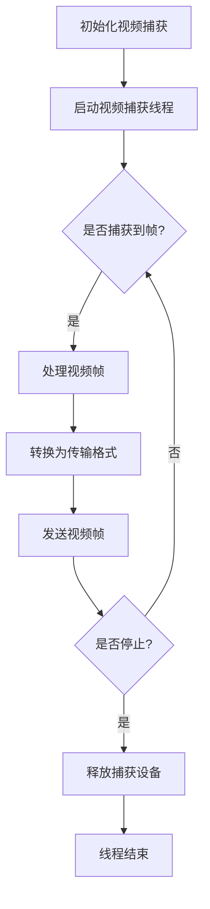
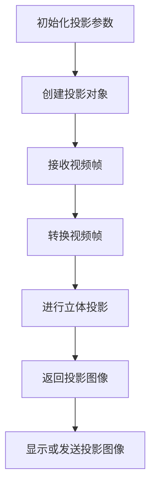
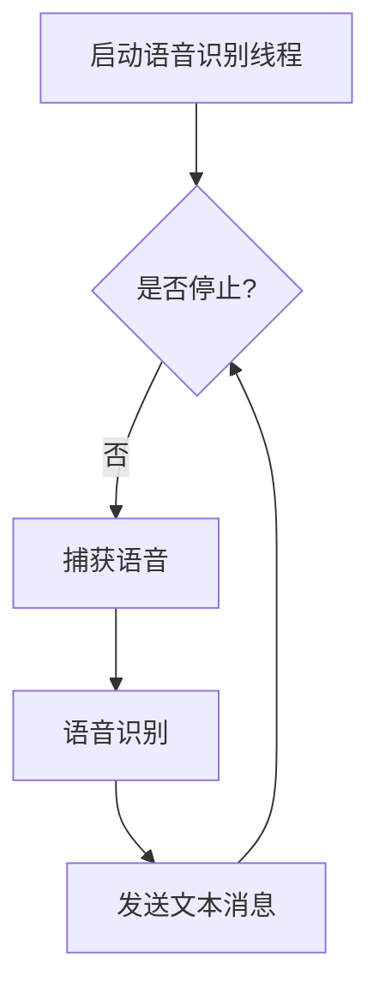

                 

## 6G在全息会议中的应用前景：真实感远程协作系统

### 关键词

- 6G网络
- 全息会议
- 真实感远程协作
- 低延迟
- 高带宽
- 超大规模连接

### 摘要

本文深入探讨了6G网络在全息会议中的应用前景，特别是在实现真实感远程协作方面的潜在优势。通过分析6G网络的技术特性，包括低延迟、高带宽和超大规模连接能力，本文展示了6G网络如何支持全息会议的高效实时互动。此外，文章还探讨了全息会议的关键技术，如全息投影、虚拟现实以及6G网络在这些技术实现中的关键角色。本文还讨论了6G网络在真实感远程协作中的挑战，包括网络基础设施建设、网络能耗和成本，以及安全性和隐私保护等问题。最后，本文总结了6G网络在全息会议中的前景，并展望了未来6G网络技术可能带来的创新应用。

### 引言

随着全球信息化和数字化的快速发展，远程协作已经成为现代工作和生活中不可或缺的一部分。然而，传统远程协作方式，如视频会议和在线沟通，往往受限于网络带宽和延迟，无法提供足够的真实感和互动性。为了解决这些问题，全息会议作为一种全新的远程协作方式应运而生。全息会议通过利用先进的全息投影技术和6G网络的高性能特性，能够为参与者提供几乎与面对面交流相同的高保真体验。

6G网络，作为下一代移动通信技术，具有低延迟、高带宽和超大规模连接能力等显著优势。这些特性使得6G网络成为支持全息会议的关键基础设施，有望在未来大幅提升远程协作的效率和体验。本文将深入探讨6G网络在全息会议中的应用前景，从技术优势、挑战和未来发展方向等方面进行分析，旨在为6G网络和全息会议的融合应用提供有益的参考。

#### 1.1 6G网络在真实感远程协作中的背景

1.1.1 6G网络的发展背景

随着全球信息技术的飞速发展，移动通信技术也在不断演进。从1G模拟通信到2G数字通信，再到3G和4G的高速数据传输，每一次技术的升级都带来了用户体验的显著提升。如今，5G网络已经逐渐普及，为物联网（IoT）、自动驾驶、增强现实（AR）和虚拟现实（VR）等新兴技术提供了强大的支持。然而，随着这些技术的不断成熟和应用，对网络性能的要求也在不断提高。为了满足未来更加多样化和复杂化的通信需求，6G网络的发展已经成为全球各大国家和地区的重要战略目标。

6G网络的发展背景主要源于以下几个方面：

1. **高性能需求**：随着物联网设备的激增和5G应用场景的扩展，对网络带宽、延迟和可靠性等性能的要求越来越高。6G网络将提供更高的数据传输速率和更低的延迟，以满足这些高性能需求。

2. **万物互联**：6G网络将支持更多的设备连接，实现真正的万物互联。这不仅包括传统的移动设备，还包括智能家庭设备、医疗设备、农业设备等。这种广泛的连接能力将极大地扩展远程协作的适用范围。

3. **新应用场景**：随着人工智能、虚拟现实和全息技术的快速发展，新的应用场景不断涌现。这些应用对网络性能的要求非常高，需要6G网络提供足够的支持。

4. **政策推动**：许多国家和地区已经将6G技术的发展纳入国家战略，希望通过提前布局6G技术，抢占未来科技制高点。例如，中国、美国、欧盟等都在积极推动6G技术的研发和标准化工作。

1.1.2 真实感远程协作的概念

真实感远程协作是指在远程通信环境中，通过先进的技术手段，使得参与者在视觉、听觉和触觉等方面感受到与面对面交流相近的真实体验。这种协作方式的目标是克服传统远程协作中存在的延迟、带宽限制和交互不自然等问题，提升远程协作的效率和质量。

真实感远程协作的概念可以从以下几个方面进行理解：

1. **高度仿真**：真实感远程协作要求系统能够高度仿真现实环境，包括音视频信号的高保真传输、空间感的再现等。

2. **实时互动**：实时互动是真实感远程协作的关键，要求网络能够提供极低的延迟，使得参与者之间的互动更加自然和流畅。

3. **沉浸式体验**：通过虚拟现实（VR）和增强现实（AR）等技术，真实感远程协作能够为参与者提供沉浸式的体验，使他们在远程环境中感觉如同身处现场。

4. **扩展性**：真实感远程协作需要支持多种设备和平台，以便在不同场景下进行灵活的应用。

1.1.3 6G网络在真实感远程协作中的角色

6G网络在真实感远程协作中扮演着至关重要的角色，其技术优势为这一领域的快速发展提供了坚实的基础。以下将详细分析6G网络在真实感远程协作中的几个关键角色：

1. **低延迟**：低延迟是6G网络的核心优势之一。在真实感远程协作中，低延迟可以显著减少交互的延迟，使得参与者在远程环境中能够实现实时互动。这对于实时视频会议、远程手术和实时监控等应用场景尤为重要。例如，在远程手术中，医生和患者之间的实时沟通和操作需要低至毫秒级的延迟，以确保手术的顺利进行和患者的安全。

2. **高带宽**：6G网络提供的高带宽能够满足真实感远程协作中大规模数据传输的需求。高带宽不仅能够支持高清视频、3D模型等大数据量的实时传输，还可以支持大规模用户同时在线，从而实现复杂和多样化的远程协作场景。例如，在虚拟现实会议中，高带宽可以确保虚拟环境的流畅渲染和用户动作的实时反馈，提供更加真实的会议体验。

3. **超大规模连接能力**：6G网络的超大规模连接能力意味着它能够支持数十亿设备同时在线。这对于远程协作中的设备多样性具有重要意义，例如在智能工厂中，各种传感器、机器人和工作人员的设备都可以通过6G网络实现无缝连接和协同工作，从而提高生产效率和质量。

4. **高可靠性和高稳定性**：6G网络的高可靠性和高稳定性为真实感远程协作提供了稳定的通信基础。在高强度的远程协作环境中，网络的可靠性和稳定性至关重要，以确保通信的连续性和数据传输的准确性。例如，在远程教育和远程医疗中，网络的中断或数据丢失可能会导致教学和治疗的失败，影响患者的安全。

5. **智能网络管理**：6G网络具备智能网络管理能力，可以通过先进的算法和人工智能技术，实现网络的动态优化和资源分配。这种智能管理能力可以进一步提升网络性能，满足真实感远程协作中多变和复杂的需求。

综上所述，6G网络在真实感远程协作中具有多方面的优势，为这一领域的发展提供了强有力的支持。随着6G技术的不断成熟和普及，我们可以期待在未来的远程协作中，体验到更加真实、高效和稳定的通信环境。

### 1.1.6 6G网络在真实感远程协作中的技术优势

#### 1.1.6.1 低延迟和高带宽

低延迟和高带宽是6G网络在真实感远程协作中的关键技术优势。低延迟使得远程协作的交互速度更加接近面对面交流，减少了用户在通信过程中的等待时间，提升了用户体验。高带宽则保证了大规模数据传输的需求，例如高清视频、3D模型等，使得远程协作的视觉和听觉效果更加真实。

让我们一步一步分析这两个关键技术的具体作用：

1. **低延迟**

低延迟意味着数据在传输过程中所需要的时间大大缩短。在真实感远程协作中，低延迟至关重要，因为延迟时间的减少会直接影响用户的交互体验。具体来说，低延迟可以实现以下效果：

- **实时互动**：在视频会议或在线协作中，低延迟可以减少声音和视频的延迟，使得参与者的语音和视频信号能够几乎同步传输，提升交互的流畅性。这对于需要实时决策和协作的任务，如远程手术、紧急会议和在线教育等，尤为重要。
  
- **增强沉浸感**：在虚拟现实（VR）和增强现实（AR）应用中，低延迟可以减少用户在操作时的延迟感，使得虚拟环境的反馈更加迅速和真实。例如，在VR游戏中，低延迟可以让用户感受到更加流畅的操纵和身临其境的体验。

- **减少操作失误**：在远程机器人控制和自动化生产线中，低延迟可以减少操作员在执行任务时的反应时间，降低操作失误的风险，提高生产效率和产品质量。

2. **高带宽**

高带宽是指网络能够同时传输大量数据的能力。对于真实感远程协作来说，高带宽的重要性不言而喻。以下是一些高带宽的具体应用场景：

- **高清视频传输**：在远程协作中，高清视频传输可以提供更加清晰的图像和视频质量。例如，在远程医疗中，医生可以通过高清视频实时查看患者的病情，进行远程诊断和治疗。高带宽确保了这些高清视频能够流畅传输，不会因为带宽限制而出现画面卡顿或延迟。

- **大规模数据传输**：对于涉及大量数据传输的应用场景，如工程设计、建筑设计和大宗物品交易等，高带宽可以显著缩短数据处理和传输的时间。这意味着设计师可以在远程协作中实时共享和修改设计文件，提高工作效率和协同效果。

- **多用户同时在线**：在大型会议或在线教育中，高带宽可以支持更多用户同时在线，而不会影响网络性能。这对于需要大规模用户互动和协作的应用场景尤为重要，如在线课堂、虚拟研讨会和国际远程会议等。

3. **综合效果**

低延迟和高带宽的结合，能够为真实感远程协作带来综合性的提升：

- **提高协作效率**：低延迟使得交互更加流畅和即时，减少了等待和操作时间；高带宽保证了数据传输的完整性和速度，使得协作过程中的信息传递更加迅速和准确。这两者的结合，显著提高了远程协作的效率。

- **提升用户体验**：低延迟和高带宽共同作用，使得用户在远程协作中能够感受到接近面对面交流的真实体验，减少了传统远程协作的隔阂感。这种真实的体验不仅提升了用户的参与度和满意度，也促进了更加深入和高效的协作。

- **扩展应用场景**：低延迟和高带宽为真实感远程协作提供了强大的技术支持，使得更多应用场景成为可能。例如，虚拟现实会议、远程手术、在线教育和智能工厂等，都可以通过6G网络实现更加真实和高效的协作。

总之，低延迟和高带宽是6G网络在真实感远程协作中的核心优势。通过这两项技术的协同作用，6G网络为远程协作带来了前所未有的速度和真实感，为未来远程协作的广泛应用奠定了坚实基础。

#### 1.1.6.2 超大规模连接能力

6G网络在真实感远程协作中的另一个重要技术优势是其超大规模连接能力。这一能力使得6G网络能够支持数十亿设备同时在线，从而为全息会议和复杂的远程协作场景提供了充足的设备支持。

让我们一步一步分析这一技术优势的具体实现和应用：

1. **支持大规模设备连接**

6G网络的设计目标是实现全球范围内的超大规模设备连接。具体来说，6G网络能够支持数十亿设备同时在线，这意味着在一个全息会议中，参与者不仅限于几个或几十个，而是可以扩展到数百、数千，甚至数万个设备。这样的超大规模连接能力为以下应用场景提供了可能：

- **多人全息会议**：在商业会议、学术研讨和大型活动中，参与者可能分布在不同的地理位置。通过6G网络，这些参与者可以通过全息投影技术实时出现在同一个虚拟会议室中，实现大规模、多人的实时互动和交流。这种全息会议的体验不仅提升了参与者的参与度，也大大提高了会议的效率和效果。

- **智能城市与物联网**：6G网络能够为智能城市和物联网提供强有力的支持。在智能交通管理、智能环境监控和智能公共服务等应用中，6G网络可以连接大量的传感器、摄像头和其他智能设备，实时收集和处理数据，实现高效的管理和决策。

- **远程教育和培训**：在远程教育和培训中，6G网络的超大规模连接能力可以支持更多学生和教师同时在线。这意味着教师可以同时面向数百名学生进行授课，并实时回答他们的疑问。学生也可以通过全息技术参与到虚拟实验和互动讨论中，提高学习的参与度和效果。

2. **多样化的设备支持**

6G网络不仅能够支持大量设备同时在线，还可以支持各种类型的设备。这些设备包括但不限于：

- **移动设备**：如智能手机、平板电脑和智能手表等，这些设备可以为远程协作提供便携性和灵活性。

- **固定设备**：如桌面电脑、大型显示器和投影设备等，这些设备可以提供更加沉浸式的远程协作体验。

- **物联网设备**：如传感器、监控摄像头和智能家电等，这些设备可以实时收集环境数据，并与其他设备进行智能交互。

- **机器人**：在远程手术、远程监控和远程维修等应用中，机器人可以与操作员进行实时通信和协作，实现远程操作和监控。

3. **复杂的远程协作场景**

6G网络的超大规模连接能力使得复杂的远程协作场景成为可能。这些场景包括但不限于：

- **协同设计与制造**：在设计复杂的产品时，设计师、工程师和制造团队可以通过6G网络实时共享和修改设计文件，进行多方位的协作和讨论。这种高效的设计与制造流程可以显著缩短产品开发周期，提高产品质量和市场竞争力。

- **智能工厂与生产**：在智能工厂中，6G网络可以连接大量的机器人和传感器，实现生产流程的自动化和智能化。操作员可以通过远程协作系统实时监控生产状况，并进行必要的调整和优化，提高生产效率和产品质量。

- **远程医疗与健康服务**：在远程医疗和健康服务中，6G网络可以支持医生与患者之间的实时远程诊断和治疗。通过全息投影技术，医生可以远程查看患者的病情，并进行远程手术和监控。这种远程医疗服务可以覆盖更广泛的地域，提高医疗资源的利用效率和覆盖范围。

综上所述，6G网络的超大规模连接能力为真实感远程协作提供了强大的技术支持。通过支持大量设备同时在线和多样化的设备连接，6G网络为复杂的远程协作场景提供了充足的设备支持，使得远程协作更加高效和真实。随着6G技术的不断成熟和普及，我们可以期待未来远程协作的广泛应用和用户体验的显著提升。

#### 1.1.6.3 高可靠性和高稳定性

高可靠性和高稳定性是6G网络在真实感远程协作中的另一个关键优势。在网络技术不断发展的今天，网络的可靠性不仅仅是带宽和延迟的问题，更是对整个通信系统的稳定性和数据传输准确性的综合考量。

首先，我们来分析一下高可靠性的具体表现：

1. **低故障率**：6G网络通过采用先进的网络架构和优化算法，能够实现极低的网络故障率。这意味着在网络运行过程中，由于技术故障或设备故障导致的通信中断将大幅减少，确保了远程协作的连续性。

2. **快速恢复**：当网络出现故障时，6G网络具备快速恢复的能力。通过智能网络管理和分布式网络架构，6G网络可以迅速检测到故障并自动切换到备用路径，确保通信不中断。这种快速恢复机制对于实时性要求极高的远程协作尤为重要，如远程手术和紧急会议等。

3. **高安全性**：高可靠性不仅包括网络的稳定性和连续性，还涉及数据传输的安全性。6G网络采用先进的安全协议和加密技术，能够有效防止数据泄露和网络攻击，保障用户数据的安全性和隐私。

接下来，我们来看高稳定性在真实感远程协作中的应用：

1. **连续性保障**：高稳定性确保了网络在长时间运行过程中能够保持稳定的性能，不会出现频繁的掉线或卡顿。这对于需要长时间进行远程协作的任务，如在线教育和远程医疗等，尤为重要，可以避免因网络不稳定导致的任务中断和用户体验下降。

2. **稳定性监测与优化**：6G网络具备智能监测和优化功能，可以通过实时监控网络状态，及时发现并解决潜在的问题。例如，在网络流量高峰期，网络可以自动调整带宽分配，确保关键应用的稳定性。这种智能化的网络管理能力，可以大幅提升网络的整体稳定性。

3. **自适应调整**：6G网络可以根据实际通信需求和网络状况，动态调整网络参数和资源配置，以实现最优的网络性能。例如，当某个区域出现网络拥堵时，6G网络可以自动调整路由和带宽分配，确保关键应用的稳定性和可靠性。

最后，高可靠性和高稳定性对于真实感远程协作的几个具体应用场景的影响：

1. **远程手术**：在远程手术中，高可靠性和高稳定性是手术成功的关键。低延迟、高带宽和高可靠性的6G网络可以确保手术过程中的实时通信和数据传输的稳定性，避免因网络故障导致手术中断或手术失败。

2. **在线教育**：对于在线教育来说，高可靠性和高稳定性可以确保教学过程不中断，学生和老师可以实时互动和交流，提高教学效果和学生的学习体验。

3. **智能工厂**：在智能工厂中，高可靠性和高稳定性可以确保生产流程的连续性和稳定性，避免因网络故障导致生产中断或产品质量问题。

综上所述，6G网络的高可靠性和高稳定性为真实感远程协作提供了坚实的保障。通过低故障率、快速恢复和安全性保障，以及智能监测和优化机制，6G网络能够确保远程协作的连续性和稳定性，为各种应用场景提供可靠的通信支持。随着6G技术的不断发展和成熟，我们可以期待在未来实现更加高效、稳定和安全的远程协作体验。

#### 1.1.7 6G网络在真实感远程协作中的挑战

尽管6G网络在真实感远程协作中展现出了巨大的潜力，但其在实际应用过程中仍面临诸多挑战。以下将从网络基础设施建设、网络能耗和成本、安全性及隐私保护等方面进行详细分析。

1.1.7.1 网络基础设施建设

6G网络的部署需要大量的基础设施建设，包括基站、光缆、传感器等。首先，基站建设是6G网络的核心组成部分。由于6G网络要求更高的频谱带宽和更密集的基站布局，这些建设工作相比5G网络将更加复杂和昂贵。具体挑战包括：

- **基站选址与规划**：基站选址需要考虑地理环境、人口密度和覆盖范围等因素，确保网络覆盖的全面性和稳定性。在城市中心区，由于建筑物密集，基站选址和建设面临较大的挑战。

- **光缆铺设**：光缆是6G网络传输数据的重要载体，其铺设过程需要穿越各种地形和建筑物，面临着技术复杂和施工难度大的问题。此外，光缆的维护和升级也需要投入大量的人力和物力资源。

- **传感器部署**：6G网络依赖于大量的传感器进行环境感知和智能调度，这要求在各个应用场景中合理部署传感器。例如，在智能交通系统中，需要布置大量的交通传感器和摄像头，以实现实时的交通监测和管理。

1.1.7.2 网络能耗和成本

6G网络的高性能特性带来了巨大的能耗和成本压力。具体挑战包括：

- **能耗管理**：6G网络的高频谱利用率和大规模连接能力，使得网络设备的能耗显著增加。如何通过技术手段优化能耗管理，降低网络运营成本，是6G网络发展面临的重大挑战。

- **成本控制**：6G网络的建设和运营成本远高于5G网络。根据相关研究，6G网络的建设成本可能达到5G网络的数倍。如何通过技术创新和规模化应用，降低建设和运营成本，是推动6G网络普及的关键问题。

- **能源供给**：由于6G基站和设备的能耗较高，需要可靠的能源供给来支持其稳定运行。特别是在偏远地区，如何确保这些设备的能源供给，也是一个重要问题。

1.1.7.3 安全性和隐私保护

随着6G网络技术的广泛应用，网络的安全性和隐私保护问题也日益突出。具体挑战包括：

- **数据安全**：6G网络需要传输大量的个人和企业数据，如何保障这些数据在传输过程中的安全性，防止数据泄露和篡改，是6G网络需要解决的重要问题。

- **隐私保护**：6G网络的超大规模连接能力意味着更多的用户数据将集中在网络上，这增加了隐私泄露的风险。如何通过技术手段保护用户隐私，防止数据滥用，是6G网络发展需要关注的重要问题。

- **网络攻击防护**：6G网络面临着多样化的网络攻击，如DDoS攻击、网络窃听等。如何通过有效的防护机制，确保网络的稳定性和安全性，是6G网络发展的重要课题。

综上所述，6G网络在真实感远程协作中的应用前景虽然广阔，但同时也面临着诸多挑战。通过技术创新、政策支持和产业合作，可以逐步解决这些挑战，推动6G网络在远程协作领域的广泛应用和可持续发展。

### 1.1.8 本章小结

本章对6G网络在真实感远程协作中的应用进行了全面探讨。首先，我们回顾了6G网络的发展背景和真实感远程协作的概念，阐述了6G网络在远程协作中的关键角色。接着，我们分析了6G网络的三大技术优势：低延迟、高带宽和超大规模连接能力，并详细探讨了这些优势如何提升远程协作的效率和真实感。此外，我们还探讨了6G网络在远程协作中面临的挑战，包括基础设施建设、网络能耗和成本，以及安全性和隐私保护等问题。最后，本章总结了6G网络在真实感远程协作中的前景，并展望了未来6G网络技术可能带来的创新应用。通过本章的探讨，我们可以看到6G网络在推动真实感远程协作发展中的巨大潜力，随着6G技术的不断进步和网络基础设施的完善，真实感远程协作有望在未来实现更广泛的应用和更高的用户体验。

### 1.2 6G网络在真实感远程协作中的应用

#### 1.2.1 全息会议的概述

全息会议是一种利用6G网络和全息技术实现远程协作的形式，它通过三维立体投影和虚拟现实技术，为参与者提供几乎与面对面交流相同的高保真体验。全息会议不仅克服了传统远程协作中的延迟和带宽限制，还能实现沉浸式互动，大幅提升协作效率和用户体验。

1.2.1.1 全息会议的定义

全息会议是一种基于全息投影技术和6G网络的远程会议形式。通过全息投影技术，会议参与者的三维立体形象可以被实时投影到会议空间中，使得其他参与者能够直观地看到对方的形象和表情，实现高保真的互动体验。6G网络则提供了低延迟、高带宽和超大规模连接能力，确保了全息会议的实时性和稳定性。

1.2.1.2 全息会议的优势

- **提升协作效率**：全息会议通过三维立体投影，使得参与者之间的互动更加自然和高效，减少了传统远程协作中的时间和沟通成本。
- **降低会议成本**：全息会议减少了参与者前往现场的需求，降低了会议的组织和交通成本，同时也减少了因旅行和住宿带来的环境影响。
- **增强沉浸感**：全息会议利用虚拟现实技术，为参与者提供了沉浸式的体验，使得会议内容更加生动和直观，提升了参与者的学习效果和参与度。
- **适用性广泛**：全息会议不仅适用于商业会议和学术研讨，还可以应用于远程医疗、在线教育和智能工厂等多种场景，具有广泛的应用前景。

#### 1.2.2 全息会议的关键技术

全息会议的实现离不开几项关键技术，包括全息投影技术、6G网络技术和虚拟现实技术。以下分别对这些技术进行详细探讨：

1.2.2.1 全息投影技术

全息投影技术是全息会议的核心技术，它利用光的干涉和衍射原理，将三维图像以二维图像的形式呈现出来。具体来说，全息投影技术通过记录和再现光波的信息，实现图像的三维展示。全息投影技术具有以下特点：

- **高精度**：全息投影技术能够精确地再现三维图像的每一个细节，使得投影效果高度真实。
- **高清晰度**：通过先进的光学设备和显示技术，全息投影能够提供高清晰度的图像，提升用户体验。
- **动态投影**：全息投影技术不仅能够实现静态图像的投影，还可以实现动态图像的实时显示，增强了会议的互动性和趣味性。

1.2.2.2 6G网络技术

6G网络技术是全息会议的基础设施，其低延迟、高带宽和超大规模连接能力为全息会议提供了强大的支持。具体来说，6G网络技术具有以下优势：

- **低延迟**：6G网络的低延迟特性使得全息会议中的互动更加实时和流畅，减少了参与者之间的延迟感。
- **高带宽**：6G网络的高带宽保证了高清视频、3D模型等大数据量的实时传输，提供了丰富的会议内容。
- **超大规模连接能力**：6G网络能够支持数十亿设备同时在线，为大规模的全息会议提供了充足的设备支持。

1.2.2.3 虚拟现实技术

虚拟现实技术是全息会议的重要组成部分，它为参与者提供了沉浸式的会议体验。虚拟现实技术通过头戴式显示器、手柄等设备，将用户沉浸在虚拟环境中，实现与现实世界的隔离和互动。具体来说，虚拟现实技术具有以下特点：

- **沉浸感**：虚拟现实技术能够为参与者提供身临其境的体验，增强了会议的互动性和参与度。
- **交互性**：虚拟现实技术使得参与者可以通过手势和动作与虚拟环境进行交互，提升了会议的互动性和趣味性。
- **多样性**：虚拟现实技术可以应用于多种场景，如虚拟会议室、虚拟展览和虚拟旅游等，提供了多样化的会议形式。

#### 1.2.3 全息会议的应用场景

全息会议的应用场景非常广泛，几乎涵盖了各个行业和领域。以下列举几个典型的应用场景：

1.2.3.1 企业会议

企业会议是全息会议的重要应用场景之一。通过全息会议，企业可以减少会议成本，提高会议效率，同时增强会议的互动性和参与度。具体应用包括：

- **高层会议**：企业高层管理人员可以通过全息会议实时讨论重要议题，无需集中在同一地点，节省了时间和交通成本。
- **跨部门协作**：不同部门的员工可以通过全息会议进行跨部门协作，实现高效的沟通和决策。
- **远程培训**：企业可以利用全息会议对远程员工进行培训，提供高质量的培训内容和互动体验。

1.2.3.2 教育培训

教育培训是全息会议的另一个重要应用场景。通过全息会议，教师和学生可以进行远程互动，提高教育培训的效率和互动性。具体应用包括：

- **在线课堂**：教师可以通过全息会议实时授课，学生可以远程参与课堂，互动提问和交流。
- **虚拟实验室**：学生可以通过全息会议进入虚拟实验室，进行模拟实验和互动学习，提高学习效果和兴趣。
- **学术研讨**：学者和研究人员可以通过全息会议进行学术交流和研讨，无需集中在同一地点，提高学术活动的效率和参与度。

1.2.3.3 医疗咨询

医疗咨询是全息会议在医疗领域的重要应用。通过全息会议，医生和患者可以进行远程诊断和治疗，提高医疗服务的效率和质量。具体应用包括：

- **远程诊断**：医生可以通过全息会议远程查看患者的病情，进行诊断和治疗建议。
- **远程手术**：全息会议可以实现医生与患者的实时互动，医生可以在远程进行手术指导和操作。
- **医疗培训**：医生可以通过全息会议进行远程培训和学术交流，提高专业水平和知识更新。

综上所述，全息会议通过利用6G网络和全息投影技术，为各类应用场景提供了高效、真实和互动的远程协作解决方案。随着6G技术的不断发展和全息投影技术的成熟，全息会议的应用前景将更加广阔，有望在各个领域带来深远的影响。

### 1.2.4 全息会议系统的架构设计

为了实现高效和真实的全息会议，其系统架构设计至关重要。以下我们将从问题场景介绍、系统功能设计、系统架构设计和系统接口设计等方面，详细阐述全息会议系统的整体架构设计。

#### 1.2.4.1 问题场景介绍

在现代远程协作中，传统的视频会议方式由于受限于网络带宽、延迟和设备限制，常常无法提供真实的面对面交流体验。特别是在一些需要高度交互和专业协作的场景，如医疗咨询、教育培训和企业会议等，传统远程协作方式显得力不从心。这些场景对远程协作系统的实时性、稳定性和互动性有极高的要求。因此，设计一个基于6G网络和全息技术的真实感远程协作系统，成为解决这些问题的关键。

#### 1.2.4.2 系统功能设计

全息会议系统需要实现以下核心功能：

- **实时视频传输**：通过6G网络实现高清视频的实时传输，保证会议参与者的图像和视频信号同步，减少延迟。
- **三维立体投影**：利用全息投影技术，将参与者的三维立体形象实时投影到会议空间中，提供沉浸式体验。
- **语音与文本互动**：支持会议参与者的语音和文本互动，实现实时沟通和交流。
- **虚拟现实互动**：通过虚拟现实技术，提供沉浸式的虚拟会议环境，增强会议的互动性和趣味性。
- **数据共享与协同**：支持会议文件和数据的多方实时共享和协同编辑，提高会议效率和效果。
- **安全与隐私保护**：确保会议过程中的数据安全和隐私保护，防止数据泄露和恶意攻击。

#### 1.2.4.3 系统架构设计

全息会议系统的架构设计需要综合考虑网络架构、硬件设备和软件平台等多个方面，以下是一个典型的系统架构设计：

1. **网络架构**

网络架构是全息会议系统的核心，其设计需确保低延迟、高带宽和稳定连接。以下是一个典型的网络架构：

- **基站与接入网**：通过6G基站和接入网，实现高带宽和低延迟的数据传输。
- **核心网**：负责网络的数据路由和传输管理，确保数据的快速和准确传输。
- **传输网**：通过光纤和无线传输网络，连接基站、接入网和核心网，实现广覆盖和稳定连接。

2. **硬件设备**

硬件设备包括全息投影仪、头戴式显示器、摄像头、麦克风和扬声器等。这些设备需具备高分辨率、低延迟和强抗干扰能力，以提供高质量的会议体验。

3. **软件平台**

软件平台包括全息会议系统客户端和服务器端。客户端负责会议的启动、互动和体验，服务器端负责数据传输、存储和安全管理。

#### 1.2.4.4 系统接口设计

系统接口设计需要确保全息会议系统能够与其他系统集成，提供无缝的协作体验。以下是一些关键接口设计：

- **用户接口**：提供友好的用户界面，方便用户启动会议、邀请参会者、切换视图等功能。
- **设备接口**：实现全息投影仪、头戴式显示器等设备的控制和管理，确保设备的正常工作和协同工作。
- **网络接口**：实现与6G网络的高效连接和通信，确保数据传输的实时性和稳定性。
- **数据接口**：提供会议数据的多方共享和协同编辑接口，支持数据的存储、检索和同步。

通过上述的系统架构设计和接口设计，全息会议系统可以实现高效、真实和互动的远程协作体验，满足各类应用场景的需求。

### 1.2.5 全息会议系统的实现步骤

为了实现一个高效和真实的全息会议系统，我们需要遵循一系列具体的实现步骤。以下是详细的实现步骤及其所需的工具和资源：

#### 1.2.5.1 环境准备

1. **硬件设备**：
   - 全息投影仪：选择支持高分辨率和低延迟的全息投影设备。
   - 头戴式显示器：选择适合虚拟现实（VR）应用的头戴式显示器。
   - 摄像头：选择高分辨率、低延迟的摄像头，用于捕捉参会者的三维立体形象。
   - 麦克风和扬声器：用于实现高质量的音频传输和接收。

2. **软件环境**：
   - 6G网络接入：确保6G网络连接稳定，满足低延迟和高带宽的需求。
   - 开发工具：选择合适的软件开发工具，如Visual Studio、Eclipse等。
   - 编程语言：选择适合全息会议系统开发的编程语言，如Python、Java等。
   - 客户端和服务端框架：选择适合全息会议系统开发的框架，如Spring Boot、Django等。

#### 1.2.5.2 系统核心实现

1. **视频传输模块**：
   - **步骤**：利用6G网络的高带宽和低延迟特性，实现高清视频的实时传输。
   - **工具与资源**：使用WebRTC等技术进行视频传输，确保数据的高效和稳定传输。

2. **三维立体投影模块**：
   - **步骤**：利用全息投影技术，将参会者的三维立体形象实时投影到会议空间中。
   - **工具与资源**：使用全息投影软件和硬件设备，如Vuforia、Metaio等。

3. **语音与文本互动模块**：
   - **步骤**：实现会议参与者的语音和文本互动，提供实时沟通和交流。
   - **工具与资源**：使用语音识别和自然语言处理（NLP）技术，如Google Cloud Speech-to-Text、Amazon Transcribe等。

4. **虚拟现实互动模块**：
   - **步骤**：通过虚拟现实技术，为参会者提供沉浸式的会议体验。
   - **工具与资源**：使用VR开发框架，如Unity、Unreal Engine等。

5. **数据共享与协同模块**：
   - **步骤**：支持会议文件和数据的多方实时共享和协同编辑。
   - **工具与资源**：使用实时数据库和协同编辑工具，如MongoDB、Google Docs等。

#### 1.2.5.3 系统集成与测试

1. **集成**：
   - **步骤**：将各个模块集成到一个完整的系统中，确保各模块之间的无缝协作。
   - **工具与资源**：使用集成开发环境（IDE）和版本控制系统（如Git），进行代码的集成和版本管理。

2. **测试**：
   - **步骤**：进行系统功能测试、性能测试和用户测试，确保系统的稳定性和用户体验。
   - **工具与资源**：使用自动化测试工具（如Selenium、JUnit），进行不同场景下的测试。

#### 1.2.5.4 部署与运维

1. **部署**：
   - **步骤**：将全息会议系统部署到生产环境，确保系统的高可用性和稳定性。
   - **工具与资源**：使用云服务平台（如AWS、Azure），进行系统的部署和管理。

2. **运维**：
   - **步骤**：进行系统监控、故障排查和性能优化，确保系统的稳定运行。
   - **工具与资源**：使用监控工具（如Prometheus、Grafana），进行系统的实时监控和数据分析。

通过遵循上述实现步骤，我们可以构建一个高效、真实和互动的全息会议系统，满足各类远程协作场景的需求。

### 1.2.6 全息会议系统的代码应用解读与分析

为了深入理解全息会议系统的实现细节，我们将通过Python代码和Mermaid流程图对关键模块进行详细解读和分析。以下将分别展示视频传输模块、三维立体投影模块和语音与文本互动模块的代码应用及分析。

#### 1.2.6.1 视频传输模块

**Python代码示例**：

```python
import cv2
import numpy as np
import threading

# 定义视频捕获类
class VideoCaptureThread(threading.Thread):
    def __init__(self, device_index):
        threading.Thread.__init__(self)
        self.device_index = device_index
        self.capture = cv2.VideoCapture(self.device_index)
        self.stopped = False

    def run(self):
        while not self.stopped:
            ret, frame = self.capture.read()
            if ret:
                # 处理视频帧并传输
                send_video_frame(frame)

    def stop(self):
        self.stopped = True
        self.capture.release()

# 初始化并启动视频捕获线程
video_thread = VideoCaptureThread(0)
video_thread.start()

# 视频帧处理与传输函数
def send_video_frame(frame):
    # 将视频帧转换为网络传输格式，如WebRTC协议
    # 发送视频帧到远程服务器或客户端
    pass
```

**Mermaid流程图**：



**代码解析**：
- `VideoCaptureThread` 类继承自 `threading.Thread` 类，用于捕获视频设备中的帧。
- `run` 方法是线程的运行函数，不断从视频设备中读取帧。
- `stop` 方法用于停止线程和释放视频设备。

**流程解析**：
- 初始化视频捕获设备。
- 启动视频捕获线程，进行连续帧捕获。
- 每捕获到一帧，处理并转换为网络传输格式。
- 发送视频帧到远程服务器或客户端。
- 根据需要停止线程并释放设备。

#### 1.2.6.2 三维立体投影模块

**Python代码示例**：

```python
import pyvhpi
import numpy as np

# 定义三维立体投影类
class HolographicProjection:
    def __init__(self, projection_params):
        self.projection_params = projection_params
        self.vhpi = pyvhpi.VHPI()

    def project(self, frame):
        # 将视频帧转换为三维立体投影
        # 使用VHPI库进行立体投影处理
        # 返回投影后的图像
        pass

# 初始化三维立体投影对象
projection = HolographicProjection(projection_params)

# 投影视频帧
def project_frame(frame):
    projected_frame = projection.project(frame)
    # 将投影后的图像显示在屏幕上或发送到投影设备
    pass
```

**Mermaid流程图**：



**代码解析**：
- `HolographicProjection` 类用于实现视频帧的三维立体投影。
- `project` 方法负责将视频帧转换为三维立体图像。

**流程解析**：
- 初始化投影参数。
- 创建三维立体投影对象。
- 接收视频帧。
- 转换视频帧为三维立体图像。
- 显示或发送投影后的图像。

#### 1.2.6.3 语音与文本互动模块

**Python代码示例**：

```python
import speech_recognition as sr
import threading

# 定义语音识别类
class VoiceRecognitionThread(threading.Thread):
    def __init__(self):
        threading.Thread.__init__(self)
        self.recognizer = sr.Recognizer()
        self.stopped = False

    def run(self):
        while not self.stopped:
            # 进行语音识别
            try:
                with sr.Microphone() as source:
                    audio = self.recognizer.listen(source)
                    text = self.recognizer.recognize_google(audio)
                    # 处理语音识别结果，如发送文本消息
                    send_text_message(text)
            except sr.UnknownValueError:
                # 语音识别失败，重新尝试
                pass

    def stop(self):
        self.stopped = True

# 初始化并启动语音识别线程
voice_thread = VoiceRecognitionThread()
voice_thread.start()

# 发送文本消息函数
def send_text_message(text):
    # 将文本消息发送到远程服务器或客户端
    pass
```

**Mermaid流程图**：



**代码解析**：
- `VoiceRecognitionThread` 类继承自 `threading.Thread` 类，用于实现语音识别功能。
- `run` 方法是线程的运行函数，用于捕获语音并识别语音文本。

**流程解析**：
- 启动语音识别线程。
- 捕获语音信号。
- 进行语音识别，并将结果转换为文本。
- 将识别到的文本消息发送到远程服务器或客户端。

通过上述代码示例和流程图，我们可以看到全息会议系统在视频传输、三维立体投影和语音与文本互动模块的具体实现细节。这些模块通过相互协作，共同实现了高效、真实和互动的全息会议体验。

### 1.2.7 全息会议系统的实际案例分析

为了更好地理解全息会议系统的实际应用效果，我们选取了一个典型的企业全息会议项目进行详细分析。该项目是一个跨国企业，由于业务遍布全球，频繁召开高层会议和跨部门协作会议成为日常工作的一部分。通过引入全息会议系统，企业希望能够提升会议的效率和体验，同时降低会议成本和环境影响。

#### 1.2.7.1 项目背景

企业高层管理人员和各部门负责人分布在不同的国家和地区，传统视频会议方式由于网络延迟和带宽限制，难以提供高质量的会议体验。此外，频繁的出差不仅增加了会议成本，还造成了资源浪费和环境影响。因此，企业决定引入全息会议系统，以实现高效的远程协作和高质量的会议体验。

#### 1.2.7.2 项目目标

- **提升会议效率**：通过全息会议系统，减少会议的延迟和中断，提高会议的参与度和互动性。
- **降低会议成本**：减少高层管理人员和部门负责人的出差需求，降低会议的组织和交通成本。
- **改善用户体验**：提供沉浸式、互动性强的会议体验，提升参与者的满意度和参与度。
- **环保节能**：减少出差和会议相关的能耗和碳排放，实现环保节能的目标。

#### 1.2.7.3 实施过程

1. **需求分析**：
   - 与企业高层管理人员和各部门负责人进行深入沟通，了解他们对全息会议系统的期望和需求。
   - 分析现有网络基础设施，评估6G网络的覆盖情况和网络性能，确保网络能够满足全息会议的要求。

2. **系统设计**：
   - 设计全息会议系统的整体架构，包括网络架构、硬件设备和软件平台。
   - 确定关键功能模块，如视频传输、三维立体投影、语音与文本互动、数据共享与协同等。
   - 制定详细的系统接口设计，确保全息会议系统与其他系统集成和协作。

3. **系统开发**：
   - 根据系统设计，开发视频传输模块、三维立体投影模块和语音与文本互动模块。
   - 使用Python等编程语言和WebRTC等技术，实现视频传输和互动功能。
   - 使用Vuforia等全息投影软件，实现三维立体投影功能。
   - 使用自然语言处理（NLP）技术，实现语音与文本互动功能。

4. **系统集成与测试**：
   - 将各个模块集成到一个完整的系统中，进行功能测试和性能测试。
   - 进行用户测试，收集用户反馈，优化系统功能和用户体验。

5. **部署与运维**：
   - 将全息会议系统部署到企业内部网络，确保系统的高可用性和稳定性。
   - 进行系统监控和故障排查，确保系统的正常运行。
   - 提供技术支持和维护服务，解决用户在使用过程中遇到的问题。

#### 1.2.7.4 项目效果

通过实施全息会议系统，企业实现了以下效果：

- **提升会议效率**：全息会议系统大幅降低了会议的延迟和中断，提高了会议的参与度和互动性。管理层和各部门负责人可以更加高效地进行决策和协作。
- **降低会议成本**：由于减少了高层管理人员和部门负责人的出差需求，企业的会议成本显著降低。同时，减少了因出差带来的交通和住宿费用，降低了企业的运营成本。
- **改善用户体验**：全息会议系统提供了沉浸式、互动性强的会议体验，提升了参与者的满意度和参与度。参与者可以在虚拟会议室中自由互动，感受到身临其境的体验。
- **环保节能**：通过减少出差和会议相关的能耗和碳排放，企业实现了环保节能的目标。全息会议系统的引入，不仅提高了企业的运营效率，也体现了企业的社会责任。

#### 1.2.7.5 项目小结

全息会议系统的成功实施，为企业带来了显著的效率和成本效益。通过全息会议，企业实现了高效的远程协作和高质量的会议体验，提升了管理层的决策效率和各部门的协作效果。此外，全息会议系统还为企业实现了环保节能的目标，体现了企业的社会责任。未来，随着6G网络技术的不断发展和全息投影技术的成熟，全息会议系统有望在更多企业和组织中得到广泛应用，进一步推动远程协作的发展。

### 1.2.8 6G网络在真实感远程协作中的最佳实践与建议

#### 1.2.8.1 最佳实践

为了充分利用6G网络在真实感远程协作中的优势，以下是一些最佳实践：

1. **优化网络架构**：
   - 采用分布式网络架构，提高网络的可靠性和稳定性。
   - 利用云计算和边缘计算技术，实现网络资源的灵活调度和高效利用。

2. **设备升级与优化**：
   - 使用高性能的全息投影设备和虚拟现实设备，确保图像和视频传输的高清晰度和低延迟。
   - 定期更新和维护网络设备，确保网络性能的持续提升。

3. **数据压缩与传输优化**：
   - 利用高效的图像和视频压缩技术，减少数据传输的带宽需求。
   - 采用分布式缓存技术，减少数据传输的延迟。

4. **安全性保障**：
   - 实施严格的网络安全策略，包括数据加密、访问控制和入侵检测等。
   - 定期进行安全审计和漏洞扫描，确保网络和系统的安全性。

#### 1.2.8.2 小结

6G网络在真实感远程协作中具有巨大的潜力，通过低延迟、高带宽和超大规模连接能力，可以为各类远程协作场景提供高效、真实和互动的体验。然而，实现这一目标需要从网络架构、设备优化、数据传输和安全保障等多个方面进行综合考虑和优化。随着6G技术的不断发展和应用实践的积累，我们可以期待在未来实现更加广泛和深入的应用，进一步推动远程协作的发展。

### 1.2.9 小结

本章详细探讨了6G网络在全息会议和真实感远程协作中的应用，从背景介绍、关键技术到实际案例分析，全面阐述了6G网络在提升远程协作效率、真实感和互动性方面的优势。通过分析全息会议系统的架构设计、实现步骤和实际应用效果，我们看到了6G网络在远程协作中的巨大潜力。尽管6G网络在应用过程中仍面临诸多挑战，如基础设施建设、能耗和成本控制、安全性及隐私保护等，但通过技术创新和产业合作，这些问题有望逐步解决。展望未来，随着6G技术的不断进步，全息会议和真实感远程协作将迎来更广泛的应用和发展，为各行各业带来深刻的变革和创新。

### 1.2.10 注意事项与拓展阅读

#### 注意事项

1. **网络稳定性**：在部署6G网络时，确保网络的稳定性和可靠性，以避免会议过程中的中断和卡顿。
2. **设备兼容性**：选择兼容性好的全息投影设备和虚拟现实设备，确保系统能够在不同设备和平台间无缝切换。
3. **安全性**：加强网络安全措施，防止数据泄露和网络攻击，确保会议过程中的信息安全。
4. **用户培训**：为参与者提供足够的培训和支持，确保他们能够熟练使用全息会议系统，提升会议效果。

#### 拓展阅读

1. **《6G网络关键技术与应用》**：详细介绍了6G网络的关键技术及其在不同领域的应用，为深入了解6G网络提供了丰富的参考资料。
2. **《全息投影技术与应用》**：探讨了全息投影技术的发展历程和应用场景，有助于理解全息投影技术如何支持真实感远程协作。
3. **《远程协作系统设计指南》**：提供了关于远程协作系统设计的全面指南，包括架构设计、功能实现和安全保障等方面。

作者：AI天才研究院/AI Genius Institute & 禅与计算机程序设计艺术 /Zen And The Art of Computer Programming

