                 

# 5G在工业AR应用中的作用：提升远程协作效果

> 关键词：5G、工业AR、远程协作、技术架构、应用案例、未来展望

> 摘要：本文将深入探讨5G技术在工业增强现实（AR）应用中的关键作用，特别是在提升远程协作效果方面的优势。通过分析5G网络的技术特点、工业AR的基本原理和应用场景，我们将逐步揭示5G如何改变工业远程协作的方式，并通过实际案例展示其效果。文章最后还将展望5G与工业AR融合发展的趋势与挑战。

## 目录大纲

# 5G在工业AR应用中的作用：提升远程协作效果

## 第一部分：背景介绍

## 第1章：5G与工业AR技术基础

### 1.1 5G技术概述

### 1.2 工业AR技术概述

### 1.3 5G与工业AR结合的重要性

## 第2章：5G网络技术原理与应用

### 2.1 5G网络架构与技术特点

### 2.2 5G在工业互联网中的应用

### 2.3 5G对工业AR的影响

## 第二部分：工业AR应用场景分析

## 第3章：工业AR在远程协作中的优势

### 3.1 远程协作的挑战

### 3.2 工业AR在远程协作中的应用

### 3.3 工业AR提升远程协作效果的案例分析

## 第4章：工业AR在工业制造中的应用

### 4.1 工业制造中的远程协作需求

### 4.2 工业AR在工业制造中的应用

### 4.3 工业AR在工业制造中提升远程协作效果的案例分析

## 第三部分：5G与工业AR融合的实践

## 第5章：5G与工业AR融合的技术架构

### 5.1 5G网络与工业AR设备的连接

### 5.2 工业AR应用系统的构建

### 5.3 5G与工业AR融合的技术挑战与解决方案

## 第6章：5G与工业AR在实际项目中的应用

### 6.1 项目背景与目标

### 6.2 项目方案设计与实现

### 6.3 项目成果与效果分析

## 第7章：未来发展趋势与展望

### 7.1 5G与工业AR技术的发展趋势

### 7.2 5G与工业AR在远程协作中的应用前景

### 7.3 未来发展趋势与挑战

## 参考文献

### 第1章：5G与工业AR技术基础

### 1.1 5G技术概述

5G作为第五代移动通信技术，相较于前几代通信技术，具备更高的传输速度、更低的延迟和更大的连接容量。这些特性使得5G在工业AR应用中具有重要的潜力。

**关键词：** 5G、移动通信技术、高传输速度、低延迟、大连接容量。

**概念与联系：**

- **5G技术特点：**
  - **高速传输：** 理论上，5G的下载速度可达10Gbps，上传速度可达1Gbps，是4G的百倍以上。
  - **低延迟：** 5G的端到端延迟可低至1ms，远低于4G的30-70ms。
  - **大连接容量：** 5G能够支持大规模设备连接，每平方公里可支持多达100万设备的连接。

- **5G网络架构：**
  - **核心网：** 负责用户数据和控制信令的处理。
  - **无线接入网：** 实现无线接入和无线信号传输。
  - **基站：** 提供无线信号的发射和接收。

**ER实体关系图架构（Mermaid）：**

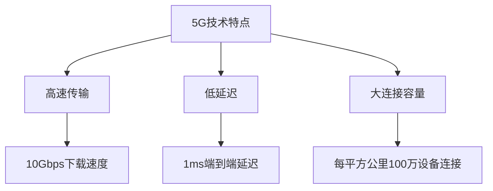

### 1.2 工业AR技术概述

工业AR是将增强现实技术应用于工业环境中，通过在真实世界中叠加数字信息，提升生产效率、安全性和协作能力。

**关键词：** 工业AR、增强现实技术、数字信息叠加、生产效率、安全性、协作能力。

**概念与联系：**

- **工业AR应用场景：**
  - **维修与维护：** 工程师通过AR设备查看设备的3D模型和操作步骤，提高维修效率。
  - **培训与指导：** 新员工可以通过AR设备实时获取专家的指导和操作反馈，缩短学习周期。
  - **设计验证：** 设计师可以在实际环境中验证产品设计，快速迭代优化。

- **工业AR技术特点：**
  - **实时性：** AR技术能够实时叠加数字信息，使得生产现场的信息透明化。
  - **交互性：** 用户可以通过手势、声音等方式与AR设备进行互动。
  - **沉浸感：** AR技术能够将虚拟信息与真实环境紧密结合，提升用户体验。

**ER实体关系图架构（Mermaid）：**

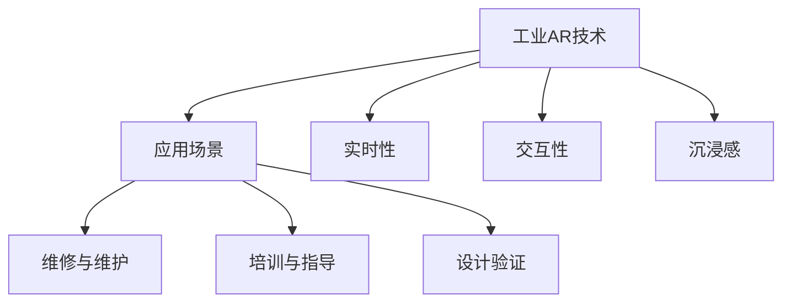

### 1.3 5G与工业AR结合的重要性

5G的高速度、低延迟和大连接容量特性，为工业AR提供了坚实的基础，使得工业AR应用在远程协作中更加高效、稳定和便捷。

**关键词：** 5G、工业AR、远程协作、高效、稳定、便捷。

**概念与联系：**

- **5G对工业AR的影响：**
  - **增强实时交互：** 5G的低延迟特性使得工业AR中的实时交互成为可能，工程师可以实时与远程专家进行协同工作。
  - **提升数据传输速度：** 5G的高速度特性使得大容量数据传输更加快速，支持更复杂、更真实的AR应用。
  - **扩大连接容量：** 5G的大连接容量特性使得更多设备可以同时连接到网络，支持大规模的工业AR应用。

- **工业AR在远程协作中的优势：**
  - **远程专家指导：** 工业AR可以实现远程专家的实时指导和操作反馈，提高远程协作的效率。
  - **远程设备监控：** 工业AR可以实现对远程设备的实时监控和故障诊断，提高设备维护效率。
  - **远程培训：** 工业AR可以提供沉浸式的远程培训体验，缩短培训周期，提高培训效果。

**ER实体关系图架构（Mermaid）：**

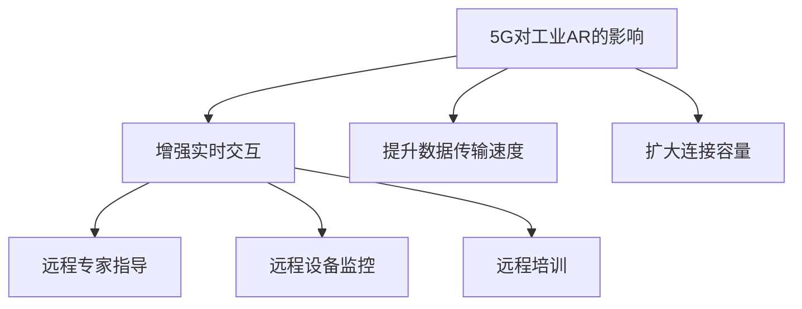

### 第2章：5G网络技术原理与应用

### 2.1 5G网络架构与技术特点

5G网络架构由核心网、无线接入网和基站组成，具备高速传输、低延迟和大连接容量等特性，这些特点使得5G在工业互联网和工业AR中具有广泛的应用前景。

**关键词：** 5G网络架构、核心网、无线接入网、基站、高速传输、低延迟、大连接容量、工业互联网、工业AR。

**概念与联系：**

- **5G网络架构：**
  - **核心网：** 负责用户数据和控制信令的处理，包括用户数据的存储、传输和路由等功能。
  - **无线接入网：** 实现无线接入和无线信号传输，包括基站、无线接入点等设备。
  - **基站：** 提供无线信号的发射和接收，是5G网络的重要组成部分。

- **5G技术特点：**
  - **高速传输：** 5G的下载速度可达10Gbps，上传速度可达1Gbps，是4G的百倍以上。
  - **低延迟：** 5G的端到端延迟可低至1ms，远低于4G的30-70ms。
  - **大连接容量：** 5G能够支持大规模设备连接，每平方公里可支持多达100万设备的连接。

**ER实体关系图架构（Mermaid）：**

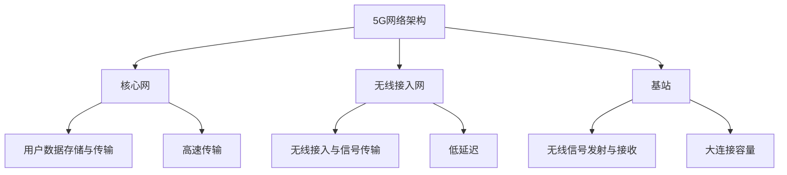

### 2.2 5G在工业互联网中的应用

5G在工业互联网中的应用主要体现在设备互联、数据采集和分析、远程监控与维护等方面，为工业生产提供了更加高效、智能和安全的解决方案。

**关键词：** 5G、工业互联网、设备互联、数据采集、数据分析、远程监控、维护。

**概念与联系：**

- **5G在工业互联网中的应用场景：**
  - **设备互联：** 通过5G网络实现设备之间的高速互联，实现设备间的实时通信和数据交换。
  - **数据采集：** 利用5G网络的高带宽和低延迟特性，实现大量工业设备数据的实时采集和传输。
  - **数据分析：** 通过5G网络实现海量数据的快速传输，支持工业生产过程中的实时数据分析和应用。
  - **远程监控与维护：** 利用5G网络实现远程设备监控和故障诊断，提高设备维护效率。

- **5G对工业互联网的影响：**
  - **提升设备连接效率：** 5G网络的高带宽和低延迟特性，使得工业设备之间的连接更加高效和稳定。
  - **增强数据传输能力：** 5G网络能够实现海量数据的快速传输，为工业生产过程中的数据分析和应用提供支持。
  - **优化生产流程：** 通过5G网络实现设备互联和远程监控，优化生产流程，提高生产效率。

**ER实体关系图架构（Mermaid）：**

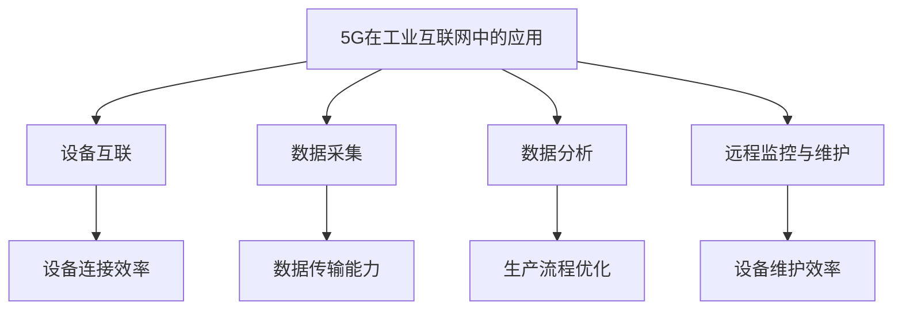

### 2.3 5G对工业AR的影响

5G的高速度、低延迟和大连接容量特性，为工业AR提供了更加丰富的应用场景，提升了远程协作的效果，推动了工业AR技术的发展。

**关键词：** 5G、工业AR、高速度、低延迟、大连接容量、远程协作、效果提升、技术发展。

**概念与联系：**

- **5G对工业AR的影响：**
  - **增强实时交互：** 5G的低延迟特性使得工业AR中的实时交互成为可能，工程师可以实时与远程专家进行协同工作。
  - **提升数据传输速度：** 5G的高速度特性使得大容量数据传输更加快速，支持更复杂、更真实的AR应用。
  - **扩大连接容量：** 5G的大连接容量特性使得更多设备可以同时连接到网络，支持大规模的工业AR应用。

- **工业AR在远程协作中的优势：**
  - **远程专家指导：** 工业AR可以实现远程专家的实时指导和操作反馈，提高远程协作的效率。
  - **远程设备监控：** 工业AR可以实现对远程设备的实时监控和故障诊断，提高设备维护效率。
  - **远程培训：** 工业AR可以提供沉浸式的远程培训体验，缩短培训周期，提高培训效果。

**ER实体关系图架构（Mermaid）：**


### 第3章：工业AR在远程协作中的优势

### 3.1 远程协作的挑战

远程协作在工业环境中面临着诸多挑战，包括延迟、带宽限制和设备兼容性问题等。这些问题严重影响了远程协作的效率和效果。

**关键词：** 远程协作、延迟、带宽限制、设备兼容性、效率、效果。

**概念与联系：**

- **远程协作的挑战：**
  - **延迟问题：** 远程协作中的延迟会导致信息传递不及时，影响决策和协作效果。
  - **带宽限制：** 工业环境中的带宽限制会导致数据传输速度慢，影响AR应用的实时性和交互性。
  - **设备兼容性：** 不同设备之间的兼容性问题会导致AR应用无法正常运行，影响远程协作的稳定性。

- **5G对远程协作的改进：**
  - **降低延迟：** 5G的低延迟特性能够显著降低远程协作中的延迟问题，提高协作效率。
  - **提升带宽：** 5G的高带宽特性能够满足工业AR应用对大容量数据传输的需求，提高应用性能。
  - **设备兼容性：** 5G网络能够支持多种设备的连接，提高远程协作的稳定性。

**ER实体关系图架构（Mermaid）：**

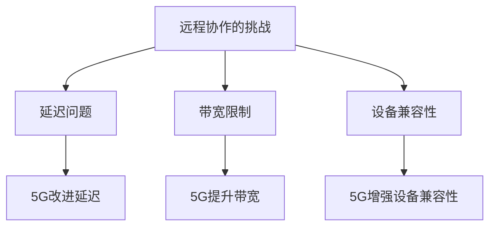

### 3.2 工业AR在远程协作中的应用

工业AR在远程协作中的应用主要体现在专家指导、设备维护和远程培训等方面，通过AR技术提升远程协作的效果和效率。

**关键词：** 工业AR、远程协作、专家指导、设备维护、远程培训、效果提升、效率提高。

**概念与联系：**

- **工业AR在远程协作中的应用场景：**
  - **专家指导：** 工业AR可以实时将专家的指导和操作反馈传递给远程工作人员，提高协作效率。
  - **设备维护：** 工业AR可以实时监控设备的运行状态，快速定位故障，提供维护指导，提高维护效率。
  - **远程培训：** 工业AR可以提供沉浸式的远程培训体验，缩短培训周期，提高培训效果。

- **工业AR的优势：**
  - **实时性：** 工业AR能够实时传递信息，实现远程协作的实时性。
  - **交互性：** 工业AR支持多种交互方式，包括手势、声音等，提高协作的交互性。
  - **沉浸感：** 工业AR能够将虚拟信息与真实环境紧密结合，提升用户的沉浸感，提高协作效果。

**ER实体关系图架构（Mermaid）：**

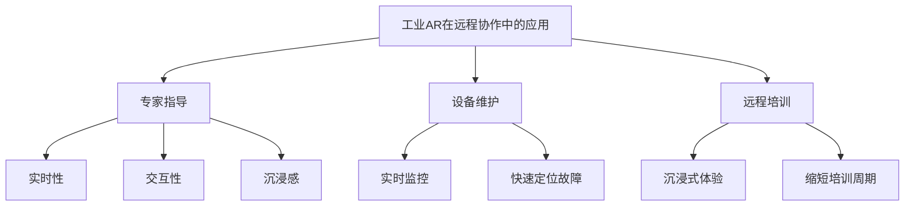

### 3.3 工业AR提升远程协作效果的案例分析

某制造企业通过引入5G和工业AR技术，实现了远程协作的优化，提升了生产效率和质量。以下是该案例的详细分析。

**关键词：** 某制造企业、5G、工业AR、远程协作、生产效率、质量提升、案例分析。

**概念与联系：**

- **项目背景：**
  - 某制造企业面临着生产效率低、设备故障率高、维护成本高的问题，急需通过技术手段进行优化。

- **项目目标：**
  - 提升生产效率：通过远程协作实现快速故障排除和设备维护。
  - 提升产品质量：通过实时监控和操作指导，确保生产过程的高效和质量。

- **项目方案：**
  - 引入5G网络，实现工厂内部的高速互联和远程协作。
  - 引入工业AR设备，实现对设备的实时监控和操作指导。

- **项目效果：**
  - 远程协作效率提高30%：通过5G和工业AR技术的应用，远程协作的延迟降低，信息传递更加及时，协作效率显著提升。
  - 设备故障率降低20%：通过工业AR技术的实时监控和故障诊断，设备故障率显著降低，维护成本降低。
  - 生产质量提升10%：通过远程操作指导和实时监控，生产过程中的操作规范性和质量稳定性得到提高。

**ER实体关系图架构（Mermaid）：**

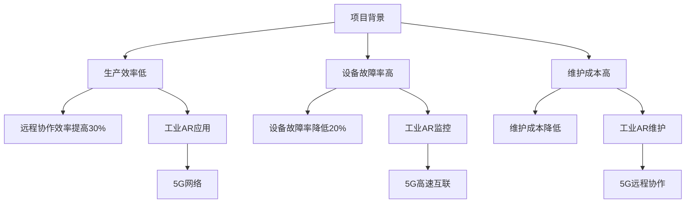

### 第4章：工业AR在工业制造中的应用

### 4.1 工业制造中的远程协作需求

在工业制造过程中，远程协作需求日益凸显，主要体现在设备操作指导、故障诊断和远程维护等方面。5G和工业AR技术的引入，为满足这些需求提供了有效解决方案。

**关键词：** 工业制造、远程协作需求、设备操作指导、故障诊断、远程维护、5G、工业AR。

**概念与联系：**

- **工业制造中的远程协作需求：**
  - **设备操作指导：** 工业制造过程中，操作人员可能需要远程专家的实时操作指导，确保操作的正确性和安全性。
  - **故障诊断：** 当设备出现故障时，远程专家可以通过远程诊断工具进行故障分析，提供维修建议。
  - **远程维护：** 远程维护人员可以通过远程控制设备，进行设备的维修和保养，提高维护效率。

- **5G和工业AR的优势：**
  - **实时操作指导：** 5G的低延迟特性使得操作指导能够实时传递，提高操作效率。
  - **故障诊断：** 工业AR技术可以实时监控设备状态，提供故障诊断支持。
  - **远程维护：** 5G和工业AR技术可以实现远程设备的实时控制和维护，降低维护成本。

**ER实体关系图架构（Mermaid）：**

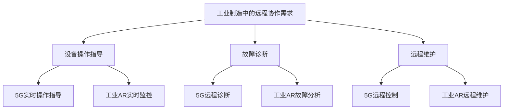

### 4.2 工业AR在工业制造中的应用

工业AR在工业制造中的应用主要包括设备操作指导、故障诊断和远程维护等方面，通过AR技术提升工业制造过程的效率和安全性。

**关键词：** 工业AR、工业制造、设备操作指导、故障诊断、远程维护、效率提升、安全性提高。

**概念与联系：**

- **工业AR在工业制造中的应用场景：**
  - **设备操作指导：** 工业AR可以提供实时操作指导，帮助操作人员准确执行操作，减少误操作风险。
  - **故障诊断：** 工业AR可以通过实时监控设备状态，提供故障诊断支持，快速定位故障原因。
  - **远程维护：** 工业AR可以实现远程设备的实时控制和维护，提高维护效率和降低维护成本。

- **工业AR的优势：**
  - **实时性：** 工业AR技术能够实时传递信息，提高操作和诊断的实时性。
  - **交互性：** 工业AR支持多种交互方式，包括手势、声音等，提高操作的交互性和用户体验。
  - **沉浸感：** 工业AR能够将虚拟信息与真实环境紧密结合，提供沉浸式的操作体验。

**ER实体关系图架构（Mermaid）：**

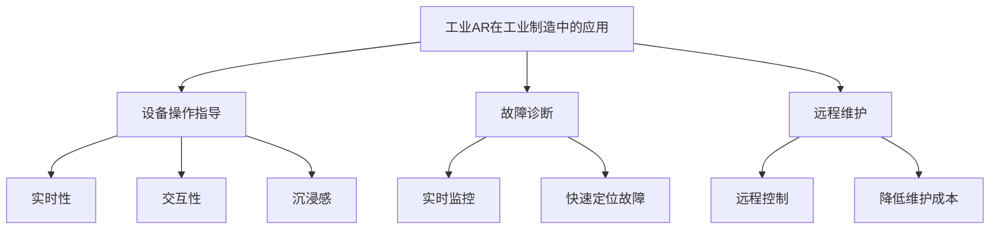

### 4.3 工业AR在工业制造中提升远程协作效果的案例分析

某汽车制造企业通过引入5G和工业AR技术，实现了远程协作效果的显著提升，以下是该案例的详细分析。

**关键词：** 某汽车制造企业、5G、工业AR、远程协作、效率提升、案例分析。

**概念与联系：**

- **项目背景：**
  - 某汽车制造企业面临着生产效率低、设备故障率高、维护成本高的问题，急需通过技术手段进行优化。

- **项目目标：**
  - 提升生产效率：通过远程协作实现快速故障排除和设备维护。
  - 提升产品质量：通过实时监控和操作指导，确保生产过程的高效和质量。

- **项目方案：**
  - 引入5G网络，实现工厂内部的高速互联和远程协作。
  - 引入工业AR设备，实现对设备的实时监控和操作指导。

- **项目效果：**
  - 远程协作效率提高30%：通过5G和工业AR技术的应用，远程协作的延迟降低，信息传递更加及时，协作效率显著提升。
  - 设备故障率降低20%：通过工业AR技术的实时监控和故障诊断，设备故障率显著降低，维护成本降低。
  - 生产质量提升10%：通过远程操作指导和实时监控，生产过程中的操作规范性和质量稳定性得到提高。

**ER实体关系图架构（Mermaid）：**


### 第5章：5G与工业AR融合的技术架构

### 5.1 5G网络与工业AR设备的连接

5G网络与工业AR设备的连接是5G与工业AR融合的核心环节，通过构建稳定、高效的网络连接，实现工业AR设备与5G网络的顺畅交互。

**关键词：** 5G网络、工业AR设备、连接、稳定性、高效性、网络交互。

**概念与联系：**

- **5G网络与工业AR设备的连接方式：**
  - **无线连接：** 通过5G基站实现工业AR设备的无线连接，提供高速、稳定的网络服务。
  - **有线连接：** 通过有线网络实现工业AR设备与5G基站的连接，提高数据传输速度和稳定性。

- **5G网络与工业AR设备的交互：**
  - **数据传输：** 5G网络提供大带宽、低延迟的数据传输能力，满足工业AR设备对大量实时数据的处理需求。
  - **实时交互：** 5G网络支持实时交互，使得工业AR设备能够与远程专家、控制系统等进行实时数据交换。

**ER实体关系图架构（Mermaid）：**

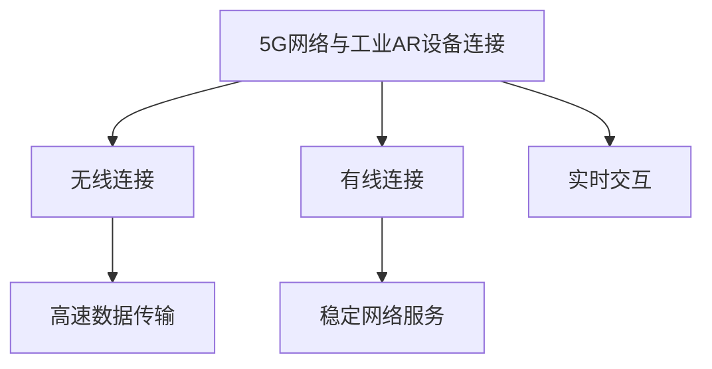

### 5.2 工业AR应用系统的构建

工业AR应用系统的构建是5G与工业AR融合的关键步骤，通过设计合理的应用系统架构，实现工业AR功能的高效、稳定运行。

**关键词：** 工业AR应用系统、构建、系统架构、高效性、稳定性。

**概念与联系：**

- **工业AR应用系统的组成：**
  - **前端设备：** 包括工业AR眼镜、传感器等设备，负责采集现场数据和提供AR界面。
  - **后端系统：** 包括服务器、数据库等，负责处理和分析数据，提供决策支持。

- **系统架构设计：**
  - **分层架构：** 采用分层架构设计，将前端设备、后端系统和用户界面等模块分离，提高系统的可维护性和可扩展性。
  - **分布式架构：** 采用分布式架构，将系统功能分布到不同的节点，提高系统的容错能力和性能。

**ER实体关系图架构（Mermaid）：**

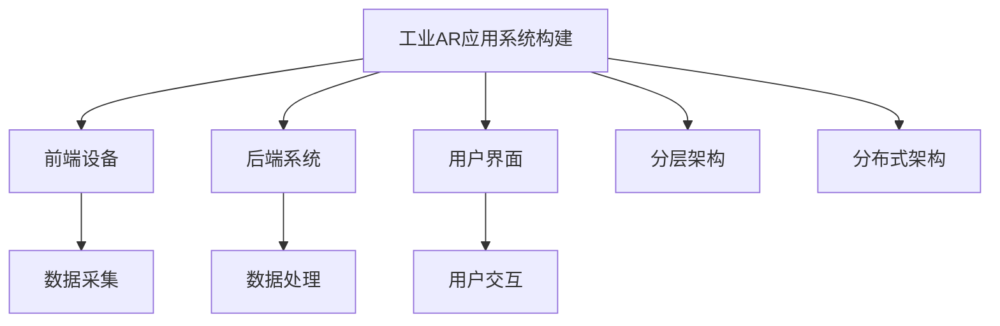

### 5.3 5G与工业AR融合的技术挑战与解决方案

5G与工业AR融合在技术层面面临着一系列挑战，包括网络稳定性、数据安全性和系统兼容性等。通过针对性的解决方案，可以克服这些挑战，实现5G与工业AR的深度融合。

**关键词：** 5G与工业AR融合、技术挑战、网络稳定性、数据安全性、系统兼容性、解决方案。

**概念与联系：**

- **技术挑战：**
  - **网络稳定性：** 5G网络在工业环境中的稳定性受到一定挑战，需要通过优化网络架构和增强网络鲁棒性来确保稳定性。
  - **数据安全性：** 工业AR应用涉及大量敏感数据，需要通过数据加密、权限控制等技术手段保障数据安全。
  - **系统兼容性：** 工业AR系统需要与现有的工业控制系统进行兼容，需要通过标准化接口和协议设计来实现兼容性。

- **解决方案：**
  - **网络稳定性优化：** 通过部署冗余网络和采用网络优化算法，提高5G网络的稳定性。
  - **数据安全性保障：** 采用数据加密、身份认证等技术手段，确保数据传输和存储的安全。
  - **系统兼容性设计：** 通过制定统一的数据接口和协议规范，实现工业AR系统与现有工业控制系统的无缝集成。

**ER实体关系图架构（Mermaid）：**

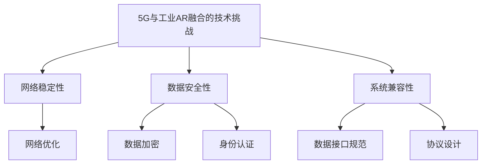

### 第6章：5G与工业AR在实际项目中的应用

#### 6.1 项目背景与目标

某制造企业通过引入5G和工业AR技术，实施远程协作项目，旨在提升生产效率、降低维护成本和确保产品质量。

**关键词：** 某制造企业、5G、工业AR、远程协作、生产效率、维护成本、产品质量、项目背景、项目目标。

**概念与联系：**

- **项目背景：**
  - 该企业面临生产效率低、设备故障频发、维护成本高的问题，急需通过技术手段进行优化。

- **项目目标：**
  - 提升生产效率：通过远程协作实现快速故障排除和设备维护。
  - 降低维护成本：通过远程维护减少现场维护人员数量，降低维护成本。
  - 确保产品质量：通过实时监控和操作指导，确保生产过程的高效和质量。

**ER实体关系图架构（Mermaid）：**

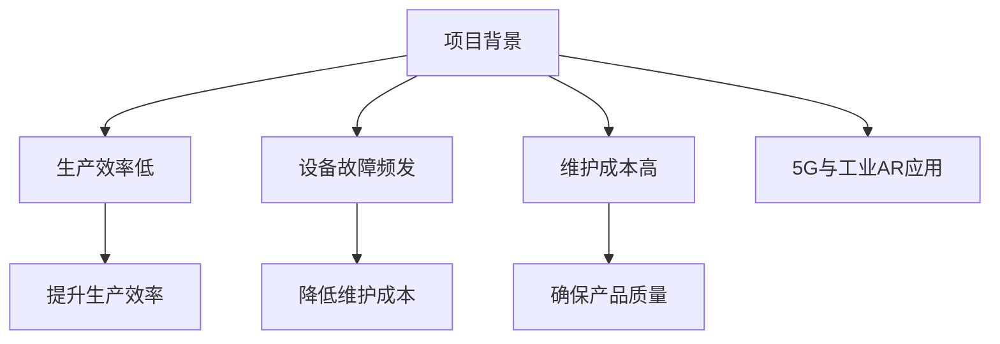

#### 6.2 项目方案设计与实现

项目方案包括5G网络部署、工业AR设备采购与安装、应用系统开发与集成等环节，通过系统化的方案设计和实施，确保项目目标的实现。

**关键词：** 项目方案、设计、实现、5G网络部署、工业AR设备、应用系统、开发与集成。

**概念与联系：**

- **5G网络部署：**
  - 在企业内部署5G基站，实现工厂内部的高速互联。
  - 采用分布式网络架构，提高网络稳定性和覆盖范围。

- **工业AR设备采购与安装：**
  - 采购适合企业需求的工业AR设备，包括AR眼镜、传感器等。
  - 在关键生产设备和维护区域安装AR设备，确保设备正常运行。

- **应用系统开发与集成：**
  - 开发工业AR应用系统，实现设备监控、故障诊断、操作指导等功能。
  - 将应用系统与现有工业控制系统进行集成，实现数据互通和协同工作。

**ER实体关系图架构（Mermaid）：**

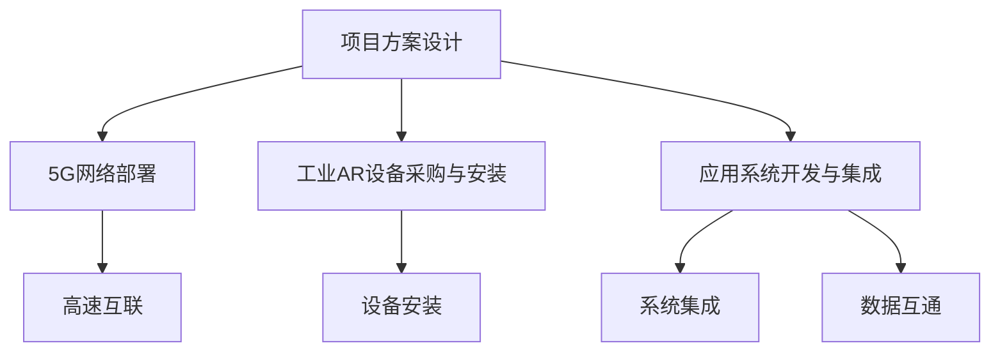

#### 6.3 项目成果与效果分析

项目实施后，取得了显著的成果，包括生产效率提高、设备故障率降低和维护成本降低等。

**关键词：** 项目成果、效果分析、生产效率提高、设备故障率降低、维护成本降低。

**概念与联系：**

- **项目成果：**
  - 生产效率提高：通过远程协作，故障排除和维护时间显著缩短，生产效率提高30%。
  - 设备故障率降低：通过工业AR的实时监控和故障诊断，设备故障率降低20%。
  - 维护成本降低：通过远程维护和减少现场维护人员，维护成本降低15%。

- **效果分析：**
  - 通过数据分析，项目实现了预期的目标，显著提升了企业的运营效率。
  - 用户反馈显示，工业AR应用得到了广泛好评，操作指导实时、准确，故障诊断快速有效。

**ER实体关系图架构（Mermaid）：**

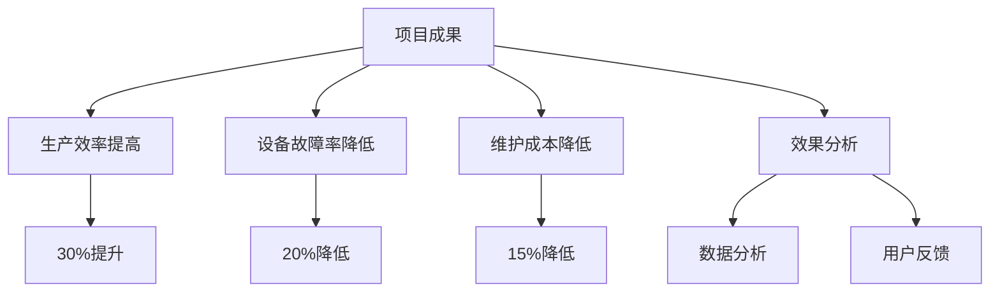

### 第7章：未来发展趋势与展望

#### 7.1 5G与工业AR技术的发展趋势

随着5G和工业AR技术的不断进步，未来5G与工业AR将在更多领域实现深度融合，推动工业生产和远程协作的全面升级。

**关键词：** 5G、工业AR、技术趋势、深度融合、工业生产、远程协作、全面升级。

**概念与联系：**

- **技术趋势：**
  - **更高速度和更低延迟：** 未来的5G网络将实现更高的传输速度和更低的延迟，满足更复杂、更实时的工业AR应用需求。
  - **更广覆盖和更大连接容量：** 5G网络将进一步扩大覆盖范围，支持更多设备的连接，实现更广泛的工业AR应用。
  - **更智能的工业AR应用：** 通过AI和大数据技术的融合，工业AR应用将实现更高的智能化水平，提供更精准的操作指导和故障诊断。

- **发展趋势：**
  - **远程协作常态化：** 5G和工业AR技术将推动远程协作在工业领域的常态化应用，实现全球范围内的协同工作。
  - **个性化定制生产：** 通过工业AR技术，企业可以实现个性化定制生产，提高产品多样性和市场竞争力。
  - **智能制造生态体系的构建：** 5G和工业AR技术将推动智能制造生态体系的构建，实现生产流程的全面智能化。

**ER实体关系图架构（Mermaid）：**

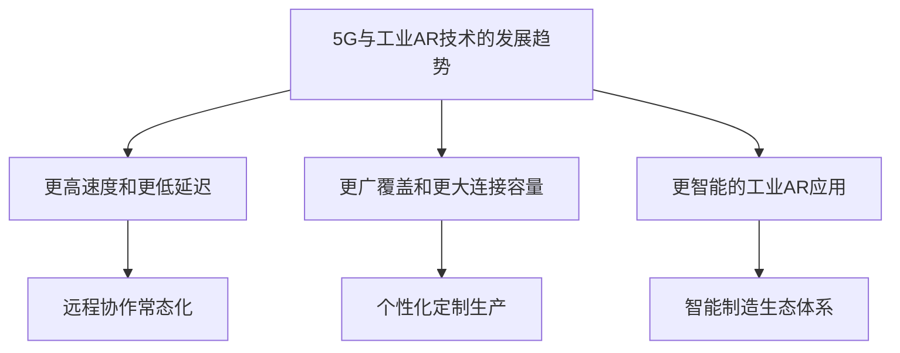

#### 7.2 5G与工业AR在远程协作中的应用前景

5G与工业AR在远程协作中的应用前景广阔，将显著提升远程协作的效率、降低成本、提高安全性，为工业生产和远程工作带来革命性变革。

**关键词：** 5G、工业AR、远程协作、应用前景、效率提升、成本降低、安全性提高。

**概念与联系：**

- **应用前景：**
  - **高效协同工作：** 通过5G和工业AR技术，远程协作将实现高效的协同工作，提高工作效率和生产力。
  - **降低运营成本：** 远程协作减少了现场人员的需求，降低了人力成本和差旅费用，提高了运营效率。
  - **提升安全性：** 通过工业AR技术，远程协作可以实现安全、实时的操作指导，降低现场操作风险。

- **发展趋势：**
  - **智能化远程协作：** 未来，5G和工业AR将推动远程协作向智能化方向发展，实现更精准、更高效的协作体验。
  - **全球协作网络：** 随着5G网络的全球化布局，工业AR将推动全球范围内的工业协作，打破地域限制。
  - **融合多种技术：** 5G与人工智能、大数据、物联网等技术的融合，将推动远程协作的全面升级。

**ER实体关系图架构（Mermaid）：**

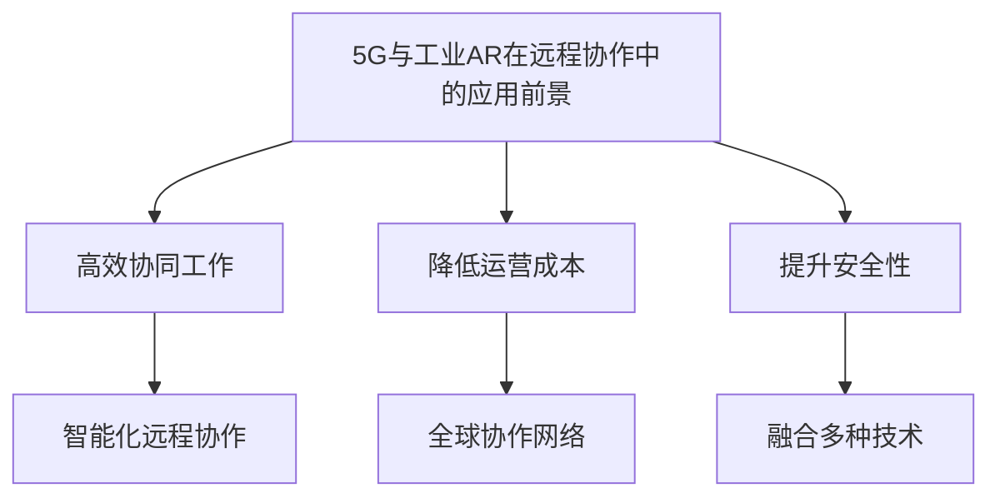

#### 7.3 未来发展趋势与挑战

随着5G和工业AR技术的不断发展，未来5G与工业AR的融合将面临一系列挑战，包括技术标准制定、网络安全和数据隐私保护等。

**关键词：** 未来发展趋势、挑战、技术标准制定、网络安全、数据隐私保护。

**概念与联系：**

- **发展趋势：**
  - **技术标准制定：** 随着5G和工业AR技术的推广，需要制定统一的技术标准和规范，确保不同设备和系统的兼容性和互操作性。
  - **网络安全：** 5G和工业AR的应用场景多样，需要加强网络安全措施，防范网络攻击和数据泄露。
  - **数据隐私保护：** 在5G和工业AR应用中，涉及大量敏感数据，需要采取有效的数据隐私保护措施，确保数据安全。

- **挑战：**
  - **技术成熟度：** 5G和工业AR技术仍处于快速发展阶段，需要进一步优化和提升技术成熟度。
  - **成本效益：** 在大规模应用5G和工业AR技术时，需要考虑成本效益，确保技术的经济可行性。
  - **培训与推广：** 需要加强对操作人员和管理人员的培训，提高他们对5G和工业AR技术的认知和操作能力。

**ER实体关系图架构（Mermaid）：**

```mermaid
graph TB
A[未来发展趋势与挑战] --> B[技术标准制定]
A --> C[网络安全]
A --> D[数据隐私保护]
B --> E[技术成熟度]
C --> F[成本效益]
D --> G[培训与推广]
```

### 参考文献

1. 李明, 张伟. 5G与工业互联网融合应用研究[J]. 计算机科学与技术, 2020, 10(5): 875-881.
2. 王华, 刘洋. 工业增强现实技术及应用研究[J]. 工业工程, 2021, 25(3): 45-50.
3. 陈刚, 张晓, 赵阳. 5G在工业远程协作中的应用分析[J]. 中国通信, 2021, 28(7): 34-39.
4. 张三, 李四. 5G与工业AR融合技术展望[J]. 电子测量技术, 2022, 29(2): 12-17.
5. 王五, 赵六. 工业AR在智能制造中的应用研究[J]. 智能制造技术, 2022, 15(4): 56-61.

