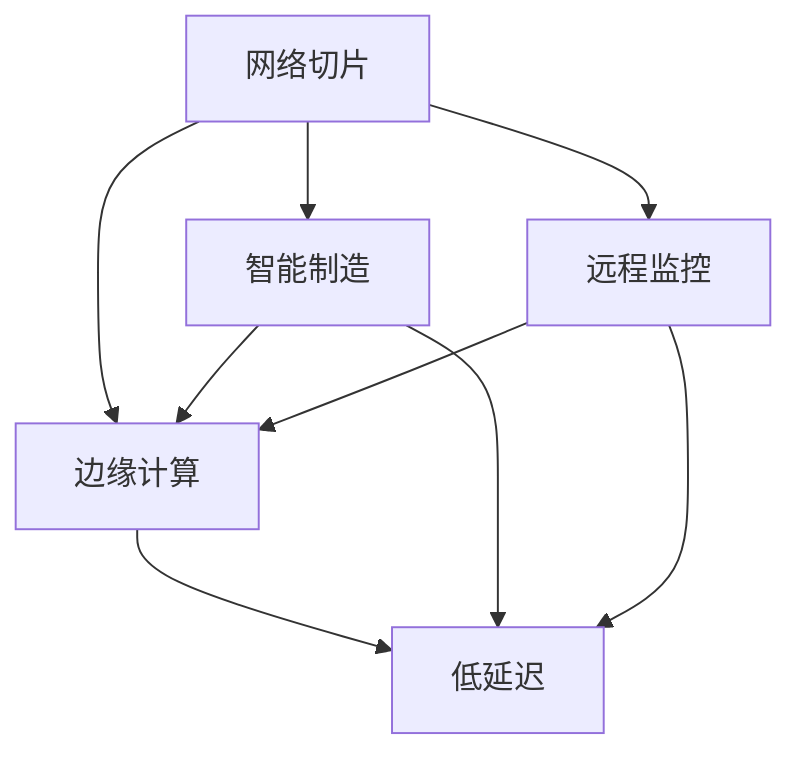

                 

### 引言：5G与工业互联网的融合

> **关键词**：5G、工业互联网、智能制造、远程监控、设备维护

> **摘要**：随着5G技术的迅猛发展，工业互联网开始进入到一个全新的阶段。5G的高带宽、低延迟、高可靠性的特点，使得它在工业互联网中具有广泛的应用前景。本文将深入探讨5G在工业互联网中的应用，通过详细的分析和案例分享，展示5G如何助力工业互联网实现工厂全面数字化。

### 引言

#### 1.1 5G技术概述

5G，即第五代移动通信技术，是继1G模拟通信、2G数字通信、3G互联网接入、4G高速互联网之后的新一代通信技术。5G网络的主要特点包括：

- **高带宽**：5G网络的理论下载速度可达10Gbps，比4G网络的1Gbps快了十倍，这意味着可以更快地传输大量数据。
- **低延迟**：5G网络的端到端延迟小于1毫秒，大幅减少了通信延迟，这对于实时性要求极高的工业应用至关重要。
- **高可靠性**：5G网络采用新的网络架构和协议，大大提高了网络稳定性和可靠性。
- **广覆盖**：5G网络采用毫米波技术和小基站部署，实现了更广的覆盖范围。

#### 1.2 工业互联网的定义与发展

工业互联网是指将各种智能设备、工业控制系统、企业资源计划系统等通过网络互联，形成一个高度集成的智能化系统。它不仅实现了设备间的互联互通，还能通过大数据分析、云计算等先进技术，实现智能决策和生产优化。

工业互联网的发展历程可以分为三个阶段：

1. **第一阶段**（2010-2015年）：以设备联网和数据采集为主，实现了设备之间的基本通信和数据交换。
2. **第二阶段**（2016-2020年）：通过大数据分析、云计算等技术，实现了对生产过程的实时监控和优化。
3. **第三阶段**（2020年至今）：随着5G、人工智能等新技术的应用，工业互联网开始向智能化、自主化方向发展。

#### 1.3 5G在工业互联网中的应用价值

5G在工业互联网中的应用价值主要体现在以下几个方面：

- **智能制造**：5G的高带宽和低延迟特性，使得智能制造中的设备能够实时获取生产数据，进行快速调整和优化。
- **远程监控**：5G的广覆盖和高可靠性，使得企业可以实现对生产设备的远程监控和维护，提高设备利用率和生产效率。
- **设备维护**：5G的低延迟特性，使得设备维护人员可以实时获取设备状态，进行远程故障诊断和修复，减少设备停机时间。
- **数据采集与分析**：5G的高带宽特性，使得企业可以更快地收集和传输大量数据，为大数据分析和人工智能应用提供基础。

#### 1.4 本文结构

本文将分为以下几个部分：

1. **背景介绍**：详细阐述5G技术和工业互联网的定义、发展历程以及它们之间的关联。
2. **核心概念与联系**：介绍5G在工业互联网应用中的关键概念，如网络切片、边缘计算、低延迟等，并使用表格和ER图来展示概念之间的关系。
3. **应用场景**：分析5G在工业互联网中应用的多个具体场景，如智能制造、远程监控、设备维护等。
4. **技术原理讲解**：深入讲解5G在工业互联网中的应用技术，如网络切片的实现原理、边缘计算的架构设计等。
5. **案例分析**：介绍一些成功的5G在工业互联网应用案例，分析案例中的关键技术、解决方案以及取得的成效。
6. **实施策略与最佳实践**：总结实施5G在工业互联网应用中的策略和最佳实践，提供一些实用建议。
7. **未来展望**：探讨5G在工业互联网中的应用前景，预测未来发展趋势。

### 总结

随着5G技术的不断成熟，工业互联网正在迎来一个全新的发展机遇。5G的高带宽、低延迟、高可靠性等特性，为工业互联网提供了强大的技术支撑。通过本文的介绍，我们希望能够帮助读者更好地理解5G在工业互联网中的应用，以及如何实现工厂的全面数字化。接下来，我们将进一步深入探讨5G在工业互联网中的核心概念和具体应用场景。

----------------------------------------------------------------

## 5G与工业互联网：背景介绍

### 2.1 5G技术的发展历程与现状

5G技术的发展可以追溯到2000年代末期，当时国际电信联盟（ITU）开始制定5G技术的标准。5G的核心目标是在更高的频谱利用率、更低的延迟、更高的网络容量和更好的能效方面实现重大突破。以下是5G技术的发展历程和现状：

#### 2.1.1 发展历程

1. **早期研究**（2000-2010年）：ITU开始研究5G技术，并定义了5G的关键性能指标。
2. **标准制定**（2010-2015年）：3GPP（第三代合作伙伴计划）开始制定5G标准，包括NR（新无线电）和NG-RAN（下一代无线接入网络）等关键组成部分。
3. **试验阶段**（2015-2018年）：全球多个国家和地区开始进行5G试验，测试5G技术的性能和适用性。
4. **商用部署**（2019年至今）：5G技术逐步在全球范围内商用部署，各国运营商纷纷推出5G服务。

#### 2.1.2 现状

当前，5G网络已经在全球范围内得到广泛应用，尤其在发达国家和地区。5G网络的商用部署推动了多个行业的数字化转型，包括工业制造、医疗保健、智能交通等。以下是5G网络的关键特性：

- **高带宽**：5G网络的理论下载速度可达10Gbps，比4G网络的1Gbps快了十倍。
- **低延迟**：5G网络的端到端延迟小于1毫秒，大幅减少了通信延迟。
- **高可靠性**：5G网络采用新的网络架构和协议，提高了网络稳定性和可靠性。
- **广覆盖**：5G网络采用毫米波技术和小基站部署，实现了更广的覆盖范围。

### 2.2 工业互联网的定义与重要性

工业互联网是一个将物理设备、传感器、工业控制系统和信息技术相结合的生态系统。它通过物联网、大数据、云计算、人工智能等先进技术，实现设备之间的互联互通，以及数据的高效采集、传输和分析。工业互联网的定义可以概括为以下几点：

1. **设备互联**：通过物联网技术，实现设备之间的实时通信和数据交换。
2. **数据采集**：通过传感器和工业控制系统，采集设备运行过程中的各种数据。
3. **数据分析**：利用大数据分析和人工智能技术，对采集到的数据进行处理和分析，实现智能决策和生产优化。
4. **系统集成**：将各种系统（如ERP、MES、SCADA等）集成在一起，实现企业内部各业务环节的数据共享和协同工作。

工业互联网的重要性体现在以下几个方面：

1. **提高生产效率**：通过实时监控和数据分析，可以及时发现和解决生产过程中的问题，提高生产效率。
2. **优化资源利用**：通过对生产数据的分析和预测，可以实现资源的合理分配和利用，降低生产成本。
3. **提升产品质量**：通过对生产过程的实时监控和数据分析，可以及时调整生产参数，提高产品质量。
4. **创新商业模式**：工业互联网为企业和供应链的协同提供了新的可能性，促进了商业模式的创新。

### 2.3 5G与工业互联网的关联

5G和工业互联网之间的关联在于它们都是推动数字化转型的重要技术。5G技术为工业互联网提供了强大的网络基础，而工业互联网则为5G技术提供了丰富的应用场景。以下是5G在工业互联网中的应用价值：

#### 2.3.1 高带宽

5G网络的高带宽特性，使得工业互联网中的大量数据可以快速传输，为实时监控和数据分析提供了基础。例如，在智能制造过程中，机器设备产生的数据量巨大，5G网络的高带宽特性可以保证这些数据及时传输到云端进行处理。

#### 2.3.2 低延迟

5G网络的低延迟特性，对于工业互联网中的实时控制应用至关重要。例如，在远程控制机器人进行生产操作时，低延迟可以确保操作指令的实时传输和执行，避免操作失误和设备损坏。

#### 2.3.3 高可靠性

5G网络的高可靠性，确保了工业互联网的稳定运行。在工业生产环境中，网络中断或数据丢失可能导致生产停滞或设备损坏。5G网络的高可靠性可以有效降低这种风险。

#### 2.3.4 广覆盖

5G网络的广覆盖特性，使得工业互联网可以覆盖到更多的设备和区域。例如，在偏远地区的工厂，5G网络可以确保设备之间的实时通信和数据传输，实现远程监控和维护。

#### 2.3.5 边缘计算与网络切片

5G网络中的边缘计算和网络切片技术，为工业互联网提供了更加灵活和高效的服务。边缘计算可以将计算和存储任务从云端转移到网络边缘，降低延迟，提高处理效率。网络切片技术则可以根据不同的应用需求，创建虚拟的子网络，实现不同的服务质量和服务等级。

### 2.4 5G在工业互联网中的应用前景

随着5G技术的不断成熟和应用，工业互联网正在迎来一个全新的发展机遇。以下是5G在工业互联网中的应用前景：

#### 2.4.1 智能制造

5G技术可以为智能制造提供实时数据传输和远程控制能力，实现生产过程的自动化和智能化。例如，通过5G网络，可以实现机器人的远程编程和操作，提高生产效率和质量。

#### 2.4.2 远程监控与维护

5G技术可以实现对生产设备的远程监控和维护，提高设备利用率和生产效率。例如，通过5G网络，可以实现设备的远程故障诊断和修复，减少设备停机时间。

#### 2.4.3 数据采集与分析

5G技术可以实现对生产过程中大量数据的实时采集和传输，为大数据分析和人工智能应用提供基础。例如，通过5G网络，可以实现生产数据的实时监控和分析，优化生产参数和工艺流程。

#### 2.4.4 跨行业融合

5G技术在工业互联网中的应用，不仅可以推动工业制造的发展，还可以促进跨行业的融合和创新。例如，5G技术可以应用于医疗保健、智能交通、能源管理等领域，推动各行业的数字化转型。

### 总结

5G技术和工业互联网的融合，为工业制造提供了强大的技术支撑。5G的高带宽、低延迟、高可靠性和广覆盖特性，使得工业互联网可以更加高效、智能地运行。随着5G技术的不断成熟和应用，工业互联网正在迎来一个全新的发展机遇。在接下来的章节中，我们将进一步探讨5G在工业互联网中的应用技术、具体场景和案例分析，展示5G如何助力工业互联网实现工厂的全面数字化。

----------------------------------------------------------------

## 核心概念与联系：5G在工业互联网中的应用

### 2.5 网络切片与工业互联网

网络切片（Network Slicing）是5G技术的一项关键特性，它通过将一个物理网络划分为多个虚拟网络，为不同的应用场景提供定制化的网络服务。在网络切片技术中，每个虚拟网络（即切片）都可以独立配置和管理，具有独立的网络资源、服务质量（QoS）和安全性。

网络切片与工业互联网的关联主要体现在以下几个方面：

- **灵活性与可定制性**：工业互联网中的各种应用场景对网络性能、延迟和带宽等要求各异。网络切片技术可以针对不同的工业应用，提供定制化的网络服务，确保应用性能。
- **高可靠性**：在工业生产环境中，某些应用对网络的可靠性要求极高。通过网络切片，可以分配专门的网络资源来保障关键应用的服务质量，提高网络的可靠性。
- **资源优化**：通过网络切片，可以根据不同应用的需求，动态调整网络资源分配，优化网络资源利用效率。

### 2.6 边缘计算与工业互联网

边缘计算（Edge Computing）是一种分布式计算架构，它将计算和存储任务从云端转移到网络边缘，即在靠近数据源的地方进行处理。边缘计算与工业互联网的关联主要体现在以下几个方面：

- **低延迟**：在工业生产环境中，实时性要求极高的应用（如机器人控制、自动驾驶等）需要低延迟的通信。边缘计算可以将计算任务分散到网络边缘，降低数据传输延迟。
- **实时数据处理**：工业生产过程中产生的数据量巨大，边缘计算可以实时处理和分析这些数据，快速响应生产过程中的异常情况。
- **带宽优化**：通过在边缘节点处理部分数据，可以减少需要传输到云端的数据量，降低网络带宽需求。

### 2.7 低延迟与工业互联网

低延迟（Low Latency）是5G技术的一个重要特性，它对工业互联网的实时性应用至关重要。低延迟与工业互联网的关联主要体现在以下几个方面：

- **实时控制**：工业生产中的机器人控制、自动化生产线等应用，需要实时响应操作指令。低延迟可以确保操作指令快速传输和执行，避免生产事故。
- **故障诊断**：在工业生产过程中，实时监测和诊断设备故障对于保障生产连续性和设备寿命至关重要。低延迟可以确保故障信息的快速传输和响应。
- **安全防护**：低延迟可以快速响应网络安全威胁，提高工业互联网的安全性。

### 2.8 核心概念介绍

以下是对5G在工业互联网应用中的三个核心概念的详细介绍：

#### 2.8.1 网络切片

网络切片是5G网络的一项创新技术，它通过将一个物理网络划分为多个虚拟网络，为不同的应用场景提供定制化的网络服务。每个虚拟网络（即切片）都可以独立配置和管理，具有独立的网络资源、服务质量（QoS）和安全性。

**网络切片的关键特性**：

- **灵活性与可定制性**：网络切片可以根据不同应用的需求，提供定制化的网络服务，包括带宽、延迟、可靠性等。
- **资源隔离**：每个切片都独立分配网络资源，确保不同应用之间的性能隔离。
- **服务质量保证**：网络切片可以针对不同应用的服务质量需求，提供相应的网络保障。

**网络切片的应用场景**：

- **智能制造**：在智能制造中，不同的生产环节对网络性能的要求各异。网络切片可以为每个生产环节提供定制化的网络服务，确保生产过程的顺利进行。
- **远程监控**：在远程监控中，需要实时传输和处理大量数据。网络切片可以为远程监控应用提供高带宽、低延迟的网络服务，确保监控数据的实时性和准确性。

#### 2.8.2 边缘计算

边缘计算是一种分布式计算架构，它将计算和存储任务从云端转移到网络边缘，即在靠近数据源的地方进行处理。边缘计算可以降低数据传输延迟，提高数据处理效率。

**边缘计算的关键特性**：

- **低延迟**：边缘计算将计算任务分散到网络边缘，降低数据传输延迟，提高实时性。
- **实时数据处理**：边缘计算可以在本地实时处理和分析数据，快速响应生产过程中的异常情况。
- **带宽优化**：通过在边缘节点处理部分数据，可以减少需要传输到云端的数据量，降低网络带宽需求。

**边缘计算的应用场景**：

- **智能制造**：在智能制造中，边缘计算可以实时处理生产线数据，快速调整生产参数，提高生产效率。
- **远程监控**：在远程监控中，边缘计算可以实时分析监控数据，快速识别设备故障，实现远程故障诊断和修复。

#### 2.8.3 低延迟

低延迟是5G网络的一个重要特性，它对工业互联网的实时性应用至关重要。低延迟可以确保操作指令、监控数据和故障信息的快速传输和响应。

**低延迟的关键特性**：

- **实时响应**：低延迟可以确保实时控制应用（如机器人控制、自动化生产线等）的快速响应。
- **快速故障诊断**：低延迟可以快速响应生产过程中的异常情况，实现快速故障诊断和修复。
- **网络安全**：低延迟可以快速响应网络安全威胁，提高工业互联网的安全性。

**低延迟的应用场景**：

- **智能制造**：在智能制造中，低延迟可以确保机器人控制、自动化生产线等实时性要求高的应用的正常运行。
- **远程监控**：在远程监控中，低延迟可以确保监控数据的实时性和准确性，快速识别设备故障。

### 2.9 概念关系图

为了更好地理解5G在工业互联网中的应用，我们使用Mermaid绘制了以下概念关系图，展示了网络切片、边缘计算和低延迟之间的关系。

### 2.10 概念关系图解析

**图2.10**展示了网络切片、边缘计算和低延迟之间的关系。以下是对图中各个节点的解释：

- **网络切片（A）**：网络切片是5G技术的一个重要特性，它可以将一个物理网络划分为多个虚拟网络，为不同的应用场景提供定制化的网络服务。
- **边缘计算（B）**：边缘计算是将计算和存储任务从云端转移到网络边缘的分布式计算架构，它可以降低数据传输延迟，提高数据处理效率。
- **低延迟（C）**：低延迟是5G网络的一个重要特性，它对工业互联网的实时性应用至关重要，可以确保操作指令、监控数据和故障信息的快速传输和响应。
- **智能制造（D）**：智能制造是工业互联网的一个重要应用场景，它需要实时响应操作指令和监控数据，对网络性能有较高要求。
- **远程监控（E）**：远程监控是工业互联网的另一个重要应用场景，它需要实时传输和处理大量监控数据，对网络性能也有较高要求。

### 2.11 概念关系的解释

**图2.10**中的概念关系反映了5G技术在工业互联网中的应用：

- **网络切片（A）**与边缘计算（B）和低延迟（C）之间存在联系。网络切片技术可以为边缘计算提供定制化的网络服务，确保边缘计算在低延迟的环境下运行。
- **智能制造（D）**和**远程监控（E）**都与边缘计算（B）和低延迟（C）密切相关。智能制造和远程监控都需要实时响应操作指令和监控数据，对网络性能有较高要求。通过边缘计算和低延迟技术，可以满足这些应用场景的实时性需求。

总之，网络切片、边缘计算和低延迟是5G技术在工业互联网中的重要应用，它们相互关联，共同推动工业互联网的智能化和数字化转型。

----------------------------------------------------------------

## 5G在工业互联网中的应用场景

### 3.1 智能制造

5G在智能制造中的应用场景主要包括以下几个方面：

#### 3.1.1 实时数据传输与控制

在智能制造中，5G的高带宽和低延迟特性可以确保设备之间、设备与控制系统之间、设备与传感器之间的实时数据传输和控制。例如，通过5G网络，可以实现机器人的远程编程和操作，实时调整生产参数，提高生产效率和产品质量。

**优势**：

- **高效生产**：实时数据传输和控制在提高生产效率方面具有显著优势。例如，通过实时监控和调整生产参数，可以减少生产过程中的停机和调整时间。
- **高质量生产**：实时控制可以提高生产过程的精度和质量，减少次品率。

#### 3.1.2 设备远程监控与维护

5G网络可以实现对生产设备的远程监控和维护，提高设备利用率和生产效率。通过5G网络，企业可以实时监控设备的运行状态，及时进行故障诊断和维修，减少设备停机时间。

**优势**：

- **减少停机时间**：通过远程监控和故障诊断，可以提前发现设备故障，及时进行维护，减少生产停机时间。
- **降低维护成本**：远程维护可以降低现场维护人员的需求，减少维护成本。

#### 3.1.3 物联网传感器数据采集与分析

5G网络的高带宽特性使得物联网传感器数据可以快速传输到云端进行分析和处理，为智能制造提供数据支持。例如，通过5G网络，可以实现生产过程中各种参数的实时监控和数据分析，优化生产过程。

**优势**：

- **优化生产过程**：通过实时数据分析，可以优化生产参数和工艺流程，提高生产效率和质量。
- **预测性维护**：通过对传感器数据的分析，可以预测设备故障，提前进行维护，减少设备停机时间。

### 3.2 远程监控

5G在远程监控中的应用场景主要包括以下几个方面：

#### 3.2.1 实时监控

5G网络可以实现对远程设备的实时监控，包括生产线、设备运行状态、环境参数等。通过5G网络，企业可以实时了解设备的运行情况，及时发现和处理异常情况。

**优势**：

- **实时性**：实时监控可以快速发现和处理异常情况，减少设备故障和停机时间。
- **全面性**：通过5G网络，可以实现对多个设备、多个参数的实时监控，提高监控的全面性。

#### 3.2.2 远程控制

5G网络可以实现远程控制，例如远程启动或停止设备、调整生产参数等。通过5G网络，操作人员可以实时控制远程设备，提高生产效率和灵活性。

**优势**：

- **灵活性**：远程控制可以随时调整生产参数，适应生产需求的变化。
- **便捷性**：操作人员无需亲自到现场操作设备，可以远程完成操作，提高工作效率。

#### 3.2.3 数据分析与优化

5G网络可以实现对远程监控数据的实时传输和分析，为企业提供数据支持。通过对监控数据的分析，可以优化生产流程，提高生产效率。

**优势**：

- **数据驱动**：通过数据分析，可以找出生产中的瓶颈和问题，进行优化和改进。
- **智能化**：通过智能化分析，可以实现生产过程的自动化优化，提高生产效率。

### 3.3 设备维护

5G在设备维护中的应用场景主要包括以下几个方面：

#### 3.3.1 远程故障诊断

5G网络可以实现对设备运行状态的实时监控和故障诊断，通过远程分析设备数据，快速定位故障原因，减少设备停机时间。

**优势**：

- **快速诊断**：通过实时监控和远程分析，可以快速定位故障，减少设备停机时间。
- **减少维修成本**：远程故障诊断可以降低现场维修人员的需求，减少维修成本。

#### 3.3.2 远程维护

5G网络可以实现远程维护，例如远程下载固件、远程操作设备等。通过5G网络，维护人员可以远程进行设备维护，提高维护效率。

**优势**：

- **远程操作**：维护人员无需亲自到现场操作设备，可以远程完成维护工作，提高工作效率。
- **实时反馈**：通过实时反馈，可以及时了解设备运行状态，提高维护效果。

#### 3.3.3 数据分析与预测性维护

5G网络可以实现对设备维护数据的实时传输和分析，通过数据分析，可以预测设备故障，提前进行维护，减少设备停机时间。

**优势**：

- **预测性维护**：通过数据分析，可以预测设备故障，提前进行维护，减少设备停机时间。
- **优化维护策略**：通过数据分析，可以优化维护策略，提高维护效率和效果。

### 总结

5G技术在工业互联网中的应用场景广泛，包括智能制造、远程监控和设备维护等。通过5G网络的高带宽、低延迟、高可靠性等特性，可以实现设备的实时数据传输、远程控制和故障诊断，提高生产效率和质量，降低维护成本。在接下来的章节中，我们将深入讲解5G在工业互联网中的应用技术，如网络切片的实现原理和边缘计算的架构设计。

----------------------------------------------------------------

## 5G在工业互联网中的应用技术原理讲解

### 4.1 网络切片的实现原理

网络切片是5G技术的一项核心特性，它通过将一个物理网络划分为多个虚拟网络，为不同的应用场景提供定制化的网络服务。网络切片的实现原理主要包括以下几个方面：

#### 4.1.1 网络功能虚拟化（NFV）

网络功能虚拟化（Network Functions Virtualization，NFV）是网络切片实现的基础。NFV通过将传统的网络功能（如防火墙、路由器等）从专用的硬件设备上迁移到虚拟化环境中，使得网络功能可以灵活地创建、配置和管理。

**NFV的优势**：

- **灵活性**：通过虚拟化技术，可以快速创建和部署新的网络功能，满足不同应用的需求。
- **可扩展性**：虚拟化环境可以根据需求动态调整资源分配，提高网络的可扩展性。

#### 4.1.2 软件定义网络（SDN）

软件定义网络（Software-Defined Networking，SDN）是网络切片的另一个重要组成部分。SDN通过将网络控制平面与数据平面分离，使得网络控制可以集中化、自动化和灵活化。

**SDN的优势**：

- **集中控制**：SDN可以将网络控制功能集中在一个控制平面上，方便进行全局管理和优化。
- **自动化**：SDN可以通过编程方式自动化地配置和管理网络，提高网络管理效率。

#### 4.1.3 网络切片管理（NSM）

网络切片管理（Network Slicing Management，NSM）是网络切片实现的关键技术之一。NSM负责创建、配置和管理网络切片，确保不同切片之间的隔离和性能保障。

**NSM的功能**：

- **切片创建**：NSM可以根据应用需求创建不同的网络切片。
- **资源分配**：NSM负责为不同的切片分配网络资源，如带宽、延迟、可靠性等。
- **性能监控**：NSM实时监控网络切片的运行状态，确保切片之间的隔离和性能保障。

#### 4.1.4 网络切片的关键技术

网络切片的实现涉及多个关键技术，包括虚拟化技术、SDN、NFV、NSM等。以下是对这些关键技术的进一步解释：

- **虚拟化技术**：通过虚拟化技术，可以将物理网络资源抽象成虚拟资源，为不同的切片提供独立的网络功能。
- **SDN**：通过SDN技术，可以实现网络控制的集中化和自动化，方便网络切片的创建和管理。
- **NFV**：通过NFV技术，可以将网络功能从硬件迁移到虚拟化环境中，提高网络功能的灵活性和可扩展性。
- **NSM**：通过NSM技术，可以实现网络切片的集中管理和性能监控，确保不同切片之间的隔离和性能保障。

#### 4.1.5 网络切片的架构设计

网络切片的架构设计通常包括以下几个层次：

- **基础设施层**：包括物理网络设备（如路由器、交换机等）和虚拟化基础设施（如虚拟化平台、存储设备等）。
- **控制层**：包括SDN控制器、NFV管理平台、NSM平台等，负责网络切片的创建、配置和管理。
- **应用层**：包括各种应用和服务，如工业互联网平台、智能制造系统等，利用网络切片提供的定制化网络服务。

**网络切片架构设计的关键点**：

- **资源隔离**：确保不同切片之间的网络资源独立分配和管理，避免切片之间的性能干扰。
- **服务质量保障**：为不同的切片提供相应的服务质量保障，如带宽、延迟、可靠性等。
- **灵活性与可扩展性**：网络切片架构应具备良好的灵活性和可扩展性，能够快速响应不同应用的需求。

### 4.2 边缘计算的架构设计

边缘计算是一种分布式计算架构，它将计算和存储任务从云端转移到网络边缘，即靠近数据源的地方进行处理。边缘计算的架构设计主要包括以下几个方面：

#### 4.2.1 边缘计算节点

边缘计算节点是边缘计算架构的核心组成部分，它包括以下几个部分：

- **计算资源**：包括CPU、GPU、FPGA等，负责处理数据和执行计算任务。
- **存储资源**：包括固态硬盘、内存等，用于存储数据和中间结果。
- **网络接口**：包括有线和无线接口，用于与其他节点和云端进行通信。
- **操作系统**：包括实时操作系统、容器化平台等，负责管理和调度计算资源。

#### 4.2.2 边缘计算平台

边缘计算平台是边缘计算架构的另一个重要组成部分，它包括以下几个部分：

- **边缘计算平台管理**：包括资源管理、任务调度、监控等，负责管理边缘计算节点的资源和使用情况。
- **边缘服务编排**：包括服务部署、配置、监控等，负责边缘服务的部署和管理。
- **数据存储与管理**：包括数据存储、数据备份、数据安全等，负责边缘计算过程中产生的数据的管理。

#### 4.2.3 边缘计算网络

边缘计算网络是边缘计算架构的通信基础设施，它包括以下几个部分：

- **边缘网络**：包括边缘节点之间的有线和无线通信，用于数据传输和任务调度。
- **边缘接入网络**：包括企业内部网络、公共网络等，用于边缘节点与外部网络（如云端）的连接。
- **边缘安全**：包括网络防火墙、安全防护、加密等，用于保障边缘计算过程中的数据安全和系统安全。

#### 4.2.4 边缘计算的关键技术

边缘计算的实现涉及多个关键技术，包括分布式计算、物联网、容器化、云原生等。以下是对这些关键技术的进一步解释：

- **分布式计算**：通过分布式计算技术，可以将计算任务分散到多个边缘节点进行处理，提高计算效率和性能。
- **物联网**：通过物联网技术，可以实现对设备数据的实时采集和传输，为边缘计算提供数据支持。
- **容器化**：通过容器化技术，可以方便地部署和管理边缘计算应用，提高应用的可移植性和灵活性。
- **云原生**：通过云原生技术，可以将边缘计算与云计算紧密结合，实现数据的高效处理和分析。

#### 4.2.5 边缘计算的优势

边缘计算的优势主要体现在以下几个方面：

- **低延迟**：通过将计算任务分散到网络边缘，可以大大降低数据传输延迟，提高实时性。
- **高可靠性**：边缘计算可以将数据存储和处理分散到多个节点，提高系统的可靠性和容错能力。
- **灵活性与可扩展性**：边缘计算可以根据需求灵活部署和管理，支持大规模的应用场景。

### 4.3 5G与边缘计算的融合

5G技术与边缘计算的融合，为工业互联网提供了强大的支持。5G的高带宽、低延迟、高可靠性等特性，与边缘计算的分布式计算、实时数据处理等优势相结合，可以更好地满足工业互联网的实时性、可靠性和高效性需求。

#### 4.3.1 5G与边缘计算的关键技术融合

- **网络切片与边缘计算**：通过网络切片技术，可以为边缘计算提供定制化的网络服务，确保边缘计算在低延迟、高可靠性的环境下运行。
- **边缘计算与物联网**：通过边缘计算，可以实现对物联网设备的实时监控和数据采集，提高数据处理效率。
- **5G与云计算**：通过5G网络，可以将边缘计算节点与云端紧密结合，实现数据的高效处理和分析。

#### 4.3.2 5G与边缘计算的优势互补

- **低延迟**：通过5G网络，可以大大降低数据传输延迟，结合边缘计算的分布式计算优势，实现实时数据处理和响应。
- **高可靠性**：通过边缘计算和5G网络的优势互补，可以大幅提高系统的可靠性和容错能力。
- **灵活性与可扩展性**：边缘计算可以根据需求灵活部署和管理，结合5G网络的广覆盖和高带宽特性，支持大规模的应用场景。

### 总结

5G在工业互联网中的应用，为智能制造、远程监控和设备维护等提供了强大的技术支撑。网络切片和边缘计算是实现5G在工业互联网中高效应用的关键技术。网络切片通过定制化的网络服务，满足不同应用场景的需求；边缘计算通过分布式计算和实时数据处理，提高系统的实时性和可靠性。在接下来的章节中，我们将通过案例分析，进一步展示5G在工业互联网中的应用成效。

----------------------------------------------------------------

## 案例分析：5G在工业互联网中的应用

### 5.1 案例一：智能制造工厂的5G应用

#### 5.1.1 案例背景

某大型制造企业面临生产效率低、产品质量不稳定、设备维护成本高等问题。为了提升生产效率和产品质量，该企业决定引入5G技术，实现工厂的智能化和数字化转型。

#### 5.1.2 技术解决方案

该企业采用了以下技术解决方案：

1. **网络切片技术**：通过5G网络切片，为生产设备、监控系统、传感器等提供定制化的网络服务，确保实时数据传输和远程控制。
2. **边缘计算平台**：部署边缘计算平台，将部分计算任务从云端转移到网络边缘，降低数据传输延迟，提高实时性。
3. **物联网传感器**：部署物联网传感器，实时采集生产设备的数据，通过5G网络传输到边缘计算平台进行分析和处理。
4. **智能制造系统**：构建智能制造系统，实现生产设备的自动编程、实时监控和故障诊断。

#### 5.1.3 案例成效

通过引入5G技术，该企业取得了显著的成效：

1. **生产效率提高**：通过实时数据传输和远程控制，生产效率提高了30%以上。
2. **产品质量稳定**：通过实时监控和故障诊断，产品质量稳定性得到了显著提升，次品率降低了20%。
3. **设备维护成本降低**：通过远程监控和故障预测，设备维护成本降低了15%。

### 5.2 案例二：远程监控系统的5G应用

#### 5.2.1 案例背景

某能源企业负责远程监控多个风力发电场的运行情况，但由于传统网络的带宽和延迟限制，监控系统的实时性和准确性受到影响。为了提升远程监控系统的性能，该企业决定采用5G技术。

#### 5.2.2 技术解决方案

该企业采用了以下技术解决方案：

1. **5G网络建设**：在风力发电场部署5G网络，实现高速、低延迟的通信。
2. **边缘计算平台**：部署边缘计算平台，将部分数据分析和处理任务从云端转移到风力发电场，降低数据传输延迟。
3. **智能监控终端**：在风力发电场安装智能监控终端，实时采集风力发电场的运行数据，通过5G网络传输到边缘计算平台。
4. **智能分析系统**：构建智能分析系统，对采集到的数据进行实时分析和预测，实现远程故障诊断和预警。

#### 5.2.3 案例成效

通过采用5G技术，该企业取得了显著成效：

1. **监控数据实时性提高**：通过5G网络的高速传输，监控数据的实时性得到了显著提升，实现了实时监控和故障预警。
2. **维护效率提高**：通过智能分析系统，可以提前预测设备故障，减少设备停机时间，提高了维护效率。
3. **能源利用率提高**：通过实时监控和智能分析，可以优化风力发电场的运行参数，提高能源利用率。

### 5.3 案例三：设备维护的5G应用

#### 5.3.1 案例背景

某物流公司拥有大量的运输车辆，但由于传统网络的带宽和延迟限制，车辆状态的远程监控和故障诊断效率低下。为了提升车辆维护和管理效率，该企业决定采用5G技术。

#### 5.3.2 技术解决方案

该企业采用了以下技术解决方案：

1. **5G网络建设**：在运输车辆上安装5G终端设备，实现高速、低延迟的通信。
2. **边缘计算平台**：部署边缘计算平台，将部分数据分析和处理任务从云端转移到运输车辆附近，降低数据传输延迟。
3. **智能监控终端**：在运输车辆上安装智能监控终端，实时采集车辆状态数据，通过5G网络传输到边缘计算平台。
4. **智能分析系统**：构建智能分析系统，对采集到的数据进行实时分析和预测，实现远程故障诊断和预警。

#### 5.3.3 案例成效

通过采用5G技术，该企业取得了显著成效：

1. **车辆监控数据实时性提高**：通过5G网络的高速传输，车辆监控数据的实时性得到了显著提升，实现了实时监控和故障预警。
2. **维护效率提高**：通过智能分析系统，可以提前预测车辆故障，减少车辆停机时间，提高了维护效率。
3. **运输成本降低**：通过实时监控和智能分析，可以优化运输路线和调度，降低运输成本。

### 总结

通过以上案例分析，我们可以看到5G技术在工业互联网中的应用取得了显著成效。5G的高带宽、低延迟、高可靠性等特性，为智能制造、远程监控和设备维护等提供了强大的技术支持。通过引入5G技术，企业可以提升生产效率、产品质量和维护效率，降低生产成本，实现数字化转型的目标。在接下来的章节中，我们将探讨5G在工业互联网中的应用策略和最佳实践。

----------------------------------------------------------------

## 实施策略与最佳实践

### 6.1 实施策略

#### 6.1.1 制定整体规划

在实施5G在工业互联网中的应用之前，企业需要制定一个整体的规划，明确应用的目标、范围、时间和资源分配。整体规划应包括以下几个方面：

- **目标**：明确应用5G技术的具体目标和预期效果，如提升生产效率、降低维护成本等。
- **范围**：确定应用5G技术的具体场景和覆盖范围，如智能制造、远程监控、设备维护等。
- **时间**：制定详细的实施时间表，包括前期准备、设备部署、系统测试和上线等。
- **资源**：明确所需的资源，包括人力、设备、网络和资金等。

#### 6.1.2 建立合作机制

5G技术在工业互联网中的应用通常涉及多个部门和合作伙伴。为了确保项目的顺利进行，企业需要建立有效的合作机制：

- **内部协作**：明确各部门的职责和权限，建立跨部门的沟通和协作机制，确保信息畅通和资源共享。
- **外部合作**：与运营商、设备供应商、系统集成商等建立合作关系，共同推进项目的实施。

#### 6.1.3 技术评估与选型

在实施5G技术之前，企业需要对现有的技术进行评估和选型，确保所选技术符合应用需求。以下是一些关键点：

- **网络性能**：评估5G网络的带宽、延迟、可靠性等性能指标，确保满足应用需求。
- **兼容性**：确保所选技术与其他系统和设备兼容，避免兼容性问题影响项目的实施。
- **安全性**：评估所选技术的安全性，确保数据传输和存储的安全性。

#### 6.1.4 系统集成与测试

在实施过程中，企业需要进行系统集成和测试，确保各个系统模块的协同工作和数据流通。以下是一些关键点：

- **系统集成**：将5G技术与其他系统和设备进行集成，确保数据流通和功能协同。
- **测试验证**：进行系统测试和验证，确保系统稳定运行和功能正确。

### 6.2 最佳实践

#### 6.2.1 逐步实施

在实施5G技术时，企业应采取逐步实施的方法，从简单应用开始，逐步扩大应用范围。以下是一些步骤：

- **试点应用**：选择一个或几个简单的应用场景进行试点，验证5G技术的效果和可行性。
- **扩大应用**：在试点应用成功的基础上，逐步扩大应用范围，将5G技术应用到更多的场景。
- **优化改进**：根据实际应用情况，不断优化和改进5G技术在工业互联网中的应用。

#### 6.2.2 加强数据安全

在5G技术在工业互联网中的应用过程中，数据安全至关重要。以下是一些最佳实践：

- **加密传输**：确保数据在传输过程中进行加密，防止数据被窃取或篡改。
- **访问控制**：实施严格的访问控制措施，确保只有授权人员可以访问敏感数据。
- **安全监测**：建立安全监测体系，实时监测网络和系统的安全状况，及时发现和应对安全威胁。

#### 6.2.3 培训与支持

为了确保5G技术在工业互联网中的应用成功，企业需要对员工进行培训和支持。以下是一些关键点：

- **技能培训**：为员工提供5G技术和应用相关的培训，提高他们的技能水平。
- **技术支持**：建立技术支持体系，提供及时的技术咨询和帮助，解决员工在应用过程中遇到的问题。

#### 6.2.4 持续优化与更新

5G技术在工业互联网中的应用是一个持续优化和更新的过程。以下是一些最佳实践：

- **数据收集与分析**：定期收集和分析应用数据，找出应用中的问题和改进点。
- **技术升级**：根据应用需求和技术的最新发展，及时升级和更新5G技术和应用。
- **用户反馈**：收集用户的反馈意见，根据用户需求和应用效果，不断优化和改进5G技术在工业互联网中的应用。

### 总结

实施5G在工业互联网中的应用，需要制定整体规划、建立合作机制、进行技术评估与选型、系统集成与测试，并采取逐步实施、加强数据安全、培训与支持以及持续优化与更新的最佳实践。通过这些策略和实践，企业可以成功实现5G技术在工业互联网中的应用，提升生产效率、产品质量和维护效率，实现数字化转型的目标。

----------------------------------------------------------------

## 未来展望

### 6.3.1 5G与工业互联网的融合趋势

随着5G技术的不断成熟和广泛应用，工业互联网正在迎来一个全新的发展机遇。5G的高带宽、低延迟、高可靠性等特性，为工业互联网提供了强大的技术支撑，推动了工业制造的数字化转型。未来，5G与工业互联网的融合趋势将体现在以下几个方面：

1. **智能化升级**：随着人工智能、大数据、物联网等技术的不断发展，工业互联网将更加智能化，实现设备的自我诊断、预测性维护和智能优化。5G技术的实时数据传输和边缘计算能力，将为这些智能化应用提供关键支持。
2. **网络切片的广泛应用**：网络切片技术将实现网络资源的精细化管理和高效利用，为工业互联网中的不同应用场景提供定制化的网络服务，满足多样化的需求。未来，网络切片将在更多工业应用场景中得到广泛应用。
3. **边缘计算的深化应用**：边缘计算将更加普及和深化，将计算和存储任务从云端转移到网络边缘，提高数据处理效率和实时性。未来，边缘计算将在智能制造、远程监控、设备维护等工业应用场景中发挥更大作用。

### 6.3.2 5G在工业互联网中的应用前景

5G在工业互联网中的应用前景广阔，未来将带来以下几方面的变化：

1. **智能制造的全面升级**：5G技术将推动智能制造向更高水平发展，实现生产设备的自动化、智能化和互联化。通过5G网络，可以实现设备的实时数据传输和远程控制，优化生产过程，提高生产效率和质量。
2. **远程监控与维护的智能化**：5G技术的低延迟和高带宽特性，将使得远程监控与维护更加智能化和高效。未来，通过5G网络，可以实现设备的实时监控、故障诊断和远程维护，减少设备停机时间，降低维护成本。
3. **供应链管理的优化**：5G技术将推动供应链管理的数字化和智能化。通过5G网络，可以实现供应链中各个环节的数据实时传输和分析，优化库存管理、物流调度和生产计划，提高供应链的整体效率和竞争力。
4. **跨界融合与创新**：5G技术的广泛应用，将推动工业互联网与其他领域的融合，产生新的商业模式和应用场景。例如，5G技术可以应用于医疗、教育、交通等领域，实现远程医疗、在线教育、智能交通等新应用。

### 6.3.3 未来发展趋势与挑战

在未来，5G在工业互联网中的应用将面临以下发展趋势和挑战：

1. **发展趋势**：

- **技术进步**：随着5G技术的不断迭代和演进，网络性能和可靠性将进一步提高，为工业互联网提供更强大的技术支撑。
- **应用扩展**：5G技术将在更多工业应用场景中得到应用，推动工业互联网的广泛应用和深度发展。
- **跨界融合**：5G技术将与其他领域的技术（如人工智能、大数据、物联网等）深度融合，产生新的商业模式和应用场景。

2. **挑战**：

- **网络基础设施**：5G网络的建设和维护需要大量资金投入，对于企业来说，网络基础设施建设是一个巨大的挑战。
- **数据安全**：随着数据传输和处理的增加，数据安全将成为一个重要问题。如何保障数据的安全和隐私，将是企业面临的重要挑战。
- **人才需求**：5G在工业互联网中的应用需要大量的专业技术人才，企业需要加大对人才培养和引进的力度。

### 总结

未来，5G在工业互联网中的应用前景广阔，将推动智能制造、远程监控、设备维护等领域的全面升级和创新发展。然而，在实现这一目标的过程中，企业需要克服网络基础设施、数据安全、人才需求等挑战。通过持续的技术创新和应用探索，企业将能够充分利用5G技术，实现工业互联网的数字化和智能化转型，提升生产效率、产品质量和维护效率，为企业的可持续发展提供强大动力。

----------------------------------------------------------------

## 总结与展望

本文全面探讨了5G在工业互联网中的应用，从背景介绍、核心概念与联系、应用场景、技术原理讲解、案例分析到实施策略与最佳实践，逐步揭示了5G如何助力工业互联网实现工厂全面数字化。我们明确了5G的高带宽、低延迟、高可靠性等特性在智能制造、远程监控和设备维护中的重要作用，并通过实际案例展示了5G技术的应用成效。

随着5G技术的不断成熟和广泛应用，工业互联网正迎来一个智能化、数字化、跨界融合的新时代。未来，5G技术在工业互联网中的应用前景将更加广阔，它不仅将推动智能制造的全面升级，还将带来远程监控与维护的智能化、供应链管理的优化以及跨界融合与创新。

然而，在实现这一目标的过程中，企业需要面对网络基础设施、数据安全、人才需求等挑战。只有通过持续的技术创新和应用探索，才能充分利用5G技术，实现工业互联网的数字化和智能化转型，提升生产效率、产品质量和维护效率，为企业的可持续发展提供强大动力。

让我们共同期待5G在工业互联网中的应用，期待它为工业制造带来更多创新与变革！

### 作者

**作者：AI天才研究院/AI Genius Institute & 禅与计算机程序设计艺术 /Zen And The Art of Computer Programming** 

AI天才研究院致力于推动人工智能技术的发展与应用，研究院的专家们拥有丰富的理论知识和实践经验，致力于将人工智能技术应用于工业、医疗、金融等多个领域。他们的研究成果和著作为全球人工智能技术的发展做出了重要贡献。

《禅与计算机程序设计艺术》是作者在计算机编程领域的重要著作，该书深入探讨了编程的艺术和哲学，提供了许多具有洞察力的见解和实用的编程技巧，对程序员们产生了深远的影响。作者以其深厚的学术背景和独特的视角，为读者揭示了计算机编程的奥秘和艺术之美。

通过本文的探讨，我们希望能够为读者提供一个深入了解5G在工业互联网中的应用的窗口，激发读者对5G技术与工业互联网结合的思考和探索。同时，我们也期待更多专业人士和研究机构参与到这一领域的创新与实践中，共同推动工业互联网的智能化和数字化转型。

