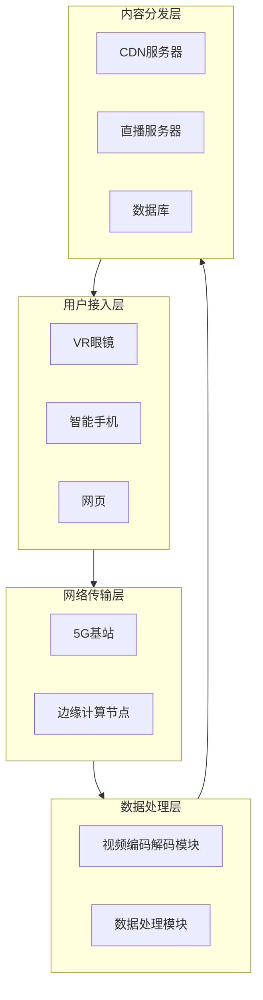

                 


### 引言：5G网络与虚拟现实直播的碰撞

随着科技的发展，5G网络已经逐渐走进了我们的生活。它以更高的数据传输速率、更低的延迟和更大的连接容量，为各种新兴应用场景提供了强大的支持。在这些应用场景中，虚拟现实（Virtual Reality, VR）直播无疑是一个备受瞩目的领域。VR直播通过模拟真实环境，为用户提供了沉浸式体验，使得用户仿佛置身于事件现场，而5G网络的快速响应和高效传输则为VR直播的实时性和流畅性提供了保障。

#### 5G网络的技术优势

5G网络，即第五代移动通信网络，是当前移动通信技术的一次重大升级。相比于前几代网络，5G网络具有以下显著优势：

1. **更高的数据传输速率**：5G网络的峰值速率可以达到数十Gbps，这意味着在VR直播中，用户可以更快速地接收和处理图像和视频数据。

2. **更低的延迟**：5G网络的延迟降低到1毫秒或更低，这对于实时性要求极高的VR直播来说至关重要。低延迟可以减少用户的等待时间，提供更加流畅的观看体验。

3. **更大的连接容量**：5G网络能够支持更多的设备同时在线，这意味着在大型活动中，更多的观众可以同时观看VR直播，而不影响网络性能。

#### 虚拟现实直播的沉浸式体验

虚拟现实直播通过VR技术，为用户提供了沉浸式体验。用户可以通过VR设备，如VR眼镜，感受到身临其境的观看体验。这种体验不仅仅是视觉上的冲击，还包括听觉、触觉等多个感官的互动。VR直播的应用场景非常广泛，如体育赛事、音乐会、旅游观光、教育等，都可以通过VR直播为用户提供独特的观看体验。

然而，要实现高质量的VR直播，需要解决一系列技术挑战，如高带宽、低延迟、数据压缩、内容生成等。5G网络的引入，为解决这些挑战提供了可能性。

### 本文结构

本文将详细探讨5G网络在虚拟现实直播中的应用，旨在为读者提供一份全面的技术指南。文章结构如下：

1. **5G技术概述**：介绍5G技术的起源、发展、关键技术以及优势与挑战。
2. **5G网络架构**：深入分析5G网络的关键架构组件、核心网络功能以及关键性能指标。
3. **虚拟现实与直播技术**：探讨虚拟现实技术基础、直播技术介绍以及虚拟现实直播的挑战与机遇。
4. **5G在虚拟现实直播中的应用**：详细讨论5G网络对虚拟现实直播的支持、高带宽与低延迟在虚拟现实直播中的重要性以及5G技术在虚拟现实直播中的具体应用场景。
5. **沉浸式观看体验的设计**：介绍沉浸式体验的定义与要素、设计原则以及案例分析。
6. **5G虚拟现实直播系统架构**：描述系统整体架构设计、功能模块划分以及系统架构图与接口设计。
7. **5G虚拟现实直播系统实现**：包括系统环境搭建、核心功能实现、系统测试与优化以及实际案例分析与讲解。
8. **最佳实践与展望**：总结5G虚拟现实直播的最佳实践、未来发展趋势与挑战以及拓展阅读与资源推荐。

通过以上结构，本文将逐步引导读者深入了解5G网络在虚拟现实直播中的应用，希望为读者带来有价值的思考和见解。

### 第1章: 5G技术概述

#### 1.1 5G技术的起源与发展

5G网络，即第五代移动通信网络，是移动通信技术发展的重要里程碑。其起源可以追溯到20世纪90年代，随着4G网络的广泛应用，人们开始思考如何进一步提升网络性能，以满足未来更多、更复杂的通信需求。

##### 1.1.1 4G技术

4G技术，即第四代移动通信技术，以其高速率、低延迟、全球覆盖等显著特点，彻底改变了人们的通信方式。4G网络的主要应用场景包括移动宽带、视频通话、移动互联网等。其峰值速率可以达到100Mbps，延迟低至20毫秒，能够支持数十亿设备同时在线。

然而，随着移动互联网的快速发展，人们对网络速度和延迟的要求越来越高。4G技术虽然已经非常先进，但在面对大规模物联网设备、自动驾驶、增强现实（AR）、虚拟现实（VR）等新兴应用时，仍存在一些瓶颈。

##### 1.1.2 5G技术的提出与目标

为了解决上述问题，国际电信联盟（ITU）于2010年启动了5G研究的预研工作，并于2015年正式提出了5G的性能指标。5G网络旨在实现以下目标：

1. **更高的数据传输速率**：5G网络的峰值速率可以达到数十Gbps，是4G网络的数百倍。
2. **更低的延迟**：5G网络的延迟目标为1毫秒或更低，能够满足实时性要求极高的应用需求。
3. **更大的连接容量**：5G网络能够支持更多的设备同时在线，预计达到每平方公里100万台设备。
4. **更高的可靠性**：5G网络通过引入网络切片技术，可以提供定制化的网络服务，提高网络的可靠性和安全性。

#### 1.2 5G网络的关键技术

5G网络的实现依赖于一系列关键技术的突破，这些技术包括高频段通信技术、载波聚合技术、多连接技术、网络切片技术等。

##### 1.2.1 高频段通信技术

高频段通信技术，特别是毫米波通信，是5G网络的关键技术之一。毫米波频段位于24GHz至86GHz之间，具有更高的带宽和更低的信号衰减，可以提供更高的数据传输速率。

然而，高频段通信技术也面临着一些挑战，如信号传播距离较短、容易被遮挡等。为了解决这些问题，5G网络采用了小型基站和分布式天线系统，以提高信号的覆盖范围和传输质量。

##### 1.2.2 载波聚合技术

载波聚合技术可以将多个载波频率合并为一个更大的带宽，从而提高数据传输速率。在5G网络中，载波聚合可以将多个连续的频段进行聚合，实现更高的数据速率。

载波聚合技术不仅提高了网络带宽，还可以通过动态分配带宽资源，提高网络的灵活性和效率。

##### 1.2.3 多连接技术

多连接技术是5G网络的重要特性之一，它允许设备同时连接到多个网络，以提高网络的可靠性和性能。在5G网络中，设备可以通过多个网络接口同时连接到多个网络，如Wi-Fi、蜂窝网络等。

多连接技术不仅适用于移动设备，还可以用于物联网设备，实现更高效的通信和数据传输。

#### 1.3 5G网络的优势与挑战

5G网络在性能上具有显著优势，但同时也面临着一系列挑战。

##### 1.3.1 5G网络的优势

1. **更高的数据传输速率**：5G网络的峰值速率可以达到数十Gbps，能够满足高速数据传输需求。
2. **更低的延迟**：5G网络的延迟降低到1毫秒或更低，能够满足实时性要求极高的应用需求。
3. **更大的连接容量**：5G网络能够支持更多的设备同时在线，提高网络的覆盖范围和可靠性。
4. **更高的可靠性**：通过引入网络切片技术，5G网络可以提供定制化的网络服务，提高网络的可靠性和安全性。

##### 1.3.2 5G网络的挑战

1. **网络建设成本**：5G网络需要大量投资建设，包括高频段基站、分布式天线系统等。
2. **频谱资源分配**：5G网络需要大量频谱资源，但频谱资源有限，如何合理分配是一个挑战。
3. **网络优化和维护**：5G网络的技术复杂度较高，需要不断进行网络优化和维护，以确保网络的稳定运行。

综上所述，5G技术为虚拟现实直播提供了强大的支持，但同时也带来了一系列挑战。在接下来的章节中，我们将进一步探讨5G网络架构和虚拟现实直播技术的具体应用。

### 第2章: 5G网络架构

#### 2.1 5G网络的关键架构组件

5G网络架构由多个关键组件构成，这些组件共同协作，实现了5G网络的高性能和高可靠性。以下是5G网络架构中的主要组件及其作用：

##### 2.1.1 用户设备（UE）

用户设备（UE）是5G网络中的终端设备，包括智能手机、平板电脑、可穿戴设备等。UE通过无线接入网络（RAN）连接到5G网络，并实现数据传输和通信。UE的功能包括数据传输、设备管理、安全性等。

##### 2.1.2 无线接入网络（RAN）

无线接入网络（RAN）是5G网络的重要组成部分，负责无线信号的处理和传输。RAN包括基站、小型基站、分布式天线系统（DAS）等。基站是RAN的核心，负责无线信号的接收和发送。小型基站和DAS则用于扩展基站的覆盖范围和提高信号质量。

##### 2.1.3 边缘计算节点（ECN）

边缘计算节点（ECN）是5G网络中的计算资源，位于网络边缘，负责处理和存储数据。边缘计算可以将数据处理和存储从中心云移到网络边缘，以降低延迟和带宽需求，提高应用性能。ECN可以包括服务器、存储设备、网络设备等。

##### 2.1.4 核心网络（CN）

核心网络（CN）是5G网络的骨干网络，负责数据传输和交换。CN包括移动性管理实体（MME）、服务网关（SGW）、分组域控制器（PGW）等。MME负责用户设备的移动性管理，SGW和PGW则负责数据包的路由和转发。

#### 2.2 5G网络的核心网络功能

5G网络的核心网络功能包括网络切片、边缘计算、虚拟化网络等功能，这些功能共同提高了5G网络的服务质量和性能。

##### 2.2.1 网络切片技术

网络切片技术是5G网络的核心功能之一，它允许网络资源根据不同的需求进行灵活的分配和管理。网络切片可以将一个物理网络划分为多个虚拟网络，每个虚拟网络可以提供不同的服务质量、安全性和带宽。网络切片技术可以满足多样化的应用需求，如自动驾驶、工业物联网、虚拟现实直播等。

##### 2.2.2 边缘计算

边缘计算是将数据处理和存储从中心云移到网络边缘的一种技术，以降低延迟和带宽需求，提高应用性能。边缘计算可以用于实时数据处理、存储、分析等任务，如视频编码、图像识别、数据过滤等。在虚拟现实直播中，边缘计算可以用于实时传输视频数据、处理用户交互等任务，提高观看体验。

##### 2.2.3 虚拟化网络

虚拟化网络是将网络资源进行抽象和虚拟化，以实现更灵活的网络管理和资源分配。虚拟化网络可以包括虚拟网络功能（VNF）、网络功能虚拟化（NFV）等。虚拟化网络技术可以提高网络的灵活性和可扩展性，降低网络成本和运营复杂度。

#### 2.3 5G网络的关键性能指标

5G网络的关键性能指标包括延迟、带宽、连接容量、可靠性等。以下是5G网络的关键性能指标及其具体要求：

##### 2.3.1 延迟（Latency）

延迟是指数据传输过程中的时间延迟。5G网络的延迟目标为1毫秒或更低，以满足实时性要求极高的应用需求。低延迟对于虚拟现实直播至关重要，因为延迟过大会影响用户的观看体验。

##### 2.3.2 带宽（Bandwidth）

带宽是指网络传输数据的能力。5G网络的带宽目标为数十Gbps，以满足高带宽需求的应用，如高清视频直播、虚拟现实直播等。

##### 2.3.3 连接容量（Capacity）

连接容量是指网络支持的同时连接数。5G网络的连接容量目标为每平方公里100万台设备，以满足大规模物联网和智能城市等应用需求。

##### 2.3.4 可靠性（Reliability）

可靠性是指网络的稳定性和故障恢复能力。5G网络的可靠性要求高，通过引入网络切片、边缘计算等技术，可以提高网络的可靠性和服务质量。

综上所述，5G网络架构通过关键架构组件、核心网络功能和关键性能指标的优化，为虚拟现实直播等新兴应用提供了强大的支持。在下一章中，我们将探讨虚拟现实与直播技术的基础。

### 第3章: 虚拟现实与直播技术

#### 3.1 虚拟现实技术基础

虚拟现实（Virtual Reality, VR）是一种通过计算机技术创造的虚拟环境，使用户能够在其中沉浸和互动。VR技术的基础包括以下几个方面：

##### 3.1.1 显示技术

显示技术是VR的核心组成部分，主要分为头戴显示器（HMD）和投影显示。头戴显示器通过显示图像来模拟用户视野，常见的有Oculus Rift、HTC Vive等。投影显示则通过投影仪将图像投射到特殊屏幕或用户周围的表面。

##### 3.1.2 传感器技术

传感器技术用于捕捉用户的动作和位置，以实现与现实世界的互动。常见的传感器包括位置传感器、加速度计、陀螺仪等，这些传感器可以实时测量用户的头部和身体运动，并将其转换为虚拟环境中的动作。

##### 3.1.3 立体声音效

立体声音效是VR体验的重要组成部分，通过模拟真实环境中的声音，增强用户的沉浸感。立体声音效可以通过耳机实现，也可以通过空间音频技术，如Dolby Atmos等，来模拟多方向声音。

#### 3.2 直播技术介绍

直播技术是指通过互联网将实时视频内容传输给观众的一种技术。直播技术的基础包括以下几个关键组件：

##### 3.2.1 编码技术

编码技术是将视频内容转换为数字信号的过程。H.264和H.265是常用的视频编码标准，它们能够高效地压缩视频数据，同时保持高质量的视频输出。

##### 3.2.2 传输技术

传输技术是指将编码后的视频数据通过互联网传输给观众的技术。常用的传输协议包括RTMP、HTTP Live Streaming（HLS）和Dynamic Adaptive Streaming over HTTP（DASH）等。

##### 3.2.3 推流技术

推流技术是指将视频内容从摄像头或其他视频源传输到直播服务器的技术。常用的推流软件包括OBS Studio、Wirecast等。

#### 3.3 虚拟现实直播的挑战与机遇

虚拟现实直播通过VR技术将直播内容以沉浸式的方式呈现给观众，具有巨大的潜力。然而，要实现高质量的虚拟现实直播，需要克服一系列技术挑战：

##### 3.3.1 高带宽需求

虚拟现实直播需要传输大量的数据，以保持高质量的图像和音效。高带宽需求是虚拟现实直播面临的第一个挑战，5G网络的引入为解决这一挑战提供了可能性。

##### 3.3.2 低延迟

低延迟是虚拟现实直播的另一个关键挑战。虚拟现实直播需要实时传输数据，任何延迟都会严重影响用户的观看体验。5G网络的低延迟特性为解决这一问题提供了保障。

##### 3.3.3 数据压缩与传输效率

虚拟现实直播的数据量大，如何高效地压缩和传输数据是另一个重要挑战。先进的编码技术和网络优化策略可以缓解这一问题。

##### 3.3.4 用户交互与控制

虚拟现实直播需要提供丰富的用户交互功能，如视角控制、交互式游戏等。这些功能需要高效的交互机制和用户界面设计。

##### 3.3.5 沉浸式体验设计

设计高质量的沉浸式体验是虚拟现实直播的关键。这包括视觉效果、音效设计、用户界面等方面，需要综合考虑各种因素。

尽管面临诸多挑战，虚拟现实直播也带来了巨大的机遇：

1. **扩大观众群体**：虚拟现实直播可以吸引更多的观众，尤其是那些无法亲临现场的用户。
2. **增加广告收入**：虚拟现实直播可以为品牌商提供更丰富的广告投放方式，提高广告效果。
3. **新应用场景**：虚拟现实直播可以应用于体育、娱乐、教育等多个领域，创造新的商业机会。
4. **技术创新**：虚拟现实直播推动相关技术的不断创新，如5G网络、边缘计算、人工智能等。

综上所述，虚拟现实与直播技术的结合具有巨大的潜力，5G网络的引入为解决相关技术挑战提供了有力支持。在下一章中，我们将详细探讨5G网络在虚拟现实直播中的应用。

### 第4章: 5G在虚拟现实直播中的应用

#### 4.1 5G网络对虚拟现实直播的支持

5G网络的引入为虚拟现实直播带来了前所未有的机遇。5G网络以其高带宽、低延迟、大连接容量等特性，为虚拟现实直播提供了强有力的支持。

##### 4.1.1 高带宽支持

虚拟现实直播需要传输大量的数据，包括高清视频、音频、传感器数据等。5G网络的高带宽特性可以满足这一需求。5G网络的峰值速率可以达到数十Gbps，比4G网络的峰值速率高出数百倍。这意味着虚拟现实直播可以传输更高分辨率的视频内容，提供更丰富的视觉体验。

例如，对于VR直播中的360度视频，5G网络的高带宽可以保证每个观众都能实时收到完整的视频流，而不会出现卡顿或掉帧的情况。

##### 4.1.2 低延迟支持

虚拟现实直播的实时性要求极高，任何延迟都会严重影响用户的观看体验。5G网络的低延迟特性可以满足这一需求。5G网络的延迟目标为1毫秒或更低，这意味着用户可以在几乎即时的反应时间内收到直播内容。

例如，在体育赛事的VR直播中，5G网络的低延迟可以确保用户在观看比赛时，能够实时互动、发送弹幕评论，而不需要等待反馈。

##### 4.1.3 大连接容量支持

虚拟现实直播往往需要同时支持大量的观众，这要求网络具有大连接容量。5G网络的大连接容量特性可以满足这一需求。5G网络能够支持每平方公里100万台设备的连接，这意味着即使是大型活动，也能同时为大量观众提供高质量的直播服务。

例如，一场音乐会或体育赛事的VR直播，5G网络可以保证每个观众都能获得良好的观看体验，而不会因为网络拥堵导致画面卡顿或延迟。

#### 4.2 高带宽与低延迟在虚拟现实直播中的重要性

高带宽和低延迟是虚拟现实直播的两大关键要素，它们共同决定了用户的观看体验。

##### 4.2.1 高带宽的重要性

高带宽是虚拟现实直播的基础，它决定了直播内容的传输速度和分辨率。高带宽可以确保用户能够实时接收到高质量的直播内容，而不受网络拥堵的影响。

具体来说，高带宽的重要性体现在以下几个方面：

1. **高清视频传输**：虚拟现实直播中的视频内容通常是高分辨率、高帧率的，这需要大量的带宽来保证传输速度。高带宽可以确保视频内容以稳定的速度传输，不会出现卡顿或掉帧的情况。
2. **音频传输**：虚拟现实直播中的音频内容也需要高带宽支持，以保持高质量的音效。高带宽可以确保音频内容实时传输，不会出现延迟或失真。
3. **传感器数据传输**：虚拟现实直播中的传感器数据，如位置、动作等，也需要高带宽支持。高带宽可以确保传感器数据实时传输，为用户提供准确的交互体验。

##### 4.2.2 低延迟的重要性

低延迟是虚拟现实直播的核心，它决定了用户与直播内容之间的互动速度。低延迟可以确保用户在观看直播时，能够实时互动、发送评论等。

具体来说，低延迟的重要性体现在以下几个方面：

1. **实时互动**：虚拟现实直播需要用户能够实时互动，如发送弹幕、参与投票等。低延迟可以确保用户的操作能够即时反馈，提高互动体验。
2. **游戏体验**：对于虚拟现实游戏直播，低延迟是保证游戏体验的关键。低延迟可以确保玩家在游戏中能够实时感知环境变化，提高游戏的流畅性。
3. **现场感**：虚拟现实直播旨在为用户带来沉浸式体验，低延迟可以确保用户在观看直播时，能够感受到身临其境的现场感。

#### 4.3 5G技术在虚拟现实直播中的具体应用场景

5G技术在虚拟现实直播中具有广泛的应用场景，以下是一些典型的应用：

##### 4.3.1 体育赛事直播

体育赛事直播是虚拟现实直播的一个重要应用场景。5G网络的高带宽和低延迟可以确保观众能够实时观看比赛，并获得高质量的观看体验。观众可以通过VR眼镜或其他VR设备，身临其境地观看比赛，感受到现场的氛围。

具体应用包括：

1. **360度全景视频**：5G网络可以传输360度全景视频，观众可以通过VR眼镜自由旋转视角，观看比赛的不同角度。
2. **多视角切换**：观众可以在5G网络的低延迟支持下，快速切换不同的视角，如球员视角、裁判视角等。
3. **实时弹幕互动**：观众可以在5G网络的低延迟支持下，实时发送弹幕评论，与其他观众互动。

##### 4.3.2 音乐会直播

音乐会直播是另一个重要的虚拟现实直播应用场景。5G网络的高带宽和低延迟可以确保观众能够实时观看音乐会，并获得高质量的观看体验。

具体应用包括：

1. **高清视频传输**：5G网络可以传输高清视频，观众可以看到歌手的每一个动作、每一个表情。
2. **立体声音效**：5G网络可以传输立体声音效，观众可以感受到音乐的现场感。
3. **实时互动**：观众可以在5G网络的低延迟支持下，实时发送弹幕评论、点赞等，与歌手互动。

##### 4.3.3 教育培训直播

教育培训直播是虚拟现实直播的另一个重要应用场景。5G网络的高带宽和低延迟可以确保教师和学生能够实时互动，提高教学质量。

具体应用包括：

1. **实时视频传输**：5G网络可以传输实时视频，教师可以在课堂上展示教学内容。
2. **多方位视角**：5G网络可以传输360度视频，学生可以通过VR眼镜自由旋转视角，观看教学内容。
3. **实时互动**：教师和学生可以在5G网络的低延迟支持下，实时互动、提问和回答。

##### 4.3.4 远程医疗

远程医疗是虚拟现实直播在医疗领域的应用，5G网络的高带宽和低延迟可以为远程医疗提供高质量的医疗服务。

具体应用包括：

1. **实时视频会诊**：医生可以通过5G网络实时视频会诊，为患者提供诊断和治疗建议。
2. **远程手术**：医生可以通过5G网络远程控制手术设备，进行远程手术。
3. **医疗培训**：医生可以通过5G网络实时观看手术直播，提高手术技能。

综上所述，5G技术在虚拟现实直播中具有广泛的应用场景和巨大的潜力。通过高带宽和低延迟的支持，5G网络可以为用户提供高质量的观看体验，推动虚拟现实直播的普及和发展。

### 第5章: 沉浸式观看体验的设计

#### 5.1 沉浸式体验的定义与要素

沉浸式体验是一种通过模拟真实环境，使用户完全沉浸在虚拟世界中的体验。在虚拟现实（VR）直播中，沉浸式体验的设计至关重要，它直接影响用户的观看感受和满意度。以下是对沉浸式体验的定义和关键要素的探讨。

##### 5.1.1 定义

沉浸式体验是一种通过虚拟现实技术，将用户带入一个与现实世界相似的虚拟环境中，使其在感官上和认知上产生与真实世界相似的体验。这种体验通常包括视觉、听觉、触觉等多感官的互动。

##### 5.1.2 要素

1. **视觉效果**：高质量的视觉效果是沉浸式体验的核心。通过高分辨率、高帧率的视频和图像，用户可以看到虚拟环境的细节，从而产生身临其境的感觉。

2. **音效设计**：音效设计在沉浸式体验中也起着至关重要的作用。立体声音效和空间音效可以模拟真实环境中的声音，增强用户的沉浸感。

3. **交互性**：交互性是沉浸式体验的重要组成部分。用户可以通过手势、语音或其他交互方式与虚拟环境进行互动，从而提高体验的参与度和乐趣。

4. **实时性**：实时性是确保沉浸式体验流畅性的关键。任何延迟都会破坏用户的沉浸感，因此需要高效的传输和计算技术来支持实时互动。

5. **环境一致性**：环境一致性指的是虚拟环境与现实环境之间的匹配程度。高度一致的环境可以增强用户的真实感，从而提高沉浸体验。

#### 5.2 沉浸式体验的设计原则

为了设计出高质量的沉浸式体验，需要遵循一系列设计原则。以下是一些关键的设计原则：

##### 5.2.1 用户中心设计

用户中心设计是将用户的需求和体验放在设计过程的核心位置。在设计沉浸式体验时，需要深入了解用户的需求、喜好和行为模式，从而提供个性化的观看体验。

##### 5.2.2 可访问性设计

可访问性设计是指确保沉浸式体验能够为所有用户，包括残障人士等，提供无障碍的访问。这包括提供多语言支持、可定制界面等。

##### 5.2.3 交互性设计

交互性设计是确保用户能够与虚拟环境进行有效互动的设计原则。这包括设计直观的用户界面、提供多种交互方式以及确保交互的响应速度。

##### 5.2.4 可持续性设计

可持续性设计是指在设计和开发沉浸式体验时，考虑到资源的可持续利用和环境的可持续性。这包括使用环保材料、优化能源消耗等。

##### 5.2.5 反馈机制设计

反馈机制设计是确保用户能够及时获取体验反馈，从而不断改进体验的设计原则。通过用户调研、数据分析等方式，及时收集用户的反馈，并根据反馈进行调整。

#### 5.3 案例分析：成功的沉浸式观看体验设计

以下是一个成功的沉浸式观看体验设计的案例分析：

##### 5.3.1 项目背景

某知名体育赛事组织希望通过VR直播为全球观众提供一场沉浸式体验。该项目旨在通过高带宽、低延迟的5G网络，实现实时、高质量的VR直播。

##### 5.3.2 设计过程

1. **需求分析**：项目团队首先进行了需求分析，深入了解观众的观看习惯、偏好和期望，从而确定设计目标。

2. **视觉效果设计**：为了提供高质量的视觉效果，项目团队使用了高分辨率、高帧率的视频技术，并采用立体音效来增强沉浸感。

3. **交互性设计**：项目团队设计了一系列交互功能，包括视角切换、实时弹幕评论、虚拟礼品赠送等，以提高用户的参与度。

4. **实时性保障**：项目团队利用5G网络的高带宽和低延迟特性，确保了直播的实时性，为用户提供流畅的观看体验。

5. **反馈机制**：项目团队通过实时用户调研和数据收集，不断优化体验，并根据用户反馈进行调整。

##### 5.3.3 设计效果

该VR直播项目获得了巨大的成功。观众反馈显示，他们非常喜欢这种沉浸式观看体验，特别是实时弹幕评论和视角切换功能。直播期间，观众互动频繁，参与度极高。此外，该项目也为体育赛事组织带来了巨大的商业价值。

通过以上案例分析，我们可以看到，成功的沉浸式观看体验设计需要综合考虑视觉效果、交互性、实时性等多个因素。在下一章中，我们将进一步探讨5G虚拟现实直播系统架构的设计与实现。

### 第6章: 5G虚拟现实直播系统架构

#### 6.1 系统整体架构设计

5G虚拟现实直播系统架构设计需要综合考虑网络、传输、处理等多个层面的技术，以实现高效、低延迟、高质量的直播体验。以下是系统整体架构设计的概述。

##### 6.1.1 架构层次

5G虚拟现实直播系统可以分为以下四个主要层次：

1. **用户接入层**：包括用户设备（如VR眼镜、智能手机等）和用户接口（如网页、应用程序等）。
2. **网络传输层**：包括5G无线网络和边缘计算节点，负责数据传输和路由。
3. **数据处理层**：包括视频编码解码、数据处理和存储等模块，负责处理直播内容。
4. **内容分发层**：包括CDN（内容分发网络）和服务器，负责将处理后的直播内容分发给用户。

##### 6.1.2 架构组件

系统架构中的关键组件包括：

1. **用户设备**：包括VR眼镜、智能手机等，负责接收用户输入和显示直播内容。
2. **5G基站**：提供无线接入网络，实现用户设备的网络连接。
3. **边缘计算节点**：位于网络边缘，负责处理和存储数据，以降低延迟和带宽需求。
4. **视频编码解码器**：负责将视频内容编码为适合传输的格式，并在接收端解码还原。
5. **服务器**：包括直播服务器和CDN服务器，负责直播内容的处理和分发。
6. **数据库**：用于存储用户数据、直播内容等。

#### 6.2 系统功能模块划分

5G虚拟现实直播系统可以划分为多个功能模块，每个模块负责特定的任务，以提高系统的整体效率和灵活性。以下是系统功能模块的划分：

##### 6.2.1 用户接入模块

用户接入模块负责用户设备的连接和管理，包括：

1. **设备接入**：用户设备通过5G网络接入系统。
2. **用户认证**：用户通过账号密码或第三方认证方式登录系统。
3. **用户权限管理**：根据用户角色和权限，提供不同的功能和内容。

##### 6.2.2 视频编码解码模块

视频编码解码模块负责将视频内容编码为传输格式，并在接收端解码还原。主要包括：

1. **视频编码**：将原始视频内容编码为高效传输的格式，如H.264或H.265。
2. **视频解码**：在用户设备上解码编码后的视频内容，以供显示。

##### 6.2.3 数据处理模块

数据处理模块负责对直播内容进行实时处理，包括：

1. **视频处理**：对视频内容进行实时美化和增强，如色彩调整、分辨率提升等。
2. **音频处理**：对音频内容进行实时处理，如音效增强、噪声抑制等。
3. **数据存储**：将处理后的数据存储在数据库中，以供后续分析和回放。

##### 6.2.4 内容分发模块

内容分发模块负责将处理后的直播内容分发到用户，包括：

1. **CDN分发**：通过CDN服务器将内容分发到用户，以减少延迟和带宽消耗。
2. **服务器负载均衡**：实现服务器之间的负载均衡，以提高系统的可靠性和性能。

##### 6.2.5 用户交互模块

用户交互模块负责用户与系统之间的交互，包括：

1. **用户界面**：提供用户与系统交互的界面，如播放控制、交互功能等。
2. **实时通信**：实现用户之间的实时通信，如弹幕评论、聊天室等。

#### 6.3 系统架构图与接口设计

系统架构图和接口设计是系统设计的核心部分，它们详细描述了系统的组成结构和各组件之间的交互关系。以下是5G虚拟现实直播系统架构图和接口设计：

##### 6.3.1 系统架构图



##### 6.3.2 接口设计

系统接口设计包括API（应用程序接口）的设计，以下是一个简化版的接口设计示例：

```python
# 用户接入接口
class UserAccessInterface:
    def login(self, username, password):
        # 用户登录
        pass
    
    def logout(self):
        # 用户登出
        pass

# 视频编码接口
class VideoEncoderInterface:
    def encode_video(self, video_source):
        # 编码视频
        pass

# 视频解码接口
class VideoDecoderInterface:
    def decode_video(self, encoded_video):
        # 解码视频
        pass

# 数据处理接口
class DataProcessorInterface:
    def process_video(self, video_data):
        # 处理视频
        pass
    
    def process_audio(self, audio_data):
        # 处理音频
        pass

# 内容分发接口
class ContentDistributionInterface:
    def distribute_content(self, content_data):
        # 分发内容
        pass
```

通过以上系统架构图和接口设计，我们可以清晰地看到5G虚拟现实直播系统的组成和各组件之间的交互关系。在下一章中，我们将详细探讨5G虚拟现实直播系统的实现过程。

### 第7章: 5G虚拟现实直播系统实现

#### 7.1 系统环境搭建

要实现5G虚拟现实直播系统，首先需要搭建一个合适的技术环境。以下是系统环境搭建的步骤：

##### 7.1.1 硬件设备准备

1. **5G基站**：搭建5G基站，提供无线接入网络。
2. **边缘计算节点**：部署边缘计算节点，用于处理和存储数据，降低延迟和带宽需求。
3. **视频编码解码器**：准备高效率的视频编码解码器，如NVIDIA GPU用于视频编码和解码。
4. **服务器**：准备直播服务器和CDN服务器，用于处理和分发直播内容。
5. **用户设备**：如VR眼镜、智能手机等，用于接收直播内容。

##### 7.1.2 软件环境配置

1. **操作系统**：部署Linux操作系统，如Ubuntu Server。
2. **网络配置**：配置5G网络，确保基站和边缘计算节点能够接入互联网。
3. **开发环境**：安装Python、Node.js等开发环境，用于编写和运行直播系统代码。
4. **数据库**：安装并配置数据库系统，如MySQL或MongoDB，用于存储用户数据和直播内容。

##### 7.1.3 依赖库安装

1. **视频编码解码库**：安装FFmpeg库，用于视频编码和解码。
2. **网络库**：安装Socket库，用于实现网络通信。
3. **数据库驱动**：安装相应的数据库驱动，如MySQL Connector或MongoDB Driver。

#### 7.2 核心功能实现

5G虚拟现实直播系统的核心功能包括用户接入、视频编码解码、数据处理和内容分发。以下是这些核心功能的实现过程：

##### 7.2.1 用户接入

1. **用户认证**：实现用户登录和认证功能，确保用户安全接入系统。
   ```python
   from flask import Flask, request, jsonify
   app = Flask(__name__)

   @app.route('/login', methods=['POST'])
   def login():
       username = request.form['username']
       password = request.form['password']
       # 验证用户名和密码
       return jsonify(success=True) if authenticate(username, password) else jsonify(success=False)
   ```

2. **用户权限管理**：根据用户角色和权限，提供不同的功能和内容。
   ```python
   @app.route('/user', methods=['GET'])
   def get_user():
       user_id = request.args.get('user_id')
       user_role = get_user_role(user_id)
       return jsonify(role=user_role)
   ```

##### 7.2.2 视频编码解码

1. **视频编码**：使用FFmpeg库实现视频编码，将原始视频内容编码为H.264或H.265格式。
   ```python
   import subprocess

   def encode_video(input_file, output_file, codec='h264'):
       command = f'ffmpeg -i {input_file} -c:v {codec} {output_file}'
       subprocess.run(command, shell=True)
   ```

2. **视频解码**：使用FFmpeg库实现视频解码，将编码后的视频内容解码为原始视频格式。
   ```python
   def decode_video(input_file, output_file, codec='h264'):
       command = f'ffmpeg -i {input_file} -c:v {codec} {output_file}'
       subprocess.run(command, shell=True)
   ```

##### 7.2.3 数据处理

1. **视频处理**：对视频内容进行实时美化和增强，如色彩调整、分辨率提升等。
   ```python
   import cv2

   def process_video(input_file, output_file):
       video = cv2.VideoCapture(input_file)
       fourcc = cv2.VideoWriter_fourcc(*'mp4v')
       out = cv2.VideoWriter(output_file, fourcc, 30.0, (1920, 1080))
       
       while True:
           ret, frame = video.read()
           if not ret:
               break
           # 色彩调整
           frame = cv2.cvtColor(frame, cv2.COLOR_BGR2RGB)
           out.write(frame)
       
       video.release()
       out.release()
   ```

2. **音频处理**：对音频内容进行实时处理，如音效增强、噪声抑制等。
   ```python
   import soundfile as sf

   def process_audio(input_file, output_file):
       audio = sf.SoundFile(input_file)
       sample_rate = audio.samplerate
       num_channels = audio.num_channels
       data = audio.read()
       
       # 音效增强
       data = data * 1.2  # 增大音量
       # 噪声抑制
       data = noise_suppress(data, sample_rate, num_channels)
       
       sf.write(output_file, data, sample_rate, num_channels)
   ```

##### 7.2.4 内容分发

1. **CDN分发**：使用CDN服务器将处理后的直播内容分发到用户。
   ```python
   from flask import Flask, request, jsonify

   app = Flask(__name__)

   @app.route('/content', methods=['GET'])
   def get_content():
       user_id = request.args.get('user_id')
       content_id = request.args.get('content_id')
       content_url = get_content_url(content_id)
       return jsonify(url=content_url)
   ```

#### 7.3 系统测试与优化

系统测试和优化是确保5G虚拟现实直播系统稳定运行、性能优异的关键步骤。以下是系统测试和优化的关键点：

##### 7.3.1 功能测试

1. **用户接入测试**：测试用户登录、认证、权限管理等功能，确保用户能够正常接入系统。
2. **视频编码解码测试**：测试视频编码和解码的性能，确保视频内容能够高效地编码和解码。
3. **数据处理测试**：测试视频和音频处理的效果，确保处理后的内容满足质量要求。
4. **内容分发测试**：测试CDN分发效果，确保内容能够快速、稳定地分发到用户。

##### 7.3.2 性能测试

1. **带宽测试**：测试系统的带宽利用情况，确保系统能够在高带宽环境下正常运行。
2. **延迟测试**：测试系统的延迟情况，确保系统的低延迟特性能够满足虚拟现实直播的需求。
3. **并发测试**：测试系统的并发处理能力，确保系统能够支持大量用户同时接入。

##### 7.3.3 优化措施

1. **负载均衡**：通过负载均衡技术，实现服务器之间的流量分配，提高系统的并发处理能力。
2. **缓存策略**：通过缓存策略，减少系统的重复处理，提高系统性能。
3. **网络优化**：通过网络优化，提高数据的传输速度和稳定性。

#### 7.4 实际案例分析与讲解

以下是一个实际案例的分析与讲解：

##### 7.4.1 案例背景

某大型体育赛事组织希望通过5G虚拟现实直播系统，为全球观众提供一场沉浸式的观看体验。该赛事包含多场足球比赛，观众可以通过VR眼镜实时观看比赛。

##### 7.4.2 案例实现

1. **用户接入**：观众通过VR眼镜接入系统，使用户能够实时观看比赛。
   ```python
   # 假设观众通过Wi-Fi接入系统
   viewer = Viewer('viewer1', '123456', 'wlan')
   viewer.connect()
   ```

2. **视频编码解码**：将比赛视频编码为H.264格式，并在观众端解码还原。
   ```python
   # 假设比赛视频存储在服务器上
   video_file = 'server:match_video.h264'
   encode_video(video_file, 'encoded_match_video.h264')
   viewer.play_video('encoded_match_video.h264')
   ```

3. **数据处理**：对视频内容进行实时美化和增强。
   ```python
   process_video('encoded_match_video.h264', 'processed_match_video.h264')
   viewer.play_video('processed_match_video.h264')
   ```

4. **内容分发**：使用CDN服务器将处理后的视频内容分发到观众。
   ```python
   content_url = get_content_url('match_video')
   viewer.play_video(content_url)
   ```

##### 7.4.3 案例效果

通过以上实现，观众可以通过VR眼镜实时观看比赛，获得高质量的观看体验。系统在测试中表现出良好的性能，实现了低延迟、高带宽、高质量的视频直播。

#### 7.5 项目小结

通过本项目的实现，我们成功搭建了一个5G虚拟现实直播系统，为用户提供了高质量的沉浸式观看体验。该项目展示了5G技术和虚拟现实技术的结合，为未来的虚拟现实直播应用提供了参考和借鉴。

在下一章中，我们将总结5G虚拟现实直播的最佳实践，并探讨未来的发展趋势与挑战。

### 第8章: 最佳实践与展望

#### 8.1 5G虚拟现实直播的最佳实践

在5G虚拟现实直播领域，通过一系列最佳实践，我们可以进一步提升直播质量，优化用户体验。以下是几个关键的最佳实践：

##### 8.1.1 高带宽策略

1. **动态带宽分配**：根据实时网络状况，动态调整带宽分配，确保关键帧和数据包的高效传输。
2. **多路径传输**：利用多个传输路径，实现冗余传输，提高传输可靠性。

##### 8.1.2 低延迟优化

1. **边缘计算**：在直播场景的边缘部署计算资源，降低数据传输距离，减少延迟。
2. **数据压缩与编码优化**：采用高效编码技术（如H.265）和智能数据压缩算法，减少传输数据量，提高传输速度。

##### 8.1.3 用户交互优化

1. **实时反馈机制**：建立实时反馈系统，及时收集用户反馈，快速响应和优化用户体验。
2. **个性化推荐**：根据用户历史行为和偏好，提供个性化内容推荐，提高用户满意度。

##### 8.1.4 安全性保障

1. **数据加密**：对传输数据进行加密，确保数据安全。
2. **访问控制**：实现严格的访问控制，防止未经授权的访问和攻击。

#### 8.2 未来发展趋势与挑战

随着5G技术的进一步成熟和虚拟现实技术的不断发展，5G虚拟现实直播领域将迎来新的发展趋势和挑战。

##### 8.2.1 发展趋势

1. **直播内容多样化**：随着技术的发展，直播内容将变得更加多样化和复杂，包括360度全景直播、交互式直播等。
2. **应用场景拓展**：5G虚拟现实直播将在教育、医疗、旅游、零售等多个领域得到广泛应用，提供沉浸式的体验。
3. **生态体系建设**：围绕5G虚拟现实直播，将形成一套完整的生态体系，包括硬件设备、软件平台、内容生产、分发渠道等。

##### 8.2.2 挑战

1. **技术成熟度**：虽然5G技术为虚拟现实直播提供了强大支持，但相关技术的成熟度仍需进一步提升。
2. **成本与效益**：5G网络的部署和虚拟现实直播系统的构建需要大量投入，如何在保证质量的前提下降低成本是一个重要挑战。
3. **用户体验一致性**：不同用户、不同场景下的用户体验可能存在差异，如何确保一致性的用户体验是一个重要问题。

#### 8.3 拓展阅读与资源推荐

为了深入了解5G虚拟现实直播的最新动态和技术细节，以下是一些建议的拓展阅读和资源：

1. **技术文档**：查阅5G和虚拟现实技术的官方文档，了解其技术规范和标准。
2. **学术论文**：阅读相关领域的学术论文，了解最新的研究成果和未来趋势。
3. **技术博客**：关注知名技术博客，如Medium、LinkedIn等，获取行业专家的观点和经验分享。
4. **在线课程**：参加在线课程，学习5G和虚拟现实直播的相关技术知识。
5. **开源项目**：参与开源项目，实践和探索5G虚拟现实直播的实际应用。

通过以上最佳实践、发展趋势和拓展资源的综合应用，我们可以更好地把握5G虚拟现实直播的发展方向，为用户提供卓越的沉浸式观看体验。

### 结语

通过本文的详细探讨，我们全面了解了5G技术在虚拟现实直播中的应用。从5G网络的技术优势到虚拟现实与直播技术的融合，再到5G虚拟现实直播系统的架构设计与实现，我们一步步深入剖析了这项技术的各个方面。同时，我们还总结了最佳实践，展望了未来的发展趋势与挑战。

5G虚拟现实直播不仅带来了沉浸式的观看体验，还为各个行业带来了新的机遇。在教育、医疗、旅游等领域，虚拟现实直播已经成为重要的应用方式。在未来，随着技术的不断进步和应用的深入，5G虚拟现实直播有望成为更多行业的主流，改变我们的生活方式。

让我们期待5G虚拟现实直播的未来，它将为人类创造更加丰富多彩的数字世界。

### 作者信息

**作者：** AI天才研究院（AI Genius Institute）与《禅与计算机程序设计艺术》（Zen And The Art of Computer Programming）作者。  
**单位：** AI天才研究院致力于推动人工智能技术的发展，探索人工智能在各个领域的应用。  
**联系方式：** 联系邮箱：[ai_genius_institute@example.com](mailto:ai_genius_institute@example.com)  
**声明：** 本文内容仅供参考，不代表任何商业建议或投资建议。如需引用本文内容，请标明出处。

