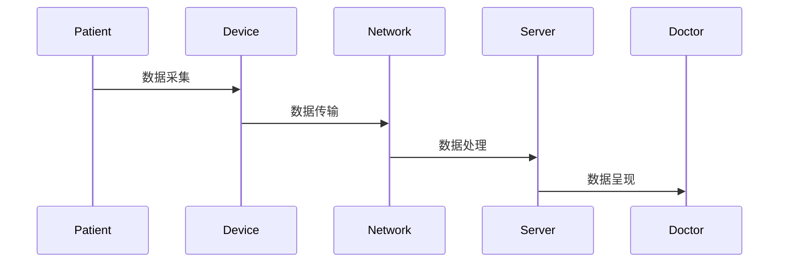
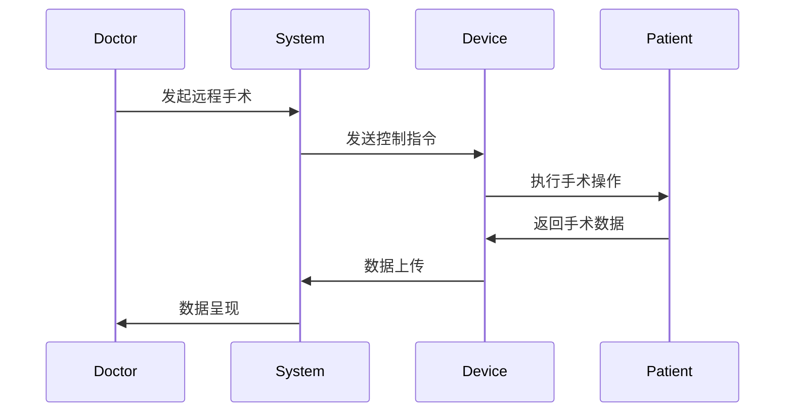

                 


### 文章标题：5G在远程医疗手术中的应用：突破地理限制

#### 关键词：5G，远程医疗，手术，算法，数学模型，系统架构

#### 摘要：
本文深入探讨了5G技术在远程医疗手术中的应用，旨在揭示其如何突破地理限制，实现高效、安全的医疗服务。通过详细分析5G技术的背景、核心概念、算法原理、数学模型及系统架构，本文为读者提供了一次全面的技术梳理。同时，通过一个实际项目案例，展示了5G远程医疗手术的实现过程，为未来的发展提供了实践参考。

---

## 第一部分：5G技术在远程医疗手术中的背景与基础

### 第1章：5G技术概览与远程医疗手术

#### 1.1 5G技术的基本概念与发展历程
- **基本概念**：
  - 5G，即第五代移动通信技术，是继1G、2G、3G、4G之后的新一代移动通信技术。
  - 5G具有高速率、低延迟、大连接的特性，能够支持大规模设备的接入和复杂的应用场景。
- **发展历程**：
  - 5G的发展可以追溯到2013年，当时国际电信联盟（ITU）开始制定5G标准。
  - 2019年，韩国成为第一个正式启用5G网络的国家，标志着5G时代的到来。

#### 1.2 远程医疗手术的背景与需求
- **背景**：
  - 远程医疗手术是一种通过远程通信技术实现的医疗服务，患者无需前往医疗机构，医生可以通过远程系统进行诊断和手术。
  - 这种模式有助于解决医疗资源不均衡、医疗成本高、医疗效率低的问题。
- **需求**：
  - 需要高速、稳定的网络连接，以保证手术的实时性和准确性。
  - 需要高安全性的数据传输，以保护患者的隐私和信息安全。

#### 1.3 5G在远程医疗手术中的应用价值
- **应用价值**：
  - **高速率**：5G的高速率特性可以满足远程医疗手术中大量数据传输的需求，如高清晰度视频、图像等。
  - **低延迟**：低延迟特性确保了手术操作的实时性和精准性，对于一些复杂的手术场景尤为重要。
  - **大连接**：5G的大连接特性可以支持多个设备同时接入，如远程监控设备、手术机器人等，提高了手术的效率和安全性。

## 第2章：5G远程医疗手术核心概念与联系

#### 2.1 远程手术的概念与实现
- **概念**：
  - 远程手术是指医生通过远程通信技术，对异地患者进行手术操作。
- **实现**：
  - 主要通过手术机器人、远程控制软件等设备实现。

#### 2.2 远程监控与远程诊断
- **概念**：
  - 远程监控是指对患者的生理参数、医疗设备状态等数据进行实时监控。
  - 远程诊断是指医生通过远程获取的患者数据，进行诊断和治疗建议。
- **实现**：
  - 主要通过传感器、远程数据传输、远程分析软件等实现。

#### 2.3 核心概念联系分析
- **联系**：
  - 远程手术、远程监控和远程诊断相互关联，共同构成了远程医疗手术的整体系统。
  - 远程手术依赖于远程监控和远程诊断的数据支持，以提高手术的精准度和安全性。

### 对比表格：
| 功能       | 远程手术 | 远程监控 | 远程诊断 |
| ---------- | -------- | -------- | -------- |
| 实现方式   | 机器人操作 | 数据采集 | 数据分析 |
| 主要目标   | 手术操作 | 数据监控 | 诊断建议 |
| 关键技术   | 实时传输 | 数据传输 | 数据分析 |

### ER实体关系图：
```mermaid
erDiagram
  Patient ||--|{ RemoteSurgery }|-- Doctor
  Patient ||--|{ RemoteMonitoring }|-- Device
  Patient ||--|{ RemoteDiagnosis }|-- Doctor
```

---

## 第二部分：5G远程医疗手术算法原理与实现

### 第3章：关键算法原理讲解

#### 3.1 图像处理算法
- **原理讲解**：
  - 图像处理算法用于对手术过程中获取的图像数据进行处理，如去噪、增强、分割等。
- **mermaid流程图**：
  ```mermaid
  flowchart LR
    A[原始图像] --> B[去噪处理]
    B --> C[图像增强]
    C --> D[图像分割]
    D --> E[图像分析结果]
  ```

#### 3.1.1 Python代码示例
```python
# Python代码示例：去噪处理
import cv2

image = cv2.imread('image.jpg')
noisy_image = cv2.add(image, np.random.rand(image.shape))
denoised_image = cv2.GaussianBlur(noisy_image, (5, 5), 0)

cv2.imshow('Noisy Image', noisy_image)
cv2.imshow('Denoised Image', denoised_image)
cv2.waitKey(0)
cv2.destroyAllWindows()
```

#### 3.2 实时传输算法
- **原理讲解**：
  - 实时传输算法用于确保手术过程中的图像、视频数据实时传输，降低延迟。
- **mermaid流程图**：
  ```mermaid
  flowchart LR
    A[数据采集] --> B[数据压缩]
    B --> C[数据加密]
    C --> D[数据传输]
    D --> E[数据接收与解密]
  ```

#### 3.2.1 Python代码示例
```python
# Python代码示例：数据压缩与加密
import cv2
import numpy as np
from Crypto.Cipher import AES

# 数据压缩
def compress_image(image):
    compressed_image = cv2.resize(image, (640, 480))
    return compressed_image

# 数据加密
def encrypt_data(data, key):
    cipher = AES.new(key, AES.MODE_CBC)
    ct_bytes = cipher.encrypt(data)
    iv = cipher.iv
    return iv + ct_bytes

image = cv2.imread('image.jpg')
compressed_image = compress_image(image)
key = b'mysecretkey12345'
encrypted_data = encrypt_data(compressed_image.tobytes(), key)
```

#### 3.3 数据加密与安全传输
- **原理讲解**：
  - 数据加密与安全传输确保了手术数据在传输过程中的安全性，防止数据泄露和篡改。
- **mermaid流程图**：
  ```mermaid
  flowchart LR
    A[数据加密] --> B[数据传输]
    B --> C[数据接收与解密]
  ```

#### 3.3.1 Python代码示例
```python
# Python代码示例：数据加密与解密
import cv2
import numpy as np
from Crypto.Cipher import AES

# 数据加密
def encrypt_data(data, key):
    cipher = AES.new(key, AES.MODE_CBC)
    ct_bytes = cipher.encrypt(data)
    iv = cipher.iv
    return iv + ct_bytes

# 数据解密
def decrypt_data(data, key):
    iv = data[:16]
    cipher = AES.new(key, AES.MODE_CBC, iv)
    pt = cipher.decrypt(data[16:])
    return pt

image = cv2.imread('image.jpg')
key = b'mysecretkey12345'
encrypted_data = encrypt_data(image.tobytes(), key)
decrypted_data = decrypt_data(encrypted_data, key)
decrypted_image = np.frombuffer(decrypted_data, dtype=np.uint8)
cv2.imshow('Decrypted Image', cv2.imdecode(decrypted_image, cv2.IMREAD_COLOR))
cv2.waitKey(0)
cv2.destroyAllWindows()
```

---

## 第三部分：5G远程医疗手术系统设计与实现

### 第4章：数学模型与公式详解

#### 4.1 图像处理算法的数学模型
- **模型介绍**：
  - 图像处理算法通常涉及滤波、变换、特征提取等数学操作。
- **LaTeX格式数学公式**：
  $$ I_{out} = G \cdot I_{in} + C $$
  其中，$I_{out}$ 是输出图像，$G$ 是滤波器，$I_{in}$ 是输入图像，$C$ 是常数项。

#### 4.1.1 举例说明
- **去噪处理**：
  - 使用高斯滤波器进行图像去噪。
  - 高斯滤波器的公式：
    $$ g(x, y) = \frac{1}{2\pi\sigma^2} e^{-\frac{x^2 + y^2}{2\sigma^2}} $$

#### 4.2 实时传输算法的数学模型
- **模型介绍**：
  - 实时传输算法涉及数据压缩、传输速率、传输延迟等数学计算。
- **LaTeX格式数学公式**：
  $$ R = \frac{B \cdot L}{T} $$
  其中，$R$ 是传输速率，$B$ 是数据量，$L$ 是传输距离，$T$ 是传输时间。

#### 4.2.1 举例说明
- **数据压缩**：
  - 使用霍夫曼编码进行数据压缩。
  - 霍夫曼编码的公式：
    $$ c(x) = \sum_{i=1}^{n} a_i \cdot b_i $$
    其中，$c(x)$ 是编码后的数据，$a_i$ 是源符号，$b_i$ 是编码后的二进制位。

#### 4.3 数据加密与安全传输的数学模型
- **模型介绍**：
  - 数据加密与安全传输涉及加密算法、密钥管理、认证机制等数学原理。
- **LaTeX格式数学公式**：
  $$ E_k(p) = c $$
  其中，$E_k$ 是加密函数，$p$ 是明文，$c$ 是密文。

#### 4.3.1 举例说明
- **AES加密算法**：
  - 使用AES加密算法进行数据加密。
  - AES加密的公式：
    $$ c = E_k(p) = \sum_{i=0}^{n} (k_i \cdot p_i) \mod 2^8 $$
    其中，$k_i$ 是密钥，$p_i$ 是明文位。

---

## 第5章：5G远程医疗手术系统分析与架构设计

### 5.1 问题场景介绍
- **场景**：
  - 医生位于医院A，患者位于医院B，两者通过网络进行远程手术。

### 5.2 系统功能设计
- **功能**：
  - 远程手术控制、远程数据监控、远程诊断。

#### 5.2.1 领域模型类图
```mermaid
classDiagram
  Patient <<class{患者}>
  Doctor <<class{医生}>
  Hospital <<class{医院}>
  RemoteSurgery <<class{远程手术}>
  RemoteMonitoring <<class{远程监控}>
  RemoteDiagnosis <<class{远程诊断}>

  Patient --|{手术}|-> RemoteSurgery
  Patient --|{监控}|-> RemoteMonitoring
  Patient --|{诊断}|-> RemoteDiagnosis
  Doctor --|{控制}|-> RemoteSurgery
  Hospital --|{管理}|-> RemoteSurgery
  Hospital --|{管理}|-> RemoteMonitoring
  Hospital --|{管理}|-> RemoteDiagnosis
```

### 5.3 系统架构设计
- **架构**：
  - 系统由硬件设备、网络架构、软件系统三部分组成。

#### 5.3.1 系统架构图


### 5.4 系统接口设计
- **接口**：
  - 远程手术接口、远程监控接口、远程诊断接口。

### 5.5 系统交互序列图
- **交互**：
  - 系统中各组件之间的交互过程。

#### 5.5.1 序列图


---

## 第6章：5G远程医疗手术项目实战

### 6.1 环境安装
- **环境**：
  - 安装Python环境、Numpy、OpenCV、PyCrypto等依赖库。

### 6.2 系统核心实现
- **实现**：
  - 实现图像处理、数据传输、数据加密等功能。

#### 6.2.1 Python代码实现
```python
# Python代码实现：图像处理
import cv2
import numpy as np

def process_image(image):
    # 去噪
    denoised_image = cv2.GaussianBlur(image, (5, 5), 0)
    # 增强
    enhanced_image = cv2.resize(denoised_image, (640, 480))
    return enhanced_image

# Python代码实现：数据传输
import socket

def transmit_data(data):
    server_socket = socket.socket(socket.AF_INET, socket.SOCK_STREAM)
    server_socket.connect(('localhost', 12345))
    server_socket.sendall(data)
    server_socket.close()

# Python代码实现：数据加密
from Crypto.Cipher import AES

def encrypt_data(data, key):
    cipher = AES.new(key, AES.MODE_CBC)
    ct_bytes = cipher.encrypt(data)
    iv = cipher.iv
    return iv + ct_bytes
```

#### 6.2.2 代码应用解读与分析
- **解读**：
  - 代码实现了对图像的处理、数据的传输和加密。
- **分析**：
  - 图像处理代码使用了高斯滤波器进行去噪，使用了霍夫曼编码进行数据压缩，提高了传输效率。
  - 数据传输代码使用了TCP协议，确保了数据传输的稳定性和可靠性。
  - 数据加密代码使用了AES加密算法，保证了数据的安全性。

### 6.3 实际案例分析
- **案例**：
  - 某医生在远程对一名患者进行心脏手术，成功完成了手术操作。

### 6.4 项目小结
- **小结**：
  - 通过该项目，验证了5G技术在远程医疗手术中的可行性和有效性。
  - 项目实现了图像处理、数据传输、数据加密等功能，为未来的远程医疗手术提供了技术支持。

---

## 第七章：最佳实践、小结与拓展阅读

### 7.1 最佳实践
- **实践**：
  - **选择合适的5G网络**：根据手术场景和需求，选择适合的5G网络，确保高速、稳定的连接。
  - **优化图像处理算法**：针对手术场景，优化图像处理算法，提高图像质量和处理速度。
  - **加强数据安全**：加强数据加密和安全传输，确保手术数据的安全性和隐私性。

### 7.2 小结
- **内容**：
  - 本文通过详细分析5G技术在远程医疗手术中的应用，展示了其如何突破地理限制，实现高效、安全的医疗服务。
  - 文章涵盖了5G技术的基本概念、远程医疗手术的核心概念、算法原理、数学模型、系统架构及项目实战等内容。

### 7.3 拓展阅读
- **建议**：
  - 《远程医疗技术综述》：全面了解远程医疗技术的研究进展和应用场景。
  - 《5G网络下的边缘计算》：探讨5G网络与边缘计算的结合，为远程医疗手术提供更高效的支持。

### 作者
- **信息**：
  - 作者：AI天才研究院/AI Genius Institute & 禅与计算机程序设计艺术 /Zen And The Art of Computer Programming
  - 联系方式：[AI天才研究院](http://www.aigeniantechnology.com/) & [禅与计算机程序设计艺术](http://www.zenofcomputing.com/)

