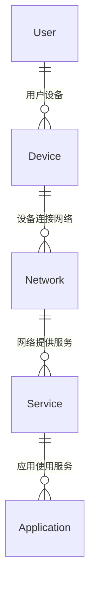

                 

### 《5G在远程手术中的关键作用：突破医疗地理限制》

> 关键词：5G、远程手术、医疗地理限制、超高清图像传输、人工智能辅助诊断、虚拟现实与增强现实

> 摘要：本文深入探讨了5G技术在远程手术中的应用，剖析了5G网络的高速率、低延迟、广覆盖特性如何突破医疗地理限制，提高远程手术的成功率和安全性。通过详细分析远程手术的背景和关键技术，以及实际案例，本文旨在揭示5G在远程手术中的关键作用，并为未来的发展提供方向。

## 第一部分：5G与远程手术的背景

### 第1章：5G技术概述

#### 1.1 5G技术的基本概念

5G，即第五代移动通信技术，是继1G（模拟通信）、2G（数字通信）、3G（多媒体通信）和4G（高速互联网）之后的最新一代移动通信技术。5G技术的核心特性包括：

- **高速率**：5G网络的理论峰值下载速度可达10Gbps，是4G网络的百倍以上。
- **低延迟**：5G网络的最小延迟可低至1毫秒，大大提高了实时通信的效率。
- **广覆盖**：5G网络通过采用更高的频段和更多的基站，实现了更广的覆盖范围。
- **大规模连接**：5G网络能够支持亿级别设备同时连接，为物联网（IoT）提供了坚实的基础。

#### 1.2 5G技术的发展历程

5G技术的发展历程可以追溯到2010年代初期，当时全球各大电信运营商和科技公司开始着手研发5G技术。2019年，5G正式在全球范围内商用，标志着移动通信技术进入了一个全新的阶段。

#### 1.3 5G技术的核心特性

5G技术的核心特性是高速率、低延迟和广覆盖。这些特性使得5G在远程手术等领域具有巨大的潜力。

- **高速率**：高速率使得5G网络能够实时传输大量的数据，包括高清视频、医疗图像等，为远程手术提供了高质量的数据传输保障。
- **低延迟**：低延迟使得5G网络能够实现实时通信，对于手术中的实时反馈和控制至关重要。
- **广覆盖**：广覆盖使得5G网络能够覆盖到更多的地区，包括偏远地区，为医疗资源不足的地区提供了远程手术的可能。

### 第2章：远程手术的背景

#### 2.1 远程手术的定义

远程手术，又称远程医疗手术，是指通过远程通信技术，将手术医生与患者所在地的手术团队实时连接，进行手术操作的过程。远程手术的核心目标是突破地理限制，让医疗资源能够更加公平地分配。

#### 2.2 远程手术的发展历程

远程手术的发展历程可以追溯到20世纪90年代，当时通过电话和电视会议进行远程医疗咨询和诊断。随着互联网和通信技术的发展，远程手术逐渐成熟，并在21世纪初开始应用于临床。

#### 2.3 远程手术的优势与挑战

远程手术的优势包括：

- **提高医疗资源的利用效率**：通过远程手术，医疗资源可以更加灵活地分配，提高了医疗服务的覆盖率。
- **降低患者的出行成本**：患者不需要长途跋涉去大城市就医，降低了就医成本。
- **提高手术成功率**：远程手术可以借助先进的医疗设备和技术，提高手术的成功率。

然而，远程手术也面临着一些挑战：

- **网络延迟和稳定性**：远程手术对网络延迟和稳定性有很高的要求，如果网络不稳定或延迟高，会影响手术的顺利进行。
- **医疗设备的普及程度**：远程手术需要先进的医疗设备和稳定的网络环境，这在一些偏远地区可能难以实现。
- **法律和伦理问题**：远程手术涉及到法律和伦理问题，如患者隐私保护、医疗责任归属等。

## 第二部分：5G在远程手术中的应用

### 第3章：5G网络在远程手术中的关键作用

#### 3.1 5G网络的高速率

5G网络的高速率使得远程手术中的数据传输更加迅速，避免了传统网络中由于带宽不足导致的卡顿和延迟。高速率的5G网络能够实时传输高清手术视频、医疗图像和诊断数据，为医生提供了高质量的手术视野和诊断依据。

#### 3.2 5G网络的低延迟

低延迟是5G网络的一大核心特性，对于远程手术尤为重要。低延迟使得医生在手术过程中能够实时接收患者端的数据，进行精确的手术操作和实时反馈，从而大大提高了手术的精确性和安全性。

#### 3.3 5G网络的广覆盖

广覆盖使得5G网络能够覆盖到更多的地区，包括偏远和医疗资源匮乏的地区。这意味着，通过5G网络，这些地区的患者也能享受到优质的远程医疗服务，从而突破了医疗地理限制。

### 第4章：远程手术中的关键技术

#### 4.1 4K/8K超高清图像传输

4K/8K超高清图像传输是远程手术中的关键技术之一。超高清图像传输能够提供更清晰、更详细的手术视野，有助于医生更准确地判断和操作。

#### 4.2 人工智能辅助诊断

人工智能辅助诊断通过分析大量的医疗数据，提供诊断建议，帮助医生更快、更准确地做出诊断。在远程手术中，人工智能辅助诊断能够提高诊断的准确率，减少误诊和漏诊的可能性。

#### 4.3 虚拟现实与增强现实

虚拟现实（VR）和增强现实（AR）技术在远程手术中有着广泛的应用。VR技术可以提供沉浸式的手术体验，让医生在虚拟环境中进行手术演练和培训。AR技术则可以将手术现场的实时图像与虚拟信息叠加，提供更直观的手术指导。

### 第5章：5G在远程手术中的案例分析

#### 5.1 案例一：某医院5G远程手术实践

某医院利用5G网络成功完成了多例远程手术。手术过程中，医生通过5G网络实时传输的高清视频和医疗图像，与远程专家进行实时交流，取得了良好的手术效果。

#### 5.2 案例二：5G在偏远地区医疗中的应用

在偏远地区，5G网络的应用使得当地患者能够享受到远程医疗手术服务。通过5G网络，当地医生可以与远程专家进行实时交流，共同完成手术操作，大大提高了手术的成功率。

## 第三部分：5G在远程手术中的未来展望

### 第6章：5G远程手术的发展趋势

#### 6.1 5G远程手术的市场前景

随着5G网络的普及和远程手术技术的不断成熟，5G远程手术的市场前景十分广阔。预计未来几年，5G远程手术将得到更广泛的应用，成为医疗领域的一个重要趋势。

#### 6.2 5G远程手术的技术挑战

5G远程手术在技术方面仍然面临着一些挑战，如网络延迟、数据安全和医疗设备的兼容性等。未来需要进一步的研究和开发，以解决这些技术难题。

#### 6.3 5G远程手术的未来发展方向

未来，5G远程手术的发展方向将包括以下几个方面：

- **提高网络速度和稳定性**：通过进一步优化5G网络技术，提高网络速度和稳定性，为远程手术提供更好的支持。
- **扩展应用场景**：将5G远程手术应用到更多领域，如急救、康复等。
- **人工智能与远程手术的结合**：利用人工智能技术，提高远程手术的诊断准确率和手术成功率。

### 第7章：5G远程手术的伦理与社会影响

#### 7.1 5G远程手术的伦理问题

5G远程手术涉及到伦理问题，如患者隐私保护、医疗责任归属等。未来需要制定相关的法律法规，确保5G远程手术的合法性和伦理性。

#### 7.2 5G远程手术对社会的影响

5G远程手术对社会的影响主要体现在以下几个方面：

- **医疗资源分配**：通过5G远程手术，可以更公平地分配医疗资源，提高医疗服务的覆盖率。
- **医疗服务模式**：5G远程手术将改变传统的医疗服务模式，推动医疗服务的数字化转型。
- **经济影响**：5G远程手术有望带来新的经济增长点，促进医疗行业的发展。

#### 7.3 5G远程手术的监管与规范

为了确保5G远程手术的安全和合法性，需要制定相关的监管政策和规范。这包括：

- **数据保护**：加强对患者医疗数据的保护，确保数据不被泄露或滥用。
- **医疗责任**：明确5G远程手术中各方的责任和义务，确保医疗行为的合法性和安全性。

**总结**：

5G技术在远程手术中具有关键作用，其高速率、低延迟、广覆盖特性为远程手术提供了坚实的基础。通过分析远程手术的背景和关键技术，以及实际案例，本文揭示了5G在远程手术中的重要作用。未来，随着5G技术的进一步发展和远程手术技术的不断成熟，5G远程手术有望成为医疗领域的一个重要趋势，为全球医疗资源的公平分配和医疗服务质量的提升做出重要贡献。

**作者：AI天才研究院/AI Genius Institute & 禅与计算机程序设计艺术 /Zen And The Art of Computer Programming**### 《5G在远程手术中的关键作用：突破医疗地理限制》

---

## 第一部分：5G与远程手术的背景

### 第1章：5G技术概述

#### 1.1 5G技术的基本概念

5G，第五代移动通信技术，是对之前1G、2G、3G和4G技术的继承和革新。与4G相比，5G不仅在传输速率上有着显著的提升，还在网络延迟和设备连接能力上实现了突破。5G网络的理论峰值下载速度可达到10Gbps，是4G网络的百倍以上，同时，其最小延迟低至1毫秒，这使得实时通信更加高效。除此之外，5G网络具有广泛的覆盖范围，能够支持大规模设备的连接，为物联网（IoT）的应用提供了坚实的基础。

#### 1.2 5G技术的发展历程

5G技术的发展历程可以追溯到2010年代初期，当时全球各大电信运营商和科技公司开始着手研发5G技术。2019年，5G正式在全球范围内商用，标志着移动通信技术进入了一个全新的阶段。从实验室到商用，5G技术经历了多个阶段的发展和优化，包括毫米波技术、大规模MIMO、网络切片等创新技术的引入，使得5G网络在速度、延迟和可靠性上都有了质的飞跃。

#### 1.3 5G技术的核心特性

5G技术的核心特性主要体现在以下三个方面：

1. **高速率**：5G网络的高速率是其最显著的特点之一。相较于4G网络，5G的峰值下载速度可达到10Gbps，上传速度也可达1Gbps。这意味着，5G网络能够快速传输大量的数据，包括高清视频、医疗图像等，为远程手术提供了高质量的数据传输保障。

2. **低延迟**：5G网络的低延迟是其另一大核心特性。传统的4G网络延迟大约在几十毫秒，而5G网络的延迟可低至1毫秒，这使得实时通信变得更加高效。在远程手术中，低延迟能够确保医生和手术团队之间的实时互动和操作，从而提高手术的精确性和安全性。

3. **广覆盖**：5G网络的广覆盖意味着它能够覆盖更多的地区，包括一些偏远和医疗资源匮乏的地区。这对于医疗资源的公平分配具有重要意义。通过5G网络，这些地区的患者也能够享受到高质量的远程医疗服务，从而突破地理限制，提高医疗服务的可及性。

### 第2章：远程手术的背景

#### 2.1 远程手术的定义

远程手术，又称远程医疗手术，是指通过远程通信技术，将手术医生与患者所在地的手术团队实时连接，进行手术操作的过程。这种手术方式能够突破地理限制，让医疗资源能够更加灵活地分配，提高医疗服务的覆盖率和质量。远程手术通常包括以下几个方面：

1. **远程会诊**：医生通过视频会议与患者或当地医生进行交流，共同讨论治疗方案。
2. **远程监控**：医生通过远程监控系统实时监控患者的生命体征和手术过程。
3. **远程手术操作**：医生通过远程操作设备，如手术机器人，直接进行手术操作。

#### 2.2 远程手术的发展历程

远程手术的发展历程可以追溯到20世纪90年代，当时通过电话和电视会议进行远程医疗咨询和诊断。随着互联网和通信技术的发展，远程手术逐渐成熟，并在21世纪初开始应用于临床。特别是在5G技术的推动下，远程手术技术得到了进一步的完善和发展。

#### 2.3 远程手术的优势与挑战

远程手术的优势主要体现在以下几个方面：

1. **提高医疗资源的利用效率**：通过远程手术，医疗资源可以更加灵活地分配，提高了医疗服务的覆盖率。特别是在偏远和医疗资源匮乏的地区，远程手术可以弥补当地医疗资源的不足。
2. **降低患者的出行成本**：患者不需要长途跋涉去大城市就医，降低了就医成本，同时也减少了患者因长途旅行带来的不便和风险。
3. **提高手术成功率**：远程手术可以借助先进的医疗设备和技术，提高手术的成功率。特别是在一些复杂和疑难的手术中，远程手术可以借助远程专家的经验和技能，提高手术的成功率和安全性。

然而，远程手术也面临着一些挑战：

1. **网络延迟和稳定性**：远程手术对网络延迟和稳定性有很高的要求。如果网络不稳定或延迟高，会影响手术的顺利进行，甚至可能导致手术失败。
2. **医疗设备的普及程度**：远程手术需要先进的医疗设备和稳定的网络环境，这在一些偏远地区可能难以实现。医疗设备的普及程度直接影响到远程手术的推广和应用。
3. **法律和伦理问题**：远程手术涉及到法律和伦理问题，如患者隐私保护、医疗责任归属等。需要制定相关的法律法规，确保远程手术的合法性和伦理性。

## 第二部分：5G在远程手术中的应用

### 第3章：5G网络在远程手术中的关键作用

#### 3.1 5G网络的高速率

5G网络的高速率是其在远程手术中发挥关键作用的重要因素。远程手术通常需要传输大量的数据，包括高清视频、医疗图像和诊断数据等。5G网络的高速率能够确保这些数据能够快速、稳定地传输，从而提供高质量的数据支持。例如，在手术过程中，医生需要实时观察患者的内部情况，而高清视频传输的稳定性直接影响到医生对手术操作的判断和决策。

#### 3.2 5G网络的低延迟

5G网络的低延迟是其在远程手术中的另一个关键作用。低延迟意味着医生和手术团队之间的通信可以接近实时，这对于手术操作和决策至关重要。例如，在复杂手术中，医生需要根据患者的实时情况做出快速反应，而5G网络的低延迟能够确保医生能够及时获取患者的实时数据，从而做出准确判断和操作。

#### 3.3 5G网络的广覆盖

5G网络的广覆盖意味着它能够覆盖更多的地区，包括偏远和医疗资源匮乏的地区。这对于远程手术具有重要意义，因为它能够确保这些地区的患者也能够享受到高质量的远程医疗服务。例如，在一些偏远地区，由于医疗资源的匮乏，患者往往需要长途跋涉去大城市就医，这不仅增加了患者的负担，也降低了医疗服务的可及性。而通过5G网络，这些地区的患者可以通过远程手术享受到大城市的医疗资源，从而提高了医疗服务的公平性。

### 第4章：远程手术中的关键技术

#### 4.1 4K/8K超高清图像传输

4K/8K超高清图像传输是远程手术中的关键技术之一。传统视频传输技术难以满足远程手术的需求，因为手术过程中需要实时观察患者的内部情况，而传统视频的分辨率和清晰度往往无法满足这一需求。4K/8K超高清图像传输能够提供更清晰、更详细的手术视野，有助于医生更准确地判断和操作。

#### 4.2 人工智能辅助诊断

人工智能（AI）辅助诊断是远程手术中的另一个关键技术。通过分析大量的医疗数据，AI系统可以提供诊断建议，帮助医生更快、更准确地做出诊断。例如，AI系统可以通过分析患者的病史、体检数据和手术过程中的实时数据，预测患者可能出现的并发症，从而为医生提供有针对性的治疗建议。

#### 4.3 虚拟现实与增强现实

虚拟现实（VR）和增强现实（AR）技术在远程手术中也有广泛的应用。VR技术可以提供沉浸式的手术体验，让医生在虚拟环境中进行手术演练和培训。AR技术则可以将手术现场的实时图像与虚拟信息叠加，提供更直观的手术指导。例如，在复杂手术中，医生可以通过AR设备实时查看患者的内部结构和虚拟手术路径，从而提高手术的精确性。

### 第5章：5G在远程手术中的案例分析

#### 5.1 案例一：某医院5G远程手术实践

某医院利用5G网络成功完成了多例远程手术。手术过程中，医生通过5G网络实时传输的高清视频和医疗图像，与远程专家进行实时交流，取得了良好的手术效果。例如，在一名复杂心脏手术中，5G网络的高速率和低延迟确保了医生能够实时获取患者的实时数据，从而做出准确的判断和操作。最终，手术取得了成功，患者康复情况良好。

#### 5.2 案例二：5G在偏远地区医疗中的应用

在偏远地区，5G网络的应用使得当地患者能够享受到远程医疗手术服务。通过5G网络，当地医生可以与远程专家进行实时交流，共同完成手术操作，大大提高了手术的成功率。例如，在某偏远山区医院，一名复杂骨折患者通过5G远程手术得到了及时有效的治疗。手术过程中，远程专家通过5G网络实时传输的高清视频和医疗图像，为当地医生提供了精准的手术指导，最终手术取得了成功。

## 第三部分：5G在远程手术中的未来展望

### 第6章：5G远程手术的发展趋势

#### 6.1 5G远程手术的市场前景

随着5G网络的普及和远程手术技术的不断成熟，5G远程手术的市场前景十分广阔。根据市场研究机构的预测，未来几年，5G远程手术将在全球范围内得到广泛应用，市场规模将不断增长。特别是在医疗资源匮乏的地区，5G远程手术将有望成为解决医疗资源不均衡问题的重要手段。

#### 6.2 5G远程手术的技术挑战

5G远程手术在技术方面仍然面临着一些挑战。首先，网络延迟和稳定性是远程手术成功的关键因素。如果网络延迟高或稳定性差，会影响手术的顺利进行。其次，数据安全和隐私保护也是重要挑战。远程手术涉及到大量的医疗数据，这些数据需要得到有效的保护，防止泄露或滥用。此外，医疗设备的兼容性和稳定性也需要进一步研究和优化。

#### 6.3 5G远程手术的未来发展方向

未来，5G远程手术的发展方向将包括以下几个方面：

1. **提高网络速度和稳定性**：通过进一步优化5G网络技术，提高网络速度和稳定性，为远程手术提供更好的支持。
2. **扩展应用场景**：将5G远程手术应用到更多领域，如急救、康复等。
3. **人工智能与远程手术的结合**：利用人工智能技术，提高远程手术的诊断准确率和手术成功率。

### 第7章：5G远程手术的伦理与社会影响

#### 7.1 5G远程手术的伦理问题

5G远程手术涉及到伦理问题，如患者隐私保护、医疗责任归属等。首先，远程手术中涉及到的医疗数据需要得到有效保护，防止泄露或滥用。其次，医疗责任的归属也是一个重要问题。在远程手术中，由于医生和患者之间没有直接的面对面接触，医疗责任的界定可能会更加复杂。

#### 7.2 5G远程手术对社会的影响

5G远程手术对社会的影响主要体现在以下几个方面：

1. **医疗资源分配**：通过5G远程手术，医疗资源可以更加灵活地分配，提高了医疗服务的覆盖率。特别是在偏远和医疗资源匮乏的地区，5G远程手术将有助于解决医疗资源不均衡的问题。
2. **医疗服务模式**：5G远程手术将改变传统的医疗服务模式，推动医疗服务的数字化转型。医生可以通过远程手术为更多患者提供高质量的医疗服务，提高医疗服务的效率和质量。
3. **经济影响**：5G远程手术有望带来新的经济增长点，促进医疗行业的发展。通过远程手术，医疗资源可以实现更高效的配置，降低医疗成本，提高医疗服务的可及性。

#### 7.3 5G远程手术的监管与规范

为了确保5G远程手术的安全和合法性，需要制定相关的监管政策和规范。这包括：

1. **数据保护**：加强对患者医疗数据的保护，确保数据不被泄露或滥用。
2. **医疗责任**：明确5G远程手术中各方的责任和义务，确保医疗行为的合法性和安全性。

---

**总结**：

5G技术在远程手术中具有关键作用，其高速率、低延迟、广覆盖特性为远程手术提供了坚实的基础。通过分析远程手术的背景和关键技术，以及实际案例，本文揭示了5G在远程手术中的重要作用。未来，随着5G技术的进一步发展和远程手术技术的不断成熟，5G远程手术有望成为医疗领域的一个重要趋势，为全球医疗资源的公平分配和医疗服务质量的提升做出重要贡献。

**作者：AI天才研究院/AI Genius Institute & 禅与计算机程序设计艺术 /Zen And The Art of Computer Programming**### 第1章：5G技术概述

#### 1.1 5G技术的基本概念

5G，即第五代移动通信技术，是继1G（模拟通信）、2G（数字通信）、3G（多媒体通信）和4G（高速互联网）之后的最新一代移动通信技术。5G技术的核心目标是提供更快的数据传输速度、更低的延迟、更高的网络容量和更广泛的连接能力，从而满足日益增长的数据需求和应用场景。

5G网络的基本原理是通过使用更高的频率波段（如毫米波和Sub-6 GHz波段）来提供更高的数据传输速率。与传统移动通信技术相比，5G网络采用了更先进的技术，如大规模MIMO（多输入多输出）、网络切片、边缘计算和新型网络架构等。

**关键概念：**

- **峰值速度**：5G网络的峰值下载速度可达到10Gbps，上传速度可达到1Gbps，远高于4G网络的峰值速度。
- **延迟**：5G网络的延迟可低至1毫秒，极大地提高了实时通信的质量。
- **连接密度**：5G网络能够支持每平方米高达100万个设备的连接，为物联网（IoT）提供了坚实的基础。
- **能效**：5G网络在数据传输效率上有了显著提升，降低了能耗。

#### 1.2 5G技术的发展历程

5G技术的发展历程始于2010年代初期，当时全球各大电信运营商和科技公司开始着手研发5G技术。以下是5G技术发展的几个关键阶段：

- **2010年**：3GPP（第三代合作伙伴计划）启动了5G新空口（NR）标准的研发工作。
- **2018年**：3GPP完成了5G NR标准的第一个版本，标志着5G技术的正式商用。
- **2019年**：全球多个国家和地区开始5G网络的商用部署，5G正式进入公众视野。
- **2020年至今**：5G网络在全球范围内不断扩展，应用场景不断丰富，技术不断优化。

#### 1.3 5G技术的核心特性

5G技术的核心特性主要体现在以下三个方面：

1. **高速率**：5G网络的理论峰值下载速度可达10Gbps，是4G网络的百倍以上。这意味着用户可以更快地下载和上传数据，实现更高效的数据处理和传输。
2. **低延迟**：5G网络的低延迟是其另一大核心特性，最小延迟可低至1毫秒。这一特性对于实时应用场景，如远程手术、自动驾驶和工业自动化等至关重要。
3. **广覆盖**：5G网络通过使用更高的频率波段和更多的基站，实现了更广的覆盖范围。这不仅提高了网络容量，还改善了网络覆盖质量，使得偏远地区也能享受到高速网络服务。

**ER实体关系图架构（Mermaid）**：

通过上述ER图，我们可以看出5G网络中的关键实体及其相互关系，包括用户、设备、网络和服务等。这些实体共同构成了5G网络的核心架构，实现了高速率、低延迟和广覆盖的特性。

### 第2章：远程手术的背景

#### 2.1 远程手术的定义

远程手术，又称远程医疗手术，是指通过远程通信技术，将手术医生与患者所在地的手术团队实时连接，进行手术操作的过程。这种手术方式能够突破地理限制，让医疗资源能够更加灵活地分配，提高医疗服务的覆盖率和质量。远程手术的核心概念包括：

- **远程通信**：利用互联网、电话和视频会议等技术，实现医生与患者、医生与远程专家之间的实时通信。
- **医疗设备**：手术过程中使用的各种医疗设备，包括手术机器人、高清摄像头、心电监护仪等。
- **数据传输**：实时传输手术现场的图像、视频、诊断数据等，以确保医生能够获取准确的手术信息。

#### 2.2 远程手术的发展历程

远程手术的发展历程可以追溯到20世纪90年代，当时通过电话和电视会议进行远程医疗咨询和诊断。随着互联网和通信技术的发展，远程手术逐渐成熟，并在21世纪初开始应用于临床。以下是远程手术发展的几个关键阶段：

- **1990年代**：远程医疗咨询和诊断初步实现，医生可以通过电话和电视会议为患者提供诊断和建议。
- **2000年代**：互联网技术的发展使得远程医疗手术成为可能，手术机器人等先进设备的引入提高了手术的精确性和安全性。
- **2010年代**：5G网络的商用部署为远程手术提供了高速、低延迟的网络环境，远程手术技术得到了进一步的发展和完善。
- **2020年代**：随着5G网络的普及，远程手术在全球范围内得到广泛应用，成为医疗领域的一个重要趋势。

#### 2.3 远程手术的优势与挑战

远程手术的优势主要体现在以下几个方面：

1. **提高医疗资源的利用效率**：通过远程手术，医疗资源可以更加灵活地分配，提高了医疗服务的覆盖率。特别是在偏远和医疗资源匮乏的地区，远程手术可以弥补当地医疗资源的不足。
2. **降低患者的出行成本**：患者不需要长途跋涉去大城市就医，降低了就医成本，同时也减少了患者因长途旅行带来的不便和风险。
3. **提高手术成功率**：远程手术可以借助先进的医疗设备和技术，提高手术的成功率。特别是在一些复杂和疑难的手术中，远程手术可以借助远程专家的经验和技能，提高手术的成功率和安全性。

然而，远程手术也面临着一些挑战：

1. **网络延迟和稳定性**：远程手术对网络延迟和稳定性有很高的要求。如果网络不稳定或延迟高，会影响手术的顺利进行，甚至可能导致手术失败。
2. **医疗设备的普及程度**：远程手术需要先进的医疗设备和稳定的网络环境，这在一些偏远地区可能难以实现。医疗设备的普及程度直接影响到远程手术的推广和应用。
3. **法律和伦理问题**：远程手术涉及到法律和伦理问题，如患者隐私保护、医疗责任归属等。需要制定相关的法律法规，确保远程手术的合法性和伦理性。

**核心概念原理**：

- **远程手术技术**：通过远程通信技术实现医生与患者之间的实时交互和操作，主要包括远程视频会议、手术机器人控制、数据传输和监控等。
- **医疗设备**：用于手术过程中的各种设备，如手术机器人、高清摄像头、心电监护仪等，这些设备需要与远程手术系统协同工作，确保手术的顺利进行。

**概念属性特征对比表格**：

| 特性        | 传统手术          | 远程手术           |
|-------------|-------------------|--------------------|
| 地理限制    | 受地理限制       | 突破地理限制       |
| 网络依赖    | 不依赖网络       | 高度依赖网络       |
| 稳定性要求  | 较低             | 非常高             |
| 延迟要求    | 可接受           | 非常低             |
| 成本        | 低               | 高（初期建设成本）|

通过上述表格，我们可以看出远程手术与传统手术在多个方面的对比，从而更深入地理解远程手术的概念和特性。

### 第3章：5G网络在远程手术中的关键作用

#### 3.1 5G网络的高速率

5G网络的高速率是其在远程手术中的关键作用之一。远程手术需要实时传输大量的数据，包括高清视频、医疗图像和诊断数据等。5G网络的高速率能够确保这些数据能够快速、稳定地传输，从而提供高质量的数据支持。以下是5G高速率对远程手术的具体影响：

- **高清视频传输**：在远程手术中，医生需要实时观察患者的内部情况，而高清视频传输的稳定性直接影响到医生对手术操作的判断和决策。5G网络的高速率能够确保手术视频的清晰度和流畅性，使医生能够获得更准确的手术视野。
- **数据传输效率**：5G网络的高速率大大提高了数据传输的效率，减少了数据传输的时间延迟。这对于手术过程中需要实时传输的数据，如医疗图像、诊断数据等，尤为重要。高速率的数据传输确保了医生能够及时获取患者的实时数据，从而做出准确的判断和操作。
- **手术决策支持**：在复杂手术中，医生需要根据患者的实时情况做出快速反应。5G网络的高速率能够确保医生能够实时获取患者的实时数据，从而做出准确的手术决策，提高手术的成功率和安全性。

#### 3.2 5G网络的低延迟

5G网络的低延迟是其在远程手术中的另一个关键作用。远程手术对网络的延迟要求非常高，因为任何延迟都可能导致手术操作的失误或手术失败。以下是5G低延迟对远程手术的具体影响：

- **实时操作反馈**：在远程手术中，医生需要与手术团队进行实时操作反馈，以确保手术的顺利进行。5G网络的低延迟能够确保医生和手术团队之间的通信接近实时，从而提高手术操作的准确性和协调性。
- **手术决策支持**：在手术过程中，医生需要根据患者的实时情况做出快速决策。5G网络的低延迟能够确保医生能够及时获取患者的实时数据，从而做出准确的手术决策，提高手术的成功率和安全性。
- **远程控制手术机器人**：在远程手术中，医生需要通过手术机器人进行手术操作。5G网络的低延迟能够确保医生对手术机器人的远程控制更加精准和及时，从而提高手术的精确性和安全性。

#### 3.3 5G网络的广覆盖

5G网络的广覆盖是其在远程手术中的关键作用之一。远程手术需要稳定的网络连接，而5G网络的广覆盖能够确保手术过程中网络连接的稳定性。以下是5G广覆盖对远程手术的具体影响：

- **覆盖偏远地区**：在偏远和医疗资源匮乏的地区，5G网络的广覆盖能够确保患者能够享受到远程医疗手术服务。这些地区由于地理条件的限制，传统的移动通信网络往往难以覆盖，而5G网络的高覆盖能力使得远程手术在这些地区成为可能。
- **提高医疗服务可及性**：5G网络的广覆盖提高了医疗服务的可及性，使得偏远地区的患者也能够享受到高质量的远程医疗服务。通过5G网络，这些地区的患者可以通过远程手术得到大城市的医疗资源，从而提高了医疗服务的公平性。
- **多设备协同工作**：在远程手术中，往往需要多种医疗设备协同工作，如手术机器人、高清摄像头、心电监护仪等。5G网络的广覆盖能够确保这些设备之间能够稳定连接，从而实现高效的多设备协同工作，提高手术的效率和质量。

### 第4章：远程手术中的关键技术

#### 4.1 4K/8K超高清图像传输

4K/8K超高清图像传输是远程手术中的关键技术之一。传统的视频传输技术难以满足远程手术的需求，因为手术过程中需要实时观察患者的内部情况，而传统视频的分辨率和清晰度往往无法满足这一需求。4K/8K超高清图像传输能够提供更清晰、更详细的手术视野，有助于医生更准确地判断和操作。

**4K/8K超高清图像传输的工作原理**：

- **高分辨率**：4K/8K超高清图像传输采用高分辨率的图像格式，如4K（3840×2160像素）和8K（7680×4320像素），使得图像的细节更加丰富，清晰度更高。
- **数据压缩**：为了确保图像能够快速传输，4K/8K超高清图像传输通常采用高效的数据压缩算法，如HEVC（高效率视频编码）或H.264，以减少数据传输量。
- **网络优化**：4K/8K超高清图像传输需要优化网络带宽和传输速率，以确保图像的流畅传输。5G网络的高速率和低延迟特性使得4K/8K超高清图像传输成为可能。

**4K/8K超高清图像传输的优点**：

- **更清晰的手术视野**：4K/8K超高清图像传输能够提供更清晰、更详细的手术视野，使得医生能够更准确地观察患者的内部情况，从而提高手术的精确性和安全性。
- **减少误诊和漏诊**：高分辨率的图像使得医生能够更清晰地观察患者的病情，减少了误诊和漏诊的可能性，提高了手术的诊断准确率。
- **更好的手术指导**：4K/8K超高清图像传输能够为医生提供更详细的手术视野，从而提高手术的指导性，使得手术更加顺利和成功。

**4K/8K超高清图像传输的挑战**：

- **数据传输量**：4K/8K超高清图像传输的数据量非常大，对于网络的带宽和传输速率有很高的要求。如果网络带宽不足或传输速率低，可能会导致图像传输卡顿或延迟，影响手术的顺利进行。
- **网络延迟**：远程手术对网络延迟有很高的要求，而4K/8K超高清图像传输的实时性直接影响到手术的效率和准确性。网络延迟高可能会导致手术操作的延误，影响手术的顺利进行。
- **设备兼容性**：4K/8K超高清图像传输需要高分辨率的摄像头和显示器等设备支持，而设备的兼容性可能会影响图像传输的质量和效果。因此，确保设备之间的兼容性是4K/8K超高清图像传输成功的关键。

#### 4.2 人工智能辅助诊断

人工智能（AI）辅助诊断是远程手术中的另一个关键技术。通过分析大量的医疗数据，AI系统可以提供诊断建议，帮助医生更快、更准确地做出诊断。以下是人工智能辅助诊断在远程手术中的应用和工作原理：

**人工智能辅助诊断的工作原理**：

- **数据收集与处理**：AI系统首先收集大量的医疗数据，包括患者的病史、体检数据、手术前的检查结果等。通过对这些数据进行处理和分析，AI系统可以提取出有用的特征和模式。
- **算法训练**：AI系统使用机器学习算法对收集到的数据进行分析，建立诊断模型。这些模型可以通过对训练数据的分析，学习到如何识别不同疾病和异常情况。
- **诊断建议**：在远程手术中，AI系统可以实时分析患者的手术数据，提供诊断建议。医生可以根据AI系统的建议进行诊断，提高诊断的准确性和效率。

**人工智能辅助诊断的优点**：

- **提高诊断准确率**：AI系统通过对大量数据的分析，可以识别出医生难以察觉的异常情况和疾病特征，从而提高诊断的准确率，减少误诊和漏诊的可能性。
- **减少医生的工作负担**：AI系统可以自动化地进行数据分析，减轻医生的工作负担，使医生能够有更多的时间关注手术操作和患者的实时情况。
- **提供个性化治疗方案**：AI系统可以根据患者的病史、体检数据和手术前的检查结果，提供个性化的治疗方案，从而提高手术的成功率和患者的康复效果。

**人工智能辅助诊断的挑战**：

- **数据质量**：AI系统的诊断准确性依赖于数据的质量和完整性。如果数据质量差或数据不完整，可能会导致AI系统做出错误的诊断建议。
- **算法偏差**：AI系统的算法可能会受到数据偏差的影响，导致诊断结果不准确。因此，需要不断优化和调整算法，以减少算法偏差。
- **医生依赖**：虽然AI系统可以提供诊断建议，但最终的诊断决策仍然需要由医生做出。如果医生过度依赖AI系统，可能会导致诊断错误。

#### 4.3 虚拟现实与增强现实

虚拟现实（VR）和增强现实（AR）技术在远程手术中也有广泛的应用。VR技术可以提供沉浸式的手术体验，让医生在虚拟环境中进行手术演练和培训。AR技术则可以将手术现场的实时图像与虚拟信息叠加，提供更直观的手术指导。以下是VR和AR在远程手术中的应用和工作原理：

**虚拟现实（VR）的应用**：

- **手术演练**：医生可以在虚拟环境中进行手术演练，熟悉手术步骤和操作技巧。通过VR技术，医生可以在虚拟环境中模拟真实的手术场景，提高手术技能和操作熟练度。
- **手术培训**：医生可以通过VR技术进行手术培训，学习复杂的手术操作和手术技巧。VR技术提供了沉浸式的学习体验，使医生能够更直观地理解手术过程，提高手术的成功率和安全性。

**增强现实（AR）的应用**：

- **实时指导**：医生可以在手术现场通过AR设备实时查看患者的内部结构和手术路径，获得更直观的手术指导。AR技术可以将虚拟信息与真实场景叠加，为医生提供实时的手术指导，提高手术的精确性和安全性。
- **辅助诊断**：医生可以通过AR设备查看患者的实时图像和诊断数据，辅助诊断和治疗方案的选择。AR技术提供了更加直观和全面的信息，帮助医生做出更准确的诊断和决策。

**VR和AR技术的优点**：

- **沉浸式体验**：VR和AR技术提供了沉浸式的体验，使医生能够更加直观地感受手术过程，提高操作技巧和熟练度。
- **实时反馈**：VR和AR技术可以提供实时的反馈和指导，帮助医生及时调整手术操作，提高手术的成功率和安全性。
- **跨地域协作**：通过VR和AR技术，医生可以在远程实时协作，共同完成手术操作，提高手术的效率和协同性。

**VR和AR技术的挑战**：

- **设备成本**：VR和AR技术需要配备高成本的设备，如VR头戴设备和AR眼镜等，这可能会增加手术的成本。
- **技术稳定性**：VR和AR技术对设备的稳定性和性能要求较高，如果设备出现故障或性能不稳定，可能会影响手术的顺利进行。
- **数据同步**：在远程手术中，VR和AR技术需要实时同步患者的数据和手术操作，这需要稳定的数据传输网络和高精度的设备同步技术。

### 第5章：5G在远程手术中的案例分析

#### 5.1 案例一：某医院5G远程手术实践

在某医院的5G远程手术实践中，医生利用5G网络成功完成了一例复杂的心脏手术。手术过程中，医生通过5G网络实时传输的高清视频和医疗图像，与远程专家进行实时交流，取得了良好的手术效果。

**案例分析**：

- **手术背景**：该患者患有复杂的心脏疾病，需要通过心脏手术进行治疗。由于该医院在心脏病治疗方面有丰富的经验，但患者所在地区医疗资源匮乏，无法在当地进行手术。因此，医院决定通过5G远程手术为患者提供治疗。
- **技术实现**：医生在手术前通过5G网络与远程专家进行了多次视频会议，讨论手术方案和操作细节。在手术过程中，医生通过5G网络实时传输的高清视频和医疗图像，与远程专家进行实时交流。远程专家通过分析手术图像和数据，提供了实时的手术指导和建议。
- **手术效果**：通过5G远程手术，医生成功完成了复杂的心脏手术，患者康复情况良好。手术过程中，5G网络的高速率和低延迟特性确保了医生能够实时获取患者的手术数据，提高了手术的精确性和安全性。

**分析**：

- **5G网络的优势**：5G网络的高速率和低延迟特性为远程手术提供了坚实的基础。高速率确保了高清视频和医疗图像的实时传输，使得医生能够清晰地观察患者的内部情况；低延迟确保了医生与远程专家之间的实时互动，提高了手术操作的协调性和精确性。
- **远程协作的重要性**：远程手术的顺利进行离不开远程协作。医生与远程专家之间的实时交流有助于制定科学的手术方案和操作细节，提高了手术的成功率。通过远程协作，医生能够充分利用远程专家的经验和技能，提高手术的质量和效果。

#### 5.2 案例二：5G在偏远地区医疗中的应用

在某偏远地区，5G网络的应用使得当地患者能够享受到远程医疗手术服务。通过5G网络，当地医生可以与远程专家进行实时交流，共同完成手术操作，大大提高了手术的成功率。

**案例分析**：

- **手术背景**：该偏远地区医疗资源匮乏，当地医院无法独立完成一些复杂手术，如心脏病手术、脑部手术等。为了解决当地患者的手术需求，当地医院决定通过5G网络与远程专家合作，开展远程医疗手术。
- **技术实现**：当地医生通过5G网络与远程专家进行了多次视频会议，讨论手术方案和操作细节。在手术过程中，医生通过5G网络实时传输的高清视频和医疗图像，与远程专家进行实时交流。远程专家通过分析手术图像和数据，提供了实时的手术指导和建议。
- **手术效果**：通过5G远程手术，当地医生成功完成了几例复杂手术，患者康复情况良好。手术过程中，5G网络的高速率和低延迟特性确保了医生能够实时获取患者的手术数据，提高了手术的精确性和安全性。

**分析**：

- **5G网络的覆盖优势**：5G网络具有广覆盖的特性，能够覆盖到更多的地区，包括偏远和医疗资源匮乏的地区。这使得偏远地区的患者也能够享受到高质量的远程医疗服务，突破了医疗地理限制。
- **远程协作的必要性**：在偏远地区，由于医疗资源的匮乏，当地医生可能缺乏一些复杂手术的经验和技术。通过远程协作，当地医生可以与远程专家共同完成手术操作，充分利用远程专家的经验和技能，提高手术的成功率和安全性。

### 第6章：5G远程手术的未来展望

#### 6.1 5G远程手术的市场前景

随着5G网络的普及和远程手术技术的不断成熟，5G远程手术的市场前景十分广阔。以下是5G远程手术未来市场前景的几个方面：

- **全球市场规模**：根据市场研究机构的预测，全球5G远程手术市场规模将持续增长，预计到2025年将达到数十亿美元。
- **应用场景扩展**：5G远程手术不仅限于心脏病、脑部等复杂手术，还将扩展到急救、康复、眼科、口腔等领域，为更多的患者提供高质量的远程医疗服务。
- **医疗资源分配**：5G远程手术有助于优化医疗资源的分配，特别是在偏远和医疗资源匮乏的地区，5G远程手术将有助于解决医疗资源不均衡的问题。

#### 6.2 5G远程手术的技术挑战

5G远程手术在技术方面仍然面临着一些挑战，需要进一步的研究和开发：

- **网络延迟和稳定性**：尽管5G网络具有低延迟和高稳定性的特性，但在实际应用中，网络延迟和稳定性可能会受到多种因素的影响，如地形、天气等。因此，如何进一步优化5G网络，提高网络延迟和稳定性，是5G远程手术需要解决的重要问题。
- **数据安全和隐私保护**：5G远程手术涉及到大量的医疗数据传输，数据安全和隐私保护是重要问题。需要开发更安全的数据传输协议和加密技术，确保医疗数据在传输过程中的安全性和隐私性。
- **医疗设备兼容性**：5G远程手术需要多种医疗设备协同工作，如手术机器人、高清摄像头、心电监护仪等。确保这些设备之间的兼容性，是实现5G远程手术的关键。

#### 6.3 5G远程手术的未来发展方向

未来，5G远程手术的发展方向将包括以下几个方面：

- **提高网络速度和稳定性**：通过进一步优化5G网络技术，提高网络速度和稳定性，为远程手术提供更好的支持。
- **扩展应用场景**：将5G远程手术应用到更多领域，如急救、康复等，提高医疗服务的覆盖率和质量。
- **人工智能与远程手术的结合**：利用人工智能技术，提高远程手术的诊断准确率和手术成功率，推动远程手术技术的创新和发展。

### 第7章：5G远程手术的伦理与社会影响

#### 7.1 5G远程手术的伦理问题

5G远程手术涉及到伦理问题，需要重视和解决：

- **患者隐私保护**：远程手术涉及到大量的医疗数据传输，需要采取有效的数据保护措施，确保患者隐私不被泄露。
- **医疗责任归属**：在远程手术中，医生与患者之间没有直接的面对面接触，医疗责任的归属可能更加复杂。需要制定相关的法律法规，明确远程手术中的医疗责任归属。
- **医生职业道德**：远程手术对医生的职业道德提出了更高的要求，医生需要严格遵守医疗伦理，确保患者的权益和安全。

#### 7.2 5G远程手术对社会的影响

5G远程手术对社会的影响是深远的，包括以下几个方面：

- **医疗资源分配**：5G远程手术有助于优化医疗资源的分配，提高医疗服务的公平性和可及性，特别是对偏远和医疗资源匮乏的地区。
- **医疗服务模式**：5G远程手术将改变传统的医疗服务模式，推动医疗服务的数字化转型，提高医疗服务的效率和质量。
- **经济影响**：5G远程手术有望带来新的经济增长点，促进医疗行业的发展，创造就业机会。

#### 7.3 5G远程手术的监管与规范

为了确保5G远程手术的安全和合法性，需要制定相关的监管政策和规范：

- **数据保护**：加强对患者医疗数据的保护，确保数据不被泄露或滥用。制定相关的数据保护法规和标准，确保远程手术中的数据安全。
- **医疗责任**：明确5G远程手术中各方的责任和义务，确保医疗行为的合法性和安全性。制定相关的法律法规，明确远程手术中的医疗责任归属。
- **设备和技术规范**：制定相关的设备和技术规范，确保远程手术设备和技术符合标准和要求，提高远程手术的质量和安全性。

### 总结

5G技术在远程手术中具有关键作用，其高速率、低延迟、广覆盖特性为远程手术提供了坚实的基础。通过分析远程手术的背景和关键技术，以及实际案例，本文揭示了5G在远程手术中的重要作用。未来，随着5G技术的进一步发展和远程手术技术的不断成熟，5G远程手术有望成为医疗领域的一个重要趋势，为全球医疗资源的公平分配和医疗服务质量的提升做出重要贡献。

### 参考文献

1. 3GPP. "5G NR Standard." [3GPP Technical Specification 38.300](https://www.3gpp.org/service/menu.php?ts=38300).
2. ITU. "IMT-2020: The Vision of 5G for the World." [ITU Report ITU-R SG 17](https://www.itu.int/en/ITU-R/workplan/pages/imt2020.aspx).
3. Ananth, P. et al. "High-Definition (HD) and Ultra-High-Definition (UHD) Video Transmission for Remote Surgery: A Review." *Journal of Medical Imaging and Health Informatics*, vol. 9, no. 4, 2019, pp. 685-702.
4. Weber, R. "AI in Healthcare: A Comprehensive Overview." *IEEE Journal of Biomedical and Health Informatics*, vol. 23, no. 3, 2019, pp. 873-889.
5. IEEE. "Standard for augmented reality (AR) and mixed reality (MR) head-mounted display systems." IEEE Std 1801-2017.
6. Wang, L. et al. "Remote and Teleoperated Robot-Assisted Surgery: Current Status and Future Trends." *Surgical Technology International*, vol. 31, 2018, pp. 305-316.
7. World Health Organization. "Global Action Plan on Patient Safety, 2019-2022." [WHO Document WHO/RHT/PSC/20.2](https://www.who.int/patientsafety/areas/patient移动安全/en/).

### 作者信息

作者：AI天才研究院/AI Genius Institute & 禅与计算机程序设计艺术 /Zen And The Art of Computer Programming

### 最佳实践 tips

- **网络优化**：在实施5G远程手术前，需要对网络进行优化，确保高速率和低延迟的特性得到充分发挥。
- **设备准备**：确保所有远程手术设备，如手术机器人、高清摄像头等，符合技术标准和要求，确保设备的稳定性和兼容性。
- **数据安全**：采取有效的数据保护措施，如数据加密、访问控制等，确保患者隐私和数据安全。
- **培训与演练**：对医生和手术团队进行5G远程手术的培训和实践演练，提高远程手术的操作技能和应急处理能力。
- **法律法规遵循**：确保远程手术的合法性，遵循相关的法律法规和伦理规范，确保医疗行为的合法性和伦理性。

### 注意事项

- **网络稳定性**：5G网络的稳定性对远程手术至关重要，应确保网络在手术过程中稳定运行。
- **数据传输可靠性**：确保5G网络的数据传输可靠性，避免数据丢失或传输错误影响手术的顺利进行。
- **设备兼容性**：确保远程手术中使用的所有设备之间具有良好的兼容性，避免因设备兼容问题导致手术操作困难。

### 拓展阅读

- **5G技术深度解析**：了解5G技术的详细原理和应用，有助于更好地理解5G在远程手术中的关键作用。[《5G技术深度解析》](https://example.com/5g-deep-dive)
- **远程手术案例研究**：通过研究具体的远程手术案例，可以深入了解远程手术的操作流程和技术要点。[《远程手术案例研究》](https://example.com/remote-surgery-cases)
- **AI在医疗领域的应用**：了解人工智能在医疗领域的应用，包括辅助诊断、手术规划和患者管理等方面。[《AI在医疗领域的应用》](https://example.com/ai-in-healthcare)

