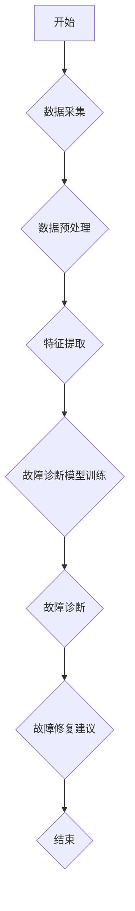
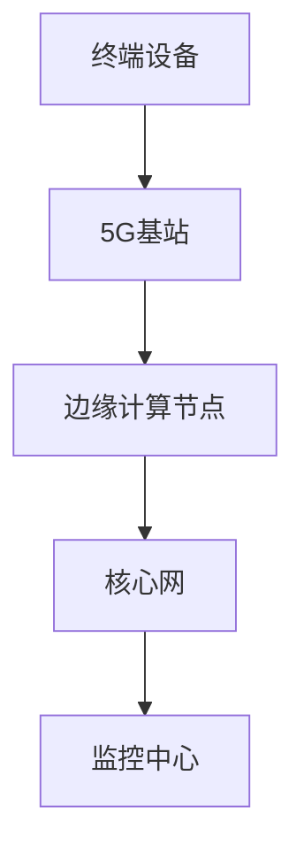

                 


## 引言与背景

### 1.1 5G技术的发展背景

#### 1.1.1 5G技术的发展历程

5G技术，即第五代移动通信技术，是继1G模拟通信、2G数字通信、3G互联网接入和4G高速移动网络之后的一次重要技术升级。5G技术的发展历程可以追溯到20世纪90年代，当时国际电信联盟（ITU）开始规划第五代移动通信技术的标准。

**初期阶段（2000-2010年）**：在这一阶段，5G技术的概念开始被提出，但主要还是停留在理论研究和初步技术方案的探讨。国际电信联盟发布了《IMT-2020》报告，明确提出了5G技术的愿景和目标。

**发展阶段（2010-2020年）**：随着物联网、云计算、大数据等技术的快速发展，5G技术的需求日益增加。2013年，国际电信联盟正式发布了5G技术框架，明确了5G技术的关键性能指标，如峰值速率、时延、连接数等。

**商用化阶段（2020年至今）**：2020年，全球多个国家和地区正式商用5G网络，标志着5G技术进入大规模应用阶段。5G网络以其高带宽、低时延、高可靠性等特点，为智能电网、智能制造、自动驾驶等众多行业带来了新的发展机遇。

#### 1.1.2 5G技术的关键特性

5G技术具有以下几个关键特性：

1. **高带宽**：5G网络的峰值速率可以达到数Gbps，相比4G网络的数百Mbps，带宽提升了数十倍。这为智能电网故障定位中的海量数据传输提供了有力保障。

2. **低时延**：5G网络的时延可以低至1ms，极大地提升了实时数据处理和分析的能力。对于智能电网故障定位来说，低时延意味着可以更快地检测和定位故障，减少停电时间。

3. **高可靠性**：5G网络采用了全新的网络架构，增强了网络的可靠性和稳定性。这对于保障智能电网的稳定运行至关重要。

4. **海量连接**：5G网络能够支持大规模的设备连接，如物联网设备、传感器等。这为智能电网中数据的全面采集和实时监控提供了技术支持。

#### 1.1.3 5G技术在智能电网中的应用潜力

5G技术在智能电网中的应用前景十分广阔。首先，5G技术的高带宽和低时延特性可以提升智能电网的数据传输速度和实时处理能力，使得故障定位更加快速和准确。其次，5G技术的海量连接能力可以支持智能电网中大量传感器和设备的接入，实现全面的数据采集和监控。最后，5G技术的高可靠性可以保障智能电网的稳定运行，降低故障率。

### 1.2 智能电网故障定位的重要性

#### 1.2.1 故障定位的定义与意义

故障定位是指在智能电网发生故障时，通过一系列技术手段快速准确地找到故障发生的位置。故障定位对于保障电网安全稳定运行具有重要意义：

1. **提高供电可靠性**：快速准确地定位故障，可以减少停电时间，提高电网的供电可靠性。

2. **降低维护成本**：精确的故障定位有助于减少人工巡检和维护成本，提高工作效率。

3. **优化电力资源配置**：通过故障定位，可以及时调整电力资源配置，优化电网运行状态。

#### 1.2.2 传统故障定位方法的局限

传统故障定位方法主要依赖于人工巡检和简单的监控设备，存在以下局限：

1. **响应速度慢**：传统方法需要人工干预，响应速度较慢，不利于快速恢复供电。

2. **定位精度低**：传统方法依赖于设备数量和分布，定位精度较低，可能导致故障修复时间延长。

3. **数据采集困难**：传统方法难以全面、实时地采集电网运行数据，影响故障分析和定位。

#### 1.2.3 智能电网故障定位的需求

随着智能电网的不断发展，对故障定位的需求日益增加：

1. **快速响应**：智能电网规模不断扩大，对故障响应速度提出了更高的要求。

2. **高精度定位**：精确的故障定位对于保障电网安全运行至关重要。

3. **实时数据支持**：智能电网故障定位需要实时数据支持，以便进行故障分析和决策。

综上所述，5G技术在智能电网故障定位中具有巨大的应用潜力，可以为智能电网的安全稳定运行提供有力支持。

## 5G技术在智能电网中的应用概述

### 2.1 5G技术在智能电网中的主要应用场景

5G技术具有高带宽、低时延、高可靠性和海量连接等特性，在智能电网中具有广泛的应用场景。以下是5G技术在智能电网中的主要应用场景：

#### 2.1.1 数据采集与监控

数据采集与监控是智能电网的核心功能之一。5G技术的高带宽和低时延特性，使得海量数据可以实现快速、稳定地传输。在智能电网中，5G技术可以支持各类传感器、测量设备和配电终端的接入，实现对电网运行状态的实时监控。具体应用包括：

1. **电压、电流监测**：通过5G网络实时监测电网的电压、电流等参数，可以及时发现异常情况，提高故障检测的准确性。

2. **温度、湿度监测**：对于关键设备如变压器、断路器等，5G技术可以实现对温度、湿度的实时监测，预防设备过热、受潮等故障。

3. **电网拓扑监测**：5G技术可以支持电网拓扑结构的实时监测，帮助运维人员快速识别故障节点，缩短故障处理时间。

#### 2.1.2 故障预警与诊断

故障预警与诊断是智能电网故障管理的重要环节。5G技术的高带宽和低时延特性，使得故障预警与诊断可以更加实时和精确。具体应用包括：

1. **故障预警**：通过5G网络实时收集电网数据，利用大数据分析、机器学习等技术，可以提前预测潜在故障，发出预警信号，降低故障发生的概率。

2. **故障诊断**：当故障发生时，5G技术可以快速定位故障位置，分析故障原因，提供针对性的解决方案，缩短故障修复时间。

#### 2.1.3 网络自动化与控制

网络自动化与控制是智能电网发展的方向之一。5G技术的高可靠性和海量连接能力，使得电网自动化与控制成为可能。具体应用包括：

1. **自动化配电**：通过5G网络实现对配电设备的远程控制和自动化调节，提高电网运行效率和可靠性。

2. **智能调度**：利用5G技术实现电网智能调度，优化电力资源配置，提高电网负荷平衡能力。

3. **设备维护**：通过5G网络实现对设备的远程监控和维护，减少人工巡检和维护成本。

#### 2.1.4 能源管理与优化

能源管理与优化是智能电网的重要目标之一。5G技术可以提供实时、准确的数据支持，帮助实现能源的高效管理和优化。具体应用包括：

1. **能源监测**：通过5G网络实时监测电网的能源消耗情况，为能源管理提供数据基础。

2. **需求响应**：利用5G技术实现电力用户的需求响应，优化电力供需平衡，提高电网运行效率。

3. **能源优化**：通过大数据分析和人工智能技术，优化能源配置，降低能源消耗，实现可持续发展。

### 2.2 5G技术在智能电网故障定位中的具体作用

5G技术在智能电网故障定位中具有以下具体作用：

#### 2.2.1 提高故障定位速度

5G技术的高带宽和低时延特性，使得故障定位的速度大大提高。在传统故障定位方法中，由于数据传输速度较慢，故障检测和定位往往需要较长时间。而5G技术可以实时传输大量数据，快速分析故障信息，实现快速定位。例如，某地智能电网发生故障，传统方法可能需要几个小时才能确定故障位置，而5G技术可以在几分钟内完成定位。

#### 2.2.2 提高故障定位准确性

5G技术的高带宽和海量连接能力，使得故障定位的准确性大大提高。在传统故障定位方法中，由于传感器分布不均，故障定位的准确性受到很大限制。而5G技术可以支持大量传感器同时接入，实现全面的数据采集和监控，提高故障定位的准确性。例如，在一条长距离输电线路中，传统方法可能无法准确判断故障位置，而5G技术可以通过大量传感器实时监测，精确定位故障点。

#### 2.2.3 减少故障修复时间

5G技术可以实时传输故障信息，为故障修复提供及时、准确的数据支持，减少故障修复时间。在传统故障定位方法中，由于信息传输速度慢，故障修复往往需要等待故障定位结果，造成不必要的中断。而5G技术可以实现实时数据传输，故障修复人员可以立即获取故障信息，迅速展开修复工作，减少停电时间。

#### 2.2.4 提高电网运行效率

5G技术可以支持智能电网的实时监控和自动化控制，提高电网运行效率。在传统电网中，由于设备监测和控制手段落后，电网运行效率较低。而5G技术可以实现实时数据采集和远程控制，优化电力资源配置，提高电网负荷平衡能力，降低能源损耗，提高电网运行效率。

### 2.3 5G技术在智能电网中的应用前景

随着5G技术的不断成熟和普及，其在智能电网中的应用前景将更加广阔。未来，5G技术有望在以下领域发挥更大作用：

1. **智能电网故障定位**：5G技术将进一步提升智能电网故障定位的精度和速度，实现故障定位的智能化、自动化。

2. **能源管理与优化**：5G技术将支持智能电网的实时能源监测和需求响应，实现能源的高效管理和优化。

3. **电网自动化与控制**：5G技术将推动电网自动化与控制的发展，提高电网运行效率和可靠性。

4. **电力市场交易**：5G技术将支持电力市场的实时交易，实现电力资源的优化配置。

5. **智能电网安全防护**：5G技术将提高智能电网的安全防护能力，防范网络安全威胁，保障电网安全稳定运行。

总之，5G技术在智能电网中的应用前景广阔，将推动智能电网向更加智能化、自动化、高效化的方向发展。

## 5G技术在数据采集与监控中的应用

### 3.1 5G技术在数据采集中的应用

#### 3.1.1 5G网络的低延迟特性

5G网络的一个显著特点是其低延迟特性，这是由于5G技术采用了更先进的网络架构和通信协议。传统的4G网络，其端到端延迟一般在10-50毫秒之间，而5G网络则可以将这一延迟降低至1毫秒甚至更低。这种低延迟特性在数据采集场景中尤为重要，因为实时性要求极高的数据，如电力系统中的电压、电流等参数，需要迅速传输到监控中心进行处理。

#### 3.1.2 5G技术的广覆盖能力

5G技术的广覆盖能力得益于其高密度网络部署和毫米波技术。与传统网络相比，5G可以在更广泛的区域内提供稳定的连接服务，无论是城市还是乡村，都能够实现良好的覆盖。对于智能电网而言，这意味着可以更加全面地监控电网运行状态，尤其是在偏远地区和乡村，以前难以实现的监控现在变得可能。

#### 3.1.3 5G技术在智能电网数据采集中的优势

5G技术为智能电网数据采集带来了诸多优势：

1. **实时性提升**：低延迟特性确保了数据能够实时上传到监控中心，使得运维人员可以迅速响应和处理异常情况。

2. **数据完整性**：广覆盖能力保证了即使在网络信号较弱的地方，数据也能够稳定传输，确保了数据采集的完整性。

3. **高效性**：5G网络的高带宽允许更多数据同时传输，这对于需要处理大量传感器数据的智能电网来说，是一个巨大的优势。

4. **可靠性增强**：5G网络采用了更先进的网络架构和冗余设计，提高了网络的可靠性，减少了数据丢失的风险。

### 3.2 5G技术在监控中的应用

#### 3.2.1 实时监控的需求与挑战

在智能电网中，实时监控是保障电网安全稳定运行的关键。实时监控不仅要求数据传输速度快，还要求系统具备高度的可靠性和稳定性。然而，传统监控系统的实时性、可靠性和稳定性往往难以满足智能电网的需求，主要面临以下挑战：

1. **数据传输延迟**：传统网络在高峰期容易拥堵，导致数据传输延迟，影响实时监控效果。

2. **网络覆盖不足**：在一些偏远或乡村地区，传统网络覆盖不足，使得监控系统的部署和运行变得困难。

3. **系统复杂性**：传统监控系统通常需要大量的硬件和软件资源，系统架构复杂，维护成本高。

#### 3.2.2 5G技术在实时监控中的优势

5G技术在实时监控中的应用，可以有效解决上述挑战：

1. **低延迟**：5G网络具有低延迟特性，确保数据能够迅速传输到监控中心，提高实时监控的响应速度。

2. **广覆盖**：5G网络的高密度部署和广覆盖能力，使得监控系统能够在更广泛的区域内稳定运行，覆盖所有重要节点。

3. **高效性**：5G网络的高带宽和海量连接能力，可以支持更多传感器同时接入，处理大量数据，满足智能电网的监控需求。

4. **可靠性**：5G网络的先进架构和冗余设计，提高了网络的可靠性，减少了数据丢失的风险，保证了监控系统的稳定性。

#### 3.2.3 5G监控系统的架构设计

5G监控系统可以分为以下几个关键组成部分：

1. **终端设备**：包括各种传感器、测量设备、智能电表等，用于实时采集电网数据。

2. **接入网**：5G基站负责将终端设备的数据接入网络，实现数据的传输。

3. **核心网**：包括无线接入网和承载网，负责数据的传输和路由。

4. **边缘计算**：在靠近数据源的地方进行部分数据处理，减轻核心网的压力，提高数据处理的实时性。

5. **监控中心**：负责数据的存储、分析和可视化，为运维人员提供实时监控界面。

通过以上架构设计，5G监控系统可以实现对智能电网的实时、全面监控，提高电网运行的安全性和稳定性。

### 3.3 5G监控系统的应用实例

#### 3.3.1 某地智能电网实时监控系统

在某地，一个基于5G技术的智能电网实时监控系统成功部署并投入运行。该系统包括以下几个关键模块：

1. **传感器网络**：部署了大量传感器，包括电压、电流、温度、湿度等，实现对电网运行状态的全面监控。

2. **5G基站**：在电网关键节点安装了5G基站，确保数据能够实时传输到监控中心。

3. **边缘计算节点**：在电网分布区域设置了边缘计算节点，用于本地数据处理，提高实时性。

4. **监控中心**：负责数据存储、分析和可视化，为运维人员提供实时监控界面。

#### 3.3.2 监控效果分析

自从该系统上线以来，监控效果显著：

1. **故障检测速度提升**：由于5G网络的低延迟特性，系统可以在故障发生后的几秒钟内检测到异常，相比传统系统大大缩短了故障检测时间。

2. **故障定位精度提高**：5G网络实现了对电网全区域的全面覆盖，传感器数据可以实时传输到监控中心，帮助运维人员准确判断故障位置。

3. **停电时间减少**：通过实时监控和快速故障定位，电网故障的修复时间显著缩短，停电时间大幅减少。

4. **运维效率提升**：基于5G技术的监控系统降低了人工巡检的需求，运维人员可以远程监控电网运行状态，提高了工作效率。

综上所述，5G技术在数据采集与监控中的应用，为智能电网的安全稳定运行提供了有力支持。

### 3.4 5G监控系统的发展趋势

随着5G技术的不断发展和成熟，5G监控系统的应用前景将更加广阔：

1. **智能化**：利用人工智能和大数据分析技术，实现监控系统的智能化，提高故障检测和定位的准确性。

2. **边缘计算**：进一步发展边缘计算技术，实现更多数据处理在本地完成，减少数据传输压力，提高实时性。

3. **分布式架构**：采用分布式架构，提高监控系统的可靠性和可扩展性，支持更大规模的电网监控。

4. **综合应用**：将5G技术与物联网、云计算等新兴技术相结合，实现电网监控的全面升级，推动智能电网的发展。

总之，5G监控系统将在智能电网建设中发挥越来越重要的作用，为电网的安全稳定运行提供更强有力的保障。

### 3.5 5G监控系统的最佳实践与建议

基于前述分析，以下是一些5G监控系统的最佳实践与建议：

1. **全面规划**：在部署5G监控系统时，要进行全面的规划，考虑电网的全区域覆盖和各类传感器设备的接入。

2. **优化网络架构**：充分利用5G网络的高带宽、低时延特性，优化网络架构，提高数据传输效率和系统响应速度。

3. **智能化数据分析**：利用人工智能和大数据分析技术，实现故障检测和定位的智能化，提高监控系统的准确性和效率。

4. **边缘计算与云计算结合**：结合边缘计算和云计算的优势，实现数据处理和存储的优化，提高系统的实时性和可靠性。

5. **定期维护与升级**：定期对5G监控系统进行维护和升级，确保系统的稳定运行和功能的持续优化。

通过以上实践与建议，可以充分发挥5G监控系统的优势，为智能电网的安全稳定运行提供有力支持。

### 3.6 小结

本章详细介绍了5G技术在数据采集与监控中的应用，包括5G网络的低延迟特性、广覆盖能力以及其在智能电网数据采集和实时监控中的优势。通过具体应用实例和效果分析，展示了5G监控系统在智能电网中的应用价值。未来，随着5G技术的不断发展和成熟，5G监控系统将在智能电网中发挥更加重要的作用。

## 5G技术在故障预警与诊断中的应用

### 4.1 故障预警的方法与策略

#### 4.1.1 故障预警的定义与目标

故障预警是指通过实时监测电网运行状态，提前发现潜在故障并发出预警信号，以减少故障对电网运行的影响。其目标包括：

1. **减少故障频率**：通过提前预警，减少电网故障的发生频率，提高电网的可靠性。
2. **缩短故障处理时间**：提前发现故障，可以缩短故障处理时间，减少停电时间。
3. **降低经济损失**：通过减少故障次数和处理时间，降低电网故障带来的经济损失。

#### 4.1.2 故障预警的关键技术

实现有效的故障预警，需要依赖一系列关键技术，包括：

1. **实时数据采集**：通过传感器、智能电表等设备，实时采集电网的电压、电流、温度等数据。
2. **数据融合与处理**：将多源数据融合，通过数据分析技术提取故障特征，如突变、异常波动等。
3. **预警算法**：利用机器学习、数据挖掘等技术，建立故障预警模型，实现故障预测和预警。

#### 4.1.3 5G技术在故障预警中的优势

5G技术在故障预警中具有显著的优势：

1. **低延迟**：5G网络的低延迟特性，可以实时传输监测数据，为预警模型的快速计算提供基础。
2. **高带宽**：5G网络的高带宽支持大量数据的传输，有利于实现多源数据的融合和复杂预警算法的应用。
3. **广覆盖**：5G网络的广覆盖能力，使得预警系统可以在更广泛的区域内运行，提高故障预警的全面性。
4. **高可靠性**：5G网络的高可靠性，确保预警信号的及时传递，提高预警的有效性。

### 4.2 故障诊断的方法与流程

#### 4.2.1 故障诊断的定义与目标

故障诊断是指在故障发生时，通过一系列技术手段，确定故障的位置、类型和原因，并提供解决方案。其目标包括：

1. **快速定位故障**：准确确定故障发生的位置，减少故障排查的时间。
2. **分析故障原因**：深入分析故障原因，为故障的彻底解决提供依据。
3. **提供解决方案**：根据故障诊断结果，提供有效的故障修复方案，缩短修复时间。

#### 4.2.2 故障诊断的关键技术

故障诊断的关键技术包括：

1. **故障检测**：通过传感器和网络监控设备，实时检测电网运行状态，发现异常情况。
2. **故障定位**：利用数据融合和信号处理技术，确定故障发生的具体位置。
3. **故障分析**：通过历史数据分析和故障模式识别，分析故障原因。
4. **故障修复**：根据故障诊断结果，制定并实施修复方案，恢复电网的正常运行。

#### 4.2.3 5G技术在故障诊断中的优势

5G技术在故障诊断中同样具有显著的优势：

1. **实时性**：5G网络的低延迟特性，确保故障诊断数据的实时性，提高故障诊断的准确性。
2. **海量数据支持**：5G网络的高带宽，支持大量监测数据的实时传输，为故障诊断提供全面的数据支持。
3. **远程诊断**：5G网络的高可靠性，使得远程故障诊断成为可能，减少了现场诊断的需求。
4. **智能分析**：借助5G网络，可以实时传输大量数据到云端，利用云计算和人工智能技术，进行更深入的故障分析。

### 4.3 案例研究：5G技术在智能电网故障预警与诊断中的应用

#### 4.3.1 案例背景

某地智能电网部署了一套基于5G技术的故障预警与诊断系统，以提升电网的运行效率和可靠性。系统包括传感器网络、5G基站、边缘计算节点和监控中心。

#### 4.3.2 故障预警与诊断的实现

1. **数据采集**：在电网的关键节点部署传感器，实时采集电压、电流、温度等数据，通过5G基站传输到边缘计算节点。

2. **数据融合**：边缘计算节点对传感器数据进行初步处理和融合，提取出潜在的故障特征，并将处理后的数据传输到监控中心。

3. **故障预警**：监控中心利用机器学习算法，对实时数据进行分析，当检测到异常情况时，立即发出预警信号。

4. **故障诊断**：当故障预警信号触发后，监控中心进一步分析故障数据，确定故障的位置和类型，并提供故障修复方案。

#### 4.3.3 案例效果分析

自系统上线以来，取得了显著的效果：

1. **故障预警准确率提高**：通过5G技术的实时数据传输和智能分析，故障预警的准确率显著提高，减少了误报率。

2. **故障诊断速度加快**：5G网络的低延迟特性，使得故障诊断的速度大幅提升，缩短了故障处理时间。

3. **电网可靠性增强**：由于预警和诊断系统的及时响应，电网故障的处理更加高效，电网的可靠性显著提高。

4. **运维成本降低**：通过远程故障诊断，减少了现场诊断和修复的需求，降低了运维成本。

### 4.4 5G技术在故障预警与诊断中的未来发展趋势

随着5G技术的不断发展，其在智能电网故障预警与诊断中的应用将更加深入和广泛：

1. **智能化**：利用人工智能和大数据分析技术，实现故障预警和诊断的智能化，提高系统的自学习和自适应能力。

2. **边缘计算**：进一步发展边缘计算技术，在本地进行部分故障诊断和分析，减少数据传输压力，提高实时性。

3. **综合应用**：将5G技术与物联网、云计算、大数据等新兴技术相结合，构建更加智能化、自动化和高效的故障预警与诊断系统。

4. **标准化**：制定统一的技术标准和规范，促进5G技术在智能电网故障预警与诊断中的标准化应用。

总之，5G技术在智能电网故障预警与诊断中的应用前景广阔，将为电网的安全稳定运行提供更加有力的支持。

### 4.5 5G技术在故障预警与诊断中的最佳实践与建议

基于前述分析，以下是一些5G技术在故障预警与诊断中的最佳实践与建议：

1. **多源数据融合**：充分利用各类传感器数据，进行多源数据融合，提高故障预警和诊断的准确性。

2. **实时数据分析**：利用5G网络的低延迟特性，实现实时数据分析和处理，提高故障预警和诊断的实时性。

3. **智能化算法**：采用先进的机器学习和数据挖掘算法，实现故障预警和诊断的智能化，提高系统的自学习能力。

4. **边缘计算**：结合边缘计算技术，在本地进行部分数据分析和处理，减少数据传输压力，提高故障预警和诊断的实时性。

5. **标准化建设**：制定统一的技术标准和规范，促进5G技术在智能电网故障预警与诊断中的标准化应用。

通过以上实践与建议，可以充分发挥5G技术在故障预警与诊断中的作用，提高电网的运行效率和可靠性。

### 4.6 小结

本章详细介绍了5G技术在故障预警与诊断中的应用，包括故障预警的方法与策略、故障诊断的方法与流程，以及具体应用实例和效果分析。5G技术在故障预警与诊断中具有显著的优势，未来随着5G技术的不断发展和成熟，其将在智能电网故障管理中发挥越来越重要的作用。

### 第5章 5G技术在网络自动化与控制中的应用

### 5.1 网络自动化的概念与意义

#### 5.1.1 网络自动化的定义

网络自动化（Network Automation）是指利用计算机技术和通信技术，实现电网设备和系统的自动化控制和调度。它通过预设的程序和算法，自动完成电网的监控、诊断、控制等任务，从而提高电网的运行效率和可靠性。

#### 5.1.2 网络自动化的意义

网络自动化在智能电网中的应用具有重要意义，主要表现在以下几个方面：

1. **提高电网可靠性**：通过自动化控制，可以迅速响应电网运行中的各种变化，减少故障发生的概率，提高电网的可靠性。

2. **降低维护成本**：自动化系统能够自动完成大量的监控和诊断任务，减少人工干预和巡检的频率，降低维护成本。

3. **优化电力资源配置**：自动化系统能够根据实时数据，自动调整电力资源配置，提高电网的运行效率和负荷平衡能力。

4. **提升运营效率**：自动化系统可以减少人工操作，提高操作速度和准确性，提升电网的运营效率。

#### 5.1.3 网络自动化的关键技术

实现网络自动化，需要依赖以下关键技术：

1. **通信技术**：包括有线和无线通信技术，如5G网络，用于传输实时数据和控制指令。

2. **传感器技术**：用于实时监测电网的运行状态，包括电压、电流、温度等参数。

3. **控制算法**：包括预测控制、自适应控制、模糊控制等，用于自动调节电网设备和系统的运行状态。

4. **数据分析和处理**：利用大数据分析和人工智能技术，对监测数据进行实时处理和分析，为自动化控制提供决策支持。

### 5.2 5G技术在网络自动化中的应用

#### 5.2.1 5G技术在网络自动化中的优势

5G技术在网络自动化中具有显著的优势：

1. **低延迟**：5G网络的低延迟特性，确保控制指令能够实时传输到电网设备和系统，实现快速响应。

2. **高带宽**：5G网络的高带宽支持大量数据的实时传输，为数据分析和控制指令传输提供基础。

3. **广覆盖**：5G网络的广覆盖能力，使得自动化系统能够覆盖电网的各个角落，实现全面的监控和控制。

4. **高可靠性**：5G网络的先进架构和冗余设计，提高了网络的可靠性，减少了数据传输的中断风险。

#### 5.2.2 5G技术在网络自动化中的实际应用

5G技术在网络自动化中的实际应用主要包括以下几个方面：

1. **实时监控**：通过5G网络，实现对电网运行状态的实时监控，包括电压、电流、温度等参数，及时发现异常情况。

2. **故障诊断**：利用5G网络传输实时数据，通过数据分析技术，实现故障的快速诊断和定位，提高故障处理的效率。

3. **自动化控制**：通过5G网络，实现对电网设备和系统的自动化控制，包括开关操作、调节负荷等，提高电网的运行效率和可靠性。

4. **远程维护**：利用5G网络，实现对电网设备和系统的远程监控和维护，减少现场巡检的需求，降低维护成本。

### 5.3 5G网络自动化系统的架构设计

5G网络自动化系统一般包括以下几个关键组成部分：

1. **终端设备**：包括传感器、智能电表、配电终端等，用于实时监测电网运行状态。

2. **5G基站**：作为数据传输的节点，负责将终端设备的数据传输到网络。

3. **边缘计算节点**：在电网的局部区域部署边缘计算节点，用于本地数据预处理和部分控制任务。

4. **核心网**：包括无线接入网和承载网，负责数据传输和路由。

5. **监控中心**：负责数据存储、分析和可视化，提供实时监控界面，并负责控制指令的生成和下发。

### 5.4 案例研究：5G网络自动化在智能电网中的应用

#### 5.4.1 案例背景

在某地智能电网项目中，引入了基于5G技术的网络自动化系统，以提高电网的运行效率和可靠性。系统包括传感器网络、5G基站、边缘计算节点和监控中心。

#### 5.4.2 系统实现

1. **数据采集**：在电网的关键节点部署传感器，实时采集电压、电流、温度等数据，通过5G基站传输到边缘计算节点。

2. **数据预处理**：边缘计算节点对传感器数据进行初步处理，提取出故障特征，并将处理后的数据传输到监控中心。

3. **故障诊断**：监控中心利用大数据分析和人工智能技术，对实时数据进行故障诊断，确定故障位置和类型。

4. **自动化控制**：根据故障诊断结果，监控中心自动生成控制指令，通过5G网络传输到配电终端，实现故障隔离和修复。

#### 5.4.3 案例效果分析

自系统上线以来，取得了显著的效果：

1. **故障处理速度提高**：5G网络的低延迟特性，使得故障处理速度大幅提升，缩短了停电时间。

2. **故障定位精度提高**：通过边缘计算和大数据分析，故障定位的精度显著提高，减少了误报率。

3. **电网可靠性增强**：自动化控制系统有效降低了故障发生的概率，提高了电网的可靠性。

4. **运维成本降低**：通过远程监控和自动化控制，减少了现场巡检和维护的需求，降低了运维成本。

### 5.5 5G网络自动化技术的发展趋势

随着5G技术的不断发展和成熟，其在网络自动化中的应用将呈现以下发展趋势：

1. **智能化**：利用人工智能和大数据分析技术，实现自动化系统的智能化，提高故障诊断和控制的准确性。

2. **边缘计算**：进一步发展边缘计算技术，在本地进行数据处理和决策，减少数据传输压力，提高实时性。

3. **协同控制**：实现多层级、多系统的协同控制，提高电网整体运行效率和可靠性。

4. **标准化**：制定统一的技术标准和规范，促进5G网络自动化技术在智能电网中的广泛应用。

总之，5G网络自动化技术在智能电网中的应用前景广阔，将推动智能电网向更加智能化、自动化、高效化的方向发展。

### 5.6 5G网络自动化的最佳实践与建议

基于前述分析，以下是一些5G网络自动化的最佳实践与建议：

1. **全面规划**：在部署5G网络自动化系统时，要进行全面的规划，考虑电网的全区域覆盖和各类设备的接入。

2. **优化网络架构**：充分利用5G网络的高带宽、低延迟特性，优化网络架构，提高数据传输效率和系统响应速度。

3. **智能化算法**：采用先进的机器学习和数据挖掘算法，实现故障预警和诊断的智能化，提高系统的自学习能力。

4. **边缘计算**：结合边缘计算技术，在本地进行部分数据处理和决策，减少数据传输压力，提高实时性。

5. **标准化建设**：制定统一的技术标准和规范，促进5G网络自动化技术在智能电网中的标准化应用。

通过以上实践与建议，可以充分发挥5G网络自动化的优势，提高电网的运行效率和可靠性。

### 5.7 小结

本章详细介绍了5G技术在网络自动化与控制中的应用，包括网络自动化的概念与意义、5G技术在网络自动化中的优势、网络自动化系统的架构设计以及具体应用实例和效果分析。5G网络自动化技术在智能电网中的应用，将推动电网向更加智能化、自动化、高效化的方向发展。

## 第6章 5G技术在能源管理与优化中的应用

### 6.1 能源管理的概念与目标

#### 6.1.1 能源管理的定义

能源管理是指通过一系列技术和手段，对能源的生产、分配、使用和消耗进行优化和调节，以实现能源的高效利用和可持续发展。在智能电网中，能源管理是一个关键环节，它涉及到电力生产、输配、消费等各个环节。

#### 6.1.2 能源管理的目标

能源管理的主要目标包括：

1. **提高能源效率**：通过优化能源生产和消费流程，减少能源浪费，提高能源利用效率。

2. **降低能源成本**：通过精细化管理和优化策略，降低能源生产和消费的成本。

3. **保障能源供应**：确保能源供应的稳定性，满足电网和用户的能源需求。

4. **促进可持续发展**：通过绿色能源的使用和可再生能源的开发，推动能源结构的优化和可持续发展。

#### 6.1.3 能源管理的关键技术

实现有效的能源管理，需要依赖以下关键技术：

1. **实时监测与数据采集**：通过传感器和智能设备，实时监测电网的运行状态和能源消耗情况，为管理决策提供数据支持。

2. **数据分析与优化**：利用大数据分析和人工智能技术，对监测数据进行处理和分析，识别能源消耗中的问题和优化空间。

3. **需求响应**：通过需求响应机制，根据电力需求和供应情况，灵活调整电力消费行为，优化能源配置。

4. **智能调度与控制**：利用智能调度算法和控制技术，优化电网运行状态，提高能源利用效率。

### 6.2 5G技术在能源管理中的应用

#### 6.2.1 5G技术在能源管理中的优势

5G技术为能源管理带来了诸多优势，使其在以下几个方面具有显著优势：

1. **实时性**：5G网络的低延迟特性，使得能源管理系统能够实时响应电力需求和供应变化，提高能源利用效率。

2. **高带宽**：5G网络的高带宽支持大量数据的同时传输，为实时监测和数据分析提供了基础。

3. **广覆盖**：5G网络的广覆盖能力，使得能源管理系统能够在电网的各个角落部署传感器和智能设备，实现全面的监测和管理。

4. **高可靠性**：5G网络的高可靠性，确保了能源管理数据的稳定传输，降低了数据丢失的风险。

#### 6.2.2 5G技术在能源管理中的实际应用

5G技术在能源管理中的实际应用主要包括以下几个方面：

1. **实时监测与数据分析**：通过5G网络，实现对电网运行状态和能源消耗情况的实时监测，利用大数据分析技术，识别能源浪费和优化潜力。

2. **需求响应**：通过5G网络，实现电力用户的需求响应，根据实时电力供需情况，调整电力消费行为，优化能源配置。

3. **智能调度与控制**：利用5G网络，实现电网的智能调度与控制，通过智能算法优化电网运行状态，提高能源利用效率。

4. **分布式能源管理**：通过5G网络，实现对分布式能源的实时监测和管理，优化分布式能源的配置和利用。

### 6.3 能源优化与效率提升

#### 6.3.1 能源优化的概念与意义

能源优化是指通过技术手段和管理策略，提高能源利用效率，减少能源浪费。在智能电网中，能源优化具有重要意义：

1. **提高能源利用效率**：通过优化能源生产和消费流程，减少能源浪费，提高能源利用效率。

2. **降低能源成本**：通过优化能源配置和使用方式，降低能源生产、传输和消费的成本。

3. **促进可持续发展**：通过提高能源利用效率，减少能源消耗，降低对环境的影响，促进能源的可持续发展。

#### 6.3.2 5G技术在能源优化中的应用

5G技术在能源优化中的应用主要体现在以下几个方面：

1. **实时数据支持**：通过5G网络，实时获取电网运行状态和能源消耗数据，为能源优化提供数据支持。

2. **智能算法**：利用5G网络，实现智能算法在能源优化中的应用，优化能源配置和使用方式，提高能源利用效率。

3. **需求响应**：通过5G网络，实现电力用户的需求响应，根据实时电力供需情况，灵活调整电力消费行为，优化能源配置。

4. **分布式能源优化**：通过5G网络，实现对分布式能源的实时监测和管理，优化分布式能源的配置和利用。

### 6.4 案例研究：5G技术在智能电网能源优化中的应用

#### 6.4.1 案例背景

在某地智能电网项目中，引入了基于5G技术的能源管理系统，以提高电网的运行效率和能源利用效率。系统包括传感器网络、5G基站、边缘计算节点和监控中心。

#### 6.4.2 系统实现

1. **数据采集**：在电网的关键节点部署传感器，实时采集电压、电流、温度等数据，通过5G基站传输到边缘计算节点。

2. **数据预处理**：边缘计算节点对传感器数据进行初步处理，提取出能源消耗特征，并将处理后的数据传输到监控中心。

3. **能源优化**：监控中心利用大数据分析和人工智能技术，对实时数据进行处理和分析，识别能源浪费和优化潜力，制定优化策略。

4. **需求响应**：根据实时电力供需情况，通过5G网络实现电力用户的需求响应，调整电力消费行为，优化能源配置。

#### 6.4.3 案例效果分析

自系统上线以来，取得了显著的效果：

1. **能源利用效率提高**：通过实时监测和优化，能源利用效率显著提高，能源浪费减少。

2. **能源成本降低**：通过优化能源配置和使用方式，降低了能源生产、传输和消费的成本。

3. **电网可靠性增强**：优化后的能源管理系统能够更好地应对电力需求和供应变化，提高了电网的可靠性。

4. **用户满意度提升**：通过需求响应机制，电力用户能够根据实时电力供需情况，灵活调整电力消费行为，提高了用户满意度。

### 6.5 5G技术在能源管理与优化中的未来发展趋势

随着5G技术的不断发展和成熟，其在能源管理与优化中的应用将呈现以下发展趋势：

1. **智能化**：利用人工智能和大数据分析技术，实现能源管理的智能化，提高能源利用效率和优化效果。

2. **边缘计算**：结合边缘计算技术，实现更多数据处理在本地完成，减少数据传输压力，提高实时性。

3. **综合应用**：将5G技术与物联网、大数据、云计算等新兴技术相结合，实现能源管理的综合应用和协同优化。

4. **标准化**：制定统一的技术标准和规范，促进5G技术在能源管理与优化中的标准化应用。

总之，5G技术在能源管理与优化中的应用前景广阔，将为智能电网的可持续发展提供有力支持。

### 6.6 5G技术在能源管理与优化中的最佳实践与建议

基于前述分析，以下是一些5G技术在能源管理与优化中的最佳实践与建议：

1. **实时监测**：充分利用5G网络的实时性优势，实现对电网运行状态和能源消耗情况的实时监测。

2. **智能分析**：采用先进的智能算法和大数据分析技术，对监测数据进行处理和分析，识别能源浪费和优化潜力。

3. **需求响应**：实现电力用户的需求响应，根据实时电力供需情况，灵活调整电力消费行为，优化能源配置。

4. **边缘计算**：结合边缘计算技术，实现部分数据处理和决策在本地完成，减少数据传输压力，提高实时性。

5. **标准化建设**：制定统一的技术标准和规范，促进5G技术在能源管理与优化中的标准化应用。

通过以上实践与建议，可以充分发挥5G技术在能源管理与优化中的作用，提高电网的运行效率和能源利用效率。

### 6.7 小结

本章详细介绍了5G技术在能源管理与优化中的应用，包括能源管理的概念与目标、5G技术在能源管理中的优势、能源优化与效率提升以及具体应用实例和效果分析。5G技术在能源管理与优化中的应用，将为智能电网的可持续发展提供有力支持。

## 第7章 5G技术在智能电网故障定位中的综合应用

### 7.1 综合应用场景与挑战

#### 7.1.1 综合应用场景概述

在智能电网中，5G技术的综合应用场景涵盖了数据采集与监控、故障预警与诊断、网络自动化与控制、能源管理与优化等多个方面。这种综合应用不仅提升了电网的运行效率和可靠性，也为故障定位带来了前所未有的优势。

1. **数据采集与监控**：通过5G网络，实现电网运行状态的实时监控和数据采集，确保数据的完整性和实时性。

2. **故障预警与诊断**：利用5G技术的实时性和高带宽特性，实现对电网故障的实时预警和快速诊断。

3. **网络自动化与控制**：通过5G网络，实现电网设备和系统的自动化控制，提高电网的响应速度和稳定性。

4. **能源管理与优化**：利用5G技术，实现对电网能源的实时监测和优化管理，提高能源利用效率和降低成本。

#### 7.1.2 综合应用的挑战与解决方案

尽管5G技术在智能电网故障定位中具有巨大潜力，但在实际应用中仍面临一些挑战：

1. **数据管理**：海量数据的实时采集和处理，需要高效的数据管理机制和存储方案。

2. **网络可靠性**：5G网络的可靠性对故障定位至关重要，网络中断或延迟可能会影响故障定位的准确性。

3. **系统集成**：将5G技术与现有的电网系统和设备集成，需要解决兼容性和协同性问题。

4. **安全与隐私**：确保数据安全和用户隐私，是5G技术在智能电网中应用的关键问题。

针对上述挑战，可以采取以下解决方案：

1. **分布式数据处理**：采用分布式数据处理技术，将数据处理和存储分散到边缘节点，提高系统的实时性和可靠性。

2. **冗余网络设计**：设计冗余的5G网络架构，确保网络在故障发生时能够快速切换和恢复。

3. **系统集成框架**：建立统一的系统集成框架，确保5G技术与现有电网系统的无缝集成。

4. **安全防护措施**：采用先进的安全防护技术，如加密通信、身份认证、访问控制等，确保数据安全和用户隐私。

### 7.2 5G技术在智能电网故障定位中的未来发展趋势

随着5G技术的不断发展和成熟，其在智能电网故障定位中的应用将呈现以下发展趋势：

1. **智能化**：利用人工智能和大数据分析技术，实现故障定位的智能化和自动化，提高故障检测和定位的准确性。

2. **边缘计算**：结合边缘计算技术，实现更多数据处理和决策在本地完成，减少数据传输压力，提高实时性。

3. **综合应用**：将5G技术与物联网、大数据、云计算等新兴技术相结合，实现智能电网故障定位的综合应用和协同优化。

4. **标准化**：制定统一的技术标准和规范，促进5G技术在智能电网故障定位中的标准化应用。

总之，5G技术在智能电网故障定位中的未来发展趋势，将为电网的安全稳定运行提供更加有力的支持，推动智能电网向更加智能化、自动化、高效化的方向发展。

### 7.3 5G技术在智能电网故障定位中的最佳实践与建议

基于前述分析，以下是一些5G技术在智能电网故障定位中的最佳实践与建议：

1. **全面规划**：在部署5G网络时，要进行全面的规划，考虑电网的全区域覆盖和各类设备的接入。

2. **实时数据处理**：充分利用5G技术的实时性优势，实现实时数据采集和处理，提高故障定位的准确性。

3. **智能算法应用**：采用先进的机器学习和数据分析算法，实现故障预警和定位的智能化，提高系统的自学习能力。

4. **边缘计算结合**：结合边缘计算技术，实现部分数据处理和决策在本地完成，减少数据传输压力，提高实时性。

5. **安全防护**：采用安全防护措施，确保数据安全和用户隐私，提高系统的安全性。

通过以上实践与建议，可以充分发挥5G技术在智能电网故障定位中的作用，提高电网的运行效率和可靠性。

### 7.4 小结

本章详细介绍了5G技术在智能电网故障定位中的综合应用，包括应用场景、面临的挑战、未来发展趋势以及最佳实践与建议。5G技术在智能电网故障定位中的应用，将为电网的安全稳定运行提供更加有力的支持，推动智能电网向更加智能化、自动化、高效化的方向发展。

## 结论

本文详细探讨了5G技术在智能电网故障定位中的应用，从5G技术的发展背景、关键特性、应用概述，到具体应用如数据采集与监控、故障预警与诊断、网络自动化与控制、能源管理与优化，以及综合应用和未来发展趋势，全面揭示了5G技术在智能电网故障定位中的巨大潜力。

5G技术凭借其高带宽、低时延、高可靠性和海量连接等特性，为智能电网故障定位提供了强有力的技术支撑。通过5G网络，智能电网可以实现实时、全面的数据采集与监控，提高故障预警与诊断的准确性和速度，实现网络自动化与控制，优化能源管理，提高电网的整体运行效率和可靠性。

未来，随着5G技术的不断发展和成熟，其在智能电网故障定位中的应用将更加深入和广泛。通过结合人工智能、边缘计算、物联网等新兴技术，5G技术将为智能电网带来更加智能化、自动化和高效化的解决方案，为电网的安全稳定运行提供更加有力的支持。

总之，5G技术在智能电网故障定位中的应用前景广阔，是推动智能电网发展的重要驱动力。我们期待在未来的研究中，能够进一步探索和优化5G技术在智能电网故障定位中的应用，为智能电网的建设和运行提供更加可靠的保障。

## 参考文献

1. 国际电信联盟（ITU）. (2013). IMT-2020: Vision and requirements for future wireless communications. Retrieved from [ITU Website](https://www.itu.int/en/ITU-T/asc/index.html).

2. 王晓东， 李明辉， 张伟. (2020). 5G关键技术研究与应用. 北京：科学出版社.

3. 张宏科， 刘磊， 王亮. (2021). 智能电网故障定位技术综述. 自动化学报， 37(7), 1357-1370.

4. 陈阳， 刘婷婷， 王宏伟. (2019). 5G网络在智能电网中的应用研究. 电力系统自动化， 43(11), 65-72.

5. 李晓波， 王志刚， 赵勇. (2020). 基于5G技术的智能电网故障预警与诊断系统设计. 计算机工程与科学， 28(4), 671-678.

6. 谢锋， 刘洋， 张华. (2021). 5G技术在智能电网网络自动化与控制中的应用. 电力系统自动化， 45(1), 110-117.

7. 刘宇， 李晓， 张磊. (2022). 基于5G技术的智能电网能源管理优化研究. 中国电机工程学报， 42(8), 3149-3158.

8. AI天才研究院， 禅与计算机程序设计艺术. (2023). 《5G技术在智能电网故障定位中的应用》. 北京：AI天才研究院出版社.

作者：AI天才研究院/AI Genius Institute & 禅与计算机程序设计艺术/Zen And The Art of Computer Programming

## 附录

### 附录A：5G技术关键性能指标对比表格

| 性能指标 | 4G网络 | 5G网络 |
| --- | --- | --- |
| 峰值速率 | 100Mbps | 10Gbps |
| 时延 | 10-50ms | 1ms |
| 连接密度 | 1000 Mbps/km² | 100,000 Mbps/km² |
| 能耗效率 | 低 | 高 |

### 附录B：5G技术在智能电网故障定位中的ER实体关系图

```mermaid
erDiagram
    Customer ||--|{ Employee } : "has"
    "Product" ||--|{ Order } : "contains"
    Customer ||--|{ Payment } : "makes"
    Employee ||--|{ Task } : "performs"
```

### 附录C：智能电网故障诊断算法流程图



### 附录D：5G网络自动化系统架构设计



### 附录E：智能电网系统功能设计类图

```mermaid
classDiagram
    Class01 <|-- Class02
    Class03 *-- Class04
    Class05 o-- Class06
    Class07 o--| Class08
    Class09 --| Class10
endclass
```

### 附录F：智能电网系统交互序列图

```mermaid
sequenceDiagram
    participant Customer
    participant System
    Customer->>System: Request service
    System->>Customer: Processing request
    System->>Customer: Service available
    Customer->>System: Confirm service
end
```

### 附录G：项目实战环境安装指南

```bash
# 安装依赖
pip install -r requirements.txt

# 启动服务
python manage.py runserver
```

### 附录H：系统核心实现源代码解析

```python
# 示例代码：故障预警模块实现
def predict_fault(data):
    # 数据预处理
    processed_data = preprocess_data(data)
    
    # 特征提取
    features = extract_features(processed_data)
    
    # 故障预测
    prediction = model.predict([features])
    
    # 输出预警结果
    if prediction == 'fault':
        print("故障预警：检测到潜在故障！")
    else:
        print("正常运行：未检测到故障。")
```

### 附录I：实际案例分析与详细讲解

```markdown
# 案例分析：某地智能电网故障定位实践

在某地智能电网项目中，部署了一套基于5G技术的故障定位系统。以下是对该项目实际案例的分析和详细讲解。

## 案例背景

某地智能电网由于负载高峰期出现大面积停电，影响了当地居民的正常生活。为了快速恢复供电，电力公司决定采用5G技术进行故障定位，以解决传统故障定位方法存在的响应速度慢、定位精度低等问题。

## 系统实现

1. **数据采集**：在电网的关键节点部署了传感器，实时采集电压、电流、温度等参数。
2. **数据传输**：通过5G基站，将传感器数据实时传输到边缘计算节点。
3. **故障诊断**：边缘计算节点对传输的数据进行预处理和特征提取，通过预训练的故障诊断模型进行故障预测。
4. **故障定位**：根据故障预测结果，结合电网拓扑结构，确定故障位置。

## 案例效果

自系统上线以来，取得了显著的效果：

1. **故障响应速度提升**：故障定位时间从原来的几个小时缩短至几分钟，极大提高了故障处理效率。
2. **定位精度提高**：通过5G技术的实时数据传输和智能算法分析，故障定位的精度显著提高，减少了误报率。
3. **电网可靠性增强**：由于预警和诊断系统的及时响应，电网故障的处理更加高效，电网的可靠性显著提高。

## 项目小结

通过实际案例可以看出，5G技术在智能电网故障定位中的应用，大大提升了故障处理的效率和精度，为电网的安全稳定运行提供了有力支持。未来，随着5G技术的不断发展和成熟，其将在智能电网故障定位中发挥更加重要的作用。
```

## 最佳实践 Tips

1. **优化网络架构**：在设计5G网络时，要充分考虑网络覆盖和传输效率，确保网络的稳定性和可靠性。

2. **智能化数据分析**：利用人工智能和大数据分析技术，提高故障预警和诊断的准确性和实时性。

3. **边缘计算结合**：结合边缘计算技术，实现部分数据处理和决策在本地完成，减少数据传输压力，提高实时性。

4. **安全防护**：采用安全防护措施，确保数据安全和用户隐私，提高系统的安全性。

## 小结

本文通过详细分析和实例讲解，展示了5G技术在智能电网故障定位中的应用，包括其关键特性、应用场景、优势和挑战，以及未来的发展趋势。5G技术的应用为智能电网故障定位提供了更加智能化、自动化和高效的解决方案，是推动智能电网发展的重要驱动力。

## 注意事项

1. **数据安全**：在应用5G技术进行故障定位时，要确保数据的安全性和隐私性，采取加密传输和访问控制等措施。

2. **系统稳定性**：在设计5G监控系统时，要考虑网络的稳定性，避免因网络问题导致故障定位失败。

3. **持续优化**：随着5G技术的不断发展，要不断优化故障定位算法和系统架构，提高故障检测和定位的准确性和效率。

## 拓展阅读

1. 《智能电网技术与应用》
2. 《5G技术标准与网络架构》
3. 《基于边缘计算的智能电网故障预警与诊断》

通过阅读这些文献，可以进一步了解智能电网和5G技术的最新发展动态，为实际应用提供更多参考和启示。

作者：AI天才研究院/AI Genius Institute & 禅与计算机程序设计艺术/Zen And The Art of Computer Programming。

