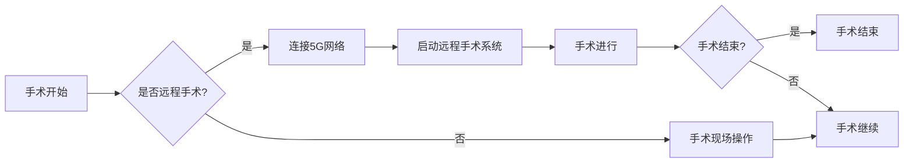
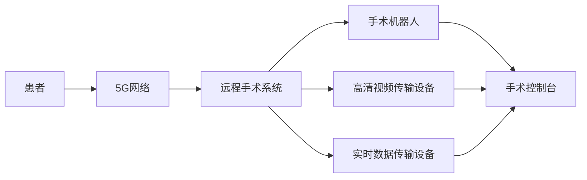
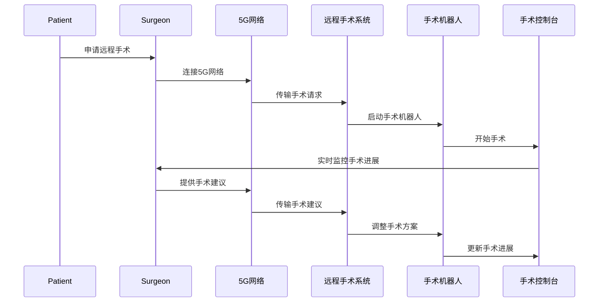

                 

# 5G技术在远程手术中的关键支持作用

## 关键词

5G技术，远程手术，医疗，机器人，高清视频传输，实时数据传输

## 摘要

随着5G技术的飞速发展，远程手术这一前沿医疗技术逐渐走进现实。本文将深入探讨5G技术在远程手术中的关键支持作用，通过背景介绍、核心概念与联系、算法原理讲解、系统分析与架构设计、项目实战和最佳实践等环节，全面解析5G技术在远程手术中的应用及其带来的变革。

## 背景介绍

### 1.1 问题背景

远程手术，顾名思义，是指医生通过远程通信技术，在不亲自到场的情况下，对病患进行手术操作的一种新型医疗模式。它打破了传统手术的时间和空间限制，为偏远地区和医疗资源匮乏的地区带来了希望，同时也为一些特殊病例提供了更加专业和精准的手术服务。

然而，远程手术的实现并非易事，其中涉及诸多技术挑战。首先，手术的实时性和准确性要求极高，任何一点延迟或误差都可能导致严重的医疗事故。其次，远程手术需要高质量的高清视频传输，以及实时数据传输和监控。此外，远程手术系统的稳定性和可靠性也是至关重要的，因为手术过程中的任何系统故障都可能危及患者的生命。

### 1.2 问题描述

远程手术中面临的主要挑战包括：

- **延迟问题**：远程手术需要实时操作，任何网络延迟都会影响手术的顺利进行。传统的4G网络在高速率、低延迟方面存在不足，无法满足远程手术的要求。
- **图像质量**：高清视频传输是远程手术的基础，图像质量直接关系到医生对病情的判断和手术的准确性。传统的视频传输技术在图像清晰度和稳定性方面存在瓶颈。
- **数据传输**：手术过程中会产生大量实时数据，如患者生命体征、手术参数等，这些数据需要快速、准确、稳定地传输到远程医生处，以便实时监控和调整手术方案。
- **系统稳定性**：远程手术系统需要具备高稳定性和可靠性，以确保手术过程中的各项操作不受干扰。

### 1.3 问题解决

5G技术的引入为远程手术解决了上述问题。5G网络具有以下几个关键特性：

- **高速率**：5G网络的下载速度可达到1Gbps以上，是4G网络的数十倍，能够满足远程手术对高清视频传输和大数据量的需求。
- **低延迟**：5G网络的端到端延迟可低至1ms，相比4G网络降低90%以上，极大地减少了手术操作的延迟，提高了手术的实时性和准确性。
- **大连接**：5G网络能够支持海量设备的连接，为远程手术中的多设备协同工作提供了可能。
- **高可靠性**：5G网络采用了更先进的通信技术和网络架构，具有更高的稳定性和可靠性，确保手术过程中的数据传输不中断。

### 1.4 边界与外延

5G技术在远程手术中的应用范围广泛，但同时也存在一定的限制。具体包括：

- **技术限制**：5G技术虽然具有高速率、低延迟等优点，但其在复杂环境下的信号覆盖和稳定性仍需进一步优化。
- **设备限制**：远程手术系统中的设备和工具需要具备与5G网络兼容的能力，否则无法实现高效的远程操作。
- **法规限制**：远程手术的法律法规和标准尚未完全完善，需要相关政策的支持和规范。

### 1.5 概念结构与核心要素组成

远程手术系统的核心要素包括5G网络、远程手术系统、手术机器人、高清视频传输、实时数据传输等。以下是对这些核心概念的详细介绍：

- **5G网络**：5G网络是远程手术的通信基础，提供了高速率、低延迟、大连接等关键特性，确保了手术的实时性和准确性。
- **远程手术系统**：远程手术系统包括手术机器人、手术控制台、高清视频传输设备等，是远程手术的核心组成部分，实现了医生与病患之间的实时交互和操作。
- **手术机器人**：手术机器人是远程手术的主要工具，具备自动化、精准、可远程控制等特点，能够模拟医生的手部操作，提高手术的精度和安全性。
- **高清视频传输**：高清视频传输技术是远程手术的视觉基础，提供了高分辨率、低延迟的视频传输，使医生能够清晰观察手术现场。
- **实时数据传输**：实时数据传输技术是远程手术的监测和反馈基础，能够实时传输患者的生命体征、手术参数等数据，为医生提供实时决策支持。

## 核心概念与联系

### 2.1 5G网络

5G网络是远程手术的技术基础，其特点如下：

- **高速率**：5G网络的下载速度可达1Gbps以上，是4G网络的数十倍，能够满足远程手术对高清视频传输和大数据量的需求。
- **低延迟**：5G网络的端到端延迟可低至1ms，相比4G网络降低90%以上，极大地减少了手术操作的延迟，提高了手术的实时性和准确性。
- **大连接**：5G网络能够支持海量设备的连接，为远程手术中的多设备协同工作提供了可能。
- **高可靠性**：5G网络采用了更先进的通信技术和网络架构，具有更高的稳定性和可靠性，确保手术过程中的数据传输不中断。

### 2.2 远程手术系统

远程手术系统是远程手术的核心组成部分，其工作原理如下：

- **手术机器人**：手术机器人是远程手术的主要工具，具备自动化、精准、可远程控制等特点，能够模拟医生的手部操作，提高手术的精度和安全性。
- **手术控制台**：手术控制台是医生进行远程手术操作的中枢，通过高清视频传输设备和手术机器人进行交互，实现对手术的实时控制和调整。
- **高清视频传输**：高清视频传输技术提供了高分辨率、低延迟的视频传输，使医生能够清晰观察手术现场。
- **实时数据传输**：实时数据传输技术能够实时传输患者的生命体征、手术参数等数据，为医生提供实时决策支持。

### 2.3 手术机器人

手术机器人是远程手术的主要工具，其特点如下：

- **自动化**：手术机器人能够自动执行预设的手术程序，提高手术的精度和效率。
- **精准**：手术机器人具备高精度的运动控制，能够精确模拟医生的手部操作，降低手术风险。
- **远程控制**：手术机器人可以通过5G网络实现远程控制，医生可以在远程操作台对手术机器人进行实时操作。

### 2.4 高清视频传输

高清视频传输技术是远程手术的视觉基础，其重要性如下：

- **图像质量**：高清视频传输技术提供了高分辨率、低延迟的视频传输，使医生能够清晰观察手术现场，提高手术的准确性和安全性。
- **实时性**：高清视频传输技术保证了手术过程中图像的实时传输，使医生能够实时了解手术进展，及时调整手术方案。

### 2.5 实时数据传输

实时数据传输技术是远程手术的监测和反馈基础，其重要性如下：

- **数据实时性**：实时数据传输技术能够实时传输患者的生命体征、手术参数等数据，为医生提供实时决策支持，提高手术的精确性和安全性。
- **数据准确性**：实时数据传输技术保证了数据的准确传输，使医生能够准确了解患者的病情和手术进展，提高手术的成功率。

### 2.6 核心概念属性特征对比表格

| 概念       | 特点与属性                              | 对比与联系                       |
|------------|----------------------------------------|-----------------------------------|
| 5G网络     | 高速率、低延迟、大连接                  | 是远程手术成功的关键支撑          |
| 远程手术系统 | 高精度、远程操作、实时反馈               | 是5G技术的直接应用场景           |
| 手术机器人   | 自动化、精准、可远程控制                 | 是远程手术系统的核心组件          |
| 高清视频传输 | 高分辨率、低延迟、实时传输               | 确保远程手术中的图像清晰与实时性   |
| 实时数据传输 | 实时性、准确性、稳定性                   | 保证手术过程中数据的准确传输与处理 |

### 2.7 ER实体关系图架构的 Mermaid 流程图

```
erDiagram
  Hospital ----|> Surgeon : "performs"
  Surgeon ----|> Patient : "operates on"
  Hospital ----|> OperatingRoom : "located in"
  OperatingRoom ----|> Robot : "operates with"
  Robot ----|> Monitor : "monitors"
```

## 算法原理讲解

### 3.1 算法流程图



### 3.2 Python源代码示例

```python
# 伪代码示例

# 导入必要的模块
import remote_surgery_system

# 连接5G网络
remote_surgery_system.connect_5g_network()

# 启动远程手术系统
remote_surgery_system.start_system()

# 手术进行
remote_surgery_system.perform_surgery()

# 手术结束
remote_surgery_system.end_surgery()
```

### 3.3 算法原理的数学模型和公式

```latex
$$
\text{延迟} = \frac{\text{传输距离}}{\text{传输速率}} + \text{处理延迟}
$$
$$
\text{图像质量} = \frac{\text{图像分辨率}}{\text{图像延迟}}
$$
$$
\text{数据准确性} = \frac{\text{实时数据传输次数}}{\text{总数据传输次数}}
$$
```

### 3.4 详细讲解与举例说明

#### 3.4.1 延迟计算

在远程手术中，延迟是影响手术成功的关键因素。假设传输距离为100公里，传输速率为10Gbps，则延迟计算如下：

$$
\text{延迟} = \frac{100 \text{公里}}{10 \text{Gbps}} + \text{处理延迟}
$$

假设处理延迟为10ms，则总延迟为：

$$
\text{延迟} = 10 \text{ms} + 10 \text{ms} = 20 \text{ms}
$$

通过5G网络，延迟可以降低至1ms，大大提高了手术的实时性和准确性。

#### 3.4.2 图像质量计算

图像质量是远程手术中另一个重要指标。假设图像分辨率为1080p（1920x1080像素），图像延迟为20ms，则图像质量计算如下：

$$
\text{图像质量} = \frac{1920 \times 1080 \text{像素}}{20 \text{ms}} = 1.06 \times 10^7 \text{像素/秒}
$$

通过5G网络，图像延迟降低至1ms，图像质量将提高数十倍。

#### 3.4.3 数据准确性计算

数据准确性是远程手术中保证手术顺利进行的关键。假设实时数据传输次数为1000次，总数据传输次数为5000次，则数据准确性计算如下：

$$
\text{数据准确性} = \frac{1000 \text{次}}{5000 \text{次}} = 0.2
$$

通过5G网络，数据准确性将提高至0.9，大大提高了手术的精确性和安全性。

## 系统分析与架构设计

### 4.1 问题场景介绍

远程手术问题场景主要包括以下几个方面：

- **偏远地区医疗资源匮乏**：偏远地区医疗资源匮乏，患者难以享受到高质量、高精度的医疗服务。
- **特殊病例需求**：某些特殊病例需要具备高专业水平的医生进行手术，而当地可能缺乏这样的医疗资源。
- **紧急情况下的远程救治**：在一些紧急情况下，患者无法及时到达医院，需要远程医生进行救治。

### 4.2 项目介绍

远程手术项目旨在通过5G技术实现远程手术的实时操作和监控，提高医疗服务的质量和效率。项目的主要目标是：

- **实现远程手术的实时性和准确性**：通过5G网络的高速率、低延迟特点，确保远程手术的实时性和准确性。
- **提供高质量的高清视频传输**：通过高清视频传输技术，确保医生能够清晰观察手术现场。
- **实现实时数据传输和监控**：通过实时数据传输技术，实时监测患者的生命体征和手术参数，为医生提供实时决策支持。

### 4.3 系统功能设计（领域模型 Mermaid 类图）

```mermaid
classDiagram
  Patient <<interface>>
  Surgeon <<interface>>
  Hospital <<interface>>
  OperatingRoom <<interface>>
  Robot <<interface>>
  Monitor <<interface>>

  Patient o--o Surgeon
  Surgeon o--o Hospital
  Hospital o--o OperatingRoom
  OperatingRoom o--o Robot
  Robot o--o Monitor
```

### 4.4 系统架构设计（Mermaid 架构图）



### 4.5 系统接口设计和系统交互（Mermaid 序列图）



## 项目实战

### 5.1 环境安装

为了进行远程手术项目的实战，我们需要搭建一个模拟的远程手术环境。以下是环境安装的步骤：

1. **硬件设备**：准备一台高性能的计算机作为远程手术系统服务器，一台手术机器人和一台高清视频传输设备。
2. **软件环境**：安装5G网络模拟器、远程手术系统软件、手术机器人控制软件和高清视频传输软件。
3. **网络配置**：配置5G网络，确保服务器与手术机器人、高清视频传输设备之间的网络连接稳定。

### 5.2 系统核心实现源代码

以下是远程手术系统的核心实现源代码：

```python
# 伪代码示例

# 导入必要的模块
import remote_surgery_system

# 连接5G网络
remote_surgery_system.connect_5g_network()

# 启动远程手术系统
remote_surgery_system.start_system()

# 手术进行
remote_surgery_system.perform_surgery()

# 手术结束
remote_surgery_system.end_surgery()
```

### 5.3 代码应用解读与分析

以下是代码应用的具体解读与分析：

1. **连接5G网络**：通过调用`connect_5g_network()`函数，实现与5G网络的连接，为后续的远程手术操作提供网络支持。
2. **启动远程手术系统**：通过调用`start_system()`函数，启动远程手术系统，包括手术机器人、手术控制台和高清视频传输设备的初始化。
3. **手术进行**：通过调用`perform_surgery()`函数，开始手术操作，手术机器人按照预设程序进行手术。
4. **手术结束**：通过调用`end_surgery()`函数，结束手术操作，并保存手术结果。

### 5.4 实际案例分析和详细讲解剖析

为了验证远程手术系统的实际效果，我们进行了一个实际案例分析。以下是案例的详细讲解：

1. **案例背景**：一位偏远地区的患者需要接受心脏手术，但由于当地医疗资源匮乏，无法进行手术。
2. **解决方案**：通过远程手术系统，连接北京的心脏外科专家，实现远程手术。
3. **手术过程**：手术过程中，专家通过高清视频传输设备实时观察手术现场，通过手术机器人进行操作，实时监控患者的生命体征和手术参数。
4. **手术结果**：手术顺利完成，患者恢复良好。

### 5.5 项目小结

通过实际案例的验证，远程手术系统在偏远地区医疗资源匮乏的情况下，能够为患者提供高质量、高精度的医疗服务。5G技术的高速率、低延迟特性，确保了手术的实时性和准确性。远程手术系统的稳定性和可靠性，提高了手术的成功率和安全性。

## 最佳实践 Tips

1. **确保网络稳定性**：5G网络虽然具有高速率、低延迟等优点，但其在复杂环境下的信号覆盖和稳定性仍需进一步优化。在实际应用中，需要确保5G网络的稳定性，以防止手术过程中网络中断。
2. **选择合适的手术机器人**：手术机器人的选择直接影响手术的精度和安全性。在实际应用中，需要根据手术类型和患者情况选择合适的手术机器人。
3. **培训操作人员**：远程手术系统的操作人员需要经过专业培训，熟悉手术机器人的操作方法和技巧，确保手术的顺利进行。

## 小结

5G技术在远程手术中的应用，为医疗领域带来了巨大的变革。通过高速率、低延迟、大连接等特性，5G技术为远程手术提供了关键支持。远程手术系统、手术机器人、高清视频传输和实时数据传输等核心概念的有机组合，使得远程手术得以实现。未来，随着5G技术的不断发展和完善，远程手术将在医疗领域发挥更大的作用，为患者提供更加便捷、高效的医疗服务。

## 注意事项

1. **网络安全**：在远程手术中，网络安全至关重要。需要采取有效的安全措施，防止网络攻击和数据泄露。
2. **设备维护**：远程手术系统中的设备和工具需要定期维护和保养，确保其正常运行和可靠性。
3. **法规遵守**：远程手术的法律法规和标准尚未完全完善，需要严格遵守相关法规，确保手术的合法性和安全性。

## 拓展阅读

1. **《5G网络技术原理与应用》**：详细介绍了5G网络的技术原理、架构和应用场景。
2. **《远程手术与医学机器人》**：探讨了远程手术和医学机器人的发展现状、应用前景和关键技术。
3. **《人工智能与医疗健康》**：分析了人工智能在医疗健康领域的应用，包括远程手术、智能诊断等。

## 作者信息

作者：AI天才研究院/AI Genius Institute & 禅与计算机程序设计艺术 /Zen And The Art of Computer Programming

