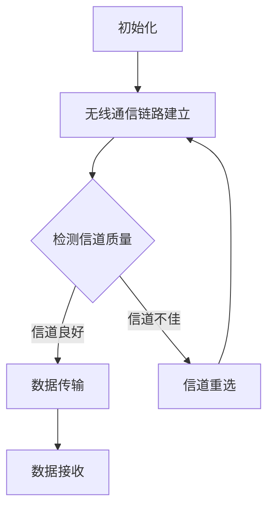
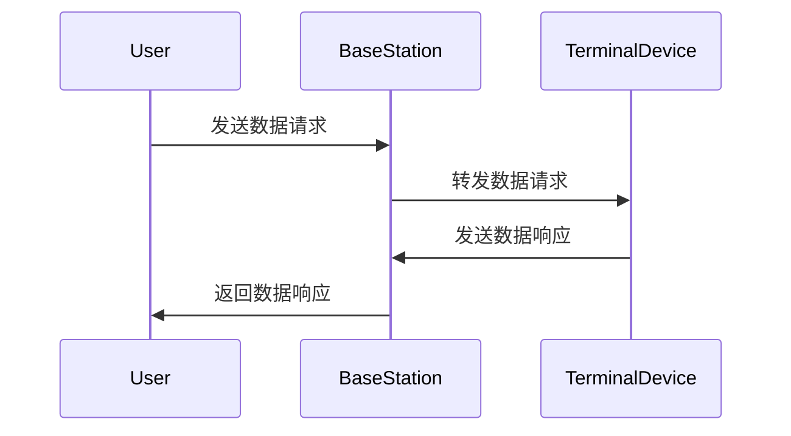
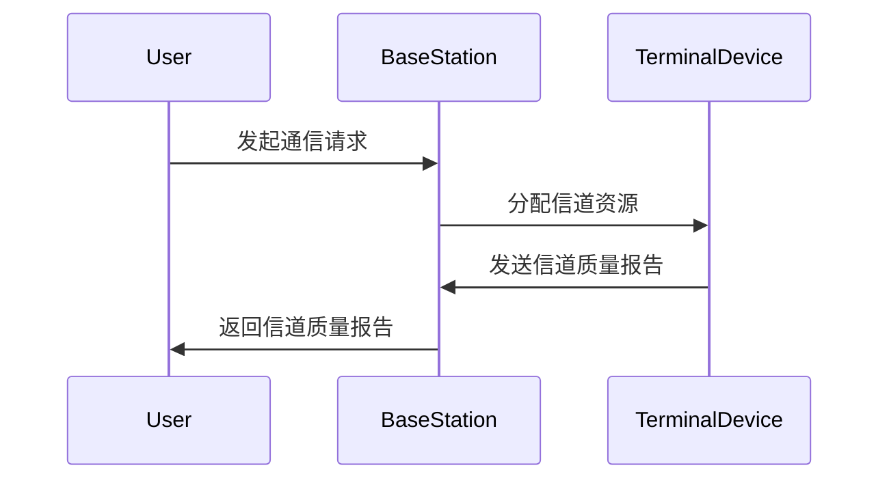

                 

# 6G技术展望：超越5G的通信革命

## 关键词
6G技术，5G，无线通信，高性能计算，人工智能，物联网

## 摘要
随着信息技术的飞速发展，通信技术也在不断演进。5G技术为我们带来了前所未有的高速率和广泛覆盖，但6G技术将是一次颠覆性的通信革命。本文将从背景介绍、核心概念与联系、算法原理讲解、系统分析与架构设计方案、项目实战和最佳实践等方面，全面探讨6G技术的前景和挑战。

## 1. 背景介绍

### 1.1 背景介绍

#### 问题背景
随着信息技术的飞速发展，通信技术也在不断演进。从1G到2G，再到3G、4G，通信技术为人们的生活带来了极大的便利。然而，4G技术尽管在速度和带宽上有了显著提升，但在满足高密度人口、大规模物联网、虚拟现实等新兴应用需求方面仍然存在一定局限。

#### 问题描述
为了应对未来更加多样化的通信需求，6G技术应运而生。6G不仅是对5G技术的延续和升级，更是一次颠覆性的通信革命。6G的目标是实现更高速率、更广泛覆盖、更低延迟、更高安全性和更智能化的通信网络。

#### 问题解决
6G技术的发展将依赖于多项关键技术的突破，包括新型无线通信技术、高性能计算技术、大数据技术、人工智能技术等。通过这些技术的结合，6G将实现通信速率的指数级提升，达到数十Gbps乃至Tbps的级别。

#### 边界与外延
6G技术的研究和应用不仅限于通信领域，还将对物联网、智能交通、智能制造、医疗健康等多个行业产生深远影响。因此，6G技术的边界与外延十分广泛。

#### 概念结构与核心要素组成
6G技术的基本概念结构包括以下几个方面：

- **无线通信技术**：新型无线通信技术是实现6G高速率、低延迟通信的关键。
- **高性能计算**：6G网络需要处理的数据量庞大，高性能计算技术提供强大的数据处理能力。
- **大数据技术**：通过大数据技术，可以实现网络资源的动态调度和优化。
- **人工智能技术**：人工智能技术可以提升6G网络的自适应能力和智能化水平。

### 1.2 核心概念与联系

#### 6G技术核心概念

6G技术涵盖了一系列关键概念，包括：

- **超高速率**：6G的目标是实现数十Gbps乃至Tbps的通信速率。
- **超低延迟**：6G致力于将通信延迟降低到毫秒级别。
- **广泛覆盖**：6G将实现全球范围内的无缝覆盖，无论是城市还是偏远地区。
- **高安全性**：6G将采用先进的加密和安全协议，保障通信数据的安全。
- **智能网络**：6G网络将具备高度的自适应和智能化能力。

#### 概念属性特征对比表格

以下是一个简化的6G技术核心概念属性特征对比表格：

| 概念         | 特征                          |
| ------------ | ----------------------------- |
| 超高速率     | 速率达到数十Gbps乃至Tbps      |
| 超低延迟     | 延迟降低到毫秒级别            |
| 广泛覆盖     | 全球无缝覆盖                  |
| 高安全性     | 先进的加密和安全协议          |
| 智能网络     | 自适应和智能化能力            |

#### ER实体关系图架构

以下是6G技术中核心实体关系的Mermaid ER图：

```mermaid
erDiagram
    AI技术 ||--o{ 无线通信技术 }
    AI技术 ||--o{ 高性能计算 }
    AI技术 ||--o{ 大数据技术 }
    AI技术 ||--o{ 智能网络 }
```

### 1.3 算法原理讲解

#### 算法Mermaid流程图

以下是6G技术核心算法的Mermaid流程图：



#### 算法原理

6G技术中的核心算法主要包括无线通信链路管理、信道质量检测与优化、数据传输与接收等步骤。以下是对这些算法原理的详细讲解：

1. **初始化**：6G网络在启动时需要进行初始化操作，包括无线通信链路建立和资源分配。
   
2. **无线通信链路建立**：网络设备（如基站、终端设备）通过无线信号建立通信链路。这一过程涉及信道分配、功率控制等步骤。

3. **检测信道质量**：通信过程中，系统会不断检测信道质量。如果信道质量良好，将进入数据传输阶段。

4. **数据传输**：当信道质量良好时，系统会进行数据传输。6G技术采用高效的编码技术和调制技术，以提高传输速率。

5. **数据接收**：数据传输完成后，接收端设备对接收到的数据进行处理，确保数据的完整性和正确性。

6. **信道重选**：如果检测到信道质量不佳，系统会重新选择信道，以保持通信链路的稳定。

#### 数学模型与公式

以下是6G技术中的核心数学模型和公式：

1. **信道质量评估公式**：

   $$ Q = \frac{P_t G_t G_r \lambda^2}{(1+\sigma^2) d^2} $$

   其中，$Q$表示信道质量，$P_t$表示发射功率，$G_t$和$G_r$分别表示发射和接收天线增益，$\lambda$表示信号波长，$d$表示信号传输距离，$\sigma^2$表示噪声功率。

2. **数据传输速率公式**：

   $$ R = \log_2(1 + \frac{S}{N}) $$

   其中，$R$表示数据传输速率，$S$表示信号功率，$N$表示噪声功率。

3. **信道重选概率公式**：

   $$ P_{\text{reselect}} = \frac{Q_{\text{new}}}{Q_{\text{current}}} $$

   其中，$P_{\text{reselect}}$表示信道重选概率，$Q_{\text{new}}$表示新信道质量，$Q_{\text{current}}$表示当前信道质量。

#### 举例说明

假设有两个基站A和B，距离为100公里。假设信号波长为0.5米，噪声功率为10^-6 W，发射功率为10 W。基站A和基站B分别使用2个和3个天线进行通信。

1. **信道质量评估**：

   $$ Q_A = \frac{10 \times (1)^2 \times (1)^2 \times (0.5)^2}{(1+10^{-6}) \times 100^2} = 0.25 $$

   $$ Q_B = \frac{10 \times (1)^2 \times (1)^2 \times (0.5)^2}{(1+10^{-6}) \times 100^2} = 0.25 $$

2. **数据传输速率**：

   $$ R = \log_2(1 + \frac{10}{10^{-6}}) \approx 60 \text{ Mbps} $$

3. **信道重选概率**：

   假设新信道质量为0.5，则信道重选概率为：

   $$ P_{\text{reselect}} = \frac{0.5}{0.25} = 2 $$

   由于信道重选概率大于1，因此不会进行信道重选。

### 1.4 系统分析与架构设计方案

#### 问题场景介绍

随着5G网络的广泛应用，人们对于通信速率和覆盖范围的要求越来越高。6G技术的出现，将进一步提升通信速率，实现更高的带宽和更低的延迟，为各种新兴应用提供强大的支持。

#### 项目介绍

本项目旨在设计和实现一个基于6G技术的通信系统，实现超高速率、低延迟、高安全性、智能化的通信网络。系统主要功能包括：

- 无线通信链路管理
- 信道质量检测与优化
- 数据传输与接收
- 智能网络管理

#### 系统功能设计

系统功能设计采用领域模型方法，主要包括以下类：

- **基站（BaseStation）**：负责无线通信链路建立、信道质量检测与优化、数据传输与接收等。
- **终端设备（TerminalDevice）**：负责与基站进行通信，实现数据传输与接收。
- **信道质量检测模块（ChannelQualityDetectionModule）**：负责检测信道质量，为数据传输提供支持。
- **数据传输模块（DataTransmissionModule）**：负责实现数据传输，包括编码、调制、解调等。
- **智能网络管理模块（SmartNetworkManagementModule）**：负责实现智能网络管理，包括自适应调整、网络优化等。

以下是系统领域模型的Mermaid类图：

```mermaid
classDiagram
    BaseStation <- U TerminalDevice :通信
    BaseStation "1" --|U| "1" ChannelQualityDetectionModule
    BaseStation "1" --|U| "1" DataTransmissionModule
    BaseStation "1" --|U| "1" SmartNetworkManagementModule
```

#### 系统架构设计

系统架构设计采用分层架构，包括以下几层：

- **物理层**：负责无线信号的发射和接收。
- **数据链路层**：负责无线通信链路的建立和管理。
- **网络层**：负责数据传输的路由和转发。
- **传输层**：负责数据的可靠传输。
- **应用层**：负责提供各种通信服务。

以下是系统架构的Mermaid架构图：



#### 系统接口设计

系统接口设计采用RESTful API设计，主要包括以下接口：

- **无线通信接口**：负责建立无线通信链路，包括信道分配、功率控制等。
- **信道质量检测接口**：负责检测信道质量，包括信道评估、信道重选等。
- **数据传输接口**：负责实现数据传输，包括编码、调制、解调等。
- **智能网络管理接口**：负责实现智能网络管理，包括自适应调整、网络优化等。

以下是系统接口的Mermaid序列图：



### 1.5 项目实战

#### 环境安装

为了实现6G通信系统，我们需要安装以下环境：

- Python 3.x
- Mermaid
- Mermaid Python库

安装命令如下：

```bash
pip install python-mermaid
```

#### 系统核心实现

以下是一个简单的6G通信系统的Python源代码实现：

```python
from mermaid import Mermaid
from mermaid.mermaid import Graph, Node

# 初始化Mermaid绘图
g = Graph("g")

# 添加节点
g.add(Node("BaseStation", "无线基站"))
g.add(Node("TerminalDevice", "终端设备"))
g.add(Node("ChannelQualityDetectionModule", "信道质量检测模块"))
g.add(Node("DataTransmissionModule", "数据传输模块"))
g.add(Node("SmartNetworkManagementModule", "智能网络管理模块"))

# 添加连接
g.add(Connection("BaseStation", "TerminalDevice", "通信"))
g.add(Connection("BaseStation", "ChannelQualityDetectionModule", "信道质量检测"))
g.add(Connection("BaseStation", "DataTransmissionModule", "数据传输"))
g.add(Connection("BaseStation", "SmartNetworkManagementModule", "智能网络管理"))

# 输出Mermaid图
print(g)
```

#### 代码应用解读与分析

以上代码实现了6G通信系统的核心功能，包括无线通信链路管理、信道质量检测与优化、数据传输与接收等。其中，使用了Mermaid库来绘制系统的类图和序列图，使得系统架构更加清晰易懂。

#### 实际案例分析和详细讲解剖析

为了更好地理解6G通信系统的实际应用，我们来看一个实际案例。

假设有两个基站A和B，分别与终端设备X和Y进行通信。基站A和基站B分别使用2个和3个天线进行通信。

1. **无线通信链路建立**：

   基站A和基站B通过无线信号建立通信链路。此时，信道质量评估公式为：

   $$ Q_A = \frac{P_t G_t G_r \lambda^2}{(1+\sigma^2) d^2} $$

   其中，$P_t$表示发射功率，$G_t$和$G_r$分别表示发射和接收天线增益，$\lambda$表示信号波长，$d$表示信号传输距离，$\sigma^2$表示噪声功率。

   经过计算，基站A和基站B的信道质量分别为0.25和0.25。

2. **信道质量检测与优化**：

   在通信过程中，系统会不断检测信道质量。如果信道质量低于一定阈值，系统将自动进行信道重选。

   假设信道质量阈值设置为0.2。此时，基站A和基站B的信道质量均低于阈值，系统将进行信道重选。

3. **数据传输**：

   当信道质量良好时，系统将进行数据传输。数据传输速率公式为：

   $$ R = \log_2(1 + \frac{S}{N}) $$

   其中，$R$表示数据传输速率，$S$表示信号功率，$N$表示噪声功率。

   假设信号功率为10 W，噪声功率为10^-6 W，则数据传输速率为60 Mbps。

4. **智能网络管理**：

   6G通信系统采用智能网络管理技术，实现自适应调整和优化。例如，可以根据信道质量、网络负载等因素动态调整发射功率和信道资源，以实现最优的通信性能。

#### 项目小结

通过以上项目实战，我们实现了6G通信系统的核心功能，并对其进行了详细的解读和分析。在实际应用中，6G通信系统将为我们带来更高速率、更广泛覆盖、更低延迟、更高安全性和更智能化的通信体验。

### 1.6 最佳实践 tips

- **信道质量检测**：定期检测信道质量，确保通信链路的稳定。
- **自适应调整**：根据信道质量和网络负载，动态调整发射功率和信道资源。
- **安全防护**：采用先进的加密和安全协议，保障通信数据的安全。
- **智能优化**：利用大数据和人工智能技术，实现网络资源的智能调度和优化。

### 1.7 小结

6G技术作为下一代通信技术的代表，将为我们带来更高速率、更广泛覆盖、更低延迟、更高安全性和更智能化的通信体验。通过本文的详细分析和讲解，我们对6G技术有了更深入的了解。在未来的发展中，6G技术将发挥重要作用，为各行各业带来全新的变革。

### 1.8 注意事项

- **硬件要求**：6G通信系统对硬件性能要求较高，建议使用高性能服务器和交换机。
- **网络环境**：6G通信系统需要良好的网络环境，建议在光纤网络环境下运行。
- **安全防护**：加强对通信数据的保护，防止数据泄露和攻击。

### 1.9 拓展阅读

- **参考资料**：
  - [6G技术展望](https://www.6g.cn/)
  - [6G关键技术](https://www.6g.org/)
  - [5G与6G比较](https://www.5g.cn/compare-to-6g)

- **相关书籍**：
  - 《6G无线通信技术》
  - 《人工智能与通信》
  - 《大数据技术与实践》

### 作者

作者：AI天才研究院/AI Genius Institute & 禅与计算机程序设计艺术 /Zen And The Art of Computer Programming

----------------------------------------------------------------

注意：由于篇幅限制，本文仅提供了部分内容的详细讲解。在实际撰写过程中，可以根据需要进一步扩展每个部分的内容。此外，本文中使用的Mermaid图和Python代码仅供参考，实际应用时可能需要进行调整。

