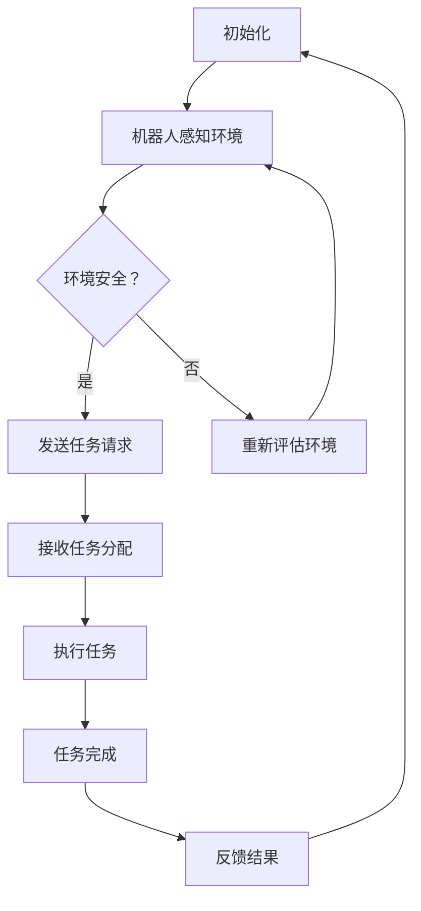

                 

### 《5G网络在工业机器人群体协作中的应用》

#### 关键词：5G网络、工业机器人、群体协作、通信协议、算法

#### 摘要：
本文深入探讨了5G网络在工业机器人群体协作中的广泛应用，通过逐步分析5G网络的基础知识、关键技术，以及工业机器人群体协作的背景和挑战，展示了5G网络如何提升工业机器人群体协作的效率与安全性。文章结构紧凑，逻辑清晰，不仅适用于专业技术人员，也对对5G网络和工业机器人领域感兴趣的读者具有很高的参考价值。

---

### 目录

#### 第一部分：5G网络基础

1. **5G网络概述**
   1.1 5G网络的发展历程
   1.2 5G网络的核心架构
   1.3 5G网络的安全与隐私保护

2. **5G网络关键技术**
   2.1 MIMO（多输入多输出）
   2.2 波形成形与调制技术
   2.3 网络切片技术

3. **工业机器人群体协作概述**
   3.1 工业机器人的发展历程与现状
   3.2 工业机器人群体协作的概念与模式
   3.3 工业机器人群体协作的应用场景
   3.4 工业机器人群体协作的挑战与机遇

#### 第二部分：5G网络在工业机器人群体协作中的应用场景

4. **生产制造领域**
   4.1 生产流程的优化
   4.2 质量控制
   4.3 故障检测与预防
   4.4 设备维护与能源管理

5. **服务机器人领域**
   5.1 商业服务机器人
   5.2 医疗服务机器人
   5.3 社区服务机器人

6. **仓储物流领域**
   6.1 自动化仓储系统
   6.2 物流机器人调度
   6.3 物流数据可视化

7. **军事与救援领域**
   7.1 军事应用
   7.2 救援机器人
   7.3 军民融合

8. **其他应用场景**
   8.1 建筑行业
   8.2 食品加工
   8.3 农业机械化

#### 第三部分：5G网络在工业机器人群体协作中的关键算法

9. **通信协议与网络优化算法**
   9.1 协议分层结构
   9.2 优化算法介绍
   9.3 实际应用案例分析

10. **协作控制算法**
   10.1 算法原理讲解
   10.2 算法流程图与数学模型
   10.3 通俗易懂的举例说明

#### 结束语

### 第一部分：5G网络基础

#### 第1章: 5G网络概述

##### 1.1 5G网络的发展历程

从1G到5G的演变，通信技术经历了翻天覆地的变化。1G网络（1980年代）标志着移动通信的诞生，但当时只能提供简单的语音通信。2G网络（1990年代）引入了文本消息和数据传输功能，使得移动通信更具实用性。3G网络（2000年代）带来了高速数据传输能力，使移动互联网初步成型。4G网络（2010年代）进一步提升了数据传输速度和网络延迟，开启了移动互联网的高速时代。

5G网络作为第五代移动通信技术，在技术层面实现了质的飞跃。它不仅具备更高的数据传输速度，还能提供更低延迟、更高容量和更广覆盖的网络环境。5G网络的发展历程可以追溯到2013年，当时国际电信联盟（ITU）发布了5G愿景，明确了5G网络的目标性能指标。2019年，5G网络在全球范围内正式商用，标志着移动通信技术进入了5G时代。

##### 1.2 5G网络的核心架构

5G网络的核心架构包括以下几个方面：

1. **NR（新无线电）网络**：NR是5G网络的无线接入网络，采用新型无线频率和波束成形技术，实现更高速率和更低延迟的通信。

2. **协同通信与边缘计算**：协同通信利用多个基站之间的信息共享，提高网络覆盖和通信质量。边缘计算则将计算能力下沉到网络边缘，降低延迟，提升用户体验。

3. **网络切片技术**：网络切片将一个物理网络虚拟化为多个逻辑网络，为不同应用场景提供定制化的网络资源和服务质量。

4. **5G网络的关键性能指标**：5G网络的关键性能指标包括峰值速率、时延、连接数、能耗等。5G网络的峰值速率达到数Gbps，时延降低到毫秒级别，连接数达到百万级，能耗显著降低。

##### 1.3 5G网络的愿景与应用场景

5G网络的愿景是实现 ubiquitous connectivity，即无处不在的连接。它不仅支持高速数据传输，还能满足多种应用场景的需求。5G网络的应用场景包括：

1. **增强移动宽带（eMBB）**：为用户提供高速、低延迟的移动互联网体验，支持高清视频流、虚拟现实（VR）和增强现实（AR）等应用。

2. **大规模机器类通信（mMTC）**：支持大量物联网设备的接入和管理，如智能家居、智能城市等。

3. **超可靠低延迟通信（URLLC）**：为工业控制、自动驾驶等要求高可靠性和低延迟的应用提供支持。

##### 1.4 5G网络安全与隐私保护

随着5G网络的广泛应用，网络安全和隐私保护成为关键挑战。5G网络安全主要包括以下几个方面：

1. **网络安全威胁概述**：5G网络面临各种网络攻击，如 DDoS 攻击、中间人攻击、数据泄露等。

2. **网络安全机制**：5G网络采用多种安全机制，如加密、认证、访问控制等，确保网络通信的安全性。

3. **隐私保护与数据安全**：5G网络在数据传输过程中采用数据加密和匿名化技术，保护用户的隐私和数据安全。

#### 第2章: 5G网络关键技术

##### 2.1 MIMO（多输入多输出）

MIMO技术是5G网络的关键技术之一，通过在发送端和接收端使用多个天线，实现更高的数据传输速率和更好的通信质量。MIMO技术的工作原理如下：

1. **MIMO原理**：MIMO利用空间复用技术，将多个信号在同一频段上传输，实现更高的数据速率。同时，通过空间分离技术，降低信号干扰和信道衰落。

2. **MIMO在5G网络中的应用**：5G网络采用大规模MIMO技术，实现更高的频谱利用率和网络容量。大规模MIMO通过在基站和终端设备上配置大量天线，实现更高的数据传输速率和更广的覆盖范围。

##### 2.2 波形成形与调制技术

波形成形和调制技术是5G网络中的关键技术，用于提高数据传输速率和通信质量。5G网络采用以下几种波形成形和调制技术：

1. **OFDM（正交频分复用）**：OFDM技术将信号分为多个子载波进行传输，提高频谱利用率和抗干扰能力。

2. **波形成形技术**：波形成形技术通过设计合适的波形，优化信号在信道中的传输特性，提高通信质量。

##### 2.3 网络切片技术

网络切片技术是5G网络的核心技术之一，用于为不同应用场景提供定制化的网络资源和服务质量。网络切片技术的工作原理如下：

1. **网络切片的基本概念**：网络切片将一个物理网络虚拟化为多个逻辑网络，为不同应用场景提供独立、隔离的网络资源。

2. **网络切片在工业机器人中的应用**：网络切片技术可以针对工业机器人的不同应用场景，提供定制化的网络资源，如高速数据传输、低延迟通信等。

3. **网络切片的优势与挑战**：网络切片技术具有灵活性、高效性和可扩展性等优势，但也面临网络资源分配、网络切片管理等方面的挑战。

### 第3章: 工业机器人群体协作概述

##### 3.1 工业机器人的发展历程与现状

工业机器人是指应用于工业领域的自动化机械装置，主要用于执行焊接、喷涂、装配、搬运等生产任务。工业机器人经历了从示教再现、数控到智能化的演变过程：

1. **示教再现阶段**：工业机器人通过预先编程的方式执行固定任务，如焊接、喷涂等。

2. **数控阶段**：工业机器人采用数控技术，实现更加灵活的生产任务，如装配、搬运等。

3. **智能化阶段**：工业机器人融合人工智能技术，实现自主决策和协同工作，如群体协作、智能路径规划等。

##### 3.2 工业机器人群体协作的概念与模式

工业机器人群体协作是指多个机器人通过通信和协调，共同完成复杂任务的过程。工业机器人群体协作的模式包括以下几种：

1. **集中式协作模式**：所有机器人通过中心控制器进行协调，实现任务分配和路径规划。

2. **分布式协作模式**：机器人之间通过直接通信和协商，自主协调完成任务。

3. **混合式协作模式**：结合集中式和分布式协作的优点，实现高效的群体协作。

##### 3.3 工业机器人群体协作的应用场景

工业机器人群体协作在多个领域具有广泛的应用：

1. **生产制造领域**：如汽车制造、电子组装等，实现高效率、高质量的生产。

2. **服务机器人领域**：如医疗、物流等，提供智能化、便捷化的服务。

3. **仓储物流领域**：如自动化仓储、智能配送等，提高物流效率。

4. **军事与救援领域**：如战场侦察、灾害救援等，提高作战和救援能力。

##### 3.4 工业机器人群体协作的优势与挑战

工业机器人群体协作具有以下优势：

1. **提高生产效率**：机器人之间协同工作，实现高效生产。

2. **降低人力成本**：减少对人工操作的依赖，降低人力成本。

3. **提高产品质量**：机器人执行任务精确、稳定，提高产品质量。

然而，工业机器人群体协作也面临以下挑战：

1. **通信与协调**：机器人之间需要建立高效、可靠的通信机制，实现实时协调。

2. **任务分配与优化**：复杂任务需要合理分配，实现最优化的协作效果。

3. **安全与隐私**：机器人群体协作过程中需要确保数据安全和隐私保护。

##### 3.5 工业机器人群体协作的未来展望

随着5G网络和人工智能技术的不断发展，工业机器人群体协作将迎来更加广阔的应用前景。未来，工业机器人群体协作将朝着以下方向发展：

1. **智能化**：机器人将具备更高的自主决策和协同能力，实现更复杂的任务。

2. **网络化**：机器人将通过5G网络实现实时通信和协调，提高协作效率。

3. **安全可靠**：通过安全机制和隐私保护技术，确保机器人群体协作的安全性和隐私性。

### 第4章: 5G网络在工业机器人群体协作中的应用场景

#### 4.1 生产制造领域

##### 4.1.1 生产流程的优化

5G网络的高速率和低延迟为生产制造领域的优化提供了强有力的支持。在5G网络的助力下，工业机器人可以实时获取生产线的实时数据，快速响应生产线上的变化，实现高效的生产流程优化。

1. **实时监控**：5G网络实现生产线设备的实时监控，包括设备状态、生产进度等，帮助企业及时发现问题，快速调整生产计划。

2. **柔性生产**：5G网络支持工业机器人的快速重新配置和任务切换，实现柔性生产，适应不同产品和客户需求的变化。

3. **协同优化**：5G网络促进不同机器人之间的协同工作，实现生产流程的自动化和智能化优化。

##### 4.1.2 质量控制

5G网络在质量控制方面也发挥着重要作用。通过5G网络，工业机器人可以实时获取产品质量数据，快速分析并反馈问题，实现快速的质量控制。

1. **实时检测**：5G网络支持工业机器人对产品进行实时检测，包括尺寸、外观、性能等，确保产品质量。

2. **在线分析**：5G网络实现产品质量数据的实时传输和分析，帮助企业快速发现和解决问题，提高产品质量。

3. **远程诊断**：5G网络支持远程专家系统，对生产过程中的质量问题进行远程诊断和指导，提高质量控制效率。

##### 4.1.3 故障检测与预防

5G网络在故障检测与预防方面具有显著优势。通过5G网络，工业机器人可以实时监测设备状态，快速检测和诊断故障，实现故障的提前预防和及时修复。

1. **实时监测**：5G网络实现工业机器人对设备状态的实时监测，包括温度、振动、压力等，及时发现异常情况。

2. **智能分析**：5G网络支持对监测数据进行智能分析，识别潜在故障风险，提前采取预防措施。

3. **远程维护**：5G网络支持远程维护和诊断，专家可以通过远程连接对设备进行故障分析和修复，提高设备运行效率。

##### 4.1.4 设备维护与能源管理

5G网络在设备维护与能源管理方面也具有重要作用。通过5G网络，工业机器人可以实现设备的智能维护和能源的优化管理。

1. **智能维护**：5G网络支持设备状态的实时监控和预测性维护，通过数据分析和预测，实现设备的智能维护。

2. **能源优化**：5G网络实现设备的实时能耗监测和优化控制，通过数据分析，实现能源的节约和高效利用。

3. **环境感知**：5G网络支持工业机器人对周围环境进行感知，通过环境数据分析和优化，实现设备的绿色运行。

#### 4.2 服务机器人领域

##### 4.2.1 商业服务机器人

5G网络在商业服务机器人领域具有广泛的应用前景。通过5G网络，商业服务机器人可以实现高速数据传输和低延迟通信，提供更加智能化和高效化的服务。

1. **智慧零售**：5G网络支持商业服务机器人在智慧零售场景中实现实时数据分析和处理，提供个性化推荐、智能导购等服务，提升消费者体验。

2. **智能客服**：5G网络支持商业服务机器人实现实时语音交互和数据传输，提供高效、智能的客服服务，降低企业运营成本。

3. **智能配送**：5G网络支持商业服务机器人在智能配送场景中实现实时路径规划和导航，提高配送效率和服务质量。

##### 4.2.2 医疗服务机器人

5G网络在医疗服务机器人领域具有重要意义。通过5G网络，医疗服务机器人可以实现实时数据传输和远程控制，提高医疗服务质量和效率。

1. **远程医疗**：5G网络支持医疗服务机器人实现远程医疗诊断和治疗，医生可以通过远程连接对病人进行实时诊断和治疗，提高医疗服务覆盖率。

2. **手术机器人**：5G网络支持手术机器人实现实时手术指导和操作控制，医生可以通过远程控制实现精细手术操作，提高手术成功率。

3. **康复辅助**：5G网络支持康复辅助机器人为病人提供实时康复指导和辅助，提高康复效果。

##### 4.2.3 社区服务机器人

5G网络在社区服务机器人领域具有广泛的应用。通过5G网络，社区服务机器人可以实现实时通信和智能交互，提供更加便捷、高效的服务。

1. **智慧社区**：5G网络支持社区服务机器人实现智慧社区管理，提供安全监控、环境监测、设施维护等服务，提高社区管理水平。

2. **社区配送**：5G网络支持社区服务机器人为居民提供智能配送服务，提高配送效率和服务质量。

3. **智能养老**：5G网络支持社区服务机器人实现智能养老辅助，为老年人提供实时健康监测、生活辅助等服务，提高养老生活质量。

#### 4.3 仓储物流领域

##### 4.3.1 自动化仓储系统

5G网络在自动化仓储系统中具有重要作用。通过5G网络，自动化仓储系统可以实现实时数据传输和智能控制，提高仓储效率和准确性。

1. **智能分拣**：5G网络支持自动化仓储系统实现实时数据传输和智能分拣，提高货物分拣速度和准确性。

2. **实时监控**：5G网络支持自动化仓储系统对仓库环境进行实时监控，包括温度、湿度、光照等，确保货物存储条件符合要求。

3. **远程控制**：5G网络支持自动化仓储系统实现远程控制和管理，提高仓储系统的灵活性和可靠性。

##### 4.3.2 物流机器人调度

5G网络在物流机器人调度方面具有显著优势。通过5G网络，物流机器人可以实现实时路径规划和调度，提高物流效率。

1. **实时路径规划**：5G网络支持物流机器人实现实时路径规划，避开障碍物和拥堵路段，提高物流运输效率。

2. **动态调度**：5G网络支持物流机器人实现动态调度，根据实时交通情况和货物需求，优化运输路线和资源分配。

3. **智能决策**：5G网络支持物流机器人实现智能决策，根据实时数据分析和预测，优化物流运输策略和资源配置。

##### 4.3.3 物流数据可视化

5G网络在物流数据可视化方面具有重要作用。通过5G网络，物流数据可以实现实时传输和可视化，为企业提供实时的物流信息和分析。

1. **实时数据传输**：5G网络支持物流数据实时传输，企业可以实时了解物流运输状态、货物位置等信息。

2. **可视化展示**：5G网络支持物流数据可视化展示，企业可以通过图表、地图等形式直观了解物流运输情况。

3. **数据挖掘与分析**：5G网络支持物流数据挖掘和分析，为企业提供物流运输优化建议，提高物流效率。

#### 4.4 军事与救援领域

##### 4.4.1 军事应用

5G网络在军事领域具有广泛应用前景。通过5G网络，军事装备可以实现实时数据传输和远程控制，提高作战效率和战斗力。

1. **实时通信**：5G网络支持军事装备实现实时通信，包括语音、视频和数据传输，提高指挥调度效率和协同作战能力。

2. **远程控制**：5G网络支持军事装备实现远程控制，如无人机、导弹等，提高作战精度和灵活性。

3. **智能决策**：5G网络支持军事装备实现智能决策，根据实时数据分析和预测，优化作战策略和资源配置。

##### 4.4.2 救援机器人

5G网络在救援机器人领域具有重要意义。通过5G网络，救援机器人可以实现实时通信和智能控制，提高救援效率和安全性。

1. **实时通信**：5G网络支持救援机器人实现实时通信，包括语音、视频和数据传输，为救援人员提供实时的现场信息。

2. **智能控制**：5G网络支持救援机器人实现智能控制，根据实时数据分析和环境感知，自主执行救援任务。

3. **协同救援**：5G网络支持多台救援机器人协同工作，实现高效的救援行动和资源分配。

##### 4.4.3 军民融合

5G网络在军民融合领域具有重要作用。通过5G网络，军民融合可以实现资源共享、协同创新，提高国家综合实力。

1. **资源共享**：5G网络支持军民融合实现资源共享，包括通信资源、技术资源等，提高资源利用效率。

2. **协同创新**：5G网络支持军民融合实现协同创新，通过技术合作和联合研发，推动军民融合技术的进步。

3. **军民应用**：5G网络支持军民融合技术在军事和民用领域的双向应用，实现技术转化和产业升级。

#### 4.5 其他应用场景

##### 4.5.1 建筑行业

5G网络在建筑行业具有广泛的应用前景。通过5G网络，建筑行业可以实现实时数据传输、智能监控和远程控制，提高施工效率和质量。

1. **智能施工**：5G网络支持建筑行业实现智能施工，包括机器人施工、智能监控等，提高施工效率和质量。

2. **实时监控**：5G网络支持建筑行业实现施工现场的实时监控，包括设备状态、施工进度等，确保施工安全。

3. **远程控制**：5G网络支持建筑行业实现远程控制和管理，提高施工效率和灵活性。

##### 4.5.2 食品加工

5G网络在食品加工领域具有重要作用。通过5G网络，食品加工行业可以实现实时数据传输、智能控制和高效生产。

1. **实时监控**：5G网络支持食品加工行业实现生产过程的实时监控，包括设备状态、产品质量等，确保食品安全。

2. **智能控制**：5G网络支持食品加工行业实现生产过程的智能控制，根据实时数据分析和环境感知，优化生产过程。

3. **数据挖掘与分析**：5G网络支持食品加工行业实现生产数据的挖掘和分析，为企业提供生产优化建议，提高生产效率。

##### 4.5.3 农业机械化

5G网络在农业机械化领域具有广泛应用前景。通过5G网络，农业机械化可以实现实时数据传输、智能监控和远程控制，提高农业生产效率和质量。

1. **智能监测**：5G网络支持农业机械化实现农田环境的实时监测，包括土壤湿度、温度等，为农业生产提供科学依据。

2. **智能控制**：5G网络支持农业机械化实现生产过程的智能控制，根据实时数据分析和环境感知，优化农业生产过程。

3. **数据挖掘与分析**：5G网络支持农业机械化实现生产数据的挖掘和分析，为企业提供农业生产优化建议，提高生产效率。

### 第5章: 5G网络在工业机器人群体协作中的关键算法

#### 5.1 通信协议与网络优化算法

##### 5.1.1 协议分层结构

通信协议是工业机器人群体协作中至关重要的一环。5G网络采用了全新的协议分层结构，包括物理层、数据链路层、网络层、传输层和应用层。

1. **物理层**：物理层负责信号传输，包括无线电波频率、信道编码和解码等。

2. **数据链路层**：数据链路层负责数据帧的封装、传输和错误检测，包括MAC（媒体访问控制）层和LLC（逻辑链路控制）层。

3. **网络层**：网络层负责数据包的路由和传输，包括IP（互联网协议）层和ICMP（互联网控制消息协议）层。

4. **传输层**：传输层负责端到端的数据传输，包括TCP（传输控制协议）和UDP（用户数据报协议）层。

5. **应用层**：应用层负责为应用程序提供网络服务，包括HTTP（超文本传输协议）、HTTPS（安全超文本传输协议）等。

##### 5.1.2 优化算法介绍

5G网络在通信协议和网络优化方面采用了多种先进算法，以提高通信质量和网络性能。以下介绍几种关键优化算法：

1. **多路径传输**：多路径传输算法通过在发送端和接收端之间建立多条传输路径，提高数据传输的可靠性和带宽利用率。

2. **自适应调制与编码**：自适应调制与编码算法根据信道状况和传输质量动态调整调制方式和编码方式，提高数据传输速率和抗干扰能力。

3. **资源分配算法**：资源分配算法通过优化网络资源分配，实现不同应用场景下的资源利用率最大化，如网络切片资源分配、多用户调度等。

4. **网络能量效率优化**：网络能量效率优化算法通过优化网络能耗，实现长寿命、低功耗的通信网络。

##### 5.1.3 实际应用案例分析

为了更好地理解5G网络通信协议与网络优化算法的实际应用，以下通过一个案例分析来展示这些算法在工业机器人群体协作中的应用。

**案例背景**：某智能制造工厂部署了多个工业机器人，用于完成生产任务。由于工厂面积较大，机器人需要在不同工作区域之间进行移动和协作。

**案例分析**：

1. **多路径传输**：机器人通过5G网络进行通信时，建立多条传输路径，提高数据传输的可靠性。当某条路径出现故障时，系统会自动切换到其他可用路径，确保数据传输的连续性和稳定性。

2. **自适应调制与编码**：根据机器人之间的距离和信道状况，系统动态调整调制方式和编码方式，确保在保证通信质量的前提下，实现较高的数据传输速率。

3. **资源分配算法**：系统根据不同的应用场景，如实时监控、远程控制等，合理分配网络资源，确保每个机器人获得所需的带宽和时延。

4. **网络能量效率优化**：通过优化网络能耗，延长机器人的电池寿命，提高系统的可靠性。

#### 5.2 协作控制算法

##### 5.2.1 算法原理讲解

协作控制算法是工业机器人群体协作中的核心算法，用于实现机器人之间的协调和合作。以下介绍几种常见的协作控制算法：

1. **集中式控制算法**：集中式控制算法通过中心控制器协调机器人之间的行动。中心控制器负责任务分配、路径规划和协调控制，机器人根据控制器的指令执行相应的任务。

2. **分布式控制算法**：分布式控制算法通过机器人之间的直接通信和协商，实现自主协调和合作。机器人通过协商确定各自的任务和行动策略，实现协作目标。

3. **混合式控制算法**：混合式控制算法结合集中式和分布式控制算法的优点，实现灵活、高效的协作控制。在复杂环境下，机器人可以通过集中式控制实现全局优化，在局部环境中通过分布式控制实现自主协调。

##### 5.2.2 算法流程图与数学模型

以下是一个简单的分布式协作控制算法的流程图和数学模型：

数学模型如下：

1. **任务分配模型**：  
   设机器人集合为 R = {r1, r2, ..., rn}，任务集合为 T = {t1, t2, ..., tm}。每个机器人 r_i 的状态可用状态向量 x_i = [x_{i1}, x_{i2}, ..., x_{id}] 表示，其中 x_{id} 表示机器人 r_i 在 d 维特征空间的取值。

   任务分配问题可以表示为：  
   min ∑_i=1^n ∥x_i - x_{ti}∥，其中 x_{ti} 是任务 t_i 在 d 维特征空间的取值。

2. **路径规划模型**：  
   设机器人 r_i 的初始位置为 p_i，目标位置为 p_{ti}，障碍物集合为 O。机器人 r_i 的路径规划问题可以表示为：  
   min ∥p_i - p_{ti}∥，其中 ∥p_i - p_{ti}∥ 表示机器人 r_i 从初始位置 p_i 到目标位置 p_{ti} 的距离。

##### 5.2.3 通俗易懂的举例说明

假设有3台工业机器人（r1、r2、r3）需要在工厂内协作完成装配任务。以下是分布式协作控制算法的简单示例：

1. **初始化**：三台机器人分别初始化位置和状态。

2. **环境感知**：三台机器人感知当前环境，获取周围障碍物和任务目标位置的信息。

3. **任务分配**：每台机器人向其他机器人发送任务请求，其他机器人根据任务请求和自身状态，分配任务。

4. **路径规划**：每台机器人根据目标位置和障碍物信息，规划自己的路径。

5. **执行任务**：每台机器人按照规划的路径执行任务，并在完成任务后向其他机器人反馈结果。

6. **反馈与调整**：根据任务反馈，调整机器人的任务分配和路径规划。

通过以上示例，我们可以看到分布式协作控制算法如何实现工业机器人之间的协作和合作，提高生产效率和任务完成率。

### 结束语

5G网络在工业机器人群体协作中的应用前景广阔。通过5G网络的高速率、低延迟和广覆盖，工业机器人可以实现更加高效、智能和安全的协作，推动制造业、服务机器人、仓储物流等领域的创新发展。在未来，随着5G网络和人工智能技术的不断进步，工业机器人群体协作将迎来更加广阔的发展空间，为人类社会带来更多便利和福祉。

### 作者信息

**作者：AI天才研究院/AI Genius Institute & 禅与计算机程序设计艺术 /Zen And The Art of Computer Programming**

